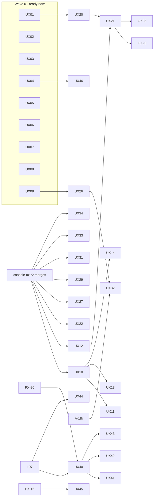

# Polaris Key experience specification: one system for the console and the portal

**Status:** proposed, 2026-10-05. **Owner brief (verbatim, 2026-10-05):** "Let's work hard on making a
great experience for both our users and administrators. Do a full UX path on BOTH to standardize how
we do things (ie. login can likely be based on the same form for admin), update our experiences to
be modern, comprehensive, informative but not overly so. Remove extraneous text and subtitles which
are self-explanatory. Consolidate things that seem redundantly separated. Use your and your
designers' best judgement." and "This design pass should also focus on the _experience_ -- how
things are laid out, the process of doing things, etc etc. We should put a hard focus on not just a
usable but a delightful experience for both our users and admins. The customer portal generally
speaking quite user friendly, but likely could be better as well. The admin console likely needs a
bit more help."

**What this document is.** The single experience spec for both apps: the console
(`packages/admin/src/console`) and the customer portal (`packages/admin/src/portal`), plus the pages
the Worker renders (`packages/worker/src/core/brandHtml.ts`) and the emails. It leads with
**journeys** (§0), because the audits found well-built pages joined by weak paths, and the console
needs that help most. Then come the shared system (§1–§9), the consolidation list (§10), the copy
pass (§11), the mockups (§12) and the work packages (§13).

**Relationship to the other specs.** [BRAND.md](BRAND.md) stays canonical for tokens, accents,
marks and type. [ADMIN.md](ADMIN.md) and [PORTAL.md](PORTAL.md) stay canonical for screen-level
detail this document does not touch. Where they disagree, **this document wins**. §14 lists the
sections it supersedes; each of those docs now points here.

**Evidence.** Five audits run on 2026-10-05 against `brand/console-ux-r2` @ 44327986 (the newest
console) and `main` @ 8c28e023 (the portal), at 1440x900 and 390x844, dark and light. Screenshots are
under `/private/tmp/claude-501/ux-unify/` (`admin-setup/`, `operate/`, `console-layout/`,
`portal-journeys/`, `shared/`). Audit finding ids are cited as **AS** (admin setup), **AO** (admin
operate), **CL** (console layout), **PJ** (portal journeys) and **SH** (shared), for example
AS 2.2 or PJ B4.

**Standing owner rules** (unchanged, restated so this document can be read alone):

- Sidebar section headers have no icon; every item has an icon. Only the active section is open.
- Navigation scrolls to the top. A product click opens its Overview. Cmd/Ctrl+K toggles the palette.
- No implementation-status or "coming soon" copy anywhere.
- Settings controls and values are right-aligned. Rows in a list are equal height. No trailing page
  space.
- **Pills only for issues**, right-aligned. No healthy-state pills.
- Platform is hidden inside a product.
- The customer portal is "Polaris Key", never "Polaris Key Portal". Portal nav: Library (default)
  and Discover, with Activate License as a right-aligned modal.
- One login card: a logo-only Apple/Google/Steam row, identifier-first email, passkey, "Have a
  license key?". App passthrough uses the same card with a persistent "<App> wants you to sign in"
  header.
- Real license keys look like `pkey_<product>_<22>`. Everything is CSP-safe. The layout lint
  (`packages/admin/e2e/layoutProbe.ts`) stays at zero.

---

## Contents

- [0. Journeys first](#0-journeys-first)
  - [0.1 The diagnosis](#01-the-diagnosis)
  - [0.2 Console information architecture](#02-console-information-architecture)
  - [0.3 The joins: palette, attention, launch path, cross-links](#03-the-joins-palette-attention-launch-path-cross-links)
  - [0.4 Console setup journeys](#04-console-setup-journeys)
  - [0.5 Console operate journeys](#05-console-operate-journeys)
  - [0.6 Portal journeys](#06-portal-journeys)
  - [0.7 Moments of delight](#07-moments-of-delight)
- [1. Principles](#1-principles)
- [2. Copy rules](#2-copy-rules)
- [3. The shared component inventory](#3-the-shared-component-inventory)
- [4. Page anatomy](#4-page-anatomy)
- [5. Navigation chrome](#5-navigation-chrome)
- [6. Tables, lists, forms and settings rows](#6-tables-lists-forms-and-settings-rows)
- [7. Confirmations, status, pills and toasts](#7-confirmations-status-pills-and-toasts)
- [8. The shared sign-in](#8-the-shared-sign-in)
- [9. Empty, loading and error states](#9-empty-loading-and-error-states)
- [10. Consolidation list](#10-consolidation-list)
- [11. The copy pass](#11-the-copy-pass)
- [12. Mockups](#12-mockups)
- [13. Implementation plan](#13-implementation-plan)
- [14. Superseded sections in ADMIN.md and PORTAL.md](#14-superseded-sections-in-adminmd-and-portalmd)

---

## 0. Journeys first

### 0.1 The diagnosis

Every audit reached the same verdict from a different side. **Each page is well built; the paths
between pages are where the experience fails.**

- **The console is organised by service; operators work by goal.** Shipping one build touches Core,
  Release, Update and Distribution (AS 2). Storefront setup touches five places (AS 5.1). A support
  ticket crosses License and Core and loses its place on the way back (AO J1.6). Each hop recolours
  the page, so a journey feels like moving between apps (AO cross-cutting).
- **Nothing says what comes next.** After creating a product, three checklist items appear; release,
  CI, update feed, storefronts, sign-in and packages never do (AS 2.1). After Services saves, the
  sidebar silently grows (AS 2.4).
- **Dead ends and broken promises.** "Link a repository later" exists nowhere (AS 1.5). "Auto-issue
  in Enrollment" points at a page with no auto-issue (AS 3.1). "See Add a credential below" points at
  nothing (AS 5.3). Portal: "Add it in Account → Sign-in methods" (PJ B2); Discover counts leading to
  an empty page (PJ B1).
- **Lists that disagree.** Home's attention list, Overview's attention list and the Setup card each
  show a different set (AS cross-cutting 1, AO cross-cutting, CL 5).
- **The palette knows pages, not things.** It cannot find a person, license, key, device or release
  (AO J1.1), nor hidden features ("release" returns nothing when Release is off, AS 2.5).
- **No celebration.** First product, first license, first release and first activation each end in
  a toast at best (AS 8, PJ C).
- **The portal is calm but incomplete.** The pages exist and read well; the passthrough, the
  provider row, second-device setup and a first-activation moment do not (PJ A). Several screens
  contradict each other (PJ B3–B6).

The fixes below are therefore mostly **joins**: one palette that finds things and does things, one
attention model, one launch path, record pages that open on status, drawers that keep their place,
and one sign-in card. The rest is consolidation and copy.

### 0.2 Console information architecture

The section model stays: it is how products are configured, and ADMIN.md §2.3's rejected moves still
hold. What changes is the **number of destinations** (34 product pages become 23) and the rule that
**each concept has one home; every other page links to it** (CL 1).

**Inside a product** (Platform hidden; only the active section open; every item has an icon):

| Section      | Items (icon)                                                                                                     | Was                                                                                                         |
| ------------ | ---------------------------------------------------------------------------------------------------------------- | ----------------------------------------------------------------------------------------------------------- |
| Core         | Overview (home) · Devices (laptop) · Keys & secrets (key) · Activity (history) · Settings (settings)             | Services folds into Settings as its first section (CL 1.9)                                                  |
| License      | Licenses (id card) · Tiers (layers) · Enrollment (users)                                                         | Enrollment gains Registration (from Services) and **Auto-issue** with group → tier mapping (AS 3.1, CL 1.3) |
| Config       | Catalog (book) · Profiles (user) · Edge mint (code)                                                              | "Edit catalog" is a mode of Catalog, not a nav item                                                         |
| Release      | Releases (package) · Channels (arrows) · Deliverables (disc) · Compatibility (grid)                              | Update simulator becomes a Compatibility tab; Content keys moves to Keys & secrets                          |
| Distribution | Rollouts (play) · Health (activity) · Storefronts (store) · Outlets (globe) · Packages (package) · Access (lock) | Matrix + Rollouts merge; App Store + Commerce + Outlet credentials become Storefronts; 9 items become 6     |
| Update       | Update feed (refresh)                                                                                            | "Feed" renamed; its metadata-access picker moves to Distribution → Access (CL 1.2)                          |
| Identity     | Sign-in & portal (shield)                                                                                        | Portal + Sign-in merge (AS 4.4, CL 1.9); gains **View portal**                                              |

**Outside a product:** Home (home) · Products (grid) · Activity (history, new: every product and the
platform, with a Product facet, AO J6.2) and the **Platform** group: Status (activity) · Settings
(settings) · Store connections (store) · Package feeds (package). Status merges Deployment and
Operations (AO J5.1, CL 1.5); Platform Settings keeps only editable controls; platform history lives
in Activity filtered to Platform.

**Names that stop colliding** (CL 1.1): "Outlets & feeds" → **Outlets**; product "Package feeds" →
**Packages**; Update "Feed" → **Update feed**; Platform keeps **Package feeds** (it is the
instance-wide registry policy).

**What a hop no longer does.** The section accent still marks where you are, but only in the sidebar
marker, the page's primary button and links (BRAND §5.4). The avatar no longer takes the section
accent (CL 2), and drawers opened from another section keep the **origin's** accent and route, so a
license's device drawer stays License-green over the license (§0.5 O1).

### 0.3 The joins: palette, attention, launch path, cross-links

These four mechanisms carry most journeys. Each has one implementation shared by every page that
needs it.

#### J-1 · The palette finds things and does things (`ui/CommandPalette`)

Cmd/Ctrl+K toggles it in both apps (the portal keeps its trigger hidden below 8 products but the
shortcut always works, SH 1.10). One component with **sources**:

| Source     | Console                                                                                                                                                           | Portal                                         |
| ---------- | ----------------------------------------------------------------------------------------------------------------------------------------------------------------- | ---------------------------------------------- |
| Pasted key | A string matching `pkey_<product>_<22>` resolves straight to its license, in any product, before anything else                                                    | Opens Activate with the key filled             |
| Entities   | Licenses by name, email, id or key; devices by id or label; releases by version; **people** by email (every license and device across products); products by name | Products by name                               |
| Actions    | Create license, Create tier, Turn on <Service>, Issue a CI token, Start a rollout, Halt <version>…, Assign an App Store app, Set secret <NAME>…, Resync           | Activate a license, Approve a new device, Help |
| Pages      | The current product's pages first, then other products, then Platform **only on a query match**                                                                   | Library, Discover, Account sections            |
| Recent     | The last 5 records opened                                                                                                                                         | The last 5 products opened                     |

- An entity row reads like a sentence and carries its issue: "**Mara Fennick** · Tidewater Studio ·
  Pro · 3 of 3 devices · refusing new devices", with a right-aligned issue pill when it has one.
- Hidden features are findable: with Release off, "release" returns **Turn on Release**, which opens
  Settings → Services with that switch focused and the chain explained (AS 2.5).
- Entity search is server-side across all products: `GET /admin/api/search?q=` (new; key lookups use
  the key hash, never the key). Results are capped at 20 per kind.

#### J-2 · One attention model (`GET /admin/api/attention`, `ui/AttentionList`)

One server-computed list feeds Home, product Overview, the product switcher's badge, the sidebar's
section dot and the palette's empty state (AO cross-cutting, CL 5). Every item has a **kind**, a
**severity** (danger or warning; healthy is absence), a **subject link** and **one fix action**.

| Kind                                                     | Severity | Fix action (inline where possible)               |
| -------------------------------------------------------- | -------- | ------------------------------------------------ |
| Rollout halted (auto or manual), with the reason         | danger   | Review release (opens the release Status tab)    |
| Smoke failed on the newest deploy; cron or queue stalled | danger   | Open Status                                      |
| Secret missing that blocks a running service             | warning  | Set secret… (opens the dialog prefilled, AS 1.8) |
| Licenses expiring within 7 days (count)                  | warning  | View licenses (pre-filtered)                     |
| Licenses refusing devices at the seat limit (spike)      | warning  | View licenses (At seat limit facet)              |
| Edge-mint recipe awaiting approval                       | warning  | Review                                           |
| Store review rejected or build processing failed         | danger   | Open the storefront step that fixes it (AS 5.7)  |
| Signing key rotation ready to activate                   | warning  | Activate (opens the rotation stepper)            |

Rules: rows are grouped by product on Home (CL 5); the pill on a row is the severity word only when
the title does not already say it; an empty list renders one quiet line ("Nothing right now"), never
a tile of zeros. Setup steps that block something (a missing secret) appear here **and** in the
launch path; steps that block nothing appear only in the launch path.

#### J-3 · The launch path (`ui/LaunchPath`, server `setup` model)

Replaces the Overview "Setup" checklist and Home's "Setup complete" count with **one** model computed
by the Worker from the services the product runs (AS 2.1, AS cross-cutting 1). It sits at the top of
Overview for a product that is not launched, **above** the tiles, and the zero-tiles collapse into
nothing until there is data.

| Phase   | Steps (shown only when the service is on, except "Turn on")                                                                  |
| ------- | ---------------------------------------------------------------------------------------------------------------------------- |
| Basics  | Product created · Signing key                                                                                                |
| License | Publish the catalog · Create tiers (offers "Free and Pro" starters, AS 3.2) · First license                                  |
| Ship    | Turn on Release (if off) · Allow the release workflow (trusted publisher or CI token) · First signed release · Update window |
| Reach   | Storefronts _(optional)_ · Customer sign-in and auto-issue _(optional)_ · First package _(when Packages is on)_              |

- Each step has a state (done, next, waiting, optional, skipped) and **finishes in a drawer over
  Overview** (`ui/Drawer` with the step's form), or deep-links to the exact dialog, never to a page
  top. "Waiting" steps poll (first release, first package) and complete themselves.
- The product switcher shows "Launch · 5 of 9" under the product name until done.
- When every required step is done: one "**<Product> is launched**" line with Dismiss; it never
  returns. Optional steps that remain move to their pages' empty states.

#### J-4 · Cross-links and context

- **People, licenses, devices and releases link to each other everywhere they appear.** A device
  shows its holder's name, not `lic_1 · seat 1` (AO J1.8). Activity names people and things, with
  ids as secondary text. "by u1" resolves to a name (AO J2.10).
- **Drawers keep their route.** A record opened from another record opens as a drawer on a nested
  route (`…/licenses/lic_1/devices/dev_9`), keeps the origin's section and accent, and Escape returns
  to the origin (AO J1.6).
- **Per-record history.** License, device, key and release records embed their last 5 events with
  "All activity" linking to a **server-filtered** Activity view (AO J1.11, J6.1).
- **Next-step prompts.** Every success that unlocks something says so once, in its toast or its
  result: "Services saved · Next: allow the release workflow →" (AS 2.4).
- **Inline fixes on errors.** An error names the fix and offers it: a field error jumps to the field;
  "the GitHub App isn't installed on acme/beatgrid" carries **Install the GitHub App**; manifest
  errors list each problem with its file and path (AS 1.4). HTTP codes are never shown.

### 0.4 Console setup journeys

Each journey below is a storyboard: **before → after**, the steps, where guidance appears, what is
automated or defaulted, and the feedback and delight moments. Click counts are minimum paths on the
audit fixtures.

#### S1 · Create a product (AS J1)

| Before (8 clicks, 6 screens, 1 required field)                                                      | After (3 actions, 1 screen)                                                                                     |
| --------------------------------------------------------------------------------------------------- | --------------------------------------------------------------------------------------------------------------- |
| Source → Basics (slug before name) → Catalog (raw JSON) → Defaults → Review → Result → Open product | **One screen:** Name → Slug (derived, checked live) → Start from: Nothing / A GitHub repository → Create <Name> |

1. **Name first; the slug follows** (`tonebox`), with an availability check as you type
   ("tonebox is taken: try tonebox-app") (AS 1.2).
2. **Start from** is a two-option segmented control. Choosing a repository shows a field with live
   checks **before** Create: "App installed · manifest valid", or the fix: "Install the Polaris Key
   GitHub App on acme/tonebox" with a button (AS 1.6). Manifest problems list each line with file
   and path ("3 problems in .pkey/product: fix them in one commit, then check again") (AS 1.4).
3. **Advanced** (collapsed): license defaults and the admin label. The raw catalog textarea is gone;
   the catalog is edited in the Catalog editor (AS 1.1, 1.3).
4. **Enter creates.** There is no result page and no toast: the operator lands on the product's
   Overview with a one-time **welcome** ("Tonebox is ready", the new signing key with a gold Signed
   indicator and copy) above the launch path (AS 1.7).

**Link a repository later** becomes real: Settings → Repository → **Link repository…** runs the same
checks (AS 1.5). Until it ships, the promise copy is removed.

Mockup: [storyboard](experience/13-story-setup-desktop-dark.png), frames 1–2.

#### S2 · First signed release and update feed (AS J2)

| Before (≥ 12 clicks, 5 hops, 3 sections, then leave the console)                                                            | After (one drawer, then push a tag)                                                                                                                     |
| --------------------------------------------------------------------------------------------------------------------------- | ------------------------------------------------------------------------------------------------------------------------------------------------------- |
| Overview (silent) → palette "release" (nothing) → Services (3 switches) → Releases (dead end) → Keys & secrets → CI → leave | Launch path "Ship" → drawer: Turn on Release (Distribution and Update follow) → Allow the release workflow → copy the step → **waiting…** → celebration |

- **The service chain is automatic** (AS 2.3): turning on Update says "Also turns on Release and
  Distribution" and does it; turning off Release lists what goes with it in the confirm. Services is
  one list with one save bar (or autosave per switch), and each row has a one-line description.
- **The Releases empty state is a guided panel** (AS 2.2; [mockup](experience/10-console-empty-desktop-dark.png)):
  app installed ✓/✗, trusted publisher ✓/✗ with **Allow workflow…** inline, the workflow step with
  the slug filled in, and a live "Waiting for the first release…" row. A manual product offers
  **Link a repository** or **Issue a CI token** there. CI publishing stays in Keys & secrets (the
  single vault) but is **edited from here** through the same dialog.
- **Update feed** shows the compatibility window's real values (or the defaults it will use), and
  collapses Endpoints to "Discovery URL: the only one your app needs" until a release exists
  (AS 2.7).
- **Delight:** the first release lands with a one-time Overview banner, "0.1.0 is live on stable ·
  signed by tonebox-2026-a · published in 3 min 12 s", and the next action, **Roll it out** or **Add
  to storefronts** (AS 2.8).

Mockup: storyboard frames 3–4.

#### S3 · Licenses, tiers and auto-issue (AS J3)

- Licenses are already good (5 clicks, 2 fields); keep the key panel, the uncopied-close guard and
  "Create another" (AS 3.5).
- **Comboboxes create what they need** (AS 3.2): Tier offers "New tier…", Profile offers "New
  profile…", and a product with no tiers offers **Create Free and Pro**.
- **Terms step** leads with Tier and Expiry; everything else is under **Overrides**; Effective
  policy is a sticky summary at the dialog's foot (AS 3.4).
- **The holder email explains itself in one line:** "Ada can add this license in Polaris Key by
  signing in with ada@example.com" (AS 3.3).
- **Auto-issue exists** (AS 3.1): License → Enrollment → **Auto-issue** holds who qualifies (any
  signed-in account, or mapped groups), the tier each gets, and a live preview ("Ada signing in with
  Google gets Pro"). Group → tier mapping moves here from Sign-in. Sign-in & portal's Discover row
  links to it by name.
- **Delight:** the first license's result offers "Try it: activate this key with the SDK quick
  start" with the snippet one click away (AS 3.6).

#### S4 · Services, catalog and identity (AS J4)

- **Catalog entry form** shows Key, Kind, Type and Default; Validation and Form hints collapse.
  Label derives from Key (`audio.bufferSize` → "Buffer size"); Type is guessed from the default
  (AS 4.1). The header carries one "Draft v9" chip (AS 4.2).
- **Sign-in & portal** is one page: Provider → Methods → Portal modules → Branding, with **View
  portal** in the header that opens the product's portal page in a new tab (AS 4.4, CL 1.9).
  Branding either gets a path to set it or the row goes.
- **Manifest-owned settings** show one consistent `SourceBadge` ("From .pkey/product") that links to
  the file on GitHub, and one **Edit in repo** action. After a resync, the repo-sync drawer shows a
  diff of what changed (AS 4.5).

#### S5 · Storefronts (AS J5)

| Before (5 places)                                                                          | After (1 page, the same 4-step flow per store)                                       |
| ------------------------------------------------------------------------------------------ | ------------------------------------------------------------------------------------ |
| Platform → Store connections · Outlet credentials · Outlets & feeds · App Store · Commerce | Distribution → **Storefronts**: one card per store: Connect → App → Listing → Submit |

- Built on the A-18j plan model (`storefronts/plan.ts`: setup → listing → assets → store → submit).
  A-18j is backend-only, so this is the console design for it (AS 5.1).
- **Connect** uses a platform credential when one exists (team key, service account), or the
  product's own; credentials show only keys (CL 1.1).
- **App** is picked on the card from the platform's app list ("Tonebox · com.acme.tonebox"), or
  created; Platform → Store connections keeps the inventory and the reverse view (AS 5.2). The assign
  dialog is neutral ("Assign Godot Demo"), one sentence, details under "What changes" (AS 5.5).
- **Listing** and **Submit** keep the strong 7-step App Store flow as the App Store card's
  expanded view; Commerce (IAP) is that card's "Products" tab. Store errors carry their fix
  ("Export compliance unanswered" → jumps to step 2) (AS 5.7).
- Connecting a store still happens outside the console (deliberate, secrets stay in GitHub). The
  card shows the expected Issuer ID and Key ID format first, and **Re-check** turns it Connected
  with a one-time moment (AS 5.4). "See Add a credential below" is gone (AS 5.3).
- **Delight:** "Submitted for review · we'll show Apple's answer here and on Overview" (AS 5.8).

Mockup: storyboard frame 5.

#### S6 · Package feeds and tokens (AS J6)

- **Producer side:** a feed's Setup gets "Publish to this feed": the CI step, scope and auth
  (trusted publisher or token), then "Waiting for the first package…" (AS 6.1).
- **Turn on** inline per row on the Packages overview; "This feed has no settings yet." goes
  (AS 6.2). The product-level packages switch moves from Services to the Packages header (AS 6.4).
- "Enabled" and "Public" pills become plain text; issue pills ("Rebuild needed") stay right-aligned
  (AS 6.3).
- **New token** is one click: label "CI pull" and 90-day expiry prefilled (AS 6.5).

### 0.5 Console operate journeys

#### O1 · "My device limit is hit" / "my license doesn't work" (AO J1)

| Before (~6 hops, 2 section switches)                                                                                                                                               | After (3 steps, no section switch)                                                                                                   |
| ---------------------------------------------------------------------------------------------------------------------------------------------------------------------------------- | ------------------------------------------------------------------------------------------------------------------------------------ |
| Guess the product → License → Licenses → search (no key search) → record (opens on an edit form) → Devices tab → device (jumps to Core › Devices) → Escape lands on the fleet list | ⌘K, paste the key → license **Status** → Deauthorize the stale device in place (or Override the limit) → toast with a reply to paste |

1. **⌘K resolves the key** across products and shows the issue on the row ("3 of 3 devices ·
   refusing new devices"), with actions **Free a seat…** and **Raise device limit…**
   ([storyboard](experience/14-story-support-desktop-dark.png) frame 1).
2. **The license opens on Status** (AO J1.4). One **health line** answers "why would this license be
   refused right now?" (AO J1.10), computed from what the Worker already knows: disabled, expired,
   version outside the range, channel not included, seats full, offline window exceeded. The line
   names the last refusal ("Mara tried to activate Studio Laptop 4 min ago") and the fix.
3. **Devices are inline, stale first**, the stalest highlighted, with **Deauthorize…** as a visible
   button (AO J1.7). The seat meter sits in the panel header.
4. **Effective policy** shows Device limit with its source ("3 from Pro") and **Override** (AO J1.5):
   a license-level value for the existing `deviceLimit` entitlement, with the over-limit warning the
   Terms form already has. No document-shape change; if the admin API shape changes, it goes through
   plan mode (CLAUDE.md).
5. **A device opens as a drawer over the license** (`…/licenses/lic_1/devices/dev_9`) and closing it
   returns to the license (AO J1.6).
6. **Confirm** states the consequence in two lines; the button repeats the verb.
7. **Toast:** "Old iMac deauthorized · Mara's next activation will work", with **Copy a reply to
   Mara** (a short, plain message the operator can paste into the support thread) and **View in
   activity** ([mockup](experience/12-console-toast-desktop-dark.png)).

Also: the license list searches by key and has an **At seat limit** facet with a right-aligned issue
pill on those rows (AO J1.2, J1.9); the Status facet replaces the four stat tiles (CL 2). The holder
email links to the **person view** (a drawer listing every license and device for that email across
products, AO J1.3).

#### O2 · A bad release: investigate, halt, roll back (AO J2)

| Before (3 sections, once per outlet)                                                                                                       | After (one record)                                                                                                            |
| ------------------------------------------------------------------------------------------------------------------------------------------ | ----------------------------------------------------------------------------------------------------------------------------- |
| Releases (no state) → record (opens on files) → Distribution › Rollouts → Halt per outlet → Channels → Pin / Lower floor → Releases → Yank | Attention row "2.4.0 halted on Direct" → release **Status** (where live, why halted) → **Halt everywhere…** or **Roll back…** |

- An auto-halt is a **danger** attention item on Home and Overview with its reason: "crash rate 4.1%
  over 2% threshold" (AO J2.1–2.2).
- The **release record opens on Status**: where it is live (channel × outlet), rollout %, devices on
  this version, the halt reason with a link to the evidence, and header actions **Halt
  everywhere…** (danger, multi-outlet confirm) and **Roll back…** (AO J2.3–2.4;
  [mockup](experience/11-console-confirm-desktop-dark.png)).
- **Roll back** is a guided dialog that chooses between pin (stop offering 2.4.0, offer 2.3.2),
  rollback floor and yank, and says what each does to devices already on 2.4.0 (AO J2.5).
- Rollout rows open their record; the phone keeps rollout % and channel (AO J2.6, J2.8). Overview's
  Release tile says "Live on stable 2.3.2 · 2.4.0 halted at 10%" (AO J2.9).

#### O3 · Rotate a signing key (AO J3)

A three-step strip on Keys & secrets: **Prepared → Trust window (countdown) → Activate**, with
**Retire old key** as an optional fourth. Activate is the primary and enables itself when the window
ends; break-glass stays in the overflow (AO J3.1). "Prepare signing key" is disabled while a rotation
is in progress, with the reason (AO J3.2). After activation, a reassurance line: "92% of devices
fetched the new trust in the last 24 h" when the Worker can count it (AO J3.3). The typed
confirmation stops repeating itself (AO J3.4).

#### O4 · Change a setting and know what it affected (AO J4)

- **Impact preview** on defaults that bind live clients: lowering the default device limit shows
  "612 licenses inherit this; 41 already use 4 or more and will refuse new devices" before save, and
  the save becomes **Review and save…** (AO J4.1; [mockup](experience/07-console-settings-desktop-dark.png)).
- The **save bar is sticky** at the viewport bottom (AO J4.3).
- The save toast offers **View change**; product Activity shows before → after diffs like Platform
  history already does (AO J4.2).
- Platform Settings shows label and value; provenance (env var, deploy var, default) moves into one
  `SourceBadge` popover (AO J4.4).

#### O5 · Check platform health after a deploy (AO J5)

One **Status** page: a headline ("v0.8.6 deployed 2 days ago · smoke passed · every check healthy"),
then **only exceptions** among health checks (cron, heartbeats, queues, bindings, connectors) with
one "All checks passed" line otherwise, then deploy history (a failed smoke shows its reason), then
database and bindings once. Healthy items are not shouted green (CL 5). Failed crons and stalled
consumers reach Home's attention list (AO J5.4). Freshness labels and health use the same clock
(AO J5.5).

#### O6 · Review activity (AO J6)

Activity search and filters are **server-side** (AO J6.1). A global **Activity** page covers every
product and the platform with a Product facet; product Activity is its filtered lens (AO J6.2).
Entries name people and things and show diffs; "Details" appears only when there is a diff or payload
(AO J6.5).

### 0.6 Portal journeys

The portal's pages are mostly right. The work is completing the missing journeys and removing the
contradictions.

#### P1 · First sign-in from an app, through activation and download (PJ A, C)

| Before                                                                                                    | After (5 steps, one card)                                                                                                                                                         |
| --------------------------------------------------------------------------------------------------------- | --------------------------------------------------------------------------------------------------------------------------------------------------------------------------------- |
| No passthrough: `/authorize` shows "Manage your copy of Saltwind"; the key and the app are separate trips | Card with "**Tidewater Studio** wants you to sign in" held on every step → email → 6-digit code → **Add Tidewater Studio to your account** (key) → "It's yours" → back to the app |

1. The card header is the PORTAL §4.7 header, held through every step, with the lock footer
   ([storyboard](experience/15-story-portal-desktop-dark.png) frame 1).
2. Code step: six cells, submits on the sixth digit; "Or open the link in the email. Keep this tab
   open." (frame 2).
3. **New step, "Add <App> to your account"**: shown when the signed-in account has no license for
   the requesting app and the product accepts keys. The KeyField names the product as soon as the
   key parses and catches a cut-short key (frame 3). "I bought it with another email" leads to the
   account-linking path (PORTAL §4.11).
4. **It's yours**: one celebration (a star burst under `prefers-reduced-motion: no-preference`, a
   static check otherwise), the product row with "In your library", **Return to <App>**, and an
   automatic return after 3 s (frame 4).
5. Next time the person opens Polaris Key, the new product is **first in the Library, marked "Just
   added"** for 24 hours, with its download as the tile's lead (frame 5).
6. The product page has **one lead**: Download for this Mac in the header; other platforms below with
   **Change platform**; "This device" marked; **Set up another device** in Devices (frame 6;
   [mockup](experience/09-portal-product-desktop-dark.png)).

#### P2 · Activate a key in the portal (PJ C)

- Cut-short keys get their message: "This key is cut short. After tidewater\_ come 22 characters,
  and this has 10." The help line disappears once there is a verdict. The product shows by its
  presentation name, never the slug.
- **Done** leads with **Download for macOS** (the detected build) and offers Open as secondary; a
  library that was empty gets "Your first product!" once; closing returns to the Library with the new
  tile briefly highlighted.
- Signed out with `/activate?key=…`: the card header shows the product ("Sign in to add
  Mossgarden").

#### P3 · Download for my platform (PJ C, B5)

- One OS source of truth: the server's `recommended`, refined by UA-CH where available; the label and
  the build always agree, and "Recommended for your Mac (Apple silicon)" says how it knows.
- One Download per build in view: the header leads; the Get it card lists the other platforms;
  **Change platform** remembers the choice. Mac with two builds: "Not sure? Apple menu → About This
  Mac → Chip".
- SHA-256 moves into a row disclosure. On a phone, desktop file lists collapse behind "All
  platforms" and the lead is **Email me the download**.
- No downloads: "Get it from <developer>" with their link; never a "View details" that points at the
  page you are on (7 of 12 tiles today).
- `not_hosted` extras read "Get it from Steam" (or the developer), not "Not included" (PJ B3).

#### P4 · Devices and the device limit (PJ C, B4, B6)

- One device source for the product page and the free-device flow; the status shows once (the
  header issue pill, not a green "Active" beside it).
- "This device" marker; Remove toasts say "You can add it back by signing in on it".
- "+1 not using a seat" becomes "1 signed-out device" with a disclosure.
- The free-device success header says "Back to Orbit Survey" only when an app sent the person
  (`return=` present).
- **Set up another device** card: platform buttons, then "open it and sign in as mara@…", or
  "Email me the link".

#### P5 · Account (PJ A, C, SH 1.6)

- Sign-in methods gains Connect (Apple, Google, Steam), Add email, passkeys and sessions when G27
  lands; until then, no copy points at it (PJ B2).
- Theme is a right-aligned `SegmentedControl` row ("System · Dark · Light") in the account menu and
  on Account; Delete account is a `DangerAction` that opens the typed-confirmation `ConfirmDialog`;
  **Download my data** sits beside it.
- The deletion reassurance says plainly: products bought with this email come back when you sign up
  again with it; keep your keys for anything else.

#### P6 · Errors and dead ends (PJ B1, B2, C)

- Discover counts and links render only when Discover can show the items (PX-16), never before.
- Library load errors name Polaris Key (not "the developer") and give a reference id.
- An expired or used magic link renders the **same card** server-side with **Send a new link**
  (POSTs to resend to the same address) and keeps `returnTo` and `/activate?key=` context
  ([mockup](experience/04-signin-worker-desktop-dark.png)).

### 0.7 Moments of delight

Each appears **once per product (console) or per account (portal)**, respects
`prefers-reduced-motion`, and stays quiet afterwards. Motion uses `--pk-duration-slow` and
`--pk-ease-enter`; the burst is the stationary star scattered, in the section accent, never gold.

| Moment                      | App     | What happens                                                                               |
| --------------------------- | ------- | ------------------------------------------------------------------------------------------ |
| Product created             | Console | Welcome header with the new signing key and the launch path                                |
| First license               | Console | Result offers "Try it" with the SDK quick start                                            |
| First catalog publish       | Console | "Catalog v1 is live · your app reads it on next launch" with the snippet                   |
| First release               | Console | Overview banner with version, signer and publish time; Roll it out                         |
| Store connected / submitted | Console | The card turns Connected; "Submitted for review" with the store's answer later on Overview |
| Product launched            | Console | One "<Product> is launched" line; the launch path never returns                            |
| Support fix                 | Console | Toast with "Copy a reply to <holder>"                                                      |
| First activation            | Portal  | "It's yours" with the product, then auto-return or Download                                |
| New product in the library  | Portal  | "Just added" ring on the tile for 24 h                                                     |
| First product in a library  | Portal  | "Your first product!" on the Done step                                                     |

---

## 1. Principles

1. **Journeys before pages.** Every page answers "what next?": a next step after success, a fix
   after failure, a path out of an empty state.
2. **One home per concept.** A setting, key, policy or list lives on exactly one page; every other
   page links to it by name.
3. **Say it once.** A subtitle that restates the title, a description that restates the control, and
   a footnote that restates the confirm are removed (§2).
4. **Status by exception.** Healthy is silence. Issues are pills (danger, warning, info),
   right-aligned. Neutral facts are text.
5. **Fix where you find it.** Errors and attention items carry the fix: a field focus, a prefilled
   dialog, a deep link to the exact step. Never "(422 bad_request)".
6. **Keep context.** Drawers sit over the route they came from; closing returns there. The palette
   opens anything from anywhere.
7. **Defaults do the work.** Derive slugs and labels, chain services, prefill tokens, offer starter
   tiers, detect the platform.
8. **Celebrate firsts, once** (§0.7).
9. **One kit, two voices.** Both apps use the same components (§3); the console is dense and
   precise, the portal warm and spacious. Density changes spacing and control height, never the
   component.

## 2. Copy rules

**When text earns its place.** Keep a line only if it states:

- a **consequence** ("Devices already on 2.4.0 keep it");
- an **irreversible fact** ("Shown once");
- a **constraint** ("From 1 to 365 days");
- the **one missing fact** the person needs to act ("Use the email you bought Tidewater Studio
  with").

Remove text that restates the title, defines the label, explains the implementation ("answers
not-configured on the wire"), describes the obvious ("Download links are made fresh…"), or promises a
future ("not available here yet").

**Subtitles.** A page has no subtitle by default. One is allowed when it carries live state the
header otherwise would not show ("Synced from harbor-audio/tidewater 2 hr ago") or a consequence of
the page as a whole (Access: "The appcast, the download routes and the portal all use this"). Section
descriptions follow the same rule.

**Empty states.** One sentence for the trigger ("Appears after a device activates"), one action. A
first-run explainer may add a single definition sentence; nothing more.

**Voice.**

| Rule                   | Use                                                                   | Not                                             |
| ---------------------- | --------------------------------------------------------------------- | ----------------------------------------------- |
| Retry                  | Try again                                                             | Retry                                           |
| Cancel                 | Cancel                                                                | Keep it, Keep my account, Never mind            |
| Theme                  | System · Dark · Light                                                 | Match my device                                 |
| Spelling               | license, recognized (US, both apps)                                   | licence, recognised                             |
| Confirm buttons        | Repeat the verb and object: "Halt 2 rollouts", "Deauthorize Old iMac" | Confirm, OK, Yes                                |
| Errors                 | What happened, then the fix: "tonebox is taken. Try tonebox-app."     | "The server refused this (422 bad_request) — …" |
| Secrets                | Never shown again.                                                    | Four different phrasings of it                  |
| People and things      | Names, ids as secondary text                                          | `lic_1 · seat 1`, "by u1"                       |
| Sign-in surfaces       | Sign in · Sign in again                                               | Back to sign-in                                 |
| Headings               | Sentence case, no full stop                                           | "Your sign-in link has expired."                |
| Console operator voice | Precise, short, technical words allowed when they are the UI's words  | Marketing, exclamation marks                    |
| Portal customer voice  | Warm, plain, second person; no jargon (magic link, seat, token)       | "Missing magic-link token."                     |

**Keep / remove / rewrite examples** (the full table is §11):

| Text                                                                                  | Verdict | Becomes                               |
| ------------------------------------------------------------------------------------- | ------- | ------------------------------------- |
| "Values are write-only: Polaris Key never returns them. To check one, set it again."  | Rewrite | "Never shown again."                  |
| "A service that is off answers not-configured on the wire and leaves the navigation." | Remove  | (each service row's one-line purpose) |
| "Changes made here survive a resync until you revert them." (Channels)                | Keep    | It is non-obvious and consequential   |
| "Your library of games and apps from developers who use Polaris Key."                 | Remove  |                                       |
| "Open it on this device and this page signs you in by itself."                        | Rewrite | "Keep this tab open."                 |

## 3. The shared component inventory

Every component below has **one implementation** in `packages/admin/src/ui/` used by both apps. The
legacy `src/components/ui/*` kit is deleted (SH 0.4, §2). "Density" is a prop or a context value
(`compact` for the console, `comfortable` for the portal), never a fork.

| Component                                                                               | Single implementation (from)                                                              | Used by                                                                               | Notes                                                                                               |
| --------------------------------------------------------------------------------------- | ----------------------------------------------------------------------------------------- | ------------------------------------------------------------------------------------- | --------------------------------------------------------------------------------------------------- |
| `AuthCard` (+ `MethodsStep`, `CodeStep`, `KeyStep`, `ReturnStep`)                       | `portal/components/signin/LoginCard.tsx` → `ui/auth/`                                     | Portal, console, passthrough; Worker twin in `brandHtml`                              | §8                                                                                                  |
| `ProviderRow`, `Glyphs`                                                                 | `portal/components/signin/ProviderRow.tsx`, `portal/components/Glyphs.tsx` → `ui/`        | AuthCard, Account, console Store connections                                          | Logo-only, one row, 1–3 buttons                                                                     |
| `BootScreen`                                                                            | `console/shell/StatePages.tsx` + `portal StarScreen` → `ui/BootScreen`                    | Both apps                                                                             | Compact lockup, quiet spinner, visually hidden live text; its error state is the AuthCard           |
| `PageHeader` (`size="default" \| "display"`)                                            | `console/components/PageHeader.tsx` → `ui/`                                               | Every page; portal Library and Product use `display`                                  | §4                                                                                                  |
| `Section` (alias `Panel`, `variant="settings" \| "content"`)                            | `console/templates/Settings.tsx` `SettingsSection`, console `Panel`, portal `SectionCard` | Both apps                                                                             | Radius `xl`, header `px-5 py-3.5`, elevation-1 in light only; legacy `Card` deleted                 |
| `SettingsRow`, `DangerZone`, `DangerAction`                                             | `console/templates/Settings.tsx` → `ui/settings.tsx`                                      | Console settings pages, portal Account                                                | Label and help left, control right                                                                  |
| `SectionRail`                                                                           | portal `product/SectionNav.tsx` → `ui/`                                                   | Console long settings pages, portal Account and Product                               | Scroll-spy, `aria-current="location"`, no "ON THIS PAGE" label; only when the page is > 2 viewports |
| `DataTable`                                                                             | `ui/data-table` (existing)                                                                | Console lists; portal long lists                                                      | §6; a `Columns · Density · Export` **View** menu only above 10 rows                                 |
| `FilterBar` with `FilterChip` (counted facets)                                          | new in `ui/` (replaces stat tiles that filter)                                            | Console lists; portal library toolbar                                                 | Phone: chips scroll horizontally; a "Filters (n)" sheet for the rest                                |
| `StatStrip`                                                                             | console `templates/Dashboard.tsx` tiles → `ui/StatStrip`                                  | Overview, Home, Health                                                                | Static facts only, never filters; hidden while all zeros                                            |
| `AttentionList`                                                                         | console `pages/global/attention.ts` + portal `AttentionShelf` → `ui/`                     | Home, Overview (console); Library (portal)                                            | §0.3 J-2                                                                                            |
| `LaunchPath`                                                                            | new in `ui/` (replaces Overview `useChecklist`)                                           | Overview, product switcher badge                                                      | §0.3 J-3                                                                                            |
| `CommandPalette`                                                                        | `console/shell/CommandPalette.tsx` + portal `JumpPalette` → `ui/`                         | Both apps                                                                             | §0.3 J-1; full-screen on phones                                                                     |
| `AccountMenu` + `Avatar`                                                                | console `UserMenu` + `ThemeMenu`, portal `AccountMenu`/`Avatar` → `ui/`                   | Both apps                                                                             | Theme as an inline 3-way row inside the menu; tinted-initials avatar (never the section accent)     |
| `Drawer` (routed)                                                                       | `ui/Drawer` + a `useRoutedDrawer` hook                                                    | Console records, launch-path steps                                                    | Keeps the origin route and accent                                                                   |
| `ConfirmDialog` and `ConfirmPanel`                                                      | `ui/ConfirmDialog`; `ConfirmPanel` shares its internals                                   | Both apps                                                                             | §7                                                                                                  |
| `Toast` (`AppToaster`)                                                                  | `ui/toast.tsx` mounted directly (the legacy `components/ui/Toaster` wrapper goes)         | Both apps                                                                             | §7                                                                                                  |
| `StatusPill`                                                                            | `ui/StatusPill` (existing; success renders as quiet text)                                 | Both apps                                                                             | Only danger, warning, info as pills; portal `ProductStatusPill onArt` stops plating success         |
| `EmptyState` (`kind="first-run" \| "filtered" \| "not-found" \| "service-off"`, `hero`) | `ui/EmptyState`; console `StatePages` re-based on it; legacy `EmptyState` deleted         | Both apps                                                                             | §9                                                                                                  |
| `ErrorState` with a `copy` resolver                                                     | `ui/ErrorState` + `lib/errorCopy` (one interface, a portal voice table)                   | Both apps; portal `ErrorPanel` deleted                                                | "Try again", reference id, Copy details                                                             |
| `KeyField`, `KeyMask`, `KeyDisplay`, `OneTimeSecretPanel`                               | portal `KeyField`/`KeyMask` → `ui/`, beside existing `KeyDisplay`/`OneTimeSecretPanel`    | Portal activation, passthrough; console create-license and offline-activation dialogs | `OneTimeSecretPanel` owns the "Shown once" line                                                     |
| `Input`, `Select`, `Button` (`size="sm" \| "md" \| "lg"`)                               | `ui/` (existing)                                                                          | Both apps                                                                             | `lg` = 48 px bold for the auth card and focused flows; className height overrides removed           |
| `SegmentedControl`, `Switch`, `Checkbox`, `RadioCards`                                  | `ui/` (existing; legacy copies deleted)                                                   | Both apps                                                                             | Swatches use tokens, not hex                                                                        |
| `SourceBadge`                                                                           | `ui/SourceBadge` (existing)                                                               | Console manifest-owned rows; Platform Settings provenance                             | Icon + short text; detail in a popover; links to the file on GitHub                                 |
| `SignedBadge`                                                                           | `ui/SignedBadge` (existing)                                                               | Both apps                                                                             | Gold means signed (BRAND §4.5)                                                                      |
| `PersonDrawer`                                                                          | new in `console/components/`                                                              | Console (from any holder email)                                                       | Every license and device for one email                                                              |
| `HealthLine`                                                                            | new in `ui/` (a callout with one fix action)                                              | License and release Status tabs, Platform Status                                      | Warning or danger when there is an issue; one quiet line otherwise                                  |
| `Celebration`                                                                           | new in `ui/` (star burst + one-shot persistence key)                                      | §0.7 moments                                                                          | Reduced motion renders a static check                                                               |

Type scale, defined once in `ui` tokens (SH 1.14): `display` 40/30 px (portal Library and Product
titles only), `title` 24 px (every other h1, both apps), `section` 16–18 px (panel headers), `row` 14
px bold. Arbitrary sizes (`text-[1.875rem]`, `text-[0.9375rem]`) are removed.

## 4. Page anatomy

Every page in both apps is built from the same four parts, in order.

1. **Header** (`PageHeader`): one h1; at most one primary action and two secondaries, the rest in an
   overflow menu (the license record's "Mint offline bundle…" moves into ⋯, CL 2). No subtitle unless
   §2 allows one; live state (freshness, sync) sits as muted meta text beside the title. Records add a
   back link above the title and an identity line (holder, tier, masked key, cross-links).
2. **Status line** (records and Status pages only): `HealthLine`, the answer to "is this working,
   and if not, what do I do?".
3. **Content**: sections (`Section`) or a table. Tabs only on records; a record's first tab is
   **Status** (what is true now), never an edit form or an inventory (AO J1.4, J2.3).
4. **Feedback**: toasts at the bottom right (bottom, full width on phones), a sticky save bar for
   dirty forms.

**Rules.**

- **No dashboard tile repeats a list.** If the attention list says "1 halted", no tile says
  "Halted 1" (CL 5).
- **No settings shortcut in a header** when the sidebar has it (Overview's "Settings" button goes,
  CL 2).
- **Export** lives in the table's View menu (or the header for pages that are a single table), never
  inside a card toolbar (CL 2).
- **No trailing space:** pages end at their last section; the save bar is the only sticky footer.
- **Loading** uses skeletons shaped like the content; **empty**, **error** and **not found** use the
  §9 components inside the page chrome, so the product scope and sidebar never disappear (SH 1.10).

Mockups: [Overview](experience/05-console-overview-desktop-dark.png) · [list](experience/06-console-licenses-desktop-dark.png) ·
[settings](experience/07-console-settings-desktop-dark.png) · [portal Library](experience/08-portal-library-desktop-dark.png) ·
[portal product](experience/09-portal-product-desktop-dark.png).

## 5. Navigation chrome

### 5.1 Console

- **Top bar** (56 px, `surface-raised`): the Pinned K mark and "Polaris Key", breadcrumbs (Product ›
  Section page › Record), the **search field that opens the palette** ("Search or jump to…", ⌘K),
  and the account menu. The Docs button and the theme button leave the top bar; both are in the
  account menu and the palette (SH 1.11).
- **Sidebar** (248 px): the product switcher at the top (name, slug or "Launch · 5 of 9"), then
  section headers (text, no icon) with only the active section open; closed sections show a red dot
  when they hold an attention item. Off a product: Home, Products, Activity and the Platform group.
- **Phone:** a menu button opens the sidebar as a drawer that **includes the product switcher and
  the Platform entry** (CL 7); the search field fills the top bar.

### 5.2 Portal

- **Top bar** (64 px): the compact lockup, Library (count) and Discover (new count), then
  right-aligned **Activate license** and the account chip. One background for both apps' bars:
  `surface-raised` in the console, `surface-page` in the portal stays (the portal is a page, not a
  workspace); the lockup sizes follow BRAND §1.4.
- **Phone:** a bottom tab bar (Library · Activate · Discover); the account chip stays top right.
- The account menu (shared `AccountMenu`) holds Account, Sign-in methods, Approve a new device, the
  theme row, Help and Sign out (PJ C).

## 6. Tables, lists, forms and settings rows

- **Rows are equal height** within a list (52 px compact, 64 px comfortable), with the subject (name +
  secondary id or email) left, values middle, and **pills and row actions right-aligned** in the last
  column. Numbers use tabular figures.
- **Whole rows open their record** (licenses, devices, releases, rollouts alike; AO cross-cutting).
  A link inside a cell (repo source) never hijacks the row click.
- **Search** sits first in the filter bar and accepts every identifier people paste (license
  search takes the key).
- **Facets are counted chips** in the filter bar, not separate stat tiles (CL 2, CL 7).
- **Phone:** tables become card rows (title, one line of facts, right-aligned issue pill or chevron);
  the filter bar keeps search plus one chip row that scrolls.
- **Forms:** labels above inputs; help text below, hidden while an error shows; errors say how to
  fix and offer a corrected value ("Try tonebox-pro", AS 1.9). Required fields carry no asterisk;
  optional ones say "Optional" in the label.
- **Settings rows** (`SettingsRow`): label (bold) and at most one help line left; the control or value
  right-aligned; equal row height; dependencies as a small right-aligned note beside the control
  ("Needs Release"). Manifest-owned rows show a `SourceBadge` instead of a control.
- **Save:** one sticky save bar per page with the count of unsaved changes; risky changes show their
  **impact** inline under the row and turn Save into **Review and save…** (O4).

## 7. Confirmations, status, pills and toasts

**Confirmations.**

| Level | When                                         | Pattern                                                                           |
| ----- | -------------------------------------------- | --------------------------------------------------------------------------------- |
| L0    | Reversible, low impact                       | No confirm; toast with **Undo**                                                   |
| L1/L2 | Row-scoped (remove a device, revoke a token) | `ConfirmPanel` inline on phones and in the portal; `ConfirmDialog` in the console |
| L3    | Page or account scope, irreversible          | `ConfirmDialog` with typed confirmation                                           |

A confirm has a neutral title for routine actions and a danger icon only for destructive ones;
**consequences as a 2–3 line list**; the button repeats the verb and object; focus starts on
Cancel; errors show inline in the dialog. Mechanics ("A halt reaches devices on their next feed
check") move **into** the confirm and out of page subtitles.

**Status and pills.** `StatusPill` renders only `danger`, `warning` and `info` as pills, always with
an icon and a word, right-aligned in its row or header. Success renders nothing, or quiet text where
a state must be read ("2 of 3 seats in use"). Neutral facts (tier, version, kind, "Public",
"Primary", provenance) are text or a `SourceBadge`. The full list of pills to remove is §11.3.

**Toasts.** Bottom right (full width at the bottom on phones), one line of what happened, one line
of consequence if needed, and **at most two actions**: Undo (L0), a next step ("Next: allow the
release workflow"), View change or View in activity, or a delight action ("Copy a reply to Mara").
Auto-dismiss after 6 s, paused on hover or focus, with a visible timer bar; errors never auto-dismiss.
A toast never duplicates a page that already shows the result (no "Product created" on the welcome).

## 8. The shared sign-in

**One card for every sign-in surface.** `ui/auth/AuthCard` renders: the brand row above the card,
an optional **persistent card header** (product context or an app's request), the body (one step,
one primary), an optional **card footer** (passthrough), and Help · Privacy · Terms below. The
"Polaris Key · key.plrs.im" footer line goes (SH 3.1). Measures are PORTAL §4.1's: 28.5 rem card,
radius 22 px, elevation-3, 48–52 px controls, top-aligned at 10 vh on the static star field, edge to
edge on phones.

| Variant         | Brand row                  | Header                                               | Methods                                                                                                                                                                                                                                                                                                                            |
| --------------- | -------------------------- | ---------------------------------------------------- | ---------------------------------------------------------------------------------------------------------------------------------------------------------------------------------------------------------------------------------------------------------------------------------------------------------------------------------- |
| **Portal**      | Polaris Key                | Product context when a developer link sent you       | Identifier-first email · Continue · or · provider row (Apple, Google, Steam; logo only) · Sign in with a passkey · Have a license key? · Sign in with another device                                                                                                                                                               |
| **Console**     | Polaris Key │ Console      | none                                                 | The operator's methods only: **Continue with <IdP>** (Pocket ID on the reference deployment, OIDC SSO generally) with the issuer and required group as fine print; a **passkey** button when the operator IdP is Polaris Key Identity with passkeys; a known-operator chip ("Vlad Zaharia · signed in here 2 days ago · Not you?") |
| **Passthrough** | Polaris Key                | "**<App>** wants you to sign in" · developer · where | The portal methods for that product's providers, plus the "Add <App> to your account" key step (§0.6 P1); lock footer                                                                                                                                                                                                              |
| **Worker page** | Polaris Key (or │ Console) | as above                                             | Server-rendered, no JS: forms that POST (resend a link, retry sign-in, enter a device code)                                                                                                                                                                                                                                        |

**Console sign-in replaces the straight IdP redirect.**

- `GET /manage/login` serves the SPA's AuthCard (or the Worker twin when the SPA is not loaded); the
  PKCE redirect starts **only when the operator presses Continue**, and `returnTo` survives.
- **Sign out** shows "You're signed out" in the card instead of bouncing through the IdP, which
  signed the operator straight back in (SH 0.2).
- **Session expiry (401)** renders "Your session ended" in place with **Continue with <IdP>** and
  the page the operator was on; unsaved edits stay in the tab ([mockup](experience/02b-signin-console-signedout-desktop-dark.png)).
- **Not an operator (403):** "vlad@… isn't in the operators group" with **Use another account**.
- **Offline / 5xx:** "Can't reach Polaris Key" with **Try again**, distinct from signed out (SH 1.8).
- **Not configured:** "Admin sign-in isn't set up" with the docs link (CL 6).

**Worker pages render the same card markup without JS.** `brandHtml.ts` gains `renderAuthCard()`:
the same classes and measures as `AuthCard` (28.5 rem, radius 22 px, 24 px h1, 48 px bold buttons,
the compact lockup with **no bit**, top-aligned, Help · Privacy · Terms). The `surface` eyebrows
("ACCOUNT", "DEVICE") go; the console variant uses the "│ Console" brand row. A unit test compares
`BRAND_PAGE_CSS` measures with the `AuthCard` tokens. Pages covered: expired or used magic link (with
**Send a new link**), admin sign-in errors, device-code entry and confirm (the product in the card
header, the "Product nightfall" row removed), "You're signed in, return to the app".

**Emails** use a centred 160–200 px lockup **without the bit** and the card radius (SH 0.3); the copy
is §11.1's.

## 9. Empty, loading and error states

| State                 | Component                            | Rule                                                                                                                          |
| --------------------- | ------------------------------------ | ----------------------------------------------------------------------------------------------------------------------------- |
| First run             | `EmptyState kind="first-run"`        | A guided panel when the next step has parts (Releases: checks + snippet + live waiting row); else one sentence and one action |
| Filtered to nothing   | `EmptyState kind="filtered"`         | "No licenses match" + Clear filters                                                                                           |
| Not found             | `EmptyState kind="not-found"`        | One shared description; the suggestion as the primary ("Open DJDL"); product chrome kept                                      |
| Service off           | `EmptyState kind="service-off"`      | "Turn on <Service> in Settings" with the switch one click away                                                                |
| Portal library, first | `EmptyState kind="first-run" hero`   | The deliberate hero moment, with Discover offers inline when PX-16 ships                                                      |
| Loading               | `Skeleton` shaped like the content   | No "Loading…" text beyond the boot screen                                                                                     |
| Error                 | `ErrorState` + `errorCopy(err, ctx)` | What happened, the fix, **Try again**, a reference id, Copy details                                                           |
| Boot                  | `BootScreen`                         | Lockup and spinner; an error becomes the AuthCard state (§8)                                                                  |

---

## 10. Consolidation list

### 10.1 Console

| #   | Before                                                                             | After                                                                                                        | Rationale                                          |
| --- | ---------------------------------------------------------------------------------- | ------------------------------------------------------------------------------------------------------------ | -------------------------------------------------- |
| C1  | ProductNew: 5-step wizard + result page + toast                                    | One screen; lands on Overview's welcome                                                                      | 1 required field (AS 1.1, 1.7)                     |
| C2  | Overview Setup card + Home "Setup complete" + attention lists (3 models)           | `LaunchPath` + one `AttentionList` model                                                                     | They disagree (AS cc1, CL 5)                       |
| C3  | Core → Services (page)                                                             | Settings → Services (first section)                                                                          | Both are product settings (CL 1.9)                 |
| C4  | Registration in Services, read-only copy in Enrollment                             | Enrollment → Registration                                                                                    | One home (CL 1.3)                                  |
| C5  | Group → tier mapping in Sign-in; auto-issue nowhere                                | Enrollment → Auto-issue                                                                                      | Dead end (AS 3.1)                                  |
| C6  | Identity → Portal + Identity → Sign-in                                             | Identity → Sign-in & portal, with View portal                                                                | Split concept (AS 4.4)                             |
| C7  | Distribution → Matrix + Rollouts                                                   | Rollouts with views List · Matrix · Readiness                                                                | Duplicates (CL 1.1)                                |
| C8  | App Store · Commerce · Outlet credentials (+ Platform assignment)                  | Storefronts (a card per store; Commerce is App Store's Products tab)                                         | Five places (AS 5.1)                               |
| C9  | Update → Feed "Metadata access" + Distribution → Access                            | Distribution → Access with Feed metadata and Downloads sections                                              | Same policy (CL 1.2)                               |
| C10 | Keys in six pages                                                                  | Keys & secrets: Signing, Content keys (read-only), Store credentials, Distribution fingerprints, Secrets, CI | One vault (CL 1.4)                                 |
| C11 | Release → Content keys (page)                                                      | Keys & secrets → Content keys                                                                                | C10                                                |
| C12 | Release → Update simulator (page)                                                  | Compatibility → Simulator tab                                                                                | Same subject                                       |
| C13 | Resync on 5 pages                                                                  | One product-level Resync (switcher menu) + `SourceBadge` links                                               | CL 1.8                                             |
| C14 | Package-feed switch in Services and per feed                                       | Packages header switch + per-feed Serving                                                                    | AS 6.4                                             |
| C15 | Overview "Trust & SDK" (550 px, forever)                                           | Welcome on first run; then a compact "Connect your app" panel                                                | Onboarding content (CL 5)                          |
| C16 | Overview six equal tiles (zeros on new products)                                   | A 4-up `StatStrip` (hidden while zero) + a Services list                                                     | AS 4, CL 5                                         |
| C17 | Home "All products" grid + Products table                                          | Home = attention + recent products + 2 fleet numbers; Products = the registry                                | CL 1.6                                             |
| C18 | Platform Deployment + Operations                                                   | Platform → Status                                                                                            | Overlap and contradicting counts (CL 1.5, AO J5.1) |
| C19 | Platform Settings (3,718 px, 4 controls)                                           | Settings (editable only); inventory to Status                                                                | CL 1.5                                             |
| C20 | Activity in three places (product, Platform Settings history, Deployment)          | Global Activity with Product facet; product Activity is a lens                                               | AO J6.2                                            |
| C21 | License record "Overview" = Terms form                                             | Status tab; Terms in an "Edit terms…" drawer                                                                 | AO J1.4                                            |
| C22 | Release record opens on Builds & files                                             | Status tab first                                                                                             | AO J2.3                                            |
| C23 | Licenses/Devices stat tiles that filter + a Status facet                           | Counted facet chips                                                                                          | CL 2                                               |
| C24 | "On this page" rail on 3-section pages                                             | `SectionRail` only above ~2 viewports                                                                        | CL 2                                               |
| C25 | Overview header "Settings" button; license header 3 visible actions                | Removed; one primary + ≤ 2 secondaries                                                                       | CL 2                                               |
| C26 | Top-bar Docs button and theme button                                               | Account menu and palette                                                                                     | SH 1.11                                            |
| C27 | Legacy `components/ui/*` kit beside `ui/*`                                         | `ui/*` only                                                                                                  | SH 0.4                                             |
| C28 | Settings → License defaults → "Compatibility window · Open Update → Feed" link row | Removed                                                                                                      | A link pretending to be a setting (CL 1.9)         |

### 10.2 Portal

| #   | Before                                                                         | After                                                          | Rationale                   |
| --- | ------------------------------------------------------------------------------ | -------------------------------------------------------------- | --------------------------- |
| P1  | `LoginCard` (portal), `BootScreen` error (console), `renderBrandPage` (Worker) | One `AuthCard` + Worker twin                                   | SH 0.1                      |
| P2  | Account header Sign out + account menu Sign out                                | Account menu only                                              | SH 1.3                      |
| P3  | Appearance section (RadioCards with hex swatches)                              | Theme row in the account menu and Account (`SegmentedControl`) | SH 1.6, 1.11                |
| P4  | Status in header pill + "Active" on License card + tier chip ×3                | One issue pill (when there is an issue); tier as text          | PJ D                        |
| P5  | Three Download buttons for one Universal build                                 | Header lead + other platforms list + Change platform           | PJ C                        |
| P6  | `ErrorPanel` + `portalErrorCopy`                                               | `ErrorState` + `errorCopy` portal voice table                  | SH 1.8                      |
| P7  | `SectionCard`, hand-made `<dl>`, tinted box, native `<select>`, raw `<input>`  | `Section`, `DescriptionList`, `Callout`, `Select`, `Input`     | SH 0.5                      |
| P8  | `JumpPalette`                                                                  | Shared `CommandPalette`                                        | SH 1.10                     |
| P9  | Library subtitle "3 products · signed in as …" and end note                    | Removed                                                        | Count in nav, email in chip |
| P10 | Free-device flow Cancel + header back link                                     | Header back link only                                          | PJ C                        |

## 11. The copy pass

### 11.1 Sign-in, Worker pages and email

| Where              | Text                                                                                    | Verdict | Becomes / why                                                                          |
| ------------------ | --------------------------------------------------------------------------------------- | ------- | -------------------------------------------------------------------------------------- |
| Portal sign-in     | "Your library of games and apps from developers who use Polaris Key."                   | Remove  | Filler under a self-explanatory h1                                                     |
| Sign-in (app)      | "Use the email you bought it with."                                                     | Keep    | The one fact a buyer needs                                                             |
| Sign-in (app)      | h1 "Sign in or create an account"                                                       | Rewrite | "Sign in"; the header carries the context                                              |
| Card header        | "Manage your copy of X / dev · downloads, license and devices"                          | Rewrite | "**X** wants you to sign in" / developer · where                                       |
| Sign-in loading    | "Getting the ways you can sign in…"                                                     | Remove  | Card skeleton                                                                          |
| Sent / code step   | "We sent a sign-in link to {email}. It works for 10 minutes."                           | Keep    |                                                                                        |
| Sent / code step   | "Open it on this device and this page signs you in by itself."                          | Rewrite | "Or open the link in the email. Keep this tab open."                                   |
| Resend             | "We sent a new link. Either one works for 10 minutes."                                  | Keep    |                                                                                        |
| Sign-in off        | "There's no way to sign in to Polaris Key here right now. Try again later."             | Rewrite | "Sign-in is unavailable. Try again later."                                             |
| Footer             | "Polaris Key · key.plrs.im"                                                             | Remove  | The brand is above                                                                     |
| Console boot error | "The admin session could not be loaded. Retry, or sign in again if your session ended." | Rewrite | "Can't reach Polaris Key" / "Your session ended" (§8 states)                           |
| Worker magic link  | "This magic link has expired." / "Missing magic-link token."                            | Rewrite | "That link has expired" + "Sign-in links work once, for 10 minutes." + Send a new link |
| Worker admin       | "Admin sign-in is not configured."                                                      | Rewrite | "Admin sign-in isn't set up" + docs link                                               |
| Worker buttons     | "Back to sign-in"                                                                       | Rewrite | "Sign in again"                                                                        |
| Device confirm     | "An app is asking to activate this device. Check that the code and device match…"       | Rewrite | "Check the code matches the one on your device."                                       |
| Device confirm     | "Product nightfall" row                                                                 | Remove  | The header names the product                                                           |
| Signed-in page     | "You can close this tab and return to the app."                                         | Keep    |                                                                                        |
| Email              | "Use the button below to sign in. The link expires in 10 minutes and works once."       | Rewrite | "This link works once, for 10 minutes."                                                |
| Email              | "If the button does not work, paste this link into your browser:"                       | Keep    |                                                                                        |
| Email footer       | "…Nothing changes until the link is used."                                              | Keep    |                                                                                        |

### 11.2 Portal

| Where                 | Text                                                                                            | Verdict          | Becomes / why                                                                                                 |
| --------------------- | ----------------------------------------------------------------------------------------------- | ---------------- | ------------------------------------------------------------------------------------------------------------- |
| Library h1            | "Your library"                                                                                  | Rewrite          | "Library" (the nav label and the page)                                                                        |
| Library subtitle      | "3 products · signed in as mara@…"                                                              | Remove           | Count in nav, email in chip                                                                                   |
| Empty library h1      | "Nothing here for {email} yet"                                                                  | Keep             | Names the reason                                                                                              |
| Empty library body    | "Products bought with this email show up here by themselves. Got a license key…? Activate it…"  | Rewrite          | "Products bought with this email appear here. Have a key? Activate it."                                       |
| Empty library footer  | "Bought with a different email or on Steam? Add it in Account → Sign-in methods"                | Remove until G27 | Dead end today (PJ B2); returns when linking exists                                                           |
| Library end           | "That's everything linked to {email}."                                                          | Remove           |                                                                                                               |
| Get it                | "Download links are made fresh when you click, so they never go stale."                         | Remove           | Implementation detail                                                                                         |
| Get it (`not_hosted`) | "Not included / Not available here yet"                                                         | Rewrite          | "Get it from Steam" (or the developer); "here yet" is status copy                                             |
| Download flow         | "This is the last version your license covers. Version X isn't included."                       | Keep             |                                                                                                               |
| License key note      | "Polaris Key keeps only a fingerprint… Keep the copy from your email or store."                 | Rewrite          | "Find the full key in your purchase email."                                                                   |
| License card          | "Licensed to {email}"                                                                           | Keep             | Can differ from the account                                                                                   |
| Devices               | "Removing a device frees its seat at once."                                                     | Remove           | The confirm says it                                                                                           |
| Devices               | "+1 not using a seat"                                                                           | Rewrite          | "1 signed-out device"                                                                                         |
| Remove confirm        | 3 bullets                                                                                       | Keep 2           | Drop "Its seat is free straight away"; the meter shows it                                                     |
| Help card             | "{who} handles licenses and downloads for {product}."                                           | Keep             |                                                                                                               |
| Package access        | "A read-only token for one computer or build server. It works while your license is active."    | Keep             |                                                                                                               |
| Token panel           | "This is the only time you'll see it. If you lose it, revoke it and create another."            | Keep             |                                                                                                               |
| Package access tabs   | "npm, pnpm · Yarn Berry · Bun · npm"                                                            | Rewrite          | One "npm" tab; the snippet shows the person's real scope                                                      |
| What's new            | "This version has no release notes."                                                            | Remove           | Hide the section                                                                                              |
| KeyField help         | "Paste the whole key. It starts with pkey\_ and capital letters matter."                        | Rewrite          | "Starts with pkey\_. Case-sensitive." Hidden once there's a verdict                                           |
| Activate dialog       | "Paste a key from a store, a developer or an email. The product joins your library…"            | Rewrite          | "The product stays in your library even if you lose the key."                                                 |
| Activate              | "Key recognised"                                                                                | Rewrite          | "Key recognized"                                                                                              |
| Free-device done      | "Back to Orbit Survey without changes" / "Then go back to Orbit Survey and press Try again"     | Rewrite          | Only with `return=`: "Back to Orbit Survey"                                                                   |
| Library error         | "Try again. If it keeps happening, contact the developer."                                      | Rewrite          | "Try again. If it keeps happening, contact Polaris Key with reference {id}."                                  |
| Account subtitle      | "Mara Fennick · mara@…"                                                                         | Rewrite          | Name only                                                                                                     |
| Sign-in methods       | "How you get into this account. Sign-in links, receipts and security notices go to this email." | Rewrite          | "Receipts and security notices go to your primary email."                                                     |
| Email row             | "Products bought with this email join your library by themselves."                              | Remove           | Said on the empty library                                                                                     |
| Your data             | "Deleting your account doesn't cancel your licenses…"                                           | Move             | Into the confirm's consequences                                                                               |
| Delete confirm        | "Licenses stay with each developer. Add them again with a new account."                         | Rewrite          | "Products bought with this email come back when you sign up with it again. Keep your keys for anything else." |
| Theme                 | "Match my device"                                                                               | Rewrite          | "System"                                                                                                      |
| Delete cancel         | "Keep my account"                                                                               | Rewrite          | "Cancel"                                                                                                      |

### 11.3 Console

| Where                                    | Text                                                                                                                                                                                        | Verdict | Becomes / why                                                                                    |
| ---------------------------------------- | ------------------------------------------------------------------------------------------------------------------------------------------------------------------------------------------- | ------- | ------------------------------------------------------------------------------------------------ |
| Overview header                          | "Runs 6 services · linked to a repository · last resync … · created …"                                                                                                                      | Rewrite | "Synced from {repo} {time}" only                                                                 |
| Services                                 | "A service that is off answers not-configured on the wire and leaves the navigation."                                                                                                       | Remove  | Each row gets a one-line purpose                                                                 |
| Settings → Admin group                   | "Metadata only. It grants nothing: console access is platform-wide. Clear it to remove the group."                                                                                          | Rewrite | "Label only; grants no access." (and leaves create, AS 1.3)                                      |
| ProductNew Basics                        | "It grants no access: the console authorizes on PLATFORM_ADMIN_GROUP alone."                                                                                                                | Remove  | Env-var explanation on a first-run form                                                          |
| ProductNew aside                         | "What happens next … mints its Ed25519 signing key…"                                                                                                                                        | Remove  | The welcome shows the result                                                                     |
| ProductNew / Home                        | "…or start manually and add a repository later"                                                                                                                                             | Rewrite | Keep only once Link repository exists (C1, AS 1.5)                                               |
| Errors                                   | "The server refused this (422 bad_request) — product already exists: tonebox"                                                                                                               | Rewrite | "tonebox is taken. Try tonebox-app." on the field                                                |
| Errors                                   | "…github access failed: 404 Not Found"                                                                                                                                                      | Rewrite | "The Polaris Key GitHub App isn't installed on acme/beatgrid, or the repo is private." + Install |
| Errors (manifest)                        | "These services depend on each other — Change the settings below so they fit together"                                                                                                      | Rewrite | "The manifest has 3 problems. Fix them in one commit, then check again." + list                  |
| Simulator                                | "Nothing is stored."                                                                                                                                                                        | Remove  |                                                                                                  |
| Content keys                             | "CI delegates and revokes these keys; this page only reads them."                                                                                                                           | Rewrite | `SourceBadge` "Managed by CI"                                                                    |
| Outlets                                  | "Outlets come from .pkey/distribution."                                                                                                                                                     | Remove  | The `SourceBadge` says it                                                                        |
| Package feeds (platform)                 | "The SDKs and tools Polaris Key ships, on {host}. Policy set here applies to every product's feeds."                                                                                        | Rewrite | "Applies to every product's feeds."                                                              |
| Packages (product)                       | "On {host}."                                                                                                                                                                                | Keep    | The address is needed                                                                            |
| Registry tokens                          | "For clients of feeds that are not public, on {host}."                                                                                                                                      | Remove  |                                                                                                  |
| Deliverables                             | "…A pinned pack ships only when an app release pins one of its releases."                                                                                                                   | Move    | Tooltip on "Binding"                                                                             |
| Rollouts                                 | "A halt or pause reaches devices on their next feed check."                                                                                                                                 | Move    | Into the halt and pause confirms                                                                 |
| Channels                                 | "Changes made here survive a resync until you revert them."                                                                                                                                 | Keep    | Non-obvious                                                                                      |
| Sign-in                                  | "Authored in .pkey/product; a resync applies a change."                                                                                                                                     | Rewrite | `SourceBadge` + Edit in repo                                                                     |
| Access                                   | "The appcast, the download routes and the customer portal all use this."                                                                                                                    | Keep    | A consequence                                                                                    |
| Distribution keys                        | "CI flags any key it sees that matches no entry here."                                                                                                                                      | Remove  |                                                                                                  |
| Secrets / Credentials / Platform         | "Values are write-only…" / "Values are sent once and never shown again." / "Keys are never shown." / "Values are never shown: not a length, not a hash. Set them with wrangler secret put." | Rewrite | One shared line: "Never shown again."                                                            |
| CI and registry tokens                   | "Shown once; Polaris Key stores only its hash." (two phrasings)                                                                                                                             | Rewrite | `OneTimeSecretPanel` owns "Shown once."                                                          |
| License record → Expires                 | "No date set." + "Blank: the license never expires."                                                                                                                                        | Rewrite | "Never"                                                                                          |
| Health                                   | Auto-halt description; "Last reading Sep 21, 2026. Saved by u1."                                                                                                                            | Rewrite | Thresholds behind "Auto-halt settings"; names, not ids                                           |
| Platform Settings rows                   | "LAZY_DELTAS · deploy var 'runtime' · default Off · read by both Worker scripts"                                                                                                            | Rewrite | Label + value; provenance in the `SourceBadge` popover                                           |
| 404                                      | "The link may be out of date, or the page may have moved. Search for it, or start from the overview."                                                                                       | Remove  | The buttons say it                                                                               |
| Unknown product                          | "Products are addressed by their slug. Pick one from the registry."                                                                                                                         | Remove  | "Did you mean DJDL?" as the primary                                                              |
| Service off                              | "{product} doesn't run {Service}, so there is nothing here to manage. Turn it on in Services…"                                                                                              | Rewrite | "Turn on {Service} in Settings."                                                                 |
| Delete product dialog                    | Description + 4 bullets saying the same                                                                                                                                                     | Rewrite | Bullets only                                                                                     |
| Danger zone row                          | "Tombstones DJDL: every license is disabled and every device token is evicted…"                                                                                                             | Rewrite | "Disables every license and device; the slug stays reserved."                                    |
| Not-found records (6 variants)           | "It may have been deleted, or the link has a typo."                                                                                                                                         | Rewrite | One shared `not-found` description                                                               |
| Empty states (~30)                       | "X appears here when … Point an SDK at this product to see one."                                                                                                                            | Rewrite | Trigger clause only: "Appears after a device activates."                                         |
| First-run explainers                     | "A product is one app or game: …", "A rollout offers a release to a share…"                                                                                                                 | Keep    | One sentence each: definition + action                                                           |
| SettingsRow help (71)                    | Constraints and consequences                                                                                                                                                                | Keep    | "Turning this off lets an unsigned build reach every updater"                                    |
| SettingsRow help                         | Definitions of the label ("The GitHub environment the job must run in", "A dotted identifier, unique in the catalog")                                                                       | Remove  |                                                                                                  |
| Section descriptions (31)                | Restating the title ("Unexpired builds of the app, newest first", "Keys are never shown")                                                                                                   | Remove  |                                                                                                  |
| `RegistryTokens.tsx`, `CommercePage.tsx` | "licence" (×7)                                                                                                                                                                              | Rewrite | "license"                                                                                        |

**Healthy-state pills to remove** (both apps; issue pills stay): Releases "Healthy"; Operations
"Healthy" badge and green Succeeded/Answering/Ticking/Draining; Deployment "Passed"; App Store
"Connected", "Valid", "Ready for sale"; Store connections "Working"; Credentials "Connected"; Package
feeds "Enabled", "Public"; signing key "Active" (Overview and wizard result); "Staged", "Retired";
Overview "Schema v8", "5 of 7 done" (the launch path replaces it), "Warning" on every attention row;
Services delivery-chain pills and "License required"; Enrollment "License required"; Devices
"License-free", "Deauthorized", trust level "Basic"; Catalog kind pills and "Default"; Matrix "Not
available", "In review", "Pending" and the legend; Health "Rolling out · 25 %"; Rollouts "Rolling
out", "Yanked" (text); Channels "Pinned" and provenance chips (→ `SourceBadge`); Platform Keyring and
Secrets "Set"/"Not set" (→ text, "Not set" in warning text only when required); portal "Active" on
tiles, hero, header and License card; portal "Primary"; portal tier chips and "Included" chips.

## 12. Mockups

Static HTML/CSS with the brand tokens inlined (`@polaris-key/brand` `tokens.css`, Rubik, the kit
lockups and the Pinned K), rendered with Playwright at 1440x900 and 390x844 in dark and light. Sources
and every render: `/private/tmp/claude-501/ux-unify/mockups/` (`_src/build.mjs`, `_src/shoot.mjs`;
frames under `frames/`). Optimised PNGs are in [`experience/`](experience/), named
`<page>-<desktop|mobile>-<dark|light>.png`.

| #   | Mockup                         | Shows                                                                                   |
| --- | ------------------------------ | --------------------------------------------------------------------------------------- |
| 01  | `01-signin-portal`             | Shared AuthCard, portal: identifier-first email, provider row, passkey, quiet links     |
| 02  | `02-signin-console`            | Console variant: "Polaris Key │ Console", known operator, Continue with Pocket ID       |
| 02b | `02b-signin-console-signedout` | Session ended in place, return to the page, unsaved edits kept                          |
| 03  | `03-signin-passthrough`        | "Tidewater Studio wants you to sign in", product providers, lock footer                 |
| 04  | `04-signin-worker`             | Worker no-JS page in the same card: expired link, Send a new link                       |
| 05  | `05-console-overview`          | Overview after consolidation: one attention list, StatStrip, Releases, Services         |
| 06  | `06-console-licenses`          | List page: search by key, counted facets, right-aligned issue pills, equal rows         |
| 07  | `07-console-settings`          | Settings with Services first, right-aligned controls, impact preview, sticky save bar   |
| 08  | `08-portal-library`            | Library without healthy pills, real quick actions, Discover end note                    |
| 09  | `09-portal-product`            | One lead, Change platform, facts as text, This device, Set up another device            |
| 10  | `10-console-empty`             | Guided empty state: Releases checks, snippet, live waiting row                          |
| 11  | `11-console-confirm`           | Release Status tab with Halt everywhere confirm                                         |
| 12  | `12-console-toast`             | License Status after the fix, toast with Copy a reply                                   |
| 13  | `13-story-setup`               | Storyboard: console guided product setup (6 frames)                                     |
| 14  | `14-story-support`             | Storyboard: console device-limit support (5 frames)                                     |
| 15  | `15-story-portal`              | Storyboard: portal first sign-in from an app through activation and download (6 frames) |

## 13. Implementation plan

### 13.1 In-flight branches this plan sequences around

| Branch                                     | Touches                                                                                                                                                                                                                        | Consequence                                                                           |
| ------------------------------------------ | ------------------------------------------------------------------------------------------------------------------------------------------------------------------------------------------------------------------------------ | ------------------------------------------------------------------------------------- |
| `brand/console-ux-r2` (console rounds 2/3) | 23 console pages, `shell/{Sidebar,TopBar,ProductSwitcher,StatePages}`, `templates/{Dashboard,Settings}`, `components/PageHeader`, `ui/{StatusPill,Button,Switch,form,data-table}`, `worker admin/auth.ts`, `core/brandHtml.ts` | Anything touching those files waits for r2 to merge, or stacks on its tip and rebases |
| `wp/I-07-login-card-email-gate`            | Worker identity card, `portal/email.ts`, `portal/auth.ts`, `dispatch.ts`, brand pages test                                                                                                                                     | Email, Worker auth pages and the card's Worker half wait for I-07                     |
| `wp/A-18j-add-to-storefronts`              | Worker distribution storefront flow, `admin/handlers/platformStoreConnections.ts`                                                                                                                                              | Storefronts UI (UX-32) consumes it; waits for it                                      |
| `wp/PX-16-discover-page`                   | `portal/{App,api,data}.ts`, `LibraryPage`, `LibraryEmpty`, `DiscoverPage`, Discover components                                                                                                                                 | Library page and empty-state copy wait for PX-16                                      |
| `wp/PX-20-portal-quality-bar`              | Portal e2e harness, `PortalShell`, `ProviderRow` (links)                                                                                                                                                                       | AuthCard promotion and shell changes wait for PX-20; new portal e2e uses its harness  |

### 13.2 Gates (every package)

The full green gate from AGENTS.md, plus: **layout lint at zero** (`packages/admin/e2e/layoutProbe.ts`,
note r2 currently has 2 violations on the license Keys tab that r2 must clear), **CSP e2e** (no
inline scripts or styles, no new hosts), the **portal quality bar** (PX-20) for portal packages,
**docsLinks** for any new or renamed page, and the route drift gates (AGENTS.md rules 3, 9–10) for any
new Worker route (UX-06, UX-12, UX-21, UX-27). None of these packages changes a signed document,
`shared-protocol`, `client-core` or `PROTOCOL_VERSION`; if one turns out to, it stops and goes
through plan mode.

### 13.3 Work packages

Sizes: S ≤ 1 day, M 2–3 days, L ~1 week, XL > 1 week. **Ready** means it can start today without
colliding with an in-flight branch.

**Wave 0: ready now** (no in-flight branch touches these files)

| Id    | Package                                                                                                                                                       | Size | Deps | Files (main)                                                                                                                                            |
| ----- | ------------------------------------------------------------------------------------------------------------------------------------------------------------- | ---- | ---- | ------------------------------------------------------------------------------------------------------------------------------------------------------- |
| UX-01 | **Error copy routing**: `errorCopy(err, ctx)` contexts (manifest, slug, github access, service coherence); never an HTTP code; field focus hooks              | S    | none | `lib/errorCopy.ts`, tests                                                                                                                               |
| UX-02 | **Console session states**: sign-out and 401 render "You're signed out" / "Your session ended" in place with `returnTo`; no IdP bounce                        | S    | none | `console/shell/AppShell.tsx`, `api.ts`, new `shell/SignedOut.tsx`                                                                                       |
| UX-03 | **Portal pill and facts sweep** (§11.3 portal list): no success plate on art, tier as text, Included as a list, no Primary chip                               | S    | none | `portal/components/ProductStatus.tsx`, `product/LicenseCard.tsx`, `product/ProductHeader.tsx`, `pages/AccountPage.tsx`                                  |
| UX-04 | **Portal correctness**: one OS source (P3), one device source (P4), `not_hosted` wording, no self-pointing "View details", free-device copy without `return=` | M    | none | `model/product.ts`, `product/GetItPanel.tsx`, `pages/ProductPage.tsx`, `pages/FreeDevicePage.tsx`, `components/QuickAction.tsx`, `model/libraryView.ts` |
| UX-05 | **Key verdicts**: cut-short message, help hidden after a verdict, presentation name not slug                                                                  | S    | none | `model/key.ts`, `components/KeyField.tsx`, `components/ActivateDialog.tsx`                                                                              |
| UX-06 | **Palette entity search and actions**: `GET /admin/api/search`, palette sources, paste-a-key, ranking (current product first, Platform on match)              | L    | none | `console/shell/CommandPalette.tsx`, new Worker handler; route drift gate                                                                                |
| UX-07 | **License record Status tab**: `HealthLine`, inline devices stale-first, routed device drawer over the license, per-record recent events                      | M    | none | `pages/license/{LicenseRecord,LicenseDevices,LicenseTerms}.tsx`, `routes.ts`                                                                            |
| UX-08 | **Release record Status tab** + **Halt everywhere** + guided **Roll back** dialog                                                                             | M    | none | `pages/release/ReleaseRecord.tsx`, `areas/distribution/RolloutDialogs.tsx`                                                                              |
| UX-09 | **Auto-issue in Enrollment** with group → tier mapping and preview; Registration section ready to receive the policy (moved in UX-26)                         | M    | none | `pages/license/EnrollmentPage.tsx`, `pages/identity/SignIn.tsx` link                                                                                    |

**Wave 1: after `brand/console-ux-r2` merges** (or stacked on its tip)

| Id    | Package                                                                                                                                                                                                    | Size | Deps      |
| ----- | ---------------------------------------------------------------------------------------------------------------------------------------------------------------------------------------------------------- | ---- | --------- |
| UX-10 | **Shared-layer hygiene**: delete `src/components/ui/*`; move `DropdownMenu`; mount `AppToaster`; re-base `StatePages` on `ui/EmptyState`; promote `PageHeader`, `settings.tsx`, `Panel`→`Section` to `ui/` | M    | r2        |
| UX-11 | **Pill and copy sweep, console** (§11.3): every healthy pill and every Remove/Rewrite row                                                                                                                  | M    | r2, UX-10 |
| UX-12 | **Attention model**: `GET /admin/api/attention`; `AttentionList` on Home and Overview; switcher badge; sidebar section dot                                                                                 | L    | r2        |
| UX-13 | **Chrome**: top bar (search field, no Docs or theme buttons), `AccountMenu` with theme row, avatar off the accent, phone drawer with switcher and Platform                                                 | M    | r2, UX-10 |
| UX-14 | **Page anatomy**: header action budget, `SectionRail` rule, Export in View menu, counted facet chips replacing filtering tiles, sticky save bar                                                            | M    | r2, UX-10 |

**Wave 2: shared sign-in** (after PX-20 and I-07)

| Id    | Package                                                                                                                                    | Size | Deps                        |
| ----- | ------------------------------------------------------------------------------------------------------------------------------------------ | ---- | --------------------------- |
| UX-40 | **`AuthCard` in `ui/auth/`**: promote `LoginCard`, `ProviderRow`, `Glyphs`, `KeyField`; passkey and "Have a license key?" in `MethodsStep` | M    | PX-20, I-07                 |
| UX-41 | **Passthrough steps**: persistent app header, "Add <App> to your account" key step, It's yours + auto-return, Just added ring              | L    | UX-40, S-16 broker work     |
| UX-42 | **Console sign-in**: `/manage/login` serves the card; Continue starts PKCE; 403 and not-configured states; known-operator chip             | M    | UX-40, UX-02, r2 (auth.ts)  |
| UX-43 | **Worker twin**: `renderAuthCard()` in `brandHtml.ts`; expired link with resend; device pages with the product header; measures test       | M    | UX-40, I-07, r2 (brandHtml) |
| UX-44 | **Email**: no-bit centred lockup (brand package variants), card radius, §11.1 copy                                                         | S    | I-07                        |

**Wave 3: console journeys** (after Wave 1)

| Id    | Package                                                                                                                                                                                                 | Size | Deps                                            |
| ----- | ------------------------------------------------------------------------------------------------------------------------------------------------------------------------------------------------------- | ---- | ----------------------------------------------- |
| UX-20 | **One-screen product create** + welcome header; drop the result page and toast                                                                                                                          | M    | UX-01, UX-10                                    |
| UX-21 | **Launch path**: Worker `setup` model (unifies Home and Overview), `LaunchPath`, step drawers, polling steps, launched line                                                                             | XL   | UX-12, UX-20                                    |
| UX-22 | **Service chain automation** and Services as Settings' first section with one save bar and row purposes                                                                                                 | M    | r2                                              |
| UX-23 | **Guided Releases empty state** + CI publishing editable from Release + **Link repository** in Settings                                                                                                 | M    | UX-21                                           |
| UX-24 | **Per-license device-limit override** (existing `deviceLimit` entitlement, license-level source); over-limit warning reuse                                                                              | M    | UX-07; plan mode if the admin API shape changes |
| UX-25 | **Person drawer** + names instead of ids across devices, activity, rollouts and channels                                                                                                                | M    | UX-06                                           |
| UX-26 | **IA moves**: Registration → Enrollment; Portal + Sign-in → Sign-in & portal with View portal; Content keys → Keys & secrets; Simulator → Compatibility tab; Update feed rename; feed metadata → Access | L    | UX-09, UX-11; docsLinks                         |
| UX-27 | **Server-side activity search** and global Activity with Product facet; diffs for product changes                                                                                                       | L    | r2                                              |
| UX-28 | **Settings impact preview** (Review and save…) and View change toast                                                                                                                                    | S    | UX-14                                           |
| UX-29 | **Key rotation stepper** with countdown and adoption line                                                                                                                                               | M    | r2                                              |
| UX-30 | **Platform Status** (Deployment + Operations), Platform Settings editable-only                                                                                                                          | M    | r2, UX-12                                       |
| UX-31 | **Rollouts merge** (List · Matrix · Readiness views) and clickable rollout rows                                                                                                                         | M    | r2                                              |
| UX-32 | **Storefronts page** on the A-18j plan model; App Store flow as a card; Commerce as its Products tab; Outlet credentials retired                                                                        | XL   | A-18j, UX-26                                    |
| UX-33 | **Packages producer side**: Publish to this feed, inline Turn on, switch on the Packages header, 1-click token                                                                                          | M    | r2                                              |
| UX-34 | **Catalog entry form** progressive disclosure, Label from Key, Type guess, one Draft chip                                                                                                               | S    | r2                                              |
| UX-35 | **Moments of delight** (`Celebration` + one-shot keys) for first license, catalog, release, store                                                                                                       | S    | UX-21                                           |

**Wave 4: portal journeys**

| Id    | Package                                                                                                                  | Size | Deps         |
| ----- | ------------------------------------------------------------------------------------------------------------------------ | ---- | ------------ |
| UX-45 | **Library and empty-state copy** (§11.2), Discover links only with PX-16                                                 | S    | PX-16        |
| UX-46 | **Product page**: one lead, Change platform (remembered), SHA disclosure, phone collapse, Set up another device          | M    | UX-04        |
| UX-47 | **Activation Done**: download lead, first-product moment, highlight on return                                            | S    | UX-05, UX-35 |
| UX-48 | **Account**: theme row, `DangerAction` + `ConfirmDialog`, Download my data, header Sign out removed                      | M    | UX-10, UX-13 |
| UX-49 | **Portal on the shared kit**: `Section`, `DescriptionList`, `Callout`, `Select`, `Input`, `ErrorState`, `CommandPalette` | M    | UX-10, PX-20 |

### 13.4 Sequencing (nothing collides)

- **Start today** (relayed owner request: start every unblocked task): UX-01 to UX-09, in parallel;
  they touch disjoint files and none touches a branch in flight.
- One console package at a time touches `shell/` and `templates/` after r2 (UX-10, then UX-13 and
  UX-14 in sequence); page-level packages run in parallel.
- Portal packages that touch `LibraryPage`/`LibraryEmpty` wait for PX-16; anything touching
  `PortalShell` or `ProviderRow` waits for PX-20.

## 14. Superseded sections in ADMIN.md and PORTAL.md

| Doc       | Section                                                     | Superseded by                                 |
| --------- | ----------------------------------------------------------- | --------------------------------------------- |
| ADMIN.md  | §2.2 Global elements                                        | §5.1 (top bar, account menu, palette sources) |
| ADMIN.md  | §2.3 Sections and pages (the page list)                     | §0.2 (sections kept; pages consolidated)      |
| ADMIN.md  | T1 Overview, §6.1 Console home, §6.2 Product overview       | §0.3 J-2, J-3; §4; mockup 05                  |
| ADMIN.md  | T4 Settings (rail rule, save bar)                           | §4, §6                                        |
| ADMIN.md  | T6 Flow (wizard) for product creation                       | §0.4 S1                                       |
| ADMIN.md  | T8 State pages                                              | §9                                            |
| ADMIN.md  | §4 Component system (kit split)                             | §3                                            |
| ADMIN.md  | §5.2 Destructive-action policy (patterns)                   | §7 (levels kept, patterns unified)            |
| ADMIN.md  | §5.8 Copy                                                   | §2, §11                                       |
| ADMIN.md  | §6.4 Distribution matrix (as a separate page from Rollouts) | §0.2, §10 C7                                  |
| ADMIN.md  | §6.5.2 License record (tab order)                           | §0.5 O1                                       |
| ADMIN.md  | §6.7 Keys & secrets (scope)                                 | §10 C10                                       |
| ADMIN.md  | §6.8 Activity (client-side search)                          | §0.5 O6                                       |
| ADMIN.md  | §6.9 Settings (Services as a page)                          | §10 C3                                        |
| ADMIN.md  | §6.10 Customer portal                                       | PORTAL.md, as amended here                    |
| PORTAL.md | §4.1 The login card (component ownership, footer line)      | §8 (measures and steps kept)                  |
| PORTAL.md | §4.2 Product context (header copy)                          | §8, §11.1                                     |
| PORTAL.md | §4.12 Library empty (footer advice)                         | §11.2                                         |
| PORTAL.md | §4.20 Product page (lead, status chips, Get it)             | §0.6 P3–P4, mockup 09                         |
| PORTAL.md | §4.26 Account (Appearance, Sign out, Delete)                | §0.6 P5                                       |
| PORTAL.md | §5.1–5.3 Components and status model                        | §3, §7                                        |
| PORTAL.md | §6.1 Copy rules                                             | §2, §11                                       |
