# Polaris Key experience specification: one system for the console and the portal

**Status:** the experience spec the console and portal packages build to (2026-10-05; reconciled
with the S-18/S-19 program, §0.8; brand v2 and the B17 state-colour rule, 2026-10-10). **Owner brief (verbatim, 2026-10-05):** "Let's work hard on making a
great experience for both our users and administrators. Do a full UX path on BOTH to standardize how
we do things (ie. login can likely be based on the same form for admin), update our experiences to
be modern, comprehensive, informative but not overly so. Remove extraneous text and subtitles which
are self-explanatory. Consolidate things that seem redundantly separated. Use your and your
designers' best judgement." and "This design pass should also focus on the _experience_ -- how
things are laid out, the process of doing things, etc etc. We should put a hard focus on not just a
usable but a delightful experience for both our users and admins. The customer portal generally
speaking quite user friendly, but likely could be better as well. The admin console likely needs a
bit more help."

> **Setup, wizards and storefronts are specified in [SETUP.md](SETUP.md) (2026-10-05).** It adds
> one wizard pattern for every setup, the unified Storefronts model (one catalogue, one page per
> storefront, scoped to the platforms the product ships, Homebrew and the other channels as
> storefronts, one Publish action per release), the Connect your app wizard, per-service setup and
> the empty state of every console page. Its automation pass (same day) makes Polaris Key do every
> setup step it can, so each wizard holds only the human steps and typed confirmations. It
> supersedes §0.4 S5 and the UX-32 package, and adds Wave 5 (UX-50 to UX-71) to §13.3. Where the
> two disagree on setup, SETUP.md wins.

> **Every flow is audited in [FLOWS.md](FLOWS.md) (2026-10-05).** It inventories every multi-step
> flow, wizard, dialog flow and guided path in the console, the portal and the Worker's pages (77
> flows: 13 current, 48 to update, 16 to redesign), sets the rules every flow follows (extending
> SETUP.md §1 beyond setup), and redesigns **New Product** as a wizard in the shared kit, finishing
> on Overview with "Tonebox is ready" and the launch path. It supersedes §0.4 S1's one-screen shape
> (its substance stands) and adds Wave 6 (UX-72 to UX-81) to §13.3.

> **Vocabulary follows the concepts page (2026-10-07).** Every UI word in both apps comes from
> [UI words and the identifiers they keep](../../packages/docs/src/content/docs/start/concepts.md#ui-words-and-the-identifiers-they-keep)
> (AGENTS.md rule 4, ST-37): one word per concept, each mapped to an identifier that keeps its
> name. Where this document uses an older word, the concepts page wins: outlet, and storefront for
> a place builds are delivered, become **Channel**; storefront feed becomes **Install source**;
> update channel and the Channels page become **Release track**; grant becomes **Add-on**; flag
> becomes **Entitlement**; policy and terms become **Limits** and **Duration**; default, enforced
> and hidden become **Editable**, **Read-only** and **Hidden**; auto-issue becomes **Access
> policy**; **Features** group services. §2's copy rules gain one: "outlet", "storefront feed",
> "grant" and "capability" leave every console string (the portal's **Automatic grant** label is
> the one kept use), checked by `packages/admin/test/copyLint.test.ts`. SETUP.md's D1 is amended
> to match.

**What this document is.** The single experience spec for both apps: the console
(`packages/admin/src/console`) and the customer portal (`packages/admin/src/portal`), plus the pages
the Worker renders (`packages/worker/src/core/brandHtml.ts`) and the emails. It leads with
**journeys** (§0), because the audits found well-built pages joined by weak paths, and the console
needs that help most. Then come the shared system (§1–§9), the consolidation list (§10), the copy
pass (§11), the mockups (§12) and the work packages (§13).

**Relationship to the other specs.** [BRAND.md](BRAND.md) stays canonical for tokens, accents,
marks and type. [ADMIN.md](ADMIN.md) and [PORTAL.md](PORTAL.md) stay canonical for screen-level
detail this document does not touch. Where they disagree, **this document wins**. §14 lists the
sections it supersedes; each of those docs now points here.

**Source precedence.** Owner decisions and the platform contract govern behaviour; then these
design docs; then accepted mockups; then the Brand Guide's studies and anatomy proposals (a
reference edition: [ADMIN §0.5](ADMIN.md#05-source-precedence)); then the old console. A guide study
enters the program only as a mockup id with status `proposal` until the owner accepts it. No API,
entitlement or permission is derived from a mockup.

**The owner-approved programs win over this document.** The settings architecture
([S-18](../research/2026-09-29-godot-omniplatform/notes/S-18-settings-architecture.md), `ST-*`
packages) and the licensing model
([S-19](../research/2026-09-29-godot-omniplatform/notes/S-19-licensing-model.md), `LX-*`
packages) were decided on 2026-10-04 and merged at 248fef64. The portal packages PX-17, PX-21 and
PX-22 and the identity packages I-07 and I-09 are approved designs too. Where an experience here
touches what they own, this document follows them: settings live in the S-18 hub and Platform
settings area, edits to manifest-owned fields claim them (model C), licenses carry grants and
entitlements (model OC), and the portal sign-in includes the email gate. §0.8 maps every `UX-*`
package to its `ST`/`LX`/`PX`/`I` counterpart and says whether it merges, defers or drops.

**Evidence.** Five audits run on 2026-10-05 against `brand/console-ux-r2` @ 44327986 (the newest
console) and `main` @ 8c28e023 (the portal), at 1440x900 and 390x844, dark and light. Screenshots are
under `/private/tmp/claude-501/ux-unify/` (`admin-setup/`, `operate/`, `console-layout/`,
`portal-journeys/`, `shared/`). Audit finding ids are cited as **AS** (admin setup), **AO** (admin
operate), **CL** (console layout), **PJ** (portal journeys) and **SH** (shared), for example
AS 2.2 or PJ B4.

**Standing owner rules** (unchanged, restated so this document can be read alone):

- Sidebar section headers have no icon; every item has an icon. Only the active section is open.
- Navigation scrolls to the top. A product click opens its Overview. Cmd/Ctrl+K toggles the palette.
- No implementation-status or "coming soon" copy anywhere.
- Settings controls and values are right-aligned. Rows in a list are equal height. No trailing page
  space.
- **Pills only for issues**, right-aligned. No healthy-state pills.
- Platform is hidden inside a product.
- The customer portal is "Polaris Key", never "Polaris Key Portal". Portal nav: Library (default)
  and Discover, with Activate License as a right-aligned modal. On phones, Activate is the middle
  pill of the bottom bar, as the owner-approved PORTAL.md §3.2 already specifies (§5.2).
- One login card: a logo-only Apple/Google/Steam row, identifier-first email, passkey, "Have a
  license key?". App passthrough uses the same card with a persistent "<App> wants you to sign in"
  header.
- Real license keys look like `pkey_<product>_<22>`. Everything is CSP-safe. The layout lint
  (`packages/admin/e2e/layoutProbe.ts`) stays at zero.

---

## Contents

- [0. Journeys first](#0-journeys-first)
  - [0.1 The diagnosis](#01-the-diagnosis)
  - [0.2 Console information architecture](#02-console-information-architecture)
  - [0.3 The joins: palette, attention, launch path, cross-links](#03-the-joins-palette-attention-launch-path-cross-links)
  - [0.4 Console setup journeys](#04-console-setup-journeys)
  - [0.5 Console operate journeys](#05-console-operate-journeys)
  - [0.6 Portal journeys](#06-portal-journeys)
  - [0.7 Moments of delight](#07-moments-of-delight)
  - [0.8 Reconciliation with S-18, S-19 and the approved portal packages](#08-reconciliation-with-s-18-s-19-and-the-approved-portal-packages)
  - [0.9 The data behind the journeys](#09-the-data-behind-the-journeys)
- [1. Principles](#1-principles)
- [2. Copy rules](#2-copy-rules)
- [3. The shared component inventory](#3-the-shared-component-inventory)
- [4. Page anatomy](#4-page-anatomy)
- [5. Navigation chrome](#5-navigation-chrome)
- [6. Tables, lists, forms and settings rows](#6-tables-lists-forms-and-settings-rows)
- [7. Confirmations, status, pills and toasts](#7-confirmations-status-pills-and-toasts) (and
  [7.1 Accessibility](#71-accessibility-rules-for-the-journeys), [7.2 Motion](#72-motion), [7.3 Screen acceptance](#73-screen-acceptance))
- [8. The shared sign-in](#8-the-shared-sign-in)
- [9. Empty, loading and error states](#9-empty-loading-and-error-states)
- [10. Consolidation list](#10-consolidation-list)
- [11. The copy pass](#11-the-copy-pass)
- [12. Mockups](#12-mockups)
- [13. Implementation plan](#13-implementation-plan)
- [14. Superseded sections in ADMIN.md and PORTAL.md](#14-superseded-sections-in-adminmd-and-portalmd)

---

## 0. Journeys first

### 0.1 The diagnosis

Every audit reached the same verdict from a different side. **Each page is well built; the paths
between pages are where the experience fails.**

- **The console is organised by service; operators work by goal.** Shipping one build touches Core,
  Release, Update and Distribution (AS 2). Storefront setup touches five places (AS 5.1). A support
  ticket crosses License and Core and loses its place on the way back (AO J1.6). Each hop recolours
  the page, so a journey feels like moving between apps (AO cross-cutting).
- **Nothing says what comes next.** After creating a product, three checklist items appear; release,
  CI, update feed, storefronts, sign-in and packages never do (AS 2.1). After Services saves, the
  sidebar silently grows (AS 2.4).
- **Dead ends and broken promises.** "Link a repository later" exists nowhere (AS 1.5). "Auto-issue
  in Enrollment" points at a page with no auto-issue (AS 3.1). "See Add a credential below" points at
  nothing (AS 5.3). Portal: "Add it in Account → Sign-in methods" (PJ B2); Discover counts leading to
  an empty page (PJ B1).
- **Lists that disagree.** Home's attention list, Overview's attention list and the Setup card each
  show a different set (AS cross-cutting 1, AO cross-cutting, CL 5).
- **The palette knows pages, not things.** It cannot find a person, license, key, device or release
  (AO J1.1), nor hidden features ("release" returns nothing when Release is off, AS 2.5).
- **No celebration.** First product, first license, first release and first activation each end in
  a toast at best (AS 8, PJ C).
- **The portal is calm but incomplete.** The pages exist and read well; the passthrough, the
  provider row, second-device setup and a first-activation moment do not (PJ A). Several screens
  contradict each other (PJ B3–B6).

The fixes below are therefore mostly **joins**: one palette that finds things and does things, one
attention model, one launch path, record pages that open on status, drawers that keep their place,
and one sign-in card. The rest is consolidation and copy.

### 0.2 Console information architecture

The section model stays: it is how products are configured, and ADMIN.md §2.3's rejected moves still
hold. Two things change: **each concept has one home and every other page links to it** (CL 1),
and **settings leave the service pages for the S-18 settings hub** (ST-08), which takes most of
the consolidation the audits asked for. Operational pages keep their sections; their headers link
to their hub area.

**Two contexts** (ST-45; the route ledger is [ADMIN §2.8](ADMIN.md#28-route-ledger-09--10)):

- **Platform context** (off a product): Home · Members · Connections · Settings · Packages ·
  Status · Activity. No product sections.
- **Product context** (Platform hidden; only the active group open; every item has an icon):
  Overview · Integration · Access · Devices · Users · Activity, then the feature groups
  **Licensing**, **Managed config**, **Ship builds** (releases, release tracks, rollouts,
  channels, packages, updates, health: one Package glyph), **Sign-in**, **Cloud Sync** and
  **Commerce**, each shown only while its features are on. A feature group with one page shows
  one nav row.
- **Settings is the ST-08 hub** (`#/p/<slug>/settings/<tab>`) with four tabs: **Features**,
  **Presentation**, **Keys & secrets** and **Members**. Services & registration is derived on
  Features; fingerprint mode lives in tier limits; probes and device trust are ST-12; automatic
  access is Licenses → Access. Channel credentials live in Platform → Connections and the channel
  page's Setup tab, not the hub. Removed pages open **Page moved**, never a redirect.

Settings leave the feature pages for the hub, which takes most of the consolidation the audits
asked for. Operational pages keep their groups; their headers link to the hub tab that owns
their settings.

- **Platform → Settings is the ST-09 area**, not an "editable only" cut of today's page: General,
  Access and identity, Email, Background jobs, Product defaults and policies, the Product policies
  matrix, Package feeds policy, Connections editors, Keyring and secrets, Limits (generated from
  code), Alert destinations (ST-27) and History. Live inheritance with its fan-out preview is
  ST-16's.
- **Platform → Status** merges Deployment and Operations (AO J5.1, CL 1.5): one headline, the
  exceptions, deploy history, database and bindings once (UX-30, ST-09).
- Settings' History and the global Activity read the same audit (S-18 §4.6); History is Activity
  filtered to settings, rendered by the same component.

**Names that stop colliding** (CL 1.1): "Outlets & feeds" → **Channels**; product "Package feeds" →
**Packages**; Update "Feed" → **Update feed**; Platform keeps **Package feeds**. S-18 D16 gives
Access, Feeds and Metadata access one access-mode vocabulary ("Entitled: holds `<flag>`").

**What a hop no longer does.** The section accent still marks where you are: the sidebar
marker and links, plus the focus ring, hover, selected and checked states of elements that reference the
service (BRAND §5.4, B17). The primary button is neutral action ink (B2). The avatar no longer takes the section
accent (CL 2), and drawers opened from another section keep the **origin's** accent and route, so a
license's device drawer keeps the License accent over the license (§0.5 O1).

### 0.3 The joins: palette, attention, launch path, cross-links

These four mechanisms carry most journeys. Each has one implementation shared by every page that
needs it.

#### J-1 · The palette finds things and does things (`ui/CommandPalette`)

Cmd/Ctrl+K toggles it in both apps (the portal keeps its trigger hidden below 8 products but the
shortcut always works, SH 1.10). One component with **sources**:

| Source     | Console                                                                                                                                                           | Portal                                         |
| ---------- | ----------------------------------------------------------------------------------------------------------------------------------------------------------------- | ---------------------------------------------- |
| Pasted key | A string matching `pkey_<product>_<22>` resolves straight to its license, in any product, before anything else                                                    | Opens Activate with the key filled             |
| Entities   | Licenses by name, email, id or key; devices by id or label; releases by version; **people** by email (every license and device across products); products by name | Products by name                               |
| Actions    | Create license, Create tier, Turn on <Service>, Issue a CI token, Start a rollout, Halt <version>…, Assign an App Store app, Set secret <NAME>…, Resync           | Activate a license, Approve a new device, Help |
| Settings   | Every registry setting by name, key or description, with scope filters, deep-linking to its row: **ST-10** plugs this source in                                   | (none: the portal has no operator settings)    |
| Pages      | The current product's pages first, then other products, then Platform **only on a query match**                                                                   | Library, Discover, Account sections            |
| Recent     | The last 5 records opened                                                                                                                                         | The last 5 products opened                     |

- An entity row reads like a sentence and carries its issue: "**Mara Fennick** · Tidewater Studio ·
  Pro · 3 of 3 devices · refusing new devices", with a right-aligned issue pill when it has one.
- Hidden features are findable: with Release off, "release" returns **Turn on Release**, which opens
  Settings → Services & registration with that switch focused and the chain explained (AS 2.5).
- Entity search is server-side across all products: `GET /manage/api/search?q=` (new, narrative
  admin route; key lookups use the key hash in `keys_index`, never the key). Results are capped at
  20 per kind.
- The palette is one component with a **source registry**. UX-06a ships the registry and the
  client-side sources (actions, ranking, Platform-on-match, recents); UX-06b adds the entity source
  and the Worker route; ST-10 adds the settings source over ST-06's generated index. No source
  hard-codes another's entries.

#### J-2 · One attention model (`GET /manage/api/attention`, `ui/AttentionList`)

One server-computed list feeds Home, product Overview, the product switcher's badge, the sidebar's
section dot and the palette's empty state (AO cross-cutting, CL 5). Every item has a **kind**, a
**severity** (danger or warning; healthy is absence), a **subject link** and **one fix action**.
The data each kind reads is in §0.9.

| Kind                                                                 | Severity | Fix action (inline where possible)               | Off-console alert (ST-27) |
| -------------------------------------------------------------------- | -------- | ------------------------------------------------ | ------------------------- |
| Rollout halted (auto or manual), with the reason                     | danger   | Review release (opens the release Status tab)    | Yes (auto-halt)           |
| Smoke failed on the newest deploy; cron or queue stalled             | danger   | Open Status                                      | Yes                       |
| Store review rejected or build processing failed                     | danger   | Open the storefront step that fixes it (AS 5.7)  | Yes (store connection)    |
| Secret missing that blocks a running service                         | warning  | Set secret… (opens the dialog prefilled, AS 1.8) | No                        |
| Licenses expiring within 7 days (count)                              | warning  | View licenses (pre-filtered)                     | No                        |
| **Refusal spike**: device refusals well above the product's baseline | warning  | View licenses (Refusing devices facet)           | No                        |
| Edge-mint recipe awaiting approval                                   | warning  | Review                                           | No                        |
| Signing key rotation ready to activate                               | warning  | Activate (opens the rotation stepper)            | No                        |

- A **refusal spike** fires when today's `device_limit` refusals exceed three times the product's
  7-day daily median and at least 10. A license that is full but refuses nothing is not an issue.
- Rows are grouped by product on Home (CL 5). A row carries a pill only when its title does not
  already name the problem: "2.4.0 rollout halted on Direct" has no "Halted" pill.
- **A failed background task keeps a durable home.** Every failed resync, release upload, store
  submission, bulk license action and import writes an attention item with its fix, shown on
  Home or Overview and on its record until resolved; the toast is not the only trace.
- **Empty is one muted line**, "Nothing needs attention", with no panel and no header.
- Setup steps that block something (a missing secret) appear here **and** in the launch path; steps
  that block nothing appear only in the launch path.
- **Operators who are not looking**: every danger kind is also delivered to ST-27's alert
  destinations (email among the allowed senders, or a signed HTTPS webhook), platform-wide with
  per-product overrides. The alert carries the same title, reason and a deep link to the fix. The
  Settings link for this is Platform → Settings → Alert destinations.

#### J-3 · The launch path (`ui/LaunchPath`, server `setup` model)

Replaces the Overview "Setup" checklist and Home's "Setup complete" count with **one** model computed
by the Worker from the services the product runs (AS 2.1, AS cross-cutting 1). It sits at the top of
Overview for a product that is not launched, **above** the tiles, and the zero-tiles collapse into
nothing until there is data.

| Phase   | Steps (shown only when the service is on, except "Turn on")                                                                              |
| ------- | ---------------------------------------------------------------------------------------------------------------------------------------- |
| Basics  | Product created · Signing key                                                                                                            |
| License | Publish the catalog · Create tiers (offers "Free and Pro" starters, AS 3.2) · First license                                              |
| Ship    | First signed release (turns on Release, allows the release workflow, waits for CI) · Deliver updates (turns on Update and what it needs) |
| Reach   | Add to storefronts _(optional; opens A-18j's flow)_ · Customer sign-in _(optional)_ · First package _(when Packages is on)_              |

- Each step has a state (done, next, waiting, optional, skipped) and **finishes in a drawer over
  Overview** (`ui/Drawer` with the step's form), or deep-links to the exact dialog or flow step
  (`?flow=add&step=prerequisites` for storefronts), never to a page top.
- "Waiting" steps poll (first release, first package), complete themselves and announce it in a
  polite live region (§7.1).
- The product switcher shows "Launch · 5 of 9" under the product name until done.
- **It leaves only when the product is launched**: there is no Hide. When every required step is
  done, one "**<Product> is launched**" line with Dismiss appears once. Optional steps that remain
  move to their pages' empty states.

#### J-4 · Cross-links and context

- **People, licenses, devices and releases link to each other everywhere they appear.** A device
  shows its holder's name, not `lic_1 · seat 1` (AO J1.8). Activity names people and things, with
  ids as secondary text. "by u1" resolves to a name (AO J2.10).
- **Drawers keep their route.** A record opened from another record opens as a drawer on a nested
  route (`…/licenses/lic_1/devices/dev_9`), keeps the origin's section and accent, and Escape returns
  to the origin (AO J1.6). Focus returns to the control that opened it (§7.1).
- **Per-record history.** License, device, key and release records embed their last 5 events with
  "All activity" linking to a **server-filtered** Activity view (AO J1.11, J6.1).
- **Next-step prompts.** Every success that unlocks something says so once, in its toast or its
  result: "Release is on · Next: allow the release workflow →" (AS 2.4).
- **Inline fixes on errors.** An error names the fix and offers it: a field error jumps to the field;
  "the GitHub App isn't installed on acme/beatgrid" carries **Install the GitHub App**; manifest
  errors list each problem with its file and path (AS 1.4). HTTP codes are never shown.

### 0.4 Console setup journeys

Each journey below is a storyboard: **before → after**, the steps, where guidance appears, what is
automated or defaulted, and the feedback and delight moments. Click counts are minimum paths on the
audit fixtures.

#### S1 · Create a product (AS J1)

> **Superseded in shape by [FLOWS.md §3](FLOWS.md#3-new-product-redesigned) (2026-10-05):** New
> Product is a wizard in the SETUP.md kit, two steps from a repository and three from scratch, with
> the repository read before anything is created and the goals and platforms asked inside it. What
> follows (name first, slug derived and checked, no catalog textarea, no result page, refusals on
> their field) still holds.

| Before (8 clicks, 6 screens, 1 required field)                                                      | After (3 actions, 1 screen)                                                                                     |
| --------------------------------------------------------------------------------------------------- | --------------------------------------------------------------------------------------------------------------- |
| Source → Basics (slug before name) → Catalog (raw JSON) → Defaults → Review → Result → Open product | **One screen:** Name → Slug (derived, checked live) → Start from: Nothing / A GitHub repository → Create <Name> |

1. **Name first; the slug follows** (`tonebox`), with an availability check as you type
   ("tonebox is taken: try tonebox-app") (AS 1.2).
2. **Start from** is a two-option segmented control. Choosing a repository shows a field with live
   checks **before** Create: "App installed · manifest valid", or the fix: "Install the Polaris Key
   GitHub App on acme/tonebox" with a button (AS 1.6). Manifest problems list each line with file
   and path ("3 problems in .pkey/product: fix them in one commit, then check again") (AS 1.4).
3. **Advanced** (collapsed): license defaults. The admin group leaves create: it is manifest-only
   under S-18 D2 and shown read-only in the hub. The raw catalog textarea is gone (AS 1.1, 1.3).
4. **Enter creates.** There is no result page and no toast: the operator lands on the product's
   Overview with a one-time **welcome** ("Tonebox is ready", the new signing key with its
   `SignedBadge` glyph and copy) above the launch path (AS 1.7).

**Link a repository later** becomes real: Settings → General → Repository → **Link repository…**
runs the same checks and the same plan function as resync (ST-17's dry run) (AS 1.5). Until it
ships, the promise copy is removed.

Mockup: [storyboard](experience/13-story-setup-desktop-dark.png), frames 1–2.

#### S2 · First signed release and update feed (AS J2)

| Before (≥ 12 clicks, 5 hops, 3 sections, then leave the console)                                                            | After (one drawer, then push a tag)                                                                                              |
| --------------------------------------------------------------------------------------------------------------------------- | -------------------------------------------------------------------------------------------------------------------------------- |
| Overview (silent) → palette "release" (nothing) → Services (3 switches) → Releases (dead end) → Keys & secrets → CI → leave | Launch path "Ship" → drawer: Turn on Release → Allow the release workflow → copy the step → **waiting…** → announced, celebrated |

- **The service chain has one rule: turning on X turns on what X needs, and nothing more** (AS
  2.3). Update needs Distribution, which needs Release. Turning on Update says "Also turns on
  Distribution and Release" and does it; turning on Release turns on nothing else. Turning off X
  lists what goes with it (its dependents) in an L1 confirm.
- **Save model (S-18 §4.9): each service switch saves on its own.** Turning one on is L0 (an undo
  toast that names what came on with it); turning one off is L1. There is no Services save bar.
  The switches live in the hub's Services & registration area, each row with a one-line purpose.
- **The Releases empty state is a guided panel** (AS 2.2; [mockup](experience/10-console-empty-desktop-dark.png)):
  app installed ✓/✗, trusted publisher ✓/✗ with **Allow workflow…** inline, the workflow step with
  the slug filled in, and a live "Waiting for the first release…" row. A manual product offers
  **Link a repository** or **Issue a CI token** there. CI publishing lives in the hub's Keys & CI
  area but is **edited from here** through the same dialog.
- **Update feed** shows the compatibility window's real values (or the defaults it will use), and
  collapses Endpoints to "Discovery URL: the only one your app needs" until a release exists
  (AS 2.7).
- **Delight:** the first release lands with a one-time Overview banner, "0.1.0 is live on stable ·
  signed by tonebox-2026-a · published in 3 min 12 s", and the next action, **Roll it out** or **Add
  to storefronts** (AS 2.8).

Mockup: storyboard frames 3–4.

#### S3 · Licenses, tiers and auto-issue (AS J3)

- Licenses are already good (5 clicks, 2 fields); keep the key panel, the uncopied-close guard and
  "Create another" (AS 3.5).
- **Comboboxes create what they need** (AS 3.2): Tier offers "New tier…", Profile offers "New
  profile…", and a product with no tiers offers **Create Free and Pro** (with LX-08's `rank`:
  Free 0, Pro 1).
- **Terms step** leads with Tier and Expiry; everything else is under **Overrides**; Effective
  policy is a sticky summary at the dialog's foot (AS 3.4).
- **The holder email explains itself in one line:** "Ada can add this license in Polaris Key by
  signing in with ada@example.com" (AS 3.3).
- **Auto-issue has a home** (AS 3.1): the hub's License area, built by **ST-12** (the auto-issue
  editor). This document adds the **live preview** row to it ("ada@example.com signing in with
  Google gets Free") and the rule that every place that mentions auto-issue links to that row.
  Group → tier mapping is read out in the Identity area with its SourceBadge (S-18 §4.9); the
  sign-in tier behaviour itself is LX-02's fix and LX-06's `oidc.syncTierOnSignIn`. Until ST-12
  lands, the dead "Auto-issue in Enrollment" link is removed (UX-09).
- **Delight:** the first license's result offers "Try it: activate this key with the SDK quick
  start" with the snippet one click away (AS 3.6).

#### S4 · Services, catalog and identity (AS J4)

- **Catalog entry form** shows Key, Kind, Type and Default; Validation and Form hints collapse.
  Label derives from Key (`audio.bufferSize` → "Buffer size"); Type is guessed from the default
  (AS 4.1). The header carries one "Draft v9" chip (AS 4.2). LX-14's `combine` and
  `entitlementKind` selects sit under the collapsed Validation group, shown open when they differ
  from the default.
- **Identity and the portal** are two hub areas (S-18 §4.9, ST-14): **Identity** (provider, group
  mapping read-out, provisioning, native providers, terms) and **Customer portal** (on/off,
  methods, key claim, releases, key reissue, auto-link, branding editor), which shows even with
  the Identity service off. **View portal** sits in the Customer portal header and opens the
  product's portal page in a new tab (AS 4.4, CL 1.9). The branding row becomes ST-14's validated
  editor, so "Branding: none" with no path disappears.
- **Manifest-owned settings follow model C** (S-18 D2, ST-07). A claimable field shows its control
  **and** a `SourceBadge` ("Manifest"); editing it claims the field (`source = 'console'`, the badge
  becomes "Console · who · when") and the pre-save diff says so ("Saving claims it from
  .pkey/product; Revert hands it back"). **Revert** (L1) deletes the claim and re-applies the
  manifest value from the snapshot at once. A drifted row shows "Manifest says 14 · Revert". Only
  manifest-only fields (`admin_group`) and the system product's locked fields render read-only,
  with "Edit in repo" linking to the file; the system product offers a break-glass claim (L2,
  reason, at most 7 days, ST-20). After a resync, ST-17's dry run shows what changes (AS 4.5).
  [Mockup 07](experience/07-console-settings-desktop-dark.png) shows these rows.

#### S5 · Storefronts (AS J5)

> **Superseded by [SETUP.md §2](SETUP.md#2-storefronts-one-catalogue-one-page-per-storefront)
> (2026-10-05):** one catalogue and one page per storefront, scoped to the product's platforms, with
> A-18j's flow kept as the engine. The text below is kept for history.

A-18j ships this journey's console: Distribution → **Storefronts** (a tile per registered store,
rendered from the adapter declarations, with the capability strip) and **Add to storefronts**, a
seven-step flow (Storefronts, Prerequisites, Listing, Assets, Plan, Run, Submit and release) whose
progress is the Worker's ledger, at `?flow=add&step=…&stores=…`. Store connections gains **Set up**.
This document **evolves that flow; it does not replace it**.

| Before (5 places)                                                                          | After (A-18j's page and flow, evolved)                                                                                     |
| ------------------------------------------------------------------------------------------ | -------------------------------------------------------------------------------------------------------------------------- |
| Platform → Store connections · Outlet credentials · Outlets & feeds · App Store · Commerce | Launch path or Storefronts → **Add to storefronts** (7 steps, resumable) → each tile opens its store's detail and Commerce |

- **Entry from the launch path**: "Add to storefronts" opens the flow pre-scoped
  (`?flow=add&step=choose`); a store already done shows its tile's progress instead.
- **The app is picked in Prerequisites** (AS 5.2): the App Store prerequisite row "The app" offers
  the platform's app list in place ("Tonebox · com.acme.tonebox"), so assignment no longer needs a
  trip to Platform. Store connections keeps the inventory and the reverse view; its assign dialog
  is neutral ("Assign Godot Demo"), one sentence, details under "What changes" (AS 5.5).
- **A store that isn't connected** stays read-only in the flow with its reason and **Set up in
  Store connections** (A-18j's rule), never "see Add a credential below" (AS 5.3).
- **App Store and Commerce leave the sidebar** and open from the App Store tile ("Open App Store");
  the 7-step App Store distribute flow and IAP products stay as they are inside it. **Listing**
  leaves the sidebar when ST-13 hosts it in the hub's Distribution area. **Outlet credentials**
  becomes the Store credentials section of Keys & secrets (CL 1.4); ST-12 builds the editors.
- Store errors carry their fix ("Export compliance unanswered" jumps to that step) (AS 5.7).
  Connecting still happens outside the console for secrets; Re-check turns the tile connected with a
  one-time moment (AS 5.4).
- **Delight:** "Submitted for review · Apple's answer appears here and on Overview" (AS 5.8).

Mockup: storyboard frame 5 (A-18j's Prerequisites step with the inline app picker).

#### S6 · Package feeds and tokens (AS J6)

- **Producer side:** a feed's Setup gets "Publish to this feed": the CI step, scope and auth
  (trusted publisher or token), then "Waiting for the first package…" (AS 6.1).
- **Turn on** inline per row on the Packages overview; "This feed has no settings yet." goes
  (AS 6.2). The product-level packages switch stays one switch, in the hub's Distribution area
  (package-feed defaults), and the Packages header links to it (AS 6.4).
- "Enabled" and "Public" pills become plain text; issue pills ("Rebuild needed") stay right-aligned
  (AS 6.3).
- **New token** is one click: label "CI pull" and 90-day expiry prefilled (AS 6.5).

### 0.5 Console operate journeys

#### O1 · "My device limit is hit" / "my license doesn't work" (AO J1)

| Before (~6 hops, 2 section switches)                                                                                                                                               | After (3 steps, no section switch)                                                                                           |
| ---------------------------------------------------------------------------------------------------------------------------------------------------------------------------------- | ---------------------------------------------------------------------------------------------------------------------------- |
| Guess the product → License → Licenses → search (no key search) → record (opens on an edit form) → Devices tab → device (jumps to Core › Devices) → Escape lands on the fleet list | ⌘K, paste the key → license **Status** → Deauthorize the stale device in place (or Add seats…) → toast with a reply to paste |

1. **⌘K resolves the key** across products and shows the issue on the row ("3 of 3 devices ·
   refused Studio Laptop 4 min ago", pill **Refusing devices**), with actions **Free a seat…** and
   **Add a seat…** ([storyboard](experience/14-story-support-desktop-dark.png) frame 1).
2. **The license opens on Status** (AO J1.4). The tabs are **Status · Entitlements · Grants · Keys
   · Config · Activity**. Status comes first and answers "is it working, and if not, what do I
   do?"; Entitlements (the effective set per device, LX-14 on LX-09's resolver) and Grants (source,
   SKU, state, expiry, with comp, extend, revoke, suppress and move) follow, because they explain
   _why_ the status is what it is. Status shows a one-line grants summary ("Direct purchase +1")
   that links to the Grants tab.
3. **One health line** answers "why would this license be refused right now?" (AO J1.10):
   disabled, expired or refunded (`ended_reason`), version outside the range, channel not
   included, seats full, offline window exceeded. When there is an issue it names the last refusal
   ("Mara tried to activate Studio Laptop 4 min ago", from UX-15's refusal log) and the fix. **When
   there is none, it renders nothing.**
4. **Devices are inline, stale first**, the stalest highlighted, with **Deauthorize…** as a visible
   button (AO J1.7). The seat meter sits in the panel header.
5. **Add seats…** is how a support exception raises the limit under model OC: it **comps a
   seat-pack grant held by this license** (S-19 §7.2: seat packs are always license-held), with an
   optional expiry ("1 seat for 30 days"), through LX-13's grants API and LX-14's comp action. The
   Effective policy row reads "Device limit 4 · 3 from Pro + 1 comp until 4 Nov". **Device limit…**
   sets or clears a license-held limit, raising or lowering it for good; it beats the tier
   (owner, 2026-10-05: sign-in licenses stay device-limited and operators change the numbers;
   SIGN-IN.md D-53, LX-14a). On a product still in `legacy` entitlement mode Add seats… is absent;
   Device limit…, Free a seat and Change tier remain.
6. **A device opens as a drawer over the license** (`…/licenses/lic_1/devices/dev_9`) and closing it
   returns to the license with focus on the row that opened it (AO J1.6).
7. **Confirm** states the consequence in two lines; the button repeats the verb.
8. **Toast:** "Old iMac deauthorized · Mara's next activation will work", with **Copy a reply to
   Mara** and **View in activity**. Because it carries an action, it **stays until dismissed**, and
   the same Copy reply sits on the record's Recent row ([mockup](experience/12-console-toast-desktop-dark.png)).

Also: the license list searches by key and has a **Refusing devices** facet (refused at least one
activation in the last 7 days) with a right-aligned issue pill on those rows; a full license that
refuses nothing gets no pill (AO J1.2, J1.9). The Status facet replaces the four stat tiles (CL 2).
The holder email opens the **person drawer**: every license and device for that email across
products; when the email belongs to a Polaris Key account it links I-04's Users page, which holds
the account's licenses, grants and effective set (S-19 §7.11) (AO J1.3).

#### O2 · A bad release: investigate, halt, roll back (AO J2)

| Before (3 sections, once per outlet)                                                                                                       | After (one record)                                                                                              |
| ------------------------------------------------------------------------------------------------------------------------------------------ | --------------------------------------------------------------------------------------------------------------- |
| Releases (no state) → record (opens on files) → Distribution › Rollouts → Halt per outlet → Channels → Pin / Lower floor → Releases → Yank | Attention row (or alert) "2.4.0 halted on Direct" → release **Status** → **Halt everywhere…** or **Roll back…** |

- An auto-halt is a **danger** attention item on Home and Overview with its reason ("crash rate
  4.1% over 2% threshold", already in the auto-halt audit row) and an ST-27 alert (AO J2.1–2.2).
- The **release record opens on Status**: where it is live (channel × outlet), rollout %, devices on
  this version (UX-08b), the halt reason with a link to the evidence, and header actions **Halt
  everywhere…** (danger, multi-outlet confirm; an already-halted outlet is listed but disabled) and
  **Roll back…** (AO J2.3–2.4; [mockup](experience/11-console-confirm-desktop-dark.png)). The
  title carries the `SignedBadge` glyph, not a plated pill.
- **Roll back** is a guided dialog that chooses between pin (stop offering 2.4.0, offer 2.3.2),
  rollback floor and yank, and says what each does to devices already on 2.4.0 (AO J2.5).
- Rollout rows open their record; the phone keeps rollout % and channel (AO J2.6, J2.8). Overview's
  Release tile says "Live on stable 2.3.2 · 2.4.0 halted at 10%" (AO J2.9).

#### O3 · Rotate a signing key (AO J3)

A three-step strip on Keys & secrets: **Prepared → Trust window (countdown) → Activate**, with
**Retire old key** as an optional fourth. Activate is the primary and enables itself when the window
ends; break-glass stays in the overflow (AO J3.1). "Prepare signing key" is disabled while a rotation
is in progress, with the reason (AO J3.2). After activation, one reassurance line: "92% of active
devices have refreshed since the new key went live" (AO J3.3). That figure is computed from
`devices.last_seen` against the activation time (§0.9); there is no per-device JWKS count, so the
copy never claims one. The typed confirmation stops repeating itself (AO J3.4).

#### O4 · Change a setting and know what it affected (AO J4)

This journey is S-18's, and this document follows it:

- **ST-07's pre-save diff** shows the change before it is written ("Device limit 5 → 3"). For a
  `policyBound` setting the diff also carries the **impact** ("612 licenses use this default; 41
  already have 4 or more devices and will refuse new ones until a seat frees"), which this document
  asks ST-07 to render from an impact query the registry entry declares (AO J4.1;
  [mockup](experience/07-console-settings-desktop-dark.png)).
- **ST-16's fan-out preview** and L2 confirm cover platform defaults that products inherit live.
- **Save model:** scalar rows save per row with the registry's confirm level (L0 undo toast, L1
  confirm, L2 typed); rich sections keep one sticky save bar with a pre-save diff (AO J4.3).
- **History:** every row's clock opens ST-07's history drawer, with before → after from S-18's
  audit columns; the save toast offers **View change** (AO J4.2).
- Platform settings show label and value; provenance (env var, deploy var, default) is the
  `SourceBadge` popover (AO J4.4).

#### O5 · Check platform health after a deploy (AO J5)

One **Status** page: a headline ("v0.8.6 deployed 2 days ago · smoke passed"), then **only
exceptions** among health checks (cron, heartbeats, queues, bindings, connectors) with one quiet "All
checks passed" line otherwise, then deploy history (a failed smoke shows its reason), then database
and bindings once. Healthy items are not shouted green (CL 5). Failed crons and stalled consumers
reach Home's attention list and ST-27's alert destinations (AO J5.4). Freshness labels and health use
the same clock (AO J5.5).

#### O6 · Review activity (AO J6)

Activity search and filters are **server-side** (AO J6.1). A global **Activity** page covers every
product and the platform with a Product facet; product Activity and the hub's History area are its
filtered lenses (AO J6.2). Entries name people and things and show before → after from S-18's audit
columns (ST-04); "Details" appears only when there is a diff or payload (AO J6.5).

#### O7 · Find out when you are not looking

The attention model (J-2) is useless if nobody opens the console. Every danger kind (auto-halt,
failed smoke, stalled cron or queue, store rejection) goes to **ST-27's alert destinations**: a
platform email or signed webhook, with per-product overrides for auto-halt, store-connection and
commerce alerts. An alert reads like its attention row, carries the reason, and deep-links to the fix
(the release Status tab, Platform Status, the storefront step). Resolved items send nothing. The
hub's Platform policies area shows which destination applies to the product. Package UX-37 wires the
attention kinds to ST-27's delivery once both exist.

#### O8 · Act on many licenses at once

The facets make a set natural ("Expiring this week, Pro tier"), so the list supports it:

1. Filter or search; the header offers **Select all 41 matching** (not just the visible page).
2. A selection bar replaces the toolbar: **Export CSV**, **Extend expiry…**, **Change tier…**,
   **Disable…**, and, once LX-14 lands, **Comp an add-on…**.
3. Each bulk action previews its effect before it runs ("41 licenses: 3 would exceed the new tier's
   device limit") and confirms at the level of its riskiest member: Disable is L2 with the count
   typed ("Disable 41 licenses").
4. It runs as one server job with progress in the selection bar, an audit row per license, and a
   toast with **Download the result** (succeeded, skipped with reasons).

Bulk runs through a narrative admin route (rule 10) and ST-21's `can()` gate (UX-36).

#### O9 · What a non-admin operator sees

Today every operator is a platform admin (`PLATFORM_ADMIN_GROUP`), and per-product roles (ST-22)
are optional and wait for a security review (S-18 D10). The console is still built for them now,
through ST-21's `useCan(capability)`:

- **Hide what cannot apply; disable with a reason what applies but is not allowed** ("Needs the
  release manager role"), never a silent missing button (ADMIN.md §5.10).
- The palette, attention list and launch path filter by capability: a support operator sees license
  and device actions, not "Halt everywhere".
- Settings rows the operator cannot write render as read-outs with their SourceBadge.

No role names or role management appear in the UI until ST-22 ships; this section only fixes how the
UI behaves when `useCan` says no.

### 0.6 Portal journeys

The portal's pages are mostly right. The work is completing the missing journeys, removing the
contradictions, and fitting the approved portal packages (PX-17, PX-21, PX-22, LX-15) and I-09's
refusals into one flow.

#### P1 · First sign-in from an app, through activation and download (PJ A, C)

> **Sign-in is specified in [SIGN-IN.md](SIGN-IN.md) (2026-10-05)**, the single source of truth for
> every sign-in step, license choice and **Replace a device**, the console card, the Worker pages,
> the emails and the kits. It supersedes this section where they differ.

| Before                                                                                                    | After (one card, the app's header on every step)                                                                                                                                                              |
| --------------------------------------------------------------------------------------------------------- | ------------------------------------------------------------------------------------------------------------------------------------------------------------------------------------------------------------- |
| No passthrough: `/authorize` shows "Manage your copy of Saltwind"; the key and the app are separate trips | "**Tidewater Studio** wants you to sign in" → email → code or link (or a provider, then the email gate) → **Choose a license for this device** (or **Add Tidewater Studio**: key, confirm) → It's yours → app |

The `AuthCard` steps, in order, each under the persistent app header (PORTAL.md §4.7) and the lock
footer ([storyboard](experience/15-story-portal-desktop-dark.png)):

1. **MethodsStep**: identifier-first email, the product's providers (logo only), **Sign in with a
   passkey**, **Have a license key?** (frame 1).
2. **CodeStep** (email path): one email with a 6-digit code and a magic link (I-07). Six cells
   submit on the sixth digit; "Or open the link in the email. Keep this tab open."; **Send a new
   code** (frame 2).
3. **EmailGateStep** (first sign-in through Apple, Google or Steam; PX-21, PORTAL.md §4.29): the
   "Signed in with Apple" strip, **Confirm your email**, `ProfileImport` (name and picture where the
   provider gives them), the email radio cards, Terms when the product requires them, primary
   "Continue to Tidewater Studio" or **Send code** for a typed address. **No skip path**; Cancel
   abandons the sign-in. A provider-verified address needs no code (frame 3).
4. **LicenseChoiceStep**, "Choose a license for this device" (owner, 2026-10-05; SIGN-IN.md §3.6):
   shown on every sign-in that binds this installation, even with one license (a one-tap confirm).
   - Each row reads "Tidewater Studio", then the tier as a neutral pill ("Pro") with "2 of 3
     devices" for every license, then its origin and term in plain words: "App Store key ending
     7Q2MXA · Lifetime", "From the App Store · Lifetime", "From signing in · Lifetime" (SIGN-IN.md
     O-11; owner decision, 2026-10-05: no "Account-wide" label). Sign-in licenses stay
     device-limited (owner, 2026-10-05; SIGN-IN.md D-53). Key and seat licenses hide the counter
     when the account also holds a sign-in license (D-54). Rank-first only orders and preselects; the device's
     current license stays preselected.
   - A full license shows "No free devices", no radio, **Replace a device** (inline, SIGN-IN.md
     §3.7: "Replace Work laptop?" with **Replace and continue** and **Back**) and **Free a device**.
   - The primary is **Use this license and continue**. When first-time consent follows, the consent
     step shows the chosen license with **Change**.
   - With no license, a **New** row ("created when you continue") when the product auto-issues;
     otherwise "No Tidewater Studio license in this account" with the key field (KeyStep).
5. **KeyStep**, "Add Tidewater Studio to your account": shown when the account has no license for
   the requesting app, the product does not auto-issue, and it accepts keys (or from "Use a license
   key instead"). Its confirm is the choice and binds the device ("Add and use on this device"). The
   `KeyField` names the product as soon as the
   key parses, then the **PX-17 confirm** renders in the same step: art header, product and tier,
   terms ("lifetime · up to 3 devices"), the key echoed with **Change key**, and the entries notice
   when the key has used its entries (frame 4). Verdicts, inline under the field:
   - format errors and the cut-short message (UX-05);
   - **`license_owned`** (I-09; on the portal path for every product): "This Tidewater Studio license
     is already in another Polaris Key account. A license never moves by its key." with **Sign in to
     that account** (the `signInUrl` flow) and **Use a different key** (frame 5);
   - **`key_entry_limit`** (I-09, Identity-on products): the app sends the person here with its
     `manageUrl` (`/activate?product=<slug>`); the card shows PORTAL.md §4.18's notice ("This key has
     no entries left in Tidewater Studio. Add it to your account and the app signs you in
     instead.") and keeps **Add** enabled (Q-5: a warning, not a block);
   - "I bought it with another email" leads to the account-linking path (PORTAL.md §4.11).
6. **ReturnStep**, "It's yours": one celebration (a burst of sparks under
   `prefers-reduced-motion: no-preference`, a static check otherwise), the product row with "In
   your library", **Return to Tidewater Studio**, and "Returning by itself in 3 s · **Stay here**".
   Stay here stops the timer (WCAG 2.2.1); the timer also pauses while focus is inside the card
   (frame 6).
7. Next time the person opens Polaris Key, the new product is **first in the Library with a ring and
   the quiet text "Added just now"** for 24 hours, its download as the tile's lead (frame 7). No pill.
8. The product page has **one lead**: Download for this Mac in the header; other platforms below
   with **Change platform**; **What you own** with sources (LX-15); "This device" marked; **Set up
   another device** in Devices (frame 8; [mockup](experience/09-portal-product-desktop-dark.png)).

#### P2 · Activate a key in the portal (PJ C)

PX-17 owns the confirm step and the deep-link context; this document adds the verdict copy and the
Done step.

- Cut-short keys get their message: "This key is cut short. After tidewater\_ come 22 characters,
  and this has 10." The help line disappears once there is a verdict. The product shows by its
  presentation name, never the slug.
- The verdict list is P1 step 4's, including `license_owned` and the entries notice.
- **Done** leads with **Download for macOS** (the detected build) and offers Open as secondary; a
  library that was empty gets "Your first product!" once; closing returns to the Library with the new
  tile ringed.
- Signed out with `/activate#key=…`: the card header shows the product ("Sign in to add
  Mossgarden").

#### P3 · Download for my platform (PJ C, B5)

- One OS source of truth: the server's `recommended`, refined by UA-CH where available; the label and
  the build always agree, and "Recommended for your Mac (Apple silicon)" says how it knows.
- One Download per build in view: the header leads; the Get it card lists the other platforms;
  **Change platform** remembers the choice. Mac with two builds: "Not sure? Apple menu → About This
  Mac → Chip".
- SHA-256 moves into a row disclosure. On a phone, desktop file lists collapse behind "All
  platforms" and the lead is **Email me the download**.
- No downloads: "Get it from <developer>" with their link; never a "View details" that points at the
  page you are on (7 of 12 tiles today).
- `not_hosted` extras read "Get it from Steam" (or the developer), not "Not included" (PJ B3).
- Once LX-15 lands, downloads use the entitlement resolver, so what is listed matches **What you
  own**.

#### P4 · What you own, devices and the device limit (PJ C, B4, B6)

- **What you own** (LX-15) sits above **Your license**: each owned item with its source ("Direct",
  "App Store", "Gift from Harbor Audio", expiry). "Apply to a license" appears for account-held
  items on products without Identity. Facts are text; no chips.
- One device source for the product page and the free-device flow; the status shows once (the
  header issue pill, not a green "Active" beside it).
- "This device" marker; Remove toasts say "You can add it back by signing in on it".
- "+1 not using a seat" becomes "1 signed-out device" with a disclosure.
- The free-device success header says "Back to Orbit Survey" only when an app sent the person
  (`return=` present).
- **Set up another device** card: platform buttons, then "open it and sign in as mara@…", or
  "Email me the link".
- **Owner polish 2026-10-07** (PORTAL.md §4.20): the device count lives on Devices alone (the
  License card drops its "N of M devices" line and carries the tier pill at its header's top
  right); the section nav lists the page's own order with the Devices count as a pill, and
  follows the page as it scrolls; an OIDC-granted licence's source reads "Automatic grant"; What's
  new draws its Markdown notes formatted, a summary first.

#### P5 · Account (PJ A, C, SH 1.6)

- Sign-in methods gains Connect (Apple, Google, Steam), Add email, passkeys and sessions when G27
  (PX-W12, PX-15) lands; until then, no copy points at it (PJ B2).
- **Profile** is PX-22's: name and picture chosen from linked providers or uploaded. The shared
  `Avatar` shows that picture everywhere (header chip, account menu, consent, TV done) and falls back
  to tinted initials.
- Theme is a right-aligned `SegmentedControl` row ("System · Dark · Light") in the account menu and
  on Account; Delete account is a `DangerAction` that opens the typed-confirmation `ConfirmDialog`;
  **Download my data** sits beside it.
- The deletion reassurance says plainly: products bought with this email come back when you sign up
  again with it; keep your keys for anything else.

#### P6 · Errors and dead ends (PJ B1, B2, C)

- Discover counts and links render only when Discover can show the items (PX-16), never before.
- Library load errors name Polaris Key (not "the developer") and give a reference id.
- An expired or used code or link renders the **same card** server-side ("That code or link has
  expired") with **Send a new code** (POSTs to resend to the same address) and keeps `returnTo` and
  `/activate#key=` context ([mockup](experience/04-signin-worker-desktop-dark.png)).

### 0.7 Moments of delight

Each appears **once per product (console) or per account (portal)**, respects
`prefers-reduced-motion`, and stays quiet afterwards. It is the **success** pattern of §7.2: the
check draws at `--pk-duration-moderate` and six plain sparks burst in the section accent within
`--pk-duration-deliberate`, never gold and **never the Polaris mark** (BRAND §7.5: the star never
moves; S-23 D5). Under reduced motion it is a static check. None of them is a pill.

**Never celebrate** a refund, revocation, removal, deletion, sign-out or consent (a freed device
is a check only). No layout jump: an error appears in a reserved slot or with the expand pattern.
Progress is real stages and values, never an invented percentage, and every indicator stops on
failure.

| Moment                      | App     | What happens                                                                               |
| --------------------------- | ------- | ------------------------------------------------------------------------------------------ |
| Product created             | Console | Welcome header with the new signing key and the launch path                                |
| First license               | Console | The New license wizard's Done offers "Try it" with the SDK quick start (S-24 §8.5)         |
| First catalog publish       | Console | "Catalog v1 is live · your app reads it on next launch" with the snippet                   |
| First release               | Console | Overview banner with version, signer and publish time; Roll it out                         |
| Store connected / submitted | Console | The tile turns connected; "Submitted for review" with the store's answer later on Overview |
| Product launched            | Console | One "<Product> is launched" line; the launch path never returns                            |
| Support fix                 | Console | Toast with "Copy a reply to <holder>" (stays until dismissed; also on the record)          |
| First activation            | Portal  | "It's yours" with the product, then return (with Stay here) or Download                    |
| New product in the library  | Portal  | A ring on the tile and the quiet text "Added just now" for 24 h                            |
| First product in a library  | Portal  | "Your first product!" on the Done step                                                     |

### 0.8 Reconciliation with S-18, S-19 and the approved portal packages

Every `UX-*` package that touches what an owner-approved package owns is listed here with its
decision. **Merge** means the work moves into the other package (this document supplies the design
detail named in the last column); **defer** means the UX package waits for and builds on the other;
**drop** means the UX package no longer exists; **keep** means no overlap after re-scoping.

| UX package                                   | Counterpart                                               | Overlap                                                              | Decision                                                                                                                                                                            | This document contributes                                                                    |
| -------------------------------------------- | --------------------------------------------------------- | -------------------------------------------------------------------- | ----------------------------------------------------------------------------------------------------------------------------------------------------------------------------------- | -------------------------------------------------------------------------------------------- |
| UX-06a/06b palette                           | ST-10 (⌘K settings search)                                | Both add palette sources                                             | **Keep**, sequenced: UX-06a ships the source registry; ST-10 adds the settings source to it                                                                                         | The source registry, ranking and entity rows (§0.3 J-1)                                      |
| UX-07 license Status                         | LX-14 (Entitlements, Grants, actions), LX-09              | Tabs of the license record                                           | **Keep**, tab order fixed here: Status · Entitlements · Grants · Keys · Config · Activity                                                                                           | Status tab, health line, inline devices, routed drawer; LX-14 adds its two tabs after Status |
| UX-09 auto-issue in Enrollment               | ST-12 (auto-issue editor), ST-08, LX-02, LX-06            | Auto-issue home, group → tier mapping, sign-in tier sync             | **Drop** the editor; UX-09 becomes the console **dead-end copy sweep**                                                                                                              | The live preview row for ST-12; the "every mention links to the row" rule                    |
| UX-12 attention model                        | ST-27 (alert destinations)                                | Off-console delivery                                                 | **Keep**; UX-37 wires danger kinds to ST-27 once both exist                                                                                                                         | Kinds, severities, fix actions, which kinds alert (§0.3 J-2)                                 |
| UX-14 page anatomy                           | ST-07 (`SettingsRow` v2, save model)                      | Settings rows, save bar                                              | **Narrowed**: UX-14 keeps headers, rail rule, Export, facets; settings rows and saving are ST-07's                                                                                  | Anatomy rules (§4)                                                                           |
| UX-22 service chain and Services in Settings | ST-08 (Services & registration area)                      | Where Services lives                                                 | **Narrowed**: UX-22 ships the chain rule and per-switch save on today's page; ST-08 moves it                                                                                        | The one chain rule (§0.4 S2)                                                                 |
| UX-24 per-license device-limit override      | LX-13, LX-14 (comp, seat-pack grants)                     | Raising or lowering one license's limit                              | **Merge into LX-14**: "Add seats…" is a comp of a license-held seat-pack grant; "Device limit…" sets a license-held value, split out as LX-14a (owner, 2026-10-05; SIGN-IN.md D-53) | Entry points: the health line, the palette action, the Effective policy row (§0.5 O1)        |
| UX-26 IA moves                               | ST-08, ST-12, ST-13, ST-14                                | Registration, Enrollment, Sign-in + Portal, metadata access, Listing | **Mostly drop**: those moves happen by moving settings into the hub. Kept: Content keys → Keys & secrets, Simulator → Compatibility tab, Update feed rename                         | §0.2 table                                                                                   |
| UX-27 server-side activity                   | ST-04 (audit before/after), ST-07 history, ST-24          | Diffs and per-setting history                                        | **Defer** diffs to ST-04's columns; UX-27 keeps server search and the global Activity page                                                                                          | Global Activity, Product facet, per-record history                                           |
| UX-28 settings impact preview                | ST-07 (pre-save diff, confirm level), ST-16 (fan-out, L2) | The same preview                                                     | **Drop**                                                                                                                                                                            | The impact line inside ST-07's diff for `policyBound` entries (§0.5 O4)                      |
| UX-30 Platform Status and Settings           | ST-09 (Platform settings area)                            | What Platform → Settings holds                                       | **Narrowed**: UX-30 merges Deployment and Operations only; Platform Settings is ST-09's                                                                                             | Status page (§0.5 O5)                                                                        |
| UX-32 storefronts page                       | A-18j (shipped flow), ST-12, ST-13                        | The Storefronts page itself                                          | **Superseded** by SETUP.md's UX-52 to UX-58 (2026-10-05), which build on A-18j's routes                                                                                             | Launch-path entry, inline app pick, tiles open App Store and Commerce, nav cleanup (§0.4 S5) |
| UX-34 catalog entry form                     | LX-14 (`combine`, `entitlementKind`)                      | The same form                                                        | **Keep**, first; LX-14 adds its selects under the collapsed group                                                                                                                   | Progressive disclosure (§0.4 S4)                                                             |
| UX-36 bulk license actions (new)             | ST-21 (`can()`), LX-14 (comp)                             | Capability checks, a bulk comp                                       | **Keep**; adds Comp in bulk after LX-14                                                                                                                                             | §0.5 O8                                                                                      |
| UX-03 portal pill sweep, UX-46 product page  | LX-15 (portal licensing)                                  | License card and product page                                        | **Keep**, sequenced: UX-03 now; UX-46 before LX-15, which adds What you own and the cards on its layout                                                                             | §0.6 P4                                                                                      |
| UX-05 key verdicts                           | PX-17 (confirm step), I-09 (refusals)                     | `ActivateDialog`, `KeyField`                                         | **Keep**, first; PX-17 builds its confirm on it; I-09's `license_owned` and entries notice join the verdict list                                                                    | §0.6 P1 step 4                                                                               |
| UX-40, UX-41 AuthCard and passthrough        | PX-21 (EmailGate), PX-17, PX-22, I-07, I-08, PX-W13       | Login card steps                                                     | **Keep**, sequenced: UX-40 promotes the card first; PX-21 builds `EmailGateStep` inside it                                                                                          | The step list (§8)                                                                           |
| UX-44 email                                  | I-07 (code and link email)                                | The sign-in email                                                    | **Defer** to I-07; UX-44 is the lockup and copy pass on I-07's template                                                                                                             | §11.1 copy                                                                                   |
| UX-47 activation Done                        | PX-17                                                     | `ActivateDialog`                                                     | **Defer**: stacks after PX-17                                                                                                                                                       | Done step (§0.6 P2)                                                                          |
| UX-48 account                                | PX-22 (Profile, Avatar), PX-W12/PX-15                     | `AccountPage`, avatar                                                | **Defer** to PX-22 for Avatar; UX-48 keeps theme, Delete, Download my data                                                                                                          | §0.6 P5                                                                                      |
| UX-13 chrome                                 | PX-22 (`Avatar`)                                          | The account chip                                                     | **Keep**; uses PX-22's `Avatar` when it lands, tinted initials before                                                                                                               | §5                                                                                           |

### 0.9 The data behind the journeys

The journeys above show facts the console does not all have today. Each one, where it comes from,
and which package carries the work:

| Fact shown                                                                     | Where                                    | Exists today?                                                                                                                              | Work and package                                                                                                                                                                                                                                                                                                                                                  |
| ------------------------------------------------------------------------------ | ---------------------------------------- | ------------------------------------------------------------------------------------------------------------------------------------------ | ----------------------------------------------------------------------------------------------------------------------------------------------------------------------------------------------------------------------------------------------------------------------------------------------------------------------------------------------------------------- |
| "Mara tried to activate Studio Laptop 4 min ago"; Recent "refused: seat limit" | License health line, Recent, palette row | **No.** `core/licensing/authz.ts` returns `device_limit` with the limit and count, but nothing is stored                                   | **UX-15**: new Core table `license_refusals (product, license_id, at, reason, device_label, device_hash)`, written off the response path (`waitUntil`), pruned at 30 days by the existing cron; migration, `TABLE_OWNERS.core` in `packages/docs/scripts/gen-reference.mjs`, data-model regen; THREAT-MODEL note (a customer-supplied label is stored, truncated) |
| "Refusing devices" facet and pill                                              | License list                             | No (needs the table above)                                                                                                                 | UX-15 adds the index `(product, at)` and the `refusedSince` filter; UX-07 renders it                                                                                                                                                                                                                                                                              |
| Refusal spike rate                                                             | Attention (J-2)                          | No                                                                                                                                         | UX-12 computes it from UX-15's table (today vs the 7-day daily median)                                                                                                                                                                                                                                                                                            |
| "Devices on 2.4.0: 612"                                                        | Release Status                           | **Yes, as raw data**: `devices.app_version` and `last_seen` (`0001_init.sql`), written on every activation and refresh (`core/devices.ts`) | **UX-08b**: an admin read aggregating active devices by version (an index `(product, app_version)` if the query plan needs it)                                                                                                                                                                                                                                    |
| Auto-halt reason ("crash rate 4.1% over 2%")                                   | Attention, release Status, alerts        | **Yes**: the `distribution.rollout.halt` audit row's detail (`services/distribution/autoHalt.ts`)                                          | UX-08 reads it; a manual halt gains an optional reason written into the same audit detail (no migration)                                                                                                                                                                                                                                                          |
| "92% of active devices have refreshed since the new key went live"             | Key rotation                             | **Derivable**: `last_seen` after the key's activation time over devices seen in 30 days; there is no per-device JWKS fetch record          | **UX-29**: an admin read; the copy says "refreshed", never "fetched the new trust"                                                                                                                                                                                                                                                                                |
| Store rejected, smoke failed, cron stalled                                     | Attention, alerts                        | **Yes**: store operations (`0061`, `0062`), platform deploys and operations (`0054`, `0057`)                                               | UX-12 reads them                                                                                                                                                                                                                                                                                                                                                  |
| Licenses expiring, rotation ready, edge-mint pending                           | Attention                                | **Yes**                                                                                                                                    | UX-12                                                                                                                                                                                                                                                                                                                                                             |
| A pasted key resolving to its license                                          | Palette                                  | **Yes**: `keys_index` by key hash                                                                                                          | UX-06b                                                                                                                                                                                                                                                                                                                                                            |
| Grants summary, comp seat packs, entitlements                                  | License Status, Grants, Entitlements     | No                                                                                                                                         | LX-08 (tables), LX-09 (resolver), LX-13 (API), LX-14 (console)                                                                                                                                                                                                                                                                                                    |
| Key entries used                                                               | License record, portal entries notice    | No                                                                                                                                         | I-09 (`license_key_entries`)                                                                                                                                                                                                                                                                                                                                      |

UX-07, UX-08, UX-12 and UX-29 are sized in §13 with this work included.

---

## 1. Principles

1. **Journeys before pages.** Every page answers "what next?": a next step after success, a fix
   after failure, a path out of an empty state.
2. **One home per concept.** A setting, key, policy or list lives on exactly one page; every other
   page links to it by name.
3. **Say it once.** A subtitle that restates the title, a description that restates the control, and
   a footnote that restates the confirm are removed (§2).
4. **Status by exception.** Healthy is silence. Issues are pills (danger, warning, info),
   right-aligned. Neutral facts are text.
5. **Fix where you find it.** Errors and attention items carry the fix: a field focus, a prefilled
   dialog, a deep link to the exact step. Never "(422 bad_request)".
6. **Keep context.** Drawers sit over the route they came from; closing returns there. The palette
   opens anything from anywhere.
7. **Defaults do the work.** Derive slugs and labels, chain services, prefill tokens, offer starter
   tiers, detect the platform.
8. **Celebrate firsts, once** (§0.7).
9. **One kit, two voices.** Both apps use the same components (§3); the console is dense and
   precise, the portal warm and spacious. Density changes spacing and control height, never the
   component. Expression per surface: [BRAND §14](BRAND.md#14-brand-expression-and-marketing).

## 2. Copy rules

**When text earns its place.** Keep a line only if it states:

- a **consequence** ("Devices already on 2.4.0 keep it");
- an **irreversible fact** ("Shown once");
- a **constraint** ("From 1 to 365 days");
- the **one missing fact** the person needs to act ("Use the email you bought Tidewater Studio
  with").

Remove text that restates the title, defines the label, explains the implementation ("answers
not-configured on the wire"), describes the obvious ("Download links are made fresh…"), or promises a
future ("not available here yet").

**Subtitles.** A page has no subtitle by default. One is allowed when it carries live state the
header otherwise would not show ("Synced from harbor-audio/tidewater 2 hr ago") or a consequence of
the page as a whole (Access: "The appcast, the download routes and the portal all use this"). Section
descriptions follow the same rule.

**Empty states.** One sentence for the trigger ("Appears after a device activates"), one action. A
first-run explainer may add a single definition sentence; nothing more.

**Voice.**

| Rule                   | Use                                                                   | Not                                             |
| ---------------------- | --------------------------------------------------------------------- | ----------------------------------------------- |
| Retry                  | Try again                                                             | Retry                                           |
| Cancel                 | Cancel                                                                | Keep it, Keep my account, Never mind            |
| Theme                  | System · Dark · Light                                                 | Match my device                                 |
| Spelling               | license, recognized (US, both apps)                                   | licence, recognised                             |
| Confirm buttons        | Repeat the verb and object: "Halt 2 rollouts", "Deauthorize Old iMac" | Confirm, OK, Yes                                |
| Errors                 | What happened, then the fix: "tonebox is taken. Try tonebox-app."     | "The server refused this (422 bad_request) — …" |
| Secrets                | Never shown again.                                                    | Four different phrasings of it                  |
| People and things      | Names, ids as secondary text                                          | `lic_1 · seat 1`, "by u1"                       |
| Sign-in surfaces       | Sign in · Sign in again                                               | Back to sign-in                                 |
| Headings               | Sentence case, no full stop                                           | "Your sign-in link has expired."                |
| Console operator voice | Precise, short, technical words allowed when they are the UI's words  | Marketing, exclamation marks                    |
| Portal customer voice  | Warm, plain, second person; no jargon (magic link, seat, token)       | "Missing magic-link token."                     |

**Glyphs.** A trailing ↗ only on links and buttons that open another site, app or window; → for
"next" within the same flow; ↓ for an in-page jump. Glyphs are `aria-hidden`; the label carries
the meaning.

**Capitals.** Table heads, sidebar groups and buttons are sentence case. Never `text-transform`
an identifier, code or user content (`com.example.diceroll.*` stays as written). If a fixed UI
word is uppercased, the source string stays sentence case and CSS does it with `lang` set.

**Keep / remove / rewrite examples** (the full table is §11):

| Text                                                                                  | Verdict | Becomes                               |
| ------------------------------------------------------------------------------------- | ------- | ------------------------------------- |
| "Values are write-only: Polaris Key never returns them. To check one, set it again."  | Rewrite | "Never shown again."                  |
| "A service that is off answers not-configured on the wire and leaves the navigation." | Remove  | (each service row's one-line purpose) |
| "Changes made here survive a resync until you revert them." (Channels)                | Keep    | It is non-obvious and consequential   |
| "Your library of games and apps from developers who use Polaris Key."                 | Remove  |                                       |
| "Open it on this device and this page signs you in by itself."                        | Rewrite | "Keep this tab open."                 |

## 3. The shared component inventory

Every component below has **one implementation** in `packages/admin/src/ui/` used by both apps. The
legacy `src/components/ui/*` kit is deleted (SH 0.4, §2). "Density" is a prop or a context value
(`compact` for the console, `comfortable` for the portal), never a fork.

| Component                                                                               | Single implementation (from)                                                                           | Used by                                                                               | Notes                                                                                                                                                             |
| --------------------------------------------------------------------------------------- | ------------------------------------------------------------------------------------------------------ | ------------------------------------------------------------------------------------- | ----------------------------------------------------------------------------------------------------------------------------------------------------------------- |
| `AuthCard` (+ `MethodsStep`, `CodeStep`, `EmailGateStep`, `KeyStep`, `ReturnStep`)      | `portal/components/signin/LoginCard.tsx` → `ui/auth/`; `EmailGateStep` with `ProfileImport` is PX-21's | Portal, console, passthrough; Worker twin in `brandHtml`                              | §8; `KeyStep` embeds PX-17's confirm                                                                                                                              |
| `ProviderRow`, `Glyphs`                                                                 | `portal/components/signin/ProviderRow.tsx`, `portal/components/Glyphs.tsx` → `ui/`                     | AuthCard, Account, console Store connections                                          | Logo-only, one row, 1–3 buttons                                                                                                                                   |
| `BootScreen`                                                                            | `console/shell/StatePages.tsx` + `portal StarScreen` → `ui/BootScreen`                                 | Both apps                                                                             | Compact lockup, quiet spinner, visually hidden live text; its error state is the AuthCard                                                                         |
| `PageHeader` (`size="default" \| "display"`)                                            | `console/components/PageHeader.tsx` → `ui/`                                                            | Every page; portal Library and Product use `display`                                  | §4                                                                                                                                                                |
| `Section` (alias `Panel`, `variant="settings" \| "content"`)                            | `console/templates/Settings.tsx` `SettingsSection`, console `Panel`, portal `SectionCard`              | Both apps                                                                             | Radius `xl`, header `px-5 py-3.5`, elevation-1 in light only; legacy `Card` deleted                                                                               |
| `SettingsRow`, `DangerZone`, `DangerAction`                                             | `console/templates/Settings.tsx` → `ui/settings.tsx`                                                   | Console settings pages, portal Account                                                | Label and help left, control right                                                                                                                                |
| `SectionRail`                                                                           | portal `product/SectionNav.tsx` → `ui/`                                                                | Console long settings pages, portal Account and Product                               | Scroll-spy, `aria-current="location"`, no "ON THIS PAGE" label; only when the page is > 2 viewports                                                               |
| `DataTable`                                                                             | `ui/data-table` (existing)                                                                             | Console lists; portal long lists                                                      | §6; a `Columns · Density · Export` **View** menu only above 10 rows                                                                                               |
| `FilterBar` with `FilterChip` (counted facets)                                          | new in `ui/` (replaces stat tiles that filter)                                                         | Console lists; portal library toolbar                                                 | Phone: chips scroll horizontally; a "Filters (n)" sheet for the rest                                                                                              |
| `StatStrip`                                                                             | console `templates/Dashboard.tsx` tiles → `ui/StatStrip`                                               | Overview, Home, Health                                                                | Static facts only, never filters; hidden while all zeros                                                                                                          |
| `AttentionList`                                                                         | console `pages/global/attention.ts` + portal `AttentionShelf` → `ui/`                                  | Home, Overview (console); Library (portal)                                            | §0.3 J-2                                                                                                                                                          |
| `LaunchPath`                                                                            | new in `ui/` (replaces Overview `useChecklist`)                                                        | Overview, product switcher badge                                                      | §0.3 J-3                                                                                                                                                          |
| `CommandPalette`                                                                        | `console/shell/CommandPalette.tsx` + portal `JumpPalette` → `ui/`                                      | Both apps                                                                             | §0.3 J-1; full-screen on phones                                                                                                                                   |
| `AccountMenu` + `Avatar`                                                                | console `UserMenu` + `ThemeMenu`, portal `AccountMenu`; `Avatar` is PX-22's                            | Both apps                                                                             | Theme as an inline 3-way row inside the menu; `Avatar` shows the profile picture (PX-22), tinted initials as the fallback, never the section accent               |
| `Drawer` (routed)                                                                       | `ui/Drawer` + a `useRoutedDrawer` hook                                                                 | Console records, launch-path steps                                                    | Keeps the origin route and accent                                                                                                                                 |
| `ConfirmDialog` and `ConfirmPanel`                                                      | `ui/ConfirmDialog`; `ConfirmPanel` shares its internals                                                | Both apps                                                                             | §7                                                                                                                                                                |
| `Toast` (`AppToaster`)                                                                  | `ui/toast.tsx` mounted directly (the legacy `components/ui/Toaster` wrapper goes)                      | Both apps                                                                             | §7                                                                                                                                                                |
| `StatusPill`                                                                            | `ui/StatusPill` (existing; success renders as quiet text)                                              | Both apps                                                                             | Only danger, warning, info as pills; portal `ProductStatusPill onArt` stops plating success                                                                       |
| `EmptyState` (`kind="first-run" \| "filtered" \| "not-found" \| "service-off"`, `hero`) | `ui/EmptyState`; console `StatePages` re-based on it; legacy `EmptyState` deleted                      | Both apps                                                                             | §9                                                                                                                                                                |
| `ErrorState` with a `copy` resolver                                                     | `ui/ErrorState` + `lib/errorCopy` (one interface, a portal voice table)                                | Both apps; portal `ErrorPanel` deleted                                                | "Try again", reference id, Copy details                                                                                                                           |
| `KeyField`, `KeyMask`, `KeyDisplay`, `OneTimeSecretPanel`                               | portal `KeyField`/`KeyMask` → `ui/`, beside existing `KeyDisplay`/`OneTimeSecretPanel`                 | Portal activation, passthrough; console create-license and offline-activation dialogs | `OneTimeSecretPanel` owns the "Shown once" line                                                                                                                   |
| `Input`, `Select`, `Button` (`size="sm" \| "md" \| "lg"`)                               | `ui/` (existing)                                                                                       | Both apps                                                                             | `lg` = 48 px, weight 600, for the auth card and focused flows; className height overrides removed                                                                 |
| `SegmentedControl`, `Switch`, `Checkbox`, `RadioCards`                                  | `ui/` (existing; legacy copies deleted)                                                                | Both apps                                                                             | Swatches use tokens, not hex                                                                                                                                      |
| `SettingsRow` v2                                                                        | **ST-07's** component (supersedes `templates/Settings.tsx` `SettingsRow` for registry settings)        | Settings hub, Platform settings, portal Account rows                                  | Control, SourceBadge, inherited, locked, drift with Revert, history clock, deep link (S-18 §4.9)                                                                  |
| `SourceBadge`                                                                           | `ui/SourceBadge`, with S-18's one vocabulary (ST-07)                                                   | Settings rows, manifest-owned records, Platform provenance                            | _Default_, _Deploy_, _Platform_, _Manifest_, _Console · who · when_, _Derived_; icon + short text; detail in a popover                                            |
| `SignedBadge`                                                                           | `ui/SignedBadge` (existing)                                                                            | Both apps                                                                             | **A gold seal glyph plus the word "Signed" in muted text; never a plated pill** (gold still means signed, BRAND §4.5)                                             |
| `PersonDrawer`                                                                          | new in `console/components/`                                                                           | Console (from any holder email)                                                       | Every license and device for one email; links I-04's Users page when the email is an account                                                                      |
| `HealthLine`                                                                            | new in `ui/` (a callout with one fix action)                                                           | License and release Status tabs, Platform Status                                      | Warning or danger callout when there is an issue; **renders nothing when healthy** (Platform Status may show one muted "All checks passed" line, no box, no icon) |
| `Celebration`                                                                           | `ui/motion` (MO-02: check + sparks, one-shot key)                                                      | §0.7 moments                                                                          | Reduced motion renders a static check                                                                                                                             |

Type scale, defined once in `ui` tokens (SH 1.14): `display` 48/52 px, 32/36 on phones (the
portal's page, product and focused-task h1s; PORTAL §7), console h1 36/44 on collections and 32/40
on records (24/32 on phones; ADMIN §2.4), `section` 16–18 px (panel headers, 18/24 in the console), `row` 14 px at weight 600. Weights are 400/500/600 everywhere (BRAND §1.6). Arbitrary sizes (`text-[1.875rem]`, `text-[0.9375rem]`) are removed.

**Theme completeness.** Every theme token change re-renders, in light and dark and with a custom
accent: root surfaces, text, fields, focus, buttons, provider rows, dialogs, skeletons, progress,
toasts and empty states (the PX-20 and console visual suites). No shared component hardcodes a
customer product name or artwork.

## 4. Page anatomy

Every page in both apps is built from the same four parts, in order.

1. **Header** (`PageHeader`, the masthead of [ADMIN §2.4](ADMIN.md#24-accent-and-mark-mapping)): one orientation line, then one h1; at most one primary action and two secondaries, the rest in an
   overflow menu (the license record's "Mint offline bundle…" moves into ⋯, CL 2). No subtitle unless
   §2 allows one; live state (freshness, sync) sits as muted meta text beside the title. Records add a
   back link above the title and an identity line (holder, tier, masked key, cross-links).
2. **Status line** (records and Status pages only): `HealthLine`, present only when something is
   wrong; healthy renders nothing.
3. **Content**: sections (`Section`) or a table. Tabs only on records; a record's first tab is
   **Status** (what is true now), never an edit form or an inventory (AO J1.4, J2.3).
4. **Feedback**: toasts at the bottom right (bottom, full width on phones), a sticky save bar for
   dirty forms.

**Rules.**

- **One context line.** The line above the h1 is a glyph chip plus the crumbs, and names the
  context once. A separate eyebrow never repeats the path ("DJDL / LICENSING" over "Licenses ›
  …"), and is never a tagline ("Your next session"). Where an eyebrow is used it replaces the first
  crumb: mono, 12 px minimum, uppercase, 0.08em, accent `fg`, 16–24 px above the h1, a component
  not a styled `p`. Product and tier names are never uppercased.
- **No dashboard tile repeats a list.** If the attention list says "1 halted", no tile says
  "Halted 1" (CL 5).
- **A header's Settings link goes to that page's hub area** (S-18 §4.9: Releases → Release &
  Update, Licenses → License), never to the hub root; Overview's generic "Settings" button goes
  (CL 2). It counts against the action budget and usually sits in the overflow.
- **Export** lives in the table's View menu (or the header for pages that are a single table), never
  inside a card toolbar (CL 2).
- **No trailing space:** pages end at their last section; the save bar is the only sticky footer.
- **Loading** uses skeletons shaped like the content; **empty**, **error** and **not found** use the
  §9 components inside the page chrome, so the product scope and sidebar never disappear (SH 1.10).

Mockups: [Overview](experience/05-console-overview-desktop-dark.png) · [list](experience/06-console-licenses-desktop-dark.png) ·
[settings](experience/07-console-settings-desktop-dark.png) · [portal Library](experience/08-portal-library-desktop-dark.png) ·
[portal product](experience/09-portal-product-desktop-dark.png).

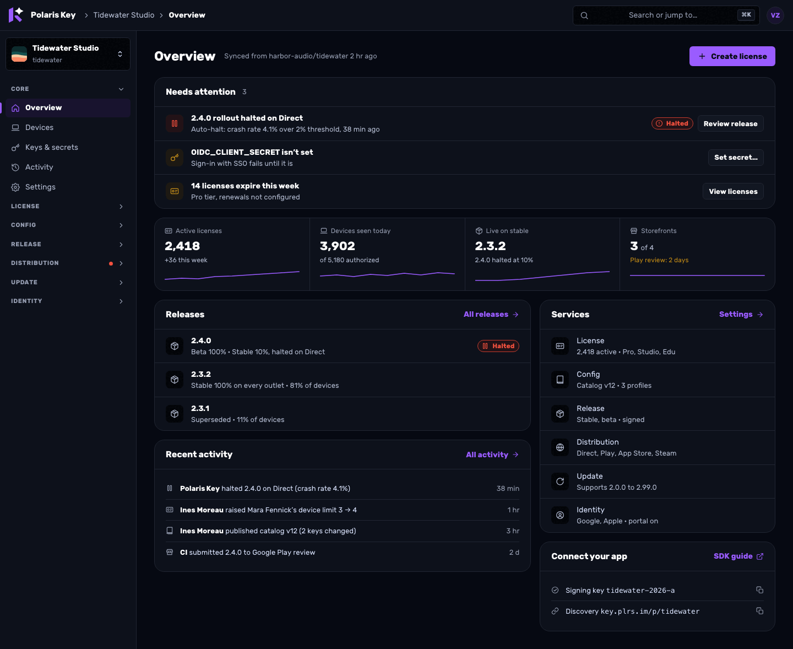

## 5. Navigation chrome

### 5.1 Console

- **Top bar** (64 px, `surface-page`, no divider): the 48 px Pinned K (with the section bit in
  service groups) and its trimmed lockup, the **search field that opens the palette** ("Search or
  jump to…", ⌘K) and the account menu. Breadcrumbs live in the masthead's orientation line, not
  the top bar. The Docs button and the theme button are in the account menu and the palette
  (SH 1.11). From 1024 px the page is an inset raised canvas beside the sidebar.
- **Sidebar** (240 px): the product switcher at the top (name, slug or "Launch · 5 of 9"), then
  neutral group labels (sentence case, a 3 px accent bar, no icon, no "Workspace" label) with only
  the active group open; closed sections show a red dot when they hold an attention item. Off a
  product it is the Platform context of §0.2: Home · Members · Connections · Settings · Packages ·
  Status · Activity.
- **Phone:** a menu button opens the sidebar as a drawer that **includes the product switcher and
  the Platform entry** (CL 7); the search field fills the top bar.

### 5.2 Portal

- **Top bar** (64 px): the compact lockup, Library (count) and Discover (new count), then
  right-aligned **Activate license** and the account chip. Both apps' bars are `surface-page`
  with no console divider (the portal keeps a `border-subtle` bottom edge, PORTAL §0.3); the lockup
  sizes follow BRAND §1.4.
- **Phone:** a bottom tab bar (Library · Activate · Discover) with Activate as the outlined middle
  pill, and the avatar top right. This is an **owner-approved phone exception** to "Activate is
  right-aligned": PORTAL.md §3.2 (approved 2026-10-04) specifies the middle pill on phones. It still
  opens the same modal (a bottom sheet).
- The account menu (shared `AccountMenu`) holds Account, Sign-in methods, Approve a new device, the
  theme row, Help and Sign out (PJ C).

## 6. Tables, lists, forms and settings rows

- **Rows are equal height** within a list (56 px comfortable, the console default; 40 px compact; BRAND §7.6 holds the one spec, never 76 px), with the subject (name +
  secondary id or email) left, values middle, and **pills and row actions right-aligned** in the last
  column. Numbers use tabular figures.
- **Whole rows open their record** (licenses, devices, releases, rollouts alike; AO cross-cutting).
  A link inside a cell (repo source) never hijacks the row click.
- **Search** sits first in the filter bar and accepts every identifier people paste (license
  search takes the key).
- **One workbench.** The filter bar and the table are one bordered band, not three stacked trays;
  facet chips have a solid 1 px outline. Table heads are real `th` with `scope="col"`, sentence
  case.
- **A table wider than its column scrolls inside** a `role="region"` with an accessible name and
  `tabindex="0"`, with a sticky first column; the page never scrolls sideways.
- **Facets are counted chips** in the filter bar, not separate stat tiles (CL 2, CL 7).
- **Phone:** tables become card rows (title, one line of facts, right-aligned issue pill or chevron);
  the filter bar keeps search plus one chip row that scrolls.
- **Forms:** labels above inputs; help text below, hidden while an error shows; errors say how to
  fix and offer a corrected value ("Try tonebox-pro", AS 1.9). Required fields carry no asterisk;
  optional ones say "Optional" in the label.
- **Settings rows** are ST-07's `SettingsRow` v2: label (weight 500) and at most one help line left; the
  `SourceBadge`, any drift note and the control right-aligned; equal row height; dependencies as a
  small note beside the control ("Needs Release"). **A claimable, manifest-owned row keeps its
  control**: editing claims it, Revert returns it to the manifest (model C, §0.4 S4). Only
  manifest-only fields and locked rows are read-outs.
- **Multi-select values are checkbox groups** (release channels), or toggle buttons with
  `aria-pressed` when space is tight, never a segmented control that looks single-choice.
- **Save** follows S-18: scalar rows save per row at the registry's confirm level, with the
  pre-save diff (and impact, for `policyBound` entries) inline under the row; rich sections keep one
  sticky save bar with the count of changes and a pre-save diff (O4).

## 7. Confirmations, status, pills and toasts

**Confirmations.**

| Level | When                                         | Pattern                                                                           |
| ----- | -------------------------------------------- | --------------------------------------------------------------------------------- |
| L0    | Reversible, low impact                       | No confirm; toast with **Undo**                                                   |
| L1/L2 | Row-scoped (remove a device, revoke a token) | `ConfirmPanel` inline on phones and in the portal; `ConfirmDialog` in the console |
| L3    | Page or account scope, irreversible          | `ConfirmDialog` with typed confirmation                                           |

A dialog or drawer has a head band and a 3 px accent top rule (the origin's accent), one leading
glyph (the severity for a confirmation, the subject's mark for a record), a title of at most 20/28
(18/24 in sheets) and no service tile; destructive and caution dialogs carry no accent rule. The
backdrop blurs with a flat 60 % scrim under reduced transparency. A confirm has a neutral title for routine actions and a danger icon only for destructive ones;
**consequences as a 2–3 line list**; the button repeats the verb and object; focus starts on
Cancel; errors show inline in the dialog. Mechanics ("A halt reaches devices on their next feed
check") move **into** the confirm and out of page subtitles.

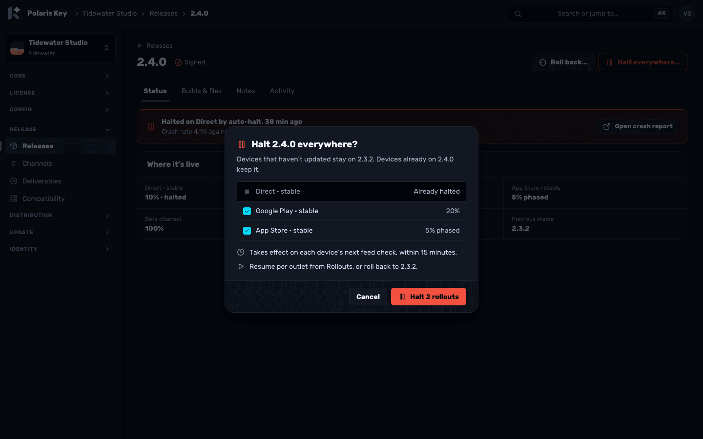

**Status and pills.** `StatusPill` renders only `danger`, `warning` and `info` as pills, always with
an icon and a word, right-aligned in its row or header. Success renders nothing, or quiet text where
a state must be read ("2 of 3 seats in use"). Neutral facts (tier, version, kind, "Public",
"Primary", provenance) are text or a `SourceBadge`. The full list of pills to remove is §11.3.

**Toasts.** Bottom right (full width at the bottom on phones), one line of what happened, one line
of consequence if needed, and **at most two actions**: Undo (L0), a next step ("Next: allow the
release workflow"), View change or View in activity, or a delight action ("Copy a reply to Mara").
A toast **with no action** auto-dismisses after 6 s, paused on hover or focus. A toast **with an
action stays until dismissed**, and its action is also reachable from the record or Activity (Undo
from the row's history, Copy reply from the record's Recent row), so nothing depends on catching a
toast in time. Errors never auto-dismiss. A toast never duplicates a page that already shows the
result (no "Product created" on the welcome).

### 7.1 Accessibility rules for the journeys

These hold in both apps and are acceptance criteria for the packages that build each pattern.

- **Timed changes have a stop.** The passthrough's auto-return shows "Returning by itself in 3 s ·
  Stay here"; Stay here stops it, and the timer pauses while focus or hover is in the card (WCAG
  2.2.1). No other journey changes context on a timer.
- **Toasts don't take actions away** (above).
- **Polling completes out loud.** "Waiting for the first release…", "Waiting for the first
  package…", launch-path waiting steps and store Re-check announce completion in a polite live
  region ("0.1.0 published from CI") and move nothing under the pointer.
- **Choices look like what they are.** Multi-select is a checkbox group or `aria-pressed` toggles;
  single-select is a radio group or segmented control.
- **Not offered means not interactive.** In Halt everywhere, an outlet that is already halted is a
  disabled row (`aria-disabled`, no checkbox, "Already halted"), not a checked box.
- **Routed drawers manage focus.** Opening moves focus to the drawer's heading and traps it; Escape,
  the close button and browser Back all close it; focus returns to the control that opened it, or to
  the record's `h1` when that control is gone (the device row after a deauthorize). The drawer is
  `role="dialog"` with `aria-labelledby` on its heading.
- **Pills carry words.** Every issue pill has an icon and a word; colour is never the only signal.

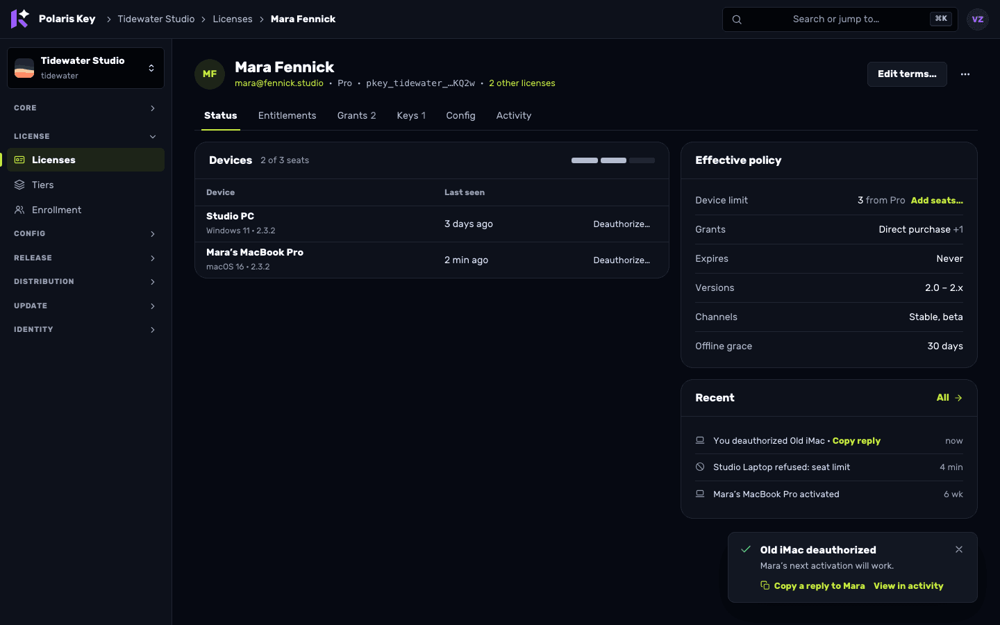

### 7.2 Motion

Both apps, the sign-in card and the UI kits use **one motion system**, specified in
[notes/S-23](../research/2026-09-29-godot-omniplatform/notes/S-23-motion-system.md) and built by phase MO. The tokens live in `packages/brand`
(`--pk-duration-{instant, micro, fast, base, moderate, slow, deliberate}`, `--pk-ease-{standard,
enter, exit, emphasized, spring}`, `--pk-motion-distance-*`, `--pk-stagger-step`); the patterns live
in `packages/admin/src/motion.css` and `src/ui/motion/`. This section says where each pattern is
used; the note owns the numbers.

| Pattern        | Where in these journeys                                                                                                        |
| -------------- | ------------------------------------------------------------------------------------------------------------------------------ |
| enter / exit   | every dialog, drawer, popover, menu, tooltip, toast and the palettes (J-1); the drawer slides from its edge, phone sheets rise |
| morph          | console route changes (fade-through), drill-downs (forward and Back), record tabs, dialog and card steps, the theme switch     |
| shared-element | Library tile → product hero (P1 step 8), licence row key → licence record (O1)                                                 |
| stagger-list   | first load of the Library, Overview tiles, the attention list (J-2)                                                            |
| list           | free a device (P4), deauthorize, create or delete a row, filters and facet chips (O1, O8)                                      |
| expand         | Remove and Replace inline confirms (`ConfirmPanel`, §7), disclosures, inline notices                                           |
| success        | the moments of §0.7, once each                                                                                                 |
| skeleton       | every load (§9); never "Loading…" text                                                                                         |
| press          | every button, tile and chip; tiles lift under the pointer                                                                      |

**Rules that bind the journeys.** Motion never hides state: the new state is in the DOM first and
every status is a word. Focus moves when the new state is in place, not when the animation ends.
The chrome never moves. Typing never animates results. A transition that blocks input lasts at
most `slow` plus `micro`, because the page takes no input during a View Transition. Under
`prefers-reduced-motion` (or the Reduce motion preference, MO-12) **every change is an instant
swap**: no slide, no burst, no shimmer. The CSP stays as it is: motion is stylesheet keyframes and
`::view-transition-*` rules plus CSSOM properties set by the layer, never `style=""`.

### 7.3 Screen acceptance

Done when every row holds for each screen and state a package ships, checked in the real runtime
(not mockups; native kits on device or simulator), with evidence paths in the PR. A row that cannot
apply says why in one line. This is the one home; kits also follow DL1–DL18, and UI-KITS §7.4 and
PORTAL §9 link here.

- [ ] **Keyboard:** tab order follows reading order; focus always visible (DL9); no trap outside a
      modal; Escape or Cancel backs out of every overlay and step; focus returns to the opener (or
      the heading when it is gone); a route change changes the URL and moves focus to the h1, an
      inline mutation changes neither.
- [ ] **Screen readers:** landmarks and exactly one h1; every icon-only control named; help and
      errors linked (`aria-describedby`); one polite announcement per change, none while typing;
      tables use `th` with `scope`; status is a word and an icon, never colour alone.
- [ ] **Sizing:** this surface's UI-KITS §7.1 rows plus 200 % text and 400 % zoom (320 CSS px
      reflow) with no page-level sideways scroll; a dense table scrolls only inside a labelled,
      focusable region; targets ≥ 44 px on customer and touch surfaces, ≥ 24 px with separation in
      the console.
- [ ] **Themes:** dark and light; a custom product accent on a light and a dark ground (kits,
      hosted sign-in); forced-colors; `prefers-contrast: more`; reduced transparency; contrast
      measured on the render (text 4.5:1, UI 3:1) for every state colour in its service accent,
      both themes.
- [ ] **States:** loading (skeleton after the grace), first-run empty, filtered empty, permission
      refused, expired or stale, network and API error with Try again, partial failure, success;
      input survives a failed save; where the API sends `expectedVersion`, a changed-since-open
      conflict is named with Reload.
- [ ] **Motion:** tokens only; reduced motion is an instant swap and the outcome still reads;
      errors appear without moving content; progress is real (no invented percentage, nothing
      loops after a failure); no celebration on refunds, revocation, removal, deletion or consent.
- [ ] **Hierarchy and copy:** one filled primary per state (neutral action ink in the console,
      portal and hosted sign-in; the product accent in kits); focus, selected, hover, checked and
      context borders take the accent of the service the element references (`data-service`; `-fg`
      for text and edges, base for fills; a non-colour cue stays); status colours (success, warning,
      danger, info, signed) never become a service accent; copy from the catalog, each fact once; no
      decorative numbers or taglines; no text drawn over customer art.
- [ ] **Native (kits):** Dynamic Type or font scale at the 200 % row, VoiceOver or TalkBack,
      gamepad and D-pad focus, TV and title-safe insets, terminal keys with `NO_COLOR`, ascii and
      `--json` paths.
- [ ] `pkey-ux-reviewer` passes the built screens (BUILT mode).

## 8. The shared sign-in

> **Sign-in is specified in [SIGN-IN.md](SIGN-IN.md) (2026-10-05)**, the single source of truth for
> every sign-in step, license choice and **Replace a device**, the console card, the Worker pages,
> the emails and the kits. It supersedes this section where they differ.

**One card for every sign-in surface.** `ui/auth/AuthCard` renders: the brand row above the card,
an optional **persistent card header** (product context or an app's request), the body (one step,
one primary), an optional **card footer** (passthrough), and Help · Privacy · Terms below. The
"Polaris Key · key.plrs.im" footer line goes (SH 3.1). Measures are PORTAL §4.1's: 28.5 rem card,
radius 22 px, elevation-3, 48–52 px controls, top-aligned at 10 vh on the static star field, edge to
edge on phones.

**The steps** (each one a component inside the card; the header and footer persist across them):

| Step                | When                                                                                                                                                                                                                                                                                                                 | Owner                                                    |
| ------------------- | -------------------------------------------------------------------------------------------------------------------------------------------------------------------------------------------------------------------------------------------------------------------------------------------------------------------- | -------------------------------------------------------- |
| `MethodsStep`       | First: identifier-first email, then the variant's methods                                                                                                                                                                                                                                                            | UX-40                                                    |
| `CodeStep`          | After an email: one email with a 6-digit code and a magic link                                                                                                                                                                                                                                                       | I-07 (Worker), UX-40 (card)                              |
| `EmailGateStep`     | First sign-in through a provider; `ProfileImport`; no skip path                                                                                                                                                                                                                                                      | PX-21 (built inside the card UX-40 promotes)             |
| `LicenseChoiceStep` | After authentication, every sign-in that binds an installation: "Choose a license for this device"; tier pill with "{n} of {limit} devices" for every license, then "{origin} · {term}" ("From signing in", "Steam key ending 3WPLDA"); full licenses without a radio; `ReplaceDevice` inline (SIGN-IN.md §3.6–§3.7) | UX-41, PX-14 (card), I-08 (routes), I-09 (ranking), I-26 |
| `ConsentStep`       | First sign-in to an app or a scope change; after LicenseChoiceStep, showing the chosen license with **Change** (SIGN-IN.md §3.8)                                                                                                                                                                                     | PX-14, UX-41                                             |
| `KeyStep`           | "Have a license key?", "Use a license key instead", or no license without auto-issue; PX-17's confirm, which is itself the choice; I-09's verdicts                                                                                                                                                                   | UX-41, PX-17, UX-05                                      |
| `ReturnStep`        | Passthrough done: "It's yours", Return to <App>, timer with Stay here                                                                                                                                                                                                                                                | UX-41                                                    |

**`LicenseChoiceStep`, `ReplaceDevice` and `ConsentStep` are specified in SIGN-IN.md §3.6–§3.8**
(owner decisions 2026-10-05; contract in `plans/I-04.md`, "Owner decision (2026-10-05): licence
choice at sign-in", §F). Their frames are SIGN-IN.md frames 05–09 and 18–22; this section keeps
no second copy of their rules.

| Variant         | Brand row                  | Header                                               | Methods                                                                                                                                                                                                                                                                                             |
| --------------- | -------------------------- | ---------------------------------------------------- | --------------------------------------------------------------------------------------------------------------------------------------------------------------------------------------------------------------------------------------------------------------------------------------------------- |
| **Portal**      | Polaris Key                | Product context when a developer link sent you       | Identifier-first email · Continue · or · provider row (Apple, Google, Steam; logo only) · Sign in with a passkey · Have a license key? · Sign in with another device                                                                                                                                |
| **Console**     | Polaris Key │ Console      | none                                                 | **Identifier-first email**, the same field; for a known operator it is prefilled as a chip ("vlad@zaharia.dev · Change"). Continue routes to that operator's sign-in: the operator IdP (Pocket ID on the reference deployment, any OIDC SSO) or a passkey. "Sign in with a passkey" sits under "or" |
| **Passthrough** | Polaris Key                | "**<App>** wants you to sign in" · developer · where | The portal methods for that product's providers, Have a license key?, then the step list above; lock footer                                                                                                                                                                                         |
| **Worker page** | Polaris Key (or │ Console) | as above                                             | Server-rendered, no JS: forms that POST (send a new code, retry sign-in, enter a device code)                                                                                                                                                                                                       |

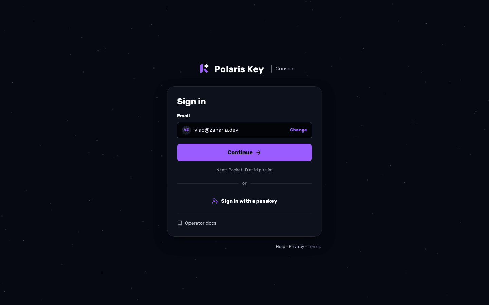

**Why the console is identifier-first too.** The owner asked for admin login "based on the same
form". A lone "Continue with Pocket ID" button is a different form, and it breaks the day a
deployment has two operator IdPs. The console therefore uses the portal's field: the email decides
the route (the operator's configured IdP by domain or by the operator record, or a passkey the
operator enrolled), unknown emails get the same response as known ones (no enumeration; the IdP
refuses non-operators), and the known-operator chip is simply the field's prefilled state. The
console never offers Apple, Google or Steam, and "Have a license key?" does not appear there.

**Console sign-in replaces the straight IdP redirect.**

- `GET /manage/login` serves the SPA's AuthCard (or the Worker twin when the SPA is not loaded); the
  PKCE redirect starts **only when the operator presses Continue**, and `returnTo` survives.
- **Sign out** shows "You're signed out" in the card instead of bouncing through the IdP, which
  signed the operator straight back in (SH 0.2).
- **Session expiry (401)** renders "Your session ended" in place with the email chip and
  **Continue**, and the page the operator was on; unsaved edits stay in the tab
  ([mockup](experience/02b-signin-console-signedout-desktop-dark.png)).
- **Not an operator (403):** "vlad@… isn't in the operators group" with **Use another account**.
- **Offline / 5xx:** "Can't reach Polaris Key" with **Try again**, distinct from signed out (SH 1.8).
- **Not configured:** "Admin sign-in isn't set up" with the docs link (CL 6).

**Worker pages render the same card markup without JS.** `brandHtml.ts` gains `renderAuthCard()`:
the same classes and measures as `AuthCard` (28.5 rem, radius 22 px, 24 px h1, 48 px semibold buttons,
the compact lockup with **no bit**, top-aligned, Help · Privacy · Terms). The `surface` eyebrows
("ACCOUNT", "DEVICE") go; the console variant uses the "│ Console" brand row. A unit test compares
`BRAND_PAGE_CSS` measures with the `AuthCard` tokens. Pages covered: expired or used code or link
("That code or link has expired", with **Send a new code**), "Confirm sign-in, requested at <time>
from <place>" for a link opened on another device (I-07), admin sign-in errors, device-code entry
and confirm (the product in the card header, the "Product nightfall" row removed), "You're signed
in, return to the app".

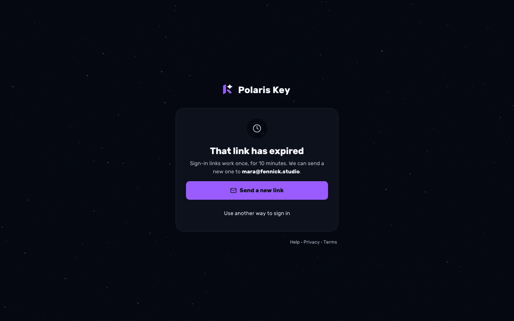

**Emails** use a centred 160–200 px lockup **without the bit** and the card radius (SH 0.3). The
sign-in email carries the code first and the link second; the copy is §11.1's.

## 9. Empty, loading and error states

| State                 | Component                            | Rule                                                                                                                          |
| --------------------- | ------------------------------------ | ----------------------------------------------------------------------------------------------------------------------------- |
| First run             | `EmptyState kind="first-run"`        | A guided panel when the next step has parts (Releases: checks + snippet + live waiting row); else one sentence and one action |
| Filtered to nothing   | `EmptyState kind="filtered"`         | "No licenses match" + Clear filters                                                                                           |
| Not found             | `EmptyState kind="not-found"`        | One shared description; the suggestion as the primary ("Open DJDL"); product chrome kept                                      |
| Service off           | `EmptyState kind="service-off"`      | "Turn on <Service> in Settings" with the switch one click away                                                                |
| Portal library, first | `EmptyState kind="first-run" hero`   | The deliberate hero moment, with Discover offers inline when PX-16 ships                                                      |
| Loading               | `Skeleton` shaped like the content   | No "Loading…" text beyond the boot screen; the skeleton pattern of §7.2 (150 ms grace, sheen, none under reduced motion)      |
| Error                 | `ErrorState` + `errorCopy(err, ctx)` | What happened, the fix, **Try again**, a reference id, Copy details                                                           |
| Boot                  | `BootScreen`                         | Lockup and spinner; an error becomes the AuthCard state (§8)                                                                  |

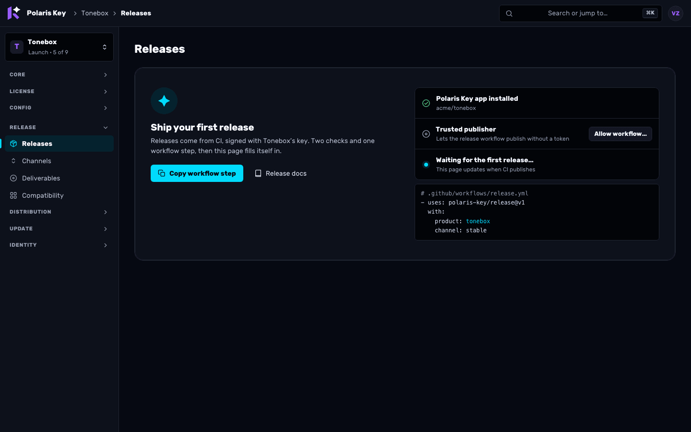

---

## 10. Consolidation list

### 10.1 Console

| #   | Before                                                                             | After                                                                                                                                                                                                                                                | Rationale                                          |
| --- | ---------------------------------------------------------------------------------- | ---------------------------------------------------------------------------------------------------------------------------------------------------------------------------------------------------------------------------------------------------- | -------------------------------------------------- |
| C1  | ProductNew: 5-step wizard + result page + toast                                    | One screen; lands on Overview's welcome                                                                                                                                                                                                              | 1 required field (AS 1.1, 1.7)                     |
| C2  | Overview Setup card + Home "Setup complete" + attention lists (3 models)           | `LaunchPath` + one `AttentionList` model                                                                                                                                                                                                             | They disagree (AS cc1, CL 5)                       |
| C3  | Core → Services (page)                                                             | Settings hub → **Services & registration** area (ST-08); UX-22 ships the chain rule first                                                                                                                                                            | Both are product settings (CL 1.9); S-18 §4.9      |
| C4  | Registration in Services, read-only copy in Enrollment                             | Hub → Services & registration (registration policy)                                                                                                                                                                                                  | One home (CL 1.3); S-18 §4.9                       |
| C5  | Group → tier mapping in Sign-in; auto-issue nowhere; Enrollment page               | Auto-issue editor in hub → License (ST-12); mapping read-out in hub → Identity; Enrollment retires (fingerprint policy and probes to hub → License)                                                                                                  | Dead end (AS 3.1); S-18 §4.9                       |
| C6  | Identity → Portal + Identity → Sign-in                                             | Hub → **Identity** and hub → **Customer portal** (visible with Identity off, ST-14), with View portal                                                                                                                                                | Split concept (AS 4.4); ST-14                      |
| C7  | Distribution → Matrix + Rollouts                                                   | Rollouts with views List · Matrix · Readiness                                                                                                                                                                                                        | Duplicates (CL 1.1)                                |
| C8  | App Store · Commerce · Outlet credentials · Listing (+ Platform assignment)        | A-18j's **Storefronts** page and **Add to storefronts** flow; App Store and Commerce open from the tile; Listing into the hub (ST-13); credentials into Keys & secrets; app picked in Prerequisites                                                  | Five places (AS 5.1); evolves A-18j                |
| C9  | Update → Feed "Metadata access" + Distribution → Access                            | Hub → Release & Update (metadata access) and hub → Distribution (access per deliverable), one vocabulary (S-18 D16); both pages link there                                                                                                           | Same policy (CL 1.2); S-18 §4.9                    |
| C10 | Keys in six pages                                                                  | Keys & secrets: Signing, Content keys (read-only), Store credentials, Distribution fingerprints, Secrets, CI                                                                                                                                         | One vault (CL 1.4)                                 |
| C11 | Release → Content keys (page)                                                      | Keys & secrets → Content keys                                                                                                                                                                                                                        | C10                                                |
| C12 | Release → Update simulator (page)                                                  | Compatibility → Simulator tab                                                                                                                                                                                                                        | Same subject                                       |
| C13 | Resync on 5 pages                                                                  | One product-level Resync (switcher menu) + `SourceBadge` links                                                                                                                                                                                       | CL 1.8                                             |
| C14 | Package-feed switch in Services and per feed                                       | One product switch in hub → Distribution (package-feed defaults), linked from the Packages header; per-feed Serving stays                                                                                                                            | AS 6.4                                             |
| C15 | Overview "Trust & SDK" (550 px, forever)                                           | Welcome on first run; then a compact "Connect your app" panel                                                                                                                                                                                        | Onboarding content (CL 5)                          |
| C16 | Overview six equal tiles (zeros on new products)                                   | A 4-up `StatStrip` (hidden while zero) + a Services list                                                                                                                                                                                             | AS 4, CL 5                                         |
| C17 | Home "All products" grid + Products table                                          | Home = attention + recent products + 2 fleet numbers; Products = the registry                                                                                                                                                                        | CL 1.6                                             |
| C18 | Platform Deployment + Operations                                                   | Platform → Status                                                                                                                                                                                                                                    | Overlap and contradicting counts (CL 1.5, AO J5.1) |
| C19 | Platform Settings (3,718 px, 4 controls)                                           | **ST-09's Platform settings area** (General, Access and identity, Email, Background jobs, Product defaults and policies, Product policies matrix, Package feeds policy, Store connections, Keyring and secrets, Limits, Alert destinations, History) | CL 1.5; ST-09                                      |
| C20 | Activity in three places (product, Platform Settings history, Deployment)          | Global Activity with Product facet; product Activity and Settings → History are lenses on the same audit                                                                                                                                             | AO J6.2; S-18 §4.6                                 |
| C21 | License record "Overview" = Terms form                                             | Tabs Status · Entitlements · Grants · Keys · Config · Activity; Terms in an "Edit terms…" drawer                                                                                                                                                     | AO J1.4; LX-14 adds two tabs                       |
| C22 | Release record opens on Builds & files                                             | Status tab first                                                                                                                                                                                                                                     | AO J2.3                                            |
| C23 | Licenses/Devices stat tiles that filter + a Status facet                           | Counted facet chips                                                                                                                                                                                                                                  | CL 2                                               |
| C24 | "On this page" rail on 3-section pages                                             | `SectionRail` only above ~2 viewports                                                                                                                                                                                                                | CL 2                                               |
| C25 | Overview header "Settings" button; license header 3 visible actions                | Overview button removed; operational pages link their hub area; one primary + ≤ 2 secondaries                                                                                                                                                        | CL 2; S-18 §4.9                                    |
| C26 | Top-bar Docs button and theme button                                               | Account menu and palette                                                                                                                                                                                                                             | SH 1.11                                            |
| C27 | Legacy `components/ui/*` kit beside `ui/*`                                         | `ui/*` only                                                                                                                                                                                                                                          | SH 0.4                                             |
| C28 | Settings → License defaults → "Compatibility window · Open Update → Feed" link row | Removed (the window is a hub → Release & Update row; ⌘K finds it)                                                                                                                                                                                    | A link pretending to be a setting (CL 1.9)         |
| C29 | Health page with the auto-halt thresholds form inline                              | Health stays a dashboard; thresholds in hub → Distribution (S-18 moves auto-halt out of Health)                                                                                                                                                      | Dashboard mixed with a form (CL 5)                 |
| C30 | Effective policy "Override" idea for one license's device limit                    | **Add seats…**: a comp seat-pack grant (LX-14), shown in Effective policy and Grants                                                                                                                                                                 | Model OC (S-19 §7.2)                               |

### 10.2 Portal

| #   | Before                                                                         | After                                                                    | Rationale                   |
| --- | ------------------------------------------------------------------------------ | ------------------------------------------------------------------------ | --------------------------- |
| P1  | `LoginCard` (portal), `BootScreen` error (console), `renderBrandPage` (Worker) | One `AuthCard` + Worker twin                                             | SH 0.1                      |
| P2  | Account header Sign out + account menu Sign out                                | Account menu only                                                        | SH 1.3                      |
| P3  | Appearance section (RadioCards with hex swatches)                              | Theme row in the account menu and Account (`SegmentedControl`)           | SH 1.6, 1.11                |
| P4  | Status in header pill + "Active" on License card + tier chip ×3                | One issue pill; tier as text, a neutral pill on the License card         | PJ D                        |
| P5  | Three Download buttons for one Universal build                                 | Header lead + other platforms list + Change platform                     | PJ C                        |
| P6  | `ErrorPanel` + `portalErrorCopy`                                               | `ErrorState` + `errorCopy` portal voice table                            | SH 1.8                      |
| P7  | `SectionCard`, hand-made `<dl>`, tinted box, native `<select>`, raw `<input>`  | `Section`, `DescriptionList`, `Callout`, `Select`, `Input`               | SH 0.5                      |
| P8  | `JumpPalette`                                                                  | Shared `CommandPalette`                                                  | SH 1.10                     |
| P9  | Library subtitle "3 products · signed in as …" and end note                    | Removed                                                                  | Count in nav, email in chip |
| P10 | Free-device flow Cancel + header back link                                     | Header back link only                                                    | PJ C                        |
| P11 | Product page section rail on a page under two viewports                        | No rail; cards in reading order                                          | §3 `SectionRail` rule       |
| P12 | License card with tier chip and "Included" chips                               | **What you own** (sources, LX-15) above **Your license** (facts as text) | PJ D; LX-15                 |
| P13 | Initials avatar in the chip and menu                                           | PX-22's `Avatar` with the profile picture; initials as fallback          | PX-22                       |

## 11. The copy pass

### 11.1 Sign-in, Worker pages and email

| Where                  | Text                                                                                    | Verdict | Becomes / why                                                                                                                                            |
| ---------------------- | --------------------------------------------------------------------------------------- | ------- | -------------------------------------------------------------------------------------------------------------------------------------------------------- |
| Portal sign-in         | "Your library of games and apps from developers who use Polaris Key."                   | Remove  | Filler under a self-explanatory h1                                                                                                                       |
| Sign-in (app)          | "Use the email you bought it with."                                                     | Keep    | The one fact a buyer needs                                                                                                                               |
| Sign-in (app)          | h1 "Sign in or create an account"                                                       | Rewrite | "Sign in"; the header carries the context                                                                                                                |
| Card header            | "Manage your copy of X / dev · downloads, license and devices"                          | Rewrite | Developer link: "**X** · developer" / "Your license, downloads and devices". "**X** wants you to sign in" is only for an app's request (SIGN-IN.md D-11) |
| Sign-in loading        | "Getting the ways you can sign in…"                                                     | Remove  | Card skeleton                                                                                                                                            |
| Sent step h1           | "Check your email"                                                                      | Keep    |                                                                                                                                                          |
| Sent step              | "We sent a sign-in link to {email}. It works for 10 minutes."                           | Rewrite | "We sent a code and a sign-in link to {email}. Both work for 10 minutes." (I-07 sends one email with both)                                               |
| Sent step              | "Open it on this device and this page signs you in by itself."                          | Rewrite | "Or open the link in the email. Keep this tab open."                                                                                                     |
| Resend                 | "We sent a new link. Either one works for 10 minutes."                                  | Rewrite | Button "Send a new code"; status "We sent a new code and link to {email}."                                                                               |
| Wrong code             | (new)                                                                                   | New     | "That code isn't right. Check the email and try again."                                                                                                  |
| Too many tries         | (new)                                                                                   | New     | "Too many tries. Send a new code." (after 5 wrong attempts, I-07)                                                                                        |
| Link on another device | (new)                                                                                   | New     | "Confirm sign-in, requested at {time} from {place}" + **Confirm** (I-07)                                                                                 |
| Sign-in off            | "There's no way to sign in to Polaris Key here right now. Try again later."             | Rewrite | "Sign-in is unavailable. Try again later."                                                                                                               |
| Footer                 | "Polaris Key · key.plrs.im"                                                             | Remove  | The brand is above                                                                                                                                       |
| Console boot error     | "The admin session could not be loaded. Retry, or sign in again if your session ended." | Rewrite | "Can't reach Polaris Key" / "Your session ended" (§8 states)                                                                                             |
| Worker expired         | "This magic link has expired." / "Missing magic-link token."                            | Rewrite | h1 "That code or link has expired" + "Codes and links work once, for 10 minutes." + **Send a new code**                                                  |
| Worker admin           | "Admin sign-in is not configured."                                                      | Rewrite | "Admin sign-in isn't set up" + docs link                                                                                                                 |
| Worker buttons         | "Back to sign-in"                                                                       | Rewrite | "Sign in again"                                                                                                                                          |
| Device confirm         | "An app is asking to activate this device. Check that the code and device match…"       | Rewrite | "Check the code matches the one on your device."                                                                                                         |
| Device confirm         | "Product nightfall" row                                                                 | Remove  | The header names the product                                                                                                                             |
| Signed-in page         | "You can close this tab and return to the app."                                         | Keep    |                                                                                                                                                          |
| Return step            | (new)                                                                                   | New     | "{Product} is yours" · "Returning by itself in 3 s · Stay here"                                                                                          |
| Console sign-in        | "Continue with Pocket ID" as the only control                                           | Rewrite | Email field (known operator as a chip) + **Continue**; fine print "Next: Pocket ID at {issuer host}"                                                     |
| Email subject          | (link-only subject)                                                                     | Rewrite | "Your Polaris Key code: {code}"                                                                                                                          |
| Email body             | "Use the button below to sign in. The link expires in 10 minutes and works once."       | Rewrite | The code large first, then "Or sign in with the button. The code and the link work once, for 10 minutes."                                                |
| Email                  | "If the button does not work, paste this link into your browser:"                       | Keep    |                                                                                                                                                          |
| Email footer           | "…Nothing changes until the link is used."                                              | Keep    |                                                                                                                                                          |

### 11.2 Portal

| Where                 | Text                                                                                            | Verdict          | Becomes / why                                                                                                 |
| --------------------- | ----------------------------------------------------------------------------------------------- | ---------------- | ------------------------------------------------------------------------------------------------------------- |
| Library h1            | "Your library"                                                                                  | Rewrite          | "Library" (the nav label and the page)                                                                        |
| Library subtitle      | "3 products · signed in as mara@…"                                                              | Remove           | Count in nav, email in chip                                                                                   |
| Empty library h1      | "Nothing here for {email} yet"                                                                  | Keep             | Names the reason                                                                                              |
| Empty library body    | "Products bought with this email show up here by themselves. Got a license key…? Activate it…"  | Rewrite          | "Products bought with this email appear here. Have a key? Activate it."                                       |
| Empty library footer  | "Bought with a different email or on Steam? Add it in Account → Sign-in methods"                | Remove until G27 | Dead end today (PJ B2); returns when linking exists                                                           |
| Library end           | "That's everything linked to {email}."                                                          | Remove           |                                                                                                               |
| Get it                | "Download links are made fresh when you click, so they never go stale."                         | Remove           | Implementation detail                                                                                         |
| Get it (`not_hosted`) | "Not included / Not available here yet"                                                         | Rewrite          | "Get it from Steam" (or the developer); "here yet" is status copy                                             |
| Download flow         | "This is the last version your license covers. Version X isn't included."                       | Keep             |                                                                                                               |
| License key note      | "Polaris Key keeps only a fingerprint… Keep the copy from your email or store."                 | Rewrite          | "Find the full key in your purchase email."                                                                   |
| License card          | "Licensed to {email}"                                                                           | Keep             | Can differ from the account                                                                                   |
| Devices               | "Removing a device frees its seat at once."                                                     | Remove           | The confirm says it                                                                                           |
| Devices               | "+1 not using a seat"                                                                           | Rewrite          | "1 signed-out device"                                                                                         |
| Remove confirm        | 3 bullets                                                                                       | Keep 2           | Drop "Its seat is free straight away"; the meter shows it                                                     |
| Help card             | "{who} handles licenses and downloads for {product}."                                           | Keep             |                                                                                                               |
| Package access        | "A read-only token for one computer or build server. It works while your license is active."    | Keep             |                                                                                                               |
| Token panel           | "This is the only time you'll see it. If you lose it, revoke it and create another."            | Keep             |                                                                                                               |
| Package access tabs   | "npm, pnpm · Yarn Berry · Bun · npm"                                                            | Rewrite          | One "npm" tab; the snippet shows the person's real scope                                                      |
| What's new            | "This version has no release notes."                                                            | Remove           | Hide the section                                                                                              |
| KeyField help         | "Paste the whole key. It starts with pkey\_ and capital letters matter."                        | Rewrite          | "Starts with pkey\_. Case-sensitive." Hidden once there's a verdict                                           |
| Activate dialog       | "Paste a key from a store, a developer or an email. The product joins your library…"            | Rewrite          | "The product stays in your library even if you lose the key."                                                 |
| Activate              | "Key recognised"                                                                                | Rewrite          | "Key recognized"                                                                                              |
| Free-device done      | "Back to Orbit Survey without changes" / "Then go back to Orbit Survey and press Try again"     | Rewrite          | Only with `return=`: "Back to Orbit Survey"                                                                   |
| Library error         | "Try again. If it keeps happening, contact the developer."                                      | Rewrite          | "Try again. If it keeps happening, contact Polaris Key with reference {id}."                                  |
| Account subtitle      | "Mara Fennick · mara@…"                                                                         | Rewrite          | Name only                                                                                                     |
| Sign-in methods       | "How you get into this account. Sign-in links, receipts and security notices go to this email." | Rewrite          | "Receipts and security notices go to your primary email."                                                     |
| Email row             | "Products bought with this email join your library by themselves."                              | Remove           | Said on the empty library                                                                                     |
| Your data             | "Deleting your account doesn't cancel your licenses…"                                           | Move             | Into the confirm's consequences                                                                               |
| Delete confirm        | "Licenses stay with each developer. Add them again with a new account."                         | Rewrite          | "Products bought with this email come back when you sign up with it again. Keep your keys for anything else." |
| Theme                 | "Match my device"                                                                               | Rewrite          | "System"                                                                                                      |
| Delete cancel         | "Keep my account"                                                                               | Rewrite          | "Cancel"                                                                                                      |

### 11.3 Console

| Where                                    | Text                                                                                                                                                                                        | Verdict | Becomes / why                                                                                           |
| ---------------------------------------- | ------------------------------------------------------------------------------------------------------------------------------------------------------------------------------------------- | ------- | ------------------------------------------------------------------------------------------------------- |
| Overview header                          | "Runs 6 services · linked to a repository · last resync … · created …"                                                                                                                      | Rewrite | "Synced from {repo} {time}" only                                                                        |
| Services                                 | "A service that is off answers not-configured on the wire and leaves the navigation."                                                                                                       | Remove  | Each row gets a one-line purpose                                                                        |
| Settings → Admin group                   | "Metadata only. It grants nothing: console access is platform-wide. Clear it to remove the group."                                                                                          | Rewrite | "Label only; grants no access." (and leaves create, AS 1.3)                                             |
| ProductNew Basics                        | "It grants no access: the console authorizes on PLATFORM_ADMIN_GROUP alone."                                                                                                                | Remove  | Env-var explanation on a first-run form                                                                 |
| ProductNew aside                         | "What happens next … mints its Ed25519 signing key…"                                                                                                                                        | Remove  | The welcome shows the result                                                                            |
| ProductNew / Home                        | "…or start manually and add a repository later"                                                                                                                                             | Rewrite | Keep only once Link repository exists (C1, AS 1.5)                                                      |
| Errors                                   | "The server refused this (422 bad_request) — product already exists: tonebox"                                                                                                               | Rewrite | "tonebox is taken. Try tonebox-app." on the field                                                       |
| Errors                                   | "…github access failed: 404 Not Found"                                                                                                                                                      | Rewrite | "The Polaris Key GitHub App isn't installed on acme/beatgrid, or the repo is private." + Install        |
| Errors (manifest)                        | "These services depend on each other — Change the settings below so they fit together"                                                                                                      | Rewrite | "The manifest has 3 problems. Fix them in one commit, then check again." + list                         |
| Simulator                                | "Nothing is stored."                                                                                                                                                                        | Remove  |                                                                                                         |
| Content keys                             | "CI delegates and revokes these keys; this page only reads them."                                                                                                                           | Rewrite | `SourceBadge` "Managed by CI"                                                                           |
| Outlets                                  | "Outlets come from .pkey/distribution."                                                                                                                                                     | Remove  | The `SourceBadge` says it                                                                               |
| Package feeds (platform)                 | "The SDKs and tools Polaris Key ships, on {host}. Policy set here applies to every product's feeds."                                                                                        | Rewrite | "Applies to every product's feeds."                                                                     |
| Packages (product)                       | "On {host}."                                                                                                                                                                                | Keep    | The address is needed                                                                                   |
| Registry tokens                          | "For clients of feeds that are not public, on {host}."                                                                                                                                      | Remove  |                                                                                                         |
| Deliverables                             | "…A pinned pack ships only when an app release pins one of its releases."                                                                                                                   | Move    | Tooltip on "Binding"                                                                                    |
| Rollouts                                 | "A halt or pause reaches devices on their next feed check."                                                                                                                                 | Move    | Into the halt and pause confirms                                                                        |
| Channels                                 | "Changes made here survive a resync until you revert them."                                                                                                                                 | Keep    | Non-obvious                                                                                             |
| Sign-in                                  | "Authored in .pkey/product; a resync applies a change."                                                                                                                                     | Rewrite | The hub's Identity area rows carry a `SourceBadge` ("Manifest"); claimable rows edit in place (model C) |
| Access                                   | "The appcast, the download routes and the customer portal all use this."                                                                                                                    | Keep    | A consequence                                                                                           |
| Distribution keys                        | "CI flags any key it sees that matches no entry here."                                                                                                                                      | Remove  |                                                                                                         |
| Secrets / Credentials / Platform         | "Values are write-only…" / "Values are sent once and never shown again." / "Keys are never shown." / "Values are never shown: not a length, not a hash. Set them with wrangler secret put." | Rewrite | One shared line: "Never shown again."                                                                   |
| CI and registry tokens                   | "Shown once; Polaris Key stores only its hash." (two phrasings)                                                                                                                             | Rewrite | `OneTimeSecretPanel` owns "Shown once."                                                                 |
| License record → Expires                 | "No date set." + "Blank: the license never expires."                                                                                                                                        | Rewrite | "Never"                                                                                                 |
| Health                                   | Auto-halt description; "Last reading Sep 21, 2026. Saved by u1."                                                                                                                            | Rewrite | Thresholds behind "Auto-halt settings"; names, not ids                                                  |
| Platform Settings rows                   | "LAZY_DELTAS · deploy var 'runtime' · default Off · read by both Worker scripts"                                                                                                            | Rewrite | Label + value; provenance in the `SourceBadge` popover                                                  |
| 404                                      | "The link may be out of date, or the page may have moved. Search for it, or start from the overview."                                                                                       | Remove  | The buttons say it                                                                                      |
| Unknown product                          | "Products are addressed by their slug. Pick one from the registry."                                                                                                                         | Remove  | "Did you mean DJDL?" as the primary                                                                     |
| Service off                              | "{product} doesn't run {Service}, so there is nothing here to manage. Turn it on in Services…"                                                                                              | Rewrite | "Turn on {Service} in Settings."                                                                        |
| Delete product dialog                    | Description + 4 bullets saying the same                                                                                                                                                     | Rewrite | Bullets only                                                                                            |
| Danger zone row                          | "Tombstones DJDL: every license is disabled and every device token is evicted…"                                                                                                             | Rewrite | "Disables every license and device; the slug stays reserved."                                           |
| Not-found records (6 variants)           | "It may have been deleted, or the link has a typo."                                                                                                                                         | Rewrite | One shared `not-found` description                                                                      |
| Empty states (~30)                       | "X appears here when … Point an SDK at this product to see one."                                                                                                                            | Rewrite | Trigger clause only: "Appears after a device activates."                                                |
| First-run explainers                     | "A product is one app or game: …", "A rollout offers a release to a share…"                                                                                                                 | Keep    | One sentence each: definition + action                                                                  |
| SettingsRow help (71)                    | Constraints and consequences                                                                                                                                                                | Keep    | "Turning this off lets an unsigned build reach every updater"                                           |
| SettingsRow help                         | Definitions of the label ("The GitHub environment the job must run in", "A dotted identifier, unique in the catalog")                                                                       | Remove  |                                                                                                         |
| Section descriptions (31)                | Restating the title ("Unexpired builds of the app, newest first", "Keys are never shown")                                                                                                   | Remove  |                                                                                                         |
| `RegistryTokens.tsx`, `CommercePage.tsx` | "licence" (×7)                                                                                                                                                                              | Rewrite | "license"                                                                                               |

**Healthy-state pills to remove** (both apps; issue pills stay): Releases "Healthy"; Operations
"Healthy" badge and green Succeeded/Answering/Ticking/Draining; Deployment "Passed"; App Store
"Connected", "Valid", "Ready for sale"; Store connections "Working"; Credentials "Connected"; Package
feeds "Enabled", "Public"; signing key "Active" (Overview and wizard result); "Staged", "Retired";
Overview "Schema v8", "5 of 7 done" (the launch path replaces it), "Warning" on every attention row
and "Halted" where the row title already says it;
Services delivery-chain pills and "License required"; Enrollment "License required"; Devices
"License-free", "Deauthorized", trust level "Basic"; Catalog kind pills and "Default"; Matrix "Not
available", "In review", "Pending" and the legend; Health "Rolling out · 25 %"; Rollouts "Rolling
out", "Yanked" (text); Channels "Pinned" and provenance chips (→ `SourceBadge`); Platform Keyring and
Secrets "Set"/"Not set" (→ text, "Not set" in warning text only when required); portal "Active" on
tiles, hero, header and License card; portal "Primary"; portal tier chips (the License card keeps one neutral tier pill, at its header's top right since the owner polish of 2026-10-07, PORTAL.md §4.20) and "Included" chips; the gold plated "Signed" pill (→ glyph +
text) and any "Just added" pill (→ ring + quiet text). Also: "Seat limit" is not an issue on its own;
only a license that is refusing devices gets a pill.

## 12. Mockups

Static HTML/CSS with the brand tokens inlined (`@polaris-key/brand` `tokens.css`, Rubik, the kit
lockups and the Pinned K), rendered with Playwright at 1440x900 and 390x844 in dark and light. Sources
and every render: `/private/tmp/claude-501/ux-unify/mockups/` (`_src/build.mjs`, `_src/shoot.mjs`;
frames under `frames/`). Optimised PNGs are in [`experience/`](experience/), named
`<page>-<desktop|mobile>-<dark|light>.png`.

| #   | Mockup                         | Shows                                                                                                                                                                                                                |
| --- | ------------------------------ | -------------------------------------------------------------------------------------------------------------------------------------------------------------------------------------------------------------------- |
| 01  | `01-signin-portal`             | Shared AuthCard, portal: identifier-first email, provider row, passkey, quiet links                                                                                                                                  |
| 02  | `02-signin-console`            | Console variant: "Polaris Key │ Console", identifier-first email with the known-operator chip, Continue (to Pocket ID), passkey                                                                                      |
| 02b | `02b-signin-console-signedout` | Session ended in place, return to the page, unsaved edits kept                                                                                                                                                       |
| 03  | `03-signin-passthrough`        | "Tidewater Studio wants you to sign in", product providers, lock footer                                                                                                                                              |
| 04  | `04-signin-worker`             | Worker no-JS page in the same card: expired link, Send a new link                                                                                                                                                    |
| 05  | `05-console-overview`          | Overview after consolidation: one attention list (no pill where the title says it), StatStrip, Releases, Services                                                                                                    |
| 06  | `06-console-licenses`          | List page: search by key, counted facets (Refusing devices), Filters on phones, right-aligned issue pills, a chevron on every phone row                                                                              |
| 07  | `07-console-settings`          | The S-18 hub's License area: SourceBadges, a claimable row being edited with ST-07's pre-save diff and impact, drift with Revert, inherited value, channels as checkboxes, auto-issue preview, LX-06 licensing rows  |
| 08  | `08-portal-library`            | Library without healthy pills, real quick actions, Discover end note; phone bar with Activate as the approved middle pill                                                                                            |
| 09  | `09-portal-product`            | One lead, Change platform, What you own with sources (LX-15), facts as text, This device, no section rail, Signed as a glyph                                                                                         |
| 10  | `10-console-empty`             | Guided empty state: Releases checks, snippet, live waiting row                                                                                                                                                       |
| 11  | `11-console-confirm`           | Release Status tab with Halt everywhere confirm; the halted outlet disabled; Signed as a glyph                                                                                                                       |
| 12  | `12-console-toast`             | License Status after the fix (nothing shouted), tabs per LX-14, toast with an action that stays                                                                                                                      |
| 13  | `13-story-setup`               | Storyboard: console guided product setup (6 frames; frame 5 is A-18j's Add to storefronts)                                                                                                                           |
| 14  | `14-story-support`             | Storyboard: console device-limit support (5 frames; Refusing devices, Add seats…)                                                                                                                                    |
| 15  | `15-story-portal`              | Storyboard: portal first sign-in from an app through the email gate, key confirm, `license_owned`, Stay here, library and product (8 frames; the 2026-10-05 `LicenseChoiceStep` frame is still to be added by PX-14) |

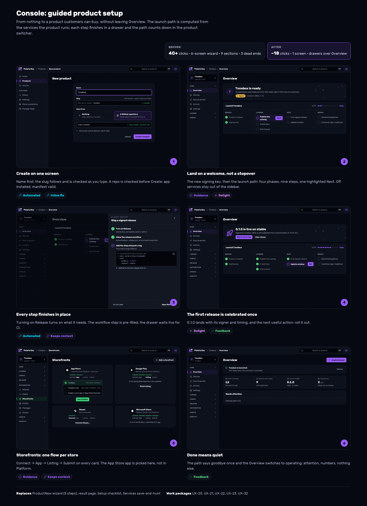

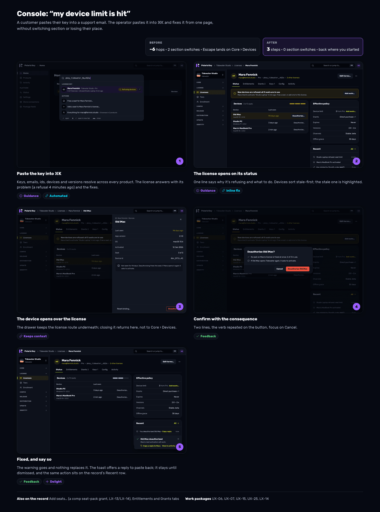

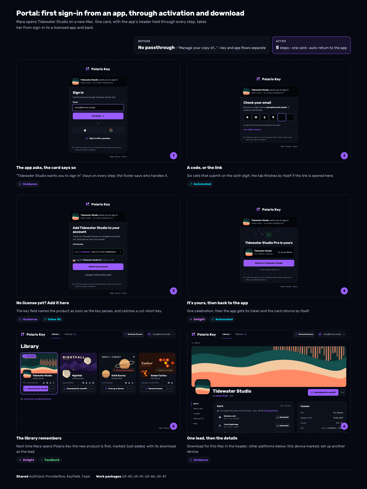

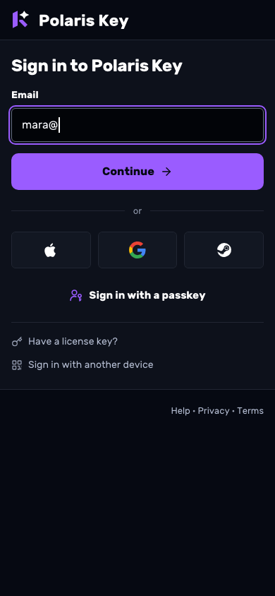
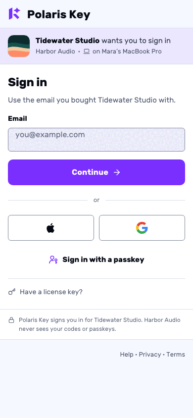
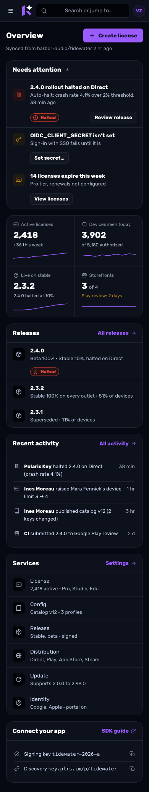

## 13. Implementation plan

### 13.1 In-flight branches this plan sequences around

Derived file by file from `git diff --name-only main...<branch>` on 2026-10-05 (main at 248fef64).
The lists are kept in `/private/tmp/claude-501/ux-unify/branchfiles/`.

| Branch                                     | Files it touches that this plan cares about                                                                                                                                                                                                                                                                                                                                                                                                                                                                                                                                                                                                                                                                                                                                                                                                                                                                                                                         |
| ------------------------------------------ | ------------------------------------------------------------------------------------------------------------------------------------------------------------------------------------------------------------------------------------------------------------------------------------------------------------------------------------------------------------------------------------------------------------------------------------------------------------------------------------------------------------------------------------------------------------------------------------------------------------------------------------------------------------------------------------------------------------------------------------------------------------------------------------------------------------------------------------------------------------------------------------------------------------------------------------------------------------------- |
| `brand/console-ux-r2` (console rounds 2/3) | `console/nav.ts`; `shell/{ProductSwitcher,Sidebar,StatePages,TopBar}`; `templates/{Dashboard,Settings}`; `components/{DeviceTable,EntityLink,PageHeader}`; pages `core/{Activity,Keys,KeysCi,KeysSecrets,Overview,Services}`, `global/{Home,ProductNew,Products}`, `license/{LicenseKeys,LicensesPage,TierRecord,TiersPage}`, `release/{ChannelLanes,PackRecord,ReleasesPage,SimulatorPage}`, `config/{CatalogEditorPage,ProfilePage,ProfilesPage}`, `platform.tsx`, `platformOperations.tsx`, `platformStores.tsx`; areas `distribution/{Credentials,Health,Rollouts}Page`, `StoreControls`, `feeds/*`, `update/FeedPage`; `ui/{Button,CodeBlock,IconButton,KeyDisplay,OrderedMultiSelect,StatusPill,Switch,Timestamp,form,data-table/*}`; `schema/ManagedField.tsx`; `styles.css`; `e2e/layout*`; tests including `test/ui/statusBadges.test.tsx`; Worker `console/auth.ts`, `core/brandHtml.ts`, `services/identity/oidc.ts`, `services/identity/portal/auth.ts` |
| `wp/A-18j-add-to-storefronts`              | `src/api.ts`; `console/{nav,routes}.ts`; `console/data/{queries,mutations}.ts`; `console/areas/storefronts/*` (new: `StorefrontsPage`, `ListingPage`, `StepCard`, `StepDialog`, `SlotBoard`, `FitReport`, `ImportPanel`, `data`); `pages/{distribution,platformStores}.tsx`; `areas/feeds/{FeedSettings,model}`; `ui/CapabilityBadge.tsx`; `e2e/csp.e2e.test.ts`; migration `0083_dist_listing_asset_acceptance.sql`; Worker storefront services and `console/handlers/platformStoreConnections.ts`                                                                                                                                                                                                                                                                                                                                                                                                                                                                 |
| `wp/I-07-login-card-email-gate`            | `portal/{api,data}.ts`, `portal/pages/SignInPage.tsx`; migrations `0079`, `0080`; Worker `services/identity/card/*`, `services/identity/portal/{api,auth,email,session,repo,index,accountSessions}.ts`, `dispatch.ts`, `env.ts`, `core/{accountCookies,singleUse,deployIdentity}.ts`; `test/brandPages.test.ts`; OpenAPI; generated SDK constants                                                                                                                                                                                                                                                                                                                                                                                                                                                                                                                                                                                                                   |
| `wp/PX-16-discover-page`                   | `portal/{App,api,data}.ts`, `portal/pages/{LibraryPage,DiscoverPage}.tsx`, `portal/components/{LibraryEmpty,DiscoverTile,DiscoverTeaser}.tsx`, `portal/model/discover.ts`, `e2e/{portal.e2e.test,portalFixtures}.ts`                                                                                                                                                                                                                                                                                                                                                                                                                                                                                                                                                                                                                                                                                                                                                |
| `wp/PX-20-portal-quality-bar`              | `portal/components/PortalShell.tsx`, `e2e/portal*` (harness, states, fixtures, quality), `package.json`, `pnpm-lock.yaml`, CI workflow                                                                                                                                                                                                                                                                                                                                                                                                                                                                                                                                                                                                                                                                                                                                                                                                                              |

Two collisions that are easy to miss: **migration numbers** (I-07 and A-18j both add `0072…`; a new
migration takes the next free number when it merges) and the **generated** `data-model.mdx` (both
regenerate it; resolve by regenerating, never by hand).

### 13.2 Gates (every package)

The full green gate from AGENTS.md, plus: **layout lint at zero** (`packages/admin/e2e/layoutProbe.ts`;
r2 currently has 2 violations on the license Keys tab that r2 must clear), **CSP e2e** and
`adminCspParity` (no inline scripts or styles, no new hosts), the **portal quality bar** (PX-20) for
portal packages, **docsLinks** (`check:links`) for any new or renamed page, the **route drift gates**
(AGENTS.md rules 3, 9–10: OpenAPI entry and `routeCoverage`) for any new Worker route (UX-06b,
UX-08b, UX-12, UX-15, UX-27, UX-29, UX-36), and the **data-model drift** (`TABLE_OWNERS`, generated
reference) for UX-15's table. None of these packages changes a signed document, `shared-protocol`,
`client-core` or `PROTOCOL_VERSION`; if one turns out to, it stops and goes through plan mode.

### 13.3 Work packages

Sizes: S ≤ 1 day, M 2–3 days, L ~1 week, XL > 1 week. **Ready** means no in-flight branch touches
any file it edits (checked against §13.1), not merely that its dependencies are done.

**Wave 0: start now** (the relayed owner request: start everything that is unblocked)

| Id     | Package                                                                                                                                                                 | Size | Files it edits (all on main, none in an in-flight branch)                                                                                                                                                                                                                                        |
| ------ | ----------------------------------------------------------------------------------------------------------------------------------------------------------------------- | ---- | ------------------------------------------------------------------------------------------------------------------------------------------------------------------------------------------------------------------------------------------------------------------------------------------------ |
| UX-01  | **Error copy routing**: `errorCopy(err, ctx)` contexts (manifest, slug, GitHub access, service coherence); never an HTTP code; field-focus hints for callers            | S    | `src/lib/errorCopy.ts` and its tests. Callers adopt it later (UX-20)                                                                                                                                                                                                                             |
| UX-03  | **Portal pill and facts sweep**: no success plate on art, tier as text, Included as a list, no Primary chip                                                             | S    | `portal/components/ProductStatus.tsx`, `portal/components/product/{LicenseCard,ProductHeader}.tsx`, `portal/pages/AccountPage.tsx`, unit tests (not `e2e/portalFixtures.ts`)                                                                                                                     |
| UX-04  | **Portal correctness**: one OS source, one device source, `not_hosted` wording, no self-pointing "View details", free-device copy without `return=`                     | M    | `portal/model/{product,libraryView}.ts`, `portal/components/product/GetItPanel.tsx`, `portal/components/QuickAction.tsx`, `portal/pages/{ProductPage,FreeDevicePage}.tsx`, unit tests                                                                                                            |
| UX-05  | **Key verdicts**: cut-short message, help hidden after a verdict, presentation name not slug; verdict slots for `license_owned` and the entries notice                  | S    | `portal/model/key.ts`, `portal/components/{KeyField,ActivateDialog}.tsx`, unit tests. PX-17 then builds its confirm on this                                                                                                                                                                      |
| UX-06a | **Palette source registry and client sources**: actions (Turn on <Service>, Create license…), ranking (current product first, Platform only on a match), recents        | M    | `console/shell/CommandPalette.tsx`, new `console/shell/palette/*`. Stays off `src/api.ts`, `data/queries.ts` and `routes.ts` (reads route helpers only)                                                                                                                                          |
| UX-08  | **Release record Status tab** on existing data: where live, halt reason from the audit detail, **Halt everywhere** (disabled already-halted rows), guided **Roll back** | M    | `console/pages/release/ReleaseRecord.tsx`, `console/areas/distribution/RolloutDialogs.tsx`, their tests. Uses existing hooks by import; the `tab` route param already accepts `status`                                                                                                           |
| UX-15  | **Refusal log** (§0.9): `license_refusals` table, write off the response path, 30-day prune, admin read per license and per product                                     | M    | New migration (numbered at merge, after I-07's and A-18j's `0072…`), new `worker/src/core/licensing/refusals.ts`, the refusal site in `worker/src/core/licensing/authz.ts`, the retention prune, `docs/scripts/gen-reference.mjs` `TABLE_OWNERS`, a new admin handler file and its OpenAPI entry |

**Wave 1a: after `brand/console-ux-r2` merges** (or stacked on its tip; see §13.4)

| Id    | Package                                                                                                                                                                                     | Size | Deps                                            |
| ----- | ------------------------------------------------------------------------------------------------------------------------------------------------------------------------------------------- | ---- | ----------------------------------------------- |
| UX-10 | **Shared-layer hygiene**: delete `src/components/ui/*`; move `DropdownMenu`; mount `AppToaster`; re-base `StatePages` on `ui/EmptyState`; promote `PageHeader`, `Panel`→`Section` to `ui/`  | M    | r2                                              |
| UX-11 | **Pill and copy sweep, console** (§11.3), including `SignedBadge` as glyph + text (r2 edits `statusBadges.test.tsx`)                                                                        | M    | r2, UX-10                                       |
| UX-13 | **Chrome**: top bar (search field, no Docs or theme buttons), `AccountMenu` with theme row, avatar off the accent (PX-22's `Avatar` when it lands), phone drawer with switcher and Platform | M    | r2, UX-10                                       |
| UX-14 | **Page anatomy**: header action budget and hub-area Settings links, `SectionRail` rule, Export in the View menu, counted facet chips replacing filtering tiles                              | M    | r2, UX-10                                       |
| UX-20 | **One-screen product create** + welcome header; drop the result page and toast                                                                                                              | M    | r2 (`ProductNew.tsx`), UX-01                    |
| UX-22 | **Service chain rule** and per-switch save on today's Services page (ST-08 later moves it into the hub)                                                                                     | S    | r2 (`Services.tsx`)                             |
| UX-23 | **Guided Releases empty state** + CI publishing editable from Release + **Link repository** (Settings → General)                                                                            | M    | r2 (`ReleasesPage.tsx`, `KeysCi.tsx`)           |
| UX-29 | **Key rotation stepper** with countdown and the refreshed-devices line (admin read, §0.9)                                                                                                   | M    | r2 (`Keys.tsx`)                                 |
| UX-31 | **Rollouts merge** (List · Matrix · Readiness) and clickable rollout rows                                                                                                                   | M    | r2 (`RolloutsPage.tsx`)                         |
| UX-33 | **Packages producer side**: Publish to this feed, inline Turn on, 1-click token                                                                                                             | M    | r2 (`feeds/*`), A-18j (`FeedSettings`, `model`) |
| UX-34 | **Catalog entry form**: progressive disclosure, Label from Key, Type guess, one Draft chip (before LX-14 adds its selects)                                                                  | S    | r2 (`CatalogEditorPage.tsx`)                    |

**Wave 1b: after r2 and A-18j both merge** (they share `nav.ts`, and A-18j owns `src/api.ts`,
`routes.ts` and `data/*`)

| Id     | Package                                                                                                                                                                          | Size | Deps                                                                                                                           |
| ------ | -------------------------------------------------------------------------------------------------------------------------------------------------------------------------------- | ---- | ------------------------------------------------------------------------------------------------------------------------------ |
| UX-02  | **Console session states**: sign-out and 401 render "You're signed out" / "Your session ended" in place with `returnTo`; no IdP bounce                                           | M    | r2 (Worker `console/auth.ts`), A-18j (`src/api.ts` 401 handler); files `console/shell/AppShell.tsx`, new `shell/SignedOut.tsx` |
| UX-06b | **Entity search**: `GET /manage/api/search`, the entity source, paste-a-key                                                                                                      | M    | A-18j (`src/api.ts`, `data/queries.ts`), UX-06a                                                                                |
| UX-07  | **License record Status tab**: health line with the last refusal, inline devices stale-first, routed device drawer, per-record recent events, Refusing devices facet in the list | L    | r2 (`DeviceTable`, `LicensesPage`), A-18j (`routes.ts`), UX-15; LX-14 later adds Entitlements and Grants after Status          |
| UX-08b | **Devices on this version**: admin read and the Status tile                                                                                                                      | S    | A-18j (`src/api.ts`), UX-08                                                                                                    |
| UX-09  | **Console dead-end copy sweep**: remove "Auto-issue in Enrollment", "see Add a credential below", "link a repository later" (until UX-23), the Sign-in methods advice            | S    | r2 (`ProductNew`, `Home`, `platformStores`), A-18j (`platformStores`)                                                          |
| UX-12  | **Attention model**: `GET /manage/api/attention` with every J-2 kind (refusal spike from UX-15); `AttentionList` on Home and Overview; switcher badge; sidebar dot               | L    | r2 (`Home`, `Overview`, `Sidebar`), A-18j (`src/api.ts`), UX-15                                                                |
| UX-25  | **Person drawer** and names instead of ids across devices, activity, rollouts and channels                                                                                       | M    | UX-06b                                                                                                                         |

**Wave 2: shared sign-in**

| Id    | Package                                                                                                                                                                                                                                                                                                                                                              | Size | Deps                                           |
| ----- | -------------------------------------------------------------------------------------------------------------------------------------------------------------------------------------------------------------------------------------------------------------------------------------------------------------------------------------------------------------------- | ---- | ---------------------------------------------- |
| UX-40 | **`AuthCard` in `ui/auth/`**: promote `LoginCard`, `ProviderRow`, `Glyphs`, `KeyField`; the step slots (§8); passkey and "Have a license key?" in `MethodsStep`                                                                                                                                                                                                      | M    | PX-20 (`PortalShell`), I-07 (`SignInPage.tsx`) |
| UX-41 | **Passthrough steps** (SIGN-IN.md §3.6–§3.10): persistent app header, `LicenseChoiceStep` (every row state, origin vocabulary: no license type label) with inline `ReplaceDevice` (2026-10-05), `ConsentStep` with Change, `KeyStep` with PX-17's confirm ("Add and use on this device") and I-09's verdicts, `ReturnStep` variants with Stay here, the library ring | L    | UX-40, PX-17, I-08 and PX-W13 (broker), I-09   |
| PX-21 | (approved, existing) **EmailGateStep** with `ProfileImport` inside the promoted card                                                                                                                                                                                                                                                                                 | M    | UX-40, PX-12, PX-W15, PX-W16                   |
| UX-42 | **Console sign-in**: identifier-first card at `/manage/login`, Continue starts PKCE or a passkey, 403 and not-configured states                                                                                                                                                                                                                                      | M    | UX-40, UX-02, r2 (`console/auth.ts`)           |
| UX-43 | **Worker twin**: `renderAuthCard()` in `brandHtml.ts`; expired code or link with Send a new code; device pages with the product header; measures test                                                                                                                                                                                                                | M    | UX-40, I-07, r2 (`brandHtml.ts`)               |
| UX-44 | **Email**: no-bit centred lockup, card radius, the code-and-link copy on I-07's template                                                                                                                                                                                                                                                                             | S    | I-07                                           |

**Wave 3: console journeys on the shared layer**

| Id    | Package                                                                                                                                                                          | Size | Deps                                                                  |
| ----- | -------------------------------------------------------------------------------------------------------------------------------------------------------------------------------- | ---- | --------------------------------------------------------------------- |
| UX-21 | **Launch path**: Worker `setup` model (unifies Home and Overview), `LaunchPath`, step drawers, polling steps with live announcements, launched line                              | XL   | UX-12, UX-20; links UX-23's panel and A-18j's flow                    |
| UX-26 | **Remaining IA moves**: Content keys → Keys & secrets, Simulator → Compatibility tab, Update feed rename, Enrollment retired once ST-08/ST-12 hold its settings                  | M    | UX-11, ST-08, ST-12; docsLinks                                        |
| UX-27 | **Server-side activity search** and global Activity with Product facet; diffs from ST-04's audit columns                                                                         | L    | r2 (`Activity.tsx`), ST-04 for diffs                                  |
| UX-30 | **Platform Status** (Deployment + Operations merged)                                                                                                                             | M    | r2 (`platform.tsx`, `platformOperations.tsx`), UX-12                  |
| UX-32 | _Superseded by Wave 5 (SETUP.md §2.14)._ **Storefronts evolution** on A-18j: launch-path entry, inline app pick in Prerequisites, tiles open App Store and Commerce, nav cleanup | M    | A-18j, UX-21; ST-12 (credentials editors), ST-13 (Listing in the hub) |
| UX-35 | **Moments of delight** (`Celebration` + one-shot keys) for first license, catalog, release, store                                                                                | S    | UX-21                                                                 |
| UX-36 | **Bulk license actions**: Select all matching, Export, Extend, Change tier, Disable (L2 count), server job, result download                                                      | L    | UX-07, ST-21; Comp in bulk after LX-14                                |
| UX-37 | **Alerts from attention**: danger kinds delivered through ST-27's destinations                                                                                                   | S    | UX-12, ST-27                                                          |

**Wave 4: portal journeys**

| Id    | Package                                                                                                                  | Size | Deps                |
| ----- | ------------------------------------------------------------------------------------------------------------------------ | ---- | ------------------- |
| UX-45 | **Library and empty-state copy** (§11.2), Discover links only with PX-16                                                 | S    | PX-16               |
| UX-46 | **Product page**: one lead, Change platform (remembered), SHA disclosure, phone collapse, Set up another device, no rail | M    | UX-04; before LX-15 |
| UX-47 | **Activation Done**: download lead, first-product moment, ring on return                                                 | S    | PX-17, UX-35        |
| UX-48 | **Account**: theme row, `DangerAction` + `ConfirmDialog`, Download my data, header Sign out removed                      | M    | UX-10, UX-13, PX-22 |
| UX-49 | **Portal on the shared kit**: `Section`, `DescriptionList`, `Callout`, `Select`, `Input`, `ErrorState`, `CommandPalette` | M    | UX-10, PX-20        |

**Wave 5: setup wizards** ([SETUP.md](SETUP.md) §8, 2026-10-05; the owner request for wizards,
per-storefront pages scoped to the builds, channels merged into storefronts and easy publishing)

| Id    | Package                                                                                                                                       | Size | Deps                                         |
| ----- | --------------------------------------------------------------------------------------------------------------------------------------------- | ---- | -------------------------------------------- |
| UX-50 | **Wizard kit**: `ui/wizard/` (page and drawer hosts, stepper, prerequisites, snippets, deep links, live waiting rows, done)                   | L    | UX-10                                        |
| UX-51 | **Setup state**: `setup_state` table and `…/setup` routes (choices, skips, assertions, requests); per-wizard step states in the `setup` model | M    | none (UX-21 reads it)                        |
| UX-52 | **Storefront catalogue declaration**: platforms, artifacts, family and plane per storefront; feed-only and link entries; conformance          | M    | A-18j                                        |
| UX-53 | **Storefronts read model**: product platforms, scope, state machine, artifact fit; `distribution.intendedPlatforms`                           | L    | UX-52, A-18j, ST-03                          |
| UX-54 | **Catalogue and storefront page shell**, Distribution nav to four items, legacy redirects                                                     | L    | UX-50, UX-53, A-18j, UX-31                   |
| UX-55 | **Storefront wizard steps**, human only (Connect, In the vendor console, Merge, Go live) under Polaris Key's `AutoList`                       | XL   | UX-54, UX-51, UX-56, UX-68, UX-69; ST-12     |
| UX-56 | **`renderOutletBlock`, `pkey storefront add` and `pkey storefronts sync`**                                                                    | M    | UX-52                                        |
| UX-57 | **Storefront status pages** (Status, Releases, Listing, Commerce, Setup)                                                                      | L    | UX-54, UX-31, A-18m                          |
| UX-58 | **Publish everywhere**: one dialog and route per release, batch confirmation                                                                  | L    | UX-57, UX-08, A-18j; security review         |
| UX-59 | **SDK quick-start correctness now**: `pkg.plrs.im` registry line, missing languages, valid Godot resource, staged pins                        | S    | none                                         |
| UX-60 | **Shared SDK setup generator** `renderSdkSetup` with goldens and per-SDK parse checks                                                         | M    | F-10; SP-02 amended                          |
| UX-61 | **Connect your app** page, Verify, test license, release keys read, Overview's compact panel                                                  | L    | UX-50, UX-51, UX-60; ST-08                   |
| UX-62 | **Publish from CI** drawer: two steps for you; environment, ruleset, trust policy and workflow by Polaris Key; `renderCiWorkflow`             | L    | UX-23, UX-50, UX-61                          |
| UX-63 | **License and Config quick starts**, human steps only                                                                                         | L    | UX-50, UX-34; ST-12                          |
| UX-64 | **Signing key, Update feed and Access** inline setup, scoped by platform                                                                      | M    | UX-50, UX-53, UX-29                          |
| UX-65 | **Customer sign-in wizard**                                                                                                                   | M    | UX-50, ST-12, ST-14                          |
| UX-66 | **Empty-state and service-off sweep** for every console page                                                                                  | L    | UX-50, UX-10, UX-09                          |
| UX-67 | **Platform ready** checklist                                                                                                                  | M    | UX-50, UX-30, ST-09                          |
| UX-68 | **Setup runner**: performs each storefront's automated actions after the Set up consent; prepares submissions; fills testing tracks           | L    | UX-51, UX-52, UX-53, A-18j                   |
| UX-69 | **Live credential check** on paste for store keys and CI secrets                                                                              | M    | none                                         |
| UX-70 | **GitHub write path**: the setup pull request, repositories, environment, ruleset, CI secrets                                                 | L    | owner action (App permissions); UX-51, UX-56 |
| UX-71 | **CI installation-token exchange** for tap and bucket pull requests (no personal token)                                                       | M    | UX-70; security review                       |

SETUP.md §8.3 lists the amendments this wave makes to UX-21, UX-23, UX-33, UX-09, PS-06, HA-06,
ST-08, ST-12, SP-02 and UI-KITS.md §4.2, and §8.5 its sequencing.

**Wave 6: flows** ([FLOWS.md](FLOWS.md) §4, 2026-10-05; the owner request to make New Product as
friendly as the new flows and to bring every flow up to date)

| Id    | Package                                                                                                                                          | Size | Deps                                |
| ----- | ------------------------------------------------------------------------------------------------------------------------------------------------ | ---- | ----------------------------------- |
| UX-72 | **Create probes**: repositories the app can read, the create dry run with its digest pin, the slug check; `link-repo` returns the product        | M    | none                                |
| UX-73 | **Create with defaults**: services, planned platforms, accent, the starter Free tier and the release-workflow trust in create's one batch        | M    | UX-72                               |
| UX-74 | **New Product wizard**: Where it starts (picker), Check, Name it, What it's for, Creating; a shared `ManifestProblems`                           | L    | UX-50, UX-72, UX-73; UX-70 optional |
| UX-75 | **Ready moment**: the Overview hero with verified facts and the two next actions, the shared-element tile, the one-shot check and burst          | M    | UX-74, UX-51; UX-21, UX-80          |
| UX-76 | **Presentation in create**: the derived accent, swatches, the icon from HA-05                                                                    | S    | UX-74, UX-73; HA-05                 |
| UX-77 | **Console flow conformance**: first focus, focus return, step focus and announcements, action-named primaries, unsaved guards, one "Shown once." | M    | UX-10                               |
| UX-78 | **One resync flow**: one dialog and one result for five entry points                                                                             | M    | none; ST-17 adopts it               |
| UX-79 | **Portal flow conformance**: the Discover count fix, focus after steps, refusals, removals and ⌘K                                                | M    | PX-20; PX-16                        |
| UX-80 | **Flow motion**: S-23's step travel, morph, check draw and burst in the wizard kit, dialogs and the portal                                       | M    | S-23 MO-01, MO-02; UX-50, UX-35     |
| UX-81 | **Flow lint**: an e2e probe that checks §2's checkable rules on every fixture flow                                                               | M    | UX-77, UX-79, UX-50                 |

FLOWS.md §4.3 lists the amendments this wave makes to §0.4 S1, §0.7, SETUP.md §1.1 and §5.1, UX-21,
UX-50, UX-51, UX-53, UX-63, UX-35, UX-11, UX-43, SIGN-IN.md §3.18 and S-23, and §4.4 its
sequencing.

**Licence holders (S-24, [notes/S-24](../research/2026-09-29-godot-omniplatform/notes/S-24-licence-holders.md) §13)** run beside these waves too: LX-26 to LX-31 (the Worker
holder model, create with a device limit and delivery, bulk floating keys, the **New license**
wizard that replaces Create license, the holder surfaces, the close-out), PX-W18 ⚑ and UK-44 ⚑ (sign-in
hints, plan mode), PX-23 (the portal's floating keys) and UK-42 and UK-43 (the kits' Done step after a
key). LX-29 takes over UX-77's Create license part (FLOWS.md §4.3).

**Dropped or merged** (§0.8): UX-32 (superseded by Wave 5, SETUP.md §2.14), UX-24 (into LX-14 as Add seats…), UX-28 (into ST-07 and ST-16), the
old UX-09 editor (into ST-12). UX-26 and UX-30 shrank to what S-18 does not cover.

**Motion (phase MO, [notes/S-23](../research/2026-09-29-godot-omniplatform/notes/S-23-motion-system.md) §10)** runs beside these waves, not inside them:
MO-01 (brand tokens) and MO-02 (the layer) touch no file these packages edit; MO-10 waits for UX-10,
MO-11 for UX-29 and the `Overview.tsx` packages, MO-12 for UX-10's menus. A UX package that builds a
pattern of §7.2 (UX-29's countdown, UX-12's attention list, UX-07's routed drawer) uses the MO-02
layer once it has landed and otherwise leaves the motion to its MO package.

### 13.4 Sequencing (nothing collides)

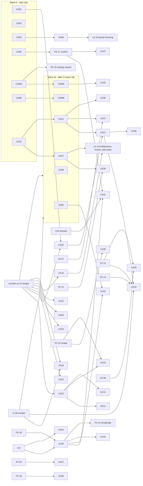

- **Wave 6** (flows) is sequenced in [FLOWS.md §4.4](FLOWS.md#44-sequencing): UX-72, UX-77,
  UX-78 and UX-79's Discover fix start now; New Product follows UX-50; the flow lint lands last.
- **Wave 5** (setup wizards) is sequenced in [SETUP.md §8.5](SETUP.md#85-sequencing): UX-59, UX-51
  and UX-60 start now; the storefront packages follow A-18j; the console packages follow UX-50.
- **Start today, in parallel:** UX-01, UX-03, UX-04, UX-05, UX-06a, UX-08 and UX-15. Each edits
  only files that no in-flight branch touches (§13.3 lists them). UX-06a must stay off `src/api.ts`,
  `data/queries.ts` and `routes.ts`; UX-15 picks its migration number when it merges.
- **The two highest-value console journeys do not wait for the hygiene pass.** UX-20 (one-screen
  create) and UX-23 (guided Releases empty state) need only r2: they can **stack on r2's tip now**
  and rebase when it merges, in parallel with UX-10. UX-22, UX-29, UX-31 and UX-34 can stack on r2
  the same way. UX-21 (the launch path) follows UX-20 and UX-12; it links to UX-23's panel rather
  than depending on it.
- Only one package at a time touches `shell/` and `templates/` after r2 (UX-10, then UX-13 and UX-14
  in sequence); page-level packages run in parallel.
- Portal packages that touch `LibraryPage`/`LibraryEmpty` wait for PX-16; anything touching
  `PortalShell`, `portalFixtures.ts` or `SignInPage` waits for PX-20 and I-07.
- Approved packages keep their owners: ST-07/ST-08/ST-09/ST-10/ST-12/ST-14/ST-16/ST-27, LX-14,
  LX-15, PX-17, PX-21 and PX-22 are not re-briefed by this document; it supplies the design detail
  §0.8 names, and their briefs' "Read first" should add EXPERIENCE.md §0.8.

## 14. Superseded sections in ADMIN.md and PORTAL.md

| Doc       | Section                                                     | Superseded by                                                             |
| --------- | ----------------------------------------------------------- | ------------------------------------------------------------------------- |
| ADMIN.md  | §2.2 Global elements                                        | §5.1 (top bar, account menu, palette sources)                             |
| ADMIN.md  | §2.3 Sections and pages (the page list)                     | §0.2 (sections kept; pages consolidated)                                  |
| ADMIN.md  | T1 Overview, §6.1 Console home, §6.2 Product overview       | §0.3 J-2, J-3; §4; mockup 05                                              |
| ADMIN.md  | T4 Settings (rail rule, save bar)                           | S-18 §4.9 (hub, `SettingsRow` v2, save model); §4 for the rail rule       |
| ADMIN.md  | T6 Flow (wizard) for product creation                       | §0.4 S1                                                                   |
| ADMIN.md  | T8 State pages                                              | §9                                                                        |
| ADMIN.md  | §4 Component system (kit split)                             | §3                                                                        |
| ADMIN.md  | §5.2 Destructive-action policy (patterns)                   | §7 (levels kept, patterns unified)                                        |
| ADMIN.md  | §5.8 Copy                                                   | §2, §11                                                                   |
| ADMIN.md  | §6.4 Distribution matrix (as a separate page from Rollouts) | §0.2, §10 C7                                                              |
| ADMIN.md  | §6.5.2 License record (tab order)                           | §0.5 O1 (with S-19 §7.11's Entitlements and Grants tabs)                  |
| ADMIN.md  | §6.5.1 Create license dialog (S-24)                         | notes/S-24 §8: the New license wizard (LX-29); holder column §8.8 (LX-30) |
| ADMIN.md  | §6.7 Keys & secrets (scope)                                 | §10 C10                                                                   |
| ADMIN.md  | §6.8 Activity (client-side search)                          | §0.5 O6                                                                   |
| ADMIN.md  | §6.9 Settings (Services as a page)                          | S-18 §4.9 (product settings hub); §10 C3                                  |
| ADMIN.md  | §2.3 Distribution Storefronts and Listing rows (A-18j)      | §0.4 S5 (A-18j's flow kept, nav evolved)                                  |
| ADMIN.md  | §6.10 Customer portal                                       | PORTAL.md, as amended here                                                |
| PORTAL.md | §4.1 The login card (component ownership, footer line)      | §8 (measures and steps kept)                                              |
| PORTAL.md | §4.2 Product context (header copy)                          | §8, §11.1                                                                 |
| PORTAL.md | §4.12 Library empty (footer advice)                         | §11.2                                                                     |
| PORTAL.md | §4.20 Product page (lead, status chips, Get it)             | §0.6 P3–P4, mockup 09                                                     |
| PORTAL.md | §4.26 Account (Appearance, Sign out, Delete)                | §0.6 P5 (Profile and `Avatar` stay PX-22's, §4.30)                        |
| PORTAL.md | §4.17 Confirm and Done, §4.20 origins, §4.26 Remove (S-24)  | notes/S-24 §10 (PX-23)                                                    |
| PORTAL.md | §5.1–5.3 Components and status model                        | §3, §7                                                                    |
| PORTAL.md | §6.1 Copy rules                                             | §2, §11                                                                   |

**Sign-in:** [SIGN-IN.md](SIGN-IN.md) supersedes §0.6 P1, §8 and §11.1's sign-in rows here, and the
PORTAL.md and ADMIN.md sign-in sections, where they differ.

**Not superseded:** PORTAL.md §3.2's phone bottom bar (Activate as the middle pill), §4.17–§4.19
(Activate, PX-17), §4.29 (email gate, PX-21) and §4.30 (Profile, PX-22) stand as approved; this
document places them in the shared card and adds copy around them. S-18 and S-19 stand as decided.
