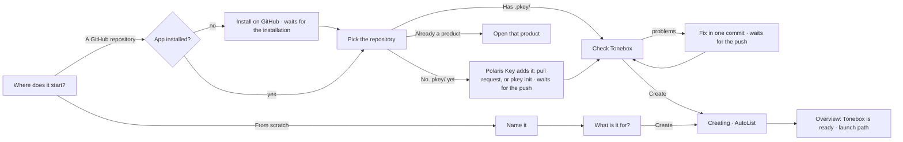
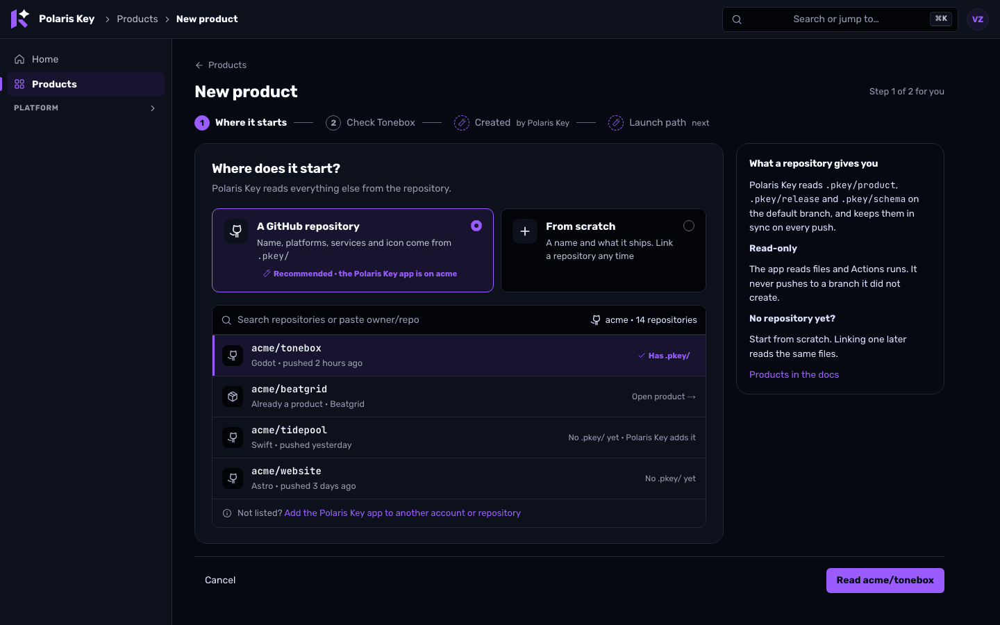
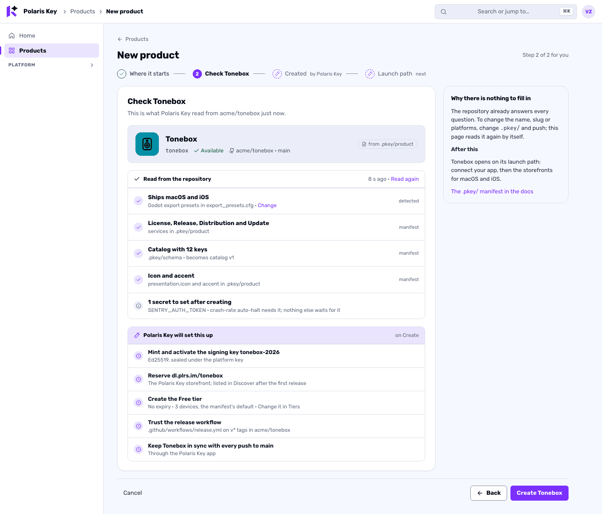
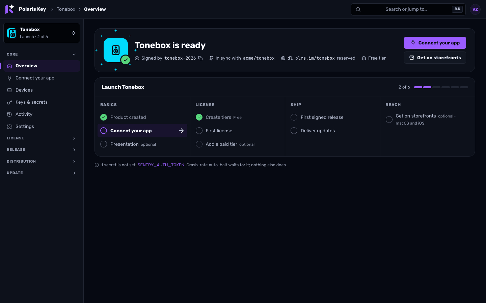
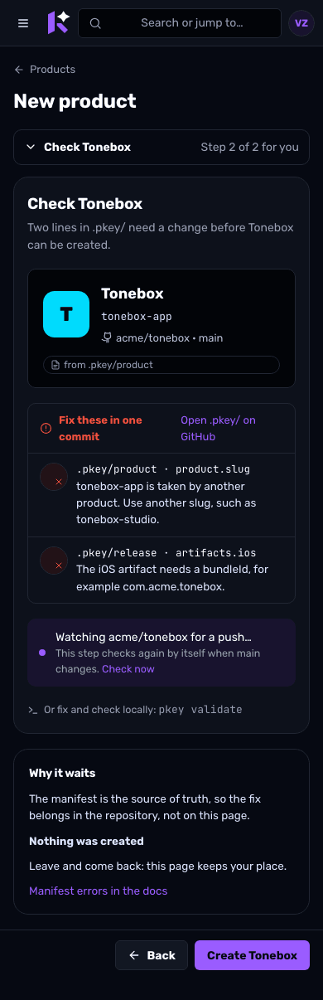
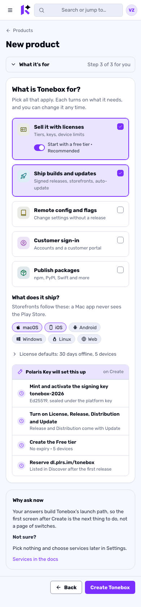
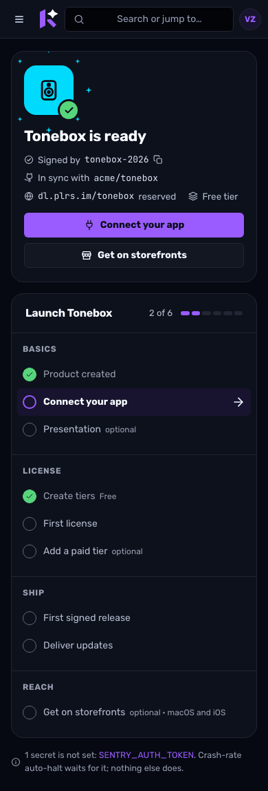
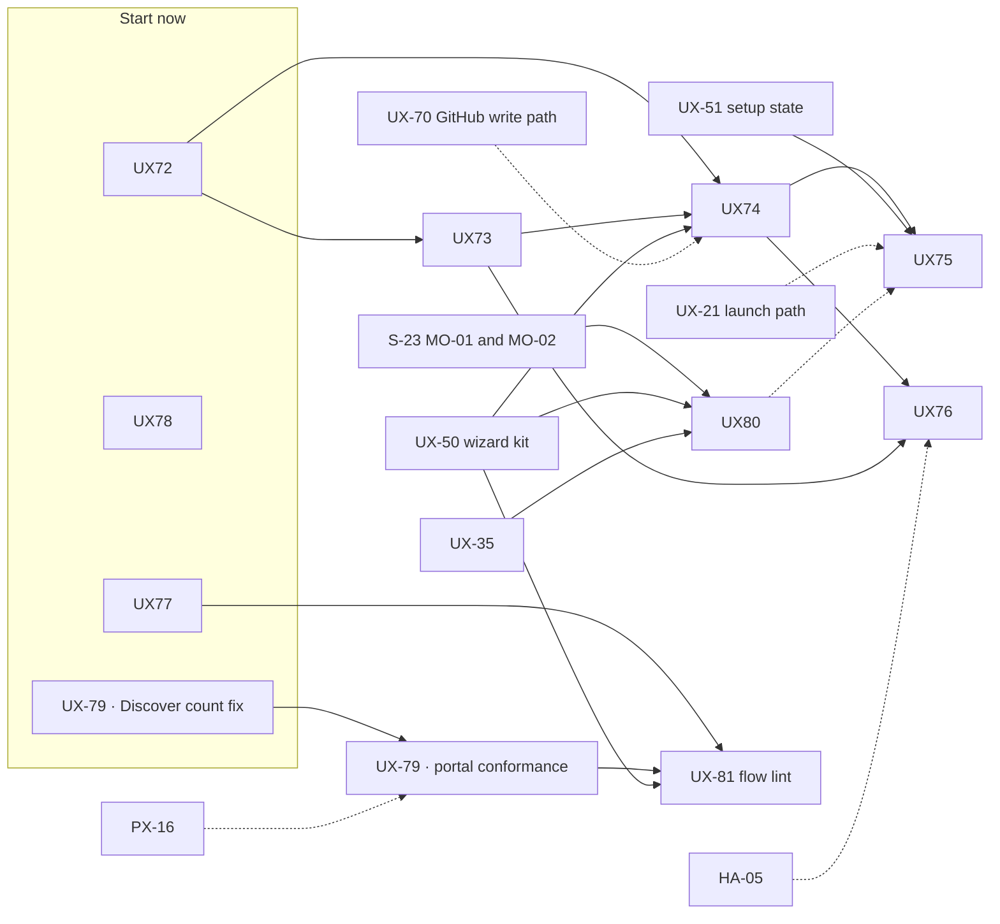

# Polaris Key flows: an audit of every flow, the rules they share, and the New Product wizard

**Status:** proposed, 2026-10-05. **Owner request (verbatim, 2026-10-05):** "Let's clean up the 'New
Product' flow, make it as user friendly as the other new flows we're building. In fact, audit all
existing flows/wizards and ensure they're all up to date."

> **Amended by S-24 (2026-10-06).** [notes/S-24](../research/2026-09-29-godot-omniplatform/notes/S-24-licence-holders.md) redesigns **Create license** (C-17) as the **New
> License** wizard: a five-step drawer (Product and tier, Who it's for, Limits, Delivery, Review)
> that issues assigned or floating licences, single or in a labelled batch (LX-29). Edit holder (C-20)
> becomes **Assign…** and **Reassign…** on the licence record (LX-30), and Activate a license (P-5)
> gains the floating key's "devices come with it" copy (PX-23). UX-77's Create license fixes move to
> LX-29, which meets §2 by construction. Mockups: [licenses/](licenses/) frames 70–77 and 80–81.

**What this document is.**

1. An **inventory** of every multi-step flow, wizard, dialog flow and guided path in the console, the
   customer portal and the Worker's pages, as built on `main` and on the branches still in flight,
   each marked **current**, **update** or **redesign** with its reason and the package that fixes it
   (§1).
2. The **rules every flow follows** (§2). They extend SETUP.md §1's wizard pattern from setup to every
   flow, and add nothing that an approved spec has not already decided.
3. The **New Product** redesign, end to end, as a first-class wizard in the shared kit, with a
   storyboard, the motion and HTML mockups in both themes at 1440 and 390 (§3).
4. The **implementation plan**: Wave 6, packages UX-72 to UX-81, which EXPERIENCE.md §13.3 lists
   (§4).

**Relationship to the other specs.** This document follows [EXPERIENCE.md](EXPERIENCE.md) (copy,
components, confirmations, journeys), [SETUP.md](SETUP.md) (the wizard kit, setup state, the
automation rule) and [SIGN-IN.md](SIGN-IN.md) (every sign-in step and its motion). For **New
Product** it wins over EXPERIENCE §0.4 S1's one-screen shape and over SETUP §5.1's placement of the
goals and platforms questions (§3.10). For everything else it adds only the inventory and the
cross-flow rules: where a flow already has an owning spec or package, that owner stays in charge and
this document names it. The approved programs stand as decided (S-18 `ST-*`, S-19 `LX-*`, S-20
`HA-*`, S-21 `PS-*`, the A-18 storefront layer, SIGN-IN.md's owner decisions). The motion vocabulary
is the S-23 spike's (`spike/S-23-motion`), as SIGN-IN.md §3.18 already defers to it.

**Evidence.** Three audits ran on 2026-10-05 against the real apps, built into scratch from `main`
(at 043e99291, which had just merged `integ/ux-1a-ha` with UX-10, UX-20, UX-22, UX-31, UX-34, HA-01
and HA-04) and from every in-flight branch, driven in Chromium from the e2e fixtures under the
Worker's CSP, and screenshotted at 1440 × 900 and 390 × 844 in dark and light. During the audit
UX-23, UX-29 and `feat/license-delete` merged too; their flows are judged as merged. Screenshots,
page text, the focused element and live-region text per shot are under
`/private/tmp/claude-501/flows-audit/`: `console-main/shots/` (`tour`, `a`, `b`, `d`, `zero`,
`ux23`), `branches/shots/` (`create`, `integ`, `UX-23`, `UX-29`, `identity-store-1`,
`license-delete`, `LX-14a`, `I-26`) and `portal/shots/` (`main`, `ids`, `ids-discover`, `worker`).
Flows are cited by their inventory id (C-17, B-1, P-5).

**Standing owner rules** (EXPERIENCE.md, restated): no implementation-status or "coming soon" copy;
pills only for issues, right-aligned; settings controls right-aligned; every sidebar item has an
icon and only the active section is open; Platform is hidden inside a product; the portal is
"Polaris Key"; everything is CSP-safe and the layout lint stays at zero.

---

## Contents

- [Owner decisions (delegated to Claude, 2026-10-05)](#owner-decisions-delegated-to-claude-2026-10-05)
- [0. What the audit found](#0-what-the-audit-found)
- [1. The inventory](#1-the-inventory)
- [2. Rules every flow follows](#2-rules-every-flow-follows)
- [3. New Product, redesigned](#3-new-product-redesigned)
- [4. Implementation plan: Wave 6, flows](#4-implementation-plan-wave-6-flows)

---

## Owner decisions (delegated to Claude, 2026-10-05)

The owner delegated these to the lead. Each records the recommendation, the reason and where it is
worked out.

| #   | Decision                                                                                                                                                                                                                                                                                                                                                                                 | Why                                                                                                                                                                                                                                          | Where       |
| --- | ---------------------------------------------------------------------------------------------------------------------------------------------------------------------------------------------------------------------------------------------------------------------------------------------------------------------------------------------------------------------------------------- | -------------------------------------------------------------------------------------------------------------------------------------------------------------------------------------------------------------------------------------------- | ----------- |
| F1  | **New Product is a page-hosted wizard in the SETUP.md kit**: two steps for you from a repository, three from scratch, then Polaris Key's ✦ Created and the launch path. It supersedes EXPERIENCE §0.4 S1's one-screen shape and keeps its substance                                                                                                                                      | The owner asked for it to be "as user friendly as the other new flows". One screen could not hold a repository check, a preview, goals and platforms without becoming the long form S1 removed; the kit makes it look like every other setup | §3.2, §3.10 |
| F2  | **A repository is the recommended start whenever the Polaris Key app is installed anywhere**, chosen from a list of the repositories the app can read (W22), with paste still accepted. From scratch stays a first-class card                                                                                                                                                            | A typed `owner/repo` is a guess the console can answer itself (SETUP D19: never ask for what GitHub knows)                                                                                                                                   | §3.4        |
| F3  | **Nothing exists until Create.** The repository path dry-runs the link (W23) and shows the product as it will be; drafts live in the URL and `sessionStorage`, never on the server                                                                                                                                                                                                       | No orphan products, no half-registered repositories, and the GitHub path's errors arrive before the click instead of after it (UX-20's admitted gap)                                                                                         | §3.4, §3.7  |
| F4  | **On the repository path the manifest wins.** No name, slug or service fields; problems are listed with file and path and fixed by a push, which the page watches and re-reads by itself. Platforms are the one editable answer (saved as planned platforms, which the manifest does not declare)                                                                                        | AGENTS.md and SETUP D9: `.pkey/` is the source of truth. A console field that the next resync overwrites would be a lie                                                                                                                      | §3.4        |
| F5  | **Goals and platforms are asked inside the wizard** (scratch) or read from the manifest (repository). SETUP §5.1's questions on Overview remain only for products created through the API or `pkey`, or after **I'll choose later**                                                                                                                                                      | One place to answer, before the launch path is built from the answers; the first screen after Create is then the next action, not more questions                                                                                             | §3.4, §3.10 |
| F6  | **Recommended defaults, applied and labelled**: from scratch, **Sell it with licenses** and **Ship builds and updates** are preselected; License comes with a **Free tier** (rank 0, no expiry, the product's default devices) behind one switch that is on. A paid tier is never invented: the Licensing quick start's first step becomes the optional **Add a paid tier**              | A free tier is what every licensed product needs before its first activation; a price and a paid tier are business decisions only the person can make (SETUP D22, D32)                                                                       | §3.5, §3.10 |
| F7  | **The signing key is minted and activated at create, named `<slug>-<year>`**, and never asked (SETUP D29). The console drops the signing-kid override; the API keeps `signingKid`                                                                                                                                                                                                        | There is exactly one right answer                                                                                                                                                                                                            | §3.5        |
| F8  | **The Polaris Key storefront needs no answer**: `dl.plrs.im/<slug>` is reserved at create and the listing keeps S-21's decided defaults (`auto`, audience `eligible`); the plan row says so                                                                                                                                                                                              | SETUP D8 and D48; S-21 decided the defaults; showing them as a row is the honesty D34 asks for                                                                                                                                               | §3.5        |
| F9  | **A repository product trusts its release workflow at create** (the trusted-publisher policy for `.github/workflows/release.yml` on `v*` tags) when the file exists; otherwise Publish from CI creates it later                                                                                                                                                                          | SETUP D19 and D48 derive the policy from the repository; doing it at create removes a Publish from CI row for every repository that already has the workflow                                                                                 | §3.5        |
| F10 | **Icon and accent come from `.pkey/product` `presentation`** (HA-04, on `main`) on the repository path, the icon fetched once HA-05 lands; from scratch, an accent is derived from the name (one of the seven service hues) and changed with swatches, stored in the product's existing branding record that the portal already reads; the icon is uploaded after create (HA-06)         | A product should look like itself from the first second, without a design step, and nothing new is invented for storage                                                                                                                      | §3.4        |
| F11 | **The success moment is on Overview, not a result page**: the product tile carried over as a shared element, "Tonebox is ready" with verified facts only, one check draw and one burst in the product's accent, **once per product**, recorded server-side in `setup_state`                                                                                                              | EXPERIENCE §0.7's one-shot rule and §7's "no toast for what the page shows"; a server record stops a second device or operator replaying it                                                                                                  | §3.6        |
| F12 | **The two next actions are the launch path's first two open steps**, computed, not hard-coded: normally **Connect your app** and **Get on storefronts**                                                                                                                                                                                                                                  | The owner's "finishing straight into the launch path"; computing them keeps the hero and the launch path from disagreeing                                                                                                                    | §3.6        |
| F13 | **Create is one batch**: product, signing key, catalog, services, Free tier and trust policy commit together or not at all. The live `AutoList` shows what was done; it never shows a half-made product                                                                                                                                                                                  | The existing invariant ("a product never exists without a usable signing key") extended to everything create now does                                                                                                                        | §3.4        |
| F14 | **A repository without `.pkey/` gets it from Polaris Key**: a `pkey/setup` pull request with a generated `.pkey/product` and `.pkey/release` when the app may write (UX-70), else `pkey init` as one command; the wizard waits for the push and then checks. It never creates a product ahead of its manifest                                                                            | Keeps F4 true and turns the most common dead end ("my repository has no manifest") into one merge                                                                                                                                            | §3.4        |
| F15 | **A repository that is already a product opens that product**; it is never offered for a second registration                                                                                                                                                                                                                                                                             | link-repo refuses it anyway; the console should not offer what the Worker will refuse                                                                                                                                                        | §3.4        |
| F16 | **Creating a product stays a platform-admin action** (`handlers/products.ts`). Anyone else can fill in the wizard and gets **Ask a platform admin**, which copies the wizard's URL with the draft and adds a setup request                                                                                                                                                               | SETUP D12's pattern; no dead end, no change to who may create                                                                                                                                                                                | §3.7        |
| F17 | **Inventory statuses mean**: _current_, the flow already meets §2's rules and the newer specs (copy nits at most); _update_, the shape is right and listed items must change; _redesign_, the shape is wrong or the flow is specified but not built. In-flight work is judged as it stands on its branch                                                                                 | One reading for every row, so the counts mean something                                                                                                                                                                                      | §1          |
| F18 | **§2's rules apply to every flow, not only setup**: dialogs, drawers, the portal's cards and the Worker's pages. New flows are reviewed against them; Wave 6 brings the existing ones there                                                                                                                                                                                              | The audit found the newer flows consistent with each other and the older dialogs consistent with nothing                                                                                                                                     | §2, §4      |
| F19 | **One motion vocabulary: S-23's.** Its tokens (`micro`, `fast`, `base`, `slow`, `deliberate`; `standard`, `enter`, `exit`, `emphasized`, `spring`; a 24 ms stagger capped at 8) and patterns are the names every flow uses. SIGN-IN.md §3.18's proposed `quick`, `moderate` and 30 ms stagger give way, as §3.18 itself allows. Until MO-01 and MO-02 land, the existing tokens stand in | SIGN-IN and S-23 already say S-23 wins; three vocabularies would drift                                                                                                                                                                       | §2, §3.8    |
| F20 | **Celebrations are the one motion allowed past 300 ms**: the check draw and the burst run at `deliberate` (480 ms). The burst's sparks are **small four-point stars** in the section's or product's accent (EXPERIENCE §0.7's "the stationary star scattered"), not round dots; the Polaris mark itself never moves (BRAND §7.5)                                                         | Settles the three conflicts the audit found between S-23 (480 ms, round sparks), SIGN-IN (150–300 ms, star particles) and EXPERIENCE §0.7 (stars, slow): a one-off reward can take longer than a transition, and the stars are on-brand      | §3.8        |
| F21 | **Signing key rotation stays the inline strip UX-29 built** on Keys & secrets, not a drawer wizard as SETUP §1.1's host table lists it                                                                                                                                                                                                                                                   | A rotation spans a trust window of minutes to hours; the strip is its live status as well as its steps, and it already meets §2 (C-6). SETUP §1.1 is amended                                                                                 | §1.1, §4.3  |

---

## 0. What the audit found

**77 flows**: 56 in the console on `main`, 5 that only in-flight branches add, and 16 in the portal
and the Worker's pages. **13 are current, 48 need an update and 16 need a redesign** (§1.4; S-24
later moved C-17 to redesign, so 47 and 17). The
newest flows already look like one system: the signing-key rotation strip (UX-29), Halt everywhere
and Roll back (UX-08), license deletion, and Link repository (UX-23), the best match for the kit.
The older ones match nothing in particular. What repeats:

1. **New Product is the weakest first impression.** UX-20 fixed the six-screen flow, but the GitHub
   path still checks nothing before Link, offers no picker, previews nothing, asks no goals or
   platforms, and on success shows the slug instead of the name ("tonebox is ready") because
   `link-repo` returns no `product` (C-1, C-2). Then Overview says "This product runs no services
   yet" (C-4).
2. **Focus and announcements are missing almost everywhere.** Dialogs and drawers put first focus on
   Close; step changes leave focus on the dialog container (C-17, P-5); Escape from a controlled
   confirm leaves focus on `body` (C-5); a refused submit or a removal drops focus to `body` (P-5,
   P-7); no console flow announces a step change or a result.
3. **The primary rarely names its action** ("Next", "Continue" beside a step's own button, C-17,
   C-43, B-1), and two flows exceed five steps (App Store distribute C-43, Add to storefronts B-1).
4. **Ask-what-we-know survives in the oldest forms**: the trusted publisher asks for numeric GitHub
   ids (C-8), outlet credentials are checked by format only (C-46), Store connections has no connect
   flow at all (C-52).
5. **Five resync entry points, five confirm texts, one result panel** (C-10, C-56).
6. **Healthy pills and implementation copy** in most flows (Active, Valid, Connected, Healthy; "the
   truth store", "answers not-configured"), and two phrasings of "shown once".
7. **No flow moves.** Only dialogs fade in; there is no step transition, success mark or celebration
   anywhere, and EXPERIENCE §0.7's moments are unbuilt.
8. **A live contradiction on `main`**: the portal's nav says "Discover 4" while the Discover page
   says "Nothing to add" (P-13), the dead end EXPERIENCE P6 forbids.
9. **Specified but unbuilt**: console sign-in (C-16), license grants (C-28), the portal's linked
   sign-in methods (P-11), device approval (P-15) and the passthrough card (P-16) are owned by their
   packages and only listed here.

## 1. The inventory

Statuses follow F17. "Package" is the package that brings the flow to §2's rules: an existing one
where it already covers the change, or a Wave 6 package (§4.2, in bold).

### 1.1 Console, on `main`

| #    | Flow                                                               | Where                                                                                 | Host · steps                                                          | Status       | Why                                                                                                                                                                                                                                                 | Package                                           |
| ---- | ------------------------------------------------------------------ | ------------------------------------------------------------------------------------- | --------------------------------------------------------------------- | ------------ | --------------------------------------------------------------------------------------------------------------------------------------------------------------------------------------------------------------------------------------------------- | ------------------------------------------------- |
| C-1  | **New product**                                                    | `global/ProductNew.tsx` (UX-20)                                                       | page · 1                                                              | **redesign** | Not a kit wizard; the GitHub path checks nothing before Link and has no picker; no preview, platforms, goals, icon or accent; the slug check reads the cached registry on every keystroke and re-announces; "Install the GitHub App" opens the docs | §3: **UX-72 to UX-76**                            |
| C-2  | Welcome after create                                               | `core/Welcome.tsx`                                                                    | inline banner · 1                                                     | **redesign** | A `sessionStorage` banner lost on refresh; shows the slug for linked products; not announced or focused; sits above "This product runs no services yet"; no launch path, no celebration                                                             | §3.6: **UX-75**                                   |
| C-3  | Home first run                                                     | `global/Home.tsx`                                                                     | page · 0                                                              | update       | "Link a repository" and "Start manually" should open the wizard's two cards (`?from=`); "0 products" subtitle                                                                                                                                       | **UX-74**, UX-11                                  |
| C-4  | Overview setup checklist                                           | `core/Overview.tsx`                                                                   | inline                                                                | **redesign** | Not the launch path; a "5 of 7 done" pill; "Setup checklist" shows nothing on a product with no services; "Set" does not preselect the secret                                                                                                       | UX-21, UX-50 `SetupRow`                           |
| C-5  | Services switches and chain                                        | `core/Services.tsx` (UX-22)                                                           | page + L1 · 1–2                                                       | update       | The chain rule and undo are right; "truth store" and "answer not-configured" copy; Escape from the controlled confirm leaves focus on `body`                                                                                                        | UX-11, **UX-77**                                  |
| C-6  | Signing key rotation: prepare, trust window, activate, retire      | `core/Keys.tsx` (UX-29)                                                               | inline strip · 4                                                      | current      | Matches O3, with the countdown and the refreshed-devices line. Nits: healthy pills, the truncated "Activate djdl-2026-b2…"                                                                                                                          | UX-11; stays inline (F21)                         |
| C-7  | Set secret                                                         | `core/KeysSecrets.tsx`                                                                | drawer · 1                                                            | update       | Two phrasings of "never shown again"; a "Replace the existing value" tick; links do not preselect the name (`?secret=`)                                                                                                                             | UX-11, **UX-77**                                  |
| C-8  | Trusted publisher                                                  | `core/KeysCi.tsx`                                                                     | drawer · 1                                                            | **redesign** | Asks for the numeric repository and owner ids, workflow and environment GitHub already knows; nothing verified                                                                                                                                      | UX-62 (with UX-70)                                |
| C-9  | Issue a CI token, shown once                                       | `core/KeysCi.tsx`                                                                     | dialog → secret · 2                                                   | update       | "I've stored this ci token"; first focus on Close; healthy "Active" pill                                                                                                                                                                            | UX-11, **UX-77**                                  |
| C-10 | Resync from the repository                                         | Settings, RepoSync, Enrollment, Sign-in                                               | L1 confirm · 1–2                                                      | update       | Four confirm texts here and a fifth on Products; only Settings shows the result, below the fold, unfocused                                                                                                                                          | **UX-78**                                         |
| C-11 | Link a repository                                                  | `core/LinkRepository.tsx` (UX-23)                                                     | drawer · 2 (Check, Link)                                              | update       | The best kit match: check rows, a plan, a digest-pinned Link. Manifest problems render differently from C-1's; the App refusal offers no install button; focus after Check goes to the container                                                    | **UX-74** (shared `ManifestProblems`)             |
| C-12 | Delete product                                                     | `components/DeleteProductDialog.tsx`                                                  | L3 dialog · 1                                                         | update       | The description repeats the bullets; "tombstoned" in the toast                                                                                                                                                                                      | UX-11                                             |
| C-13 | Device drawer: reset binding, deauthorize                          | `components/DeviceDrawer.tsx`                                                         | routed drawer + L1/L2 · 1                                             | update       | Escape returns focus to the page `h1`, not the row; "Deauthorize" without its object; ids instead of names                                                                                                                                          | UX-07, UX-25                                      |
| C-14 | Command palette actions                                            | `shell/CommandPalette.tsx`, `palette/*` (UX-06a)                                      | dialog · 1                                                            | update       | "Turn on X" only navigates; no entity search                                                                                                                                                                                                        | UX-06b                                            |
| C-15 | Shortcuts, phone navigation, account menu                          | `shell/*`                                                                             | dialog · 1                                                            | current      | —                                                                                                                                                                                                                                                   | UX-13                                             |
| C-16 | Console sign-in, signed out, session ended                         | Worker `admin/auth.ts`                                                                | redirect · 0                                                          | **redesign** | No card: straight to the identity provider; bare error pages; "Retry"                                                                                                                                                                               | UX-02, UX-42, UX-43                               |
| C-17 | Create license → **New license** (S-24)                            | `license/CreateLicenseDialog.tsx`                                                     | drawer · 5 (Product and tier, Who it's for, Limits, Delivery, Review) | **redesign** | Requires a name and email (no floating licence), no device limit, no count, no delivery; plus the §2 gaps above (focus, "Next", Escape drops the draft). S-24 §8 redesigns it                                                                       | **LX-29** (supersedes UX-77's part), UX-63, UX-35 |
| C-18 | Bulk disable and enable                                            | `license/LicensesPage.tsx`                                                            | L1 · 1                                                                | update       | No "select all matching", preview or job; raw partial-failure text                                                                                                                                                                                  | UX-36                                             |
| C-19 | License disable and enable                                         | `license/LicenseRecord.tsx`                                                           | L1 · 1                                                                | update       | The record opens on an edit form, not Status                                                                                                                                                                                                        | UX-07                                             |
| C-20 | Edit holder                                                        | `license/LicenseDialogs.tsx`                                                          | dialog · 1                                                            | update       | No unsaved guard; editing an assigned licence's email moves nothing (S-24: Assign… on a floating licence, Reassign… through I-12)                                                                                                                   | **UX-77**, **LX-30**                              |
| C-21 | Mint offline bundle                                                | `license/LicenseDialogs.tsx`                                                          | dialog → result · 2                                                   | update       | Escape closes the result before it is saved                                                                                                                                                                                                         | **UX-77**                                         |
| C-22 | Mint and revoke a license key                                      | `license/LicenseKeys.tsx`                                                             | dialog → secret, L2 · 1–2                                             | current      | Nit: two "shown once" phrasings                                                                                                                                                                                                                     | UX-11                                             |
| C-23 | License devices: deauthorize, reset binding                        | `license/LicenseDevices.tsx`                                                          | L1/L2 · 1                                                             | update       | In a row menu on a tab; O1 wants them inline, stale first                                                                                                                                                                                           | UX-07                                             |
| C-24 | Terms (change tier, extend) and config overrides                   | `license/LicenseTerms.tsx`, `LicenseConfig.tsx`                                       | inline save bar · 1                                                   | update       | "No date set. / Blank: the license never expires." (§11.3: "Never"); overrides have no leave guard                                                                                                                                                  | UX-07, UX-11                                      |
| C-25 | Delete a license                                                   | `license/LicenseDelete.tsx` (`feat/license-delete`)                                   | L3 dialog · 1                                                         | current      | Correct L3 with typed confirmation and focus return; a blocked delete is disabled with its reason. Nit: the toast does not name the license                                                                                                         | UX-11                                             |
| C-26 | Bulk delete                                                        | same                                                                                  | selection + L3 · 2                                                    | current      | Skipped rows listed with reasons; the count is typed                                                                                                                                                                                                | —                                                 |
| C-27 | Clean up duplicates                                                | same                                                                                  | L3 dialog · 1                                                         | update       | A "Duplicate" pill on every row repeats the title                                                                                                                                                                                                   | UX-11                                             |
| C-28 | Grants: comp, extend a grant, Add seats                            | absent                                                                                | —                                                                     | **redesign** | Specified by S-19, not built                                                                                                                                                                                                                        | LX-13, LX-14                                      |
| C-29 | New tier, tier policy, delete tier                                 | `license/TiersPage.tsx`, `TierRecord.tsx`, `TierForm.tsx`                             | drawer / inline / L2 · 1                                              | update       | No starter tier; validates only on submit; no guard; delete can enable before usage loads                                                                                                                                                           | UX-63, **UX-77**                                  |
| C-30 | Enrollment policy, revert, resync                                  | `license/EnrollmentPage.tsx`                                                          | inline + L1 · 1                                                       | update       | Dead "auto-issue" references; the page is being retired                                                                                                                                                                                             | UX-26, ST-12                                      |
| C-31 | Catalog editor: edit, review, publish                              | `config/CatalogEditorPage.tsx`, `CatalogEntryForm.tsx` (UX-34)                        | page + drawer · 3                                                     | update       | Good shape; the manifest-owned warning appears only in the review drawer; Undo restores a stale snapshot; "Publish over it" has no button; drawer focus on Close; no first-publish moment                                                           | UX-63, **UX-77**, UX-35                           |
| C-32 | Catalog key and history drawers                                    | `config/CatalogPage.tsx`                                                              | routed drawer · 1                                                     | current      | —                                                                                                                                                                                                                                                   | —                                                 |
| C-33 | Profiles: new, edit, delete                                        | `config/profileActions.tsx`                                                           | drawer / L2 · 1                                                       | update       | Every server error lands on the Id field; the payload guard fires on its own tab                                                                                                                                                                    | UX-63, **UX-77**                                  |
| C-34 | Edge-mint approve and revoke                                       | `config/EdgeMintPage.tsx`                                                             | routed drawer + L2 · 1                                                | current      | Nit: the slug instead of the name                                                                                                                                                                                                                   | UX-11                                             |
| C-35 | Identity sign-in                                                   | `identity/SignIn.tsx`                                                                 | page · 0                                                              | **redesign** | Read-only, implementation copy, a dead auto-issue link; no setup                                                                                                                                                                                    | UX-65, ST-14                                      |
| C-36 | Portal settings                                                    | `identity/Portal.tsx`                                                                 | inline save bar · 1                                                   | update       | Errors only as toasts; branding read-only                                                                                                                                                                                                           | UX-65, ST-14                                      |
| C-37 | First release (Releases empty state)                               | `release/FirstReleasePanel.tsx`, `components/CheckRow.tsx` (UX-23)                    | inline panel · 3 checks + wait                                        | update       | Close to S2. The waiting row is not a live region and has no backoff or stop; the snippet keeps `@<commit-sha>`; "Healthy" pill and "Resync from repo" on an unlinked product                                                                       | UX-62, UX-11                                      |
| C-38 | Halt everywhere, Roll back                                         | `release/ReleaseRecord.tsx`, `RolloutDialogs.tsx` (UX-08)                             | dialogs · 2                                                           | current      | Matches O2                                                                                                                                                                                                                                          | —                                                 |
| C-39 | Yank, unyank, pin on…                                              | `ReleasesPage.tsx`, `PolicyDialog.tsx`                                                | L2 · 1                                                                | current      | —                                                                                                                                                                                                                                                   | —                                                 |
| C-40 | Channels: promote, pin, floor, critical, minimum supported, revert | `release/ChannelLanes.tsx`, `PolicyDialog.tsx`                                        | dialogs · 1                                                           | update       | Clear confirms; neutral facts as pills ("Pinned")                                                                                                                                                                                                   | UX-11                                             |
| C-41 | Rollouts: start, pause, resume, halt, complete, percentage         | `areas/distribution/RolloutsPage.tsx`, `RolloutDialogs.tsx`, `CellDrawer.tsx` (UX-31) | dialog / drawer · 1                                                   | update       | Start a rollout is a five-field form; a separate Matrix nav item survives the merge; the page subtitle belongs in the confirms; Escape leaves focus on `body`                                                                                       | UX-58, UX-11, **UX-77**                           |
| C-42 | Health auto-halt and Sentry halt                                   | `distribution/HealthPage.tsx`                                                         | L2 · 1                                                                | update       | Implementation copy                                                                                                                                                                                                                                 | UX-11                                             |
| C-43 | App Store distribute                                               | `distribution/AppStorePage.tsx`                                                       | page `?step=` · 7                                                     | **redesign** | Seven steps; a generic Continue beside each step's own button; no `AutoList`; healthy pills; a danger "Release to everyone…" in the aside; the stepper wraps to four lines at 390 px; no focus on step change                                       | UX-55, UX-57, UX-68                               |
| C-44 | App Store store controls                                           | `distribution/StoreControls.tsx`                                                      | L1–L3 · 1                                                             | update       | Well-written confirms; healthy pills                                                                                                                                                                                                                | UX-57                                             |
| C-45 | Commerce: IAP, price (L3), locale, availability                    | `distribution/CommercePage.tsx`                                                       | dialogs · 1                                                           | update       | A long form inside a confirm; "licence"                                                                                                                                                                                                             | UX-57, UX-11                                      |
| C-46 | Outlet credentials                                                 | `distribution/CredentialsPage.tsx`                                                    | drawer / L2 · 1                                                       | **redesign** | Nothing checked on paste; the wrong home (SETUP D23)                                                                                                                                                                                                | UX-69, UX-55, ST-12                               |
| C-47 | Outlets drawer, capabilities, distribution keys                    | `distribution/OutletsPage.tsx`                                                        | drawer / L1 · 1                                                       | update       | Manifest copy; storefront pages replace it                                                                                                                                                                                                          | UX-54                                             |
| C-48 | Access: revert to manifest                                         | `distribution/AccessPage.tsx`                                                         | L1 · 1                                                                | current      | —                                                                                                                                                                                                                                                   | UX-64                                             |
| C-49 | Package feeds: off state, settings, deprecate                      | `areas/feeds/*`                                                                       | page / L1–L2 · 1                                                      | update       | The off state is a dead end; no "Publish to this feed"                                                                                                                                                                                              | UX-33                                             |
| C-50 | Registry token: new, revoke, revoke all                            | `feeds/RegistryTokens.tsx`                                                            | dialog → secret · 2                                                   | update       | Label not prefilled; "licence"; a literal `@scope` in the snippets                                                                                                                                                                                  | UX-33, UX-11                                      |
| C-51 | Platform feeds setup                                               | `feeds/FeedsArea.tsx`                                                                 | L1 · 1                                                                | update       | Belongs in Platform ready                                                                                                                                                                                                                           | UX-67                                             |
| C-52 | Store connections: connect, re-check, assign and release an app    | `pages/platformStores.tsx`                                                            | page + L2 · 0–1                                                       | **redesign** | No connect flow (a `gh secret set` block instead); "see Add a credential below"; healthy pills                                                                                                                                                      | UX-69, UX-67, UX-09                               |
| C-53 | Platform settings: row confirm and revert                          | `pages/platformSettings.tsx`                                                          | L1–L3 typed · 1                                                       | update       | Provenance in help text, not the `SourceBadge`                                                                                                                                                                                                      | ST-07, ST-16, UX-11                               |
| C-54 | Platform deployment and operations                                 | `platform.tsx`, `platformOperations.tsx`                                              | page · 0                                                              | current      | No flows                                                                                                                                                                                                                                            | UX-30                                             |
| C-55 | Update feed: revert, turn off signatures                           | `areas/update/FeedPage.tsx`                                                           | L1/L2 · 1                                                             | update       | Every endpoint shown before any release                                                                                                                                                                                                             | UX-64                                             |
| C-56 | Products row menu: open, resync, delete                            | `global/Products.tsx`                                                                 | menu + confirms · 1                                                   | update       | Resync here only toasts                                                                                                                                                                                                                             | **UX-78**                                         |

### 1.2 Console, only on in-flight branches

| #   | Flow                                               | Branch                               | Host · steps         | Status       | Why                                                                                                                                                                                                         | Package                                                           |
| --- | -------------------------------------------------- | ------------------------------------ | -------------------- | ------------ | ----------------------------------------------------------------------------------------------------------------------------------------------------------------------------------------------------------- | ----------------------------------------------------------------- |
| B-1 | Add to storefronts                                 | A-18j, in `integ/identity-store-1`   | page `?flow=add` · 7 | **redesign** | Seven steps; earlier steps tick by position, not facts (Listing ✓ beside a blocking "title too long"); automated work as Plan and Run steps to click through; no verified Done; the stepper wraps at 390 px | UX-54, UX-55 (SETUP D11: A-18j merges as built and is the engine) |
| B-2 | Storefront step dialogs: run, assert, typed submit | same                                 | alertdialog · 1 each | update       | Keep the typed submit (D35); recast as Confirm and DeepLink steps with a verifier row                                                                                                                       | UX-50, UX-55                                                      |
| B-3 | Push listing                                       | same                                 | alertdialog · 1      | update       | "the store's console" instead of naming Play Console (SETUP §1.13)                                                                                                                                          | A-18j review                                                      |
| B-4 | Relink a license, with undo                        | `integ/identity-store-1` (I-12)      | alertdialog · 1      | update       | Sound; the form stays editable while step-up is needed; the record `h1` overflows at 390 px                                                                                                                 | I-12 review                                                       |
| B-5 | Device limit                                       | `wp/LX-14a-device-limit` (in review) | drawer · 1           | update       | Good; the inherited value is said twice; "devices are signed in" for activated devices (SIGN-IN D-53 wording); the over-limit warning shows on open for a saved value                                       | LX-14a review                                                     |

### 1.3 Customer portal and Worker pages

| #    | Flow                                                                                        | Where                                                               | Host · steps             | Status       | Why                                                                                                                                                                                                                                                   | Package                                                                                                                                                                            |
| ---- | ------------------------------------------------------------------------------------------- | ------------------------------------------------------------------- | ------------------------ | ------------ | ----------------------------------------------------------------------------------------------------------------------------------------------------------------------------------------------------------------------------------------------------- | ---------------------------------------------------------------------------------------------------------------------------------------------------------------------------------- |
| P-1  | Sign in (portal card)                                                                       | `portal/pages/SignInPage.tsx`, `signin/LoginCard.tsx`               | card · 2                 | **redesign** | Link only: no code step, email gate, passkey or "Have a license key?"; §11.1 copy not applied; no autofocus on Email; after a refused submit focus stays on Continue; no motion                                                                       | UX-40, UX-41, PX-21, I-07 (SIGN-IN §3)                                                                                                                                             |
| P-2  | Worker sign-in pages: magic landing, other device, expired, provider errors, account exists | `identity/portal/auth.ts`, `card/*`, `core/brandHtml.ts`            | Worker page · 1 each     | update       | The console's look, not the card twin; headings with full stops; "Back to sign-in"; the account-exists page promises a future and has no action                                                                                                       | UX-43, I-07                                                                                                                                                                        |
| P-3  | Device code and TV                                                                          | `identity/oidc.ts`                                                  | Worker page · 3–4        | **redesign** | SIGN-IN D-87 makes it the one card with the app header; no time-left display or one-minute announcement (WCAG 2.2.1); a "Product djdl" row                                                                                                            | UX-43; the entry page cannot name the product before the code resolves, and a scan is never approval: a DeviceConfirm step with Deny when no choice or consent runs (SIGN-IN §4.2) |
| P-4  | License choice and Replace a device (I-26)                                                  | `identity/licenseChoice.ts`, `identity/oidc.ts`                     | Worker page · 2–3        | update       | A full license still drawn as a radio; Replace inside a `
` and styled as danger; "Free a device… then reload this page"; "Use this license" even with "Create a new free license" picked; `en-GB` dates; the all-full case shows only Cancel | UX-43, UX-41, LX-14a                                                                                                                                                               |
| P-5  | Activate a license                                                                          | `portal/components/ActivateDialog.tsx`, `KeyField.tsx`              | dialog (sheet ≤ 640) · 3 | update       | Done leads with Open, not Download; an "In your library" success pill; no first-product moment; focus stays on the container on step change and drops to `body` after a refused Continue                                                              | UX-47, PX-17, **UX-79**, PX-23 (S-24); the Enter step lacks the account row the key will join (C21)                                                                                |
| P-6  | Free a device                                                                               | `portal/pages/FreeDevicePage.tsx`                                   | focused page · 2         | update       | "Least recent" as a pill; the back label truncates at 390 px; "…and continue" though nothing continues; a fallback under D-87                                                                                                                         | **UX-79**, UX-41; no breadcrumb label or identity row, a cropped cover band, no two-column layout on short screens (C21)                                                           |
| P-7  | Remove a device (inline)                                                                    | `portal/components/product/DevicesCard.tsx`                         | inline panel · 3         | update       | "Keep it", "+1 not using a seat" (§11.2); focus falls to `body` after removal; no Account-wide line (D-58); the phone toast sits at the top                                                                                                           | **UX-79**, UX-45                                                                                                                                                                   |
| P-8  | Download (Get it and the focused download)                                                  | `pages/ProductPage.tsx`, `DownloadFlowPage.tsx`, `GetItPanel.tsx`   | page · 1                 | update       | Two Downloads in view; SHA inline; implementation copy; no Change platform, This device, What you own or Set up another device                                                                                                                        | UX-46, LX-15; the focused download lacks the SHA-256 and the phone line (C21)                                                                                                      |
| P-9  | Package token: create, shown once, revoke                                                   | `product/PackageAccessCard.tsx`                                     | dialog → secret · 2      | current      | Nit: one "npm" tab                                                                                                                                                                                                                                    | UX-45                                                                                                                                                                              |
| P-10 | Account: delete, theme, sign out                                                            | `pages/AccountPage.tsx`, `AccountMenu.tsx`                          | inline typed confirm · 2 | update       | Wants an L3 `ConfirmDialog` with focus on Cancel and Download my data beside it; "Keep my account", "Match my device"                                                                                                                                 | UX-48                                                                                                                                                                              |
| P-11 | Linked sign-in methods, add email, connect a provider, profile, sessions                    | not built (one read-only email row)                                 | —                        | **redesign** | Specified (SIGN-IN §3.16, PORTAL §4.26, §4.30), not built; the empty library links here as if it existed                                                                                                                                              | PX-W12, PX-15, PX-22                                                                                                                                                               |
| P-12 | Library empty (first run)                                                                   | `portal/components/LibraryEmpty.tsx`                                | page · 1                 | update       | §11.2 copy; "Add it in Account → Sign-in methods" is a dead end; "Signed in as" subtitle                                                                                                                                                              | UX-45, PX-16                                                                                                                                                                       |
| P-13 | Discover → add                                                                              | `pages/DiscoverPage.tsx`; PX-16 in `integ/identity-store-1`         | page tiles · 2           | update       | **On `main` the nav says "Discover 4" while the page says "Nothing to add"**; on the branch an "In your library" success pill and no Download next action                                                                                             | **UX-79** (now), PX-16                                                                                                                                                             |
| P-14 | Jump to a product (⌘K)                                                                      | `portal/components/JumpPalette.tsx`                                 | dialog · 1               | current      | Nit: focus lands on `body`, not the product's `h1`                                                                                                                                                                                                    | **UX-79**                                                                                                                                                                          |
| P-15 | Approve a sign-in on another device                                                         | PX-W14: Worker API only                                             | —                        | **redesign** | No QR or code card and no approve page                                                                                                                                                                                                                | PX-15                                                                                                                                                                              |
| P-16 | App passthrough: code, email gate, consent, passkey, return                                 | `card/*` API on `integ/identity-store-1`; nothing in the portal app | —                        | **redesign** | SIGN-IN §3.3–§3.10 and §4.16                                                                                                                                                                                                                          | UX-41, PX-21, PX-22, I-07, I-04                                                                                                                                                    |

### 1.4 Counts

| Surface                          | Flows  | Current | Update | Redesign |
| -------------------------------- | ------ | ------- | ------ | -------- |
| Console on `main`                | 56     | 11      | 34     | 11       |
| Console, in-flight branches only | 5      | 0       | 4      | 1        |
| Portal and Worker pages          | 16     | 2       | 9      | 5        |
| **All**                          | **77** | **13**  | **47** | **17**   |

---

## 2. Rules every flow follows

SETUP.md §1 wrote the wizard pattern for setup. These rules extend it to **every** flow in both apps:
dialogs, drawers, the portal's cards and the Worker's pages. A new flow is reviewed against them; an
existing flow marked **update** or **redesign** in §1 is brought to them by its package in §4. Each
rule names where it is already specified, so nothing here re-decides an approved spec.

### 2.1 Shape

| #   | Rule                                                                                                                                                                                                                                                                                                                                                               | Source                     |
| --- | ------------------------------------------------------------------------------------------------------------------------------------------------------------------------------------------------------------------------------------------------------------------------------------------------------------------------------------------------------------------ | -------------------------- |
| C1  | **Pick the host by the job.** _Page_: the subject has its own page or the flow spans sittings (New product, a storefront, Connect your app). _Drawer_: it configures the page underneath and fits in one sitting. _Dialog_: one decision about one record (a confirm, a short form). _Inline_: an L0 change with Undo. _Card_: the portal and sign-in (`AuthCard`) | SETUP §1.1, EXPERIENCE §7  |
| C2  | **One question per step; at most five steps for the person**; Polaris Key's work is an `AutoList` and a ✦ marker, never a step. A flow that needs more is two flows                                                                                                                                                                                                | SETUP §1.1, D33            |
| C3  | **A flow of two or more steps shows where you are**: the kit's `Stepper` in pages and drawers, "Step n of m for you" in dialogs, the card's own progress in the portal. A single-step dialog shows none                                                                                                                                                            | SETUP §1.1                 |
| C4  | **Titles are what the person does** ("Name it", "Free a device"), never "Step 2"; at most one sentence of why; long explanation lives in the aside or nowhere                                                                                                                                                                                                      | SETUP §1.13, EXPERIENCE §2 |
| C5  | **The primary names its action** ("Create Tonebox", "Delete 3 licenses", "Use this license and continue"), never "Next", "OK" or "Confirm" when the step does something; Back on the left of it; Cancel or Do this later on the far left                                                                                                                           | SETUP §1.1, EXPERIENCE §2  |

### 2.2 Inputs

| #   | Rule                                                                                                                                                                                                              | Source                    |
| --- | ----------------------------------------------------------------------------------------------------------------------------------------------------------------------------------------------------------------- | ------------------------- |
| C6  | **Ask only what has no source.** A value Polaris Key can derive, detect or read is applied, labelled with a `SourceBadge` and offered as **Change**, not a field                                                  | SETUP §1.6, D32, D44      |
| C7  | **Prerequisites are rows with a fix**, never a paragraph: met ✓, not met ✗ with the fix in the row, cannot be checked ○. A prerequisite Polaris Key can satisfy is an `AutoList` row                              | SETUP §1.4                |
| C8  | **Validate on blur and on the primary; availability checks debounce at 300 ms**; errors name the fix in the field's words and focus the field; server refusals go through `errorCopy` and never show an HTTP code | SETUP §1.5, UX-01         |
| C9  | **Credentials and keys are checked the moment they are pasted** (a store key, a license key's format and product, a code)                                                                                         | SETUP D42, UX-05, SIGN-IN |

### 2.3 Outcomes

| #   | Rule                                                                                                                                                                                                                                                                   | Source                       |
| --- | ---------------------------------------------------------------------------------------------------------------------------------------------------------------------------------------------------------------------------------------------------------------------- | ---------------------------- |
| C10 | **A flow that waits on the world waits visibly**: a `WaitingFor` row that polls (3 s, then 10 s, paused when hidden, stopped at 15 minutes), turns into the event and announces it                                                                                     | SETUP §1.7                   |
| C11 | **Success is a verified fact plus at most two next actions**, never "Done" and never a promise. A result that a page already shows gets no toast                                                                                                                       | SETUP §1.9, EXPERIENCE §7    |
| C12 | **Destructive flows follow the confirmation levels**: L0 Undo, L1/L2 `ConfirmDialog` (console) or `ConfirmPanel` (portal, phones), L3 typed. Consequences as a 2–3 line list; the button repeats verb and object; focus starts on Cancel; bulk actions state the count | EXPERIENCE §7                |
| C13 | **Leaving is safe**: an unsaved guard on pages with typed input; **Do this later** keeps the cursor; Escape closes a drawer or dialog and returns focus to its opener                                                                                                  | SETUP §1.10, EXPERIENCE §7.1 |
| C14 | **Resumable by URL**: a page or drawer flow puts its step in the URL (`?step=`, `?setup=`); a setup flow's cursor, choices and skips live in `setup_state`; a pre-create draft lives in `sessionStorage` and the URL, never on the server                              | SETUP §1.3, F3               |
| C15 | **Skip only what is optional**, and say so ("Skipped by Ada · Undo")                                                                                                                                                                                                   | SETUP §1.10                  |
| C16 | **A step the person may not perform is shown, disabled, with "Ask a platform admin"**, never hidden and never a dead end                                                                                                                                               | SETUP §1.11, D12             |

### 2.4 Feel

| #   | Rule                                                                                                                                                                                                                                                                                                           | Source                               |
| --- | -------------------------------------------------------------------------------------------------------------------------------------------------------------------------------------------------------------------------------------------------------------------------------------------------------------- | ------------------------------------ |
| C17 | **Motion explains where you are**, from one vocabulary: step changes travel forward from the inline end and back from the inline start; lists stagger on first mount; inline confirms expand; success draws one check; celebrations are one burst, once per product or account. Reduced motion swaps instantly | S-23, SIGN-IN §3.18, EXPERIENCE §0.7 |
| C18 | **Focus follows the step**: to the new step's heading when its enter finishes; live regions announce waits, results and errors once; the stepper is a list of links with `aria-current`                                                                                                                        | SETUP §1.12, EXPERIENCE §7.1         |
| C19 | **Phones are first-class**: at 390 px the stepper collapses, the footer is sticky, Do this later moves to the header's overflow, drawers become sheets, nothing scrolls sideways                                                                                                                               | SETUP §1.12                          |
| C20 | **Copy follows EXPERIENCE §2**: no implementation-status or "coming soon" text; pills only for issues, right-aligned; the portal is "Polaris Key"; names before ids                                                                                                                                            | EXPERIENCE §2, §11                   |

### 2.5 Two shared card patterns

| #   | Rule                                                                                                                                                                                                                                                                                                                                                                                                                                    | Source                    |
| --- | --------------------------------------------------------------------------------------------------------------------------------------------------------------------------------------------------------------------------------------------------------------------------------------------------------------------------------------------------------------------------------------------------------------------------------------- | ------------------------- |
| C21 | **A focused task is one frame**: a minimal header with back-to-app, a breadcrumb label ("<Product> / Device access"), the task title, a product identity row (never a cropped cover band), a centred column (two columns on short desktops, a sticky action row under 761 px) and one action. Free a device, the focused download and Activate's confirm use it; a download shows version, platform, size and SHA-256 before the action | PORTAL §4.25, §4.17       |
| C22 | **The passport**: an app-context card in landscape (960 px and wider) splits into a neutral sunken identity pane (art or icon, name once, developer and device on separate lines, no eyebrow) beside the form pane, with the trust receipt across the form pane. Portrait, tablet portrait and phones keep the stacked header strip. Kits use the same shape as DL1's start pane                                                        | SIGN-IN §3.1, UI-KITS DL1 |

---

## 3. New Product, redesigned

### 3.1 What it replaces

| Version                           | Shape                                                                                                                                                                                     | What it still gets wrong                                                                                                                                                                                                                                                                                                                                                                                                                                                                                                                                                                                                                     |
| --------------------------------- | ----------------------------------------------------------------------------------------------------------------------------------------------------------------------------------------- | -------------------------------------------------------------------------------------------------------------------------------------------------------------------------------------------------------------------------------------------------------------------------------------------------------------------------------------------------------------------------------------------------------------------------------------------------------------------------------------------------------------------------------------------------------------------------------------------------------------------------------------------- |
| Before UX-20 (ADMIN.md T6)        | A six-screen flow: Source, Basics (slug before name), Catalog (raw JSON), Defaults, Review, Result, then Open product                                                                     | Every AS J1 finding (EXPERIENCE §0.4 S1): the slug before the name, a JSON textarea, a result page, and a GitHub path that learns about a missing app or a broken manifest only after Link                                                                                                                                                                                                                                                                                                                                                                                                                                                   |
| UX-20 (on `main` since 043e99291) | One form: Start from (Nothing, A GitHub repository), Name, Slug checked against the registry as you type, Advanced license defaults; Enter creates; a one-time Welcome banner on Overview | A real step forward, kept where it is right (§3.10). But it is not a wizard in the kit: the GitHub path is a bare `owner/repo` field with **no check before Link** (its own code comment says the probe is missing), no repository picker, no preview of what `.pkey/` declares, no platforms, no icon or accent (HA-04), nothing about what Polaris Key will do, and a `sessionStorage` banner instead of a verified result, which shows the slug for a linked product because `link-repo` returns no `product`. SETUP §5.1 then asks the goals and platforms again on Overview, so a new product still meets two separate question screens |

### 3.2 The redesign in one paragraph

New Product becomes a **page-hosted wizard in the SETUP.md kit** at `#/products/new`: **two steps for
you from a repository, three from scratch** (F1). From a repository, you pick it from the list of
repositories the Polaris Key app can read; Polaris Key reads `.pkey/` **before** anything exists and
shows the product as it will be (name, slug and its availability, icon and accent, platforms,
services, catalog), and you press **Create Tonebox** (F2 to F4). From scratch, you name it (the slug
follows and is checked live, an accent is picked from the name) and say what it is for and what it
ships (F5). Everything else is a **Polaris Key does this** row: the signing key, the catalog, the
services, a Free tier, the trusted release workflow, `dl.plrs.im/<slug>` and the Polaris Key
storefront listing (F6 to F9). Create plays those rows live, then the product's icon carries over into
Overview, where **"Tonebox is ready"** states the verified facts with one check and one burst in the
product's accent, and offers **Connect your app** and **Get on storefronts** above a launch path that
already knows the answers (F11, F12).

### 3.3 Storyboard

| #   | Frame                                                                                                 | The person                                                            | Polaris Key                                                                                                                        | Motion (§3.8)                                                                                                                                                              | Mockup                                                       |
| --- | ----------------------------------------------------------------------------------------------------- | --------------------------------------------------------------------- | ---------------------------------------------------------------------------------------------------------------------------------- | -------------------------------------------------------------------------------------------------------------------------------------------------------------------------- | ------------------------------------------------------------ |
| 1   | **Where does it start?** A GitHub repository (Recommended while the app is installed) or From scratch | Picks a card; for a repository, picks `acme/tonebox` from the list    | Lists the repositories the app can read, newest push first, each marked _Has .pkey/_, _Already a product_ or _No .pkey/ yet_ (W22) | Rows **stagger** in on first load; choosing a card **expands** the picker in place                                                                                         | [60](flows/shots/60-new-product-start-desktop-dark.png)      |
| 2a  | **Check Tonebox** (repository)                                                                        | Reads it, then **Create Tonebox**                                     | Dry-runs the link (W23) and shows what it found and, in the future tense, **Polaris Key will set this up**                         | The step **enters** from the inline end; the product card **pops in**; found rows **stagger**                                                                              | [61](flows/shots/61-new-product-check-desktop-dark.png)      |
| 2b  | **Check Tonebox** with problems                                                                       | Fixes `.pkey/` in one commit and pushes                               | Lists each problem with its file and path, watches the default branch, reads it again by itself                                    | The list **expands**; when the push lands each row's mark changes colour and the list collapses                                                                            | [61b](flows/shots/61b-new-product-problems-desktop-dark.png) |
| 2c  | **Name it** (scratch)                                                                                 | Types "Tonebox"                                                       | Derives `tonebox`, checks it after 300 ms, picks an accent from the name                                                           | The tile's colour transitions; "Available" **pops in**                                                                                                                     | [62](flows/shots/62-new-product-name-desktop-dark.png)       |
| 3c  | **What is Tonebox for?** (scratch)                                                                    | Keeps or changes the two recommended goals, the platforms; **Create** | Shows what each answer turns on and the plan                                                                                       | Plan rows reorder with a **list mutation** view transition as goals change                                                                                                 | [63](flows/shots/63-new-product-purpose-desktop-dark.png)    |
| 4   | **Creating Tonebox…** (a ✦ marker, never a step)                                                      | Nothing; may leave                                                    | Runs the plan: register or create, mint, import, tier, trust, reserve                                                              | The footer **morphs** into the `AutoList`; each row's check **draws**; the meter fills by transform                                                                        | [64](flows/shots/64-new-product-creating-desktop-dark.png)   |
| 5   | **Tonebox is ready**, on Overview                                                                     | **Connect your app**, or **Get on storefronts**                       | Opens Overview with the launch path built from the answers; "Product created" and "Create tiers" are already done                  | The tile is a **shared element** from the wizard into the hero; one **success** check draw and one 8-spark **burst** in the product's accent; the launch path **staggers** | [65](flows/shots/65-new-product-ready-desktop-dark.png)      |

### 3.4 The steps

**Header and stepper.** "‹ Products · New product · Step n of m for you". The stepper numbers the
person's steps and shows Polaris Key's as ✦ markers: _Where it starts · Check Tonebox · ✦ Created by
Polaris Key · ✦ Launch path_ from a repository; _Where it starts · Name it · What it's for · ✦ Created_
from scratch. The aside (≥ 1024 px) holds the one paragraph of why; the footer holds **Cancel** (the
unsaved guard from UX-20), **Back** and a primary that names the action ("Read acme/tonebox",
"Continue", "Create Tonebox").

**Step 1 · Where does it start?** (`ChoiceStep` plus a picker.) Two cards. **A GitHub repository** is
marked _Recommended · the Polaris Key app is on acme_ whenever any installation exists. Choosing it
expands, in place, the **repository picker** (W22): a search field that also accepts a pasted
`owner/repo` or URL (UX-20's `repoOf`), the account and repository count, and one row per repository,
newest push first, with its language and last push and one state:

| Row state         | Shown as                                                   | Choosing it                                                                                                                                                                                                                                                                                                                                                                |
| ----------------- | ---------------------------------------------------------- | -------------------------------------------------------------------------------------------------------------------------------------------------------------------------------------------------------------------------------------------------------------------------------------------------------------------------------------------------------------------------- |
| Has `.pkey/`      | _Has .pkey/_ badge                                         | Primary becomes **Read acme/tonebox** and goes to Check                                                                                                                                                                                                                                                                                                                    |
| Already a product | "Already a product · Beatgrid", **Open product →**         | Opens that product; never a second registration (F15)                                                                                                                                                                                                                                                                                                                      |
| No `.pkey/` yet   | "No .pkey/ yet · Polaris Key adds it" (or "No .pkey/ yet") | A `RepoChangeStep` inside step 1: **Merge pull request #12** that Polaris Key opened with a generated `.pkey/product` and `.pkey/release` (platforms from W21, name from the repository) when the app may write (UX-70); otherwise **One command**, `pkey init --product tonebox --name Tonebox`, with **By hand**. Below it, a `WaitingFor` on the push; then Check (F14) |

With no installation at all, the GitHub card's body is a one-row `PrereqList`: ✗ "The Polaris Key app
is not installed on GitHub" with **Install on GitHub** (new tab, the App's install URL) and a
`WaitingFor` that polls W22 and turns into the picker when the installation appears. "Not listed? Add
the Polaris Key app to another account or repository" stays under the list for the same reason.

**Step 2 (repository) · Check Tonebox.** (`PrereqList` in its met state plus a future-tense
`AutoList`.) Nothing to type: the step is the consent. It shows

1. the **product card**: icon and accent from `.pkey/product` `presentation` (HA-04, on `main`; a
   letter tile in that accent until HA-05 fetches the icon), name, slug with **Available** (W24),
   the repository and branch, and the _from .pkey/product_ source badge;
2. **Read from the repository** (with "8 s ago · Read again"): platforms (from the `.pkey/release`
   artifact map, else the project files, W21; **Change** opens the platform chips, saved as
   `distribution.intendedPlatforms`), services, the catalog's size, icon and accent, and every
   **non-blocking** fact as an ○ row ("1 secret to set after creating · SENTRY_AUTH_TOKEN · crash-rate
   auto-halt needs it; nothing else waits for it");
3. **Polaris Key will set this up**, the plan in the future tense (D34): mint and activate the signing
   key, reserve `dl.plrs.im/<slug>`, create the Free tier when License is on and no tier exists,
   trust the release workflow when `.github/workflows/release.yml` exists, keep the product in sync
   with every push.

**Check with problems** (frame 2b). Blocking problems replace the found list: "Fix these in one commit"
with **Open .pkey/ on GitHub**, one row per problem as file, path and the fix in the field's words
(one `ManifestProblems` component, shared with Link repository's drawer, C-11, and carrying UX-20's
`manifestSlugRefusal` wording, now before Create instead of after it), a `WaitingFor` "Watching acme/tonebox for a push…" that re-reads W23 when the default branch's head
changes (every 10 s while visible, SETUP §1.7's backoff and 15-minute stop), **Check now**, and the
offline check `pkey validate`. Create stays disabled with its reason. A slug that is taken or reserved
is a problem in `.pkey/product` (the manifest owns the slug), with a free suggestion checked against
the registry.

**Step 2 (scratch) · Name it.** (`FormStep`.) **Name** first, focused; **Slug** follows it (UX-20's
`slugFromName`), labelled _from the name_ until edited, checked by W24 after 300 ms ("Checking…", then
"Available", or "tonebox is taken. Try tonebox-app." with **Use tonebox-app**), with the one fact that
matters as help: keys look like `pkey_tonebox_…` and the download page is `dl.plrs.im/tonebox`. **Icon
and accent**: the letter tile in an accent derived from the name, with seven swatches (the service
hues) as a radio group, saved in the product's branding record that the portal already reads; the
icon itself is uploaded after create (HA-06, the launch path's Presentation step) (F10).

**Step 3 (scratch) · What is Tonebox for?** (`ChoiceStep`, multi-select.) SETUP §5.1's goal cards,
moved here (F5), as a checkbox group: **Sell it with licenses** and **Ship builds and updates** are
preselected and marked Recommended (F6); the License card carries one switch, **Start with a free
tier**, on. Under them **What does it ship?**, the platform chips, with the one consequence that earns
the line: "Storefronts follow these: a Mac app never sees the Play Store." A disclosure holds UX-20's
license defaults ("License defaults: 30 days offline, 5 devices"). The future-tense plan below names
everything the answers turn on (UX-22's chain rule: "Release and Distribution come with Update").
**I'll choose later** (the footer's left action) creates the product with no services; Overview then
asks SETUP §5.1's questions as before.

**✦ Created.** Pressing Create disables the form, keeps every value visible, and replaces the step
body with **Creating Tonebox…**: the product tile, "About two seconds. Stay here or leave: it finishes
either way", a meter and the live `AutoList` (register or create, mint, import, tier, trust, reserve),
each row ticking as the Worker answers. Create carries the dry run's `manifestDigest` (as Link
repository already does), so a push between Check and Create refuses with "check again" instead of
registering a manifest nobody looked at. The product, its signing key, its catalog, its services, its
tier and its trust policy are **one batch** (F13); the rows exist so the person sees what was done,
not because they can half-fail. A refusal (a race on the slug, a manifest that changed since the
check) returns to the step it belongs to with the field focused, worded by `errorCopy` (UX-01).

**✦ Launch path · Tonebox is ready.** The wizard navigates to `#/p/tonebox` (§3.6).

### 3.5 What Polaris Key does, what it asks

| Thing                                          | From a repository                                                                                    | From scratch                                                               | Asked?                                           |
| ---------------------------------------------- | ---------------------------------------------------------------------------------------------------- | -------------------------------------------------------------------------- | ------------------------------------------------ |
| Name and slug                                  | `.pkey/product`                                                                                      | Typed name; slug derived, checked live                                     | Scratch only                                     |
| Slug availability                              | Checked in the dry run; a taken slug is a manifest problem                                           | Checked as you type (W24)                                                  | Never asked twice                                |
| Icon and accent                                | `presentation` (HA-04), fetched by HA-05                                                             | Accent derived from the name (Change: swatches); icon after create (HA-06) | Optional, defaulted                              |
| Platforms                                      | Artifact map, else project files (W21); Change                                                       | Chips                                                                      | Scratch only; confirmable on the repository path |
| Services                                       | `.pkey/product` `services`                                                                           | Goal cards through UX-22's chain rule                                      | Scratch only                                     |
| Catalog                                        | `.pkey/schema` becomes v1                                                                            | Empty v1                                                                   | Never                                            |
| Signing key                                    | Minted and activated, `<slug>-<year>` (D29)                                                          | Same                                                                       | Never (F7)                                       |
| Free tier                                      | Created when License is on and no tier exists                                                        | Created when License is on and the switch is on (default)                  | One switch, on (F6)                              |
| License defaults (offline grace, device limit) | `.pkey/product` license defaults                                                                     | Platform defaults, behind a disclosure                                     | Optional                                         |
| Release workflow trust                         | Trusted-publisher policy for `.github/workflows/release.yml` on `v*` when the file exists (D19, D48) | (none until a repository is linked)                                        | Never (F9)                                       |
| Polaris Key storefront                         | `dl.plrs.im/<slug>` reserved; listing `auto`, audience `eligible` (S-21 defaults)                    | Same                                                                       | Never (F8)                                       |
| Sync with the repository                       | Every push to the default branch, through the App                                                    | (none)                                                                     | Never                                            |
| `.pkey/` for a repository without one          | Setup pull request (UX-70) or `pkey init`                                                            | (none)                                                                     | Merge or one command                             |
| Secrets the manifest declares                  | Listed, set after create from the launch path or Keys & secrets                                      | (none)                                                                     | After create, never in the wizard                |

### 3.6 The ready moment and the hand-off

Create lands on **Overview** (no result page, no toast, EXPERIENCE §7), which shows, once:

- the **hero**: the product tile (carried from the wizard, §3.8), "**Tonebox is ready**", and the
  verified facts only, each a fact the Worker returned, never a promise: "Signed by `tonebox-2026`"
  with copy, "In sync with `acme/tonebox`" (or **Link a repository**, UX-23), "`dl.plrs.im/tonebox`
  reserved", "Free tier";
- **two next actions**, the launch path's first two open steps (F12): **Connect your app** (primary,
  SETUP §3) and **Get on storefronts** (SETUP §2) when Distribution is on, otherwise **Create your
  first license** or **Publish the catalog**;
- the **launch path** (UX-21) right under it, with **Product created** and **Create tiers** already
  done and the next row highlighted;
- non-blocking leftovers as one quiet line ("1 secret is not set: SENTRY_AUTH_TOKEN. Crash-rate
  auto-halt waits for it; nothing else does."), never a callout.

The hero is dismissible and never returns; the celebration plays **once per product**, recorded in
`setup_state` (UX-51) as the `create` wizard's `celebrated` choice so a second operator or a second
device does not replay it (until UX-51 lands, UX-20's `sessionStorage` record carries it).

### 3.7 States

| State                                     | What shows                                                                                                                                  |
| ----------------------------------------- | ------------------------------------------------------------------------------------------------------------------------------------------- |
| App not installed anywhere                | The GitHub card's one-row `PrereqList` with **Install on GitHub** and a waiting row; From scratch stays available                           |
| App installed, repository not in the list | Paste `owner/repo`: W23 answers "The Polaris Key app can't read acme/other" with **Add it on GitHub**                                       |
| Repository without `.pkey/`               | Step 1's `RepoChangeStep` (pull request or `pkey init`), then Check                                                                         |
| Repository already a product              | **Open product →** in its row                                                                                                               |
| Manifest problems                         | Frame 2b                                                                                                                                    |
| Slug taken during Create (a race)         | Back to Name it (scratch) or Check (repository), the field focused, the suggestion offered                                                  |
| Not a platform admin                      | Every step works; Create is replaced by **Ask a platform admin**, which copies the wizard URL with the draft and adds a setup request (D12) |
| Reload or come back later                 | The URL (`?from=github&repo=acme/tonebox&step=check`) and UX-20's `sessionStorage` draft restore the step; nothing exists server-side yet   |
| Phone (390 px)                            | Stepper collapses to "Check Tonebox · Step 2 of 2 for you ▾"; aside below the body; sticky footer; Cancel in the header overflow            |
| Reduced motion                            | Every step swaps at once; no burst; the check is static                                                                                     |

### 3.8 Motion

The vocabulary is S-23's (`spike/S-23-motion`: tokens `--pk-duration-{micro,fast,base,slow,deliberate}`,
easings `standard`, `enter`, `exit`, `emphasized`, `spring`, the patterns `pk-enter`, `pk-stagger`,
`pk-expand`, `pk-pop-in`, `pk-check` and `pk-burst`, and named View Transitions) and SIGN-IN.md §3.18's
patterns; where S-23 renames a token, S-23 wins (F19). Until MO-01 and MO-02 land, the existing
`fast`, `base` and `slow` tokens and `ease-enter` stand in.

| Moment                      | Pattern                                                                                                                                                         | Duration · easing                                                       | Reduced motion            |
| --------------------------- | --------------------------------------------------------------------------------------------------------------------------------------------------------------- | ----------------------------------------------------------------------- | ------------------------- |
| Step change                 | Body `exit` toward the opposite side, then `enter` from the side of travel (forward from inline-end, Back from inline-start); the wizard card **morphs** height | exit `fast` · `exit`; enter `base` · `enter`; morph `slow` · `standard` | Instant swap              |
| Picker opens under the card | `expand` (grid rows 0fr → 1fr), rows `stagger` (24 ms, at most 8)                                                                                               | `base` · `standard`                                                     | Instant, no rise          |
| Product card, "Available"   | `pop-in` (scale 0.9 → 1, opacity)                                                                                                                               | `base` · `spring`                                                       | Instant                   |
| Plan rows as goals change   | List mutation View Transition (`match-element` while it runs)                                                                                                   | `base` · `standard`                                                     | Instant                   |
| Creating                    | The footer morphs into the `AutoList`; each finished row's check **draws** (`stroke-dashoffset`); the meter fills by `transform`                                | `slow` · `emphasized` per row                                           | Static checks             |
| Wizard → Overview           | **Shared element** `pk-product-tile` from the creating header into the hero; the rest cross-fades (`pk-vt-main`)                                                | `deliberate` · `emphasized`                                             | Plain navigation          |
| Ready                       | One `pk-check` draw on the tile's badge, one 8-spark `pk-burst` in the product's accent (never the Polaris star, which never moves)                             | `slow` · `enter`; sparks fade by `deliberate`                           | A static check, no sparks |
| Launch path                 | Rows `stagger` in after the burst; the first open row takes the accent tint                                                                                     | `base` · `enter`                                                        | All at once               |

**Rules** (SIGN-IN §3.18, restated for the console): one thing moves at a time (the stagger waits for
the burst); focus moves to the new step's `h2`, or to the hero's `h1` on arrival, when the enter
finishes (at once under reduced motion); a busy primary keeps its width and cross-fades its label to
the three-dot busy state; everything is CSS classes and the Web Animations API, CSP-safe, with no
inline styles.

### 3.9 Accessibility

- The stepper is a list of links with `aria-current="step"`; the start cards are a radio group; goal
  cards a checkbox group; swatches a radio group with colour names ("Teal"); the repository picker a
  `listbox` with type-ahead, its rows `option`s carrying their state in text.
- Availability and the dry run announce once in a polite live region ("tonebox is available",
  "Read acme/tonebox: 2 problems"); problems use `role="alert"` only when they first appear.
- Creating is `aria-busy` with each finished row announced ("Signing key tonebox-2026 minted and
  active"); arrival announces "Tonebox is ready".
- Nothing changes context on a timer; the waiting rows stop after 15 minutes with Keep waiting.
- 390 px and 200 % zoom: nothing scrolls sideways; long repository names truncate with the full name
  in the accessible name.

### 3.10 Reconciliation

| Spec or package                            | Outcome                                                                                                                                                                                                                                                                                                        |
| ------------------------------------------ | -------------------------------------------------------------------------------------------------------------------------------------------------------------------------------------------------------------------------------------------------------------------------------------------------------------- |
| **UX-77** (console flow conformance), S-24 | Create license's step focus, announcements, primaries and unsaved guard move to **LX-29**, the New License wizard, which is built on `ui/wizard` and meets §2 by construction; UX-77 keeps Edit holder's guard until LX-30 replaces Edit holder                                                                |
| **EXPERIENCE §0.4 S1** (one screen)        | **Superseded in shape, kept in substance.** Name first, slug derived and checked, no catalog textarea, no result page, Enter creates on the last step, refusals placed on their field. What changes: the steps are the kit's, the repository path checks before Create, and goals and platforms are asked here |
| **UX-20** (on `main`)                      | **Stays as built until UX-74 restructures it.** Kept as-is: `slugFromName`, `suggestSlug`, `slugVerdict`, `repoOf`, `RefusalCallout`, `manifestSlugRefusal`, the draft and unsaved guard, the `errorCopy` routing. Replaced: the single form (by the wizard), `Welcome.tsx`'s banner (by §3.6's hero, UX-75)   |
| **SETUP §5.1 / D20** (goals on Overview)   | **Moved into the wizard** for console-created products (F5); Overview asks them only for products created through the API or `pkey`, or after **I'll choose later**                                                                                                                                            |
| **SETUP D45** (platforms detected)         | Applied before create: the dry run uses W21's detection                                                                                                                                                                                                                                                        |
| **SETUP D29** (signing key not a step)     | Unchanged; shown as a plan row and a verified fact                                                                                                                                                                                                                                                             |
| **SETUP §4.2 Licensing quick start**       | The Free tier exists from create, so its first step becomes **Add a paid tier** (optional); "Confirm Free and Pro" applies only to products created without the switch (UX-63 amended)                                                                                                                         |
| **EXPERIENCE §0.7** "Product created"      | The welcome becomes §3.6's hero; same one-shot rule, now server-recorded                                                                                                                                                                                                                                       |
| **UX-23** (`linkExisting.ts`)              | W23 reuses `prepareLink`'s checks, its plan (`planRepoManifest`, ST-17's shape) and its `manifestDigest` pin for a product that does not exist yet; the console reuses its check rows and a shared `ManifestProblems`                                                                                          |
| **HA-04, HA-05, HA-06**                    | HA-04's `presentation` is read now; the icon arrives with HA-05 and uploads with HA-06; until then the letter tile in the accent                                                                                                                                                                               |
| **S-21 / PS-02**                           | The listing defaults are the decided ones (`auto`, `eligible`); create writes nothing new for them                                                                                                                                                                                                             |

### 3.11 Worker needs

Numbered after SETUP.md's W1 to W21. None is wire: they are admin routes, so the drift gate is rule
10 (OpenAPI and `routeCoverage`).

| #   | Need                                                                                                                                                                                                                                                                                                                                                                                                                                                                                                                                                                                              | Package | Gate    |
| --- | ------------------------------------------------------------------------------------------------------------------------------------------------------------------------------------------------------------------------------------------------------------------------------------------------------------------------------------------------------------------------------------------------------------------------------------------------------------------------------------------------------------------------------------------------------------------------------------------------- | ------- | ------- |
| W22 | **Repositories the app can read**: `GET /manage/api/github/repositories?q=&cursor=` lists the App's installations (account, permissions) and their repositories (full name, language, pushed at, private), each with `product` (the slug when already registered) and `hasManifest` (a Contents probe of `.pkey/product` for the page shown), cached 60 s. Platform admin                                                                                                                                                                                                                         | UX-72   | Rule 10 |
| W23 | **Create dry run**: `POST /manage/api/products/link-repo?dryRun=1` runs `prepareLink`'s checks (UX-23) for a product that does not exist yet and returns the product (name, slug, presentation), slug availability, services, catalog size, platforms with their source (artifact map or W21), declared secrets, whether `release.yml` exists, the `manifestDigest`, and every problem with file and path; it writes nothing. The real `link-repo` accepts the digest and refuses on a mismatch, and its response gains the `product` its type already promises (the "tonebox is ready" bug, C-2) | UX-72   | Rule 10 |
| W24 | **Slug check**: `GET /manage/api/products/slug-check?slug=` answers `available`, or `taken` / `reserved` / `invalid` with a suggestion, including the system product and reserved names, so the console never needs the whole registry                                                                                                                                                                                                                                                                                                                                                            | UX-72   | Rule 10 |
| W25 | **Create with defaults**: `POST /manage/api/products` and `…/link-repo` accept `services` (applied through the chain rule), `intendedPlatforms` (SETUP W5's registry key), `accent` (into the existing branding record), `starterTier` (`free` or none) and, for link, `trustReleaseWorkflow`; the product, key, catalog, services, tier and trust policy are written in one batch; the response carries what the hero shows                                                                                                                                                                      | UX-73   | Rule 10 |
| W26 | **Create celebration one-shot**: the `create` wizard's `celebrated` choice in `setup_state` (W1)                                                                                                                                                                                                                                                                                                                                                                                                                                                                                                  | UX-75   | UX-51's |

### 3.12 Mockups

Static HTML and CSS in [`flows/`](flows/), built by `node docs/design/flows/_src/build.mjs` and
rendered by `NODE_PATH=packages/admin/node_modules node docs/design/flows/render.cjs` at 1440 × 900
and 390 × 844, dark and light, into [`flows/shots/`](flows/shots/). They reuse SETUP.md's mockup
styles unchanged (`flows/_src/{portal,console,exp,setup}.css`) plus `flows/_src/flows.css`. Fixture:
Tonebox, a Godot app by Acme that ships macOS and iOS, in `acme/tonebox`. The mockups are static;
§3.8 describes the motion. The render fails on a console error or a page wider than its viewport,
and the committed shots are palette-quantised with sharp (quality 85), as SETUP.md's are.

| #   | Mockup                                                                              | Shows                                                                                                                                       |
| --- | ----------------------------------------------------------------------------------- | ------------------------------------------------------------------------------------------------------------------------------------------- |
| 60  | [`60-new-product-start`](flows/shots/60-new-product-start-desktop-dark.png)         | Step 1 of 2: the GitHub card recommended, the repository picker with each row state, the aside                                              |
| 61  | [`61-new-product-check`](flows/shots/61-new-product-check-desktop-dark.png)         | Step 2 of 2: the product card with icon, accent and Available; what was read; Polaris Key will set this up; Create Tonebox                  |
| 61b | [`61b-new-product-problems`](flows/shots/61b-new-product-problems-desktop-dark.png) | Step 2 with two manifest problems, file and path, the push watcher and `pkey validate`; Create disabled                                     |
| 62  | [`62-new-product-name`](flows/shots/62-new-product-name-desktop-dark.png)           | From scratch, step 2 of 3: Name, the derived slug Available, the derived accent and swatches                                                |
| 63  | [`63-new-product-purpose`](flows/shots/63-new-product-purpose-desktop-dark.png)     | From scratch, step 3 of 3: goals with the free-tier switch, platforms, license defaults disclosure, the plan                                |
| 64  | [`64-new-product-creating`](flows/shots/64-new-product-creating-desktop-dark.png)   | ✦ Created: the live `AutoList`, three rows done, one running                                                                                |
| 65  | [`65-new-product-ready`](flows/shots/65-new-product-ready-desktop-dark.png)         | Overview on arrival: the hero with the check and sparks, verified facts, Connect your app and Get on storefronts, the launch path at 2 of 6 |

---

## 4. Implementation plan: Wave 6, flows

### 4.1 Gates (every package)

EXPERIENCE.md §13.2 and SETUP.md §8.1 apply unchanged: the full green gate from AGENTS.md, the layout
lint at zero, the CSP e2e and `adminCspParity`, the portal quality bar (PX-20) for portal packages,
docsLinks for a new or renamed page, and the route drift gates (AGENTS.md rules 3, 9 and 10: the
OpenAPI entry and `routeCoverage`) for every new Worker route (UX-72, UX-73). Every flow package adds
**e2e fixtures for each state it touches** and screenshots them at 1440 and 390 in both themes, and
from UX-81 on, every flow it touches must pass the flow lint. None of these packages changes a
signed document, `shared-protocol`, `shared-jws`, `client-core`, `PROTOCOL_VERSION` or the
conformance corpus; if one turns out to, it stops and goes through plan mode (CLAUDE.md).

### 4.2 Work packages

Sizes: S ≤ 1 day, M 2–3 days, L ~1 week, XL > 1 week. In-flight work is **bold**. "Merged" means on
`main`.

| Id    | Package                                                                                                                                                                                                                                                                                                                                                                                                                                                                                                                     | Size | Files                                                                                                                                                                                                                                                                                                                                                                          | Deps (in flight in **bold**)                                                                                                 |
| ----- | --------------------------------------------------------------------------------------------------------------------------------------------------------------------------------------------------------------------------------------------------------------------------------------------------------------------------------------------------------------------------------------------------------------------------------------------------------------------------------------------------------------------------- | ---- | ------------------------------------------------------------------------------------------------------------------------------------------------------------------------------------------------------------------------------------------------------------------------------------------------------------------------------------------------------------------------------ | ---------------------------------------------------------------------------------------------------------------------------- |
| UX-72 | **Create probes** (W22, W23, W24): the repositories the app can read, with registered and has-manifest marks; the create dry run on `prepareLink`'s checks with the `manifestDigest` pin; the slug check; `link-repo`'s response gains `product` (fixes the "tonebox is ready" slug, C-2) and accepts the digest                                                                                                                                                                                                            | M    | new `worker/src/admin/handlers/github.ts`; `services/release/{githubApp,linkRepo,linkExisting}.ts`; `admin/handlers/products.ts` (slug check); OpenAPI; `routeCoverage` and handler tests                                                                                                                                                                                      | none: UX-23's `linkExisting.ts` is merged. **Can start today**                                                               |
| UX-73 | **Create with defaults** (W25): services through the chain rule, planned platforms, the accent into the branding record, the starter Free tier, the release-workflow trust policy, all in create's one batch; the response carries the hero's facts                                                                                                                                                                                                                                                                         | M    | `worker/src/admin/handlers/products.ts`, `services/release/linkRepo.ts`, `core/registry.ts` (chain), `core/publisher.ts`, the `distribution.intendedPlatforms` registry entry (SETUP W5) if UX-53 has not added it, OpenAPI, tests                                                                                                                                             | UX-72 (the shared response shape); ST-03 (merged). Shares W5 with UX-53: whichever lands first adds the key                  |
| UX-74 | **New Product wizard** (§3.4): the page on the kit's page host without a product; Where it starts (cards, repository picker, the install verifier, the no-`.pkey/` repo change), Check (product card, read rows, problems with the push watcher, the plan), Name it, What it's for, Creating; drafts in the URL and `sessionStorage`; Ask a platform admin; one `ManifestProblems` component adopted by Link repository (C-11); Home, Products and the palette open the wizard's cards (`?from=`)                           | L    | `console/pages/global/ProductNew.tsx` → new `console/pages/global/new-product/{NewProduct,StartStep,RepoPicker,CheckStep,NameStep,PurposeStep,Creating}.tsx`; new `console/components/ManifestProblems.tsx`; `core/LinkRepository.tsx`; `global/{Home,Products}.tsx`; `shell/palette/actions.ts`; `lib/errorCopy.ts`; docs `admin/products`; e2e fixtures for every §3.7 state | UX-50 (kit), UX-72, UX-73; UX-70 optional (the setup pull request for a repository without `.pkey/`; One command until then) |
| UX-75 | **Ready moment and hand-off** (§3.6, W26): the Overview hero with verified facts and the two computed next actions; the shared-element tile; the check and burst once per product, recorded in `setup_state`; `Welcome.tsx` retired; SETUP §5.1's goals card kept only for products with no goals                                                                                                                                                                                                                           | M    | `console/pages/core/{Overview,Welcome}.tsx` → new `console/pages/core/ReadyHero.tsx`; `ui/Celebration.tsx`; Worker `core/setupState.ts` (the `create` wizard's `celebrated` choice)                                                                                                                                                                                            | UX-74, UX-51; UX-21 (ships with links to the launch path's targets first, as EXPERIENCE §13.4 allows); UX-80 for the motion  |
| UX-76 | **Presentation in create**: the derived accent helper shared by the switcher, Products and the hero; the swatches; the icon from HA-05 in the Check card and the hero                                                                                                                                                                                                                                                                                                                                                       | S    | new `admin/src/lib/accent.ts`; `new-product/NameStep.tsx`, `CheckStep.tsx`; `core/ReadyHero.tsx`; `shell/ProductSwitcher.tsx`                                                                                                                                                                                                                                                  | UX-74, UX-73; HA-05 for the icon (the letter tile until then)                                                                |
| UX-77 | **Console flow conformance** (§2 C3, C5, C13, C18): first focus on the first field or the heading, never Close, in `ui/Dialog` and `ui/Drawer`; focus return from controlled confirms; Create license's step focus, live announcements and action-named primaries; unsaved guards on Create license, Edit holder, New tier and the profile payload (scoped to its own tab); the offline bundle result acknowledged before Escape; one "Shown once." phrasing through `OneTimeSecretPanel`; `?secret=` preselects Set secret | M    | `ui/{Dialog,Drawer,ConfirmDialog,OneTimeSecretPanel}.tsx`; `license/{CreateLicenseDialog,LicenseDialogs,TierForm}.tsx`; `config/{profileActions,CatalogEditorPage}.tsx`; `core/{Services,KeysSecrets,KeysCi}.tsx`; `distribution/RolloutDialogs.tsx`; tests                                                                                                                    | UX-10 (merged). Sequence after **UX-07** on `LicenseRecord.tsx` if both are open                                             |
| UX-78 | **One resync flow** (C-10, C-56): one `ResyncDialog` (what will change, from `planRepoManifest`) and one result panel, focused and announced, used by Settings, Releases, Enrollment, Identity sign-in and the Products row menu                                                                                                                                                                                                                                                                                            | M    | new `console/components/ResyncDialog.tsx`; `core/Settings.tsx`, `release/RepoSync.tsx`, `license/EnrollmentPage.tsx`, `identity/SignIn.tsx`, `global/Products.tsx`; a dry-run flag on the resync route if ST-17 has not added it                                                                                                                                               | none; ST-17 adopts it                                                                                                        |
| UX-79 | **Portal flow conformance** (P-5, P-6, P-7, P-13, P-14): Discover's nav count only when Discover can show the items (a live P6 contradiction on `main`, first); Activate's focus on step change and on the field after a refusal; focus to the product `h1` after a device is removed and after ⌘K; "Least recent" as text; the back label at 390 px; the phone toast at the bottom                                                                                                                                         | M    | `portal/components/{ActivateDialog,KeyField,JumpPalette,PortalShell}.tsx`, `product/DevicesCard.tsx`, `pages/{FreeDevicePage,DiscoverPage}.tsx`, `portal/model/discover.ts`, portal e2e fixtures                                                                                                                                                                               | PX-20 (merged). Rebase over **PX-16** for the Discover files if it merges first; the Discover fix can land alone today       |
| UX-80 | **Flow motion** (§2 C17, §3.8): S-23's step travel and height morph in `ui/wizard`, the `AutoList` check draw, `WaitingFor`'s settle, `Celebration` as one burst of four-point stars (F20), dialog step morphs (Create license, Activate), the portal's device-row exit; reduced motion everywhere; CSP-safe                                                                                                                                                                                                                | M    | `ui/wizard/*`, `ui/Celebration.tsx`, `ui/Dialog.tsx`, `portal/components/{ActivateDialog,product/DevicesCard}.tsx`, `styles.css`                                                                                                                                                                                                                                               | S-23's proposed MO-01 (tokens) and MO-02 (patterns); UX-50, UX-35. Without MO-01 it uses today's `fast`, `base` and `slow`   |
| UX-81 | **Flow lint**: an e2e probe beside the layout lint that walks every fixture flow and asserts §2's checkable rules: first focus not on Close, focus on the step heading after a step change, the primary's label not "Next", "OK" or "Confirm" when the step acts, a live announcement for each result, at most five numbered steps, no success-tone pill inside a flow                                                                                                                                                      | M    | new `packages/admin/e2e/flowProbe.ts`, `e2e/flow.e2e.test.ts`, fixtures reused from `layoutFixtures.ts` and `portalFixtures.ts`; CI wiring with the layout suite                                                                                                                                                                                                               | UX-77 and UX-79 (so it starts green); UX-50                                                                                  |

### 4.3 Amendments to existing packages and specs

| Package or spec                         | Amendment                                                                                                                                                                                                                              |
| --------------------------------------- | -------------------------------------------------------------------------------------------------------------------------------------------------------------------------------------------------------------------------------------- |
| **EXPERIENCE §0.4 S1**                  | Superseded in shape by §3 (F1); its substance stands. A pointer goes at the top of S1                                                                                                                                                  |
| **EXPERIENCE §0.7** "Product created"   | The welcome becomes §3.6's hero, recorded server-side (F11)                                                                                                                                                                            |
| **SETUP §5.1 / D20**                    | The goals and platforms questions move into the wizard for console-created products (F5); Overview keeps them as the fallback. A pointer goes at the top of §5.1                                                                       |
| **SETUP §1.1** host table               | Signing key rotation is inline (F21), not a drawer; New product joins the page host as a global page with no product                                                                                                                   |
| **UX-21** (launch path)                 | Renders under §3.6's hero; reads the goals and platforms create saved; "Create tiers" is done when the Free tier was created                                                                                                           |
| **UX-50** (wizard kit)                  | Its page host works on a global route with no product (New product) and takes `?from=`                                                                                                                                                 |
| **UX-51** (setup state)                 | Holds the `create` wizard's `celebrated` choice (W26)                                                                                                                                                                                  |
| **UX-53**                               | Shares the `distribution.intendedPlatforms` key (SETUP W5) with UX-73                                                                                                                                                                  |
| **UX-63** (License quick start)         | Its first step becomes **Add a paid tier** (optional) when the Free tier exists; "Confirm Free and Pro" remains for products created with the switch off                                                                               |
| **UX-35** (moments of delight)          | `Celebration` is one burst of four-point stars at `deliberate` (F20); UX-80 builds the motion                                                                                                                                          |
| **UX-11** (console pill and copy sweep) | Adds the nits this audit found: the "Duplicate" pill (C-27), the unnamed deleted license in its toast (C-25), "Healthy" on an unlinked product (C-37), "I've stored this ci token" (C-9), the truncated Activate label (C-6)           |
| **UX-43** (Worker twin)                 | Adds I-26's drift (P-4): "Use this license and continue", Replace not as a danger button and inline rather than in `
`, US dates, an explanation when every license is full, the primary following "Create a new free license" |
| **A-18j**, **I-12**, **LX-14a** reviews | Carry B-3, B-4 and B-5's notes respectively; LX-14a's migration `0078_license_device_limit.sql` collides with `main`'s `0078_hosted_assets.sql` and takes the next free number                                                         |
| **SIGN-IN §3.18**                       | Its proposed `quick`, `moderate` and 30 ms stagger give way to S-23's tokens (F19), as §3.18 already allows; its success timing follows F20                                                                                            |
| **S-23**                                | Adopts F20: the burst's sparks are small four-point stars, and celebrations are the one motion past 300 ms                                                                                                                             |

### 4.4 Sequencing

- **Start today, in parallel:** UX-72 (Worker only, on UX-23's merged `linkExisting.ts`), UX-78
  (console only, no new route needed until ST-17), UX-77 (shared `ui/` focus and guards; its license dialogs
  follow UX-07 if both are open) and UX-79's Discover count fix, a live P6 bug on
  `main`.
- **New Product** follows UX-50: UX-72 → UX-73 → UX-74, then UX-75 and UX-76. UX-74 can ship with
  the One command path for repositories without `.pkey/` and pick up UX-70's pull request later;
  UX-75 can ship with plain motion and pick up UX-80's when S-23 lands.
- **UX-81 lands last**, once UX-77 and UX-79 have made the existing flows pass it; from then on every
  flow package must keep it green.
- Only one package at a time edits `ui/Dialog.tsx` and `ui/Drawer.tsx` (UX-77, then UX-80).
