# Polaris Key customer portal: design specification

> **Superseded in part (2026-10-05).** [EXPERIENCE.md](EXPERIENCE.md) is now the single
> experience spec for the console and the portal. The login card's measures and steps here still
> hold, but its component is the shared `AuthCard` used by the console and the Worker pages too. The
> sections it replaces are listed in
> [EXPERIENCE.md §14](EXPERIENCE.md#14-superseded-sections-in-adminmd-and-portalmd): §4.1
> (ownership, footer line), §4.2 (header copy), §4.12 (footer advice), §4.20 (lead, status chips,
> Get it), §4.26 (Appearance, Sign out, Delete), §5.1–5.3 and §6.1. §3.2's phone bottom bar,
> §4.17–§4.19 (PX-17), §4.29 (PX-21) and §4.30 (PX-22) stand; EXPERIENCE.md §0.6 places them in the
> shared card's step list.

> **Amended by approved plans (2026-10-05).** The owner approved PX-W8, PX-W9 and PX-W17 (in
> `docs/research/2026-09-29-godot-omniplatform/program/plans/`). These corrections win over the
> sections they name:
>
> - **G15 and §3.4.** Both refusals carry `manageUrl`: `device_limit` and `key_entry_limit`.
>   `license_owned` keeps `signInUrl`. The Worker never puts the key in a URL. An app may append
>   `#key=<key>` as a fragment, and the portal reads `#key=` as well as `?key=` (PX-W8 Q1–Q2). A
>   floating-licence `device_limit` links to `/activate?product=<slug>&next=free-device` (PX-W8
>   Q3). Portal paths are root paths (`/activate`, `/signin`), never `/portal/…`.
> - **G21 and §4.6.** Every surface uses `keyEntries {used, limit}`, and "left" is computed in the
>   UI; this replaces `entriesLimit`, `entriesUsed` and `entriesLeft` (PX-W9 Q5). The signed-out
>   key step uses a read-only preview that never counts. The entry counts when the claim is
>   submitted after sign-in, so the copy is "This will be entry 3" (PX-W9 Q4).
> - **§3.1 and G34.** Pairwise subjects are random and stored (I-05), not a keyed HMAC, so no key
>   rotation is needed (PX-W17 Q3). Cloud Sync requires Identity (PX-W17 Q4, I-04 §0, S-17).
>   Subjects exist for every product, and product users only for Identity products (PX-W17 Q5).

> **Floating keys and licence origins (S-24, 2026-10-06).** [notes/S-24](../research/2026-09-29-godot-omniplatform/notes/S-24-licence-holders.md) §10 amends §4.17 to §4.20 and
> §4.26: adding a **floating** key (a licence in no account) that is already on devices says so on
> Confirm ("It's on 2 devices already. They keep working and come with it.") and on Done ("Its 2
> devices came with it. Sign in on them to turn on Cloud Sync.", the second sentence only with Cloud
> Sync); the licence card's origin reads "Key ending 3WPLDA" for a key the person added, "<Store> key
> ending 3WPLDA" for a store key and **"From <Developer>"** for a licence a developer assigned (even
> though it has a key); **Remove from my library** adds "It becomes a floating license: anyone with
> the key can add it, and it won't come back to this account by itself." Package PX-23; frames
> [licenses/80](licenses/shots/80-portal-add-floating-desktop-dark.png) and
> [81](licenses/shots/81-portal-license-card-desktop-dark.png).
>
> **As built (PX-23, 2026-10-06).** A removed licence keeps its email, so the Remove copy says
> "not in an account", never "floating": "It won't be in an account, and it won't come back to
> this account by itself. To add it again, use its key." for a licence the developer assigned,
> and "It won't be in an account: anyone with the key can add it, and it won't come back to this
> account by itself." for a key the person added. Remove is the last item of the header's
> overflow menu ("Remove from my library"), a confirmation dialog that also says its devices keep
> working and, with Cloud Sync, that the devices this person signed in on stop syncing it. The
> owner moved the licence's origin out of the meta line into the License card's facts as
> **License source**, beside Activated, and dropped the repeated term (the **Access** fact says
> it; it read "Updates included" until P0-47). The Worker reports the origin (`origin`: `key`,
> `store-key`, `store`, `developer`, `signin`).

> **Sign-in is specified in [SIGN-IN.md](SIGN-IN.md) (2026-10-05).** It is the single source of
> truth for every sign-in step: the login card's steps, license choice and **Replace a device**, the
> key on-ramp, device approval, the Worker pages, the emails and the kits. It **supersedes this
> document where they differ** in §3.3–§3.4 (sign-in routes and entry points), §4.1–§4.11,
> §4.18–§4.19, §4.23–§4.25 and §4.29. Contradictions it resolved are fixed in place below (its §7
> lists them).
>
> **License vocabulary (owner, 2026-10-05; SIGN-IN.md O-11, D-53–D-58).** **Owner decision
> (2026-10-05): no "Account-wide" label; origin shown as plain words.** Every license is
> account-bound, so none is labelled by type. Wherever a license is shown (License card, switcher,
> Library note, LicenseChoiceStep) the tier is a neutral pill ("Standard") with "0 of 5 devices"
> beside it, for every license, and the meta line says how it came to be and its term: "From
> signing in", "Key ending 3WPLDA", "Steam key ending 3WPLDA" (the store is named with the key when
> the key came from a store purchase), "From Steam" (store-bound, no key), "Gift", "Included with
> <org>", then "Lifetime", "Renews 3 Mar" or "Expires 24 Dec". Sign-in licenses stay
> device-limited (D-53), and operators change the numbers. "For life" is **Lifetime**. When an
> account holds a key or seat license and a sign-in license for one product, the key license hides
> its device counter and meter (SIGN-IN.md D-54). **Devices**, with **Remove**, shows for every
> license. The Worker reports `access: "seats" | "account"` (`plans/I-04.md` §F.6) as the fact
> behind "From signing in" and that rule, and the store of an active purchase as the product
> view's `purchase.store` (PX-W6; the store's name only, never an order id).

**Status:** draft for owner approval, revised with the owner decisions of 2026-10-04 (Appendix C,
and the second round in Appendix E)
· **Scope:** the customer-facing site at `key.plrs.im`: the SPA at `packages/admin/src/portal`
(served at `/`), the hosted login card every sign-in goes through, and the Worker routes they call
in `packages/worker/src/services/identity/portal` · **Builds on:** [BRAND.md](BRAND.md),
`@polaris-key/brand`, the console kit described in [ADMIN.md](ADMIN.md), the Identity service in
S-16 (`docs/research/2026-09-29-godot-omniplatform/notes/S-16-identity-service.md`) ·
**Baseline:** `ece22812` · **Mockups:** [portal/](portal/) (50 screens × desktop and phone × dark
and light)

This document **supersedes** the portal parts of ADMIN.md: §2.7 (portal IA), §6.10 (portal
screens) and Chunk 12 (§7.2). Chunk 12's scope is replaced by the PX work packages in §11. The rest
of ADMIN.md is unchanged.

**Naming.** The product is called **Polaris Key**, everywhere: the header lockup, page titles
("Library · Polaris Key"), emails, sign-in copy and this document's UI strings. Never "Polaris Key
Portal". "Customer portal" survives only as an internal and glossary term for this surface.

Terminology follows the glossary (`packages/docs/src/content/docs/start/concepts.md`, AGENTS.md
rule 4): **license** (US spelling, in UI copy too), **device**, **product**, **tier**, **customer
portal**. The S-16 nouns are **user** (product-scoped), **portal account** (the one cross-product
record, called "your account" in the UI) and **identity link** (called a **sign-in method** in the
UI). **Identity** with a capital I is the per-product _service_ that lets an app sign people in
through Polaris Key; the account itself is platform-level and exists whether or not a product uses
Identity (§3.1). The account's **profile** is its display name and picture.

---

## 0. What Polaris Key is for

Polaris Key is where someone who got a game or app from a developer that uses Polaris Key goes to
**see what they own, get to it, and add more**. Think of it as a small Steam: a **library** first, a
**Discover** shelf of things they can add for free, and one account with many ways to sign in. It
is not the developer's console, and it does not sell anything.

### 0.1 What "done" looks like

1. **Ownership at a glance.** The Library is the default page, on load and after every deep link
   that doesn't name another page: one tile per product, never one per order or license. A person
   with one product, three or forty can see everything they own and its state without scrolling
   past anything else.
2. **Free things are one tap away.** Discover lists every product the signed-in person is eligible
   for (auto-issue policy, tier, group membership, email domain) without issuing anything; **Add to
   library** mints the license on the spot.
3. **One obvious next action per product,** chosen from the license model and the device in hand:
   _Download for macOS_, _Get it on the App Store_, _Activate on Steam_, _Free a device_,
   _Open Quill_, _Set up package access_.
4. **Every product has one complete page:** get it, Cloud Sync (when the product has it), what's
   new, license, devices, package access, help. Nothing about a product lives anywhere else.
5. **One login card for every sign-in.** Signing in to Polaris Key, signing in to an app through
   Polaris Key, and approving a TV all use the same card. When an app asked, the card says so in a
   persistent header from the first step to the last.
6. **A person, not a login.** One Polaris Key account across every product, like Steam. The account
   is the person; Apple, Google, Steam, email and passkeys are keys to it, connected and disconnected
   any time from Account → Sign-in methods. It always has a confirmed email (§4.29) and a profile
   (name and picture) imported from the first provider and adjustable (§4.30).
7. **The top reason a gamer visits, a device limit, takes under a minute,** from the app's error
   to "Try again".
8. **Honest everywhere.** No guessed CPU architecture, no fact only in a tooltip, no
   "this tab will update" that doesn't, no dead-end "Needs attention", no sync status for a
   product that doesn't sync.
9. **Modern and on-brand.** Dark-first with full light parity, Rubik 400/500/600 (700 only in the
   wordmark), neutral chrome with ink primary actions, colour from the developers' own art. Works at 360 px with no horizontal scroll.
   WCAG 2.2 AA.

### 0.2 Design principles

| Principle                                 | In practice                                                                                                                                                                                                  |
| ----------------------------------------- | ------------------------------------------------------------------------------------------------------------------------------------------------------------------------------------------------------------ |
| **Products, not paperwork**               | Licenses, keys, orders, releases and Cloud Sync are details of a product, never top-level navigation. The top level is Library and Discover only.                                                            |
| **One lead per view**                     | Exactly one solid neutral-ink button per region: the hero, the product header, an "Added just now" tile, the single most urgent attention item, the login card. Tiles, rows and header actions are outlined. |
| **Developer identity is content**         | Key art, icon, name and "by developer" carry the product's identity, inside a fixed Polaris Key frame. The site is never re-themed per product (S-16 §5.6).                                                  |
| **Say why, then what to do**              | Every non-active status carries its reason and the action that fixes it, in visible text. Every Discover offer says why you can add it.                                                                      |
| **The device in hand decides the action** | Desktop: download for the detected OS. Phone: store link, or email the desktop link to yourself.                                                                                                             |
| **Progressive scale**                     | Search, filters, sort, list view and the ⌘K palette appear only when the library is big enough to need them.                                                                                                 |
| **Nothing guessed, nothing hidden**       | Universal builds are named as such; checksums are visible; gated builds say "Not included" and why; a product without Cloud Sync shows no sync anything.                                                     |
| **Storefront-easy sign-in**               | Identifier-first, one primary per step, three providers at most, the method you used last offered first, never a password. Modelled on Nintendo, Steam, PlayStation, Xbox, Epic and Apple.                   |

### 0.3 The brand contract

The site is a **core** surface (BRAND §6 rule 0): the Pinned K with **no section bit**, the core
violet accent, no `data-service` attribute. Specifically:

- **Header:** docked, never a floating inset bar. 64 px, `surface-page` with a `border-subtle` bottom edge, the kit's compact lockup
  (`kit/02-lockups/key/key-compact-{dark,light}.svg`, via `<PolarisLockup variant="compact">`) at
  64 px height. Phones: 56 px. No "Powered by Polaris Key" badge anywhere (BRAND owner decision
  2026-10-03).
- **Type:** Rubik 400 and 700 only (`font-synthesis: none`). Mono is the platform stack for keys,
  codes, hashes, versions and token prefixes only.
- **Colour:** neutral chrome; the primary button is neutral action ink (B2); the active nav
  underline, selection, hover, checked states, focus and small counts take the accent of the service
  the element references (B17; core violet on Library, Discover and Account). Gold (`--pk-signed`) only on _Signed_ chips.
  Status colours always with an icon and a word.
- **Illustration:** the stationary star (BRAND §7.7) is the only illustration, on empty, error and
  no-context screens. A sparse static star field sits behind the login card on wide screens. The
  star and the star field never animate; everything else moves only through the shared motion
  system (§7, [notes/S-23](../research/2026-09-29-godot-omniplatform/notes/S-23-motion-system.md)).
- **No gradients** in chrome or fallback art. Developer key art is the developer's content and is
  shown as supplied: the whole 16:9 frame, never upscaled, never tilted or animated, and with no
  text of ours over it. Where a slot is a different shape the art stays whole over a blurred copy
  of itself; the product page's 3:1 banner (§4.20) is the one slice, and it is centred.
- **Marketing expression stays on plrs.im.** No slogans or taglines, no trailing-period headings,
  no mono caps eyebrow except a factual breadcrumb ("DJDL / Device access"), no wordmark or product
  name painted on art, no marketing footer. The footer is "Polaris Key · key.plrs.im · Help ·
  Privacy · Terms".
- **Theme:** dark first, following the system, with a persisted "Match my device / Dark / Light"
  choice in Account (BRAND §3, §9.6), applied by an inline `<head>` script before first paint.

---

## 1. Why a redesign

The audit of `main` (88 captures, axe on each) found a stripped-down console rather than a
customer surface. The findings that shape this design, most severe first:

| ID    | Finding                                                                                                                                                    | Answered by                |
| ----- | ---------------------------------------------------------------------------------------------------------------------------------------------------------- | -------------------------- |
| PA-1  | **P0.** Every signed-in screen scrolls horizontally at 390 px; the header does not fit and sign-out is off-screen. No mobile nav.                          | §8, the bottom bar         |
| PA-2  | **P0.** The only device action (Disconnect) is off-screen on phones inside a scrolling table.                                                              | §4.22, device rows         |
| PA-3  | **P1.** No product-first view: products are only group headings; downloads are one global chronological list, unlinked from licenses.                      | §3, §4.13–4.20             |
| PA-4  | **P1.** Downloads: no platform detection, no latest-vs-older, no channel grouping, inconsistent version prefixes, SHA-256 returned but never shown.        | §4.20 Get it               |
| PA-5  | **P1.** Expired and disabled licenses show only "Needs attention"; past expiry dates read "Expires …"; no "expires in 9 days".                             | §5.3 status model          |
| PA-6  | **P1.** Why a download is blocked lives only in a `title` tooltip.                                                                                         | §4.20, "Not included" rows |
| PA-7  | **P1.** Licensed builds hosted on R2 (`dl.plrs.im`) can never be downloaded from the portal.                                                               | Gap G3, PX-W3              |
| PA-8  | **P1.** Raw "portal api 404" errors with no retry or way back.                                                                                             | §4.28, §6.4                |
| PA-9  | **P1.** "This tab will update after you use it" is false; no resend, no change-email.                                                                      | §4.4                       |
| PA-10 | **P2.** Jargon: "Continue with OIDC", "Refresh session", "Keys 1 / 2", "authorized/deauthorized", slugs and raw ids in notice emails.                      | §6                         |
| PA-11 | Data returned but never shown: `productBranding`, `activatedAt`, `maxOfflineDays`, `minVersion/maxVersion`, device platform/arch/firstSeen, release notes. | §4.20                      |
| PA-12 | `DELETE /api/me` works and has no UI; profile is read-only; no theme control.                                                                              | §4.26                      |
| PA-13 | axe: icon-only profile link with no name, heading order, empty table header, no `h1` on sign-in and boot; 32 px touch targets with 12 px text.             | §9                         |

Today the SPA is four files (`App.tsx` at 1,118 lines, `main.tsx`, `api.ts`, `format.ts`), so this
is a rebuild on the console kit rather than a restyle.

## 2. How the direction was chosen

Research covered 20 portals and patterns (Steam, itch.io, GOG, Epic, Humble, JetBrains, Microsoft,
Apple, Gumroad, Lemon Squeezy, Paddle, Stripe, Keygen, Sketch, Setapp, 1Password, Raycast, the FIDO
passkey guidelines, platform-detection practice and GitHub token practice), a full audit of the
current portal, and a journey map for eight personas. Three directions were mocked in full and
critiqued.

| Direction           | Verdict               | What we kept                                                                                                                                                                                                                                                                                             |
| ------------------- | --------------------- | -------------------------------------------------------------------------------------------------------------------------------------------------------------------------------------------------------------------------------------------------------------------------------------------------------- |
| **A · Library**     | **Base** (scored 8.5) | Game-launcher library tiles, the 1 → 3 → 12 growth, the store-style product page, the device-limit flow, product-contextual sign-in, the mobile tab bar.                                                                                                                                                 |
| **B · Account hub** | Grafts (8.0)          | The dense list view with Status / Latest / Devices / Quick action columns; outlined quick actions; the platform grid with Extras and "links are made fresh"; the Account IA (emails, passkey cards, linked accounts, connected products, sessions); the per-product sign-in card; "+1 not using a seat". |
| **C · Spotlight**   | Grafts only (6.5)     | The ⌘K palette; the sticky in-page TOC on the product page; the inline device-removal confirmation; the conditional-UI passkey suggestion; the "Also yours on" store row; the tint-and-letter fallback art.                                                                                              |

Rejected: C's single-product hero on the home page (with 12 products one item still takes the
first screen, and names truncate), B's right rail on the home page, icon-only download buttons,
and 12 identical solid violet buttons on a grid.

Patterns adopted from the research (benchmark ids in brackets): library-first home (P1), one
contextual action (P2, P13), product page as the one home (P3), platform-aware downloads with
honest architecture (P4, A8), self-serve device release with consequences (P5, A7, A12), automatic
attachment plus explicit claim (P6), single-task deep links (P8), search and filters with a visible
reset (P9, A4), entitlement-aware versions (P12), hide empty sections (P14). Anti-patterns avoided:
install hidden in order history (A1), ownership split by order (A2), launcher promoted like the
product (A3), feeds crowding the library (A5), a device list that is really sign-in history (A6),
a secret shown in full (A11).

---

## 3. Information architecture

### 3.1 Model

```
Account (one per person, platform-level, ALWAYS present; "portal account" in S-16)
 ├─ profile: display name · picture (each with its source: a sign-in method, typed, uploaded,
 │           initials; and an `explicit` flag) — pictures are copied to Polaris Key (G33)
 ├─ emails: at least one confirmed (the email gate, §4.29); one is primary
 ├─ sign-in methods (S-16 identity links): Apple · Google · Steam · Game Center / Play Games (in-app only)
 │                                          · email addresses (code or link) · passkeys
 ├─ terms acceptances (per product and terms version, from the email gate)
 ├─ sessions (browsers and apps signed in to the account)
 └─ library: every product the account holds a license for ─┐
                                                              ▼
   Product (developer's)          ← one library tile, one product page
    ├─ license(s)                  ← attach to the ACCOUNT for every product (Activate, Discover, email match)
    │   ├─ key (only the end is shown) · tier · update window · offline days · key entries (S-16)
    │   ├─ devices (seats)         ← product devices, not account sessions
    │   └─ registry tokens (F-21)
    ├─ services (per product, each with its own toggle)
    │   ├─ Identity (S-16)         ← "<App> wants you to sign in": app sign-in through Polaris Key
    │   │   └─ product user        ← how that app knows the person: a PAIRWISE id per product
    │   ├─ Cloud Sync (S-17)       ← REQUIRES Identity: its principal is the device's sign-in
    │   └─ …
    ├─ releases → builds per platform, extras, release notes
    └─ store listings (App Store, Play, Steam, Microsoft Store, Flathub …)

Discover = products whose license policy would auto-issue to this account (evaluated, not issued)
```

**One account, Identity per product (owner decision 2026-10-04).** The account is the Steam-like
platform layer: one per person, across every product, always present, whether or not any product
turns Identity on. **Identity** is a per-product _service_:

| The product has Identity …                   | **on**                                                 | **off**                                                                                                                                                                                 |
| -------------------------------------------- | ------------------------------------------------------ | --------------------------------------------------------------------------------------------------------------------------------------------------------------------------------------- |
| Licenses attach to accounts                  | Yes                                                    | Yes: Activate license, Discover, purchases with a verified email, the portal                                                                                                            |
| Library tile and product page                | Yes                                                    | Yes                                                                                                                                                                                     |
| App sign-in (§4.7–4.9)                       | Yes: `/authorize`, native redirect, device code        | **Never.** No "<App> wants you to sign in"; the broker refuses the request (§3.3)                                                                                                       |
| Connected products, "<Product> knows you as" | Listed, with the method it uses                        | Not listed; no identity card on the product page                                                                                                                                        |
| Cloud Sync                                   | When the product has the Cloud Sync service on         | **Never.** Cloud Sync requires Identity: its principal is the device's sign-in (`devices.subject`), and the console refuses Cloud Sync without Identity (S-17 owner's final answers, 1) |
| Key-entry limits (§4.6)                      | Available: at zero the app signs the person in instead | Not counted. The account upgrade is offered, always skippable, never forced (I-09, I-11, S-16; SIGN-IN.md §3.9)                                                                         |

**Pairwise ids toward developers.** A developer never sees the account id. Each product with
Identity gets its own stable **pairwise subject** for the person (`sub` = a random subject stored per
account and product, I-05; no key to rotate), so two developers cannot match one person across products, and the
same developer's two products see two ids unless they share an Identity tenant. Webhooks, Cloud
Sync and license data shown to a developer carry that product's pairwise id, never the account id
or the person's other sign-in methods. Profile and email reach an app only after the consent step
(§4.8).

The library aggregates by **product**. When a person holds several licenses for one product, the
product page shows the best one (by status precedence, §5.3) with a license switcher in the
License card ("2 licenses · Pro, Edu"). Per-license sections (Devices, Package access) follow the
switcher. Each license in the card shows its tier as a neutral pill, then "2 of 3 devices" (every license is
device-limited; SIGN-IN.md O-11, D-53), and its origin and term ("From signing in · Lifetime");
the switcher names each "<Tier> · <origin>" ("Standard · Sign-in", "Pro · Key …3WPLDA",
"Standard · Steam key …3WPLDA"). Key licenses drop the counter when the product also has a
sign-in license (D-54).

### 3.2 Global elements

| Element               | Desktop (≥ 761 px)                                                                                                                                     | Phone (≤ 760 px)                                                                                                                                               |
| --------------------- | ------------------------------------------------------------------------------------------------------------------------------------------------------ | -------------------------------------------------------------------------------------------------------------------------------------------------------------- |
| Header                | Docked compact lockup · **Library** (count) · **Discover** (count of offers) · spacer · ⌘K trigger (8+ products) · **Activate license** · account menu | Compact lockup · search icon (8+ products) · avatar (account menu)                                                                                             |
| Primary navigation    | Library and Discover only, with a 2 px violet underline on the current one. Library is the default route.                                              | Bottom bar: **Library** · **Activate** (an outlined pill button in the middle, not a tab) · **Discover** (with a dot when there are offers); safe-area padding |
| Activate license      | Right-aligned, next to the account menu, separate from the nav: an outlined button with the key glyph in `accent-fg`. Always opens the modal (§4.17).  | The middle pill of the bottom bar                                                                                                                              |
| Account menu          | Avatar, email (truncated), chevron. Menu: Account · Sign-in methods · Approve a new device · Appearance · Help · Sign out                              | Avatar opens the same menu as a sheet                                                                                                                          |
| Footer                | "Polaris Key · key.plrs.im" · Help · Privacy · Terms                                                                                                   | Same, above the bottom bar                                                                                                                                     |
| Focused flows (§4.25) | Minimal header: lockup and a back-to-app link; no nav                                                                                                  | Same                                                                                                                                                           |
| The login card (§4.1) | Centred 456 px card on the star field, lockup above, footer below; no nav                                                                              | Full-width card under a 56 px lockup row                                                                                                                       |

Account is not a top-level page: it lives behind the account menu. **Decided (brand transition,
2026-10-09):** the header stays docked, with no floating bar, and phones keep the bottom bar with
the Activate pill; the navigation is never a second row of tabs under the header.

### 3.3 Routes

Hash routing stays for the signed-in SPA (ADMIN.md lead decision Q2). Product ids in URLs are product
**slugs**. The login card lives on real paths because apps and emails link to it.

| Route                                              | Screen                                                      | Notes                                                                                                                                                                         |
| -------------------------------------------------- | ----------------------------------------------------------- | ----------------------------------------------------------------------------------------------------------------------------------------------------------------------------- |
| `#/`                                               | **Library** (default)                                       | `?view=grid\|list`, `?q=`, `?filter=attention\|games\|apps`, `?sort=recent\|name`                                                                                             |
| `#/discover`                                       | Discover                                                    | `?added=<product>` shows the just-added state after a reload                                                                                                                  |
| `/activate?product=…` (`#key=…`) → `#/?activate=…` | **Library with the Activate license modal open**            | Key from a `#key=` fragment (or a legacy `?key=`), dropped from the URL on load; the Worker never puts a key in any URL. Signed out → login card, then here. No separate page |
| `#/p/:product`                                     | Product page                                                | `?license=<id>` picks a license when there are several                                                                                                                        |
| `#/p/:product/:section`                            | Product page scrolled to a section                          | `get`, `sync` (only when the product has Cloud Sync), `new`, `license`, `devices`, `package`, `help`                                                                          |
| `#/p/:product/free-device`                         | Focused flow: device limit                                  | `?for=<label>&return=<url>`; target of G15 `manageUrl`                                                                                                                        |
| `#/p/:product/download`                            | Focused flow: one download                                  | `?platform=macos\|windows\|linux…`; for email links and in-app "Download update"                                                                                              |
| `#/account` / `#/account/:section`                 | Account                                                     | `profile`, `methods`, `apps`, `packages`, `sessions`, `appearance`, `data`                                                                                                    |
| `#/account/link`                                   | Link an existing account (login card, §4.11)                | Proof of both identities in one session                                                                                                                                       |
| `#/account/approve?code=`                          | Approve a new device (dialog over Account, §4.24)           | Target of the QR code; the code is typed when absent                                                                                                                          |
| `/signin`                                          | The login card                                              | `?product=<slug>` gives product context; `returnTo` kept                                                                                                                      |
| `/signin/confirm-email`                            | The email gate (§4.29), a step of the login card            | Server-held state per sign-in; not skippable; keeps the app `request` handle and `returnTo`                                                                                   |
| `/authorize?…` (S-16 broker / I-16 OP)             | **The login card with the app header** (passthrough)        | Only for products with **Identity on**; otherwise an error card ("<App> doesn't use Polaris Key sign-in")                                                                     |
| `/tv` (and `/device`)                              | Device-code entry → login card with the app header and code | RFC 8628 `verification_uri`; `verification_uri_complete` pre-fills the code                                                                                                   |
| `/signin/device`                                   | Sign in with another device: QR and code (§4.23)            | Polled; completes when a signed-in session approves                                                                                                                           |

**Redirects (stable links, anti-pattern A10):** `#/licenses` → `#/`; `#/licenses/:p/:id` →
`#/p/:p/license?license=:id`; `#/downloads` → `#/`; `#/profile` → `#/account`; `#/claim?key=` →
`#/?activate=<key>`; `#/account/emails|passkeys|linked` → `#/account/methods`; `#/account/products` → `#/account/apps`.

**Return URLs** (`return=`, `redirect_uri`) are accepted only when they match a scheme or origin the
product declares (S-16 manifest redirect allowlist); otherwise the flow ends on the product page.

### 3.4 Entry points

| From                                              | Lands on                                                                                                                            |
| ------------------------------------------------- | ----------------------------------------------------------------------------------------------------------------------------------- |
| App: `device_limit` error (needs G15)             | `#/p/:product/free-device?for=<this device>&return=<app>`                                                                           |
| App: key refused, no key entries left (S-16, G21) | `manageUrl` `/activate?product=<slug>` (the app may add `#key=`) → login card with product context → Library with the modal (§4.18) |
| App: "Sign in" (web, native, Godot), Identity on  | `/authorize…` → login card with the app header (§4.7)                                                                               |
| First sign-in with a provider (any entry)         | The email gate (§4.29), then where the flow was going                                                                               |
| TV or console: device code                        | `/tv` → login card with the app header and the code (§4.9)                                                                          |
| Developer's "Manage your license" link            | `/signin?product=<slug>` → login card with context → product page                                                                   |
| "License added" / "Device removed" emails         | `#/p/:product` or `#/p/:product/devices`                                                                                            |
| "Sign-in method added/removed" emails             | `#/account/methods`                                                                                                                 |
| "Email me the download" email                     | `#/p/:product/download?platform=…`                                                                                                  |
| Typed `key.plrs.im`                               | Library                                                                                                                             |

---

## 4. Screens

Each screen lists its purpose, layout, states and data. Images are the dark renders at desktop
width and on a phone; light renders sit beside them in [portal/](portal/) with the `-light`
suffix. The mockup data is invented (Mara Fennick, Sam Okafor and twelve fictional products).

### 4.1 The login card

> **See [SIGN-IN.md](SIGN-IN.md) §3** for the canonical step model (§4.1–§4.11, §4.29 here are
> its sources). Where they differ, SIGN-IN.md wins.

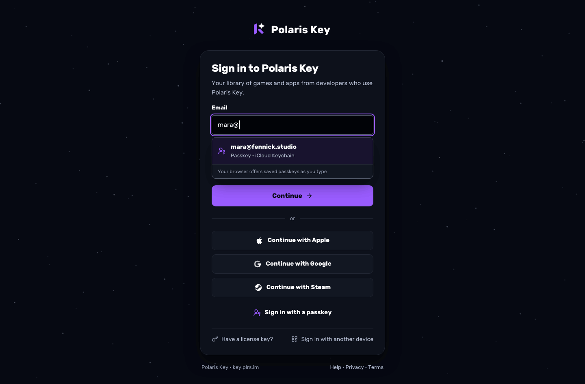

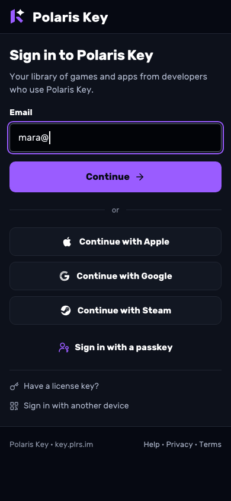

**One card for every sign-in.** Signing in to Polaris Key, signing in to an app through Polaris
Key, a device code from a TV, the account upgrade after a license key, adding a method and joining
accounts all render inside the same `LoginCard`: lockup above, card, footer below, on the static
star field (`surface-page`, no art behind it). The card has three slots:

1. **Card header** (optional, persistent): product context (§4.2) or an app's request (§4.7). It
   stays identical through every step of that flow.
2. **Body:** one step at a time; exactly one primary button, neutral ink (SIGN-IN.md §3.1). Violet
   stays on focus, selection, links and the brand row's mark.
3. **Card footer** (passthrough only): "Polaris Key signs you in for <App>. <Developer> never
   sees your codes or passkeys." with a lock glyph.

**The first step (identifier-first):**

- `h1` "Sign in to Polaris Key", one line of lede.
- **Email** (`autocomplete="username webauthn"`), so the browser offers saved passkeys as you type
  (conditional UI, drawn on desktop), then **Continue** (the one primary).
- "or", then the **provider row** (below): Apple, Google and Steam as logo-only buttons in one
  row, equal width and equal weight (App Review 4.8). **No other providers; no Discord.**
- **Sign in with a passkey** (ghost button) for people whose browser didn't offer one.
- Quiet links under a rule: **Have a license key?** (§4.5) and **Sign in with another device**
  (§4.23).

**The provider row** (`ProviderRow`, owner decision 2026-10-04):

- **One row, never a stack.** Every provider button sits in a single row of equal-width buttons, at
  every breakpoint. The row follows the same order everywhere: Apple, Google, Steam.
- **Logo only.** Each button shows only the provider's mark, 24 px, centred in a 52 px tall
  button. Google's G keeps its four colours; the Apple and Steam marks take `text-strong` on dark,
  as each provider's guidelines allow. There is no visible text in the button.
- **Fills come from the provider.** The theme decides light or dark, height and radius; the fill
  comes from that provider's allowed set for the scheme (Apple: black, white, or white with an
  outline; Google: white, `#131314` on dark or `#F2F2F2`; Steam: its dark or the neutral
  `secondary`). The mark is never recoloured, and no host or product accent tints a provider
  button (the focus ring excepted). Light scheme: white with a hairline, never the lavender tint.
- **Named for everyone.** Each button has the accessible name **Continue with Apple**, **Continue with
  Google** or **Continue with Steam** (`aria-label`, repeated as the hover tooltip), and the row is a
  `role="group"` labelled "Or continue with". In "add a method" contexts the names read **Connect
  Apple** and **Connect Google** (§4.10).
- **Focus and hover:** the standard 2 px ring in the referenced service's accent (core violet here, B17) with 2 px offset on `:focus-visible` (02 shows it
  on Google), and `border-strong` on hover. The buttons are 52 px tall, so every target clears 44 px.
- **1 to 3 buttons.** The row has as many buttons as the product ships providers. Three split the
  row into thirds (01); two split it in half (02, 06, 07, 08); one keeps the width of a half-row
  button, centred, so a lone logo never becomes a full-width bar (14, Drift Kart: Steam only).
- The **known-account hint** (§4.3) keeps its labelled primary ("Continue with Steam"): it is the
  step's one primary, not a provider row.

**Which providers appear** follows where the product ships (S-16 owner decision): Apple whenever
the product ships on iOS or macOS App Store and offers any social sign-in (always, on the hosted
card, for iOS products); Google for Android/Play and as a general option; Steam for products sold
on Steam. Without product context, all three. Steam sign-in is a **web login** (OpenID on
`steamcommunity.com`), so it is offered on the hosted card on every platform; native Steam ticket
sign-in exists only inside Steam builds. Game Center and Play Games are never buttons on the web:
they connect only from inside an app.

- **States:** default; email invalid (inline under the field, `aria-invalid`); sending (button
  busy); rate-limited ("Too many codes. Try again in 4 minutes."); `email_unavailable` ("We can't
  send email right now. Try another way to sign in."); no method enabled ("Sign-in is turned off for
  this product. Contact Lanternworks.", never an empty card); network error ("Can't reach Polaris
  Key" with Retry, distinct from signed-out).
- **Phone:** the card goes edge to edge under a 56 px lockup row; the star field and the autofill
  drawing are dropped.
- **Data:** `GET /api/capabilities?product=` (methods, providers for the product, presentation from
  G1), session check `GET /api/me`.
- **First provider sign-in:** the first time an account is created or reached through Apple,
  Google, Steam or a platform identity, the card shows the required email gate (§4.29) before
  anything else.

### 4.2 Product context

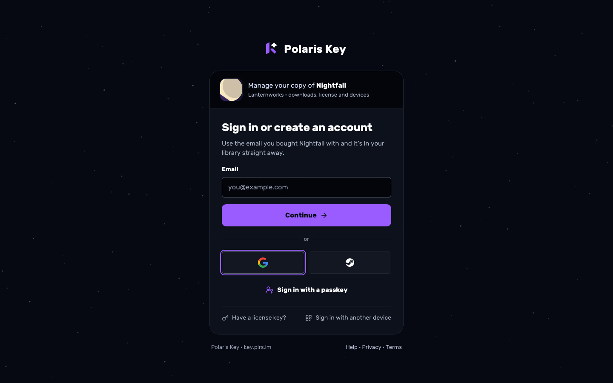

From a developer's "Manage your license" link (`/signin?product=nightfall`): the card header shows
the product icon, "Manage your copy of **Nightfall**" and "Lanternworks · downloads, license and
devices". The title becomes "Sign in or create an account", the lede says to use the email the
product was bought with, and the providers are Nightfall's (Google and Steam: Nightfall doesn't
ship on iOS).

### 4.3 Known account: "You usually sign in with Steam"

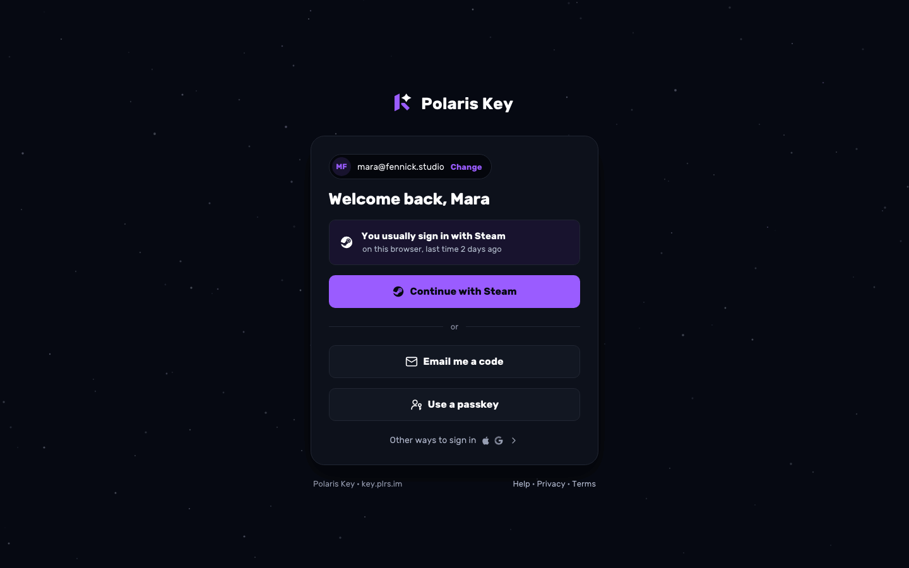

After **Continue**, a person this browser has seen before gets an identity chip (avatar, email,
**Change**), "Welcome back, Mara", a hint card **You usually sign in with Steam** ("on this browser,
last time 2 days ago"), that method as the primary, the generic alternatives **Email me a code**
and **Use a passkey**, and a quiet **Other ways to sign in** link (with the remaining provider glyphs)
that returns to the full method list for this context.

- **Every provider stays reachable.** The known-account step never strands someone on the hinted
  method: **Other ways to sign in** opens the §4.1 body with the providers for this product (all
  three without product context). For an iOS product that means **Continue with Apple** is always
  one tap away (S-16 decision 7), even when the hint says Steam. The link lists the _product's_
  providers, never the account's other methods.

- **No enumeration.** The hint comes from a first-party `pk_last_method` cookie written on this
  browser at the last successful sign-in (method kind and a hash of the email), not from a server
  lookup of the typed address. Typing someone else's email always leads to the generic step (email
  code, passkey, providers), whether or not an account exists, and the hint never lists the account's
  other methods.
- **Unknown or new email:** straight to the code step (§4.4); a new address creates the account
  after the code (registration, §4.8).

### 4.4 Enter the code

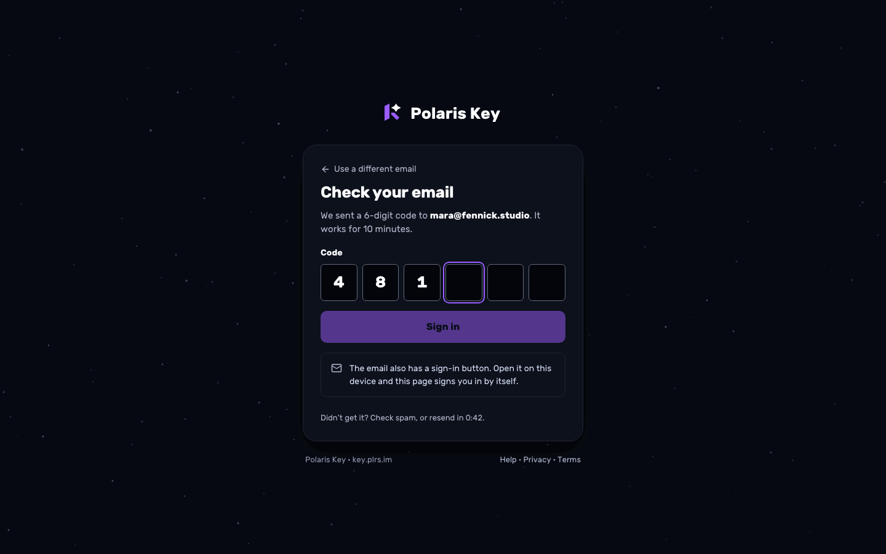

- Six one-digit cells (`inputmode="numeric"`, `autocomplete="one-time-code"`, paste fills all
  cells); **Sign in** enables at six digits and submits automatically on the sixth.
- Echoes the address, says how long the code works, and offers **Use a different email**.
- "The email also has a sign-in button. Open it on this device and this page signs you in by
  itself." **True by construction**: the page re-checks `GET /api/me` on `focus` and
  `visibilitychange`, and every 5 s for 10 minutes while visible (ADMIN.md POR-1), and listens on a
  `BroadcastChannel` that the link-verify page posts to.
- **States:** wrong code ("That code isn't right. Check the email and try again." with "2 tries left." once two or fewer remain, SIGN-IN.md §3.4); expired; too many tries;
  resend countdown, then **Resend**.

### 4.5 Use a license key

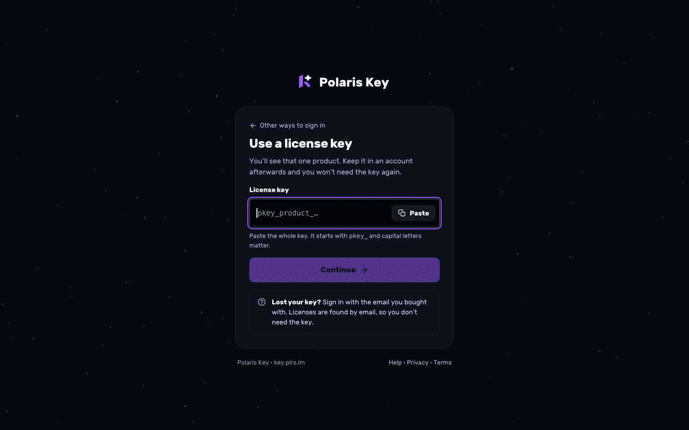

The quiet path from **Have a license key?**: the `KeyField` (§4.17), empty and focused with the
placeholder `pkey_product_…` and a **Paste** button inside the field, the help line "Paste the whole
key. It starts with pkey\_ and capital letters matter.", **Continue** (disabled until the format is
valid), and "Lost your key? Sign in with the email you bought with." Each successful use is a **key
entry** (S-16) and leads to §4.6.

### 4.6 Key entry: the account upgrade (skippable, then forced)

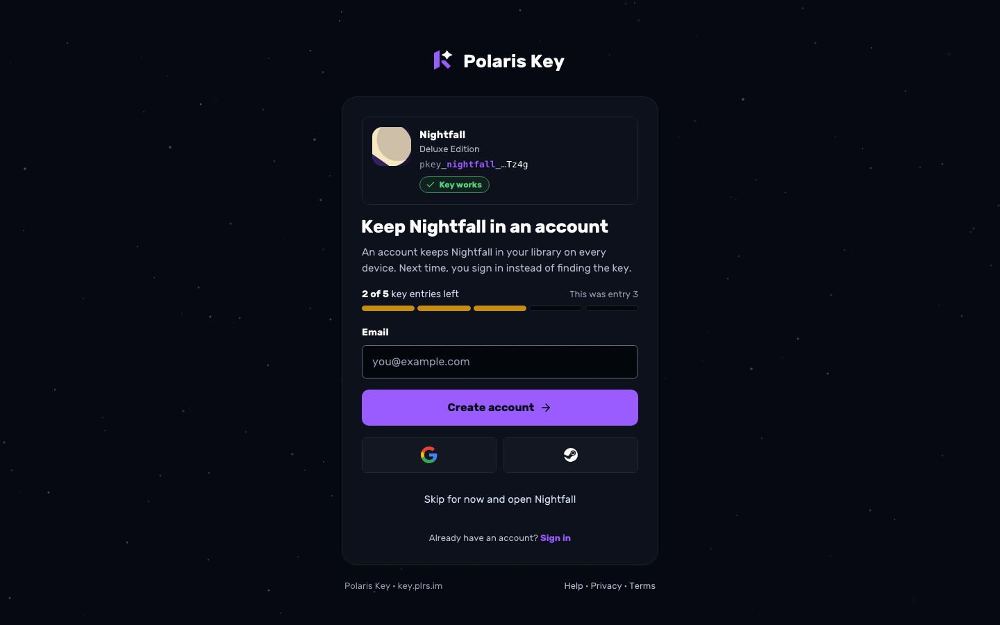

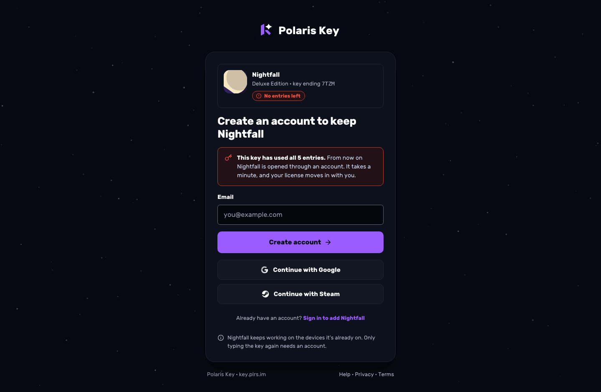

S-16 owner decision (2026-10-04): a license key has a limited, product-configurable number of
**entries** (5, 10, 25 …), counted across the portal and apps.

- **While entries remain:** a key card (product icon, name, tier, the masked key
  `pkey_nightfall_…Tz4g`, **Key works**), "Keep
  Nightfall in an account", a segmented **entries meter** ("2 of 5 key entries left · This will be entry
  3", used segments in `warning`), email with **Create account**, the product's providers, and
  **Skip for now** (ghost), shown only when an app sent the person; it returns to the app
  (SIGN-IN.md D-36). "Already have an account? Sign in".
- **Entries used up:** the key card shows **No entries left**; "Create an account to keep
  Nightfall"; a `danger` notice "This key has used all 5 entries. From now on Nightfall is opened
  through an account. It takes a minute, and your license moves in with you."; **no skip**; "Sign in
  to add Nightfall" for existing accounts; and the reassurance "Nightfall keeps working on the
  devices it's already on. Only typing the key again needs an account."
- The license then attaches under the S-16 claim rules (an owned license never moves by key; an
  email-bound license attaches only to that verified email).
- **Apps** refuse the key at the limit with `manageUrl` (`/activate?product=…`, §3.4). Existing licensed
  installs are never affected: device tokens, refresh, offline grace and the signed license document
  keep working.
- Passkeys are not offered here: S-16 registers passkeys only after an email is verified.
- Key-entry limits exist only for products with Identity on (§3.1): the forced upgrade promises that
  the app "signs you in instead", which needs Identity.

### 4.7 App sign-in: the card header

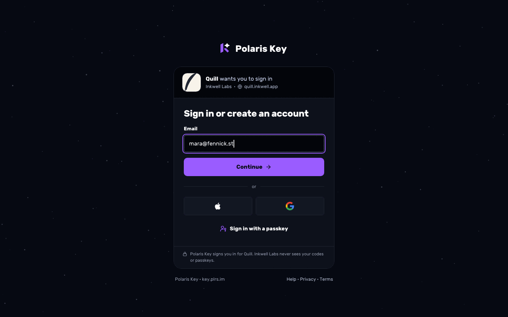

**Only products with the Identity service on** get app sign-in (§3.1). When such an app starts
sign-in (S-16 broker, I-13 native redirect, I-16 per-product issuer, or RFC 8628 device code), the
same card gains a **persistent card header**: the app's icon, "**<App>** wants you
to sign in", and "<Developer> · <where>":

| Variant     | Where line                                 | Example                                      |
| ----------- | ------------------------------------------ | -------------------------------------------- |
| Web app     | Globe glyph and the registered origin      | Quill · Inkwell Labs · quill.inkwell.app     |
| Native app  | Device glyph and "on <device name>"        | Tidewater Studio · on Mara's MacBook Pro     |
| Device code | TV glyph, "on <device name>", and the code | Drift Kart · on Living room TV · `WDJB-MJHT` |

- The header stays through **every** step: method choice, code, registration, confirm and the
  return screen.
- **App branding is data only:** icon, name, developer, origin and device label, rendered by Polaris
  Key inside a fixed frame. No custom HTML, CSS, colours or copy. Names are checked against a
  reserved list (Polaris, Polaris Key, Apple, Google, Steam, Valve …) at registration; the origin
  shown is the registered redirect origin, never a query parameter.
- The card footer names who handles the sign-in (§4.1).
- A first provider sign-in inside the passthrough shows the email gate (§4.29) under the same header.

### 4.8 App sign-in: native app steps

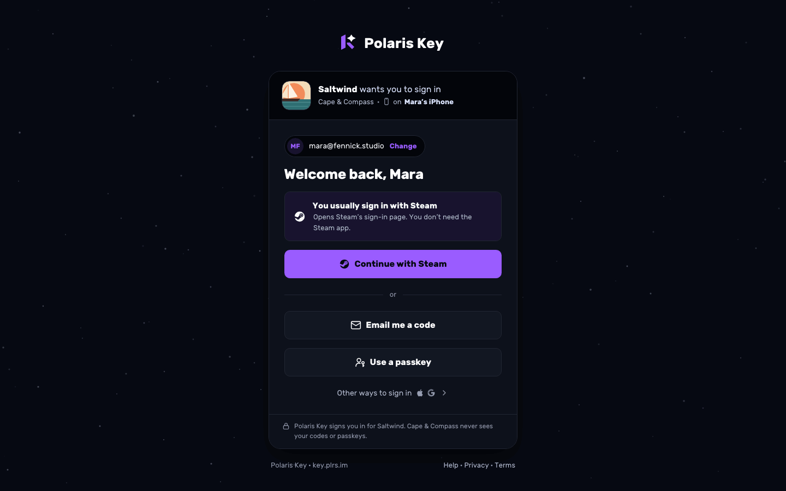

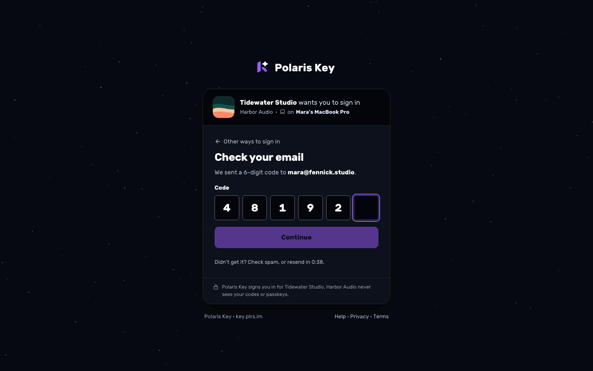

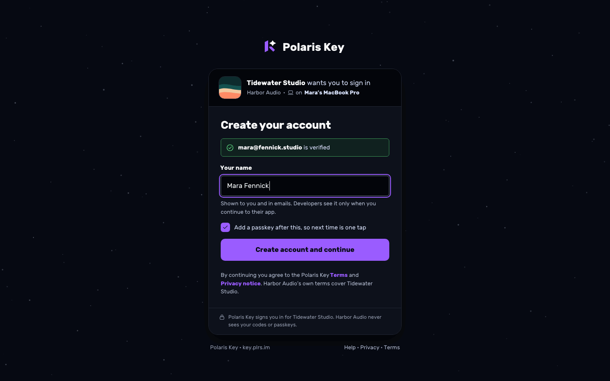

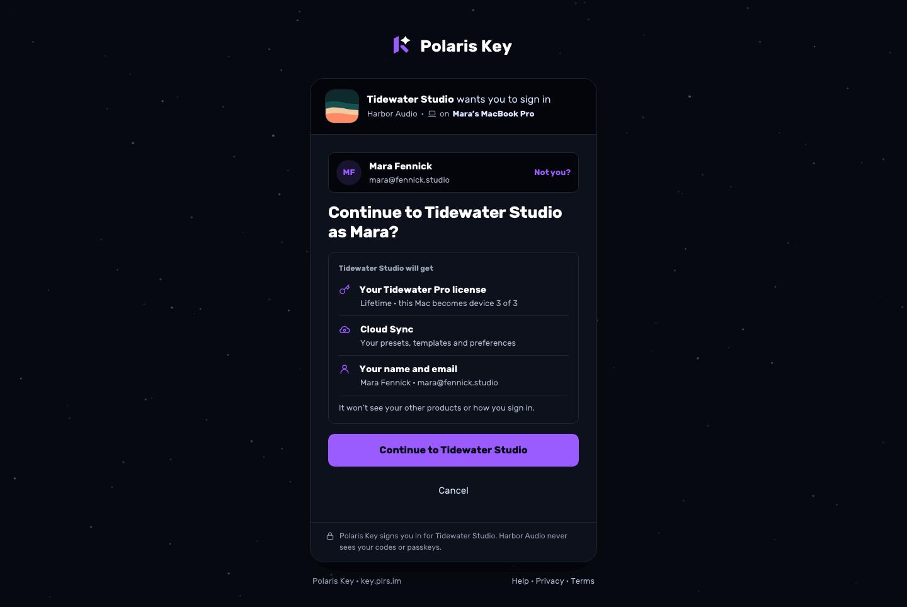

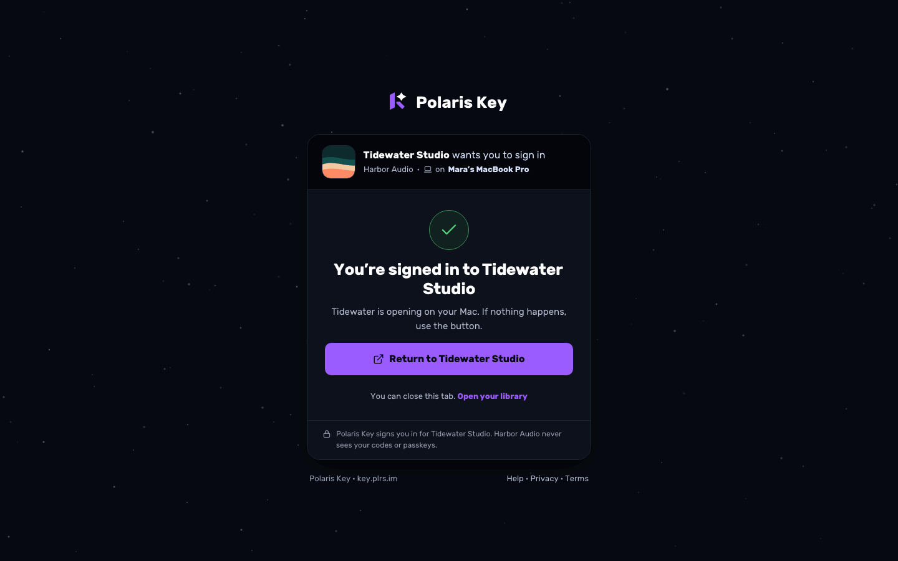

- **Method choice** is the §4.1/§4.3 body. The Saltwind render shows the case S-16 cares about:
  an iPhone user who registered through Steam signs in with **Continue with Steam** on the hosted
  card ("Opens Steam's sign-in page. You don't need the Steam app."). Because Saltwind ships on iOS,
  **Other ways to sign in** (Apple and Google glyphs) sits under the alternatives and leads to
  **Continue with Apple**: Apple is always offered for iOS products with any social login, on the
  known-account step too.
- **Code** is §4.4 with "Continue".
- **Register** (new account after a verified email code; a provider sign-in goes through the email
  gate, §4.29, instead): "Create your account", a `success` line
  "mara@fennick.studio is verified", **Screen name** (I-33; "Shown to you and in emails. Developers see it
  only when you continue to their app."), an opt-in checkbox "Add a passkey after this, so next time
  is one tap", **Create account and continue**, and the terms line naming both Polaris Key's terms
  and the developer's.
- **Choose a license for this device** (owner decision, 2026-10-05): SIGN-IN.md §3.6 (the step)
  and §3.7 (**Replace a device**) are canonical; contract in `plans/I-04.md`, "Owner decision
  (2026-10-05): licence choice at sign-in". It comes after authentication and before Confirm on
  every sign-in that binds a device, even with one license. Rank-first only preselects; full
  licenses show "No free devices" with **Replace a device** and **Free a device** (§4.25, returning
  here); a second free license is never minted silently. The primary is **Use this license and
  continue**.
- **Confirm** (every first sign-in to an app, and whenever what it gets changes): the person row
  (avatar, name, email, **Not you?**), "Continue to Tidewater Studio as Mara?", and **what it
  gets** as a list: its license ("Your Tidewater Pro license · Lifetime · this Mac becomes device 3
  of 3"), **Cloud Sync** (only when the product has the service on; what it syncs), and
  **your profile and email** (name, picture, address). "It gets its own id for you, and won't see
  your other products or how you sign in." (the pairwise id, §3.1). **Continue to Tidewater
  Studio** and **Cancel**, the same width and height, with what it gets listed before both; on
  phones they stack full width with the primary last. A line above them: "Continue only if you
  started this connection. <Product> never gets your sign-in credentials." The page sends
  `frame-ancestors 'none'`. **Decided:** shown on the first sign-in to each app and again whenever
  what it gets changes; later sign-ins skip it. **The license line is the license the person chose**
  in SIGN-IN.md §3.6's LicenseChoiceStep, with **Change** to go back to it (SIGN-IN.md §3.8,
  frame 07). Confirm always follows the choice as its own step.
- **Return:** a success mark, "You're signed in to Tidewater Studio", **Return to Tidewater
  Studio** (re-fires the redirect / app link), "You can close this tab. Open your library".

### 4.9 App sign-in: device code (TV, console)

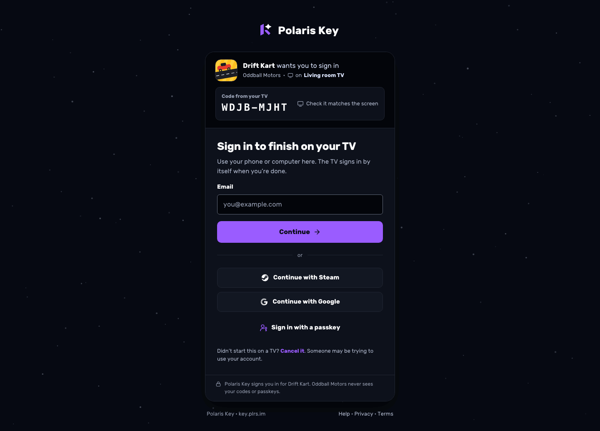

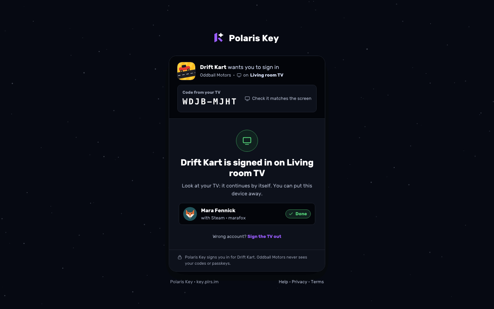

- Reached from `/tv` (type the code) or the TV's QR (`verification_uri_complete`). **Entry:** the
  code is the whole task, one labelled mono field that fits 320 px, a sample in the valid format,
  and "Only use a code from your own product, not one somebody sent you." The page **cannot name
  the product before the code resolves** (the server does not know it); the icon, name and device
  label appear only after it resolves or when `verification_uri_complete` prefilled it. Invalid and
  expired codes have their own copy. The Worker page is script-free: a form POST with the origin
  check, the code escaped on re-render. Once resolved, the header adds a code panel, "Code from
  your TV · WDJB-MJHT · Check it matches the screen".
- Body: "Sign in to finish on your TV · Use your phone or computer here. The TV signs in by itself
  when you're done." then the §4.1 methods (Drift Kart ships only on Steam, so its provider row has
  one button: the one-button case), and "Didn't start this on
  a TV? Cancel it. Someone may be trying to use your account."
- Signed in already: straight to **Choose a license for this device** (§4.8), then Confirm when it
  is due. A full license's **Replace a device** works here too, so the TV never needs a trip to the
  portal. When neither step runs, the card asks "Sign in on Living room TV?" with **Deny**
  (SIGN-IN.md §4.2): scanning a code is never approval.
- Done: "Drift Kart is signed in on Living room TV · Look at your TV: it continues by itself", the
  person row with the method used, and **Sign the TV out** for the wrong account.

### 4.10 Add another way to sign in (nudge)

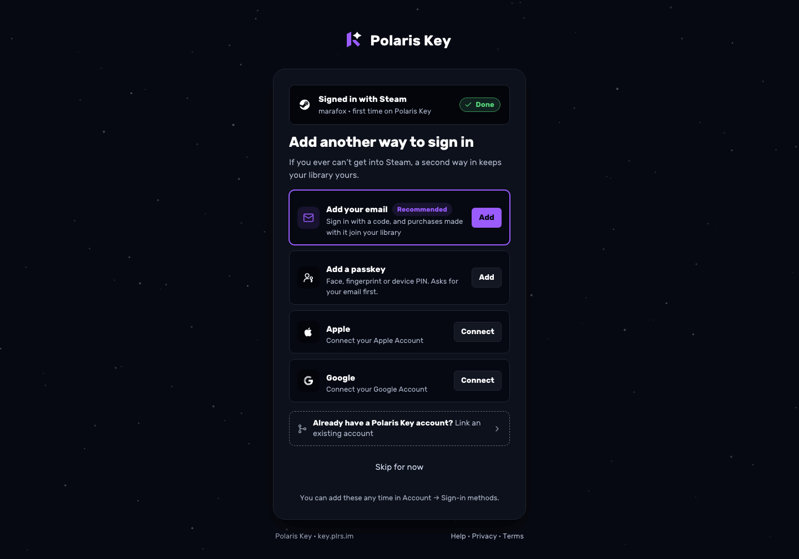

After a first sign-in with a platform identity (Steam, Apple, Google, Game Center) and the email
gate (§4.29), a skippable card: "Signed in with Steam · marafox · Done", "Add another way to sign
in · If you ever can't get into Steam, a second way in keeps your library yours", rows for **Add a
passkey** (recommended: the gate already confirmed an email, so a passkey can be added at once),
the confirmed email shown as **Added** ("Confirmed just now · sign in with a code"), then "Or
connect another account" over a provider row of the providers not yet linked (Apple, Google; names
**Connect Apple**, **Connect Google**); a quiet dashed link row **Already have a Polaris Key
account? Link an existing account** (§4.11; the way out for an Apple Hide My Email first sign-in whose
relay address can never match an existing account); **Skip for now**; "You can add these any time in
Account → Sign-in methods". Shown once per account and again only if the account still has a single method
after 30 days.

### 4.11 Link an existing account

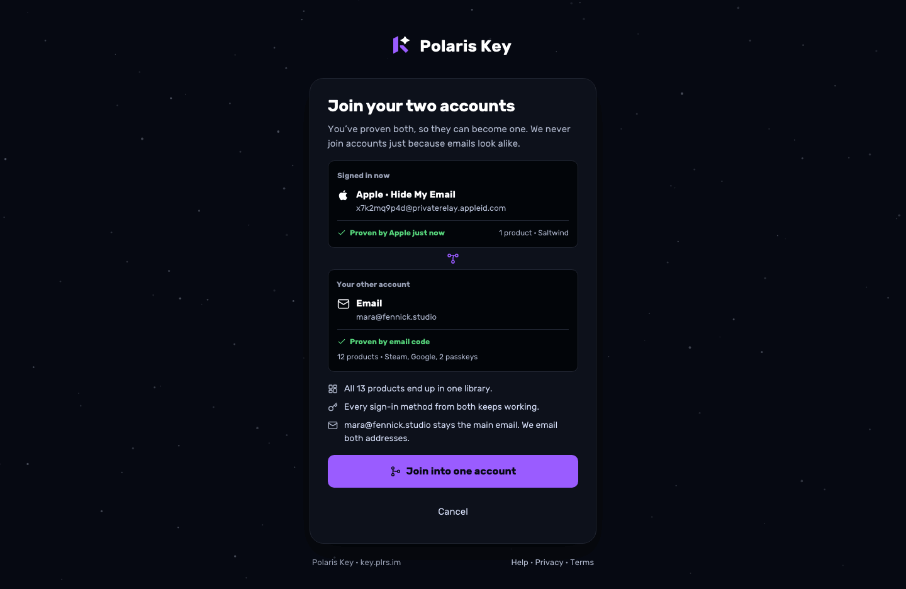

For a person who ends up with two accounts, typically after **Sign in with Apple** with Hide My
Email (a `privaterelay.appleid.com` address that can never match their real email). Reached from
Account → Sign-in methods → **Link an existing account**, the nudge's link row (§4.10), and the
claim error "owned by another account" (§4.19).

- The person signs in to the other account **in the same session** (any of its methods); only then
  does the join screen appear: both accounts as cards with their identity, **how each was proven**
  ("Proven by Apple just now", "Proven by email code") and what each holds; the consequences (all
  13 products in one library; every method from both keeps working; which email stays primary; both
  addresses are emailed); **Join into one account** and **Cancel**.
- **Never by email match.** Accounts join only with proof of both identities in one session (S-16
  linking policy: explicit linking, block on conflict). Joining is audited, emailed to both, and
  undoable for 72 hours from either account.

### 4.12 Library: empty

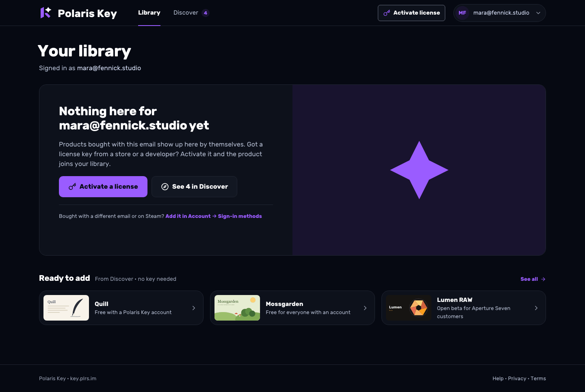

- One `text-strong` line, "Nothing here yet" (the page's subtitle names the signed-in email, and
  the body's "this email" refers back to it), one `text-muted` line, the primary **Activate a
  license** (opens the modal) and **See 4 in Discover**. "Bought with a different email or on
  Steam? Add it in Account → Sign-in methods." The stationary star fills the right half from
  900 px, is a top strip below that, and is hidden on short screens, where the text takes the
  whole card (§8).
- **Ready to add:** up to three Discover offers as rows (thumb, name, why) with **See all**. Hidden
  when Discover is empty.

### 4.13 Library: one product

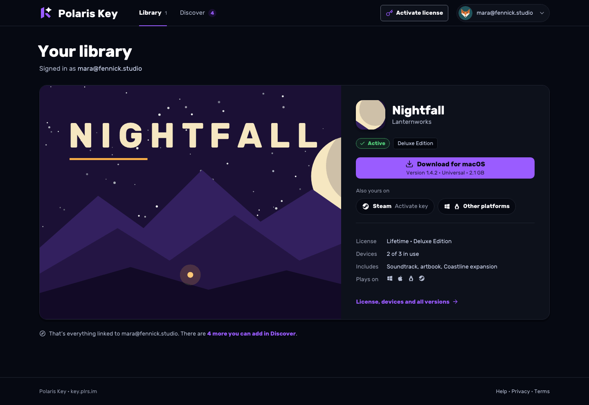

- A full-width **hero**: key art (left, 1.45 fr) and a side panel with icon, name, developer,
  status and tier, the **primary download** as a two-line button, an **Also yours on** row, a short
  summary (license, devices, includes, runs on) and a link to the product page. Side by side from
  1024 px: at 1024–1179 px the art is shown whole over a blurred copy of itself that fills the
  column, so no block is left empty; from 1180 px it fills the column's height without cropping
  (§0.3). On a landscape phone the two sit side by side from about 560 px.
- A closing line: "That's everything linked to <email>. There are 4 more you can add in Discover."
- **At 761–1023 px** the hero stacks: the art at 16:9 across the full width, the panel underneath.
  On a short screen from about 560 px the two stay side by side, and the page's top spacing and
  the panel tighten, so the primary download is on the first screen (also stacked at 1023 × 900,
  where the art is capped at 40 % of the screen height, contained over the same blurred copy). **Phone:**
  the primary action becomes the phone action.

### 4.14 Library: a few products (2–7)

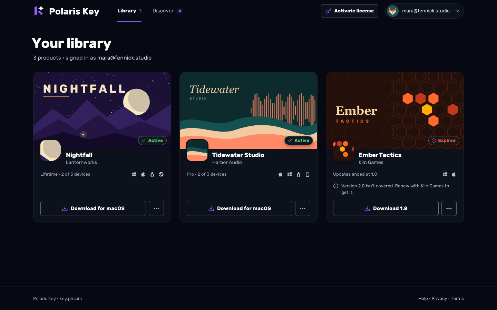

- A 3-column grid of large **library tiles** (§5.2), art first: the cover at its whole 16:9 frame
  from the tile's top edge, edge to edge, capped at 280 px, with no product name drawn over it. No
  toolbar. The header subtitle names the count and the account: "2 products · signed in as
  priya@example.edu".
- **A "Have a license key?" end tile** fills the grid (dashed border, key glyph, "Activate it to
  add its product here.", an outlined **Activate license**); at two columns it spans the row on one
  line, on phones it stacks. Under the grid a **"Missing a license?"** strip has two points:
  "Sent to another email?" (links to Account → Sign-in methods) and "Bought in a store?".
- Every tile's action is the **outlined quick action**; a solid ink button is reserved for the
  hero, the product header, the "Added just now" tile and the one most urgent attention item.
- **Added just now** (EXPERIENCE §0.6 P1 step 7, frame 7; PX-24): for 24 hours after the account
  first got a product, its tile is first, carries a ring and the quiet text "Added just now" at the
  head of its reason line, and leads with its download (solid): the one exception to the outlined
  rule. A quick action that is not a download (See downloads, View details) stays outlined. The
  8+ grid and the list (§4.15) do the same under the default sort; By name keeps its place.

### 4.15 Library: many products (8+), grid and list

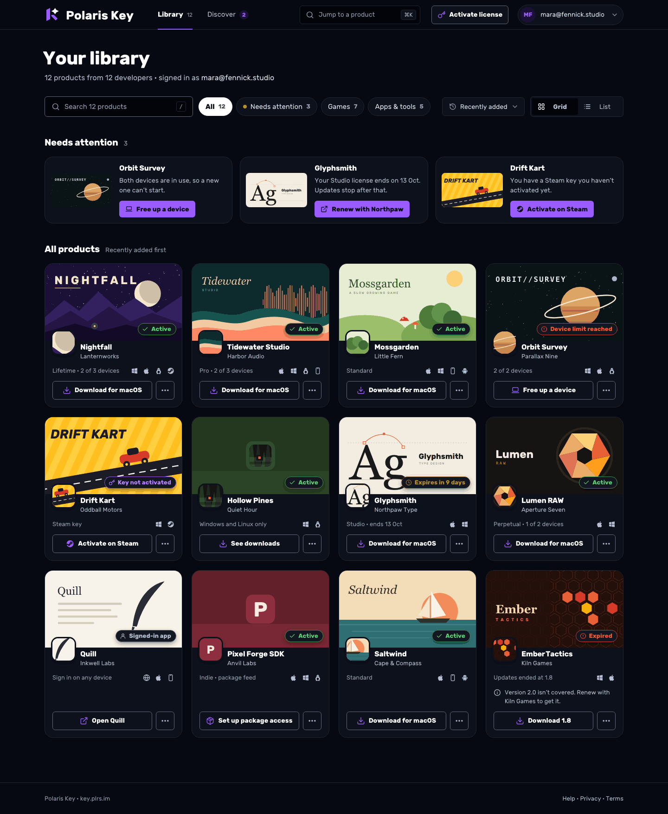

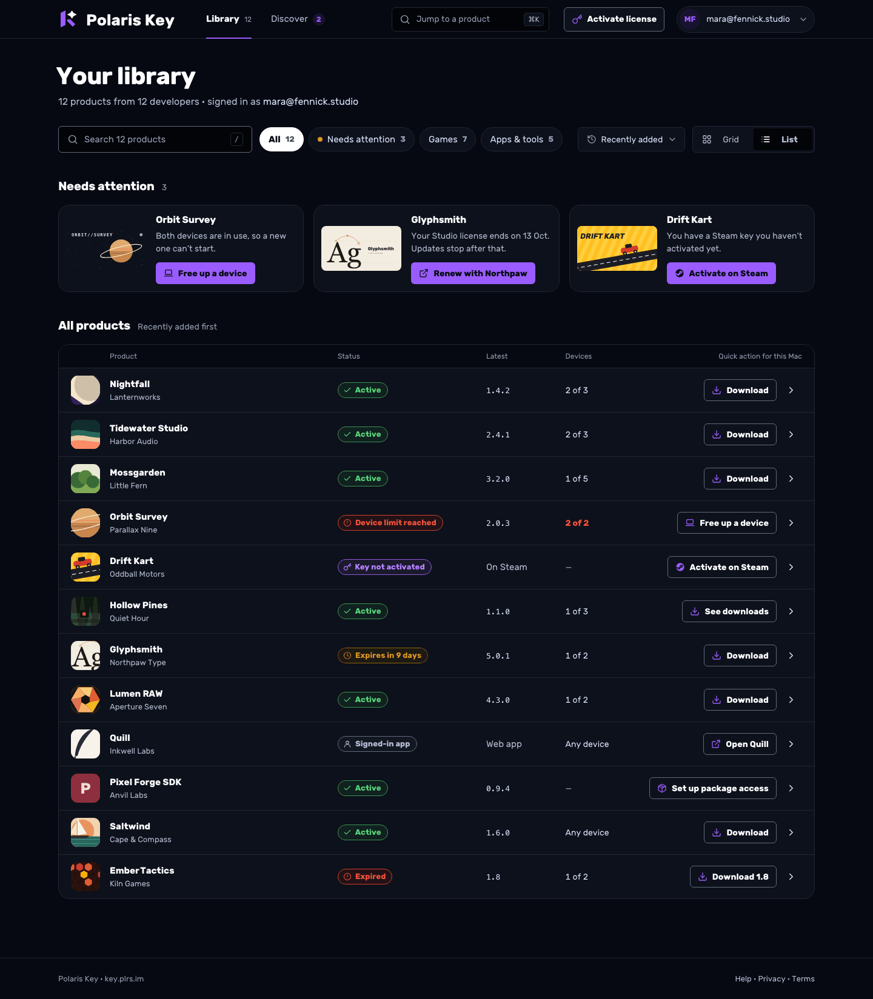

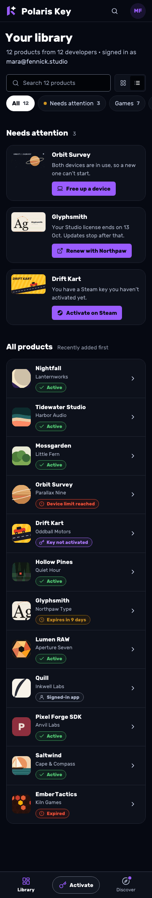

- **Toolbar:** search ("Search 12 products", `/` focuses it), filter chips with counts (All,
  Needs attention, Games, Apps & tools; a zero-count chip is hidden), sort (Recently added, Name),
  and a Grid/List toggle, all in the URL (§3.3); a non-"All" filter shows "Showing 3 of 12 · Show
  all" (A4).
- **Needs attention shelf:** only items the person can act on. The most urgent item's action is the
  one solid button; the others are outlined. Actions: device limit → **Free a device**; expires within 14 days → **Renew with <developer>** (G16, else
  "Contact"); Steam key not activated → **Activate on Steam**; expired with a newer version →
  **Renew**. Never news. Hidden when empty. The card's title names the product, so the reason does
  not ("Both devices are in use."); an ended license's reason is the fact alone ("Your license
  ended on 8 Oct 2026."). The action's full label shows on hover, since a long developer name
  truncates on it. A date in a reason never breaks across lines. The copy states the action once:
  the reason does not repeat the button.
- **All products:** 4-column compact grid (3 at 761–1179 px), or the **list**: icon · Product ·
  Status · Latest · Devices · **Quick action for this Mac** · chevron; 72 px rows; the whole row
  opens the product page. A compact tile's status line takes up to two lines. On a tile whose
  content is under 15rem wide (761–about 920 px, 1180–about 1250 px) "Download for macOS" reads
  **Download** (its accessible name keeps the full label), the status pill moves to the art's
  top-right corner, clear of the icon, and the name takes up to two lines.
- **⌘K trigger** in the header (§4.27); at its floor width the placeholder reads "Jump to…".
  Products without art use the fallback (§5.2).
- **Phone:** search and view toggle share a row, chips scroll; **List by default above 6
  products** (the remembered choice wins, so someone who picked Grid keeps the desktop's compact
  grid in one column); list rows keep a status pill under the name. The 21 and 22 phone renders both
  show this default list.

### 4.16 Discover

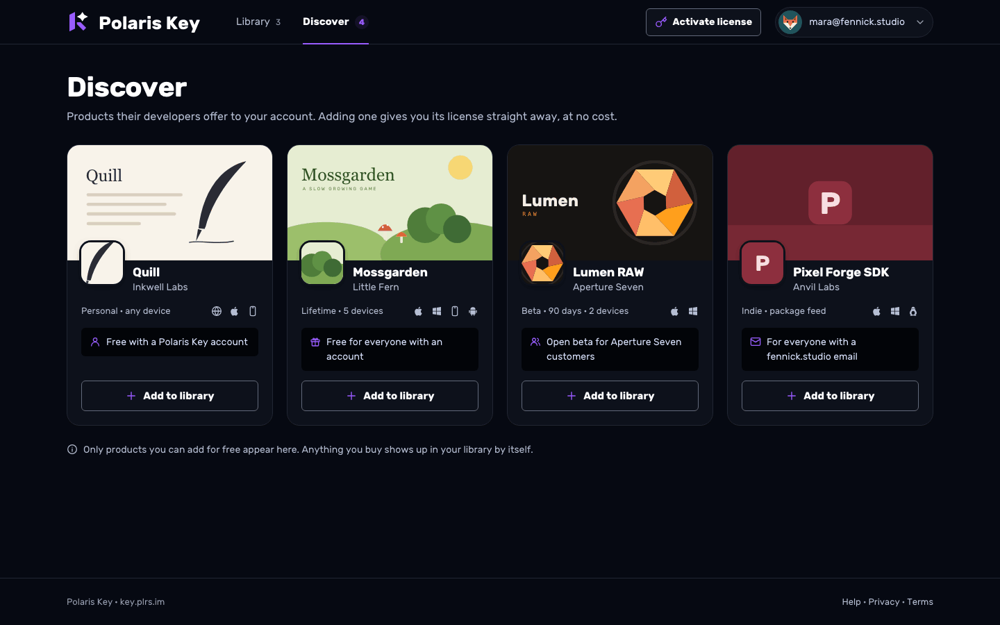

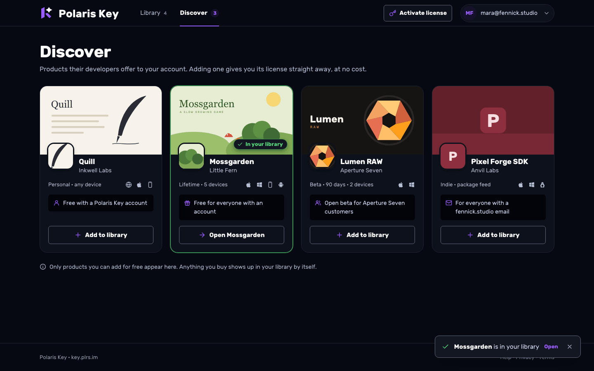

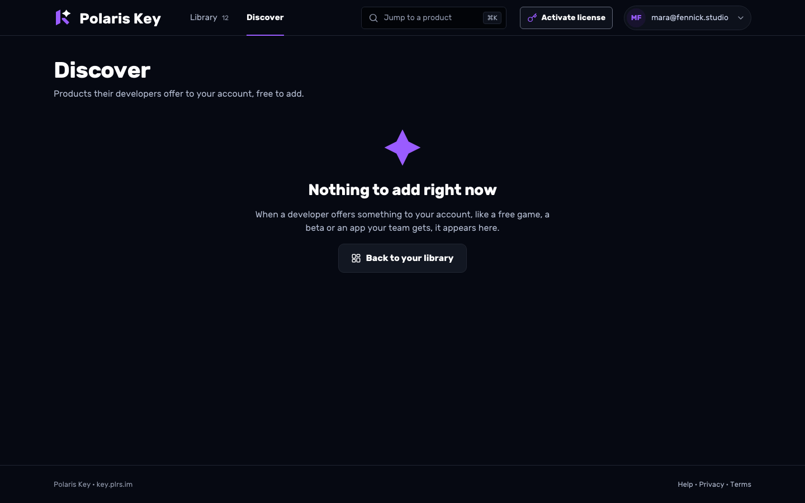

**Purpose:** show every product the signed-in person could add right now for free, so nothing they
are entitled to sits unclaimed.

- **Who sees what.** Discover lists a product when its license policy **would auto-issue** a license
  to this account on first load: the product's auto-issue rule, `groupRoleMap` (a group the account
  belongs to through a connected identity), the tier rules, or an auto-link policy such as a
  verified email domain. Eligibility is **evaluated without issuing** (§10.2, G24).
  **Purchase-only and operator-issued products never appear**, nor do products already in the
  library or ones whose developer turned Discover off.
- **Layout:** `h1` "Discover", one lede ("Products their developers offer to your account. Adding
  one gives you its license straight away, at no cost."), a 3-column grid (2 on tablets) of
  **Discover tiles**:
  art, icon, name, developer, **what you'd get** (tier and terms, from the same policy: "Lifetime ·
  5 devices", "Beta · 90 days · 2 devices"), platform glyphs, **why you can add it** ("Free with a
  Polaris Key account", "Free for everyone with an account", "Open beta for Aperture Seven
  customers", "For everyone with a fennick.studio email"), and **Add to library** (outlined).
  Footnote: "Only products you can add for free appear here. Anything you buy shows up in your
  library by itself."
- **Add to library** mints the license on the spot through the same path as auto-issue (same tier,
  limits and entitlements). The tile turns green-edged with **In your library** on the art and
  **Open <product>**, which takes focus; a toast "Mossgarden is in your library · Open"; the Library count goes up and
  the Discover count down. Errors are inline on the tile ("Aperture Seven stopped this offer.").
- **Offer wording:** an open product reads "No license needed"; a trial shows its duration ("Trial ·
  14 days", once LX-41 ships); a store-only listing shows its store links and never **Add to
  library**. The page has no hero band, no slogan and no accent fill.
- **Empty:** the star, "Nothing to add right now", "When a developer offers something to your
  account, like a free game, a beta or an app your team gets, it appears here.", **Back to your
  library**.
- **Decided (owner, 2026-10-04):** every offer always shows why you can add it; a product cannot
  hide the reason line. It explains why the offer exists and why it may go away.
- **Nav count:** Discover shows the number of offers as a small violet count (a dot on the phone
  bar). It never nags beyond that: no badges on the library, no emails about offers.

### 4.17 Activate license: the modal

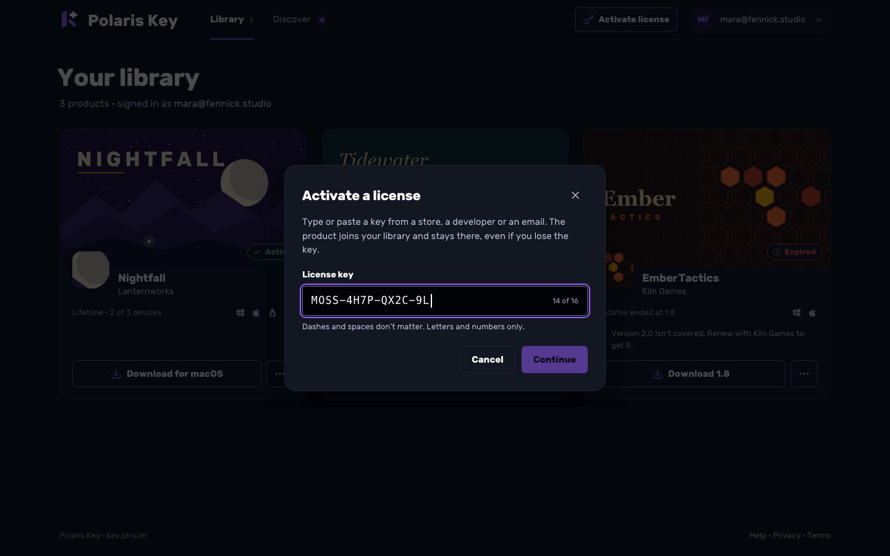

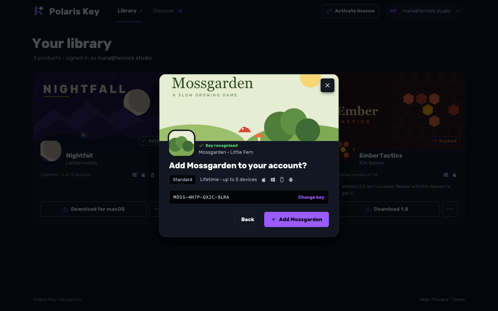

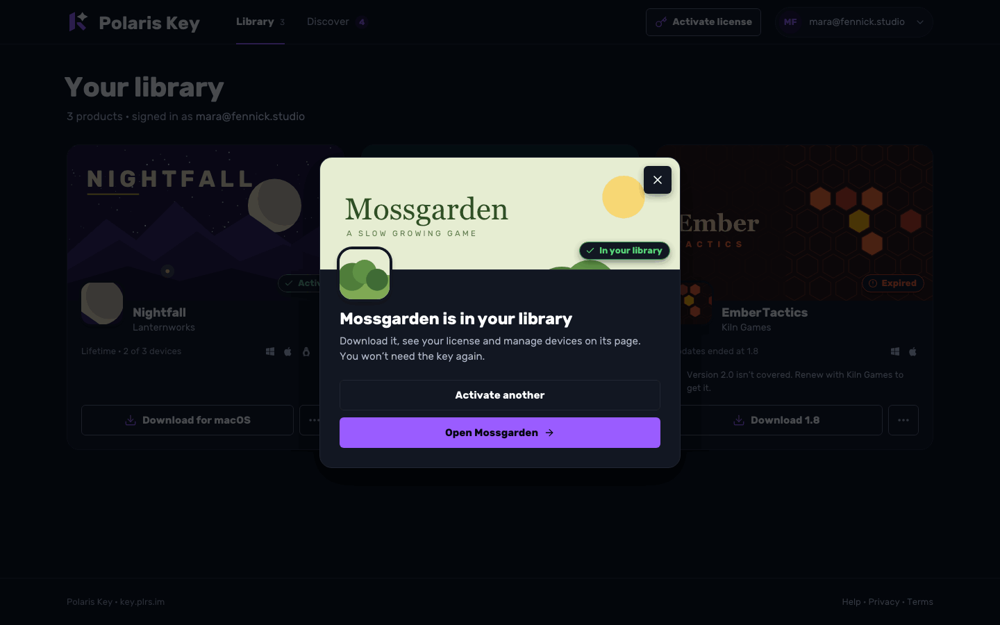

Opened by the header action, the phone bar pill, ⌘K, the empty library, the not-found page, and
`/activate#key=`. **Always a modal over the Library** (a bottom sheet on phones); there is no redeem
page.

1. **Enter:** "Activate a license", one line ("Paste a key from a store, a developer or an email.
   The product joins your library and stays there, even if you lose the key."), the `KeyField`
   (below) with "Key for Mossgarden · Little Fern" under it once a key is pasted, and **Continue**,
   which enables when the format is valid. Under the lede an **account row** (avatar, display name,
   primary email) shows which account the license joins, so an other-account or email-mismatch
   case (§4.19) is visible before **Continue**.
2. **Confirm:** the product's key art across the top of the modal, the icon overlapping it, "Key
   recognised · Mossgarden · Little Fern", `h2` **Add Mossgarden to your account?**, the tier tag,
   the terms ("Lifetime · up to 5 devices") and platforms, the key echoed with **Change key**, and
   **Back** / **Add Mossgarden**. A floating key already on devices adds "It's on {n} devices
   already. They keep working and come with it." (S-24 §10).
3. **Done:** the art with **In your library**, "Mossgarden is in your library · Download it, see
   your license and manage devices on its page. You won't need the key again.", **Activate another**
   and **Open Mossgarden** (the product page; focus lands on its `h1`).

**The license key and its field.** Polaris Key license keys are **not** grouped codes. The real
format (`packages/worker/src/crypto.ts`, `mintLicenseKey` and `productFromKey`) is

```text
pkey_<product-slug>_<22 characters of base64url>
pkey_mossgarden_Q7xZr2Lk9vT3mN8pB1cY4w
```

The slug is lower case (`a-z 0-9 -`); the 22 characters are 128 random bits in base64url, mixed case,
using `A–Z a–z 0–9 - _`. Keys are **case-sensitive**: `Q7x` and `q7X` are different keys.

The `KeyField`:

- **Monospace and paste-first.** A single field (`autocomplete="off"`, `autocapitalize="off"`,
  `autocorrect="off"`, `spellcheck="false"`, `inputmode="text"`) with a **Paste** button while empty,
  placeholder `pkey_product_…`. A 38-character key wraps at any character instead of scrolling, so the
  whole key stays visible on a phone.
- **Never rewritten.** No auto-grouping, no dashes inserted, **no uppercasing or lowercasing**. The
  only normalisation is trimming leading and trailing whitespace (and newlines from a paste).
- **Format validation** is the regex `^pkey_([a-z0-9-]+)_([A-Za-z0-9_-]{22})$`. A valid key gets the
  success border and a check ("Key format is valid"); **Continue** enables. The server checks the
  same exact shape (`LICENSE_KEY_SHAPE` in `crypto.ts`, used by `productFromKey`; owner decision
  2026-10-04, PX-W5), so a cut-off paste is caught before any request and refused by the Worker
  if one is sent anyway.
- **The parts are coloured:** `pkey_` and the separator in `text-subtle`, the slug in `accent-fg`,
  the secret in `text-strong`.
- **The product is known before the server is called.** The `pkey_<product>_` prefix names the
  product, so the modal shows **Key for Mossgarden · Little Fern** (product icon, name, developer)
  as soon as the key is pasted, from the slug and public product presentation (G1) alone. Nothing
  about the key is sent until **Continue** (G22 preview). An unknown slug shows the slug itself
  ("Key for mossgarden"); a key with no `pkey_` prefix gets the "Not a license key" error.
- **Masked display** (product page, key card, anywhere a stored key is shown) is the prefix, the
  slug, an ellipsis and the last 4: `pkey_tidewater_…KQ2w`. Only the last 4 are kept, so a key is
  never shown in full after it is entered.

### 4.18 Activate license: deep link

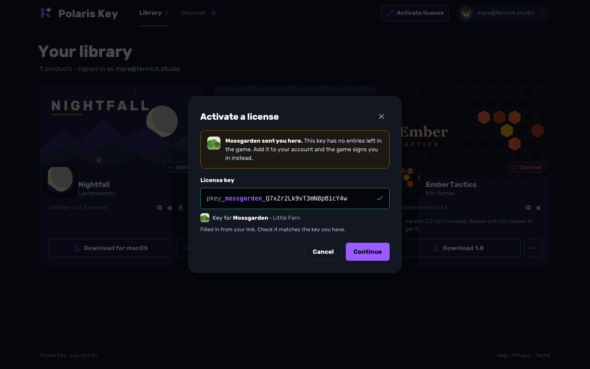

`/activate?product=…` (from an app at its entry limit, an email) opens **Library** with the modal
open; the key is filled in and checked only from a `#key=` fragment (an app, an email, a printed
link; a legacy `?key=` still works), never from a Worker-built URL. The portal drops the fragment,
or the query, from the address bar before it does anything else (THREAT-MODEL.md, "Key-bearing
deep links"). With `product=` from an app, a notice names it:
"Mossgarden sent you here. This key has no entries left in the game. Add it to your account and the
game signs you in instead." The help line reads "Filled in from your link. Check it matches the key
you have." Signed out, the login card (with product context) runs first and returns here.

**As built (PX-17).** The notice is a `warning` with the product's icon and names the product
(`signin.key.noEntries`: "Mossgarden sent you here. This key has no entries left in Mossgarden. Add
it to your account and Mossgarden signs you in instead."). What the link carries changes it and
what follows the add:

- `next=free-device` (a floating license at its device limit, PX-W8): "This license is on every
  device it allows. Add it to your account, then free one up for <for>."; after the add, or for a
  key already in the library, the free-device flow (§4.25) for that license opens straight away
  with `for=` and `return=`.
- `return=/signin?request=…` (the login card's "You don't have <Product> yet", plans/I-04.md): an
  `info` notice, "Signing in to Mossgarden. Add your key here, then you go back to signing in.";
  after the add the person goes back to the card.
- `return=` to an origin or app scheme the product declares: Done offers **Back to Mossgarden**
  (primary) and **See it in your library**. Any other `return=` is dropped.

The key stays in `#/?activate=` only; no return URL carries one (THREAT-MODEL.md, "Key-bearing
deep links").

### 4.19 Activate license: errors

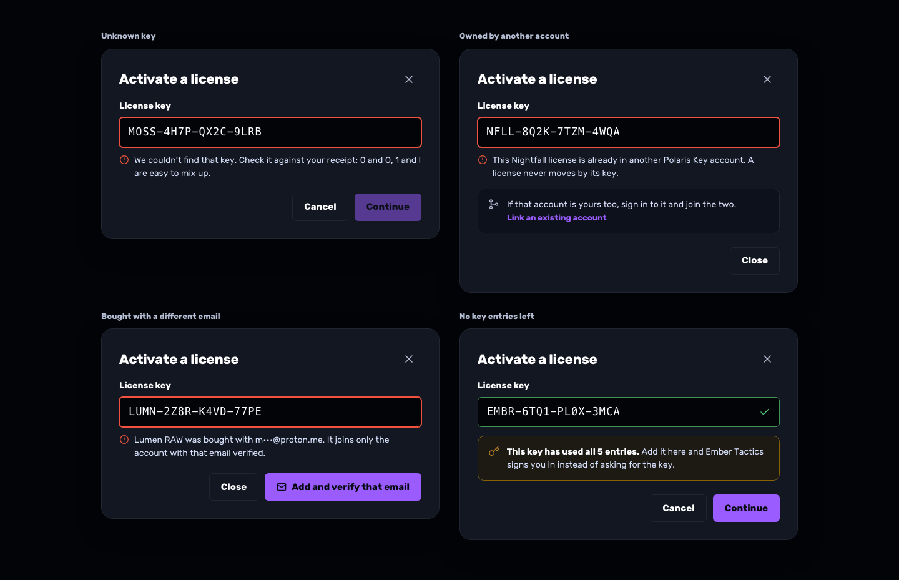

Inline under the field (S-16 claim rules), never a toast:

| Case                         | Copy and action                                                                                                                                                                                           |
| ---------------------------- | --------------------------------------------------------------------------------------------------------------------------------------------------------------------------------------------------------- |
| **Not a license key**        | No `pkey_` prefix, shown at once: "That isn't a Polaris Key license key. Ours start with pkey\_. This one looks like a Steam key: activate it in Steam." (the Steam line only for the 5×3 Steam shape)    |
| **Incomplete key**           | Right prefix, wrong length or a character outside `A–Z a–z 0–9 - _`: "This key is cut short. After mossgarden\_ come 22 characters, and this has 15. Copy the whole key again."                           |
| **Unknown key**              | "We couldn't find that key. Capital letters matter, and l, 1, O and 0 are easy to mix up, so paste the key instead of typing it."                                                                         |
| **Owned by another account** | "This Nightfall license is already in another Polaris Key account. A license never moves by its key." Notice: "If that account is yours too, sign in to it and join the two. Link an existing account"    |
| **Verified-email mismatch**  | "Lumen RAW was bought with m•••@proton.me. It joins only the account with that email verified." **Add and verify that email** (unless the product sets `claimByKey`)                                      |
| **No key entries left**      | **Decided:** a `warning` notice, not a block, when signed in: "This key has no entries left in Ember Tactics. Add it to your account and Ember Tactics signs you in instead." **Continue** stays enabled. |
| Already yours                | "Mossgarden is already in your library." **Open it**                                                                                                                                                      |
| Product portal off           | "Little Fern manages this license elsewhere."                                                                                                                                                             |

The Enter step's account row (§4.17) makes the other-account and email-mismatch cases visible
before **Continue**. The masked email shows the first character and the domain only. All lookups share the claim rate
bucket (THREAT-MODEL: enumeration).

### 4.20 Product page

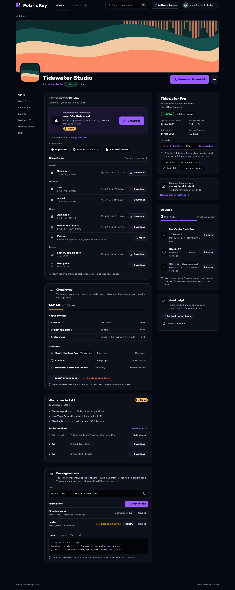

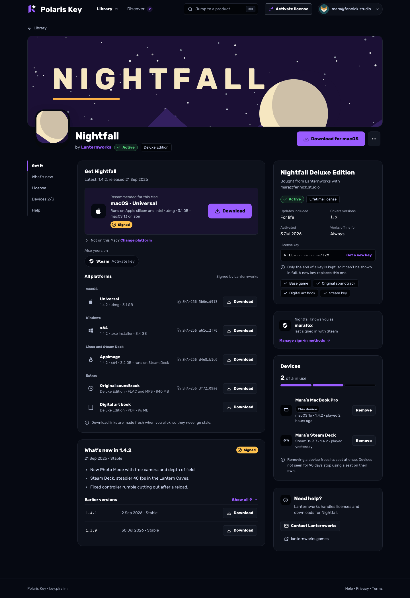

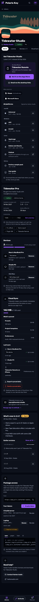

**Header:** back link to Library, the key-art banner (the listing's 16:9 header: all of it,
full-bleed, on phones; a centred 3:1 band capped at 416 px from 761 px; `object-fit: cover`, centred,
as the library card's 16:9 crop is), the 112 px icon (80 on phones) in front of its lower edge,
half over it, drawn edge to edge with no tile of ours (the developer's own shape is the frame; a
full-bleed square icon gets only the store's corner mask; only the letter fallback is a tile); without a cover the icon stands beside the name, with no banner;
the name as `h1`, "by <developer>", status pill and tier,
and the **primary action** with an overflow menu (Copy link, Contact developer, Remove from
library).

**Layout:** at ≥ 1180 px three columns: a sticky **in-page table of contents** (148 px: Get it,
Cloud Sync, What's new, License, Devices 2/3, Package access, Help), the main column (Get it,
**Cloud Sync**, What's new, Package access) and a 384 px side column (License, product sign-in,
Devices, Help). At 1024–1179 px the TOC hides and the page is main · side (fluid · 340). Below
1024 px, phones and tablets alike, one column in task order (Get it, License,
Devices, Cloud Sync, product sign-in, What's new, Package access, Help). Below 1180 px **sticky pill
tabs** (under the header; at the top on a short screen, where the header scrolls away)
list the sections **in that same phone order** (Get it, License, Devices, Cloud Sync, What's
new, Package access, Help) and highlight the section on screen (**Get it** on load). A device's
name wraps rather than being cut short; in a narrow card (the side column from 1024 px, a phone)
its **Remove** sits under the meta line, so the name has the row's full width. Sections that
don't apply are **omitted**, with their TOC entry and pill (P14).

**Get it:** the recommended panel (honest platform detection: a Universal build is named as such;
both Mac builds otherwise, Apple silicon first), **Change platform**, **Also yours on** store pills
(App Store, Google Play, **Steam: Activate key** with the `registerkey` link, Microsoft Store,
Flathub), **All platforms** grouped by OS (the device's own OS first) then **Extras**, each file
with a copyable middle-truncated SHA-256, each OS's files followed by its **Other ways to install**
(P0-48: the download page's Homebrew, Scoop, winget, AltStore, SideStore, AltStore PAL, F-Droid
and Obtainium, each opening the app's deep link, never a raw source URL, with the source URL or
command to copy, F-Droid's fingerprint, and on a computer a QR code for the phone), and "Download
links are made fresh when you click". Phone: "Install on this iPhone" with the store and the
sources that work on it, and **Email me the desktop links**.

**Cloud Sync** (only when the product has the Cloud Sync service turned on, S-17):

- What it keeps in step, in the developer's words ("Tidewater keeps your presets, templates and
  preferences the same on every device you sign in on").
- **Storage used** as a figure and a bar ("142 MB of 1 GB used").
- **What's synced:** one row per data class the product declares (Presets · 128 items · 38 MB;
  Project templates · 14 items · 96 MB; Preferences · Audio, MIDI, keyboard shortcuts · 8 MB).
- **Last sync per device:** device, "This device", when, and state ("Up to date", "Preferences
  only", "Waiting to upload", "Conflict: open Tidewater to choose").
- **Export synced data** (a zip, emailed link for large exports) and **Delete synced data**
  (inline confirmation with step-up; "Deleting clears the copy in Cloud Sync. Files already on your
  devices stay there.").
- **Products without the service show no sync status or setting anywhere:** not on the page, not in
  the TOC, not in the library, not in the list view, not in ⌘K. The confirm step of app sign-in
  mentions Cloud Sync only for products that have it.
- **31 starts at Get it.** The full-page render begins at the top of the page, so its sticky TOC
  marks **Get it** as current (the TOC follows the section on screen; the `#/p/:product/sync` deep
  link would mark Cloud Sync).
- **The two renders use two products.** 31 is Tidewater Studio, which has the service (as in the
  12 confirm step, Connected products and ⌘K). 32 is **Nightfall**, which doesn't: its TOC and
  pills go Get it, What's new, License, Devices, Help; its license chips are the Deluxe Edition
  contents (Base game, Original soundtrack, Digital art book, Steam key); it has no package feed, so
  Package access is omitted too; and on an iPhone, where Nightfall doesn't ship, Get it says so and
  offers **Email me the download**.

**What's new**, **License**, **"<Product> knows you as …"** (the identity this product uses, with
**Manage sign-in methods**; only for products with Identity on, §3.1), **Devices** (seat meter, rows with **Remove**, dormant rows), **Package
access** and **Help** are unchanged from the converged design: every non-covered build is listed
with **Not included** and its reason as text, except after a keeps-the-last-version lapse (§5.3,
which lists no row for newer builds); the key is masked as `pkey_tidewater_…KQ2w` (prefix, slug, last 4) with **Get a new key**
(G7); devices show "+1 not using a seat"; package tokens show prefix, last used, expiry and the
amber "Expires in 6 days" pill. Once F-33 ships, Package access on the product page is one pointer
row to Account → Packages: tokens are account-wide and are never listed per product.

**License card, tier and devices (owner, 2026-10-05):** the tier ("Standard" when the licence has
none) is a quiet neutral pill, an identity label rather than a status, with the device count beside
it on the same line: "0 of 5 devices" for every licence ("1 device" while the limit is unknown).
Under it a quiet meta line says how the licence came to be and its term, never a licence type
(owner decision, 2026-10-05: no "Account-wide" label): "From signing in · Lifetime", "Steam key
ending 3WPLDA · Lifetime" (or "Steam key" while the key's last characters aren't kept, G7), "From
Steam · Expires 24 Dec 2026" for a store-bound licence with no key, "Key ending 3WPLDA" or "Added
with a key". Activation still enforces a seat limit on sign-in licences, so the page never calls
them unlimited. Only
an issue status (Expired, Suspended, Device limit reached, Expires in …) sits on that line, as a
right-aligned pill. **Access** reads **Lifetime** for a licence with no end (P0-47). With several
licences the picker names each by tier and its short origin ("Standard · Sign-in", "Standard · Key
…3WPLDA", "Standard · Steam key …3WPLDA"), adding the status only when it wants attention. When the
account holds a key licence and a sign-in licence for the same product, the key licence shows no
device counter (on the License card or in Devices); the sign-in licence keeps its counter.
**Devices** is shown for every licence, always with the device list and **Remove** (remote deauthorize, §4.22).

**Owner polish 2026-10-07** (supersedes the TOC order, Help's column and the tier line above):

- **Section nav.** The TOC and the phone pills list one order, the page's own: Get it, License,
  Devices, Cloud Sync, What's new, Package access, Help. Help closes the main column, so the side
  column is the licence's (License, product sign-in, Devices) and starts beside Get it. The mark
  follows the reading line (where a jump puts a section), walking down the nav in order as the page
  scrolls, the line sliding to the screen's bottom over the last screen so the last cards are
  marked too; a section picked in the nav holds the mark until the person scrolls, and its
  heading takes focus, so the next Tab starts in it. Whatever scrolls into view (a jump, Tab,
  Shift+Tab) stops clear of the sticky header, the phone pills and the phone bar. The Devices
  count is a small neutral pill after the label. A page with no main-column card (no releases, no
  help) shows the licence's cards as one column beside the nav.
- **License card.** The tier pill sits at the top right of the card's header, before any issue
  pill. The "N of M devices" line is gone: the Devices card says it. A licence granted through
  OIDC at sign-in (auto-issue or a group grant) reads **Automatic Grant** as its License source;
  the status and the picker keep "From signing in" and "Sign-in".
- **Access, not "Updates included" (P0-47).** The Worker ends a licence at its end date, so the
  term fact is **Access**: "Lifetime", "Until 3 Mar 2027" or "Ended 3 Mar 2027". An expired
  licence's callout reads "Ended 3 Mar 2027. Renew with <developer> to use it again." The card
  promises no updates or newer versions until LX-41's "keeps the last version" ships, and neither
  does the Library's attention shelf: "Your Studio license ends on 3 Mar." (the action says
  "Renew with <developer>").
- **What's new.** The notes are Markdown, drawn formatted (headings under the card's `h2`, bold,
  italic, lists, quotes, code, `https:` and `mailto:` links only; raw HTML shows as text; never an
  HTML string). A summary shows at once (the first paragraph or list, cut to three lines or
  items), and **Show full notes** opens the rest in place with the expand pattern.

**States:** loading (skeleton header and two skeleton cards); not found (§4.28); load error
(`ErrorState` with Retry); license expired (a `danger` callout with **Renew with <developer>**);
updates ended, keeps the last version (a `warning` pill "Updates ended" beside the name; the
header's only solid button is **Download <last covered version>**; Get it shows one neutral callout
"<next> isn't in your license" over "Your license covers versions in 4.1.x, the latest of which is
4.1.3."; **Renew with <developer>** only in the License card's term block; on phones **Email me the
4.1.3 download**);
suspended by the developer; a sign-in licence (Get it becomes **Open Quill** plus store links;
no key; Devices lists the signed-in devices with **Remove**).

### 4.21 Package token created

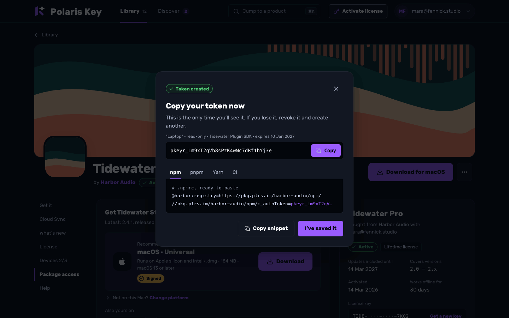

A dialog (bottom sheet on phones) that cannot be dismissed by scrim click or Escape until the token
is copied or **I've saved it** is pressed (`OneTimeSecretPanel`): the token with **Copy**, its name,
scope and expiry, and the snippet with the real token inlined.

### 4.22 Remove a device (inline)

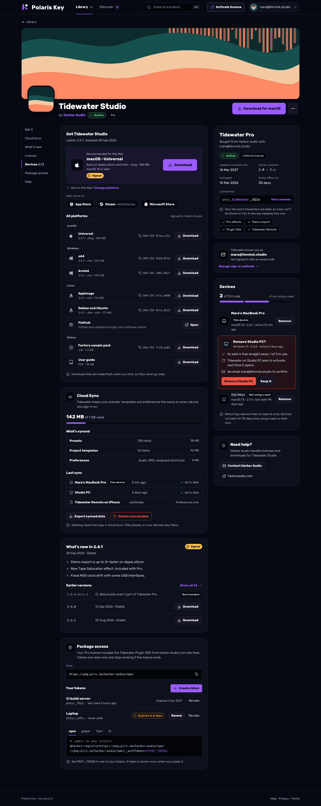

**Remove** expands the row in place into a `danger-subtle` panel headed "Remove Studio PC?" with the
consequences (the seat is free straight away with the new count; the app on that device asks to
activate next time; an email confirms it), **Keep it** and **Remove** (its accessible name stays
"Remove Studio PC"). Focus moves to the panel heading; Escape in the panel is Keep it, and focus
goes back to the row's Remove. Under 22rem the two buttons stack full width, Remove last (§8's sheet
buttons). On a sign-in license the seat is freed the same way, and the panel adds "Studio PC signs
out of <Product>." (SIGN-IN.md D-58).

### 4.23 Sign in with another device

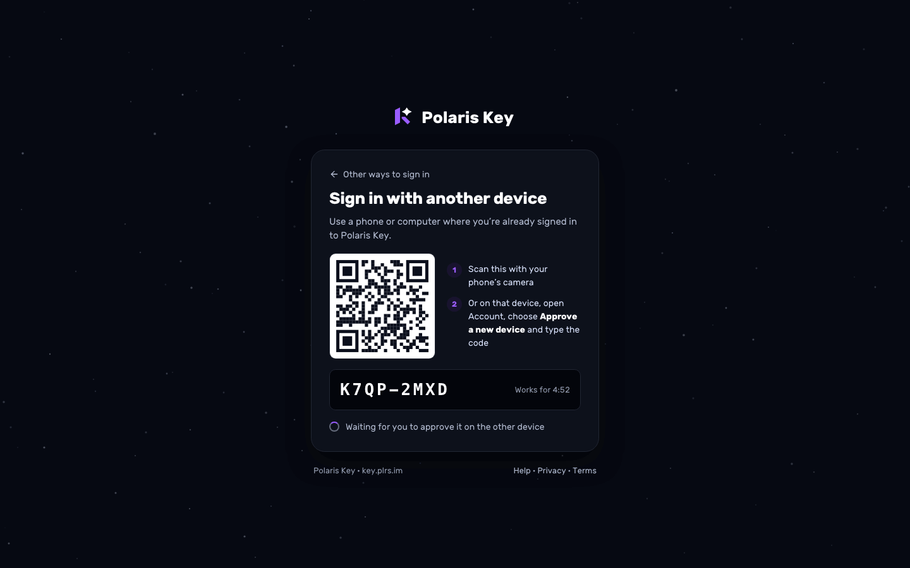

On a new device, **Sign in with another device** shows a QR code and an 8-character code ("Works for
4:52"), with two ways to approve it: scan with a phone where you're signed in (the phone camera opens
`#/account/approve?code=`), or on that device open Account → **Approve a new device** and type the
code. "Waiting for you to approve it on the other device" polls until approved, denied or expired.

### 4.24 Approve a new device

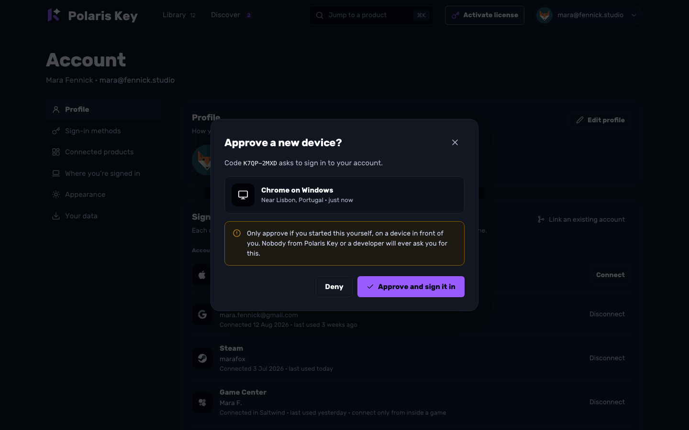

On the signed-in session: "Approve a new device? · Code KRQP-BMXD asks to sign in to your account",
the requesting device (browser and OS, coarse location, when), a `warning` notice "Only approve if
you started this yourself, on a device in front of you. Nobody from Polaris Key or a developer will
ever ask you for this.", **Deny** and **Approve and sign it in**. Approval is audited, emailed, and
the new session appears in "Where you're signed in".

### 4.25 Device limit: focused flow

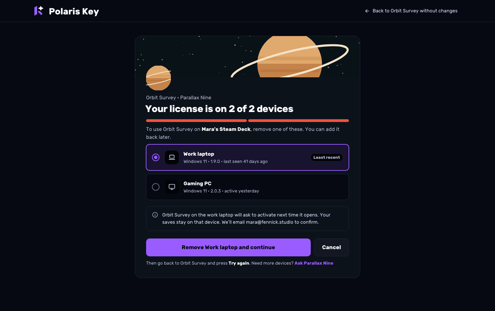

This flow is also the fallback behind the sign-in card's **Free a device** link (§4.8, 2026-10-05). Otherwise it is unchanged: minimal chrome with **Back to Orbit Survey without changes**; "Your license is on 2 of 2
devices" with a full red meter; devices as radio cards with the least recently used preselected;
consequences; **Remove Work laptop**; then "Go back to Orbit Survey and press Try again". This
flow only frees the seat. Inside the sign-in card the same situation is **Replace a device**, which
also binds the waiting device (SIGN-IN.md §3.7).

**The focused task frame** (free a device and the focused download, `FocusedFlow`):

1. A minimal header with back-to-app, then a breadcrumb label, "<Product> / Device access" or
   "<Product> / Download" (12 px, `text-muted`, factual), and the task title (display step, §0.3).
2. A product identity row (56 px icon, name, developer) instead of a cover band. Art, if shown, is
   the whole frame, never a slice.
3. The desktop composition is centred, never a left-pinned half column. On short desktop screens
   the device list and the consequences with the action sit in two columns, so **Remove** is on the
   first screen. Under 761 px the action row is sticky.
4. The focused download names version, platform, architecture and size before the action, shows
   the middle-truncated SHA-256 with **Copy** and the channel rows in A-26's order for the chosen
   platform, an install hint when the build declares one, and an "Other platforms and
   architectures" disclosure. On phones it says "You're viewing desktop builds." with **Email me the
   download** as the primary, never a desktop Download.
5. Focus lands on the heading; a return link goes only through `safeReturnTo`.

### 4.26 Account

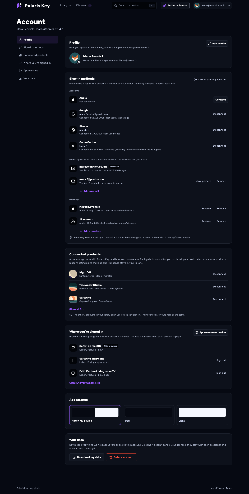

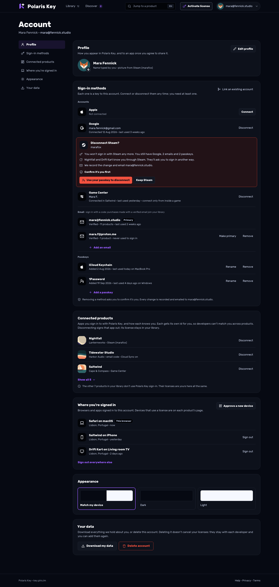

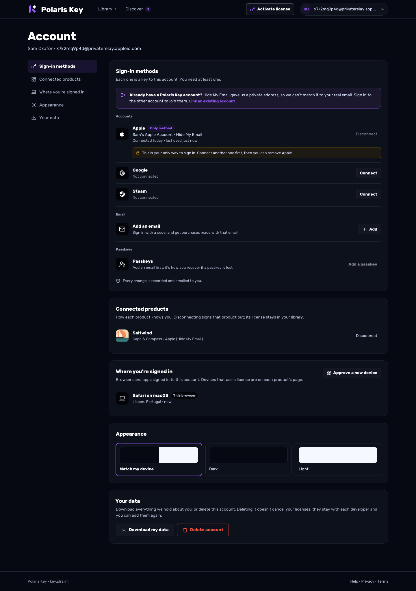

Reached from the account menu. A sticky section nav (pills on phones) that marks the section on
screen (Profile at the top), and one card per section, in this order: **Profile · Sign-in methods ·
Connected apps · Packages · Where you're signed in · Appearance · Your data**. The nav names only
sections that exist.

**Profile** (§4.30): the avatar with the badge of the provider its picture came from, the display
name, where each came from ("Name typed by you · picture from Steam (marafox)") and **Edit
profile**. An account without a picture (Sam's Apple account in 38: "Apple doesn't share a
picture") offers **Add a picture**.

**Sign-in methods** (S-16: an account is a person; sign-in methods are keys to it). "Each one is a
key to this account. Connect or disconnect them any time; you need at least one." with **Link an
existing account** in the header. Three groups of rows, each row with the provider glyph, the
**connected identity** (Google address, Steam persona, Game Center alias, "Sam's Apple Account ·
Hide My Email"), when it was connected and **last used**, and its action:

| Group    | Rows                                                                                                                             | Actions                                                                   |
| -------- | -------------------------------------------------------------------------------------------------------------------------------- | ------------------------------------------------------------------------- |
| Accounts | Apple, Google, Steam always listed; Game Center / Play Games only once connected ("connect only from inside a game")             | **Connect** (secondary) or **Disconnect** (ghost)                         |
| Email    | Each verified address: Primary, products it brought in, last used to sign in. **Add an email** (verify by code)                  | **Make primary**, **Remove** (not the primary while it is the only email) |
| Passkeys | One row per passkey: provider name, added, last used and where. **Add a passkey** (disabled with a reason until an email exists) | **Rename**, **Remove**                                                    |

- **Disconnect and remove ask for step-up:** the row expands into a `danger-subtle` panel ("Disconnect
  Steam?"), lists the consequences (you won't sign in with Steam; which other methods remain; which
  products know you through Steam and will ask you to sign in another way; the change is recorded and
  emailed), then "Confirm it's you first" and **Use your passkey to disconnect** (or an email code
  when there's no passkey) next to **Keep Steam**.
- **The last method can't be removed.** When only one method exists its row says **Only method**,
  **Disconnect** is disabled, and a `warning` line explains: "This is your only way to sign in.
  Connect another one first, then you can remove Apple." (S-16 "never orphan").
- **Hide My Email accounts** get a notice at the top: "Already have a Polaris Key account? Hide My
  Email gave us a private address, so we can't match it to your real email. Sign in to the other
  account to join them. Link an existing account".
- Footnote: "Removing a method asks you to confirm it's you. Every change is recorded and emailed to
  <primary email>."

**Connected apps** (replaces "Connected products"; claims show as icon and word chips, a check with
the claim when granted and "Not your <claim>" when declined, never colour alone; **Change what
<App> gets** reopens the consent toggles): apps the person signs in to through Polaris Key, so only products with
**Identity on** (§3.1): one row per product user with **the identity it uses** and, when the product
has it, "Cloud Sync on"; **Disconnect** ("signs that app out; its license stays in your library").
The subtitle names the pairwise id: "Each gets its own id for you, so developers can't match you
across products." A footnote counts the rest: "The other 7 products in your library don't use
Polaris Key sign-in. Their licenses are yours here all the same." Always present when the account has a product, so the section nav never points at a
missing card: Sam's Hide My Email account (38) shows its one row, Saltwind · Apple (Hide My Email).

**Packages:** the account's package tokens, the one place they are created, shown once and revoked
(§4.21). A token is account-wide, so a revoke affects every product that uses it; the product page
only points here.

**Where you're signed in:** browsers and apps signed in to the account (never product devices), with
**Approve a new device** and **Sign out everywhere else**.

**Appearance** and **Your data** (Download my data; Delete account with typed confirmation) are
unchanged.

### 4.27 Jump to a product (⌘K)

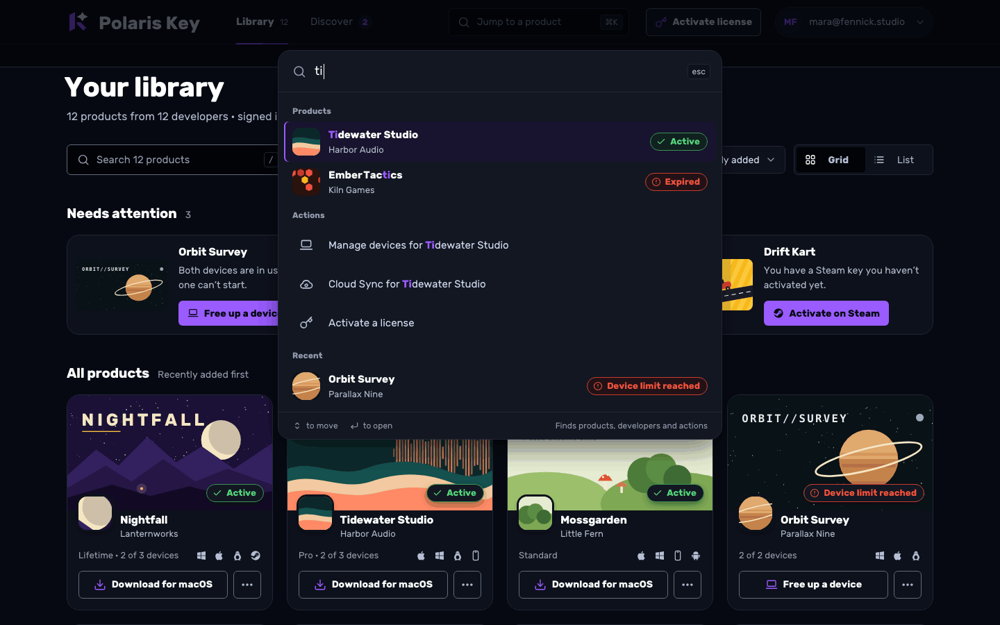

From 8 products (⌘K / Ctrl K, the header trigger, the phone search icon), on `cmdk`: **Products**,
**Actions** scoped to the top match ("Manage devices for …", "Cloud Sync for …" only when the
product has it, "Activate a license"), **Recent**. The trigger's placeholder reads "Jump to…" at
its floor width. Desktop: a 640 px dialog near the top; phone:
full-screen.

### 4.28 Not found and errors

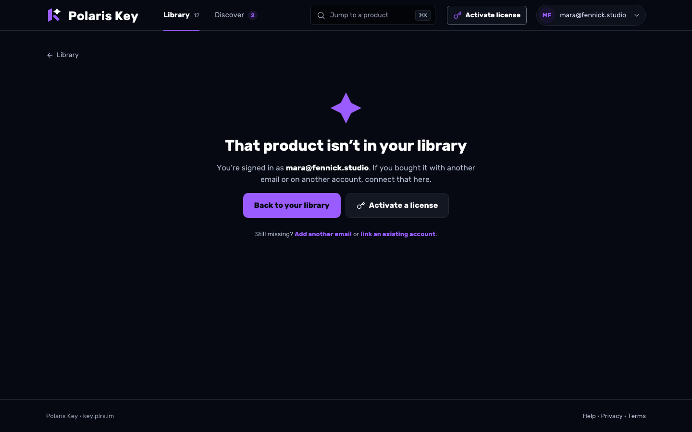

- **Product not in your library:** the star, "That product isn't in your library", who you're
  signed in as, **Back to your library**, **Activate a license**, and links to add another email or
  link an existing account. Never "portal api 404".
- **Can't reach Polaris Key**, **Something went wrong** (with a reference id), and **Signed out
  mid-session** (a toast and the login card with `returnTo`).

### 4.29 Confirm your email (first provider sign-in)

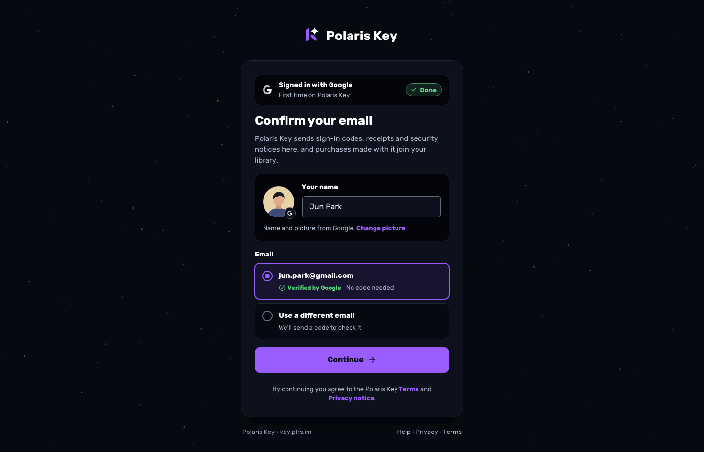

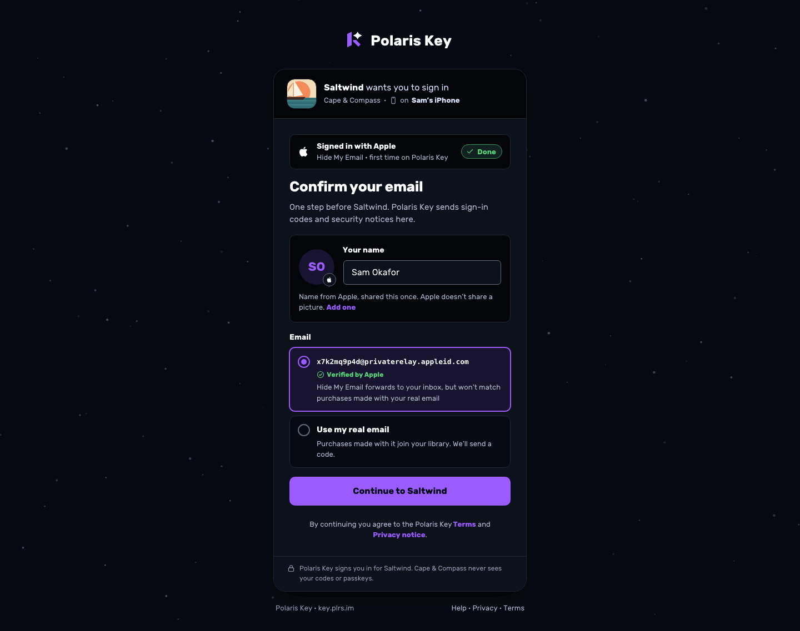

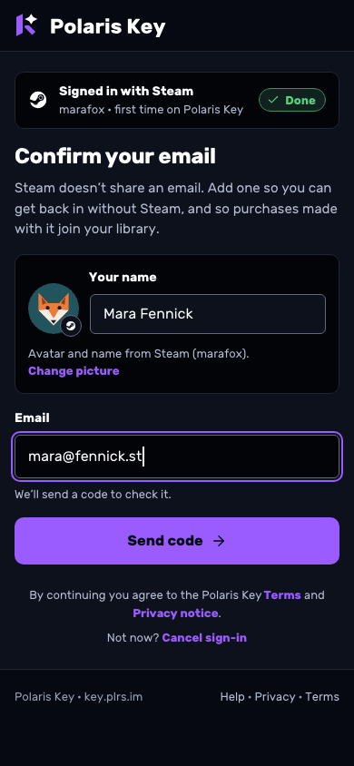

Owner decision (2026-10-04). The **first time** someone signs in through a provider (Apple, Google,
Steam, or a platform identity such as Game Center or Play Games inside an app), a **required** step
asks them to confirm the account's email before continuing, like a storefront's terms gate. It
cannot be skipped; **Cancel sign-in** (or the app's Cancel) abandons the sign-in instead. It runs
once per account: an account that already has a confirmed email never sees it again, whichever
method it later uses.

**Layout** (login card body; product or app header above when present):

1. A "Signed in with <Provider> · Done" strip ("marafox · first time on Polaris Key").
2. `h1` **Confirm your email**, with a lede saying what the email is for (sign-in codes, receipts,
   security notices; purchases made with it join the library). Inside an app: "One step before
   Saltwind."
3. **Profile import** (§4.30 rules): the imported picture with the provider's badge, **Screen name** (I-33)
   prefilled and editable, and one line naming the source ("Name and picture from Google. Change
   picture"). Google: name and picture. Apple: name, on first consent only, and no picture ("Apple
   doesn't share a picture. Add one"). Steam: persona name and avatar.
4. **Email**, as radio cards when the provider gave an address:
   - the provider's address, **prefilled and selected**, including an Apple private-relay address
     (`…@privaterelay.appleid.com`, shown in mono with "Hide My Email forwards to your inbox, but
     won't match purchases made with your real email");
   - **Use a different email** ("Use my real email" for a relay address), which expands into a field.
5. **Terms**, only when the product requires them: an unchecked checkbox "I agree to the <terms>"
   with "Required by <Developer>. Asked once, and again only if the terms change." The primary stays
   disabled until it is ticked.
6. The primary, then the Polaris Key terms line.

**When a code is needed.** A **provider-verified** address is accepted with **no code**: Google with
`email_verified: true`, and Apple (always verified, relay included). Google counts only for a Gmail
address or one whose domain the token's `hd` claim names (narrowed 2026-10-06; SIGN-IN.md §3.5 is
the rule). Only a **typed** address, or a provider address that is not verified, gets a one-time
code: the selected card shows the address
with a check, "We sent a 6-digit code to …", six cells, resend countdown and **Change email**; the
primary becomes **Verify and continue** (44, 49).

**Steam** returns no email, so there are no radio cards: the field starts **empty** with "Steam
doesn't share an email. Add one so you can get back in without Steam", and the primary is **Send
code** (45, 48).

**Edge cases.**

- **The confirmed email already belongs to another account** (known only after the code, so nothing
  is enumerated): the person has proven both the provider and that email in one session, so the
  gate offers **Join into one account** (§4.11) or **Use a different email**. A provider-verified
  address that matches an existing account is treated the same way, never joined silently.
- **Changed later:** the email can be changed or more added in Account → Sign-in methods; the relay
  address can be kept as a secondary.
- **Passthrough:** the persistent app header stays (§4.7) and the primary names the app ("Continue
  to Saltwind"); a device-code flow keeps the TV code panel (48).

| Render | Variant                                                            |
| ------ | ------------------------------------------------------------------ |
| 43     | Plain · Google · verified, no code                                 |
| 44     | Plain · Google · switched to a typed email · code                  |
| 45     | Plain · Steam · empty field                                        |
| 46     | Plain with product context (Lumen RAW beta) · verified · terms     |
| 47     | App (Saltwind on iPhone) · Apple Hide My Email · verified, no code |
| 48     | App (Drift Kart on a TV, device code) · Steam · terms              |
| 49     | App (Saltwind) · switched from the relay to a real email · code    |

- **Data:** G31 (gate state, verified flag, terms acceptance), G32 (imported claims).

### 4.30 Account → Profile

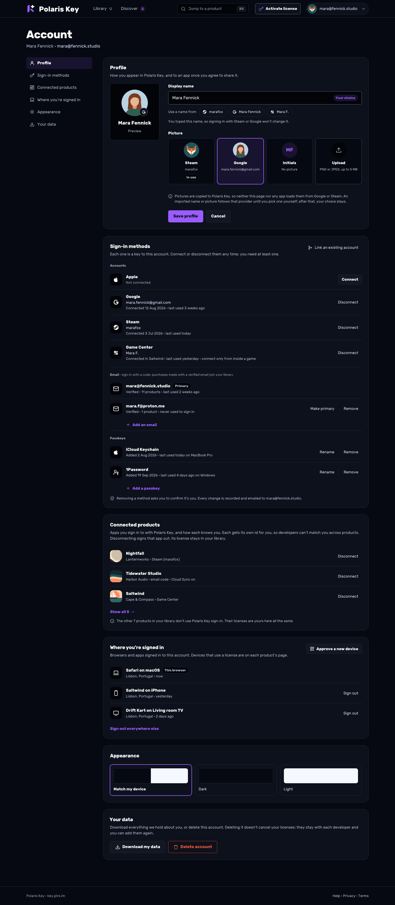

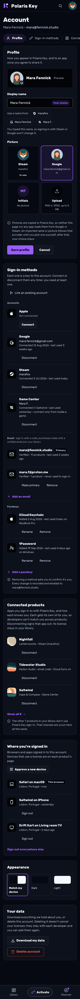

The first card on Account (`#/account/profile`). **Edit profile** opens it in place:

- A **preview** (the picture as it will look, with its source badge, and the name).
- **Screen name** (I-33) with a **Your choice** tag once typed, and chips **Use a name from** each linked
  method that supplied one (Steam "marafox", Google "Mara Fennick", Game Center "Mara F.").
- **Picture** as radio tiles: each linked provider that supplied one (Steam avatar, Google
  picture), **Initials**, and **Upload** (PNG or JPEG, up to 5 MB; cropped to a square). The tile in
  use says **In use**. Apple never appears as a picture source.
- Below a hairline, **Birth date** (I-33), labelled **Optional**: a date field with **Remove**
  while one is set, and "Private to you. Apps never receive it." Read-only, the card adds
  "Born <date> · private to you" with a lock, only when there is one.
- **Save profile** and **Cancel**.

**Rules.**

1. **Import.** At link time Polaris Key records what the provider supplied: Google `name` and
   `picture`; Apple `name` from the first authorisation only (Apple sends it once); Steam
   `personaname` and avatar (Steam Web API). The first provider fills the profile.
2. **Follow until chosen.** An imported value that the person never chose follows its source: it
   refreshes when they sign in with that provider. **Explicit choices stick:** a typed name, a picked
   source, an upload or Initials is never overwritten by a later sign-in.
3. **Copied, not hot-linked.** Pictures are fetched once, re-encoded, stripped of metadata and stored
   by Polaris Key (G33), and served same-origin, so neither the site (CSP `img-src 'self'`) nor an
   app loads them from Google or Steam.
4. **Who sees it.** The profile shows in Polaris Key and reaches an app only through the consent
   step (§4.8). Pre-authentication screens (the identity chip in 03 and 09) never show the picture.
5. **Where it appears.** The header avatar, the account menu, the consent person row (12), the TV
   done row (15) and Account.

---

## 5. Components

### 5.1 Reuse first

The site is built on the console kit in `packages/admin/src/ui/` and `@polaris-key/brand/react`.
New components live in `packages/admin/src/portal/components/` unless the console can use them too.

| Need                   | Use                                                                                              |
| ---------------------- | ------------------------------------------------------------------------------------------------ |
| Lockup in the header   | `PolarisLockup` (`@polaris-key/brand/react`), compact, theme-driven                              |
| Buttons, icon buttons  | `ui/Button`, `ui/IconButton` (add the `quiet` outlined variant, §5.2)                            |
| Status pills           | `ui/StatusPill` with the status map (§5.3)                                                       |
| Signed chip            | `ui/SignedBadge`                                                                                 |
| Copy, hashes, versions | `ui/CopyButton`, `ui/Hash` (middle-truncated SHA-256), `ui/Version`                              |
| Key display            | `ui/KeyDisplay` (last characters only)                                                           |
| One-time token         | `ui/OneTimeSecretPanel` inside `ui/Dialog`                                                       |
| Dialogs, sheets        | `ui/Dialog`; `ui/Drawer` as the phone bottom sheet                                               |
| Forms                  | `ui/Input`, `ui/form`, `ui/RadioCards` (device picker, theme), `ui/SegmentedControl` (Grid/List) |
| Code snippets          | `ui/CodeBlock` with tabs                                                                         |
| Empty, error, loading  | `ui/EmptyState` (star motif), `ui/ErrorState`, `ui/Skeleton`, `ui/Spinner`                       |
| Toasts, live regions   | `ui/toast` (sonner), `ui/LiveRegion`                                                             |
| Times                  | `ui/Timestamp` (relative, with the absolute date as text in a `title` _and_ on focus)            |
| Kbd hints              | `ui/Kbd`                                                                                         |
| Data table (list view) | `ui/data-table` in client mode                                                                   |

### 5.2 New components

| Component                                                                                                                                                   | Contract                                                                                                                                                                                                                                                                                           |
| ----------------------------------------------------------------------------------------------------------------------------------------------------------- | -------------------------------------------------------------------------------------------------------------------------------------------------------------------------------------------------------------------------------------------------------------------------------------------------- |
| `PortalShell`                                                                                                                                               | Header (lockup, Library/Discover nav, ⌘K, **Activate license** action, account menu), phone bottom bar (Library · Activate pill · Discover), footer, skip link, `main`.                                                                                                                            |
| `AccountMenu`                                                                                                                                               | Avatar chip and menu (Account, Sign-in methods, Approve a new device, Appearance, Help, Sign out); a sheet on phones.                                                                                                                                                                              |
| `LoginCard`                                                                                                                                                 | The one sign-in frame: lockup, card with `header` / `body` / `footer` slots, legal footer, star field. Owns step transitions and focus (each step's `h1` receives focus).                                                                                                                          |
| `CardHeader`                                                                                                                                                | `variant: "context" \| "app" \| "device"`. Props are **data only**: `icon`, `name`, `developer`, `where` (origin or device label), `code`. No children, no HTML, no colours. Reserved-name check happens server-side at client registration.                                                       |
| `MethodStack`                                                                                                                                               | Email (identifier-first) with conditional UI, the `ProviderRow` (Apple, Google, Steam only, filtered by `capabilities`: one row of 1–3 equal-width, logo-only buttons, each named "Continue with <Provider>", §4.1), passkey button, quiet links.                                                  |
| `UsualMethodHint`                                                                                                                                           | Reads `pk_last_method` and renders "You usually sign in with …"; renders nothing without the cookie.                                                                                                                                                                                               |
| `CodeEntry`                                                                                                                                                 | Six cells, paste, auto-submit, resend countdown, BroadcastChannel and re-check.                                                                                                                                                                                                                    |
| `KeyField`                                                                                                                                                  | Mono, paste-first (Paste button while empty), wraps instead of scrolling; never groups or changes case, trims whitespace only; validates `^pkey_([a-z0-9-]+)_([A-Za-z0-9_-]{22})$`; shows "Key for <Product>" from the slug before any request; `KeyMask` renders `pkey_<slug>_…<last 4>` (§4.17). |
| `AccountUpgrade`                                                                                                                                            | Key card, entries meter, method stack; `forced` removes the skip and switches the notice to danger.                                                                                                                                                                                                |
| `AppConsent`                                                                                                                                                | The confirm step: person row, "what it gets" list (license, Cloud Sync when present, profile and email), the pairwise-id line, Continue/Cancel.                                                                                                                                                    |
| `EmailGate`                                                                                                                                                 | The required first-provider-sign-in step (§4.29): provider strip, `ProfileImport`, email radio cards or an empty field (Steam), inline `CodeEntry` for typed or unverified addresses, optional terms checkbox, join-on-conflict hand-off to `LinkAccounts`.                                        |
| `ProfileImport`, `ProfileEditor`, `Avatar`                                                                                                                  | The imported name and picture with source badge (gate); the Account → Profile editor (name chips, picture tiles, upload, explicit-choice tags); the one avatar used everywhere (picture, else initials; never before authentication).                                                              |
| `AddMethodNudge`                                                                                                                                            | Rows of methods to add, recommended first, skip.                                                                                                                                                                                                                                                   |
| `LinkAccounts`                                                                                                                                              | Two proven account cards, consequences, join.                                                                                                                                                                                                                                                      |
| `DeviceApproval`                                                                                                                                            | New-device side (QR, code, poll) and approving side (dialog with device details, deny/approve).                                                                                                                                                                                                    |
| `ProductArt`                                                                                                                                                | `variant: "banner" \| "tile" \| "thumb" \| "icon"`; proxied art (G1) with the flat tint-and-icon / tint-and-letter fallback. No gradients.                                                                                                                                                         |
| `LibraryTile`, `LibraryHero`, `LibraryList`, `AttentionShelf`, `LibraryToolbar`, `QuickAction`                                                              | As in the converged design: 16:9 art, the status on a padded plate, icon overlapping, name, meta, platform glyphs, note, outlined quick action and overflow; the one-product hero; the list on `ui/data-table`; the shelf; the URL-synced toolbar; quick-action resolution (§5.4).                 |
| `DiscoverTile`                                                                                                                                              | Art, icon, name, developer, offer terms, platforms, "why you can add it", **Add to library** → added state (green edge, **In your library**, **Open**).                                                                                                                                            |
| `ActivateDialog`                                                                                                                                            | Steps enter → confirm (art header, product, tier, terms, key echo) → done; inline errors (§4.19); `prefill` and `fromProduct` props for the deep link. Mounted once in `PortalShell`, opened from anywhere.                                                                                        |
| `JumpPalette`                                                                                                                                               | ⌘K (§4.27).                                                                                                                                                                                                                                                                                        |
| `ProductHeader`, `SectionNav`, `GetItPanel`, `FileRow`, `StoreHandoff`, `LicenseCard`, `SeatMeter`, `DeviceRow`, `PackageAccessCard`, `ProductIdentityCard` | As in the converged design. `SectionNav` omits absent sections, including Cloud Sync.                                                                                                                                                                                                              |
| `CloudSyncCard`                                                                                                                                             | Storage bar, data classes, per-device last sync, export, delete with step-up. Rendered only when the product's `services.cloudSync` is on.                                                                                                                                                         |
| `SignInMethods`                                                                                                                                             | The Account section: grouped rows, connect flows (provider redirect or code), disconnect with inline step-up, last-method guard, audit footnote.                                                                                                                                                   |
| `FocusedFlow`                                                                                                                                               | Minimal chrome, breadcrumb label, identity row and return-URL handling for `free-device` and `download` (§4.25).                                                                                                                                                                                   |

`Button` gains two variants: **quiet** (transparent, `border-strong` outline, `text-strong` label,
icon in `accent-fg`; the library's quick action) and **action** (`surface-raised`, `border-strong`,
key glyph in `accent-fg`; the header's Activate license).

### 5.3 Status model

One status per product (from its best license), computed server-side once G1/G5 land and
client-side from existing fields before then. Precedence, first match wins:

| Status                | Pill (icon · word · token)                                  | Reason line / note                                                        | Attention shelf action                                                                            |
| --------------------- | ----------------------------------------------------------- | ------------------------------------------------------------------------- | ------------------------------------------------------------------------------------------------- |
| Suspended             | alert · "Suspended" · danger                                | "Suspended by <developer>."                                               | Contact <developer>                                                                               |
| Expired               | alert · "Expired" · danger                                  | "Updates ended at 1.8" (or "Ended 4 Sep 2026")                            | Renew with <developer>                                                                            |
| Updates ended         | alert · "Updates ended" · warning                           | "Updates ended at 4.1.3" · "Keeps working · renewal stopped Sep 30, 2026" | Download <last covered version> (header primary); Renew with <developer> only in the License card |
| Device limit reached  | alert · "Device limit reached" · danger                     | "2 of 2 devices"                                                          | Free a device                                                                                     |
| Key not activated     | key · "Key not activated" · info                            | "Steam key"                                                               | Activate on Steam                                                                                 |
| Expires soon (≤ 14 d) | clock · "Expires in 9 days" · warning                       | "Studio · ends 13 Oct"                                                    | Renew with <developer>                                                                            |
| Offline grace ended   | alert · "Needs a check-in" · warning                        | "Open <product> while online"                                             | none                                                                                              |
| From signing in       | user · "From signing in" · neutral (quiet text, not a type) | tier first, e.g. "Standard · From signing in · 1 of 5 devices"            | none                                                                                              |
| Active                | check · "Active" · success                                  | tier and devices, e.g. "Lifetime · 2 of 3 devices"                        | none                                                                                              |

A keeps-the-last-version lapse is a warning and is said once (the header pill); the danger
Expired row is for licenses whose access ends. There is no Not included row for newer builds.
A past date is never shown as "Expires …": it is "Ended <date>" or "Updates ended at <version>".
Expiry inside 14 days uses relative days; otherwise "until 14 Mar 2027".

### 5.4 Quick action resolution

| Product state                                       | Desktop                                                        | Phone                                                  |
| --------------------------------------------------- | -------------------------------------------------------------- | ------------------------------------------------------ |
| Device limit reached                                | Free a device                                                  | Free a device                                          |
| Steam key held, not activated                       | Activate on Steam                                              | Activate on Steam                                      |
| Sign-in licence (no key)                            | Open <product> (website / app scheme)                          | Get it on the App Store / Google Play, else Open       |
| Build for this OS exists and is covered             | Download for <OS>                                              | Store link for this OS, else **Email me the download** |
| Covered builds exist, none for this OS              | See downloads (with "Windows and Linux only" as the meta line) | Email me the download / See downloads                  |
| Expired or updates ended, an older build is covered | Download <last covered version>                                | Email me the download                                  |
| Only a package feed                                 | Set up package access                                          | Set up package access                                  |
| Public product (G19)                                | Open download page (dl.plrs.im)                                | Open download page                                     |

---

## 6. Copy

### 6.1 Rules

1. **Plain words.** Never "OIDC", "entitlement", "artifact", "deliverable", "authorized",
   "deauthorized", "session refresh", "claim" or "redeem" (in UI; "add" and "activate" instead),
   "identity link" ("sign-in method"), "merge" ("join"), "account id" as a headline.
2. **Name it "Polaris Key".** Never "Polaris Key Portal", "the portal" or "PK" in UI or email.
3. **No redundant subtitles.** A subtitle earns its place only by saying something the heading
   can't: a rule, a consequence, or who is responsible.
4. **Name the developer.** "Renew with Kiln Games", "Harbor Audio never sees your codes".
5. **Buttons say what happens to what.** "Add Mossgarden", "Continue to Tidewater Studio",
   "Use your passkey to disconnect", "Join into one account". No "Submit", "OK", "Confirm".
6. **Say why, then what to do.** "This is your only way to sign in. Connect another one first, then
   you can remove Apple."
7. **Sentence case** everywhere; status words capitalised as labels.
8. **Providers by their own names:** each logo-only button is named "Continue with Apple / Google /
   Steam" (accessible name and tooltip). No other providers.
9. **Numbers and dates:** "2 of 3", "2 of 5 key entries left", "Expires in 9 days", "until 14 Mar
   2027", "last used 3 weeks ago". Versions without a leading "v", in mono.
10. **Product names, not slugs,** in UI and email. (The one place a slug shows is inside a license
    key, which is printed exactly as issued: `pkey_mossgarden_…`.)
11. **Don't over-promise.** Only say a page "signs you in by itself" when it does; only mention
    Cloud Sync for products that have it.

### 6.2 Voice samples

| Moment              | Copy                                                                                                  |
| ------------------- | ----------------------------------------------------------------------------------------------------- |
| Sign in             | "Sign in to Polaris Key"                                                                              |
| Known account       | "Welcome back, Mara · You usually sign in with Steam"                                                 |
| App header          | "Tidewater Studio wants you to sign in · Harbor Audio · on Mara's MacBook Pro"                        |
| App confirm         | "Continue to Tidewater Studio as Mara? · It won't see your other products or how you sign in."        |
| Key upgrade         | "Keep Nightfall in an account · 2 of 5 key entries left"                                              |
| Key upgrade, forced | "This key has used all 5 entries. From now on Nightfall is opened through an account."                |
| Discover            | "Products their developers offer to your account. Adding one gives you its license straight away."    |
| License key field   | "Paste the whole key. It starts with pkey\_ and capital letters matter." · "Key for Mossgarden"       |
| Activate confirm    | "Add Mossgarden to your account?"                                                                     |
| Nudge               | "If you ever can't get into Steam, a second way in keeps your library yours."                         |
| Email gate          | "Confirm your email · Steam doesn't share an email. Add one so you can get back in without Steam."    |
| Profile             | "You typed this name, so signing in with Steam or Google won't change it."                            |
| Join accounts       | "We never join accounts just because emails look alike."                                              |
| Approve a device    | "Only approve if you started this yourself, on a device in front of you."                             |
| Cloud Sync delete   | "Deleting clears the copy in Cloud Sync. Files already on your devices stay there."                   |
| Key storage         | "Only the last 4 characters are kept, so a key can’t be shown in full. A new key replaces this one."  |
| Delete account      | "Deleting it doesn't cancel your licenses: they stay with each developer and you can add them again." |

### 6.3 Emails

Every email is from "Polaris Key", names the product (not the slug) and the device by label, and
deep-links to the exact section (§3.4). Subjects: "Nightfall is in your library", "Studio PC was
removed from Tidewater Studio", "Your Polaris Key sign-in code: 481 920", "Steam was disconnected
from your Polaris Key account", "A new device signed in to Polaris Key", "Your two Polaris Key
accounts were joined". Security emails (method added or removed, device approved, accounts joined)
always go to every verified email on the account and carry "Wasn't you? Secure your account". The
emails use the kit PNG lockup and no "Powered by" badge.

PX-W7 implementation note (2026-10-04): the header is the kit's horizontal lockup PNG,
`/lockups/key/key-horizontal-{light,dark}-944.png` shown at 472 × 160 with `alt="Polaris Key"`
(BRAND.md §2 "Emails"), served from the console origin's `/assets/branding/key/`
(`packages/admin/vite.config.ts` emits it next to the web icons). The email ground is light, so
the `light` variant (for light backgrounds) is the default, and the email's dark palette swaps in
the `dark` variant for the clients that apply `prefers-color-scheme` (BRAND.md's example names
the `dark` file; on the light ground its white wordmark would vanish). A client that inverts the
ground without honouring the palette can still dim the `light` wordmark; that is the residual
risk. With no usable `https` origin a text wordmark stands in.

### 6.4 Error copy

Errors say what happened, in the user's terms, and the next step. Map every flat error code the API
returns (`W/core/errors.ts`) to a sentence; unknown codes fall back to "Something went wrong. Try
again." with the reference id. Never render the HTTP status or an internal code as the message. A network failure on any form
says "We couldn't reach Polaris Key. Your changes are still here. Try again.", under the action
that failed with the danger icon, focus moved to it with a visible ring; errors stay inline, never
a native validation bubble.

---

## 7. Layout and visual details

- **Grid:** content max-width 1312 px with 32 px gutters (16 px on phones). Library grids: 24 px
  gaps for large tiles, 20 px for compact.
- **Radii:** tiles, cards and the hero `xl` (18 px); controls `md`; pills `full`.
- **Surfaces:** page `surface-page`; tiles and cards `surface-raised` with `border-subtle` and
  `elevation-1`; dialogs `surface-overlay` with `elevation-3`; inputs and code `surface-sunken`.
- **Status pills on art** sit on a solid `surface-overlay` plate with `elevation-2` so they read on
  any artwork; the art's own text should avoid the bottom-right corner (developer guidance in the
  listing docs).
- **Type scale:** page `h1`, product `h1` and focused-task titles use the display step, 48/52 (32/36
  on phones), 600, -0.02em, no full stop, clamped to reflow at 200 % zoom and 320 px, at most two
  lines; card `h2` 18; tile name 18 (16 compact); body 16; metadata 13; group labels and counts 12
  semibold. Weights are 400, 500 and 600 only.
- **Art and names:** the portal never draws text over developer art; status plates use the
  bottom-left and art text avoids the bottom-right. Names (tiles, hero `h2`, attention titles,
  palette rows, device names) carry `dir="auto"` so RTL names align to the start. `ProductArt`
  picks the hosted variant at least as wide as the drawn size times the device pixel ratio and
  never upscales a tile variant into a banner.
- **Motion:** the one system of [notes/S-23](../research/2026-09-29-godot-omniplatform/notes/S-23-motion-system.md) and EXPERIENCE §7.2, built by
  phase MO (MO-05 navigation, MO-06 devices and activation, MO-07 Library and Discover). In the
  portal: the Library tile's art and name fly into the product hero and back; routes fade through
  with scroll reset and heading focus; the Library staggers in on first load only; tiles lift and
  press; developer art fades in once decoded; the Remove confirm expands in place; a freed device
  leaves the list while the seat meter and count follow; the Activate dialog morphs between steps
  and its first success draws a check with a short burst of sparks, once per account. Only loading
  indicators loop. The star never moves. Under reduced motion every change is an instant swap.
- **Images:** all developer images are served **same-origin** through the media proxy (G1) because
  the site's CSP is `img-src 'self' data:`; sizes 1280 × 720 banner, 640 × 360 tile, 256 × 256 icon,
  WebP with PNG fallback.

## 8. Responsive rules

| Width       | Library                                                                                        | Product page                                                                                           | Chrome                                      |
| ----------- | ---------------------------------------------------------------------------------------------- | ------------------------------------------------------------------------------------------------------ | ------------------------------------------- |
| ≥ 1180 px   | Large tiles 3 columns; compact 4 columns                                                       | TOC · main · side (148 · fluid · 384)                                                                  | Full header                                 |
| 761–1179 px | Large 2, compact 3                                                                             | 1024–1179 px: main · side (fluid · 340), with pills; 761–1023 px: one column in task order, with pills | Compact header (below)                      |
| ≤ 760 px    | One column; List view by default above 6 products; toolbar: search + view toggle, chips scroll | One column in task order; sticky pill tabs; banner full-bleed                                          | 56 px header, bottom tab bar, bottom sheets |

- **Compact header (761–1179 px):** the same row, so the account menu never leaves the screen: the
  account chip is its avatar and the ⌘K trigger a 40 px icon; below 900 px the lockup drops to its
  52 px phone size, the header's gaps to 24 px and the action reads **Activate** (its accessible
  name stays "Activate license"). From 1180 px the chip adds the full name (never its first word
  alone: "Dr.", a compound prefix, a family name first; the menu keeps the full name and the
  email; with no name, the avatar alone), and when the row is tight the ⌘K field gives way first
  (256 down to 176 px), before the name truncates. ⌘K, Activate and the chip are 40 px tall, 44 px
  on a coarse pointer.
- **Shelves on tablets:** Needs attention uses two columns at 761–899 px and three from 900 px;
  Ready to add two at 761–1179 px and three from 1180 px. In two columns an odd last card spans
  both. An attention card's action has its own row at the card's foot, full width and on one line
  (a long label truncates; the accessible name keeps it), so the actions in a row line up; the card
  shows its thumbnail only when it has 22rem for it beside the title and reason.
- **Short screens** (at most 512 px tall: a phone on its side, 200 % zoom): the header scrolls away
  instead of sticking, and what stuck under it (the section pills) sticks to the top; a section
  jump lands 0.75rem under whatever still sticks, and Tab never leaves focus under it. Art steps
  aside for the task and the icon carries the product's identity: no banner on the product page
  (the icon beside the name, so the primary action shows on load), on Activate's confirm step
  (the facts and the key start on the first screen) or on a focused flow's card (Free a device,
  Download; the icon no longer overlaps). The empty library's star and the one-product hero follow
  §4.12 and §4.13; a focused flow's device list and action sit in two columns (§4.25).
- **No horizontal page scroll at 360 px**, ever (the render script checks every screen). Only code
  blocks scroll inside themselves. The quality bar checks every screen with pixels at 1440 and
  390 px (and 768 px for the seven key pages), and without at 320, 360, 768, 820, 1024, 844 × 390
  and 2560 px and 200 % zoom (PX-20).
- **Touch targets** ≥ 44 × 44 px on touch (buttons are 44 px; small buttons 36 px tall with 44 px hit
  areas through padding). The tab bar items are 52 px tall.
- **Tables become rows:** the list view drops columns and keeps status as a pill under the name.
- **Phone actions** replace desktop downloads (§5.4); dialogs become bottom sheets; the palette is
  full-screen.
- **Sheet buttons:** two short actions sit side by side with the primary last (right); when they
  don't fit, they stack **full width**, still primary last (bottom, nearest the thumb), never
  right-aligned at mixed widths (28 Activate license: done).
- Safe-area insets pad the tab bar and sheets (`env(safe-area-inset-bottom)`).

## 9. Accessibility

WCAG 2.2 AA in both themes (BRAND §9), plus:

1. **Landmarks and headings:** a skip link, one `banner`, `nav` (labelled "Main"), `main`, and
   `contentinfo`; exactly one `h1` per screen (sign-in, boot and error screens included); cards use
   `h2`, tiles `h3` (fixes PA-13 heading order).
2. **Names:** every icon-only control has an accessible name ("More for Nightfall", "Copy SHA-256",
   "Open Tidewater Studio"); provider buttons are logo-only and named "Continue with Apple" etc.
   (§4.1); the avatar link is "Account: <email>"; platform glyph groups are one
   `role="img"` with a list label.
3. **Status** is always icon plus word; the seat meter is `role="img"` with a text label; the
   "Not included" reason is visible text.
4. **Focus:** the 2 px ring with 2 px offset everywhere, in the referenced service's accent (core violet unless the element belongs to another service, B17); dialogs trap focus and return it to
   the opener; the inline device confirm moves focus to its heading; after adding a product, focus lands
   on the new product's `h1`.
5. **Forms:** visible labels; errors inline with `aria-invalid` and `aria-describedby`; the code
   cells are one labelled group and accept paste; no information only in placeholders.
6. **Live regions:** search result counts, toasts and download start ("Downloading Tidewater Studio
   2.4.1 for macOS") are announced politely.
7. **Keyboard:** `/` focuses search, ⌘K opens the palette, arrow keys move in the palette, radio
   cards and tabs; everything reachable without a pointer.
8. **Text:** task-critical text ≥ 14 px; 13 px only for secondary metadata; 12 px only for group
   labels and counts; `text-subtle` never carries required information.
9. **Motion:** reduced motion (the OS setting or the Reduce motion preference, MO-12) makes every
   change an instant swap; motion never carries information on its own; focus moves when the new
   state is in place (notes/S-23 §6.5–§6.6).
10. **Testing:** `vitest-axe` on every page component; a Playwright axe pass over all states in both
    themes at 1440 and 390 px (PX-15).

---

## 10. Data and API

### 10.1 What the portal API returns today

`GET /api/capabilities[?product=]`, `GET|DELETE /api/me`, `GET /api/licenses`,
`GET /api/licenses/:p/:id`, `POST /api/claim/license-key`,
`DELETE /api/licenses/:p/:id/devices/:deviceId`, `GET /api/releases`,
`POST /api/releases/:p/:r/artifacts/:a/token`, `GET /download/<token>`, plus `/login`,
`/callback`, `/logout`, `/magic/verify` and `POST /api/magic/start`. All are root paths on
`key.plrs.im`. In `routeCoverage` the route kinds (`portalApi`, `portalDownload`, …) are
narrative-only as kinds, but each `/api/*` route a package adds is pinned path by path in
`PORTAL_KIND_PATHS` and must be in the OpenAPI spec (PX-W1 started this; the login card, Discover,
device login, sign-in requests and the resend followed). The coverage test fails on a spec path
outside its expected set and on a pinned route the spec lacks, so **rule 10 for a new portal route
means its OpenAPI operation, its `PORTAL_KIND_PATHS` row, and a line on the docs site's portal page**
(`packages/docs/src/content/docs/services/identity/portal.md`) (corrected by PX-W4 against the
code; PX-W7's earlier note said the spec must not list `/api/*`).

### 10.2 Gaps the Worker must close

Ids G1–G20 follow the journey research; G21–G23 were added by the converged design; **G24–G30 are
new with the owner decisions of 2026-10-04**, and **G31–G34 with the second round** (Appendix E). "Fallback" is what the UI does until the gap closes.

| Id      | Need                                                   | Proposed shape                                                                                                                                                                                                                                                                                                                                                                                                                                                                                                                                                                                                                                                                                                                                                                                                      | Fallback until then                                                        | Gates                                                                                                                                                                                                      | WP                  |
| ------- | ------------------------------------------------------ | ------------------------------------------------------------------------------------------------------------------------------------------------------------------------------------------------------------------------------------------------------------------------------------------------------------------------------------------------------------------------------------------------------------------------------------------------------------------------------------------------------------------------------------------------------------------------------------------------------------------------------------------------------------------------------------------------------------------------------------------------------------------------------------------------------------------- | -------------------------------------------------------------------------- | ---------------------------------------------------------------------------------------------------------------------------------------------------------------------------------------------------------- | ------------------- |
| **G1**  | Product presentation                                   | From `ManifestListing` (`name`, `developerName`, `iconUrl`, `headerUrl`, `tintColor`, `website`) on `GET /api/library`; same-origin media proxy `GET /media/:product/:asset`                                                                                                                                                                                                                                                                                                                                                                                                                                                                                                                                                                                                                                        | Name only; letter-and-tint fallback                                        | Rule 10; CSP test; THREAT-MODEL (SSRF)                                                                                                                                                                     | PX-W1               |
| **G2**  | Store links per product and platform                   | `stores[]` `{kind, platform, url, live}` via a Core hook                                                                                                                                                                                                                                                                                                                                                                                                                                                                                                                                                                                                                                                                                                                                                            | "Also yours on" hidden                                                     | Rule 6                                                                                                                                                                                                     | PX-W2               |
| **G3**  | Licensed builds hosted on R2                           | Signed short-lived bytes URL or streaming through `/download/<token>`                                                                                                                                                                                                                                                                                                                                                                                                                                                                                                                                                                                                                                                                                                                                               | "Not available here yet · Contact <developer>"                             | **Plan mode**; THREAT-MODEL; rule 10                                                                                                                                                                       | PX-W3               |
| **G4**  | Downloads shaped per product                           | `GET /api/products/:p/downloads` through a Core hook over `page/model.ts` and `page/detect.ts`                                                                                                                                                                                                                                                                                                                                                                                                                                                                                                                                                                                                                                                                                                                      | Client groups `GET /api/releases`                                          | Rule 6; rule 10                                                                                                                                                                                            | PX-W2               |
| **G5**  | Seat limit and dormancy                                | `deviceLimit`, `activeSeatCount`, per-device `dormant`                                                                                                                                                                                                                                                                                                                                                                                                                                                                                                                                                                                                                                                                                                                                                              | "2 devices" without "of 3"                                                 | none                                                                                                                                                                                                       | PX-W1               |
| **G6**  | Device rename                                          | `PATCH /api/licenses/:p/:id/devices/:deviceId {label}`                                                                                                                                                                                                                                                                                                                                                                                                                                                                                                                                                                                                                                                                                                                                                              | No rename                                                                  | Rule 10                                                                                                                                                                                                    | PX-W5               |
| **G7**  | Get a new key                                          | `POST /api/licenses/:p/:id/keys` (shown once, step-up, notice); per-product opt-in                                                                                                                                                                                                                                                                                                                                                                                                                                                                                                                                                                                                                                                                                                                                  | Hidden                                                                     | Rule 10; D1 migration; `TABLE_OWNERS`                                                                                                                                                                      | PX-W5               |
| **G8**  | Purchase source and store grants                       | Core descriptor hook                                                                                                                                                                                                                                                                                                                                                                                                                                                                                                                                                                                                                                                                                                                                                                                                | "Bought from <developer>" only                                             | Rule 6                                                                                                                                                                                                     | PX-W6               |
| **G10** | Emails, sign-in methods, connected products            | S-16 I-06 / I-15, shaped as in G27                                                                                                                                                                                                                                                                                                                                                                                                                                                                                                                                                                                                                                                                                                                                                                                  | Account shows the one sign-in email                                        | I-15's gates                                                                                                                                                                                               | (I-15)              |
| **G11** | Sign-in methods beyond OIDC and link                   | Email code (I-08), passkeys (I-14), Apple (I-20), Google (I-05 discovery), Steam (I-12 web OpenID)                                                                                                                                                                                                                                                                                                                                                                                                                                                                                                                                                                                                                                                                                                                  | IdP display name + email link                                              | per S-16 WP                                                                                                                                                                                                | PX-W4, S-16         |
| **G12** | Server-side sessions, sessions list, export            | I-15                                                                                                                                                                                                                                                                                                                                                                                                                                                                                                                                                                                                                                                                                                                                                                                                                | Sign out only                                                              | I-15's gates                                                                                                                                                                                               | (I-15)              |
| **G13** | Registry tokens                                        | F-21                                                                                                                                                                                                                                                                                                                                                                                                                                                                                                                                                                                                                                                                                                                                                                                                                | Card hidden                                                                | F-21's gates                                                                                                                                                                                               | (F-21)              |
| **G14** | F-20 path mismatch                                     | Decide `/api/…` vs a `/portal` alias before F-21                                                                                                                                                                                                                                                                                                                                                                                                                                                                                                                                                                                                                                                                                                                                                                    | n/a                                                                        | F-21 plan                                                                                                                                                                                                  | owner               |
| **G15** | Deep links from apps and emails                        | (a) SPA routes; (b) `manageUrl` on `device_limit` **and on the key-entries refusal** (pointing at `/activate?product=`; the key is never in a URL); (c) email links                                                                                                                                                                                                                                                                                                                                                                                                                                                                                                                                                                                                                                                 | (a) and (c) work alone                                                     | **(b) is a wire change: plan mode, contract → errors.json → corpus → six SDKs**                                                                                                                            | PX-W8 (with I-04)   |
| **G16** | Developer support and renewal links                    | `supportUrl`/`supportEmail` per product                                                                                                                                                                                                                                                                                                                                                                                                                                                                                                                                                                                                                                                                                                                                                                             | Help card hidden                                                           | Rule 9 if validated                                                                                                                                                                                        | PX-W1               |
| **G18** | Notice copy                                            | Product names, device labels, deep links, "Polaris Key" sender                                                                                                                                                                                                                                                                                                                                                                                                                                                                                                                                                                                                                                                                                                                                                      | n/a                                                                        | none                                                                                                                                                                                                       | PX-W7               |
| **G19** | Public products                                        | Link out to `dl.plrs.im/<product>`                                                                                                                                                                                                                                                                                                                                                                                                                                                                                                                                                                                                                                                                                                                                                                                  | n/a                                                                        | none                                                                                                                                                                                                       | PX-09               |
| **G21** | **Key-entry counting** (S-16)                          | Per license key: a limit (product setting `identity.keyEntry.limit`), counted atomically on every successful key entry in the portal **and** in apps (activation by key); responses carry `keyEntries {used, limit}`; at zero, apps get a new refusal with `manageUrl` (G15b) and the portal forces the upgrade                                                                                                                                                                                                                                                                                                                                                                                                                                                                                                     | Upgrade always skippable, no count                                         | Part of the I-04 contract (**plan mode**); D1 migration; `TABLE_OWNERS`; corpus                                                                                                                            | (I-04), PX-W9       |
| **G22** | Key preview before adding                              | `POST /api/activate/preview` → product name, developer, art, tier, terms; or a typed refusal (`unknown`, `license_owned`, `email_mismatch` with masked email, `already_yours`, `portal_off`) and `entriesLeft`; never ownership details; same rate bucket as add                                                                                                                                                                                                                                                                                                                                                                                                                                                                                                                                                    | Modal adds directly, errors after                                          | Rule 10; THREAT-MODEL (enumeration)                                                                                                                                                                        | PX-W5               |
| **G23** | "Email me the download"                                | `POST /api/products/:p/email-download {platform}`                                                                                                                                                                                                                                                                                                                                                                                                                                                                                                                                                                                                                                                                                                                                                                   | "Open this page on your computer"                                          | Rule 10                                                                                                                                                                                                    | PX-W7               |
| **G24** | **Discover eligibility listing**                       | `GET /api/discover` → for each product with a policy that **would auto-issue** to this account (auto-issue rule, `groupRoleMap` over the account's connected identities, tier rules, verified-email-domain auto-link): presentation (G1), the tier, limits and terms that would be issued, and a `reason` (`free_with_account`, `group:<label>`, `email_domain:<domain>`, `beta`). Evaluated by the same policy function as first-load auto-issue, in **dry-run** mode: no rows written. Excludes purchase-only and operator-issued products, products already held, and products with `discover: false`                                                                                                                                                                                                            | Discover hidden from the nav                                               | Rule 10; rule 6 (policy through a Core hook if it lives in License); unit tests asserting dry-run writes nothing                                                                                           | PX-W10              |
| **G25** | **Discover claim**                                     | `POST /api/discover/:product/claim` re-evaluates eligibility server-side and mints through the **auto-issue path** (identical tier, limits, entitlements, audit `source: discover`); idempotent per account and product; `409 not_eligible` when the offer changed                                                                                                                                                                                                                                                                                                                                                                                                                                                                                                                                                  | n/a (with G24)                                                             | Rule 10; audit; rate limit in the `_portal` buckets                                                                                                                                                        | PX-W10              |
| **G26** | **Cloud Sync per product**                             | Cloud Sync is its **own service with its own toggle** (S-17, depends on user-level managed config and product users from S-16 I-06). The portal needs `services.cloudSync` on `GET /api/products/:p` and `GET /api/products/:p/sync` → `{quota, used, classes[{key,label,items,bytes}], devices[{deviceId,label,lastSyncAt,state}]}`, `POST …/sync/export`, `DELETE …/sync` (step-up)                                                                                                                                                                                                                                                                                                                                                                                                                               | Section absent (it is absent for every product without the service anyway) | S-17's gates; rule 10; THREAT-MODEL (export, delete); step-up                                                                                                                                              | PX-W11 (after S-17) |
| **G27** | **Identity linking endpoints** (S-16 §5.1, I-06, I-15) | `GET /api/me/methods` → links `{id, kind, display, connectedAt, lastUsedAt, canRemove}` plus emails and passkeys; `POST /api/me/methods/:kind/start` (provider redirect, or email code) and its callback; `DELETE /api/me/methods/:id` with a fresh step-up assertion (≤ 5 min), refused with `last_method` when it would orphan the account; `POST /api/me/link/start` and `POST /api/me/link/confirm` for joining two accounts with proof of both in one session (block on conflict; 72 h undo); every change audited and emailed to all verified addresses                                                                                                                                                                                                                                                       | Account shows the one sign-in email                                        | I-06/I-15 gates; rule 10; THREAT-MODEL (account takeover via linking); audit                                                                                                                               | PX-W12 (with I-15)  |
| **G28** | **Passthrough request metadata** (I-04)                | Every app-initiated sign-in (broker, I-13 redirect, I-16 authorize, RFC 8628) resolves a server-side **client record**: `appName`, `developerName`, `iconUrl` (proxied), `kind: web\|native\|device`, registered origins, `services` (license, Cloud Sync) for the consent list; plus request-time `deviceLabel` (from the SDK, length-limited, sanitised) and `user_code` for device flow. Names checked against a reserved list at registration. The login card reads it by an opaque `request` handle, never from display query parameters                                                                                                                                                                                                                                                                       | Card header shows the product name only (from `capabilities?product=`)     | Part of the **I-04** contract (**plan mode**): the SDKs send `deviceLabel`; corpus and transcripts                                                                                                         | PX-W13 (with I-04)  |
| **G29** | **Approve a new device**                               | `POST /api/device-login/start` → `{code, qr, expiresIn}` (single-use store, I-02); `POST /api/device-login/approve {code}` from a signed-in session with step-up for new locations; poll `GET /api/device-login/:id`; audited and emailed                                                                                                                                                                                                                                                                                                                                                                                                                                                                                                                                                                           | "Sign in with another device" hidden                                       | Rule 10; THREAT-MODEL (phishing: short expiry, location shown, never auto-approve)                                                                                                                         | PX-W14              |
| **G30** | **Last-used method hint**                              | Set `pk_last_method` (HttpOnly not required: kind and a salted email hash, no PII) on successful sign-in; never derived from a server lookup                                                                                                                                                                                                                                                                                                                                                                                                                                                                                                                                                                                                                                                                        | No hint                                                                    | THREAT-MODEL note (no enumeration)                                                                                                                                                                         | PX-12               |
| **G31** | **Email-gate state**                                   | Per account `emailConfirmedAt` (null until the gate passes) and, per sign-in, a server-held gate record bound to the sign-in transaction (provider, the provider's address, `email_verified` as asserted, relay detection for `privaterelay.appleid.com`, the app `request` handle). `POST /api/signin/confirm-email {choice: provider\|typed, email?, termsVersion?}`: a provider-verified address (Apple, or Google per SIGN-IN.md §3.5) confirms at once; otherwise it sends a code on the I-02 store and `POST …/verify {code}` confirms. Session and app tokens are not issued until the gate passes. Terms acceptances stored per account, product and terms version, re-asked when the version changes. A confirmed email owned by another account returns `email_in_use` with a link hand-off (both proven) | None: the gate is required before the first provider sign-in ships (PX-12) | Rule 10; D1 migration + `TABLE_OWNERS`; THREAT-MODEL (unverified provider emails, relay addresses, account takeover through a claimed email); enumeration-safe responses (`email_in_use` only after proof) | PX-W15              |
| **G32** | **Profile import and choice**                          | At link time store the provider's profile claims per identity link: Google `name`, `picture`; Apple `name` from the first authorisation only (I-20); Steam `personaname` and `avatarfull` through `ISteamUser/GetPlayerSummaries` (I-12); Game Center alias. Account `profile {displayName, displayNameSource, pictureAssetId, pictureSource, explicitName, explicitPicture}`; refresh imported values on sign-in only while not explicit. `GET/PATCH /api/me/profile`; the consent step and the I-16 ID token read the same record                                                                                                                                                                                                                                                                                 | Initials and the email as the name                                         | Rule 10; D1 migration; THREAT-MODEL (profile claims are untrusted display data: length limits, reserved names, no HTML)                                                                                    | PX-W16              |
| **G33** | **Avatar copy and upload**                             | Fetch provider pictures server-side once per change (allowlisted hosts only: `lh3.googleusercontent.com`, `avatars.steamstatic.com`), re-encode to WebP and PNG at 256 and 96 px, strip metadata, store content-addressed in R2, serve same-origin through the media proxy (`GET /media/avatar/:asset`); `POST /api/me/profile/picture` for uploads (PNG or JPEG, ≤ 5 MB, decoded and re-encoded, square crop) with a per-account rate limit; old assets garbage-collected                                                                                                                                                                                                                                                                                                                                          | Initials                                                                   | Rule 10; THREAT-MODEL (SSRF on fetch, image-parser bugs, storage abuse); CSP browser test                                                                                                                  | PX-W16              |
| **G34** | **One account, Identity per product**                  | `services.identity` on the product (own toggle, alongside `services.cloudSync`); every app-sign-in entry (`/authorize`, I-13 redirect, RFC 8628, the broker) refuses a product with Identity off (`identity_disabled`, a friendly error card); licenses attach to the account regardless; product users created only for Identity products with a **pairwise subject** (random and stored per account and product, I-05); every developer-facing surface (ID tokens, webhooks, console user views, Cloud Sync metadata) uses the pairwise id, never the account id; Cloud Sync requires Identity: its principal is the device's sign-in                                                                                                                                                                             | Today: Identity is implicit for every product                              | Part of **I-04/I-06** (plan mode where the ID token or SDK contract changes); rule 10; THREAT-MODEL (cross-product correlation); corpus if the token shape changes                                         | PX-W17 (with I-06)  |

Notes:

- **Identity off still means an account.** Library, Activate license, Discover and the product page
  all work for products without Identity (§3.1); app sign-in, Connected products rows, the product
  identity card and Cloud Sync (which requires Identity, S-17 owner's final answers, 1) depend on it.
- **Rule 6.** Identity (where the portal lives) may not import Distribution, Update or License
  internals. G2, G4, G8, G24 and G25 go through descriptor hooks in `src/core/hooks.ts`.
- **G29 as built (PX-W14).** Four routes, not three: `POST /api/device-login/lookup {code}` shows
  the approver what is asking before deciding, and `approve` takes an explicit
  `decision: approve|deny`. Codes are RFC 8628 consonants (`WDJB-MJHT`), 5 minutes, single use;
  the poll answers `410 expired` unless it carries the starting browser's binding cookie; step-up is
  a sign-in no older than 5 minutes, required when the asking device's country differs from the
  approver's or either is unknown.
- **G2 and G4 as built (PX-W2).** `GET /api/products/:p/downloads[?channel=]` reads Distribution's
  `customerDownloads` hook (account-free: files per platform and release, recommended picks, store
  links) and Core's `detectPlatform` (moved from `page/detect.ts` to `core/platformDetect.ts`), then
  marks each file `canDownload` with a `reason` (`license_inactive`, `not_entitled`, `not_hosted`)
  from the token mint's own predicates. A store row is `{id, kind, outletId, platforms[], label,
url, deepLink, command, activateUrl, live, version}`: `platforms` is a list, not one `platform`,
  because Steam and itch serve three desktop platforms from one outlet; `activateUrl` is Steam's
  `registerkey` page, to which the client appends the held key once G8 supplies it.
- **One library call.** `GET /api/library` returns, per product: presentation, status and reason,
  best license summary with seats, quick-action inputs and support links, plus the Discover count.
  `GET /api/products/:p` adds licenses, devices, downloads, stores, feeds and `services`.
- **`GET /api/me` stops re-running `syncAccountLicenseLinks` on every call** once `GET /api/library`
  exists; linking moves to sign-in, email verification and adding.
- **Rate limits** stay per-product sharded; the new routes join the `_portal` buckets that S-16 I-02
  shards. Preview (G22), add, and Discover claim share one bucket per account.

### 10.3 S-16 and S-17 dependencies, in the order they unlock UI

| WP       | Unlocks                                                                                                                                                                |
| -------- | ---------------------------------------------------------------------------------------------------------------------------------------------------------------------- |
| I-01     | Identities keyed by issuer (prerequisite for sign-in methods)                                                                                                          |
| I-02     | Atomic single-use codes: email code (PX-W4), device approval codes (G29)                                                                                               |
| I-04     | The contract for key-entry limits (G21), `manageUrl` (G15b) and passthrough request metadata (G28)                                                                     |
| I-05     | Google through discovery as a provider                                                                                                                                 |
| I-06     | Product users and links (pairwise subjects, G34): Connected products, the linking model behind Sign-in methods (G27)                                                   |
| I-08     | Email login for products: code step inside the app card header                                                                                                         |
| I-12     | Steam (web OpenID on the hosted card; ticket in Steam builds), Game Center and Play Games links; persona and avatar (G32)                                              |
| I-13     | Native redirect: the "native app" card header                                                                                                                          |
| I-14     | Passkeys (`rp_id = key.plrs.im`): passkey button, conditional UI, passkey rows, step-up                                                                                |
| I-15     | Sessions, export, links to product users, the F-21 revocation hook: Account v2, the product identity card                                                              |
| I-16     | Per-product issuer ("Sign in with <Product>"): the web-app card header and consent step                                                                                |
| I-20     | Apple as its own kind (Hide My Email relay handled; name from the first authorisation): Apple button, the email gate's relay case, the Link an existing account notice |
| **S-17** | **Cloud Sync as a service and user-level managed config:** the product page Cloud Sync section (G26) and the consent line                                              |

Q-3 of the converged draft (product providers on portal sign-in) is settled by the owner decisions:
**one login card**; providers are Apple, Google and Steam, chosen per product by where it ships; a
platform identity signs in the account and links the product user.

---

## 11. Implementation work packages

Motion is not in this table: it is phase MO of the execution program
([notes/S-23](../research/2026-09-29-godot-omniplatform/notes/S-23-motion-system.md) §10). MO-05 to MO-07 build on the PX packages below and wait for the ones
that own their files (MO-06 for SP-08's `DevicesCard` changes, MO-07 for PX-16).

Sizes: S ≤ 1 day, M 2–4 days, L 5+ days (agent-days). ⚑ = plan mode. **Every WP** runs the green
gate: `mise exec node@22 -- pnpm build`, `pnpm typecheck`, `pnpm test`, `pnpm lint`,
`pnpm --filter @polaris-key/admin build`, `pnpm --filter @polaris-key/worker assemble`,
`pnpm --filter @polaris-key/docs check:links`, and the pre-commit hook. Worker WPs also run
`typecheck:workerd` and `test:workerd`, and `gen transcripts --check` must stay green unless the
WP is a wire change.

The brand transition (2026-10-09, [B8 and B12](../research/2026-09-29-godot-omniplatform/program/BRAND-TRANSITION.md)) adds
[PX-27](../research/2026-09-29-godot-omniplatform/program/wp/PX-27-library-discover-presence.md) (Library and Discover presence),
[PX-28](../research/2026-09-29-godot-omniplatform/program/wp/PX-28-license-page-v2.md) (license page v2),
[PX-29](../research/2026-09-29-godot-omniplatform/program/wp/PX-29-focused-task-frame.md) (focused task frame),
[PX-30](../research/2026-09-29-godot-omniplatform/program/wp/PX-30-art-hero-rendering.md) (art and hero rendering),
[PX-31](../research/2026-09-29-godot-omniplatform/program/wp/PX-31-account-composition-v3.md) (Account composition v3),
[PX-32](../research/2026-09-29-godot-omniplatform/program/wp/PX-32-storefront-decision-panel.md) (storefront decision panel) and
[PX-33](../research/2026-09-29-godot-omniplatform/program/wp/PX-33-signin-product-cover.md) (the optional requesting-product cover beside the sign-in
card, only if the owner asks). Their briefs hold the scope.

### 11.1 Phase A: rebuild on today's API (no Worker changes)

| ID        | Work package                                                                                                                                                                                                                                                                                                                                                                                                                | Deps  | Size | Extra gates                                                                          |
| --------- | --------------------------------------------------------------------------------------------------------------------------------------------------------------------------------------------------------------------------------------------------------------------------------------------------------------------------------------------------------------------------------------------------------------------------- | ----- | ---- | ------------------------------------------------------------------------------------ |
| **PX-01** | **Shell and data layer.** Split `portal/App.tsx` into pages and components; TanStack Query; hash router with the §3.3 routes and redirects (Library default; `/activate` path handler); `PortalShell` (Library/Discover nav, **Activate license** action, `AccountMenu`, phone bar with the Activate pill); theme persistence; `document.title` "<Page> · Polaris Key"; error mapping; `quiet` and `action` Button variants | none  | M    | Adapt `portal.test.tsx`; redirect tests; no horizontal scroll at 360 px (Playwright) |
| **PX-02** | **Library on today's data.** Client grouping of `GET /api/licenses`; status model; `ProductArt` fallback; `LibraryTile`, `LibraryHero`, 1 / 2–7 / 8+ layouts, `AttentionShelf`; `QuickAction`; the empty state (Activate + Discover teaser hidden until G24)                                                                                                                                                                | PX-01 | M    | Status precedence and quick-action unit tests                                        |
| **PX-03** | **Scale features.** `LibraryToolbar`, `LibraryList`, `JumpPalette` from 8 products                                                                                                                                                                                                                                                                                                                                          | PX-02 | M    | Keyboard tests; axe on palette                                                       |
| **PX-04** | **Product page on today's data.** `ProductHeader`, `SectionNav` (omits absent sections), `LicenseCard`, Devices with inline confirm, What's new and a first `GetItPanel`; not-found and error states                                                                                                                                                                                                                        | PX-01 | L    | Disconnect consequences and focus; reasons as text                                   |
| **PX-05** | **`LoginCard` on today's auth.** The card frame with the header slot (context variant from `capabilities?product=`), IdP display-name button, email link with the honest sent screen, resend and change-email; no-method and network states                                                                                                                                                                                 | PX-01 | M    | Magic-link re-check tests; network vs signed out                                     |
| **PX-06** | **Activate license modal.** `KeyField`, `ActivateDialog` (enter → done; confirm step appears with G22), mounted in the shell, opened from header, bar, ⌘K, empty state and `/activate#key=` (prefill, signed-out round trip); inline errors from today's claim codes                                                                                                                                                        | PX-01 | M    | Deep-link test (signed in and out); focus to the product `h1` after adding           |
| **PX-07** | **Account v1.** Sign-in email, Appearance, Delete account, Sign out; section scaffold for Sign-in methods                                                                                                                                                                                                                                                                                                                   | PX-01 | S    | Typed-confirm test                                                                   |

### 11.2 Phase W: Worker additions

| ID           | Work package                                                                                                                                                                                                               | Deps              | Size | Gates                                                                                                                                             |
| ------------ | -------------------------------------------------------------------------------------------------------------------------------------------------------------------------------------------------------------------------- | ----------------- | ---- | ------------------------------------------------------------------------------------------------------------------------------------------------- |
| **PX-W1**    | **Library API and media** (G1, G5, G16): `GET /api/library`, `GET /api/products/:p` (with `services`), media proxy                                                                                                         | none              | L    | Rule 10; rule 9; THREAT-MODEL (SSRF); CSP browser test                                                                                            |
| **PX-W2**    | **Downloads and stores** (G2, G4) through Core hooks                                                                                                                                                                       | PX-W1             | L    | Rule 6; rule 10                                                                                                                                   |
| **PX-W3** ⚑  | **Licensed R2 downloads** (G3)                                                                                                                                                                                             | PX-W2             | M    | Plan approval; THREAT-MODEL; `test:workerd`                                                                                                       |
| **PX-W4**    | **Email code** for the account sign-in on the I-02 store                                                                                                                                                                   | S-16 I-02         | M    | Rule 10; rate limits; enumeration-safe responses                                                                                                  |
| **PX-W5**    | **Device rename, new key, activate preview** (G6, G7, G22 with typed refusals and masked email)                                                                                                                            | PX-W1             | M    | Rule 10; D1 migration + `TABLE_OWNERS`; THREAT-MODEL (enumeration)                                                                                |
| **PX-W6**    | **Purchase source** (G8)                                                                                                                                                                                                   | PX-W1             | M    | Rule 6                                                                                                                                            |
| **PX-W7**    | **Emails** (G15c, G18, G23): "Polaris Key" sender and naming, security-notice templates for method and device changes                                                                                                      | PX-01             | S    | Rule 10; email snapshot tests                                                                                                                     |
| **PX-W8** ⚑  | **`manageUrl`** (G15b) on `device_limit` and on the key-entries refusal, jointly with I-04: contract → `errors.json` → corpus and transcripts → client-core, Node, React, Python, Swift, Godot, Kotlin and the SDK UI kits | S-16 I-04         | L    | **Plan mode**; `gen corpus --check`; `gen constants --check`; `parity:check`; every SDK's replayer                                                |
| **PX-W9** ⚑  | **Key-entry counting** (G21): limit setting, atomic counter for portal and app entries, portal responses, the app refusal (wire part rides PX-W8)                                                                          | S-16 I-04         | M    | Plan mode; D1 migration + `TABLE_OWNERS`; concurrency test on the counter; installs unaffected (regression on refresh and offline grace)          |
| **PX-W10**   | **Discover** (G24, G25): dry-run evaluation of the auto-issue policy, listing, claim through the auto-issue path, `discover` opt-out per product                                                                           | PX-W1             | M    | Rule 6 (Core hook); rule 10; test that listing writes nothing; parity test: Discover claim ≡ first-load auto-issue                                |
| **PX-W11**   | **Cloud Sync API for the portal** (G26) on top of the S-17 service                                                                                                                                                         | S-17, I-06        | M    | S-17 gates; rule 10; step-up on delete; THREAT-MODEL (export)                                                                                     |
| **PX-W12**   | **Sign-in methods and linking API** (G27): methods list, connect flows, disconnect with step-up and the last-method refusal, join-accounts with proof of both and 72 h undo, audit and notices                             | I-06, I-14, I-15  | L    | Rule 10; THREAT-MODEL (takeover via linking); audit; never-orphan tests                                                                           |
| **PX-W13** ⚑ | **Passthrough request metadata** (G28): client records with presentation and reserved-name check, the request handle, `deviceLabel` from the SDKs (wire), consent data                                                     | S-16 I-04         | M    | **Plan mode** (SDKs send `deviceLabel`); corpus and transcripts; THREAT-MODEL (spoofed app names)                                                 |
| **PX-W14**   | **Approve a new device** (G29) on the I-02 store                                                                                                                                                                           | S-16 I-02         | M    | Rule 10; THREAT-MODEL (phishing)                                                                                                                  |
| **PX-W15**   | **Email gate** (G31): gate record per sign-in, verified-provider fast path, code path on the I-02 store, terms acceptances per version, `email_in_use` hand-off to linking, no tokens before the gate passes               | S-16 I-02, I-06   | M    | Rule 10; D1 migration + `TABLE_OWNERS`; THREAT-MODEL; tests: Google unverified → code, Apple relay → no code, Steam → empty, no token before pass |
| **PX-W16**   | **Profile import and avatars** (G32, G33): claims at link time per provider, profile record with explicit flags, refresh-until-chosen, server-side fetch with host allowlist, re-encode, R2, media route, upload           | PX-W1, I-12, I-20 | M    | Rule 10; THREAT-MODEL (SSRF, image parsing); test: explicit choices survive re-sign-in                                                            |
| **PX-W17** ⚑ | **Identity as a per-product service** (G34): `services.identity` toggle, refusal on every app-sign-in entry when off, pairwise subjects for product users, developer surfaces on pairwise ids                              | S-16 I-04, I-06   | M    | **Plan mode** if the ID token or SDK contract changes (corpus, transcripts); rule 10; THREAT-MODEL (correlation); test: two products see two ids  |

### 11.3 Phase B: features on the new API, S-16 and S-17

| ID        | Work package                                                                                                                                                                                                                    | Deps                                  | Size | Extra gates                                                  |
| --------- | ------------------------------------------------------------------------------------------------------------------------------------------------------------------------------------------------------------------------------- | ------------------------------------- | ---- | ------------------------------------------------------------ |
| **PX-08** | **Library on `GET /api/library`:** real art, seat meters, store-aware quick actions, server reasons, Discover count in the nav                                                                                                  | PX-02, PX-W1                          | S    | CSP test with real images                                    |
| **PX-09** | **Get it, complete** (server detection, Change platform, Extras, Also yours on, phone actions, Email me the download, public link-out, R2)                                                                                      | PX-04, PX-W2, PX-W3, PX-W7            | M    | Platform-grouping tests                                      |
| **PX-10** | **Focused flows:** free-device and download                                                                                                                                                                                     | PX-04, PX-W1                          | M    | Return-URL allowlist tests                                   |
| **PX-11** | **Package access**                                                                                                                                                                                                              | PX-04, F-21, G14                      | M    | Non-dismissable dialog test                                  |
| **PX-12** | **Login card v2:** identifier-first with `UsualMethodHint` (G30), code entry, passkey button and conditional UI, Apple/Google/Steam per product, license-key path, `AccountUpgrade` skippable and forced with the entries meter | PX-05, PX-W4, PX-W9, I-14, I-12, I-20 | M    | WebAuthn mocks; forced-upgrade test; no-enumeration test     |
| **PX-13** | **Account v2:** `SignInMethods` (connect, disconnect with step-up, last-method guard, Hide My Email notice), connected products, sessions, export; product identity card                                                        | PX-07, PX-W12, I-15                   | M    | Last-method test; step-up test; I-15 contract tests          |
| **PX-14** | **Passthrough card header:** `CardHeader` app and device variants, `AppConsent`, return screen, across broker, native redirect, issuer and device code                                                                          | PX-12, PX-W13, I-13, I-16             | M    | Header persists through every step (e2e); reserved-name test |
| **PX-15** | **After sign-in:** `AddMethodNudge`, `LinkAccounts`, `DeviceApproval` (both sides)                                                                                                                                              | PX-12, PX-W12, PX-W14                 | M    | Join requires both proofs (e2e)                              |
| **PX-16** | **Discover page:** `DiscoverTile`, add, just-added state, empty; teaser on the empty library                                                                                                                                    | PX-08, PX-W10                         | S    | Add mints once (double-click test)                           |
| **PX-17** | **Activate confirm step and deep link from apps:** art confirm (G22), entries notice, `product=` context                                                                                                                        | PX-06, PX-W5, PX-W8                   | S    | Error-state tests for all §4.19 cases                        |
| **PX-18** | **Cloud Sync section:** `CloudSyncCard` on the product page, TOC entry, ⌘K action, export and delete; absent everywhere for products without the service                                                                        | PX-04, PX-W11                         | M    | Test: no sync UI when `services.cloudSync` is off            |
| **PX-19** | **Docs:** rewrite `users/portal.md` and `services/identity/portal.md` (naming, Library/Discover, Activate, sign-in methods, Cloud Sync), developer guidance for listing art and app branding data; mark ADMIN.md superseded     | PX-09, PX-14                          | S    | `check:links`; docs drift gates if routes are documented     |
| **PX-21** | **Email gate UI:** `EmailGate` with `ProfileImport` in the login card, all §4.29 variants (verified, code, Steam empty, terms) plain and under the app header, join hand-off                                                    | PX-12, PX-W15, PX-W16                 | M    | e2e per variant; header persists; no skip path               |
| **PX-22** | **Account → Profile:** `ProfileEditor`, `Avatar` everywhere (header, menu, consent, TV done), name chips, picture tiles, upload                                                                                                 | PX-07, PX-W16                         | S    | Explicit-choice test; no picture before authentication       |
| **PX-20** | **Quality bar:** Playwright e2e over all §4 states in both themes at 1440 and 390 px, axe on every state, CSP browser test, visual baseline, horizontal-scroll assertion                                                        | rolling                               | M    | Runs in CI                                                   |

### 11.4 Order

```
PX-01 ─┬─ PX-02 ─┬─ PX-03
       │         └─ PX-08 ── PX-16 (needs W10)
       ├─ PX-04 ──┬─ PX-09 (needs W2, W3, W7)
       │          └─ PX-18 (needs W11 ← S-17)
       ├─ PX-05 ── PX-12 ─┬─ PX-14 (needs W13, I-13, I-16)
       │                  ├─ PX-15 (needs W12, W14)
       │                  └─ PX-21 (needs W15, W16)
       ├─ PX-06 ── PX-17 (needs W5, W8)
       └─ PX-07 ─┬─ PX-13 (needs W12, I-15)
                 └─ PX-22 (needs W16)
PX-W1 ─┬─ PX-W2 ── PX-W3 ⚑
       ├─ PX-W5, PX-W6, PX-W10
PX-W8 ⚑, PX-W9 ⚑, PX-W13 ⚑ with S-16 I-04 (one contract plan)
PX-W11 after S-17 · PX-W12 after I-06/I-14/I-15 · PX-W14 after I-02
PX-W15 after I-02/I-06 · PX-W16 after W1/I-12/I-20 · PX-W17 ⚑ with I-04/I-06
```

Phase A (PX-01 to PX-07) and PX-W1/PX-W2 can run in parallel lanes. The first shippable cut is
**Phase A + PX-W1 + PX-08**: the new Library with real art, seats and statuses, the Activate modal,
on today's auth. Discover (PX-W10, PX-16) is the next cut and needs no S-16 work. The first
provider sign-in (Apple, Google, Steam) must not ship without the email gate: PX-12's providers and
PX-21 go out together.

### 11.5 The state checklist (acceptance)

Every state below is an e2e state in the PX-20 and PX-26 matrix, in both themes, and lands with its
owning package. Screen-wide checks (400 % reflow, forced colours, labelled scroll regions) are
EXPERIENCE §7.3's.

| Area                | States and owners                                                                                                                                            |
| ------------------- | ------------------------------------------------------------------------------------------------------------------------------------------------------------ |
| Library             | Built: empty, two products, larger collection, grid and list, search no results, newly added (PX-24). New: unavailable access (PX-27)                        |
| Discover            | Built: owned, available offer, external store, no results. Eligible automatic grant (LX-38); unavailable offer (PS-05b)                                      |
| Product and license | Built: account-held, tier, devices full. Waiting and floating (LX-26, PX-23); six duration models and retained version (LX-41, PX-28)                        |
| Activation          | Built: preview, confirm, invalid, wrong product, other account, already owned. No capacity (PX-23). New, owned by PX-29: replacement race, expired request   |
| Account             | Profile and methods (PX-13, PX-22); passkeys (PX-W19)                                                                                                        |
| Devices and consent | Current and remote device built; approval and denial (PX-15); optional claims declined (I-34, PX-14); disconnect consequence (PX-13)                         |
| Downloads, packages | Built: platform and build, no build. Store-owned path (PX-09); access refused (PX-29); token create, reveal, revoke (F-33); cookie-free download host (A-26) |

## 12. Questions for the owner

1. **Q-1 · G14 path.** Fix F-20 to `/api/…` and a `#/p/<product>/package` login URL, or add a
   `/portal` alias? _Recommended: fix the plan; no alias._
2. **Q-2 · Hero art field.** `ManifestListing.headerUrl` as the banner, or a dedicated 16:9
   `heroUrl`? _Recommended: `headerUrl`, documented as 16:9 with a safe bottom-right corner._
3. **Q-3 · Phone default view.** List by default above 6 products on phones? _Recommended: yes._
4. **Q-4 · Media proxy storage.** R2 or KV? _Recommended: R2, content-addressed._

**Decided (owner, 2026-10-04), as recommended:**

5. **Q-5 · Out of entries while signed in:** a `warning`, not a block. A signed-in account can still
   add a key with no entries left; that is the upgrade the decision asks for (§4.19).
6. **Q-6 · Discover reasons:** always shown on every offer; a product cannot hide the reason line
   (§4.16).
7. **Q-7 · App consent frequency:** the confirm step is shown on the first sign-in to each app and
   whenever what it gets changes, for every app, not only third-party web apps (§4.8).

Q-1 to Q-4 remain open.

---

## Appendix A · Mockup inventory

All files are in [portal/](portal/) as `NN-name-{desktop|mobile}-{dark|light}.png` (1440 px and
390 px wide, full page except dialogs). PNGs are palette-quantised (128 colours) for the repo.

| NN  | Screen                                             | §    |
| --- | -------------------------------------------------- | ---- |
| 01  | Login card, no context, passkey autofill           | 4.1  |
| 02  | Login card with product context                    | 4.2  |
| 03  | Known account: "You usually sign in with Steam"    | 4.3  |
| 04  | Enter the code                                     | 4.4  |
| 05  | Use a license key (empty, paste-first)             | 4.5  |
| 06  | Key entry: account upgrade, skippable              | 4.6  |
| 07  | Key entry: account upgrade, forced                 | 4.6  |
| 08  | App sign-in: web app, method choice                | 4.7  |
| 09  | App sign-in: iPhone app, known Steam account       | 4.8  |
| 10  | App sign-in: native app, code                      | 4.8  |
| 11  | App sign-in: native app, create account            | 4.8  |
| 12  | App sign-in: native app, confirm                   | 4.8  |
| 13  | App sign-in: native app, return to the app         | 4.8  |
| 14  | App sign-in: device code, method choice            | 4.9  |
| 15  | App sign-in: device code, TV signed in             | 4.9  |
| 16  | Add another way to sign in                         | 4.10 |
| 17  | Link an existing account: join                     | 4.11 |
| 18  | Library, empty, with Discover teaser               | 4.12 |
| 19  | Library, one product                               | 4.13 |
| 20  | Library, three products                            | 4.14 |
| 21  | Library, twelve products, grid (phone: list)       | 4.15 |
| 22  | Library, twelve products, list                     | 4.15 |
| 23  | Discover, four offers                              | 4.16 |
| 24  | Discover, just added                               | 4.16 |
| 25  | Discover, nothing to add                           | 4.16 |
| 26  | Activate license: enter key                        | 4.17 |
| 27  | Activate license: confirm                          | 4.17 |
| 28  | Activate license: done                             | 4.17 |
| 29  | Activate license: error states                     | 4.19 |
| 30  | Activate license: deep link, key prefilled         | 4.18 |
| 31  | Product page with Cloud Sync                       | 4.20 |
| 32  | Product page without Cloud Sync (Nightfall)        | 4.20 |
| 33  | Package token created                              | 4.21 |
| 34  | Remove a device, inline confirmation               | 4.22 |
| 35  | Device limit, focused flow                         | 4.25 |
| 36  | Account: sign-in methods                           | 4.26 |
| 37  | Account: disconnect with step-up                   | 4.26 |
| 38  | Account: last-method guard (Hide My Email account) | 4.26 |
| 39  | Sign in with another device: QR and code           | 4.23 |
| 40  | Approve a new device                               | 4.24 |
| 41  | Jump to a product (⌘K)                             | 4.27 |
| 42  | Product not in your library                        | 4.28 |
| 43  | Email gate: Google, verified, no code              | 4.29 |
| 44  | Email gate: typed email, code                      | 4.29 |
| 45  | Email gate: Steam, empty field                     | 4.29 |
| 46  | Email gate: product terms (Lumen RAW beta)         | 4.29 |
| 47  | Email gate in an app: Apple Hide My Email          | 4.29 |
| 48  | Email gate in an app: Steam on a TV, with terms    | 4.29 |
| 49  | Email gate in an app: real email instead, code     | 4.29 |
| 50  | Account → Profile, editing                         | 4.30 |

The mockups are static HTML/CSS with `@polaris-key/brand` `tokens.css` and the kit's Rubik files
inlined; developer key art is stand-in SVG and the QR code is decorative. They were generated and
rendered with Playwright from a scratch build script outside the repo; they are references for
layout, hierarchy and copy, not pixel specifications. Where this document and a mockup disagree,
this document wins.

## Appendix B · Fixed from the three-direction critique (kept)

- 12 identical solid violet buttons → outlined quick actions; solid only for hero, shelf, product
  header.
- No fallback for missing art → `ProductArt` tint field with icon or letter.
- Status chip over the Orbit Survey title → art text kept clear of the bottom-right corner.
- Glyphsmith title clipped → art fully inside the 16:9 frame.
- One Apple glyph for macOS and iOS → macOS uses the Apple glyph, iPhone & iPad a phone glyph, the
  web a globe.
- App Store action with a download icon → the App Store glyph.

## Appendix C · Owner decisions applied (2026-10-04)

| #   | Decision                                                                                                                                                                | Where                                       |
| --- | ----------------------------------------------------------------------------------------------------------------------------------------------------------------------- | ------------------------------------------- |
| 1   | Proto-Steam framing; top-level nav is Library (default) and Discover only; Cloud Sync is not a page                                                                     | §0, §3.2, §3.3                              |
| 2   | Discover: eligible products evaluated without issuing; Add to library mints like auto-issue                                                                             | §4.16, G24, G25                             |
| 3   | Activate license: right-aligned header action; always a modal; confirm step; inline errors; `/activate#key=`                                                            | §3.2, §4.17–4.19, G22                       |
| 4   | Legacy keys: limited entries; skippable then forced upgrade; apps refuse and deep-link; installs unaffected                                                             | §4.6, §4.18, G21, G15                       |
| 5   | Cloud Sync is its own service; only a product-page section, only when on; nothing anywhere otherwise                                                                    | §4.20, G26, S-17                            |
| 6   | "Polaris Key", never "Polaris Key Portal"                                                                                                                               | Naming, §6.1                                |
| 7   | One storefront-style login card; identifier-first; passkeys; Apple, Google, Steam only; no Discord                                                                      | §4.1–4.5, §6.1                              |
| 8   | App passthrough: persistent card header through every step, confirm and return; data-only branding                                                                      | §4.7–4.9, G28                               |
| 9   | Account linking: sign-in methods connect/disconnect with step-up, last-method guard, nudge, join with proof of both, approve another device, Steam web login everywhere | §4.10, §4.11, §4.23, §4.24, §4.26, G27, G29 |
| 10  | Keep the critique fixes and the library, shelf, product TOC, device-limit flow, package card and ⌘K                                                                     | Appendix B, §4.13–4.15, §4.20–4.27          |

## Appendix D · Design QA fixes (2026-10-04)

| #   | Miss                                                                | Fix                                                                                 | Where        |
| --- | ------------------------------------------------------------------- | ----------------------------------------------------------------------------------- | ------------ |
| 1   | The nudge had no way to link an existing account                    | Dashed link row "Already have a Polaris Key account? Link an existing account" (16) | §4.10, §4.11 |
| 2   | The "without Cloud Sync" page used Tidewater, which has the service | 32 re-rendered as Nightfall; no sync in its TOC, pills, chips or copy               | §4.20        |
| 3   | The known-account step had no route to Continue with Apple          | "Other ways to sign in" link on 03 and 09                                           | §4.3, §4.8   |
| 4   | Phone pill tabs were in desktop order with Cloud Sync highlighted   | Pills in phone task order, Get it highlighted (31, 32, 34)                          | §4.20        |
| 5   | Sam's account nav listed Connected products with no card            | Card rendered with Saltwind · Apple (38)                                            | §4.26        |
| 6   | 21 phone showed the grid against "List by default above 6"          | 21 phone renders the default list                                                   | §4.15, §8    |
| 7   | Activate done sheet buttons right-aligned at mixed widths           | Stacked full width, primary last                                                    | §4.17, §8    |
| 8   | Wrong cross-references (§4.12, §4.10) and doubled separators        | §4.11 and §4.8; single separators                                                   | §3.3, §4.3   |

## Appendix E · Owner decisions applied, second round (2026-10-04)

| #   | Decision                                                                                                                                                                                                                   | Where                                            |
| --- | -------------------------------------------------------------------------------------------------------------------------------------------------------------------------------------------------------------------------- | ------------------------------------------------ |
| 11  | Required email confirmation on the first provider sign-in: prefilled (relay included), keep or switch, no code for provider-verified addresses, a code otherwise, empty for Steam, optional terms, inside the app card too | §4.29, 43–49, G31, PX-W15, PX-21                 |
| 12  | Profile import (Google name and picture; Apple name on first consent, no picture; Steam persona and avatar) and Account → Profile with per-provider choice and upload; explicit choices stick                              | §4.29, §4.30, 36–38, 50, G32, G33, PX-W16, PX-22 |
| 13  | One Polaris Key account across all products; Identity is a per-product service; app sign-in only with Identity on; licenses attach to accounts regardless; Cloud Sync requires Identity (amended 2026-10-05); pairwise ids | §3.1, §3.3, §4.7, §4.26, 12, 36, G34, PX-W17     |
| 14  | Q-5, Q-6, Q-7 settled as recommended                                                                                                                                                                                       | §12, §4.8, §4.16, §4.19                          |
| 15  | QA nit: 31's TOC marked Cloud Sync while the render starts at Get it                                                                                                                                                       | 31 re-rendered with Get it current; §4.20        |

**Screens changed by this round:** 12 (profile and pairwise-id lines in the consent list), 16 (the
gate already confirmed the email; passkey is recommended), 31 (TOC), 36–38 (Profile card first;
Connected products lists Identity products only, with the pairwise-id subtitle and a count of the
rest), and every screen with the header avatar (18–34, 36–38, 40–42) plus 12 and 15, whose avatar now
shows the profile picture
(Mara's Steam avatar; Sam has none, so initials).

## Appendix F · Owner feedback applied (2026-10-04, third round)

| #   | Feedback                                                                                                                                                                                                                                                                            | Where                                 |
| --- | ----------------------------------------------------------------------------------------------------------------------------------------------------------------------------------------------------------------------------------------------------------------------------------- | ------------------------------------- |
| 16  | Providers as **one row of logo-only buttons**: equal width, the mark only, accessible names "Continue with …", focus ring; 1, 2 and 3 buttons designed; email-first and passkey kept                                                                                                | §4.1, §4.9, §4.10, §5.2, §6.1, §9     |
| 17  | **Real license keys**: `pkey_<product-slug>_<22-char base64url>`, case-sensitive; mono, paste-first field, no grouping or case changes, trim only; the exact-format regex; "Key for <Product>" parsed from the prefix before the server is called; masked as `pkey_tidewater_…KQ2w` | §4.5, §4.6, §4.17, §4.19, §4.20, §5.2 |

**Screens changed by this round:** 01 (three providers), 02 (two, with the focus ring on Google), 06
and 07 (two; masked key on the key card), 08 (two), 14 (one: Drift Kart ships only on Steam), 16
("Or connect another account" row with Connect Apple and Connect Google), 05 (empty key field with
Paste), 26 (a pasted key with "Key for Mossgarden"), 27 (the key echoed in full, parts coloured), 29
(six states: Not a license key and Incomplete key added; every key real), 30 (prefilled real key),
and 31 to 34 (masked key on the License card). The device-limit flow (35) shows no key and is
unchanged.

## Appendix G · Brand transition (2026-10-09)

The transition guide is a reference edition: our mockups and the decisions here win on structure,
copy and behaviour. Its portal pages (220 to 246) by verdict:

| Verdict  | Pages                                                                                                                                           |
| -------- | ----------------------------------------------------------------------------------------------------------------------------------------------- |
| Adopted  | 223 to 227 (Account → Packages, token flows, Connected apps), 246 (state ledger, §11.5)                                                         |
| Adapted  | 221, 222, 228, 229, 231 to 234, 236, 237, 239, 242: the idea, not the marketing look                                                            |
| Kept     | 220, 238, 240, 243, 244: ours already                                                                                                           |
| Declined | 230 (a second Renew and a Not included row), 232 and 241 (chartreuse bands, slogans), 235 (split-art sign-in), 245 (per-product package tokens) |

Conflicts and the decision, each keeping ours:

- **Chartreuse fills:** none; the portal is a core surface (§0.3).
- **Solid tile buttons:** tile actions are outlined; solid only for the hero, the product header, "Added just now" and the one most urgent attention item; the primary is neutral ink (§0.2).
- **Phone tabs in a second header row:** the bottom bar stays (§3.2).
- **Slogan copy:** none (§0.3).
- **Split-art sign-in with a passkey first:** SIGN-IN.md wins; art only in its passport.
- **Lapsed page:** one warning pill, no Not included row, Renew only in the License card (§5.3).
- **Per-product package tokens:** account-wide in Account → Packages (§4.26).
- **Floating header:** docked (§3.2).

Taken from the studies: the account row in Activate (§4.17), the code-entry trust line (§4.9), equal
consent actions (§4.8), the breadcrumb label and identity row in focused flows (§4.25), SHA-256 and
the phone line on the focused download, "No license needed" and no Add on store-only listings
(§4.16), and the display heading (§0.3).
