# Polaris Key customer portal: design specification

**Status:** draft for owner approval · **Scope:** the customer portal: the SPA at
`packages/admin/src/portal` (served at `/` on `key.plrs.im`) and the Worker routes it calls in
`packages/worker/src/services/identity/portal` · **Builds on:** [BRAND.md](BRAND.md),
`@polaris-key/brand`, the console kit described in [ADMIN.md](ADMIN.md) · **Baseline:** `ece22812`
· **Mockups:** [portal/](portal/) (17 screens × desktop and phone × dark and light)

This document **supersedes** the portal parts of ADMIN.md: §2.7 (portal IA), §6.10 (portal
screens) and Chunk 12 (§7.2). Chunk 12's scope is replaced by the PX work packages in §11. The rest
of ADMIN.md is unchanged.

Terminology follows the glossary (`packages/docs/src/content/docs/start/concepts.md`, AGENTS.md
rule 4): **license** (US spelling, in UI copy too), **device**, **product**, **tier**, **customer
portal**. The S-16 nouns are **user** (product-scoped) and **portal account** (the one
cross-product record).

---

## 0. What the portal is for

The portal is where someone who bought a game or app from a developer that uses Polaris Key goes
to **see what they own and get to it**. It is not the developer's console, and it is not a store.

### 0.1 What "done" looks like

1. **Ownership at a glance.** The first screen after sign-in is the library: one tile per product,
   never one per order or license. A person with one product, three, or forty can see everything
   they own and its state without scrolling past anything else.
2. **One obvious next action per product,** chosen from the license model and the device in hand:
   _Download for macOS_, _Get it on the App Store_, _Activate on Steam_, _Free up a device_,
   _Open Quill_, _Set up package access_.
3. **Every product has one complete page:** get it, what's new, license, devices, package access,
   help. Nothing about a product lives anywhere else.
4. **The top reason a gamer visits, a device limit, takes under a minute,** from the app's error
   to "Try again".
5. **Honest everywhere.** No guessed CPU architecture, no fact only in a tooltip, no
   "this tab will update" that doesn't, no dead-end "Needs attention".
6. **Ready for S-16 and F-21.** The IA already has homes for product-scoped users, many sign-in
   methods, connected products, sessions, export and registry tokens. Until those land, each
   screen degrades gracefully (§10.3).
7. **Modern and on-brand.** Dark-first with full light parity, Rubik 400/700, neutral violet
   chrome, colour from the developers' own art. Works at 360 px with no horizontal scroll.
   WCAG 2.2 AA.

### 0.2 Design principles

| Principle                                 | In practice                                                                                                                                  |
| ----------------------------------------- | -------------------------------------------------------------------------------------------------------------------------------------------- |
| **Products, not paperwork**               | Licenses, keys, orders and releases are details of a product, never top-level navigation.                                                    |
| **One lead per view**                     | Exactly one solid violet button per region: the hero, the attention shelf, the product header. Tiles and rows use the outlined quick action. |
| **Developer identity is content**         | Key art, icon, name and "by developer" carry the product's identity. The portal is never re-themed per product (S-16 §5.6).                  |
| **Say why, then what to do**              | Every non-active status carries its reason and the action that fixes it, in visible text.                                                    |
| **The device in hand decides the action** | Desktop: download for the detected OS. Phone: store link, or email the desktop link to yourself.                                             |
| **Progressive scale**                     | Search, filters, sort, list view and the ⌘K palette appear only when the library is big enough to need them.                                 |
| **Nothing guessed, nothing hidden**       | Universal builds are named as such; checksums are visible; gated builds say "Not included" and why.                                          |

### 0.3 The brand contract

The portal is a **core** surface (BRAND §6 rule 0): the Pinned K with **no section bit**, the core
violet accent, no `data-service` attribute. Specifically:

- **Header:** 64 px, `surface-page` with a `border-subtle` bottom edge, the kit's compact lockup
  (`kit/02-lockups/key/key-compact-{dark,light}.svg`, via `<PolarisLockup variant="compact">`) at
  64 px height. Phones: 56 px. No "Powered by Polaris Key" badge anywhere (BRAND owner decision
  2026-10-03).
- **Type:** Rubik 400 and 700 only (`font-synthesis: none`). Mono is the platform stack for keys,
  hashes, versions and token prefixes only.
- **Colour:** neutral chrome; `--pk-accent` (core violet) only for primary buttons, the active nav
  underline, selection and focus. Gold (`--pk-signed`) only on _Signed_ chips. Status colours always
  with an icon and a word.
- **Illustration:** the stationary star (BRAND §7.7) is the only illustration, on empty, error and
  no-context screens. It never animates.
- **No gradients** in portal chrome or fallback art. Developer key art is the developer's content
  and is shown as supplied.
- **Theme:** dark first, following the system, with a persisted "Match my device / Dark / Light"
  choice in Account (BRAND §3, §9.6), applied by an inline `<head>` script before first paint.

---

## 1. Why a redesign

The audit of `main` (88 captures, axe on each) found a stripped-down console rather than a
customer surface. The findings that shape this design, most severe first:

| ID    | Finding                                                                                                                                                    | Answered by               |
| ----- | ---------------------------------------------------------------------------------------------------------------------------------------------------------- | ------------------------- |
| PA-1  | **P0.** Every signed-in screen scrolls horizontally at 390 px; the header does not fit and sign-out is off-screen. No mobile nav.                          | §8, the tab bar           |
| PA-2  | **P0.** The only device action (Disconnect) is off-screen on phones inside a scrolling table.                                                              | §4.9, device rows         |
| PA-3  | **P1.** No product-first view: products are only group headings; downloads are one global chronological list, unlinked from licenses.                      | §3, §4.5–4.9              |
| PA-4  | **P1.** Downloads: no platform detection, no latest-vs-older, no channel grouping, inconsistent version prefixes, SHA-256 returned but never shown.        | §4.9 Get it               |
| PA-5  | **P1.** Expired and disabled licenses show only "Needs attention"; past expiry dates read "Expires …"; no "expires in 9 days".                             | §5.3 status model         |
| PA-6  | **P1.** Why a download is blocked lives only in a `title` tooltip.                                                                                         | §4.9, "Not included" rows |
| PA-7  | **P1.** Licensed builds hosted on R2 (`dl.plrs.im`) can never be downloaded from the portal.                                                               | Gap G3, PX-W3             |
| PA-8  | **P1.** Raw "portal api 404" errors with no retry or way back.                                                                                             | §4.16, §6.4               |
| PA-9  | **P1.** "This tab will update after you use it" is false; no resend, no change-email.                                                                      | §4.2                      |
| PA-10 | **P2.** Jargon: "Continue with OIDC", "Refresh session", "Keys 1 / 2", "authorized/deauthorized", slugs and raw ids in notice emails.                      | §6                        |
| PA-11 | Data returned but never shown: `productBranding`, `activatedAt`, `maxOfflineDays`, `minVersion/maxVersion`, device platform/arch/firstSeen, release notes. | §4.9                      |
| PA-12 | `DELETE /api/me` works and has no UI; profile is read-only; no theme control.                                                                              | §4.13                     |
| PA-13 | axe: icon-only profile link with no name, heading order, empty table header, no `h1` on sign-in and boot; 32 px touch targets with 12 px text.             | §9                        |

Today the SPA is four files (`App.tsx` at 1,118 lines, `main.tsx`, `api.ts`, `format.ts`), so this
is a rebuild on the console kit rather than a restyle.

## 2. How the direction was chosen

Research covered 20 portals and patterns (Steam, itch.io, GOG, Epic, Humble, JetBrains, Microsoft,
Apple, Gumroad, Lemon Squeezy, Paddle, Stripe, Keygen, Sketch, Setapp, 1Password, Raycast, the FIDO
passkey guidelines, platform-detection practice and GitHub token practice), a full audit of the
current portal, and a journey map for eight personas. Three directions were mocked in full and
critiqued.

| Direction           | Verdict               | What we kept                                                                                                                                                                                                                                                                                             |
| ------------------- | --------------------- | -------------------------------------------------------------------------------------------------------------------------------------------------------------------------------------------------------------------------------------------------------------------------------------------------------- |
| **A · Library**     | **Base** (scored 8.5) | Game-launcher library tiles, the 1 → 3 → 12 growth, the store-style product page, the device-limit flow, product-contextual sign-in, the mobile tab bar.                                                                                                                                                 |
| **B · Account hub** | Grafts (8.0)          | The dense list view with Status / Latest / Devices / Quick action columns; outlined quick actions; the platform grid with Extras and "links are made fresh"; the Account IA (emails, passkey cards, linked accounts, connected products, sessions); the per-product sign-in card; "+1 not using a seat". |
| **C · Spotlight**   | Grafts only (6.5)     | The ⌘K palette; the sticky in-page TOC on the product page; the inline device-removal confirmation; the conditional-UI passkey suggestion; the "Also yours on" store row; the tint-and-letter fallback art.                                                                                              |

Rejected: C's single-product hero on the home page (with 12 products one item still takes the
first screen, and names truncate), B's right rail on the home page, icon-only download buttons,
and 12 identical solid violet buttons on a grid.

Patterns adopted from the research (benchmark ids in brackets): library-first home (P1), one
contextual action (P2, P13), product page as the one home (P3), platform-aware downloads with
honest architecture (P4, A8), self-serve device release with consequences (P5, A7, A12), automatic
attachment plus explicit claim (P6), single-task deep links (P8), search and filters with a visible
reset (P9, A4), entitlement-aware versions (P12), hide empty sections (P14). Anti-patterns avoided:
install hidden in order history (A1), ownership split by order (A2), launcher promoted like the
product (A3), feeds crowding the library (A5), a device list that is really sign-in history (A6),
a secret shown in full (A11).

---

## 3. Information architecture

### 3.1 Model

```
Portal account (global, Polaris-branded; one per person)
 ├─ emails (verified ones auto-attach purchases)
 ├─ passkeys, linked accounts (Steam, Google, Discord, Game Center …)
 ├─ sessions (browsers signed in to the portal)
 └─ connected products ─┐
                        ▼
   Product (developer's)          ← one library tile, one product page
    ├─ product user (S-16; how that product knows the person)
    ├─ license(s)                  ← usually one; a base license plus a store grant is possible
    │   ├─ key (only the end is shown) · tier · update window · offline days
    │   ├─ devices (seats)         ← product devices, not portal sessions
    │   └─ registry tokens (F-21)
    ├─ releases → builds per platform, extras, release notes
    └─ store listings (App Store, Play, Steam, Microsoft Store, Flathub …)
```

The library aggregates by **product**. When a person holds several licenses for one product, the
product page shows the best one (by status precedence, §5.3) with a license switcher in the
License card ("2 licenses · Pro, Edu"). Per-license sections (Devices, Package access) follow the
switcher.

### 3.2 Global elements

| Element               | Desktop (≥ 761 px)                                                                                       | Phone (≤ 760 px)                                                |
| --------------------- | -------------------------------------------------------------------------------------------------------- | --------------------------------------------------------------- |
| Header                | Compact lockup · Library (count) · Account · ⌘K trigger (8+ products) · Add a license key · account chip | Compact lockup · search icon (8+ products) · avatar             |
| Primary navigation    | Header nav with a 2 px violet underline on the current item                                              | Bottom tab bar: Library · Add key · Account (safe-area padding) |
| Footer                | "Polaris Key · key.plrs.im" · Help · Privacy · Terms                                                     | Same, above the tab bar                                         |
| Account chip / avatar | Initials and email; opens Account                                                                        | Initials; opens Account                                         |
| Focused flows (§4.12) | Minimal header: lockup and a back-to-app link; no nav                                                    | Same                                                            |

### 3.3 Routes

Hash routing stays (ADMIN.md lead decision Q2). Product ids in URLs are product **slugs**.

| Route                              | Screen                                      | Notes                                                                             |
| ---------------------------------- | ------------------------------------------- | --------------------------------------------------------------------------------- |
| `#/`                               | Library                                     | `?view=grid\|list`, `?q=`, `?filter=attention\|games\|apps`, `?sort=recent\|name` |
| `#/p/:product`                     | Product page                                | `?license=<id>` picks a license when there are several                            |
| `#/p/:product/:section`            | Product page scrolled to a section          | `get`, `new`, `license`, `devices`, `package`, `help`                             |
| `#/p/:product/free-device`         | Focused flow: device limit                  | `?for=<label>&return=<url>`; target of G15 `manageUrl`                            |
| `#/p/:product/download`            | Focused flow: one download                  | `?platform=macos\|windows\|linux…`; for email links and in-app "Download update"  |
| `#/claim`                          | Add a license key (dialog over the library) | `?key=` pre-fills; also opened by the header button and the tab bar               |
| `#/account` / `#/account/:section` | Account                                     | `emails`, `passkeys`, `linked`, `products`, `sessions`, `appearance`, `data`      |
| signed out, any route              | Sign in (§4.1–4.3)                          | `?product=<slug>` gives product context; the route is kept as `returnTo`          |

**Redirects (stable links, anti-pattern A10):** `#/licenses` → `#/`; `#/licenses/:p/:id` →
`#/p/:p/license?license=:id`; `#/downloads` → `#/`; `#/profile` → `#/account`.

**Return URLs** (`return=`) are accepted only when they match a scheme or origin the product
declares (S-16 manifest redirect allowlist); otherwise the flow ends on the product page.

### 3.4 Entry points

| From                                      | Lands on                                                  |
| ----------------------------------------- | --------------------------------------------------------- |
| App: `device_limit` error (needs G15)     | `#/p/:product/free-device?for=<this device>&return=<app>` |
| App: key refused, entries used up (S-16)  | `#/p/:product?upgrade=1` (sign-in with product context)   |
| Developer's "Manage your license" link    | `/?product=<slug>` → sign-in with context → product page  |
| "License added" / "Device removed" emails | `#/p/:product` or `#/p/:product/devices`                  |
| "Email me the download" email             | `#/p/:product/download?platform=…`                        |
| Typed `key.plrs.im`                       | Library                                                   |

---

## 4. Screens

Each screen lists its purpose, layout, states and data. Images are the dark renders at desktop
width and on a phone; light renders sit beside them in [portal/](portal/) with the `-light`
suffix. The mockup data is invented (Mara Fennick and twelve fictional products).

### 4.1 Sign in


**Purpose:** get a person into their library with the least effort, and make clear whose product
sent them here.

- **Layout:** two columns at ≥ 761 px. Left: the product's key art with a context card ("Nightfall
  · Lanternworks sent you here to manage your copy"). Right: lockup, form, footer. On phones the art
  becomes a 200 px strip above the form with the context card overlapping it.
- **Order of methods:**
  1. **Sign in with a passkey** (secondary button). The email field also carries
     `autocomplete="username webauthn"`, so the browser offers saved passkeys as you type
     (conditional UI, shown in the desktop render).
  2. **Email** and **Email me a code** (the one primary button).
  3. **The product's own providers** under "Nightfall also lets you sign in with" (Steam, Discord,
     Google, Apple, the developer's own IdP). Shown only with product context and only for methods
     the product enables.
  4. **Have a license key? Sign in with it** (link).
- **No product context** (`key.plrs.im` typed directly): the left column shows the stationary star
  on `service-core-subtle` instead of art; providers are the portal's own (Google, Discord) when
  enabled.
- **States:** default; email invalid (inline error under the field, `aria-invalid`); sending
  (button busy, disabled); rate-limited ("Too many codes. Try again in 4 minutes."); method
  unavailable (`email_unavailable`: "We can't send email right now. Try another way to sign in.");
  no sign-in method enabled ("Sign-in is turned off for this product. Contact Lanternworks." with
  the support link, never an empty card); network error ("Can't reach Polaris Key" with Retry,
  distinct from signed-out).
- **Data:** `GET /api/capabilities?product=` (methods, product presentation from G1), session
  check `GET /api/me`.
- **Before S-16:** the methods are the platform IdP, labelled with its display name ("Continue with
  Polaris ID", never "OIDC"), and the email link. Passkey, code and product providers are hidden
  until their dependency lands (§10.2).

### 4.2 Enter the code

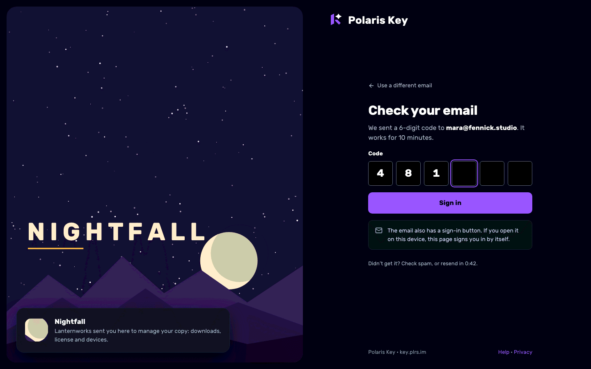

- Six one-digit cells (`inputmode="numeric"`, `autocomplete="one-time-code"`, paste fills all
  cells); **Sign in** enables at six digits and submits automatically on the sixth.
- Echoes the address, says how long the code works, and offers **Use a different email**.
- "The email also has a sign-in button. If you open it on this device, this page signs you in by
  itself." This is **true by construction**: the page re-checks `GET /api/me` on `focus` and
  `visibilitychange`, and every 5 s for 10 minutes while visible (ADMIN.md POR-1), and listens on a
  `BroadcastChannel` that the link-verify page posts to.
- **States:** wrong code (cells marked invalid, "That code didn't work. 3 tries left."); expired
  ("That code has expired. Send a new one."); too many tries (send-new only); resend countdown
  ("resend in 0:42", then a **Resend** link).
- **Before the code route lands (PX-W4):** the same screen without the cells: "Check your email.
  Open the link on this device and this page signs you in by itself." with resend and change-email.

### 4.3 Sign in with a license key, and the account upgrade

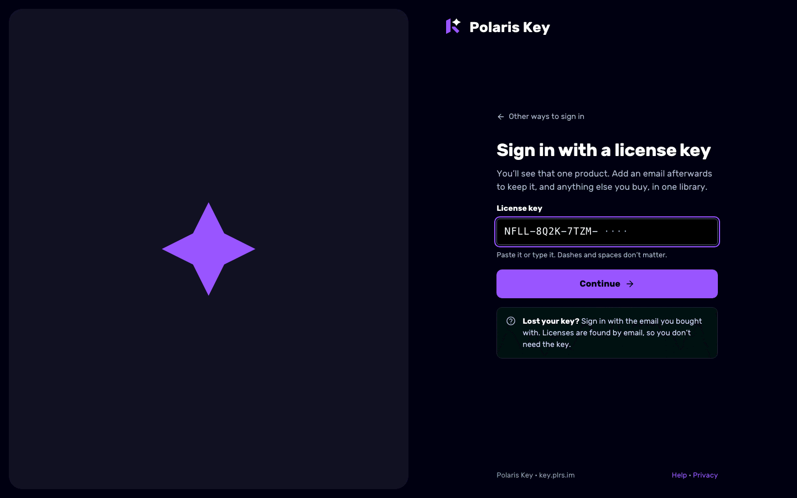

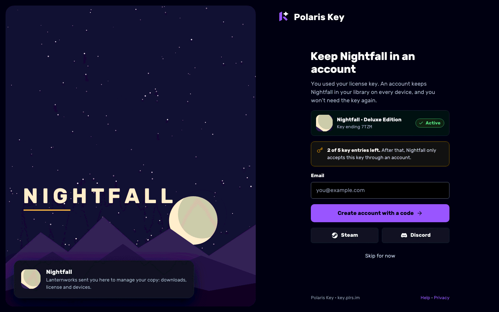

- **Key sign-in:** one mono field ("Paste it or type it. Dashes and spaces don't matter."),
  **Continue**, and a "Lost your key?" notice explaining that email sign-in finds licenses without
  the key. Validates format client-side before submit; a wrong key says so inline.
- **Upgrade prompt (S-16 owner decision 2026-10-04, key entries):** after every successful key
  entry the portal shows **Keep <product> in an account**: the product and the key's last
  characters, a warning notice with the entries left ("2 of 5 key entries left. After that,
  Nightfall only accepts this key through an account."), the email field with **Create account
  with a code**, the product's providers, and **Skip for now**.
- **Entries used up:** the same screen without **Skip for now**, the notice becomes `danger`:
  "This key has no entries left. Create an account or sign in to keep using Nightfall." The license
  then attaches to the account under the S-16 claim rules (an owned license never moves by key).
- **Passkeys are not offered here:** S-16 registers passkeys only after an email is verified.
- **Data:** `POST /identity/session/license`-equivalent for the portal, extended with
  `entriesLeft` and `entriesLimit` (gap G21).

### 4.4 First run (empty library)

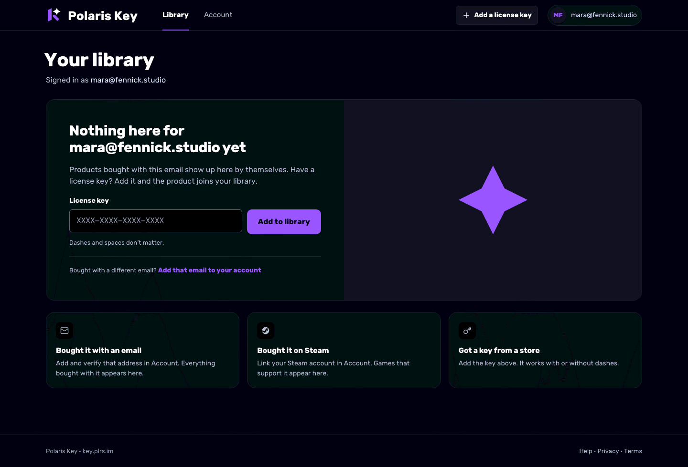

- One `text-strong` line naming the signed-in email ("Nothing here for mara@fennick.studio yet"),
  one `text-muted` line, and one primary action: an **inline license-key field** with **Add to
  library**. A link adds another email. The stationary star fills the right half (top strip on
  phones).
- Three cards explain the other ways in: bought with an email (verify it in Account), bought on
  Steam (link Steam), got a key from a store (add it above).
- **States:** claim success navigates to the new product page with a toast "Nightfall is in your
  library"; claim errors are inline (§4.15).

### 4.5 Library: one product

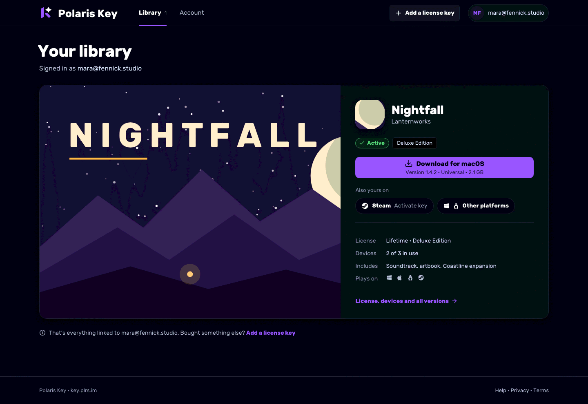

- A full-width **hero**: key art (left, 1.45 fr) and a side panel with icon, name, developer,
  status and tier, the **primary download** as a two-line button ("Download for macOS" over
  "Version 1.4.2 · Universal · 2.1 GB"), an **Also yours on** row (Activate on Steam, Other
  platforms), a short summary (license, devices, includes, plays on) and a link to the product
  page.
- A closing line: "That's everything linked to <email>. Bought something else? Add a license key."
- **Phone:** the art becomes a 16:9 strip; the primary action becomes the phone action ("Email me
  the download · It's a desktop game. We'll send the link to your inbox.").

### 4.6 Library: a few products (2–7)

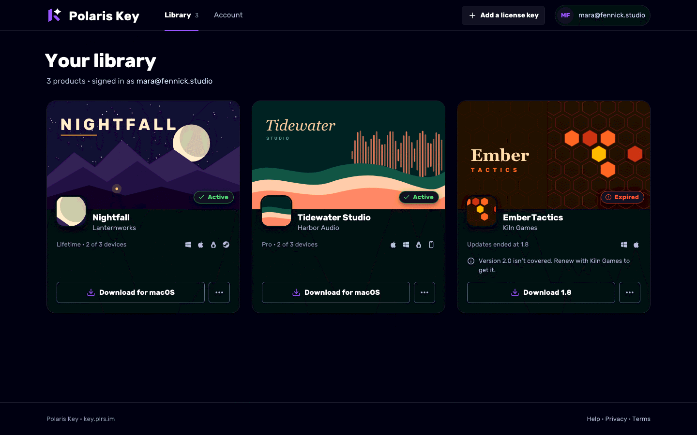

- A 3-column grid of large **library tiles** (§5.1). No toolbar: there is nothing to search yet.
- Every tile's action is the **outlined quick action** (the critique's fix for flat hierarchy);
  solid violet is reserved for the hero, the attention shelf and the product header.

### 4.7 Library: many products (8+)

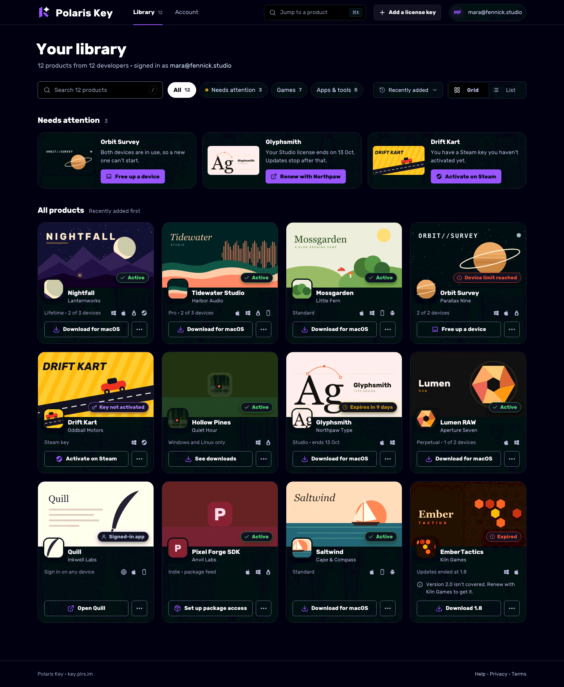

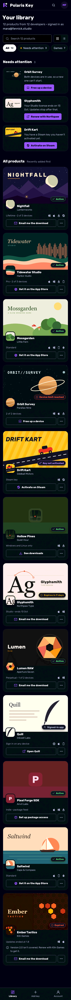

- **Toolbar:** search ("Search 12 products", `/` focuses it), filter chips with counts (All,
  Needs attention, Games, Apps & tools; a chip with a zero count is hidden), sort (Recently added,
  Name), and a Grid/List toggle. The toolbar is in the URL (§3.3), so a filter never silently
  hides products (A4): a non-"All" filter shows "Showing 3 of 12 · Show all".
- **Needs attention shelf:** only items the person can act on, each with a solid primary action:
  device limit reached → **Free up a device**; expires within 14 days → **Renew with <developer>**
  (needs G16, else "Contact <developer>"); Steam key not activated → **Activate on Steam**; expired
  with a newer version out → **Renew**. Never news or updates (A5). Hidden when empty.
- **All products:** the 4-column grid of compact tiles (3 columns at 761–1179 px).
- **⌘K trigger** in the header (§4.14).
- **Products without art** use the fallback (§5.2): Hollow Pines (icon only) and Pixel Forge SDK
  (no icon, no art) in the render.
- **Phone:** search and the view toggle share a row; chips scroll sideways. **Phones default to
  List view above 6 products** (the remembered choice wins), because twelve full tiles is a long
  scroll.

### 4.8 Library: list view

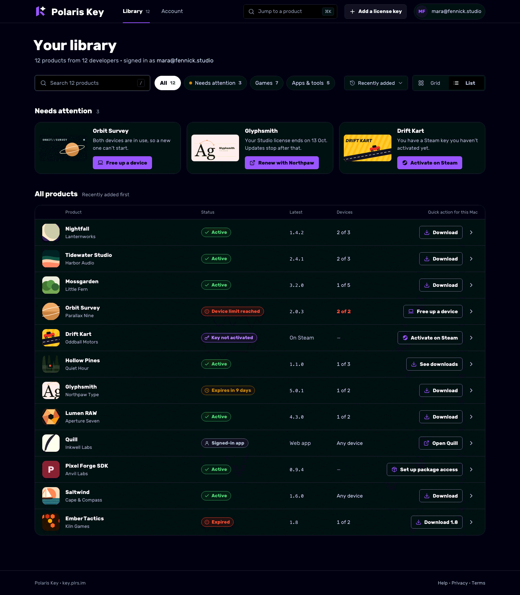

- A table (`role="table"`): icon · Product (name and developer) · Status · Latest (mono version, or
  plain text such as "On Steam") · Devices ("2 of 3", red and bold when full, "Any device", or "—")
  · **Quick action for this Mac** (outlined, without "for macOS") · open chevron. Rows are 72 px;
  the whole row opens the product page, the quick action is its own target.
- The attention shelf stays above the table.
- **Phone:** icon, name, developer and a small status pill, plus the chevron. Quick actions move to
  the product page.

### 4.9 Product page

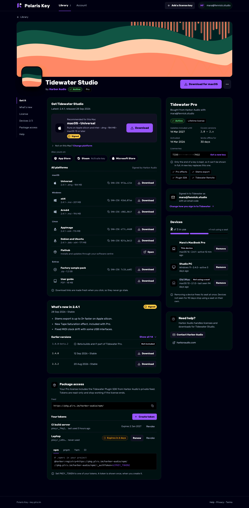

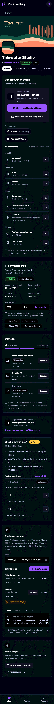

**Header:** back link to Library, the 320 px key-art banner (16:9, full-bleed on phones), the
112 px icon overlapping its lower edge, the name as `h1`, "by <developer>" (links to the developer
website when known), status pill and tier, and the **primary action** with an overflow menu
(Copy link, Contact developer, Remove from library).

**Layout:** at ≥ 1180 px three columns: a sticky **in-page table of contents** (148 px: Get it,
What's new, License, Devices 2/3, Package access, Help; the current section gets a violet left
rule), the main column (Get it, What's new, Package access) and a 384 px side column (License,
product sign-in, Devices, Help). At 761–1179 px the TOC hides and the two columns remain. On phones
one column in task order (Get it, License, Devices, product sign-in, What's new, Package access,
Help) under **sticky pill tabs**. Sections that don't apply are **omitted**, and so is their TOC
entry (P14): no Package access without a non-public feed, no Devices for an account-bound product.

**Get it** (the most important card):

- **Recommended panel** on `service-core-subtle`: OS glyph, "Recommended for this Mac", "macOS ·
  Universal", "Runs on Apple silicon and Intel · .dmg · 184 MB · macOS 13 or later", the gold
  **Signed** chip when the build is signed, and **Download**.
- **Honest detection.** Server-side UA detection (reuse `distribution/page/detect.ts` through a
  Core hook) plus `navigator.userAgentData` where available. Browsers can't tell Apple silicon from
  Intel, so: a Universal build is recommended as such; otherwise both Mac builds are offered with
  Apple silicon first and a "Not sure which Mac you have?" hint. Never guess silently (A8).
- **Not on this Mac? Change platform** discloses a platform picker; the choice is remembered per
  viewer.
- **Also yours on:** store handoffs as pills: App Store, Google Play, **Steam: Activate key** (the
  `registerkey?key=` deep link with the key filled in, only when the portal holds a Steam key),
  Microsoft Store, Flathub. A store link never looks like the product's own installer (A3).
- **All platforms:** file rows grouped by OS (macOS, Windows, Linux) then **Extras** (soundtrack,
  sample pack, manual), each with OS glyph, variant, version, format, size, a copyable middle-
  truncated **SHA-256**, and **Download** (or **Open** for store-hosted channels such as Flathub).
- "Download links are made fresh when you click, so they never go stale." Each click mints the
  token (`POST …/token`) and navigates; there is no "link used" state.
- **Phone:** the recommended panel becomes "On this iPhone" with the phone build or companion app
  (**Get it on the App Store**) and **Email me the desktop links**. A desktop-only product shows
  only the email action.

**What's new:** the latest version's notes with date, channel and Signed chip; **Earlier
versions** (three shown, "Show all 14"). A build the license does not cover is listed but
disabled, with a visible **Not included** label and the reason inline ("Beta builds aren't part of
Tidewater Pro", "Version 3.0 isn't covered by 2.x licenses · Renew with Harbor Audio"). Never a
tooltip.

**License:** tier as the card title, "Bought from <developer> with <email>" (or "Owned via Steam"
when G8 lands), status and model tags, a 2-column fact grid (Updates included until · Covers
versions · Activated · Works offline for), the **license key** box showing only the last
characters with **Get a new key** (G7; hidden when the product doesn't allow self-service), the
plain explanation "Only the end of a key is kept, so it can't be shown in full", and the
**Included** list as check tags. Several licenses: a switcher at the top of the card.

**Signed in to <product> as …** (S-16): one small card naming the identity this product uses
("mara@fennick.studio · with an email code", "nightowl_alex · Steam", "License key only, no
sign-in") and a link to change it in Account → Connected products. Hidden before I-15.

**Devices:** a segmented seat meter (one segment per seat), "2 of 3 in use", "+1 not using a seat"
for dormant devices; rows with platform glyph, label (or "Unnamed device · Windows 11"), "This
device" badge where known, OS · app version · last seen; dormant rows are muted with **Not using a
seat** and "last seen 94 days ago". Each row has **Remove** (36 px, always on-screen). The footnote
explains removal and dormancy. Disconnected devices collapse under "2 removed devices".

**Package access** (F-20/F-21; only when the product has an enabled non-public feed the license
covers): what the feed contains and that tokens are read-only and stop with the license; the feed
URL with copy; **Your tokens** (name, `pkeyr_` prefix, last used, expiry, an amber "Expires in
6 days" pill inside 14 days, **Renew** and **Revoke**); **Create token**; snippet tabs for the
feed's ecosystems (from the F-12 renderer) with `${PKEY_TOKEN}` as the placeholder.

**Help:** "<Developer> handles licenses and downloads for <product>." **Contact <developer>** and
the website (G16). Hidden when neither is known.

**States:** loading (skeleton header and two skeleton cards; never zeros); not found (§4.16); load
error (`ErrorState` with Retry, keeps the header if it loaded); license expired (a `danger` callout
under the header: "Updates ended at 1.8. Version 2.0 isn't covered." with **Renew with <developer>**;
Get it recommends the newest **covered** build); disabled by developer ("Suspended by Kiln Games.
Contact them to find out why." with Contact; downloads disabled with that reason); account-bound
product (Get it becomes **Open Quill** plus store links; no License key, no Devices).

### 4.10 Package token created

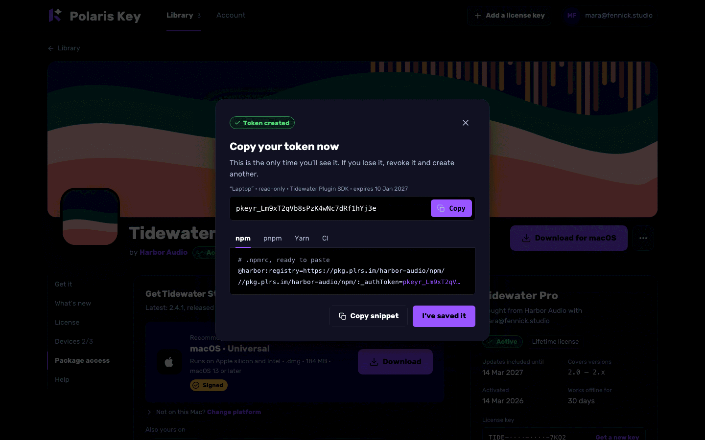

- A dialog (bottom sheet on phones) that **cannot be dismissed by scrim click or Escape** until the
  token is copied or **I've saved it** is pressed (ADMIN.md 0.1.3, `OneTimeSecretPanel`).
- "Copy your token now. This is the only time you'll see it." The token name, scope, product and
  expiry; the token with **Copy**; the snippet with the real token inlined and **Copy snippet**.
- **Create token** form (before this state, not drawn): name (required), expiry (30 / 90 / 365 days;
  default 90; Godot URL tokens max 30, per F-20 §6.5).

### 4.11 Remove a device (inline)

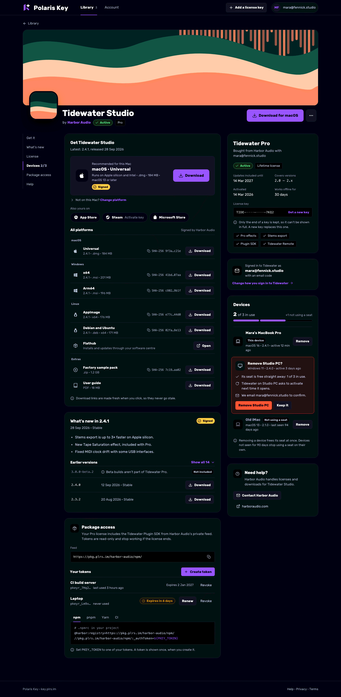

- **Remove** expands the row in place (no modal) into a `danger-subtle` panel: "Remove Studio PC?"
  and the consequences as a list: the seat is free straight away (with the new count), the app on
  that device asks to activate next time it opens, an email confirms it. **Remove Studio PC**
  (solid danger) and **Keep it**. Focus moves to the panel heading; Escape or **Keep it** collapses
  it and returns focus to **Remove**.
- On success the row leaves with a toast "Studio PC removed · 1 of 3 in use" and the meter updates.

### 4.12 Device limit: focused flow

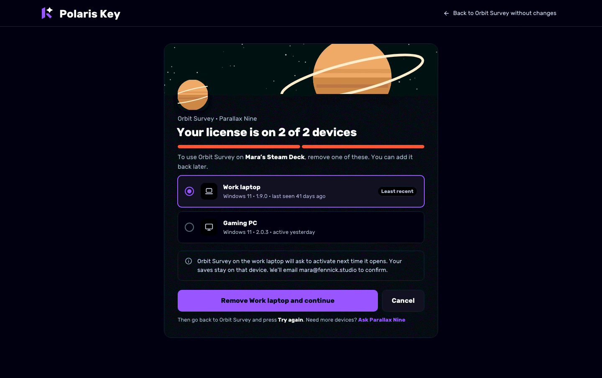

- Opened from the app (G15) or an email. Minimal chrome: lockup and **Back to Orbit Survey without
  changes** (the return URL, or the product page).
- A 720 px card: product art strip, icon, "Orbit Survey · Parallax Nine", **Your license is on 2 of
  2 devices** with a full red meter, "To use Orbit Survey on **Mara's Steam Deck**, remove one of
  these" (the device name from `?for=`, else "on a new device").
- Devices as radio cards, **the least recently used preselected** with a "Least recent" tag; dormant
  devices don't appear (they don't hold seats).
- A consequences notice; **Remove Work laptop and continue** (the label follows the selection) and
  **Cancel**; then "Go back to Orbit Survey and press **Try again**", and "Need more devices? Ask
  Parallax Nine" (G16).
- **Success state:** "Done. Orbit Survey can start on Mara's Steam Deck now." with **Back to Orbit
  Survey** (the return URL) as the primary action.

### 4.13 Account

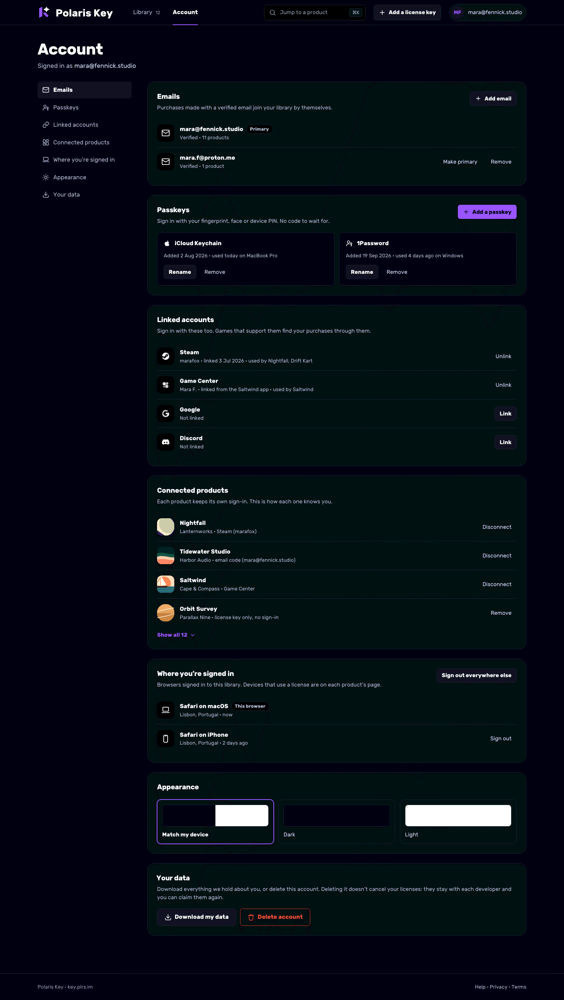

A sticky section nav (pills scrolling sideways on phones) and one card per section:

| Section                    | Content                                                                                                                                                                                                | Depends on       |
| -------------------------- | ------------------------------------------------------------------------------------------------------------------------------------------------------------------------------------------------------ | ---------------- |
| **Emails**                 | Each address with Primary / Verified / "11 products"; **Add email** (verify by code); Make primary; Remove (not the last one). "Purchases made with a verified email join your library by themselves." | G10, I-15        |
| **Passkeys**               | One card per passkey: provider name, added date, last used and where; **Rename**, **Remove** (inline confirm). **Add a passkey** is the section's primary when there are none.                         | I-14             |
| **Linked accounts**        | Steam, Game Center, Google, Discord, Apple: account name, when linked, which products use it; **Link** / **Unlink**. Game Center links only from inside an app (no web button).                        | I-12, I-20, I-15 |
| **Connected products**     | One row per product user: icon, product, developer, **the identity it uses** ("Steam (marafox)", "email code", "license key only, no sign-in"); **Disconnect** (or **Remove** for key-only).           | I-15             |
| **Where you're signed in** | Browser sessions only (never product devices): browser, OS, coarse location, last active, "This browser"; **Sign out**; **Sign out everywhere else**.                                                  | G12, I-15        |
| **Appearance**             | Match my device / Dark / Light radio cards, persisted.                                                                                                                                                 | none             |
| **Your data**              | **Download my data** (`GET /api/me/export`) and **Delete account** (typed confirmation `delete`; explains licenses stay with each developer and can be claimed again).                                 | export: I-15     |

Before the dependencies land, Account shows Emails (the one sign-in email, read-only),
Appearance, Your data (delete only) and **Sign out**.

### 4.14 Jump to a product (⌘K)

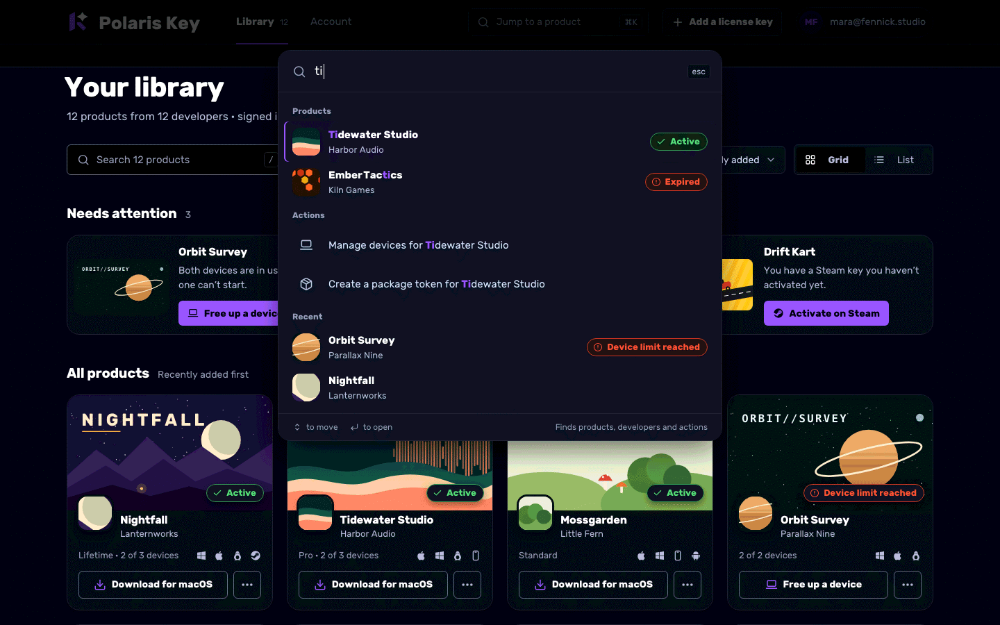

- Available everywhere from 8 products (⌘K / Ctrl K, the header trigger, the phone search icon).
  Built on `cmdk` (approved in ADMIN.md Q3).
- Groups: **Products** (name and developer match, status pill on the right), **Actions** scoped to
  the top match ("Manage devices for Tidewater Studio", "Create a package token for …", "Add a
  license key"), **Recent**. Matches are highlighted in `accent-fg` bold.
- Desktop: a 640 px dialog near the top. Phone: a full-screen sheet with a close button.
- ARIA combobox and listbox pattern; arrow keys move, Enter opens, Escape closes and returns focus.

### 4.15 Add a license key

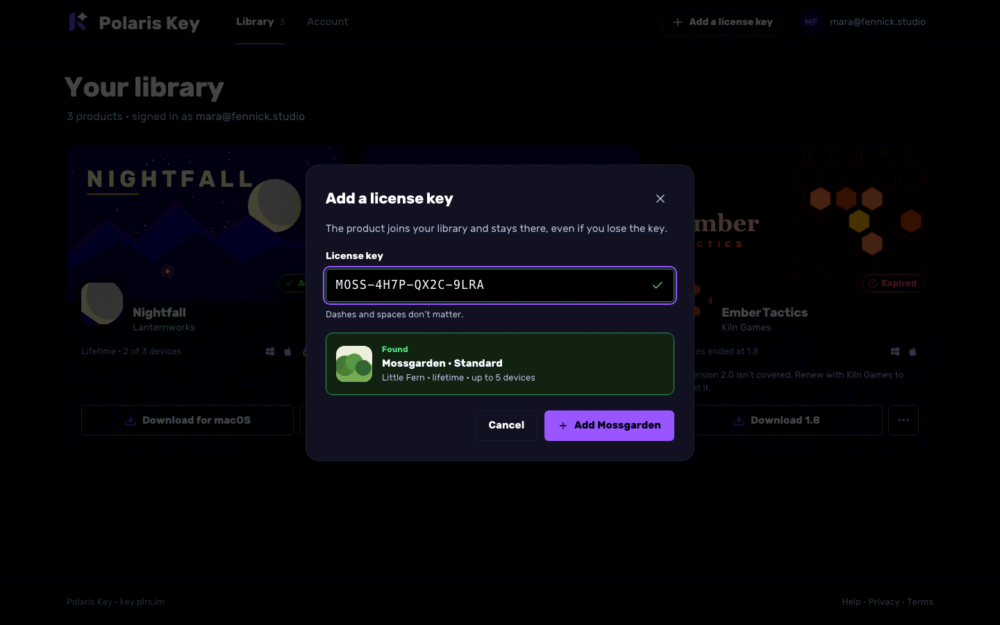

- A dialog (bottom sheet on phones) from the header, the tab bar or `#/claim?key=`.
- Mono key field, dash- and space-insensitive, upper-cased as typed; when the key's product can be
  previewed, a **Found** panel shows the product, tier and terms before anything is attached; the
  primary names the product (**Add Mossgarden**).
- **Errors, inline under the field:** not a key ("That doesn't look like a license key. Check for
  missing characters."); unknown ("We couldn't find that key."); already yours ("Mossgarden is
  already in your library" with **Open it**); owned by another account ("This license is already
  in another account. Sign in with the email it was bought with." per S-16 claim rules); email-bound
  ("This license can only be added by signing in with the email it was bought with."); entries used
  up (§4.3); product portal off ("Little Fern manages this license elsewhere.").
- **Success:** navigates to the product page; toast "Mossgarden is in your library".
- **Preview data:** a new read-only lookup (gap G22) that reveals only name, developer, tier and
  terms, rate-limited like claim. Without it, the dialog goes straight to claim.

### 4.16 Not found and errors

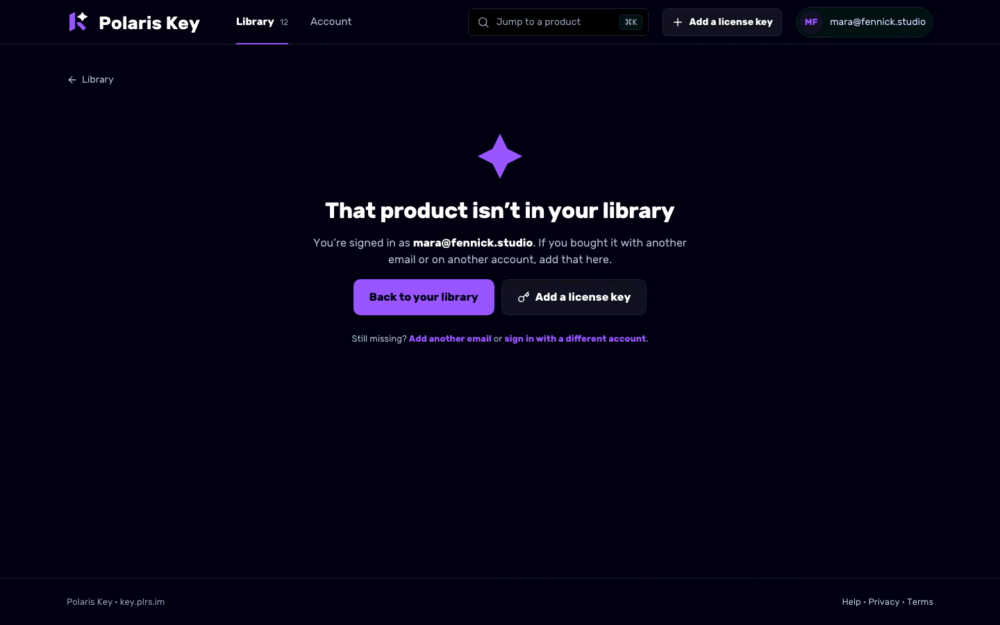

- **Product not in your library:** the stationary star, "That product isn't in your library",
  who you're signed in as, **Back to your library**, **Add a license key**, and links to add another
  email or switch account. Never "portal api 404".
- **Can't reach Polaris Key** (network): the same template with **Try again**; the shell stays.
- **Something went wrong** (5xx): **Try again** and a reference id in mono for support.
- **Signed out mid-session:** a toast "You've been signed out" and the sign-in screen with the
  current route as `returnTo`.

---

## 5. Components

### 5.1 Reuse first

The portal is built on the console kit in `packages/admin/src/ui/` and `@polaris-key/brand/react`.
New components live in `packages/admin/src/portal/components/` unless the console can use them too.

| Need                   | Use                                                                                              |
| ---------------------- | ------------------------------------------------------------------------------------------------ |
| Lockup in the header   | `PolarisLockup` (`@polaris-key/brand/react`), compact, theme-driven                              |
| Buttons, icon buttons  | `ui/Button`, `ui/IconButton` (add the `quiet` outlined variant, §5.2)                            |
| Status pills           | `ui/StatusPill` with the portal status map (§5.3)                                                |
| Signed chip            | `ui/SignedBadge`                                                                                 |
| Copy, hashes, versions | `ui/CopyButton`, `ui/Hash` (middle-truncated SHA-256), `ui/Version`                              |
| Key display            | `ui/KeyDisplay` (last characters only)                                                           |
| One-time token         | `ui/OneTimeSecretPanel` inside `ui/Dialog`                                                       |
| Dialogs, sheets        | `ui/Dialog`; `ui/Drawer` as the phone bottom sheet                                               |
| Forms                  | `ui/Input`, `ui/form`, `ui/RadioCards` (device picker, theme), `ui/SegmentedControl` (Grid/List) |
| Code snippets          | `ui/CodeBlock` with tabs                                                                         |
| Empty, error, loading  | `ui/EmptyState` (star motif), `ui/ErrorState`, `ui/Skeleton`, `ui/Spinner`                       |
| Toasts, live regions   | `ui/toast` (sonner), `ui/LiveRegion`                                                             |
| Times                  | `ui/Timestamp` (relative, with the absolute date as text in a `title` _and_ on focus)            |
| Kbd hints              | `ui/Kbd`                                                                                         |
| Data table (list view) | `ui/data-table` in client mode                                                                   |

### 5.2 New portal components

| Component             | Contract                                                                                                                                                                                                                                                                                                                                                                                                                                                          |
| --------------------- | ----------------------------------------------------------------------------------------------------------------------------------------------------------------------------------------------------------------------------------------------------------------------------------------------------------------------------------------------------------------------------------------------------------------------------------------------------------------- |
| `PortalShell`         | Header, tab bar, footer, skip link, `main` landmark; collapses the header at ≤ 760 px.                                                                                                                                                                                                                                                                                                                                                                            |
| `ProductArt`          | Props: `product`, `variant: "banner" \| "tile" \| "thumb" \| "icon"`. Renders the proxied `headerUrl`/`iconUrl` (G1). **Fallbacks:** icon but no art → a flat tint field (tint darkened toward the page in OKLCH to L ≤ 0.30 in both themes) with the icon centred in a rounded square; neither → the same field with the first letter in Rubik 700 at tint L ≥ 0.85. No gradients. `alt` is the product name on banners, empty elsewhere (the name is adjacent). |
| `LibraryTile`         | Art 16:9 with the status pill on a solid overlay plate at bottom-right, icon overlapping the art, name (`h3`), developer, meta line, platform glyphs (labelled as one image: "Available for Windows, macOS…"), optional note, **quick action** (`quiet`) and an overflow menu. Variants: large (2–7) and compact (8+).                                                                                                                                            |
| `LibraryHero`         | The one-product layout (§4.5).                                                                                                                                                                                                                                                                                                                                                                                                                                    |
| `LibraryList`         | The list view (§4.8) on `ui/data-table`.                                                                                                                                                                                                                                                                                                                                                                                                                          |
| `AttentionShelf`      | Up to 6 cards (thumb, name, reason, solid action); "Show all 9" beyond that.                                                                                                                                                                                                                                                                                                                                                                                      |
| `LibraryToolbar`      | Search, chips with counts, sort, view toggle; URL-synced.                                                                                                                                                                                                                                                                                                                                                                                                         |
| `JumpPalette`         | ⌘K (§4.14).                                                                                                                                                                                                                                                                                                                                                                                                                                                       |
| `QuickAction`         | Resolves the one action for a product and device (§5.4); returns label, icon, href or handler, and the phone variant.                                                                                                                                                                                                                                                                                                                                             |
| `ProductHeader`       | Banner, icon, title, by-line, status, primary action, overflow.                                                                                                                                                                                                                                                                                                                                                                                                   |
| `SectionNav`          | Sticky TOC (desktop) and sticky pill tabs (phone), driven by an `IntersectionObserver`; omits absent sections.                                                                                                                                                                                                                                                                                                                                                    |
| `GetItPanel`          | Recommended build, platform change, Also yours on, file groups, extras, phone variant.                                                                                                                                                                                                                                                                                                                                                                            |
| `FileRow`             | Glyph, variant, meta, `Hash`, Download/Open; the disabled variant with **Not included** and its reason.                                                                                                                                                                                                                                                                                                                                                           |
| `StoreHandoff`        | Pill per store; Steam activation builds the `registerkey` link.                                                                                                                                                                                                                                                                                                                                                                                                   |
| `LicenseCard`         | §4.9 License; license switcher.                                                                                                                                                                                                                                                                                                                                                                                                                                   |
| `SeatMeter`           | Segmented, one segment per seat (a continuous bar above 10 seats), `role="img"` with "2 of 3 seats in use"; `full` variant in danger.                                                                                                                                                                                                                                                                                                                             |
| `DeviceRow`           | Row with inline removal confirmation (§4.11).                                                                                                                                                                                                                                                                                                                                                                                                                     |
| `PackageAccessCard`   | §4.9 Package access, create form, token dialog.                                                                                                                                                                                                                                                                                                                                                                                                                   |
| `ProductIdentityCard` | "Signed in to <product> as …".                                                                                                                                                                                                                                                                                                                                                                                                                                    |
| `FocusedFlow`         | Minimal chrome and return-URL handling for `free-device` and `download`.                                                                                                                                                                                                                                                                                                                                                                                          |
| `SignIn`              | Context panel and the method stack; `CodeEntry`; `KeySignIn`; `AccountUpgrade`.                                                                                                                                                                                                                                                                                                                                                                                   |
| `ClaimDialog`         | §4.15.                                                                                                                                                                                                                                                                                                                                                                                                                                                            |
| `AccountSections`     | §4.13, one component per section.                                                                                                                                                                                                                                                                                                                                                                                                                                 |

`Button` gains one variant, **quiet**: transparent background, `border-strong` outline,
`text-strong` label, the icon in `accent-fg`. It is the library's quick action and the console may
use it for row actions.

### 5.3 Status model

One status per product (from its best license), computed server-side once G1/G5 land and
client-side from existing fields before then. Precedence, first match wins:

| Status                | Pill (icon · word · token)              | Reason line / note                                 | Attention shelf action |
| --------------------- | --------------------------------------- | -------------------------------------------------- | ---------------------- |
| Suspended             | alert · "Suspended" · danger            | "Suspended by <developer>."                        | Contact <developer>    |
| Expired               | alert · "Expired" · danger              | "Updates ended at 1.8" (or "Ended 4 Sep 2026")     | Renew with <developer> |
| Device limit reached  | alert · "Device limit reached" · danger | "2 of 2 devices"                                   | Free up a device       |
| Key not activated     | key · "Key not activated" · info        | "Steam key"                                        | Activate on Steam      |
| Expires soon (≤ 14 d) | clock · "Expires in 9 days" · warning   | "Studio · ends 13 Oct"                             | Renew with <developer> |
| Offline grace ended   | alert · "Needs a check-in" · warning    | "Open <product> while online"                      | none                   |
| Signed-in app         | user · "Signed-in app" · neutral        | "Sign in on any device"                            | none                   |
| Active                | check · "Active" · success              | tier and devices, e.g. "Lifetime · 2 of 3 devices" | none                   |

A past date is never shown as "Expires …": it is "Ended <date>" or "Updates ended at <version>".
Expiry inside 14 days uses relative days; otherwise "until 14 Mar 2027".

### 5.4 Quick action resolution

| Product state                           | Desktop                                                        | Phone                                                  |
| --------------------------------------- | -------------------------------------------------------------- | ------------------------------------------------------ |
| Device limit reached                    | Free up a device                                               | Free up a device                                       |
| Steam key held, not activated           | Activate on Steam                                              | Activate on Steam                                      |
| Account-bound (no key, no seats)        | Open <product> (website / app scheme)                          | Get it on the App Store / Google Play, else Open       |
| Build for this OS exists and is covered | Download for <OS>                                              | Store link for this OS, else **Email me the download** |
| Covered builds exist, none for this OS  | See downloads (with "Windows and Linux only" as the meta line) | Email me the download / See downloads                  |
| Expired, an older build is covered      | Download <last covered version>                                | Email me the download                                  |
| Only a package feed                     | Set up package access                                          | Set up package access                                  |
| Public product (G19)                    | Open download page (dl.plrs.im)                                | Open download page                                     |

---

## 6. Copy

### 6.1 Rules

1. **Plain words.** Never "OIDC", "entitlement", "artifact", "deliverable", "authorized",
   "deauthorized", "session refresh", "claim" (in UI; "add" instead), "account id" as a headline.
2. **No redundant subtitles.** A heading is not followed by a sentence that restates it ("Devices"
   is not followed by "Manage your devices"). A subtitle earns its place only by saying something
   the heading can't: a rule ("Purchases made with a verified email join your library by
   themselves"), a consequence, or who is responsible ("Harbor Audio handles licenses and
   downloads").
3. **Name the developer.** "Renew with Kiln Games", "Contact Harbor Audio", never "contact your
   provider".
4. **Buttons say what happens to what.** "Remove Work laptop and continue", "Add Mossgarden",
   "Email me a code". No "Submit", "OK", "Confirm".
5. **Say why, then what to do.** "Version 2.0 isn't covered. Renew with Kiln Games to get it."
6. **Sentence case** everywhere; status words capitalised as labels ("Active", "Expires in 9 days").
7. **Glossary nouns:** license (US), device, product, tier. "Key" for the license key in running
   text after first use. "Package access" and "token" for registry credentials.
8. **Numbers and dates:** "2 of 3", "Expires in 9 days", "until 14 Mar 2027", "last seen 94 days
   ago", "active 12 min ago". Dates as `d MMM yyyy`, dropping the year inside the current year in
   meta lines only. Versions without a leading "v", in mono.
9. **Product names, not slugs,** in UI and email (fixes PA-10's "A license for nightfall").
10. **Don't over-promise.** Only say a page "signs you in by itself" when it does.

### 6.2 Voice samples

| Moment             | Copy                                                                                                    |
| ------------------ | ------------------------------------------------------------------------------------------------------- |
| Library, signed in | "12 products from 12 developers · signed in as mara@fennick.studio"                                     |
| Empty              | "Nothing here for mara@fennick.studio yet"                                                              |
| Key hint           | "Dashes and spaces don't matter."                                                                       |
| Lost key           | "Lost your key? Sign in with the email you bought with. Licenses are found by email."                   |
| Key storage        | "Only the end of a key is kept, so it can't be shown in full. A new key replaces this one."             |
| Dormant device     | "Not using a seat · last seen 94 days ago"                                                              |
| Device removal     | "Its seat is free straight away: 1 of 3 in use."                                                        |
| Download links     | "Download links are made fresh when you click, so they never go stale."                                 |
| Token              | "Copy your token now. This is the only time you'll see it."                                             |
| Delete account     | "Deleting it doesn't cancel your licenses: they stay with each developer and you can claim them again." |

### 6.3 Notice emails

Every portal email names the product (not the slug), names the device by label, and deep-links to
the exact section (§3.4). Subjects: "Nightfall is in your library", "Studio PC was removed from
Tidewater Studio", "Your Polaris Key sign-in code: 481 920". The emails use the kit PNG lockup
(BRAND §2, email) and no "Powered by" badge.

### 6.4 Error copy

Errors say what happened, in the user's terms, and the next step. Map every flat error code the
portal API returns (`W/core/errors.ts`) to a sentence; unknown codes fall back to "Something went
wrong. Try again." with the reference id. Never render the HTTP status or an internal code as the
message.

---

## 7. Layout and visual details

- **Grid:** content max-width 1312 px with 32 px gutters (16 px on phones). Library grids: 24 px
  gaps for large tiles, 20 px for compact.
- **Radii:** tiles, cards and the hero `xl` (18 px); controls `md`; pills `full`.
- **Surfaces:** page `surface-page`; tiles and cards `surface-raised` with `border-subtle` and
  `elevation-1`; dialogs `surface-overlay` with `elevation-3`; inputs and code `surface-sunken`.
- **Status pills on art** sit on a solid `surface-overlay` plate with `elevation-2` so they read on
  any artwork; the art's own text should avoid the bottom-right corner (developer guidance in the
  listing docs).
- **Type scale:** page `h1` 40/44 (30 on phones); product `h1` 36 (28); card `h2` 18; tile name 18
  (16 compact); body 15–16; metadata 13; group labels and counts 12 bold.
- **Motion:** only the duration tokens (`fast` for hover, `base` for disclosure and the inline
  confirm, `slow` for sheets). Nothing loops. The star never moves.
- **Images:** all developer images are served **same-origin** through the media proxy (G1) because
  the portal CSP is `img-src 'self' data:`; sizes 1280 × 720 banner, 640 × 360 tile, 256 × 256 icon,
  WebP with PNG fallback.

## 8. Responsive rules

| Width       | Library                                                                                        | Product page                                                  | Chrome                                                    |
| ----------- | ---------------------------------------------------------------------------------------------- | ------------------------------------------------------------- | --------------------------------------------------------- |
| ≥ 1180 px   | Large tiles 3 columns; compact 4 columns                                                       | TOC · main · side (148 · fluid · 384)                         | Full header                                               |
| 761–1179 px | Large 3, compact 3                                                                             | Main · side (fluid · 340); TOC hidden                         | Full header; ⌘K trigger collapses to an icon below 900 px |
| ≤ 760 px    | One column; List view by default above 6 products; toolbar: search + view toggle, chips scroll | One column in task order; sticky pill tabs; banner full-bleed | 56 px header, bottom tab bar, bottom sheets               |

- **No horizontal page scroll at 360 px**, ever (the render script checks every screen). Only code
  blocks scroll inside themselves.
- **Touch targets** ≥ 44 × 44 px on touch (buttons are 44 px; small buttons 36 px tall with 44 px hit
  areas through padding). The tab bar items are 52 px tall.
- **Tables become rows:** the list view drops columns and keeps status as a pill under the name.
- **Phone actions** replace desktop downloads (§5.4); dialogs become bottom sheets; the palette is
  full-screen.
- Safe-area insets pad the tab bar and sheets (`env(safe-area-inset-bottom)`).

## 9. Accessibility

WCAG 2.2 AA in both themes (BRAND §9), plus:

1. **Landmarks and headings:** a skip link, one `banner`, `nav` (labelled "Portal"), `main`, and
   `contentinfo`; exactly one `h1` per screen (sign-in, boot and error screens included); cards use
   `h2`, tiles `h3` (fixes PA-13 heading order).
2. **Names:** every icon-only control has an accessible name ("More for Nightfall", "Copy SHA-256",
   "Open Tidewater Studio"); the avatar link is "Account: <email>"; platform glyph groups are one
   `role="img"` with a list label.
3. **Status** is always icon plus word; the seat meter is `role="img"` with a text label; the
   "Not included" reason is visible text.
4. **Focus:** the violet 2 px ring with 2 px offset everywhere; dialogs trap focus and return it to
   the opener; the inline device confirm moves focus to its heading; after a claim, focus lands on
   the new product's `h1`.
5. **Forms:** visible labels; errors inline with `aria-invalid` and `aria-describedby`; the code
   cells are one labelled group and accept paste; no information only in placeholders.
6. **Live regions:** search result counts, toasts and download start ("Downloading Tidewater Studio
   2.4.1 for macOS") are announced politely.
7. **Keyboard:** `/` focuses search, ⌘K opens the palette, arrow keys move in the palette, radio
   cards and tabs; everything reachable without a pointer.
8. **Text:** task-critical text ≥ 14 px; 13 px only for secondary metadata; 12 px only for group
   labels and counts; `text-subtle` never carries required information.
9. **Motion:** reduced motion honoured through the duration tokens.
10. **Testing:** `vitest-axe` on every page component; a Playwright axe pass over all states in both
    themes at 1440 and 390 px (PX-15).

---

## 10. Data and API

### 10.1 What the portal API returns today

`GET /api/capabilities[?product=]`, `GET|DELETE /api/me`, `GET /api/licenses`,
`GET /api/licenses/:p/:id`, `POST /api/claim/license-key`,
`DELETE /api/licenses/:p/:id/devices/:deviceId`, `GET /api/releases`,
`POST /api/releases/:p/:r/artifacts/:a/token`, `GET /download/<token>`, plus `/login`,
`/callback`, `/logout`, `/magic/verify` and `POST /api/magic/start`. All are root paths on
`key.plrs.im`; the portal routes are in the OpenAPI spec and `routeCoverage` (`portalApi`,
`portalDownload`, …), so **rule 10 applies to every new portal route**.

### 10.2 Gaps the Worker must close

Ids G1–G20 follow the journey research; G21–G23 are new here. "Fallback" is what the UI does until
the gap closes.

| Id      | Need                                                                         | Proposed shape                                                                                                                                                                                                                                                                                                     | Fallback until then                                                                  | Gates                                                                                       | WP                |
| ------- | ---------------------------------------------------------------------------- | ------------------------------------------------------------------------------------------------------------------------------------------------------------------------------------------------------------------------------------------------------------------------------------------------------------------ | ------------------------------------------------------------------------------------ | ------------------------------------------------------------------------------------------- | ----------------- |
| **G1**  | Product presentation: display name, developer, icon, hero art, tint, website | From `.pkey/distribution` `ManifestListing` (`name`, `developerName`, `iconUrl`, **`headerUrl`**, `tintColor`, `website`; all exist). Expose sanitised `product{…}` on a new `GET /api/library`. Same-origin media proxy `GET /media/:product/:asset` (fetch, validate type and size, cache in R2/KV, serve WebP). | Name only; letter-and-tint fallback with a neutral tint                              | Rule 10; CSP test; THREAT-MODEL (SSRF on fetch)                                             | PX-W1             |
| **G2**  | Store links per product and platform                                         | `stores[]` `{kind, platform, url, live}` via a Core hook over `listingUrlFor()` and the download-page outlet logic; TestFlight/Play testing only for entitled licenses                                                                                                                                             | "Also yours on" hidden                                                               | Rule 6 (Core hook); rule 10 if new route                                                    | PX-W2             |
| **G3**  | Licensed builds hosted on R2 (`dl.plrs.im`)                                  | Portal-minted short-lived signed bytes URL for an account whose license passes `accountMayDownload`, or `/download/<token>` streaming from R2. Agree with Distribution's `blobAccess` rule.                                                                                                                        | Such builds show "Not available here yet · Contact <developer>"                      | **Plan mode advisable**; THREAT-MODEL; rule 10                                              | PX-W3             |
| **G4**  | Downloads shaped per product                                                 | `GET /api/products/:p/downloads`: latest per platform, older versions, filtered by the license's channels and version window, with min OS, signer, notes summary, `covered` + `reason`; reuse `page/model.ts` and `page/detect.ts` through a Core hook                                                             | Client groups `GET /api/releases` by product; shows reasons from today's gate fields | Rule 6; rule 10                                                                             | PX-W2             |
| **G5**  | Seat limit and dormancy                                                      | `deviceLimit` (`licenseDeviceLimit`), `activeSeatCount`, per-device `dormant`                                                                                                                                                                                                                                      | Seat meter hidden; "2 devices" without "of 3"                                        | none (response shape)                                                                       | PX-W1             |
| **G6**  | Device rename                                                                | `PATCH /api/licenses/:p/:id/devices/:deviceId {label}`, audited                                                                                                                                                                                                                                                    | No rename                                                                            | Rule 10                                                                                     | PX-W5             |
| **G7**  | Get a new key                                                                | `POST /api/licenses/:p/:id/keys` (shown once, step-up, rate-limited, notice) and revoke-old; per-product opt-in `portal_product_settings.key_self_service`                                                                                                                                                         | "Get a new key" hidden                                                               | Rule 10; D1 migration; `TABLE_OWNERS`                                                       | PX-W5             |
| **G8**  | Purchase source and store grants                                             | "Owned via Steam / App Store / Play" and DLC grants, via a Core descriptor hook                                                                                                                                                                                                                                    | "Bought from <developer> with <email>" only                                          | Rule 6                                                                                      | PX-W6             |
| **G10** | Emails, identity links, connected products                                   | S-16 I-15                                                                                                                                                                                                                                                                                                          | Account shows the one sign-in email                                                  | I-15's gates                                                                                | (I-15)            |
| **G11** | Sign-in methods beyond OIDC and link                                         | Portal email code; passkeys (I-14); product providers through product users (I-12, I-20, I-15)                                                                                                                                                                                                                     | IdP display name + email link                                                        | per S-16 WP                                                                                 | PX-W4, S-16       |
| **G12** | Server-side sessions, sessions list, export                                  | S-16 I-15 (`GET /api/me/export`, revocable sessions, sign out everywhere)                                                                                                                                                                                                                                          | "Where you're signed in" and export hidden; Sign out only                            | I-15's gates                                                                                | (I-15)            |
| **G13** | Registry tokens (Package access)                                             | F-21 `GET\|POST …/registry-tokens`, `DELETE …/:tokenId`, plus per-product feed info (feeds, mode, ecosystems) for card visibility and snippets                                                                                                                                                                     | Card hidden                                                                          | F-21's gates                                                                                | (F-21)            |
| **G14** | F-20 path mismatch                                                           | F-20 names `/portal/api/…` and Cargo `login_url="https://key.plrs.im/portal/"`; the portal is at `/api/*` and `/`. **Decide before F-21:** fix the plan to `/api/…` and `https://key.plrs.im/#/p/<product>/package`, or add a `/portal` alias                                                                      | n/a                                                                                  | F-21 plan                                                                                   | owner             |
| **G15** | Deep links from apps and emails                                              | (a) SPA routes (§3.3); (b) optional `manageUrl` on `device_limit` (and on the new key-entries refusal) pointing at `#/p/<p>/free-device`; (c) links in notice emails                                                                                                                                               | (a) and (c) work alone; apps show their own copy                                     | **(b) is a wire change: plan mode, contract → errors.json → corpus/transcripts → six SDKs** | PX-W8 (with I-04) |
| **G16** | Developer support and renewal links                                          | `supportUrl`/`supportEmail` per product (manifest) plus `website` from the listing                                                                                                                                                                                                                                 | Help card hidden; "Renew with" becomes "Contact" only when known                     | Rule 9 if validated in `.pkey/product`                                                      | PX-W1             |
| **G18** | Notice copy                                                                  | Product names, device labels, deep links                                                                                                                                                                                                                                                                           | n/a                                                                                  | none                                                                                        | PX-W7             |
| **G19** | Public products                                                              | Link out to `dl.plrs.im/<product>`; don't duplicate                                                                                                                                                                                                                                                                | n/a                                                                                  | none                                                                                        | PX-09             |
| **G21** | Key-entry limits (S-16 owner decision)                                       | Key sign-in and claim responses carry `entriesLeft`/`entriesLimit`; a refusal when none are left                                                                                                                                                                                                                   | Upgrade prompt always skippable, no count                                            | Part of the I-04 contract (plan mode)                                                       | (I-04), PX-12     |
| **G22** | Key preview before claim                                                     | `POST /api/claim/preview` → name, developer, tier, terms; never ownership or email; same rate bucket as claim                                                                                                                                                                                                      | Dialog claims directly                                                               | Rule 10; THREAT-MODEL (enumeration)                                                         | PX-W5             |
| **G23** | "Email me the download"                                                      | `POST /api/products/:p/email-download {platform}` → an email with `#/p/<p>/download?platform=` (per-account rate limit)                                                                                                                                                                                            | Phone shows "Open this page on your computer"                                        | Rule 10                                                                                     | PX-W7             |

Notes:

- **Rule 6.** Identity (where the portal lives) may not import Distribution or Update. G2, G4 and
  G8 go through descriptor hooks in `src/core/hooks.ts`.
- **One library call.** `GET /api/library` returns, per product: presentation (G1), status and
  reason (§5.3), best license summary with `deviceLimit`/`activeSeatCount` (G5), quick-action
  inputs (has build for each platform, Steam key held, account-bound, feed present), and support
  links (G16). It replaces the client-side grouping and makes the library one request. The
  per-product page adds `GET /api/products/:p` (licenses, devices, downloads, stores, feeds).
- **`GET /api/me` stops re-running `syncAccountLicenseLinks` on every call** once `GET /api/library`
  exists; linking moves to sign-in, email verification and claim.
- **Rate limits** stay per-product sharded (R5-05); the new routes join the `_portal` buckets that
  S-16 I-02 shards.

### 10.3 S-16 dependencies, in the order they unlock UI

| S-16 WP    | Unlocks in the portal                                                                                                           |
| ---------- | ------------------------------------------------------------------------------------------------------------------------------- |
| I-01       | Portal identities keyed by issuer (no UI change; prerequisite for linked accounts)                                              |
| I-02       | Atomic single-use codes: prerequisite for the portal email code (PX-W4)                                                         |
| I-04       | The contract for key-entry limits (G21) and `manageUrl` (G15b)                                                                  |
| I-06       | Product users and `licenses.user_id`: "Connected products" has something to list                                                |
| I-12, I-20 | Steam, Game Center, Apple, Discord as methods: product providers on sign-in, linked accounts                                    |
| I-14       | Passkeys (`rp_id = key.plrs.im`): passkey button, conditional UI, passkey cards                                                 |
| I-15       | Links to product users, server-side sessions, sessions list, export, F-21 revocation hook: Account v2, the product sign-in card |

**Open S-16 question the portal needs answered (Q-3 in §12):** whether signing in to the
_portal_ with a product's provider (Steam on Nightfall's sign-in) signs in the product user and
then links or creates the portal account, or whether the portal only offers its own methods and
product providers appear only under Linked accounts. This design assumes the former, with product
context.

---

## 11. Implementation work packages

Sizes: S ≤ 1 day, M 2–4 days, L 5+ days (agent-days). ⚑ = plan mode. **Every WP** runs the green
gate: `mise exec node@22 -- pnpm build`, `pnpm typecheck`, `pnpm test`, `pnpm lint`,
`pnpm --filter @polaris-key/admin build`, `pnpm --filter @polaris-key/worker assemble`,
`pnpm --filter @polaris-key/docs check:links`, and the pre-commit hook. Worker WPs also run
`typecheck:workerd` and `test:workerd`, and `gen:transcripts -- --check` must stay green unless the
WP is the wire change.

### 11.1 Phase A: rebuild on today's API (no Worker changes)

| ID        | Work package                                                                                                                                                                                                                                                                                                                                                                                                                                                                                                            | Deps  | Size | Extra gates                                                                          |
| --------- | ----------------------------------------------------------------------------------------------------------------------------------------------------------------------------------------------------------------------------------------------------------------------------------------------------------------------------------------------------------------------------------------------------------------------------------------------------------------------------------------------------------------------- | ----- | ---- | ------------------------------------------------------------------------------------ |
| **PX-01** | **Shell and data layer.** Split `portal/App.tsx` into `portal/pages/*` and `portal/components/*`; TanStack Query; hash router with the §3.3 routes and redirects; `PortalShell` (64 px header with `PolarisLockup`, phone tab bar, footer, skip link); theme persistence with the pre-paint script; `document.title` per route; network-vs-signed-out distinction; error mapping (§6.4); the `quiet` Button variant                                                                                                     | none  | M    | Adapt `portal.test.tsx`; redirect tests; no horizontal scroll at 360 px (Playwright) |
| **PX-02** | **Library on today's data.** Group `GET /api/licenses` by product client-side; status model (§5.3) from existing fields; `ProductArt` with letter-and-tint fallback (neutral tint until G1); `LibraryTile`, `LibraryHero`, the 1 / 2–7 / 8+ layouts, `AttentionShelf`; `QuickAction` (§5.4) on today's release data; the empty state with inline claim                                                                                                                                                                  | PX-01 | M    | Unit tests for status precedence and quick-action resolution                         |
| **PX-03** | **Scale features.** `LibraryToolbar` (URL-synced search, chips with counts, sort, Grid/List with per-viewer memory and the phone default), `LibraryList` on `ui/data-table`, `JumpPalette` (cmdk) from 8 products                                                                                                                                                                                                                                                                                                       | PX-02 | M    | Keyboard tests (`/`, ⌘K, arrows); axe on palette                                     |
| **PX-04** | **Product page on today's data.** `#/p/:product[/:section]`; `ProductHeader`; `SectionNav` (TOC and pill tabs); `LicenseCard` (tier, expiry, activated, offline days, version window, included, key end, license switcher); Devices with `DeviceRow` inline confirm (existing DELETE) and counts without a limit; What's new and a first `GetItPanel` from `GET /api/releases` filtered to the product (SHA-256 shown, reasons visible, client platform detection with the honest Mac rule); not-found and error states | PX-01 | L    | Tests: disconnect consequences and focus; reasons as text; not-found copy            |
| **PX-05** | **Sign-in on today's auth.** Context panel from `capabilities?product=` (name from `productBranding` until G1); IdP display-name button; email link with the honest sent screen (focus/visibility/interval re-check, BroadcastChannel from `/magic/verify`), resend countdown, change email; no-method and network states                                                                                                                                                                                               | PX-01 | M    | Tests: magic-link sent state and re-check; network error vs signed out               |
| **PX-06** | **Add a license key.** `ClaimDialog` and `#/claim?key=` on `POST /api/claim/license-key`; inline errors; navigate and focus on success                                                                                                                                                                                                                                                                                                                                                                                  | PX-02 | S    | Test: claim navigates to the product                                                 |
| **PX-07** | **Account v1.** Sign-in email, Appearance, Delete account (typed `delete`, `DELETE /api/me`), Sign out; section nav scaffold for v2                                                                                                                                                                                                                                                                                                                                                                                     | PX-01 | S    | Test: typed confirm                                                                  |

Phase A alone fixes PA-1 to PA-6, PA-8 to PA-13 and ships the new look; only PA-7 (R2 downloads)
needs the Worker.

### 11.2 Phase W: Worker additions

| ID          | Work package                                                                                                                                                                                                                                                                                                                       | Deps      | Size | Gates                                                                                                                                                                                 |
| ----------- | ---------------------------------------------------------------------------------------------------------------------------------------------------------------------------------------------------------------------------------------------------------------------------------------------------------------------------------- | --------- | ---- | ------------------------------------------------------------------------------------------------------------------------------------------------------------------------------------- |
| **PX-W1**   | **Library API and media.** `GET /api/library` and `GET /api/products/:p` (G1 presentation from `ManifestListing`, G5 seats and dormancy, §5.3 status and reason, quick-action inputs, G16 support links); same-origin media proxy `GET /media/:product/:asset`; `supportUrl`/`supportEmail` manifest fields if not already present | none      | L    | Rule 10 (OpenAPI + `routeCoverage`); rule 9 for any new manifest validation (mutation table); THREAT-MODEL (SSRF, image validation); CSP browser test; `TABLE_OWNERS` if cached in D1 |
| **PX-W2**   | **Downloads and stores.** `GET /api/products/:p/downloads` (G4) and `stores[]` (G2) through Core hooks over `distribution/page/{model,detect}.ts` and `listingUrlFor()`; license channel and version-window filtering with reasons                                                                                                 | PX-W1     | L    | Rule 6 (`boundaries.test.ts`); rule 10                                                                                                                                                |
| **PX-W3** ⚑ | **Licensed R2 downloads (G3).** Plan first: signed short-lived bytes URL vs streaming through `/download/<token>`; agree with `blobAccess`; then build                                                                                                                                                                             | PX-W2     | M    | Plan approval; THREAT-MODEL entry; rule 10 if a new bytes route; `test:workerd`                                                                                                       |
| **PX-W4**   | **Portal email code.** `POST /api/magic/start` gains a 6-digit code alongside the link; `POST /api/magic/verify-code` with attempt caps on the I-02 atomic store; BroadcastChannel ping from `/magic/verify`                                                                                                                       | S-16 I-02 | M    | Rule 10; rate-limit tests; enumeration-safe responses                                                                                                                                 |
| **PX-W5**   | **Device rename, new key, claim preview.** G6 `PATCH` device label; G7 key self-service with per-product opt-in column and step-up; G22 claim preview                                                                                                                                                                              | PX-W1     | M    | Rule 10; D1 migration + `TABLE_OWNERS`; audit rows; THREAT-MODEL (enumeration, key mint)                                                                                              |
| **PX-W6**   | **Purchase source (G8).** "Owned via …" and store grants via a Core descriptor hook                                                                                                                                                                                                                                                | PX-W1     | M    | Rule 6                                                                                                                                                                                |
| **PX-W7**   | **Emails.** Notice copy with product names and device labels, deep links (G15c, G18); "Email me the download" (G23)                                                                                                                                                                                                                | PX-01     | S    | Rule 10 for G23; email snapshot tests                                                                                                                                                 |
| **PX-W8** ⚑ | **`manageUrl` (G15b)** on `device_limit` and on the key-entries refusal (G21), owned jointly with S-16 I-04: contract → `errors.json` → corpus and transcripts (`gen:corpus`, `gen:transcripts`) → client-core, Node, React, Python, Swift, Godot, Kotlin, and the SDK UI kits' activation screens                                 | S-16 I-04 | L    | **Plan mode** (CLAUDE.md); `gen:corpus -- --check`; `gen:constants -- --check`; `parity:check`; every SDK's replayer                                                                  |

### 11.3 Phase B: features on the new API and S-16

| ID        | Work package                                                                                                                                                                                                                                             | Deps                               | Size | Extra gates                                                                     |
| --------- | -------------------------------------------------------------------------------------------------------------------------------------------------------------------------------------------------------------------------------------------------------- | ---------------------------------- | ---- | ------------------------------------------------------------------------------- |
| **PX-08** | **Library on `GET /api/library`:** real art and tints through the proxy, seat meters, store-aware quick actions, server status reasons; drop client grouping                                                                                             | PX-02, PX-W1                       | S    | CSP test with real images                                                       |
| **PX-09** | **Get it, complete:** recommended build from server detection, Change platform, file groups and Extras, Also yours on (Steam `registerkey`), phone actions, Email me the download, public-product link-out (G19), R2 builds                              | PX-04, PX-W2, PX-W3, PX-W7         | M    | Downloads platform-grouping tests                                               |
| **PX-10** | **Focused flows:** `#/p/:p/free-device` (radio cards, least-recent preselect, success, return URL allowlist) and `#/p/:p/download`                                                                                                                       | PX-04, PX-W1                       | M    | Return-URL allowlist tests                                                      |
| **PX-11** | **Package access:** card, create form, token dialog (`OneTimeSecretPanel`), renew, revoke, snippets from F-12                                                                                                                                            | PX-04, F-21, G14 decided           | M    | F-21 regression; non-dismissable dialog test                                    |
| **PX-12** | **Sign-in v2:** code entry, passkey button and conditional UI, product providers, license-key sign-in, account upgrade with entry counts                                                                                                                 | PX-05, PX-W4, I-14, I-12/I-20, G21 | M    | WebAuthn mocks; upgrade forced-state test                                       |
| **PX-13** | **Account v2:** emails, passkeys, linked accounts, connected products, sessions, export; product sign-in card on the product page                                                                                                                        | PX-07, I-15, I-14                  | M    | I-15 API contract tests                                                         |
| **PX-14** | **Docs:** rewrite `users/portal.md` and `services/identity/portal.md` (fix the drift: R2 redirects, self-service delete), developer guidance for listing art (safe corner for the status pill, sizes); mark ADMIN.md §2.7, §6.10 and Chunk 12 superseded | PX-09                              | S    | `check:links`; docs drift gates if routes are documented in generated reference |
| **PX-15** | **Quality bar:** first portal Playwright e2e (all §4 states, both themes, 1440 and 390 px), axe on every state, a CSP browser test, a visual baseline; horizontal-scroll assertion                                                                       | PX-08 … PX-13 (rolling)            | M    | Runs in CI                                                                      |

### 11.4 Order

```
PX-01 ─┬─ PX-02 ─┬─ PX-03
       │         └─ PX-06
       ├─ PX-04 ──────────────┬─ PX-09 (needs W2, W3, W7)
       ├─ PX-05 ── PX-12 (needs W4, S-16)
       └─ PX-07 ── PX-13 (needs I-15)
PX-W1 ─┬─ PX-W2 ── PX-W3 ⚑
       ├─ PX-W5, PX-W6
       └─ PX-08, PX-10
PX-W8 ⚑ with S-16 I-04          PX-11 after F-21 + G14
```

Phase A (PX-01 to PX-07) and PX-W1/PX-W2 can run in parallel lanes. The first shippable cut is
**Phase A + PX-W1 + PX-08**: the new library with real art, seats and statuses on today's auth.

## 12. Open questions for the owner

1. **Q-1 · G14 path.** Fix F-20 to the existing `/api/…` and a `#/p/<product>/package` login URL,
   or add a `/portal` alias? _Recommended: fix the plan; no alias._
2. **Q-2 · Hero art field.** Use the existing `ManifestListing.headerUrl` as the portal banner, or
   add a dedicated 16:9 `heroUrl`? _Recommended: `headerUrl`, documented as 16:9 with a safe
   bottom-right corner._
3. **Q-3 · Product providers on portal sign-in** (§10.3): sign in through the product user and link
   the portal account, or portal-own methods only? _Recommended: through the product user, with
   product context only._
4. **Q-4 · Phone default view.** List view by default above 6 products on phones? _Recommended:
   yes._
5. **Q-5 · Media proxy storage.** Cache proxied developer images in R2 (`dl` bucket, `media/`
   prefix) or KV? _Recommended: R2, content-addressed, re-fetched on manifest sync._

---

## Appendix A · Mockup inventory

All files are in [portal/](portal/) as `NN-name-{desktop|mobile}-{dark|light}.png` (1440 px and
390 px wide, full page except dialogs). PNGs are palette-quantised for the repo.

| NN  | Screen                                     | §    |
| --- | ------------------------------------------ | ---- |
| 01  | Sign in, product context, passkey autofill | 4.1  |
| 02  | Enter the code                             | 4.2  |
| 03  | Sign in with a license key, no context     | 4.3  |
| 04  | First run, empty library                   | 4.4  |
| 05  | Library, one product (hero)                | 4.5  |
| 06  | Library, three products                    | 4.6  |
| 07  | Library, twelve products, grid             | 4.7  |
| 08  | Library, twelve products, list             | 4.8  |
| 09  | Product page                               | 4.9  |
| 10  | Package token created                      | 4.10 |
| 11  | Remove a device, inline confirmation       | 4.11 |
| 12  | Device limit, focused flow                 | 4.12 |
| 13  | Account                                    | 4.13 |
| 14  | Jump to a product (⌘K)                     | 4.14 |
| 15  | Add a license key, key recognised          | 4.15 |
| 16  | Product not in your library                | 4.16 |
| 17  | License-key entry, upgrade to an account   | 4.3  |

The mockups are static HTML/CSS with `@polaris-key/brand` `tokens.css` and the kit's Rubik files
inlined; developer key art is stand-in SVG. They were generated and rendered with Playwright from
a scratch build script outside the repo; they are references for layout, hierarchy and copy, not
pixel specifications. Where this document and a mockup disagree, this document wins.

## Appendix B · Fixed from the three-direction critique

- 12 identical solid violet buttons → outlined quick actions; solid only for hero, shelf, product
  header.
- No fallback for missing art → `ProductArt` tint field with icon or letter (Hollow Pines, Pixel
  Forge SDK).
- Status chip over the Orbit Survey title → art text kept clear of the bottom-right corner; listing
  guidance in PX-14.
- Glyphsmith title clipped → art fully inside the 16:9 frame.
- One Apple glyph for macOS and iOS → macOS uses the Apple glyph, iPhone & iPad a phone glyph, the
  web a globe.
- App Store action with a download icon → the App Store glyph.
