# Polaris Key setup specification: wizards, storefronts and first-run states

**Status:** proposed, 2026-10-05. **Owner request (verbatim, 2026-10-05):** "As part of the
Console UX revamp, we should also have easy-to-use wizards for other things: - Storefront setup for
each storefront - Integrating with the SDKs - Integrating various components and any setup needed
(ie. feeds, identity, config, etc etc etc). In general, let's take another very thorough pass
through the console and find opportunities to have these experiences be more user friendly,
especially when it hasn't been set up yet. For instance, the storefront could have one page per
storefront which either shows the wizard if not set up, or storefront information if set up.
Storefronts should also be scoped to the builds distributed. So, for instance, a Mac app will never
show up on the Microsoft Store or Play Store. We also should combine storefronts and distribution
channels like Homebrew (which are, themselves, storefronts really) so as to make the publishing of
the app an easy to do thing."

**Second owner request (verbatim, 2026-10-05):** "Also try to automate as much of the
storefront/feed setup as possible." The [automation pass](#automation-pass-2026-10-05) answers it:
every step Polaris Key can do itself is marked **Polaris Key does this** and leaves the wizard's
step count; what remains in a wizard is only what needs a person, plus the typed confirmations.

**What this document is.** The console's setup layer, end to end:

1. one **wizard pattern** that every setup in the console uses (§1);
2. the unified **Storefronts** model: one catalogue, one page per storefront, scoped to the
   platforms the product ships, with every channel (stores, package managers, sideload sources,
   Polaris Key itself) as a storefront, and one **Publish** action per release (§2);
3. the **Connect your app** wizard for the SDKs (§3);
4. **per-service setup** and the **empty state of every console page** (§4);
5. how the **launch path** (EXPERIENCE.md J-3, UX-21) links into all of it (§5);
6. the **mockups** (§6), the **Worker and API needs** with their drift gates (§7), and the
   **work packages** `UX-50` to `UX-71` (§8), which EXPERIENCE.md §13 lists as Wave 5.

**Relationship to the other specs.** This document extends [EXPERIENCE.md](EXPERIENCE.md) and
follows its rules: copy (§2), components (§3), page anatomy (§4), states (§9) and the journeys'
joins (§0.3). For setup, wizards, storefronts and first-run states **this document wins** over
EXPERIENCE.md §0.4 S5 and over the UX-32 package, which it supersedes (§2.14). It does not reopen
anything the owner approved: the S-18 settings hub (`ST-*`), the S-19 licensing model (`LX-*`), the
S-21 Polaris Key storefront (`PS-*`), the S-20 hosted assets (`HA-*`) and the A-18 storefront layer
(`A-18*`) stand as decided. Where this document needs something from one of them, §8.3 names the
brief amendment. [ADMIN.md](ADMIN.md) and EXPERIENCE.md carry pointer blocks to this file.

> **Flows beyond setup are audited in [FLOWS.md](FLOWS.md) (2026-10-05).** Its rules (§2) extend
> this document's wizard pattern to every flow in both apps, and it redesigns **New Product** as a
> page-hosted wizard in this kit (§3). Two amendments land here: §5.1's goals and platforms
> questions move into that wizard for console-created products (Overview keeps them as the
> fallback), and Signing key rotation stays the inline strip UX-29 built rather than a drawer
> (§1.1). Its packages are Wave 6, UX-72 to UX-81.

**Evidence.** Three audits run on 2026-10-05 against the real console (`packages/admin`, built with
`mise exec node@22 -- pnpm build`, driven in Chromium from the e2e fixtures), on `main` at
74f38463a, on `wp/A-18j-add-to-storefronts` and on `integ/ux-1a-ha` at 912a8960f (UX-10, UX-20,
UX-22, UX-31, UX-34, HA-01). Screenshots and page text are under
`/private/tmp/claude-501/setup-wizards/`: `storefronts/` (`main-*`, `a18j-*`), `sdk/` and
`services/` (`main/`, `main-acts/`, `main-zero/`, `main-emptyplatform/`, `ux1a/`, `ux1a-acts/`).
Findings are cited as **SF** (storefronts and channels), **SDK** (SDK integration) and **SV**
(services and empty states), for example SF 6 or SDK F1.

**Standing owner rules** (EXPERIENCE.md, restated): no implementation-status or "coming soon" copy;
pills only for issues, right-aligned; settings controls right-aligned; every sidebar item has an
icon and only the active section is open; Platform is hidden inside a product; everything is
CSP-safe and the layout lint stays at zero.

---

> **Amended by S-24 (2026-10-06).** The launch path's **First license** and the Licenses empty
> state's **Create license** open the **New license** wizard ([notes/S-24](../research/2026-09-29-godot-omniplatform/notes/S-24-licence-holders.md) §8): a drawer in this
> document's pattern (§1.1) with five steps for you. The Licensing quick start (§4.2) still creates
> tiers first when there are none, then hands over to it.

## Contents

- [Owner decisions (delegated to Claude, 2026-10-05)](#owner-decisions-delegated-to-claude-2026-10-05),
  the [critique pass](#critique-pass-2026-10-05) and the
  [automation pass](#automation-pass-2026-10-05)
- [0. What the audits found](#0-what-the-audits-found)
- [1. The wizard pattern](#1-the-wizard-pattern)
- [2. Storefronts: one catalogue, one page per storefront](#2-storefronts-one-catalogue-one-page-per-storefront)
- [3. Connect your app: the SDK wizard](#3-connect-your-app-the-sdk-wizard)
- [4. Per-service setup and every page's empty state](#4-per-service-setup-and-every-pages-empty-state)
- [5. The launch path links into all of it](#5-the-launch-path-links-into-all-of-it)
- [6. Mockups](#6-mockups)
- [7. Worker and API needs](#7-worker-and-api-needs)
- [8. Implementation plan](#8-implementation-plan)

---

## Owner decisions (delegated to Claude, 2026-10-05)

The owner delegated these to the lead. Each records the recommendation and the reason, and where in
this document it is worked out.

| #   | Decision                                                                                                                                                                                                                                                                                                                                                                                                                                                                                                                                                                                                                                                                                                                        | Why                                                                                                                                                                                                                                | Where                                          |
| --- | ------------------------------------------------------------------------------------------------------------------------------------------------------------------------------------------------------------------------------------------------------------------------------------------------------------------------------------------------------------------------------------------------------------------------------------------------------------------------------------------------------------------------------------------------------------------------------------------------------------------------------------------------------------------------------------------------------------------------------- | ---------------------------------------------------------------------------------------------------------------------------------------------------------------------------------------------------------------------------------- | ---------------------------------------------- |
| D1  | **Every place a customer gets the app is a storefront.** One Distribution item, **Storefronts**, holds the commercial stores, the package managers (Homebrew, Scoop, winget, Flathub, Snap), the sideload sources (AltStore and SideStore, AltStore PAL, F-Droid, Obtainium, App Installer), the web and **Polaris Key** itself. The words "outlet" and "channel" leave the console's navigation                                                                                                                                                                                                                                                                                                                                | The owner's words: Homebrew is "itself a storefront". Today one storefront has up to seven homes (SF 4); one catalogue gives each exactly one                                                                                      | §2.1                                           |
| D2  | **Library registries stay in Packages.** npm, PyPI, Swift, Maven, OCI, Godot, Cargo and Go carry libraries for developers, not the app for customers. They keep their own Distribution item and use the same wizard pattern (UX-33)                                                                                                                                                                                                                                                                                                                                                                                                                                                                                             | Different audience, different artifact (a package version, not a build) and a different scope (deliverable kind, not platform). F-11/F-12 just rebuilt them                                                                        | §2.1                                           |
| D3  | **Storefronts are scoped to the platforms the product ships** (revised in the critique pass): the union of the platforms of its builds (the `.pkey/release` artifact map and published deliverables), the platforms a `direct` outlet **explicitly** lists in `direct.platforms`, and the **planned** platforms the operator chose (`distribution.intendedPlatforms`). Never an outlet kind's default platform list. A Mac app never sees Google Play, the Microsoft Store, winget or Scoop                                                                                                                                                                                                                                     | The owner's rule. `outletPlatformsOf` (worker `readiness.ts:207`) returns all five platforms for a `direct` outlet with no `platforms` field, so reading it would widen every product to everything                                | §2.4                                           |
| D4  | **Out-of-scope storefronts are not shown to the product at all** (revised): not in the catalogue, the Publish dialog, the launch path, the palette or the storefront counts. The catalogue ends with one line, "Shipping on another platform? Add it", which edits the planned platforms. A deep link to one renders the reason and **Add Windows to Tonebox's platforms**, never a 404 and never a way to set it up anyway                                                                                                                                                                                                                                                                                                     | "A Mac app will never show up on the Microsoft Store". The first draft's disclosure, with its strip of Windows and Android store icons, still showed them; planned platforms are the honest escape hatch                           | §2.4                                           |
| D5  | **Platforms and artifact formats are declared per storefront**, never inherited from the outlet kind. Homebrew is macOS (casks; A-18i generates casks only, and `homebrewFormula` is detection-only); Scoop is Windows. No new outlet kind and no wire change. `OUTLET_PLATFORMS.itch` stays desktop-only (widening it is wire, plan mode)                                                                                                                                                                                                                                                                                                                                                                                      | Homebrew and Scoop map to outlet kind `direct`, which carries five platforms, so scoping by kind would show Homebrew to a Windows-only app (SF 2)                                                                                  | §2.3                                           |
| D6  | **A storefront page is a wizard until its first live version, then a status page.** The wizard's checklist stays as the page's Setup tab                                                                                                                                                                                                                                                                                                                                                                                                                                                                                                                                                                                        | The owner's example, verbatim                                                                                                                                                                                                      | §2.8                                           |
| D7  | **The App Store is one storefront with iOS and macOS rows.** TestFlight and Google Play's testing tracks are tracks inside their storefront, not storefronts. AltStore PAL is separate from AltStore and SideStore (EU only, notarized, its own marketplace id)                                                                                                                                                                                                                                                                                                                                                                                                                                                                 | Operators think "App Store", not "app-store plus testflight outlet kinds"; PAL has different requirements                                                                                                                          | §2.3                                           |
| D8  | **Polaris Key is the first storefront, always present and "Built in"**, labelled "Polaris Key" (PS-10); its identifier stays `direct`. Its page gathers the download page, the updater feeds, Discover and "Who can see this?"                                                                                                                                                                                                                                                                                                                                                                                                                                                                                                  | S-21 D-decisions and PS-10; every product has it from the first release                                                                                                                                                            | §2.10                                          |
| D9  | **The manifest stays the source of truth for storefronts** (revised in the automation pass, D37). Every step that changes the repository offers the same three ways (§1.2 _Repo change_): **Open a pull request**, which Polaris Key opens by itself through its GitHub App once the App may write (the default then), **One command** (`pkey storefront add …`, the default until then), and **By hand** (the exact block). The wizard then waits for the resync and completes itself. Polaris Key never pushes to a branch it did not create and never merges                                                                                                                                                                 | AGENTS.md: outlets come from `.pkey/distribution`. A pull request keeps the developer in charge of their repository while removing the typing                                                                                      | §2.8                                           |
| D10 | **One Publish action per release.** "Publish 2.4.0" on the release, on the catalogue and on each live storefront opens one dialog that lists every live, in-scope storefront with a matching build, what will happen there, and one typed confirmation for the store submissions. It replaces Matrix "Start rollout…", App Store "Distribute" and A-18j's "Submit and release" as entry points                                                                                                                                                                                                                                                                                                                                  | Three entry points ship one version today (SF 11); the owner asked that publishing "be an easy to do thing"                                                                                                                        | §2.11                                          |
| D11 | **A-18j merges as built; its plan, ledger and step routes are the engine.** Its seven-step multi-store flow becomes the per-store wizard; its Storefronts tile grid becomes the catalogue. UX-32 is superseded by UX-52 to UX-58                                                                                                                                                                                                                                                                                                                                                                                                                                                                                                | A-18j is reviewed work whose seams (declarations, `FlowRuntime`, ledger) are exactly what a per-store page needs                                                                                                                   | §2.14                                          |
| D12 | **Anyone who can operate the product runs a storefront wizard.** Steps that write through a team store credential still need the platform-admin capability (S-15 §8.1); for anyone else they become "Ask a platform admin" with a copyable link and an attention item for platform admins, never a dead end                                                                                                                                                                                                                                                                                                                                                                                                                     | Today every operator is a platform admin (EXPERIENCE O9), so nothing changes now; the rule makes ST-22's roles safe later                                                                                                          | §1.11                                          |
| D13 | **One wizard pattern for every setup**, in two hosts: a **page** for long, URL-worthy setups (a storefront, Connect your app) and a **drawer** over the page it configures for the rest. Every wizard ends in a live verification, not a static "Done"                                                                                                                                                                                                                                                                                                                                                                                                                                                                          | The audits found eleven different setup idioms (SV F1–F16); the delight moments in EXPERIENCE §0.7 all hang on a verified first event                                                                                              | §1                                             |
| D14 | **Facts over flags.** A step is done because the fact is true (the key exists, the outlet is declared, a device checked in), computed by the Worker. Saved wizard state holds only choices, skips and the cursor, in one small table                                                                                                                                                                                                                                                                                                                                                                                                                                                                                            | A stored "done" goes stale the moment someone fixes a thing elsewhere; a computed one never does                                                                                                                                   | §1.3                                           |
| D15 | **Connect your app is one wizard at `#/p/<slug>/connect`**, a Core item, of **three steps** (Your app, Add the SDK, Run it), whose default path is one command, `pkey sdk add <lang>`. One shared generator (`renderSdkSetup` in `@polaris-key/manifest`) serves the console, the CLI (SP-02, revised), the Godot dock and the Gradle plugin                                                                                                                                                                                                                                                                                                                                                                                    | Three generators disagree today (SDK F3); the console snippet points at the wrong registry (SDK F1); five steps and a second SDK chooser were more than a developer needs                                                          | §3                                             |
| D16 | **Trust pins come from the authenticated admin API, active plus staged keys, never from discovery.** Release-key pins are always included when Release or Update is on                                                                                                                                                                                                                                                                                                                                                                                                                                                                                                                                                          | Discovery is "never safe … as a substitute for pinning" (`services/core/discovery.md`); SP-02 as planned would trust on first use (SDK F6); release pins are missing today (SDK F4)                                                | §3.4                                           |
| D17 | **Install instructions come only from `pkg.plrs.im`**, through `renderFeedSetup`, pinned to the server's lockstep version, and are never printed without the registry line                                                                                                                                                                                                                                                                                                                                                                                                                                                                                                                                                      | A bare `npm install @polaris-key/node` resolves against npmjs: dependency confusion (SDK F1)                                                                                                                                       | §3.3                                           |
| D18 | **UI-KITS' `publishableKey` / `pk_live_…` is dropped.** The web kits take the generated config module; the elements take `product` plus a `config` attribute. No new credential                                                                                                                                                                                                                                                                                                                                                                                                                                                                                                                                                 | No such credential exists anywhere (SDK F11); the config file already carries everything a kit needs and is not secret                                                                                                             | §3.5                                           |
| D19 | **The console never asks for anything GitHub already knows.** Repository and owner ids, the workflow path, environments and tag rulesets are read through the GitHub App installation                                                                                                                                                                                                                                                                                                                                                                                                                                                                                                                                           | The trusted-publisher form asks for numeric ids today (SDK F8, SV F6)                                                                                                                                                              | §4.3                                           |
| D20 | **A new product's first screen asks what it is for, then what it ships.** Goal cards turn on services through UX-22's chain rule; platform chips set `distribution.intendedPlatforms`. The launch path is generated from both                                                                                                                                                                                                                                                                                                                                                                                                                                                                                                   | "This product runs no services yet" plus six switches is a dead end (SV F1)                                                                                                                                                        | §5.1                                           |
| D21 | **"Setup complete" means the launch path is done**, everywhere (Home, Products, the switcher). `setup.status == "ok"` means only "nothing is broken" and stops being shown as complete                                                                                                                                                                                                                                                                                                                                                                                                                                                                                                                                          | Home counts a product that runs nothing as set up (SV F2)                                                                                                                                                                          | §5.3                                           |
| D22 | **Recommended defaults are applied and labelled with their reason** ("Recommended: Licensed, because License is on"), never silently                                                                                                                                                                                                                                                                                                                                                                                                                                                                                                                                                                                            | Defaults with no visible origin read as arbitrary (SV F8, F14)                                                                                                                                                                     | §1.6                                           |
| D23 | **One home per credential.** A store's product-held key lives on that storefront's Setup tab; team keys live in Platform → Store connections. "Outlet credentials" retires as a page; Keys & secrets lists store credentials as read-outs that link to their storefront                                                                                                                                                                                                                                                                                                                                                                                                                                                         | Two credential homes with overlapping state today (SF 4)                                                                                                                                                                           | §2.12                                          |
| D24 | **The platform has a first-run checklist, "Platform ready"**, on Home for platform admins until it is complete, and as the first section of Platform → Settings                                                                                                                                                                                                                                                                                                                                                                                                                                                                                                                                                                 | Platform readiness is scattered across five pages (SV F16)                                                                                                                                                                         | §4.6                                           |
| D25 | **Epic is not shown** until a product ships there (S-15 decision 8). **Steam's Store connections card hides until A-18g lands** its adapter                                                                                                                                                                                                                                                                                                                                                                                                                                                                                                                                                                                     | No dead ends (SF 7 item 3)                                                                                                                                                                                                         | §2.3                                           |
| D26 | **A storefront that needs nothing is live by itself.** Scoop installs from Polaris Key's own manifest (`scoop install https://key.plrs.im/<slug>/distribution/scoop/stable.json`, on `main` today), so Scoop is `live` as soon as a Windows build is on Polaris Key; "Your own bucket" (A-18i's pull requests) is an optional upgrade on its Setup tab. The same holds for any feed storefront whose outlet is implied                                                                                                                                                                                                                                                                                                          | The fastest publish is the one with no steps; the first draft made Scoop a five-step pull-request setup for something that already works                                                                                           | §2.3, §2.6                                     |
| D27 | **One workflow step publishes to every CI and pull-request storefront**: `pkey storefronts sync --channel <ch>` runs each declared storefront's step (A-18i's `storefront <id> pr`, `butler push`, `snapcraft upload`) from `.pkey/distribution`. Adding a storefront never edits the workflow again; the storefront wizard loses its Builds step                                                                                                                                                                                                                                                                                                                                                                               | Each store added a workflow edit in the first draft: two repository changes per store instead of one                                                                                                                               | §2.8.1, §4.3                                   |
| D28 | **"It works" means the SDK reached Polaris Key, not that a seat was claimed.** Connect your app completes on the first **SDK sighting** (W15): any public request for the product carrying the SDK headers the SDKs already send. A device row is written only on activation or sign-in (`core/devices.ts`), so waiting for a device would never finish for an Update-only or Config-only app, or a licensed app before a key is typed                                                                                                                                                                                                                                                                                          | The verification has to be reachable by every product on its first run                                                                                                                                                             | §3.6                                           |
| D29 | **The signing key is never a setup step.** Creating a product mints and activates it ("A product never exists without a usable signing key", `ProductNew.tsx`). The launch path shows it as part of "Product created"; the Signing key drawer exists only for rotation (UX-29)                                                                                                                                                                                                                                                                                                                                                                                                                                                  | The first draft offered "Create and activate" for a key that already exists                                                                                                                                                        | §4.2, §5.2                                     |
| D30 | **One-command paths carry the trust anchor, not a credential.** The console prints `pkey sdk add` and `pkey ci init` with `--expect <kid>@sha256:<fingerprint>` for each pin it read through the authenticated admin API; the CLI fetches the public keys and refuses on any mismatch. No new token, no admin session in the CLI, and D16 holds                                                                                                                                                                                                                                                                                                                                                                                 | The shortest path must not reintroduce trust on first use (SDK F6) or a new secret (D18)                                                                                                                                           | §3.4, §4.3                                     |
| D31 | **Production store submission stays one typed click** (revised in the automation pass, D35 and D36). CI, pull-request and feed storefronts, and every store's testing tracks, publish without a click; Polaris Key prepares each production submission as soon as a release arrives, and Publish keeps S-15's typed confirmation for it                                                                                                                                                                                                                                                                                                                                                                                         | Removing the typed confirmation for store submissions is a security decision (S-15 §6.4), not a UX one                                                                                                                             | §2.11, §8.4                                    |
| D32 | **Polaris Key does every step it can; a wizard asks a person only for what a person must do.** A step is automated when a store API we integrate, the GitHub App, a Polaris Key read, the manifest or the listing model can do it. It stays human only for: the vendor account, agreements, tax, banking and payment; identity verification; declarations the developer answers for (App Privacy, age and content ratings, data safety, export compliance, target audience); anything the vendor offers only in its own console; minting a secret only the person can mint; granting access inside the vendor account; merging a pull request into their repository; pushing the first release tag; and the typed confirmations | The owner's second request. The line is drawn where the vendor or the law requires the developer, not where automation is hard                                                                                                     | [Automation pass](#automation-pass-2026-10-05) |
| D33 | **A wizard's steps are only the human steps and the confirmations.** Automated work is shown as **Polaris Key does this** rows (`AutoList`, §1.2): live, checked off as they finish, never a stop and never counted. The stepper shows them as unnumbered markers; "Step 2 of 3" counts only what the person does. Every step count in this document is now the human count                                                                                                                                                                                                                                                                                                                                                     | Counting work the person never does makes setup look longer than it is, and a Continue button over finished work is a click with no decision                                                                                       | §1.1, §2.8.1, the step-count table             |
| D34 | **One Set up click is the consent for the automated plan.** Before anything runs, the storefront page lists every write Polaris Key will make (A-18j's plan, in the `AutoList`'s future tense: "Will register `com.acme.tonebox`"). Writes through a team credential still need a platform admin (D12); for anyone else the plan waits as one "Ask a platform admin" row. The setup runner never passes `typedConfirmation`, and a test refuses any runner path that does                                                                                                                                                                                                                                                       | Automation must not become a way around S-15 §8.1 or §6.4                                                                                                                                                                          | §2.8.1, §7 W16                                 |
| D35 | **Typed confirmations stay exactly where the store rules put them**: submit for review, release (including completing a phased or staged release and finalizing a Microsoft rollout or flight), every price change after the initial default, and IAP availability. Polaris Key prepares everything before them when a release arrives (the version, the build attached, release notes, the listing, export compliance from the manifest when declared), so Publish is the one typed click that remains                                                                                                                                                                                                                         | The confirm-gated rules already exist in `rules/appStore.ts`, `rules/googlePlay.ts` and `rules/microsoftStore.ts`; automation only moves the preparation earlier                                                                   | §2.11                                          |
| D36 | **Testing tracks fill automatically.** Every release with a matching build goes to the testers without a click where the store's rules do not type it: TestFlight internal and external groups (with Beta App Review submission), Google Play's internal and closed tracks (an edit that does not touch production), and a Steam beta branch (named branches only). On by default, one switch per storefront ("Send every release to testers"). Microsoft package flights stay in Publish because their commit is typed                                                                                                                                                                                                         | The testers are the developer's own people; nothing reaches the public                                                                                                                                                             | §2.11                                          |
| D37 | **Repository changes arrive as Polaris Key's pull request** once the GitHub App may write. One standing pull request per product, on Polaris Key's own `pkey/setup` branch, collects every pending storefront declaration (and the release workflow, §4.3); setting up a second storefront updates it rather than opening another. Merging is the person's step. Polaris Key never merges, closes, force-pushes or touches another branch (A-18i's never-tokens, applied to the App). Without write permission the One command path is unchanged                                                                                                                                                                                | The developer stays in charge of their repository; the typing and the YAML disappear                                                                                                                                               | §1.2, §2.8.1                                   |
| D38 | **The GitHub App's write permissions are optional and an owner action.** Today the App has Contents: read and Actions: read (DEPLOYMENT.md). Each extra permission unlocks one automation and nothing breaks without it: Contents and Pull requests write (the pull request, D37; release pull requests, D40), Workflows write (the workflow file in that pull request), Secrets write (CI secrets, D41), Administration write (creating a tap or bucket repository and the `v*` tag ruleset, D39), Environments write (the `release` environment). The wizard shows which permission a row needs and a one-click **Review permissions on GitHub** link; every installation accepts the change itself                           | GitHub requires each installation to approve a permission change; Polaris Key must keep working for installations that do not                                                                                                      | §7 W17, §8.3                                   |
| D39 | **Polaris Key creates the GitHub things it can**: the tap or bucket repository (Scoop's from `ScoopInstaller/BucketTemplate`) in an organisation whose installation grants Administration write, and the `release` environment and `v*` tag ruleset for Publish from CI. A personal account gets a prefilled `github.com/new` link instead, because an App installation cannot create a user's repository. This narrows S-15 §4.4 ("each bootstrap is a person's") to the bootstraps that need a person: the first winget and Flathub submissions                                                                                                                                                                               | A repository with a known name and a ruleset with a known shape are not decisions                                                                                                                                                  | §2.9, §4.3                                     |
| D40 | **No personal token for the developer's own repositories.** `pkey storefronts sync` in CI exchanges its trusted-publisher `pkeyci_` token (new scope `distribution:pr`) for a GitHub App installation token that can write only the tap or bucket repository, for one hour. `PKEY_PR_TOKEN` remains only for winget, where the pull request goes to `microsoft/winget-pkgs`, which the App can never be installed on. Flathub updates come from Flathub's own checker reading `/flathub/<ch>.json`, so they need no token at all                                                                                                                                                                                                | A long-lived personal token in CI is the riskiest secret in the setup; a one-hour token scoped to one repository replaces it. The Worker minting GitHub tokens is a new custody point, so the route goes through a security review | §2.9, §7 W18                                   |
| D41 | **CI secrets are set by Polaris Key.** The wizard takes the value (`BUTLER_API_KEY`, `SNAPCRAFT_STORE_CREDENTIALS`, the Steam builder login, winget's `PKEY_PR_TOKEN`, an App Installer signing secret), checks it live (D42), encrypts it to the repository's Actions public key and writes it to the right environment through the App. The plaintext is held only for the request and never stored; the audit row names the secret, never its value. The release key is the exception: its private half never touches the Worker or the browser (§3.7), so it stays in `pkey ci init`                                                                                                                                        | Copying a secret into `gh secret set` is typing, not deciding; the person still mints it                                                                                                                                           | §2.12, §7 W19                                  |
| D42 | **Credentials are checked the moment they are pasted.** The connect form runs the store's read with the unsaved value (App Store Connect's app list, Google's token exchange and app list, Microsoft Entra's token and `/my/applications`, the Steam publisher key, itch.io's `me`, snapcraft's account read, GitHub's token and repository permission) and shows what it found ("Acme Inc. · Admin key · 3 apps") before anything is saved. Today a pasted key is checked for format only (`outletCredentials.ts`); a key is now stored only after it works                                                                                                                                                                    | A wrong key found at the first write, minutes later and steps away, is the most common setup dead end                                                                                                                              | §1.5, §7 W20                                   |
| D43 | **Listings fill themselves.** Text comes from the listing model (A-18b) and the manifest's presentation (HA-04); images from the hosted assets on `img.plrs.im` (HA-02, HA-06), derived per slot (A-18d). The Listing step exists only when a required field or slot has no source (no screenshots uploaded yet, a store-only field) and asks for just that. Apple's text beyond release notes and promotional text, and its screenshots, wait for A-18m; Play's and Microsoft's pushes wait for A-18j's routes, because their write runtimes exist but no route reaches them                                                                                                                                                   | The listing model was built so a store's listing is a projection, not a form                                                                                                                                                       | §2.8.1, §8.3                                   |
| D44 | **Identifiers are derived and checked, never asked.** Bundle id, package name, cask token, winget `Publisher.App`, Flathub app id, Snap name and itch.io channels are filled from the artifact map and the manifest, availability-checked, and shown as derived values with **Change**, not as a step. A missing Apple bundle id is registered by API (A-17b), with its capabilities                                                                                                                                                                                                                                                                                                                                            | Every one of them has exactly one right answer that Polaris Key already knows                                                                                                                                                      | §1.6, §2.9                                     |
| D45 | **Platforms are detected before they are asked.** First the builds (D3), then, for a product with a linked repository and no build yet, the repository itself through the App's Contents read: Godot `export_presets.cfg`, an Xcode project's platforms, a Gradle Android application, Tauri or Electron targets. "What do you ship?" appears only when neither answers, and detected chips carry the source "from acme/tonebox"                                                                                                                                                                                                                                                                                                | The new product's second question is often already answered by files Polaris Key can read                                                                                                                                          | §2.4, §5.1, §7 W21                             |
| D46 | **Some things stay human forever.** Polaris Key never deletes anything in a store, never revokes certificates, never manages users, roles, devices, profiles or signing identities in the Apple account (or users, grants and app signing on Play, or users, payouts and tax in Partner Center), never touches agreements, tax, banking or payments, and never answers a legal declaration for the developer. The wizard links to each and never offers to do it. These are the adapters' `NeverList`s, unchanged                                                                                                                                                                                                               | The owner's deny-by-default rules (S-14, S-15)                                                                                                                                                                                     | §2.9                                           |
| D47 | **Sideload feeds stay declared, not implied.** AltStore and SideStore, AltStore PAL, F-Droid, Obtainium and App Installer serve a feed only for a declared outlet (`feeds/select.ts`); implying them like Scoop (D26) would change feed selection for undeclared outlet kinds, which this pass does not decide. Their declaration rides in Polaris Key's pull request, so their whole wizard is one merge                                                                                                                                                                                                                                                                                                                       | Smallest change that reaches one step without touching outlet semantics                                                                                                                                                            | §2.9                                           |
| D48 | **Package feeds and the Polaris Key storefront need no wizard steps.** Turning on Packages provisions the feed; the trusted-publisher policy is derived from the linked repository; the first package arrives from the release workflow. The Polaris Key storefront's download page and updater feeds are live from the first release                                                                                                                                                                                                                                                                                                                                                                                           | The first-party channels are Polaris Key's own; there is nothing for a person to decide                                                                                                                                            | §2.10, §4.2                                    |

### Critique pass (2026-10-05)

A second review checked the first draft against the code on `main`, the A-18i branch and the
mockups, against the owner's five tests: every unset state guided, a Mac-only app never sees
Windows or Android stores, storefronts and channels one model with an easy publish, the SDK wizard
reaching a verified working app in the fewest steps, and wizards that are consistent, resumable and
skippable. What it found and what changed:

| #   | Finding                                                                                                                                                                                                                                        | Change                                                                                                       |
| --- | ---------------------------------------------------------------------------------------------------------------------------------------------------------------------------------------------------------------------------------------------- | ------------------------------------------------------------------------------------------------------------ |
| K1  | **The scope rule leaked.** It read the Polaris Key outlet's platforms through `outletPlatformsOf`, which returns all five platforms for a `direct` outlet with no `platforms` field: most products would have "shipped" everything             | Only builds, an explicit `direct.platforms` and planned platforms count (D3, §2.4)                           |
| K2  | **A Mac app still saw the Microsoft Store**: a disclosure listed the other platforms' storefronts with a strip of their icons, and a deep link offered "Show it anyway"                                                                        | Out-of-scope storefronts are absent; planned platforms are the way in (D4, §2.4, mockup 50)                  |
| K3  | **Scoop was modelled as a multi-step pull-request setup**, but `main` already serves a Scoop manifest that `scoop install <url>` reads with no bucket. Scoop's identity key was also wrong (it is `direct.scoop`, plus `scoopBucket` on A-18i) | Scoop is live by itself; a bucket is an upgrade (D26, §2.3); identity keys corrected                         |
| K4  | **Homebrew claimed Linux.** A-18i generates casks only; `homebrewFormula` exists for outlet detection                                                                                                                                          | Homebrew is macOS (D5, §2.3); the "No Linux build" row left the mockup                                       |
| K5  | **Two repository changes per storefront** (Declare, then a workflow step in Builds), and every new storefront edited the workflow                                                                                                              | One `pkey storefronts sync` step for all of them (D27); Declare and Builds became **Add to your repository** |
| K6  | **Repository changes had no fast path**: copy a YAML block, commit, push, wait                                                                                                                                                                 | One step kind, _Repo change_, with One command, By hand and (after ST-18) a pull request (D9, §1.2)          |
| K7  | **Connect your app could never finish** for most products: it waited for a device row, which only an activation or a sign-in writes                                                                                                            | It waits for an SDK sighting (D28, W15, §3.6)                                                                |
| K8  | **Connect your app took five steps** and asked for the SDK twice (the Configure step repeated the chooser)                                                                                                                                     | Three steps, one command by default, Drop-in UI after success (D15, D30, §3)                                 |
| K9  | **The signing key was a setup step** although product creation always mints and activates one                                                                                                                                                  | Removed from the launch path and the empty states (D29)                                                      |
| K10 | **The mockups disagreed with each other**: Publish offered to submit a macOS build that the page behind it showed already in review; Homebrew was live in the dialog but setting up in the catalogue; Steam, not live, sat in the dialog       | One fixture moment for 50, 52 and 52b: 2.4.0 has just arrived from CI                                        |
| K11 | **Copy that broke the scope rule**: Steam's card promised "Steam Deck players" to a macOS-only app; the launch path counted "2 of 6 storefronts", making optional storefronts look owed                                                        | Pitches follow the product's platforms; the count reads "Live on 3 · 3 more for macOS and iOS" (§5.2)        |
| K12 | **The drawer stepper in the mockups (segments) was not the one the spec described (titled steps)**, and phones lost "Do this later"                                                                                                            | §1.1 and §1.12 describe both steppers and where Do this later goes on a phone                                |
| K13 | **Publish from CI showed GitHub's numeric ids** it had just promised never to ask for, and needed three commands for the release key                                                                                                           | Ids are not shown; `pkey ci init` writes the workflow, the key and the secret in one command (§4.3)          |

### Automation pass (2026-10-05)

The owner's second request, "automate as much of the storefront/feed setup as possible", was
checked against what is on `main`: the nine storefront adapters and their rule tables
(`packages/worker/src/core/storefront/`), A-17b and A-17c's Apple provisioning, A-18i's pull-request
generators, P2b-05's feeds, the package feeds, trusted publishing (`core/publisher.ts`) and the
GitHub App's permissions (DEPLOYMENT.md). Five facts shaped it:

1. **Apple cannot create an app record by API** (`/v1/apps` is `GET` only, S-14), and neither can
   Play or Partner Center. Bundle ids, TestFlight groups, availability, the free price default,
   versions, release notes, submission, release and IAPs can, and are built (A-17b to A-17e).
2. **Play's and Microsoft's listing, asset, submit and pricing writes are implemented but no route
   reaches them**; A-18j adds the routes. Apple's description, keywords and screenshots wait for
   A-18m.
3. **A pasted store key is checked for format only** (`outletCredentials.ts`); its first live use
   is the first time anyone learns it is wrong.
4. **The GitHub App can only read** (Contents and Actions); A-18i's pull requests use a personal
   `PKEY_PR_TOKEN`, and the tap and bucket repositories are created by hand.
5. **Feeds need a declared outlet** (`feeds/select.ts`); only Scoop works with none (D26).

So the pass adds four Worker capabilities (a setup runner, a live credential check, a GitHub write
path, and an installation-token exchange for CI) and one owner action (the App's optional write
permissions), and it changes no wire (§7, W16 to W21). Every automated row below says **Polaris Key
does this** in the console; every remaining step is something only a person can do (D32).

#### Per storefront: what Polaris Key does, what needs you

Steps are human steps plus the Go live confirmation, before → after this pass. "Merge" is
merging Polaris Key's standing setup pull request (D37); before the App may write it is "run one
command" instead, the same single step. A team connection that already exists removes the
**Connect** step (shown as "3 with a team key").

| Storefront                                                               | Polaris Key does this                                                                                                                                                                                                                                                                                                                                                                                                                                                                                                                                                                                                  | Needs you                                                                                                                                                                                                                                                                                                                                                                                                                                                                          | Typed confirmation                                                                                              | Steps                            |
| ------------------------------------------------------------------------ | ---------------------------------------------------------------------------------------------------------------------------------------------------------------------------------------------------------------------------------------------------------------------------------------------------------------------------------------------------------------------------------------------------------------------------------------------------------------------------------------------------------------------------------------------------------------------------------------------------------------------- | ---------------------------------------------------------------------------------------------------------------------------------------------------------------------------------------------------------------------------------------------------------------------------------------------------------------------------------------------------------------------------------------------------------------------------------------------------------------------------------- | --------------------------------------------------------------------------------------------------------------- | -------------------------------- |
| **Polaris Key** (download page, updater feeds)                           | Serves `dl.plrs.im/<slug>`, Sparkle, WinSparkle, Velopack, AppImage, App Installer and `/version` from the first release on `direct`; scopes the feeds to the shipped platforms; offers the staged rollout in Publish                                                                                                                                                                                                                                                                                                                                                                                                  | Nothing (the first release comes from Publish from CI)                                                                                                                                                                                                                                                                                                                                                                                                                             | none                                                                                                            | 1 → 0                            |
| **App Store** (iOS) and **Mac App Store** (the macOS row)                | Platform and build fit; bundle id derived and **registered** with its capabilities (A-17b); the key checked on paste (D42); the app **found by bundle id and pinned** the moment you create it (polls `/v1/apps`); the outlet in the setup pull request; availability in all territories and the free price default (initial writes, A-17c); TestFlight internal and external groups, and every build to them (D36); the notification webhook; on each release: the version, the build attached, release notes and promotional text, and with A-18m the description, keywords, URLs and screenshots from hosted assets | Apple Developer Program membership (enrolment, identity, fee); the Paid Apps agreement, tax and banking if you sell; creating the App Store Connect API key (Users and Access is yours); **creating the app record** in App Store Connect (no API exists); App Privacy, age rating, category and the review contact; merge                                                                                                                                                         | Submit for review; release; completing a phased release; every price change; IAP availability                   | 5 → 4 (3 with a team key)        |
| **Google Play**                                                          | Package name and `.aab` fit; the service-account key checked on paste; the app found by package name; listing text and images from the listing model and hosted assets (A-18e, routed by A-18j); internal and closed tracks with their Google Groups, every release to them; release notes; one-time products and the initial prices; staged-rollout controls                                                                                                                                                                                                                                                          | The Play developer account (fee, identity verification, a D-U-N-S number for organisations) and the payments profile; creating the service account and **granting it access in Play Console** (user management is yours); creating the app; **the first `.aab` upload** (Play's rule; Polaris Key gives the build's download link); App content (content rating, target audience, data safety, app access, ads); a new personal account's 12 testers for 14 days (asserted); merge | A commit that touches production; completing a production release; every later price change                     | 5 → 4 (3)                        |
| **Microsoft Store**                                                      | Identity fit; the Entra credential checked on paste; the app found in `/my/applications` once reserved; listing text, images, category, privacy URLs and the price tier from the listing model (A-18f, routed by A-18j); the package by URL for MSI and EXE; each release's submission prepared                                                                                                                                                                                                                                                                                                                        | The Partner Center account and identity verification; associating the Entra app and **its role in Partner Center**; reserving the name; the first submission with the IARC questionnaire; MSIX Properties; merge                                                                                                                                                                                                                                                                   | Submission commit; finalizing a rollout; flight commit and finalize; the MSI and EXE submit; every price change | 5 → 4 (3)                        |
| **Steam** (A-18g)                                                        | Depot layout per shipped platform; the publisher key checked on paste; the builder login checked and set as a CI secret (D41); each release built and set live on a named beta branch from CI (D36); the store-page asset pack from hosted assets as downloads                                                                                                                                                                                                                                                                                                                                                         | The Steamworks account, the app fee, tax, banking and identity; creating the app and its store page (no listing API); Valve's review; the builder account's Steam Guard; setting the default branch live in Steamworks (a deep link until A-18k); merge                                                                                                                                                                                                                            | The default-branch release (in Steamworks itself)                                                               | 5 → 4 (3)                        |
| **itch.io**                                                              | Channel names per platform; `BUTLER_API_KEY` checked and set as a CI secret; the outlet in the setup pull request; `butler push` on every release through `pkey storefronts sync`                                                                                                                                                                                                                                                                                                                                                                                                                                      | An itch.io account and the game page (payout settings if you sell); creating the API key; merge                                                                                                                                                                                                                                                                                                                                                                                    | none                                                                                                            | 4 → 2                            |
| **Snap Store**                                                           | Snap name derived; the exported login checked and set as a CI secret; upload and metadata on every release; channel mapping                                                                                                                                                                                                                                                                                                                                                                                                                                                                                            | A Snapcraft account; `snapcraft register <name>` and `snapcraft export-login` with the minimal ACLs (registering is never automated, ciPlane.ts); dashboard screenshots and banner (optional); merge                                                                                                                                                                                                                                                                               | none (CI uploads to the channels the outlet names)                                                              | 4 → 2                            |
| **Flathub**                                                              | App id derived; MetaInfo and the manifest generated from the listing model with `img.plrs.im` screenshots; the checker JSON served; after acceptance, updates through Flathub's own checker with no token (D40)                                                                                                                                                                                                                                                                                                                                                                                                        | **Opening the first submission** to `flathub/flathub` from the generated files and answering the volunteer review (Flathub requires the developer); accepting the maintainer invitation; merge                                                                                                                                                                                                                                                                                     | none                                                                                                            | 4 → 2                            |
| **Homebrew**                                                             | macOS build fit; the tap found, or **created** in an organisation (D39); the cask token derived and checked free; the cask generated with `livecheck` and `auto_updates`; the outlet in the setup pull request; a version-bump pull request to the tap on every release with a one-hour App token, no personal token (D40)                                                                                                                                                                                                                                                                                             | Merge (and, for a personal account, creating the tap repository from the prefilled link)                                                                                                                                                                                                                                                                                                                                                                                           | none                                                                                                            | 4 → 1 (2 for a personal account) |
| **Scoop**                                                                | Live with no setup from the first Windows `.zip` on Polaris Key (D26); "Your own bucket" created from Scoop's template where the App may (D39) and kept current with App-token pull requests                                                                                                                                                                                                                                                                                                                                                                                                                           | Nothing; for your own bucket, merge                                                                                                                                                                                                                                                                                                                                                                                                                                                | none                                                                                                            | 0 → 0 (bucket: 4 → 1)            |
| **winget**                                                               | `Publisher.App` derived and checked free in `winget-pkgs`; the HTTPS installer check; manifests generated; the fork created; a pull request to `microsoft/winget-pkgs` on every release; the moderation state read from its labels                                                                                                                                                                                                                                                                                                                                                                                     | **Minting a fine-grained GitHub token** for the fork (the App cannot be installed on `microsoft/winget-pkgs`; Polaris Key checks it and stores it in CI, D41); answering a moderator when asked; merge                                                                                                                                                                                                                                                                             | none                                                                                                            | 4 → 2                            |
| **AltStore and SideStore**                                               | Bundle id and `.ipa` fit; the source served at `/altstore/<ch>/source.json` once declared; the outlet in the setup pull request; "Add to AltStore" and "Add to SideStore" links and the QR code                                                                                                                                                                                                                                                                                                                                                                                                                        | Merge                                                                                                                                                                                                                                                                                                                                                                                                                                                                              | none                                                                                                            | 4 → 1                            |
| **AltStore PAL**                                                         | The same, with the marketplace id in the source; the newest build listed only once reported live                                                                                                                                                                                                                                                                                                                                                                                                                                                                                                                       | Apple's alternative-distribution entitlement (EU terms are yours); registering with AltStore PAL for a marketplace id; **notarizing each version** in App Store Connect (alternative distribution is on the Apple adapter's deny list); merge                                                                                                                                                                                                                                      | none                                                                                                            | 4 → 2                            |
| **F-Droid repository**                                                   | `.apk` fit; the repository relayed; the CI step in `pkey storefronts sync`; the repository key generated locally and stored in CI by `pkey ci init`                                                                                                                                                                                                                                                                                                                                                                                                                                                                    | Merge                                                                                                                                                                                                                                                                                                                                                                                                                                                                              | none                                                                                                            | 4 → 1                            |
| **Obtainium**                                                            | `.apk` fit; the JSON served; the "Add to Obtainium" link and QR code                                                                                                                                                                                                                                                                                                                                                                                                                                                                                                                                                   | Merge                                                                                                                                                                                                                                                                                                                                                                                                                                                                              | none                                                                                                            | 4 → 1                            |
| **App Installer**                                                        | `.msix` fit; the `.appinstaller` feed; the signing secret checked and set in CI                                                                                                                                                                                                                                                                                                                                                                                                                                                                                                                                        | **A code-signing identity** (a certificate and its identity verification, or Azure Trusted Signing); merge                                                                                                                                                                                                                                                                                                                                                                         | none                                                                                                            | 4 → 2                            |
| **Web**                                                                  | The hosted URL from the web build; its origin added to the web-origins list                                                                                                                                                                                                                                                                                                                                                                                                                                                                                                                                            | Merge                                                                                                                                                                                                                                                                                                                                                                                                                                                                              | none                                                                                                            | 4 → 1                            |
| **Package feeds** on `pkg.plrs.im` (npm, PyPI, Swift, Maven, OCI, Godot) | The feed provisioned when Packages is turned on; the trusted-publisher policy derived from the linked repository; the publish step in the workflow `pkey ci init` writes; for another CI, a `pkeyci_` token issued with the minimum scope; consumers' `pkeyr_` tokens self-served in the portal                                                                                                                                                                                                                                                                                                                        | Nothing beyond Publish from CI's two steps                                                                                                                                                                                                                                                                                                                                                                                                                                         | none                                                                                                            | 3 → 0                            |

#### Every other wizard

| Wizard                       | Polaris Key does this                                                                                                                                                                                                                                          | Needs you                                                                                                  | Steps                          |
| ---------------------------- | -------------------------------------------------------------------------------------------------------------------------------------------------------------------------------------------------------------------------------------------------------------- | ---------------------------------------------------------------------------------------------------------- | ------------------------------ |
| Connect your app (§3)        | Detects the SDK from builds and the repository (D45), so Your app is shown only when two SDKs fit; reads the pins; creates the test license; watches for the sighting                                                                                          | Run one command (or merge the pull request that adds the config file); run the app                         | 3 → 2                          |
| Publish from CI (§4.3)       | Checks the App installation and `.pkey/release`; creates the `release` environment and the `v*` tag ruleset (D39); creates the trusted-publisher policy with the recommended scope (Change is a link, not a step); puts the workflow in the setup pull request | Run `pkey ci init` (the release key's private half is generated on your machine, §3.7); push the first tag | 4 → 2                          |
| Licensing quick start (§4.2) | Creates the test license inside Connect your app; reads the existing tiers                                                                                                                                                                                     | Confirm Free and Pro (or edit them); who gets which tier (only with sign-in on)                            | 4 → 2 (1 without Identity)     |
| Config quick start (§4.2)    | Imports `.pkey/schema` at the resync when the repository has one; creates the Default profile on publish                                                                                                                                                       | Publish catalog v1 (a decision: it reaches devices)                                                        | 3 → 1                          |
| Customer sign-in (§4.5)      | Applies Polaris Key sign-in and the portal's recommended defaults (D22), labelled                                                                                                                                                                              | Your own OIDC issuer only if you want one; the test sign-in                                                | 4 → 1 (2 with your own issuer) |
| Package feed (UX-33)         | Everything in the Package feeds row above                                                                                                                                                                                                                      | Nothing                                                                                                    | 3 → 0                          |
| Platform ready (§4.6)        | Reads every fact                                                                                                                                                                                                                                               | The `wrangler secret put` lines and the platform settings (deploy-time, the operator's)                    | unchanged                      |

#### What each automated row waits for

Nothing above is promised before it exists: a row whose capability has not landed renders as the
human step it replaces, with the same copy cards and verifier, and becomes a **Polaris Key does
this** row when its package lands. The gating work:

| Automation                                                                                        | Lands with                                                        |
| ------------------------------------------------------------------------------------------------- | ----------------------------------------------------------------- |
| The setup runner that performs the automated rows, in order, through the existing gate and ledger | UX-68 (new, W16)                                                  |
| Checking a credential on paste                                                                    | UX-69 (new, W20)                                                  |
| The setup pull request, CI secrets, repository, environment and ruleset creation                  | UX-70 (new, W17, W19) and the owner's App permission change (D38) |
| The one-hour App token for tap and bucket pull requests                                           | UX-71 (new, W18), security review                                 |
| Play and Microsoft listing, image, track and price writes                                         | A-18j's routes                                                    |
| Apple description, keywords, URLs and screenshots                                                 | A-18m                                                             |
| Images from `img.plrs.im`                                                                         | HA-02, HA-06 (until then, A-18d's derived assets from CI)         |
| Steam                                                                                             | A-18g                                                             |
| Repository platform detection                                                                     | UX-53 (W21)                                                       |

---

## 0. What the audits found

The console's pages are individually solid; the setup paths between them are not. The ten findings
that shaped this document:

| #   | Finding                                                                                                                                                                                                     | Evidence                                                                             |
| --- | ----------------------------------------------------------------------------------------------------------------------------------------------------------------------------------------------------------- | ------------------------------------------------------------------------------------ |
| 1   | **A new product lands on a dead end.** "This product runs no services yet" and one "Enable services" button; no goal, no order, no SDK step. UX-20's create screen promises "set up the rest from Overview" | SV F1; `services/ux1a-acts/ux1a-product-new.png`, `services/main/fresh-overview.png` |
| 2   | **"Setup complete" is wrong.** The checklist has 3 of about 12 tasks; Home counts a product that runs nothing as complete                                                                                   | SV F2; `services/main/global-home.txt`                                               |
| 3   | **Storefronts are not scoped.** A macOS-and-iOS product sees Google Play, the Microsoft Store and Snap; the App Store item shows for a Linux-only product                                                   | SF finding 1; `storefronts/a18j-01`, `main-22`                                       |
| 4   | **A storefront has up to seven homes**: Storefronts, Listing, App Store, Commerce, Outlets & feeds, Outlet credentials, Platform → Store connections; the Distribution sidebar reaches 11 items             | SF finding 4; `storefronts/a18j-01`                                                  |
| 5   | **Homebrew, Scoop, winget, Flathub, AltStore, F-Droid, Obtainium and App Installer are invisible as storefronts**: at most a feed URL in an outlet drawer, printed next to raw JSON                         | SF finding 8; `storefronts/main-03`, `main-15`                                       |
| 6   | **The storefront wizard lacks its first two steps** (an account or credential, and declaring the outlet) and bounces product admins to a platform-only page                                                 | SF finding 6; `storefronts/a18j-03`                                                  |
| 7   | **The SDK quick start installs from the wrong registry** (dependency confusion), covers 3 of 7 targets, emits an invalid Godot resource and omits release-key pins                                          | SDK F1, F2, F4; `sdk/02-overview-fresh.png`, `sdk/04-overview-fresh-godot.png`       |
| 8   | **Nothing confirms an integration works.** No "first device" moment; the Devices empty state says "Point an SDK at this product" with only a Docs link                                                      | SDK F7; `sdk/07-devices-fresh.png`                                                   |
| 9   | **Releases and CI publishing dead-end** for a new product: no workflow, no release-key step, and numeric GitHub ids typed by hand                                                                           | SDK F8, SV F5, F6; `sdk/13-ci-publisher-dialog.png`                                  |
| 10  | **Service pages explain nothing before they are on**, and on are a wall of settings (Update feed shows Sparkle endpoints and a macOS minimum on a product that may not ship macOS)                          | SV F3, F8; `services/main/fresh-releases.png`, `services/main/empty-feed.png`        |

Dead-end copy found on `main` (each is fixed by a package in §8): "Declare an App Store outlet in
.pkey/distribution" beside an "Open Outlet credentials" button that does not do that; "see Add a
credential below" with nothing below; a Steam card in Store connections with no Steam adapter;
"Last check failed" with no remedy; "Declare an ms-store outlet with a productId" with no snippet;
"This feed has no settings yet."; "Auto-issue in Enrollment" where Enrollment has no auto-issue
control (SF finding 7, SV F10).

---

## 1. The wizard pattern

One pattern, `ui/wizard/`, built once (UX-50) and used by every setup in the console. It reuses
EXPERIENCE.md §3's components (`Drawer`, `EmptyState`, `Celebration`, `HealthLine`,
`SourceBadge`, `StatusPill`, `ConfirmDialog`, `CodeBlock`, `LaunchPath`) and adds the few pieces
below. Nothing in a wizard is bespoke per service except its step content.

### 1.1 Anatomy

```text
┌ Page or drawer header ───────────────────────────────────────────────┐
│ ‹ Storefronts   App Store                  Step 1 of 3 for you · ⋯   │
├ Stepper ─────────────────────────────────────────────────────────────┤
│ ✦ Prepared ── ● In App Store Connect ── ○ Merge ── ○ Go live ── ✦ Live │
├ Step body (one question)        ┬ Aside: what this sets up ──────────┤
│  Polaris Key does this (AutoList)│ One paragraph, "Used by", one docs │
│  Title                          │ link. Hidden in drawers and < 1024 │
│  One sentence of why            │                                    │
│  Fields / checks / snippet      │                                    │
│  Live row (when waiting)        │                                    │
├ Footer ──────────────────────────┴────────────────────────────────────┤
│ Do this later                                    Back   Continue →   │
└──────────────────────────────────────────────────────────────────────┘
```

- **Header**: back link to the place the wizard belongs to, the subject's name (with its icon for a
  storefront), and "Step n of m" as muted meta text. The overflow holds **Skip this step**, **Do
  this later** and **Start over** (L1).
- **Stepper** (`ui/wizard/Stepper`): one horizontal list on desktop, the current step's title with
  "n of m" on phones (tap opens the list as a sheet). Done steps are links; future steps are not,
  unless already satisfied by facts (§1.3), in which case they show a check and are links too.
  `aria-current="step"` on the current one. **In a drawer** (≤ 560 px wide) the stepper is a row of
  segments, one per step, under the drawer title, and the step's own heading carries "Step 1 of 2 ·"
  before its one sentence of why; the segments are still a list of links with accessible names.
- **Steps are only what the person does** (D33): human steps and typed confirmations. Work
  Polaris Key does is an `AutoList` (§1.2) at the top of the current step and an unnumbered ✦
  marker in the stepper ("Prepared by Polaris Key", "Goes live by itself"), never a step with a
  Continue button. "Step n of m for you" counts only the person's steps. A wizard whose every step
  is automated has no wizard: its page shows the `AutoList` running and then its status.
- **No wizard has more than five steps** before Done. A setup that needs more is two wizards, or
  its optional parts move to the Done step's next actions.
- **Step body**: one question per step. Title as an `h2`, at most one sentence of why, then the
  content. No step scrolls more than a viewport and a half at 1440 × 900; if one would, it splits.
- **Aside** (page host only, ≥ 1024 px): what the step sets up, its "Used by" list, one docs link.
  It replaces A-18j's "What happens here" panel and is the only place long explanation may live.
- **Footer**: **Do this later** (left, ghost), **Back** and the primary (right). The primary's
  label names the action ("Save and continue", "Copy and continue", "Submit for review"), never
  just "Next" when the step does something.

**Two hosts, one component.** `ui/wizard/Wizard` takes `host="page" | "drawer"`.

| Host   | When                                                                   | URL                                                   | Examples                                                                                                                                 |
| ------ | ---------------------------------------------------------------------- | ----------------------------------------------------- | ---------------------------------------------------------------------------------------------------------------------------------------- |
| Page   | The subject has its own page and the setup takes more than one sitting | `#/p/<slug>/<page>?step=<id>`                         | A storefront (§2.8), Connect your app (§3)                                                                                               |
| Drawer | The setup configures the page underneath it and fits in one sitting    | `?setup=<wizard>&step=<id>` on the page it opens over | Publish from CI, Licensing quick start, Customer sign-in, Package feed, Platform ready (Signing key rotation stays inline, FLOWS.md F21) |

The drawer is EXPERIENCE's routed `Drawer`: it keeps the origin's accent and route, Escape returns
focus to the opener, and the launch path opens the same drawer over Overview (§5).

### 1.2 Step kinds

Every step is one of nine kinds, and every piece of automated work is one more component, the
`AutoList`. Each has one component, so the same situation looks the same in every wizard.

| Kind         | Component                      | What it shows                                                                                                                                                                                                                                                                                                                                                                                                                                               | Completes when                                                                                                |
| ------------ | ------------------------------ | ----------------------------------------------------------------------------------------------------------------------------------------------------------------------------------------------------------------------------------------------------------------------------------------------------------------------------------------------------------------------------------------------------------------------------------------------------------- | ------------------------------------------------------------------------------------------------------------- |
| Choose       | `ChoiceStep` (`RadioCards`)    | 2–6 cards, each a title and one line; the recommended one marked "Recommended" with its reason (§1.6)                                                                                                                                                                                                                                                                                                                                                       | A choice is saved                                                                                             |
| Requirements | `PrereqList`                   | Rows of ✓ / ✗ / ○ (met, not met, cannot be checked) with one fix action per unmet row and a reason per row                                                                                                                                                                                                                                                                                                                                                  | Every blocking row is met (non-blocking ✗ rows warn)                                                          |
| Form         | `FormStep` (UX-34's form)      | The fewest fields that the step needs, smart defaults filled, advanced fields collapsed                                                                                                                                                                                                                                                                                                                                                                     | The save succeeds (the Worker validates)                                                                      |
| Snippet      | `SnippetStep`                  | Tabs per language or file, every value filled in, Copy and Download, the file name and where it goes, and "Open a pull request" only where the GitHub App can                                                                                                                                                                                                                                                                                               | The fact the snippet produces is seen (often a following Wait)                                                |
| Repo change  | `RepoChangeStep`               | A change to the product's repository. When the App may write (D37, D38) it is one row, **Merge pull request #42**, with the diff summary and **Open on GitHub**, because Polaris Key has already opened it; otherwise three tabs: **One command** (a `pkey` line with every value filled; the default), **By hand** (each file's exact block), and **Let Polaris Key open pull requests** (the permission link). Below either, a `WaitingFor` on the resync | The resync shows the change (the outlet, the workflow, the release key)                                       |
| Deep link    | `DeepLinkStep`                 | What to do in the outside console, the values to paste as copy cards, **Open <console>** (new tab), then a verifier row                                                                                                                                                                                                                                                                                                                                     | The verifier sees the result, or the operator asserts it (§1.8)                                               |
| Wait         | `WaitingFor`                   | A live row ("Waiting for the first release from CI…") that polls, then turns into the event ("0.1.0 arrived 12 s ago")                                                                                                                                                                                                                                                                                                                                      | The polled fact appears                                                                                       |
| Confirm      | `ConfirmStep` (`ConfirmPanel`) | What will happen outside Polaris Key, one row per write, and the typed phrase when the store requires one (S-15 §6.4)                                                                                                                                                                                                                                                                                                                                       | The writes are accepted; the outcome is the vendor's re-read                                                  |
| Done         | `DoneStep` (`Celebration`)     | The verified result in one line, at most two next actions                                                                                                                                                                                                                                                                                                                                                                                                   | Always last                                                                                                   |
| (automated)  | `AutoList`                     | **Polaris Key does this**: one row per automated action, in the plan's order, each with its state (will do, doing, done with its result and a link, needs a permission, failed with Retry) and its source ("A-17b · App Store Connect API", "GitHub App"). Before Set up it is the plan in the future tense (D34); afterwards it is live. Never a step and never counted                                                                                    | Not a step: the rows finish by themselves; a failed row becomes the human step it replaces, with the same fix |

### 1.3 State: facts first, saved choices second

**A step's state is computed from facts by the Worker, never stored as "done"** (D14). The setup
model (UX-21's `setup` read, extended by UX-51) answers, per wizard and subject, each step's state:
`todo`, `current`, `waiting`, `done`, `blocked` (with the blocking fact), `skipped` or `n/a`.

| Wizard                | Facts it reads (all exist today unless marked)                                                                                                                                                                                                       |
| --------------------- | ---------------------------------------------------------------------------------------------------------------------------------------------------------------------------------------------------------------------------------------------------- |
| Storefront `<id>`     | A-18j's ledger rows (`store_operations`), A-16's connection and app pin, the product's outlets, the artifact map, release placements, store status pollers, the setup runner's plan (**new**, W16) and the setup pull request's state (**new**, W17) |
| Connect your app      | Signing keys, release keys (**new read**, UX-61), SDK sightings (**new**, W15: `sdkName`, `sdkVersion`, `platform`, `arch`, `firstSeen`), activations of a test license                                                                              |
| Publish from CI       | GitHub App installation, trusted-publisher policy, environment and tag ruleset (**new read**, UX-62), releases                                                                                                                                       |
| Licensing quick start | Tiers, profiles, auto-issue policy, licenses, first activation                                                                                                                                                                                       |
| Config quick start    | Catalog version, profiles, an SDK sighting after the publish                                                                                                                                                                                         |
| Customer sign-in      | Identity provider settings, group map, portal settings, first portal sign-in                                                                                                                                                                         |
| Package feed `<eco>`  | Feed settings, publisher auth, first package version                                                                                                                                                                                                 |
| Platform ready        | Keyring, deploy vars, cron ticks, email sender, store credentials, platform feeds                                                                                                                                                                    |

**What is saved** (UX-51, one row per product, wizard and subject in a new Core table
`setup_state`): the cursor (last step viewed), choices that are not yet facts (a chosen language,
a draft cask token before the outlet exists, "I'll use GitHub Actions"), skips with who and when,
and operator assertions for deep-link steps that have no verifier (§1.8). Never secrets: a secret
typed into a wizard goes straight to its store (Keys & secrets, Platform credentials) and is never
echoed back. A-18j's per-store ledger stays the record of store writes; `setup_state` never
duplicates it.

**Resuming.** Opening a wizard lands on the first step that is not `done`, `skipped` or `n/a`,
unless the URL names a step. Two operators on the same wizard see the same facts; the last
writer's choices win, and a choice saved by someone else since the page loaded shows as "Changed by
Ada 2 min ago" on the step.

### 1.4 Prerequisites

A requirement row is a sentence, a state and a fix:

- **Met** ✓ "App Store team connection · Acme Inc."
- **Not met** ✗ with the fix inline, in this order of preference: a control right in the row
  (an app picker, a switch, "Create Free and Pro"); a drawer opened over the wizard (Set secret…,
  Link repository…); a deep link to the exact place (`…/keys?secret=OIDC_CLIENT_SECRET`); for a
  capability the operator lacks, **Ask a platform admin** (§1.11).
- **Cannot be checked** ○ "Write access · shown by the first write" (the A-18j wording), never a
  guess.
- **Account facts** the Worker cannot see (Steam fee paid, Play's 12-tester rule, Flathub's human
  review) are rows the operator ticks; the tick is an assertion with who and when (§1.8).

A requirement that a later step satisfies is not a requirement; it is that step. **A requirement
Polaris Key can satisfy is not a requirement either**: it is an `AutoList` row (a missing bundle
id is registered, a missing tap is created, a missing ruleset is added), and only a row Polaris
Key cannot fix (the account, a declaration, a permission it lacks) stays in the list. Platform and
artifact fit (§2.5) are always the first rows of a storefront's Requirements step.

### 1.5 Inline validation

- Validate on blur and on Continue, never on each keystroke, except availability checks (a slug,
  a cask token, a winget identifier), which debounce at 300 ms and say "Checking…" then the result.
- Errors name the fix in the field's words ("Use lower case and dashes: `tonebox-pro`"), never a
  code. Server refusals map through `errorCopy(err, ctx)` (UX-01) and focus the field.
- **Credentials are checked live on paste** (D42): a store key, a CI secret or a GitHub token
  is sent once to its check route, which runs the vendor's read with the unsaved value and answers
  with what it found ("Acme Inc. · Admin key · 3 apps", "itch.io user acme · can push to
  acme/tonebox"). Nothing is stored until the check passes; a failure names the vendor's reason
  and the fix ("This key has the Developer role; Polaris Key needs App Manager or Admin").
- Formats checked in the browser are the manifest validator's rules, imported from
  `@polaris-key/manifest` (bundle id, package name, cask token, winget `Publisher.App`, Flathub
  reverse-DNS app id), so the console and `pkey validate` can never disagree.

### 1.6 Smart defaults

A wizard fills every field it can, and says where each value came from with a `SourceBadge`
(_Derived_, _Manifest_, _Detected_, _Recommended_). The rule: **apply, label, explain in one
line**, and since the automation pass **do not ask** (D44): a derived value is an `AutoList` row
with **Change**, not a field on a step. A field appears only when no source exists.

| Default                                             | Source                                                                                                   |
| --------------------------------------------------- | -------------------------------------------------------------------------------------------------------- |
| Bundle id, package name, Flathub app id             | The artifact map's identifiers, else `com.<owner>.<slug>`                                                |
| Homebrew cask token, Scoop and winget package names | The product slug; winget `Publisher.App` from the GitHub owner                                           |
| Workflow path, environment, tag pattern             | `.github/workflows/release.yml`, `release`, `v*` (build/ci.md)                                           |
| Access mode                                         | License on → Licensed; Identity only → Signed in; else Public                                            |
| Tiers                                               | "Free and Pro" (Free: rank 0, no expiry, 1 device; Pro: rank 1, 365 days, the product's default devices) |
| SDK language                                        | The platforms in the artifact map; Godot when `.pkey/release` names a Godot export                       |
| Store app                                           | The store's app whose bundle id matches the outlet identity                                              |
| Platforms (before a build)                          | The linked repository's project files (D45)                                                              |
| Listing text and images                             | The listing model (A-18b), the manifest presentation (HA-04), hosted assets (HA-02)                      |
| Snap name, itch.io channels, winget `Publisher.App` | The slug, the platform names, the GitHub owner                                                           |

### 1.7 Live verification

`WaitingFor` polls one admin read while the step is visible:

- every **3 s** for the first minute, then every 10 s; it pauses when the tab is hidden and resumes
  on focus;
- after **15 minutes** it stops and says "Still waiting. Keep waiting · Check the troubleshooting
  steps", with the offline check where one exists (`pkey doctor`, the release workflow's log link);
- success replaces the row with the event ("Node SDK 1.8.0 checked in from macOS arm64, 12 s ago")
  and announces it in the page's polite live region (EXPERIENCE §7.1);
- a wait never blocks leaving: **Do this later** keeps the wizard in `waiting`, and the launch path
  and the attention model pick the fact up whenever it arrives. When the fact lands while the
  operator is elsewhere, the next Overview visit shows the step's `Celebration` once.

Polling uses existing reads with a `since=` filter where one is needed (devices, releases,
packages), so no new long-lived connection or WebSocket is introduced.

### 1.8 Deep-link steps (work in another console)

Some steps happen in the store's own console (create the App Store record, Play's content rating,
Partner Center's name reservation, Flathub's first pull request). A deep-link step:

1. says what to do in one sentence and shows each value to paste as a copy card (bundle id, name,
   SKU, privacy URL), filled from the product and the listing model;
2. offers **Open App Store Connect** (new tab, `rel="noopener"`; the URL from A-18a's deep-link
   table, never typed into the console);
3. shows a **verifier** row that polls the vendor read the runtime declares (`FlowRuntime.verify`,
   A-18j: Apple's app lookup by bundle id, Play's app list, the tap repository's existence);
4. when no verifier exists, offers **I've done this**, which records an assertion (who, when) in
   `setup_state` and marks the step `done` with an "Asserted by Ada" note on the Setup tab. A later
   fact that contradicts an assertion (a store read finds no app) turns the storefront to
   `attention` with the fix.

### 1.9 Success state

The Done step shows the verified fact, never a promise: "Tonebox is on Homebrew · `brew install
--cask acme/tap/tonebox` · 0.4.0". It offers at most two next actions, chosen from what the launch
path needs next ("Publish 0.4.0 everywhere", "Set up the App Store"). The `Celebration` star burst
plays once per product per wizard (EXPERIENCE §0.7's one-shot rule); a returning visit shows the
storefront's status page instead.

### 1.10 Skip and later

- **Skip this step** exists only for optional steps (Listing art on a CI store, a UI kit, a test
  license). The step shows "Skipped by Ada · Undo" in the stepper and on the Setup tab.
- **Do this later** closes the wizard, keeps the cursor, and leaves the launch-path row as `next`
  with "Continue · step 3 of 5". It is not a dismissal: nothing is hidden.
- **Not for this product** (storefronts and launch-path optional steps only) marks the whole wizard
  `skipped`; the launch path stops counting it and the catalogue moves the storefront to "Not
  using". Undo is on the storefront page.

### 1.11 Permissions

Built on ST-21's `useCan(capability)` (EXPERIENCE O9). A step the operator cannot perform is shown,
disabled, with its reason and **Ask a platform admin**, which copies a link to that exact step and
adds a "Setup request" attention item for platform admins ("Ada asked: connect the App Store team
key for Tonebox"). Steps that write through a **team** store credential (submit, release, listing
push, app assignment across products) keep S-15 §8.1's platform-admin requirement; every other
storefront step is open to anyone who can operate the product (D12). The same holds for the setup
runner (D34): its writes through a team credential run only after a platform admin's Set up
consent; an operator's Set up runs the rest of the plan and leaves those rows as one "Ask a
platform admin" request.

### 1.12 Phones and accessibility

- At 390 px the `AutoList` collapses to one line, "Polaris Key did 6 things ▾" (with a failed
  row always shown expanded), and the stepper collapses to "In App Store Connect · Step 1 of 3 for you ▾", the aside folds into a "What this
  sets up" disclosure under the step, and the footer is sticky with Back and the primary. **Do this
  later** moves into the header's overflow (⋯), beside Skip this step and Start over, so it is never
  lost; a drawer becomes a full-screen sheet with the same footer.
- Snippets keep their own horizontal scroll (`overflow-x: auto`); the page never scrolls sideways.
- Focus moves to the step title on step change; the stepper is a list of links with
  `aria-current`; live rows use `role="status"`; copy buttons announce "Copied".

### 1.13 Copy

- Titles are what the operator does: "Choose the cask", "Add Homebrew to your repository",
  "Wait for the first cask". Never "Step 3".
- One sentence of why, at most. Long explanation lives in the aside.
- Outside consoles are named exactly (App Store Connect, Play Console, Partner Center,
  Steamworks, GitHub). Never "the store" when the store has a name.
- No promises the console cannot keep: "Apple's answer appears here", not "You'll be live soon".

### 1.14 Components added to `ui/`

| Component        | What                                                                                       | Built by |
| ---------------- | ------------------------------------------------------------------------------------------ | -------- |
| `Wizard`         | Host-agnostic shell: header, stepper, body, aside, footer, URL sync, unsaved guard         | UX-50    |
| `Stepper`        | Horizontal or collapsed; states from the setup model                                       | UX-50    |
| `PrereqList`     | Requirement rows with inline fixes                                                         | UX-50    |
| `SnippetStep`    | Language tabs, filled values, Copy, Download, file path                                    | UX-50    |
| `RepoChangeStep` | Merge Polaris Key's pull request, or One command · By hand, over one resync wait           | UX-50    |
| `DeepLinkStep`   | Copy cards, open link, verifier row, assertion                                             | UX-50    |
| `WaitingFor`     | Polling row with backoff, timeout and live announcement                                    | UX-50    |
| `SetupRow`       | One launch-path or checklist row: state word, title, why, one action (EXPERIENCE §0.3 J-3) | UX-50    |
| `AutoList`       | **Polaris Key does this** rows from the setup runner's plan and ledger (D33, D34)          | UX-50    |
| `SecretField`    | Paste, live check (D42), then "Saved to GitHub as `BUTLER_API_KEY` in `release`" (D41)     | UX-50    |
| `ScopeChips`     | The product's platforms as chips with "from builds" or "from your answer" source           | UX-54    |
| `StoreTile`      | A catalogue card: icon, name, state line, one action                                       | UX-54    |

`Celebration`, `ConfirmPanel` and `Drawer` are EXPERIENCE's (UX-35, UX-10); if UX-50 lands first it
ships a minimal `Celebration` that UX-35 then extends.

---

## 2. Storefronts: one catalogue, one page per storefront

### 2.1 The model

A **storefront** is any place a customer gets the app (D1). Each storefront has one page, reached
from one catalogue, and everything about it lives on that page: setup, connection, listing,
commerce, releases, identity fields and feed URLs.

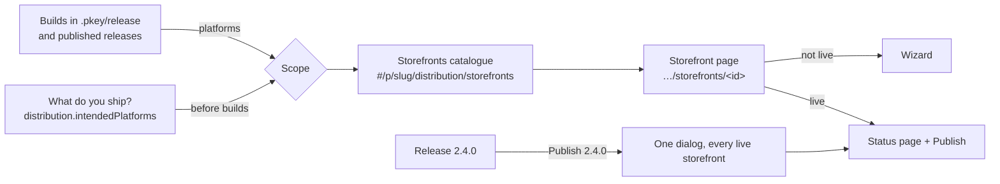

**Families** group the catalogue; they are presentation only and never change behaviour.

| Family           | Storefronts                                                                        | How a version gets there (plane)                                                                                                                     |
| ---------------- | ---------------------------------------------------------------------------------- | ---------------------------------------------------------------------------------------------------------------------------------------------------- |
| Built in         | Polaris Key                                                                        | First-party: the rollout on `direct`, the download page, the updater feeds                                                                           |
| App stores       | App Store, Google Play, Microsoft Store, Steam, itch.io                            | API (submit through the Worker) or CI (`butler push`)                                                                                                |
| Package managers | Homebrew, Scoop, winget, Flathub, Snap Store                                       | Feed (Scoop's manifest, Flathub's checker JSON), PR (the release workflow's `pkey storefronts sync` opens a pull request) or CI (`snapcraft upload`) |
| Sideload sources | AltStore and SideStore, AltStore PAL, F-Droid repository, Obtainium, App Installer | Feed (Polaris Key serves the source; the app's users subscribe once)                                                                                 |
| Web              | Web                                                                                | Link (the hosted web build)                                                                                                                          |

**Library registries** (npm, PyPI, Swift, Maven, OCI, Godot, Cargo, Go) stay in **Packages** (D2).
The catalogue shows one line at its foot when the product has package deliverables: "Tonebox also
publishes 2 packages · Packages →".

### 2.2 Navigation after the change

Distribution's sidebar goes from up to 11 items (SF 4) to four:

| Item        | Icon     | Holds                                                                                                                           |
| ----------- | -------- | ------------------------------------------------------------------------------------------------------------------------------- |
| Storefronts | store    | The catalogue and every storefront page; App Store, Commerce, Outlets & feeds, Outlet credentials and Listing become tabs there |
| Rollouts    | play     | UX-31's merged List · Matrix · Readiness                                                                                        |
| Health      | activity | Unchanged                                                                                                                       |
| Packages    | package  | Library registries (EXPERIENCE's rename of product "Package feeds")                                                             |

Access and auto-halt thresholds are hub settings (EXPERIENCE §0.2, ST-08). Listing's editor lives
in the hub's Distribution area with ST-13 **and** on each storefront's Listing tab (the same
component, scoped to that store).

**Every old URL keeps working** through `LEGACY_REDIRECTS` in `console/routes.ts` (UX-54):

| Old                                                     | New                                                                                    |
| ------------------------------------------------------- | -------------------------------------------------------------------------------------- |
| `distribution/outlets`                                  | `distribution/storefronts`                                                             |
| `distribution/outlets?outlet=<id>`                      | `distribution/storefronts/<entry for that outlet>?tab=setup#outlet-<id>`               |
| `distribution/app-store[?step=…]`                       | `distribution/storefronts/app-store?tab=releases[&step=…]`                             |
| `distribution/commerce`                                 | `distribution/storefronts/app-store?tab=commerce`                                      |
| `distribution/credentials`                              | `distribution/storefronts?view=connections`                                            |
| `distribution/listing`                                  | `settings/distribution#listing` (ST-13) or the storefront's Listing tab with `?store=` |
| `distribution/matrix`                                   | `distribution/rollouts?view=matrix` (UX-31)                                            |
| `distribution/storefronts?flow=add&stores=a[,b]&step=s` | `distribution/storefronts/a?step=<mapped s>` (§2.14 maps A-18j's step names)           |

### 2.3 The catalogue declaration

Each storefront is one **catalogue entry**, declared beside its A-18 adapter in
`packages/worker/src/core/storefront/` (UX-52). It is Worker-internal, plain data, and served to
the console by the read model (§2.15), so nothing is generated into the console and nothing touches
`shared-protocol`. **No PROTOCOL_VERSION change, no new outlet kind** (D5).

```ts
/** UX-52: what the catalogue needs beyond the adapter's operations. Worker-internal. */
interface CatalogueEntry {
  readonly id: StorefrontId; // "homebrew", "app-store", "polaris-key"…
  readonly label: string; // "Homebrew"
  readonly family:
    | "built-in"
    | "app-store"
    | "package-manager"
    | "sideload"
    | "web";
  readonly plane: "first-party" | "api" | "ci" | "pr" | "feed" | "link";
  /** The outlet kinds a declared outlet of this storefront may have. */
  readonly outletKinds: readonly OutletKind[];
  /** Its OWN platforms; must be a subset of the union of OUTLET_PLATFORMS[outletKinds]. */
  readonly platforms: readonly Platform[];
  /** Accepted artifact-map formats per platform (lower-case extensions or format names). */
  readonly artifacts: Readonly<Partial<Record<Platform, readonly string[]>>>;
  /** For `direct`-mapped entries: which identity field marks the outlet as this storefront's
   *  (Homebrew: `homebrewTap` + `homebrewCask`; Scoop: always, from a Windows `direct` build,
   *  with `scoop` and `scoopBucket` as optional refinements). */
  readonly identityKey?: "homebrewCask" | "scoop";
  /** True when the storefront needs no declaration or account: it is live as soon as a matching
   *  build is on Polaris Key (Scoop's manifest). D26. */
  readonly implied?: boolean;
  /** What the operator needs outside Polaris Key: one sentence and one link. */
  readonly account: { readonly text: string; readonly url: string } | null;
  /** Eligibility the console states and never enforces ("EU only", "FLOSS only for the main repo"). */
  readonly eligibility?: string;
  /** The value line on the catalogue card. */
  readonly pitch: string;
  /** Order within a family, recommended first; refined per product by §2.7's ranking. */
  readonly rank: number;
  /** The automation pass (D32, D33): the actions the setup runner performs, in order (each names
   *  the adapter operation, GitHub App action or Polaris Key read it uses), and the steps that
   *  need a person. The wizard is generated from `human`; the `AutoList` from `auto`. */
  readonly auto: readonly AutoAction[];
  readonly human: readonly HumanStep[];
}

/** One automated action. `needs` names what must exist for it to run; when it is missing the
 *  action renders as the human step `fallback` (with the same copy cards and verifier). */
interface AutoAction {
  readonly id: string; // "register-bundle-id", "open-setup-pr", "create-tap", "set-ci-secret"…
  readonly via:
    | { readonly op: StorefrontOp }
    | { readonly github: GithubAction }
    | { readonly read: string };
  readonly needs?: readonly (
    | "team-connection"
    | "app-write"
    | "app-admin"
    | "app-secrets"
    | "A-18j"
    | "A-18m"
    | "hosted-assets"
  )[];
  readonly fallback?: HumanStep["id"];
}
interface HumanStep {
  readonly id:
    | "connect"
    | "vendor-console"
    | "declarations"
    | "secret"
    | "merge"
    | "go-live"
    | string;
  readonly kind: "form" | "deep-link" | "repo-change" | "confirm" | "wait";
  /** Why a person: "account" | "legal" | "vendor-only" | "secret" | "review" | "typed". Shown in the aside. */
  readonly why: string;
}
```

The **conformance suite** (`test/storefront/conformance.test.ts`, extended by UX-52) asserts: every
outlet kind is covered by at least one entry; each entry's platforms are a subset of its outlet
kinds' platforms; every entry with `plane: "api"` has an adapter with a bound runtime or declares
its API operations `unsupported`; every `account.url` is in the deep-link table; **every `auto`
action's operation is declared `api` by the adapter and never a `TYPED_OPS` operation** (D34);
and every human step whose `why` is `"vendor-only"` names a deep link. Adding a
storefront stays **one declaration and one line**.

**The catalogue** (17 entries; ✓ = adapter on `main`, the others name the package that registers
them):

| Id                | Label                  | Family           | Plane                   | Outlet kinds                               | Platforms                                            | Artifacts it accepts                              | Outside Polaris Key                                                                                 | Registered by            |
| ----------------- | ---------------------- | ---------------- | ----------------------- | ------------------------------------------ | ---------------------------------------------------- | ------------------------------------------------- | --------------------------------------------------------------------------------------------------- | ------------------------ |
| `polaris-key`     | Polaris Key            | Built in         | first-party             | `direct`                                   | macOS, Windows, Linux, Android, iOS (page link), web | any in the artifact map                           | nothing                                                                                             | PS-01                    |
| `app-store`       | App Store              | App stores       | api                     | `app-store`, `testflight`                  | iOS, macOS                                           | iOS `ipa`; macOS `pkg` (sandboxed)                | Apple Developer Program; the app record; App Privacy; review                                        | ✓                        |
| `google-play`     | Google Play            | App stores       | api                     | `play`, `play-testing`                     | Android                                              | `aab` (a new app cannot use an `apk`)             | Play developer account; the app; first AAB by hand; content rating, data safety                     | ✓                        |
| `microsoft-store` | Microsoft Store        | App stores       | api                     | `ms-store`                                 | Windows                                              | `msix`, `msixbundle`, `msi`, `exe`                | Partner Center account; reserve the name; first submission with IARC                                | ✓                        |
| `steam`           | Steam                  | App stores       | api (reads, branches)   | `steam`                                    | Windows, macOS, Linux                                | depot content (`zip` or a directory) per platform | Steamworks fee; the app; the store page; review                                                     | A-18g                    |
| `itch`            | itch.io                | App stores       | ci                      | `itch`                                     | Windows, macOS, Linux                                | `zip`, `dmg`, `exe`, `AppImage`, `tar.gz`         | The game page; `BUTLER_API_KEY` in CI                                                               | ✓                        |
| `snap`            | Snap Store             | Package managers | ci                      | `snap`                                     | Linux                                                | `snap`                                            | `snapcraft register`; dashboard art; export-login token in CI                                       | ✓                        |
| `flathub`         | Flathub                | Package managers | pr                      | `flathub`                                  | Linux                                                | `tar.gz`, `zip`, `AppImage` as Flatpak sources    | First pull request to `flathub/flathub`, reviewed by volunteers                                     | A-18i                    |
| `homebrew`        | Homebrew               | Package managers | pr                      | `direct` (`homebrewTap`, `homebrewCask`)   | macOS                                                | `dmg`, `zip`, `pkg`                               | A `homebrew-<name>` tap repository (Polaris Key creates it in an organisation, D39); no token (D40) | A-18i                    |
| `scoop`           | Scoop                  | Package managers | feed (pr with a bucket) | `direct` (implied; `scoop`, `scoopBucket`) | Windows                                              | `zip` (Scoop's manifest installs archives)        | nothing; your own bucket is optional (Polaris Key creates it where the App may)                     | ✓ (feed); A-18i (bucket) |
| `winget`          | winget                 | Package managers | pr                      | `winget`                                   | Windows                                              | `msi`, `exe`, `msix`, `zip`, over HTTPS           | A pull request to `microsoft/winget-pkgs` per version, moderator-reviewed                           | A-18i                    |
| `altstore`        | AltStore and SideStore | Sideload sources | feed                    | `altstore`                                 | iOS                                                  | `ipa`                                             | nothing                                                                                             | UX-52                    |
| `altstore-pal`    | AltStore PAL           | Sideload sources | feed                    | `altstore-pal`                             | iOS (EU)                                             | `ipa` (notarized)                                 | Apple alternative-distribution entitlement; notarization; a marketplace id                          | UX-52                    |
| `fdroid`          | F-Droid repository     | Sideload sources | feed                    | `fdroid-repo`                              | Android                                              | `apk`                                             | nothing (your own repo; the main F-Droid repo is FLOSS-only)                                        | UX-52                    |
| `obtainium`       | Obtainium              | Sideload sources | feed                    | `obtainium`                                | Android                                              | `apk`                                             | nothing                                                                                             | UX-52                    |
| `app-installer`   | App Installer          | Sideload sources | feed                    | `app-installer`                            | Windows                                              | `msix`, `msixbundle`                              | A code-signing identity in CI                                                                       | UX-52                    |
| `web`             | Web                    | Web              | link                    | `web`                                      | web                                                  | a web build                                       | nothing                                                                                             | UX-52                    |

Notes on the table:

- **Homebrew and Scoop are storefronts that ride on `direct`.** Homebrew is attributed by
  `direct.homebrewTap` plus `direct.homebrewCask` (A-18i's cask generator); `homebrewFormula`
  stays a detection field for a formula the developer maintains, shown on Homebrew's Setup tab as
  "Your formula" and never generated. **Scoop is implied** (D26): Polaris Key already serves
  `scoop/<channel>.json` for the newest Windows build on `direct`, which `scoop install <url>`
  reads with no bucket, so Scoop is `live` the moment a Windows build is on Polaris Key. Its
  wizard is one optional step (the `scoop` identity's `bin` and `shortcuts`) and "Your own
  bucket" (`scoopBucket`, A-18i) is an upgrade on its Setup tab. The Polaris Key page lists both
  as "Also installs through Homebrew and Scoop". Their platforms come from the entry, never from
  `direct` (D5).
- **itch.io** stays desktop-only because `OUTLET_PLATFORMS.itch` is; butler's Android and HTML5
  channels would need that wire table widened (plan mode, out of scope, recorded in §8.4).
- **Steam** shows only when A-18g registers its adapter. Until then Platform → Store connections
  hides the Steam card (D25), so no card leads nowhere.
- **Epic** is absent (S-15 decision 8).

### 2.4 Scoping

**The product's platforms** (`productPlatforms`) are computed by the Worker (UX-53) as the union of:

1. the platforms in the `.pkey/release` artifact map (`ManifestArtifactEntry.platform`);
2. the platforms of published builds (`ReleaseChannelsResponse.deliverables[].platforms`);
3. the platforms a `direct` outlet lists **explicitly** in `direct.platforms`. Never
   `outletPlatformsOf(row)`: for a `direct` outlet without that field it returns the kind's whole
   list (`OUTLET_PLATFORMS.direct`, five platforms), which would put every storefront in scope;
4. the platforms **detected in the linked repository** (D45, W21) while there is no build:
   Godot's `export_presets.cfg` platforms, an Xcode project's supported platforms, a Gradle
   `com.android.application` module, Tauri or Electron targets. Source `detected`; replaced by
   `builds` as soon as a build declares the platform;
5. the **planned** platforms, `distribution.intendedPlatforms`, answered by "What do you ship?"
   (chips: macOS, iOS, Android, Windows, Linux, Web) on the new product's first screen (§5.1) or
   the catalogue's first visit, asked only when neither builds nor the repository answer.

Each platform carries its source, and the catalogue header shows them as `ScopeChips`: "macOS ·
iOS · from your builds", or "macOS · from your builds · Windows · planned". A planned platform can
be removed at any time; a platform that comes from builds cannot be removed from the chips (its
tooltip says which build declares it). A planned platform with no build yet shows on each of its
storefronts as a fit row, "No Windows build yet" (§2.5), so planning ahead never hides the work.

**The rule.** A storefront is **in scope** when `entry.platforms ∩ productPlatforms ≠ ∅`. A product
that ships macOS and iOS sees Polaris Key, App Store, Steam, itch.io, Homebrew, AltStore and
SideStore and AltStore PAL, and nothing else. **Out-of-scope storefronts are absent** (D4): not in
the catalogue, not in the Publish dialog, not in the launch path's counts, not in the palette's
results for that product, not in the Connections view. The only trace is the last line of the
catalogue: "Only storefronts for macOS and iOS are shown. Shipping on another platform? **Add
it**", which opens the platform chips.

**Inside a storefront, rows follow the same rule.** The App Store page of an iOS-only product has
no macOS row; Steam's depots, itch.io's channels and the Publish dialog's rows are per shipped
platform; Polaris Key's updater feeds show only the shipped platforms' (§4.4).

A storefront that is already **declared or live is always in scope**, even if its platform left the
builds and the plan; it then shows `attention` ("No Windows build in 2.4.0 · Add Windows back or
retire the outlet").

**A deep link to an out-of-scope storefront** (`…/storefronts/google-play` for a Mac app) renders
the storefront page's `unavailable` state: "Google Play carries Android apps. Tonebox ships macOS
and iOS." and one action, **Add Android to Tonebox's platforms** (adds it as planned and opens the
wizard). Never a 404, and never a way to set the store up without the platform.

Platform → Store connections is the one place every store appears, because team credentials are
not per product; its reverse view (which product holds which app) lists only products for which
that store is in scope.

### 2.5 Artifact fit

Scope answers "could this store carry Tonebox?"; **fit** answers "does Tonebox have the build this
store needs?". The read model compares `entry.artifacts` with the artifact map's `format` per
platform (free-form today, `ARTIFACT_FORMAT_PATTERN`; matched case-insensitively against the file
extension or format name).

| Situation                                         | Shown                                                                                                                                                       |
| ------------------------------------------------- | ----------------------------------------------------------------------------------------------------------------------------------------------------------- |
| A matching build exists                           | Requirements row ✓ "macOS build · `Tonebox.dmg` (dmg)"                                                                                                      |
| The platform ships but in the wrong format        | ✗ "Google Play needs an `.aab`; your Android build is an `.apk`", with the artifact-map entry to add as a snippet and a link to the export docs             |
| No build yet, the platform is planned             | ○ "No macOS build yet. Homebrew needs a `.dmg`, `.zip` or `.pkg`", non-blocking until the Go live step                                                      |
| A store-specific constraint the Worker cannot see | ○ with the constraint stated: "The Mac App Store needs a sandboxed `.pkg`"; winget's "installer must be served over HTTPS" is checked from the artifact URL |

Fit is shown on the catalogue card only as an issue ("Needs an .aab build"), on the storefront's
Requirements step in full, and in the Publish dialog per release (§2.11).

### 2.6 The storefront state machine

Computed by the Worker per storefront and product (UX-53). The page renders from it; the catalogue
groups by it.

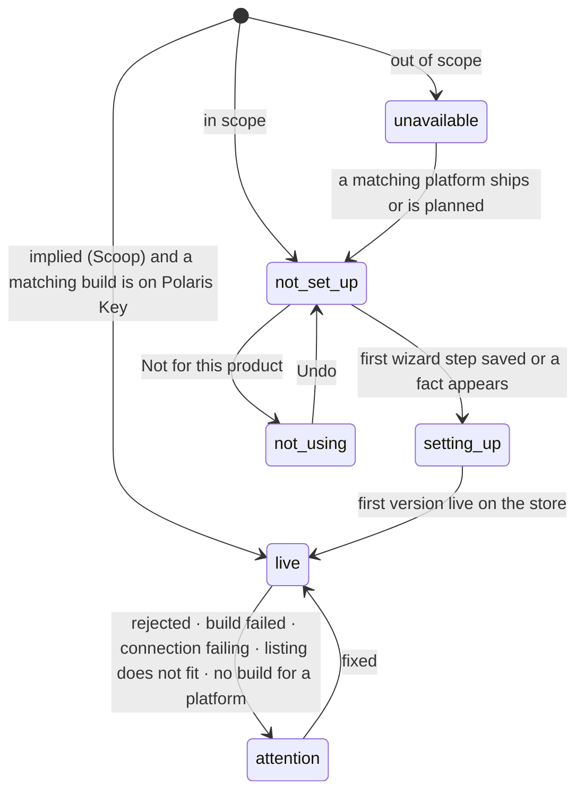

| State         | Means                                                                                                   | Catalogue group       | Page shows                          |
| ------------- | ------------------------------------------------------------------------------------------------------- | --------------------- | ----------------------------------- |
| `unavailable` | Out of scope (§2.4)                                                                                     | (absent)              | The reason and **Add <platform>**   |
| `not_set_up`  | In scope; no wizard state, no outlet, no ledger row                                                     | Ready to set up       | The wizard at step 1                |
| `setting_up`  | Some step is done or saved; no version live yet                                                         | Setting up            | The wizard at the first open step   |
| `live`        | A version is live: store status read (API), feed lists it (feed), PR merged (PR), CI push reported (CI) | Live                  | The status page                     |
| `attention`   | Live, with one of the J-2 attention kinds for this store                                                | Live (with the issue) | The status page with a `HealthLine` |
| `not_using`   | The operator chose "Not for this product"                                                               | Not using (collapsed) | The wizard's first step with Undo   |

Polaris Key is `live` from the first release placed on `direct`, and `setting_up` before that with
one step: "Ship a first release" (it links the Publish from CI wizard, §4.3).

### 2.7 The catalogue page

`#/p/<slug>/distribution/storefronts` (A-18j's route, kept). Mockup:
[50-storefront-catalogue](setup/shots/50-storefront-catalogue-desktop-dark.png).

- **Header**: "Storefronts", the product's `ScopeChips` ("macOS · iOS · from your builds") as meta,
  and the primary **Publish 2.4.0** when a release is newer than what some live storefront carries;
  otherwise no primary.
- **Live** (when any): one row per live storefront, not a card: icon, name, the version live per
  track ("2.4.0 · 2.5.0-beta.2 on TestFlight"), the install hint (`brew install --cask
acme/tap/tonebox`) and a right-aligned issue pill only when there is an issue. A row opens the
  storefront page.
- **Setting up**: cards with "Continue · step 1 of 2 for you" and the next human step's title ("Merge pull request #43").
- **Ready to set up**: cards, ordered by a per-product ranking (Polaris Key first; then the
  storefronts whose platforms the product ships most builds for; then by `entry.rank`). Each card:
  icon, name, `pitch` ("Install with one command on a Mac"), one fit issue if any, **Set up**, and
  a muted effort line from the declaration's human steps (D33): "1 step for you · merge a pull
  request", "2 steps for you · an itch.io page and its API key", "4 steps for you · Apple review,
  usually 1–2 days". Never the automated count. Grouped by family under small headings only when more than six cards show.
  **A pitch names only the product's platforms**: an entry declares its pitch per platform set
  ("Sell on Steam to Mac players" for a macOS product; Steam Deck is mentioned only when a Linux or
  Windows build ships), so no card promises an audience the product cannot reach.
- **Implied storefronts** (D26) sit under Live from the first matching build, with their install
  line and "Works now · nothing to set up"; their page offers the optional refinements.
- **Not using** (collapsed) at the foot, then the one scope line: "Only storefronts for macOS and
  iOS are shown. Shipping on another platform? **Add it**" (§2.4). No list, no icons.
- **First visit with no builds and no answer**: the page shows "What do you ship?" as its only
  content (six chips, Continue). Answering sets `distribution.intendedPlatforms` and renders the
  catalogue. The answer can be changed from the chips in the header.
- **Connections view** (`?view=connections`): the product's credentials, one row per storefront
  with a credential (team or product), its health and **Re-check**, linking to each storefront's
  Setup tab. It replaces the Outlet credentials page.
- **No capability badges on the catalogue.** A-18j's API / Link / CI strip moves to each
  storefront's Setup tab under "How Tonebox gets there", where it explains rather than decorates.

### 2.8 The storefront page

`#/p/<slug>/distribution/storefronts/<id>`. One page per storefront; the state machine (§2.6)
decides what it shows (D6). The header is the same in every state: back to Storefronts, the
storefront's icon and name, its `family · plane` as meta ("Package manager · pull requests"), and
the state's primary action.

#### 2.8.1 Not set up or setting up: the wizard

A page-hosted `Wizard` (§1). Its steps are generated from the catalogue entry's `human` list and
its `AutoList` from `auto` (§2.3), so a storefront with no runtime still has a complete wizard.
Since the automation pass (D32, D33) the wizard holds **only what needs a person and the typed
confirmation**; everything else is done by the setup runner (W16) and shown as **Polaris Key does
this**. Mockups: [51-storefront-setup](setup/shots/51-storefront-setup-desktop-dark.png)
(Homebrew, one step) and [51b-app-store-setup](setup/shots/51b-app-store-setup-desktop-dark.png)
(App Store, step 1 of 3 for you).

**Set up** (on the card or the page) first shows the plan as the `AutoList` in the future tense,
"Polaris Key will:", with one primary, **Set up App Store**. That click is the consent (D34); the
runner then works through the list while the person does their first step.

**What Polaris Key does, by plane** (the `AutoList`; each row names its source):

| Plane       | Polaris Key does this                                                                                                                                                                                                                                                                                                                                                                                                                                                                                       |
| ----------- | ----------------------------------------------------------------------------------------------------------------------------------------------------------------------------------------------------------------------------------------------------------------------------------------------------------------------------------------------------------------------------------------------------------------------------------------------------------------------------------------------------------- |
| Every plane | Platform and artifact fit (§2.5); identifiers derived and availability-checked (D44); the outlet added to the standing setup pull request (D37) or, without App write, the one command filled in; the store's step added to `pkey storefronts sync` (nothing to edit, D27)                                                                                                                                                                                                                                  |
| API         | The key checked on paste (D42); the store's app found by its identifier and pinned as soon as it exists (the `createApp` verifier); identifiers registered where the store allows (Apple bundle ids, A-17b); the initial availability and free price; testing tracks and their groups, then every release to them (D36); the notification URL; the listing text and images from the listing model and hosted assets (D43); on every release, the production submission prepared up to the typed click (D35) |
| CI          | The CI secret checked and stored in GitHub (D41); channel names per platform; the upload on every release                                                                                                                                                                                                                                                                                                                                                                                                   |
| PR          | The tap or bucket repository found or created (D39); the generated file previewed; on every release, the bump pull request with a one-hour App token (D40)                                                                                                                                                                                                                                                                                                                                                  |
| Feed        | The feed served from the newest matching build once the outlet is declared; install links and the QR code                                                                                                                                                                                                                                                                                                                                                                                                   |

**What needs you** (the steps; at most four, usually one or two):

| #   | Step                                                                                                                             | Kind(s)               | When                                                                                                                                                                                                                                                                                                                                                              |
| --- | -------------------------------------------------------------------------------------------------------------------------------- | --------------------- | ----------------------------------------------------------------------------------------------------------------------------------------------------------------------------------------------------------------------------------------------------------------------------------------------------------------------------------------------------------------- |
| 1   | **Connect** ("Connect App Store Connect", "Your itch.io key")                                                                    | Form (`SecretField`)  | The store needs a credential and none exists: an API store without a team connection (the connect form inline for platform admins, "Ask a platform admin" otherwise, D12), or a CI or winget secret. Checked on paste (D42); a CI secret goes straight to GitHub (D41). Absent when a team connection exists                                                      |
| 2   | **In the vendor console** ("In App Store Connect", "In Play Console", "In Partner Center", "In Steamworks", "Submit to Flathub") | Deep link (checklist) | What only the vendor's console does: create the app record or reserve the name, the first upload where the store demands it, the legal declarations (App Privacy, ratings, data safety). One checklist, each item a deep link with copy cards; items with a verifier tick themselves, the rest are assertions (§1.8). Absent for PR, feed and most CI storefronts |
| 3   | **Merge the pull request**                                                                                                       | Repo change           | Polaris Key's setup pull request carries this storefront's outlet (D37). With several storefronts set up at once, merging once completes this step on all of them. Without App write it is **Add to your repository** with the one command                                                                                                                        |
| 4   | **Go live**                                                                                                                      | Confirm, Wait, Done   | API stores: the first submission, typed (S-15 §6.4, D35), then "Submitted for review · Apple's answer appears here". CI, PR and feed storefronts have no confirm: "Goes live with the next release" is an unnumbered ✦ marker and a `WaitingFor`                                                                                                                  |

So Homebrew is **one** step (merge), a sideload source one, itch.io and Snap two, winget two, an
API store four (three when the team key exists), and an implied storefront none (D26). The
step-count table in the [automation pass](#automation-pass-2026-10-05) has every storefront.

Rules:

- **Merge is the step that makes the storefront real**, and the only one that touches the
  repository. Polaris Key keeps one setup pull request per product open on its own `pkey/setup`
  branch, adding each storefront's outlet block (`renderOutletBlock`, UX-56) with comments
  preserved and the manifest validated before it pushes; the step shows the diff summary,
  **Open on GitHub** and a `WaitingFor` on the resync. Without App write, the default tab is the
  one command, `pkey storefront add homebrew --tap acme/homebrew-tap --cask tonebox` (UX-56). A
  manual product (no repository) shows **Link a repository** first (UX-23's dialog), because
  outlets come from the manifest (D9).
- **No workflow edit per storefront.** The release workflow that Publish from CI writes (§4.3)
  ends with one `pkey storefronts sync --channel <ch>` step that runs every declared CI and
  pull-request storefront (D27). A product whose workflow predates it gets the patch in the same
  setup pull request.
- **Prerequisites never bounce to a platform-only page.** An unmet team connection shows "Ask a
  platform admin" (§1.11); a platform admin sees the connect form inline (the same component as
  Store connections, UX-55).
- **Listing is a step only when something has no source** (D43). The listing model is one
  (A-18b); the runner pushes what fits and the `AutoList` says so ("Listing pushed from your
  listing · 3 locales"). A missing slot (no screenshots yet) becomes a short **Add screenshots**
  step that uploads to hosted assets, then the runner pushes them.
- **A failed automated row becomes the step it replaces.** If bundle-id registration is refused,
  the row turns red with Apple's reason and the human version (the deep link with copy cards)
  opens under it. Nothing silently stops.
- **The Go live step's plan** is A-18j's Plan step, rendered as the Confirm step's rows: every
  external write, each with its mode (API, link, CI, PR), and the typed phrase.

#### 2.8.2 Live: the status page

A record page (EXPERIENCE §4): header, `HealthLine` when something is wrong, then tabs. Mockup:
[52-storefront-live](setup/shots/52-storefront-live-desktop-dark.png) (App Store).

- **Header actions**: **Publish 2.4.0** (primary, when a newer release exists and fits this
  storefront), **Open in App Store Connect** (secondary, external), overflow: Re-check connection,
  Not for this product….
- **Status** (first tab, EXPERIENCE's record rule): one row per platform and track with the version
  live, the version in review or rolling out (with rollout percentage where the store has one), the
  last store read time; the install link, command or QR code for this storefront; the store's
  rating and review link where the adapter reads one (`status` op). No healthy pills.
- **Releases**: this storefront's column of the Rollouts matrix (UX-31), newest first, with each
  release's outcome here ("Approved in 21 h", "Rejected · guideline 2.1 · Fix"), and **Publish**
  per row for releases this storefront has not taken.
- **Listing**: the listing editor scoped to this store (A-18j `ListingPage`, ST-13), with **Push
  listing** for API stores (A-18m for Apple).
- **Commerce** (only when the adapter declares `iap`): App Store in-app purchases (today's Commerce
  page, moved); Google Play's when its runtime binds `iap`.
- **Setup**: the wizard's checklist, read-only rows with their state and "Change" links; the
  connection (credential health, Re-check, Replace key, team-key status); "How Tonebox gets there"
  (the capability strip, explained); and **Technical**: the outlet ids, identity fields as labelled
  fields (never JSON, SF finding 8), transports, capability narrowing and feed URLs. One per declared
  outlet when the storefront has several (`altstore`, `altstore-beta`).

### 2.9 What each storefront's wizard and status page say

The generic steps above, made concrete. **Needs you** is the wizard (every step listed); **Polaris
Key does this** is its `AutoList`; the last column is the status page once live.

| Storefront             | Needs you (the wizard)                                                                                                                                                                                                                                                                                                                                                                                          | Polaris Key does this                                                                                                                                                                                                      | Live status shows                                                                                                                                             |
| ---------------------- | --------------------------------------------------------------------------------------------------------------------------------------------------------------------------------------------------------------------------------------------------------------------------------------------------------------------------------------------------------------------------------------------------------------- | -------------------------------------------------------------------------------------------------------------------------------------------------------------------------------------------------------------------------- | ------------------------------------------------------------------------------------------------------------------------------------------------------------- |
| App Store              | **Connect** (absent with a team key) · **In App Store Connect**: create the app record with the copy cards (name, bundle id `com.acme.tonebox`, SKU, primary language), App Privacy, age rating, category, the review contact; the record ticks itself when the verifier finds the bundle id · **Merge** · **Go live** (typed). One wizard, iOS and macOS rows; TestFlight is a track filled automatically      | Bundle id registered with capabilities (A-17b); app found and pinned; availability and free price (A-17c); TestFlight groups and builds; webhook; release notes and promo text, and with A-18m the listing and screenshots | Live per platform, TestFlight builds and testers, review state, phased release percentage                                                                     |
| Google Play            | **Connect** (absent with a team key; includes granting the service account access in Play Console, which is yours) · **In Play Console**: create the app, upload the first `.aab` (the build's download link as a copy card), App content (content rating, target audience, data safety, app access, ads); a new personal account's 12 testers for 14 days as an asserted row · **Merge** · **Go live** (typed) | App found by package name; listing text and images (A-18e via A-18j's routes); internal and closed tracks with Google Groups; every release to them; one-time products                                                     | Live per track, staged rollout percentage, review state                                                                                                       |
| Microsoft Store        | **Connect** (absent with a team key; the Entra app's Partner Center role is yours) · **In Partner Center**: reserve the name (verified by `/my/applications`), the first submission with IARC, MSIX Properties · **Merge** · **Go live** (typed)                                                                                                                                                                | App found once reserved; listing, images, category, privacy URLs, price tier (A-18f via A-18j's routes); MSI and EXE package by URL; each release's submission prepared                                                    | Live, certification state                                                                                                                                     |
| Steam                  | **Connect**: the publisher key and the builder login (stored in CI) · **In Steamworks**: the app fee and the 30 days (asserted), create the app and its store page, Valve's review · **Merge** · **Go live**: set the default branch live in Steamworks (deep link until A-18k)                                                                                                                                 | Depot layout per platform; each release live on a named beta branch from CI; the asset pack from hosted assets                                                                                                             | Live per branch                                                                                                                                               |
| itch.io                | **Your itch.io page and key**: create the page (deep link), paste the API key (checked, stored in CI) · **Merge**                                                                                                                                                                                                                                                                                               | Channels per platform; the CI secret; `butler push` on every release                                                                                                                                                       | Last butler push per channel                                                                                                                                  |
| Snap Store             | **Register and export a login**: `snapcraft register <name>` and `snapcraft export-login` with the minimal ACLs, paste the login (checked, stored in CI) · **Merge**                                                                                                                                                                                                                                            | Snap name; the CI secret; upload and metadata on every release                                                                                                                                                             | Live per channel (stable, candidate, beta, edge)                                                                                                              |
| Flathub                | **Submit to Flathub**: open the first pull request to `flathub/flathub` from the generated files (download or `pkey storefront flathub init`), then the volunteer review as a `WaitingFor` on the app repository · **Merge**                                                                                                                                                                                    | App id; MetaInfo and manifest with `img.plrs.im` screenshots; the checker JSON; updates by Flathub's checker                                                                                                               | Latest version on Flathub, open update pull requests                                                                                                          |
| Homebrew               | **Merge** (and, for a personal account, **Create the tap** from the prefilled link first)                                                                                                                                                                                                                                                                                                                       | Tap found or created; cask token checked free; the cask; the setup pull request; bump pull requests with a one-hour App token                                                                                              | `brew install --cask <tap>/<token>`, the tap's current version, the last update commit; "Your formula" when `homebrewFormula` is declared (maintained by you) |
| Scoop                  | None (implied, D26). Optional on the Setup tab: `bin` and `shortcuts` (derived from the build), and **Your own bucket**, created by Polaris Key where the App may, then **Merge**                                                                                                                                                                                                                               | The manifest served; the bucket and its pull requests where the App may                                                                                                                                                    | `scoop install https://key.plrs.im/<slug>/distribution/scoop/stable.json`, or `scoop bucket add … && scoop install …` with a bucket; current version          |
| winget                 | **A token for the fork**: mint a fine-grained GitHub token with the two permissions listed (prefilled where GitHub's form allows), paste it (checked, stored in CI as `PKEY_PR_TOKEN`) · **Merge**                                                                                                                                                                                                              | `Publisher.App` checked free; HTTPS installer check; manifests; the fork; a pull request per release; moderation labels read                                                                                               | `winget install <id>`, the moderation state of the open pull request (from its labels)                                                                        |
| AltStore and SideStore | **Merge**                                                                                                                                                                                                                                                                                                                                                                                                       | Bundle id and `.ipa` fit; the source; Add to AltStore and SideStore links, QR code                                                                                                                                         | Source URL, "Add to AltStore" and "Add to SideStore" links, QR code, devices from this source                                                                 |
| AltStore PAL           | **Apple and AltStore PAL**: the alternative-distribution entitlement (asserted), registration for a marketplace id; each version's notarization in App Store Connect stays yours (alternative distribution is on the Apple adapter's deny list) · **Merge**                                                                                                                                                     | The source with its marketplace id; listing only once live                                                                                                                                                                 | Source URL, notarization state of the newest build                                                                                                            |
| F-Droid repository     | **Merge** (the repository key is generated locally by `pkey ci init` and stored in CI)                                                                                                                                                                                                                                                                                                                          | `.apk` fit; the repository relay; the CI step                                                                                                                                                                              | Repository URL with fingerprint, QR code                                                                                                                      |
| Obtainium              | **Merge**                                                                                                                                                                                                                                                                                                                                                                                                       | `.apk` fit; the JSON; link and QR code                                                                                                                                                                                     | "Add to Obtainium" link and QR code                                                                                                                           |
| App Installer          | **Your signing identity**: a code-signing certificate or Azure Trusted Signing, its secret pasted (checked, stored in CI) · **Merge**                                                                                                                                                                                                                                                                           | `.msix` fit; the `.appinstaller` feed; the CI secret                                                                                                                                                                       | The `.appinstaller` URL, devices updating through it                                                                                                          |
| Web                    | **Merge** (the hosted URL's origin is added to the web origins automatically)                                                                                                                                                                                                                                                                                                                                   | The hosted URL; the web origin                                                                                                                                                                                             | The hosted URL                                                                                                                                                |
| Polaris Key            | §2.10: none                                                                                                                                                                                                                                                                                                                                                                                                     | §2.10                                                                                                                                                                                                                      | §2.10                                                                                                                                                         |

### 2.10 Polaris Key, the built-in storefront

The first card and first live row in every catalogue (D8). Its page merges what is scattered today:
the "Direct download" outlet row, the updater-feed endpoints on Update → Feed, the Discover switch
in Identity → Portal, and PS-06's panel. **PS-06 builds it, in UX-54's page shell**; this section
is the design PS-06's brief gains (§8.3).

| Tab      | Contents                                                                                                                                                                                                                                                                     |
| -------- | ---------------------------------------------------------------------------------------------------------------------------------------------------------------------------------------------------------------------------------------------------------------------------- |
| Status   | The download page `dl.plrs.im/<slug>` with **Open** and a small preview of the platforms offered; the version live per channel; "Also installs through Homebrew and Scoop" (links to those storefronts, when declared); devices updated through Polaris Key in the last 24 h |
| Releases | The `direct` column of the matrix                                                                                                                                                                                                                                            |
| Discover | PS-06's panel: Listing (Automatic / Listed / Not listed), Audience, Ways to add, **Who can see this?** with the persona simulator, the analytics card                                                                                                                        |
| Listing  | The listing editor with `polaris-key` selected (PS-01's profile)                                                                                                                                                                                                             |
| Setup    | Updater feeds (Sparkle, WinSparkle, App Installer, the discovery URL), shown only for the platforms the product ships (§4.4); access mode read-out linking the hub; Technical (outlet `direct`, identity fields as fields)                                                   |

The label is "Polaris Key" everywhere (PS-10); the identifier stays `direct` (S-21 §6.8). It has
**no wizard** (D48): before the first release its page shows the `AutoList` ("Download page ready
at `dl.plrs.im/tonebox` · Updater feeds ready for macOS · Waiting for the first release") and one
link to Publish from CI.

### 2.11 Publish everywhere

**"Publish 2.4.0"** is one dialog (UX-58), opened from the release record's Status tab (UX-08),
the catalogue header, every live storefront's header and Releases tab, the palette ("Publish
2.4.0…") and the first-release celebration on Overview. Mockup:
[52b-publish-everywhere](setup/shots/52b-publish-everywhere-desktop-dark.png).

```text
Publish 2.4.0                                                       ×
Signed by tonebox-rk-2026 · stable · macOS, iOS · arrived from CI 6 min ago

  ☑ Polaris Key       Starts a rollout: 10% → 100% over 3 days   [10% ▾]
  ☑ App Store · iOS   Submits Tonebox-2.4.0.ipa for review        phased ☑
  ☑ App Store · macOS Submits Tonebox-2.4.0.pkg for review
  ✓ TestFlight        2.4.0 (12) sent to External testers by Polaris Key · 6 min ago
  ✓ Homebrew          Done by the release workflow · pull request #41 merged 4 min ago

  AltStore and SideStore is waiting for you to merge #43 · Continue

  Type 2.4.0 to submit to the App Store            [ 2.4.0        ]
                                         Cancel   Publish to 2 storefronts
```

- **Rows are every live, in-scope storefront**, with what will happen there in the plane's words:
  a rollout (first-party), a submission (API), "done by the release workflow" with its result (CI,
  PR: these already happened, so they are ✓ rows, not checkboxes), or "lists it when …" (feed).
- **Excluded rows** are live storefronts that cannot take this release, each with why and a fix
  link: no matching build for a platform (§2.5), connection failing, the store's review still open
  for an older version. A storefront that is not live is never a row; one still setting up gets a
  single line under the list ("AltStore and SideStore is still setting up · Continue").
- **Done rows are the reassurance, not the work.** CI, pull-request and feed storefronts, and
  every testing track (D36), publish without a click; the dialog shows what they already did so
  the operator sees the whole release in one place. When every live storefront is of that kind,
  the only decision left is the Polaris Key rollout.
- **Every submission is already prepared** (D35). When a release arrives, the setup runner creates
  each API store's version, attaches the build once the store has processed it, writes the release
  notes and pushes the listing changes; a row reads "Ready to submit · build 12 processed". What
  remains is the typed click; a row whose preparation failed shows why and **Retry**, and is
  excluded until it is ready. Production submission without the typed click stays out of scope
  (D31, §8.4).
- **Rollout controls** appear only where the plane has them (Polaris Key's staged rollout; Play's
  staged rollout; Apple's phased release).
- **One typed confirmation covers the store submissions.** The phrase is the version. The Worker
  validates it per store through `confirm.ts` (UX-58 adds a batch form of the adapter's phrase that
  is valid only for the stores listed in the request), and each store write still goes through
  that store's gate, ledger and budget individually. A partial failure leaves the others
  submitted and shows "2 of 3 submitted · Microsoft Store refused: … · Retry".
- **Outcomes land in Rollouts** and on each storefront's Status tab; store answers arrive through
  the existing pollers and the attention model (J-2's "Store review rejected" kind).
- Matrix "Start rollout…", the App Store tab's "Distribute" and A-18j's "Submit and release" open
  this dialog pre-filtered to their storefront; they no longer start a release on their own.

### 2.12 Credentials: one home each

| Credential                                                                                                          | Home                                                                                                                                                                                  | Also shown (read-only, linking home)                                                |
| ------------------------------------------------------------------------------------------------------------------- | ------------------------------------------------------------------------------------------------------------------------------------------------------------------------------------- | ----------------------------------------------------------------------------------- |
| Team store keys (App Store Connect, Play, Partner Center, Steam)                                                    | Platform → Store connections (A-16); the connect form is reused inline in a storefront's Connect step for platform admins                                                             | The storefront's Setup tab; the catalogue's Connections view                        |
| A product's own store key (where the adapter allows one)                                                            | The storefront's Setup tab (ST-12's editor)                                                                                                                                           | Keys & secrets → Store credentials                                                  |
| CI secrets a store needs (`BUTLER_API_KEY`, the snapcraft login, the Steam builder login, winget's `PKEY_PR_TOKEN`) | GitHub, never stored by Polaris Key. The wizard checks the value and writes it through the App (D41, Secrets write); without that permission it prints the exact `gh secret set` line | The storefront's Setup tab, as "In CI: `BUTLER_API_KEY` · set by Polaris Key Oct 5" |

Store connections keeps its inventory and reverse view (which product holds which app). Its "Set
up" opens the storefront page, not a flow. "Last check failed" always shows the store's error and
**Re-check · Replace key** (SF finding 7 item 4).

### 2.13 Empty and error states on the storefront surfaces

| Surface                       | State                    | Shown                                                                                                                             |
| ----------------------------- | ------------------------ | --------------------------------------------------------------------------------------------------------------------------------- |
| Catalogue                     | Distribution off         | `EmptyState kind="service-off"` with the "What you'll set up" preview (§4.1) and **Turn on Distribution** (also turns on Release) |
| Catalogue                     | No builds, no answer     | "What do you ship?" (§2.7)                                                                                                        |
| Catalogue                     | Read failed              | `ErrorState`; never "Storefronts not found" (SF finding 14): the read always returns a state, even for a product with nothing     |
| Storefront page               | Unknown id               | `EmptyState kind="not-found"` with "Open Storefronts"                                                                             |
| Storefront page               | Out of scope             | The `unavailable` state (§2.4)                                                                                                    |
| Storefront page, Commerce tab | Store has no IAP support | The tab is absent                                                                                                                 |

### 2.14 Reconciliation with A-18j, UX-32, PS-06 and S-15

| Piece                                                                                      | Decision                                                                                                                                                                                                                                        |
| ------------------------------------------------------------------------------------------ | ----------------------------------------------------------------------------------------------------------------------------------------------------------------------------------------------------------------------------------------------- |
| A-18j's Worker: plan, ledger, `FlowRuntime`, step routes, slot board, push-listing         | **Kept as the engine.** The per-store wizard calls the same routes; nothing is rewritten                                                                                                                                                        |
| A-18j's Storefronts tile grid                                                              | **Superseded** by the catalogue (§2.7); tiles become cards without the capability strip                                                                                                                                                         |
| A-18j's seven-step multi-store flow                                                        | **Superseded by the per-store wizard.** Step mapping for legacy URLs: Storefronts → (catalogue); Prerequisites → Requirements + Connect + The app; Listing and Assets → Listing; Plan and Run → Go live's Confirm; Submit and release → Go live |
| A-18j's Listing page                                                                       | **Kept**; hosted in the hub by ST-13 and on each storefront's Listing tab                                                                                                                                                                       |
| A-18j's "Set up" from Store connections                                                    | **Kept**; it opens the storefront page                                                                                                                                                                                                          |
| UX-32 (launch-path entry, inline app pick, tiles open App Store and Commerce, nav cleanup) | **Superseded.** Inline app pick → UX-55 (The app step); App Store and Commerce → storefront tabs (UX-57); nav → UX-54; launch-path entry → UX-21 amendment (§5)                                                                                 |
| EXPERIENCE §0.4 S5                                                                         | **Superseded** by this section; its delight moment ("Submitted for review · Apple's answer appears here") is kept in Go live                                                                                                                    |
| PS-06 (Polaris Key tile and panel)                                                         | **Kept, re-homed**: it builds §2.10 in UX-54's page shell                                                                                                                                                                                       |
| S-15 §8.1 "platform admin" for the flow                                                    | **Narrowed** to team-credential writes (D12)                                                                                                                                                                                                    |

### 2.15 The read model the console needs

One read, extending A-18j's `GET /manage/api/products/<p>/distribution/storefronts` (UX-53;
narrative admin route, so `routeCoverage` and the OpenAPI narrative entry apply, AGENTS.md rule
10):

```jsonc
{
  "productPlatforms": [
    { "platform": "macos", "source": "builds" }, // "builds" | "outlet" (explicit direct.platforms) | "detected" (D45) | "planned"
    { "platform": "ios", "source": "builds" },
  ],
  "intendedPlatforms": ["macos", "ios"],
  "newestRelease": { "version": "2.4.0", "channel": "stable" },
  "storefronts": [
    {
      "id": "homebrew",
      "label": "Homebrew",
      "family": "package-manager",
      "plane": "pr",
      "scope": { "inScope": true }, // out-of-scope entries are omitted; only a deep link asks for one by id
      "state": "setting_up", // §2.6
      "fit": [
        {
          "platform": "macos",
          "ok": true,
          "artifact": "Tonebox.dmg",
          "format": "dmg",
        },
      ],
      "wizard": {
        "step": "merge",
        "steps": [{ "id": "merge", "state": "current" }], // human steps only (D33)
        "auto": [
          // the AutoList (W16): one row per automated action
          { "id": "find-tap", "state": "done", "result": "acme/homebrew-tap" },
          { "id": "open-setup-pr", "state": "done", "result": "#42" },
        ],
      },
      "live": null, // { tracks: [{ platform, track, version, inReview, rollout, readAt }], install: { kind: "command", text: "brew install --cask acme/tap/tonebox" } }
      "outlets": ["direct"],
      "attention": null,
    },
  ],
}
```

The state, scope, fit and step states are computed here, in one place, so the catalogue, the
storefront page, the launch path (§5) and the attention model agree. `distribution.intendedPlatforms`
is an S-18 registry key (ST-03 types, scope product, console-owned, not policy-bound); until ST-05's
generic API exists it is written through a bespoke `PUT …/distribution/storefronts/platforms`
that ST-05 aliases.

---

## 3. Connect your app: the SDK wizard

### 3.1 Where it lives

- **`#/p/<slug>/connect`**, a Core item **Connect your app** (icon `plug`), after Overview (D15).
  Palette entries: "Connect your app", "SDK", "Install the SDK", "Trust pins", "Config file".
- A **launch-path step** in Basics, right after Product created (§5.2). It shows `waiting` once a
  command or config file is copied and completes itself on the first SDK sighting (D28).
- **Overview's Trust & SDK block** (550 px today, SDK F10) becomes one line: before a sighting,
  a card "Connect your app · Add the SDK and see it reach Polaris Key · Start"; after, "Connected
  · Node 1.8.0, Swift 2.1.0 · last seen 4 min ago · Connect another app". This is EXPERIENCE's
  C15.
- **Devices' empty state** gets **Connect your app** as its primary action and embeds the Verify
  row (§3.6). Devices also explains why it can stay empty after a successful connection: "Devices
  appear when someone activates a license or signs in."

Once an SDK has been seen, the page stays a wizard you can rerun ("Connect another app") above a
short status: SDKs seen (name, version, platform, last seen, from W15's sightings), the pins in use,
the config file download, and the **Drop-in UI** section (§3.5).

Mockup: [53-connect-app](setup/shots/53-connect-app-desktop-dark.png) (Add the SDK, step 1 of 2
for you, Swift detected from the repository, One command selected and the Verify row already
waiting).

### 3.2 Steps

Two steps for you, then Done (D33): add the SDK, run the app. **Your app** is an unnumbered choice
that appears only when two or more SDKs fit; Polaris Key otherwise picks the SDK from the builds and
the repository (D45) and shows it in the header ("Swift · detected from acme/tonebox · Change").

| #   | Step            | Kind          | Content                                                                                                                                                                                                                                                                                                                                                                                                                                                                                                                                                                                                                                                                                                                                                                                                                                                                                                                                                                                                                                                                                                                       |
| --- | --------------- | ------------- | ----------------------------------------------------------------------------------------------------------------------------------------------------------------------------------------------------------------------------------------------------------------------------------------------------------------------------------------------------------------------------------------------------------------------------------------------------------------------------------------------------------------------------------------------------------------------------------------------------------------------------------------------------------------------------------------------------------------------------------------------------------------------------------------------------------------------------------------------------------------------------------------------------------------------------------------------------------------------------------------------------------------------------------------------------------------------------------------------------------------------------- |
| (–) | **Your app**    | Choose        | Node, React and web, Python, Swift, Kotlin and Android, Godot, plus the engines in the SDK parity matrix as they ship. Preselected from the product's platforms (§2.4) and Godot detection; only SDKs for those platforms are in the main row, the rest under "Another SDK". **Shown only when more than one SDK fits** (a repository with both an Xcode project and a Gradle app); otherwise Polaris Key picks it and the header says so                                                                                                                                                                                                                                                                                                                                                                                                                                                                                                                                                                                                                                                                                     |
| 1   | **Add the SDK** | Snippet, Wait | Three tabs. **One command** (default): `pkey sdk add swift --product tonebox --expect tonebox-2026-a@sha256:…,tonebox-2026-b@sha256:…,tonebox-rk-2026@sha256:…`, run through `npx` with the `@polaris-key` scope pointed at `pkg.plrs.im` (D17). It adds the registry, installs the lockstep version, writes the config file and prints the two-line initialisation for the language (D30). **Pull request** (when the App may write, D37): Polaris Key opens one with the config file and, for Node, React and Python, the dependency and registry lines (`package.json` and `.npmrc`, `pyproject.toml`); for Swift, Kotlin and Godot it carries the config file and the step shows the one dependency line the project file needs. The pins in it come from the admin API, as in the console (D16). **By hand**: the registry line and install command (§3.3), the config file with Copy and Download (§3.4), and the initialisation snippet. For web targets either way shows the current origins with **Add http://localhost:5173** (ST-08's web-origins editor, inline). The Verify row is live at the foot of this step |
| 2   | **Run it**      | Wait          | "Run Tonebox. This step completes itself when the SDK reaches Polaris Key." (§3.6). License on: the test license is **already created** by Polaris Key and shown with Copy, because a licensed app needs a key to activate. `pkey doctor --base-url … --product …` as the offline check                                                                                                                                                                                                                                                                                                                                                                                                                                                                                                                                                                                                                                                                                                                                                                                                                                       |
| 3   | **Done**        | Done          | "Swift SDK 2.1.0 reached Polaris Key from iOS arm64, 12 s ago". Next (at most two, from the launch path): **Add a sign-in screen** (the Drop-in UI, when License or Identity is on), **Publish from CI** (Release on, no release yet), **Publish the catalog** (Config on, nothing published)                                                                                                                                                                                                                                                                                                                                                                                                                                                                                                                                                                                                                                                                                                                                                                                                                                 |

An operator who builds and runs the app straight after step 1 sees the sighting land there; step 2
then opens already done and the page goes straight to Done.

### 3.3 Install (D17)

- Every install snippet comes from `renderFeedSetup` (F-12), never from a string in the page. It
  always prints the scope or registry line first (`.npmrc` `@polaris-key:registry=https://pkg.plrs.im/npm/polaris-key/`,
  pip `--index-url`, SwiftPM registry, Maven repository, Godot asset source).
- The one command itself is fetched the same way: `npx --yes --@polaris-key:registry=https://pkg.plrs.im/npm/polaris-key/ -p @polaris-key/cli pkey sdk add …`,
  never a bare `npx @polaris-key/cli`, which would resolve against npmjs.
- The wizard checks the platform feed's package list for the package and the lockstep version and,
  when it is missing, shows "Polaris Key's Python SDK isn't on pkg.plrs.im yet" with the source
  install from the repository as the fallback, never a broken command.
- **Fixed now, before the wizard** (UX-59): Overview's quick start gains the registry line above the
  Node snippet, because the bare `npm install @polaris-key/node` is a dependency-confusion risk
  (SDK F1).

### 3.4 Configure: one generator, one file per language (D15, D16, D30)

**`renderSdkSetup(lang, ctx)`** in `@polaris-key/manifest`, beside `renderFeedSetup` (UX-60). The
console, `pkey sdk add <lang>` and `pkey sdk --lang <…> [--write]` (SP-02, revised), the Godot setup
dock and the Gradle plugin (SP-K10) all call it. `Overview.tsx` `snippet()` and the CLI's
`sdkSnippet()` are deleted. Goldens live in `packages/shared-manifest/test/fixtures/sdk-setup/`, and
each SDK's CI parses its golden (`tsc` for Node and React, `python -c "import …"`, `swiftc -parse`,
`kotlinc`, Godot's resource loader on the `.tres`).

| Language        | File                                                                                  | Carries                                                                                                                          |
| --------------- | ------------------------------------------------------------------------------------- | -------------------------------------------------------------------------------------------------------------------------------- |
| Node, React     | `polaris-key.config.ts`                                                               | product, baseUrl, trust pins, release pins, expected services; the app's version from `package.json`, never the latest release's |
| Python          | `polaris_key_config.py`                                                               | same; version from the package metadata                                                                                          |
| Swift           | `PolarisKey.plist` (read by `PolarisKeyClient.fromBundle()`, SP-S03)                  | same; version from the bundle                                                                                                    |
| Kotlin, Android | `polaris-key.properties` + a `PolarisConfig.kt` template                              | same; version from `BuildConfig`                                                                                                 |
| Godot           | `res://polaris_key.tres` (a complete, valid resource: header, `ext_resource`, script) | same, plus `pinned_release_keys`; version from the project setting                                                               |

In the console, `ctx` comes from the **authenticated admin API**, never from discovery (D16): the
product slug, base URL, **active and staged** signing-key pins (so a build made during a staged
rotation trusts both, SDK F12), **release-key pins** whenever Release or Update is on (new read,
UX-61), and `expectedServices` from the services actually on.

**The CLI never trusts on first use** (D30). `pkey sdk add` fetches the public keys from the
product's public key documents and accepts them only when every kid and SHA-256 fingerprint
matches an `--expect` value, which only the console (or a CI token's admin read, or a file
downloaded from this page) supplies. A missing or mismatched key stops it with the kid named; it
never writes a partial config. No new credential and no admin session in the CLI. SP-02 is
amended to match (§8.3).

### 3.5 Drop-in UI (D18)

UI-KITS §4.2's `publishableKey` / `pk_live_…` is dropped (no such credential exists, SDK F11). The
web kits take the generated config module; the elements take `product` and a `config` attribute
holding the generated JSON (product, baseUrl, pins, services). It is client-side only and not
wire. UI-KITS §4.2 gets an amendment before UK-14 and later packages build the React and elements
gates (§8.3).

In the wizard the Drop-in UI is no longer a step: it is offered from Done ("Add a sign-in screen")
and lives as a section of the connected page, with the kit's snippet for the chosen SDK
(`<PolarisKeyGate config={polarisKey}>`, `<pk-gate product="tonebox" config='…'>`, the Godot
scene).

### 3.6 Verify (D28)

- **What counts**: the first **SDK sighting** after the step opened, from any public request for
  the product that carries the SDK headers every SDK already sends (`HEADER_SDK_NAME`,
  `HEADER_SDK_VERSION`, `HEADER_PLATFORM`, `HEADER_ARCH`): discovery, sync, a config read, an
  update check or an activation. A device row is not required: one is written only when a seat is
  claimed (`core/devices.ts`), which an Update-only or Config-only app never does.
- Polls `GET …/sdk-sightings?after=<step opened at>&limit=1` (W15, UX-61; narrative admin route,
  rule 10) on §1.7's cadence. The row reads "Swift SDK 2.1.0 reached Polaris Key from iOS arm64,
  12 s ago".
- **The test license** (License on): Polaris Key creates it the first time Run it opens (an L0
  write, so no confirmation), labelled "Test · Connect your app" on the lowest-rank tier, shows
  the key once inline (`OneTimeSecretPanel`) to paste into the app, with **Issue another** for a
  later visitor, and then waits for **that license's** first activation, which adds "· activated,
  device Ada's MacBook" to the row and links the device.
- The offline check is printed as a command: `pkey doctor --base-url https://key.plrs.im --product
tonebox`.

### 3.7 Release keys (needed by Configure and by Publish from CI)

The private half of a release key never touches the Worker or the browser (AGENTS.md rule 2). The
console gains a read-only **Release keys** section in Keys & secrets (kid, SHA-256 fingerprint,
source "Manifest") from a new admin read (UX-61), and, when there is none, one command run in the
repository: `pkey release keys generate --kid tonebox-rk-2026 --write --gh-secret release`, which
generates the pair locally, adds the `releaseKeys` entry to `.pkey/release`, stores the private
half as the `PKEY_RELEASE_KEY` secret of the `release` environment through `gh`, and says where
the local copy is so it can go into a password manager (By hand shows the three separate commands). `pkey ci init` (§4.3) runs it for you.
ProductNew's result copy "Give this key to your SDK trust configuration and release tooling" is
wrong (release tooling uses the separate CI release key, SDK F5) and becomes "Pin this key in your
app. Releases are signed by a separate CI release key." (UX-59).

---

## 4. Per-service setup and every page's empty state

### 4.1 Rules for every page

1. **Service off** (`EmptyState kind="service-off"`): the card gains a **"What you'll set up"**
   preview: three bullets of what the page will hold, the prerequisites, and what turning it on
   also turns on (UX-22's chain): "Turning on Update also turns on Distribution and Release." The
   primary is **Turn on <Service>**, inline (L0 with undo toast); the secondary is **About
   <Service>** (docs). The sidebar keeps the Core group open on these pages, so the nav never
   looks empty (SV F3).
2. **First run** (`EmptyState kind="first-run"`): when the next step has parts, a guided panel
   (checks, snippet, live waiting row), the pattern of EXPERIENCE mockup 10; otherwise one sentence
   and one action. The action opens the service's setup drawer in place, never a navigation.
3. **No YAML-only empty states.** A page that is filled from the manifest says what to add, shows
   the generated snippet with Copy, and waits for the resync, like a wizard's Add to your repository step (`RepoChangeStep`). "Declare
   them in .pkey/… and resync" alone is a dead end and goes.
4. **Only issues get pills.** "Enabled" or "Public" as a pill becomes text (EXPERIENCE §2).
5. **Never implementation-status copy**: "This feed has no settings yet.", "coming soon", "not
   available in this version" are all removed (UX-66, UX-09).

### 4.2 The setup inventory

Every setup in the console, where it opens, and its done signal. "Drawer" and "page" are §1.1's
hosts.

| Setup                      | Host                                    | Opens from                                                                                   | Steps                                                                                                                                                                                                                                        | Done when (fact)                                  | Package              |
| -------------------------- | --------------------------------------- | -------------------------------------------------------------------------------------------- | -------------------------------------------------------------------------------------------------------------------------------------------------------------------------------------------------------------------------------------------- | ------------------------------------------------- | -------------------- |
| Goals and platforms        | Overview (inline, first visit)          | A new product's Overview                                                                     | What is Tonebox for? (goal cards) → What do you ship? (platform chips)                                                                                                                                                                       | Goals saved                                       | UX-21 (amended)      |
| Signing key rotation       | Drawer over Keys                        | Keys; the rotation attention item                                                            | Prepare → wait → Activate (UX-29). Never offered to create a first key: creating a product mints and activates one (D29)                                                                                                                     | The staged key active                             | UX-29                |
| Connect your app           | Page `connect`                          | Launch path; Overview card; Devices empty state; palette                                     | §3.2                                                                                                                                                                                                                                         | An SDK sighting (W15)                             | UX-61                |
| Publish from CI            | Drawer over Releases                    | Launch path; Releases empty state; Keys → CI publishing; Polaris Key storefront              | §4.3: two for you                                                                                                                                                                                                                            | A first release                                   | UX-62 (on UX-23)     |
| Licensing quick start      | Drawer over Licenses                    | Launch path; Licenses and Tiers empty states; Create license's Terms step                    | Polaris Key reads the tiers and creates the test license. You: **Confirm Free and Pro** (editable) → **Who gets which tier** (only when sign-in is on; ST-12). The first activation happens in Connect your app                              | Tiers exist and a first activation                | UX-63                |
| Config quick start         | Inline in Catalog                       | Launch path; Catalog empty state                                                             | Polaris Key imports `.pkey/schema` at the resync when the repository has one (otherwise one start: Template or Add first key, UX-34's form). You: **Publish catalog v1** (creates profile "Default"); Read it from the SDK is a wait         | Catalog v1 published and an SDK sighting after it | UX-63                |
| Update feed                | Inline on Update feed                   | Launch path ("Deliver updates"); Update feed page                                            | §4.4                                                                                                                                                                                                                                         | A device checked the feed                         | UX-64                |
| Access                     | Hub row (ST-08) with a recommendation   | Distribution settings; storefront Requirements                                               | One recommended choice with its reason (D22)                                                                                                                                                                                                 | A choice saved                                    | UX-64                |
| Storefront `<id>`          | Page `distribution/storefronts/<id>`    | Catalogue; launch path ("Get on storefronts"); Store connections "Set up"                    | §2.8.1: zero to four for you                                                                                                                                                                                                                 | First version live                                | UX-55                |
| Package feed `<ecosystem>` | Drawer over Packages                    | Launch path ("First package"); Packages rows                                                 | None for you (D48): Polaris Key turns the feed on with defaults and derives the trusted publisher from the linked repository (or issues "CI publish", 90 days, for another CI); the drawer is an `AutoList` and a wait for the first package | A first package version                           | UX-33 (adopts UX-50) |
| Customer sign-in           | Drawer over the hub's Identity area     | Launch path (optional); Identity area empty state                                            | §4.5: one for you (two with your own issuer)                                                                                                                                                                                                 | A first portal sign-in                            | UX-65                |
| Presentation               | HA-06's Presentation page               | Launch path (before anything public); storefront Listing steps; Customer portal branding row | Icon (1024² master, live derivatives) → Accent (contrast-checked in both themes) → optional header and wordmark                                                                                                                              | Icon and accent set                               | HA-06 (amended)      |
| Link a repository          | Dialog from Settings → General          | Manual products: Releases, storefront Add to your repository steps, Settings                 | UX-23's dialog (same checks and plan as resync, ST-17)                                                                                                                                                                                       | Repository linked                                 | UX-23                |
| Platform ready             | Section on Home and Platform → Settings | Platform admins, until complete                                                              | §4.6                                                                                                                                                                                                                                         | Every row done                                    | UX-67                |

### 4.3 Publish from CI

The release counterpart of Connect your app, and the part of UX-23's guided Releases empty state
that UX-23 does not build (UX-62 stacks on it). **Two steps for you** (D33); the rest is an
`AutoList`. Mockup: [54-setup-ci](setup/shots/54-setup-ci-desktop-dark.png).

**Polaris Key does this** (live at the top of the drawer, each row with its source):

- **The source**: the GitHub App installed on the repository (✗ becomes the one human row,
  **Install the GitHub App**); `.pkey/release` valid (✗ shows each problem by file and path, and is
  the only other row that can stop the wizard). A manual product gets **Link a repository** or
  **Use another CI** (below).
- **The `release` environment** and **the `v*` tag ruleset**, created through the App when it has
  Environments and Administration write (D38, D39), read through `GET …/release/ci-readiness`
  (UX-62) otherwise; without the permission each is a ○ row with **Fix in GitHub** that never
  blocks.
- **The trusted-publisher policy**: the repository and owner resolved server-side from the linked
  repository (D19) and shown by name only ("acme/tonebox · linked through the Polaris Key GitHub
  App"); workflow `.github/workflows/release.yml` and environment `release`; the scope preset
  **Release and storefronts** when any storefront is declared, else **Release only** (D22). Change
  is a link on the row, not a step.
- **The workflow file** in the setup pull request (D37) when the App has Workflows write, from
  `renderCiWorkflow(ctx)`: the Action pinned to the current published commit SHA; product,
  directory and channel filled in; the publish step for package deliverables; the final
  `pkey storefronts sync` step (D27).

**Needs you:**

1. **Run one command** (Repo change): `pkey ci init --product tonebox --channel stable`. It
   generates the release key on your machine (its private half never touches Polaris Key, §3.7),
   adds the `releaseKeys` entry to `.pkey/release`, stores the private half as `PKEY_RELEASE_KEY`
   in the `release` environment through `gh`, and writes the workflow file unless the setup pull
   request already carries it (it then says "Workflow: in pull request #42"). **By hand** shows the
   workflow file, the release-key commands and the `releaseKeys` entry. `renderCiWorkflow` is
   shared with `build/ci.md`, so docs and console cannot drift.
2. **Push your first tag** (Wait): "Commit, then push a tag such as `v0.1.0` to start the
   workflow", with the three commands; when the workflow is in the setup pull request, merging it
   comes first ("Merge #42, then tag"). Then Done: "0.1.0 is live on stable · signed by
   tonebox-rk-2026 · published in 3 min 12 s" with **Publish 0.1.0 everywhere** and **Set up
   storefronts** (EXPERIENCE §0.7's first-release moment).

**Use another CI** issues the token itself (label "CI publish", `release:publish`, 30 days),
shows it once and prints the `pkey auth` and `pkey release publish` lines; it is one step, the
same Push your first tag.

### 4.4 Update feed, scoped

Until a release exists, the page shows only: the **discovery URL** ("the only one your app needs"),
**who may read the version check** with the recommendation and its reason (D22), and the
**compatibility window** prefilled "from your first release, open-ended" with a `SourceBadge`.
Endpoints and Artifact policy sit under **Advanced**, and show only the rows for platforms the
product ships (§2.4's `productPlatforms`): Sparkle and the minimum macOS only with macOS,
WinSparkle and App Installer only with Windows (SV F8). Done state: "Feed live · 14 devices checked
in the last 24 h".

### 4.5 Customer sign-in

Built when ST-12 (auto-issue editor) and ST-14 (Customer portal area) land; until then the Identity
area stays an honest read-out and the dead "Auto-issue in Enrollment" link is removed (UX-09).

**Polaris Key does this** (D22, D32): Polaris Key sign-in as the provider (nothing to configure);
the portal on, with the recommended sign-in methods and Discover listing "Automatic"; everyone who
signs in gets the lowest-rank tier. Each is labelled with its reason and has **Change**.

**Needs you** (one step, two with your own issuer):

1. _(only if you choose your own issuer from the provider row's Change)_ **Your OIDC issuer**
   (Form): issuer URL with a live `.well-known` discovery check, client id, and the client secret
   written straight into Keys & secrets as `OIDC_CLIENT_SECRET` from the same form (SV F10); the
   group → tier mapping built from the existing tiers, with ST-12's live preview
   ("ada@example.com in studio-pro → Pro").
2. **Test** (Wait): **Open the portal as a customer** in a new tab, then "Waiting for the first
   sign-in…".

Manifest-owned values follow model C: editing claims the field, the `SourceBadge` says so, Revert
hands it back (EXPERIENCE §0.4 S4).

### 4.6 Platform ready

A checklist (`SetupRow`s) on Home for platform admins while incomplete, and the first section of
Platform → Settings (ST-09) always. Mockup: none; it reuses the launch-path rows.

| Row                      | Fact                                   | Fix                                                                                                       |
| ------------------------ | -------------------------------------- | --------------------------------------------------------------------------------------------------------- |
| Keyring configured       | `PLATFORM_KEK_*` present               | The exact `wrangler secret put PLATFORM_KEK_1` line                                                       |
| Portal sessions isolated | `PORTAL_SESSION_SECRET` set            | The `wrangler secret put` line                                                                            |
| Console sign-in separate | A distinct admin OIDC client           | Platform → Settings → Access and identity                                                                 |
| Background jobs ticking  | A cron tick in the last 10 min         | Open Status                                                                                               |
| Email sender verified    | The sender domain verified             | Platform → Settings → Email                                                                               |
| Store connections        | One row per store any product declares | **Set up** on the Store connections card; the real credential command, never "see Add a credential below" |
| Platform package feeds   | The platform's own feeds set up        | The existing one-click setup dialog                                                                       |
| Reserved names reviewed  | The list acknowledged once             | Platform → Settings → Product policies                                                                    |

### 4.7 Every console page: empty state and setup entry

Every page in `console/nav.ts` and the global and platform pages, with the target empty state.
"Today" quotes the audit. Pages already covered by an EXPERIENCE package keep it; this table adds
only what is missing.

| Page                             | Today (empty)                                                                                | Target empty state                                                                                                                                                                      | Setup it opens                | Package         |
| -------------------------------- | -------------------------------------------------------------------------------------------- | --------------------------------------------------------------------------------------------------------------------------------------------------------------------------------------- | ----------------------------- | --------------- |
| **Core** · Overview              | "This product runs no services yet" + Enable services; checklist of 3                        | Goals and platforms (first visit), then the launch path above everything; the zero tiles collapse                                                                                       | Goals; every launch-path step | UX-21 (amended) |
| Core · Connect your app (new)    | (absent)                                                                                     | The wizard at Platform                                                                                                                                                                  | Connect your app              | UX-61           |
| Core · Devices                   | "Point an SDK at this product to see one" + Docs                                             | "Devices appear when someone activates a license or signs in." **Connect your app** (until an SDK has been seen), the Verify row live, and **Create a test license** when License is on | Connect your app              | UX-61           |
| Core · Keys & secrets            | "No signing key… Prepare one, then activate it"; CI publishing with numeric ids              | Signing key is never empty (D29); Release keys read-out with its one command (§3.7); CI publishing: **Set up publishing from CI**                                                       | Publish from CI               | UX-61, UX-62    |
| Core · Activity                  | "No activity"                                                                                | "Nothing has happened in Tonebox yet. Changes, licenses and releases appear here." No action                                                                                            | none                          | UX-66           |
| Core · Settings (hub)            | Settings rows                                                                                | Unchanged (ST-08); each area's empty sub-section links its setup (Identity → Customer sign-in)                                                                                          | per area                      | ST-08           |
| **License** · Licenses           | "No licenses" + Create license                                                               | With no tiers: "Create Free and Pro, then your first license" (**Start**); with tiers: one sentence + **Create license**                                                                | Licensing quick start         | UX-63           |
| License · Tiers                  | "No tiers" + New tier (full form)                                                            | **Create Free and Pro** (editable before saving) or **New tier…**                                                                                                                       | Licensing quick start         | UX-63           |
| License · Enrollment             | Registration, fingerprint and probes; links to a missing auto-issue control                  | Retires into the hub (UX-26); until then the dead link goes (UX-09)                                                                                                                     | none                          | UX-09, UX-26    |
| **Config** · Catalog             | "This catalog has no keys" + Edit catalog (full schema form)                                 | Three starts: **Import from .pkey/schema** (linked repo), **Start from a template** (feature flags, app settings, an edge-mint secret), **Add first key**                               | Config quick start            | UX-63           |
| Config · Profiles                | "Declare profiles in .pkey/release"                                                          | "Publishing the catalog creates the Default profile." **Open Catalog**                                                                                                                  | Config quick start            | UX-63           |
| Config · Edge mint               | "Declare recipes in .pkey/release"                                                           | The generated recipe block with Copy, and "Waiting for the resync…"                                                                                                                     | none (snippet)                | UX-66           |
| **Release** · Releases           | "Releases appear when the linked repository publishes one… never by hand"                    | UX-23's guided panel, whose action opens Publish from CI                                                                                                                                | Publish from CI               | UX-23, UX-62    |
| Release · Channels               | Empty lanes                                                                                  | "Channels fill when releases arrive." **Set up publishing from CI**                                                                                                                     | Publish from CI               | UX-66           |
| Release · Deliverables           | "Declare deliverables in .pkey/release"                                                      | The artifact-map snippet for the product's planned platforms, with Copy and the resync wait                                                                                             | none (snippet)                | UX-66           |
| Release · Compatibility          | Empty grid                                                                                   | "The window comes from your first release." Link to the hub's Release & Update area                                                                                                     | none                          | UX-66           |
| **Distribution** · Storefronts   | (A-18j) every adapter's tile                                                                 | §2.7                                                                                                                                                                                    | Storefront `<id>`             | UX-54           |
| Distribution · Rollouts          | "No rollouts"                                                                                | "A rollout starts when you publish a release." **Publish <newest>** when a release exists, else **Set up publishing from CI**                                                           | Publish; Publish from CI      | UX-66           |
| Distribution · Health            | Empty charts                                                                                 | "Health fills once devices update through a storefront." No action; hidden zeros                                                                                                        | none                          | UX-66           |
| Distribution · Packages          | Bare "No package feeds"                                                                      | One row per ecosystem with inline **Turn on**, then each feed's Publish to this feed                                                                                                    | Package feed                  | UX-33           |
| **Update** · Update feed         | Four equal sections incl. Sparkle and a macOS minimum                                        | §4.4                                                                                                                                                                                    | Update feed                   | UX-64           |
| **Identity** (hub areas)         | Sign-in read-out with a JSON example; Portal: 8 switches, no preview                         | Customer sign-in wizard entry; **View portal** in the header (ST-14)                                                                                                                    | Customer sign-in              | UX-65, ST-14    |
| **Global** · Home                | "Setup complete 4 of 6"                                                                      | "Launch · n of m" per product from the setup model (D21); Platform ready for platform admins                                                                                            | Launch path; Platform ready   | UX-21, UX-67    |
| Global · Products                | "Setup complete" for products that run nothing                                               | "Launch · n of m" or "Launched"                                                                                                                                                         | none                          | UX-21           |
| Global · New product             | UX-20's one screen, "set up the rest from Overview"                                          | Unchanged; lands on Goals and platforms                                                                                                                                                 | Goals                         | UX-21 (amended) |
| **Platform** · Store connections | "see Add a credential below"; Steam card with no adapter; "Last check failed" without remedy | Real credential commands, Steam hidden until A-18g, error + **Re-check · Replace key**, **Set up** opens the storefront page                                                            | Storefront `<id>`             | UX-09, UX-55    |
| Platform · Package feeds         | "This feed has no settings yet." on off rows                                                 | The sentence goes; one-click setup kept                                                                                                                                                 | none                          | UX-09           |
| Platform · Status, Settings      | Readiness scattered                                                                          | Platform ready section                                                                                                                                                                  | Platform ready                | UX-67           |

---

## 5. The launch path links into all of it

### 5.1 The first screen of a new product (D20)

> **Amended by [FLOWS.md](FLOWS.md) F5 (2026-10-05):** for a product created in the console, these
> two questions are asked inside the New Product wizard (from scratch) or read from `.pkey/` (from a
> repository), so the launch path is built before Overview opens. Overview shows them only for a
> product created through the API or `pkey`, or after **I'll choose later**.

UX-20's create screen lands on Overview. For a product with no goals saved, Overview shows two
questions before the launch path, inline (not a dialog), each one click to answer:

1. **"What is Tonebox for?"**: multi-select cards. Sell or gate it with licenses (License) ·
   Remote config and flags (Config) · Ship builds and updates (Release, Distribution, Update) ·
   Customer sign-in and portal (Identity) · Publish packages (Packages). Choosing turns services on
   through UX-22's chain rule, with one undo toast naming everything that came on.
2. **"What do you ship?"**: platform chips, saved as `distribution.intendedPlatforms` (§2.4).
   When the linked repository answers it (the artifact map, or the project files Polaris Key
   detects, D45), the chips arrive preselected with "Detected from acme/tonebox" and the question
   becomes a confirmation the person can change, never a blank choice.

The Services page (the hub's Services & registration area) keeps the switches for experts.

### 5.2 The launch path's steps and where each opens

UX-21's model (EXPERIENCE J-3), with the steps this document adds marked **new**. Every step opens
the setup in §4.2, at its first open step, via the URL contract (§1.1).

| Phase   | Step                                                   | Shown when      | Opens                                                                               | Completes on                                                          |
| ------- | ------------------------------------------------------ | --------------- | ----------------------------------------------------------------------------------- | --------------------------------------------------------------------- |
| Basics  | Product created (its signing key is minted and active) | always          | (done at create, D29)                                                               | —                                                                     |
| Basics  | **Connect your app** (new)                             | always          | `connect` (at its first open step)                                                  | An SDK sighting                                                       |
| Basics  | **Presentation** (new, optional)                       | HA-06 landed    | Presentation page                                                                   | Icon and accent                                                       |
| License | Publish the catalog                                    | Config on       | Catalog's Config quick start                                                        | Catalog v1                                                            |
| License | Create tiers                                           | License on      | `?setup=licensing&step=tiers` over Licenses                                         | A tier exists                                                         |
| License | First license                                          | License on      | `?setup=new-license` over Licenses (S-24's New license wizard)                      | First activation                                                      |
| Ship    | First signed release                                   | Release on      | `?setup=ci` over Releases                                                           | A release                                                             |
| Ship    | Deliver updates                                        | Update on       | Update feed (inline)                                                                | A device checked the feed                                             |
| Reach   | **Get on storefronts** (replaces "Add to storefronts") | Distribution on | The catalogue; the row reads "Live on 3 · 3 more for macOS and iOS", never "n of m" | Optional: one storefront live beyond Polaris Key and the implied ones |
| Reach   | Customer sign-in _(optional)_                          | Identity on     | `?setup=sign-in` over the Identity area                                             | First portal sign-in                                                  |
| Reach   | First package                                          | Packages on     | `?setup=feed&ecosystem=…` over Packages                                             | A first package version                                               |

### 5.3 One model, every surface (D21)

- The Worker's `setup` model (UX-21) is the only source for: Overview's launch path, the switcher's
  "Launch · 5 of 9", Home and Products' per-product progress, the palette's "Continue setup", and
  each wizard's step states (UX-51 extends it with storefront and Connect states).
- `setup.status == "ok"` keeps its meaning ("nothing is broken") for the attention model, and stops
  being shown as "Setup complete" (SV F2).
- A step skipped as "Not for this product" leaves the count; a step done elsewhere (a key made in
  Keys, a store set up from the catalogue) completes in the launch path at once, because both read
  the same facts (D14).
- The launched line ("Tonebox is launched", EXPERIENCE J-3) appears once when every non-optional
  step is done; optional steps that remain move to their pages' empty states.

---

## 6. Mockups

Static HTML and CSS with the brand tokens linked from `packages/brand` (`css/tokens.css`,
`fonts/fonts.css`) and the EXPERIENCE.md mockup styles copied into `setup/_src/` unchanged, plus
`setup/_src/setup.css` for the pieces this document adds. Sources are committed so the mockups can
be rebuilt:

```sh
node docs/design/setup/_src/build.mjs
NODE_PATH=packages/admin/node_modules node docs/design/setup/render.cjs
```

Every page is rendered at 1440 × 900 and 390 × 844, dark and light, into
[`setup/shots/`](setup/shots/), named `<page>-<desktop|mobile>-<dark|light>.png` (full height,
except the three pages with a fixed dialog or drawer, which are shot at the viewport). The render
fails on a console error or a page wider than its viewport. Fixture: Tonebox, a product that ships
macOS and iOS. Mockup 51b was added by the automation pass. Mockups 50, 52 and 52b show one moment (2.4.0 has just arrived from CI), so
what the catalogue, the status page and the Publish dialog say agrees.

| #   | Mockup                                                                            | Shows                                                                                                                                                                                                                                                                                                                                                                                                                                                                     |
| --- | --------------------------------------------------------------------------------- | ------------------------------------------------------------------------------------------------------------------------------------------------------------------------------------------------------------------------------------------------------------------------------------------------------------------------------------------------------------------------------------------------------------------------------------------------------------------------- |
| 50  | [`50-storefront-catalogue`](setup/shots/50-storefront-catalogue-desktop-dark.png) | The catalogue (§2.7) at the fixture moment (2.4.0 arrived from CI 6 minutes ago): scope chips "macOS · iOS · from your builds", Publish 2.4.0, three Live rows (Polaris Key; App Store with TestFlight filled by Polaris Key; Homebrew bumped by Polaris Key's pull request), AltStore and SideStore waiting only for the merge of #43 (step 1 of 1 for you), three ready cards whose effort lines count only your steps (D33), the one scope line, the Packages footnote |
| 51  | [`51-storefront-setup`](setup/shots/51-storefront-setup-desktop-dark.png)         | Homebrew, not set up (§2.8.1), after Set up: the `AutoList` (build fit, tap found, token derived and free, cask generated, setup pull request #42 opened, bumps with a one-hour App token) and the one human step, **Merge the pull request**, with the One command fallback; stepper with ✦ markers for Polaris Key's work                                                                                                                                               |
| 51b | [`51b-app-store-setup`](setup/shots/51b-app-store-setup-desktop-dark.png)         | The App Store wizard (automation pass) at In App Store Connect, step 1 of 3 for you: the `AutoList` (key checked, bundle id registered, pull request updated, the app being looked for, what follows), the deep-link checklist with copy cards (app record with a self-ticking verifier, App Privacy, age rating and category), the never-in-your-Apple-account line                                                                                                      |
| 52  | [`52-storefront-live`](setup/shots/52-storefront-live-desktop-dark.png)           | A storefront that is live (§2.8.2) at the fixture moment: the App Store status page, iOS and macOS on 2.3.1 with 2.4.0 ready to submit, TestFlight 2.4.0 (12) uploaded by the release workflow, Get it with QR code, recent store events, Publish 2.4.0                                                                                                                                                                                                                   |
| 52b | [`52b-publish-everywhere`](setup/shots/52b-publish-everywhere-desktop-dark.png)   | Publish 2.4.0 (§2.11) over that page: the Polaris Key rollout control, App Store iOS (phased release) and macOS rows already prepared ("Ready to submit · build 12 processed", D35), TestFlight and Homebrew as done rows (D36), the one line for AltStore waiting on its merge, one typed confirmation, "Publish to 2 storefronts"                                                                                                                                       |
| 53  | [`53-connect-app`](setup/shots/53-connect-app-desktop-dark.png)                   | Connect your app (§3) at Add the SDK (step 1 of 2 for you): Swift detected from the repository, One command, Pull request and By hand tabs, `--expect` fingerprints and the scoped registry, the live wait with the test license already made                                                                                                                                                                                                                             |
| 54  | [`54-setup-ci`](setup/shots/54-setup-ci-desktop-dark.png)                         | Publish from CI in a drawer (§4.3), step 1 of 2 for you: the `AutoList` (repository linked, environment and `v*` ruleset created, workflow trusted with the recommended scope, workflow in pull request #42) and the one command, `pkey ci init`, that makes the release key on your machine                                                                                                                                                                              |
| 55  | [`55-setup-licensing`](setup/shots/55-setup-licensing-desktop-dark.png)           | Licensing quick start in a drawer (§4.2) at Free and Pro, step 1 of 2, editable before saving                                                                                                                                                                                                                                                                                                                                                                             |
| 56  | [`56-overview-goals`](setup/shots/56-overview-goals-desktop-dark.png)             | A new product's first screen (§5.1): What is Tonebox for?, and What do you ship? with the platforms detected from the repository (D45)                                                                                                                                                                                                                                                                                                                                    |

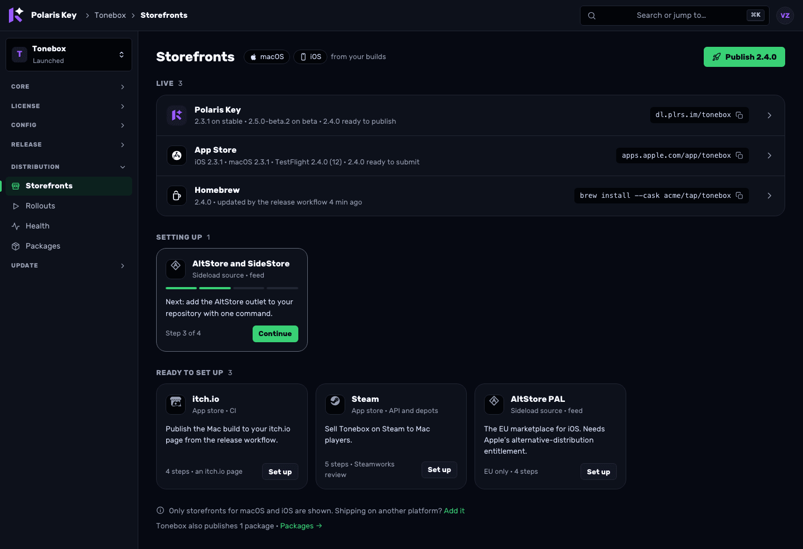

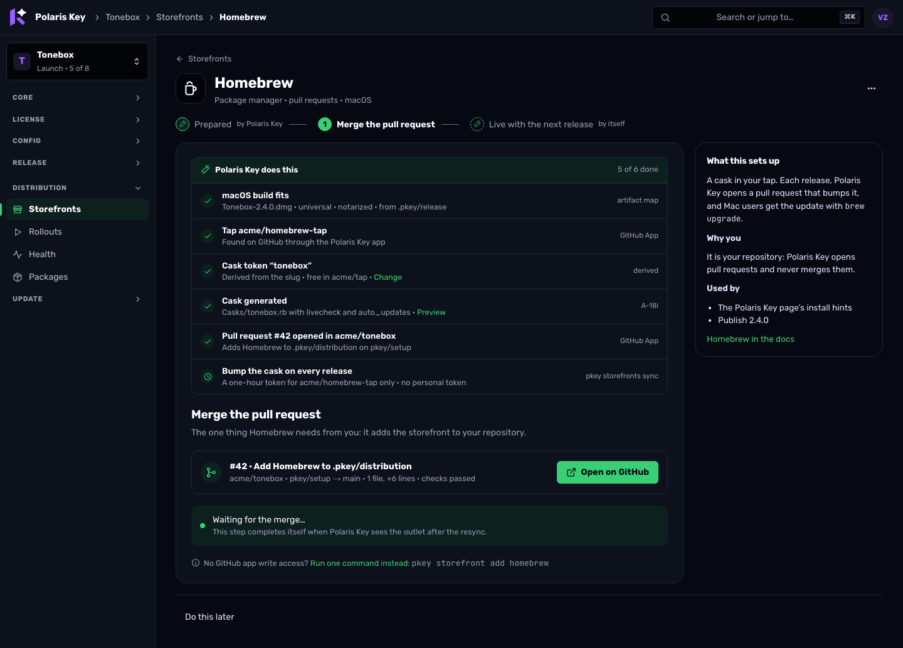

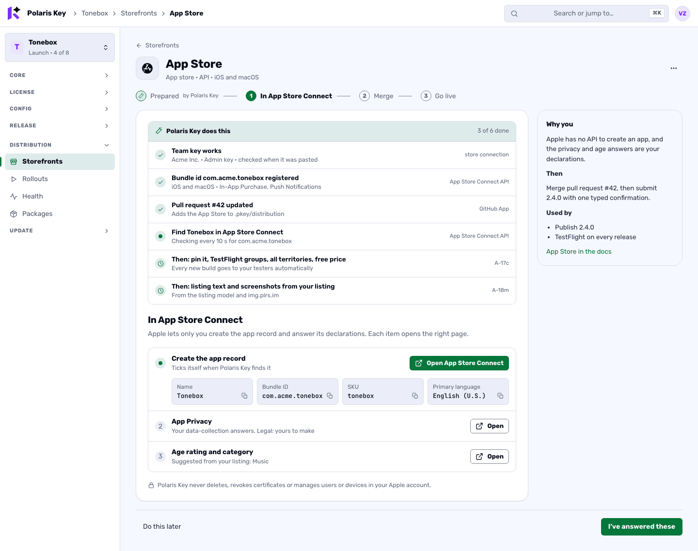

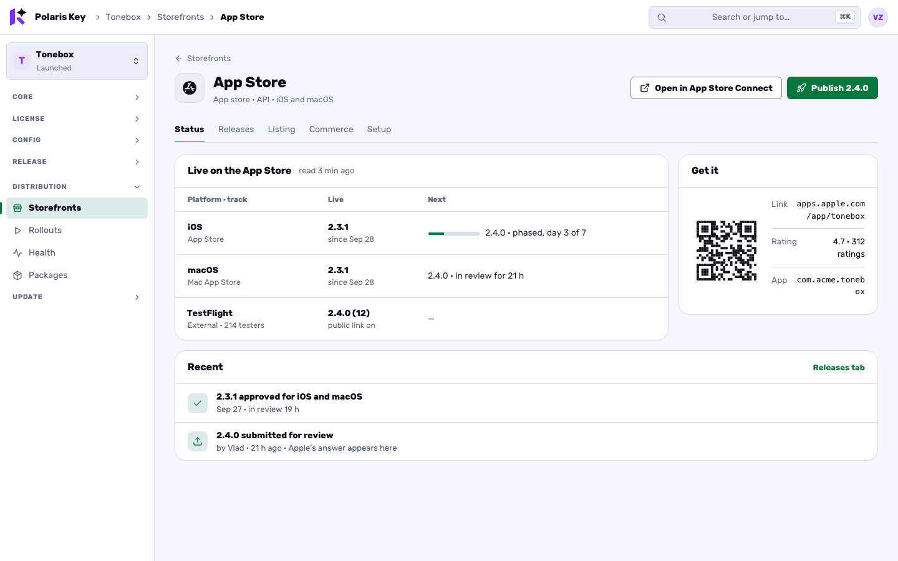

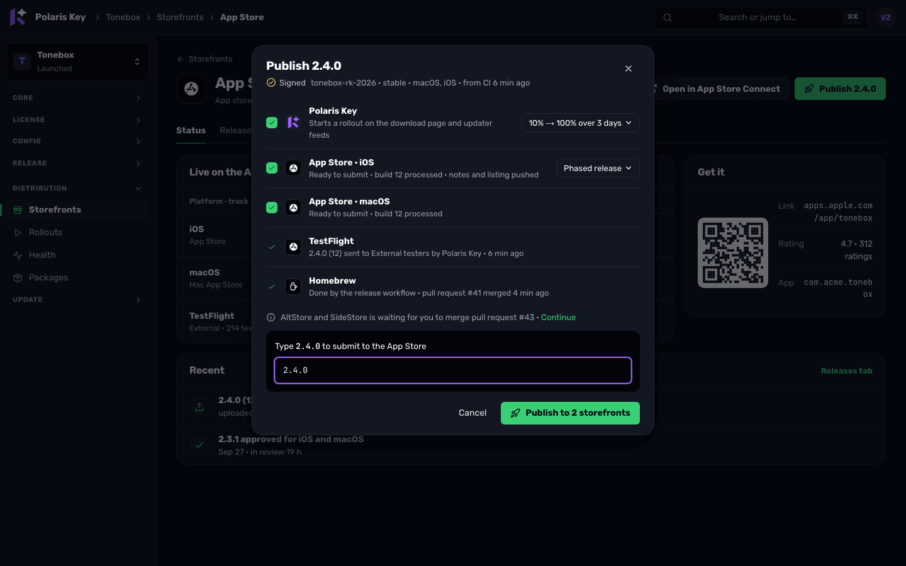

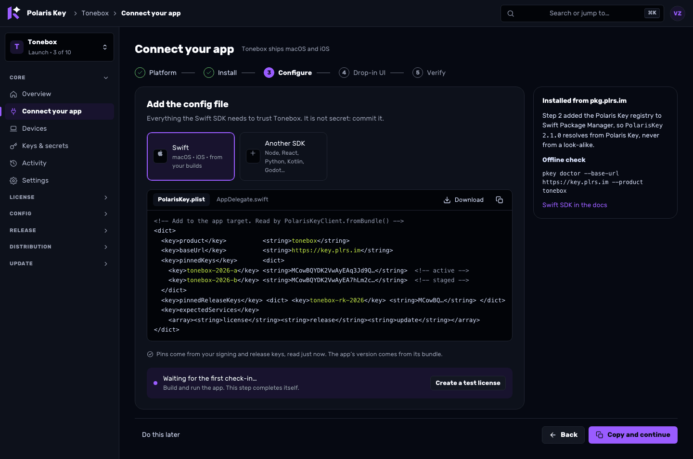

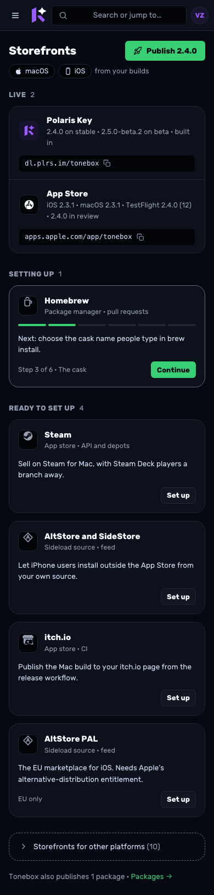
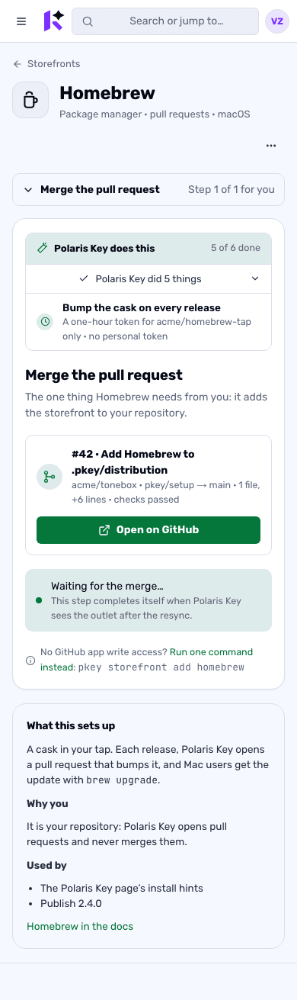
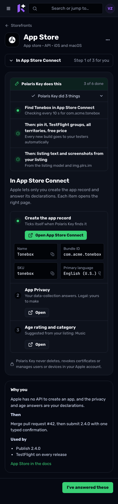
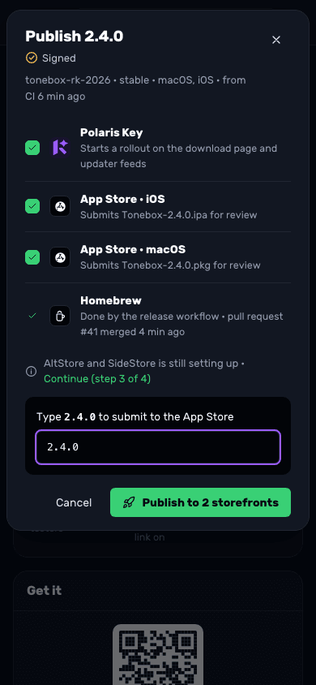
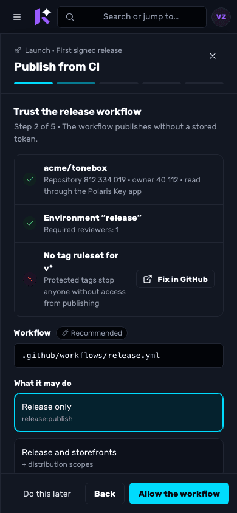

---

## 7. Worker and API needs

None of this is wire: no signed document, `shared-protocol`, `client-core`, corpus file or
`PROTOCOL_VERSION` changes. Each item names its drift gate (AGENTS.md rules 3, 4, 9 and 10, and
the data-model reference).

| #   | Need                                                                                                                                                                                                                                                                                                                                                                                                                                                                                                                                                                                                                                                                                                                                                                                                                                                                                   | Package             | Drift gates                                                                                                                                                                                                                                                                                                                                                                                              |
| --- | -------------------------------------------------------------------------------------------------------------------------------------------------------------------------------------------------------------------------------------------------------------------------------------------------------------------------------------------------------------------------------------------------------------------------------------------------------------------------------------------------------------------------------------------------------------------------------------------------------------------------------------------------------------------------------------------------------------------------------------------------------------------------------------------------------------------------------------------------------------------------------------- | ------------------- | -------------------------------------------------------------------------------------------------------------------------------------------------------------------------------------------------------------------------------------------------------------------------------------------------------------------------------------------------------------------------------------------------------- |
| W1  | **Resumable wizard state.** New Core table `setup_state (product, wizard, subject, cursor, choices_json, skips_json, assertions_json, requests_json, updated_by, updated_at)`, primary key `(product, wizard, subject)`; never secrets                                                                                                                                                                                                                                                                                                                                                                                                                                                                                                                                                                                                                                                 | UX-51               | Migration numbered at merge; `TABLE_OWNERS.core` in `packages/docs/scripts/gen-reference.mjs`; data-model regen (rule 3)                                                                                                                                                                                                                                                                                 |
| W2  | **Setup routes.** `GET /manage/api/products/<p>/setup` (UX-21's model, extended with each wizard's step states) and `PUT /manage/api/products/<p>/setup/<wizard>[/<subject>]` (cursor, choice, skip, undo, assert, request). Session, CSRF, `can()`; audit `setup.skip`, `setup.assert`, `setup.request`                                                                                                                                                                                                                                                                                                                                                                                                                                                                                                                                                                               | UX-51               | OpenAPI narrative entry and `routeCoverage` (rule 10)                                                                                                                                                                                                                                                                                                                                                    |
| W3  | **Catalogue declaration** (`CatalogueEntry`, §2.3) beside each adapter; feed-only, first-party and link entries; conformance rules                                                                                                                                                                                                                                                                                                                                                                                                                                                                                                                                                                                                                                                                                                                                                     | UX-52               | `test/storefront/conformance.test.ts`, `test/boundaries.test.ts` (no service imports in `core/storefront`)                                                                                                                                                                                                                                                                                               |
| W4  | **Storefronts read model**: A-18j's `GET …/distribution/storefronts` extended with `productPlatforms`, scope, state, fit, wizard steps and live summaries (§2.15); `PUT …/distribution/storefronts/platforms` until ST-05 aliases it                                                                                                                                                                                                                                                                                                                                                                                                                                                                                                                                                                                                                                                   | UX-53               | OpenAPI and `routeCoverage` (rule 10); ST-06's settings coverage once it exists                                                                                                                                                                                                                                                                                                                          |
| W5  | **`distribution.intendedPlatforms`** registry key (product scope, console-owned, not policy-bound, `allowUnset`)                                                                                                                                                                                                                                                                                                                                                                                                                                                                                                                                                                                                                                                                                                                                                                       | UX-53               | ST-03 registry types; ST-06 generated reference and ⌘K index when present                                                                                                                                                                                                                                                                                                                                |
| W6  | **Publish route**: `POST …/releases/<version>/publish` with `{ storefronts[], rollout?, phrase }`. Starts the Polaris Key rollout through the existing rollout code and fans out each store write through that store's gate, ledger and budget (`performStoreWrite`); one parent audit row `distribution.publish` with each store's row as a child. `confirm.ts` gains a batch phrase (the version) valid only for the storefronts named in that request                                                                                                                                                                                                                                                                                                                                                                                                                               | UX-58               | OpenAPI and `routeCoverage`; THREAT-MODEL note on the batch confirmation (security review before merge)                                                                                                                                                                                                                                                                                                  |
| W7  | **SDK sightings read** (D28): `GET …/sdk-sightings?after=&limit=` over W15's table, newest first                                                                                                                                                                                                                                                                                                                                                                                                                                                                                                                                                                                                                                                                                                                                                                                       | UX-61               | OpenAPI parameters (rule 10)                                                                                                                                                                                                                                                                                                                                                                             |
| W8  | **Release keys read**: `GET …/release/keys` (kid, public key, SHA-256 fingerprint, source); public halves only                                                                                                                                                                                                                                                                                                                                                                                                                                                                                                                                                                                                                                                                                                                                                                         | UX-61               | OpenAPI and `routeCoverage`                                                                                                                                                                                                                                                                                                                                                                              |
| W9  | **CI readiness read**: `GET …/release/ci-readiness` through the GitHub App installation: repository and owner ids, workflow file present, `release` environment, `v*` tag ruleset. A check whose App permission is not granted returns `unknown` with the permission named, shown as ○                                                                                                                                                                                                                                                                                                                                                                                                                                                                                                                                                                                                 | UX-62               | OpenAPI and `routeCoverage`; the GitHub App permission list in the deploy docs if Environments or Administration read is added (owner action)                                                                                                                                                                                                                                                            |
| W10 | **Shared generators** in `@polaris-key/manifest`: `renderSdkSetup` (UX-60), `renderOutletBlock` (UX-56), `renderCiWorkflow` (UX-62), beside `renderFeedSetup`                                                                                                                                                                                                                                                                                                                                                                                                                                                                                                                                                                                                                                                                                                                          | UX-56, UX-60, UX-62 | Goldens in `packages/shared-manifest/test/fixtures/`; `build/ci.md` regenerated from `renderCiWorkflow` (docs freshness, rule 3)                                                                                                                                                                                                                                                                         |
| W11 | **CLI one-command paths**: `pkey storefront add <id>` (edits `.pkey/distribution` preserving comments, validates with the manifest validator); `pkey storefronts sync --channel` (runs every declared CI and PR storefront's step, D27); `pkey sdk add <lang> --expect …` (D30); `pkey ci init`; `pkey release keys generate --write --gh-secret <env>`. CLI only: none of them is a Worker route                                                                                                                                                                                                                                                                                                                                                                                                                                                                                      | UX-56               | CLI reference docs regen (rule 3); a mutation-table entry for any new validator code (rule 9)                                                                                                                                                                                                                                                                                                            |
| W12 | **Platform readiness read**: `GET /manage/api/platform/readiness` over existing facts (keyring, deploy vars, cron ticks, email, store credentials, platform feeds)                                                                                                                                                                                                                                                                                                                                                                                                                                                                                                                                                                                                                                                                                                                     | UX-67               | OpenAPI and `routeCoverage`                                                                                                                                                                                                                                                                                                                                                                              |
| W13 | **Setup request attention kind** (`setup.request`, warning, for platform admins), read from W1's requests                                                                                                                                                                                                                                                                                                                                                                                                                                                                                                                                                                                                                                                                                                                                                                              | UX-51 with UX-12    | UX-12's attention tests                                                                                                                                                                                                                                                                                                                                                                                  |
| W14 | **Terminology**: "storefront" covers every channel; "the Polaris Key outlet (`direct`)" per PS-10                                                                                                                                                                                                                                                                                                                                                                                                                                                                                                                                                                                                                                                                                                                                                                                      | UX-54               | `start/concepts.md` glossary (rule 4); docsLinks for the renamed and new console pages                                                                                                                                                                                                                                                                                                                   |
| W15 | **SDK sightings** (D28): a Core table `sdk_sightings (product, sdk_name, sdk_version, platform, arch, first_seen, last_seen)`, primary key on the first five, written from the public request path whenever the SDK headers are present (discovery, sync, config, update check, activation). At most one write per key per 5 minutes (an isolate-local cache, then an upsert that only moves `last_seen`), off the response path (`waitUntil`). No IP, no device id, no license: nothing a customer could be identified by. Retention: rows unseen for 90 days are pruned by the existing cron                                                                                                                                                                                                                                                                                         | UX-61               | Migration numbered at merge; `TABLE_OWNERS.core`; data-model regen (rule 3); the THREAT-MODEL's data inventory gains the table                                                                                                                                                                                                                                                                           |
| W16 | **Setup runner** (D33 to D36): `services/distribution/storefronts/runner.ts` performs a catalogue entry's `auto` actions in order for a product and storefront after the consenting Set up (`POST …/distribution/storefronts/<id>/setup`), and again when a fact it waits on changes (a credential saved, a resync, a release arriving, through the existing hooks and cron). Every store write goes through `performStoreWrite` (gate, ledger, budget) attributed to the operator who clicked Set up; release arrival prepares each production submission (D35) and fills the testing tracks (D36). It never passes `typedConfirmation`. Its row states are W4's `auto` list                                                                                                                                                                                                          | UX-68               | OpenAPI and `routeCoverage` (rule 10); `test/boundaries.test.ts` (it lives in Distribution, not Core); a new conformance assertion that no runner path sets `typedConfirmation` and that every `auto` op is a declared non-typed `api` op; audit `distribution.setup.<action>` in the audit-actions reference (rule 3)                                                                                   |
| W17 | **GitHub write path** (D37 to D39): `core/github/write.ts` mints an installation token per request, narrowed to the one repository and the one permission the action needs, and may only: create or update the `pkey/setup` branch and its single pull request (Contents, Pull requests, and Workflows when the workflow file is included), create a repository or generate one from a template in an organisation (Administration), create the `release` environment (Environments) and a `v*` tag ruleset (Administration). An allow-list in the style of `ci.ts`, with a never-list (merge, close, delete, force-push, any branch but `pkey/*`, the default branch, collaborators, settings beyond those listed) that a test enforces. Admin routes `POST …/setup/pull-request`, `POST …/github/repositories`, `POST …/release/ci-readiness/fix`                                    | UX-70               | OpenAPI and `routeCoverage`; the allow-list test; THREAT-MODEL entry (a new write path into customer repositories); the App permission list in DEPLOYMENT.md (owner action, D38)                                                                                                                                                                                                                         |
| W18 | **Installation-token exchange for CI** (D40): `POST /<p>/distribution/pr/github-token` for a `pkeyci_` token with the new scope `distribution:pr` (added to `core/ciVocabulary.ts`, Worker-internal). Returns a GitHub installation token limited to the tap or bucket repository the outlet declares, with Contents and Pull requests write, for at most one hour; refused for any repository the outlet does not name and for winget (`microsoft/winget-pkgs`). Audited per issue. A-18i's `prRun.ts` uses it when `PKEY_PR_TOKEN` is absent                                                                                                                                                                                                                                                                                                                                         | UX-71               | OpenAPI and `routeCoverage`; the CI scope docs; THREAT-MODEL entry and a **security review before merge** (the Worker hands GitHub write tokens to CI). The response type stays in the Worker and the CLI; if review finds it must enter `shared-protocol`, the package stops for plan mode                                                                                                              |
| W19 | **CI secrets through the App** (D41): `PUT …/distribution/storefronts/<id>/ci-secrets/<name>` checks the value (W20), encrypts it in memory to the repository's or environment's Actions public key (libsodium sealed box, a pure-JS dependency that runs in workerd) and writes it with Secrets write. The value is never written to D1, KV, R2 or logs and never echoed; the audit row names only the secret and environment                                                                                                                                                                                                                                                                                                                                                                                                                                                         | UX-70               | OpenAPI and `routeCoverage`; a reach test in the style of `outletCredentialReach.test.ts` that the plaintext reaches no storage binding; `test:workerd` (the crypto dependency)                                                                                                                                                                                                                          |
| W20 | **Live credential check** (D42): `POST /manage/api/platform/store-connections/<store>/check` and `POST …/distribution/storefronts/<id>/ci-secrets/<name>/check` take the unsaved value and run the vendor's read with a transient credential: the adapter's `connect` and `listApps` for App Store Connect, Play and Partner Center, the Steam publisher key read, itch.io's profile read, snapcraft's account read, GitHub's `/user` and repository permission for winget's token. Nothing is sealed or stored; the answer is what was found or the vendor's reason. Rate-limited per operator. There is no outbound allow-list in the Worker: each check calls fixed per-check origin constants (api.itch.io, dashboard.snapcraft.io, api.github.com beside the stores' existing hosts), re-checked before every request and listed in THREAT-MODEL.md ("The live credential check") | UX-69               | `routeCoverage` (both are `/manage/api` console routes, narrative-only under `adminApi`, so no OpenAPI entry: corrected on UX-69's branch); `outletCredentialReach.test.ts` (the transient path stays inside credential custody); `rateLimit` tests                                                                                                                                                      |
| W21 | **Repository platform detection** (D45): at link and resync, through the App's existing Contents read, the Worker reads a short fixed list of files (Godot `export_presets.cfg`; an Xcode project's `project.pbxproj` platforms; Gradle files for `com.android.application`; `src-tauri/tauri.conf.json`; `package.json` Electron Builder targets) and records platforms with source `detected`. No new route: W4 serves them                                                                                                                                                                                                                                                                                                                                                                                                                                                          | UX-53               | **Storefronts read model**: productPlatforms (builds, explicit `direct.platforms`, **detected from the repository** (W21, D45), planned; never `outletPlatformsOf`'s kind default, with a test that a bare `direct` outlet widens nothing), scope, state machine with implied storefronts, fit, human-step states and the `auto` list, live summaries on A-18j's route; `distribution.intendedPlatforms` |

**Not needed:** no new outlet kind, no change to `OUTLET_PLATFORMS`, no new credential type, no
WebSocket or push channel (polling with `since=` reads, §1.7), and no direct repository writes:
the only writes into a customer's repository are Polaris Key's own `pkey/setup` branch and pull
request (D37, W17). **Still no wire change after the automation pass**: W16 to W21 are Worker
routes, a Worker-internal CI scope, CLI behaviour and console UI; none touches a signed document,
`shared-protocol`, `client-core`, the corpus or `PROTOCOL_VERSION`. Any package that finds
otherwise stops and goes through plan mode (CLAUDE.md).

---

## 8. Implementation plan

### 8.1 Gates (every package)

EXPERIENCE.md §13.2 applies unchanged: the full green gate from AGENTS.md, layout lint at zero,
CSP e2e and `adminCspParity`, docsLinks for new or renamed pages, the route drift gates for new
routes, and the data-model drift for UX-51's table. In addition, every wizard package adds **e2e
fixtures for each state** of its wizard (not started, mid-way, waiting, done, and for storefronts
the out-of-scope deep link) to the layout and CSP suites, and screenshots them at 1440 and 390 in
both themes. Since the automation pass the fixtures also cover each `AutoList` row state (will
do, doing, done, needs a permission, failed with its fallback step), and the step counts the
console shows are asserted against the catalogue entry's `human` list. None of these packages is wire; if one turns out to be, it stops and goes through plan
mode (CLAUDE.md).

### 8.2 Work packages: Wave 5, setup wizards

Sizes: S ≤ 1 day, M 2–3 days, L ~1 week, XL > 1 week. "Integration" means `integ/ux-1a-ha` (UX-10,
UX-20, UX-22, UX-31, UX-34, HA-01, HA-04) and `integ/ux-0` (Wave 0); "merged" means merged to `main`.

| Id    | Package                                                                                                                                                                                                                                                                                                                                                                                                                                                                                                                                                                                                                              | Size | Files                                                                                                                                                                                                                                                                               | Deps (in flight in **bold**)                                                                                                                                     |
| ----- | ------------------------------------------------------------------------------------------------------------------------------------------------------------------------------------------------------------------------------------------------------------------------------------------------------------------------------------------------------------------------------------------------------------------------------------------------------------------------------------------------------------------------------------------------------------------------------------------------------------------------------------ | ---- | ----------------------------------------------------------------------------------------------------------------------------------------------------------------------------------------------------------------------------------------------------------------------------------- | ---------------------------------------------------------------------------------------------------------------------------------------------------------------- |
| UX-50 | **Wizard kit**: `Wizard` (page and drawer hosts, URL sync, unsaved guard), `Stepper` (human steps numbered, automated work as unnumbered ✦ markers, D33), `PrereqList`, `SnippetStep`, `RepoChangeStep` (Merge pull request mode and One command mode), `DeepLinkStep`, `WaitingFor` (backoff, timeout, live region), `AutoList` (Polaris Key does this: plan, live, failed-row fallback), `SecretField` (paste, live check, saved-to-GitHub state), `SetupRow`, `useSetupState`; a minimal `Celebration` if UX-35 has not landed                                                                                                    | L    | new `packages/admin/src/ui/wizard/*`, `ui/index.ts`, unit tests, layout fixtures                                                                                                                                                                                                    | **UX-10** (integration)                                                                                                                                          |
| UX-51 | **Setup state**: `setup_state` table, `GET/PUT …/setup[/<wizard>[/<subject>]]`, choices, skips, assertions, requests, **the Set up consent** (who, when, and the plan shown, D34), audit; extends UX-21's `setup` model with per-wizard human-step states; the `setup.request` attention kind when UX-12 exists                                                                                                                                                                                                                                                                                                                      | M    | migration, new `worker/src/core/setupState.ts`, a new admin handler, `docs/scripts/gen-reference.mjs`, OpenAPI                                                                                                                                                                      | none to start; UX-21 reads it; UX-12 for W13                                                                                                                     |
| UX-52 | **Storefront catalogue declaration**: `CatalogueEntry` on every adapter, with the automation pass's `auto` actions and `human` steps (§2.3); feed-only (`altstore`, `altstore-pal`, `fdroid`, `obtainium`, `app-installer`), link (`web`) entries; conformance rules, including that no `auto` action is a typed operation (D34)                                                                                                                                                                                                                                                                                                     | M    | `worker/src/core/storefront/{adapter,catalogue}.ts`, `stores/*.ts`, `test/storefront/conformance.test.ts`                                                                                                                                                                           | **A-18j** (shares the registry index); A-18i, A-18g and PS-01 add their entries in their own line                                                                |
| UX-53 | **Storefronts read model**: productPlatforms (builds, explicit `direct.platforms`, planned; never `outletPlatformsOf`'s kind default, with a test that a bare `direct` outlet widens nothing), scope, state machine with implied storefronts, fit, wizard steps, live summaries on A-18j's route; `distribution.intendedPlatforms`                                                                                                                                                                                                                                                                                                   | L    | `worker/src/services/distribution/storefronts/{plan,admin}.ts`, new `scope.ts`, `fit.ts`, `state.ts`, OpenAPI, settings registry entry                                                                                                                                              | UX-52, **A-18j**; ST-03 for the registry key (bespoke PUT until ST-05)                                                                                           |
| UX-54 | **Catalogue page and storefront page shell**: the catalogue (§2.7), "What do you ship?", the storefront route with state-driven content and tabs, Connections view, Distribution nav to four items, `LEGACY_REDIRECTS`, glossary and ADMIN.md amendments                                                                                                                                                                                                                                                                                                                                                                             | L    | `console/areas/storefronts/{CataloguePage,StorefrontPage,StoreTile,ScopeChips}.tsx`, `console/{nav,routes}.ts`, `data/queries.ts`, `pages/distribution.tsx`, docs `start/concepts.md`                                                                                               | UX-50, UX-53, **A-18j**, **UX-31** (Rollouts owns the Matrix redirect)                                                                                           |
| UX-55 | **Storefront wizard steps**, human only (D33): **Connect** (`SecretField` with the live check, inline team connect for platform admins, "Ask a platform admin", the product-key editor via ST-12), **In the vendor console** (one deep-link checklist with copy cards, verifiers and assertions), **Merge** (`RepoChangeStep`; One command until the App may write), **Go live** (typed confirm or the ✦ wait); the `AutoList` from UX-68 with the Set up consent and failed-row fallbacks; an **Add screenshots** step only when a slot has no source (D43); implied storefronts (Scoop); Store connections "Set up" opens the page | XL   | `console/areas/storefronts/wizard/*`, `pages/platformStores.tsx`                                                                                                                                                                                                                    | UX-54, UX-51, UX-56, **UX-68**, UX-69; UX-70 optional (the Merge step degrades to One command); ST-12 (product credentials; degrades to the team key without it) |
| UX-56 | **Outlet block generator, `pkey storefront add` and `pkey storefronts sync`**: `renderOutletBlock(entry, identity)` in `@polaris-key/manifest` with goldens, used by the CLI **and** by UX-70's setup pull request; the CLI command editing `.pkey/distribution` with comments preserved; the sync command that runs A-18i's `storefront <id> pr` (with UX-71's App token when `PKEY_PR_TOKEN` is absent), `butler push` and `snapcraft upload` for every declared storefront (D27)                                                                                                                                                  | M    | `packages/shared-manifest/src/outletBlock.ts`, goldens, `packages/cli/src/storefronts/add.ts`, CLI docs                                                                                                                                                                             | UX-52 (entry ids)                                                                                                                                                |
| UX-57 | **Storefront status pages**: Status (per platform and track, rollout, install link, command or QR, store rating), Releases (the store's matrix column), Listing, Commerce (App Store IAP moved in; Play when bound), Setup (checklist, connection, Technical with identity as fields); a CSP-safe QR renderer                                                                                                                                                                                                                                                                                                                        | L    | `console/areas/storefronts/status/*`, moves `areas/distribution/{AppStorePage,CommercePage}.tsx`, new `ui/QrCode.tsx`                                                                                                                                                               | UX-54, **UX-31**, A-18m (Push listing for Apple)                                                                                                                 |
| UX-58 | **Publish everywhere**: the dialog (§2.11) with prepared submissions ("Ready to submit · build 12 processed", D35) and done rows for CI, PR, feed storefronts and testing tracks (D36); the publish route with batch confirmation (W6); entry points on the release Status tab, catalogue, storefront pages, palette and the first-release celebration; Matrix "Start rollout…", App Store "Distribute" and "Submit and release" open it pre-filtered                                                                                                                                                                                | L    | new `console/areas/storefronts/PublishDialog.tsx`, `console/pages/release/ReleaseRecord.tsx`, Worker `services/distribution/publish.ts`, `core/storefront/confirm.ts`, OpenAPI, THREAT-MODEL                                                                                        | UX-57, UX-08 (integ/ux-0), **A-18j**, UX-68 (prepared rows; without it the dialog prepares on open); security review                                             |
| UX-59 | **SDK quick-start correctness, now**: the `pkg.plrs.im` registry line above every install; React, Python and Kotlin tabs; a valid Godot `.tres`; `import PolarisKey` in Swift; an app-version placeholder; active plus staged pins; ProductNew's "release tooling" sentence; palette entries for SDK, trust pins and install                                                                                                                                                                                                                                                                                                         | S    | `console/pages/core/Overview.tsx`, `console/pages/global/ProductNew.tsx`, `console/shell/CommandPalette.tsx` (or UX-06a's `shell/palette/`), tests                                                                                                                                  | none (main has r2); rebase over **UX-20** if it merges first                                                                                                     |
| UX-60 | **Shared SDK setup generator**: `renderSdkSetup(lang, ctx)` with goldens for node, react, python, swift, kotlin, godot and the elements; per-SDK parse checks in each SDK's CI; delete `Overview.tsx` `snippet()` and the CLI's `sdkSnippet()`; `pkey trust`, `pkey sdk --lang` and `pkey sdk add` (with `--expect` pin verification, D30) call it (SP-02 revised)                                                                                                                                                                                                                                                                   | M    | `packages/shared-manifest/src/sdkSetup.ts`, goldens, `packages/cli/src/manifest.ts`, SDK CI workflows                                                                                                                                                                               | **F-10** (install versions); SP-02 amended                                                                                                                       |
| UX-61 | **Connect your app**: the page and nav item, palette, the two steps (Your app only when two SDKs fit, D45), the Pull request tab when the App may write (config file, and the dependency for Node, React and Python), SDK sightings (W15, W7) and the automatically created test license, the release keys read (W8) and Keys & secrets section, Overview's compact panel (C15), Devices' empty state                                                                                                                                                                                                                                | L    | new `console/pages/core/Connect.tsx`, `console/{nav,routes}.ts`, `pages/core/{Overview,Devices,Keys}.tsx`, Worker devices handler, new release-keys handler, OpenAPI                                                                                                                | UX-50, UX-51, UX-60; ST-08 (web-origins editor; the step links Settings until then); UX-70 optional (the Pull request tab)                                       |
| UX-62 | **Publish from CI**: the drawer with two steps for you (Run `pkey ci init`, Push your first tag) under an `AutoList`: App installation and `.pkey/release` checks, the `release` environment and `v*` ruleset created through UX-70 (○ with Fix in GitHub without the permission), the trusted-publisher policy created with the recommended scope (Change is a link), the workflow in the setup pull request; CI readiness (W9) with server-resolved ids; `renderCiWorkflow` shared with `build/ci.md` ending in `pkey storefronts sync`; `pkey ci init`; Use another CI with the token issued                                      | L    | `console/areas/release/PublishFromCi/*`, `pages/core/KeysCi.tsx`, Worker `services/release/ciReadiness.ts`, `packages/shared-manifest/src/ciWorkflow.ts`, `packages/docs/.../build/ci.md`                                                                                           | **UX-23**, UX-50, UX-61 (release keys read); UX-70 optional (environment, ruleset, workflow pull request)                                                        |
| UX-63 | **License and Config quick starts**, human steps only: Confirm Free and Pro (editable, with profiles), Who gets which tier (ST-12's editor, only with sign-in on); the test license comes from Connect your app; Catalog: `.pkey/schema` imported at the resync when present, else Template or Add first key, then Publish catalog v1 (creates Default); "New…" in the Tier and Profile comboboxes                                                                                                                                                                                                                                   | L    | `console/pages/license/{LicensesPage,TiersPage,CreateLicenseDialog}.tsx`, new `areas/license/QuickStart.tsx`, `pages/config/{CatalogPage,CatalogEditorPage}.tsx`, new `areas/config/QuickStart.tsx`                                                                                 | UX-50, **UX-34**; ST-12 for the auto-issue step (skipped until it lands)                                                                                         |
| UX-64 | **Update feed and Access**: Update feed collapsed until a release, endpoints scoped by platform; Access recommendation with its reason                                                                                                                                                                                                                                                                                                                                                                                                                                                                                               | M    | `console/areas/update/FeedPage.tsx`, `areas/distribution/AccessPage.tsx` (or the hub row after ST-08)                                                                                                                                                                               | UX-50, UX-53 (productPlatforms)                                                                                                                                  |
| UX-65 | **Customer sign-in wizard**: Polaris Key sign-in, portal defaults and the default tier applied and labelled (D22, D32); your own OIDC issuer (live discovery, the secret written to Keys & secrets, group → tier mapping with preview) only on Change; the test sign-in                                                                                                                                                                                                                                                                                                                                                              | M    | new `console/areas/identity/SignInSetup/*`, hub Identity area                                                                                                                                                                                                                       | UX-50, ST-12, ST-14                                                                                                                                              |
| UX-66 | **Empty-state and service-off sweep**: §4.7's target state for every page; "What you'll set up" previews; Core stays open on service-off pages; snippets with resync waits replace YAML-only empty states                                                                                                                                                                                                                                                                                                                                                                                                                            | L    | `ui/EmptyState.tsx` (service-off preview slot), every page in §4.7 without its own package, `shell/Sidebar.tsx`                                                                                                                                                                     | UX-50, UX-10, UX-09                                                                                                                                              |
| UX-67 | **Platform ready**: the readiness read (W12) and the checklist on Home and Platform → Settings                                                                                                                                                                                                                                                                                                                                                                                                                                                                                                                                       | M    | new `console/pages/global/PlatformReady.tsx`, `pages/global/Home.tsx`, Worker platform handler, OpenAPI                                                                                                                                                                             | UX-50, UX-30, ST-09                                                                                                                                              |
| UX-68 | **Setup runner** (W16): performs each storefront's `auto` actions after the Set up consent and on every fact change; release-arrival preparation of production submissions (D35); testing tracks on every release (D36); the `auto` list's states for W4; the no-typed-confirmation conformance assertion; audit `distribution.setup.*`                                                                                                                                                                                                                                                                                              | L    | new `worker/src/services/distribution/storefronts/runner.ts`, `…/storefronts/admin.ts` (the setup route), hooks into resync and release arrival, OpenAPI, `test/storefront/runner.test.ts`                                                                                          | UX-51, UX-52, UX-53, **A-18j** (Play and Microsoft routes; the Apple path runs on A-17's routes without it); A-18m and HA-02 widen what it pushes when they land |
| UX-69 | **Live credential check** (W20): the transient check for App Store Connect, Play, Partner Center and Steam keys in Platform → Store connections and the storefront Connect step, and for CI secrets; the connect form checks on paste and saves only after a pass                                                                                                                                                                                                                                                                                                                                                                    | M    | `worker/src/core/outletCredentials.ts` (transient path), `services/distribution/connectors/{asc,play,msstore}/platform.ts`, `services/distribution/commerce/steam.ts`, admin handlers, `admin/src/console/pages/platformStores.tsx` (no OpenAPI: console routes are narrative-only) | none: A-16's connectors are on `main`. **Can start today**                                                                                                       |
| UX-70 | **GitHub write path** (W17, W19): installation tokens narrowed per action, the standing `pkey/setup` pull request (outlet blocks via UX-56's `renderOutletBlock`, the workflow via UX-62's `renderCiWorkflow`), repository creation and template generation in organisations, the `release` environment and `v*` ruleset, CI secrets by sealed box; the allow-list and never-list test; the permission-aware fallbacks the console renders                                                                                                                                                                                           | L    | new `worker/src/core/github/write.ts`, `core/github/allow.ts`, admin handlers, OpenAPI, THREAT-MODEL, DEPLOYMENT.md (App permissions)                                                                                                                                               | **Owner action**: the App's optional permissions (D38); UX-51, UX-56; security review                                                                            |
| UX-71 | **CI installation-token exchange** (W18): `distribution:pr` scope, the token route limited to the declared tap or bucket, the CLI's `prRun.ts` using it when `PKEY_PR_TOKEN` is absent, docs for the scope; Flathub's checker path documented as the default for updates                                                                                                                                                                                                                                                                                                                                                             | M    | `worker/src/core/ciVocabulary.ts`, new `services/distribution/pr/githubToken.ts`, `packages/cli/src/storefronts/prRun.ts`, OpenAPI, THREAT-MODEL, CLI docs                                                                                                                          | UX-70 (token minting), A-18i (done); security review                                                                                                             |

### 8.3 Amendments to existing packages and specs

| Package or spec                  | Amendment                                                                                                                                                                                                                                                                                                                                                                                                                                               |
| -------------------------------- | ------------------------------------------------------------------------------------------------------------------------------------------------------------------------------------------------------------------------------------------------------------------------------------------------------------------------------------------------------------------------------------------------------------------------------------------------------- |
| **UX-21** (launch path)          | Goals and platforms first screen (§5.1); Connect your app and Presentation steps; "Get on storefronts" replaces "Add to storefronts" and opens the catalogue; reads UX-51's step states; D21 everywhere                                                                                                                                                                                                                                                 |
| **UX-32**                        | **Superseded** (§2.14). Its inline app pick moves to UX-55; App Store and Commerce tabs to UX-57; nav to UX-54; the launch-path entry to UX-21                                                                                                                                                                                                                                                                                                          |
| **UX-23**                        | Unchanged scope; its panel's primary opens UX-62's drawer when UX-62 lands                                                                                                                                                                                                                                                                                                                                                                              |
| **UX-33**                        | Builds the package-feed setup on UX-50's kit (§4.2's Package feed row)                                                                                                                                                                                                                                                                                                                                                                                  |
| **UX-09**                        | Adds: hide Steam's Store connections card until A-18g; Microsoft "Last check failed" shows the error with Re-check; "This feed has no settings yet." on Platform → Package feeds                                                                                                                                                                                                                                                                        |
| **A-18j**                        | Merges as built (D11); no change to its brief. UX-52 to UX-58 build on its routes                                                                                                                                                                                                                                                                                                                                                                       |
| **A-18i, A-18g, PS-01**          | Each registers its `CatalogueEntry` fields (§2.3) beside its adapter: Homebrew with `identityKey: "homebrewCask"` and macOS only, Scoop as implied with its bucket as an upgrade (D5, D26). A-18i's per-store `storefront <id> pr` commands become what `pkey storefronts sync` runs (D27); its docs gain the one-step workflow                                                                                                                         |
| **PS-06**                        | Builds the Polaris Key storefront page (§2.10) in UX-54's shell instead of a separate panel; depends on UX-54                                                                                                                                                                                                                                                                                                                                           |
| **PS-10**                        | Unchanged; UX-54's labels use its table                                                                                                                                                                                                                                                                                                                                                                                                                 |
| **HA-06**                        | The Presentation page is the launch path's Presentation step and is reused by the storefront Listing steps; adds the "Used by" list                                                                                                                                                                                                                                                                                                                     |
| **ST-08**                        | Its web-origins editor is embedded in Connect your app's Configure step for web targets                                                                                                                                                                                                                                                                                                                                                                 |
| **ST-12**                        | Its product store-credential editors render inside the storefront Connect step and Setup tab; its auto-issue editor renders inside the Licensing quick start                                                                                                                                                                                                                                                                                            |
| **SP-02**                        | `pkey sdk --lang <…> [--write] [--out]` and `pkey sdk add <lang>` on `renderSdkSetup`; pins from a CI token, the console's downloaded file, or public key documents accepted only against the `--expect <kid>@sha256:<fp>` values the console prints (D30)                                                                                                                                                                                              |
| **UI-KITS.md §4.2**              | `publishableKey` / `pk_live_…` removed; web kits take the generated config module; elements take `product` and `config` (D18)                                                                                                                                                                                                                                                                                                                           |
| **S-15 §8.1**                    | Platform-admin requirement narrowed to team-credential writes (D12)                                                                                                                                                                                                                                                                                                                                                                                     |
| **EXPERIENCE.md §0.4 S5**        | Superseded by §2 of this document                                                                                                                                                                                                                                                                                                                                                                                                                       |
| **A-18i** (automation pass)      | `prRun.ts` takes UX-71's one-hour App token when `PKEY_PR_TOKEN` is absent, so Homebrew and a Scoop bucket need no personal token (D40); `PKEY_PR_TOKEN` stays for winget. Flathub updates default to Flathub's own checker reading `/flathub/<ch>.json`; the PR generator stays for manifests the checker cannot update. The `homebrew.new-tap` and `scoop.new-bucket` deep links remain as the fallback when the App cannot create repositories (D39) |
| **A-18j**                        | Its routes for Play's and Microsoft's write runtimes are now on the automation's critical path (D43, UX-68): until they land, those listing, image, track and price rows render as the deep links they replace. No change to its brief                                                                                                                                                                                                                  |
| **A-18m**                        | When it lands, the setup runner pushes Apple's description, keywords, URLs and screenshots from the listing model and hosted assets; until then those are rows in the In App Store Connect checklist. No change to its brief                                                                                                                                                                                                                            |
| **A-18g**                        | Steam's catalogue entry declares the beta-branch action (D36) and its human steps (Connect, In Steamworks, Merge, Go live)                                                                                                                                                                                                                                                                                                                              |
| **S-15 §4.4**                    | "Each bootstrap is a person's" narrowed to the bootstraps that need one: the first winget and Flathub submissions. Creating a tap or bucket repository is automated where the App may (D39)                                                                                                                                                                                                                                                             |
| **ST-18**                        | Its out-of-scope "GitHub-App PR variant (needs `contents: write`)" is delivered for setup changes by UX-70's `pkey/setup` pull request; ST-18's promote-to-repo patch can reuse W17 when it lands                                                                                                                                                                                                                                                       |
| **DEPLOYMENT.md** (owner action) | The GitHub App gains optional permissions: Contents write, Pull requests write, Workflows write, Secrets write, Environments write, Administration write (D38). Each installation approves them on GitHub; the console works without them                                                                                                                                                                                                               |
| **HA-02, HA-06**                 | Hosted assets feed the runner's listing pushes and Flathub's MetaInfo; until they land, A-18d's CI-derived assets are used and a missing slot is an Add screenshots step                                                                                                                                                                                                                                                                                |
| **UX-33**                        | The package-feed drawer becomes an `AutoList` with no human steps (D48)                                                                                                                                                                                                                                                                                                                                                                                 |

### 8.4 Out of scope, and what would need plan mode

- **Widening `OUTLET_PLATFORMS`** (itch.io Android and HTML5) or **a new outlet kind** (Epic):
  wire changes, plan mode, contract → catalog → corpus → SDKs. Not proposed.
- **Writing to a product's repository** (the "Open a pull request" tab of every Repo change step): ST-18's
  promote-to-repo decision, not this document's.
- **Automatic production submission** (D31, D35): a per-storefront "submit new stable releases
  automatically" would remove S-15 §6.4's typed confirmation for API stores. It needs its own
  security decision (who may arm it, how it is audited, how a bad build is stopped) before any
  console work. The automation pass prepares everything up to the typed click and fills testing
  tracks without one, and stops there.
- **What no automation can reach**: creating an Apple, Play or Partner Center app record (no API),
  vendor accounts, agreements, tax, banking, payment and identity verification, legal declarations,
  access grants inside a vendor account, and opening a pull request to `microsoft/winget-pkgs` or
  `flathub/flathub` without the developer's own identity (D32, D46). These are permanent human
  steps, not backlog.
- **Implied sideload feeds** (D47): serving AltStore, F-Droid, Obtainium or App Installer feeds
  for an undeclared outlet would change feed selection; not proposed.
- **Per-product roles**: ST-22. This document only fixes how the wizards behave when `useCan`
  says no (§1.11).

### 8.5 Sequencing

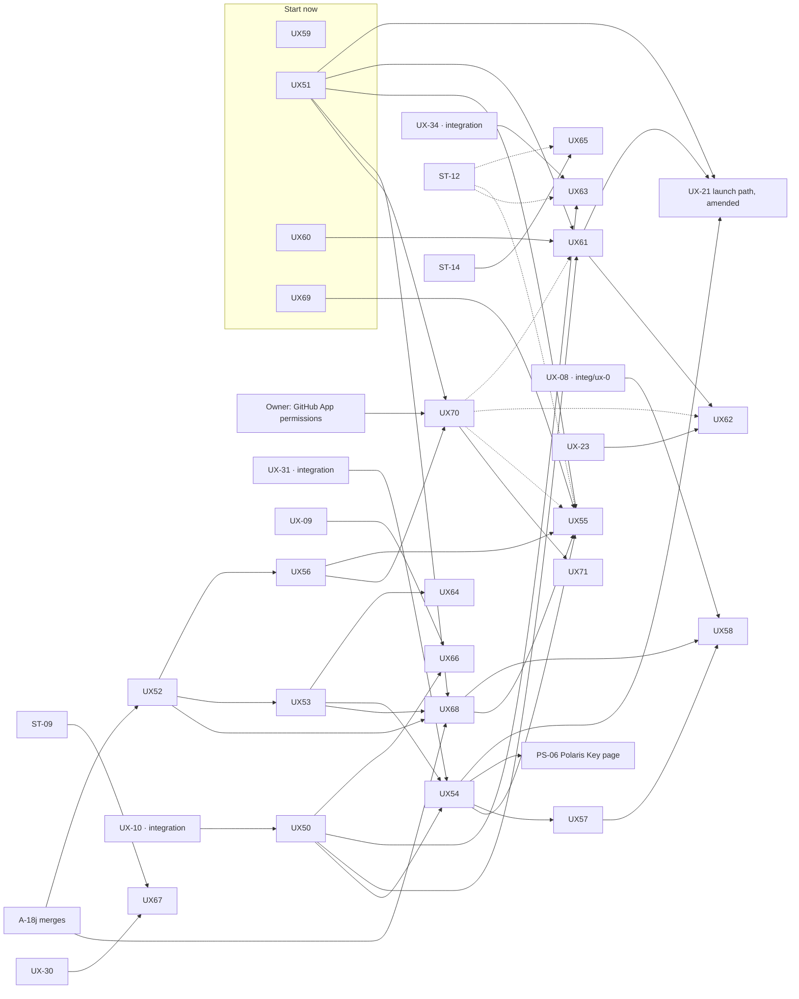

- **Start today, in parallel:** UX-59 (a security fix: the install line), UX-51 (Worker only, a new
  table and handler), UX-69 (the live credential check, on A-16's shipped connectors), and UX-60 (a new module in `@polaris-key/manifest`; it deletes the old
  generators only at its end, after UX-59 has landed on `Overview.tsx`).
- **After the integration branches merge** (UX-10, UX-31, UX-34 are in `integ/ux-1a-ha`): UX-50,
  then the console packages. UX-50 is the only package that touches `ui/` broadly; page packages
  run in parallel after it.
- **After A-18j merges:** UX-52 → UX-53 → UX-54 → UX-55 and UX-57 → UX-58. UX-52 also waits for
  nothing else: A-18i, A-18g and PS-01 add their entries whenever they land.
- **UX-21 takes UX-51, UX-54 and UX-61** as inputs; it can ship first with links to whichever of
  them exist, as EXPERIENCE §13.4 already allows for UX-23.
- **The automation packages:** UX-68 follows UX-52 and UX-53 and needs A-18j only for Play and
  Microsoft; UX-70 waits on the owner's App permission change and then unblocks the Merge path in
  UX-55, UX-61 and UX-62, which all ship first with One command; UX-71 follows UX-70. UX-70 and
  UX-71 each carry a security review.
- Only one package at a time edits `console/nav.ts` and `routes.ts` (UX-54, then UX-61); UX-62 and
  UX-63 edit pages only.
