# Polaris Key sign-in: the canonical experience

**Status:** canonical, 2026-10-05. It records the owner's decisions and the lead's delegated
choices (§7). **Scope:** every way a person signs in to Polaris Key, or to an app through Polaris
Key. That covers the hosted login card (portal and console), the Worker's no-JS pages, the sign-in
emails, and the sign-in screens of every UI kit. **Mockups:** [sign-in/](sign-in/) (18 frames ×
desktop and phone × dark and light, rendered by `sign-in/render.cjs`).

> **This document is the single source of truth for sign-in.** [PORTAL.md](PORTAL.md) §3.3–§3.4
> and §4.1–§4.11, §4.18–§4.19, §4.23–§4.25 and §4.29; [EXPERIENCE.md](EXPERIENCE.md) §0.6 P1, §8 and
> §11.1; [ADMIN.md](ADMIN.md) §2.7 (Sign in row), T8 (Session expired) and §6.10.1; and
> [UI-KITS.md](UI-KITS.md) §4.3 (Welcome and Activate, SignIn and SignInHandoff, DeviceLimit) point
> here. **Where they differ from this document, this document wins.** Measures, colours and type
> stay [BRAND.md](BRAND.md)'s and EXPERIENCE.md §8's. The approved plans in
> `docs/research/2026-09-29-godot-omniplatform/program/plans/` stay the wire authority. Where this
> document needs a wire change that no approved plan carries, §6 flags it and the drift list (§8)
> names the owner.

**Owner request (verbatim, 2026-10-05):** "Let's ensure all our UX systems are aligned on what this
will all look like as we're making several UX changes around the login flow."

**Naming.** The product is **Polaris Key**, never "Polaris Key Portal", "the portal" or "PK" in UI
copy or email. UI copy uses **license** (US spelling; glossary, AGENTS.md rule 4), so the owner's
"Choose a licence for this device" ships as **"Choose a license for this device"** (§7 D-01).
Banned UI words: claim, redeem, merge, OIDC, deauthorize, activation (for an entry), portal.

## Contents

- [0. Owner decisions (binding)](#0-owner-decisions-binding)
- [1. Principles](#1-principles)
- [2. The model: contexts, flows and bindings](#2-the-model-contexts-flows-and-bindings)
- [3. The step model](#3-the-step-model)
- [4. Storyboards](#4-storyboards)
- [5. The cross-surface matrix and copy keys](#5-the-cross-surface-matrix-and-copy-keys)
- [6. Wire and state contract per step](#6-wire-and-state-contract-per-step)
- [7. Decisions](#7-decisions)
- [8. Drift: what must change to match](#8-drift-what-must-change-to-match)
- [9. Mockups](#9-mockups)

---

## 0. Owner decisions (binding)

| #    | Decision                                                                                                                                                                                                                                                                                                                                                                                                                                                                                       | Where it lands                |
| ---- | ---------------------------------------------------------------------------------------------------------------------------------------------------------------------------------------------------------------------------------------------------------------------------------------------------------------------------------------------------------------------------------------------------------------------------------------------------------------------------------------------- | ----------------------------- |
| O-1  | **License choice at sign-in.** "It should probably ask the user to confirm using one of the available license slots and then authenticating. If a license doesn't exist, it will generate one. If license(s) do exist, the user will choose which and associate the installation with that license." A **Choose a license for this device** step follows authentication. It shows even for one license (a one-tap confirm). The rank-first rule only preselects. Full licenses show, disabled. | §3.6 LicenseChoiceStep        |
| O-2  | **Replace device in the card.** "Can we free a device from within the modal? Something like 'Replace device'." A full license offers an inline **Replace a device**: the device list with the least recent preselected, one confirm that names the device, and this installation bound into the freed seat. It follows the same rules, limits and audit as the portal's remove-device action. The portal page is the fallback.                                                                 | §3.7 ReplaceDevice            |
| O-3  | **No silent second auto-issued license.** An account that holds licenses for the product, all full, never gets a new one behind its back.                                                                                                                                                                                                                                                                                                                                                      | §3.6 rules 3–4                |
| O-4  | **One Polaris Key account** across every product. **Identity** is a per-product service around passthrough sign-in.                                                                                                                                                                                                                                                                                                                                                                            | §2, §4.12                     |
| O-5  | **One login card** shared by the portal and the console. The console is identifier-first (EXPERIENCE §8).                                                                                                                                                                                                                                                                                                                                                                                      | §3.1, §3.12                   |
| O-6  | **Logo-only provider row**: Apple, Google, Steam, in that order, one equal-width row. No Discord.                                                                                                                                                                                                                                                                                                                                                                                              | §3.2                          |
| O-7  | A persistent **"<App> wants you to sign in"** header on every step of an app's sign-in.                                                                                                                                                                                                                                                                                                                                                                                                        | §3.1                          |
| O-8  | A **provider-verified email needs no code**; otherwise the **email gate** asks for a code. **Profile import** (name, picture). **Sign-in methods connect and disconnect any time.**                                                                                                                                                                                                                                                                                                            | §3.5, §4.6                    |
| O-9  | The **license-key flow** is a bounded on-ramp: key-entry limits, then an account and the portal.                                                                                                                                                                                                                                                                                                                                                                                               | §3.9, §4.5                    |
| O-10 | **UI kits look like Polaris Key by default, with the product as the hero**, in three layers: drop-in, styled components and headless.                                                                                                                                                                                                                                                                                                                                                          | §5 (UI-KITS.md §1.2–1.3 hold) |

## 1. Principles

1. **Authenticate once, then decide what this installation runs on.** Sign-in proves who the
   person is. Binding an installation to a license is a separate choice the person makes. It is
   never a silent side effect (O-1, O-3).
2. **One card, one step, one primary.** Every browser step renders inside the same `AuthCard`
   (EXPERIENCE §8 measures). Each step has exactly one primary button. The header and footer persist
   across the steps of one flow.
3. **Credentials are entered only in Polaris Key's card or the platform's own sheet.** An app never
   hosts an email code, a passkey or a provider password. Kits render natively only what carries no
   credential: the method chooser, the device-code hand-off, license choice after a native sign-in,
   key entry and the device limit.
4. **Same names, same strings, everywhere.** A step has one component name and one set of copy keys
   (§5.2) across the web card, the Worker pages and every kit.
5. **No enumeration, no dead ends.** Unknown and known emails get the same response. Every refusal
   names the next step. A failure never shows an HTTP status or an internal code.

## 2. The model: contexts, flows and bindings

### 2.1 Sign-in contexts

| Context                        | Entry                                                                                     | Header (§3.1)                                      | After authentication                                          |
| ------------------------------ | ----------------------------------------------------------------------------------------- | -------------------------------------------------- | ------------------------------------------------------------- |
| **Portal direct**              | `/signin`, or any signed-out portal URL                                                   | none                                               | The page the person asked for (`returnTo`), else the Library  |
| **Product context**            | A developer's "Manage your license" link: `/signin?product=<slug>`                        | Product context: "**Nightfall** · Lanternworks"    | The product page                                              |
| **Passthrough: web redirect**  | `GET /<p>/identity/authorize` (I-08), Identity on                                         | App request: globe and the registered origin       | LicenseChoiceStep → (consent) → 302 back to the web app       |
| **Passthrough: native**        | I-15 native redirect (system browser sheet), Identity on                                  | App request: device glyph, "on <device label>"     | LicenseChoiceStep → (consent) → ReturnStep                    |
| **Passthrough: device code**   | `key.plrs.im/device` or `/tv` with the user code, or the QR (`verification_uri_complete`) | App request: TV or device glyph and the code panel | LicenseChoiceStep → (consent) → Device done                   |
| **Kit native sign-in**         | I-13 exchange (native Apple or Google token, Game Center), I-14 Steam ticket              | none (in-app screen, product as hero)              | Native LicenseChoice when a choice is due (§3.6), else silent |
| **Console**                    | `/manage/login`                                                                           | none; brand row "Polaris Key │ Console"            | The console page (`returnTo`)                                 |
| **Device approval (new side)** | "Sign in with another device" on the card                                                 | none                                               | Where the flow was going                                      |

**Identity off** (PX-W17): a browser navigation to any app sign-in entry of an Identity-off
product gets a 303 to `/signin?product=<slug>&error=identity_disabled` and the friendly card
(§4.12). JSON and device callers keep `404 not_found`.

### 2.2 What a sign-in flow carries

One server-held flow record per sign-in (I-07's flow, PX-W13's request handle for passthrough). It
holds the context, `returnTo`, the app request handle and binder cookie (`__Host-pk_req`), the
device label and user code, the email-gate state (G31), and, after LicenseChoiceStep, the **chosen
binding** (§6.3). Display data never comes from a query parameter (PX-W13 §2.2).

### 2.3 Bindings: what "associate the installation" means

An installation is a `devices` row (`X-PKey-Device`). Signing in through Identity sets
`devices.subject`. That makes the account the device's entitlement holder (S-19 decision 4). It also
binds the device to one **anchor** license (`bound_by = 'signin'`). LicenseChoiceStep is where that
anchor is chosen. Nothing else binds a signed-in device:

- key entry binds to the entered license (`bound_by = 'key'`, D24 unchanged);
- attach adds the device's license to the account and never re-anchors (I-09 Q2);
- sign-out releases a sign-in-bound seat (I-09 §2.2, I-04 Q3).

## 3. The step model

### 3.1 The card

`ui/auth/AuthCard` (UX-40 promotes the built `LoginCard`). The measures are EXPERIENCE §8's: a
28.5 rem card, radius 22 px, elevation 3, 48–52 px controls, a 24 px h1, top-aligned at 10 vh on the
static star field, and edge to edge under a 56 px lockup row on phones. Help · Privacy · Terms sit
below the card. **No "Polaris Key · key.plrs.im" line.**

| Slot      | Content                                                                                                                                                                                                                                                                                                                                                                                                                                                                                                  |
| --------- | -------------------------------------------------------------------------------------------------------------------------------------------------------------------------------------------------------------------------------------------------------------------------------------------------------------------------------------------------------------------------------------------------------------------------------------------------------------------------------------------------------- |
| Brand row | The compact lockup with no bit; the console adds "│ Console"                                                                                                                                                                                                                                                                                                                                                                                                                                             |
| Header    | **App request** (passthrough only): app icon, "**<App>** wants you to sign in", then "<Developer> · <where>". Where is a globe and the registered origin (web), a device glyph and "on <device label>" (native), or a TV/device glyph, the label and the **code panel** "Code on the screen · `WDJB-MJHT` · Check it matches the screen" (device code). **Product context** (developer link, identity_disabled): icon, "**<Product>** · <Developer>", "Your license, downloads and devices". Never both. |
| Body      | One step                                                                                                                                                                                                                                                                                                                                                                                                                                                                                                 |
| Footer    | Passthrough only: lock glyph, "Polaris Key signs you in for <App>. <Developer> never sees your codes or passkeys."                                                                                                                                                                                                                                                                                                                                                                                       |

Branding is data only: name, icon, developer, origin and device label, from the client record
(PX-W13 §2.2), checked against reserved names (warn first, then enforce). A failing name renders the
neutral frame (`nameVerified: false`).

### 3.2 Step catalogue

| Step                 | Shown when                                                                                              | Surfaces (§5.1)             | Frame              |
| -------------------- | ------------------------------------------------------------------------------------------------------- | --------------------------- | ------------------ |
| `MethodsStep`        | First step of every browser sign-in                                                                     | Card; kit `SignIn` (native) | 01, 02, 16         |
| `HintStep`           | After Continue, when this browser's `pk_last_method` cookie matches the typed address                   | Card                        | PORTAL 03          |
| `CodeStep`           | After an email: one email with a 6-digit code and a link                                                | Card, email, Worker         | 03                 |
| `RegisterStep`       | New account after a verified email code                                                                 | Card                        | PORTAL 11          |
| `EmailGateStep`      | First provider sign-in of an account (Apple, Google, Steam, Game Center, Play Games)                    | Card                        | 04                 |
| `LicenseChoiceStep`  | An app sign-in that will bind this installation, on a product with the License service (§3.6)           | Card; kit (native, §5.1)    | 05, 07, 08, 09, 18 |
| `ReplaceDevice`      | Inside LicenseChoiceStep, on a full license (§3.7)                                                      | Card; kit                   | 06                 |
| `ConsentStep`        | First sign-in to an app, and whenever its claims or services change (PX-W13 Q5)                         | Card                        | 07 (merged)        |
| `KeyStep`            | "Have a license key?", "Use a license key instead", or no license and the product accepts keys          | Card; kit `Activate`        | 10                 |
| `ReturnStep`         | Native passthrough done; device-code done                                                               | Card                        | 11, 12             |
| `DeviceApproval`     | "Sign in with another device" (the new side) and Account → Approve a new device (the approver)          | Card; portal dialog         | 17                 |
| `ConsoleMethodsStep` | Console sign-in, sign-out and session expiry                                                            | Console card, Worker twin   | 13, 14             |
| Worker pages         | Expired or used code or link; link opened on another device; device-code entry without JS; admin errors | Worker (`renderAuthCard()`) | 15                 |

**Order inside one flow:** Methods → (Hint) → Code or provider → (Register | EmailGate) →
LicenseChoice (with Replace device) → (Consent) → Return. KeyStep can come before authentication
(the on-ramp, §3.9) or in place of LicenseChoice when the account holds no license. **When Consent
and LicenseChoice are both due they render as one frame** (frame 07): the consent h1, the license
list under "License for this device", then "<App> will also get". One primary: **Continue to <App>**.

### 3.3 MethodsStep

**Layout (portal direct):** h1 "Sign in to Polaris Key" (no lede). **Email**
(`autocomplete="username webauthn"`, conditional passkey UI) and **Continue**. Then "or" and the
provider row, then **Sign in with a passkey** (ghost). Under a rule sit two quiet links: **Have a
license key?** and **Sign in with another device**.

**Passthrough and product context:** h1 "Sign in", lede "Use the email you bought <Product> with."
The device-code variant has h1 "Sign in to finish on <device label>", lede "Use your phone or
computer here. <device label> continues by itself when you're done.", and "Didn't start this
yourself? Cancel it. Someone may be trying to use your account." It has no "Sign in with another
device" link.

**Provider row** (O-6): one row of equal-width, logo-only buttons, 52 px tall with 24 px marks, in
the order Apple, Google, Steam. Accessible names are "Continue with Apple/Google/Steam" (repeated as
a tooltip), in `role="group"` "Or continue with". One button keeps half-row width, centred.
Providers follow where the product ships: Apple for Apple-platform products with any social sign-in,
Google for Android and as a general option, Steam for Steam products. Without product context the row
shows all three. Steam is always the web OpenID login, so "You don't need the Steam app" holds. Game
Center and Play Games are never buttons on the web.

| State         | Copy                                                                                                                        |
| ------------- | --------------------------------------------------------------------------------------------------------------------------- |
| Email invalid | "Enter a full email address, like name@example.com." (inline, `aria-invalid`)                                               |
| Sending       | Continue busy                                                                                                               |
| Rate-limited  | "Too many codes. Try again in {minutes} minutes."                                                                           |
| Email down    | "We can't send email right now. Try another way to sign in."                                                                |
| No method     | Product: "Sign-in is turned off for <Product>. Contact <Developer>." No context: "Sign-in is unavailable. Try again later." |
| Network       | "Can't reach Polaris Key" with **Try again**, never the signed-out card                                                     |
| Loading       | Card skeleton; no "Getting the ways you can sign in…" line                                                                  |

### 3.4 CodeStep (and HintStep, RegisterStep)

**HintStep** (PORTAL §4.3, unchanged): identity chip (no picture before authentication), "Welcome
back, Mara", a hint card "You usually sign in with Steam" with that method as the labelled primary,
**Email me a code**, **Use a passkey** and **Other ways to sign in**. The hint comes only from the
first-party `pk_last_method` cookie. Apple stays one tap away for iOS products.

**CodeStep:** h1 "Check your email". Lede "We sent a code and a sign-in link to **{email}**. Both work
for 10 minutes." Six cells (`one-time-code`, paste fills them, submits on the sixth). "Or open the link
in the email. Keep this tab open." **Continue** enables at six digits. Below: "Send a new code" (a
countdown first, "Send a new code in 0:42") and **Use a different email**.
The tab signs in by itself when the link is opened in the same browser: it re-checks on focus and
`visibilitychange`, every 5 s for 10 minutes, and on a `BroadcastChannel` the link page posts to.

| State          | Copy                                                                                              |
| -------------- | ------------------------------------------------------------------------------------------------- |
| Wrong code     | "That code isn't right. Check the email and try again." With two or fewer left: "{n} tries left." |
| Too many tries | "Too many tries. Send a new code." (after 5 wrong, I-07)                                          |
| Expired        | "That code has expired. Send a new code."                                                         |
| Resent         | "We sent a new code and link to {email}."                                                         |

**Email** (I-07 template, UX-44): subject "Your Polaris Key code: {code}". The code comes first and
large, then "Or sign in with the button. The code and the link work once, for 10 minutes.", the
button **Sign in**, "If the button does not work, paste this link into your browser:", and the footer
"If you did not ask to sign in, you can ignore this email. Nothing changes until the link is used."
The email has a centred lockup with no bit. **Link opened on another device** (Worker page): "Confirm
sign-in, requested at {time} from {place}", with "The device that asked signs in, not this one." and
**Confirm**, then "Sign-in confirmed. Go back to the device where you started. It signs in by
itself."

**RegisterStep** (new account after an email code): "Create your account". A success line reads
"{email} is verified". **Your name** has the help "Shown to you and in emails. Developers see it only
when you continue to their app." Then the opt-in "Add a passkey after this, so next time is one tap",
**Create account and continue**, and the terms line naming Polaris Key's terms (and the developer's
in passthrough).

### 3.5 EmailGateStep (first provider sign-in) and profile import

PORTAL §4.29 stands, with these rules made explicit (O-8):

- **Required, once per account.** No skip path. **Cancel sign-in** abandons the sign-in. No token,
  session or binding is issued before the gate passes.
- **Layout:** the "Signed in with <Provider> · <identity> · Done" strip; h1 "Confirm your email";
  lede (in an app: "One step before <App>. We send sign-in codes, receipts and security notices
  here."); **ProfileImport**; the email radio cards; Terms when the product requires them; the
  primary; the Polaris Key terms line.
- **Fast path:** a provider-verified address needs **no code**. That means Google with
  `email_verified: true`, or any Apple address, private relay included. The primary is **Continue**
  (in passthrough, **Continue to <App>**).
- **Code path:** a typed or unverified address shows six cells, and the primary is **Verify and
  continue**.
- **Steam** has no email. The field starts empty, with the help "Steam doesn't share an email. Add
  one so you can get back in without Steam." The primary is **Send code** (frame 04).
- **Email already in another account** (known only after proof): **Join into one account** (PORTAL
  §4.11, proof of both in this session, 72 h undo) or **Use a different email**. Never joined
  silently, never by email match.
- **ProfileImport:** Google gives name and picture. Apple gives the name on first consent only, and
  no picture ("Apple doesn't share a picture. Add one"). Steam gives persona and avatar. Game Center
  gives an alias. Imported values follow their source until the person chooses. Explicit choices
  stick. Pictures are copied, re-encoded and served from the same origin (G33).
- **After the gate**, a first platform sign-in shows the **Add another way to sign in** nudge (PORTAL
  §4.10) once. It shows again after 30 days only if the account still has a single method. In
  passthrough the nudge waits until the next portal visit; it never stands between a person and the
  app.

### 3.6 LicenseChoiceStep

**Entry condition.** An app sign-in (passthrough or kit native) on a product with the License
service on, whose completion will **bind or re-bind this installation**: `devices.subject` is not
already this account with a usable anchor. It shows on **every** such sign-in, even with one license.
It is skipped only for silent re-authentication of an installation that is already bound to this
account on a usable license (token refresh, an I-13 exchange after the grant exists, a device-code
re-poll). Portal direct and console sign-ins never show it: no installation is involved.

**Layout (frame 05):** the person row (avatar, name, email, **Not you?** which signs out of this flow
and returns to MethodsStep), then h1 "Choose a license for this device", lede "<Product> will use it
on <device label>." (web: "…in this browser."). Then a radio group of license cards:

- **Name**: product and tier ("Tidewater Studio Pro"). **Meta**: "{term} · on {used} of {limit}
  devices". A neutral seat meter (text label for assistive tech) sits under the meta.
- **Tags** (one at most): **On this device** (the device's current license), **New** (the license
  auto-issue will create), **Just added** (from KeyStep in this flow), **Full**.
- **Full licenses** are listed but **disabled**: the radio is not selectable, the meter is
  `warning`, and the card has **Replace a device** (§3.7).
- **Ended or unusable licenses** sit behind a disclosure "{n} ended licenses". Each has its
  reason ("Ended 3 Sep 2026", "Refunded", "Doesn't include this version", "Not for this platform").
  They are never selectable.

Then the primary **Continue to <App>** and the quiet link **Use a license key instead**. When at
least one full license exists, the link **Manage devices in Polaris Key** is added.

**Rules.**

1. **Candidates** are the account's `base` licenses for this product (S-19). Add-ons and seat packs
   are not listed. Under `entitlementModel: combined` the line "Your other <Product> items still
   apply" replaces PX-W13's `more: n`.
2. **Preselection**, first match wins: (a) the device's current usable license ("On this device");
   (b) a license added by key in this flow ("Just added"); (c) the first **available** license in
   **rank-first** order (`tiers.rank` desc, no expiry first, latest `expires_at`, earliest
   `activated_at`, `id`); (d) the **New** row. Rank-first only preselects (O-1). It never binds by
   itself.
3. **No license at all, and the product auto-issues** (frame 08): the step shows one **New** row
   ("Saltwind Free · Free · this will be device 1 of 2"), preselected, with the lede "You don't have
   a <Product> license yet. <Developer> gives you this one." It is issued only when the person
   presses Continue. The new license is shown, never silent.
4. **Licenses exist but every one is full** (frame 09): no New row (O-3). A `warning` notice says
   "Your licenses are on all their devices. Replace a device to use one here." Continue is disabled
   until a Replace completes. A New row appears only when the account holds **no usable** license
   for the product (everything absent, ended or refunded) and auto-issue allows it.
5. **No license, no auto-issue, the product accepts keys:** the step is **KeyStep** ("Add <Product>
   to your account", §3.9). Its confirm binds directly.
6. **No license, no auto-issue, no keys:** h1 "No <Product> license in this account". Body "Get
   <Product> from <Developer>, or sign in with the account you bought it with." Actions: **Use another
   account** (primary), "Bought it with another email? Link an existing account", and **Cancel**,
   which returns `not_entitled` to the app.
7. **The device already runs on a license** (key-entered, or an anonymous enrolled license): that
   license is listed first with **On this device** and preselected. If it is not yet in the account,
   its meta reads "Not in your account yet" and choosing it **attaches** it (I-09 attach: refusals
   `license_owned` and `license_email_bound` show inline under the card). If it belongs to another
   account it reads "In another Polaris Key account" and choosing it keeps the device on it without
   attaching (S-19 decision 4). Choosing a different license is an explicit activation, so the device
   re-anchors (`reanchor: onActivation`, audited and seat-checked). This supersedes I-09 Q1 and the
   device-side "Is this you? / Also attach this device's license" confirm (Godot P1-07) for
   Identity-on products.
8. **One license:** the same step with one card preselected: a one-tap confirm (O-1).
9. **Changing it later:** until LX-21's "Run this device on", the person changes a device's license
   by signing out on the device and signing in again.

| State                      | Copy                                                                                                                    |
| -------------------------- | ----------------------------------------------------------------------------------------------------------------------- |
| Loading                    | Card skeleton with the person row                                                                                       |
| Seat taken since load      | "That seat was just taken. Choose again." (list refreshes)                                                              |
| Attach refused (owned)     | "This <Product> license is already in another Polaris Key account. A license never moves by its key."                   |
| Attach refused (email)     | "<Product> was bought with {masked}. It joins only the account with that email verified." **Add and verify that email** |
| Portal off for the product | Full cards say "<Developer> manages this license elsewhere." and offer no Replace                                       |
| Network                    | "Can't reach Polaris Key" with **Try again**                                                                            |

### 3.7 ReplaceDevice

Inline on a full license card (frame 06), opened by **Replace a device**. The card expands in place
(focus moves to its heading "Replace a device"). While it is open, its confirm is the step's one
primary and the page's Continue is hidden.

- **The list:** the license's authorized, non-dormant devices, least recently used first and
  preselected with a **Least recent** tag. Each row has a form-factor glyph, the device label, and
  "<platform> · last used <when>". This device is never in the list.
- **Consequence:** "<Product> signs out on <device>. You can add it back later. We'll email <email>
  to confirm."
- **One confirm that names the device:** **Replace <device>** (primary) and **Keep my devices**.
  There is no second dialog. This is an L1 inline confirm (EXPERIENCE §7), and the person has just
  authenticated (a session younger than 5 minutes), so no step-up is needed.
- **Effect:** in one transaction the server removes the chosen device's seat (the portal
  remove-device action: account ownership, `portal_enabled`, the `portalDeviceDisconnect` rate
  bucket, audit `portal.device.disconnect` with `via: "signin"`, the device-removed notice email),
  then binds this installation into the freed seat with `bound_by = 'signin'`. The flow then
  continues as if Continue had been pressed.
- **Not offered** when the product's customer portal is off ("<Developer> manages this license
  elsewhere.") or the license is not held by the account. **Manage devices in Polaris Key** opens
  `#/p/<slug>/free-device?license=<id>` (FreeDevicePage) in a new tab as the fallback.
- **Failures:** "That device was already removed." (list refreshes); "Too many changes. Wait a
  minute, then try again."; "That seat was just taken. Choose again."

**Device vocabulary** (D-08): **Replace <device>** wherever the action also puts this device in
the seat (this step, the kit `DeviceLimit`). **Remove <device>** wherever it only frees a seat (the
portal product page, FreeDevicePage). **Free up a device** is the label of the link from an app to
the portal (PX-W8). The console keeps "Deauthorize".

### 3.8 ConsentStep

PORTAL §4.8 Confirm, with the license item driven by the choice:

- Person row, h1 "Continue to <App> as <first name>?". When LicenseChoiceStep is due in the same
  flow, the license list renders here under "License for this device" (frame 07). Otherwise it
  stands alone and lists only what the app gets.
- "<App> will also get": **Cloud Sync** (only when the product has it on, with what it syncs), and
  **Your profile and email**. The pairwise line: "It gets its own id for you, and won't see your other
  products or how you sign in."
- **Continue to <App>** and **Cancel**.
- Shown on the first sign-in to each app and whenever its claims or services change (PX-W13 Q5). A
  license-only change never re-asks consent, but LicenseChoiceStep still shows by its own rule.

### 3.9 KeyStep

One component, three entries.

| Entry                                                 | Before or after authentication | Ends with                                                                                                                                                                                                |
| ----------------------------------------------------- | ------------------------------ | -------------------------------------------------------------------------------------------------------------------------------------------------------------------------------------------------------- |
| **Have a license key?** on MethodsStep (the on-ramp)  | Before                         | The upgrade body (PORTAL §4.6, frame 10), then sign-in or account creation. The key's license is then preselected **Just added** in LicenseChoiceStep (passthrough) or claimed into the Library (portal) |
| **Use a license key instead** on LicenseChoiceStep    | After                          | The PX-17 confirm with the primary **Add and use on this device**. It binds directly                                                                                                                     |
| No license and the product accepts keys (§3.6 rule 5) | After                          | h1 "Add <Product> to your account", then the same confirm                                                                                                                                                |

- **KeyField** (PORTAL §4.17): mono, paste-first, never rewritten, validated against
  `^pkey_([a-z0-9-]+)_([A-Za-z0-9_-]{22})$`. "Key for <Product>" shows from the slug alone. Tier and
  terms come from the server preview after Continue (G22, or the signed-out PX-W9 preview), never
  before.
- **Verdicts** (UX-05): "That isn't a Polaris Key license key. Ours start with pkey\_." (plus the
  Steam line for the 5×3 Steam shape); "This key is cut short. After <slug>\_ come 22 characters, and
  this has {n}. Copy the whole key again."; "We couldn't find that key. Capital letters matter, and
  l, 1, O and 0 are easy to mix up, so paste the key instead of typing it."
- **`license_owned`:** "This <Product> license is already in another Polaris Key account. A license
  never moves by its key." Actions: **Sign in to that account** (primary in app contexts; the
  `signInUrl` flow) and **Use a different key**. Signed in on the portal, the notice "If that
  account is yours too, sign in to it and join the two." and **Link an existing account** are added.
- **Entries (on-ramp, Identity-on products):** the key card ("Key works"), h1 "Keep <Product> in an
  account", the segmented meter with "{left} of {limit} key entries left · This will be entry
  {n}", email with **Create account**, the product's providers, and "Already have an account? Sign
  in". **Skip for now** appears only when an app sent the person (it returns to the app with the key
  accepted); the standalone portal has no skip. At the limit: "No entries left", "Create an account
  to keep <Product>", the `danger` notice, no skip, "Sign in to add <Product>", and "<Product> keeps
  working on the devices it's already on. Only typing the key again needs an account."
- **`key_entry_limit` deep link** (`manageUrl` = `/activate?product=<slug>`, the key only in a
  `#key=` fragment): the notice "This key has no entries left in <Product>. Add it to your account
  and <Product> signs you in instead." It is a `warning`; **Add** stays enabled.
- **Identity off:** nothing is counted, there is no meter, and the account is offered, never forced:
  "Keep <Product> in an account" with **Not now**.

### 3.10 ReturnStep

| Variant                                         | Copy and actions                                                                                                                                                                         |
| ----------------------------------------------- | ---------------------------------------------------------------------------------------------------------------------------------------------------------------------------------------- |
| Native passthrough, license added or issued now | Success mark; h1 "<Product> is yours"; product row "{tier} · in your library"; **Return to <App>**; "Returning by itself in 3 s · **Stay here**" (frame 11). One celebration per account |
| Native passthrough, otherwise                   | h1 "You're signed in to <App>"; **Return to <App>**; the same timer; "You can close this tab. **Open your library**"                                                                     |
| Web redirect                                    | No ReturnStep: Continue is the 302 back to the web app                                                                                                                                   |
| Device code                                     | h1 "<App> is signed in on <device label>"; "Look at <device label>: it continues by itself."; person row with the method used; **Sign the TV out** (secondary) (frame 12). No timer      |

The timer pauses while focus is inside the card. **Stay here** stops it (WCAG 2.2.1). Under reduced
motion the burst is a static check. The Library rings the new product with "Added just now" for 24 h.

### 3.11 DeviceApproval (Sign in with another device)

Two different flows have two names (D-18):

- **Sign in with another device** (portal card, PX-W14 and PX-15): this browser shows a QR and an
  8-character code from the RFC 8628 consonant alphabet (`KRQP-BMXD`), which "Works for 4:52". A
  signed-in device approves it (frame 17). "Waiting for you to approve it on the other device…"
  polls. The approver sees "Approve a new device? · Code KRQP-BMXD asks to sign in to your account",
  the device, coarse location and time, the `warning` "Only approve if you started this yourself, on a
  device in front of you. Nobody from Polaris Key or a developer will ever ask you for this.", then
  **Deny** and **Approve and sign it in**. **Step-up** when the countries differ or either is unknown:
  "Confirm it's you" with **Use your passkey** or an email code. **Outcomes** for the new side:
  approved (signs in and continues); denied ("That request was denied. Use another way to sign in.");
  expired ("That code expired. Get a new code."). Approver outcomes: "Approved. <device> is signed in."
  / "Denied. Nothing changed."
- **Sign in on your phone or computer** (kits, TV): the device-code flow (§4.2). The kit shows the
  code and the person signs in on a browser.

### 3.12 ConsoleMethodsStep

EXPERIENCE §8 stands (frame 13): brand row "Polaris Key │ Console", h1 "Sign in to the console", the
identifier-first email (a known operator is a chip, "vlad@zaharia.dev · Change"), **Continue**, the
fine print "Next: Pocket ID at {issuer host}", then "or" and **Sign in with a passkey**. There is no
provider row and no license key. PKCE starts only on Continue, and `returnTo` survives.

| State           | Copy                                                                                                                                                         |
| --------------- | ------------------------------------------------------------------------------------------------------------------------------------------------------------ |
| Signed out      | h1 "You're signed out", chip, **Continue**. No IdP bounce                                                                                                    |
| Session ended   | h1 "Your session ended", "Sign in again to carry on. Your unsaved changes stay in this tab.", chip, **Continue**, rendered in place over the page (frame 14) |
| Not an operator | "{email} isn't in the operators group." with **Use another account**                                                                                         |
| Offline / 5xx   | "Can't reach Polaris Key" with **Try again**                                                                                                                 |
| Not configured  | "Admin sign-in isn't set up" with the docs link                                                                                                              |

### 3.13 Worker pages

`renderAuthCard()` in `brandHtml.ts` (UX-43) uses the same classes and measures, has no JS and no
surface eyebrow, and its forms POST.

| Page                      | Copy                                                                                                                                                                                                                                                                  |
| ------------------------- | --------------------------------------------------------------------------------------------------------------------------------------------------------------------------------------------------------------------------------------------------------------------- |
| Expired or used code/link | h1 "That code or link has expired", "Codes and links work once, for 10 minutes.", **Send a new code** (to the masked address), "Use a different email" (frame 15). Without a known address the button is **Sign in again**. `returnTo` and the request handle survive |
| Provider state expired    | h1 "This sign-in took too long", **Sign in again**                                                                                                                                                                                                                    |
| Provider cancelled        | h1 "Sign in with <Provider> was cancelled", **Sign in again**                                                                                                                                                                                                         |
| Provider unavailable      | h1 "<Provider> sign-in isn't working right now", "Try another way to sign in.", **Sign in again**                                                                                                                                                                     |
| Not verified              | h1 "We couldn't confirm that sign-in", **Sign in again**                                                                                                                                                                                                              |
| Too many attempts         | h1 "Too many sign-in attempts", "Wait a minute, then try again."                                                                                                                                                                                                      |
| Device-code entry         | The card with the app header; field "Code" (placeholder `XXXX-XXXX`), **Continue**; invalid: "That code isn't valid or has expired. Check the code on your device."                                                                                                   |
| Account disabled          | h1 "This account can't sign in", "Contact Polaris Key support."                                                                                                                                                                                                       |

## 4. Storyboards

Each path lists its frames in order. Frame numbers refer to [§9](#9-mockups). PORTAL numbers refer
to the existing `portal/` renders, which stand where this document does not redraw them.

### 4.1 Portal direct

1. MethodsStep (frame 01) → email → CodeStep → (new address: RegisterStep) → the page asked for.
2. Provider → first time: EmailGateStep (§4.6) → Add-another-way nudge once → the page.
3. Passkey (conditional UI or the ghost button) → the page.
4. Signed out mid-visit: the toast "You were signed out · Sign in again to carry on where you were."
   and the card with `returnTo` (§4.10).

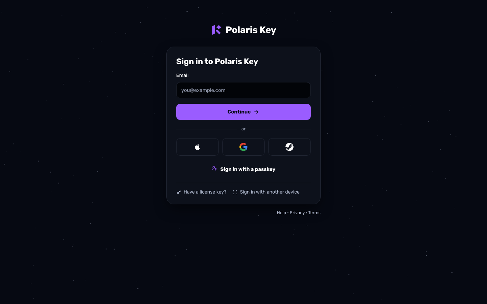

### 4.2 App passthrough: device code and QR

1. The TV or console shows the kit hand-off (`SignInHandoff`): the product header, "Sign in on your
   phone or computer", the QR (`verification_uri_complete`), the code `WDJB-MJHT`, "Or go to
   key.plrs.im/tv" (or the product's `deviceCodeUrl`), and the countdown "Code expires in 4:12". A
   focusable **Use a license key instead** and **Cancel** are always present.
2. The phone opens the card with the app header and code panel (frame 02). Already signed in, it
   goes straight to step 4.
3. Methods → Code / provider → (EmailGate).
4. **LicenseChoiceStep** (frames 05–09), merged with Consent when due (07). Device code always needs
   this explicit Continue (I-08).
5. Device done (frame 12). The TV's poll answers `ready` and the TV continues.
6. "Didn't start this yourself? Cancel it." denies the code. The TV shows "Sign-in was cancelled.
   Get a new code".

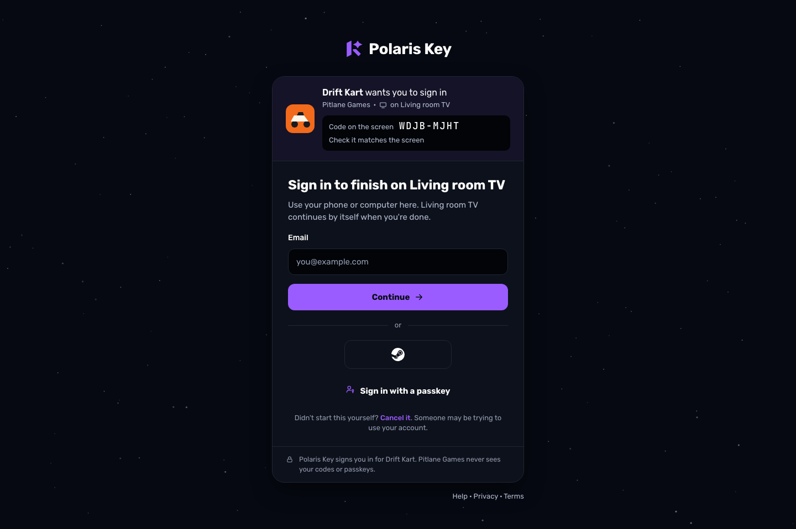

### 4.3 App passthrough: web redirect

1. The web app sends the browser to `/<p>/identity/authorize` (exact origin and path, S256).
2. Card with the globe-and-origin header → Methods → Code (frame 03) → (EmailGate).
3. LicenseChoiceStep. The choice is recorded on the authorization code (§6.3). (Consent when due.)
4. **Continue to <App>** is the 302 back with `code`. The app's `redirect/token` exchange binds the
   browser device to the chosen license.
5. Mismatched `redirect_uri`: an error card "This sign-in request isn't valid. Go back to <App> and
   try again." It never redirects.

### 4.4 App passthrough: native

- **System browser sheet** (I-15 claimed HTTPS, loopback or a registered scheme): the card with "on
  <device label>" → steps as §4.3 → ReturnStep (frame 11). Until I-15, native kits use device code
  (§4.2) and the QR.
- **Native token** (I-13: Sign in with Apple or Google in-app, Game Center; I-14: Steam ticket):
  - A first link, or no Continue grant, answers `interstitial_required`. The kit opens the card for
    EmailGate and Consent, then LicenseChoiceStep.
  - With a grant but a choice due, the exchange answers `license_choice_required`. The kit renders
    **LicenseChoice natively** (frame 18), with Replace device inline, and resubmits with the choice.
  - Already bound to this account on a usable license: silent.

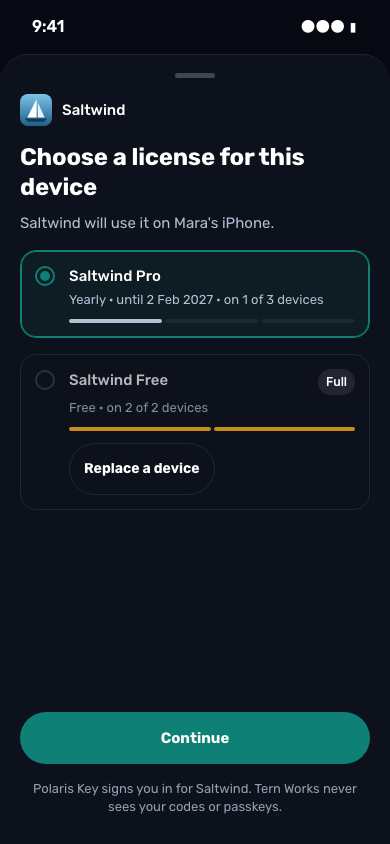

### 4.5 License-key on-ramp and key-entry limit

1. **In the app** (kit `Activate`): the key is entered natively and goes through `license/activate`.
   - On success the app runs, and `keyEntries` feeds "{left} key entries left" on the success line.
   - On `key_entry_limit` the kit shows the refusal screen: "This key has no entries left. Add it to
     your Polaris Key account and <Product> signs you in instead." The primary is **Sign in**
     (device code or redirect, then LicenseChoiceStep preselects "Just added" once the key is
     added). The secondary **Add it in Polaris Key** opens `manageUrl` (QR on TV and console).
   - On `license_owned` the kit starts sign-in itself, with `signInUrl` as the fallback.
2. **On the card** ("Have a license key?"): KeyField → preview (never counted) → the on-ramp body
   (frame 10) → account → the entry counts when the claim is submitted ("This will be entry 3").
3. **At the limit**, the forced body: no skip, "Sign in to add <Product>". Existing installs keep
   working.

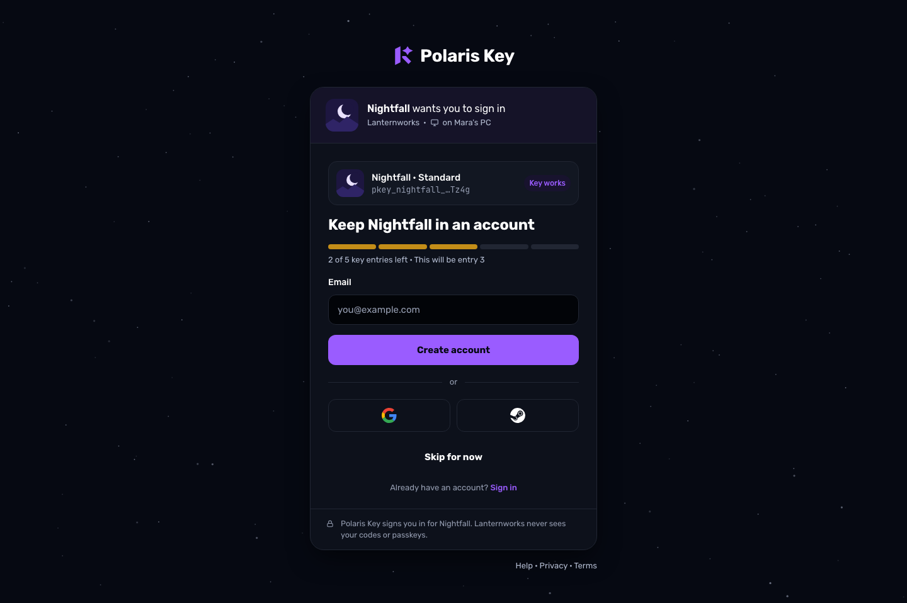

### 4.6 First sign-in from a provider

- **Verified email** (Google `email_verified`, Apple incl. relay): the strip, ProfileImport, the
  provider address preselected, **Continue to <App>** with no code. In the app it then continues to
  LicenseChoiceStep.
- **Unverified or typed email:** the selected card sends a code, and the primary is **Verify and
  continue**.
- **Steam** (frame 04): an empty field and **Send code**.
- **Email in another account:** **Join into one account** or **Use a different email**.

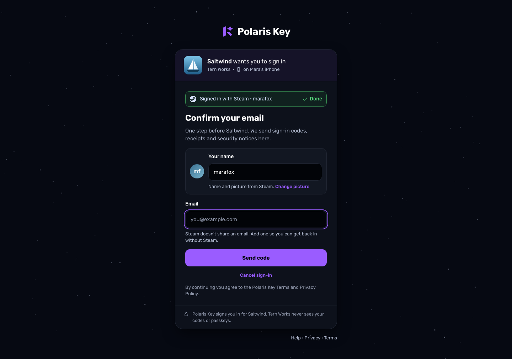

### 4.7 License choice: 0, 1, many, full, Replace device

| Case                                | Frame | What the person sees                                                                |
| ----------------------------------- | ----- | ----------------------------------------------------------------------------------- |
| Many, one full, one ended           | 05    | Pro preselected (rank-first), Edu disabled with Replace a device, "1 ended license" |
| Replace a device open               | 06    | Devices with Work laptop preselected, the consequence line, **Replace Work laptop** |
| One, first sign-in (merged consent) | 07    | "Continue to Tidewater Studio as Mara?" with the one license preselected            |
| None, product auto-issues           | 08    | One **New** row, preselected; issued on Continue                                    |
| All full                            | 09    | Warning notice, every card with Replace a device, Continue disabled, no New row     |
| None, no auto-issue, keys accepted  | n/a   | KeyStep "Add <Product> to your account"                                             |
| None, no auto-issue, no keys        | n/a   | "No <Product> license in this account" with Use another account                     |

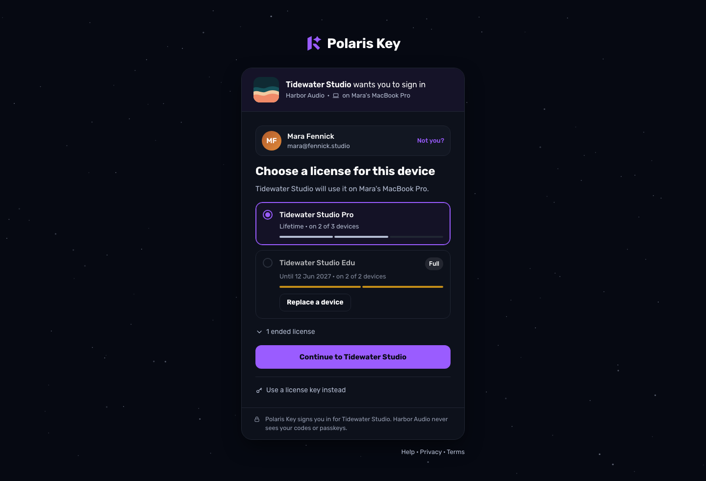

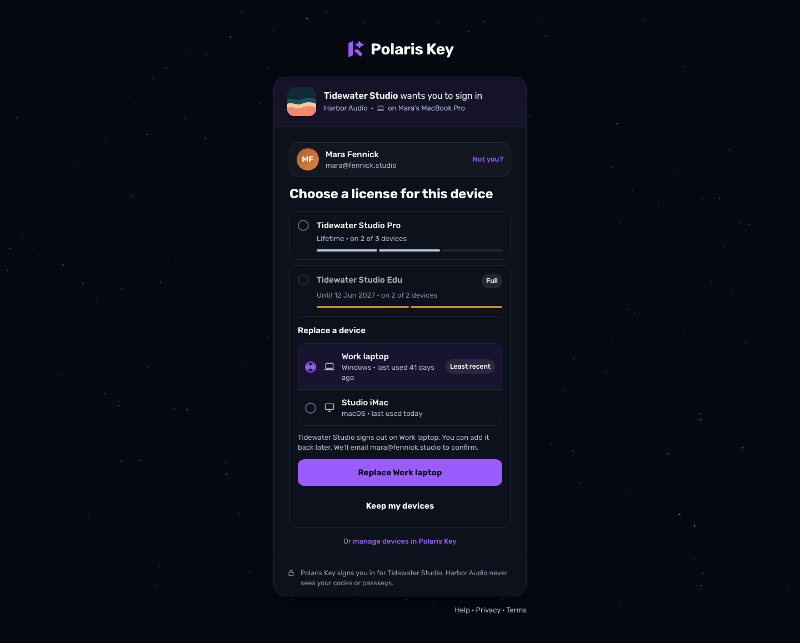

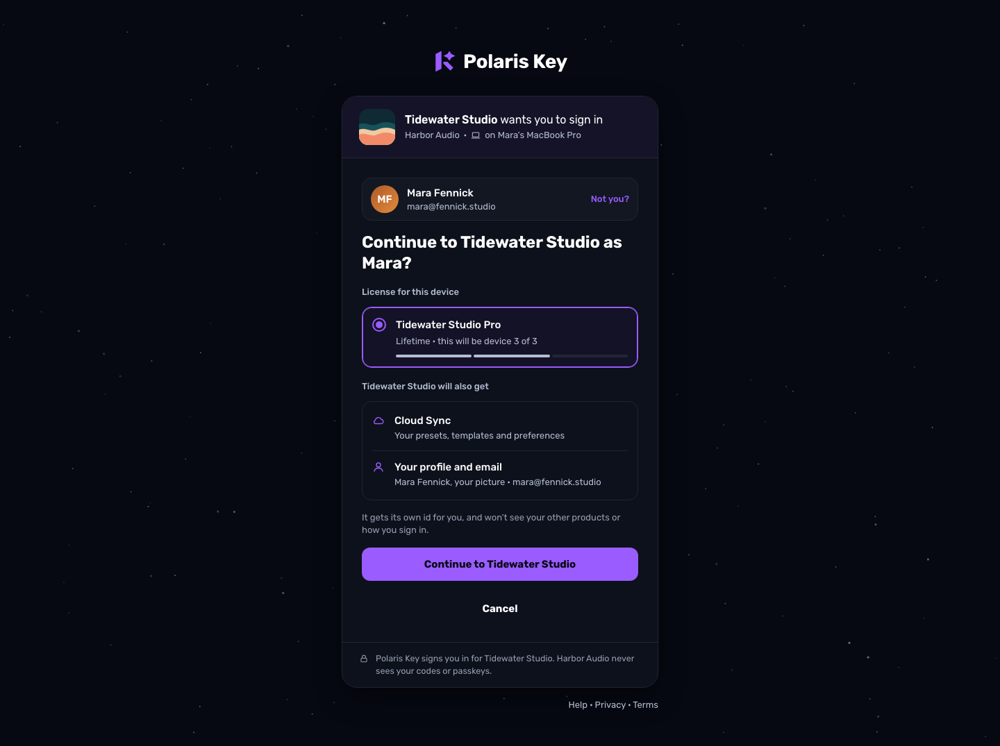

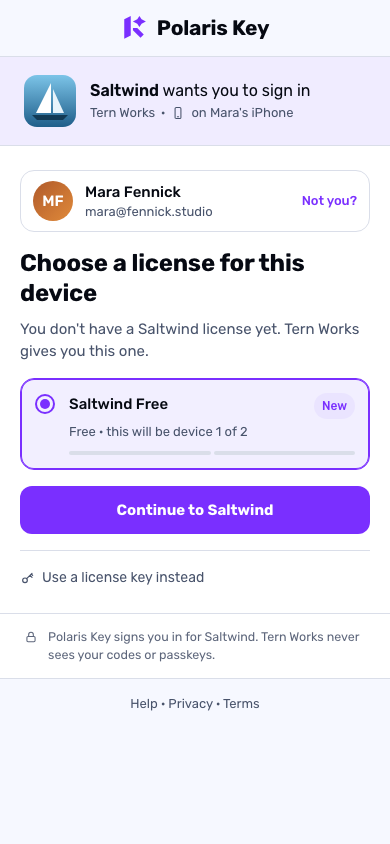 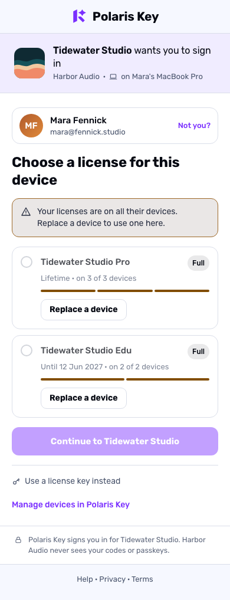

### 4.8 Device approval

New browser → **Sign in with another device** (frame 17) → the approver scans or types the code →
(step-up) → **Approve and sign it in** → the new browser signs in and continues. The session it gets
is an ordinary account session (`sid`, listed in "Where you're signed in") with the email "A new
device signed in".

### 4.9 Sign-out

- **Portal:** **Sign out** in the account menu only. "Sign out everywhere else" lives in "Where
  you're signed in".
- **Console:** "You're signed out" in the card. No IdP bounce.
- **App (kit `AccountAndLicense`):** **Sign out** in its own group, in danger text, with an L1
  confirm:
  - h1 "Sign out of <Product> on this device?";
  - when the seat is released (`released`): "<Product> stops using your {tier} license here and frees
    its seat.";
  - with unsynced Cloud Sync data: "{n} changes haven't synced yet." and **Wait for sync**;
  - **Sign out** (danger) and **Cancel**.

  The SDK flushes Cloud Sync for up to 5 s first (S-17).

- **TV done screen:** **Sign the TV out** for the wrong account.

### 4.10 Session expiry

- **Portal** (14-day session): the toast and the card with `returnTo`. Any form input in the page is
  kept in the tab and restored after sign-in.
- **Console:** "Your session ended" in place (frame 14).
- **App** (an account sign-in whose refresh fails, or a revoked account session): the kit
  `StatusScreen` state **signed-out**, "Your sign-in ended. Sign in again to keep using <Product>.",
  with **Sign in** and, when keys are on, **Use a license key**. The license's offline grace is
  unaffected.

### 4.11 Console operator

Frame 13 → Continue → the operator's IdP (Pocket ID) or passkey → back to `returnTo`. A 401 renders
frame 14 in place. A 403 says "…isn't in the operators group".

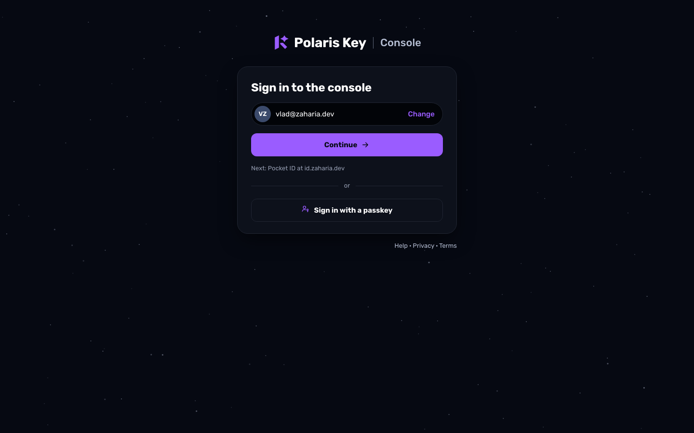

### 4.12 Expired or used links, and Identity off

- **Expired** (frame 15): Send a new code POSTs a resend to the same address and lands on CodeStep
  with the context intact.
- **Identity off** (frame 16): the product-context header, the `info` notice "<Product> doesn't use
  Polaris Key sign-in. Open <Product> and enter your license key there.", h1 "Sign in", lede "Sign in
  here to see <Product> in your library.", and the normal methods. Kits hide **Sign in** on Welcome,
  and a `service-disabled` answer leaves state alone.

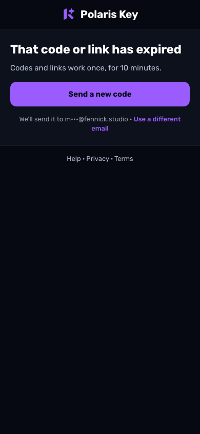 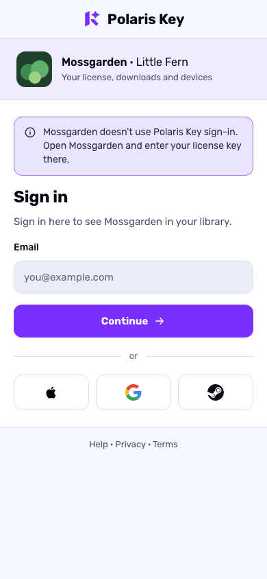

## 5. The cross-surface matrix and copy keys

### 5.1 Which surface renders which step

**C** is the hosted card in the system browser: the same tab for web apps; `ASWebAuthenticationSession`,
Custom Tabs or the default browser for native apps; device code on another device for TVs and CLIs.
**N** is a native in-app screen. **W** is a Worker page. **E** is email. **—** means not offered.

| Step                         | Portal card | Console card | Worker                     | Email          | React / elements   | SwiftUI (iOS, macOS, tvOS)   | Compose (Android, desktop, TV) | Godot                      | Qt         | Terminal |
| ---------------------------- | ----------- | ------------ | -------------------------- | -------------- | ------------------ | ---------------------------- | ------------------------------ | -------------------------- | ---------- | -------- |
| MethodsStep / kit `SignIn`   | C           | —            | W (no JS)                  | —              | C                  | N chooser¹, email C          | N chooser¹, email C            | N chooser¹                 | N chooser¹ | N²       |
| HintStep                     | C           | —            | —                          | —              | C                  | C                            | C                              | C                          | C          | C        |
| CodeStep                     | C           | —            | W (link on another device) | E code + link  | C                  | C                            | C                              | C                          | C          | C        |
| RegisterStep                 | C           | —            | —                          | —              | C                  | C                            | C                              | C                          | C          | C        |
| EmailGateStep                | C           | —            | —                          | —              | C                  | C (interstitial)             | C (interstitial)               | C                          | C          | C        |
| LicenseChoiceStep            | C           | —            | —                          | —              | C                  | C, or N after native sign-in | C, or N after native sign-in   | C, or N after Steam ticket | C          | C        |
| ReplaceDevice                | C           | —            | —                          | E notice       | C                  | as above                     | as above                       | as above                   | C          | C        |
| ConsentStep                  | C           | —            | —                          | —              | C                  | C                            | C                              | C                          | C          | C        |
| KeyStep / kit `Activate`     | C           | —            | —                          | —              | N                  | N                            | N                              | N                          | N          | N        |
| Kit `DeviceLimit` (key path) | —           | —            | —                          | E notice       | N                  | N                            | N                              | N                          | N          | N        |
| ReturnStep / hand-off ok     | C           | —            | W (no JS)                  | —              | — (302)            | C, then N "Signed in as …"   | C, then N                      | N                          | N          | N        |
| Device-code hand-off         | —           | —            | W entry                    | —              | N (desktop)        | N (tvOS first)               | N (TV first)                   | N                          | N          | N        |
| DeviceApproval               | C           | —            | —                          | E "new device" | —                  | —                            | —                              | —                          | —          | —        |
| ConsoleMethodsStep           | —           | C            | W twin                     | —              | —                  | —                            | —                              | —                          | —          | —        |
| Expired / used link          | —           | —            | W                          | —              | —                  | —                            | —                              | —                          | —          | —        |
| Identity off                 | C           | —            | 303 → C                    | —              | N (Sign in hidden) | N                            | N                              | N                          | N          | N        |
| Sign-out confirm             | menu        | C            | —                          | —              | N                  | N                            | N                              | N                          | N          | N        |
| Session ended                | toast + C   | C in place   | —                          | —              | N `StatusScreen`   | N                            | N                              | N                          | N          | N        |

1. **Kit `SignIn` chooser**: the same logo-only provider row (Apple, Google, Steam, as the
   product ships). On Apple platforms Apple uses native `ASAuthorization` behind a logo-only button
   drawn to Apple's logo-only guidelines. On Android, Google goes through Credential Manager. Steam
   goes through the hosted card. Below the row: **Sign in with a passkey** (the platform passkey
   sheet), **Continue with email** (opens the card, which is identifier-first), **Sign in on your
   phone or computer** (device code), and the footnote `signin.footer`.
2. **Terminal:** the chooser is a prompt with two entries: "Sign in on your phone or computer"
   (device code with an ANSI QR, the code in reverse video) and "Use a license key".

**Kit layers** (UI-KITS §1.3): `SignIn`, `SignInHandoff`, `LicenseChoice` (new, with
`ReplaceDevice` inside), `Activate` and `DeviceLimit` ship as drop-in screens inside
`PolarisKeyGate`, as styled parts, and as headless models (`useLicenseChoice`,
`LicenseChoiceModel`, `rememberLicenseChoiceState`, `PKeyLicenseChoiceController`,
`LicenseChoiceViewModel`). All of them take their states from the conformance UI fixtures (UK-02b).

### 5.2 Copy keys

One namespace, `signin.*`, in `packages/brand/kit-copy/en.json` (UK-02a). It references `core.copy`
keys (`conformance/parity/copy.en.json`) for refusal codes instead of duplicating them. The portal
`AuthCard`, the Worker's `renderAuthCard()` and the emails read the same catalog (§8 drift: UK-02,
UX-40, UX-43, UX-44). Placeholders are ICU.

| Key                               | English                                                                                                                                    |
| --------------------------------- | ------------------------------------------------------------------------------------------------------------------------------------------ |
| `signin.methods.title`            | Sign in to Polaris Key                                                                                                                     |
| `signin.methods.titleApp`         | Sign in                                                                                                                                    |
| `signin.methods.ledeApp`          | Use the email you bought {product} with.                                                                                                   |
| `signin.email.label`              | Email                                                                                                                                      |
| `signin.email.invalid`            | Enter a full email address, like name@example.com.                                                                                         |
| `signin.continue`                 | Continue                                                                                                                                   |
| `signin.or`                       | or                                                                                                                                         |
| `signin.provider.group`           | Or continue with                                                                                                                           |
| `signin.provider.continue`        | Continue with {provider}                                                                                                                   |
| `signin.provider.connect`         | Connect {provider}                                                                                                                         |
| `signin.passkey`                  | Sign in with a passkey                                                                                                                     |
| `signin.email.continue`           | Continue with email                                                                                                                        |
| `signin.link.key`                 | Have a license key?                                                                                                                        |
| `signin.link.anotherDevice`       | Sign in with another device                                                                                                                |
| `signin.link.deviceCode`          | Sign in on your phone or computer                                                                                                          |
| `signin.header.app`               | {app} wants you to sign in                                                                                                                 |
| `signin.header.context`           | {product} · {developer}                                                                                                                    |
| `signin.header.contextLine`       | Your license, downloads and devices                                                                                                        |
| `signin.header.codePanel`         | Code on the screen · {code} · Check it matches the screen                                                                                  |
| `signin.footer`                   | Polaris Key signs you in for {app}. {developer} never sees your codes or passkeys.                                                         |
| `signin.off.product`              | Sign-in is turned off for {product}. Contact {developer}.                                                                                  |
| `signin.off.any`                  | Sign-in is unavailable. Try again later.                                                                                                   |
| `signin.rateLimited`              | Too many codes. Try again in {minutes} minutes.                                                                                            |
| `signin.emailDown`                | We can't send email right now. Try another way to sign in.                                                                                 |
| `signin.network.title`            | Can't reach Polaris Key                                                                                                                    |
| `signin.retry`                    | Try again                                                                                                                                  |
| `signin.code.title`               | Check your email                                                                                                                           |
| `signin.code.sent`                | We sent a code and a sign-in link to {email}. Both work for 10 minutes.                                                                    |
| `signin.code.link`                | Or open the link in the email. Keep this tab open.                                                                                         |
| `signin.code.resend`              | Send a new code                                                                                                                            |
| `signin.code.resendIn`            | Send a new code in {time}                                                                                                                  |
| `signin.code.resent`              | We sent a new code and link to {email}.                                                                                                    |
| `signin.code.wrong`               | That code isn't right. Check the email and try again.                                                                                      |
| `signin.code.triesLeft`           | {n, plural, one {# try left.} other {# tries left.}}                                                                                       |
| `signin.code.tooMany`             | Too many tries. Send a new code.                                                                                                           |
| `signin.code.expired`             | That code has expired. Send a new code.                                                                                                    |
| `signin.code.differentEmail`      | Use a different email                                                                                                                      |
| `signin.email.subject`            | Your Polaris Key code: {code}                                                                                                              |
| `signin.email.body`               | Or sign in with the button. The code and the link work once, for 10 minutes.                                                               |
| `signin.confirmLink.title`        | Confirm sign-in, requested at {time} from {place}                                                                                          |
| `signin.confirmLink.note`         | The device that asked signs in, not this one.                                                                                              |
| `signin.confirmLink.done`         | Sign-in confirmed. Go back to the device where you started. It signs in by itself.                                                         |
| `signin.hint.welcome`             | Welcome back, {name}                                                                                                                       |
| `signin.hint.usual`               | You usually sign in with {method}                                                                                                          |
| `signin.hint.other`               | Other ways to sign in                                                                                                                      |
| `signin.register.title`           | Create your account                                                                                                                        |
| `signin.register.verified`        | {email} is verified                                                                                                                        |
| `signin.register.submit`          | Create account and continue                                                                                                                |
| `signin.gate.strip`               | Signed in with {provider} · {identity}                                                                                                     |
| `signin.gate.title`               | Confirm your email                                                                                                                         |
| `signin.gate.ledeApp`             | One step before {app}. We send sign-in codes, receipts and security notices here.                                                          |
| `signin.gate.steam`               | Steam doesn't share an email. Add one so you can get back in without Steam.                                                                |
| `signin.gate.verify`              | Verify and continue                                                                                                                        |
| `signin.gate.sendCode`            | Send code                                                                                                                                  |
| `signin.gate.cancel`              | Cancel sign-in                                                                                                                             |
| `signin.gate.join`                | Join into one account                                                                                                                      |
| `signin.profile.source`           | Name and picture from {provider}.                                                                                                          |
| `signin.profile.applePicture`     | Apple doesn't share a picture. Add one                                                                                                     |
| `signin.choice.title`             | Choose a license for this device                                                                                                           |
| `signin.choice.lede`              | {product} will use it on {device}.                                                                                                         |
| `signin.choice.ledeBrowser`       | {product} will use it in this browser.                                                                                                     |
| `signin.choice.ledeNew`           | You don't have a {product} license yet. {developer} gives you this one.                                                                    |
| `signin.choice.meta`              | {term} · on {used} of {limit} devices                                                                                                      |
| `signin.choice.seatNext`          | {term} · this will be device {position} of {limit}                                                                                         |
| `signin.choice.tag.current`       | On this device                                                                                                                             |
| `signin.choice.tag.new`           | New                                                                                                                                        |
| `signin.choice.tag.added`         | Just added                                                                                                                                 |
| `signin.choice.tag.full`          | Full                                                                                                                                       |
| `signin.choice.notInAccount`      | Not in your account yet                                                                                                                    |
| `signin.choice.otherAccount`      | In another Polaris Key account                                                                                                             |
| `signin.choice.ended`             | {n, plural, one {# ended license} other {# ended licenses}}                                                                                |
| `signin.choice.allFull`           | Your licenses are on all their devices. Replace a device to use one here.                                                                  |
| `signin.choice.combined`          | Your other {product} items still apply.                                                                                                    |
| `signin.choice.portalOff`         | {developer} manages this license elsewhere.                                                                                                |
| `signin.choice.keyInstead`        | Use a license key instead                                                                                                                  |
| `signin.choice.manage`            | Manage devices in Polaris Key                                                                                                              |
| `signin.choice.continue`          | Continue to {app}                                                                                                                          |
| `signin.choice.raced`             | That seat was just taken. Choose again.                                                                                                    |
| `signin.none.title`               | No {product} license in this account                                                                                                       |
| `signin.none.body`                | Get {product} from {developer}, or sign in with the account you bought it with.                                                            |
| `signin.none.otherAccount`        | Use another account                                                                                                                        |
| `signin.replace.open`             | Replace a device                                                                                                                           |
| `signin.replace.meta`             | {platform} · last used {when}                                                                                                              |
| `signin.replace.leastRecent`      | Least recent                                                                                                                               |
| `signin.replace.consequence`      | {product} signs out on {device}. You can add it back later. We'll email {email} to confirm.                                                |
| `signin.replace.confirm`          | Replace {device}                                                                                                                           |
| `signin.replace.cancel`           | Keep my devices                                                                                                                            |
| `signin.replace.gone`             | That device was already removed.                                                                                                           |
| `signin.replace.rateLimited`      | Too many changes. Wait a minute, then try again.                                                                                           |
| `signin.consent.title`            | Continue to {app} as {name}?                                                                                                               |
| `signin.consent.license`          | License for this device                                                                                                                    |
| `signin.consent.alsoGets`         | {app} will also get                                                                                                                        |
| `signin.consent.profile`          | Your profile and email                                                                                                                     |
| `signin.consent.pairwise`         | It gets its own id for you, and won't see your other products or how you sign in.                                                          |
| `signin.notYou`                   | Not you?                                                                                                                                   |
| `signin.cancel`                   | Cancel                                                                                                                                     |
| `signin.key.addTitle`             | Add {product} to your account                                                                                                              |
| `signin.key.addAndUse`            | Add and use on this device                                                                                                                 |
| `signin.key.keep`                 | Keep {product} in an account                                                                                                               |
| `signin.key.entries`              | {left} of {limit} key entries left · This will be entry {n}                                                                                |
| `signin.key.entriesLeftShort`     | {left, plural, one {# key entry left} other {# key entries left}}                                                                          |
| `signin.key.noEntries`            | This key has no entries left in {product}. Add it to your account and {product} signs you in instead.                                      |
| `signin.key.skip`                 | Skip for now                                                                                                                               |
| `signin.key.owned`                | This {product} license is already in another Polaris Key account. A license never moves by its key.                                        |
| `signin.key.ownedSignIn`          | Sign in to that account                                                                                                                    |
| `signin.key.differentKey`         | Use a different key                                                                                                                        |
| `signin.return.yours`             | {product} is yours                                                                                                                         |
| `signin.return.signedIn`          | You're signed in to {app}                                                                                                                  |
| `signin.return.button`            | Return to {app}                                                                                                                            |
| `signin.return.timer`             | Returning by itself in {s} s                                                                                                               |
| `signin.return.stay`              | Stay here                                                                                                                                  |
| `signin.device.title`             | Sign in to finish on {device}                                                                                                              |
| `signin.device.lede`              | Use your phone or computer here. {device} continues by itself when you're done.                                                            |
| `signin.device.cancel`            | Didn't start this yourself? Cancel it. Someone may be trying to use your account.                                                          |
| `signin.device.done`              | {app} is signed in on {device}                                                                                                             |
| `signin.device.doneLede`          | Look at {device}: it continues by itself.                                                                                                  |
| `signin.device.signOut`           | Sign the TV out                                                                                                                            |
| `signin.handoff.title`            | Finish in your browser                                                                                                                     |
| `signin.handoff.check`            | Check the code there matches this one.                                                                                                     |
| `signin.handoff.url`              | Or go to {url}                                                                                                                             |
| `signin.handoff.expires`          | Code expires in {time}                                                                                                                     |
| `signin.handoff.again`            | Open browser again                                                                                                                         |
| `signin.handoff.cancelled`        | Sign-in was cancelled. Get a new code                                                                                                      |
| `signin.approve.title`            | Sign in with another device                                                                                                                |
| `signin.approve.works`            | Works for {time}                                                                                                                           |
| `signin.approve.waiting`          | Waiting for you to approve it on the other device…                                                                                         |
| `signin.approve.ask`              | Approve a new device?                                                                                                                      |
| `signin.approve.warning`          | Only approve if you started this yourself, on a device in front of you. Nobody from Polaris Key or a developer will ever ask you for this. |
| `signin.approve.approve`          | Approve and sign it in                                                                                                                     |
| `signin.approve.deny`             | Deny                                                                                                                                       |
| `signin.approve.denied`           | That request was denied. Use another way to sign in.                                                                                       |
| `signin.approve.expired`          | That code expired. Get a new code.                                                                                                         |
| `signin.console.title`            | Sign in to the console                                                                                                                     |
| `signin.console.next`             | Next: {idp} at {host}                                                                                                                      |
| `signin.console.signedOut`        | You're signed out                                                                                                                          |
| `signin.console.sessionEnded`     | Your session ended                                                                                                                         |
| `signin.console.sessionEndedBody` | Sign in again to carry on. Your unsaved changes stay in this tab.                                                                          |
| `signin.console.notOperator`      | {email} isn't in the operators group.                                                                                                      |
| `signin.console.notConfigured`    | Admin sign-in isn't set up                                                                                                                 |
| `signin.expired.title`            | That code or link has expired                                                                                                              |
| `signin.expired.body`             | Codes and links work once, for 10 minutes.                                                                                                 |
| `signin.again`                    | Sign in again                                                                                                                              |
| `signin.identityOff.notice`       | {product} doesn't use Polaris Key sign-in. Open {product} and enter your license key there.                                                |
| `signin.identityOff.lede`         | Sign in here to see {product} in your library.                                                                                             |
| `signin.signout.title`            | Sign out of {product} on this device?                                                                                                      |
| `signin.signout.released`         | {product} stops using your {tier} license here and frees its seat.                                                                         |
| `signin.signout.unsynced`         | {n, plural, one {# change hasn't synced yet.} other {# changes haven't synced yet.}}                                                       |
| `signin.signout.waitSync`         | Wait for sync                                                                                                                              |
| `signin.session.toastTitle`       | You were signed out                                                                                                                        |
| `signin.session.toastBody`        | Sign in again to carry on where you were.                                                                                                  |
| `signin.session.kitEnded`         | Your sign-in ended. Sign in again to keep using {product}.                                                                                 |

## 6. Wire and state contract per step

**Status key:** **Planned** means an approved plan or brief carries it. **On branch** means an
in-flight branch implements it. **Not planned** means a wire change no approved plan carries; it is a
plan-mode change (CLAUDE.md), owned by the planner on `plan/signin-license-choice` unless §8 says
otherwise.

### 6.1 Steps that are planned

| Step                | Relies on                                                                                                                                                      | Status                                                               |
| ------------------- | -------------------------------------------------------------------------------------------------------------------------------------------------------------- | -------------------------------------------------------------------- |
| MethodsStep         | `GET /api/capabilities?product=` with `product`, `providers`, method flags; `GET /api/me`; `pk_last_method` (G30)                                              | Built without `product`/`providers` (gap, PX-12, I-06); G30 in PX-12 |
| Passthrough header  | `GET /api/signin/requests/:handle` → `SignInRequestView` (PX-W13 §2.2), `__Host-pk_req`                                                                        | Planned (PX-W13)                                                     |
| CodeStep            | `POST /api/signin/email/start` / `verify`, `GET /api/signin/flow`; 6 digits, 10 min, 5 wrong, per-recipient 5/h and 20/day, Turnstile                          | On branch (`wp/I-07-login-card-email-gate`)                          |
| EmailGateStep       | `/api/signin/confirm-email[/verify\|/join\|/cancel\|/picture]` (G31), profile claims (G32), R2 avatars (G33)                                                   | On branch (I-07); PX-W15 and PX-W16 briefs overlap it (§8)           |
| Providers           | `GET /login/<provider>`, callbacks, `__Host-pkey_signin` binding                                                                                               | On branch (`wp/I-06-providers`)                                      |
| ConsentStep         | `GET /api/signin/requests/:handle/consent` → `AppConsentView`; `account_product_grants.scope_hash`                                                             | Planned (PX-W13 §2.3); its license item changes (§6.3)               |
| KeyStep             | `POST /api/key/preview` (signed out, never counts; PX-W9), `POST /api/activate/preview` (G22), claim with `surface: portal` (I-11), `keyEntries {used, limit}` | Planned (PX-W9, PX-W5 done, PX-17, I-11)                             |
| Key refusals (apps) | `license_owned` + `signInUrl`, `key_entry_limit` + `manageUrl` + `keyEntries`, `device_limit` + `manageUrl`                                                    | Planned (I-09, PX-W9); `manageUrl` on branch (`wp/PX-W8-manage-url`) |
| Attach              | `POST /<p>/identity/attach {confirm}`                                                                                                                          | Planned (I-09 §2.2)                                                  |
| Web redirect        | `GET /<p>/identity/authorize`, `POST /<p>/identity/redirect/token`                                                                                             | Planned (I-04 §2.5, I-08)                                            |
| Device code         | `/device/start`, `/device/poll` (`ready` + `subject`)                                                                                                          | Planned (I-04 §2.4, I-08)                                            |
| Native redirect     | `authorize` + `redirect/token` with native redirect URIs; pushed request `POST /<p>/identity/request`                                                          | Planned (I-15, PX-W13 §2.5)                                          |
| Native exchange     | `POST /<p>/identity/token`, `interstitial_required` (403, `url`)                                                                                               | Planned (I-13)                                                       |
| DeviceApproval      | `POST /api/device-login/start`, `GET /api/device-login/<id>`, `POST …/lookup`, `POST …/approve`, `step_up_required`                                            | On branch (`wp/PX-W14-device-approval`); UI PX-15                    |
| Identity off        | 303 to `/signin?product=&error=identity_disabled`; `403 identity_disabled` on the passthrough context                                                          | On branch (`wp/PX-W17-identity-per-product`); card PX-14             |
| Sign-out (device)   | `POST /<p>/identity/signout` → `{released}`; SDK Cloud Sync flush                                                                                              | Planned (I-09 §2.2, S-17)                                            |
| Account sessions    | `account_sessions` with `sid`, revocable and listable                                                                                                          | On branch (I-07)                                                     |
| Console             | `GET /manage/login` serves the card; PKCE on Continue; in-place 401                                                                                            | Planned (UX-02, UX-42; EXPERIENCE §13.3)                             |
| Worker pages        | `renderAuthCard()`                                                                                                                                             | Planned (UX-43)                                                      |

### 6.2 Not planned: license choice and Replace device

None of the following is in an approved plan. Each needs a plan-mode amendment. The owner decisions
(O-1 to O-3) fix the behaviour; the shapes below are the recommended contract for the planner.

1. **`LicenseChoiceView`** (new type in `@polaris-key/protocol/identity`):
   `{ licenses: LicenseOption[], newLicense: {tierName, term, limit} | null, keyEntry: boolean,
preselected: string | "new" | "device" | null, combined: boolean }`.
   `LicenseOption = {id, name, tierName, term, seat: {used, limit}, state: "available" | "full" |
"ended", reason?: string, tag?: "current" | "added", inAccount: boolean, replaceable: boolean}`.
   It never carries keys, other accounts or other products.
2. **Browser routes** (portal, same-origin, `no-store`, binder required):
   - `GET /api/signin/requests/:handle/licenses` returns the `LicenseChoiceView`;
   - `GET /api/signin/requests/:handle/licenses/:id/devices` returns the device list for Replace
     (label, platform, last used, form factor), only for `replaceable` licenses;
   - **Continue** (I-08's POST) gains a body member
     `choice: {license: "<id>" | "new" | "device", replaceDevice?: "<deviceId>"}`.
3. **Where the choice is applied.** It is recorded on the flow and applied at bind time:
   - web redirect: on the authorization code, applied by `redirect/token`;
   - device code: on the device flow, applied when the device polls;
   - native redirect: as web redirect.

   If the chosen license can no longer take the device when the bind runs, the bind answers
   `not_entitled` with `reason: device_limit` and `manageUrl` (LX-18) and the client restarts sign-in.

4. **Native exchange (I-13, I-14):** a new refusal `license_choice_required` (409) with the
   `LicenseChoiceView`, and a request member `license` (same shape as `choice`). Silent only when the
   device is already bound to this account on a usable license.
5. **Core:** I-09's `chooseAnchorInline` and LX-10's `chooseAnchor` split into `rankCandidates`
   (ordering and preselection only) and `bindChosenLicense(db, product, accountId, choice, device)`.
   `bindSignedInDevice` takes the choice. Auto-issue (origin `oidc`) runs only for `choice: "new"`,
   offered only when the account holds no usable license (O-3). A device with a usable anchor is no
   longer kept silently: it is preselected (§3.6 rule 7).
6. **Replace:** `replaceDevice(licenseId, deviceId, thisDevice)` in one D1 batch. It reuses
   `handleDeviceDelete`'s checks (ownership, `portal_enabled`, `requireActionRateLimit` bucket
   `portalDeviceDisconnect`, audit `portal.device.disconnect` with `via: "signin"`, device-removed
   notice), then `authorizeDevice(…, {boundBy: "signin"})`. THREAT-MODEL needs a row: a fresh sign-in
   (5 min) is the step-up, and the rate bucket is shared with the portal.
7. **Conformance:** UI fixtures for `LicenseChoice` (states: loading, many, one, new, all-full,
   replace-open, raced, attach-refused, none-keys, none-no-keys) in UK-02b. HTTP transcripts for
   `license_choice_required` and the Continue `choice` member, with SDK mirrors.

### 6.3 Changes to planned contracts

- **PX-W13 `AppConsentView`**: the license item names the **chosen** license, not a dry-run anchor.
  `more: n` is replaced by `LicenseChoiceView.combined`.
- **I-08 device code:** the device-side `confirm` status with `attachable` is retired for
  Identity-on products. Attach is the "On this device · Not in your account yet" row. `verification_uri`
  is `<origin>/device`; `/tv` is an alias for TV and console screens.
- **PX-W8 Q5:** the sign-in seat refusal is no longer the main path. ReplaceDevice handles a full
  license in the card, and LX-18's `not_entitled` + `manageUrl` covers only the race in rule 3.

## 7. Decisions

Owner decisions are §0. Every other conflict the inventories found is settled below, **delegated to
Claude (lead), 2026-10-05**, taking the recommended option. Each names what it overrides.

| #    | Conflict                                                                                                                | Decision                                                                                                                                                                                                                                                                            | Overrides                                                      |
| ---- | ----------------------------------------------------------------------------------------------------------------------- | ----------------------------------------------------------------------------------------------------------------------------------------------------------------------------------------------------------------------------------------------------------------------------------- | -------------------------------------------------------------- |
| D-01 | "licence" (owner, kit copy I-10a) vs "license" (glossary)                                                               | UI copy is US **license** everywhere: "Choose a license for this device"; kit string "This licence belongs…" is replaced by `signin.key.owned`                                                                                                                                      | I-10a brief kit copy                                           |
| D-02 | Silent rank-first anchor (I-09 §2.4, I-04 amendment, LX-01 §2.4, S-19 §7.5)                                             | Rank-first orders and preselects; the person's Continue binds (O-1)                                                                                                                                                                                                                 | I-09 §2.4, LX-01 §2.4, I-04 amendment                          |
| D-03 | When the choice shows                                                                                                   | Every interactive bind or re-bind of an installation; skipped only for silent re-auth of an already-bound device                                                                                                                                                                    | —                                                              |
| D-04 | I-09 Q1 (keep a device's usable anchor silently); LX-01 Q1 (move to a higher rank automatically)                        | The current license is preselected "On this device"; choosing another re-anchors explicitly (`onActivation`); nothing moves silently                                                                                                                                                | I-09 Q1, LX-01 Q1                                              |
| D-05 | Auto-issue when no license has a free seat (I-09 step 3, LX-01 §2.4 step 3)                                             | Auto-issue only when the account holds **no usable** license, shown as a **New** row and issued on Continue; never when usable licenses are full (O-3)                                                                                                                              | I-09 §2.4 step 3, LX-01 §2.4 step 3                            |
| D-06 | EXPERIENCE KeyStep ("Add <App>") vs O-1 "it will generate one"                                                          | Auto-issue products get the New row; others with keys get KeyStep; others get the No-license state                                                                                                                                                                                  | EXPERIENCE §0.6 P1 step 4                                      |
| D-07 | Consent and choice: two screens on a first sign-in                                                                      | One merged frame when both are due; consent re-ask rules unchanged (PX-W13 Q5)                                                                                                                                                                                                      | PORTAL §4.8 Confirm's single-licence line                      |
| D-08 | Three names for one action ("Free up a device", "Remove <device> and continue", "Replace device")                       | **Replace <device>** when the action also binds this device (sign-in, kit DeviceLimit); **Remove <device>** when it only frees a seat (portal, FreeDevicePage); **Free up a device** only as the app-to-portal link label; console "Deauthorize"; React "Disconnect" becomes Remove | UI-KITS DeviceLimit primary, PORTAL §4.25, FreeDevicePage copy |
| D-09 | Replace device rules unspecified                                                                                        | Same checks, bucket, audit and notice as the portal remove; one transaction with the bind; not offered when the customer portal is off; no extra step-up within 5 min of sign-in                                                                                                    | —                                                              |
| D-10 | Device code: browser choice vs device-side "Is this you? / attach" (Godot P1-07, I-08 `confirm`)                        | The browser card is the one place the license is chosen; the device-side confirm is retired for Identity-on products                                                                                                                                                                | I-08 `confirm` status use, Godot P1-07 screen                  |
| D-11 | "<App> wants you to sign in" for a developer's link (EXPERIENCE §11.1) vs reserved for app requests (PORTAL §4.7, I-07) | "wants you to sign in" only for app requests with a handle; the developer link gets the product-context header "**<Product>** · <Developer>" / "Your license, downloads and devices"; h1 "Sign in" in both                                                                          | EXPERIENCE §11.1 card-header row, PORTAL §4.2 copy             |
| D-12 | Code-step copy (PORTAL §4.4 vs EXPERIENCE §11.1 vs I-07 "That code didn't work.")                                       | EXPERIENCE's copy, plus "{n} tries left." when two or fewer remain; the tab still signs in by itself (polling and BroadcastChannel stay)                                                                                                                                            | PORTAL §4.4 strings, I-07 strings                              |
| D-13 | Sign-in-off copy (three versions)                                                                                       | `signin.off.product` with product context, `signin.off.any` without                                                                                                                                                                                                                 | PORTAL §4.1, built SignInPage                                  |
| D-14 | Footer line "Polaris Key · key.plrs.im"                                                                                 | Removed (EXPERIENCE §8)                                                                                                                                                                                                                                                             | PORTAL §3.2, §4.1                                              |
| D-15 | Passthrough footnote: PORTAL vs UI-KITS ("handles sign-in… never sees your passkeys")                                   | One string `signin.footer`: "Polaris Key signs you in for {app}. {developer} never sees your codes or passkeys."                                                                                                                                                                    | UI-KITS §1.2                                                   |
| D-16 | Device-code URL: `/tv` (PORTAL) vs `key.plrs.im/activate` (UI-KITS hand-off)                                            | `key.plrs.im/device` in desktop and phone hand-offs, `key.plrs.im/tv` on TV and console (same page); `/activate` is only the license-key route; a product `deviceCodeUrl` wins                                                                                                      | UI-KITS §1.2, §4.3                                             |
| D-17 | User code "WDJB-MJHT" vs TV "gap and no hyphen"                                                                         | Hyphen everywhere; consonant alphabet for device codes and approval codes (`KRQP-BMXD`, not `K7QP-2MXD`)                                                                                                                                                                            | UI-KITS §4.3 TV bullet, PORTAL §4.24                           |
| D-18 | "Sign in with another device" (approval) vs "Use another device" (device code); I-08 vs PX-W14 QR ownership             | Approval keeps "Sign in with another device" (portal only); device code is "Sign in on your phone or computer"; PX-W14 owns approval and its code, I-08 drops approval-by-QR scope                                                                                                  | UI-KITS §4.1 SignIn, I-08 brief scope                          |
| D-19 | Key display: wrap (PORTAL) vs one line middle-truncated, last 6 (UI-KITS)                                               | Platform-adapted entry: the web card's KeyField wraps; kit fields stay one line and middle-truncate keeping the last 6. Stored keys are masked to the last 4 everywhere                                                                                                             | —                                                              |
| D-20 | Kit live verdict shows the tier before the server (UI-KITS) vs product only (PORTAL)                                    | Only "Key for <Product>" before the server; tier and terms after the preview or the activate response                                                                                                                                                                               | UI-KITS §4.3 Activate                                          |
| D-21 | Labelled native buttons in kits (system Sign in with Apple, Credential Manager list) vs logo-only row (O-6)             | Logo-only row in every kit too, native auth behind the logos (Apple's logo-only button guidance); email, passkey and device code as rows below                                                                                                                                      | UI-KITS §4.3 SignIn                                            |
| D-22 | Consent re-ask (Q-7) vs device code "always Continue" vs silent I-13                                                    | Consent: first time and on scope change. Device code always has a Continue (LicenseChoiceStep provides it). I-13 is silent only for an already-bound device                                                                                                                         | —                                                              |
| D-23 | ReturnStep timer (EXPERIENCE) vs none (PORTAL)                                                                          | EXPERIENCE's timer with Stay here for native; "is yours" only when a license was added or issued; web redirect has no ReturnStep                                                                                                                                                    | PORTAL §4.8 Return                                             |
| D-24 | `portalUrl` (EXPERIENCE P1) vs `manageUrl`                                                                              | `manageUrl` (approved, PX-W8 Q1)                                                                                                                                                                                                                                                    | EXPERIENCE §0.6 P1                                             |
| D-25 | Entries notice copy (PORTAL §4.19 vs UX-05) and "N activations left" (kits)                                             | `signin.key.noEntries`; kits say "key entries", never "activations"                                                                                                                                                                                                                 | PORTAL §4.19, I-10a/b briefs                                   |
| D-26 | `?key=` in deep links (PORTAL §3.3, §3.4, §4.18) vs fragment only (amendment)                                           | The Worker never puts the key in a URL; apps may add `#key=`; the portal reads `#key=` and still accepts a printed `?key=`                                                                                                                                                          | PORTAL §3.3, §3.4, §4.18 (fixed here)                          |
| D-27 | `license_owned` actions (PORTAL "Link an existing account" vs EXPERIENCE "Sign in to that account")                     | **Sign in to that account** + **Use a different key**; the Link notice added when signed in on the portal                                                                                                                                                                           | —                                                              |
| D-28 | Identity-off card copy (one line in PORTAL)                                                                             | The info notice + normal methods (frame 16)                                                                                                                                                                                                                                         | —                                                              |
| D-29 | Identity-off key upgrade (PORTAL §3.1 "Not offered")                                                                    | Offered, never forced, nothing counted (I-09, I-11, S-16)                                                                                                                                                                                                                           | PORTAL §3.1 row (fixed here)                                   |
| D-30 | Console session expiry: dialog (ADMIN T8) vs in-place card (EXPERIENCE §8)                                              | In-place card                                                                                                                                                                                                                                                                       | ADMIN T8, §6.10.1 (pointers added)                             |
| D-31 | Expired-page copy (EXPERIENCE vs I-07 vs I-06)                                                                          | §3.13 table; a provider state timeout is not called a link                                                                                                                                                                                                                          | I-07 and I-06 strings                                          |
| D-32 | Worker page eyebrows ("ACCOUNT", "DEVICE") kept by I-07                                                                 | Removed (`renderAuthCard()`)                                                                                                                                                                                                                                                        | I-07 branch Worker pages                                       |
| D-33 | I-06 and PX-W14 mint sessions without I-07's `sid`; I-06 before I-07 ships providers without the gate                   | Every session goes through I-07's `startAccountSession`; I-07 merges before I-06 and PX-W14                                                                                                                                                                                         | —                                                              |
| D-34 | Portal OIDC `join_offer` page ("not available yet")                                                                     | Replaced by the email gate's Join offer                                                                                                                                                                                                                                             | `portal/auth.ts` copy                                          |
| D-35 | Pairwise "keyed hash" and Cloud Sync wording left in PORTAL's body                                                      | Random stored subjects; Cloud Sync requires Identity (fixed in PORTAL here)                                                                                                                                                                                                         | PORTAL §3.1, G34, Appendix E #13                               |
| D-36 | "Skip for now and open <Product>" with no destination on the standalone portal                                          | Skip only when an app sent the person; it returns to the app                                                                                                                                                                                                                        | PORTAL §4.6                                                    |
| D-37 | "This was entry 3" vs "This will be entry 3"                                                                            | "This will be entry 3" (PX-W9 Q4)                                                                                                                                                                                                                                                   | PORTAL §4.6 (fixed here)                                       |
| D-38 | Kit session expiry and sign-out consequences undefined                                                                  | `StatusScreen` **signed-out** state; the sign-out confirm of §4.9                                                                                                                                                                                                                   | —                                                              |
| D-39 | Device-code titles say "TV" for every device                                                                            | Titles use the device label ("Sign in to finish on Living room TV"); only "Sign the TV out" keeps the word, shown only for `deviceType: tv`, else "Sign <device> out"                                                                                                               | PORTAL §4.9 copy                                               |
| D-40 | Passthrough nudge (PORTAL §4.10) inside an app sign-in                                                                  | Deferred to the next portal visit; never between the person and the app                                                                                                                                                                                                             | PORTAL §4.10 timing                                            |
| D-41 | One copy source for web card, Worker pages and kits                                                                     | `signin.*` in `packages/brand/kit-copy/en.json` over `core.copy`; the portal and Worker read it                                                                                                                                                                                     | UI-KITS "copy source" row (extended)                           |
| D-42 | Changing a device's license after sign-in (LX-21 deferred)                                                              | Until LX-21: sign out on the device and sign in again                                                                                                                                                                                                                               | —                                                              |

## 8. Drift: what must change to match

Every in-flight branch, brief, plan and code path that disagrees with this document. **Owner** is
the work package or branch that makes the change. Wire items go through plan mode first (§6.2).

| Target                                                                                             | Change                                                                                                                                                                                                                                                          | Owner                                          |
| -------------------------------------------------------------------------------------------------- | --------------------------------------------------------------------------------------------------------------------------------------------------------------------------------------------------------------------------------------------------------------- | ---------------------------------------------- |
| `plans/I-09.md` §2.4, §8 Q1                                                                        | `chooseAnchorInline` → `rankCandidates` + `bindChosenLicense`; auto-issue only with no usable license (O-3); Q1 superseded by §3.6 rule 7                                                                                                                       | Planner on `plan/signin-license-choice` → I-09 |
| `plans/LX-01.md` §2.4, Q1; `wp/LX-10-anchor-choice.md`                                             | `chooseAnchor` orders and preselects only; full licenses stay listed (disabled); no automatic higher-rank move at sign-in                                                                                                                                       | Planner → LX-10                                |
| `plans/I-04.md` 2026-10-04 amendment                                                               | Read rank-first as preselection; no silent bind; auto-issue per D-05                                                                                                                                                                                            | Planner                                        |
| `plans/PX-W13.md` §2.3                                                                             | Add `LicenseChoiceView` and the two browser routes; `AppConsentView` license item = chosen license; Continue body `choice`                                                                                                                                      | Planner → PX-W13                               |
| `plans/PX-W8.md` Q5; `wp/LX-18-licensing-wire.md`                                                  | In-card ReplaceDevice is the main path; LX-18's `device_limit` + `manageUrl` only for the bind-time race                                                                                                                                                        | Planner → LX-18                                |
| `wp/I-08-app-passthrough.md`                                                                       | Device-code and redirect flows render LicenseChoiceStep and store the choice; retire device `confirm`/attach for Identity-on; drop approval-by-QR (PX-W14 owns it); `verification_uri` `/device`, `/tv` alias; ReturnStep variants; replace-device notice email | I-08                                           |
| `wp/I-13-exchange-endpoint.md`                                                                     | `license_choice_required` (409) + `license` request member; silent only when already bound                                                                                                                                                                      | I-13 (planner amendment)                       |
| `wp/I-14-game-verifiers.md`                                                                        | Steam ticket path answers `license_choice_required` the same way                                                                                                                                                                                                | I-14                                           |
| `wp/I-15-native-redirect.md`                                                                       | Native redirect carries the card's choice; ReturnStep per §3.10                                                                                                                                                                                                 | I-15                                           |
| `wp/PX-14-passthrough-header.md`                                                                   | Build LicenseChoiceStep, ReplaceDevice, merged consent frame, No-license state, identity_disabled card (frame 16), product-context header copy (D-11)                                                                                                           | PX-14                                          |
| `docs/design/EXPERIENCE.md` §13.3 UX-41                                                            | Scope adds LicenseChoiceStep/ReplaceDevice; KeyStep confirm "Add and use on this device"; ReturnStep variants                                                                                                                                                   | UX-41                                          |
| `wp/PX-17-activate-confirm.md`                                                                     | In passthrough the confirm's primary is "Add and use on this device" and binds; entries notice copy `signin.key.noEntries`                                                                                                                                      | PX-17                                          |
| `wp/PX-12-login-card-v2.md`                                                                        | Copy per §3.3–§3.4; no lede on portal direct; Skip only when an app sent the person (D-36); "Sign in with another device" link                                                                                                                                  | PX-12                                          |
| `wp/PX-15-after-sign-in.md`                                                                        | DeviceApproval outcomes and step-up copy (§3.11); nudge deferred out of passthrough (D-40)                                                                                                                                                                      | PX-15                                          |
| `wp/PX-W15-email-gate.md`, `wp/PX-W16-profile-avatars.md`                                          | Reconcile with the gate and profile code already on `wp/I-07-login-card-email-gate` (`card/gate.ts`, `card/profile.ts`, `card/avatars.ts`) so the work is not built twice                                                                                       | Lead (program) → PX-W15, PX-W16                |
| `wp/PX-20-quality-bar.md`                                                                          | E2E covers every LicenseChoice state (§6.2 item 7) in both themes at 1440 and 390                                                                                                                                                                               | PX-20                                          |
| `wp/I-10a-…`, `wp/I-10b-…` briefs                                                                  | Kit copy to `signin.*` (US "license", `signin.key.owned`); "N key entries left"; native LicenseChoice on the exchange path; Godot P1-07 confirm retired for Identity-on device code; StatusScreen signed-out                                                    | I-10a, I-10b                                   |
| `plan/UK-02` (branch, 1 commit), `wp/UK-02a`, `wp/UK-02b`, `wp/UK-03`                              | Add the `signin.*` namespace and its portal/Worker consumers; `LicenseChoice` component, states and fixtures; DeviceLimit primary "Replace <device>"                                                                                                            | UK-02 (plan), UK-02a, UK-02b, UK-03            |
| `wp/UK-05`, `UK-07`, `UK-09`, `UK-11`, `UK-12`, `UK-13`, `UK-14`, `UK-27`, `UK-35` briefs          | SignIn logo-only row (D-21); hand-off URL `/device` and `/tv` (D-16); hyphenated code on TV (D-17); `signin.footer` (D-15); tier after the server (D-20); LicenseChoice and ReplaceDevice screens                                                               | Each UK kit package                            |
| `wp/UK-01-kit-tokens` (branch)                                                                     | Kit mockups: "Redeem a key" (web, terminal paywall) → "Add a license key"; TV code with hyphen; hand-off URL                                                                                                                                                    | UK-01                                          |
| `wp/I-06-providers` (branch)                                                                       | `providers/flow.ts:415` mints `issuePortalSession` directly: hand off to I-07's `signIn` + email gate + `startAccountSession` (`sid`); merge after I-07; error pages per §3.13                                                                                  | I-06                                           |
| `wp/PX-W14-device-approval` (branch)                                                               | `portal/deviceLogin.ts:493` uses `issuePortalSession` without `sid`: use `startAccountSession` after I-07; PORTAL mock code fixed here                                                                                                                          | PX-W14                                         |
| `wp/I-07-login-card-email-gate` (branch)                                                           | `card/emailSignIn.ts` `expiredLinkPage` ("This sign-in link has expired.") → §3.13; wrong-code string → `signin.code.wrong`; surface eyebrow lockup → no eyebrow (or leave to UX-43); email subject `signin.email.subject`                                      | I-07 (or UX-43, UX-44 after merge)             |
| `wp/PX-W8-manage-url` (branch)                                                                     | `for=` emits "macOS arm64": prefer the PX-W13 device label when known; kit buttons keep "Free up a device" (D-08)                                                                                                                                               | PX-W8                                          |
| `wp/UX-05-key-verdicts` (branch)                                                                   | Entries notice "…the app signs you in instead." → names the product (`signin.key.noEntries`)                                                                                                                                                                    | UX-05                                          |
| `wp/UX-01-error-copy` (branch)                                                                     | Console 401 body → `signin.console.sessionEndedBody`                                                                                                                                                                                                            | UX-01                                          |
| `wp/UX-04-portal-correctness` (branch); `portal/pages/FreeDevicePage.tsx`                          | "Remove <device> and continue" → "Remove <device>"; Cancel button removed (header back link only); no silent `licenses[0]` fallback when `?license=` is absent (list licenses to pick)                                                                          | UX-04                                          |
| `packages/worker/src/services/identity/oidc.ts` (main)                                             | `activateFromIdentity` find-or-mints a sub-keyed license, ignoring the account (a silent second license, against O-3); replaced by passthrough + LicenseChoiceStep. No new callers until then                                                                   | I-08 (with LX-10)                              |
| `oidc.ts` `renderDeviceEntry`, `renderDeviceConfirmation`, `signedInPage` (main)                   | "Authorize <Product>", "Product <slug>", "An app is asking to activate this device…" → the card with the app header (§3.13)                                                                                                                                     | UX-43, I-08                                    |
| `services/identity/portal/auth.ts` (main)                                                          | `join_offer` page copy (D-34); `htmlError` strings → §3.13                                                                                                                                                                                                      | I-07                                           |
| `packages/worker/src/admin/auth.ts`, `admin/src/console/shell/StatePages.tsx`, `api.ts` 401 (main) | Straight IdP redirect, silent 401 redirect, BootScreen copy → ConsoleMethodsStep and its states                                                                                                                                                                 | UX-02, UX-42                                   |
| `packages/admin/src/portal/pages/SignInPage.tsx`, `components/signin/LoginCard.tsx` (main)         | Lede, "Sign in or create an account", "Getting the ways…", footer line, magic-link-only copy → §3.3–§3.4                                                                                                                                                        | PX-12, UX-40                                   |
| `packages/worker/src/services/identity/portal/api.ts` `handleCapabilities` (main)                  | Return `product`, `providers` and the named method so the header and the provider row can render                                                                                                                                                                | PX-12 (with I-06)                              |
| `packages/sdk-react/src/components/PolarisLogin.tsx`, `theme.ts` (main)                            | "Authenticate to unlock this app.", "Sign out on another device, or contact your administrator.", "Sign in to the portal…" → `signin.*`; DeviceLimit                                                                                                            | UK-05                                          |
| `sdks/swift/Sources/PolarisKeyUI/PolarisLoginView.swift` (main)                                    | Single "Sign in" button and always-visible key field → Welcome / SignIn / Activate per UI-KITS and §5.1                                                                                                                                                         | UK-07                                          |
| `sdks/kotlin/ui` strings, `PolarisSignIn.kt` (main)                                                | Device-code copy → `signin.handoff.*`; Devices "Sign out this device?" → "Remove <device>"                                                                                                                                                                      | UK-09                                          |
| `sdks/godot/addons/polaris_key/ui` (`sign_in`, `pkey_ui_copy.gd`) (main)                           | "Is this you?" + attach checkbox retired for Identity-on (D-10); title "Activate" → "Welcome to <Product>"                                                                                                                                                      | I-10b, UK-11                                   |
| `notes/S-16-identity-service.md` §5.6–§5.7                                                         | "key.plrs.im/portal" and `portalUrl` → root paths and `manageUrl` / `signInUrl`                                                                                                                                                                                 | Lead (notes), I-19 for the docs                |
| `program/workpackages.json`                                                                        | Add a plan-mode package for §6.2 (license choice wire) unless the planner folds it into I-08/I-09 amendments; add the UX-40…UX-49 rows from EXPERIENCE §13.3                                                                                                    | Lead (running-the-omniplatform-program)        |
| `docs/security/THREAT-MODEL.md`                                                                    | A row for ReplaceDevice from the sign-in card (fresh-session step-up, shared rate bucket, notice)                                                                                                                                                               | Planner → I-08                                 |
| `wp/LX-21-reanchor-on-refresh.md`                                                                  | Note that sign-in's LicenseChoiceStep is the interim way to change a device's license (D-42); "Run this device on" reuses `LicenseChoiceView`                                                                                                                   | LX-21                                          |
| `packages/docs` identity and portal pages                                                          | Document the step model and license choice for developers (what end users see, `license_choice_required`)                                                                                                                                                       | I-19, PX-19                                    |

## 9. Mockups

Static HTML (`sign-in/card.html`, `frames.js`, `card.css`) on the generated `@polaris-key/brand`
tokens and the kit fonts. They are rendered with Playwright (`sign-in/render.cjs`, the same harness
as the UI-kit boards) into `sign-in/shots/<frame>-<desktop|phone>-<dark|light>.png`. Re-render with:

```sh
NODE_PATH=packages/admin/node_modules node docs/design/sign-in/render.cjs
```

The script fails on a console error, a font that does not load, or horizontal overflow in a phone
frame.

| #   | Frame                                                | Path  |
| --- | ---------------------------------------------------- | ----- |
| 01  | Portal MethodsStep                                   | §4.1  |
| 02  | Device-code passthrough, one provider, code panel    | §4.2  |
| 03  | CodeStep in a web passthrough                        | §4.3  |
| 04  | EmailGateStep after Steam, in a native passthrough   | §4.6  |
| 05  | LicenseChoiceStep: many, one full, one ended         | §4.7  |
| 06  | ReplaceDevice open                                   | §4.7  |
| 07  | One license + first-time consent (merged)            | §4.7  |
| 08  | No license, auto-issue: the New row                  | §4.7  |
| 09  | All licenses full                                    | §4.7  |
| 10  | Key on-ramp with entries left                        | §4.5  |
| 11  | ReturnStep: "is yours"                               | §4.4  |
| 12  | Device-code done                                     | §4.2  |
| 13  | Console identifier-first                             | §4.11 |
| 14  | Console session ended                                | §4.10 |
| 15  | Worker: expired code or link                         | §4.12 |
| 16  | Identity off                                         | §4.12 |
| 17  | Sign in with another device (new side)               | §4.8  |
| 18  | Kit native LicenseChoice (phone sheet; desktop card) | §4.4  |
