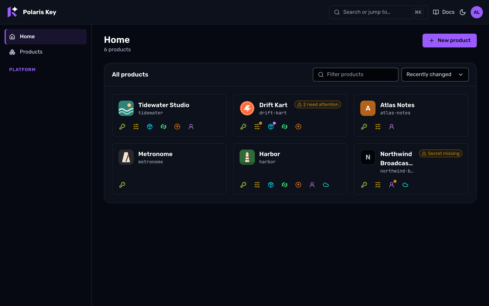
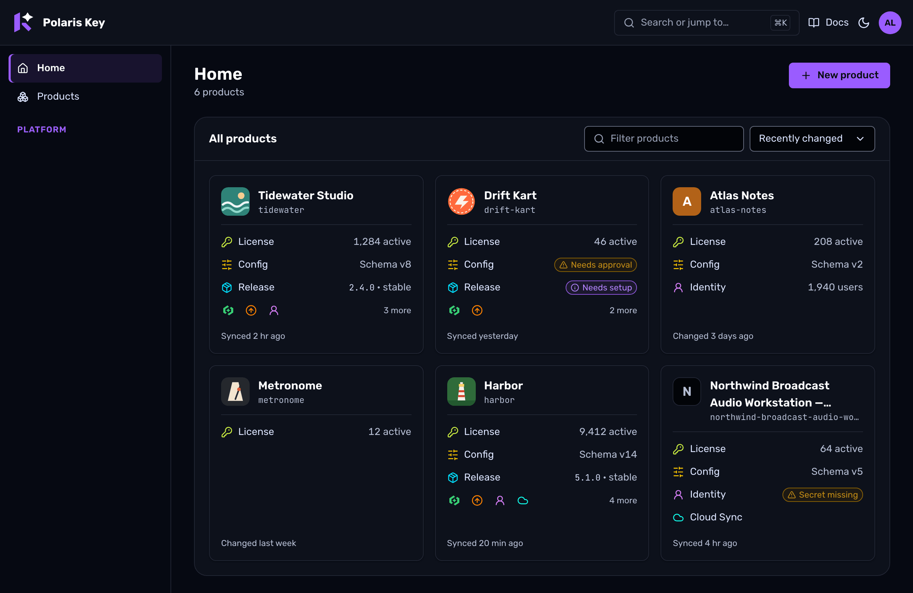
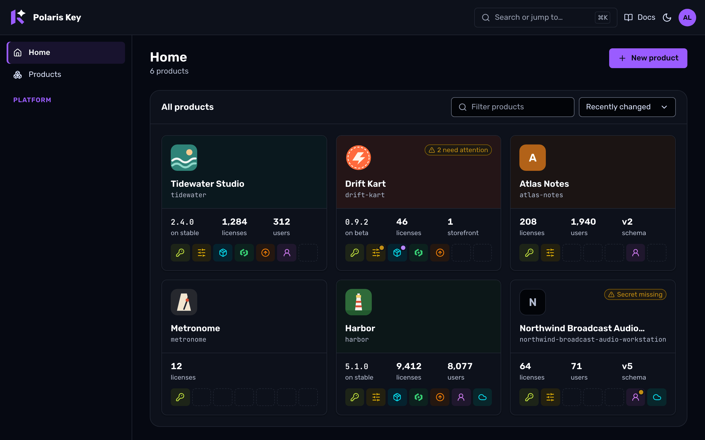

# Console product card: three directions

The owner asked (2026-10-06) for "the product logo in the Admin console's main screen" and "a
better card design which encapsulates the product and its associated services". This folder holds
three directions for the Home product card as static boards, built on `@polaris-key/brand` tokens.
It is phase 1: design only. Nothing in `packages/` changes until the lead picks a direction.

| Board                              | Direction    | Shots (dark · light)                                                                                                                                                                                                                                                      |
| ---------------------------------- | ------------ | ------------------------------------------------------------------------------------------------------------------------------------------------------------------------------------------------------------------------------------------------------------------------- |
| Today                              | (reference)  | [desktop](shots/00-today-desktop-dark.png) · [light](shots/00-today-desktop-light.png), [phone](shots/00-today-phone-dark.png) · [light](shots/00-today-phone-light.png)                                                                                                  |
| [a-rail.html](a-rail.html)         | A · Rail     | [desktop](shots/a-rail-desktop-dark.png) · [light](shots/a-rail-desktop-light.png), [phone](shots/a-rail-phone-dark.png) · [light](shots/a-rail-phone-light.png), [states](shots/a-rail-states-dark.png) · [light](shots/a-rail-states-light.png)                         |
| [b-ledger.html](b-ledger.html)     | B · Ledger   | [desktop](shots/b-ledger-desktop-dark.png) · [light](shots/b-ledger-desktop-light.png), [phone](shots/b-ledger-phone-dark.png) · [light](shots/b-ledger-phone-light.png), [states](shots/b-ledger-states-dark.png) · [light](shots/b-ledger-states-light.png)             |
| [c-spectrum.html](c-spectrum.html) | C · Spectrum | [desktop](shots/c-spectrum-desktop-dark.png) · [light](shots/c-spectrum-desktop-light.png), [phone](shots/c-spectrum-phone-dark.png) · [light](shots/c-spectrum-phone-light.png), [states](shots/c-spectrum-states-dark.png) · [light](shots/c-spectrum-states-light.png) |

Every Home board shows the same six products: healthy with a logo (Tidewater Studio), needs
attention (Drift Kart), no logo (Atlas Notes), one service (Metronome), seven services (Harbor) and
a long name (the layout lint's own Northwind fixture). The one-service and seven-service cards
share a row on purpose: it is the worst case for equal heights. The states boards add icon pulling,
pull failed, today's data only, facts loading, hover, keyboard focus on the card and on a service,
an issue on the product itself, and a product that runs no services.

**Recommendation: B · Ledger**, built in three steps (see [Recommendation](#recommendation)).

## The constraints, measured

- **A card is 301 px wide at 1280 and 316 px at 390.** The 240 px sidebar, the 32 px page gutter
  and the panel's 20 px padding leave 935 px for three columns (measured on today's Home over the
  layout-lint fixtures, `_src/today.mts`). Today's card is 122 px tall.
- **The layout lint is permanent** (`packages/admin/e2e/layoutProbe.ts`). Side-by-side cards share
  one height and one footer edge. A stretched card may leave at most 96 px under its last content.
  A header pill ends its `[data-card-header]` row. Nothing clips or spills its text. All three Home
  boards pass the console's own probe at 1280 and 390, in both themes (`_src/render.mts` runs it), so each
  direction's geometry is known to be lint-clean before any code is written.
- **Pills mean attention** (EXPERIENCE §1 and §7, ADMIN.md §5.11). Only `danger`, `warning` and
  `info` are pills, each with an icon and a word, at the right edge. A healthy card draws nothing.
  There is no "Setup complete" pill and no healthy badge.
- **Accents have roles** (BRAND §5.4). A service accent marks its service's glyph only. Status
  colours never change. The focus ring is always violet.

## What every direction shares

**The logo.** The card draws the product's hosted icon (`hosted_assets`, slot `presentation.icon`,
else `listing.icon`, the order the image host's `/icon` alias uses) whenever a copy exists. That
includes a `failed` or `stale` re-pull: `ingest` keeps the last good copy (`sha256` stays), so a
logo never blanks because a source went away. With no copy (no icon declared, the first pull still
pending, or the first pull failed), the card draws a **monogram tile**: the name's first letter or
digit (`letterOf`, as the portal uses). With a declared accent, the tile is the resolved accent's
`solid` with its `on` letter. Without one, it is neutral (`surface-sunken`, `border-subtle`,
`text-muted`). A pull in flight gets no spinner. The icon is drawn as the developer made it: a
shaped icon (transparent corners) as is, and only a full-bleed square gets the corner mask. This is
the portal `ProductIcon` rule; Drift Kart is the shaped example.

The tile is 40 px (48 px in C), so the image is the 64 px WebP variant at 1x and the 128 px one at
2x (`srcset="…/64.webp 64w, …/128.webp 128w" sizes="40px"`). The original (`imgUrl` with no width)
serves an icon narrower than 64 px, which gets no variants, because the ladder never upscales.

**The link pattern.** The name is the one link to the product (`h3 > a`, DSH-3). Its `::after`
covers the card, so a click anywhere opens the Overview. Service links sit above that layer
(`position: relative; z-index: 1`) as siblings, never nested inside it. Each opens that service's
landing page from `nav.ts`:

- License → Licenses;
- Config → Catalog;
- Release → Releases;
- Distribution → Matrix;
- Update → Update feed;
- Identity → Portal;
- Cloud Sync → Data.

**Services** come from `runningServices` (the service table's order) with `ServiceGlyph`: lucide
for six, the Star Cut for Distribution.

**Attention per service.** Today's attention items can already be pinned to a service with data
Home loads: `setup.secrets[].sources` says who needs a secret ("OIDC client secret" → Identity,
"Edge mint &lt;id&gt;" → Config), and the item kinds map one to one.

| Attention kind (`attention.ts`)        | Belongs to   | Short word on the card |
| -------------------------------------- | ------------ | ---------------------- |
| `mint.pending`                         | Config       | Needs approval         |
| `secret.usage`                         | Config       | Secret not marked      |
| `secret.missing`, source "Edge mint …" | Config       | Secret missing         |
| `secret.missing`, source "OIDC …"      | Identity     | Secret missing         |
| `release.health`                       | Release      | Needs setup            |
| `signing.missing`                      | the product  | No signing key         |
| `onboarding.next`, a failed sync       | the product  | Setup not finished     |
| UX-12 later: halt, store rejection     | Distribution | Halted, Rejected       |
| UX-12 later: expiring, refusal spike   | License      | 3 expiring, Refusals   |

Two issues on one service read "2 issues". The full sentence and the fix button stay in Home's
"Needs attention" list above the cards. The card points; the list explains.

**Copy removed.** The sr-only "Runs License, Config and …" sentence goes: every service is now a
named link. "GitHub ·" goes: the source is not something an operator scans for on Home. A tile
already counts linked products, and Overview's subtitle names the repository. "Changed yesterday"
becomes "Synced 2 hr ago" for a repo-linked product (`setup.sync.lastSyncedAt`, already in the list
payload) and stays "Changed …" for a manual one. Only B keeps that line.

## A · Rail



**Idea.** Today's card plus the logo, with the service dots turned into real links. The header
holds the logo, the name, the slug and at most one pill. Below it sits a rail of 32 px glyph chips,
one per service. A chip's fact ("License: 1,284 active") is its accessible name and its tooltip. A
service with an issue carries a small dot in the tone's colour. The header pill names the issue
("Secret missing"), or counts several ("2 need attention").

**Product accent.** Only the monogram tile. With a logo, the card shows no accent at all.

**Height.** 112 px, constant: seven chips fit one row at 301 px. A two-line name makes it 136 px.

**Pros.**

- The smallest card, shorter than today's 122 px even with the logo.
- Constant height, so no row ever has a hole.
- No API change beyond the logo.
- It renders fully from today's data.

**Cons.**

- The facts exist only in tooltips. That means none at a glance, and none on touch, where there is
  no hover.
- Services are glyph-only, so an operator has to learn seven glyphs.
- A dot points at a service, but only the header pill carries the word, and the tooltip carries
  the rest.
- With seven 32 px chips the rail is close to full, so there is no room to grow.

## B · Ledger



**Idea.** The card lists the product's services as rows. Each row is a link with the service's
glyph and label, and one fact at the right edge. When a service needs something, the fact gives
way to a pill naming it, in that row: "Config · Needs approval". The row then links to the fix
(Edge mint) instead of the service's landing page. Only a product-level issue (a signing key, a
failed sync) is a header pill. The ledger shows at most four rows. Past four services it shows
three rows (services with an issue first, then the table's order) and a fourth row of glyph chips
for the rest, with "3 more". A footer line says when the product last synced or changed.

**Product accent.** The monogram tile, and the card's edge under the pointer: `border-color:
solid`, a hairline that is never a status. The focus ring stays violet.

**Height.** One row is 155 px and four rows are 251 px. A row stretches to its tallest card, and the
footer is pinned to the bottom, so the stretch gap sits above the footer rather than under the
content. The lint passes, but a one-service card beside a four-row card shows up to 96 px of
air (Metronome on the board).

**Pros.**

- The only direction where every service is a labelled part of the card, with its fact and its
  issue in place.
- It reads without learning glyphs, and rows are large touch targets.
- It degrades well. Before the summary read exists, it shows labels, Schema vN and every issue
  pill (states board, "Data Home has today").
- The pill words follow EXPERIENCE: a row pill names its problem, so it needs no second pill.

**Cons.**

- About twice today's height, so fewer cards show above the fold. This fits EXPERIENCE C17's plan
  ("Home = attention + recent products + 2 fleet numbers; Products = the registry"), but it pushes
  Home towards a recent-products shelf.
- The height varies with the service count, so there is a visible gap on sparse cards in a mixed
  row.
- Most facts need the summary read (step 2 below).

## C · Spectrum



**Idea.** A logo-forward app tile:

- **Header band.** A 48 px icon, the name at full width under it, and the pill at the top right,
  on a band tinted with the product's accent.
- **Figures.** Up to three, chosen in a fixed order: release version, licenses, users,
  storefronts, schema.
- **Spectrum.** A fixed seven-slot strip, one slot per service in the table's order. A running
  service lights its slot in its own `subtle` with its glyph and links to it. A service the product
  does not run leaves an empty dashed slot, so a column means the same service on every card down
  the grid.

**Product accent.** The header band is the resolved accent's `subtle`. This is the resolver's
"tinted fill for selected rows", flattened over the page, and every text token clears 4.5:1 on it
(table below). Without an accent the band is untinted. The service slots use their own `subtle`
values, separated from the band by the figures, so the two families never touch.

**Height.** 247 px, constant: the band, the figures and the strip never change size. The name
clamps to one line here because it has the card's full width.

**Pros.**

- The strongest identity: the logo is large and the accent is visible.
- Equal heights by construction.
- The seven-column strip lets an operator scan "who runs Release" down the grid.
- The most "modern" look of the three.

**Cons.**

- It shows absence: a one-service product carries six empty slots and reads unfinished.
- Services are glyph-only, as in A.
- The figures are product facts, not one per service.
- An issue is a dot on a slot plus a header count, which is less precise than B.
- The band only earns its place once products have an accent, which is HA-12. Until then every
  band is untinted.
- In dark, the `subtle` band is quiet: the resolver keeps it dark on purpose.

## Side by side

|                           | A · Rail                     | B · Ledger                    | C · Spectrum                        |
| ------------------------- | ---------------------------- | ----------------------------- | ----------------------------------- |
| Height at 301 px          | 112 px, constant             | 155–251 px, by service count  | 247 px, constant                    |
| Facts                     | in tooltips only             | one per service, visible      | up to three per product, visible    |
| Where an issue shows      | dot + header pill            | pill in the service's row     | dot + header pill                   |
| Service labels            | glyph + accessible name      | glyph + visible label         | glyph + accessible name             |
| Product accent            | monogram only                | monogram + hover edge         | header band + monogram              |
| Renders from today's data | fully                        | labels, Schema vN, all issues | Schema vN only; figures need step 2 |
| Waits for HA-12           | no                           | no                            | yes, for the band to mean anything  |
| Phone (390)               | same card; no facts on touch | same card                     | same card                           |

## How the product accent is used

The accent is **identity, never navigation or status**. It comes from `presentation.accent`, or
`accentDark` in the dark scheme when set (HA-04). It always goes through `resolveAccent` from
`@polaris-key/brand/accent` (UI-KITS.md §3.3), the resolver the SDK kits use, so the console and
the kits agree on a product's colours. The resolver gives `solid` (3:1 or better on every surface),
`on` (4.5:1 or better on `solid`) and `subtle` (a flattened tint every text token reads on).

- It colours one zone per direction:
  - the monogram tile (all three);
  - the hover edge (B);
  - the header band (C).

  It never colours text, links, glyphs, pills or the focus ring, so it cannot be read as a status
  and cannot fight a service accent.

- Service accents stay on service glyphs; status colours stay on pills.
- Any hue is allowed inside that zone: the accent is the developer's content. The no-blue and
  no-rose rules (BRAND §5.1) govern Polaris Key's own accents, not a product's tint. The resolver
  keeps even a pale yellow or a near-black legible (stress rows below).
- In React the roles are custom properties set through CSSOM (`style={{ "--product-solid": … }}`),
  which the console's `style-src 'self'` allows. The portal's `ProductIcon` already sets a tint
  this way.

The worst contrast of each role, from `_src/build.mjs` (which runs the real resolver over the
sample accents):

| Accent                | Theme | `solid` vs surfaces | Letter on `solid` | Strong / muted / warning on `subtle` |
| --------------------- | ----- | ------------------- | ----------------- | ------------------------------------ |
| Tidewater `#369186`   | dark  | 3.98                | 4.50              | 18.07 / 9.70 / 6.15                  |
| Tidewater             | light | 3.88                | 4.50              | 16.56 / 6.41 / 5.84                  |
| Drift Kart `#ff6a3d`  | dark  | 6.30                | 6.99              | 17.58 / 9.43 / 5.98                  |
| Drift Kart            | light | 3.01                | 5.71              | 16.69 / 6.46 / 5.88                  |
| Atlas `#b5651d`       | dark  | 3.97                | 4.51              | 18.17 / 9.75 / 6.18                  |
| Atlas                 | light | 3.89                | 4.51              | 16.57 / 6.42 / 5.84                  |
| Harbor `#3a7d44`      | dark  | 3.58                | 5.00              | 18.24 / 9.79 / 6.20                  |
| Harbor                | light | 4.32                | 5.00              | 16.56 / 6.41 / 5.83                  |
| Pale yellow `#fff3a0` | dark  | 15.86               | 17.60             | 15.40 / 8.26 / 5.24                  |
| Pale yellow           | light | 3.02                | 5.69              | 16.97 / 6.57 / 5.98                  |
| Near-black `#0b1020`  | dark  | 3.03                | 5.92              | 18.41 / 9.88 / 6.26                  |
| Near-black            | light | 16.33               | 18.93             | 15.24 / 5.90 / 5.37                  |

The monogram tile is a non-text graphic (3:1 needed) and its letter is large text (3:1 needed); the
resolver delivers 4.5:1 on both anyway.

## Data and API delta

What each card element reads, and what Home already has. Home loads `GET /manage/api/products`
(every product's `ProductDetail`, setup state included) and the shell's `GET /manage/api/me`. Every
row below is either already in that data or one read for **all** products. No card fetches anything
of its own, so there is no N+1.

| Card element                        | Source                                                                                     | In Home's data today? | Delta                                                                                                                                                                                                                                                                                                                      | Owner                       |
| ----------------------------------- | ------------------------------------------------------------------------------------------ | --------------------- | -------------------------------------------------------------------------------------------------------------------------------------------------------------------------------------------------------------------------------------------------------------------------------------------------------------------------- | --------------------------- |
| Name, slug, services, landing links | `ProductDetail`, `SERVICE_TABLE`, `nav.ts`                                                 | yes                   | none                                                                                                                                                                                                                                                                                                                       | n/a                         |
| Issues, pinned to a service         | `setup.nextActions`, `setup.secrets[].sources`, `setup.modules`                            | yes                   | Client only: `ProductAttention` gains `service: ServiceSlug \| null` and a short word in `attention.ts`. The attention list and Overview are unchanged.                                                                                                                                                                    | this feature                |
| "Synced 2 hr ago" / "Changed …"     | `setup.sync.lastSyncedAt`, `modifiedAt`                                                    | yes                   | none                                                                                                                                                                                                                                                                                                                       | n/a                         |
| Config: Schema vN                   | `/me` `products[].schemaVersion` (`getActiveSchema`)                                       | yes                   | none                                                                                                                                                                                                                                                                                                                       | n/a                         |
| Logo                                | `hosted_assets` (HA-01/05): `presentation.icon`, else `listing.icon`, with `parseVariants` | **no**                | `ProductDetail.presentation.icon: { url, w64, w128 } \| null`: image-host URLs from `imgUrl(env, slug, sha256, w)`, null with no copy. `GET /products` fills it with **one** `SELECT … FROM hosted_assets WHERE locale = '' AND slot IN (…) AND sha256 IS NOT NULL` for every product. Update the OpenAPI response schema. | this feature                |
| The browser may load the logo       | `APP_CSP` `img-src` (`securityHeaders.ts`, shared by console and portal)                   | **no**                | Add `IMG_ORIGIN`. This is in HA-07's scope (and named in HA-06's), and needs `appSecurityHeaders` to become env-aware.                                                                                                                                                                                                     | **HA-07** (sequence, below) |
| Accent                              | `.pkey/product` `presentation { accent, accentDark }` (HA-04)                              | **no**: not stored    | HA-12 adds `products.presentation_json` and `resolvePresentation`. The console then reads `presentation.accent`/`accentDark` on the same field. Until then there is no tint.                                                                                                                                               | **HA-12**                   |
| License: N active                   | `licenses`                                                                                 | **no**                | One summary read (below)                                                                                                                                                                                                                                                                                                   | A-8 slice                   |
| Release: version · channel          | the release truth store (latest app release, the stable channel's release)                 | **no**                | Summary read                                                                                                                                                                                                                                                                                                               | A-8 slice                   |
| Distribution: N storefronts         | the read behind `…/distribution/storefronts` (A-18j)                                       | **no**                | Summary read                                                                                                                                                                                                                                                                                                               | A-8 slice                   |
| Identity: N users                   | `listProductUsers` (`identity/accounts/productUsers.ts`)                                   | **no**                | Summary read                                                                                                                                                                                                                                                                                                               | A-8 slice                   |
| Cloud Sync: usage                   | none yet: the per-principal store is U-05's                                                | **no**                | No fact until U-05                                                                                                                                                                                                                                                                                                         | U-05                        |
| Update                              | n/a                                                                                        | n/a                   | No fact. What Update serves is the Release fact.                                                                                                                                                                                                                                                                           | n/a                         |

**The summary read** is a slice of ADMIN.md's planned A-8 (`GET /summary`, "Home at scale"):

```text
GET /manage/api/summary                       platform-admin, like GET /products
→ { products: { [slug]: { license?: { active }, release?: { version, channel } | null,
                          distribution?: { storefronts }, identity?: { users } } } }
```

Each fact is one grouped query across all products, four in total however many products there are.
A service that is off has no member. Where a service owns the table, the query goes through that
service's descriptor hook (rule 6's spirit; `src/admin/` is outside the boundary test). Gates:

- rule 10: the OpenAPI entry plus the `routeCoverage` table;
- a `qk.summary()` query, refetched with the products query.

Home's card renders without facts until the read lands: a skeleton per fact, no layout shift.
Today the same facts cost Overview one to three reads per service per product.

## Accessibility

- **Card as link.** It is an `article` named by its heading. The heading's link is the only link to
  the product, stretched over the card with `::after`. Each service link is a separate link above
  that layer. Nothing interactive is nested inside another link, and there is no `onClick` on the
  card, so middle-click, Cmd-click, the context menu and the "link" role all work. A pill, a fact
  or a figure is plain text; a click on it falls through to the product.
- **Focus order.** The name comes first, then the services in reading order: left to right in A and
  C; in B top to bottom, then the "more" chips. That is at most eight stops per card. Focus on the
  name rings the whole card. Focus on a service rings only that link (violet, 2 px, offset 2 px).
  Today's card uses `has-[a:focus-visible]`, which would also ring the card when a service has
  focus. The implementation narrows it to the name link (`has-[a[data-card-link]:focus-visible]`).
- **Names.**
  - A and C: a service link's accessible name is its service, its fact and its issue ("Config:
    Schema v3, needs approval"). The tooltip shows the same text on hover **and on focus**.
  - B: the visible row text is the name, the pill's word included.
  - The logo is decorative: an empty `alt`, or `aria-hidden` on the monogram, because the name sits
    beside it.
  - C's empty slots are `aria-hidden` list items, so the list announces only the services that
    run.
- **Colour is never the only signal.** Every pill has an icon and a word. A and C's dot is a shape
  that points at a service, and the words live in the pill and the link name.
- **Targets.**
  - A: chips are 32 × 32 px.
  - B: rows are the card's full width and 32 px tall, and its "more" chips are 28 × 28 px.
  - C: slots are 35 × 32 px.

  All clear WCAG 2.5.8's 24 × 24 px. BRAND §9.4 asks for 44 px on touch. The phone boards still show
  the 32 px size; the implementation raises rows, chips and slots to 44 px below 640 px. That adds
  about 48 px to a four-row B card on a phone.

- **Truncation.** In A and B a name wraps to two lines, then ellipsis. In C it truncates at one
  line. The slug truncates at one line. Both carry the full text in `title`; the layout lint's
  no-crush rule accepts that, and the boards pass it.
- **Motion.** Hover and focus changes use MO-09's tokens. Nothing loops but the skeleton. Under
  reduced motion everything swaps instantly. The cards compose `StatusPill`, `Skeleton`,
  `Tooltip` and `ServiceGlyph` as they are; none of them is restyled (MO-04 and MO-09 are in
  flight).

## Collisions and sequencing

- **HA-06** owns the Presentation page, uploads and the delete-a-copy action. The card only reads
  the icon and never offers an action on it. A failed icon pull is not a card pill: it is
  cosmetic, and HA-06's page shows it.
- **HA-07** adds `IMG_ORIGIN` to `APP_CSP` (`img-src`). Until that lands, an `` pointing at
  the image host is a CSP violation, and the CSP and layout e2e suites record violations. The card
  build either waits for HA-07's first step, or carries that one change itself so HA-07 rebases on
  it. **Lead's call.**
- **HA-12** stores the accent and adds `resolvePresentation`. The card's accent arrives with it.
  The console's `presentation` field reuses HA-12's resolver when it lands, rather than a second
  icon lookup.
- **MO-04 and MO-09** are composed, not changed. MO-11 (counters) does not touch the card.
- **EXPERIENCE C2.** The "Setup complete" stat tile still on Home counts healthy products, which
  EXPERIENCE retires. It is outside this feature and listed as a follow-up.

## Recommendation

**Build B · Ledger.** The owner asked for a card that encapsulates the product and its services.
B is the only direction where each service is a visible, labelled, linked part of the card that
carries its own fact and its own issue, which also answers ADMIN.md §6.1's question ("what needs
me?") per product. It works on touch without hover, needs no glyph learning, and degrades well:
before any API change it already shows the logo, every service, Schema vN and every issue in its
row.

Build it in three steps, each mergeable alone:

1. **Card and logo.**
   - `ProductDetail.presentation.icon` (one batched query; OpenAPI).
   - A console `ui/ProductLogo`: the portal's shaped/square and `onError` rules, plus the
     monogram. It shares `letterOf` and `iconShape` through `lib/`, so portal code stays
     untouched while HA-07 edits it.
   - `service` on `ProductAttention`.
   - The B card, landed according to the CSP decision above.
2. **Facts.** `GET /manage/api/summary` (the A-8 slice; rule 10), with skeletons while it loads.
3. **Accent.** After HA-12: the monogram tint and the hover edge.

Two refinements to carry into the build. Cap Home at the six most recently changed products, as
EXPERIENCE C17 plans; the Products page stays the full registry. That keeps B's taller card from
making Home a long scroll. On phones, make rows 44 px tall (Accessibility).

**Runner-up: C.** Choose C if the lead prefers a constant-height, logo-first tile and accepts
glyph-only services, empty slots on sparse products and a band that stays untinted until HA-12.
**A** is the low-cost fallback: today's card with a logo and links, but no facts a glance can see.

## Built: direction B (2026-10-06)

The lead picked **B · Ledger**, and it is built in two steps on `feat/console-product-cards`.
The real console's shots, over fixture data that mirrors the board's six products, sit beside the
mockup's: `shots/built-home-{desktop,phone}-{dark,light}.png` and
`shots/built-products-{desktop,phone}-{dark,light}.png` (`_src/built.mts`).

**Step 1: the card, the logo and the CSP.**

- `GET /manage/api/products` carries `presentation.icon`: one statement reads every product's
  icon. It is the `presentation.icon` copy, else the `listing.icon` copy, as image-host URLs with
  the 64 and 128 px variants (`admin/lib/presentation.ts`).
- The console shell's CSP adds exactly `IMG_ORIGIN` to `img-src` (`cspImageOrigin`).
- The card is `ProductCard` in `console/pages/global/Home.tsx`, and the logo is
  `ui/ProductLogo.tsx`.
- Home shows the six most recently changed products, with an **All products** link.
- The Setup complete tile is gone.
- The Products table's name cell carries the logo.

**Step 2: the facts.**

- `GET /manage/api/summary` runs four grouped queries for every product
  (`admin/lib/summary.ts`).
- The card shows each row's fact, with a skeleton while the read is in flight, and renders fully
  without it.

Decisions made while building:

- **Which icon copy counts.** It is a copy the image host serves: a stored hash of a served image
  type, with no first pull still pending. A `failed` or `stale` re-pull keeps its last good copy,
  so the logo stays, as this README's logo rule says.
- **Storefronts.** The count is the storefronts with a live outlet, as the Storefronts page
  decides them. Homebrew, Scoop and Polaris Key's own page all ride the `direct` outlet, so they
  count once: one outlet cannot say which of them is set up.
- **Home's filter and sort.** They are gone. A six-card shelf needs neither, and the Products
  table keeps search, the facets and the sort.
- **The accent.** Not built yet. `ProductLogo` calls `resolveAccent` behind a null accent: the
  HA-12 seam.

## Rebuilding

```sh
mise exec node@22 -- node docs/design/console-product-card/_src/build.mjs
mise exec node@22 -- node_modules/.bin/tsx docs/design/console-product-card/_src/render.mts
# The "today" reference (needs the built console):
mise exec node@22 -- pnpm --filter @polaris-key/admin build
mise exec node@22 -- node_modules/.bin/tsx docs/design/console-product-card/_src/today.mts
# The built card (needs the built console):
mise exec node@22 -- node_modules/.bin/tsx docs/design/console-product-card/_src/built.mts
```

`build.mjs` writes the six boards and `_src/accents.generated.css`, and prints the contrast table.
`render.mts` shoots every board at device scale 2 (1280 px and 390 px wide, full height) into
`shots/`, runs the console's layout probe on the Home boards, and fails on a console error, a
missing font, sideways overflow or any probe violation. The boards are generated: edit `_src/`, then
rebuild. The product icons are stand-in developer art drawn by `build.mjs`.
