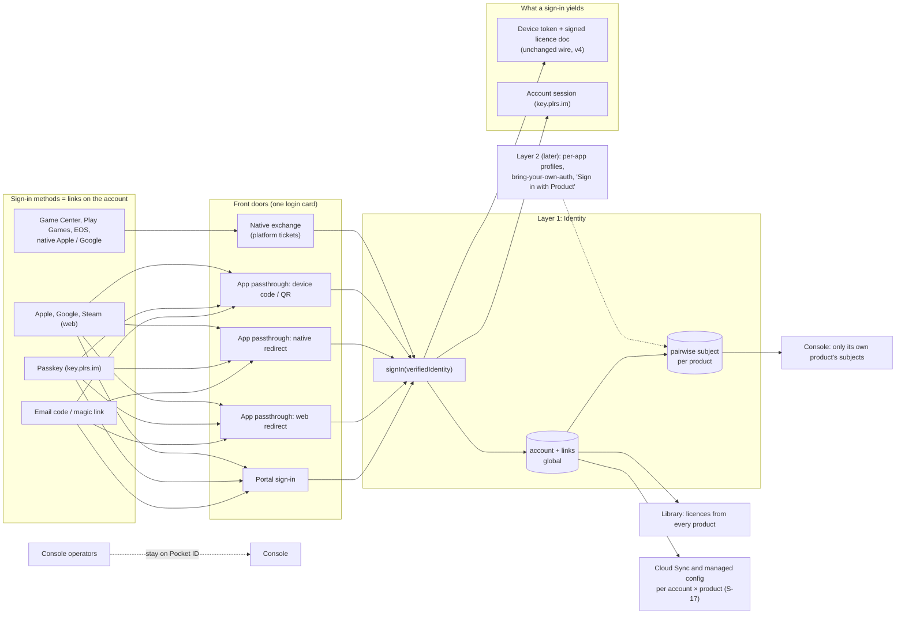

> Research note for [Godot on Polaris Key](../README.md), 2026-10-04. Spike S-16, commissioned
> by the lead on the owner's direction of 2026-10-04: define what a proper Identity service is,
> whether a proxy to a platform or product IdP, a Polaris-run OIDC/OAuth2 provider, or both. It
> has no program brief yet; §8 proposes an `I-` work-package namespace. Research and design only:
> no product code changed, nothing was deployed, and no account or credential was used. The only
> live calls were two anonymous `GET`s of the platform IdP's public discovery and JWKS documents
> (§3.1). File references are to the tree at `0c35758e` (`W/` = `packages/worker/src/`,
> `M/` = `packages/worker/migrations/`). Restructured the same day around the owner's two-layer
> decision below; the earlier product-scoped design survives only where this revision says so. Revised
> again the same day for a review's critique: id and phase map, the owned-licence refusal, the
> web redirect's code exchange, S-17's requested hooks, privacy residuals and the SDK estimate.
> Finalised the same day for the owner decisions directly below (D17–D23, the account/service
> split, key-entry limits only with Identity, and the join offer at email confirmation).
> Closed the same day for the owner's final answers directly below: D24, D25 and D27 accepted
> (D27 pending a legal review), and Cloud Sync needs sign-in, so it requires Identity.

> **Owner's final answers (2026-10-04). These close §10 and win over every header and section
> below.**
>
> 1. **D24 accepted.** On a product with Identity on, entering the key of an owned licence on a
>    _new_ device is refused with `license_owned` (403, with `signInUrl`) and the device signs in
>    instead. Re-entry on an already enrolled device keeps working, and existing installs are
>    untouched (§5.3).
> 2. **D25 accepted as proposed.** "Remove my data from <Product>" keeps the licence attached
>    unless the person also chooses "remove the licence from my Library" (§5.1).
> 3. **D27 accepted as proposed, still pending a legal review** of the DPA wording (§5.5).
> 4. **Cloud Sync needs sign-in** (S-17's decision 22, decided the other way from its proposal).
>    Cloud Sync is available only to devices signed in through the product (`devices.subject`,
>    set by sign-in), never through the licence owner. Its descriptor is
>    `requires: [config, identity]`, and the console Services toggle enforces that dependency.
>    This replaces the final-round header's "Cloud Sync depends on the account, not on the
>    Identity toggle" (item 2 below). Config's account override layer still reaches key-entry
>    devices on owned licences through the licence owner; floating licences have no such layer
>    (S-17 §5.12).

> **Owner decisions (2026-10-04, final round). These govern the note; where any header or section
> below says otherwise, these win.**
>
> 1. **D17–D23 are accepted as proposed** (§10):
>    - D17: account credentials are entered only on the `key.plrs.im` login card; the in-app
>      email-code API is dropped from layer 1.
>    - D18: a product's own IdP stays product-only in layer 2, linkable from the portal under
>      step-up.
>    - D19: the console shows the buyer email, and the account's primary email only with the
>      person's consent.
>    - D20: a key entry counts only when it enrols a new device or is a portal submission.
>    - D21: on merge, the survivor's pairwise subject wins, the other becomes an alias, and the
>      developer gets `subject.merged`.
>    - D22: no silent SSO into apps: the first sign-in to each app needs "Continue to <App>", and
>      device code always does.
>    - D23: dormant accounts (no sign-in and no licence) are deleted after 36 months, with an email
>      warning first.
> 2. **The account is platform-level; Identity is a per-product service.** The Polaris Key
>    **account** (layer 1: links, login card, Library, Discover, Activate License, pairwise subjects)
>    is always present, part of Core and the portal, and has **no per-product toggle**.
>    **Identity** is the per-product **service**: the console toggle plus the SDK Identity feature.
>    Its core is app passthrough sign-in ("<App> wants you to sign in", by web redirect, native
>    redirect, device code or exchange), available only on products with Identity on. It also
>    covers app-specific profiles and, later, "Sign in with <Product>" (layer 2). Products without
>    Identity still attach licences to accounts through Activate License, the portal and Discover,
>    but never show app sign-in. **Cloud Sync needs sign-in, so it requires Identity** (final
>    answers above; this item first said Cloud Sync depends on the account, not on the toggle).
>    This supersedes D26 (§5.1, "The account and the Identity service").
> 3. **Licence-key entry limits apply only to products with Identity on.** Without Identity a key is
>    the app's only activation path, so key entry stays unlimited, there is no owned-licence
>    refusal, and the portal offers the account upgrade on every entry but never forces it (§5.3).
> 4. **Email confirmation offers to join accounts.** If the email confirmed at the first-sign-in
>    step already belongs to another Polaris Key account, the step **offers** to join the two:
>    the person proves both in one session, then confirms. It never joins silently (§5.1, Rules).

> **Owner decision (2026-10-04): Identity is two layers. This decision governs the note; where an
> older header below says otherwise, this one wins.**
>
> 1. **Now: one Polaris Key account across all products** (Steam-like). One login, one
>    **Library** holding licences from every developer's products.
>    - _Sign-in methods are links on the account:_ email code or magic link, passkeys, Apple,
>      Google, Steam; no Discord; Game Center, Play Games and EOS native identities as links;
>      Microsoft/Xbox only if that storefront becomes real. Connect and disconnect at any time,
>      under step-up, with a last-method guard, audited and emailed.
>    - _Sign-in UX:_ identifier-first email; an "add another way to sign in" nudge;
>      link-existing-account (merge only with proof of both identities, never by email match);
>      sign in on another device by QR or code.
>    - _First provider sign-in:_ the required interstitial confirming the email, and profile
>      import, as in the two headers below (a provider-verified email needs no code).
>    - _Licences attach to the account._ **Floating licences** (no account) keep working but
>      prompt sign-up. The legacy key flow is the bounded on-ramp in the header below.
>    - _Portal (proto-Steam):_ Library (default), Discover (eligible auto-issue products; Add to
>      library mints a licence), an Activate License modal, Cloud Sync only on the product pages
>      of products with that service. App passthrough login is the same login card with a
>      persistent "<App> wants you to sign in" header, for web, native and device code.
>    - _Safety defaults stay:_ the licence claim rules, no recovery desk (the developer's relink
>      tool with step-up, reason, notice and 72-hour undo), custom auth domains deferred, passkeys
>      on `key.plrs.im`. Operators stay on Pocket ID.
> 2. **Developer privacy with a shared account.** Developers only ever see data for their own
>    products. Each product gets a **pairwise (per-product) subject** for a user instead of the
>    global account id. No cross-product visibility. GDPR deletion removes the account and all
>    links; per-product data deletion and export exist.
> 3. **Later: the per-app identity layer.** App-specific profiles, apps signing users in beyond
>    licence attach, and the per-product issuer ("Sign in with <Product>", leaning in-house on
>    jose). Full scope stays approved, but layer 1 is the focus and ships first.
> 4. **Cloud Sync (S-17)** is its own service, "Cloud Sync" (slug e.g. `sync`), with its own
>    toggle, depending on Config and on the product's Identity service (sign-in; see the final
>    answers above). The licence-level config override layer is
>    removed everywhere, replaced by user-level managed config attached to the **account per
>    product**. Floating licences have no such layer. Overrides on licences with no owner are
>    dropped at migration with an operator-visible report. No Cloud Sync without signing in, ever.
>    Web apps use a device token from the product's `web.origins` allowlist (depends on the
>    redirect WP).
>
> **How the older headers read now:** "Option C approved" stands, but its principal is the global
> account, not a product-scoped user. "Scope: everything, phases 0–3" stands as layers 1 and 2.
> "The owning user" in the config-override header means the owning account.
>
> **Old ids and phases in the older headers.** The headers below were written against the earlier
> product-scoped work-package table, and their ids are kept verbatim as the record. Read them
> through this map (§8 has the current table):
>
> | Older id                     | Now             | Older id                     | Now               |
> | ---------------------------- | --------------- | ---------------------------- | ----------------- |
> | I-01, I-02, I-03, I-04       | same ids        | I-13 native redirect         | I-15              |
> | I-05 broker and discovery    | I-06            | I-14 passkeys                | I-16              |
> | I-06 users and links         | I-05            | I-15 portal convergence      | I-11              |
> | I-07 console users           | I-12            | I-16 issuer (plan and build) | I-20 (plan), I-21 |
> | I-08 email login             | I-07, I-08      | I-17 docs                    | I-19              |
> | I-09 Pocket ID migration     | I-17            | I-18 named-user seats        | I-24              |
> | I-10 exchange endpoint       | I-13            | I-19 backend assertion       | I-25              |
> | I-11 SDK identity (email)    | I-10a, I-10b    | I-20 Apple kind              | I-06              |
> | I-12 game verifiers          | I-14            | I-21 email delivery          | I-18              |
> | I-22 SDK identity (exchange) | I-13 (SDK half) |                              |                   |
>
> Phases: older phase 0 is phase 0; older phase 1 (users and email) is phase 1a; older phase 2
> (native and games) is phase 1b for platform kinds and layer 2 for product-IdP kinds; older phase
> 3 (the issuer) is layer 2, phase 2. So "I-09 therefore migrates by claim" means I-17, "decide in
> I-16's plan" means I-20's plan, "the I-04 contract plan" still means I-04, and "the redirect
> WP" in decision 4 above is I-08.

> **No Discord (owner, 2026-10-04).** Providers follow where a product ships: Apple (required for iOS social sign-in under App Review 4.8), Google (Play/Android and general), Steam, and the native platform identities (Game Center, Play Games, EOS). Microsoft/Xbox only if Microsoft Store/Xbox becomes a real storefront for a product.
>
> **Owner decisions (2026-10-04):** Option C approved. **Scope: everything, phases 0–3 including the per-product issuer** ("Sign in with <Product>", ~86 agent-days). Issuer: decide in I-16's plan, leaning in-house on jose (Ory Hydra stays the alternative). Safety defaults confirmed: a licence carrying an email attaches only to a user with that verified email (no attach-by-key unless the product sets `claimByKey`); a licence with an owner never moves by presenting its key; Polaris runs no recovery desk — beyond a user's remaining links, recovery is the developer's job via the console's audited relink tool (step-up, reason, notice, 72-hour undo); custom auth domains deferred, passkeys enrol on key.plrs.im only. Pocket ID facts (checked by the lead, 2026-10-04): separate OIDC clients per app are supported [V] (pocket-id.org/docs/introduction), so I-03 can give the console its own client; `email_verified` is in the discovery document's `claims_supported` [M] (id.plrs.im/.well-known/openid-configuration), so verified status is available per user at sign-in; a bulk export through the admin REST API needs an admin API key (the users endpoint answers 401 without one) [M] — I-09 therefore migrates by claim at each user's next sign-in, with a bulk export only if the owner issues an admin API key.

> **Owner decision (2026-10-04): import profile data from identity providers.** Pull name, picture and locale where a provider offers them:
>
> - Google: name, picture, locale.
> - Apple: name on first consent only, so capture it then; no picture.
> - Steam: persona name and avatar through the Web API key.
> - Game Center, Play Games and EOS: display name or alias, plus an avatar where exposed.
>
> The first-sign-in confirmation step shows the imported name and picture for the user to adjust. The account page gains a Profile section: choose which linked provider's name or picture to use, or upload one. Explicit choices stick; untouched values refresh on sign-in. Avatars are copied into our blob storage (same-origin for the CSP, no provider tracking, stable URLs). Apps receive profile claims only when requested and shown on the consent screen. Account deletion removes the profile and the copied avatars.

> **Owner decision (2026-10-04): confirm the email on first provider sign-in.** The first time a user signs in through a provider (Apple, Google, Steam, or a platform identity), a required interstitial asks them to confirm their email before they can continue, the way storefronts gate Terms acceptance. It is prefilled with the provider's email (including an Apple private-relay address). The user can keep it or switch to a real address. **An email the provider asserts as verified (for example Google's `email_verified: true`, or Apple's email including private relay) is accepted without our own code** (owner, 2026-10-04). Only an address the user types, or one the provider does not mark verified, is verified with a one-time code. The verified address becomes the account's primary email. It then drives the email-bound claim rules, notices and account matching. Steam and other providers that return no email start with an empty field. The same step can carry Terms acceptance when a product requires it.

> **Owner decision (2026-10-04): the legacy licence-key flow becomes a bounded on-ramp to accounts.**
>
> 1. **Entries are limited** (only on products with Identity on: final-round header, item 3). Each licence key has a limited number of key _entries_ (activations by typing or pasting the key) through the portal or an app. The limit is product-configurable (for example 5, 10 or 25).
> 2. **Every portal entry offers an upgrade.** Each time the key is used in the portal, the user is prompted to upgrade to an account (which adds sync and the other account features). They may **skip** while entries remain.
> 3. **When entries run out, the portal forces it** (on products with Identity on; without
>    Identity there is no limit and the upgrade is only ever offered: final-round header, item 3). The skip is removed and the user must create or sign in to an account, to which the licence then attaches (subject to the claim rules above).
> 4. **When entries run out, apps refuse the key** (Identity on only). They direct the user to the customer portal to set up their account, with a deep link to the product's portal page.
> 5. **Only key entry is affected.** Existing licensed installs are never affected: device tokens, refresh, offline grace and the signed licence document keep working exactly as today.
>
> This changes device-facing behaviour (a new refusal on activation-by-key, carrying the portal URL), so it goes through the I-04 contract plan: contract → errors.json → transcripts → all six SDKs, plus the SDK UI kits' activation screens.
>
> **Owner decision (2026-10-04): the licence-level config override layer is removed in favour of user-level managed config (S-17).** Licences without a user simply don't get that layer. Existing licence overrides need a migration path, designed in S-17: onto the owning user where one exists, otherwise dropped with operator visibility.

# S-16: the Identity service, defined

Evidence tags, as in the other notes:

- **[V]**: verified by reading this repo's code, config or docs, or a primary external source;
- **[M]**: measured here (a command run on this machine, 2026-10-04 14:34 UTC);
- **[I]**: inference or recommendation;
- **[U]**: unverified: needs an account, partner documentation or a staging deploy.

## 1. Summary and recommendation

**Question.** Identity is the least defined of the seven services. The owner asked whether it
should proxy to a platform or product identity provider (IdP), or run a lightweight OIDC/OAuth2
provider of its own based on the user's account (licence, email or upstream OIDC), and what the
feature as a whole should look like.

**What it is today.** Identity is not an identity service. It is three older pieces of code that
D-14 moved behind one service descriptor, and nothing more [V]
(`W/services/identity/index.ts:4-10`). Those pieces are product OIDC sign-in that ends in a
licence row and a device token, a first-party browser cookie, and the platform-global customer
portal. There is no user record: "the user" is four columns on `licenses` (`M/0001_init.sql:64-81`).
Nothing a developer's own backend can verify is issued. Native apps can only sign in with device
code. Only one IdP shape works, and that shape is our own platform IdP's. §3 lists fifteen gaps.

**What the platform IdP is.** `id.plrs.im` is a self-hosted **Pocket ID** instance [M]. It is a
passkey-first OIDC provider: RS256 only, `subject_types_supported: ["public"]`, and the
non-standard `/api/oidc/token` path that our code hard-codes. Platform operators, the portal and
every `provider: platform` product's end users all share it, through one client (§3.1). It cannot
issue per-product (pairwise) subjects or carry licence claims, and it holds operator and customer
identities in one directory.

**Decision (owner, 2026-10-04): two layers.** Option C ("broker in, own accounts, thin issuer
out", §4) stands, with one change to its centre: the principal is **one global Polaris Key
account**, not a product-scoped user.

- **Layer 1, now: the account.** A person has one account on `key.plrs.im` and one **Library**
  holding licences from every developer's products, as on Steam. Every way of signing in is a
  **link** on that account. Licences attach to it. Each product sees the person only through a
  **pairwise subject** that means nothing to any other product. Layer 1 is a customer account
  and a Library, platform-level and always on (part of Core and the portal, with no product
  toggle), plus the per-product **Identity service**: app passthrough sign-in, only on products
  that turn Identity on (owner, final round). It does not yet give a developer's app its own user profiles or tokens.
- **Layer 2, later: per-app identity.** App-specific profiles, apps signing users in beyond
  licence attach, bring-your-own-auth with the product's own IdP, and the per-product OIDC
  issuer ("Sign in with <Product>"). Approved in full, planned separately after layer 1 ships.

**Layer 1, concretely [I] unless stated as the owner's decision.**

1. **One account, many links** (§5.1). Email code or magic link, passkeys, Apple, Google and
   Steam on the web; Game Center, Play Games and EOS through native verification. A link is a
   verified `(issuer, subject)`. Links are added and removed under step-up, never orphaning the
   account, and accounts merge only with proof of both. Some native identities are scoped per
   developer team, so those links only recognise the person inside that developer's products
   (§5.1, "Tenant-scoped links").
2. **One login card** at `key.plrs.im` for the portal and for every app with Identity on. Web redirect, native
   redirect and device code all land on it, with the persistent header "<App> wants you to sign
   in". A first provider sign-in passes the email-confirmation interstitial once. **Apps never
   host account credential entry themselves**, so the in-app email-code API that the earlier
   revision planned is dropped from layer 1 (§5.4 item 13; D17).
3. **Licences belong to accounts.** The claim rules carry over unchanged. Floating licences (no
   account) keep working and prompt sign-up. On products with Identity on, key entry becomes a bounded on-ramp: past the
   product's entry limit, apps refuse the key and deep-link to the portal's `/activate` (§5.3).
   Without Identity, key entry stays unlimited and the portal offers the upgrade but never forces
   it (owner, final round).
4. **The portal becomes the Library** (§5.7): Library, Discover, Activate License, account
   settings (sign-in methods, profile, devices, privacy), and Cloud Sync on the pages of products
   that have it (which implies Identity).
5. **Developers see only their own products** (§5.2). The console's Users page, on every product
   (platform-level, like the account), lists pairwise subjects of accounts that hold or used the
   product's licences; Identity adds each subject's sign-ins to the product. It never shows the global
   account id, other products, or the rest of the Library.
6. **The device keeps the signed licence document as its only gate.** Layer 1 adds two refusals
   on key entry (past the limit, and on an owned licence, D24), both only on products with Identity
   on, an attach step and sign-in routes,
   including the web redirect's code exchange that gives a product web app its device token. All are additive, so `PROTOCOL_VERSION` stays 4.
   They are still device wire, so they go through plan mode: contract, then `errors.json`, then
   transcripts, then all six SDKs, plus the UI kits' activation screens (§5.3).
7. **Operators stay on Pocket ID** through a separate console client (I-03). End users leave it.

**Cost, for a small team [I].** The **layer 1 core** (accounts, links, the login card, email,
web providers, key-entry limits, the Library portal, console users and SDKs) is about **68
agent-days**, roughly 9–11 calendar weeks. Native platform links, native redirect, passkeys and
the Pocket ID migration complete layer 1 for about **23 more** (91 in total). **Layer 2** is about
**28** (119 overall). The earlier product-scoped plan was 86 for phases 0–3. The difference is the
Library portal, the key-entry wire, account merge, the pairwise subjects and a realistic SDK
estimate. Figures are in §7.1.



The decisions already taken are in §10 with the few that remain, each with a recommended default.

## 2. What Identity is for: the jobs

Each job is drawn from the landscape survey (licensing peers Keygen, Cryptlex, LicenseSpring,
Lemon Squeezy, Paddle and Gumroad; game backends EOS, PlayFab, Unity Authentication, Nakama, Talo
and Xsolla; Firebase, Supabase and RevenueCat; sources in §11). **Layer 1** ships first, **layer
2** follows (§7), **later** means beyond both, and **never** means out of the service's charter.

| #   | Job                                                                                                                                                          | Scope                  | Why                                                                                                                                                                                                                                                                        |
| --- | ------------------------------------------------------------------------------------------------------------------------------------------------------------ | ---------------------- | -------------------------------------------------------------------------------------------------------------------------------------------------------------------------------------------------------------------------------------------------------------------------- |
| J1  | A person signs in from an app or game and their licences and entitlements follow them to every device                                                        | **layer 1**            | Table stakes: every licensing peer with users (Keygen, Cryptlex, LicenseSpring) and every game backend has it [V]. Polaris half-has it: product OIDC mints a licence [V] (`W/services/identity/oidc.ts:697-845`)                                                           |
| J2  | **A hosted account for everyone**: email code or magic link, passkeys, Apple, Google, Steam. Developers with no IdP get it for free                          | **layer 1**            | Most indie and Godot studios have no IdP. Talo, Unity Authentication and Keygen all ship a built-in account [V]. Polaris already sends magic links, but only for the Polaris-branded portal [V] (`W/services/identity/portal/email.ts:21-27`)                              |
| J3  | **Bring your own auth**: an app that already signs users in (Clerk, Firebase, Auth0, Supabase, Cognito) exchanges that token                                 | **layer 2**            | No user migration for the product. One generic JWKS verifier covers about 11 of 17 surveyed providers [I]. A product's own IdP is a per-app identity, so it waits for layer 2 (§5.1)                                                                                       |
| J4  | **Sign-in with the platform identity**: Steam, Game Center, Play Games, EOS                                                                                  | **layer 1** (phase 1b) | The game-program differentiator. Steam ticket verification and x509 chain verification already exist for commerce [V] (`W/services/distribution/commerce/steam.ts`, `apple.ts`, `W/core/x509.ts`). As links on the account, after one interstitial (§5.3)                  |
| J5  | Sign in on a TV, console, kiosk or headless Godot build with a phone                                                                                         | **layer 1** (exists)   | RFC 8628 is implemented and hardened, with QR codes in Godot and Kotlin [V]. Only Godot sends the P1-07 confirm-and-attach step [V] (`packages/sdk-node/src/identity/client.ts:16-19`)                                                                                     |
| J6  | Link identities and merge accounts (bought on Steam, play on mobile; floating licence first, sign in later)                                                  | **layer 1**            | Every game backend has link, unlink and merge with explicit rules (Nakama never removes the last identifier; RevenueCat's Transfer-or-Block restore policy) [V]. Polaris verifies store purchases but hangs them on licences, not people [V] (`M/0052_commerce.sql:13-27`) |
| J7  | **The Library**: every licence from every developer in one place, plus devices, downloads and activation                                                     | **layer 1**            | Steam's library is the model the owner chose. Lemon Squeezy's My Orders and Paddle's portal set a lower bar; ours is already global with magic links [V]                                                                                                                   |
| J8  | **"Sign in with <Product>"**: ID and access tokens with entitlement claims for the developer's forum, community bot, web companion, cloud saves or MCP tools | **layer 2**            | No licensing peer offers it, so it is a real differentiator [V]. It makes Polaris a token issuer with ongoing key, consent and conformance duties                                                                                                                          |
| J9  | Native redirect sign-in (loopback or claimed-HTTPS redirect) so desktop and mobile apps are not limited to device code                                       | **layer 1** (phase 1b) | Swift's `PolarisLoginView(onSignIn:)` defaults to a no-op and four native SDK rows are planned and unowned [V] (`sdks/swift/Sources/PolarisKeyUI/PolarisLoginView.swift:107-125`). Device code is a poor fit on a phone                                                    |
| J10 | Named-user seats: N users per licence, M devices each                                                                                                        | **later**              | Keygen `maxUsers` and Cryptlex named-user licences [V]. It needs a user claim in the signed licence document, which is a corpus and all-SDK event                                                                                                                          |
| J11 | B2B organisations with per-customer SSO and admin seat assignment                                                                                            | **later** (enterprise) | Enterprise-tier everywhere (LicenseSpring, Cryptlex SAML, Keygen) [V]. Only worth building once J1 and J10 exist                                                                                                                                                           |
| J12 | Console platforms (PSN, Xbox, Nintendo) through the product's backend or EOS                                                                                 | **later**              | Verification is under NDA and cannot ship in an open-source Worker or SDK [I]. An RFC 7523 assertion from the product's backend, or EOS Connect, covers it without NDA code                                                                                                |
| J13 | The console's own operator sign-in                                                                                                                           | **never** in Identity  | Every peer separates "your team signs in" from "your customers' identity" [V]. Operators stay on the platform IdP (`W/admin/authz.ts:1-13`)                                                                                                                                |
| J14 | Passwords                                                                                                                                                    | **never**              | Credential stuffing, breach monitoring and reset flows for no gain over email codes plus passkeys [I]                                                                                                                                                                      |
| J15 | Dynamic client registration and an open third-party app ecosystem                                                                                            | **never** (for now)    | Clients belong to a product's developer, so they are registered in the console or manifest. DCR is a spam and abuse surface [I]                                                                                                                                            |
| J16 | Social features: friends, presence, leaderboards                                                                                                             | **never**              | That is a game backend (Nakama, PlayFab, EOS), not identity [I]. A cross-developer account makes this temptation stronger; the charter holds                                                                                                                               |

## 3. Current state and gaps

### 3.1 The platform IdP is Pocket ID

| Fact                                                                                                                | Evidence                                                                                                          |
| ------------------------------------------------------------------------------------------------------------------- | ----------------------------------------------------------------------------------------------------------------- |
| `id.plrs.im` is "PocketID", the production `PLATFORM_OIDC_ISSUER`                                                   | [V] `docs/DEPLOYMENT.md:20,87-95`, `docs/RUNBOOK.md:20`                                                           |
| Its discovery document names `service_documentation: https://pocket-id.org/docs`                                    | [M] `curl -s https://id.plrs.im/.well-known/openid-configuration`                                                 |
| `token_endpoint` is `/api/oidc/token`, the path `oidc.ts`, `portal/auth.ts` and `admin/auth.ts` hard-code           | [M] same; [V] `W/services/identity/oidc.ts:1466`, `W/services/identity/portal/auth.ts:284`, `W/admin/auth.ts:146` |
| Signing: `id_token_signing_alg_values_supported: ["RS256"]`; the JWKS holds one RSA key                             | [M] same, plus `curl -s https://id.plrs.im/.well-known/jwks.json`                                                 |
| Subjects: `subject_types_supported: ["public"]`, so one human has the same `sub` in every product that uses it      | [M]                                                                                                               |
| Supported: device grant, refresh, `client_credentials`, PAR, introspection, RFC 9207 `iss`, PKCE `plain` and `S256` | [M]                                                                                                               |
| One client serves console admin, the root portal and every `provider: platform` product                             | [V] `docs/DEPLOYMENT.md:94-95`; `W/platformOidc.ts:9-30`                                                          |
| Where Pocket ID runs, and how it is backed up and patched                                                           | [U] not on the Worker; not in this repo                                                                           |

Consequences [I]:

- The "hard-coded paths, no discovery" defect (G4) is an accident of having built against one
  Pocket ID instance. Discovery would make the platform and custom paths the same code.
- A Pocket ID user in the `admins` group is a platform operator, and a product's customer is a
  user in the same directory. A mistake in group assignment, or a compromise of the shared client
  secret, crosses from customer to operator. This is G5.
- Pocket ID issues public subjects only, so it cannot be the per-product issuer for J8 without
  leaking a cross-tenant correlator. It also cannot put licence claims in its tokens.

### 3.2 Gaps

All [V] unless marked. G1 to G15 are the current-state survey's numbering.

| #   | Gap                                                                                                                                                                                                            | Evidence                                                                                                                                                                                                                                             |
| --- | -------------------------------------------------------------------------------------------------------------------------------------------------------------------------------------------------------------- | ---------------------------------------------------------------------------------------------------------------------------------------------------------------------------------------------------------------------------------------------------- |
| G1  | No token a developer's backend or web app can verify: no ID, access or refresh token, no userinfo, no per-product issuer or JWKS                                                                               | `W/services/identity/index.ts:61-82` (discovery fragment: endpoints only); `oidc.ts:848-861` (sign-in yields a device token or cookie)                                                                                                               |
| G2  | No sign-in for third-party web origins: `return_to` must be same-origin with `key.plrs.im`, the cookie is first-party and cookie routes never answer CORS                                                      | `oidc.ts:440-450`; `W/services/identity/browserSession.ts:94-96`; `W/core/cors.ts:89-92`                                                                                                                                                             |
| G3  | No native redirect sign-in (no loopback, custom scheme or claimed HTTPS redirect). `/auth/poll` is advertised but "currently completes no flow"                                                                | `oidc.ts:1871`; `packages/docs/src/content/docs/services/identity/oidc.md`                                                                                                                                                                           |
| G4  | One IdP per product, hard-coded paths, fixed scope `openid email profile groups` (Google rejects the unknown `groups` scope [U]), no social providers, no linking                                              | `oidc.ts:904-908,1466,1499`                                                                                                                                                                                                                          |
| G5  | The platform IdP and its one client are shared by operators, portal customers and product end users                                                                                                            | §3.1                                                                                                                                                                                                                                                 |
| G6  | No email, magic-link or passkey sign-in for products. Magic links exist only for the portal                                                                                                                    | `W/services/identity/portal/auth.ts`, `portal/email.ts:21-27`                                                                                                                                                                                        |
| G7  | Identity is welded to License: every sign-in writes a `licenses` row and needs a tier, yet the service declares `requires: []`                                                                                 | `oidc.ts:591-635,697-845`; `tools/services.json` (`identity`)                                                                                                                                                                                        |
| G8  | No user model or management: no users list, disable, delete or per-user audit; `groupRoleMap.role` and the product `admin_group` are inert                                                                     | `M/0001_init.sql:64-81`; `oidc.ts:612`; `W/admin/api.ts:26-28`                                                                                                                                                                                       |
| G9  | An operator-issued licence (matched by email) and the same person's OIDC licence are two licences; `activateFromIdentity` never matches by email; `portal_license_links.source='admin'` is never written       | `oidc.ts:697-845`; `W/services/license/admin/licenses.ts:148-155`                                                                                                                                                                                    |
| G10 | The portal ignores the Identity enable flag, contradicting the service summary and the docs index                                                                                                              | `W/services/identity/portal/repo.ts:329-416`; `packages/worker/test/portal.test.ts:81-98`                                                                                                                                                            |
| G11 | Weak sessions: the browser session's document is unsigned and still the legacy fused shape; portal sessions are stateless HMAC with no server-side logout and fall back to `ADMIN_SESSION_SECRET`              | `W/services/identity/doc.ts:7-12`; `W/services/identity/portal/session.ts:9-12,80-92`                                                                                                                                                                |
| G12 | No typed wire contract or conformance for Identity: no identity types in `shared-protocol`; parity tracks only `identity.oidc` and `identity.devicecode`; transcripts cover device code only                   | `conformance/parity/features.json:487-500`; `conformance/transcripts/devicecode-*.json`                                                                                                                                                              |
| G13 | Weak console surface: no OIDC editor (manifest only), the Sign-in page reads Identity through Config's edge-mint endpoint, and `OIDC_ISSUER_ALLOWLIST` is not applied when unset                               | `W/services/identity/admin.ts:16-18`; `packages/admin/src/console/pages/identity/SignIn.tsx:1-10`; `oidc.ts:200-231`                                                                                                                                 |
| G14 | Data hygiene: fresh OIDC licences are inserted without `origin`, so they default to `'admin'`; portal identities are keyed `provider: "oidc"`, not by issuer; THREAT-MODEL A6 and §5 are stale                 | `oidc.ts:823-830` vs `W/repo.ts:807-831`; `portal/auth.ts:327-330`; `docs/security/THREAT-MODEL.md:33` (lists the dropped `customers` table), `:3618-3619` (say the product flow skips the non-empty `sub` and `email_verified` checks it now makes) |
| G15 | Single-use artefacts (magic links, OIDC and device-flow records) are consumed with KV `get` then `delete`, which is not atomic across regions; the `_portal` rate-limit shard is a global chokepoint (R10-04a) | `portal/auth.ts` (magic verify); `W/rateLimitDo.ts`                                                                                                                                                                                                  |

**Incoming dependency.** F-20 is merged and approved (`program/plans/F-20.md:3`). It binds
licence-bound `pkeyr_` registry tokens to a portal account and has Identity revoke them when
`syncAccountLicenseLinks` drops a link or an account is deleted (`plans/F-20.md:105,121-146`).
F-21 builds that. Any change to portal accounts or links must keep those revocation hooks or
replace them one-for-one [V].

## 4. Options

Every option keeps RFC 8628 device code. It is the only browser-less path for Godot on a TV or
console, and it already exists.

**Read with the two-layer decision.** The options below were compared on 2026-10-04, before the
owner chose one global account. Option C won and stands. Its "product-scoped `users`" principal
is now the global account with pairwise subjects (§5.1), and its effort figures are superseded by
§7.1. The other options are kept as the record of what was weighed. Option A's effort line uses
the older work-package ids (map at the top); Options C and F use the current ones.

### Option A: broker only

**Architecture.** Polaris stays a relying party and never holds a credential. Fix the existing
broker (discovery, configurable scopes and groups claim, RFC 9207 `iss`), allow many providers per
product (`identity.providers[]` in `.pkey/product`), and add an RFC 8693-shaped exchange endpoint
with per-kind verifiers: generic OIDC/JWKS, Firebase x509, Steam ticket, Game Center, Play Games,
EOS, and an RFC 7523 product-backend assertion. Developers with no IdP of their own use the
platform provider (Pocket ID).

**SDK and device impact.** A new `identity.exchange()` and per-platform helpers in all six SDKs.
Godot forwards bytes from GodotSteam (`getAuthTicketForWebApi`) or the EOS plugin; Game Center and
Play Games need thin iOS and Android shims. TV and console sign-in stays device code. The response
reuses the activation response, so the signed shape does not change.

**Security.** Audience confusion is the classic broker bug: `aud`, `azp` (Clerk), `token_use`
(Cognito) and the Steam `identity` string must be enforced and fail closed. Mix-up defence is
needed once a product has several providers. Every discovered URL needs SSRF checks. The broker
holds no passwords, codes or recovery flows.

**Ops cost on Workers.** Per exchange: one request, zero to two subrequests (JWKS on a cache miss,
Steam or Play Games calls), about 1 ms CPU, one to three D1 writes. At 1M exchanges a month it is
within the $5 Workers Paid plan's 10M requests, plus at most about $5 of KV writes for flow state
[V: pricing page; I: arithmetic]. Pocket ID's hosting stays a separate cost [U].

**DX.** Very good for developers who have auth ("Clerk in five lines"). Poor for those who do not:
their users see a Polaris-branded Pocket ID with passkeys only, no email sign-up, and no
product-branded consent.

**Effort.** About **41 agent-days** [I], in the older ids: I-01, I-02, I-04,
I-05, I-20, a links-only I-06 (about 4), I-10, an exchange-only SDK slice (about 6), I-12 and
I-13. **Leaves open:** G1 (nothing issued), G5
(shared directory), G6 (no email sign-in), and only a thin principal.

### Option B: own lightweight OIDC/OAuth2 provider

**Architecture.** Polaris becomes the OP. Accounts are Polaris-held and authenticated by email
code or magic link, passkey, licence key, or upstream OIDC used only as a login method. A
per-product issuer at `/<p>/identity` publishes discovery and JWKS, and implements authorize
(code + PKCE S256), token, userinfo, refresh rotation, revocation and RP-initiated logout. Built
in-house on `jose` (already a dependency): `@cloudflare/workers-oauth-provider` issues no ID tokens
and stores everything in KV, OpenAuth is beta and has no OIDC discovery, and panva's certified
`oidc-provider` is Node-only [V] (sources in §11).

**SDK and device impact.** Off-the-shelf OIDC libraries cover most platforms (AppAuth on iOS and
Android, `oauth4webapi` in JS, Authlib in Python). Godot has none, so it stays on device code, now
as an OAuth device grant. Game identities need federation anyway: Steam's web sign-in is OpenID
2.0, and Game Center and Play Games are not OIDC at all.

**Security.** Polaris becomes the platform's highest-value target. It has to manage RS256 signing
keys separate from the Ed25519 document keys, pairwise subjects, atomic single-use codes (a
Durable Object, never KV), refresh-token reuse detection, email bombing, enumeration and
account recovery.

**Ops cost on Workers.** Compute is about the same as A. Email adds a shared-reputation
constraint: Cloudflare Email Service has conservative daily quotas that grow with reputation, and
every tenant shares the `plrs.im` sender [V]. Optional OpenID certification costs $700 per
deployment for members or $3,500 otherwise [V]; the conformance suite itself is free.

**DX.** Good for "Sign in with <Product>" and for developers with no IdP. For developers who
already have auth it is workable but clumsy: with their IdP configured as an upstream login method,
B supports bring-your-own-auth **by redirect** (the user passes through the product IdP's page,
usually silently on SSO). What B lacks is **token exchange**, so an app that already holds a Clerk
or Firebase token cannot trade it without a browser round trip.

**Effort.** About **45 agent-days** [I] (roughly 3–5k lines of Worker code plus tests): users,
email, passkeys, the OP, console, AppAuth-style SDK wiring. **Leaves open:** native game sign-in,
unless federation is added, which turns it into C.

### Option C: hybrid (recommended)

**Architecture.** B's account model and a deliberately small OP, with A's verifiers as login
methods. Three parts (as revised for the two-layer decision):

1. **Principal**: one global Polaris Key account with links, seen by each product as a pairwise
   subject (§5.1). The comparison's "product-scoped users" is superseded.
2. **Front doors** feed one `signIn(verifiedIdentity)` step: the login card (Polaris-run email,
   passkeys, Apple, Google, Steam), app passthrough by web redirect, native redirect or device code
   (kept), and the exchange endpoint for platform identities (new).
3. **Outputs**: the device token plus licence document (unchanged), an account session on
   `key.plrs.im` (signed and revocable), and in layer 2 Polaris-issued OIDC tokens.

**SDK and device impact.** As A for native and game sign-in. Email sign-in happens only on the
login card at `key.plrs.im`, reached by system browser or device code; apps never take account
credentials in their own UI (D17). Layer 2's issuer adds nothing to device SDKs, because issued
tokens are for web and backend relying parties.

**Security.** A's broker rules plus B's OP rules, but layered: the account, email and passkeys
arrive in layer 1 before any token is issued outward, so the OP's riskiest surfaces (refresh
tokens, consent, clients) come in layer 2 and get their own audit.

**Ops cost on Workers.** Same as B. Pocket ID shrinks to the operator directory.

**DX.** Best of both: "no auth? use ours" in layer 1 (phase 1a), platform identities in phase 1b,
and "bring your own auth" and "gate your community role on owning the game" in layer 2.

**Effort.** Superseded by §7.1 (layer 1 core about 68 agent-days, layer 1 complete about 91,
layer 2 about 28). The comparison table below keeps the figures as weighed on the day.

### Option F: run a separate open-source IdP for end users

**Architecture.** Keep the Worker as a relying party and stand up a second, end-user IdP outside
it: Zitadel (multi-tenant through instances and organisations), Keycloak (a realm per product),
Ory Kratos for identities plus Ory Hydra as the OAuth2/OIDC server, or a second Pocket ID (one
for all end users, or one per tenant). Licences, the exchange endpoint and game verifiers stay in
the Worker.

**What it buys.** A mature, conformance-tested OP (Keycloak, Hydra and Zitadel all advertise
OpenID certification [U: not re-checked]) with consent, refresh rotation, admin UIs and MFA
already written. That is the strongest argument against writing the OP half of B or C ourselves.

**What it costs** [I]:

- **Hosting off Workers.** A VM or container plus Postgres, backups, patching, uptime and a TLS
  edge; Keycloak is a JVM service with a real memory floor. About $20–100 a month in
  infrastructure [U], and an on-call surface the platform does not have today. Pocket ID
  already shows the pattern: where it runs and how it is backed up is not recorded in this repo
  (§3.1).
- **Multi-tenancy.** Zitadel and Keycloak model tenants natively; Kratos/Hydra and Pocket ID do
  not (one Pocket ID per tenant does not scale past a handful of products). Each product's login
  methods, branding and clients become IdP configuration kept in sync with `.pkey/product` (rule
  5 says products are data: a second source of truth).
- **No game-platform verification.** None verifies a Steam ticket, Game Center signature or Play
  Games code natively (Keycloak has community Steam OpenID 2.0 extensions [U]). J4 still needs
  the Worker's exchange endpoint, so the Worker's user model exists anyway.
- **Licence claims need a hook.** Entitlements in tokens means a Keycloak protocol-mapper SPI
  (Java), Zitadel Actions, or a Hydra token hook that calls back into the Worker on every token
  issue: a cross-system dependency on the hot path.
- **Two account stores.** The IdP's user directory and the Worker's users/licences must stay
  linked; GDPR export and deletion span both systems.

**Best variant: Hydra as the layer 2 issuer only.** Hydra is headless by design: it delegates
login and consent to an external app. The Worker would be that app (its accounts, email, passkeys
and game links stay where they are) and Hydra would only mint and manage tokens. That swaps
I-21's in-house OP code (about 10 agent-days plus conformance) for running a Go service and
Postgres. It is a real alternative for **layer 2 (phase 2)**, not for layer 1, and I-20's plan
should weigh it (§10, D12).

**Effort.** Integration about 10–15 agent-days [I] for the IdP plus the Worker hooks, on top of
A's 41 for the broker and verifiers, plus permanent hosting.

### Option D: buy a CIAM (rejected)

Make a hosted CIAM (Auth0, Clerk, WorkOS or Stytch) the platform provider. It solves email,
passkeys and social login quickly, but it costs per monthly active user, it cannot verify Steam,
Game Center or Play Games natively, it cannot put licence claims in tokens without a callout, and
it adds an external dependency to a self-hosted Workers platform [I]. It is no better than A for
products that already have auth. Rejected.

### Option E: status quo plus fixes

Phase 0 of §7 alone: fix discovery, the `origin` bug, the docs and the stale threat-model rows.
Cheap and worth doing under any option, but it answers none of J1–J9.

### Comparison

| Criterion                                          | A broker       | B own OP                   | **C hybrid**          | F OSS IdP                     | D buy          | E fixes only |
| -------------------------------------------------- | -------------- | -------------------------- | --------------------- | ----------------------------- | -------------- | ------------ |
| J1 sign in, entitlements follow (with a principal) | partial        | yes                        | **yes**               | yes (with Worker users)       | yes            | no           |
| J2 developers with no IdP                          | Pocket ID only | yes                        | **yes**               | yes                           | yes            | no           |
| J3 bring your own auth                             | yes            | redirect only, no exchange | **yes**               | redirect only, unless A added | partial        | no           |
| J4 Steam, Game Center, Play Games, EOS             | yes            | via federation             | **yes**               | no (needs A's verifiers)      | no             | no           |
| J8 tokens for the developer's backend              | no             | yes                        | **yes (layer 2)**     | yes, via a claims hook        | yes            | no           |
| J9 native redirect                                 | yes            | yes                        | **yes**               | yes                           | yes            | no           |
| Closes G5 (operators separated)                    | no             | yes                        | **yes**               | yes                           | yes            | no           |
| Credential liability (recovery, email abuse)       | none           | high                       | medium, phased        | medium (shared with the IdP)  | vendor         | none         |
| Account stores                                     | 1              | 1                          | 1                     | 2 (IdP + Worker)              | 2              | 1            |
| `PROTOCOL_VERSION` bump                            | no             | no                         | **no** (until J10)    | no                            | no             | no           |
| Running cost at 1M sign-ins a month                | < $15          | < $15                      | < $15                 | < $15 + $20–100 hosting [U]   | vendor per MAU | —            |
| Effort, agent-days [I]                             | ~41            | ~45                        | **~46 MVI; ~72 + 14** | ~41 + 10–15, plus ops         | M + vendor     | ~5           |

## 5. The recommended service, defined

### 5.1 Concepts and data model

**Glossary (AGENTS rule 4).** The concepts page already uses "license" for "an account that holds
entitlements", "profile" for a managed-payload baseline, and "account" for the portal
(`packages/docs/src/content/docs/start/concepts.md:173-218`) [V]. The two-layer decision makes
"account" the person, which fits the portal's existing use. Proposed nouns [I]:

- **account** (Polaris Key account): one person, global across products. It replaces both the
  portal account and the earlier draft's product-scoped "user".
- **sign-in method** or **link**: one verified `(issuer, subject)` attached to an account. Examples:
  `email:<hash>`, `google`, `apple`, `steam`, `passkey:<credentialId>`, `gamecenter:<teamId>`,
  `pgs:<appId>`, `eos:<deploymentId>`.
- **Library**: the set of licences attached to an account, across products.
- **floating licence**: a licence with no account. It works on devices exactly as today.
- **key entry**: one activation by typing or pasting a licence key, in the portal or an app.
- **pairwise subject**: the opaque id one product sees for one account. Different for every
  product, and never the account id.
- **account × product data**: what an account holds for one product: managed config overrides
  and Cloud Sync data (S-17), and later the layer 2 app profile.
- **client**: an application registered to a product's issuer (layer 2 only).

To avoid a second meaning, "profile" stays the managed-payload baseline. The person's name,
picture and locale are the account's **personal details** (the portal's "Profile" section label is
UI copy, not a domain noun) [I].

**Proposed D1 tables [I]** (names are placeholders for I-04's plan):

| Table                      | Key                                                            | Holds                                                                                                                                                                                                                                                                                                                                                                                                                                                                                                             |
| -------------------------- | -------------------------------------------------------------- | ----------------------------------------------------------------------------------------------------------------------------------------------------------------------------------------------------------------------------------------------------------------------------------------------------------------------------------------------------------------------------------------------------------------------------------------------------------------------------------------------------------------- |
| `accounts`                 | `id` (random, never shown to developers)                       | status (`active`, `disabled`, `deleted`), primary verified email, personal details and their chosen source, Terms acceptances, created and last-sign-in times. Replaces `portal_accounts`                                                                                                                                                                                                                                                                                                                         |
| `account_links`            | UNIQUE `(issuer_key, subject)`                                 | `account_id`, kind, `tenant_scope` (null, or the developer/team the subject is scoped to), provider email and whether it was verified, first and last use, `amr`                                                                                                                                                                                                                                                                                                                                                  |
| `account_product_subjects` | UNIQUE `(product, subject)` and UNIQUE `(account_id, product)` | The pairwise subject: random, stored, created on first contact between that account and that product; `aliases` after a merge                                                                                                                                                                                                                                                                                                                                                                                     |
| `licenses.account_id`      | nullable FK                                                    | Replaces `licenses.sub` and `portal_license_links` as the owner pointer. Null means floating. Migration in I-05                                                                                                                                                                                                                                                                                                                                                                                                   |
| `devices.subject`          | nullable column on Core's `devices`                            | The pairwise subject signed in on this device for its product (S-17's binding; it holds the subject, never the account id, so no product-tenant row carries the global id). Set by Core's activation path when Identity's sign-in calls it; cleared by sign-out, "sign out everywhere", licence detach, per-product removal and account deletion. Never set by key entry, never signed. A device with no sign-in reaches a subject through its licence's owner (`licenses.account_id` plus Core's resolver, §5.6) |
| `license_key_entries`      | `(license_id, id)`                                             | One row per counted key entry: surface (portal or app), device id if any, time. The count is compared with the product's `keyEntryLimit`                                                                                                                                                                                                                                                                                                                                                                          |
| `account_sessions`         | id hash under the pepper                                       | Browser sessions on `key.plrs.im` (portal and login card): revocable, listable, "sign out everywhere"                                                                                                                                                                                                                                                                                                                                                                                                             |
| `account_product_grants`   | `(account_id, product)`                                        | The account's first "continue to <App>" confirmation and the profile claims it consented to; the record behind SSO without silent grants (§5.4 item 13)                                                                                                                                                                                                                                                                                                                                                           |
| `account_passkeys`         | credential id                                                  | COSE public key, sign count, transports, `rp_id = key.plrs.im`, a random per-account WebAuthn user handle (never the account id)                                                                                                                                                                                                                                                                                                                                                                                  |
| `dist_purchase_bindings`   | unchanged                                                      | Still licence-keyed; reached through the licence's account (§5.6)                                                                                                                                                                                                                                                                                                                                                                                                                                                 |
| Account × product data     | `(account_id, product)`                                        | Managed config overrides and Cloud Sync, owned by S-17; listed here because deletion and merge must reach it                                                                                                                                                                                                                                                                                                                                                                                                      |
| Single-use store           | Durable Object, sharded by hash (I-02)                         | Email codes, magic links, auth codes, device codes, WebAuthn challenges, interstitial flows: atomic consume                                                                                                                                                                                                                                                                                                                                                                                                       |
| Layer 2 only               | `identity_clients`, `identity_grants`, app profiles            | Per-product issuer clients and grants; app-specific profiles. Shapes deferred to the layer 2 plan                                                                                                                                                                                                                                                                                                                                                                                                                 |

**Pairwise subjects [I].** A stored random value per `(account, product)` pair, not an HMAC of the
account id. A stored value can be deleted, so "remove my data from <Product>" can end the subject
and the next contact gets a fresh one. **That deletes data; it does not by itself make the person
unlinkable.** While a licence of that product stays attached to the account, the developer still
holds the same licence id, buyer email, devices and audit rows, and the fresh subject resolves to
the same licence, so it is trivially re-joined to the old one. Unlinkability needs the licence to
go too: the removal screen says this plainly and offers "also remove the licence from my Library",
which detaches it (it becomes floating, and the developer keeps its commercial record) and clears
`devices.subject` on its devices. Even then a developer can match the person by data it holds
anyway, such as the buyer email at a later purchase (§5.4 item 12) [I; D25, accepted].

**Where the subject travels.** Devices do not carry the subject in their token. A device that
signed in has `devices.subject`, and that is Cloud Sync's only principal (owner's final answers).
Config's account override layer also reaches a device without a sign-in through its licence
owner, `licenses.account_id`, which Core resolves `(account, product)` to the pairwise subject
behind one function, so Cloud Sync and Config never import Identity (rule 6). The subject is what
every licence view, console page, webhook, export and (in layer 2) issued token shows. The global
account id never leaves the Worker's Identity and Core code: it is in no developer-facing API,
export, webhook, token or SDK response.

**Tenant-scoped links [I; U: provider docs not re-read here].** Some native identities are not
global:

- Apple's user identifier is stable per developer team. A web Sign in with Apple through Polaris's
  own Services ID and a native Sign in with Apple inside a developer's iOS app yield different
  subjects for the same person.
- Game Center's `teamPlayerID` is per team, and Play Games and EOS product user ids are scoped per
  game or deployment.

So such a link records its `tenant_scope` and only recognises the person inside products of that
scope. Signing in to a second developer's game with Game Center the first time finds no link and
goes through the login card, where the person signs in another way and the new link joins their
account. Steam IDs, Google subjects and email are global. The SDK docs say this plainly.

**Rules [I],** following the landscape and the owner's decisions:

- **One link belongs to exactly one account.** A link already attached elsewhere is refused
  (`link_conflict`), with the offer to sign in to that account instead or merge.
- **Never orphan.** Removing the last sign-in method is refused (owner: last-method guard).
- **Connect and disconnect under step-up** (owner): a fresh sign-in no older than 5 minutes,
  audited, and an email to the primary address for every change.
- **Merge only with proof of both** (owner): link-existing-account requires a live sign-in to each
  account in one flow. Never by email match. On merge:
  - links, licences, sessions and personal details move to the surviving account (the user picks
    personal-detail sources);
  - for each product both accounts touched, the surviving pairwise subject wins and the other is
    kept as an alias, so the developer's records still resolve (the console shows "merged from");
  - account × product data that collides (both hold Cloud Sync saves for one product) is never
    silently overwritten; S-17 owns the conflict UI;
  - the absorbed account becomes a tombstone that redirects sign-ins for 30 days.
- **Automatic linking by email: never across accounts.** A provider-verified email that matches
  an existing account's primary email does not attach the provider to that account. The login card
  says "an account already uses this email" and offers to join, as the next rule describes.
- **The email-confirmation step offers to join (owner, final round).** Whether the email is
  prefilled by the provider or typed, if it already belongs to another Polaris Key account the
  step stops and **offers** "Join with your existing account". Nothing is joined unless the person
  takes the offer, proves the other account in the same session (by any of its sign-in methods),
  and confirms; declining means choosing a different email for this account. A one-time code
  sent to that address counts as proof only when the address is an active email sign-in method on
  that account (it is then exactly an email sign-in); it satisfies step-up for this one join, and
  the change is audited and emailed like any other. What "join" does depends on what exists [I]:
  - the new provider identity has no account yet (the usual first sign-in): the provider becomes a
    link on the existing account, with no merge;
  - both sides already are accounts (for example a primary-email change to an address another
    account uses): an account merge under the rules above (D21).
- **Licence claim is first-attach only, never a silent transfer** (owner, unchanged):
  - a floating licence attaches by its key or by the device's enrolled licence, after a confirm
    screen;
  - an owned licence is refused whoever presents the key on the attach and portal Activate License
    paths, with a new error code `license_owned` that I-04 defines (it does not exist in the Worker
    or `errors.json` today). It moves only when its owner detaches it or a developer reassigns it
    with the relink tool (§5.4 item 9). Whether key _entry_ on a new device still works for an
    owned licence is a separate question, not settled by "an owned licence never moves by key";
    D24 (accepted) refuses it on a new device of a product with Identity on (§5.3);
  - **a licence that carries an email** attaches only to an account whose verified email matches,
    unless the product sets `claimByKey: true`;
  - each attach notifies the licence's email, if any.
- **Floating licences work and prompt sign-up** (owner). Nothing on the device changes; the portal
  and UI kits offer "add to your Library". Floating licences have no account × product data.
- **Key entries are bounded** (owner): see §5.3 for the counting rules.
- **Shared credentials are bounded, not prevented.** One account used by many people is limited by
  each licence's device seats and dormant-seat reclaim, unchanged.
- **Recovery is through any remaining link; beyond that, the developer's licence tool.** Passkeys
  enrol only after an email is verified. A platform-only account recovers by signing in on that
  platform again. An account with no working link cannot be recovered by Polaris (no recovery
  desk). The person creates a new account, and each developer's support reattaches that developer's
  licences to it with the relink tool, on their own evidence.
- **Identity no longer requires a licence.** Signing in gives a product a pairwise subject and a
  device token without minting a licence, under `requires-identity`. That fixes G7.
- **The account and the Identity service (owner, final round; supersedes D26).** The account is
  platform-level: the account, its links, the login card, the portal's Library, Discover, Activate
  License, pairwise subjects and Core's account → subject resolver are part of Core and the portal,
  always on, with no per-product toggle (G10). **Identity** is the per-product service
  (`tools/services.json`, `requires: []`, default off): the console toggle plus the SDK Identity
  feature. It gates everything that signs a person in _to that product_:
  - passthrough sign-in ("<App> wants you to sign in") by web redirect, native redirect and device
    code (I-08, I-15), the exchange and game verifiers (I-13, I-14, I-25), and "Continue to <App>"
    grants (D22);
  - device-wire attach, `subject()` and the other SDK sign-in calls, and the identity discovery
    fragment's sign-in members;
  - key-entry limits and the `license_owned` key-entry refusal (I-09; owner, final round);
  - the console's sign-in settings, passthrough branding and each user's sign-ins to the product;
  - layer 2: app-specific profiles, bring-your-own-auth and "Sign in with <Product>";
  - Cloud Sync, which needs sign-in: the `sync` descriptor is `requires: [config, identity]` and
    the console Services toggle enforces it (owner's final answers).

  With the toggle off, the product behaves exactly as today on devices (unlimited key entry, no
  sign-in routes in discovery) and never shows app sign-in, but its licences still attach to
  accounts through Activate License, the portal and Discover, the console's Users page still lists
  the subjects that own them, and Config's account override layer applies through the licence
  owner. Cloud Sync is unavailable: it needs sign-in (owner's final answers; S-17 §5.2).

- **Bring-your-own-auth is layer 2** [I; D18]. A product's own IdP (Clerk, Firebase) is a
  per-app identity: linking it to the global account would hang a tenant-controlled login on a
  shared account. A tenant could then sign in as anyone it can mint tokens for (§5.4 item 14). In
  layer 2 such a sign-in yields a product-only principal unless the person links it from the
  portal under step-up.

### 5.2 Developer-facing surface

**Manifest (`.pkey/product`) [I].** In layer 1 a product does not choose the account's sign-in
methods (they are platform-wide). It declares only what is product-specific:

```yaml
identity:
  keyEntryLimit: 10 # owner: product-configurable, e.g. 5, 10 or 25
  claimByKey: false # email-bound licences attach only by verified email
  native:
    steam: { appId: 480, ticketIdentity: "pkey:diceroll" } # publisher key sealed
    gamecenter: { teamId: ABCDE12345, bundleIds: ["com.example.game"] }
    apple: { teamId: ABCDE12345, bundleIds: ["com.example.game"] } # native Sign in with Apple audience
  requireTerms: { url: "https://example.com/terms", version: "2026-10" } # shown in the interstitial
  redirectPaths: ["/auth/callback"] # web redirect return paths, on origins from web.origins (P0-05)
```

**The toggle (owner, final round).** The `identity:` block takes effect only while the product's
`identity` service toggle is on. The toggle gates passthrough sign-in, the exchange, device-wire
attach, `subject()`, key-entry limits and the console's sign-in pages for that product; the
account, login card, Library and the Users page stay platform-level (§5.1). A product that wants
app sign-in turns Identity on, and so does a product that wants Cloud Sync, which requires Config
and Identity because it needs sign-in (owner's final answers; S-17).

Every new field gets a validator rule and a mutation-table entry (rule 9). Layer 2 adds
`identity.methods[]` for the product's own IdPs and `identity.clients[]` for the issuer.

**Sign in with Apple and Google are Polaris's own clients [I].** For the login card they are
platform clients registered once by Polaris (Apple Services ID, Google OAuth client). They are
not per-product, so a developer configures nothing for web sign-in. Native Sign in with Apple
and Google inside a developer's app use the developer's bundle id or client id as the token's
audience. That is why `identity.native` lists them, and why those links are tenant-scoped (§5.1).

The Apple specifics stay as researched [V: research angle "proxy", from Apple's docs; U: not
re-read here]:

- the `client_secret` is an ES256 JWT minted from a sealed `.p8` key (now Polaris's for the
  login card);
- `response_mode=form_post` arrives as a cross-site `POST`, so flow state is found by `state`
  server-side, never by a Lax cookie;
- the name arrives only on first consent, so the interstitial captures it;
- private-relay addresses receive mail only from registered sender domains (I-18);
- server-to-server notifications (consent revoked, account deleted) unlink or flag the link.

**App Review 4.8** still applies to an iOS app that offers social login for its primary account
[V: guidelines page, revised January 2024]. With one Polaris account the login card always offers
Sign in with Apple, so the card itself satisfies the equivalent-option rule. The remaining
question is whether an app that lets users sign in to a third-party account (Polaris) at all must
offer Apple natively; the validator warns for iOS targets without `identity.native.apple` [U].

**Console: developers see only their own products** (owner). The Users page is platform-level and
shown for every product; the other pages are the Identity section's, shown while Identity is on.
Pages [I]:

- **Users** (every product): one row per pairwise subject that has touched the product: a licence
  of the product attached to the account, a sign-in through the product (Identity on), or account ×
  product data. Each row shows
  that product's licences, devices and sessions, its account × product data size, and that
  product's audit trail.
  - The account's list of sign-in methods is account-level data no product needs, so it is never
    shown. A row shows only the kind of method used for each sign-in _to this product_ ("signed
    in with Steam", from that product's own sign-in audit), never a subject, except tenant-scoped
    links of the developer's own team.
  - Contact email: the licence's buyer email where the licence carries one (the developer's own
    commerce record). The account's primary email is shown only if the person consented to share it
    with that product (D19).
  - Never shown: the global account id, other products' licences, the rest of the Library, other
    products' sessions or data, personal details beyond consented claims.
- **Actions** on a row: export that product's data for the subject (JSON); delete that product's
  data for the subject; detach the product's licence from the account; **relink** (reassign a
  licence of this product to another account) under step-up, with a reason, a notice and a 72-hour
  undo. A developer cannot disable, sign out, merge or delete the account, or touch its links.
  - _How relink names its target._ Only by **this product's pairwise subject**, never by email or
    any other lookup across accounts, which would be an email-to-account oracle across tenants.
    The person who should receive the licence first signs in to the product through passthrough
    (app or web app, Identity on), or asks for a support code on the product's page in the
    portal (any product; an explicit, rate-limited action, reachable from the Library, Discover
    or the app's portal link), which creates their subject for it. A subject with no licence,
    sign-in or data is not listed on the Users page, so this cannot flood a developer's console; the card's "Continue to <App>" end page, the
    portal product page and the app's `subject()` show it as a short support code, which they give to the developer's
    support. The
    console accepts only a subject that already exists for this product, and shows nothing about
    the target account beyond that subject's own product rows.
- **Sign-in settings** (Identity on): key-entry limit, `claimByKey`, Terms version, native platform config with
  a per-kind setup checklist and a "test sign-in" dry run that mints nothing.
- **Branding** (Identity on): the passthrough header's app name and icon, reusing
  `portal_product_settings.branding_json`. The login card itself stays Polaris-branded. The same
  display name feeds the "<App> via Polaris Key" sender name of passthrough sign-in mail (I-18),
  so it passes the same reserved-name validator (§5.4 item 7), plus a length cap and no control
  characters, quotes or angle brackets; the "via Polaris Key" suffix is fixed text.
- **Clients** (layer 2): register web, SPA, native and device clients; secrets shown once.

**SDK API, all six languages [I].** Names are illustrative; each language follows its idiom:

| Call                                                                 | Node           | React                    | Python         | Swift                            | Kotlin            | Godot                                                | Notes                                                                                                                                                                              |
| -------------------------------------------------------------------- | -------------- | ------------------------ | -------------- | -------------------------------- | ----------------- | ---------------------------------------------------- | ---------------------------------------------------------------------------------------------------------------------------------------------------------------------------------- |
| `activate(key)` (exists): handles `key_entry_limit`, `license_owned` | yes            | yes                      | yes            | yes                              | yes               | yes                                                  | Surfaces the portal deep link, or offers sign-in for an owned licence; UI kits show a QR code (§5.3)                                                                               |
| `identity.startDeviceCode()` / `poll()` (exists)                     | yes            | yes                      | yes            | yes                              | yes               | yes                                                  | Lands on the login card with the passthrough header; P1-07 confirm-and-attach everywhere                                                                                           |
| `identity.signIn({redirect})` (PKCE)                                 | yes (loopback) | yes (web redirect, I-08) | yes (loopback) | yes (ASWebAuthenticationSession) | yes (Custom Tabs) | desktop: OS browser + loopback [U]; else device code | System browser only, never an embedded web view (§5.4 item 14)                                                                                                                     |
| `identity.attach()`                                                  | yes            | yes                      | yes            | yes                              | yes               | yes                                                  | Attach this device's floating licence to the signed-in account, after confirmation                                                                                                 |
| `identity.signInWithSteam()`                                         | —              | —                        | —              | —                                | —                 | yes                                                  | GodotSteam `getAuthTicketForWebApi("pkey:<product>")`; others call `exchange`                                                                                                      |
| `identity.signInWithGameCenter()` / `signInWithApple()`              | —              | —                        | —              | yes                              | —                 | yes (iOS shim)                                       | Phase 1b; first time through the login card (§5.3)                                                                                                                                 |
| `identity.signInWithPlayGames()` / `signInWithGoogle()`              | —              | —                        | —              | —                                | yes               | yes (Android shim)                                   | Phase 1b                                                                                                                                                                           |
| `identity.exchange({kind, token})`                                   | yes            | yes                      | yes            | yes                              | yes               | yes                                                  | Phase 1b: platform kinds only; product IdP kinds in layer 2                                                                                                                        |
| `identity.subject()` / `signOut()` / `openAccount()`                 | yes            | yes                      | yes            | yes                              | yes               | yes                                                  | The pairwise subject; `signOut` flushes Cloud Sync first when that service is on (S-17), then clears `devices.subject`; `openAccount` deep-links to the portal (methods, deletion) |

There is no `link`, `unlink` or `deleteAccount` in the SDKs. Those are account actions and live
only in the portal under step-up (§5.4 item 13). `openAccount()` deep-links to them. That should
meet App Store 5.1.1(v), which accepts a direct link to a web deletion flow [U].

**"Sign in with <Product>" (layer 2).** As researched: a per-product issuer at
`https://key.plrs.im/<p>/identity` with discovery, JWKS, authorize, token, userinfo, revocation and
end-session; scopes `openid`, `email`, `profile`, `offline_access`, `pkey:licenses` and
`pkey:entitlements`. The `sub` is the product's pairwise subject, so layer 1 already fixes it.
Claims carry entitlements, not licence state; access tokens live 5–15 minutes; custom domains
deferred. I-20's plan weighs in-house on `jose` against Ory Hydra (§4, Option F).

### 5.3 Wire impact

Layer 1 touches the device wire in three places: refusals on key entry, account attach, and the
sign-in routes (device-code poll members and the web redirect's code exchange). All are additive and feature-detected from discovery, so
`PROTOCOL_VERSION` stays 4 and the signed corpus does not change. Each is still a **plan-mode
change**: contract (WIRE-CONTRACT-V4's identity section and the first identity types in
`shared-protocol`, written by I-04), then `errors.json` (rule 3), then transcripts and parity
(rule 1), then OpenAPI and `routeCoverage` (rule 10), then **all six SDKs (Node, React, Python,
Swift, Kotlin, Godot)** and the **UI kits' activation screens**: Swift `PolarisKeyUI`, Godot
`addons/polaris_key/ui`, and the React and Kotlin activation components.

**Key-entry limits apply only with Identity on (owner, final round).** Without Identity a key is
the app's only activation path: key entry stays unlimited and uncounted, there is no
`license_owned` key-entry refusal, `keyEntries` is never sent, and the portal's Activate License
offers the account upgrade on every entry with skip always available. Everything below is for
products with Identity on.

**Key-entry limits, the counting rules (D20, accepted by the owner).** I-04 fixes the contract:

- A counted entry is a successful activation by key that enrols a **new** device, or a portal
  Activate License submission. Re-entering the key on a device already enrolled on that licence
  is not counted, so a reinstall does not burn entries.
- Refused or failed attempts are not counted (they are rate-limited instead).
- Device-token refresh, offline grace, the licence document, store-binding activation and
  sign-in-based activation never count. **Existing installs are never affected** (owner).
- **An owned licence's key entry on a new device is a new refusal (D24, accepted by the owner
  2026-10-04, on products with Identity on).**
  No such refusal exists today: `license_owned` is not in `packages/worker/src` or
  `conformance/parity/errors.json` [V]. The earlier draft proposed it for portal claim only. The
  owner's rule "an owned licence never moves by key" is about transfer of ownership; activating a
  device by key does not move the licence. The owner accepted the default: refuse key entry on a
  new device once the licence is attached, with `license_owned` (403) checked before any count, so
  that the owner's other devices reach the licence through sign-in and a leaked key stops working
  for strangers. Re-entering the key on a device already enrolled on that licence is still
  accepted (existing installs are never affected). The rejected alternative kept accepting key
  entry on owned licences, counted against the limit, with the device never bound to the account.
- The limit counts per licence over its lifetime. Under D24, attaching the licence to
  an account ends key entry for it on new devices; from then on it reaches them through sign-in.

| Change                                                                                                                                                                                                                                                                                                                                                 | Device wire?                                                                                                 | `PROTOCOL_VERSION` / corpus                                                                              | Who follows                                                                                                                                                                                                                                                                                                   |
| ------------------------------------------------------------------------------------------------------------------------------------------------------------------------------------------------------------------------------------------------------------------------------------------------------------------------------------------------------ | ------------------------------------------------------------------------------------------------------------ | -------------------------------------------------------------------------------------------------------- | ------------------------------------------------------------------------------------------------------------------------------------------------------------------------------------------------------------------------------------------------------------------------------------------------------------- |
| Phase 0 hygiene; removing dead `authPoll` from the discovery fragment                                                                                                                                                                                                                                                                                  | Discovery response only                                                                                      | Neither; `gen:transcripts` re-records `discovery-capabilities.json`                                      | No SDK reads `authPoll` [U: grep each SDK in the WP]                                                                                                                                                                                                                                                          |
| Accounts, links, pairwise subjects, console pages, manifest `identity.*`                                                                                                                                                                                                                                                                               | No                                                                                                           | Neither                                                                                                  | Worker, admin, `shared-manifest` (rule 9)                                                                                                                                                                                                                                                                     |
| **Layer 1 (I-09 ⚑): key-entry refusal.** Activation by key past the limit returns a new error `key_entry_limit` (403) carrying `portalUrl`                                                                                                                                                                                                             | **Yes**: a new error code and an extra error field on an existing route                                      | No bump: additive; transcripts and parity, not signed corpus                                             | **Plan mode.** `errors.json` → transcripts → I-10a and I-10b in all six SDKs: surface the deep link, never retry; UI kits show the URL and a QR code for TVs                                                                                                                                                  |
| **Layer 1 (I-09 ⚑, D24 accepted): owned-licence refusal.** Activation by key (`POST /<p>/license/activate`, `W/services/license/activation.ts:153`) of a licence attached to an account, on a device not already enrolled on it, returns a new error `license_owned` (403) carrying `signInUrl`                                                        | **Yes**: a new error code and an extra error field on an existing route                                      | No bump: additive; transcripts and parity                                                                | **Plan mode.** `errors.json` → transcripts → I-10a and I-10b: never retry, never wipe stored state; offer sign-in (device code or redirect) for the same product. UI kit copy: "This licence belongs to a Polaris Key account. Sign in to use it on this device." with a Sign in button and a QR code for TVs |
| **Layer 1 (I-09 ⚑):** optional `keyEntries: { used, limit }` in the activation-by-key response                                                                                                                                                                                                                                                         | **Yes**: an optional response member                                                                         | No bump; transcripts                                                                                     | Same; UI kits may show "N activations left" with an "add to your Library" link                                                                                                                                                                                                                                |
| **Layer 1 (I-09 ⚑): account attach.** `POST /<p>/identity/attach` with the device token after a sign-in; returns the activation response                                                                                                                                                                                                               | **Yes**: a new route, request and response shapes, error codes                                               | No bump: the licence document's shape is unchanged (it carries no account)                               | Same chain; P1-07's show-then-confirm step in every SDK                                                                                                                                                                                                                                                       |
| **Layer 1 (I-08 ⚑): passthrough sign-in.** Device code lands on the login card; its poll result can carry `subject` and `attachable`                                                                                                                                                                                                                   | **Yes**: additive members on an existing response                                                            | No bump; transcripts                                                                                     | Same chain                                                                                                                                                                                                                                                                                                    |
| **Layer 1 (I-08 ⚑): web redirect for product web apps.** `GET /<p>/identity/authorize` (`redirect_uri`, `state`, `code_challenge`, S256 only) → login card → `302` to `redirect_uri?code=…&state=…`; then `POST /<p>/identity/redirect/token` from the origin with `code` and `code_verifier` returns the activation response (a browser device token) | **Yes**: two new routes, request and response shapes, error codes (`redirect_uri_mismatch`, `invalid_grant`) | No bump; transcripts                                                                                     | Same chain; React (`identity.signIn({redirect})`) and the browser principal for S-17. I-15 reuses the token route for native redirect URIs                                                                                                                                                                    |
| **Layer 1, phase 1b (I-15 ⚑):** native redirect PKCE token route                                                                                                                                                                                                                                                                                       | **Yes**: a new route                                                                                         | No bump; transcripts                                                                                     | Same chain; all six SDKs                                                                                                                                                                                                                                                                                      |
| **Layer 1, phase 1b (I-13 ⚑):** `POST /<p>/identity/token` exchange for platform kinds; can answer `interstitial_required` with a URL                                                                                                                                                                                                                  | **Yes**: a new route and error codes                                                                         | No bump; transcripts                                                                                     | Same chain; all six SDKs                                                                                                                                                                                                                                                                                      |
| Identity discovery fragment gains `account: true`, `keyEntryLimit`, `exchange.kinds[]`                                                                                                                                                                                                                                                                 | Yes (discovery)                                                                                              | No bump; transcripts                                                                                     | Same six SDKs, feature detection                                                                                                                                                                                                                                                                              |
| **Layer 2:** product-IdP exchange kinds; per-app profiles; issuer tokens                                                                                                                                                                                                                                                                               | Exchange kinds yes; issuer tokens no (web and backend relying parties only)                                  | No bump expected; issuer tokens are a new signed artefact outside the corpus                             | Its own plan (I-20); OIDF conformance gates the issuer                                                                                                                                                                                                                                                        |
| Later: a user claim in the licence document's `profile` (named-user seats)                                                                                                                                                                                                                                                                             | **Yes**: signed shape                                                                                        | Additive optional member (P4-19 precedent, `docs/security/WIRE-CONTRACT-V4.md:875`); corpus regeneration | Deferred; its own plan                                                                                                                                                                                                                                                                                        |

Notes [I]:

- **`portalUrl` is built by the Worker**, never by the SDK:
  `https://key.plrs.im/portal/activate?product=<slug>`. It never carries the key, so the key does
  not land in browser history or referrers. The portal's Activate License modal asks for the key
  again after sign-in.
- **Neither refusal is an auth failure.** SDKs must not treat `key_entry_limit` or
  `license_owned` as a revoked licence or wipe stored state. A device that already holds a token
  for the licence never sees either. `signInUrl` is the login card for the same product (Worker
  built, no key in it), so a TV shows it as a QR code; native SDKs may start device code instead.
- **The web redirect never puts a token in a URL [I].** The return carries only a one-time
  authorization code (60-second life, single use in I-02's store, bound to the `code_challenge`
  and the product). The token comes back only from the `POST` exchange, called by the web app's
  own origin with the `code_verifier`; that route answers CORS for the product's `web.origins`
  only. `redirect_uri`'s origin must equal an entry in `web.origins` exactly (scheme, host and port)
  and its path must be listed in `identity.redirectPaths`, with no wildcard, prefix or suffix
  matching; a mismatch shows an error on the
  card and never redirects. No token or code ever travels in a fragment.
- **First native sign-in needs the interstitial.** The owner made the first-provider-sign-in
  interstitial required. A Steam ticket or Game Center signature for a link not seen before
  therefore cannot finish silently in-game. The exchange answers `interstitial_required` with a
  login-card URL (system browser or device code). After that one visit, the link exists and later
  sign-ins on that platform are silent.
- **No in-app email-code routes in layer 1.** The earlier revision's `email/start` and
  `email/verify` device routes are dropped (D17). Email sign-in happens only on the login card.
  That removes a device-wire surface and the Turnstile gap in native SDKs.
- Today's `DocProfile` has no subject (`packages/shared-protocol/src/license.ts:7-13`) [V].
  Layers 1 and 2 leave it alone.

The ordering is I-04 (contract) → I-09 and I-08 (routes, `errors.json`, transcripts) → I-10a and I-10b
(SDKs and UI kits). A product can use the portal's Library and Activate License before I-10a and I-10b ship,
because those need no SDK change.

### 5.4 Threat-model deltas

New or changed sections for `docs/security/THREAT-MODEL.md` [I] unless marked. Items 1–11 carry
over from the product-scoped design, adjusted; items 12–17 are new with the shared account.

1. **Operator and customer split (G5).** Once end users leave Pocket ID, a customer can no longer
   be placed in `admins` by mistake, and the console no longer shares a client with customers.
   Until then, the console has its own Pocket ID client (I-03).
2. **Broker confusion.** Per-provider audience enforcement (`aud`, `azp`, bundle id, Steam
   `identity`), failing closed when unset. Also RFC 9207 mix-up defence and SSRF checks on every
   discovered URL. With platform-owned Apple and Google clients, a token minted for a developer's
   bundle id must never be accepted as a login-card sign-in, and the reverse.
3. **Account takeover through linking.** No email auto-linking across accounts; merge needs proof
   of both; Block on conflict; link changes need step-up and are emailed.
4. **Email sign-in abuse, send side and verify side.** As designed earlier, now on the login card
   only:
   - per-recipient (hashed) limits of 5 an hour and 20 a day, per-IP and per-network limits, and
     Turnstile on the card;
   - a per-product daily cap on sign-ins started through a product's passthrough, so one tenant
     cannot drain the shared sender quota;
   - identical responses for known and unknown emails, and a landing-page `POST` so link
     prefetchers cannot burn magic links;
   - 6-digit codes that live 10 minutes and die after 5 wrong attempts, with recipient lockout
     after 10 in an hour;
   - flows bound to the requesting browser. A magic link opened on another device shows "Confirm
     sign-in, requested at <time> from <place>" and completes the requesting flow.

   The in-SDK email start, and its Turnstile gap, are gone in layer 1 (§5.3).

5. **Licence claim and transfer.** Unchanged controls: first attach only, owned licences refused
   on attach (`license_owned`, new in I-04),
   email-bound licences only by verified email unless `claimByKey`, attach notices, relink with
   step-up and undo. **New with key-entry limits (Identity products only):** an attacker holding a leaked key can burn its
   entries. That only forces the rightful buyer onto the account path, where email-bound licences
   attach to the buyer's verified email. It is a nuisance, not a takeover. The entry count is
   shown on the licence in the console.
6. **Device-code phishing (RFC 8628 §5.4), now against a shared account.** R1-07 is open today
   [V] (`docs/security/THREAT-MODEL.md:2148-2154`). Device code becomes a main passthrough front
   door, and what a victim approves now reaches an account holding every developer's licences.
   What a device code yields stays narrow: a device token for the one product shown and that
   product's pairwise subject, never an account session. Required with I-08:
   - bind the sign-in callback to the browser that confirmed the user code;
   - the card names the app and the requesting device ("reported by the device") and requires an
     explicit Continue `POST`, never auto-completing even when an account session exists;
   - codes live at most 10 minutes (`FLOW_TTL_SECONDS = 600`, `W/services/identity/oidc.ts:80`
     [V]);
   - a warning when the approving browser's network or country differs from the requester's.

   _Residual: anyone can start a flow for any product._ In layer 1 there are no registered
   clients. Device-code start and the web redirect's authorize are public routes parameterised
   by the product in the path, so any party, including a malicious developer, can start a flow
   for someone else's product and try to phish a victim into approving it. A success yields a
   device token for that product bound to the victim's account (a seat on the victim's licence of
   it, and its Cloud Sync data if on) plus that product's pairwise subject; never an account
   session or another product's data. The controls above, the card's product name and explicit
   Continue, exact `web.origins` matching for web redirects (§5.3) and per-product start rate
   limits are the mitigation, not prevention. Layer 2's registered clients narrow this for
   redirect flows; device code stays open by design (RFC 8628 §5.4).

7. **Tenant isolation on the shared origin (rule 5), now with cross-product SSO.** One account
   session on `key.plrs.im` signs a person in to every app's passthrough.
   - _Sessions._ The account session cookie is host-only on `key.plrs.im`, `SameSite=Lax`,
     `HttpOnly`, and never readable or settable by product routes. Product browser sessions (web
     apps) stay product-scoped, `(product, hash)`, as today. A test asserts that product A's
     session is rejected at product B and that no product route ever receives the account cookie.
   - _No silent grants._ An existing account session does not sign the person in to a new app
     without the "Continue to <App>" step, recorded in `account_product_grants`. Later sign-ins
     to the same app may skip it on the web redirect, never on device code (item 6).
   - _Branding._ The login card is Polaris-branded. The passthrough header shows the product's
     display name and icon from `branding_json` as data, never markup, under the strict CSP
     (`W/core/brandHtml.ts`), with the product slug in fixed text. The validator reserves names
     (Polaris, Polaris Key, plrs, portal, console, admin). The same validator guards the "<App>
     via Polaris Key" sender display name in shared-sender mail (I-18), so a tenant cannot send
     as "Polaris Key Security" or with header-breaking characters.
   - _Passkeys._ One passkey per device for the account, `rp_id = key.plrs.im`, with a random
     account-level WebAuthn user handle. This is simpler than the earlier per-product handles. It
     is also legible: one "Polaris Key" entry in the picker.
8. **Single-use atomicity (G15).** Codes, links, device codes and interstitial flows move to an
   atomic Durable Object consume (I-02). The same fix applies to today's portal magic links.
9. **Support-driven takeover, now scoped to a developer's licences.** A developer's support can
   be social-engineered, but the relink tool reaches only that developer's licences and account
   × product data, never the account, its links or other products. Controls:
   - step-up: an operator re-authentication no older than 5 minutes;
   - the target named only by this product's pairwise subject, never found by email (§5.2), so
     the tool is not an email-to-account oracle across tenants;
   - a mandatory reason, and an audit row with before and after;
   - a notice to both accounts' primary emails before the change takes effect;
   - a 72-hour undo;
   - an alert when one operator performs more than a set number in a day.
10. **Issuer keys (layer 2).** A separate RS256 keyring sealed under `PLATFORM_KEK` with its own
    AAD kind, rotated about every 90 days, never mixed with the Ed25519 document keys. Refresh-token
    rotation with family revocation on reuse. Exact redirect-URI matching.
11. **Stale rows to fix now** (I-01). A6 (drop `customers`), the §5 `sub` and `email` rows (the
    product flow now requires both), and T5 extended to "a product's upstream IdP is malicious".
12. **Cross-tenant correlation (new).** Two developers comparing notes must not be able to join
    their users through Polaris.
    - Controls: pairwise subjects everywhere; the account id never leaves the Worker's Identity
      and Core code; no list of the account's sign-in methods, only the kind used to reach this
      product (§5.2); the account email shared only by consent; relink targets named by pairwise
      subject only, never by email (item 9); no cross-product data in webhooks.
    - _Consented profile claims are join keys._ A name, a picture or the primary email shared with
      two products lets those two developers join them. Per-product avatar URLs do not help when the
      bytes (or their hash) are identical. So the "Continue to <App>" consent screen says plainly
      that these are shared as-is and the same for every app the person shares them with, and each
      claim is opt-in per product. Per-product re-encoded avatars are not proposed: a resized copy
      is still visually the same face [I].
    - _Per-product removal is not unlinkability_ while a licence of that product stays attached
      (§5.1, D25).
    - Residual: correlation through data the developer has anyway, such as a buyer email from
      their store, a Steam ID from their own Steam integration, or IP addresses, and through
      claims the person chose to share. Polaris adds no join key the person did not consent to.
      Apple private relay helps where users choose it. The privacy notice says so.
13. **A malicious developer's app as an attack surface on the shared account (new).** A tenant
    controls its app's code, branding and SDK calls.
    - _Credentials stay off the app._ The login card runs only on `key.plrs.im` in the system
      browser or on another device. The SDKs never render it in an embedded web view, and the
      docs forbid it. No account credential, code or passkey ceremony passes through app code.
    - _Product tokens never reach the account._ A product device token can do product things only:
      activate, refresh, attach its own floating licence, read its own pairwise subject. It can
      never list the Library, add or remove links, change the email, merge, read other products'
      data or obtain an account session. The SDKs expose no account mutations (§5.2). The
      boundary has a test in each direction.
    - _Bounded yield, not bounded asks._ In layer 1 any party can open the card for any product,
      because the start routes are public and take the product from the path (item 6's residual).
      What is bounded is the yield: a flow returns only the product the card names, that
      product's licences and pairwise subject, and the claims the person consents to. Web
      redirects return only to an exact `web.origins` origin and listed path (§5.3).
    - _Abuse response._ A product whose app phishes or harasses can be suspended platform-wide by
      an operator, and its outstanding device tokens and grants revoked.
14. **Passthrough phishing (new).** A fake "<App> wants you to sign in" page on a look-alike domain
    harvests email codes or session cookies, or a malicious app embeds a fake card.
    - Controls: email codes are bound to the requesting flow and browser (item 4); passkeys are
      phishing-resistant and are nudged after first sign-in; the card shows the full
      `key.plrs.im` origin and the docs teach users to check it; system-browser-only sign-in in the
      SDKs.
    - Residual: relay phishing of an email code, where the attacker holds the flow and talks the
      victim into reading out the code. It yields at most what that flow could: a device token for
      the attacker's product, or an account session if the attacker started at the portal. So
      step-up is required for every account change, and new-device sign-in emails go to the
      primary address.
    - Layer 2 note: a product IdP linked to the account would let the tenant mint sign-ins for
      anyone. Hence product IdPs stay product-scoped unless the person links them from the portal
      (§5.1, D18).
15. **Account merge takeover (new).** Merge needs a live sign-in to both accounts in one flow, both
    fresh (no older than 5 minutes). Both primary emails are notified, and the absorbed account
    keeps a 30-day tombstone with an operator-reversible audit record. No email-match merge exists.
16. **Tenant-scoped links (new).** A Game Center or native Apple subject for team A must never
    resolve an account for a product of team B. Lookups key on the triple
    `(issuer_key, tenant_scope, subject)`, and a test covers the cross-team miss.
17. **The account is now a high-value target (new).** It holds every developer's licences.
    Controls: passkey nudge; new-sign-in emails; a sessions and devices page with "sign out
    everywhere"; step-up for all account changes; rate limits per account and per network on
    the card. Polaris runs no recovery desk, so there is no support path to social-engineer at
    the account level.

### 5.5 Privacy

- **Roles [I; U: legal review].**
  - Polaris is the **controller** for the account: its email, links, personal details, sessions
    and Library index. It is a Polaris-branded consumer account, like the portal account before it.
  - The developer is the controller, and Polaris the processor, for each product's data: its
    licences, devices, account × product data (managed config, Cloud Sync) and the pairwise
    subject.
  - Hosting product data needs a DPA and a sub-processor list (Cloudflare). The account needs its
    own privacy notice and Terms on `key.plrs.im`.
  - **The DPA carries a standing instruction [I; D27, accepted pending a legal review].** Because the person exercises rights
    through their Polaris account, the DPA instructs Polaris, as processor, to carry out a data
    subject's deletion and export requests made through the account against the account × product
    data Polaris hosts for the developer (managed config overrides, Cloud Sync), and to notify the
    developer. That is processor assistance under Art. 28(3)(e), given in advance. It does **not**
    cover the developer's own commercial records on the licence, which the developer deletes
    itself (below).
- **Cross-tenant minimisation.** A developer receives the pairwise subject, its own product's data,
  and only the profile claims the person consented to on the "Continue to <App>" step. Nothing
  about other products, ever (owner).
- **Account deletion (Art. 17)** removes the account and all links (owner), and:
  - cascades to sessions, passkeys, grants, personal details, copied avatars in R2, and every
    pairwise subject;
  - deletes all account × product data for every product under the DPA's standing instruction
    (S-17's cascade runs before the subject is deleted);
  - **detaches licences, and leaves the developer's records to the developer.** `licenses` still
    carries `sub`, `name`, `email` and `groups_json` (`M/0001_init.sql:64-81`) [V]. Polaris nulls
    `account_id` and `sub`, and clears `devices.subject` on the licence's devices. Columns
    Polaris copied from the account or the platform IdP at sign-in (origin `oidc` or portal
    auto-issue; from layer 1 on, sign-in no longer copies the account's email or name into a
    licence at all) are Polaris's copies and are nulled. The buyer `email` and `name` that the
    developer set (operator-issued, store or commerce licences) are the developer's commercial
    record: Polaris does not null them unilaterally. The `subject.deleted` event lists the
    affected licence ids, and the developer deletes or keeps those records under its own legal
    basis within one month (Art. 12(3)), through the console's per-subject deletion or its API. A
    detached licence becomes floating; its devices keep working until their seats lapse;
  - scrubs audit rows naming the account to a tombstone id (`M/0001_init.sql:181-193`,
    `M/0008_portal.sql:62`) [V];
  - revokes F-20 licence-bound tokens whose link disappears;
  - notifies each affected product by a `subject.deleted` event carrying only its pairwise
    subject and that product's affected licence ids, so the developer can delete what its records
    and its own backend hold;
  - in layer 2, sends back-channel logout to relying parties.
- **Per-product deletion and export** (owner).
  - From the portal's product page, the person can export one product's data (JSON) or remove
    their data from that product. Removal deletes account × product data and the pairwise subject;
    the licence stays in the Library (a purchase record) unless they also remove it. The screen
    says plainly that while the licence stays, the developer can still connect them to the old
    records through it, and offers "also remove the licence from my Library" (§5.1, D25).
  - The developer's console offers the same per-subject export and deletion, to answer requests
    sent to them.
  - A full account export covers the account and every product's data for that person.
- **Backups.** D1 Time Travel keeps state restorable for its retention window (30 days on Workers
  Paid [U: not re-read here]). The privacy notice says so, and a tombstone list (deleted account
  ids and hashed emails) is re-applied after any restore.
- **Retention.** No account row exists until a first sign-in method is verified. Dormant accounts
  (no sign-in and no licence for 36 months [I]) are warned by email and then deleted. Dormant
  account × product data follows each developer's retention setting.
- **Hashing is not anonymisation.** An `email:<hash>` link is pseudonymous personal data, in scope
  for export and deletion like a plain email.
- **Minimisation.** Upstream ID tokens are consumed once and never stored; no upstream access or
  refresh tokens are kept, except the Steam Web API calls needed for profile import, which use the
  publisher key, not user tokens; emails are stored only when verified.
- **Profile import** (owner). Name, picture and locale are imported where offered and copied to R2
  (same-origin, no provider tracking). Apps receive them only by consent. Deletion removes them.

### 5.6 How it composes

- **License.** A licence gains `account_id` (null means floating). Sign-in finds the account's
  licences for the product or, under the product's auto-issue policy, mints one (the portal's
  Discover "Add to library" uses the same path). Operator-issued and bought licences carrying an
  email attach to the account whose verified email matches, when the product allows it, which
  closes G9. Seats stay device-based until J10.
- **Key-entry limits.** A License-side counter driven by Identity's policy; the refusal and its
  `portalUrl` live in the License activation route (§5.3).
- **Commerce claims.** Store bindings stay licence-keyed (`dist_purchase_bindings`), reached
  through the account's licences. Signing in with Steam can run `CheckAppOwnership` and apply store
  grants for the product through a Core descriptor hook (rule 6), so Identity never imports
  Distribution.
- **Config and Cloud Sync (S-17).** The licence-level config override layer is removed
  everywhere and replaced by account × product managed config (owner). Floating licences have no
  such layer. Overrides on licences with no owner are dropped at migration, with an
  operator-visible report. Cloud Sync is its own service (slug `sync`) depending on Config and
  Identity: it needs sign-in, so it declares `requires: [config, identity]`, the console Services
  toggle enforces that, and its only principal is `devices.subject` (owner's final answers; S-17
  §5.2). Config's account override layer, not Cloud Sync, still follows the licence owner on
  key-entry devices. Identity and Core owe S-17:
  - **the device binding**: `devices.subject`, reserved by I-04 and set by I-05's sign-in
    through Core's activation path (Identity passes the pairwise subject; Core writes the column), cleared
    by sign-out, "sign out everywhere", detach, per-product removal and account deletion through
    one Core hook;
  - **the resolver**: one Core function from `(account, product)` to the pairwise subject, so
    Cloud Sync and Config never import Identity (rule 6). `licenses.account_id` stays
    authoritative for licence ownership, which Config's account override reads;
  - **the merge and deletion hooks** (I-05): merge enumerates the account × product data to
    re-key per product; per-product removal and account deletion call Cloud Sync's and Config's
    deletion before the subject is deleted;
  - **the web principal** (I-08): the web redirect's code exchange returns a browser device token
    to an origin on the product's `web.origins` allowlist (P0-05), §5.3;
  - **sign-out** (I-10a, I-10b): `signOut` runs Cloud Sync's flush-before-sign-out rule when the
    service is on;
  - **the UI hooks**: I-11's product page reserves the Cloud Sync section and its export and
    deletion hook; I-12's Users page reserves the Data tab and the account override editor.
- **Registry tokens (F-20, F-21).** Unchanged contract. The revocation trigger "a portal link
  removed" maps to "a licence detached from its account, or an account deleted". Both go
  through one Core revocation hook whose contract I-04 defines. I-11 owns that hook; if F-21
  lands first it writes against I-04's contract and I-11 extends it, so neither waits on the
  other.
- **Portal.** It becomes the account's home (§5.7). It is a platform concern and runs for every
  product (G10, decided as the code does today).
- **Console operator sign-in.** Out of the service: Pocket ID, `PLATFORM_ADMIN_GROUP`, one admin
  level, a separate console client (I-03). `email_verified` is a claim there; a bulk export needs
  an admin API key.

### 5.7 Portal surface

The portal becomes a proto-Steam account home at `key.plrs.im/portal` (owner). Pages [I] beyond
what the owner named are marked as proposals.

- **Library (default).** Every licence attached to the account, grouped by product: tier,
  entitlements, devices (with remove), downloads, and the product's support link. Floating licences
  appear nowhere until attached.
- **Discover.** Products whose auto-issue policy makes this account eligible. **Add to library**
  mints the licence through the same path as sign-in-based auto-issue.
- **Activate License (modal).** Paste a key. If not signed in, each entry prompts the account
  upgrade. On a product with Identity on, the prompt is skippable while entries remain and forced
  at the limit. On a product without Identity there is no limit, so the prompt is always
  skippable and never forced (owner, final round). If accepted, the licence attaches subject to
  the claim rules. Deep links from apps (`/activate?product=<slug>`) open it
  with the product preselected.
- **Product page.** Licence details, devices, downloads, the person's support code for this
  product (its pairwise subject, for the developer's relink tool, §5.2), "export my data for this product",
  "remove my data from this product", and a **Cloud Sync** section only for products with that
  service on, which implies Identity (S-17; owner's final answers).
- **Account settings.**
  - _Sign-in methods_: connect and disconnect under step-up, with the last-method guard; each
    change is audited and emailed. Includes the "add another way to sign in" nudge,
    link-existing-account (merge), and sign-in on another device by QR or code.
  - _Profile_: choose which linked provider's name or picture to use, or upload one. Explicit
    choices stick; untouched values refresh on sign-in.
  - _Devices and sessions_ (proposal): every account session and every device token across
    products, with sign-out and "sign out everywhere".
  - _Connected apps_ (proposal): products the person has continued to, with the consented claims
    and revoke. Layer 2 adds issuer grants here.
  - _Privacy_: full export, account deletion (soft for 14 days, then hard).
- **The login card.** Identifier-first email, then the methods: passkey (if enrolled), Apple,
  Google, Steam, email code or magic link. The first provider sign-in passes the
  email-confirmation and profile interstitial. In app passthrough the card carries the persistent
  "<App> wants you to sign in" header, ends with "Continue to <App>", and returns to the web
  redirect, native redirect or device-code poll.

## 6. What changes for the existing pieces

| Piece                              | Fate                                                                                                                                  |
| ---------------------------------- | ------------------------------------------------------------------------------------------------------------------------------------- |
| `oidc.ts` redirect flow            | Kept for platform providers (Google, Apple, Steam) on the login card, generalised to discovery; calls `signIn`. Product IdPs: layer 2 |
| Device code (`/auth/device/*`)     | Kept; lands on the login card with the passthrough header; callback bound to the confirming browser (R1-07)                           |
| `/auth/poll`                       | Retired from discovery in phase 0; replaced by the native redirect token route in phase 1b                                            |
| Browser session and fused document | Split: an account session on `key.plrs.im`; product browser sessions signed, revocable and product-scoped; the fused shape is deleted |
| `POST /identity/session/license`   | Kept as the licence-key path, now counted against the key-entry limit (§5.3)                                                          |
| Portal                             | Becomes the Library (§5.7). `portal_accounts` becomes `accounts`; `portal_license_links` becomes `licenses.account_id`                |
| `provider: platform` for end users | Becomes the Polaris account in layer 1; Pocket ID kept for operators; Pocket ID passkeys do not carry over (I-17)                     |
| Licence-level config overrides     | Removed; replaced by account × product managed config (S-17)                                                                          |
| `groupRoleMap`, provisioning hooks | Kept for layer 2's product IdPs; inert for platform providers                                                                         |

## 7. Phases

Layer 1 ships first (owner). It is cut in two so the account is usable before every native
platform is done.

| Phase                              | Outcome a person or developer sees                                                                                                                                                                                                                                                                    | Wire                                                                                                                                                              |
| ---------------------------------- | ----------------------------------------------------------------------------------------------------------------------------------------------------------------------------------------------------------------------------------------------------------------------------------------------------- | ----------------------------------------------------------------------------------------------------------------------------------------------------------------- |
| **0. Hygiene and groundwork**      | Correct `origin`, true docs, fixed threat-model rows, atomic single-use store, sharded rate limits; console gets its own Pocket ID client; the layer 1 contract plan lands                                                                                                                            | discovery transcript only                                                                                                                                         |
| **1a. The account (layer 1 core)** | One Polaris Key account with email, Google, Apple and Steam on the login card; interstitial and profile import; Library, Discover, Activate License and account settings in the portal; licences attach to accounts; key-entry limits; app passthrough by web redirect and device code; console Users | **plan mode (I-04 → I-08, I-09 → I-10a, I-10b)**: key-entry refusals, attach, passthrough poll members, web redirect code exchange; six SDKs and UI kits; no bump |
| **1b. Native and passkeys**        | Game Center, Play Games, EOS and native Apple and Google as links; native redirect sign-in; passkeys; `provider: platform` end users leave Pocket ID                                                                                                                                                  | plan mode, additive, transcripts                                                                                                                                  |
| **2. Per-app identity (layer 2)**  | App-specific profiles; bring-your-own-auth with the product's IdP; "Sign in with <Product>" OIDC tokens with entitlement claims; connected apps grow issuer grants                                                                                                                                    | its own plan; new signed artefact for the issuer, no device change for it                                                                                         |
| **3. Later**                       | Named-user seats; product-backend assertion for consoles; custom auth domains; B2B organisations; Microsoft/Xbox if that storefront becomes real                                                                                                                                                      | J10 touches the signed licence document                                                                                                                           |

### 7.1 Effort and the minimum viable cut

Agent-day estimates per WP are in §8 [I]. Calendar time assumes three parallel lanes and about
1.4× the critical path for review, gates and owner approvals [I].

| Slice                                           | WPs                             | Agent-days | Calendar         |
| ----------------------------------------------- | ------------------------------- | ---------- | ---------------- |
| Phase 0                                         | I-01, I-02, I-03, I-04          | 9          | ~2 weeks         |
| Phase 1a (layer 1 core)                         | I-05 to I-12, I-18, I-19 (part) | 59         | ~7–9 weeks       |
| **Layer 1 core (phases 0 and 1a)**              |                                 | **68**     | **~9–11 weeks**  |
| Phase 1b                                        | I-13, I-14, I-15, I-16, I-17    | 23         | ~4 weeks         |
| **Layer 1 complete**                            |                                 | **91**     | **~12–15 weeks** |
| Layer 2 (plan, issuer, BYO auth, app profiles)  | I-20, I-21, I-22, I-23          | 28         | ~5–6 weeks       |
| **Both layers**                                 |                                 | **119**    | —                |
| For comparison: the earlier product-scoped plan | phases 0–3                      | 86         | —                |

**Where the extra days come from [I].** The Library portal (+8), key-entry limits on the wire and
in every UI kit (+4 and part of I-10a and I-10b), global account merge and pairwise subjects (+2
over the earlier users-and-links WP), the interstitial and profile import (+2), S-17's device
binding and hooks in I-05 (+1), the web redirect's code exchange in I-08 (+1), and a realistic SDK
estimate (+4). The dropped in-app email-code API saves about 3.

**SDK estimate [I].** The first cut gave one 8-day WP for six SDKs and four UI kits covering two
key-entry refusals with QR, device-code passthrough, web redirect in React, attach, `subject`,
`signOut` and `openAccount`. That was optimistic: S-17 sizes its comparable SDK work at about 27
agent-days, though much of that is stateful sync (journals, cursors, merge prompts) that identity
does not need. So the SDK work is split by toolchain and re-estimated at 12: **I-10a** Node, React
and Python plus the React activation component (5), and **I-10b** Swift, Kotlin and Godot plus
`PolarisKeyUI`, the Kotlin component and the Godot UI (7). They run in parallel. I-10b is still the
estimate most likely to slip; Godot first inside it, since the game program needs it most.

**Critical path:** I-04 → I-05 → I-07 → I-08 → I-10b, about 30 agent-days, so roughly 8.5 weeks at
1.4×; with the SDK risk above, plan on 9–11. I-09 runs alongside I-07 once I-05 lands. The portal
(I-11) follows I-07 and I-09 (about 25 days). I-01, I-02, I-03 and I-18 start at once.

## 8. Work packages

Sizes: S ≤ 1 day, M 2–4 days, L 5+ days, in the program's agent-days; the **Days** column is the
estimate used in §7.1 [I]. ⚑ = plan mode (wire-touching, or a new signed artefact). Gates are in
addition to the green gate. **Was** gives the earlier revision's id whose scope moved here. I-01 to
I-03 keep their meaning (they are being built now); I-04 becomes the layer 1 account contract
plan; I-05 to I-23 are re-cut, so their briefs must be regenerated (§8.1). The SDK work is split
into I-10a and I-10b (§7.1).

| ID      | Layer, phase | Work package                                                                                                                                                                                                                                                                                                                                                                                                                                                                                                                                                                                                                                                                                                                                                                                                                      | Was              | Deps                         | Size | Days | Gates and flags                                                                                |
| ------- | ------------ | --------------------------------------------------------------------------------------------------------------------------------------------------------------------------------------------------------------------------------------------------------------------------------------------------------------------------------------------------------------------------------------------------------------------------------------------------------------------------------------------------------------------------------------------------------------------------------------------------------------------------------------------------------------------------------------------------------------------------------------------------------------------------------------------------------------------------------- | ---------------- | ---------------------------- | ---- | ---- | ---------------------------------------------------------------------------------------------- |
| I-01    | 1, 0         | Hygiene: `origin: "oidc"` on fresh OIDC licences plus a test; portal identities keyed by issuer (migration); THREAT-MODEL A6 and §5 rows; docs vs code on portal gating (G10: the portal runs for every product); drop `authPoll` from discovery. **Unchanged**                                                                                                                                                                                                                                                                                                                                                                                                                                                                                                                                                                   | I-01             | —                            | S    | 1    | `gen:transcripts -- --check`; `check:links`                                                    |
| I-02    | 1, 0         | Atomic single-use store (Durable Object) for magic links, codes, OIDC flows, device codes and (new) interstitial flows, with per-code attempt counters; shard `_portal` and `_admin` rate-limit buckets (R10-04a); per-recipient, per-network and per-product email limits. **Unchanged**                                                                                                                                                                                                                                                                                                                                                                                                                                                                                                                                         | I-02             | —                            | M    | 3    | `test:workerd`; rate-limit and portal suites                                                   |
| I-03    | 1, 0         | Console gets its own Pocket ID client: console auth prefers `ADMIN_OIDC_*` over `PLATFORM_OIDC_*` (`W/platformOidc.ts:9-30`); runbook update. **Unchanged**                                                                                                                                                                                                                                                                                                                                                                                                                                                                                                                                                                                                                                                                       | I-03             | —                            | S    | 1    | Owner action in Pocket ID                                                                      |
| I-04 ⚑  | 1, 0         | **Plan: the layer 1 account contract.** Decision record replacing D-14; glossary nouns (§5.1); data model and migrations (`portal_accounts` → `accounts`, `licenses.sub` and `portal_license_links` → links and `licenses.account_id`); pairwise subjects; `devices.subject` and Core's account → subject resolver (S-17); the one Core revocation hook (F-21, I-11); the account/service split (account platform-level, Identity gates app sign-in; owner, final round); key-entry counting rules (D20), limits only with Identity on; WIRE-CONTRACT-V4 identity section (key-entry refusals `key_entry_limit` with `portalUrl` and `license_owned` with `signInUrl`, attach, passthrough poll members, web redirect authorize and code exchange, discovery); error codes; parity ids; manifest schema; threat-model deltas §5.4 | I-04 (re-scoped) | S-16 approved                | M    | 4    | Owner approval; planning only                                                                  |
| I-05    | 1, 1a        | Accounts and links core: tables, migrations with a production-shaped rehearsal, `signIn(verifiedIdentity)`, link conflict, last-method guard, step-up, merge with proof of both (D21: survivor's subject wins, alias, `subject.merged`; tombstone); the email-step join offer; D23 dormant-account deletion, licence claim rules, floating licences, pairwise subjects, Identity without License; S-17 hooks: sign-in passes the pairwise subject to Core's activation path, which sets `devices.subject` (cleared through one Core hook); the Core resolver to the pairwise subject; the merge hook enumerates account × product data to re-key; per-product removal and account deletion call Cloud Sync's and Config's deletion before deleting the subject; detach on deletion with `subject.deleted` (licence ids)           | I-06             | I-04                         | L    | 7    | Migration test; `boundaries` test (rule 6)                                                     |
| I-06    | 1, 1a        | Login-card providers: Google, Apple (Polaris Services ID: ES256 secret from the sealed `.p8`, `form_post`, first-consent name, server notifications) and Steam (OpenID 2.0) as platform clients; OIDC discovery with SSRF and allowlist gates; RFC 9207                                                                                                                                                                                                                                                                                                                                                                                                                                                                                                                                                                           | I-05, I-20       | I-04, I-05                   | M    | 5    | Provider fixtures; per-provider audience tests                                                 |
| I-07    | 1, 1a        | Login card and email: identifier-first card, email code and magic link with confirm-on-other-device, Turnstile, enumeration-safe responses; required first-provider-sign-in interstitial (provider-verified email accepted without a code; typed or unverified addresses get one; Terms; an email already on another account offers to join, both proven in one session, never silent); profile import with avatars copied to R2; account sessions                                                                                                                                                                                                                                                                                                                                                                                | I-08 (part)      | I-02, I-05, I-18             | L    | 6    | Cross-product session test; CSP parity                                                         |
| I-08 ⚑  | 1, 1a        | App passthrough: the "<App> wants you to sign in" header, "Continue to <App>" grants, device code onto the card with callback binding (R1-07) and explicit Continue, QR sign-in on another device; poll result members; **web redirect for product web apps**: `GET /<p>/identity/authorize` (S256 PKCE, exact `web.origins` origin plus `identity.redirectPaths`) returning a one-time code, and `POST /<p>/identity/redirect/token` (CORS for `web.origins` only) returning the activation response, so a web app gets a browser device token (S-17's web principal); never a token in a URL or fragment                                                                                                                                                                                                                        | I-08 (part)      | I-04, I-07                   | M    | 6    | Contract first (I-04) → `errors.json` → transcripts → OpenAPI + `routeCoverage`                |
| I-09 ⚑  | 1, 1a        | Key-entry limits and attach on the device wire: per-licence entry counter, `keyEntryLimit`, `key_entry_limit` refusal with `portalUrl`, optional `keyEntries`, the `license_owned` refusal with `signInUrl` on key entry for an owned licence on a new device (D24; re-entry on an enrolled device still accepted), `license_owned` on attach and portal Activate License, `POST /<p>/identity/attach` with P1-07 confirm, discovery fields; all gated by the product's Identity toggle (owner, final round: without Identity, unlimited key entry and no refusal)                                                                                                                                                                                                                                                                | new              | I-04, I-05                   | M    | 4    | `errors.json` (rule 3); transcripts (rule 1); OpenAPI (rule 10)                                |
| I-10a ⚑ | 1, 1a        | SDK identity v2 for layer 1 in **Node, React and Python**, plus the React activation component: `key_entry_limit` and `license_owned` handling with deep link and QR, passthrough sign-in (device code; web redirect code exchange in React), attach, `subject`, `signOut` (Cloud Sync flush when that service is on, S-17), `openAccount`                                                                                                                                                                                                                                                                                                                                                                                                                                                                                        | I-11             | I-08, I-09                   | L    | 5    | `parity:check`; `gen:constants -- --check`; each SDK's transcript replayer; UI kit screenshots |
| I-10b ⚑ | 1, 1a        | SDK identity v2 for layer 1 in **Swift, Kotlin and Godot** (Godot first), plus `PolarisKeyUI`, the Kotlin activation component and the Godot UI: the same calls and refusals as I-10a, device-code passthrough with QR                                                                                                                                                                                                                                                                                                                                                                                                                                                                                                                                                                                                            | I-11             | I-08, I-09                   | L    | 7    | `parity:check`; `gen:constants -- --check`; each SDK's transcript replayer; UI kit screenshots |
| I-11    | 1, 1a        | Portal as the Library: Library, Discover (Add to library), Activate License modal (prompt and skip; forced at the limit only on Identity products, never without Identity), product pages (reserved Cloud Sync section, filled by S-17's U-12), account settings (sign-in methods, Profile, devices and sessions, connected apps), per-product and full export and deletion with a Cloud Sync and account-override hook (U-12), and the D25 "also remove the licence" option; owns the one Core revocation hook (I-04's contract), which F-21 extends if it lands first                                                                                                                                                                                                                                                           | I-15             | I-05, I-07, I-09; soft: F-21 | L    | 8    | Portal suite; F-21 regression; CSP parity                                                      |
| I-12    | 1, 1a        | Console per-product Users (platform-level, every product; Identity adds sign-in history): pairwise subjects only, that product's licences, devices and audit, and only the sign-in method kind used for this product; per-subject export and product-data deletion with the Cloud Sync and account-override hook; reserved Data tab (U-11) and account override editor (U-03); developer relink (target by pairwise subject only, step-up, reason, notice, 72-hour undo); sign-in settings; App Review 4.8 warning                                                                                                                                                                                                                                                                                                                | I-07             | I-05                         | M    | 5    | Admin build; console CSP parity; step-up, audit and cross-product visibility tests             |
| I-13 ⚑  | 1, 1b        | Exchange endpoint `POST /<p>/identity/token` for platform kinds (native Apple and Google ID tokens first), tenant-scoped links, `interstitial_required`; SDK `exchange` in all six SDKs                                                                                                                                                                                                                                                                                                                                                                                                                                                                                                                                                                                                                                           | I-10, I-22       | I-05, I-10a, I-10b           | M    | 5    | As I-09                                                                                        |
| I-14    | 1, 1b        | Game verifiers: Steam ticket (reuse commerce) with optional ownership grants through a Core hook; Game Center (reuse `core/x509.ts`); Play Games; EOS; Godot iOS and Android shims; Swift and Kotlin helpers                                                                                                                                                                                                                                                                                                                                                                                                                                                                                                                                                                                                                      | I-12             | I-13                         | L    | 8    | Per-verifier security review; transcripts per kind                                             |
| I-15 ⚑  | 1, 1b        | Native redirect sign-in: reuses I-08's `redirect/token` route for loopback, claimed-HTTPS and registered-scheme redirects; retire `/auth/poll`; `signIn({redirect})` in all six SDKs, system browser only                                                                                                                                                                                                                                                                                                                                                                                                                                                                                                                                                                                                                         | I-13             | I-08, I-10a, I-10b           | M    | 4    | As I-09                                                                                        |
| I-16    | 1, 1b        | Passkeys: `@simplewebauthn/server` under workerd, enrolment only after email verification, `rp_id = key.plrs.im`, random account-level user handle, post-sign-in nudge                                                                                                                                                                                                                                                                                                                                                                                                                                                                                                                                                                                                                                                            | I-14             | I-07                         | M    | 3    | `test:workerd`                                                                                 |
| I-17    | 1, 1b        | `provider: platform` end users move to the Polaris account; Pocket ID becomes operator-only. Migrates by claim at each user's next sign-in (`email_verified` is a claim); bulk export only with an owner-issued admin API key; email-less subjects keep a temporary `oidc:https://id.plrs.im` link until a sunset set after a count                                                                                                                                                                                                                                                                                                                                                                                                                                                                                               | I-09             | I-03, I-07                   | M    | 3    | Rollout runbook; owner sign-off                                                                |
| I-18    | 1, 0–1a      | Email delivery operations: SPF, DKIM and DMARC on a dedicated auth sending subdomain of `plrs.im`; "<App> via Polaris Key" display name in passthrough, built from the product's display name under the reserved-name validator (§5.4 item 7); bounce and complaint handling where exposed [U]; hashed suppression list; per-product caps; `email_unavailable` fallback; Apple private-relay sender registration                                                                                                                                                                                                                                                                                                                                                                                                                  | I-21             | I-02                         | M    | 3    | Owner DNS action; deliverability check on staging                                              |
| I-19    | 1, each      | Docs: the account and Library, recovery ("remaining links, then the developer's licence tool"), key-entry limits for developers, tenant-scoped native links, Steam and Game Center guides, privacy notice inputs                                                                                                                                                                                                                                                                                                                                                                                                                                                                                                                                                                                                                  | I-17             | each phase                   | M    | 3    | `check:links`                                                                                  |
| I-20 ⚑  | 2            | **Plan: layer 2.** App-specific profiles, apps signing users in beyond licence attach, product-IdP kinds and their scoping (D18), the per-product issuer (in-house `jose` against Ory Hydra), clients and consent                                                                                                                                                                                                                                                                                                                                                                                                                                                                                                                                                                                                                 | I-16 (plan part) | layer 1 core                 | M    | 3    | Owner approval; planning only                                                                  |
| I-21 ⚑  | 2            | Per-product OIDC issuer: discovery, JWKS on a separate RS256 keyring, authorize, token, userinfo, refresh rotation, revocation, end-session; `sub` = pairwise subject; `pkey:*` scopes; static clients                                                                                                                                                                                                                                                                                                                                                                                                                                                                                                                                                                                                                            | I-16             | I-20                         | L    | 14   | OIDF Basic OP and Config OP conformance against staging; THREAT-MODEL section; R-series audit  |
| I-22 ⚑  | 2            | Bring-your-own-auth: `oidc` (JWKS) and `firebase` (x509) exchange kinds for the product's own IdP, product-scoped principals, optional portal-side linking under step-up; SDK support                                                                                                                                                                                                                                                                                                                                                                                                                                                                                                                                                                                                                                             | I-10 (part)      | I-13, I-20                   | M    | 6    | As I-09                                                                                        |
| I-23    | 2            | App-specific profiles per account × product (shape from I-20), with consent and per-product export and deletion                                                                                                                                                                                                                                                                                                                                                                                                                                                                                                                                                                                                                                                                                                                   | new              | I-20                         | M    | 5    | Privacy review                                                                                 |
| I-24 ⚑  | later        | Named-user seats (user claim in the licence `profile`, reusing `devices.subject` for seat holders (S-17), per-user caps)                                                                                                                                                                                                                                                                                                                                                                                                                                                                                                                                                                                                                                                                                                          | I-18             | I-05                         | L    | —    | Corpus regeneration; all six SDKs                                                              |
| I-25 ⚑  | later        | RFC 7523 product-backend assertion (consoles), with `jti` replay cache and key management in the console; tenant-controlled like D18, so its links are tenant-scoped and made only after the login card                                                                                                                                                                                                                                                                                                                                                                                                                                                                                                                                                                                                                           | I-19             | I-13                         | M    | —    | As I-09                                                                                        |

The earlier in-app email-code routes (old I-08's `email/start` and `email/verify` device routes)
are not carried forward (D17).

### 8.1 Briefs that change

- **Keep:** `I-01-identity-hygiene.md`, `I-02-single-use-store.md`, `I-03-console-oidc-client.md`.
  Only their links into this note's sections need checking; their scope is unchanged (I-02 adds
  interstitial flows to the store's record kinds).
- **Rewrite:** `I-04-identity-plan.md` becomes "Plan the layer 1 account contract" with the scope
  in the table above.
- **Regenerate:** I-05 to I-23 from this table (with I-10 as two briefs, I-10a and I-10b),
  retiring the current `I-05`…`I-22` files (their ids now mean different work). `I-24` and `I-25`
  replace the old I-18 and I-19 (deferred).
- **Cross-program:** S-17 (Cloud Sync) depends on I-05 (`devices.subject`, the Core resolver,
  merge and deletion hooks) and on **I-08** (the web redirect's code exchange, which returns a
  browser device token to a `web.origins` origin, building on P0-05). S-17's requested changes to
  I-04, I-05, I-08, I-10a/I-10b, I-11, I-12 and I-24 are folded into the table above (§5.6), so the
  two notes agree. Two points for S-17 to follow: the device binding is created by I-05 (S-17's
  U-02 builds on it rather than migrating it), and Cloud Sync's descriptor is
  `requires: [config, identity]`: Cloud Sync needs sign-in (owner's final answers). Config briefs that mention the licence-level override
  layer change with S-17.

## 9. Risks and open questions

**Risks** [I]:

1. **Scope creep into a game backend or a store.** A cross-developer account with a Library and
   Discover invites friends lists, reviews and payments. The charter in §2 (J16 never) is the
   guard, and Discover lists only auto-issue products.
2. **The account is a single high-value target** for every developer's licences (§5.4 item 17).
   Passkey uptake and step-up are the main defences; no recovery desk means no support-side bypass.
3. **Becoming a consumer brand.** A Polaris Key account means Polaris-facing Terms, a privacy
   notice and controller duties (§5.5), separate from each developer's.
4. **Migration of `licenses.sub` and portal accounts.** It touches every OIDC licence and every
   portal account. It needs a reversible migration and a production-shaped rehearsal (I-05).
5. **Key-entry limits frustrate legitimate users** if set low. Not counting re-entry on an
   enrolled device, and the portal path at the limit, soften it. Developers pick the number.
6. **Native first sign-in is not silent.** The required interstitial means one browser visit per
   new platform link (§5.3). Steam players may resent it; the copy and a QR path on Steam Deck
   matter.
7. **Tenant-scoped native identities** split one person's Game Center or native Apple identity per
   developer (§5.1). Users may expect "Sign in with Game Center" to find their account everywhere.
8. **Verifier breadth.** Each bespoke verifier needs its own security review; Apple has rotated
   Game Center certificates before, so the leaf must not be pinned.
9. **Shared email reputation.** Every sign-in email leaves one Polaris sender (I-18).
10. **Device-code phishing grows with use**, now against a shared account. I-08 must ship the
    callback binding and the explicit Continue, or device-code passthrough should wait.
11. **Pocket ID migration strands users.** Subjects with no email cannot move automatically
    (I-17). The sunset date must follow a count, not precede it.
12. **F-21 timing.** I-11 depends on F-21 only softly. I-11 owns the one Core revocation hook
    (contract in I-04); if F-21 ships first it writes against that contract and I-11 extends it,
    so the Library portal (and S-17's portal section) never waits on registry auth.

**Open questions** (not decisions):

- Where Pocket ID is hosted and how it is backed up [U].
- Whether an iOS app that offers sign-in to a Polaris account must itself offer native Sign in with
  Apple under App Review 4.8, and whether a portal deletion link meets 5.1.1(v) [U].
- Whether Cloudflare Email Service exposes bounce and complaint events to a Worker, and its daily
  quota for `plrs.im` [U: needs the account].
- D1 Time Travel's retention on this account [U].
- The exact scoping of Apple, Game Center, Play Games and EOS subjects (per team, per game or per
  deployment), to settle `tenant_scope` per kind [U: provider docs].
- Store rules on unlocking content bought on another store, before cross-store Library entries are
  promised [U].
- Xbox XSTS, PSN and Nintendo token formats and the EOS Connect `iss` value [U: partner-gated].
- Why React's `identity.oidc` row is marked implemented without an OIDC transcript [V]: a parity
  gap for I-10a to close.

## 10. Owner decisions

**Decided (owner, 2026-10-04).** Recorded in the headers at the top; the numbers are kept from the
earlier revision so briefs that cite them stay valid.

1. **Option.** C, with the two-layer shape: layer 1 (one global account) first, layer 2 (per-app
   identity) later. _Decided._
2. **Principal scope.** One global Polaris Key account; products see pairwise subjects only.
   _Decided; this replaces the earlier "product-scoped user" default._
3. **Operator and customer split.** End users leave Pocket ID; operators stay, with a separate
   console client. _Decided._
4. **Identity without License.** Yes. _Decided._
5. **Sign-in methods.** Email code or magic link, passkeys, Apple, Google, Steam; Game Center,
   Play Games and EOS as native links; no Discord; Microsoft/Xbox only if that storefront becomes
   real; never passwords. _Decided._
6. **Linking policy.** Explicit linking under step-up with a last-method guard; merge only with
   proof of both; never by email match. _Decided._
7. **The portal and the Identity flag (G10).** The portal is a platform concern for every product,
   now the Library. _Decided._
8. **"Sign in with <Product>" and the domain story.** Layer 2; custom auth domains deferred;
   passkeys on `key.plrs.im`. _Decided._
9. **Licence document.** No user claim until named-user seats (I-24). _Default unchanged._
   _Amended 2026-10-04 (S-19 decision 2, accepted): D9 is read as a rule about the document's
   content. No user claim is added, but the account signed in on a device may feed the document's
   inputs (its licences and grants, S-19 §7.3.1). See `notes/S-19-licensing-model.md` §10.3
   decision 2._
10. **Hygiene now.** I-01 to I-03 ship ahead of the plan. _Decided; in progress._
11. **D-14.** Replaced by a decision record written by I-04. _Decided._
12. **Who builds the issuer.** Decide in I-20's plan, leaning in-house on `jose`. _Decided as a
    lean._
13. **Scope.** Everything, layer 1 first. _Decided._
14. **Licence claim policy.** As stated in §5.1. _Decided._
15. **Recovery.** Remaining links, then the developer's relink tool; no recovery desk. _Decided._
16. **In-app email start.** Superseded by D17 below.

**Accepted by the owner (2026-10-04, final round): D17 to D23, as proposed below. Accepted with
the final answers the same day: D24, D25 and D27 (D27 pending a legal review).** D26 is
superseded by the owner's account/service clarification (the header at the top), and Cloud Sync
needs sign-in (the final answers at the top).

17. **No in-app email-code API in layer 1.** Account credentials are entered only on the login card
    at `key.plrs.im` (system browser or another device), because the account is shared across
    tenants and an app's own UI is tenant-controlled (§5.4 items 13–14). _Decided (owner,
    2026-10-04): dropped; revisit in layer 2 for app-specific profiles only._
18. **A product's own IdP is product-scoped.** Bring-your-own-auth (Clerk, Firebase) yields a
    product-only principal in layer 2. It joins the global account only if the person links it from
    the portal under step-up. _Decided (owner, 2026-10-04): as stated._
19. **What the console shows as a user's contact email.** The licence's buyer email where present;
    the account's primary email only with the person's consent to share it with that product.
    _Decided (owner, 2026-10-04): as stated._ The alternative, always showing the account email, is simpler for
    support but gives tenants a cross-product join key.
20. **Key-entry counting.** Count only entries that enrol a new device or are portal submissions;
    never re-entries on an enrolled device, refreshes or sign-ins (§5.3); limits apply only with Identity on. _Decided (owner, 2026-10-04): as stated._
21. **Merge and pairwise subjects.** The surviving account's subject wins per product; the absorbed
    one becomes an alias the console resolves, and the developer gets a `subject.merged` event.
    _Decided (owner, 2026-10-04): as stated._
22. **No silent cross-app SSO.** The first sign-in to each app needs "Continue to <App>"; device
    code always needs Continue. _Decided (owner, 2026-10-04): as stated._
23. **Dormant accounts.** Warned and deleted after 36 months with no sign-in and no licence.
    _Decided (owner, 2026-10-04): 36 months, with an email warning first._
24. **Key entry on an owned licence** (products with Identity on only; owner, final round). Once a licence is attached to an account, activating a
    _new_ device by typing its key is refused with a new device-wire error `license_owned` (403,
    with `signInUrl`), and the device signs in instead; re-entry on an already enrolled device
    still works and existing installs are untouched (§5.3). This is a behaviour change: today any
    key entry within the device seats succeeds, and "an owned licence never moves by key" decides
    transfer, not activation. _Decided (owner, 2026-10-04, final answers): refuse on a new device;
    re-entry on enrolled devices and existing installs keep working._ The rejected alternative kept
    accepting key entry on owned licences, counted against the limit, with the device never bound
    to the account: friendlier offline, but a leaked key stayed usable by strangers until the limit.
25. **Per-product removal and the licence.** "Remove my data from <Product>" deletes account ×
    product data and the pairwise subject but keeps the licence attached, and the screen says
    that the developer can still connect the person to their old records through it. It offers
    "also remove the licence from my Library", which detaches it (§5.1). _Decided (owner,
    2026-10-04, final answers): as stated._
    The alternative, always detaching, would silently drop a purchase from the Library.
26. **Identity toggle.** _Superseded (owner, 2026-10-04, final round)._ The account, login card,
    Library, Discover, Activate License, pairwise subjects and the console's Users page are
    platform-level and always on. The product's `identity` toggle gates app sign-in through that
    product (passthrough, exchange, device-wire attach, `subject()`, "Continue to <App>"), the
    key-entry limits and `license_owned` key-entry refusal, the console's sign-in pages, layer 2,
    and Cloud Sync: Cloud Sync needs sign-in, so it declares `requires: [config, identity]` and the
    console Services toggle enforces it (owner, 2026-10-04, final answers; §5.1; S-17 §5.2).
27. **Deletion and the developer's records.** The DPA instructs Polaris to delete hosted account
    × product data on the person's request through their account. Polaris nulls its own copies on
    licences and detaches them, but leaves the developer-set buyer email and name, notifying the
    developer through `subject.deleted` with the licence ids to act within one month (§5.5).
    _Decided (owner, 2026-10-04, final answers): as stated, pending a legal review of the DPA
    wording [U: legal review]._ The alternative, Polaris nulling buyer columns too,
    oversteps a processor's role over the developer's commercial records.

## 11. Sources

Repo (all [V], at `0c35758e`): `AGENTS.md`; `tools/services.json`;
`packages/worker/src/services/identity/{index,routes,oidc,browserSession,doc,admin,registration,idToken}.ts`;
`packages/worker/src/services/identity/portal/{index,auth,session,repo,api,email}.ts`;
`packages/worker/src/{platformOidc,repo,rateLimitDo,keyvault}.ts`;
`packages/worker/src/admin/{auth,authz,api}.ts`; `packages/worker/src/core/{cors,identityTrust,authz,storeGrants,x509}.ts`;
`packages/worker/src/services/distribution/commerce/{steam,apple}.ts`;
`packages/worker/migrations/{0001_init,0008_portal,0009_oidc_provider,0011_auto_issue,0013_portal_auto_link,0016_drop_dead_pii,0052_commerce}.sql`;
`packages/shared-protocol/src/{license,core}.ts`; `packages/admin/src/console/pages/identity/SignIn.tsx`;
`packages/sdk-node/src/identity/client.ts`; `sdks/swift/Sources/PolarisKeyUI/PolarisLoginView.swift`;
each SDK's `parity.json`; `conformance/parity/features.json`; `conformance/transcripts/`;
`packages/docs/src/content/docs/start/concepts.md`; `packages/docs/src/content/docs/services/identity/*.md`;
`docs/security/{THREAT-MODEL,WIRE-CONTRACT-V4}.md`; `docs/{DEPLOYMENT,RUNBOOK}.md`;
`docs/superpowers/specs/2026-08-26-polaris-suite-services-design.md` (D-14);
`docs/research/2026-09-29-godot-omniplatform/program/plans/F-20.md`.

Measured ([M], 2026-10-04 14:34 UTC, macOS, anonymous):

```sh
curl -s https://id.plrs.im/.well-known/openid-configuration | python3 -m json.tool
curl -s https://id.plrs.im/.well-known/jwks.json
```

Standards: RFC 6749, 7009, 7517, 7523, 7591, 7636, 8252, 8414, 8628, 8693, 9068, 9207, 9700;
OpenID Connect Core 1.0 §8.1 and §15.1 (https://openid.net/specs/openid-connect-core-1_0.html);
OIDF certification fees (https://openid.net/certification/fees/).

Libraries and Cloudflare: https://github.com/cloudflare/workers-oauth-provider;
https://openauth.js.org/docs/; https://github.com/panva/node-oidc-provider/discussions/1250;
https://simplewebauthn.dev/docs/packages/server; https://pocket-id.org/docs;
https://developers.cloudflare.com/workers/platform/pricing/;
https://developers.cloudflare.com/kv/concepts/how-kv-works/;
https://developers.cloudflare.com/email-service/platform/limits/;
https://developers.cloudflare.com/cloudflare-for-platforms/cloudflare-for-saas/;
https://developers.cloudflare.com/d1/reference/time-travel/ [U: not re-read].

Self-hosted IdPs (Option F, [U]: product pages not re-read for this revision):
https://www.ory.sh/docs/hydra/ (headless login and consent); https://www.ory.sh/docs/kratos/;
https://zitadel.com/docs; https://www.keycloak.org/documentation; https://pocket-id.org/docs.

Sign in with Apple: https://developer.apple.com/documentation/accountorganizationaldatasharing/creating-a-client-secret;
https://developer.apple.com/documentation/sign_in_with_apple/request_an_authorization_to_the_sign_in_with_apple_server
[U: summarised from the research angle, not re-read]. WebAuthn Related Origin Requests:
https://w3c.github.io/webauthn/#sctn-related-origins [U].

Providers: https://partner.steamgames.com/doc/features/auth;
https://developer.apple.com/documentation/gamekit/gklocalplayer/3516283-fetchitemsforidentityverificatio;
https://developer.android.com/games/pgs/android/server-access;
https://dev.epicgames.com/docs/epic-online-services/eos-fundamentals/connect-interface/connect-reference;
https://firebase.google.com/docs/auth/admin/verify-id-tokens; https://clerk.com/docs/backend-requests/manual-jwt;
https://supabase.com/docs/guides/auth/third-party/overview; https://developer.apple.com/app-store/review/guidelines/.

Landscape: https://keygen.sh/docs/api/users/; https://keygen.sh/blog/announcing-multi-user-licenses/;
https://cryptlex.com/docs/licensing-models/named-user-licenses/oidc-sso;
https://docs.licensespring.com/common-scenarios/single-sign-on-sso/user-portal-sso;
https://docs.lemonsqueezy.com/help/online-store/my-orders; https://developer.paddle.com/concepts/sell/customer-portal/;
https://heroiclabs.com/docs/nakama/concepts/authentication/; https://docs.unity.com/en-us/authentication/approaches-to-authentication;
https://docs.trytalo.com/docs/godot/identifying; https://developers.xsolla.com/doc/login/authentication-options/cross-platform-account/;
https://www.revenuecat.com/docs/projects/restore-behavior; https://supabase.com/docs/guides/auth/oauth-server.
