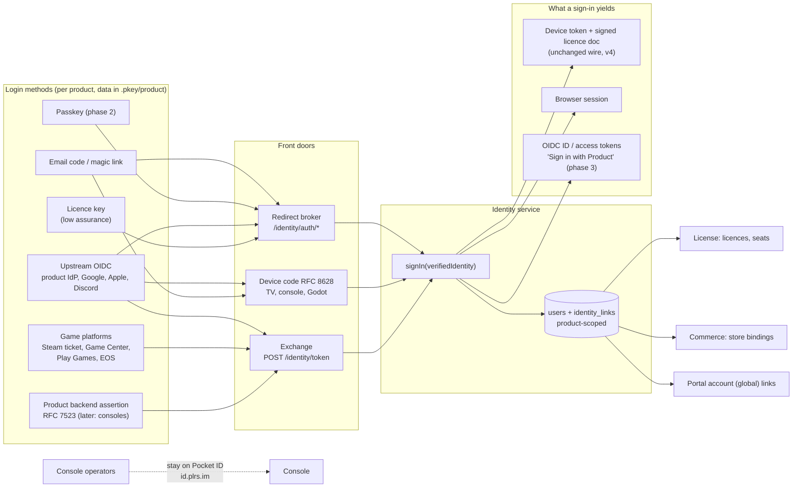

> Research note for [Godot on Polaris Key](../README.md), 2026-10-04. Spike S-16, commissioned
> by the lead on the owner's direction of 2026-10-04: define what a proper Identity service is,
> whether a proxy to a platform or product IdP, a Polaris-run OIDC/OAuth2 provider, or both. It
> has no program brief yet; §8 proposes an `I-` work-package namespace. Research and design only:
> no product code changed, nothing was deployed, and no account or credential was used. The only
> live calls were two anonymous `GET`s of the platform IdP's public discovery and JWKS documents
> (§3.1). File references are to the tree at `0c35758e` (`W/` = `packages/worker/src/`,
> `M/` = `packages/worker/migrations/`).

# S-16: the Identity service, defined

Evidence tags, as in the other notes:

- **[V]**: verified by reading this repo's code, config or docs, or a primary external source;
- **[M]**: measured here (a command run on this machine, 2026-10-04 14:34 UTC);
- **[I]**: inference or recommendation;
- **[U]**: unverified: needs an account, partner documentation or a staging deploy.

## 1. Summary and recommendation

**Question.** Identity is the least defined of the seven services. The owner asked whether it
should proxy to a platform or product identity provider (IdP), or run a lightweight OIDC/OAuth2
provider of its own based on the user's account (licence, email or upstream OIDC), and what the
feature as a whole should look like.

**What it is today.** Identity is not an identity service. It is three older pieces of code that
D-14 moved behind one service descriptor, and nothing more [V]
(`W/services/identity/index.ts:4-10`). Those pieces are product OIDC sign-in that ends in a
licence row and a device token, a first-party browser cookie, and the platform-global customer
portal. There is no user record: "the user" is four columns on `licenses` (`M/0001_init.sql:64-81`).
Nothing a developer's own backend can verify is issued. Native apps can only sign in with device
code. Only one IdP shape works, and that shape is our own platform IdP's. §3 lists fifteen gaps.

**What the platform IdP is.** `id.plrs.im` is a self-hosted **Pocket ID** instance [M]. It is a
passkey-first OIDC provider: RS256 only, `subject_types_supported: ["public"]`, and the
non-standard `/api/oidc/token` path that our code hard-codes. Platform operators, the portal and
every `provider: platform` product's end users all share it, through one client (§3.1). So "run
our own OP" partly exists already, but as a third-party server outside the Worker. It cannot
issue per-product (pairwise) subjects or carry licence claims, and it holds operator and customer
identities in one directory.

**Recommendation: Option C, "broker in, own accounts, thin issuer out" [I].** Identity becomes
the service that knows **who a person is to one product**. Everything else in the suite hangs off
that answer.

1. **A product-scoped `user`** is the principal. Licences, store bindings, devices (later as seat
   holders) and portal links attach to it. It replaces "the licence is the person".
2. **Many login methods per user**, all ending in one internal `signIn(verifiedIdentity)` step:
   - Polaris-run credentials: email one-time code or magic link, then passkeys;
   - federated upstream OIDC: the product's own IdP (Auth0, Clerk, Firebase, Supabase, Cognito,
     Keycloak, Entra), plus Google, Apple and Discord;
   - platform game identities verified natively: a Steam ticket, a Game Center signature, a Play
     Games code, an EOS ID token;
   - a licence key, as a low-assurance principal.
3. **One RFC 8693-shaped exchange endpoint** for apps that already hold a credential, which is
   every native and game case. The existing redirect broker and RFC 8628 device code (TV,
   console, Godot) stay as the browser-based front doors.
4. **The device keeps the signed licence document as its only gate.** Phases 1 and 2 return the
   existing activation response, so `PROTOCOL_VERSION` stays 4.
5. **Later, a thin per-product OIDC issuer**: "Sign in with <Product>", with ID and access tokens
   carrying entitlement claims, for the developer's web services and backend. It is signed by a
   separate RS256 keyring and never consumed by device SDKs.
6. **Operators stay on Pocket ID.** End users of `provider: platform` products move off it onto
   the Polaris-run login. That ends the shared-directory risk.

Option A (a pure broker) leaves developers with no IdP of their own, which is most indie and Godot
studios, with nothing to sign in with, and it still issues nothing. Option B (a full OP that owns
credentials) would still have to federate to reach Steam or Game Center, and it carries the most
liability. C is A's verifiers plus a deliberately small B, sequenced so each phase ships value on
its own.



The decisions this needs from the owner are in §10, each with a recommended default.

## 2. What Identity is for: the jobs

Each job is drawn from the landscape survey (licensing peers Keygen, Cryptlex, LicenseSpring,
Lemon Squeezy, Paddle and Gumroad; game backends EOS, PlayFab, Unity Authentication, Nakama, Talo
and Xsolla; Firebase, Supabase and RevenueCat; sources in §11). **Now** means phases 0 to 2 of
§8, **later** means phase 3 or beyond, and **never** means out of the service's charter.

| #   | Job                                                                                                                                                        | Scope                      | Why                                                                                                                                                                                                                                                                                               |
| --- | ---------------------------------------------------------------------------------------------------------------------------------------------------------- | -------------------------- | ------------------------------------------------------------------------------------------------------------------------------------------------------------------------------------------------------------------------------------------------------------------------------------------------- |
| J1  | A person signs in from an app or game and their licences and entitlements follow them to every device                                                      | **now**                    | Table stakes: every licensing peer with users (Keygen, Cryptlex, LicenseSpring) and every game backend has it [V]. Polaris half-has it: product OIDC mints a licence [V] (`W/services/identity/oidc.ts:697-845`)                                                                                  |
| J2  | **Hosted accounts for developers with no IdP**: email code or magic link, later passkeys                                                                   | **now**                    | Most indie and Godot studios have no IdP. Talo, Unity Authentication and Keygen all ship a built-in account [V]. Polaris already sends magic links, but only for the Polaris-branded portal [V] (`W/services/identity/portal/email.ts:21-27`)                                                     |
| J3  | **Bring your own auth**: an app that already signs users in (Clerk, Firebase, Auth0, Supabase, Cognito) exchanges that token                               | **now**                    | No user migration for the product. One generic JWKS verifier covers about 11 of 17 surveyed providers [I]. Today no mainstream IdP works as `custom` at all (§3.2)                                                                                                                                |
| J4  | **Silent sign-in with the platform identity**: Steam, Game Center, Play Games, EOS                                                                         | **now** (phase 2)          | The game-program differentiator. It avoids an extra-account wall (Steam labels third-party-account games on the store page [U]). Steam ticket verification and x509 chain verification already exist for commerce [V] (`W/services/distribution/commerce/steam.ts`, `apple.ts`, `W/core/x509.ts`) |
| J5  | Sign in on a TV, console, kiosk or headless Godot build with a phone                                                                                       | **now** (exists, keep)     | RFC 8628 is implemented and hardened, with QR codes in Godot and Kotlin [V]. Only Godot sends the P1-07 confirm-and-attach step [V] (`packages/sdk-node/src/identity/client.ts:16-19`)                                                                                                            |
| J6  | Link identities and merge accounts (bought on Steam, play on mobile; anonymous first, sign in later)                                                       | **now** (policy)           | Every game backend has link, unlink and merge with explicit rules (Nakama never removes the last identifier; RevenueCat's Transfer-or-Block restore policy) [V]. Polaris verifies store purchases but hangs them on licences, not people [V] (`M/0052_commerce.sql:13-27`)                        |
| J7  | The customer portal: find my licences, devices and downloads                                                                                               | **now** (exists, converge) | Lemon Squeezy's My Orders and Paddle's portal set the bar; ours is already global with magic links [V]. The gaps are the relation to product users, server-side sessions, GDPR export and a signed auto-login link API                                                                            |
| J8  | **"Sign in with <Product>"**: ID and access tokens with entitlement claims for the developer's forum, Discord bot, web companion, cloud saves or MCP tools | **later** (phase 3)        | No licensing peer offers it, so it is a real differentiator [V]. It is useless without J1's principal, and it makes Polaris a token issuer with ongoing key, consent and conformance duties                                                                                                       |
| J9  | Native redirect sign-in (loopback or claimed-HTTPS redirect) so desktop and mobile apps are not limited to device code                                     | **now** (phase 2)          | Swift's `PolarisLoginView(onSignIn:)` defaults to a no-op and four native SDK rows are planned and unowned [V] (`sdks/swift/Sources/PolarisKeyUI/PolarisLoginView.swift:107-125`). Device code is a poor fit on a phone                                                                           |
| J10 | Named-user seats: N users per licence, M devices each                                                                                                      | **later**                  | Keygen `maxUsers` and Cryptlex named-user licences [V]. It needs the user principal first and probably a user claim in the signed licence document, which is a corpus and all-SDK event                                                                                                           |
| J11 | B2B organisations with per-customer SSO and admin seat assignment                                                                                          | **later** (enterprise)     | Enterprise-tier everywhere (LicenseSpring, Cryptlex SAML, Keygen) [V]. Only worth building once J1 and J10 exist                                                                                                                                                                                  |
| J12 | Console platforms (PSN, Xbox, Nintendo) through the product's backend or EOS                                                                               | **later**                  | Verification is under NDA and cannot ship in an open-source Worker or SDK [I]. An RFC 7523 assertion from the product's backend, or EOS Connect, covers it without NDA code                                                                                                                       |
| J13 | The console's own operator sign-in                                                                                                                         | **never** in Identity      | Every peer separates "your team signs in" from "your customers' identity" [V]. Operators stay on the platform IdP (`W/admin/authz.ts:1-13`). Folding them into the end-user principal would put console authority one OP bug away from any customer                                               |
| J14 | Passwords                                                                                                                                                  | **never**                  | Credential stuffing, breach monitoring and reset flows for no gain over email codes plus passkeys [I]                                                                                                                                                                                             |
| J15 | Dynamic client registration and an open third-party app ecosystem                                                                                          | **never** (for now)        | Clients belong to a product's developer, so they are registered in the console or manifest. DCR is a spam and abuse surface [I]                                                                                                                                                                   |
| J16 | Social features: friends, presence, leaderboards                                                                                                           | **never**                  | That is a game backend (Nakama, PlayFab, EOS), not identity [I]                                                                                                                                                                                                                                   |

## 3. Current state and gaps

### 3.1 The platform IdP is Pocket ID

| Fact                                                                                                                | Evidence                                                                                                          |
| ------------------------------------------------------------------------------------------------------------------- | ----------------------------------------------------------------------------------------------------------------- |
| `id.plrs.im` is "PocketID", the production `PLATFORM_OIDC_ISSUER`                                                   | [V] `docs/DEPLOYMENT.md:20,87-95`, `docs/RUNBOOK.md:20`                                                           |
| Its discovery document names `service_documentation: https://pocket-id.org/docs`                                    | [M] `curl -s https://id.plrs.im/.well-known/openid-configuration`                                                 |
| `token_endpoint` is `/api/oidc/token`, the path `oidc.ts`, `portal/auth.ts` and `admin/auth.ts` hard-code           | [M] same; [V] `W/services/identity/oidc.ts:1466`, `W/services/identity/portal/auth.ts:284`, `W/admin/auth.ts:146` |
| Signing: `id_token_signing_alg_values_supported: ["RS256"]`; the JWKS holds one RSA key                             | [M] same, plus `curl -s https://id.plrs.im/.well-known/jwks.json`                                                 |
| Subjects: `subject_types_supported: ["public"]`, so one human has the same `sub` in every product that uses it      | [M]                                                                                                               |
| Supported: device grant, refresh, `client_credentials`, PAR, introspection, RFC 9207 `iss`, PKCE `plain` and `S256` | [M]                                                                                                               |
| One client serves console admin, the root portal and every `provider: platform` product                             | [V] `docs/DEPLOYMENT.md:94-95`; `W/platformOidc.ts:9-30`                                                          |
| Where Pocket ID runs, and how it is backed up and patched                                                           | [U] not on the Worker; not in this repo                                                                           |

Consequences [I]:

- The "hard-coded paths, no discovery" defect (G4) is an accident of having built against one
  Pocket ID instance. Discovery would make the platform and custom paths the same code.
- A Pocket ID user in the `admins` group is a platform operator, and a product's customer is a
  user in the same directory. A mistake in group assignment, or a compromise of the shared client
  secret, crosses from customer to operator. This is G5.
- Pocket ID issues public subjects only, so it cannot be the per-product issuer for J8 without
  leaking a cross-tenant correlator. It also cannot put licence claims in its tokens.

### 3.2 Gaps

All [V] unless marked. G1 to G15 are the current-state survey's numbering.

| #   | Gap                                                                                                                                                                                                            | Evidence                                                                                                                                                                                                                                             |
| --- | -------------------------------------------------------------------------------------------------------------------------------------------------------------------------------------------------------------- | ---------------------------------------------------------------------------------------------------------------------------------------------------------------------------------------------------------------------------------------------------- |
| G1  | No token a developer's backend or web app can verify: no ID, access or refresh token, no userinfo, no per-product issuer or JWKS                                                                               | `W/services/identity/index.ts:61-82` (discovery fragment: endpoints only); `oidc.ts:848-861` (sign-in yields a device token or cookie)                                                                                                               |
| G2  | No sign-in for third-party web origins: `return_to` must be same-origin with `key.plrs.im`, the cookie is first-party and cookie routes never answer CORS                                                      | `oidc.ts:440-450`; `W/services/identity/browserSession.ts:94-96`; `W/core/cors.ts:89-92`                                                                                                                                                             |
| G3  | No native redirect sign-in (no loopback, custom scheme or claimed HTTPS redirect). `/auth/poll` is advertised but "currently completes no flow"                                                                | `oidc.ts:1871`; `packages/docs/src/content/docs/services/identity/oidc.md`                                                                                                                                                                           |
| G4  | One IdP per product, hard-coded paths, fixed scope `openid email profile groups` (Google rejects the unknown `groups` scope [U]), no social providers, no linking                                              | `oidc.ts:904-908,1466,1499`                                                                                                                                                                                                                          |
| G5  | The platform IdP and its one client are shared by operators, portal customers and product end users                                                                                                            | §3.1                                                                                                                                                                                                                                                 |
| G6  | No email, magic-link or passkey sign-in for products. Magic links exist only for the portal                                                                                                                    | `W/services/identity/portal/auth.ts`, `portal/email.ts:21-27`                                                                                                                                                                                        |
| G7  | Identity is welded to License: every sign-in writes a `licenses` row and needs a tier, yet the service declares `requires: []`                                                                                 | `oidc.ts:591-635,697-845`; `tools/services.json` (`identity`)                                                                                                                                                                                        |
| G8  | No user model or management: no users list, disable, delete or per-user audit; `groupRoleMap.role` and the product `admin_group` are inert                                                                     | `M/0001_init.sql:64-81`; `oidc.ts:612`; `W/admin/api.ts:26-28`                                                                                                                                                                                       |
| G9  | An operator-issued licence (matched by email) and the same person's OIDC licence are two licences; `activateFromIdentity` never matches by email; `portal_license_links.source='admin'` is never written       | `oidc.ts:697-845`; `W/services/license/admin/licenses.ts:148-155`                                                                                                                                                                                    |
| G10 | The portal ignores the Identity enable flag, contradicting the service summary and the docs index                                                                                                              | `W/services/identity/portal/repo.ts:329-416`; `packages/worker/test/portal.test.ts:81-98`                                                                                                                                                            |
| G11 | Weak sessions: the browser session's document is unsigned and still the legacy fused shape; portal sessions are stateless HMAC with no server-side logout and fall back to `ADMIN_SESSION_SECRET`              | `W/services/identity/doc.ts:7-12`; `W/services/identity/portal/session.ts:9-12,80-92`                                                                                                                                                                |
| G12 | No typed wire contract or conformance for Identity: no identity types in `shared-protocol`; parity tracks only `identity.oidc` and `identity.devicecode`; transcripts cover device code only                   | `conformance/parity/features.json:487-500`; `conformance/transcripts/devicecode-*.json`                                                                                                                                                              |
| G13 | Weak console surface: no OIDC editor (manifest only), the Sign-in page reads Identity through Config's edge-mint endpoint, and `OIDC_ISSUER_ALLOWLIST` is not applied when unset                               | `W/services/identity/admin.ts:16-18`; `packages/admin/src/console/pages/identity/SignIn.tsx:1-10`; `oidc.ts:200-231`                                                                                                                                 |
| G14 | Data hygiene: fresh OIDC licences are inserted without `origin`, so they default to `'admin'`; portal identities are keyed `provider: "oidc"`, not by issuer; THREAT-MODEL A6 and §5 are stale                 | `oidc.ts:823-830` vs `W/repo.ts:807-831`; `portal/auth.ts:327-330`; `docs/security/THREAT-MODEL.md:33` (lists the dropped `customers` table), `:3618-3619` (say the product flow skips the non-empty `sub` and `email_verified` checks it now makes) |
| G15 | Single-use artefacts (magic links, OIDC and device-flow records) are consumed with KV `get` then `delete`, which is not atomic across regions; the `_portal` rate-limit shard is a global chokepoint (R10-04a) | `portal/auth.ts` (magic verify); `W/rateLimitDo.ts`                                                                                                                                                                                                  |

**Incoming dependency.** F-20 is merged and approved (`program/plans/F-20.md:3`). It binds
licence-bound `pkeyr_` registry tokens to a portal account and has Identity revoke them when
`syncAccountLicenseLinks` drops a link or an account is deleted (`plans/F-20.md:105,121-146`).
F-21 builds that. Any change to portal accounts or links must keep those revocation hooks or
replace them one-for-one [V].

## 4. Options

Every option keeps RFC 8628 device code. It is the only browser-less path for Godot on a TV or
console, and it already exists.

### Option A: broker only

**Architecture.** Polaris stays a relying party and never holds a credential. Fix the existing
broker (discovery, configurable scopes and groups claim, RFC 9207 `iss`), allow many providers per
product (`identity.providers[]` in `.pkey/product`), and add an RFC 8693-shaped exchange endpoint
with per-kind verifiers: generic OIDC/JWKS, Firebase x509, Steam ticket, Game Center, Play Games,
EOS, and an RFC 7523 product-backend assertion. Developers with no IdP of their own use the
platform provider (Pocket ID).

**SDK and device impact.** A new `identity.exchange()` and per-platform helpers in all six SDKs.
Godot forwards bytes from GodotSteam (`getAuthTicketForWebApi`) or the EOS plugin; Game Center and
Play Games need thin iOS and Android shims. TV and console sign-in stays device code. The response
reuses the activation response, so the signed shape does not change.

**Security.** Audience confusion is the classic broker bug: `aud`, `azp` (Clerk), `token_use`
(Cognito) and the Steam `identity` string must be enforced and fail closed. Mix-up defence is
needed once a product has several providers. Every discovered URL needs SSRF checks. The broker
holds no passwords, codes or recovery flows.

**Ops cost on Workers.** Per exchange: one request, zero to two subrequests (JWKS on a cache miss,
Steam or Play Games calls), about 1 ms CPU, one to three D1 writes. At 1M exchanges a month it is
within the $5 Workers Paid plan's 10M requests, plus at most about $5 of KV writes for flow state
[V: pricing page; I: arithmetic]. Pocket ID's hosting stays a separate cost [U].

**DX.** Very good for developers who have auth ("Clerk in five lines"). Poor for those who do not:
their users see a Polaris-branded Pocket ID with passkeys only, no email sign-up, and no
product-branded consent.

**Effort.** M–L. **Leaves open:** G1 (nothing issued), G5 (shared directory), G6 (no email
sign-in), and only a thin principal.

### Option B: own lightweight OIDC/OAuth2 provider

**Architecture.** Polaris becomes the OP. Accounts are Polaris-held and authenticated by email
code or magic link, passkey, licence key, or upstream OIDC used only as a login method. A
per-product issuer at `/<p>/identity` publishes discovery and JWKS, and implements authorize
(code + PKCE S256), token, userinfo, refresh rotation, revocation and RP-initiated logout. Built
in-house on `jose` (already a dependency): `@cloudflare/workers-oauth-provider` issues no ID tokens
and stores everything in KV, OpenAuth is beta and has no OIDC discovery, and panva's certified
`oidc-provider` is Node-only [V] (sources in §11).

**SDK and device impact.** Off-the-shelf OIDC libraries cover most platforms (AppAuth on iOS and
Android, `oauth4webapi` in JS, Authlib in Python). Godot has none, so it stays on device code, now
as an OAuth device grant. Game identities need federation anyway: Steam's web sign-in is OpenID
2.0, and Game Center and Play Games are not OIDC at all.

**Security.** Polaris becomes the platform's highest-value target. It has to manage RS256 signing
keys separate from the Ed25519 document keys, pairwise subjects, atomic single-use codes (a
Durable Object, never KV), refresh-token reuse detection, email bombing, enumeration and
account recovery.

**Ops cost on Workers.** Compute is about the same as A. Email adds a shared-reputation
constraint: Cloudflare Email Service has conservative daily quotas that grow with reputation, and
every tenant shares the `plrs.im` sender [V]. Optional OpenID certification costs $700 per
deployment for members or $3,500 otherwise [V]; the conformance suite itself is free.

**DX.** Good for "Sign in with <Product>" and for developers with no IdP. Weak for developers who
already have auth, because their users would sign in twice or be migrated.

**Effort.** L (roughly 3–5k lines of Worker code plus tests [I]). **Leaves open:** native game
sign-in, unless federation is added, which turns it into C.

### Option C: hybrid (recommended)

**Architecture.** B's account model and a deliberately small OP, with A's verifiers as login
methods. Three layers:

1. **Principal**: product-scoped `users` with `identity_links` (§5.1).
2. **Front doors** feed one `signIn(verifiedIdentity)` step: the redirect broker (fixed), device
   code (kept), the exchange endpoint (new), and Polaris-run email and passkey pages.
3. **Outputs**: the device token plus licence document (unchanged), a browser session (signed and
   revocable), and later Polaris-issued OIDC tokens.

**SDK and device impact.** As A for native and game sign-in. Email sign-in on a device goes through
a code typed into the app (an OTP works where switching apps breaks magic links) or through device
code. Phase 3 adds nothing to device SDKs, because issued tokens are for web and backend relying
parties.

**Security.** A's broker rules plus B's OP rules, but phased: email and passkeys arrive before any
token is issued outward, so the OP's riskiest surfaces (refresh tokens, consent, clients) come
last and get their own audit.

**Ops cost on Workers.** Same as B. Pocket ID shrinks to the operator directory.

**DX.** Best of both: "bring your own auth" in phase 2, "no auth? use ours" in phase 1, and "gate
your Discord role on owning the game" in phase 3.

**Effort.** L overall, delivered in independently useful phases (§8).

### Option D: buy a CIAM (rejected)

Make a hosted CIAM (Auth0, Clerk, WorkOS or Stytch) the platform provider. It solves email,
passkeys and social login quickly, but it costs per monthly active user, it cannot verify Steam,
Game Center or Play Games natively, it cannot put licence claims in tokens without a callout, and
it adds an external dependency to a self-hosted Workers platform [I]. It is no better than A for
products that already have auth. Rejected.

### Option E: status quo plus fixes

Phase 0 of §8 alone: fix discovery, the `origin` bug, the docs and the stale threat-model rows.
Cheap and worth doing under any option, but it answers none of J1–J9.

### Comparison

| Criterion                                          | A broker       | B own OP       | **C hybrid**       | D buy          | E fixes only |
| -------------------------------------------------- | -------------- | -------------- | ------------------ | -------------- | ------------ |
| J1 sign in, entitlements follow (with a principal) | partial        | yes            | **yes**            | yes            | no           |
| J2 developers with no IdP                          | Pocket ID only | yes            | **yes**            | yes            | no           |
| J3 bring your own auth                             | yes            | no             | **yes**            | partial        | no           |
| J4 Steam, Game Center, Play Games, EOS             | yes            | via federation | **yes**            | no             | no           |
| J8 tokens for the developer's backend              | no             | yes            | **yes (phase 3)**  | yes            | no           |
| J9 native redirect                                 | yes            | yes            | **yes**            | yes            | no           |
| Closes G5 (operators separated)                    | no             | yes            | **yes**            | yes            | no           |
| Credential liability (recovery, email abuse)       | none           | high           | medium, phased     | vendor         | none         |
| `PROTOCOL_VERSION` bump                            | no             | no             | **no** (until J10) | no             | no           |
| Workers cost at 1M sign-ins a month                | < $15          | < $15          | < $15              | vendor per MAU | —            |
| Effort                                             | M–L            | L              | L, phased          | M + vendor     | S            |

## 5. The recommended service, defined

### 5.1 Concepts and data model

**Glossary (AGENTS rule 4).** The concepts page already uses "license" for "an account that holds
entitlements", "profile" for a managed-payload baseline, and "account" for the portal
(`packages/docs/src/content/docs/start/concepts.md:173-218`) [V]. Proposed new nouns [I]:

- **user**: a person known to one product. Product-scoped, and the principal Identity owns.
- **identity link** (or **login**): one verified `(issuer, subject)` attached to a user. Examples:
  `email:<hash>`, `oidc:<iss>`, `steam`, `gamecenter:<teamId>`, `pgs:<appId>`, `eos:<deploymentId>`,
  `assertion:<keyId>`.
- **login method**: a product's enabled way to create links (a provider instance in the manifest).
- **portal account**: unchanged; the platform-global customer record that links to users and
  licences across products.
- **client**: an application registered to a product's issuer (phase 3 only).

Proposed D1 tables [I] (names are placeholders for the plan WP):

| Table                    | Key                                     | Holds                                                                                                         |
| ------------------------ | --------------------------------------- | ------------------------------------------------------------------------------------------------------------- |
| `identity_users`         | `(product, id)`                         | status (`active`, `disabled`), display name, primary verified email, created and last-sign-in times           |
| `identity_links`         | UNIQUE `(product, issuer_key, subject)` | `user_id`, verified email (if the issuer is email-authoritative), first and last use, `amr`                   |
| `licenses.user_id`       | nullable FK                             | Replaces `licenses.sub` as the person pointer. Migration: each `sub` becomes a user plus an `oidc:<iss>` link |
| `dist_purchase_bindings` | unchanged                               | Still licence-keyed; reached through the licence's user (§5.6)                                                |
| `identity_sessions`      | hashed id under `KEY_HASH_PEPPER`       | Browser and OP sessions, revocable, listable ("sign out everywhere")                                          |
| `identity_passkeys`      | credential id                           | COSE public key, sign count, transports, `rp_id` (phase 2)                                                    |
| `identity_clients`       | `(product, client_id)`                  | Type (web, SPA, native, device), exact redirect URIs, hashed secret (phase 3)                                 |
| `identity_grants`        | grant id                                | Consented scopes and refresh-token family (phase 3)                                                           |
| Single-use store         | Durable Object, sharded by hash         | Email codes, magic links, auth codes, device codes, WebAuthn challenges: atomic consume                       |

Rules [I], following the landscape:

- **A user is product-scoped.** That is the tenant-isolation boundary and matches rule 5. The
  portal account stays the only cross-product record.
- **One link belongs to exactly one user.** A link already attached elsewhere is refused
  (`link_conflict`) unless the product opts into Transfer, RevenueCat-style.
- **Never orphan.** Unlinking the last link is refused, as in Nakama.
- **Explicit linking** needs proof of both identities in one session.
- **Automatic linking by email** happens only when both sides are `email_verified` from issuers
  marked email-authoritative (the Polaris email method, Google for gmail.com). Never for Entra
  `email`, and off by default for custom IdPs, mirroring today's portal rule.
- **Anonymous first, sign in later**: today's enrolled licence plus claim and migrate is that
  bootstrap. It is generalised to "attach this device's licence to the signed-in user", and keeps
  the P1-07 show-then-confirm step.
- **Licence-key sign-in** yields a low-assurance principal (`amr: ["pkey_license"]`). It never
  creates an SSO session and never auto-links.
- **Identity no longer requires a licence.** An Identity-only product gets users and device tokens
  under `requires-identity` without minting licences. That fixes G7 and matches the registration
  policy docs.

### 5.2 Developer-facing surface

**Manifest (`.pkey/product`).** Provider kinds are code; instances are data [I]:

```yaml
identity:
  methods:
    - { id: email, kind: email } # code + magic link, Polaris-sent
    - {
        id: google,
        kind: oidc,
        issuer: https://accounts.google.com,
        clientId: "…",
        emailTrust: true,
      }
    - {
        id: clerk,
        kind: oidc,
        issuer: https://clerk.example.com,
        audience: ["…"],
        azp: ["…"],
      }
    - { id: steam, kind: steam, appId: 480, ticketIdentity: "pkey:diceroll" } # publisher key sealed
    - {
        id: gc,
        kind: gamecenter,
        teamId: ABCDE12345,
        bundleIds: ["com.example.game"],
      }
  linking: { emailAutoLink: false, conflict: block }
```

Every new field gets a validator rule and a mutation-table entry (rule 9). The issuer allowlist
applies to every discovered URL and becomes mandatory once a product declares any `oidc` method.

**Console (Identity section).** Pages [I]:

- **Users**: list, search, profile, links, licences, devices, sessions, audit; disable, sign out
  everywhere, delete.
- **Sign-in methods**: replaces today's read-only Sign-in page, with a per-kind setup checklist
  (redirect URIs to register, secrets to seal) and a "test sign-in" dry run that mints nothing.
- **Branding**: the hosted login page and email, reusing `portal_product_settings.branding_json`.
- **Clients** (phase 3): register web, SPA, native and device clients; secrets shown once.

**Portal.** It keeps its global account. It gains "connected products" (its links to product
users), server-side sessions with sign-out, a GDPR export, and in phase 3 "connected apps" with
revoke [I].

**SDK API, all six languages** [I]. Names are illustrative; each language follows its idiom:

| Call                                                   | Node           | React          | Python         | Swift                            | Kotlin            | Godot                         | Notes                                                                                       |
| ------------------------------------------------------ | -------------- | -------------- | -------------- | -------------------------------- | ----------------- | ----------------------------- | ------------------------------------------------------------------------------------------- |
| `identity.startDeviceCode()` / `poll()` (exists)       | yes            | yes            | yes            | yes                              | yes               | yes                           | Add P1-07 confirm-and-attach everywhere, not only Godot                                     |
| `identity.signInWithEmail(email)` + `verifyCode(code)` | yes            | yes            | yes            | yes                              | yes               | yes                           | One-time code; magic link only on web                                                       |
| `identity.exchange({kind, token, provider})`           | yes            | yes            | yes            | yes                              | yes               | yes                           | Bring your own auth                                                                         |
| `identity.signInWithSteam()`                           | —              | —              | —              | —                                | —                 | yes                           | GodotSteam `getAuthTicketForWebApi("pkey:<product>")`; others pass the ticket to `exchange` |
| `identity.signInWithGameCenter()`                      | —              | —              | —              | yes                              | —                 | yes (iOS shim)                |                                                                                             |
| `identity.signInWithPlayGames()`                       | —              | —              | —              | —                                | yes               | yes (Android shim)            |                                                                                             |
| `identity.signIn({redirect})` (native PKCE)            | yes (loopback) | yes (redirect) | yes (loopback) | yes (ASWebAuthenticationSession) | yes (Custom Tabs) | via OS browser + loopback [U] | Closes G3                                                                                   |
| `identity.link(...)` / `unlink(id)`                    | yes            | yes            | yes            | yes                              | yes               | yes                           | Needs the current session                                                                   |
| `identity.user()` / `signOut()` / `deleteUser()`       | yes            | yes            | yes            | yes                              | yes               | yes                           | `deleteUser` meets App Store 5.1.1(v) in-app deletion [U]                                   |

**"Sign in with <Product>" (phase 3).** A per-product issuer at `https://key.plrs.im/<p>/identity`,
with discovery, JWKS, authorize, token, userinfo, revocation and end-session. Scopes are `openid`,
`email`, `profile`, `offline_access`, `pkey:licenses` and `pkey:entitlements`. Subjects are
pairwise per product; that matters once a portal account links one person to several products.
Claims are namespaced (`https://key.plrs.im/claims/entitlements`) and carry entitlements, not
licence state, with access tokens living 5–15 minutes; this respects D-20's "state is never
carried" rule. A custom domain (`auth.<product>.com`, through Cloudflare for SaaS) would be a
separate issuer and is deferred.

### 5.3 Wire impact

| Change                                                                        | Device wire?                                                                | `PROTOCOL_VERSION` / corpus                                                                                                                                            | Who follows                                                                                                                                                                               |
| ----------------------------------------------------------------------------- | --------------------------------------------------------------------------- | ---------------------------------------------------------------------------------------------------------------------------------------------------------------------- | ----------------------------------------------------------------------------------------------------------------------------------------------------------------------------------------- |
| Phase 0 hygiene; removing dead `authPoll` from the discovery fragment         | Discovery response only                                                     | Neither; `gen:transcripts` re-records `discovery-capabilities.json`                                                                                                    | No SDK reads `authPoll` [U: grep each SDK in the WP]                                                                                                                                      |
| Users and links tables, console pages, manifest `identity.methods`            | No                                                                          | Neither                                                                                                                                                                | Worker, admin, `shared-manifest` (rule 9)                                                                                                                                                 |
| `POST /<p>/identity/token` exchange, email-code routes, native redirect token | **Yes**: new device-facing routes, request and response shapes, error codes | No bump: additive, feature-detected from discovery, response reuses the activation response; **transcripts and parity, not signed corpus**                             | **Plan mode.** Contract (WIRE-CONTRACT-V4 identity section; first identity types in `shared-protocol`) → `errors.json` (rule 3) → transcripts → Node, React, Python, Swift, Kotlin, Godot |
| Identity discovery fragment gains `methods[]` and `exchange` metadata         | Yes (discovery)                                                             | No bump; transcripts                                                                                                                                                   | Same six SDKs, feature detection                                                                                                                                                          |
| Phase 3 OIDC issuer tokens                                                    | No: web and backend relying parties only; no device SDK consumes them       | No bump; a new signed artefact outside the corpus, with OIDF conformance as its gate                                                                                   | Plan mode anyway (new signed artefact and keyring). SDKs add nothing; docs give stock-library recipes                                                                                     |
| J10: a user claim in the licence document's `profile` (named-user seats)      | **Yes**: signed shape                                                       | Additive optional member; P4-19 shows such additions can keep `PROTOCOL_VERSION` 4 [V] (`docs/security/WIRE-CONTRACT-V4.md:875`); corpus regeneration and all six SDKs | Deferred; its own plan                                                                                                                                                                    |

Today's `DocProfile` has no subject (`packages/shared-protocol/src/license.ts:7-13`) [V]. Phases 0
to 3 leave it alone.

### 5.4 Threat-model deltas

New or changed sections for `docs/security/THREAT-MODEL.md` [I]:

1. **Operator and customer split (G5).** Once end users leave Pocket ID, a customer can no longer
   be placed in `admins` by mistake, and the console no longer shares a client with customers.
   Until then, give the console its own Pocket ID client.
2. **Broker confusion.** Per-provider audience enforcement (`aud`, `azp`, `token_use`, bundle id,
   Steam `identity`), fail closed when unset; RFC 9207 mix-up defence; SSRF checks on every
   discovered URL; the issuer allowlist made mandatory once `oidc` methods exist.
3. **Account takeover through linking.** Email trust per issuer; Entra `email` never links; no
   linking of email-less platform identities except explicitly; Block on conflict.
4. **Email abuse.** Per-recipient (hashed) limits and a daily cap in addition to per-IP, Turnstile
   on the email form, identical responses for known and unknown emails, and a landing-page POST so
   link prefetchers cannot burn magic links. One tenant's abuse hurts every tenant's deliverability
   while the sender is shared.
5. **Single-use atomicity (G15).** Codes, links and device codes move to an atomic Durable Object
   consume. The same fix applies to today's portal magic links.
6. **Issuer keys (phase 3).** A separate RS256 keyring sealed under the `PLATFORM_KEK` keyring with
   its own AAD kind, rotated about every 90 days (`next`, `active`, `retired`), never mixed with the
   Ed25519 document keys pinned by device trust. Refresh-token rotation with family revocation on
   reuse. Exact redirect-URI matching, no non-http(s) schemes except per-client registered native
   schemes.
7. **Stale rows to fix now.** A6 (drop `customers`), §5 `sub` and `email` rows (the product flow
   now requires both), T5 extended to "a product's upstream IdP is malicious".

### 5.5 Privacy

- **Roles** [I]: Polaris is the controller for portal accounts (global and Polaris-branded) and
  the processor for product users, licences and links, which are the developer's records. Hosting
  product users needs a DPA and a sub-processor list (Cloudflare) [U: legal review].
- **Export (Art. 15 and 20).** Missing today. Add a portal `GET /api/me/export`, and a console
  per-user export for the developer to answer requests.
- **Deletion (Art. 17).** Deleting a user cascades to links, sessions, passkeys, grants and
  pairwise mappings, and detaches (not deletes) licences, which are the developer's commercial
  records, mirroring today's portal notice. It revokes F-20 licence-bound tokens whose link
  disappears. Phase 3 adds back-channel logout to tell relying parties.
- **Minimisation.** Upstream ID tokens are consumed once and never stored; no upstream access or
  refresh tokens are kept; emails are stored only when verified.
- **Correlation.** Users are product-scoped and issued subjects are pairwise, so two products
  cannot correlate one person through Polaris. The portal account is the only place the join is
  visible, and only to that person.

### 5.6 How it composes

- **License.** A licence gains a `user_id`. Sign-in finds the user's licence or, under the
  product's auto-issue policy, mints one, as `activateFromIdentity` does today but keyed by user,
  not `sub`. Operator-issued licences carrying an email attach to the user whose verified email
  matches, when the product allows it, which closes G9. Seat limits stay device-based until J10.
- **Commerce claims.** Store bindings stay licence-keyed (`dist_purchase_bindings`), so a user
  reaches them through their licences. Signing in with Steam can optionally run the existing
  `CheckAppOwnership` and apply store grants at first sign-in, through a Core descriptor hook
  (rule 6), so Identity never imports Distribution.
- **Registry tokens (F-20, F-21).** Unchanged contract. Licence-bound `pkeyr_` tokens stay bound to
  a licence and minted from the portal. The revocation trigger "a portal link removed" gains an
  equivalent: "a licence detached from its user, or a user deleted". The F-21 implementer should
  route both through one Core hook.
- **Portal.** Stays global and Polaris-branded. It links to product users by verified email or
  explicit claim, as it links to licences today. Decide G10 explicitly (§10, D7).
- **Console operator sign-in.** Out of the service: Pocket ID, `PLATFORM_ADMIN_GROUP`, one admin
  level. Recommend a dedicated Pocket ID client for the console now.

## 6. What changes for the existing pieces

| Piece                              | Fate                                                                                                   |
| ---------------------------------- | ------------------------------------------------------------------------------------------------------ |
| `oidc.ts` redirect flow            | Kept, generalised to discovery and many providers; calls `signIn`                                      |
| Device code (`/auth/device/*`)     | Kept; provider choice moves to the phone page                                                          |
| `/auth/poll`                       | Retired from discovery in phase 0; replaced by the native redirect token route in phase 2              |
| Browser session and fused document | Replaced by a signed, revocable session; the fused shape is deleted as already planned (`doc.ts:7-12`) |
| `POST /identity/session/license`   | Kept as the licence-key login method                                                                   |
| Portal                             | Kept global; server-side sessions, export, links to users                                              |
| `provider: platform` for end users | Becomes the Polaris-run login (email, passkey) in phase 1; Pocket ID kept for operators                |
| `groupRoleMap`, provisioning hooks | Kept; evaluated over any verifier's normalised claims, not only ID-token claims                        |

## 7. Phases

| Phase                         | Outcome a developer sees                                                                                                                                                     | Wire                                             |
| ----------------------------- | ---------------------------------------------------------------------------------------------------------------------------------------------------------------------------- | ------------------------------------------------ |
| **0. Hygiene and groundwork** | Correct `origin`, true docs, fixed threat model, atomic single-use store, sharded rate limits; console gets its own Pocket ID client; the plan WP lands                      | discovery transcript only                        |
| **1. Users and email**        | A Users page; operator and OIDC licences merge; Google, Apple, Discord and the product's own IdP work as methods; users can sign in by email; Identity works without License | none (HTTP and manifest)                         |
| **2. Native and games**       | `exchange()` for bring-your-own-auth; Steam, Game Center, Play Games and EOS sign-in; native redirect sign-in; passkeys; link and unlink in all six SDKs                     | plan mode, additive, transcripts                 |
| **3. Issuer**                 | "Sign in with <Product>": OIDC tokens with entitlement claims for the developer's web services; connected apps in the portal                                                 | plan mode, new signed artefact, no device change |
| **4. Later**                  | Named-user seats; product-backend assertion for consoles; custom auth domains; B2B organisations                                                                             | J10 touches the signed licence document          |

## 8. Work packages

Sizes: S ≤ 1 day, M 2–4 days, L 5+ days, in the program's agent-days [I]. ⚑ = plan mode
(wire-touching, or a new signed artefact). Gates are in addition to the green gate.

| ID     | Work package                                                                                                                                                                                                                                  | Deps          | Size | Gates and flags                                                                                     |
| ------ | --------------------------------------------------------------------------------------------------------------------------------------------------------------------------------------------------------------------------------------------- | ------------- | ---- | --------------------------------------------------------------------------------------------------- |
| I-01   | Hygiene: `origin: "oidc"` on fresh OIDC licences plus a test; portal identities keyed by issuer (migration); THREAT-MODEL A6 and §5 rows; docs vs code on portal gating (per D7); drop `authPoll` from discovery                              | —             | S    | `gen:transcripts -- --check`; `check:links`                                                         |
| I-02   | Atomic single-use store (Durable Object) for magic links, OIDC flows and device codes; shard `_portal` and `_admin` rate-limit buckets (R10-04a); per-recipient email limits                                                                  | —             | M    | `test:workerd`; rate-limit and portal suites                                                        |
| I-03   | Console gets its own Pocket ID client: today `ADMIN_OIDC_*` is only a fallback behind `PLATFORM_OIDC_*` (`W/platformOidc.ts:9-30`), so console auth must prefer its own variables; runbook update                                             | —             | S    | Owner action in Pocket ID [U]                                                                       |
| I-04 ⚑ | **Plan**: replace D-14 with an Identity decision record; glossary nouns (rule 4); data model and migration; identity section of WIRE-CONTRACT-V4; error codes; parity feature ids; manifest schema                                            | S-16 approved | M    | Owner approval; planning only                                                                       |
| I-05   | Broker fix: OIDC discovery (all discovered URLs through the SSRF and allowlist gates), configurable scopes and groups claim, RFC 9207 `iss`, multiple `oidc` methods per product, mandatory allowlist once any exist                          | I-04          | M    | Manifest validator rules + mutation table (rule 9)                                                  |
| I-06   | Users and identity links: tables, `licenses.user_id`, migration of `licenses.sub`, `signIn(verifiedIdentity)`, linking and conflict policy, Identity without License, email-match attach for operator licences                                | I-04          | L    | Migration test on a production-shaped copy; `boundaries` test (rule 6)                              |
| I-07   | Console Users and Sign-in methods pages; per-user audit; disable, sign out everywhere, delete; test sign-in dry run                                                                                                                           | I-06          | M    | Admin build; console CSP parity                                                                     |
| I-08   | Email login method for products: one-time code and magic link, product-branded page and email from `plrs.im`, Turnstile, enumeration-safe responses; signed, revocable browser session replacing the fused document                           | I-02, I-06    | M    | OpenAPI + `routeCoverage` (rule 10)                                                                 |
| I-09   | End users of `provider: platform` move to the Polaris login; Pocket ID becomes operator-only; migration of existing platform subjects to links                                                                                                | I-03, I-08    | M    | Rollout runbook; owner sign-off                                                                     |
| I-10 ⚑ | Exchange endpoint `POST /<p>/identity/token` with `oidc` (JWKS) and `firebase` (x509) verifiers; returns the activation response; discovery `methods[]`                                                                                       | I-04, I-06    | L    | errors.json first (rule 3); transcripts (rule 1); OpenAPI (rule 10); THREAT-MODEL delta             |
| I-11 ⚑ | SDK identity v2 in **Node, React, Python, Swift, Kotlin and Godot**: email code, `exchange`, link and unlink, `user`, `signOut`, `deleteUser`, P1-07 attach everywhere                                                                        | I-08, I-10    | L    | `parity:check`; `gen:constants -- --check`; each SDK's transcript replayer                          |
| I-12   | Game verifiers: Steam ticket (reuse commerce) with optional ownership grants through a Core hook; Game Center (reuse `core/x509.ts`); Play Games; EOS; Godot iOS and Android shims; Swift and Kotlin helpers                                  | I-10, I-11    | L    | Per-verifier security review; transcripts per kind                                                  |
| I-13 ⚑ | Native redirect sign-in: PKCE public-client token route for loopback, claimed-HTTPS and registered-scheme redirects; retire `/auth/poll`; SDK `signIn({redirect})`                                                                            | I-10          | M    | Same as I-10; Swift, Kotlin, Node, Python follow                                                    |
| I-14   | Passkeys: `@simplewebauthn/server` under workerd, registration after email verification, `rp_id = key.plrs.im`                                                                                                                                | I-08          | M    | `test:workerd`                                                                                      |
| I-15   | Portal convergence: links to product users, server-side sessions with logout, `GET /api/me/export`, keep F-21 revocation hooks (one Core hook for "link removed" and "user deleted")                                                          | I-06, F-21    | M    | Portal suite; F-21 regression                                                                       |
| I-16 ⚑ | **Plan** then build: per-product OIDC issuer (discovery, JWKS on a separate RS256 keyring, authorize, token, userinfo, refresh rotation, revocation, end-session), static clients in console and manifest, pairwise subjects, `pkey:*` scopes | I-06, I-14    | L    | OIDF Basic OP and Config OP conformance plans against staging; THREAT-MODEL section; R-series audit |
| I-17   | Docs: Identity concepts, "bring your own auth" quickstarts (Clerk, Firebase, Auth0, Supabase), Steam and Game Center guides, "Sign in with <Product>" recipes                                                                                 | each phase    | M    | `check:links`                                                                                       |
| I-18 ⚑ | Later: named-user seats (user claim in the licence `profile`, `devices.holder_user_id`, per-user caps)                                                                                                                                        | I-06          | L    | Corpus regeneration; all six SDKs                                                                   |
| I-19 ⚑ | Later: RFC 7523 product-backend assertion (consoles), with `jti` replay cache and key management in the console                                                                                                                               | I-10          | M    | As I-10                                                                                             |

Critical path: I-04 → I-06 → I-10 → I-11 → I-12. I-01, I-02 and I-03 can start at once.

## 9. Risks and open questions

**Risks** [I]:

1. **Scope creep into a game backend.** The charter in §2 (J16 never) is the guard.
2. **Becoming an IdP is permanent.** An issuer URL cannot change once relying parties integrate,
   and email reputation is shared. Mitigation: issuer last (phase 3), and path-based first.
3. **Migration of `licenses.sub`.** It touches every OIDC licence. It needs a reversible migration
   and a production-shaped rehearsal.
4. **Verifier breadth.** Each bespoke verifier (Steam, Game Center, Play Games) needs its own
   security review; Apple has rotated Game Center certificates before, so the leaf must not be
   pinned.
5. **Godot shims.** Game Center and Play Games need native plugin code outside pure GDScript; it
   fits the P5-06 Android binding and the iOS plugin work [U].
6. **F-21 timing.** If F-21 ships before I-15, its revocation hook must be written so I-15 can
   extend it rather than replace it.

**Open questions** (not decisions):

- Where Pocket ID is hosted, how it is backed up, and whether it can issue a second client for
  the console today [U].
- Whether a Polaris-hosted account inside an iOS app counts as the developer's own account under
  App Review 4.8, and the exact 5.1.1(v) deletion requirement [U].
- Store rules on unlocking content bought on another store, before cross-store linking is
  promised [U].
- Xbox XSTS, PSN and Nintendo token formats and the EOS Connect `iss` value [U: partner-gated].
- Whether Google rejects the `groups` scope in practice [U].
- Why React's `identity.oidc` row is marked implemented without an OIDC transcript
  (`conformance/transcripts/` has none) [V]: a parity gap for I-11 to close.

## 10. Owner decisions

Each has a recommended default; accepting all of them is a coherent plan.

1. **Option.** C (hybrid), phased as §7. _Default: C._
2. **Principal scope.** Product-scoped `user`, with the portal account as the only cross-product
   record. _Default: product-scoped._
3. **Operator and customer split.** End users leave Pocket ID for the Polaris login; operators stay
   on Pocket ID, with a dedicated console client now. _Default: split._
4. **Identity without License.** Identity stops minting licences when License is off.
   _Default: yes._
5. **Login methods in phase 1.** Email one-time code and magic link, plus upstream OIDC (Google,
   Apple, Discord, product IdP); passkeys in phase 2; never passwords. _Default: as stated._
6. **Linking policy.** Explicit linking always available; email auto-link only between
   email-authoritative issuers and off by default for custom IdPs; Block on conflict.
   _Default: as stated._
7. **The portal and the Identity flag (G10).** Keep the portal a platform concern that runs for
   every product, and fix the docs and service summary to match the code. _Default: platform
   concern._
8. **"Sign in with <Product>".** In scope, as phase 3, at a path-based per-product issuer, RS256,
   entitlements in claims and no licence state. _Default: yes, phase 3._
9. **Licence document.** No user claim until named-user seats (I-18) are commissioned.
   _Default: unchanged._
10. **Hygiene now.** Ship I-01 to I-03 as standalone changes immediately, ahead of the plan.
    _Default: yes._
11. **D-14.** Replace it with a new decision record in the services design spec, written by I-04.
    _Default: yes._

## 11. Sources

Repo (all [V], at `0c35758e`): `AGENTS.md`; `tools/services.json`;
`packages/worker/src/services/identity/{index,routes,oidc,browserSession,doc,admin,registration,idToken}.ts`;
`packages/worker/src/services/identity/portal/{index,auth,session,repo,api,email}.ts`;
`packages/worker/src/{platformOidc,repo,rateLimitDo,keyvault}.ts`;
`packages/worker/src/admin/{auth,authz,api}.ts`; `packages/worker/src/core/{cors,identityTrust,authz,storeGrants,x509}.ts`;
`packages/worker/src/services/distribution/commerce/{steam,apple}.ts`;
`packages/worker/migrations/{0001_init,0008_portal,0009_oidc_provider,0011_auto_issue,0013_portal_auto_link,0016_drop_dead_pii,0052_commerce}.sql`;
`packages/shared-protocol/src/{license,core}.ts`; `packages/admin/src/console/pages/identity/SignIn.tsx`;
`packages/sdk-node/src/identity/client.ts`; `sdks/swift/Sources/PolarisKeyUI/PolarisLoginView.swift`;
each SDK's `parity.json`; `conformance/parity/features.json`; `conformance/transcripts/`;
`packages/docs/src/content/docs/start/concepts.md`; `packages/docs/src/content/docs/services/identity/*.md`;
`docs/security/{THREAT-MODEL,WIRE-CONTRACT-V4}.md`; `docs/{DEPLOYMENT,RUNBOOK}.md`;
`docs/superpowers/specs/2026-08-26-polaris-suite-services-design.md` (D-14);
`docs/research/2026-09-29-godot-omniplatform/program/plans/F-20.md`.

Measured ([M], 2026-10-04 14:34 UTC, macOS, anonymous):

```sh
curl -s https://id.plrs.im/.well-known/openid-configuration | python3 -m json.tool
curl -s https://id.plrs.im/.well-known/jwks.json
```

Standards: RFC 6749, 7009, 7517, 7523, 7591, 7636, 8252, 8414, 8628, 8693, 9068, 9207, 9700;
OpenID Connect Core 1.0 §8.1 and §15.1 (https://openid.net/specs/openid-connect-core-1_0.html);
OIDF certification fees (https://openid.net/certification/fees/).

Libraries and Cloudflare: https://github.com/cloudflare/workers-oauth-provider;
https://openauth.js.org/docs/; https://github.com/panva/node-oidc-provider/discussions/1250;
https://simplewebauthn.dev/docs/packages/server; https://pocket-id.org/docs;
https://developers.cloudflare.com/workers/platform/pricing/;
https://developers.cloudflare.com/kv/concepts/how-kv-works/;
https://developers.cloudflare.com/email-service/platform/limits/;
https://developers.cloudflare.com/cloudflare-for-platforms/cloudflare-for-saas/.

Providers: https://partner.steamgames.com/doc/features/auth;
https://developer.apple.com/documentation/gamekit/gklocalplayer/3516283-fetchitemsforidentityverificatio;
https://developer.android.com/games/pgs/android/server-access;
https://dev.epicgames.com/docs/epic-online-services/eos-fundamentals/connect-interface/connect-reference;
https://firebase.google.com/docs/auth/admin/verify-id-tokens; https://clerk.com/docs/backend-requests/manual-jwt;
https://supabase.com/docs/guides/auth/third-party/overview; https://developer.apple.com/app-store/review/guidelines/.

Landscape: https://keygen.sh/docs/api/users/; https://keygen.sh/blog/announcing-multi-user-licenses/;
https://cryptlex.com/docs/licensing-models/named-user-licenses/oidc-sso;
https://docs.licensespring.com/common-scenarios/single-sign-on-sso/user-portal-sso;
https://docs.lemonsqueezy.com/help/online-store/my-orders; https://developer.paddle.com/concepts/sell/customer-portal/;
https://heroiclabs.com/docs/nakama/concepts/authentication/; https://docs.unity.com/en-us/authentication/approaches-to-authentication;
https://docs.trytalo.com/docs/godot/identifying; https://developers.xsolla.com/doc/login/authentication-options/cross-platform-account/;
https://www.revenuecat.com/docs/projects/restore-behavior; https://supabase.com/docs/guides/auth/oauth-server.
