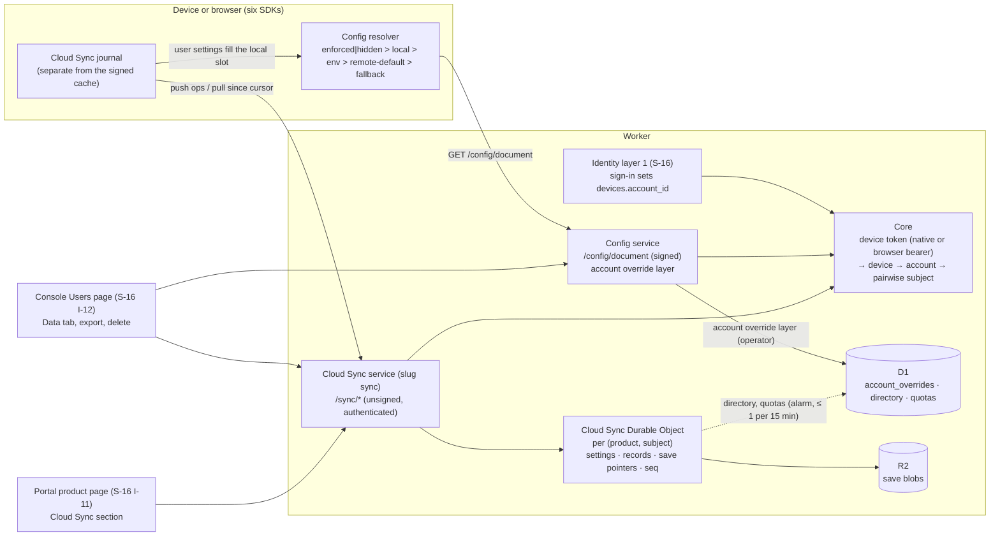

> Research note for [Godot on Polaris Key](../README.md), 2026-10-04. Spike S-17, commissioned
> by the lead on the owner's request of 2026-10-04: plan a system for user settings and store
> sync, built on S-16's identity layer and integrated into the SDKs, as an extension of the managed
> config layer and flexible per app or game. It also carries the S-16 owner decision of the same
> day that **removes the licence-level config override layer in favour of user-level managed
> config** and asks S-17 for its migration path (§5.12). Research and design only: no product code
> changed, nothing was deployed, no account or credential was used, and no live call was made. File
> references are to the tree at `ece22812` (`W/` = `packages/worker/src/`,
> `M/` = `packages/worker/migrations/`). Prior-art facts were read from primary documentation
> during the research pass; figures marked [U] were not confirmed against a current primary page.
> Revised the same day after a critique. The revision fixed the licence-override migration for
> licence-key devices, added a quickstart, specified per-member and OR-set conflict semantics, the
> exact push and journal rules and a client scenario corpus, and added a cost and abuse model with
> per-product ceilings, D1 write coalescing, the browser principal and a re-estimated work-package
> table. Cloudflare prices and limits were re-read from developers.cloudflare.com during that
> revision. **Revised a second time the same day** for the owner decisions below and for S-16's
> restructure around one Polaris Key account (S-16 at `1ee7375a`): the service, the principal, the
> migration and the work-package table changed; the sync mechanics did not.

> **Owner decisions (2026-10-04), binding. This header governs the note; where older text below
> seems to say otherwise, this header wins.**
>
> 1. **Identity is S-16's two layers.** Layer 1, now: **one Polaris Key account across all
>    products**, with sign-in methods as links, licences attached to the account, and floating
>    licences (no account) that keep working but prompt sign-up. Layer 2, later: per-app identity.
>    Developers only ever see data for their own products, through a **pairwise (per-product)
>    subject**, never the global account id.
> 2. **Cloud Sync is its own service**, named "Cloud Sync" (slug `sync`), with its own toggle. It
>    depends on Config and on Identity layer 1. It is no longer a sub-surface of Config (§4).
> 3. **The principal is the account × product**, seen by the product as its pairwise subject
>    (§5.2).
> 4. **The licence-level config override layer is removed everywhere.** It is replaced by
>    **user-level managed config** attached to the account per product (the **account override**,
>    §5.12). There is no "products without Identity keep licence overrides" exception any more.
> 5. **Floating licences have no such layer**, and are prompted to sign up.
> 6. **Overrides on licences with no owner are dropped at migration**, with an operator-visible
>    report. There is no grace period.
> 7. **No Cloud Sync without signing in, ever.** The zero-sign-in path (the licence-owned settings
>    backup and U-26) is removed. Before sign-in, settings persist locally only.
> 8. **Defaults confirmed:**
>    - the MVP of about 64 agent-days first, then the anonymous-to-signed-in merge and saves,
>      before collections;
>    - per-product ceilings of 50 GiB, 100k users holding data and 2,000 pushes per second;
>    - 1 MiB with saves off for signed-in users who hold no licence for the product;
>    - the platform pays Cloudflare until per-product billing exists;
>    - web apps use a device token issued to an origin on the product's `web.origins` allowlist,
>      which depends on S-16's redirect work package (I-08).

# S-17: Cloud Sync (user settings, collections and saves), defined

Evidence tags, as in the other notes:

- **[V]**: verified by reading this repo's code, config or docs, or a primary external source;
- **[M]**: measured here (none in this spike: it is design-only);
- **[I]**: inference or recommendation;
- **[U]**: unverified: needs an account, a current primary page or a staging deploy.

## 1. Summary and recommendation

**Question.** With S-16's Polaris Key account approved, what system lets apps and games store a
person's settings, and whatever else the developer needs, and have it follow them across devices
and storefronts? The owner framed it as an extension of Config, asked for flexibility per app or
game, and then decided it is its own service, **Cloud Sync**.

**What exists today.** Every Config value is operator-authored, server-merged, signed with the
product key and delivered per device. A device can write nothing in Config [V]
(`W/services/config/routes.ts:25-50`). The client already has a precedence slot for "the user's
choice". It is the `local` layer in `enforced | hidden > local > env > remote-default > fallback`
(`packages/client-core/src/config.ts:1-12`), documented as "User/local overrides" (`:41-52`) [V].
Nothing fills that slot durably:

- in Node, Python, Swift, Kotlin and React it is a fixed table supplied at construction, with no
  setter and no persistence [V];
- React's `ConfigPanel` says outright that the host owns persistence
  (`packages/sdk-react/src/components/ConfigPanel.tsx:52-55`) [V];
- only Godot has a writable, pluggable `PKeyOverrideStore`, and it is local only
  (`sdks/godot/addons/polaris_key/services/config/override_store.gd`) [V].

The other missing piece is that **a device has no link to a person**. A device token resolves to
`{tokenHash, license|null, device}` (`W/core/devices.ts:136-142`) [V]. S-16 adds accounts and
pairwise subjects but no device-to-account column (its named-user seats WP, I-24, would add
`devices.holder_account_id` later).

**Recommendation: Option C, "one catalog, its own service, one principal" [I; the service split is
the owner's decision].** Cloud Sync data is three tiers on one principal, all declared as data in
`.pkey/schema` (rule 5):

1. **User settings.** These are catalog `config` keys that opt in with a `user` block. They are
   typed, schema-validated and defaulted by the catalog, and the operator can still enforce them.
   The person's value fills the existing `local` slot on the client. The precedence order and the
   `config-matrix.json` corpus are unchanged, and `enforced` and `hidden` still win. The Config SDK
   persists the value locally on every product; Cloud Sync carries it across devices.
2. **Collections.** Developer-declared namespaces of JSON records (progress, unlocks, loadouts,
   UI layout, mod data, wildcards such as `mod.*`). Each declares an access class, a conflict
   policy, an optional schema and limits.
3. **Saves.** Slot-based blobs in R2 with small listable metadata (playtime, progress, chapter,
   thumbnail), revisions, a format version and metadata-driven conflict policies.

**Service split.** Cloud Sync (slug `sync`) owns the device routes under `/<p>/sync/`, the
per-principal Durable Object, R2 save blobs and its console section. It reads the product's
catalog through `shared-catalog` and Core, never by importing the Config service (rule 6). Config
keeps the signed document and gains the operator layer below. A product turns Cloud Sync on with
its own toggle, which requires Config.

**Operator side: the account override.** The owner removed the licence-level config override layer
everywhere. In its place, an operator writes **user-level managed config for one account on one
product**. Core merges it server-side into the signed config document at the position licence
overrides hold today (§5.12). The document's _content_ changes; its _shape_ does not. The account
override is Config's, not Cloud Sync's: it needs no Cloud Sync toggle and no sign-in on the device.

- A device whose licence is **owned** by an account receives that account's overrides, even if it
  activated by licence key before the licence was attached, because Core resolves the layer through
  `licenses.account_id`. So existing installs keep their values.
- A device on a **floating** licence gets no account layer, and the SDK UI kits prompt sign-up.
- At migration, overrides on owned licences move to the owner's account × product; **overrides on
  licences with no owner are dropped**, listed in an operator report (§5.12).

**Principal.** The principal is the **account × product**, which the product sees as its pairwise
subject. A new Core column, `devices.account_id`, records "this account signed in on this device".
Identity's sign-in sets it when it returns the activation response, and sign-out clears it. It is
not a seat claim and never enters a signed document, so S-16 decision 9 stands. Licence-key
activations never set it. Cloud Sync storage is keyed by `(product, subject)`, so nothing in it
carries the global account id or joins across products.

**No Cloud Sync without signing in.** Cross-device sync needs the Cloud Sync toggle on and a
signed-in account. Before sign-in, settings persist locally and upload at first sign-in, through
the attach merge (§5.5). A floating-licence device has no Cloud Sync and sees the sign-up prompt.
§5.16 has the five-minute quickstart.

**Browser.** A web React app is a browser device. It holds a device token issued through S-16
I-08's web redirect to an origin on the product's `web.origins` allowlist, and calls the Cloud Sync
routes with `Authorization: Bearer`. Those calls pass through the existing per-product CORS
allowlist, which never sends `Access-Control-Allow-Credentials` (`W/core/cors.ts:1-33`) [V]. No
cookie is involved, so there is no CSRF surface (§5.8 item 9).

**Storage.** One SQLite-backed Durable Object per `(product, subject)` serialises that principal's
writes and owns the change sequence. R2 holds save bytes. D1 holds the account override layer (Core
reads it when it builds documents), a directory row per principal for the console, and quota
summaries. The DO writes the directory row at most once every 15 minutes, from an alarm, so D1 sees
about one to three writes per daily active user and none per sync operation (§5.2).

**Cost.** A 100k-DAU game with saves comes to roughly **$850 a month** on Cloudflare list prices.
R2 storage of save revisions and DO row writes dominate. A free app with 1M registered users and
settings only comes to about **$6 a month**. Abuse is bounded by per-product ceilings and by lower
defaults for users without a licence (§5.17). The platform pays until per-product billing exists
(owner).

**Sync.** A Replicache-shaped push and pull over the new device routes under `/<p>/sync/`, with
these parts:

- a per-client `mutationId` for idempotency, which advances past every processed result;
- a per-principal `seq` cursor;
- tombstones and a `cursor_expired` reset;
- per-key last-writer-wins by a clamped hybrid logical clock (HLC) for settings, with per-member
  clocks for object settings;
- revision compare-and-swap with a developer merge hook for records, and an observed-remove set
  for `union`;
- metadata policies or a prompt for saves.

Pull is the baseline. A hibernating WebSocket "poke" comes later. The client state machine
(journal, debounce, clock, rebase, partitioning, attach merge) is pinned by a language-neutral
scenario corpus, `sync-scenarios.json`, which every SDK replays against a fake clock and a fake
server (§5.13).

**Wire.** This is **plan mode**: new device-facing routes, new error codes, transcripts and all
six SDKs. There is **no `PROTOCOL_VERSION` bump** and **no signed-corpus change**, because Cloud
Sync data is not a signed document and the client resolution order does not change. It is the same
class of change as S-16 layer 1 (S-16 §5.3).

**Effort.** About **112 agent-days** for phases U0 to U3 in §6, plus about 14 for optional later
packages. The **minimum viable cut** is about **65 agent-days** (the owner confirmed about 64; the
extra day is the portal's Cloud Sync section that S-16's Library now calls for). It covers settings
in all six SDKs, the account override layer with the platform-wide licence-override migration, the
scenario corpus, a security review, and the settings half of export and deletion. Next come the
anonymous-to-signed-in merge and saves, then collections (owner). It sits on S-16's I-05, I-10,
I-11 and I-12, and on I-08 for the web (§6).



## 2. What Cloud Sync is for: the jobs

| #   | Job                                                                                                                              | Example                                             | Scope                                                                                   |
| --- | -------------------------------------------------------------------------------------------------------------------------------- | --------------------------------------------------- | --------------------------------------------------------------------------------------- |
| U1  | **Settings sync.** A person's choices follow them across devices, with operator enforcement still winning                        | Volume, language, keybinds, accessibility           | **Now** (MVP; cross-device needs a signed-in account, §5.16)                            |
| U2  | **Per-platform and per-device settings.** Some values roam within one platform family; some must never roam                      | Graphics quality on PC vs Switch; window geometry   | **Now** (MVP, through `sync` scopes)                                                    |
| U3  | **Operator per-account config.** Support pins a value or grants a key for one person, replacing licence overrides                | "Give this tester the beta endpoint"                | **Now** (MVP; every product, decision 3; owned licences only)                           |
| U4  | **Developer KV and document stores.** Arbitrary JSON the app needs, declared per product                                         | Progress, unlocks, loadouts, notes, mod data        | **Now** (phase U3, after saves)                                                         |
| U5  | **Save slots and blobs.** Opaque game saves with metadata, revisions and conflict UI                                             | Five save slots, 32 MiB each                        | **Now** (phase U2)                                                                      |
| U6  | **Cross-device and cross-storefront continuity.** One person on Steam, iOS and the web sees the same data                        | Buy on Steam, continue on iPad                      | **Now**; falls out of the one Polaris Key account (S-16)                                |
| U7  | **Anonymous first, signed in later.** Data written before sign-in merges into the account, with a prompt only on a real conflict | Play offline, create an account at level 10         | **Now** (phase U2, owner order)                                                         |
| U8  | **Support inspection.** Support sees, edits, resets and restores a person's data for its product, audited                        | "Why is my volume stuck?"; restore yesterday's save | **Now** (console Data tab, pairwise subject only)                                       |
| U9  | **Privacy.** Export and delete as part of S-16's account and per-product export and deletion                                     | GDPR Art. 15, 17, 20                                | **Now** (settings half in the MVP; the rest with each tier)                             |
| U10 | **Server-authoritative data.** Values the player must not edit, written by the developer's backend or the console                | Currency, entitlements mirrors, competitive stats   | **Later** (needs a backend credential; console writes now)                              |
| U11 | **Live cross-device updates.** A change on one device appears on another within seconds                                          | Companion app                                       | **Later** (WebSocket poke)                                                              |
| U12 | **Public data.** Other users of the same product read it                                                                         | Profile cards, ghost runs                           | **Later**                                                                               |
| U13 | **Cross-product (organisation) scope.** A person's data shared by several products of one developer                              | A franchise profile                                 | **Later**, opt-in, its own spike; it would cut across pairwise subjects (owner privacy) |
| U14 | **Client-side end-to-end encryption.** Polaris cannot read the data                                                              | Private journals                                    | **Later**, as an opaque value type                                                      |
| —   | Cloud Sync without signing in (a licence- or device-owned backup)                                                                | A licence-key desktop app on two PCs                | **Never** (decision 18); local persistence only                                         |
| —   | Query language, secondary indexes, leaderboards, matchmaking, a general app database, CRDTs in every SDK                         | Firestore-style queries; Yjs documents              | **Never** in this service (store CRDT bytes as opaque values)                           |

The Godot program needs U1, U5 and U7 most. Desktop and mobile apps need U1, U3, U4 and U8 [I].

## 3. Current state and the extension points

### 3.1 Config today

- **The catalog** (`packages/shared-catalog/src/types.ts:35-61`) declares typed `config`, `secret`
  and `flag` keys, with these fields [V]:
  - `schema` (a Draft-07 subset fragment);
  - `default` and `managementDefault`;
  - `delivery` for secrets;
  - `ui` hints, `accessor`, `deprecated` and `since`.
- **`managementDefault: default` already means "the user may override".** The type comment reads
  "`default` (overridable by user/env)" (`types.ts:11-14`) [V]. A synced user setting is the
  persistent, cross-device form of an override the SDK already allows.
- **`ui.scopes` exists but nothing enforces it.** `UiHints.scopes?: ("profile"|"license"|"device")[]`
  (`types.ts:22-23`) [V] has no consumer in the worker or the console schema code (research grep).
- **`Catalog.validateKeyValue` rejects unknown keys** and interprets the schema without generating
  code (`packages/shared-catalog/src/catalog.ts:133-143`, `:4-16`) [V]. It is the validator a user
  write path reuses.
- **Server merge** (`W/core/payload.ts:117-147`) [V] runs these layers in order:
  1. catalog defaults;
  2. the tier's profile;
  3. the licence's profiles;
  4. store grants;
  5. licence overrides (`:142`);
  6. device overrides (`:145`).

  **The merge rule** (`W/merge.ts:25-55`) [V]: when a lower layer is `enforced` or `hidden` and a
  higher layer offers `state: "default"`, the lower entry stays. So a user layer of `default`
  entries can never break operator enforcement.

- **Device overrides are dormant.** They are read at `payload.ts:145`, but no route writes them.
  Registration only carries the existing value forward (`W/core/devices.ts:412, 540`) [V].
- **Licence overrides carry three buckets.** These are `config`, `secrets` and `entitlements`,
  seeded empty at enrol and issue (`W/services/license/enroll.ts:101-105`,
  `W/services/license/admin/licenses.ts:166-170`) and edited through `PUT /licenses/<id>/overrides`
  (`licenses.ts:426-462`) [V]. Secrets are sealed before storage
  (`W/admin/lib/overrides.ts:14-80`) [V].
- **The signed config document** is `pkey-config+jws`, device-token authenticated with no licence
  gate (D-08) and strongly ETagged (`W/services/config/document.ts:58-137`) [V]. It is capped at
  `MAX_DOC_BYTES = 65536` (`packages/shared-jws/src/index.ts:114`) [V]. The cap alone rules out
  carrying arbitrary Cloud Sync data in it.
- **The offline cache holds signed artefacts only.** Unsigned state in it was the R2-01/R4-01
  vulnerability class (`packages/client-core/src/store.ts:1-25`) [V]. Cloud Sync needs its own
  journal, and that journal must never feed a gate.
- **The only device-authored store is telemetry.** `POST /<p>/devices/report` has a 16 KiB cap, a
  bounded allowlist and overwrite semantics (`W/core/devices.ts:1098-1150`) [V]. Its auth, size cap
  and licence-scoping pattern is worth copying; it is not a settings store.
- **Edge mint** for third-party tokens remains the route for games that want PlayFab or Firebase
  saves (`W/services/config/mint.ts`; omniplatform README `:1294-1296`) [V]. A first-party store
  complements it and does not replace it.

### 3.2 Each SDK's config surface

All six SDKs are read-only, with a local table that the host supplies:

| SDK    | Read API                                                                                                          | Local layer today                                                                                                                                                                      |
| ------ | ----------------------------------------------------------------------------------------------------------------- | -------------------------------------------------------------------------------------------------------------------------------------------------------------------------------------- |
| Node   | `getConfig`, `getConfigSource`, `listUserConfig` (`packages/sdk-node/src/config/client.ts:80-148`)                | `localOverrides` fixed at construction (`:38-65`) [V]                                                                                                                                  |
| React  | `getConfig`, `listUserConfig`, `getConfigSource` (`packages/sdk-react/src/core/types.ts:292-299`)                 | `PolarisState.localOverrides`, frozen per snapshot (`:218-223`); `ConfigPanel` leaves persistence to the host [V]                                                                      |
| Python | `get_config`, `list_user_config` (`sdks/python/src/polaris_key/config/client.py:67-145`)                          | `local_overrides` constructor argument (`:38, 50`) [V]                                                                                                                                 |
| Swift  | `config(_:default:)`, `listUserConfig` (`sdks/swift/Sources/PolarisKeyConfig/ConfigClient.swift:111-201`)         | `localOverrides`, a `let` (`:52-65, 76`) [V]                                                                                                                                           |
| Kotlin | `config`, `listUserConfig` (`sdks/kotlin/config/.../ConfigClient.kt:75-142`)                                      | `options.localOverrides` (`:34, 50`) [V]                                                                                                                                               |
| Godot  | `get_value`, `bind_property`, `config_changed` (`sdks/godot/addons/polaris_key/services/config.gd:3-33, 105-152`) | Pluggable `PKeyOverrideStore` with `set_override` and a `changed` signal; `PKeyConfigFileStore` over `user://settings.cfg` (`override_store.gd:1-47`, `config_file_store.gd:1-35`) [V] |

Godot's documented rule is the one to adopt everywhere: "the store is never written by a sync: an
enforced or hidden key IGNORES the saved value, it does not delete it, so the player's choice comes
back if the operator relaxes the state" (`override_store.gd:15-16`) [V].

### 3.3 Identity (S-16) as it touches Cloud Sync

Read against S-16 at `1ee7375a`, restructured around the owner's two-layer decision:

- **One global account, pairwise per product.** A person has one Polaris Key account with many
  sign-in links and one Library of licences from every developer. Each product sees the person only
  as a stored random **pairwise subject** per `(account, product)` (`account_product_subjects`).
  "The global account id never leaves the Identity service and the portal"; S-16 §5.6 nonetheless
  owes S-17 the account id inside the Worker, the pairwise subject at the edge, the merge and
  deletion hooks, and a web device token (S-16 §5.1, §5.6) [V].
- **Account × product data** is an S-16 noun: managed config overrides and Cloud Sync data, keyed
  `(account_id, product)` in its table sketch, "owned by S-17; listed here because deletion and
  merge must reach it" (S-16 §5.1) [V]. This note keys Cloud Sync storage by the pairwise subject,
  which names the same pair (§5.2).
- **Licences attach to accounts.** `licenses.account_id` (nullable) replaces `licenses.sub` and
  `portal_license_links`; null means floating. The claim rules are first-attach only, and an owned
  licence never moves by key (S-16 §5.1) [V].
- **Floating licences** keep working on devices exactly as today, prompt sign-up, and "have no
  account × product data" (S-16 §5.1) [V].
- **Key entry is a bounded on-ramp.** Past a product's `keyEntryLimit`, apps refuse the key with
  `key_entry_limit` and a `portalUrl`; attaching the licence ends key entry for it. Existing
  installs are never affected (S-16 §5.3) [V]. So a licence-key device on a licence that was later
  attached keeps running, which is why §5.12's owner fallback exists.
- **Account merge** needs proof of both accounts. For each product both touched, the surviving
  pairwise subject wins and the other becomes an alias; colliding account × product data "is never
  silently overwritten; S-17 owns the conflict UI" (S-16 §5.1) [V]. §5.5 defines it.
- **Apps never host credential entry** in layer 1. Sign-in is the login card at `key.plrs.im`, by
  web redirect, native redirect or device code, with the "<App> wants you to sign in" header; the
  earlier in-app email-code API is dropped (S-16 D17) [V]. Quickstart code here uses that flow.
- **Identity without License:** signing in gives a product a pairwise subject and a device token
  without minting a licence, under `requires-identity` (S-16 decision 4) [V]. Such devices carry
  `license_id = ""` (`NO_LICENSE_ID`, `W/core/devices.ts:170-189`) [V], so any licence-based route
  to the account fails for them; `devices.account_id` covers them.
- **The device keeps the licence document as its only gate.** `PROTOCOL_VERSION` stays 4.
  `DocProfile` has no subject until named-user seats, I-24 (S-16 §5.3, decision 9) [V].
- **Privacy:** Polaris is controller for the account and processor for each product's data; full
  account deletion cascades to every product's account × product data and emits a
  `subject.deleted` event per product; per-product export and deletion exist in the portal (I-11)
  and the console (I-12) (S-16 §5.5) [V]. Cloud Sync joins all of these.
- **The portal is the Library** (I-11), with a Cloud Sync section only on the product pages of
  products with the service on (S-16 §5.7) [V].

### 3.4 Extension points

| Extension point                                                                              | Reuse                                                                    |
| -------------------------------------------------------------------------------------------- | ------------------------------------------------------------------------ |
| Client `local` slot and `ConfigSource`                                                       | User settings fill it; `getConfigSource` keeps answering `local`         |
| Godot `PKeyOverrideStore`                                                                    | `PKeyUserSettingsStore extends PKeyOverrideStore`                        |
| `Catalog.validateKeyValue` and representability                                              | Server-side validation of every settings write and schema-bearing record |
| `applyOverrides` batch semantics and sealing                                                 | The operator account override layer, unchanged                           |
| `mergePayloads` and the enforced-wins rule                                                   | The account override layer slots in where licence overrides sit          |
| `ManagedPayloadEditor.tsx`                                                                   | The console editor for account overrides                                 |
| `RateLimitDO`, `UpdateHealthDO`, R2 `BLOBS` (`packages/worker/wrangler.toml:31-40, 143-157`) | Precedent for a new Durable Object class and the R2 binding [V]          |
| `devices/report` caps and `coreDeviceAllowed`                                                | Request-size caps and licence scoping on writes                          |
| `tools/services.json` descriptors and the services checklist                                 | The new `sync` service (Cloud Sync), its toggle and `requires: config`   |
| `tools/gen-mirrors.ts`                                                                       | Typed setting keys and collection types per language                     |
| `packages/cli/src/saveCompat.ts` (`provides`, `contentApi`)                                  | Save metadata records the content API a save needs                       |

## 4. Options

### Option A: a user layer inside the signed config document

The server merges user values as `state: "default"` entries above device overrides and signs them
into `pkey-config+jws`. User writes go through a small `PATCH /sync` route.

- **Pros.** No document shape change and no new cache slice. Enforcement is automatic through
  `merge.ts`. One read path.
- **Cons.**
  - Every slider change re-signs the document and churns its ETag.
  - The value reads as `remote-default` and therefore _loses_ to a stale `local` override on the
    device.
  - `updatedAt` stops meaning "last admin change".
  - User-authored data is signed by the product key as if the operator had written it.
  - The 64 KiB cap rules out collections and saves.
  - Sync latency is tied to the document refresh (half-life 30 minutes).
  - There is no conflict model.
- **Verdict.** Right only for the **operator** user layer (§5.12), wrong for user-authored data.

### Option B: a separate service with its own schema store

A new service owns settings, collections and saves behind its own routes, and declares its own
schemas outside the catalog. Settings are merged client-side.

- **Pros.**
  - Clean boundaries.
  - Independent enablement.
  - Sync mechanics fit the data, with no document coupling.
- **Cons.**
  - Settings are config: they share keys, schemas, defaults and enforcement with the catalog. A
    second schema store duplicates the catalog and drifts from it.
  - The `tools/services.json` checklist, boundaries test, discovery fragment and console section
    all double.

### Option C: one catalog, its own service (recommended; the service split is the owner's decision)

The first revision put Cloud Sync inside Config. The owner then decided it is **its own service**,
"Cloud Sync" (slug `sync`), with its own toggle, depending on Config and on Identity layer 1. The
recommendation keeps what made the hybrid work and adopts the split:

- **One catalog.** Settings are catalog `config` keys with a `user` block; collections and saves
  are declared in the same `.pkey/schema`. Cloud Sync reads the catalog through `shared-catalog`
  and a Core accessor, never by importing the Config service (rule 6).
- **Settings fill the client `local` slot.** The Config SDK persists them locally on every product;
  Cloud Sync carries them across devices when it is on and the person is signed in.
- **Its own service.** Routes under `/<p>/sync/`, its own Durable Object class, R2 prefix, discovery
  fragment, console section and `tools/services.json` entry. Turning it on requires Config.
- **The operator layer stays in Config.** The account override is managed config, merged by Core
  into the signed document (§5.12). It does not need Cloud Sync.

- **Pros.**
  - One catalog, one validator and one enforcement rule.
  - The client precedence and the corpus are unchanged.
  - Each tier gets the conflict model it needs.
  - Config stays read-only on the device wire; the first device-writable data surface is a service
    of its own, with its own toggle, cost ceilings and security review.
  - Products that want only managed config pay nothing for Cloud Sync.
- **Cons.**
  - A new service descriptor, discovery fragment and console section (about one agent-day, in
    U-04).
  - Cloud Sync depends on a principal, which Core must supply so it never imports Identity
    (rule 6).
  - Cloud Sync is useless without sign-in, by the owner's decision.

### Option D: a sync engine or CRDT documents (rejected as the default)

This means Zero or Replicache-style named mutators, or Automerge or Yjs documents. It is too heavy
to implement six times, and GDScript has no CRDT library [V: research landscape §1.15]. It is kept
as an opaque value type (`bytes` records or saves) that the developer merges client-side.

### Option E: bridge native platform saves only (rejected as the default)

This means relying on Steam Auto-Cloud, iCloud, Play Saved Games or XGameSave per storefront. It
gives no cross-storefront continuity, a platform can withdraw it (Windows Roaming was discontinued
as of Windows 11 [V: research landscape §1.16]), and there is no single support view. Coexistence
guidance goes into the docs (§9).

### Conflict and offline models considered

| Model                                         | Settings     | Records      | Saves          | Cost                                               |
| --------------------------------------------- | ------------ | ------------ | -------------- | -------------------------------------------------- |
| Arrival-order last-writer-wins                | No           | No           | No             | An offline week overwrites newer edits             |
| **Per-key LWW by clamped HLC edit time**      | **Yes**      | Opt-in       | No             | 64-bit clock per value; server clamps skew         |
| **Revision compare-and-swap + merge hook**    | No           | **Default**  | Yes (`manual`) | Every SDK surfaces a callback; keep a base copy    |
| **Metadata policy** (playtime, progress)      | No           | No           | **Default**    | Typed metadata on the slot                         |
| Per-member LWW (object members, own HLC each) | `merge`      | `merge`      | No             | A clock row per member; member ops on the wire     |
| Observed-remove set (OR-set) on the server    | No           | `union`      | No             | An add tag per element; `remove` names a cursor    |
| Server-applied commutative ops (`inc`, `max`) | `max`, `min` | Opt-in       | No             | Server applies; idempotent by mutation id          |
| Vector clocks                                 | No           | No           | No             | Not needed with one server authority per principal |
| Full CRDT state                               | No           | Opaque value | Opaque value   | Not in GDScript                                    |

All models are offline-first: the SDK writes to a local journal, reads its own writes at once, and
flushes later (§5.4).

### Comparison

| Criterion                                     | A: signed layer       | B: own schema store | **C: one catalog, own service** | D: sync engine | E: native only |
| --------------------------------------------- | --------------------- | ------------------- | ------------------------------- | -------------- | -------------- |
| Settings feel like config                     | Yes                   | Partly              | **Yes**                         | No             | No             |
| Arbitrary developer data                      | No (64 KiB)           | Yes                 | **Yes**                         | Yes            | Saves only     |
| Saves and blobs                               | No                    | Yes                 | **Yes**                         | Partly         | Yes            |
| Conflict model fits each tier                 | No                    | Yes                 | **Yes**                         | Yes            | Platform's     |
| Client precedence and corpus unchanged        | No (`remote-default`) | Yes                 | **Yes**                         | No             | n/a            |
| `PROTOCOL_VERSION` bump                       | No                    | No                  | **No**                          | No             | n/a            |
| Implementable in all six SDKs, incl. GDScript | Yes                   | Yes                 | **Yes**                         | No             | Per platform   |
| Rule 6 boundaries                             | Core                  | New service         | **New service, Core resolver**  | n/a            | n/a            |
| Cross-storefront continuity                   | Yes                   | Yes                 | **Yes**                         | Yes            | No             |
| Effort (agent-days, full)                     | ~20                   | ~130                | **~112**                        | 150+           | ~30            |

## 5. The recommended design, defined

### 5.1 Concepts (glossary, rule 4)

New nouns for `packages/docs/src/content/docs/start/concepts.md`, alongside S-16's **account**,
**floating licence**, **pairwise subject** and **account × product data** [I]:

- **Cloud Sync**: the service (slug `sync`) that stores and syncs a person's user settings,
  collections and saves for one product. Product copy and the console say "Cloud Sync".
- **user setting**: a catalog `config` key that declares a `user` block. Its chosen value is
  persisted on the device by the Config SDK and, with Cloud Sync, synced; the operator can still
  enforce it.
- **account override** (user-level managed config): an operator-authored managed-payload layer
  for one account on one product. It replaces the licence override everywhere.
- **collection**: a developer-declared namespace of **records** (JSON values keyed by id) held by
  the principal.
- **save**: a named slot holding an opaque blob plus metadata and revisions.
- **Cloud Sync data**: the umbrella for user settings, collections and saves held in Cloud Sync.
  With the account override it makes up S-16's account × product data.
- **principal**: whose Cloud Sync data it is. It is always one account on one product, named by
  that product's pairwise subject; device-scoped values are keyed by `(subject, device)`. There is
  no licence or device principal (decision 18).

The words `sync` and `store` are avoided in API method names, because `PolarisKey.sync()`,
`sync_finished`, `get_sync_state`, credential stores and `PKeyOverrideStore` already use them
(`sdks/godot/addons/polaris_key/polaris_key.gd:34-44, 185, 220`) [V]. The SDK namespace is
therefore `cloudSync` (`cloud_sync` in Python and GDScript), which does not collide with
`sync()`. The catalog's `sync:` scope field is a manifest attribute, not an API. The SDK surface
is `config.setConfig` for settings and `cloudSync` for collections, saves and status.

### 5.2 Data model

**Principal.**

| Column or table                      | Holds                                                                                                                                                                                                                                                                                                   |
| ------------------------------------ | ------------------------------------------------------------------------------------------------------------------------------------------------------------------------------------------------------------------------------------------------------------------------------------------------------- |
| `devices.account_id` (new, nullable) | The account signed in on this device. Set by Core's activation path when Identity's sign-in calls it; cleared by sign-out, account deletion, per-product data deletion, "sign out everywhere" and licence detach. Never set by licence-key activation. Never signed. I-24 may reuse it for seat holders |

The device token stays the credential. Core's `validateDeviceToken` already returns the device
row; a Core resolver, `resolveSyncPrincipal(device)`, maps `device.account_id` and the device's
product to the pairwise subject through Identity's table, behind a Core function so Cloud Sync and
Config never import Identity (rule 6). Cloud Sync sees only `(product, subject)`. The account id
stays in Core and Identity, as S-16 §5.1 asks.

**Why key by the subject, not the account id [I].** The subject already names exactly one account
on one product, and S-16 makes it the only identifier developers see. Keying the DO, the R2
prefix, the directory and `account_overrides` by it means a console export, a DO name or an R2 key
can never become a cross-product join key. Per-product deletion deletes the data and then the
subject, so the next contact starts a fresh subject and an empty DO. An account merge is the one
case where data must be re-keyed (§5.5).

**Operator layer (D1, read by Core during document builds; a Config table).**

| Table               | Key                  | Holds                                                                                           |
| ------------------- | -------------------- | ----------------------------------------------------------------------------------------------- |
| `account_overrides` | `(product, subject)` | `payload_json` (`config` and `secrets` sealed under `PLATFORM_KEK`), `updated_at`, `updated_by` |

**Person-authored data (one Cloud Sync Durable Object per `(product, subject)`, SQLite).**

| Table             | Columns                                                                                                                                                                                                                          |
| ----------------- | -------------------------------------------------------------------------------------------------------------------------------------------------------------------------------------------------------------------------------- |
| `meta`            | `seq` (monotonic change counter), `schema_version`, `bytes_used`, `created_at`, `directory_dirty` and `directory_flushed_at` (for the coalesced D1 flush)                                                                        |
| `settings`        | `key`, `scope_key` (`""` for `user`, a platform family for `platform`, a device id for `device`), `value_json`, `version` (= `seq` of last write), `edited_hlc`, `client_id`, `updated_by` (`device:<id>`, `console`, `backend`) |
| `setting_members` | For `conflict: merge` settings only: `key`, `scope_key`, `member` (a top-level property name), `value_json`, `edited_hlc`, `client_id`, `deleted`. The setting's value is the object of its live members                         |
| `records`         | `collection`, `id`, `value_json`, `version`, `edited_hlc`, `client_id`, `updated_by`, `deleted`                                                                                                                                  |
| `record_fields`   | For `conflict: merge` collections only: `collection`, `id`, `field` (top-level), `value_json`, `edited_hlc`, `client_id`, `deleted`                                                                                              |
| `set_elements`    | For `conflict: union` collections only: `collection`, `id`, `element_key` (sha-256 of the element's canonical JSON), `element_json`, `add_tag` (the `seq` of the `add`). An element is present while at least one tag remains    |
| `saves`           | `slot`, `object_key` (R2), `sha256`, `size`, `format_version`, `metadata_json` (≤ 4 KiB), `thumbnail_key`, `version`, `updated_by`                                                                                               |
| `revisions`       | `target` (`save:<slot>` or `record:<collection>/<id>`), `version`, pointer or value, `created_at`                                                                                                                                |
| `clients`         | `client_id`, `last_mutation_id`, `device_id` (bound on first use; another device presenting it gets `client_mismatch`), `last_seen`; rows expire after 90 days idle                                                              |
| `tombstones`      | `target`, `seq`, `deleted_at` (no personal data)                                                                                                                                                                                 |

**D1 directory and quotas, coalesced.** `sync_directory (product, subject, bytes, records,
saves, last_active_at, updated_at)` backs the console list, the export job and per-product totals.
Per-write D1 traffic would bring back the single-primary contention that §5.2's choice of DOs
avoids, so the DO never writes D1 on the request path [I]:

1. An accepted write that changes `bytes_used` or counts sets `meta.directory_dirty = 1`.
2. If no alarm is pending (the DO keeps that in memory after one `getAlarm()`), it calls
   `setAlarm(now + 15 min)`. `setAlarm` is billed as one row written
   (developers.cloudflare.com/durable-objects/platform/pricing) [V].
3. The alarm upserts one directory row if the DO is dirty, then clears the flag. It does nothing
   if the DO is clean.
4. Per-product totals are a scheduled aggregate over the directory, every 15 minutes, never a
   per-write counter. Per-product ceilings therefore lag by at most one interval (§5.17).

The expected D1 load is at most one directory upsert per active user per 15 minutes. A typical
daily active user with two sessions causes one to three upserts, about six D1 rows written with the
index. A 100k-DAU product adds about 18M D1 rows written a month, inside the 50M a month that the
Workers Paid plan includes, and averages about 3.5 writes per second at the primary. Per-write
updates would have needed about 32 rows per user per day and about 19 writes per second on
average, with peaks several times higher.

**R2 layout.** `u/<product>/<subject>/<sha256>` holds content-addressed, immutable objects, so
concurrent uploads are safe and duplicates collapse. Unreferenced objects are collected by a DO
alarm.

**Why a Durable Object per principal and not D1 rows [I].** One DO serialises a principal's writes, so `seq`
and compare-and-swap need no cross-request locking. It is also the natural WebSocket hub for live
updates later. D1 executes on one primary per database, so a hot product's sync traffic would
queue every product's admin and document queries. The research figures are: D1 about 1,000 queries
per second at 1 ms per query; a DO 10 GB, 2 MB per row or value and about 1,000 requests per
second per object, with 30-day point-in-time recovery (developers.cloudflare.com D1 and DO limits
pages, read by the research pass) [V]. The cost is lazy per-object schema migrations and no
cross-principal SQL. The D1 directory covers the console's needs.

### 5.3 Catalog and manifest extension

**Settings: a `user` block on a `config` entry.** There is no new `ConfigKind`, so `enums.json` and
the generated constants do not change.

```yaml
# .pkey/schema
schemaVersion: 5
entries:
  - key: audio.music.volume
    kind: config
    schema: { type: number, minimum: 0, maximum: 1 }
    default: 0.8
    managementDefault: default
    user:
      sync: user # user | platform | device | local
      conflict: lastWrite # lastWrite | max | min | merge (no union on settings)
      listed: true # shown in listUserConfig and ConfigPanel (default true)
  - key: graphics.quality
    kind: config
    schema: { type: string, enum: [low, medium, high, ultra] }
    default: medium
    user: { sync: platform } # roams within desktop | mobile | console | web
  - key: input.bindings
    kind: config
    schema: { type: object, additionalProperties: { type: string } }
    default: {}
    user: { sync: user, conflict: merge } # one clock per member (§5.5)
  - key: ui.window.geometry
    kind: config
    schema: { type: object }
    user: { sync: device, listed: false } # server-backed per device, never roams
```

The `sync` scopes [I]:

- `user` roams everywhere.
- `platform` roams within a platform family. The SDK reports the family from its existing platform
  detection.
- `device` is stored under `(user, device)`. It survives reinstalls and is visible to support.
- `local` never leaves the device. It is today's local override, now persisted.

Per VS Code's `machine` scope, a `device`-scoped value is never synced elsewhere [V: research
landscape §1.17].

**Collections and saves: a `cloudSync` block.**

```yaml
cloudSync:
  collections:
    - name: progress
      access: owner # owner | ownerRead | server | public (later)
      conflict: revision # revision (CAS + hook) | lastWrite | merge | union
      schema:
        { type: object, properties: { level: { type: integer, minimum: 1 } } }
      limits: { maxRecords: 1, maxRecordBytes: 65536 }
      onAttach: prompt # anonymous → signed-in: keepCloud | keepLocal | merge | prompt
    - name: unlocks
      access: ownerRead # client reads; console or developer backend writes
      conflict: union
    - name: support_notes
      access: server # never delivered to devices
    - name: "mod.*" # any collection matching the pattern, same policy
      access: owner
      limits: { maxRecords: 500, maxRecordBytes: 16384 }
  open: false # true: undeclared collection names allowed at default limits
  saves:
    slots: { max: 5, byTier: { supporter: 20 } } # tier ids checked against .pkey/product
    maxBytes: 33554432 # per slot, compressed
    keepRevisions: 5
    conflict: prompt # prompt | mostRecent | longestPlaytime | highestProgress
    requiresFlag: cloud_saves # optional: only users whose effective flags grant it
    metadata:
      schema:
        type: object
        properties:
          chapter: { type: integer }
          playtimeSeconds: { type: integer }
          progress: { type: number }
      playtimeField: playtimeSeconds
      progressField: progress
    thumbnail: { maxBytes: 131072 }
    format: { refuseNewer: true }
  limits: { totalBytes: 268435456, byTier: {} }
  unlicensed: # signed-in accounts with no usable licence for this product
    limits: { totalBytes: 1048576 } # defaults in §5.17; saves off unless set here
    saves: { slots: 1, maxBytes: 8388608, keepRevisions: 1 }
  writes: { requireLicense: false, minTrust: null } # licence and device-trust gates (§5.8)
  migrations:
    - toSchemaVersion: 5
      rename: { "gfx.q": "graphics.quality" }
      drop: [legacy.tutorialSeen]
```

The access classes follow Unity Cloud Save, PlayFab and Nakama, but under names that do not reuse
`enforced` and `hidden` [V: research landscape §1.7, §1.9, §1.10]. The save policy names follow
Google Play Games Saved Games [V: research landscape §1.5].

**Validator rules** (rule 9: each needs a rule and a mutation-table entry) [I]:

1. `user` is allowed only on `kind: config`.
2. `user` is not allowed on a key whose `managementDefault` is `enforced` or `hidden`.
3. `max` and `min` apply only to numbers, and `merge` only to objects (`type: object`).
4. `user.conflict` cannot be `union`. A setting that holds a set is an object of booleans with
   `conflict: merge`, which gives per-element add and remove through member ops.
5. A `merge` setting or collection merges top-level members only, at most 256 of them; nested
   values are replaced whole.
6. A collection with `conflict: union` must have a schema of `type: array` with `uniqueItems`, and
   its elements' canonical JSON is at most 1 KiB each.
7. Collection names are unique, and patterns do not overlap.
8. `byTier` and `requiresFlag` must name declared tiers and flags.
9. `access: server` and `public` cannot set `onAttach: keepLocal`.
10. Limits, including `unlicensed`, must not exceed the platform ceilings (§5.7). `unlicensed`
    limits must not exceed the licensed limits.
11. `migrations.rename` targets must be declared keys, and a key may not be both renamed and
    dropped.

The manifest JSON schema (`packages/shared-manifest/schemas/v1/schema.schema.json`) gains the
blocks, and `gen-mirrors` and `gen-docs` follow. The unused `ui.scopes` gains `user`. Recommend
that it stays a hint and that `user.sync` is the enforced field (decision 9).

### 5.4 Sync protocol

All routes sit under the Cloud Sync service (`/<p>/sync/`). They need Config and the product's
Cloud Sync toggle on (§5.16), and a device whose `devices.account_id` resolves to a pairwise
subject. There is no other principal: a device with no signed-in account, including every device on
a floating licence, gets `401 account_required` (decision 18).

**Authentication.** Every route takes `Authorization: Bearer <device token>`, resolved by Core's
`validateDeviceToken` to the device row and then to `devices.account_id`:

- **Native SDKs** send the token they already hold.
- **A web React app** is a browser device: it registers like any device and holds its token in
  IndexedDB. Its account binding and token come from S-16 I-08's web redirect, which returns the
  activation response to an origin on the product's `web.origins` allowlist (the owner's
  condition; S-16 has no in-app email code any more, D17). All `/sync/*` paths join the CORS
  inclusion list in `W/core/cors.ts` and its `routeCoverage` table, so a page on an origin listed
  under the product's `web.origins` can read them (`cors.ts:1-33`, `:181-211`) [V].
  `Access-Control-Allow-Credentials` is never sent, so the browser attaches no cookie.
- **The first-party browser session cookie** (`pkey_<slug>_session`, `SameSite=Lax`,
  `browserSession.ts:95`) [V] is **not** accepted on these routes in v1. Accepting it later, for
  the portal only, would need the same `x-csrf-token` double-submit check the session routes use
  (`browserSession.ts:404-406`) [V] and would stay off the CORS list.

| Route                                                     | Purpose                                                                                                                |
| --------------------------------------------------------- | ---------------------------------------------------------------------------------------------------------------------- |
| `GET /<p>/sync?cursor=<seq>&parts=settings,progress`      | Pull changes since a cursor; `If-None-Match` on the cursor gives a cheap `304`                                         |
| `POST /<p>/sync/ops`                                      | Push a batch of mutations; the response doubles as a pull                                                              |
| `GET /<p>/sync/saves`                                     | List slots (metadata only)                                                                                             |
| `POST /<p>/sync/saves/<slot>/begin`                       | Reserve an upload: `{sha256, size, formatVersion, baseVersion, metadata}`; checks quota and version                    |
| `PUT /<p>/sync/saves/<slot>/upload/<uploadId>`            | Stream the body through the Worker into R2 with the binding's `sha256` check; multipart only above the 100 MB body cap |
| `POST /<p>/sync/saves/<slot>/finalize`                    | Idempotent; flips the slot pointer atomically in the DO; returns the new version                                       |
| `GET /<p>/sync/saves/<slot>[?version=]`                   | Stream the blob (or a revision)                                                                                        |
| `GET /<p>/sync/saves/<slot>/revisions`, `DELETE …/<slot>` | Revisions and delete                                                                                                   |
| `GET /<p>/sync/live` (later)                              | WebSocket upgrade for pokes                                                                                            |

**Push body.**

```json
{
  "clientId": "c_7f…",
  "mutations": [
    {
      "mutationId": 41,
      "target": { "setting": "audio.music.volume", "scope": "user" },
      "op": "set",
      "value": 0.6,
      "editedHlc": "0190f3a2c1b4:0003"
    },
    {
      "mutationId": 42,
      "target": { "record": ["progress", "main"] },
      "op": "set",
      "value": { "level": 4 },
      "baseVersion": 117
    }
  ],
  "atomic": false
}
```

**Operations.** A mutation's `op` must suit the target's conflict policy. A mismatch is
`rejected` with `op_invalid_for_policy`:

| Target policy                     | Ops accepted                                                                                                              |
| --------------------------------- | ------------------------------------------------------------------------------------------------------------------------- |
| Setting, `lastWrite`              | `set`, `clear`, each with `editedHlc`                                                                                     |
| Setting, `max` or `min`           | `set` (the server keeps the max or min), `clear` (a reset with `editedHlc`; later `set`s with an older clock are ignored) |
| Setting, `merge`                  | `setMember {member, value}`, `removeMember {member}`, `clear`, each with `editedHlc`; no whole `set`                      |
| Record, `revision` or `lastWrite` | `set`, `delete`, with `baseVersion` (`revision`) or `editedHlc` (`lastWrite`); `inc` on numbers                           |
| Record, `merge`                   | `setField`, `removeField`, `delete`, each with `editedHlc`                                                                |
| Record, `union`                   | `add {element}`, `remove {element, observedSeq}`, `delete`; no whole `set`                                                |

The SDKs hide this. `setConfig` on a `merge` key diffs the new object against the local view and
emits one member op per changed member. `union` collections expose `add` and `remove`, not `put`.

The mechanics [I]:

- **Idempotency and order.** The DO applies mutations in `mutationId` order. It skips any mutation
  at or below `clients.last_mutation_id[clientId]` and returns `duplicate` for it, so retries are
  safe and each client's writes apply in order. This follows Replicache's push model
  [V: doc.replicache.dev "how it works"].
- **Per-mutation results.** Each result is one of:
  - `ok` with the new `version` (and `renamedTo` or `dropped` when a migration applied);
  - `conflict` with the server copy and version;
  - `rejected` with a code: `value_invalid`, `setting_unknown`, `access_denied`, `quota_exceeded`
    (with `scope: user | product`), `op_invalid_for_policy` or `store_requires_flag`;
  - `duplicate` for a replayed mutation;
  - `aborted` for the other mutations of an `atomic` batch that failed.
- **Versions.**
  - `baseVersion` omitted means an unconditional write.
  - `baseVersion: "*"` means create-only.
  - A number means compare-and-swap.

  These are Nakama's three modes [V: research landscape §1.10].

- **Pull response.** It carries `{cursor, changes[], tombstones[], lastMutationId, more}`. A cursor
  older than the tombstone horizon (default 90 days) gets `410 cursor_expired`, and the client
  takes a full snapshot.
- **Batches.** A batch holds at most 100 mutations or 256 KiB. `atomic: true` makes it all or
  nothing.
- **Pull triggers.** Pull on start, on foreground, after a push, piggybacked on the existing
  document refresh, and on a backoff timer.
- **Live updates (phase 4).** A hibernating WebSocket to the user's DO carries **pokes only** ("the
  cursor is now N"), so there is one data path. Hibernated sockets are not billed for duration, and
  they drop on deploy, so clients reconnect and pull [V: research mechanics §6, DO WebSocket
  docs]. Godot has `WebSocketPeer` natively.

**Client journal.** Each SDK keeps an append-only operation log, separate from the signed cache.
Locations:

| SDK            | Journal location                                  |
| -------------- | ------------------------------------------------- |
| Node, Python   | Beside the cache file                             |
| Swift          | Application Support                               |
| Kotlin         | The app's files directory (DataStore on Android)  |
| React, browser | IndexedDB, with `BroadcastChannel` for other tabs |
| React, desktop | The main process (bridge v4)                      |
| Godot          | `user://pkey/<product>/sync/<subject>.json`       |

Journal behaviour:

- Reads are optimistic: the server snapshot plus pending operations.
- Writes are debounced per key (2 s by default), so dragging a slider is one mutation.
- The journal flushes on:
  - reconnect;
  - background or quit (Godot `NOTIFICATION_WM_CLOSE_REQUEST` and `NOTIFICATION_APPLICATION_PAUSED`,
    Android `ProcessLifecycleOwner` with a WorkManager retry, Swift `scenePhase`, browser
    `pagehide` with `fetch keepalive`, Node `beforeExit`, Python `atexit`);
  - an explicit `flush()`.
- The journal and the cache are partitioned by user id. Nothing written as user A is ever flushed
  under user B.

**Push and journal rules.** These rules are normative. Each one has scenarios in
`sync-scenarios.json` (§5.13), so six implementations behave the same way [I]:

1. **`last_mutation_id` advances past every processed mutation**, whatever its result: `ok`,
   `conflict`, `rejected`, `duplicate` or `aborted`. Only a request-level failure leaves it
   unchanged: a transport error, a 5xx, or a 401, 413 or 429 for the whole request. Otherwise a
   `conflict` would wedge the client forever. On a processed result the client removes the
   mutation from the journal.
2. **Conflicts are resolved as new mutations.** A `conflict` on mutation N carries the server copy
   and version. The client drops N, updates its snapshot with the server copy, and runs the policy
   or hook. It then enqueues the resolution as a **new** mutation with a fresh `mutationId`, above
   every id already sent, and `baseVersion` set to the server version. It never resends N.
3. **One outstanding compare-and-swap per target.** A record target has at most one sent but
   unacknowledged `revision` mutation. Later local edits to that target are coalesced in the journal
   and sent only after the result arrives, rebased on it. So when N conflicts, no later mutation N+1
   on the same target is already in flight with a stale base. Mutations on other targets, and all
   LWW, member and set ops, are not held back.
4. **`clientId` lifetime.** The SDK generates a random 128-bit `clientId` per (install, owner
   partition) and stores it in the journal file next to the next `mutationId`, in the same atomic
   write.
   - If the journal is missing, unreadable or its counter cannot be trusted (reinstall, cleared
     storage, restore from an old backup), the SDK generates a **new** `clientId` and starts again
     at 1. It never reuses a `clientId` with a reset counter, because the server would silently
     skip those mutations as duplicates.
   - Pending operations in a lost journal are lost, and the docs say so.
   - The server binds a `clientId` to the first device that uses it. Another device presenting it
     gets `client_mismatch`, and the client regenerates.
   - Idle `clients` rows expire after 90 days, the tombstone horizon.
5. **Sign-out with pending operations.** `signOut()` first flushes, waiting up to 5 seconds by
   default. If operations are still pending (offline, or the timeout expired), the result is
   `{ unsynced: n }` and an `unsyncedData` event fires. Under `onSignOut: clear` (the default) the
   SDK wipes the user's snapshot cache but **keeps** that user's pending operations in that user's
   partition. They are flushed at that user's next sign-in on the device, and expire after 30 days.
   A different user never sees them, because partitions are keyed by user id.
   `signOut({ discardUnsynced: true })` deletes them. `onSignOut: keep` keeps the snapshot as well.
6. **Renamed and dropped keys.** The server rewrites incoming mutations through the catalog's
   `migrations`, so an old build keeps working:
   - a mutation on a renamed key (`gfx.q`) is applied to the new key (`graphics.quality`), with
     `mapValues` applied, and returns `ok` with `renamedTo`;
   - a mutation on a dropped key returns `ok` with `dropped: true` and changes nothing.

   Neither case is `setting_unknown`, so an old client never loops on a rejection. Every pull
   carries the catalog's alias map, and the SDK resolves reads of an old name through it, so the old
   build's UI shows the migrated value.

7. **`cursor_expired` with a non-empty journal.** The client keeps its journal and replaces its
   snapshot with a full pull. It then re-applies pending operations over the new snapshot for its
   optimistic view, and pushes them unchanged. Their `baseVersion` may now be stale, which rule 2
   handles.
8. **Clocks.** The HLC's physical part is `localNow + serverOffset`. `serverOffset` is
   `serverNow − localNow`, taken from the last response and persisted with the journal; it is 0
   before first contact. See §5.5 for clocks that run slow.

### 5.5 Conflict strategies and developer merge hooks

| Tier          | Default                                       | Alternatives                                                         | How the developer intervenes                                                                                                                                                          |
| ------------- | --------------------------------------------- | -------------------------------------------------------------------- | ------------------------------------------------------------------------------------------------------------------------------------------------------------------------------------- |
| User settings | `lastWrite` by clamped HLC edit time, per key | `max`, `min`, `merge` (a clock per member)                           | None needed; `onChange` with `origin: "remote"`                                                                                                                                       |
| Records       | `revision` (compare-and-swap)                 | `lastWrite`, `merge` (a clock per field), `union` (OR-set); op `inc` | `update(id, fn)` retries `fn` on a fresh copy; or `onConflict(local, remote, base) → resolved`; default without a hook: **keep the server copy and keep the local one as a revision** |
| Saves         | `prompt`                                      | `mostRecent`, `longestPlaytime`, `highestProgress`                   | `onConflict` gets both candidates with metadata, device name and thumbnail and calls `keep()` with local, remote or both; `both` puts one copy in a free slot or as a revision        |

**HLC rules** [I]. The HLC is 48-bit milliseconds plus a 16-bit counter, with `clientId` as the
final tie-break (Kulkarni et al., OPODIS 2014 [V: research mechanics §3]). The server folds its own
clock into every response. It clamps `editedHlc > serverNow + 5 min` to `serverNow`, so a device
clock set to 2099 cannot win forever. This uses edit time, not arrival time, so a week-old offline
edit does not overwrite a newer one. That is the Steam "empty fresh install looks newer" failure
[V: research landscape §1.1].

**Clocks that run slow** [I]. The clamp covers only future skew. A device whose clock runs behind
stamps its edits too early, and they lose to concurrent edits from correct clocks. After first
contact this is solved by journal rule 8: the HLC uses `localNow + serverOffset`, so a slow clock
is corrected from the server's time. The residual case is **edits made before the device has ever
reached the server**, because the offset is still 0. For that case:

- the journal marks such operations `preContact: true`;
- the first response gives the offset. If the offset is larger than 5 minutes, the SDK re-stamps
  every `preContact` operation as its local time plus the offset before the first push. This
  assumes the clock was off by a constant amount during the offline period, which is the usual
  case (a wrong time zone, or a dead clock battery);
- if the clock was changed during that period, ordering among those early settings edits can
  still be wrong, and the losing value is overwritten. Records and saves do not use LWW by default,
  so they are unaffected.

The docs state this limit. The scenario corpus pins re-stamping with a clock 3 days slow.

**Per-member merge (settings and records with `conflict: merge`)** [I]. Each top-level member has
its own clock row (`setting_members` or `record_fields`, §5.2).

- `setMember` and `removeMember` are last-writer-wins **per member** by `editedHlc`. A removal is a
  member tombstone with a clock, so a concurrent `setMember` with a later clock brings the member
  back, and one with an earlier clock does not.
- `clear` tombstones every member at its clock.
- The value delivered on pull is the object of live members, plus each member's clock, so the
  client can merge without another round trip.
- After applying a batch, the server validates the assembled object against the key's schema. A
  member op that would make it invalid is `rejected` with `value_invalid`, and the earlier state
  stays.
- Example: the phone rebinds `jump` while the PC rebinds `crouch`. Both survive. If both rebind
  `jump`, the later edit wins, and the other device's `onChange` reports `origin: "remote"`.

**Observed-remove set (records with `conflict: union`)** [I]. This is an OR-set applied by the one
server authority, with no CRDT state on the client (Shapiro et al. 2011, by way of the research's
mechanics angle).

- `add {element}` inserts a tag equal to the `seq` that applies it.
- `remove {element, observedSeq}` deletes the element's tags at or below `observedSeq`, which is
  the client's cursor when the user removed it.
- An `add` the remover had not seen (tag above `observedSeq`) survives, so concurrent add wins. A
  stale device cannot resurrect a removed element, because it can only `add`, and a whole `set` is
  `op_invalid_for_policy`.
- Fully removed elements leave no tag rows. Their removal reaches other clients as a pull change
  `{removed: element}` until the tombstone horizon.
- `union` is not offered on settings (validator rule 4). An object-of-booleans setting with
  `merge` gives the same add and remove with per-element clocks.

**Per-unit resolution.** Each slot or record conflicts and resolves on its own. A non-conflicting
change elsewhere is never discarded. This improves on PlayFab Game Saves' all-or-nothing choice
[V: research landscape §1.7]. Losing branches are kept as revisions.

**Anonymous to signed-in (U7).** Before sign-in, the SDK of a product with Cloud Sync keeps data in an
account-less local partition (`owner: "local"`). At the first sign-in on that device:

| Situation            | Settings                                                                                                                                                      | Collections               | Saves                                                                        |
| -------------------- | ------------------------------------------------------------------------------------------------------------------------------------------------------------- | ------------------------- | ---------------------------------------------------------------------------- |
| Cloud side empty     | Uploaded                                                                                                                                                      | Uploaded                  | Uploaded                                                                     |
| Both sides have data | Per-key policy (newer edit wins)                                                                                                                              | Per-collection `onAttach` | **Never overwritten.** Local slots fill free slots; with none free, `prompt` |
| Any `prompt`         | The SDK raises one `MergeRequest` listing the conflicts; the UI kits ship a themable prompt ("Keep this device's progress / Keep cloud progress / Keep both") |                           |                                                                              |

The pull response carries `empty: true` for a principal with no data, so the common case needs no
prompt. This mirrors Google Play's guidance to warn when signing into an account that already has
cloud progress [V: research landscape §1.5].

**Account merge (S-16's link-existing-account).** S-16 lets a person merge two accounts with proof
of both; for each product both touched, the surviving pairwise subject wins and the other becomes an
alias, and colliding account × product data "is never silently overwritten" (S-16 §5.1) [V]. Cloud
Sync applies the attach rules above per product, server-side, through I-05's merge hook [I]:

- only the absorbed subject holds data for a product: its DO content is copied into the surviving
  subject's DO (a new `seq` range, `updated_by: merge`) and the absorbed DO is deleted after the
  copy commits;
- both hold data: settings merge by the per-key policy (newer edit wins); records and saves that
  collide are **parked** as revisions on the surviving side, and the next sign-in on that product
  raises the same `MergeRequest` ("Keep this progress / Keep the other / Keep both");
- account overrides: per key, the surviving account's value wins, and every collision is listed for
  the operator in the console;
- a device still bound to the absorbed account re-resolves through the alias, so it keeps syncing.

**Writes to locked keys.** The SDK refuses `setConfig` on a key that is `enforced` or `hidden` in
its current document, with `setting_locked`, and journals nothing. The server **accepts and keeps**
a value whose key is enforced only for some devices. Enforcement varies per device (tier, licence,
device layer), and Godot's rule says the choice comes back when the operator relaxes. The server
refuses only keys with no `user` block (`setting_unknown`).

### 5.6 How settings resolve on the client

The resolution order is unchanged. The `local` slot's value becomes:

```
local(key) = hostLocalOverrides[key]        // the constructor table: developer intent wins
          ?? userSettings.effective(key)    // journal over server snapshot, by the key's sync scope
```

`getConfigSource` still answers `local`. A new accessor carries the sync state, so the
`ConfigSource` enum and `config-matrix.json` stay untouched:

```
settingState(key) = { scope, pending, updatedAt, updatedBy, invalid, locked }
```

`listUserConfig` keeps the §2.2.1 rule 4 semantics. A key with `user.listed: false` is not listed.

**Invalid stored values.** After a schema change, an invalid value is kept raw and marked `invalid`.
Resolution falls through to the next layer, so nothing crashes, and the console shows it.

**The `local` versus `env` question.** Today `local` beats `env`, so a synced user value overrides
a `PKEY_CONFIG_*` variable on a kiosk or in CI. The recommendation keeps the order and documents
that operators use `enforced` to lock a value. Decision 6 covers this.

### 5.7 Quotas and limits

These defaults are anchored on prior art: Apple KVS 1 MB, Unity 5 MiB per access class, and Xbox
and PlayFab saves 256 MB per user per title [V: research landscape §2]. A developer may tighten
them, tiers may raise them through `byTier`, and a platform ceiling sits above both [I]. They
apply to **licensed users**: signed-in accounts holding a usable licence for the product.

| Item              | Default                                                                | Platform ceiling         |
| ----------------- | ---------------------------------------------------------------------- | ------------------------ |
| User settings     | ≤ 256 keys; ≤ 8 KiB per value; ≤ 64 KiB per user                       | 256 KiB                  |
| Collections       | ≤ 32 declared; record ≤ 64 KiB; ≤ 10,000 records; ≤ 5 MiB per user     | 1 MiB per record; 64 MiB |
| Saves             | ≤ 16 slots; ≤ 32 MiB each, compressed; 5 revisions; ≤ 256 MiB per user | 1 GiB per user           |
| Push              | ≤ 100 mutations or 256 KiB; ≤ 60 per minute per device                 | —                        |
| Save transfers    | ≤ 30 per hour per user                                                 | —                        |
| Key and id length | ≤ 128 bytes, `[A-Za-z0-9._:-]`                                         | —                        |

**Unlicensed users** get lower defaults (owner-confirmed): signed-in accounts holding no usable
licence for the product, for example on an Identity-only product without auto-issue. Sign-up is
cheap there, so each account must cost little [I]. Floating-licence devices are not users here at
all: they have no Cloud Sync.

| Item          | Unlicensed default                                                                                                  |
| ------------- | ------------------------------------------------------------------------------------------------------------------- |
| User settings | ≤ 64 KiB (as licensed; settings are cheap)                                                                          |
| Collections   | ≤ 1,000 records; ≤ 512 KiB per user                                                                                 |
| Saves         | **Off** unless the product sets `cloudSync.unlicensed.saves`; at most 1 slot of 8 MiB with 1 revision unless raised |
| Total         | ≤ 1 MiB per user unless the product raises `unlicensed.limits`                                                      |

**Per-product ceilings** sit above every per-user limit. They are set per product by the platform
operator in the console, not by the product's `.pkey/`, because they are the platform's cost
control. The defaults below are owner-confirmed:

| Ceiling                           | Default                     |
| --------------------------------- | --------------------------- |
| Total Cloud Sync bytes            | 50 GiB                      |
| Users holding any Cloud Sync data | 100,000                     |
| Pushes per product                | 2,000 per second, sustained |

They are enforced from the 15-minute directory aggregate (§5.2):

- at 80% the console warns the operator;
- at 100% any write that would add bytes or a new data-holding user is rejected with
  `quota_exceeded` and `scope: product`;
- deletes, writes that shrink data, and all reads keep working.

The overshoot is bounded by one interval's growth. A product that really needs more, such as the
100k-DAU game in §5.17, has its ceiling raised deliberately, and the console shows a projected
monthly cost beside the ceiling.

A principal's DO is created lazily on the first write. An account that never writes costs nothing in
DO storage.

Other limit rules:

- **Over quota, only the offending write is rejected** (`quota_exceeded`, with remaining bytes).
  Sync never stops wholesale, unlike Windows Roaming [V: research landscape §1.16].
- **Oversized data is never deleted automatically**, unlike EOS [V: research landscape §1.8].
- **Rate limits** reuse `RateLimitDO`, with per-product totals so one tenant cannot exhaust the
  shared Worker.
- **The Worker request-body limit** depends on the Cloudflare account plan: 100 MB on Free and
  Pro, 200 MB on Business, and up to 5 GB on Enterprise
  (developers.cloudflare.com/workers/platform/limits, read during this revision) [V]. Every save at
  the default 32 MiB slot size, and at a raised 64 MiB, streams through the Worker in one `PUT`.
  Multipart is needed only if a product's slot ceiling is raised above 100 MB.

### 5.8 Security

1. **The principal comes from the credential, never from the request.** The DO name is derived
   server-side as `idFromName("<product>:<subject>")`, and no route accepts a subject or account id
   from a device. Support and backends name a principal only by pairwise subject, through admin
   credentials scoped to that product.
2. **Principal binding.**
   - `devices.account_id` is set only by a real sign-in through Identity.
   - It is cleared on sign-out, on account disable or deletion, on per-product data deletion, by
     "sign out everywhere" and on licence detach. All of these go through one Core hook, shared
     with F-21's revocation trigger ("a licence detached from its account, or an account deleted",
     S-16 §5.6).
   - A licence-key activation never binds an account (an owned licence never moves by key, S-16
     §5.1). The operator account override layer still resolves through the licence's owning account
     for such a device (§5.12). That is operator configuration for the customer, as licence
     overrides are today. It gives the device no access to the account's settings, records or saves.
   - A device without a bound account gets `401 account_required` with a hint to sign in. There is
     no licence or device partition to fall back to (decision 18).
3. **Licence and entitlement gating.**
   - Reads of one's own data are always allowed while the principal is valid. People have a
     right of access anyway.
   - Writes follow `cloudSync.writes.requireLicense`. When License is enabled and this is true, a
     write needs a usable licence on the device, scoped the way `coreDeviceAllowed` scopes
     `/devices/report`.
   - `requiresFlag` gates a collection or the saves tier on an effective flag, for example "cloud
     saves for supporters".
4. **Device trust.** `writes.minTrust` can require `attested` (P6-02) for writes to selected stores,
   or only flag low-trust writers in the console.
5. **Client data is never a security input.** The journal is a separate store and never feeds a
   gate, entitlement or tier decision; the R2-01/R4-01 lesson (`client-core/src/store.ts:1-25`)
   [V]. Docs carry a "Cloud Sync data is client-writable" banner, in the style of Godot's "SECRETS ARE
   NOT SECRET IN A GAME" (`config.gd:21-25`) [V].
6. **Anti-tamper for saves.** The user is the adversary, and a key inside the client can be
   extracted. So:
   - anything of value goes in `ownerRead` or `server` collections, written only by the console or
     the developer's backend;
   - `owner` data gets schema checks, plus optional constraint keywords such as
     `x-pkey-monotonic: increasing` for progress fields;
   - the SDK records the sha256 of what it last synced, so a save edited outside the SDK surfaces
     as "modified offline";
   - server-signed receipts over `(product, user, target, version, sha256)` on a separate keyring
     are a later option (decision 13);
   - Godot docs warn never to pass save bytes to `bytes_to_var_with_objects`.
7. **Encryption.**
   - Cloudflare's platform encryption at rest is the baseline [U: cite in U-24].
   - **Per-principal data keys.** A per-principal key, wrapped under a product key derived from
     `PLATFORM_KEK`, encrypts R2 objects (R2 `ssecKey` takes 32-byte customer keys [V: research
     mechanics §11]) and large DO values. Destroying it crypto-shreds backups and point-in-time
     copies. Recommended for saves in v1.
   - **Client-side end-to-end encryption** is later. It is an opaque value type with developer- or
     user-held keys, set at creation only, and it rules out server validation, merging and
     support (decision 14).
8. **Hostile input.** Record and setting keys are restricted to the safe character set
   (`__proto__` and `constructor` are already ordinary keys in the resolver,
   `client-core/src/config.ts:9-10` [V]). JSON depth and size are capped before parsing, the
   content type of a blob is ignored, and blobs are only ever served as
   `application/octet-stream` with `Content-Disposition: attachment`.
9. **Browser principal.** A web app's device token is a bearer held in IndexedDB. It is never a
   cookie, so cross-site request forgery has nothing ambient to ride on. CORS only decides which
   listed `web.origins` may read responses (`W/core/cors.ts:12-20`) [V]. The residual risk is XSS
   on the developer's page stealing the token (T13). Mitigations:
   - the docs require a strict CSP for pages that use Cloud Sync;
   - `signOut` and "sign out everywhere" revoke the token server-side through the Core hook;
   - the token reaches only that principal's data in that product, never the console or the portal.

### 5.9 Privacy

Cloud Sync data and account overrides are account × product data, for which the developer is the
controller and Polaris the processor (S-16 §5.5) [V]. Developers see them only for their own
product and only under the pairwise subject (owner). Privacy ships with each tier, never after it:

- **U-12, in the MVP**, covers settings and account overrides: export, the delete cascades, and
  tombstone re-apply.
- **U-24** adds saves (in U2) and records (in U3): R2 prefix, save zip, crypto-shredding, before
  either tier is generally available.

- **Export (Art. 15 and 20).** S-16's per-product and full account export in the portal (I-11) and
  per-subject export in the console (I-12) gain:
  - a `cloudSync` section: settings, records and the account override layer for that product;
  - a save manifest with short-lived download links, delivered as a zip.
- **Delete (Art. 17).** Both S-16 cascades reach Cloud Sync: full account deletion (every product
  the account touched) and per-product "remove my data from <Product>" (one product). For each
  affected `(product, subject)`:
  1. call the principal's DO `deleteAll()`;
  2. delete the R2 prefix `u/<product>/<subject>/`;
  3. remove the directory row and `account_overrides` row;
  4. destroy the per-principal key;
  5. then let Identity delete the subject and emit `subject.deleted` (S-16 §5.5).

  DO point-in-time recovery keeps up to 30 days of history, and the deadlines for deleting the
  underlying logs are undocumented (cloudflare-docs issue #33631 [V: research mechanics §11b]).
  That is why crypto-shredding is the robust answer. S-16's tombstone list (deleted account ids and
  hashed emails) is re-applied after a DO or R2 restore as well.

- **Retention.** Tombstones and cursors hold no personal data. Pre-sign-in local data never leaves
  the device. Dormant accounts are deleted after S-16's period (36 months with no sign-in and no
  licence, [I] there), which cascades here; dormant account × product data otherwise follows each
  developer's retention setting (S-16 §5.5).
- **Residency.** DO `jurisdiction("eu")` and an EU R2 bucket can be fixed per product at creation,
  because existing objects do not move later [V: research mechanics §11b]. This is optional
  (decision 15).

### 5.10 Console surfaces

- **Users page, Data tab** (on S-16 I-12's per-product Users page, which shows pairwise subjects
  only):
  - **settings:** key, effective value, source, scope, last writer, updated at, invalid flag; edit
    (catalog-validated, `origin: admin`), reset, history and restore;
  - **account override editor** (the existing `ManagedPayloadEditor`);
  - **"what the app sees":** pick one of the principal's devices and render the resolved config;
  - **collections:** a JSON browser and editor with schema validation, revisions and restore;
    `server` collections are editable only here;
  - **saves:** metadata, size, thumbnail, revisions, download, restore and delete;
  - **quota meters**, plus export and delete this product's data for this subject.

  Every write is audited. Destructive actions and bulk restore need step-up, matching S-16's relink
  posture. An optional product setting notifies the person of support edits.

- **Catalog editor.** `CatalogEntryForm` gains a "User setting" section (scope, conflict, listed).
  The catalog usage report ("which profiles, tiers and licences set key K",
  `W/services/config/admin/catalog.ts:209`) gains account-override and synced-value counts per key.
- **Cloud Sync section** (its own service in the console, with its toggle). It edits
  `collections`, `saves`, `limits` and `migrations`, with the existing manifest round-trip and
  `services_source` rules, and shows the product's ceilings and projected cost.
- **Licence page.** On every product, after the migration (§5.12), the overrides editor edits
  entitlements only; config and secrets show as moved, with a link to the owning subject's Users
  page. A floating licence shows "No account: managed config for this customer needs an account".
- **Migration report** (§5.12 step 3): per product, the dropped overrides of unowned licences,
  downloadable for 90 days.

### 5.11 SDK API sketches

The naming is consistent across SDKs:

- **settings live on the existing config client**, as the owner's "extension of config". The
  Config SDK persists them locally on every product; when the product has Cloud Sync on and the
  person is signed in, the same calls also sync;
- **collections and saves live on `cloudSync`**, the Cloud Sync service's namespace;
- **status** is `cloudSync.status()`, never `sync()`, which already exists.

Untyped string keys work everywhere, and generated typed keys come from `gen-mirrors`.

**Node** (`@polaris-key/node`):

```ts
const pk = new PolarisKeyClient<SettingValues>({ product: "diceroll" });
pk.config.getConfig("audio.music.volume", 0.8); // unchanged getter, now sees the synced value
await pk.config.setConfig("audio.music.volume", 0.6); // resolves after the local journal commit
await pk.config.clearConfig("audio.music.volume");
pk.config.settingState("audio.music.volume"); // { scope, pending, locked, invalid, … }
pk.config.onChange(({ keys, origin }) => {}); // origin: local | remote | merge | migration | admin

const progress = pk.cloudSync.collection<Progress>("progress");
await progress.put("main", { level: 3 });
await progress.update("main", (v) => ({ ...v!, level: v!.level + 1 })); // CAS retry loop
await progress.patch("main", { $inc: { level: 1 } });
progress.onConflict(({ local, remote, base }) => merge(local, remote, base));

await pk.cloudSync.saves.write("slot-1", bytes, {
  metadata: { chapter: 3 },
  formatVersion: 7,
});
const save = await pk.cloudSync.saves.read("slot-1");
pk.cloudSync.saves.onConflict((c) => c.keep("both"));
pk.cloudSync.onMerge((m) => m.resolve({ default: "newest", saves: "both" }));
await pk.cloudSync.flush();
pk.cloudSync.status(); // { state: idle|pending|flushing|offline|blocked|error, pending }
```

**React** (`@polaris-key/react`). Hooks use `useSyncExternalStore`, as the existing hooks do.
`ConfigPanel` persists through `setConfig` by default when keys declare `user`.

```tsx
const [volume, setVolume, meta] = useSetting("audio.music.volume");
<Slider value={volume} onChange={setVolume} disabled={meta.locked} />;
const { value, update } = useRecord<Progress>("progress", "main");
const { slots, write, conflict } = useSaves();
const { state, pending } = useCloudSyncStatus();
<MergePrompt />; // themable, like the login components
```

**Python** (synchronous, as today's config API):

```python
pk.config.set_config("audio.music.volume", 0.6)
pk.config.setting_state("audio.music.volume")
progress = pk.cloud_sync.collection("progress")
progress.update("main", lambda v: {**v, "level": v["level"] + 1})
pk.cloud_sync.saves.write("slot-1", data, metadata={"chapter": 3}, format_version=7)
pk.cloud_sync.flush()  # also registered with atexit; start_background_flush(interval=5.0) opt-in
```

**Swift** (actor API plus SwiftUI; iOS 17 and macOS 14 allow `@Observable`,
`sdks/swift/Package.swift:59-62` [V]):

```swift
@PolarisSetting(\.musicVolume) var volume        // shaped like @AppStorage
Slider(value: $volume, in: 0...1).disabled($volume.isLocked)
try await client.config.set(SettingKeys.musicVolume, 0.6)
let progress = client.cloudSync.collection("progress", as: Progress.self)
try await progress.update(id: "main") { $0.level += 1 }
try await client.cloudSync.saves.write(slot: "slot-1", data: data, metadata: meta)
try await PolarisSettings.importFromUserDefaults([.musicVolume: "musicVolume"])
```

**Kotlin** (flows, with an optional Compose artifact):

```kotlin
val volume: StateFlow<Double> = client.config.setting(Settings.MusicVolume)
client.config.set(Settings.MusicVolume, 0.6)
var vol by rememberSetting(Settings.MusicVolume)   // :compose
val progress = client.cloudSync.collection("progress", Progress.serializer())
progress.update("main") { it!!.copy(level = it.level + 1) }
client.cloudSync.saves.write("slot-1", bytes, SaveMetadata(chapter = 3))
client.cloudSync.status: StateFlow<CloudSyncStatus>
```

**Godot** (the synced layer _is_ an override store):

```gdscript
PolarisKey.config.set_value("audio.music.volume", 0.6)   # PKeyResult; fails if locked
PolarisKey.config.bind_property($Music, "volume_linear", "audio.music.volume", 0.8)  # existing
PolarisKey.config.settings_changed.connect(func(keys, origin): pass)
# Default store becomes PKeyUserSettingsStore; it can mirror to the game's own file:
PolarisKey.config.set_override_store(
    PKeyUserSettingsStore.new(PKeyConfigFileStore.new("user://settings.cfg")))
var progress := PolarisKey.cloud_sync.collection("progress")
await progress.update("main", func(v): v.level += 1; return v)
await PolarisKey.cloud_sync.saves.write("slot1", var_to_bytes(state), {"chapter": 3}, 7)
PolarisKey.cloud_sync.save_conflict.connect(func(c): c.keep(&"remote"))
PolarisKey.cloud_sync.merge_requested.connect(func(m): $MergePrompt.open(m))
PolarisKey.cloud_sync.status_changed.connect(func(s): pass)   # not sync_*: the name is taken
```

The autoload wires the flush on close and pause. A `PKeySettingsPanel` scene mirrors React's
`ConfigPanel`.

### 5.12 The account override layer and the licence-override migration (owner decision)

**The decision.** The licence-level config override layer is removed **everywhere**. It is
replaced by user-level managed config attached to the account per product: the **account
override**. Floating licences have no such layer. Overrides on licences with no owner are dropped
at migration, with an operator-visible report (owner, 2026-10-04). The first revision's exception,
"products without Identity keep licence overrides", is gone: with one platform-wide account, any
product's licence can be attached to an account through the portal's Library, so every product has
somewhere to move overrides to.

**Placement.** On every product, Core's merge becomes [I]:

```
catalog defaults → tier profile → licence profiles → store grants → ACCOUNT OVERRIDES → device overrides
```

The account override layer replaces `licenses.overrides_json` config and secrets at `payload.ts:142`.
Its position after store grants keeps today's property that an operator override beats a store
grant (`payload.ts:137-141`) [V]. It is Config's layer: it needs Config and Identity layer 1, not
the Cloud Sync toggle, and it reaches every device the rule below picks, signed in or not.

**Whose overrides a device gets.** Core picks the principal whose layer applies:

```
overrideAccount(device) =
    device.account_id       // an account signed in on this device
 ?? license.account_id      // else the account that owns the device's licence
 ?? none                    // a floating licence, or no licence: no account layer
```

The second line keeps existing installs whole. A licence activated by key before it was attached
still has devices that never signed in, and S-16 never touches existing installs. After migration
their overrides live on the owning account × product, and `devices.account_id` is never set by a
licence-key activation (§5.8 item 2). Without the fallback, every such device would silently lose
its override the moment the migration ran. The fallback grants nothing new [I]:

- S-16's rule protects **the account's** data (links, personal details, other licences, and here
  settings, records and saves), and none of that reaches the device;
- an account override is **operator** configuration about that customer on that product, as the
  licence override was;
- the licence-key device gains nothing it did not already receive before migration.

A device signed in to a different account than the licence owner gets its signed-in account's
layer. Seats (I-24) behave as licence overrides do today: every device of the licence gets the
owner's layer.

**Floating licences.** No account layer, ever (owner). The console's licence page says "No account:
managed config for this customer needs an account" and offers the sign-up link the portal uses.
The SDK UI kits' existing "add to your Library" prompt (S-16 I-10) is the device-side prompt; this
note adds no new one.

**Entitlements.** Licence overrides also carry an `entitlements` bucket, which feeds the licence
document and gated delivery through `resolveEntitlements` (`W/core/authz.ts:140-190`,
`W/core/entitledAccess.ts:161`) [V]. Entitlements are what a licence sells, not config, and the
owner's text removes the **config** override layer. So the recommendation, carried from the first
revision, is that **entitlement overrides stay on the licence** on every product, floating ones
included, and only the `config` and `secrets` buckets move. This keeps the signed licence document
account-free (S-16 decision 9). It is the one point §7.3 asks the owner to confirm.

**Wire.** The config document's shape is unchanged, and so is its signing and its ETag. An account
override change correctly invalidates the ETag of every device whose `overrideAccount` is that
account on that product. No corpus regeneration is needed. Content now depends on
`devices.account_id` and `licenses.account_id`, and the document is built per device, so
per-device caching stays correct.

**Migration**, one platform-wide run, after S-16 I-05 has migrated owner pointers into
`licenses.account_id` (inside U-03) [I]:

1. **Inventory and notice.** For every product, list each licence with non-empty `config` or
   `secrets` overrides and whether it has an owning account. The console shows the inventory to
   operators before the run, with the run date and the count that will be dropped, so an operator
   can ask those customers to add the licence to their Library first. Default notice: 30 days [I].
   This is visibility before the run, not a grace period after it.
2. **Owned licence.** Merge its config and secrets overrides into the owner's `account_overrides`
   row for that product. If an account owns several licences of one product with conflicting
   overrides for one key, take the most recently updated value and list the conflict in the report.
   Licence-key devices of the licence keep receiving the values through `overrideAccount`'s owner
   fallback.
3. **Licence with no owner.** Drop its config and secrets overrides at the run (owner). Write an
   audit row per licence and add it to the **migration report**: per product, the licence id, the
   buyer email if any, the dropped key names, and non-secret values (secret values are listed by
   name only, never decrypted into the report). The report stays downloadable in the console for
   90 days, so an operator can re-apply values by hand once the customer has an account.
4. **Freeze writes.** From the run on, `PUT /licenses/<id>/overrides` accepts only `entitlements`,
   and the console's licence editor shows config and secrets as moved, with a link to the owning
   subject's Users page.
5. **Retire.** `payload.ts` stops reading the licence layer's config and secrets in the same
   release. The columns are emptied after the report window.

**Tests U-03 must carry:**

- a licence-key device on an owned licence receives the owner's migrated override, byte for byte
  the same signed config content as before migration, apart from timestamps;
- a signed-in device on a licence owned by another account receives its own account's layer;
- a device on a floating licence receives no account layer, and its licence's former overrides are
  in the report with an audit row;
- secret values never appear in the report;
- `PUT /licenses/<id>/overrides` refuses `config` and `secrets` after the run;
- the signed corpus is unchanged.

### 5.13 Wire impact

| Change                                                                                   | Device wire?                                         | `PROTOCOL_VERSION` / corpus                                                                                                                                                | Who follows                                                                                                                                                                          |
| ---------------------------------------------------------------------------------------- | ---------------------------------------------------- | -------------------------------------------------------------------------------------------------------------------------------------------------------------------------- | ------------------------------------------------------------------------------------------------------------------------------------------------------------------------------------ |
| `devices.account_id`; account override layer in Core's merge; licence-override migration | No: document content only                            | Neither                                                                                                                                                                    | Worker, admin console                                                                                                                                                                |
| Catalog `user` block; `cloudSync` manifest block                                         | Catalog JSON served at `/config/schema` gains fields | Neither; old SDKs ignore unknown catalog fields [U: confirm each SDK's catalog parser tolerates them, in U-01]                                                             | `shared-catalog`, `shared-manifest` (rule 9), `gen-mirrors`, console                                                                                                                 |
| **`/sync` pull and `/sync/ops` push** ⚑                                                  | **Yes**                                              | No bump: additive, feature-detected from the Cloud Sync discovery fragment (`sync: {settings, collections, saves, limits}`); **transcripts and parity, not signed corpus** | **Plan mode.** Contract (WIRE-CONTRACT-V4 Cloud Sync section, `shared-protocol` types) → `errors.json` (rule 3) → transcripts → OpenAPI and `routeCoverage` (rule 10) → all six SDKs |
| **Save routes** ⚑                                                                        | **Yes**                                              | Same                                                                                                                                                                       | Same chain                                                                                                                                                                           |
| `/sync/*` on the CORS inclusion list (browser bearer)                                    | Yes (browser)                                        | Neither; `routeCoverage` holds the list, the spec's `options` operations and the router together (`W/core/cors.ts:83-87`) [V]                                              | Worker, React (web)                                                                                                                                                                  |
| `sync-scenarios.json` client scenario corpus                                             | No: client behaviour, not wire                       | A new unsigned conformance file with a `--check` drift gate; not the signed corpus                                                                                         | All six SDK test suites (runners), `client-core` (reference)                                                                                                                         |
| **Live poke WebSocket** ⚑ (later)                                                        | Yes                                                  | Same                                                                                                                                                                       | Same chain                                                                                                                                                                           |
| Server-signed receipts (later, decision 13)                                              | Yes: a new signed artefact                           | Outside the corpus or a new corpus family; its own plan and keyring                                                                                                        | Plan mode                                                                                                                                                                            |
| React desktop bridge carries `setConfig` and `cloudSync.*`                               | IPC, not HTTP                                        | Bridge contract v3 → v4 (`packages/sdk-react/src/desktop/bridge.ts:1-30`) [V]                                                                                              | React                                                                                                                                                                                |

New error codes: `account_required`, `setting_unknown`, `setting_locked` (SDK-local), `value_invalid`,
`revision_conflict`, `quota_exceeded` (with `scope`), `payload_too_large`, `collection_unknown`,
`access_denied`, `store_requires_flag`, `cursor_expired`, `upload_mismatch`,
`op_invalid_for_policy`, `client_mismatch`.

New parity feature ids: `config.user.set` and `config.user.observe` (local persistence, Config),
and `sync.settings`, `sync.collection`, `sync.saves`, `sync.offline`, `sync.merge`, `sync.live`,
`sync.scenarios` (Cloud Sync).

Conformance transcripts to add:

- push, pull and `304`;
- conflict with the server copy;
- duplicate `mutationId` replay;
- `cursor_expired` reset;
- HLC skew clamp;
- `account_required`;
- quota rejection;
- save begin, upload and finalize, including a hash mismatch;
- anonymous-to-signed-in with an empty and a non-empty cloud;
- `setMember` and `removeMember` with concurrent clocks, and a whole `set` on a `merge` key
  rejected as `op_invalid_for_policy`;
- OR-set `add` concurrent with `remove`, and a stale `remove`;
- a `conflict` followed by an `ok` in one push, with `lastMutationId` past both;
- an `atomic` batch with one failure (`aborted` for the rest);
- a renamed key (`renamedTo`) and a dropped key (`dropped`);
- `client_mismatch`;
- a browser preflight and request from a listed `web.origins` origin, and from an unlisted one;
- `quota_exceeded` with `scope: product`.

`config-matrix.json` is untouched.

**Client scenario corpus.** HTTP transcripts pin the wire, not what the client does between
requests. The client behaviour is the part most likely to differ six ways: optimistic reads over
the journal, debounce, HLC folding, rebase after a conflict, user partitioning, the attach merge,
and `cursor_expired` with pending operations. The fix is a language-neutral scenario corpus,
`conformance/corpus/v2/sync-scenarios.json`, next to `config-matrix.json` [V: path], built in
U-18 before any SDK work [I]:

- **Format.** Each scenario has an initial state (catalog, document, journal, server state, clock)
  and a list of steps:
  - `local` (an SDK call such as `setConfig` or `put`);
  - `advance` (move the fake clock, which fires debounce timers);
  - `network` (online, offline, or failing with a status);
  - `respond` (the fake server answers the next request);
  - `signIn` and `signOut`;
  - `assert`, which checks the effective values with sources, the journal contents, the requests
    sent (their body shapes), the events emitted with `origin`, and `status()`.
- **Generation.** A reference client state machine and an in-memory reference server, both in
  `client-core`, generate the expected outputs with a `gen:sync-scenarios` script and a
  `--check` drift gate, as `gen:transcripts` does. The scenario files are data, so each SDK needs
  only a runner.
- **Runners.** Each SDK's test suite replays every scenario through a fake clock and a fake
  transport that serves the scripted responses and records requests. Each SDK adds a parity id,
  `sync.scenarios`.
- **Initial scenario set**, one or more per rule:
  - optimistic read with pending operations;
  - debounce coalescing a slider drag into one mutation;
  - server-time folding, a clock 3 days fast (clamped) and a clock 3 days slow (pre-contact
    re-stamp);
  - conflict then rebase as a new mutation;
  - one outstanding compare-and-swap per target;
  - account switch: A's pending operations are never sent under B;
  - sign-out with pending operations, under `clear` and under `discardUnsynced`;
  - journal loss giving a new `clientId`;
  - attach merge with an empty and with a non-empty cloud;
  - `cursor_expired` with a non-empty journal;
  - member merge and OR-set add and remove;
  - renamed-key aliases on read;
  - a locked key refused locally;
  - an invalid stored value falling through.

### 5.14 Threat-model deltas

| #   | Threat                                                                      | Control                                                                                                                         |
| --- | --------------------------------------------------------------------------- | ------------------------------------------------------------------------------------------------------------------------------- |
| T1  | Cross-user read or write by naming another user (IDOR)                      | Owner derived from the credential; DO name server-side; no user id in device routes (§5.8 item 1)                               |
| T2  | A leaked licence key reads the owner's saves                                | Licence-key activation never binds an account; an owned licence never moves by key (S-16 §5.1)                                  |
| T3  | A stolen device token keeps writing after sign-out or "sign out everywhere" | One Core hook clears `devices.account_id`; DO checks the binding per request                                                    |
| T4  | Player edits saves or `owner` records to cheat                              | Value lives in `ownerRead`/`server`; schema and monotonic constraints; receipts later; docs banner                              |
| T5  | Client data reaches a gate (the R2-01/R4-01 class)                          | Separate journal; lint rule in the SDK review checklist; never consulted by licence or entitlement code                         |
| T6  | Storage or cost abuse from one tenant or account                            | Per-principal and per-product quotas and rate limits; device-trust gate option; `requiresFlag`                                  |
| T7  | Clock tampering wins LWW forever                                            | HLC with server clamp                                                                                                           |
| T8  | Account switch on a shared PC leaks or flushes into the wrong user          | Journal and cache partitioned by user id; `onSignOut: clear` by default                                                         |
| T9  | Hostile JSON or blob (deep nesting, prototype keys, served as HTML)         | Caps before parse; key charset; `octet-stream` + `attachment` on download; no public URLs                                       |
| T10 | Operator or support abuse of personal data                                  | Audit every read of saves and every write; step-up for export, delete and bulk restore                                          |
| T11 | Deleted user's data restored from backup                                    | Crypto-shredding; tombstone re-apply covers DO and R2                                                                           |
| T12 | Unsafe deserialisation of save bytes in Godot                               | Docs and SDK sample use `bytes_to_var` without objects                                                                          |
| T13 | XSS on a web app steals the browser device token                            | Bearer only, never a cookie; strict-CSP guidance; server-side revoke via the Core hook; token scoped to one user in one product |
| T14 | Scripted mass sign-up fills storage (denial of wallet)                      | Lazy DO creation; unlicensed defaults (saves off); per-product byte and user ceilings (§5.7); S-16 sign-up limits               |
| T15 | Cloud Sync identifiers become a cross-product join key                      | Keys, DO names, R2 prefixes and exports use the pairwise subject only; no account id leaves Core and Identity (§5.2)            |
| T16 | Operator overrides reach a licence-key device through the owner fallback    | Intended: same data the licence override delivered before migration; operator data only, no Cloud Sync data (§5.12)             |

### 5.15 How it composes

- **Config.** User settings are config keys, and the Config SDK persists them locally on every
  product. The account override is a Config merge layer, read by Core. D-08 still holds for the
  signed document, which needs no licence. Config stays read-only on the device wire.
- **Cloud Sync.** Its own service (slug `sync`) and toggle, requiring Config. It reads the catalog
  through `shared-catalog` and a Core accessor, and its principal through `resolveSyncPrincipal`,
  so it imports neither Config nor Identity (rule 6).
- **Identity (layer 1).** It supplies the account, and sets and clears `devices.account_id`
  through Core. Account deletion, per-product deletion and export cascade into Cloud Sync data and
  account overrides. The UI kits' sign-in screens gain the merge prompt.
  - **Account merge** moves data: for each product, the absorbed subject's Cloud Sync data and
    account overrides join the surviving subject, and collisions go through the merge prompt and
    the operator report (§5.5).
  - **The developer's relink tool** moves a _licence_ between accounts, not data. Cloud Sync data
    stays with the account it was written by (decision 10).
- **Licence.** It no longer carries config overrides (§5.12). It optionally gates writes
  (`requireLicense`). Tiers raise quotas through `byTier`. Flags gate stores through
  `requiresFlag`. Floating licences get neither Cloud Sync nor an account layer.
- **Distribution and commerce.** Store grants stay a merge layer below account overrides.
  Purchases can raise save quotas through tier flags.
- **Portal (S-16 I-11).** The product page's Cloud Sync section, only for products with the service
  on: usage, last sync per device, export of that product's data, and "remove my data from this
  product". It is filled by U-12.
- **Edge mint.** It remains for developers who prefer PlayFab or Firebase.

### 5.16 Quickstart: synced settings in five minutes

The promise, stated plainly: **Cloud Sync needs the Cloud Sync toggle and a signed-in Polaris Key
account. It never works without sign-in** (owner). Sign-in itself needs no per-product setup in
layer 1: the account and its sign-in methods are platform-wide (S-16 §5.2). Without sign-in,
settings still persist locally on the device and upload at the first sign-in.

**1. Manifest** (the `.pkey/product` field names follow S-16 I-04 and this note's U-01, and are a
sketch [I]):

```yaml
# .pkey/product (excerpt)
services: [license, config, sync]

# .pkey/schema (on an existing config key)
- key: audio.music.volume
  kind: config
  schema: { type: number, minimum: 0, maximum: 1 }
  default: 0.8
  user: { sync: user } # the only new line
```

**2. Console.** Push or resync as today. Then turn on **Cloud Sync**. The toggle is off by default
because it creates storage cost, and its page shows the product's ceilings (§5.7).

**3. Node** (S-16 I-10's names are a sketch [I]):

```ts
const pk = new PolarisKeyClient({ product: "diceroll" }); // activated as today
if (!pk.identity.subject()) {
  await pk.identity.signIn(); // the login card: system browser, or device code with a QR
}
await pk.config.setConfig("audio.music.volume", 0.6); // journals, then flushes
pk.config.getConfig("audio.music.volume", 0.8); // 0.6 here and on Ana's other devices
```

**3. Godot** (GDScript names are a sketch [I]):

```gdscript
func _ready() -> void:
    if PolarisKey.identity.subject() == "":
        await PolarisKey.identity.sign_in()   # login card, with the "<App> wants you to sign in" header
    PolarisKey.config.bind_property($Music, "volume_linear", "audio.music.volume", 0.8)
    $VolumeSlider.value_changed.connect(
        func(v): PolarisKey.config.set_value("audio.music.volume", v))
```

That is the whole integration: no storage code, no conflict code, and no flush code. The autoload
flushes on pause and close. `bind_property` already re-applies remote changes. On a floating
licence, the same code keeps the value on the device, and the UI kit's sign-up prompt explains
what signing in adds.

### 5.17 Cost and abuse model

**Unit prices** (Workers Paid plan, list prices read from developers.cloudflare.com during this
revision) [V]:

| Resource         | Included per month             | Price beyond                                                                             |
| ---------------- | ------------------------------ | ---------------------------------------------------------------------------------------- |
| Worker requests  | 10M                            | $0.30 per million; CPU $0.02 per million CPU-ms (30M CPU-ms included)                    |
| DO requests      | 1M                             | $0.15 per million (HTTP, RPC and alarm invocations)                                      |
| DO duration      | 400,000 GB-s                   | $12.50 per million GB-s; idle objects eligible for hibernation are not billed            |
| DO SQLite rows   | 25B read; 50M written          | $0.001 per million read; $1.00 per million written (index updates and `setAlarm` count)  |
| DO SQLite stored | 5 GB                           | $0.20 per GB-month                                                                       |
| D1 rows          | Same as DO SQLite rows         | Same                                                                                     |
| R2 Standard      | 10 GB; 1M Class A; 10M Class B | $0.015 per GB-month; $4.50 per million Class A; $0.36 per million Class B; no egress fee |

Sources: workers/platform/pricing, durable-objects/platform/pricing, r2/pricing.

**Per-operation costs** [I: estimates, to be measured in U-05's load test]:

| Operation                    | Worker req. | DO req. | DO rows written                                                        | R2                          |
| ---------------------------- | ----------- | ------- | ---------------------------------------------------------------------- | --------------------------- |
| Pull (typical, or a `304`)   | 1           | 1       | 0 (about 20 rows read)                                                 | —                           |
| Push of one to a few ops     | 1           | 1       | about 6 (value, index, `meta`, `clients`, a tombstone or revision row) | —                           |
| Save upload (32 MiB or less) | 3           | 3       | about 8                                                                | 2 Class A (blob, thumbnail) |
| Save download                | 1           | 1       | 0                                                                      | 1 Class B                   |
| Directory flush (alarm)      | 0           | 1       | 1 (`setAlarm`) + 2 D1                                                  | —                           |

**Worked estimate 1: a game with 100k DAU** [I]. Assumptions:

- 300k monthly users, and 1M users holding data after a year;
- per daily user per day: 8 pulls, 12 pushes, 4 save uploads (2 MiB average, compressed), 1
  download, about 3 directory flushes;
- 3 slots × 2 MiB × (1 + 5 revisions) for monthly users, 20 MiB for lapsed users;
- 150 KB of DO SQLite per user, including SQLite's own overhead of about 12 KB for an empty database.

| Line                                         | Monthly volume | Cost                                        |
| -------------------------------------------- | -------------- | ------------------------------------------- |
| Worker requests and CPU (2 ms average)       | 102M requests  | ~$31                                        |
| DO requests (including alarms)               | 111M           | ~$17                                        |
| DO duration (20–200 ms billable per request) | 0.3–2.8M GB-s  | $0–30 [U]                                   |
| DO rows written                              | ~321M          | ~$271                                       |
| DO SQLite storage                            | ~150 GB        | ~$29                                        |
| R2 storage                                   | ~26 TB         | ~$390                                       |
| R2 Class A                                   | ~24M           | ~$104                                       |
| R2 Class B                                   | ~15M           | ~$2                                         |
| D1 (coalesced directory)                     | ~18M rows      | $0 (included)                               |
| **Total**                                    |                | **~$845–875 a month, about $0.009 per DAU** |

The levers, in order: revision count (5 → 2 cuts R2 storage by about 40%); moving revisions older
than 30 days to R2 Infrequent Access ($0.01 per GB-month, with retrieval charged); debounce and
batching (fewer pushes means fewer row writes); and putting thumbnails in the slot's DO row, which
saves a Class A write but costs DO storage at $0.20 per GB-month. This product needs its
per-product ceilings raised: to about 30 TB of bytes and 1.5M data-holding users.

**Worked estimate 2: a free app with 1M users, settings and small records only** [I]. Identity-only
without auto-issue, so every signed-in user is unlicensed. Assumptions: 5% daily users (50k), 4 pulls and 3 pushes per day, 600k
users who ever wrote, 40 KB each.

| Line              | Monthly volume | Cost            |
| ----------------- | -------------- | --------------- |
| Worker requests   | 10.5M          | ~$0.15          |
| DO requests       | 12M            | ~$1.65          |
| DO rows written   | 28.5M          | $0 (within 50M) |
| DO SQLite storage | 24 GB          | ~$3.80          |
| **Total**         |                | **~$6 a month** |

This product fits the default 50 GiB byte ceiling but needs its data-holding-user ceiling raised
from 100k to about 1M.

**The abuse case it must survive.** A first draft would have given every new account in an
Identity-only free product 256 MiB of saves and 5 MiB of records. One million scripted sign-ups
filling those defaults would store about 261 TB: roughly $3,900 a month in R2 plus $1,000 in DO
storage, paid by the platform. The controls in §5.7 bound it:

- unlicensed users get 1 MiB in total with saves off, so 1M scripted accounts at most store about
  1 TB (about $200 a month) before any ceiling applies;
- the per-product ceiling (50 GiB and 100k data-holding users by default) stops growth far
  earlier, at about $10 a month, and alerts the operator at 80%;
- the DO is created lazily, so accounts that never write cost nothing;
- S-16's sign-up and email rate limits apply upstream, and no Cloud Sync exists without an account.

**Who pays.** The platform account pays Cloudflare. Products are not billed per byte today, so the
per-product ceilings are the cost control. Raising one is a deliberate operator action, and the
console shows the projected monthly cost from the directory aggregate. Metered pass-through waits
until Polaris has per-product billing (owner-confirmed, decision 11).

## 6. Phases and work packages

The owner confirmed the order: the MVP first, then the anonymous-to-signed-in merge and saves,
then collections. The phases are re-cut to match, and every Identity dependency now names S-16's
re-cut work packages at `1ee7375a` (I-05 accounts core, I-08 app passthrough and web redirect,
I-10 SDK identity, I-11 portal Library, I-12 console Users).

| Phase                                        | Contents                                                                                                                                                                                                                               | WPs                                                                      | Agent-days    |
| -------------------------------------------- | -------------------------------------------------------------------------------------------------------------------------------------------------------------------------------------------------------------------------------------- | ------------------------------------------------------------------------ | ------------- |
| **U0. Plan**                                 | Decision record, glossary, data model, wire section, browser principal, errors, parity ids, scenario format, threat model, ceilings, the `sync` service descriptor                                                                     | U-01                                                                     | 5             |
| **U1. Settings and account overrides** (MVP) | Principal binding; account override layer and the platform-wide migration; catalog block and the Cloud Sync service; DO and routes; scenario corpus; security review; six SDKs; console; portal section; privacy (settings half); docs | U-02 … U-07, U-18 … U-21, U-12, and the settings halves of U-11 and U-15 | 60            |
| **U2. Attach merge and saves**               | Attach and account-merge framework; R2 blobs, revisions, policies, conflict UI in six SDKs; privacy for saves; console and docs for saves                                                                                              | U-08, U-10, U-13, U-25, the saves halves of U-24, U-11 and U-15          | 27            |
| **U3. Collections**                          | Records backend; collections in six SDKs; privacy, console and docs for records                                                                                                                                                        | U-09, U-22, U-23, the records halves of U-24, U-11 and U-15              | 20            |
| **U4. Later**                                | Live poke, developer-backend API, public collections, receipts, end-to-end encryption                                                                                                                                                  | U-14, U-16, U-17                                                         | 14 (optional) |

**MVP = U0 + U1: about 65 agent-days** (the owner confirmed about 64; U-12 gained a day for the
portal's Cloud Sync section, and U-04's new service scaffolding is offset by U-03's simpler
migration). It delivers the owner's licence-override removal on every product, cross-device
settings in all six SDKs, and the settings half of export and deletion. That half is needed because
settings and account overrides are personal data from day one (§5.9). **U2 does not wait for
collections.** Saves depend on U-05, U-08 and U-10 only.

Sizes: S ≤ 1 day, M 2–4 days, L 5+ days. ⚑ = plan mode. Gates are in addition to the green gate.
Ids are kept from the earlier revisions so cross-references stay valid; U-26 is retired.

| ID       | Phase    | Work package                                                                                                                                                                                                                                                                                                                                                                                                                                             | Deps                         | Size | Days | Gates and flags                                                                                                           |
| -------- | -------- | -------------------------------------------------------------------------------------------------------------------------------------------------------------------------------------------------------------------------------------------------------------------------------------------------------------------------------------------------------------------------------------------------------------------------------------------------------- | ---------------------------- | ---- | ---- | ------------------------------------------------------------------------------------------------------------------------- |
| U-01 ⚑   | U0       | **Plan.** Decision record (Cloud Sync as its own service on Config's catalog; DO per `(product, subject)`; account overrides in Config), glossary nouns (rule 4), data model, WIRE-CONTRACT-V4 Cloud Sync section with the op table and push rules, browser principal and CORS list, `shared-protocol` types, error codes, parity ids, manifest schema, scenario-corpus format, ceilings, threat rows T1–T16, catalog-parser tolerance check in each SDK | I-04                         | M    | 5    | Plan approval; rule 2 argument (no bump); rule 4                                                                          |
| U-02     | U1       | Principal binding: `devices.account_id` migration; Core activation path sets it on Identity sign-in (native and browser devices); one Core hook clears it; `resolveSyncPrincipal` returning `(product, subject)` for Cloud Sync and the account for Config (rule 6)                                                                                                                                                                                      | U-01, I-05                   | M    | 3    | Boundaries test; test that licence-key activation never binds; no account id in any Cloud Sync key                        |
| U-03     | U1       | Account override layer: `account_overrides`, `overrideAccount` with the licence-owner fallback, sealing through `applyOverrides`, console editor on the Users page, admin route; **the platform-wide migration** (§5.12 steps 1–5) with the inventory, notice and report                                                                                                                                                                                 | U-02, I-05, I-12             | L    | 5    | The six §5.12 tests; corpus unchanged (assert); migration dry run on a production-shaped copy                             |
| U-04     | U1       | Catalog, manifest and service: `user` block (with `merge` members) and `cloudSync` block (with `unlicensed`), validator rules 1–11 with mutation-table entries, `gen-mirrors` typed setting keys, `gen-docs`; **the `sync` service** in `tools/services.json` (descriptor, `requires: config`, toggle, discovery fragment, console section and accent); console catalog form and Cloud Sync page                                                         | U-01                         | L    | 6    | Rule 9 mutation table; services checklist and boundaries test; `gen-mirrors` drift; docs drift                            |
| U-05 ⚑   | U1       | Cloud Sync Durable Object (settings and `setting_members`, `seq`, clients, tombstones, lazy migrations), push rules 1–8 on the server, coalesced directory alarm, unlicensed limits and product ceilings, `RateLimitDO` limits, pull and push routes, browser bearer and CORS inclusion, discovery fragment, `errors.json`, OpenAPI and `routeCoverage`, transcripts                                                                                     | U-02, U-04                   | L    | 9    | Plan-mode chain (rules 3, 10); load test of one DO at the push limit, measuring rows written and billable duration per op |
| U-19     | U1       | **Security review of U-05** before any production deploy: T1–T3, T13–T16, cross-tenant, cross-product and cross-account tests, CORS behaviour, the clamp and quota paths                                                                                                                                                                                                                                                                                 | U-05                         | M    | 2    | **Gates U-05's production deploy and every U1 SDK release**; findings tracked as R-series                                 |
| U-18     | U1       | **Scenario corpus**: `sync-scenarios.json`, reference client state machine and in-memory server in `client-core`, `gen:sync-scenarios -- --check`, the Node runner as the template                                                                                                                                                                                                                                                                       | U-01                         | M    | 4    | Drift gate; every push and journal rule has a scenario                                                                    |
| U-06 ⚑   | U1       | SDK user settings in **Node and Python**: local persistence, journal, `setConfig`, `clearConfig`, `settingState`, `onChange` with origin, member diffs, flush hooks (`beforeExit`, `atexit`), sign-out rules, scenario runner                                                                                                                                                                                                                            | U-05, U-18, I-10             | L    | 5    | Transcripts; scenarios; parity rows                                                                                       |
| U-20 ⚑   | U1       | SDK user settings in **React**: web (IndexedDB journal, `BroadcastChannel` with one writer tab, bearer device token from I-08's web redirect, `pagehide` flush) and desktop (main-process journal, bridge v4), `useSetting`, `ConfigPanel` persistence, scenario runner                                                                                                                                                                                  | U-05, U-18, I-10, I-08       | L    | 5    | Transcripts incl. CORS; scenarios; parity rows                                                                            |
| U-07 ⚑   | U1       | SDK user settings in **Swift and Kotlin**: the same, plus `@PolarisSetting`, `rememberSetting` (optional `:compose`), Android WorkManager retry, Swift `scenePhase` flush, scenario runners                                                                                                                                                                                                                                                              | U-05, U-18, I-10             | L    | 7    | Transcripts; scenarios; parity rows                                                                                       |
| U-21 ⚑   | U1       | SDK user settings in **Godot**: `PKeyUserSettingsStore`, journal in `user://` (IndexedDB on web export), autoload flush on pause and close, `PKeySettingsPanel`, scenario runner in GDScript                                                                                                                                                                                                                                                             | U-05, U-18, I-10             | L    | 5    | Transcripts; scenarios; parity rows; web export check                                                                     |
| U-12     | U1       | Privacy, settings half, and the **portal Cloud Sync section**: export section for settings and account overrides in I-11's per-product and full export and I-12's per-subject export; delete cascade (DO `deleteAll`, `account_overrides`, directory) on account deletion and per-product deletion; tombstone re-apply after a restore; the product-page section (usage, devices, export, remove my data)                                                | U-03, U-05, I-11, I-12       | M    | 4    | Privacy review; deletion test after a simulated restore; portal suite and CSP parity                                      |
| U-11     | U1/U2/U3 | Console Data tab on I-12's Users page (pairwise subject only). Settings half (MVP, 3 days): settings, account overrides, "what the app sees", quota meters, audit and step-up. Saves half (U2, 2 days): saves, history and restore. Records half (U3, 1 day): collections browser                                                                                                                                                                        | U-03, U-05, I-12             | L    | 6    | Accessibility and console tests; cross-product visibility test                                                            |
| U-15     | U1/U2/U3 | Docs. Settings half (MVP, 2 days): concepts, the §5.16 quickstart, client-writable banner, "no Cloud Sync without sign-in" statement, the migration notice for operators, clock limits. Saves half (U2, 1 day): saves guide, Steam Cloud coexistence, Godot save security. Records half (U3, 1 day): collections guide                                                                                                                                   | U-06, U-21                   | M    | 4    | Docs drift                                                                                                                |
| U-08 ⚑   | U2       | Attach and merge framework: `empty` flag, `MergeRequest` in six SDKs, settings merge rules, merge prompt components in the four UI kits; **account-merge collisions** (S-16 I-05's merge hook re-keys the absorbed subject's data and parks colliding units for the prompt). Saves and records branches live in U-13, U-25, U-22 and U-23                                                                                                                | U-06, U-07, U-20, U-21, I-05 | M    | 4    | Transcripts and scenarios for empty and non-empty clouds and for a merged account                                         |
| U-10 ⚑   | U2       | Saves backend: begin, streamed upload with sha256 (multipart only above 100 MB), finalize, revisions, metadata policies, R2 GC alarm, per-principal data keys, `requiresFlag`, unlicensed saves limits                                                                                                                                                                                                                                                   | U-05, U-19                   | L    | 7    | Plan-mode chain                                                                                                           |
| U-13 ⚑   | U2       | Saves SDK in **Node, React, Python**: `saves.list/read/write/revisions`, conflict objects and `keep()`, saves attach merge, React `<SaveConflict/>`, flush-before-exit warnings                                                                                                                                                                                                                                                                          | U-10, U-08                   | L    | 5    | Transcripts; scenarios; parity                                                                                            |
| U-25 ⚑   | U2       | Saves SDK in **Swift, Kotlin, Godot** (Godot first): the same, plus the SwiftUI and Compose conflict views and the Godot `PKeySaveConflict` scene, `formatVersion` and `saveCompat` metadata                                                                                                                                                                                                                                                             | U-10, U-08                   | L    | 6    | Transcripts; scenarios; parity                                                                                            |
| U-24     | U2/U3    | Privacy beyond settings. Saves half (U2, 2 days): save manifest and zip in exports, R2 prefix delete, crypto-shredding, residency option. Records half (U3, 1 day): records in exports and deletion                                                                                                                                                                                                                                                      | U-12, U-10; U-09             | M    | 3    | Privacy review                                                                                                            |
| U-09 ⚑   | U3       | Collections **backend**: records with CAS and `*`, `inc`, `record_fields` merge, `set_elements` OR-set, wildcard collections, `ownerRead` and `server` classes with console writes, unlicensed limits, transcripts and scenario additions                                                                                                                                                                                                                | U-05, U-19                   | L    | 6    | Plan-mode chain; transcripts                                                                                              |
| U-22 ⚑   | U3       | Collections SDK in **Node, React, Python**: `collection`, `put`, `update` with the CAS loop, `add` and `remove`, `onConflict`, records attach merge                                                                                                                                                                                                                                                                                                      | U-09, U-08                   | L    | 5    | Transcripts; scenarios; parity                                                                                            |
| U-23 ⚑   | U3       | Collections SDK in **Swift, Kotlin, Godot**: the same with `Codable`, `@Serializable` and GDScript dictionaries                                                                                                                                                                                                                                                                                                                                          | U-09, U-08                   | L    | 6    | Transcripts; scenarios; parity                                                                                            |
| U-14 ⚑   | U4       | Later: live pokes over hibernating WebSockets, all six SDKs (Godot `WebSocketPeer`)                                                                                                                                                                                                                                                                                                                                                                      | U-05, U-07, U-21             | M    | 4    | Plan-mode chain; reconnect-on-deploy test                                                                                 |
| U-16 ⚑   | U4       | Later: developer-backend Cloud Sync API for `ownerRead` and `server` collections, addressed by pairwise subject, with the credential chosen in decision 12                                                                                                                                                                                                                                                                                               | U-09, I-21 or I-25           | M    | 4    | Plan mode (new credential use)                                                                                            |
| U-17 ⚑   | U4       | Later, optional: server-signed receipts (separate keyring), opaque end-to-end encrypted value type, public collections                                                                                                                                                                                                                                                                                                                                   | U-09, U-10                   | L    | 6+   | Plan mode (new signed artefact)                                                                                           |
| ~~U-26~~ | —        | **Retired** (decision 18): the licence-owned settings backup. No Cloud Sync without sign-in                                                                                                                                                                                                                                                                                                                                                              | —                            | —    | —    | —                                                                                                                         |

**Why the SDK estimates are what they are** [I]. S-16's SDK work package, I-10, is 8 days for six
SDKs plus the UI kits, for request and response flows. Cloud Sync needs a persisted journal,
debounce, the HLC with the server offset, rebase, partitioning, flush hooks and a scenario runner
in every SDK: a stateful offline state machine, estimated per SDK:

| SDK    | Days | Why                                                                                 |
| ------ | ---- | ----------------------------------------------------------------------------------- |
| Node   | 2.5  | Reference runner template in U-18 helps                                             |
| Python | 2.5  | Synchronous API with a background flusher                                           |
| Swift  | 3.5  | Actor plus SwiftUI property wrapper                                                 |
| Kotlin | 3.5  | Flows, Compose, WorkManager                                                         |
| React  | 5    | Two runtimes (browser and desktop bridge), cross-tab single writer, bearer and CORS |
| Godot  | 5    | Store integration, web export storage, settings panel, GDScript runner              |

Collections and saves add about 1.7 to 2 days per SDK each, including the UI components for saves.

**Critical path:** I-04 → U-01 → I-05 → U-02 → U-05 → U-19, then the four settings SDK packages
(after U-18 and I-10; React also after I-08), then U-08, then U-13 and U-25 (with U-10 run in
parallel after U-05). U-04 and U-18 start right after U-01. U-03 needs I-05's licence owner
pointers and I-12's Users page; U-12 needs I-11's product pages. S-16's own critical path to I-10
is about 29 agent-days, so the settings SDKs cannot start before I-10 lands, whatever Cloud Sync's
own progress.

**The Godot path** to save slots: U-01 → U-02 → U-04 → U-05 → U-19 → U-21 (after U-18 and I-10) →
U-08 → U-10 → U-25, with Godot first inside U-25. It is about 50 agent-days of work, of which about
36 are on the serial chain, and collections are not on it. U-08's Godot slice can start as soon as
U-21 lands, without waiting for the other five SDKs.

**Changes to S-16 work packages** [I]. S-16 §8.1 regenerates I-05 to I-23 from its table, so these
belong in that regeneration:

- **I-04** reserves the `devices.account_id` binding and the Core resolver from account to pairwise
  subject in its data model, so I-05 and U-02 agree.
- **I-05** sign-in passes the account to Core's activation path; `licenses.account_id` stays
  authoritative, because `overrideAccount` reads it. Its merge hook enumerates the account ×
  product data to re-key per product (U-08), and per-product deletion calls Cloud Sync's and
  Config's deletion before it deletes the subject.
- **I-08**'s web redirect returns the activation response (a device token) to a web app on a
  `web.origins` origin. That is the browser principal for Cloud Sync.
- **I-10**'s `signOut` calls the Cloud Sync flush-before-sign-out rule (§5.4 rule 5) when the
  service is on.
- **I-11**'s product page reserves the Cloud Sync section and its per-product export and deletion
  carry a Cloud Sync and account-override hook (filled by U-12).
- **I-12**'s Users page reserves the Data tab (U-11) and the account override editor (U-03); its
  per-subject export and deletion carry the same hook.
- **I-24** reuses `devices.account_id` rather than adding `holder_account_id`.

**Program briefs outside Identity that change.** `wp/P6-01-commerce-bridge.md` places store grants
"before `license.overrides_json`" (`:77`, `:209`) [V]. After U-03 that layer is the account
override; the ordering property is unchanged. These are proposals for the lead; no brief is edited
in this branch.

## 7. Risks, open questions and owner decisions

### 7.1 Risks

1. **The first device-writable data service.** A design slip in Cloud Sync is a cross-tenant or
   cross-account data leak. Mitigation: T1 to T3 and T15 are tests in U-02 and U-05, and U-19's
   security review gates U-05's production deploy and every U1 SDK release.
2. **Six offline state machines.** The journal, cursor, conflict callback and merge prompt are
   implemented six times. Mitigation: most policy runs on the server, transcripts pin the wire, and
   the `sync-scenarios.json` corpus (U-18) pins the client state machine against a fake clock and
   a fake server.
3. **The dependency on S-16 layer 1.** Without I-05 there is no account, and without I-10 no SDK
   can sign in. Before they ship, settings are local only, which still beats today because they
   persist.
4. **Durable Object operations.** Lazy per-object migrations, and no cross-principal queries.
   Mitigation: the D1 directory, and a migration version in `meta`.
5. **Cost.** A 100k-DAU game costs about $850 a month, mostly R2 revisions and DO row writes
   (§5.17), paid by the platform until per-product billing (owner). The per-operation figures are
   estimates until U-05's load test measures rows written and billable DO duration. Abuse is
   bounded by unlicensed defaults and per-product ceilings.
6. **The migration drops unowned overrides.** Every floating licence that carries config or secret
   overrides loses them at the run, on every product (owner). Licence-key devices on owned licences
   are protected by the owner fallback. The notice window and the report (§5.12 steps 1 and 3) are
   the mitigation; the size of the loss is unknown until U-03's inventory counts it.
7. **No Cloud Sync without sign-in.** By the owner's decision, floating-licence and never-signed-in
   users get local persistence only. Products whose customers will not sign in get no sync; the
   sign-up prompt and the "what signing in adds" copy carry the value.
8. **Account merge re-keys data.** A merge is the one operation that moves Cloud Sync data between
   subjects. A bug there loses or crosses data. U-08 carries merged-account scenarios, and the
   absorbed subject's data is parked, never deleted, until the prompt resolves.
9. **Doc drift found on the way** [V]:
   - PARITY marks `config.mint` ✗ (`docs/research/2026-09-29-godot-omniplatform/PARITY.md:337`);
   - the omniplatform README says no SDK implements edge-mint (`README.md:1296`);
   - yet Python (`sdks/python/src/polaris_key/config/mint.py`), Kotlin (`ConfigClient.kt`) and Node
     (`packages/sdk-node/src/config/client.ts:146-148`) expose mint calls.

   The parity table looks stale and should be checked by the lead outside this spike.

### 7.2 Open questions

- When an account holds several licences of one product on different tiers, which tier's `byTier`
  quota applies? Recommended: the highest among the account's usable licences for that product.
- Should `platform` scope families be fixed (`desktop`, `mobile`, `console`, `web`) or declared
  per product?
- Are R2 jurisdictional buckets available on the current account plan? [U]
- Which Cloudflare plan the production zone is on still decides whether a raised slot ceiling above
  100 MB needs multipart (100 MB on Free and Pro, §5.7) [V for the limits; U for the plan].
- Do SQLite-backed DOs without WebSockets bill any idle tail after a request? The pricing page says
  objects eligible for hibernation are not billed. U-05's load test measures it, and it moves the
  game estimate by up to $30 a month. [U]
- How many floating licences carry config or secret overrides today, per product? U-03's inventory
  answers it before the notice goes out. [U: needs production data]

### 7.3 Owner decisions

**Decided (owner, 2026-10-04).** Numbers are kept from the earlier revision so references stay
valid.

- **1. Option.** C, with Cloud Sync as **its own service** ("Cloud Sync", slug `sync`, its own
  toggle) on Config's catalog, depending on Config and Identity layer 1; one Durable Object per
  principal. _Decided._
- **2. Principal.** The account × product, named by the pairwise subject; `devices.account_id` set by
  real sign-in and cleared by sign-out and revocation, never signed, never set by licence-key
  activation, reused by I-24. _Decided (the binding column is this note's design)._
- **3. What is removed, and where.** The licence-level config override layer, **everywhere**,
  replaced by user-level managed config on the account × product. Floating licences have no such
  layer and are prompted to sign up. _Decided; the first revision's "keep licence overrides on
  products without Identity" default is withdrawn._
- **4. Migration.** Overrides on owned licences move to the owner's account × product, with the owner
  fallback for licence-key devices; overrides on licences with no owner are **dropped at
  migration** with an operator-visible report. _Decided; the 90-day grace period is withdrawn._
- **11. Quotas, ceilings and who pays.** Licensed defaults as in §5.7, raisable by tier; 1 MiB with
  saves off for users with no licence; per-product ceilings of 50 GiB, 100k data-holding users
  and 2,000 pushes per second, raised deliberately with a projected cost; the platform pays
  Cloudflare until per-product billing. _Decided; review after U-05's load test and three months
  of use._
- **17. Scope and order.** The MVP (about 64, now 65, agent-days) first, then the
  anonymous-to-signed-in merge and saves, then collections. _Decided._
- **18. A zero-sign-in path.** None, ever. _Decided; U-26 is retired, and threat T15 now covers the
  cross-product join key instead of a licence partition._
- **19. Browser principal.** A web app authenticates as a browser device with a bearer device token
  issued to an origin on the product's `web.origins` allowlist through I-08's web redirect; CORS
  without credentials; the first-party session cookie is not accepted on Cloud Sync routes.
  _Decided; web Cloud Sync depends on I-08._

**Carried defaults (the owner's decisions above did not change them; accepting them all is a
coherent plan) [I]:**

- **5. Locked keys.** The SDK refuses writes to keys enforced in its document, and the server keeps
  values dormant (Godot's rule). _Default: yes._
- **6. Precedence.** User settings sit in the existing `local` slot (above `env`), with
  host-supplied `localOverrides` beating synced values. No new `ConfigSource`, so the corpus is
  unchanged. _Default: yes._
- **7. Default conflict policies.** Settings: LWW by clamped HLC edit time, per key. Records:
  compare-and-swap, keeping a revision when no hook resolves. Saves: prompt, with metadata
  policies available. _Default: as stated._
- **8. Anonymous to signed-in, and account merge.** Upload when the cloud is empty; otherwise
  per-tier policy, and saves are never overwritten; prompt only on a real conflict. An account
  merge uses the same rules per product. _Default: as stated._
- **9. `ui.scopes` and device overrides.** `ui.scopes` stays a hint (gains `user`); `user.sync` is
  the enforced field. The dormant `devices.overrides_json` layer stays as an operator-only device
  layer, gaining a console editor later. _Default: as stated._
- **10. Data follows the account, not the licence.** The developer's relink tool moves a licence and
  no data; an account merge moves data (§5.5). _Default: yes._
- **12. Developer-backend credential** for `ownerRead` and `server` writes, addressed by pairwise
  subject: layer 2 issuer client credentials with a `pkey:sync` scope (I-21), else an RFC 7523
  assertion (I-25). The console writes from day one. _Default: I-21 client credentials, in U-16._
- **13. Server-signed receipts.** Later, on their own keyring, outside the corpus. _Default: later._
- **14. Client-side end-to-end encryption.** Later, as an opaque value type with developer-held keys.
  Per-principal server-side keys for saves in v1, for crypto-shredding. _Default: as stated._
- **15. Residency.** An optional per-product EU placement (DO jurisdiction and EU bucket), chosen at
  product creation. _Default: offer it in U-24 if the account supports it, otherwise later._
- **16. Cross-product scope.** None in this plan. It would cut across pairwise subjects and the
  owner's no-cross-product-visibility rule. _Default: later, opt-in, its own spike._

**Needs the owner's yes (new in this revision) [I]:**

- **20. Entitlement overrides stay on the licence.** The owner removed the _config_ override layer.
  The licence override's `entitlements` bucket is what a licence sells and feeds the signed
  licence document, so it stays on the licence on every product, floating ones included; only
  `config` and `secrets` move (§5.12). _Default: as stated._ The alternative, moving entitlements
  to the account too, would put an account into the licence document's inputs and reopen S-16
  decision 9.
- **21. Migration notice and report window.** Show the inventory 30 days before the run; keep the
  report (secret values by name only) for 90 days. _Default: as stated._

## 8. Sources

Repo (tree at `ece22812`):

- `packages/worker/src/core/payload.ts`, `merge.ts`, `core/devices.ts`, `core/authz.ts`,
  `core/entitledAccess.ts`, `admin/lib/overrides.ts`
- `packages/worker/src/services/config/{routes,document,schema,mint}.ts`,
  `services/config/admin/catalog.ts`
- `packages/worker/src/services/license/enroll.ts`, `services/license/admin/licenses.ts`
- `packages/worker/wrangler.toml`; `packages/worker/migrations/0001_init.sql`
- `packages/shared-catalog/src/{types,catalog}.ts`;
  `packages/shared-manifest/schemas/v1/schema.schema.json`
- `packages/shared-jws/src/index.ts`; `packages/shared-protocol/src/{core,config}.ts`
- `packages/client-core/src/{config,store}.ts`
- `packages/sdk-node/src/config/client.ts`; `packages/sdk-react/src/core/types.ts`,
  `components/ConfigPanel.tsx`, `desktop/bridge.ts`
- `sdks/python/src/polaris_key/config/{client,mint}.py`;
  `sdks/swift/Sources/PolarisKeyConfig/ConfigClient.swift`, `sdks/swift/Package.swift`;
  `sdks/kotlin/config/src/main/kotlin/im/plrs/key/config/ConfigClient.kt`
- `sdks/godot/addons/polaris_key/services/config.gd`,
  `services/config/{override_store,config_file_store}.gd`, `polaris_key.gd`
- `packages/docs/src/content/docs/start/concepts.md`; `docs/security/WIRE-CONTRACT-V4.md`
- `docs/research/2026-09-29-godot-omniplatform/notes/S-16-identity-service.md` (re-read at `1ee7375a`, the
  one-account restructure, for this revision), `PARITY.md`,
  `README.md`, `program/INDEX.md`
- `tools/gen-mirrors.ts`; `packages/cli/src/saveCompat.ts`
- `tools/services.json` (service descriptors); `docs/research/2026-09-29-godot-omniplatform/program/wp/P6-01-commerce-bridge.md`

External (read by the research pass):

- Steam Cloud: https://partner.steamgames.com/doc/features/cloud
- Apple CKSyncEngine (WWDC23): https://developer.apple.com/videos/play/wwdc2023/10188/ ; GameSave
  (WWDC25): https://developer.apple.com/videos/play/wwdc2025/209/
- Google Play Games Saved Games: https://developer.android.com/games/pgs/savedgames ,
  https://developer.android.com/games/pgs/android/saved-games
- Xbox XGameSave: https://learn.microsoft.com/en-us/gaming/gdk/docs/features/common/game-save/xgamesave
- PlayFab Player Data, Entity Objects, Game Saves (limits, conflicts):
  https://learn.microsoft.com/en-us/gaming/playfab/features/data/playerdata/ ,
  https://learn.microsoft.com/en-us/gaming/playfab/features/entities/entity-objects ,
  https://learn.microsoft.com/en-us/gaming/playfab/player-progression/game-saves/limits ,
  https://learn.microsoft.com/en-us/gaming/playfab/player-progression/game-saves/conflicts
- EOS Player Data Storage (2022 copy, [U] on current values):
  https://www.pdgseo.com/wp-content/uploads/2022/08/Player-Data-Storage-Interface.pdf
- Unity Cloud Save: https://docs.unity.com/ugs/manual/cloud-save/manual/concepts/player-data ,
  https://docs.unity.com/en-us/oas-cloud-save/1.0.0
- Nakama storage: https://heroiclabs.com/docs/nakama/concepts/storage/collections/ ,
  https://heroiclabs.com/docs/nakama/concepts/storage/permissions/
- Firestore offline: https://firebase.google.com/docs/firestore/manage-data/enable-offline
- Replicache: https://doc.replicache.dev/concepts/how-it-works ; Zero:
  https://zero.rocicorp.dev/docs/introduction
- Windows RoamingSettings (discontinued):
  https://learn.microsoft.com/en-us/uwp/api/windows.storage.applicationdata.roamingsettings
- VS Code Settings Sync: https://code.visualstudio.com/docs/configure/settings-sync
- Cloudflare: https://developers.cloudflare.com/durable-objects/platform/limits/ ,
  https://developers.cloudflare.com/durable-objects/best-practices/websockets/ ,
  https://developers.cloudflare.com/durable-objects/api/sqlite-storage-api/ ,
  https://developers.cloudflare.com/durable-objects/reference/data-location/ ,
  https://developers.cloudflare.com/d1/platform/limits/ ,
  https://developers.cloudflare.com/r2/api/workers/workers-api-reference/ ,
  https://developers.cloudflare.com/r2/objects/multipart-objects/ ,
  https://github.com/cloudflare/cloudflare-docs/issues/33631
- Kulkarni et al., Logical Physical Clocks (HLC), OPODIS 2014:
  https://cse.buffalo.edu/tech-reports/2014-04.pdf
- Terry et al., Session Guarantees, PDIS 1994:
  https://www.cs.cornell.edu/courses/cs734/2000FA/cached%20papers/SessionGuaranteesPDIS_1.html
