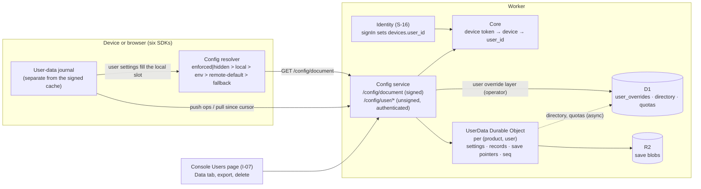

> Research note for [Godot on Polaris Key](../README.md), 2026-10-04. Spike S-17, commissioned
> by the lead on the owner's request of 2026-10-04: plan a system for user settings and store
> sync, built on S-16's users and integrated into the SDKs, as an extension of the managed config
> layer and flexible per app or game. It also carries the S-16 owner decision of the same day that
> **removes the licence-level config override layer in favour of user-level managed config** and
> asks S-17 for its migration path (§5.12). Research and design only: no product code changed,
> nothing was deployed, no account or credential was used, and no live call was made. File
> references are to the tree at `ece22812` (`W/` = `packages/worker/src/`,
> `M/` = `packages/worker/migrations/`). Prior-art facts were read from primary documentation
> during the research pass; figures marked [U] were not confirmed against a current primary page.

# S-17: user data sync (user settings, collections and saves), defined

Evidence tags, as in the other notes:

- **[V]**: verified by reading this repo's code, config or docs, or a primary external source;
- **[M]**: measured here (none in this spike: it is design-only);
- **[I]**: inference or recommendation;
- **[U]**: unverified: needs an account, a current primary page or a staging deploy.

## 1. Summary and recommendation

**Question.** With S-16's product-scoped users approved, what system lets apps and games store a
user's settings, and whatever else the developer needs, and have it follow the user across devices
and storefronts? The owner framed it as an extension of Config and asked for flexibility per app
or game.

**What exists today.** Every Config value is operator-authored, server-merged, signed with the
product key and delivered per device. A device can write nothing in Config [V]
(`W/services/config/routes.ts:25-50`). The client already has a precedence slot for "the user's
choice". It is the `local` layer in `enforced | hidden > local > env > remote-default > fallback`
(`packages/client-core/src/config.ts:1-12`), documented as "User/local overrides" (`:41-52`) [V].
Nothing fills that slot durably:

- in Node, Python, Swift, Kotlin and React it is a fixed table supplied at construction, with no
  setter and no persistence [V];
- React's `ConfigPanel` says outright that the host owns persistence
  (`packages/sdk-react/src/components/ConfigPanel.tsx:52-55`) [V];
- only Godot has a writable, pluggable `PKeyOverrideStore`, and it is local only
  (`sdks/godot/addons/polaris_key/services/config/override_store.gd`) [V].

The other missing piece is that **a device has no link to a user**. A device token resolves to
`{tokenHash, license|null, device}` (`W/core/devices.ts:136-142`) [V], and S-16 defers any device
to user column to I-18.

**Recommendation: Option C, "settings in Config, data beside it, one user authority" [I].**
User data is three tiers on one principal, all declared as data in `.pkey/schema` (rule 5):

1. **User settings.** These are catalog `config` keys that opt in with a `user` block. They are
   typed, schema-validated and defaulted by the catalog, and the operator can still enforce them.
   The user's value fills the existing `local` slot on the client. The precedence order and the
   `config-matrix.json` corpus are unchanged, and `enforced` and `hidden` still win.
2. **Collections.** Developer-declared namespaces of JSON records (progress, unlocks, loadouts,
   UI layout, mod data, wildcards such as `mod.*`). Each declares an access class, a conflict
   policy, an optional schema and limits.
3. **Saves.** Slot-based blobs in R2 with small listable metadata (playtime, progress, chapter,
   thumbnail), revisions, a format version and metadata-driven conflict policies.

**Operator side.** A **user override** layer, written by the operator per user, replaces the
licence override layer, as the owner decided. It is merged server-side into the signed config
document at the position the licence overrides hold today (§5.12). The document's _content_
changes; its _shape_ does not.

**Principal.** A new Core column, `devices.user_id`, records "the user signed in on this device".
Identity's `signIn` sets it when it returns the activation response, and `signOut` clears it. It
is not a seat claim and never enters a signed document, so S-16 decision 9 stands. Licence-key
activations never set it, which keeps S-16's rule that a licence-key principal never reaches the
owner's profile. The browser principal is S-16's `identity_sessions`.

**Storage.** One SQLite-backed Durable Object per `(product, user)` serialises that user's writes
and owns the change sequence. R2 holds save bytes. D1 holds the user override layer (Core reads it
when it builds documents), a directory row per user for the console, and quota summaries.

**Sync.** A Replicache-shaped push and pull over the new device routes under `/<p>/config/user/`,
with these parts:

- a per-client `mutationId` for idempotency;
- a per-user `seq` cursor;
- tombstones and a `cursor_expired` reset;
- per-key last-writer-wins by a clamped hybrid logical clock (HLC) for settings;
- revision compare-and-swap with a developer merge hook for records;
- metadata policies or a prompt for saves.

Pull is the baseline. A hibernating WebSocket "poke" comes later.

**Wire.** This is **plan mode**: new device-facing routes, new error codes, transcripts and all
six SDKs. There is **no `PROTOCOL_VERSION` bump** and **no signed-corpus change**, because user
data is not a signed document and the client resolution order does not change. It is the same
class of change as S-16 phase 1 (S-16 §5.3).

**Effort.** About **81 agent-days** for phases U0 to U3 in §6, plus about 14 for optional later packages. The **minimum viable cut** (settings plus
the user override layer, which also delivers the owner's licence-override removal) is about **45
agent-days**. It sits on S-16's I-06 and I-11.



## 2. What user data is for: the jobs

| #   | Job                                                                                                                           | Example                                             | Scope                                                          |
| --- | ----------------------------------------------------------------------------------------------------------------------------- | --------------------------------------------------- | -------------------------------------------------------------- |
| U1  | **Settings sync.** A user's choices follow them across devices, with operator enforcement still winning                       | Volume, language, keybinds, accessibility           | **Now** (MVP)                                                  |
| U2  | **Per-platform and per-device settings.** Some values roam within one platform family; some must never roam                   | Graphics quality on PC vs Switch; window geometry   | **Now** (MVP, through `sync` scopes)                           |
| U3  | **Operator per-user config.** Support pins a value or grants a key for one person, replacing licence overrides                | "Give this tester the beta endpoint"                | **Now** (MVP; owner decision)                                  |
| U4  | **Developer KV and document stores.** Arbitrary JSON the app needs, declared per product                                      | Progress, unlocks, loadouts, notes, mod data        | **Now** (phase 2)                                              |
| U5  | **Save slots and blobs.** Opaque game saves with metadata, revisions and conflict UI                                          | Five save slots, 32 MiB each                        | **Now** (phase 3)                                              |
| U6  | **Cross-device and cross-storefront continuity.** One user on Steam, iOS and the web sees the same data                       | Buy on Steam, continue on iPad                      | **Now**; falls out of product-scoped users (S-16)              |
| U7  | **Anonymous first, signed in later.** Data written before sign-in merges into the user, with a prompt only on a real conflict | Play offline, create an account at level 10         | **Now** (phase 2)                                              |
| U8  | **Support inspection.** Support sees, edits, resets and restores a user's data, audited                                       | "Why is my volume stuck?"; restore yesterday's save | **Now** (console Data tab)                                     |
| U9  | **Privacy.** Export and delete as part of S-16's user export and deletion                                                     | GDPR Art. 15, 17, 20                                | **Now** (required before general availability)                 |
| U10 | **Server-authoritative data.** Values the player must not edit, written by the developer's backend or the console             | Currency, entitlements mirrors, competitive stats   | **Later** (needs a backend credential; console writes now)     |
| U11 | **Live cross-device updates.** A change on one device appears on another within seconds                                       | Companion app                                       | **Later** (WebSocket poke)                                     |
| U12 | **Public data.** Other users of the same product read it                                                                      | Profile cards, ghost runs                           | **Later**                                                      |
| U13 | **Cross-product (organisation) scope.** A user's data shared by several products of one developer                             | A franchise profile                                 | **Later**, opt-in; conflicts with S-16 decision 2 as it stands |
| U14 | **Client-side end-to-end encryption.** Polaris cannot read the data                                                           | Private journals                                    | **Later**, as an opaque value type                             |
| —   | Query language, secondary indexes, leaderboards, matchmaking, a general app database, CRDTs in every SDK                      | Firestore-style queries; Yjs documents              | **Never** in this service (store CRDT bytes as opaque values)  |

The Godot program needs U1, U5 and U7 most. Desktop and mobile apps need U1, U3, U4 and U8 [I].

## 3. Current state and the extension points

### 3.1 Config today

- **The catalog** (`packages/shared-catalog/src/types.ts:35-61`) declares typed `config`, `secret`
  and `flag` keys, with these fields [V]:
  - `schema` (a Draft-07 subset fragment);
  - `default` and `managementDefault`;
  - `delivery` for secrets;
  - `ui` hints, `accessor`, `deprecated` and `since`.
- **`managementDefault: default` already means "the user may override".** The type comment reads
  "`default` (overridable by user/env)" (`types.ts:11-14`) [V]. A synced user setting is the
  persistent, cross-device form of an override the SDK already allows.
- **`ui.scopes` exists but nothing enforces it.** `UiHints.scopes?: ("profile"|"license"|"device")[]`
  (`types.ts:22-23`) [V] has no consumer in the worker or the console schema code (research grep).
- **`Catalog.validateKeyValue` rejects unknown keys** and interprets the schema without generating
  code (`packages/shared-catalog/src/catalog.ts:133-143`, `:4-16`) [V]. It is the validator a user
  write path reuses.
- **Server merge** (`W/core/payload.ts:117-147`) [V] runs these layers in order:
  1. catalog defaults;
  2. the tier's profile;
  3. the licence's profiles;
  4. store grants;
  5. licence overrides (`:142`);
  6. device overrides (`:145`).

  **The merge rule** (`W/merge.ts:25-55`) [V]: when a lower layer is `enforced` or `hidden` and a
  higher layer offers `state: "default"`, the lower entry stays. So a user layer of `default`
  entries can never break operator enforcement.

- **Device overrides are dormant.** They are read at `payload.ts:145`, but no route writes them.
  Registration only carries the existing value forward (`W/core/devices.ts:412, 540`) [V].
- **Licence overrides carry three buckets.** These are `config`, `secrets` and `entitlements`,
  seeded empty at enrol and issue (`W/services/license/enroll.ts:101-105`,
  `W/services/license/admin/licenses.ts:166-170`) and edited through `PUT /licenses/<id>/overrides`
  (`licenses.ts:426-462`) [V]. Secrets are sealed before storage
  (`W/admin/lib/overrides.ts:14-80`) [V].
- **The signed config document** is `pkey-config+jws`, device-token authenticated with no licence
  gate (D-08) and strongly ETagged (`W/services/config/document.ts:58-137`) [V]. It is capped at
  `MAX_DOC_BYTES = 65536` (`packages/shared-jws/src/index.ts:114`) [V]. The cap alone rules out
  carrying arbitrary user data in it.
- **The offline cache holds signed artefacts only.** Unsigned state in it was the R2-01/R4-01
  vulnerability class (`packages/client-core/src/store.ts:1-25`) [V]. User data needs its own
  journal, and that journal must never feed a gate.
- **The only device-authored store is telemetry.** `POST /<p>/devices/report` has a 16 KiB cap, a
  bounded allowlist and overwrite semantics (`W/core/devices.ts:1098-1150`) [V]. Its auth, size cap
  and licence-scoping pattern is worth copying; it is not a settings store.
- **Edge mint** for third-party tokens remains the route for games that want PlayFab or Firebase
  saves (`W/services/config/mint.ts`; omniplatform README `:1294-1296`) [V]. A first-party store
  complements it and does not replace it.

### 3.2 Each SDK's config surface

All six SDKs are read-only, with a local table that the host supplies:

| SDK    | Read API                                                                                                          | Local layer today                                                                                                                                                                      |
| ------ | ----------------------------------------------------------------------------------------------------------------- | -------------------------------------------------------------------------------------------------------------------------------------------------------------------------------------- |
| Node   | `getConfig`, `getConfigSource`, `listUserConfig` (`packages/sdk-node/src/config/client.ts:80-148`)                | `localOverrides` fixed at construction (`:38-65`) [V]                                                                                                                                  |
| React  | `getConfig`, `listUserConfig`, `getConfigSource` (`packages/sdk-react/src/core/types.ts:292-299`)                 | `PolarisState.localOverrides`, frozen per snapshot (`:218-223`); `ConfigPanel` leaves persistence to the host [V]                                                                      |
| Python | `get_config`, `list_user_config` (`sdks/python/src/polaris_key/config/client.py:67-145`)                          | `local_overrides` constructor argument (`:38, 50`) [V]                                                                                                                                 |
| Swift  | `config(_:default:)`, `listUserConfig` (`sdks/swift/Sources/PolarisKeyConfig/ConfigClient.swift:111-201`)         | `localOverrides`, a `let` (`:52-65, 76`) [V]                                                                                                                                           |
| Kotlin | `config`, `listUserConfig` (`sdks/kotlin/config/.../ConfigClient.kt:75-142`)                                      | `options.localOverrides` (`:34, 50`) [V]                                                                                                                                               |
| Godot  | `get_value`, `bind_property`, `config_changed` (`sdks/godot/addons/polaris_key/services/config.gd:3-33, 105-152`) | Pluggable `PKeyOverrideStore` with `set_override` and a `changed` signal; `PKeyConfigFileStore` over `user://settings.cfg` (`override_store.gd:1-47`, `config_file_store.gd:1-35`) [V] |

Godot's documented rule is the one to adopt everywhere: "the store is never written by a sync: an
enforced or hidden key IGNORES the saved value, it does not delete it, so the player's choice comes
back if the operator relaxes the state" (`override_store.gd:15-16`) [V].

### 3.3 Identity (S-16) as it touches user data

- **Users** are product-scoped (`identity_users (product, id)`), with many links. The portal account
  is the only cross-product record (S-16 §5.1, `:389-404`) [V].
- **"Anonymous first, sign in later"** is "attach this device's licence to the signed-in user" with
  a confirm step (S-16 §5.1) [V].
- **A licence-key sign-in** is low-assurance (`amr: ["pkey_license"]`) and "never reaches the
  owner's other licences, links or profile" (S-16 §5.1) [V]. User data must respect that.
- **Identity without License:** an Identity-only product gets users and device tokens under
  `requires-identity` (S-16 §5.1, decision 4) [V]. Such devices carry `license_id = ""`
  (`NO_LICENSE_ID`, `W/core/devices.ts:170-189`) [V], so any licence-based route to the user fails
  for them.
- **The device keeps the licence document as its only gate.** `PROTOCOL_VERSION` stays 4.
  `DocProfile` has no subject until I-18 (S-16 §5.3, decision 9) [V].
- **Privacy:** per-user export (I-07), and a deletion cascade with tombstones re-applied after a D1
  restore (S-16 §5.5) [V]. User data joins both.
- **Not covered by S-16:** settings. Its only nearby mention is J8 "cloud saves" through the phase 3
  issuer (S-16 `:140`) [V].

### 3.4 Extension points

| Extension point                                                                              | Reuse                                                                    |
| -------------------------------------------------------------------------------------------- | ------------------------------------------------------------------------ |
| Client `local` slot and `ConfigSource`                                                       | User settings fill it; `getConfigSource` keeps answering `local`         |
| Godot `PKeyOverrideStore`                                                                    | `PKeyUserSettingsStore extends PKeyOverrideStore`                        |
| `Catalog.validateKeyValue` and representability                                              | Server-side validation of every settings write and schema-bearing record |
| `applyOverrides` batch semantics and sealing                                                 | The operator user override layer, unchanged                              |
| `mergePayloads` and the enforced-wins rule                                                   | The user override layer slots in where licence overrides sit             |
| `ManagedPayloadEditor.tsx`                                                                   | The console editor for user overrides                                    |
| `RateLimitDO`, `UpdateHealthDO`, R2 `BLOBS` (`packages/worker/wrangler.toml:31-40, 143-157`) | Precedent for a new Durable Object class and the R2 binding [V]          |
| `devices/report` caps and `coreDeviceAllowed`                                                | Request-size caps and licence scoping on writes                          |
| `tools/gen-mirrors.ts`                                                                       | Typed setting keys and collection types per language                     |
| `packages/cli/src/saveCompat.ts` (`provides`, `contentApi`)                                  | Save metadata records the content API a save needs                       |

## 4. Options

### Option A: a user layer inside the signed config document

The server merges user values as `state: "default"` entries above device overrides and signs them
into `pkey-config+jws`. User writes go through a small `PATCH /config/user` route.

- **Pros.** No document shape change and no new cache slice. Enforcement is automatic through
  `merge.ts`. One read path.
- **Cons.**
  - Every slider change re-signs the document and churns its ETag.
  - The value reads as `remote-default` and therefore _loses_ to a stale `local` override on the
    device.
  - `updatedAt` stops meaning "last admin change".
  - User-authored data is signed by the product key as if the operator had written it.
  - The 64 KiB cap rules out collections and saves.
  - Sync latency is tied to the document refresh (half-life 30 minutes).
  - There is no conflict model.
- **Verdict.** Right only for the **operator** user layer (§5.12), wrong for user-authored data.

### Option B: a separate user-data service, catalog-declared

A new service slug (for example `userdata`) owns settings, collections and saves behind its own
routes. Its schemas are declared in `.pkey/schema`. Settings are merged client-side.

- **Pros.**
  - Clean boundaries.
  - Independent enablement.
  - Sync mechanics fit the data, with no document coupling.
- **Cons.**
  - Settings are config: they share keys, schemas, defaults and enforcement with the catalog. A
    second service has to import Config's catalog or duplicate it.
  - The tools/services.json checklist, boundaries test, discovery fragment and console section all
    double.
  - It cuts against the owner's "extension of the managed config layer".

### Option C: hybrid, inside Config (recommended)

Settings are a user-scoped Config layer, merged client-side into the `local` slot. Collections and
saves are sub-surfaces of the same Config service. Both sit on one per-user Durable Object.
The operator user override layer is merged server-side into the signed document.

- **Pros.**
  - One catalog, one validator and one enforcement rule.
  - The client precedence and the corpus are unchanged.
  - Each tier gets the conflict model it needs.
  - Config stays one enablement switch.
- **Cons.**
  - Config grows from read-only to read-write.
  - The Config service now depends on a user principal, which Core must supply so Config never
    imports Identity (rule 6).
  - User data needs Identity enabled to be useful across devices.

### Option D: a sync engine or CRDT documents (rejected as the default)

This means Zero or Replicache-style named mutators, or Automerge or Yjs documents. It is too heavy
to implement six times, and GDScript has no CRDT library [V: research landscape §1.15]. It is kept
as an opaque value type (`bytes` records or saves) that the developer merges client-side.

### Option E: bridge native platform saves only (rejected as the default)

This means relying on Steam Auto-Cloud, iCloud, Play Saved Games or XGameSave per storefront. It
gives no cross-storefront continuity, a platform can withdraw it (Windows Roaming was discontinued
as of Windows 11 [V: research landscape §1.16]), and there is no single support view. Coexistence
guidance goes into the docs (§9).

### Conflict and offline models considered

| Model                                         | Settings              | Records      | Saves          | Cost                                            |
| --------------------------------------------- | --------------------- | ------------ | -------------- | ----------------------------------------------- |
| Arrival-order last-writer-wins                | No                    | No           | No             | An offline week overwrites newer edits          |
| **Per-key LWW by clamped HLC edit time**      | **Yes**               | Opt-in       | No             | 64-bit clock per value; server clamps skew      |
| **Revision compare-and-swap + merge hook**    | No                    | **Default**  | Yes (`manual`) | Every SDK surfaces a callback; keep a base copy |
| **Metadata policy** (playtime, progress)      | No                    | No           | **Default**    | Typed metadata on the slot                      |
| Server-applied commutative ops (`inc`, `add`) | `max`, `min`, `union` | Opt-in       | No             | Server applies; idempotent by op id             |
| Vector clocks                                 | No                    | No           | No             | Not needed with one server authority per user   |
| Full CRDT state                               | No                    | Opaque value | Opaque value   | Not in GDScript                                 |

All models are offline-first: the SDK writes to a local journal, reads its own writes at once, and
flushes later (§5.4).

### Comparison

| Criterion                                     | A: signed layer       | B: separate service | **C: hybrid in Config** | D: sync engine | E: native only |
| --------------------------------------------- | --------------------- | ------------------- | ----------------------- | -------------- | -------------- |
| Settings feel like config                     | Yes                   | Partly              | **Yes**                 | No             | No             |
| Arbitrary developer data                      | No (64 KiB)           | Yes                 | **Yes**                 | Yes            | Saves only     |
| Saves and blobs                               | No                    | Yes                 | **Yes**                 | Partly         | Yes            |
| Conflict model fits each tier                 | No                    | Yes                 | **Yes**                 | Yes            | Platform's     |
| Client precedence and corpus unchanged        | No (`remote-default`) | Yes                 | **Yes**                 | No             | n/a            |
| `PROTOCOL_VERSION` bump                       | No                    | No                  | **No**                  | No             | n/a            |
| Implementable in all six SDKs, incl. GDScript | Yes                   | Yes                 | **Yes**                 | No             | Per platform   |
| Rule 6 boundaries                             | Core                  | New service         | **Core resolver**       | n/a            | n/a            |
| Cross-storefront continuity                   | Yes                   | Yes                 | **Yes**                 | Yes            | No             |
| Effort (agent-days, full)                     | ~20                   | ~95                 | **~81**                 | 150+           | ~30            |

## 5. The recommended design, defined

### 5.1 Concepts (glossary, rule 4)

New nouns for `packages/docs/src/content/docs/start/concepts.md` [I]:

- **user setting**: a catalog `config` key that declares a `user` block. Its user-chosen value is
  persisted and synced, and the operator can still enforce it.
- **user override**: an operator-authored managed-payload layer for one user. It replaces the
  licence override.
- **collection**: a developer-declared namespace of **records** (JSON values keyed by id) owned by a
  user.
- **save**: a named slot holding an opaque blob plus metadata and revisions.
- **user data**: the umbrella for user settings, collections and saves.
- **owner**: the principal user data belongs to. It is always a user; device-scoped values are
  keyed by `(user, device)`.

The words `sync` and `store` are avoided in API names, because `PolarisKey.sync()`, `sync_finished`,
`get_sync_state`, credential stores and `PKeyOverrideStore` already use them
(`sdks/godot/addons/polaris_key/polaris_key.gd:34-44, 185, 220`) [V]. The one exception is the
catalog's `sync:` scope field, which is a manifest attribute and not an API. The SDK surface is
`config.setConfig` for settings and `userData` for collections and saves.

### 5.2 Data model

**Principal.**

| Column or table                   | Holds                                                                                                                                                                                                                                                                   |
| --------------------------------- | ----------------------------------------------------------------------------------------------------------------------------------------------------------------------------------------------------------------------------------------------------------------------- |
| `devices.user_id` (new, nullable) | The user signed in on this device. Set by Core's activation path when Identity's `signIn` calls it; cleared by sign-out, user deletion, "sign out everywhere" and licence detach. Never set by licence-key activation. Never signed. I-18 may reuse it for seat holders |

The device token stays the credential. Core's `validateDeviceToken` already returns the device
row, so the resolver is just `device.user_id`. Config reads it through a Core function, never
through Identity (rule 6).

**Operator layer (D1, read by Core during document builds).**

| Table            | Key                  | Holds                                                                                                                           |
| ---------------- | -------------------- | ------------------------------------------------------------------------------------------------------------------------------- |
| `user_overrides` | `(product, user_id)` | `payload_json` (`config`, `secrets` sealed under `PLATFORM_KEK`, and `entitlements` per decision 3), `updated_at`, `updated_by` |

**User-authored data (one Durable Object per `(product, user)`, SQLite).**

| Table        | Columns                                                                                                                                                                                                                          |
| ------------ | -------------------------------------------------------------------------------------------------------------------------------------------------------------------------------------------------------------------------------- |
| `meta`       | `seq` (monotonic change counter), `schema_version`, `bytes_used`, `created_at`                                                                                                                                                   |
| `settings`   | `key`, `scope_key` (`""` for `user`, a platform family for `platform`, a device id for `device`), `value_json`, `version` (= `seq` of last write), `edited_hlc`, `client_id`, `updated_by` (`device:<id>`, `console`, `backend`) |
| `records`    | `collection`, `id`, `value_json`, `version`, `edited_hlc`, `client_id`, `updated_by`, `deleted`                                                                                                                                  |
| `saves`      | `slot`, `object_key` (R2), `sha256`, `size`, `format_version`, `metadata_json` (≤ 4 KiB), `thumbnail_key`, `version`, `updated_by`                                                                                               |
| `revisions`  | `target` (`save:<slot>` or `record:<collection>/<id>`), `version`, pointer or value, `created_at`                                                                                                                                |
| `clients`    | `client_id`, `last_mutation_id`, `device_id`, `last_seen`                                                                                                                                                                        |
| `tombstones` | `target`, `seq`, `deleted_at` (no personal data)                                                                                                                                                                                 |

**D1 directory and quotas.** `userdata_directory (product, user_id, bytes, records, saves,
updated_at)` is updated asynchronously from the DO, through `waitUntil` or the existing Queue. It
backs the console list, the export job and per-product quota totals.

**R2 layout.** `u/<product>/<user_id>/<sha256>` holds content-addressed, immutable objects, so
concurrent uploads are safe and duplicates collapse. Unreferenced objects are collected by a DO
alarm.

**Why a Durable Object per user and not D1 rows [I].** One DO serialises a user's writes, so `seq`
and compare-and-swap need no cross-request locking. It is also the natural WebSocket hub for live
updates later. D1 executes on one primary per database, so a hot product's sync traffic would
queue every product's admin and document queries. The research figures are: D1 about 1,000 queries
per second at 1 ms per query; a DO 10 GB, 2 MB per row or value and about 1,000 requests per
second per object, with 30-day point-in-time recovery (developers.cloudflare.com D1 and DO limits
pages, read by the research pass) [V]. The cost is lazy per-object schema migrations and no
cross-user SQL. The D1 directory covers the console's needs.

### 5.3 Catalog and manifest extension

**Settings: a `user` block on a `config` entry.** There is no new `ConfigKind`, so `enums.json` and
the generated constants do not change.

```yaml
# .pkey/schema
schemaVersion: 5
entries:
  - key: audio.music.volume
    kind: config
    schema: { type: number, minimum: 0, maximum: 1 }
    default: 0.8
    managementDefault: default
    user:
      sync: user # user | platform | device | local
      conflict: lastWrite # lastWrite | max | min | union | merge
      listed: true # shown in listUserConfig and ConfigPanel (default true)
  - key: graphics.quality
    kind: config
    schema: { type: string, enum: [low, medium, high, ultra] }
    default: medium
    user: { sync: platform } # roams within desktop | mobile | console | web
  - key: input.bindings
    kind: config
    schema: { type: object, additionalProperties: { type: string } }
    default: {}
    user: { sync: user, conflict: merge } # per member, not whole object
  - key: ui.window.geometry
    kind: config
    schema: { type: object }
    user: { sync: device, listed: false } # server-backed per device, never roams
```

The `sync` scopes [I]:

- `user` roams everywhere.
- `platform` roams within a platform family. The SDK reports the family from its existing platform
  detection.
- `device` is stored under `(user, device)`. It survives reinstalls and is visible to support.
- `local` never leaves the device. It is today's local override, now persisted.

Per VS Code's `machine` scope, a `device`-scoped value is never synced elsewhere [V: research
landscape §1.17].

**Collections and saves: a `userData` block.**

```yaml
userData:
  collections:
    - name: progress
      access: owner # owner | ownerRead | server | public (later)
      conflict: revision # revision (CAS + hook) | lastWrite | merge | union
      schema:
        { type: object, properties: { level: { type: integer, minimum: 1 } } }
      limits: { maxRecords: 1, maxRecordBytes: 65536 }
      onAttach: prompt # anonymous → signed-in: keepCloud | keepLocal | merge | prompt
    - name: unlocks
      access: ownerRead # client reads; console or developer backend writes
      conflict: union
    - name: support_notes
      access: server # never delivered to devices
    - name: "mod.*" # any collection matching the pattern, same policy
      access: owner
      limits: { maxRecords: 500, maxRecordBytes: 16384 }
  open: false # true: undeclared collection names allowed at default limits
  saves:
    slots: { max: 5, byTier: { supporter: 20 } } # tier ids checked against .pkey/product
    maxBytes: 33554432 # per slot, compressed
    keepRevisions: 5
    conflict: prompt # prompt | mostRecent | longestPlaytime | highestProgress
    requiresFlag: cloud_saves # optional: only users whose effective flags grant it
    metadata:
      schema:
        type: object
        properties:
          chapter: { type: integer }
          playtimeSeconds: { type: integer }
          progress: { type: number }
      playtimeField: playtimeSeconds
      progressField: progress
    thumbnail: { maxBytes: 131072 }
    format: { refuseNewer: true }
  limits: { totalBytes: 268435456, byTier: {} }
  writes: { requireLicense: false, minTrust: null } # licence and device-trust gates (§5.8)
  migrations:
    - toSchemaVersion: 5
      rename: { "gfx.q": "graphics.quality" }
      drop: [legacy.tutorialSeen]
```

The access classes follow Unity Cloud Save, PlayFab and Nakama, but under names that do not reuse
`enforced` and `hidden` [V: research landscape §1.7, §1.9, §1.10]. The save policy names follow
Google Play Games Saved Games [V: research landscape §1.5].

**Validator rules** (rule 9: each needs a rule and a mutation-table entry) [I]:

1. `user` is allowed only on `kind: config`.
2. `user` is not allowed on a key whose `managementDefault` is `enforced` or `hidden`.
3. `max` and `min` apply only to numbers, `union` only to arrays with `uniqueItems`, and `merge`
   only to objects.
4. Collection names are unique, and patterns do not overlap.
5. `byTier` and `requiresFlag` must name declared tiers and flags.
6. `access: server` and `public` cannot set `onAttach: keepLocal`.
7. Limits must not exceed the platform ceilings (§5.7).

The manifest JSON schema (`packages/shared-manifest/schemas/v1/schema.schema.json`) gains the
blocks, and `gen-mirrors` and `gen-docs` follow. The unused `ui.scopes` gains `user`. Recommend
that it stays a hint and that `user.sync` is the enforced field (decision 9).

### 5.4 Sync protocol

All routes sit under the Config service. They need Config and Identity enabled for the product, and
a principal that resolves to a user.

| Route                                                            | Purpose                                                                                                          |
| ---------------------------------------------------------------- | ---------------------------------------------------------------------------------------------------------------- |
| `GET /<p>/config/user?cursor=<seq>&parts=settings,progress`      | Pull changes since a cursor; `If-None-Match` on the cursor gives a cheap `304`                                   |
| `POST /<p>/config/user/ops`                                      | Push a batch of mutations; the response doubles as a pull                                                        |
| `GET /<p>/config/user/saves`                                     | List slots (metadata only)                                                                                       |
| `POST /<p>/config/user/saves/<slot>/begin`                       | Reserve an upload: `{sha256, size, formatVersion, baseVersion, metadata}`; checks quota and version              |
| `PUT /<p>/config/user/saves/<slot>/upload/<uploadId>`            | Stream the body through the Worker into R2 with the binding's `sha256` check; multipart parts above the body cap |
| `POST /<p>/config/user/saves/<slot>/finalize`                    | Idempotent; flips the slot pointer atomically in the DO; returns the new version                                 |
| `GET /<p>/config/user/saves/<slot>[?version=]`                   | Stream the blob (or a revision)                                                                                  |
| `GET /<p>/config/user/saves/<slot>/revisions`, `DELETE …/<slot>` | Revisions and delete                                                                                             |
| `GET /<p>/config/user/live` (later)                              | WebSocket upgrade for pokes                                                                                      |

**Push body.**

```json
{
  "clientId": "c_7f…",
  "mutations": [
    {
      "mutationId": 41,
      "target": { "setting": "audio.music.volume", "scope": "user" },
      "op": "set",
      "value": 0.6,
      "editedHlc": "0190f3a2c1b4:0003"
    },
    {
      "mutationId": 42,
      "target": { "record": ["progress", "main"] },
      "op": "set",
      "value": { "level": 4 },
      "baseVersion": 117
    }
  ],
  "atomic": false
}
```

The mechanics [I]:

- **Idempotency and order.** The DO applies mutations in `mutationId` order. It skips any mutation
  at or below `clients.last_mutation_id[clientId]`, so retries are safe and each client's writes
  apply in order. This follows Replicache's push model [V: doc.replicache.dev "how it works"].
- **Per-mutation results.** Each result is one of:
  - `ok` with the new `version`;
  - `conflict` with the server copy and version;
  - `rejected` with a code: `value_invalid`, `setting_unknown`, `access_denied`, `quota_exceeded`
    or `store_requires_flag`.
- **Versions.**
  - `baseVersion` omitted means an unconditional write.
  - `baseVersion: "*"` means create-only.
  - A number means compare-and-swap.

  These are Nakama's three modes [V: research landscape §1.10].

- **Pull response.** It carries `{cursor, changes[], tombstones[], lastMutationId, more}`. A cursor
  older than the tombstone horizon (default 90 days) gets `410 cursor_expired`, and the client
  takes a full snapshot.
- **Batches.** A batch holds at most 100 mutations or 256 KiB. `atomic: true` makes it all or
  nothing.
- **Pull triggers.** Pull on start, on foreground, after a push, piggybacked on the existing
  document refresh, and on a backoff timer.
- **Live updates (phase 4).** A hibernating WebSocket to the user's DO carries **pokes only** ("the
  cursor is now N"), so there is one data path. Hibernated sockets are not billed for duration, and
  they drop on deploy, so clients reconnect and pull [V: research mechanics §6, DO WebSocket
  docs]. Godot has `WebSocketPeer` natively.

**Client journal.** Each SDK keeps an append-only operation log, separate from the signed cache.
Locations:

| SDK            | Journal location                                  |
| -------------- | ------------------------------------------------- |
| Node, Python   | Beside the cache file                             |
| Swift          | Application Support                               |
| Kotlin         | The app's files directory (DataStore on Android)  |
| React, browser | IndexedDB, with `BroadcastChannel` for other tabs |
| React, desktop | The main process (bridge v4)                      |
| Godot          | `user://pkey/<product>/userdata/<user>.json`      |

Journal behaviour:

- Reads are optimistic: the server snapshot plus pending operations.
- Writes are debounced per key (2 s by default), so dragging a slider is one mutation.
- The journal flushes on:
  - reconnect;
  - background or quit (Godot `NOTIFICATION_WM_CLOSE_REQUEST` and `NOTIFICATION_APPLICATION_PAUSED`,
    Android `ProcessLifecycleOwner` with a WorkManager retry, Swift `scenePhase`, browser
    `pagehide` with `fetch keepalive`, Node `beforeExit`, Python `atexit`);
  - an explicit `flush()`.
- The journal and the cache are partitioned by user id. Nothing written as user A is ever flushed
  under user B.

### 5.5 Conflict strategies and developer merge hooks

| Tier          | Default                                       | Alternatives                                              | How the developer intervenes                                                                                                                                                          |
| ------------- | --------------------------------------------- | --------------------------------------------------------- | ------------------------------------------------------------------------------------------------------------------------------------------------------------------------------------- |
| User settings | `lastWrite` by clamped HLC edit time, per key | `max`, `min`, `union`, `merge` (per object member)        | None needed; `onChange` with `origin: "remote"`                                                                                                                                       |
| Records       | `revision` (compare-and-swap)                 | `lastWrite`, `merge`, `union`; ops `inc`, `add`, `remove` | `update(id, fn)` retries `fn` on a fresh copy; or `onConflict(local, remote, base) → resolved`; default without a hook: **keep the server copy and keep the local one as a revision** |
| Saves         | `prompt`                                      | `mostRecent`, `longestPlaytime`, `highestProgress`        | `onConflict` gets both candidates with metadata, device name and thumbnail and calls `keep()` with local, remote or both; `both` puts one copy in a free slot or as a revision        |

**HLC rules** [I]. The HLC is 48-bit milliseconds plus a 16-bit counter, with `clientId` as the
final tie-break (Kulkarni et al., OPODIS 2014 [V: research mechanics §3]). The server folds its own
clock into every response. It clamps `editedHlc > serverNow + 5 min` to `serverNow`, so a device
clock set to 2099 cannot win forever. This uses edit time, not arrival time, so a week-old offline
edit does not overwrite a newer one. That is the Steam "empty fresh install looks newer" failure
[V: research landscape §1.1].

**Per-unit resolution.** Each slot or record conflicts and resolves on its own. A non-conflicting
change elsewhere is never discarded. This improves on PlayFab Game Saves' all-or-nothing choice
[V: research landscape §1.7]. Losing branches are kept as revisions.

**Anonymous to signed-in (U7).** Before sign-in, an Identity-enabled product's SDK keeps data in a
user-less local partition (`owner: "local"`). At the first sign-in on that device:

| Situation            | Settings                                                                                                                                                      | Collections               | Saves                                                                        |
| -------------------- | ------------------------------------------------------------------------------------------------------------------------------------------------------------- | ------------------------- | ---------------------------------------------------------------------------- |
| Cloud side empty     | Uploaded                                                                                                                                                      | Uploaded                  | Uploaded                                                                     |
| Both sides have data | Per-key policy (newer edit wins)                                                                                                                              | Per-collection `onAttach` | **Never overwritten.** Local slots fill free slots; with none free, `prompt` |
| Any `prompt`         | The SDK raises one `MergeRequest` listing the conflicts; the UI kits ship a themable prompt ("Keep this device's progress / Keep cloud progress / Keep both") |                           |                                                                              |

The pull response carries `empty: true` for a user with no data, so the common case needs no
prompt. This mirrors Google Play's guidance to warn when signing into an account that already has
cloud progress [V: research landscape §1.5].

**Writes to locked keys.** The SDK refuses `setConfig` on a key that is `enforced` or `hidden` in
its current document, with `setting_locked`, and journals nothing. The server **accepts and keeps**
a value whose key is enforced only for some devices. Enforcement varies per device (tier, licence,
device layer), and Godot's rule says the choice comes back when the operator relaxes. The server
refuses only keys with no `user` block (`setting_unknown`).

### 5.6 How settings resolve on the client

The resolution order is unchanged. The `local` slot's value becomes:

```
local(key) = hostLocalOverrides[key]        // the constructor table: developer intent wins
          ?? userSettings.effective(key)    // journal over server snapshot, by the key's sync scope
```

`getConfigSource` still answers `local`. A new accessor carries the sync state, so the
`ConfigSource` enum and `config-matrix.json` stay untouched:

```
settingState(key) = { scope, pending, updatedAt, updatedBy, invalid, locked }
```

`listUserConfig` keeps the §2.2.1 rule 4 semantics. A key with `user.listed: false` is not listed.

**Invalid stored values.** After a schema change, an invalid value is kept raw and marked `invalid`.
Resolution falls through to the next layer, so nothing crashes, and the console shows it.

**The `local` versus `env` question.** Today `local` beats `env`, so a synced user value overrides
a `PKEY_CONFIG_*` variable on a kiosk or in CI. The recommendation keeps the order and documents
that operators use `enforced` to lock a value. Decision 6 covers this.

### 5.7 Quotas and limits

These defaults are anchored on prior art: Apple KVS 1 MB, Unity 5 MiB per access class, and Xbox
and PlayFab saves 256 MB per user per title [V: research landscape §2]. A developer may tighten
them, tiers may raise them through `byTier`, and a platform ceiling sits above both [I]:

| Item              | Default                                                                | Platform ceiling         |
| ----------------- | ---------------------------------------------------------------------- | ------------------------ |
| User settings     | ≤ 256 keys; ≤ 8 KiB per value; ≤ 64 KiB per user                       | 256 KiB                  |
| Collections       | ≤ 32 declared; record ≤ 64 KiB; ≤ 10,000 records; ≤ 5 MiB per user     | 1 MiB per record; 64 MiB |
| Saves             | ≤ 16 slots; ≤ 32 MiB each, compressed; 5 revisions; ≤ 256 MiB per user | 1 GiB per user           |
| Push              | ≤ 100 mutations or 256 KiB; ≤ 60 per minute per device                 | —                        |
| Save transfers    | ≤ 30 per hour per user                                                 | —                        |
| Key and id length | ≤ 128 bytes, `[A-Za-z0-9._:-]`                                         | —                        |

Other limit rules:

- **Over quota, only the offending write is rejected** (`quota_exceeded`, with remaining bytes).
  Sync never stops wholesale, unlike Windows Roaming [V: research landscape §1.16].
- **Oversized data is never deleted automatically**, unlike EOS [V: research landscape §1.8].
- **Rate limits** reuse `RateLimitDO`, with per-product totals so one tenant cannot exhaust the
  shared Worker.
- The Worker request-body limit per Cloudflare plan sets where streaming switches to multipart
  [U: re-read the current Workers limits page in U-09].

### 5.8 Security

1. **The owner comes from the credential, never from the request.** The DO name is derived
   server-side as `idFromName("<product>:<user_id>")`, and no route accepts a user id from a
   device. Support and backends name users only through admin credentials.
2. **Principal binding.**
   - `devices.user_id` is set only by a real sign-in through Identity.
   - It is cleared on sign-out, on user disable or delete, by "sign out everywhere" and on licence
     detach. All of these go through one Core hook, shared with I-15 and F-21's revocation trigger.
   - A licence-key activation never binds a user (S-16's low-assurance rule).
   - A device without a bound user gets `401 user_required` with a hint to sign in.
3. **Licence and entitlement gating.**
   - Reads of one's own data are always allowed while the user principal is valid. Users have a
     right of access anyway.
   - Writes follow `userData.writes.requireLicense`. When License is enabled and this is true, a
     write needs a usable licence on the device, scoped the way `coreDeviceAllowed` scopes
     `/devices/report`.
   - `requiresFlag` gates a collection or the saves tier on an effective flag, for example "cloud
     saves for supporters".
4. **Device trust.** `writes.minTrust` can require `attested` (P6-02) for writes to selected stores,
   or only flag low-trust writers in the console.
5. **Client data is never a security input.** The journal is a separate store and never feeds a
   gate, entitlement or tier decision; the R2-01/R4-01 lesson (`client-core/src/store.ts:1-25`)
   [V]. Docs carry a "user data is client-writable" banner, in the style of Godot's "SECRETS ARE
   NOT SECRET IN A GAME" (`config.gd:21-25`) [V].
6. **Anti-tamper for saves.** The user is the adversary, and a key inside the client can be
   extracted. So:
   - anything of value goes in `ownerRead` or `server` collections, written only by the console or
     the developer's backend;
   - `owner` data gets schema checks, plus optional constraint keywords such as
     `x-pkey-monotonic: increasing` for progress fields;
   - the SDK records the sha256 of what it last synced, so a save edited outside the SDK surfaces
     as "modified offline";
   - server-signed receipts over `(product, user, target, version, sha256)` on a separate keyring
     are a later option (decision 13);
   - Godot docs warn never to pass save bytes to `bytes_to_var_with_objects`.
7. **Encryption.**
   - Cloudflare's platform encryption at rest is the baseline [U: cite in U-12].
   - **Per-user data keys.** A per-user key, wrapped under a product key derived from
     `PLATFORM_KEK`, encrypts R2 objects (R2 `ssecKey` takes 32-byte customer keys [V: research
     mechanics §11]) and large DO values. Destroying it crypto-shreds backups and point-in-time
     copies. Recommended for saves in v1.
   - **Client-side end-to-end encryption** is later. It is an opaque value type with developer- or
     user-held keys, set at creation only, and it rules out server validation, merging and
     support (decision 14).
8. **Hostile input.** Record and setting keys are restricted to the safe character set
   (`__proto__` and `constructor` are already ordinary keys in the resolver,
   `client-core/src/config.ts:9-10` [V]). JSON depth and size are capped before parsing, the
   content type of a blob is ignored, and blobs are only ever served as
   `application/octet-stream` with `Content-Disposition: attachment`.

### 5.9 Privacy

Polaris is the processor and the developer the controller, as in S-16 §5.5 [V].

- **Export (Art. 15 and 20).** S-16's per-user JSON export (I-07) and the portal
  `GET /api/me/export` (I-15) gain:
  - a `userData` section: settings, records and the user override layer;
  - a save manifest with short-lived download links, delivered as a zip from the console.
- **Delete (Art. 17).** S-16's user deletion cascade gains these steps:
  1. call the user's DO `deleteAll()`;
  2. delete the R2 prefix `u/<product>/<user>/`;
  3. remove the directory row and `user_overrides` row;
  4. destroy the per-user key.

  DO point-in-time recovery keeps up to 30 days of history, and the deadlines for deleting the
  underlying logs are undocumented (cloudflare-docs issue #33631 [V: research mechanics §11b]).
  That is why crypto-shredding is the robust answer. S-16's deleted-user tombstone list also covers
  DO and R2 restores.

- **Soft delete.** S-16's 14-day soft delete keeps user data intact and read-only until the hard
  delete.
- **Retention.** Tombstones and cursors hold no personal data. Pre-sign-in local data never leaves
  the device. Inactive-user purge follows S-16's policy (default 24 months flagged).
- **Residency.** DO `jurisdiction("eu")` and an EU R2 bucket can be fixed per product at creation,
  because existing objects do not move later [V: research mechanics §11b]. This is optional
  (decision 15).

### 5.10 Console surfaces

- **Users page, Data tab** (on S-16's I-07 page):
  - **settings:** key, effective value, source, scope, last writer, updated at, invalid flag; edit
    (catalog-validated, `origin: admin`), reset, history and restore;
  - **user override editor** (the existing `ManagedPayloadEditor`);
  - **"what the app sees":** pick one of the user's devices and render the resolved config;
  - **collections:** a JSON browser and editor with schema validation, revisions and restore;
    `server` collections are editable only here;
  - **saves:** metadata, size, thumbnail, revisions, download, restore and delete;
  - **quota meters**, plus export and delete-all-user-data.

  Every write is audited. Destructive actions and bulk restore need step-up, matching S-16's relink
  posture. An optional product setting notifies the user of support edits.

- **Catalog editor.** `CatalogEntryForm` gains a "User setting" section (scope, conflict, listed).
  The catalog usage report ("which profiles, tiers and licences set key K",
  `W/services/config/admin/catalog.ts:209`) gains user-override and user-value counts per key.
- **New Config page, "User data".** It edits `collections`, `saves`, `limits` and `migrations`, with
  the existing manifest round-trip and `services_source` rules.
- **Licence page.** The overrides editor becomes read-only after migration (§5.12), with a link to
  the owning user.

### 5.11 SDK API sketches

The naming is consistent across SDKs:

- **settings live on the existing config client**, as the owner's "extension of config";
- **collections and saves live on `userData`**;
- **status** is `userData.status()`, never `sync`.

Untyped string keys work everywhere, and generated typed keys come from `gen-mirrors`.

**Node** (`@polaris-key/node`):

```ts
const pk = new PolarisKeyClient<SettingValues>({ product: "diceroll" });
pk.config.getConfig("audio.music.volume", 0.8); // unchanged getter, now sees the synced value
await pk.config.setConfig("audio.music.volume", 0.6); // resolves after the local journal commit
await pk.config.clearConfig("audio.music.volume");
pk.config.settingState("audio.music.volume"); // { scope, pending, locked, invalid, … }
pk.config.onChange(({ keys, origin }) => {}); // origin: local | remote | merge | migration | admin

const progress = pk.userData.collection<Progress>("progress");
await progress.put("main", { level: 3 });
await progress.update("main", (v) => ({ ...v!, level: v!.level + 1 })); // CAS retry loop
await progress.patch("main", { $inc: { level: 1 } });
progress.onConflict(({ local, remote, base }) => merge(local, remote, base));

await pk.userData.saves.write("slot-1", bytes, {
  metadata: { chapter: 3 },
  formatVersion: 7,
});
const save = await pk.userData.saves.read("slot-1");
pk.userData.saves.onConflict((c) => c.keep("both"));
pk.userData.onMerge((m) => m.resolve({ default: "newest", saves: "both" }));
await pk.userData.flush();
pk.userData.status(); // { state: idle|pending|flushing|offline|blocked|error, pending }
```

**React** (`@polaris-key/react`). Hooks use `useSyncExternalStore`, as the existing hooks do.
`ConfigPanel` persists through `setConfig` by default when keys declare `user`.

```tsx
const [volume, setVolume, meta] = useSetting("audio.music.volume");
<Slider value={volume} onChange={setVolume} disabled={meta.locked} />;
const { value, update } = useRecord<Progress>("progress", "main");
const { slots, write, conflict } = useSaves();
const { state, pending } = useUserDataStatus();
<MergePrompt />; // themable, like the login components
```

**Python** (synchronous, as today's config API):

```python
pk.config.set_config("audio.music.volume", 0.6)
pk.config.setting_state("audio.music.volume")
progress = pk.user_data.collection("progress")
progress.update("main", lambda v: {**v, "level": v["level"] + 1})
pk.user_data.saves.write("slot-1", data, metadata={"chapter": 3}, format_version=7)
pk.user_data.flush()  # also registered with atexit; start_background_flush(interval=5.0) opt-in
```

**Swift** (actor API plus SwiftUI; iOS 17 and macOS 14 allow `@Observable`,
`sdks/swift/Package.swift:59-62` [V]):

```swift
@PolarisSetting(\.musicVolume) var volume        // shaped like @AppStorage
Slider(value: $volume, in: 0...1).disabled($volume.isLocked)
try await client.config.set(SettingKeys.musicVolume, 0.6)
let progress = client.userData.collection("progress", as: Progress.self)
try await progress.update(id: "main") { $0.level += 1 }
try await client.userData.saves.write(slot: "slot-1", data: data, metadata: meta)
try await PolarisSettings.importFromUserDefaults([.musicVolume: "musicVolume"])
```

**Kotlin** (flows, with an optional Compose artifact):

```kotlin
val volume: StateFlow<Double> = client.config.setting(Settings.MusicVolume)
client.config.set(Settings.MusicVolume, 0.6)
var vol by rememberSetting(Settings.MusicVolume)   // :compose
val progress = client.userData.collection("progress", Progress.serializer())
progress.update("main") { it!!.copy(level = it.level + 1) }
client.userData.saves.write("slot-1", bytes, SaveMetadata(chapter = 3))
client.userData.status: StateFlow<UserDataStatus>
```

**Godot** (the synced layer _is_ an override store):

```gdscript
PolarisKey.config.set_value("audio.music.volume", 0.6)   # PKeyResult; fails if locked
PolarisKey.config.bind_property($Music, "volume_linear", "audio.music.volume", 0.8)  # existing
PolarisKey.config.settings_changed.connect(func(keys, origin): pass)
# Default store becomes PKeyUserSettingsStore; it can mirror to the game's own file:
PolarisKey.config.set_override_store(
    PKeyUserSettingsStore.new(PKeyConfigFileStore.new("user://settings.cfg")))
var progress := PolarisKey.user_data.collection("progress")
await progress.update("main", func(v): v.level += 1; return v)
await PolarisKey.user_data.saves.write("slot1", var_to_bytes(state), {"chapter": 3}, 7)
PolarisKey.user_data.save_conflict.connect(func(c): c.keep(&"remote"))
PolarisKey.user_data.merge_requested.connect(func(m): $MergePrompt.open(m))
PolarisKey.user_data.status_changed.connect(func(s): pass)   # not sync_*: the name is taken
```

The autoload wires the flush on close and pause. A `PKeySettingsPanel` scene mirrors React's
`ConfigPanel`.

### 5.12 The user override layer and the licence-override migration (owner decision)

**Placement.** Core's merge becomes [I]:

```
catalog defaults → tier profile → licence profiles → store grants → USER OVERRIDES → device overrides
```

The user override layer replaces `licenses.overrides_json` at `payload.ts:142`. Its position after
store grants keeps today's property that an operator override beats a store grant
(`payload.ts:137-141`) [V]. A device with no bound user simply gets no user override layer, as
the owner decided.

**Wire.** The config document's shape is unchanged, and so is its signing and its ETag. A user
override change correctly invalidates the ETag of every device signed in as that user. No corpus
regeneration is needed. Content now depends on `devices.user_id`, so the document's per-device
caching is still correct.

**Entitlements.** Licence overrides also carry an `entitlements` bucket, which feeds the licence
document and gated delivery through `resolveEntitlements`
(`W/core/authz.ts:140-190`, `W/core/entitledAccess.ts:161`) [V]. Entitlements are what a licence
sells, so the recommendation is that **entitlement overrides stay on the licence** and only the
`config` and `secrets` buckets move to the user (decision 3). This keeps the signed licence
document user-free (S-16 decision 9).

**Migration** (inside U-02) [I]:

1. **Inventory.** List every licence with non-empty `config` or `secrets` overrides, per product,
   and show it in the console before anything moves.
2. **Licence with an owning user.** Merge its overrides into that user's `user_overrides`. If a user
   owns several licences with conflicting overrides for one key, take the most recently updated
   one and list the conflict for operator review.
3. **Licence without a user.** Keep the overrides **readable and still applied** for a grace
   period, by default until the licence attaches to a user or 90 days pass, whichever comes first.
   They are shown in the console as "pending: no user". At attach, step 2 runs. At the end of the
   grace period they are dropped, with an audit row and a console report.
4. **Freeze writes.** After the migration ships, `PUT /licenses/<id>/overrides` accepts only
   `entitlements`, and the console editor follows.
5. **Retire.** After the grace period, `payload.ts` stops reading `licenses.overrides_json` config
   and secrets, and the column is narrowed to entitlements.

The owner's text says "dropped with operator visibility". The grace period in step 3 is the
recommended softening, because an override dropped from an unattached, still-active licence
changes a paying customer's behaviour silently (decision 4).

### 5.13 Wire impact

| Change                                                                             | Device wire?                                         | `PROTOCOL_VERSION` / corpus                                                                                                                                                | Who follows                                                                                                                                                                         |
| ---------------------------------------------------------------------------------- | ---------------------------------------------------- | -------------------------------------------------------------------------------------------------------------------------------------------------------------------------- | ----------------------------------------------------------------------------------------------------------------------------------------------------------------------------------- |
| `devices.user_id`; user override layer in Core's merge; licence-override migration | No: document content only                            | Neither                                                                                                                                                                    | Worker, admin console                                                                                                                                                               |
| Catalog `user` block; `userData` manifest block                                    | Catalog JSON served at `/config/schema` gains fields | Neither; old SDKs ignore unknown catalog fields [U: confirm each SDK's catalog parser tolerates them, in U-01]                                                             | `shared-catalog`, `shared-manifest` (rule 9), `gen-mirrors`, console                                                                                                                |
| **`/config/user` pull and `/config/user/ops` push** ⚑                              | **Yes**                                              | No bump: additive, feature-detected from the Config discovery fragment (`userData: {settings, collections, saves, limits}`); **transcripts and parity, not signed corpus** | **Plan mode.** Contract (WIRE-CONTRACT-V4 user-data section, `shared-protocol` types) → `errors.json` (rule 3) → transcripts → OpenAPI and `routeCoverage` (rule 10) → all six SDKs |
| **Save routes** ⚑                                                                  | **Yes**                                              | Same                                                                                                                                                                       | Same chain                                                                                                                                                                          |
| **Live poke WebSocket** ⚑ (later)                                                  | Yes                                                  | Same                                                                                                                                                                       | Same chain                                                                                                                                                                          |
| Server-signed receipts (later, decision 13)                                        | Yes: a new signed artefact                           | Outside the corpus or a new corpus family; its own plan and keyring                                                                                                        | Plan mode                                                                                                                                                                           |
| React desktop bridge carries `setConfig` and `userData.*`                          | IPC, not HTTP                                        | Bridge contract v3 → v4 (`packages/sdk-react/src/desktop/bridge.ts:1-30`) [V]                                                                                              | React                                                                                                                                                                               |

New error codes: `user_required`, `setting_unknown`, `setting_locked` (SDK-local), `value_invalid`,
`revision_conflict`, `quota_exceeded`, `payload_too_large`, `collection_unknown`, `access_denied`,
`store_requires_flag`, `cursor_expired`, `upload_mismatch`.

New parity feature ids: `config.user.set`, `config.user.observe`, `userdata.collection`,
`userdata.saves`, `userdata.offline`, `userdata.merge`, `userdata.live`.

Conformance transcripts to add:

- push, pull and `304`;
- conflict with the server copy;
- duplicate `mutationId` replay;
- `cursor_expired` reset;
- HLC skew clamp;
- `user_required`;
- quota rejection;
- save begin, upload and finalize, including a hash mismatch;
- anonymous-to-signed-in with an empty and a non-empty cloud.

`config-matrix.json` is untouched.

### 5.14 Threat-model deltas

| #   | Threat                                                                      | Control                                                                                                 |
| --- | --------------------------------------------------------------------------- | ------------------------------------------------------------------------------------------------------- |
| T1  | Cross-user read or write by naming another user (IDOR)                      | Owner derived from the credential; DO name server-side; no user id in device routes (§5.8 item 1)       |
| T2  | A leaked licence key reads the owner's saves                                | Licence-key activation never binds a user (S-16 low-assurance rule)                                     |
| T3  | A stolen device token keeps writing after sign-out or "sign out everywhere" | One Core hook clears `devices.user_id`; DO checks the binding per request                               |
| T4  | Player edits saves or `owner` records to cheat                              | Value lives in `ownerRead`/`server`; schema and monotonic constraints; receipts later; docs banner      |
| T5  | Client data reaches a gate (the R2-01/R4-01 class)                          | Separate journal; lint rule in the SDK review checklist; never consulted by licence or entitlement code |
| T6  | Storage or cost abuse from one tenant or user                               | Per-user and per-product quotas and rate limits; device-trust gate option; `requiresFlag`               |
| T7  | Clock tampering wins LWW forever                                            | HLC with server clamp                                                                                   |
| T8  | Account switch on a shared PC leaks or flushes into the wrong user          | Journal and cache partitioned by user id; `onSignOut: clear` by default                                 |
| T9  | Hostile JSON or blob (deep nesting, prototype keys, served as HTML)         | Caps before parse; key charset; `octet-stream` + `attachment` on download; no public URLs               |
| T10 | Operator or support abuse of personal data                                  | Audit every read of saves and every write; step-up for export, delete and bulk restore                  |
| T11 | Deleted user's data restored from backup                                    | Crypto-shredding; tombstone re-apply covers DO and R2                                                   |
| T12 | Unsafe deserialisation of save bytes in Godot                               | Docs and SDK sample use `bytes_to_var` without objects                                                  |

### 5.15 How it composes

- **Config.** User settings are config keys. The operator layer is a merge layer. User data routes
  live in the Config service, gated on Config being enabled. D-08 still holds for the signed
  document, which needs no licence.
- **Identity.** It supplies the user, and sets and clears `devices.user_id` through Core. The
  deletion, export and soft-delete states cascade into user data. The UI kits' sign-in screens gain
  the merge prompt. A user-to-user merge (S-16 Transfer or an operator relink) moves a _link_, not
  data: data stays with the user (decision 10).
- **Licence.** It no longer carries config overrides (§5.12). It optionally gates writes
  (`requireLicense`). Tiers raise quotas through `byTier`. Flags gate stores through
  `requiresFlag`.
- **Distribution and commerce.** Store grants stay a merge layer below user overrides. Purchases
  can raise save quotas through tier flags.
- **Portal.** "My data" export through `GET /api/me/export` (I-15). Self-service delete stays the
  developer's choice, as controller.
- **Edge mint.** It remains for developers who prefer PlayFab or Firebase.

## 6. Phases and work packages

| Phase                                     | Contents                                                                                              | WPs                                          | Agent-days    |
| ----------------------------------------- | ----------------------------------------------------------------------------------------------------- | -------------------------------------------- | ------------- |
| **U0. Plan**                              | Decision record, glossary, data model, wire section, errors, parity ids, threat model                 | U-01                                         | 4             |
| **U1. Settings and user overrides** (MVP) | Principal binding, user override layer and migration, catalog block, DO and routes, six SDKs, console | U-02 … U-07, U-11 and U-15 (settings halves) | 41            |
| **U2. Collections and attach**            | Records, CAS and hooks, anonymous-to-signed-in merge, privacy cascade                                 | U-08, U-09, U-12, U-11 (rest)                | 19            |
| **U3. Saves**                             | R2 blobs, revisions, policies, conflict UI in six SDKs                                                | U-10, U-13, U-15 (rest)                      | 17            |
| **U4. Later**                             | Live poke, developer backend API, public collections, receipts, E2E                                   | U-14, U-16, U-17                             | 14 (optional) |

**MVP = U-01 to U-07 plus the settings halves of U-11 and U-15: about 45 agent-days.** It delivers
the owner's licence-override removal and cross-device settings in all six SDKs.

Sizes: S ≤ 1 day, M 2–4 days, L 5+ days. ⚑ = plan mode. Gates are in addition to the green gate.

| ID     | Work package                                                                                                                                                                                                                                                                           | Deps               | Size | Days | Gates and flags                                                           |
| ------ | -------------------------------------------------------------------------------------------------------------------------------------------------------------------------------------------------------------------------------------------------------------------------------------- | ------------------ | ---- | ---- | ------------------------------------------------------------------------- |
| U-01 ⚑ | MVP. **Plan**: decision record (user data in Config; DO per user), glossary nouns (rule 4), data model, WIRE-CONTRACT-V4 user-data section and `shared-protocol` types, error codes, parity ids, manifest schema, threat-model rows T1–T12, catalog-parser tolerance check in each SDK | I-04               | M    | 4    | Plan approval; rule 2 argument (no bump); rule 4                          |
| U-02   | MVP. Principal binding: `devices.user_id` migration; Core activation path sets it on Identity `signIn`; one Core hook clears it (sign-out, delete, disable, sign out everywhere, licence detach); `resolveUserPrincipal` for Config (rule 6)                                           | U-01, I-06         | M    | 3    | Boundaries test; tests that licence-key activation never binds            |
| U-03   | MVP. User override layer: `user_overrides` table, Core merge in place of licence config and secrets, sealing through `applyOverrides`, console editor on the Users page, admin route; **licence-override migration** (§5.12 steps 1–5) with the console report                         | U-02, I-07         | L    | 5    | Corpus unchanged (assert); migration dry run on a copy of production D1   |
| U-04   | MVP. Catalog and manifest: `user` block and `userData` block in `shared-catalog` and `shared-manifest`, validator rules 1–7 with mutation-table entries, `gen-mirrors` typed setting keys, `gen-docs`, console catalog form and User data page                                         | U-01               | L    | 5    | Rule 9 mutation table; `gen-mirrors` drift; docs drift                    |
| U-05 ⚑ | MVP. UserData Durable Object (settings and records tables, `seq`, clients, tombstones, lazy migrations), D1 directory and quotas, `RateLimitDO` limits, pull and push routes, discovery fragment, `errors.json`, OpenAPI and `routeCoverage`, transcripts                              | U-02, U-04         | L    | 8    | Plan-mode chain (rule 3, rule 10); load test of one DO at the push limit  |
| U-06 ⚑ | MVP. SDK user settings part 1 in **Node, React, Python**: journal, `setConfig`, `clearConfig`, `settingState`, `onChange` with origin, flush hooks, `ConfigPanel` persistence, React bridge v4, typed keys                                                                             | U-05, I-11         | L    | 7    | Transcripts; parity rows                                                  |
| U-07 ⚑ | MVP. SDK user settings part 2 in **Swift, Kotlin, Godot**: the same, plus `@PolarisSetting`, `rememberSetting` (optional `:compose`), `PKeyUserSettingsStore` and `PKeySettingsPanel`                                                                                                  | U-05, I-11         | L    | 8    | Transcripts; parity rows; Godot web export check (IndexedDB)              |
| U-08 ⚑ | Anonymous-to-signed-in: `empty` flag, attach merge rules per tier, `MergeRequest` in six SDKs, merge prompt components in the four UI kits                                                                                                                                             | U-06, U-07, U-09   | M    | 4    | Transcripts for empty and non-empty clouds                                |
| U-09 ⚑ | Collections: records with CAS, `*`, ops `inc`/`add`/`remove`, `merge` and `union`, wildcard collections, `ownerRead` and `server` classes (console writes), `collection`, `update`, `onConflict` in six SDKs                                                                           | U-05, U-06, U-07   | L    | 8    | Plan-mode chain; transcripts                                              |
| U-10 ⚑ | Saves backend: begin, streamed upload with sha256, multipart above the body cap, finalize, revisions, metadata policies, R2 GC alarm, per-user data keys (crypto-shredding), `requiresFlag`, quotas                                                                                    | U-05               | L    | 7    | Plan-mode chain; verify the Workers body limit and R2 multipart facts [U] |
| U-11   | Console Data tab: settings, collections, saves, history and restore, "what the app sees", quota meters, audit and step-up                                                                                                                                                              | U-03, U-05, I-07   | L    | 6    | Accessibility and console tests (settings half, 3 days, is MVP)           |
| U-12   | Privacy: export section and save zip, delete cascade (DO, R2, keys, directory), soft-delete read-only state, tombstone re-apply for DO and R2, residency option                                                                                                                        | U-05, U-10, I-07   | M    | 4    | Privacy review; deletion test after a simulated restore                   |
| U-13 ⚑ | SDK saves in six SDKs: `saves.list/read/write/revisions`, conflict objects and `keep()`, thumbnails, `formatVersion` and `saveCompat` metadata, flush-before-exit warnings                                                                                                             | U-10, U-08         | L    | 8    | Transcripts; parity                                                       |
| U-14 ⚑ | Later: live pokes over hibernating WebSockets, all six SDKs (Godot `WebSocketPeer`)                                                                                                                                                                                                    | U-05, U-07         | M    | 4    | Plan-mode chain; reconnect-on-deploy test                                 |
| U-15   | Docs: concepts, "user settings" guide, collections and saves guides, client-writable banner, coexistence with Steam Cloud and platform saves, Godot save security                                                                                                                      | U-07, U-13         | M    | 4    | Docs drift (settings half, 2 days, is MVP)                                |
| U-16 ⚑ | Later: developer-backend user-data API for `ownerRead` and `server` collections, with the credential chosen in decision 12                                                                                                                                                             | U-09, I-16 or I-19 | M    | 4    | Plan mode (new credential use)                                            |
| U-17 ⚑ | Later, optional: server-signed receipts (separate keyring), opaque end-to-end encrypted value type, public collections                                                                                                                                                                 | U-09, U-10         | L    | 6+   | Plan mode (new signed artefact)                                           |

Critical path: I-04 → U-01 → I-06 → U-02 → U-05 → U-06/U-07 (after I-11) → U-09 → U-08 → U-13.
U-04 can start right after U-01, alongside I-06. U-03 needs I-07's Users page.

**Changes to S-16 work packages** [I]:

- **I-04** must reserve the `devices.user_id` binding in its data model, so I-06 and U-02 agree.
- **I-06** `signIn` passes the user to Core's activation path.
- **I-07**'s Users page reserves the Data tab, and its export and deletion include a `userData`
  hook.
- **I-18** reuses `devices.user_id` rather than adding `holder_user_id`.

These are proposals for the lead; no brief is edited in this branch.

## 7. Risks, open questions and owner decisions

### 7.1 Risks

1. **Config becomes read-write.** It is the first device-writable surface in Config. A design slip
   here is a cross-tenant data leak. Mitigation: T1 to T3 are tests in U-02 and U-05, and a security
   review gates U-05.
2. **Six offline state machines.** The journal, cursor, conflict callback and merge prompt are
   implemented six times. Mitigation: most policy runs on the server, and the transcripts pin the
   client state machine.
3. **The dependency on S-16.** Without I-06 and I-11 there is no user. Before Identity ships,
   settings are local only, which still beats today because they persist.
4. **Durable Object operations.** Lazy per-object migrations, and no cross-user queries.
   Mitigation: the D1 directory, and a migration version in `meta`.
5. **Cost.** Saves at 256 MiB per user are real R2 storage. Pricing pass-through is undecided
   (decision 11).
6. **The licence-override migration** changes live behaviour for unattached licences (§5.12 step 3).
7. **Doc drift found on the way** [V]:
   - PARITY marks `config.mint` ✗ (`docs/research/2026-09-29-godot-omniplatform/PARITY.md:337`);
   - the omniplatform README says no SDK implements edge-mint (`README.md:1296`);
   - yet Python (`sdks/python/src/polaris_key/config/mint.py`), Kotlin (`ConfigClient.kt`) and Node
     (`packages/sdk-node/src/config/client.ts:146-148`) expose mint calls.

   The parity table looks stale and should be checked by the lead outside this spike.

### 7.2 Open questions

- Should Identity-only products with no user signed in get server-side device-owned data (backup
  across reinstall), or stay local-only until sign-in? Recommended: local only. Device-owned
  server data adds a third owner kind for little value.
- What happens when a user holds several licences on different tiers: which tier's `byTier` quota
  applies? Recommended: the highest among the user's usable licences.
- Should `platform` scope families be fixed (`desktop`, `mobile`, `console`, `web`) or declared
  per product?
- Are R2 jurisdictional buckets available on the current account plan? [U]
- What is the Workers request-body limit on the account's plan, which sets the multipart threshold?
  [U]

### 7.3 Owner decisions

Each has a recommended default. Accepting all of them is a coherent plan.

1. **Option.** C: settings as a user-scoped Config layer filling the client `local` slot;
   collections and saves as Config sub-surfaces; one Durable Object per user. _Default: C._
2. **Principal.** A new `devices.user_id` set by real sign-in and cleared by sign-out and
   revocation. It is not in any signed document, it is never set by licence-key activation, and
   I-18 reuses it. _Default: yes._
3. **Entitlement overrides.** Only the `config` and `secrets` buckets of licence overrides move to
   users. Entitlement overrides stay on the licence. _Default: yes._
4. **Licence-override migration.** Move to the owning user. For unattached licences, keep applying
   for a 90-day grace period or until attach, then drop with an audit row and a console report.
   _Default: as stated. The alternative is to drop at migration time, as the owner's text reads._
5. **Locked keys.** The SDK refuses writes to keys enforced in its document, and the server keeps
   values dormant (Godot's rule). _Default: yes._
6. **Precedence.** User settings sit in the existing `local` slot (above `env`), with
   host-supplied `localOverrides` beating synced values. No new `ConfigSource`, so the corpus is
   unchanged. _Default: yes._
7. **Default conflict policies.** Settings: LWW by clamped HLC edit time, per key. Records:
   compare-and-swap, keeping a revision when no hook resolves. Saves: prompt, with metadata
   policies available. _Default: as stated._
8. **Anonymous to signed-in.** Upload when the cloud is empty; otherwise per-tier policy, and
   saves are never overwritten; prompt only on a real conflict. _Default: as stated._
9. **`ui.scopes` and device overrides.** `ui.scopes` stays a hint (gains `user`); `user.sync` is
   the enforced field. The dormant `devices.overrides_json` layer stays as an operator-only device
   layer, gaining a console editor later. _Default: as stated._
10. **Data follows the user, not the link.** A Transfer or relink moves a link and no data; a
    user-to-user data merge is a support tool, later. _Default: yes._
11. **Quotas and pricing.** The defaults in §5.7, raisable by tier. Storage is not billed per
    developer until usage data exists. _Default: as stated, review after three months._
12. **Developer-backend credential** for `ownerRead` and `server` writes: S-16 phase 3
    client-credentials tokens with a `pkey:userdata` scope (I-16), else an RFC 7523 assertion
    (I-19). The console writes from day one. _Default: I-16 client credentials, in U-16._
13. **Server-signed receipts.** Later, on their own keyring, outside the corpus. _Default: later._
14. **Client-side end-to-end encryption.** Later, as an opaque value type with developer-held keys.
    Per-user server-side keys for saves in v1, for crypto-shredding. _Default: as stated._
15. **Residency.** An optional per-product EU placement (DO jurisdiction and EU bucket), chosen at
    product creation. _Default: offer it in U-12 if the account supports it, otherwise later._
16. **Cross-product scope.** None in this plan. It would need an exception to S-16 decision 2.
    _Default: later, opt-in, its own spike._
17. **Scope to commit now.** The MVP (U-01 to U-07 plus the settings halves of U-11 and U-15, about 45 agent-days), then collections (U2)
    and saves (U3) on demand from the Godot program. _Default: MVP first._

## 8. Sources

Repo (tree at `ece22812`):

- `packages/worker/src/core/payload.ts`, `merge.ts`, `core/devices.ts`, `core/authz.ts`,
  `core/entitledAccess.ts`, `admin/lib/overrides.ts`
- `packages/worker/src/services/config/{routes,document,schema,mint}.ts`,
  `services/config/admin/catalog.ts`
- `packages/worker/src/services/license/enroll.ts`, `services/license/admin/licenses.ts`
- `packages/worker/wrangler.toml`; `packages/worker/migrations/0001_init.sql`
- `packages/shared-catalog/src/{types,catalog}.ts`;
  `packages/shared-manifest/schemas/v1/schema.schema.json`
- `packages/shared-jws/src/index.ts`; `packages/shared-protocol/src/{core,config}.ts`
- `packages/client-core/src/{config,store}.ts`
- `packages/sdk-node/src/config/client.ts`; `packages/sdk-react/src/core/types.ts`,
  `components/ConfigPanel.tsx`, `desktop/bridge.ts`
- `sdks/python/src/polaris_key/config/{client,mint}.py`;
  `sdks/swift/Sources/PolarisKeyConfig/ConfigClient.swift`, `sdks/swift/Package.swift`;
  `sdks/kotlin/config/src/main/kotlin/im/plrs/key/config/ConfigClient.kt`
- `sdks/godot/addons/polaris_key/services/config.gd`,
  `services/config/{override_store,config_file_store}.gd`, `polaris_key.gd`
- `packages/docs/src/content/docs/start/concepts.md`; `docs/security/WIRE-CONTRACT-V4.md`
- `docs/research/2026-09-29-godot-omniplatform/notes/S-16-identity-service.md`, `PARITY.md`,
  `README.md`, `program/INDEX.md`
- `tools/gen-mirrors.ts`; `packages/cli/src/saveCompat.ts`

External (read by the research pass):

- Steam Cloud: https://partner.steamgames.com/doc/features/cloud
- Apple CKSyncEngine (WWDC23): https://developer.apple.com/videos/play/wwdc2023/10188/ ; GameSave
  (WWDC25): https://developer.apple.com/videos/play/wwdc2025/209/
- Google Play Games Saved Games: https://developer.android.com/games/pgs/savedgames ,
  https://developer.android.com/games/pgs/android/saved-games
- Xbox XGameSave: https://learn.microsoft.com/en-us/gaming/gdk/docs/features/common/game-save/xgamesave
- PlayFab Player Data, Entity Objects, Game Saves (limits, conflicts):
  https://learn.microsoft.com/en-us/gaming/playfab/features/data/playerdata/ ,
  https://learn.microsoft.com/en-us/gaming/playfab/features/entities/entity-objects ,
  https://learn.microsoft.com/en-us/gaming/playfab/player-progression/game-saves/limits ,
  https://learn.microsoft.com/en-us/gaming/playfab/player-progression/game-saves/conflicts
- EOS Player Data Storage (2022 copy, [U] on current values):
  https://www.pdgseo.com/wp-content/uploads/2022/08/Player-Data-Storage-Interface.pdf
- Unity Cloud Save: https://docs.unity.com/ugs/manual/cloud-save/manual/concepts/player-data ,
  https://docs.unity.com/en-us/oas-cloud-save/1.0.0
- Nakama storage: https://heroiclabs.com/docs/nakama/concepts/storage/collections/ ,
  https://heroiclabs.com/docs/nakama/concepts/storage/permissions/
- Firestore offline: https://firebase.google.com/docs/firestore/manage-data/enable-offline
- Replicache: https://doc.replicache.dev/concepts/how-it-works ; Zero:
  https://zero.rocicorp.dev/docs/introduction
- Windows RoamingSettings (discontinued):
  https://learn.microsoft.com/en-us/uwp/api/windows.storage.applicationdata.roamingsettings
- VS Code Settings Sync: https://code.visualstudio.com/docs/configure/settings-sync
- Cloudflare: https://developers.cloudflare.com/durable-objects/platform/limits/ ,
  https://developers.cloudflare.com/durable-objects/best-practices/websockets/ ,
  https://developers.cloudflare.com/durable-objects/api/sqlite-storage-api/ ,
  https://developers.cloudflare.com/durable-objects/reference/data-location/ ,
  https://developers.cloudflare.com/d1/platform/limits/ ,
  https://developers.cloudflare.com/r2/api/workers/workers-api-reference/ ,
  https://developers.cloudflare.com/r2/objects/multipart-objects/ ,
  https://github.com/cloudflare/cloudflare-docs/issues/33631
- Kulkarni et al., Logical Physical Clocks (HLC), OPODIS 2014:
  https://cse.buffalo.edu/tech-reports/2014-04.pdf
- Terry et al., Session Guarantees, PDIS 1994:
  https://www.cs.cornell.edu/courses/cs734/2000FA/cached%20papers/SessionGuaranteesPDIS_1.html
