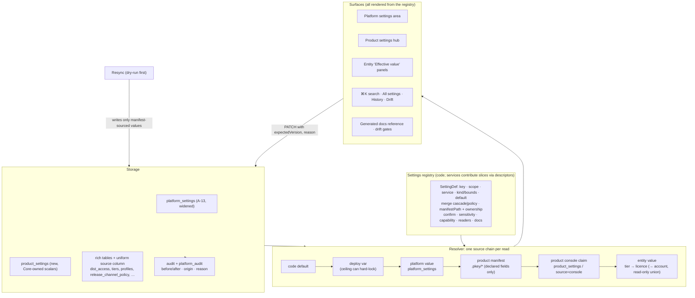

# S-18: Settings architecture (platform, product and service settings)

> Research note for [Godot on Polaris Key](../README.md), 2026-10-04. Spike S-18, commissioned by
> the lead on the owner's direction of 2026-10-04: "take a long hard look at the way we have set up
> settings … per-service, program and platform-wide settings. Ensure we can configure everything
> and more, and make this entire experience as thorough as possible." It has no program brief yet;
> §6 proposes an `ST-` work-package namespace. Research and design only: no product code changed,
> nothing was deployed, and no account or credential was used. File references are to the tree at
> `e8af86ff` (`W/` = `packages/worker/src/`, `M/` = `packages/worker/migrations/`, `A/` =
> `packages/admin/src/`). The effective D1 schema was read by applying all 89 migrations to a
> scratch SQLite file [M]. The console was captured at 1440 px and 390 px in both themes (156
> screenshots, 39 surfaces) through a route-mocked `vite preview` of the built admin under the
> Worker's CSP [M]; the harness lived in a scratch directory and is not committed. Comparable
> platforms were read from their public documentation (§3.2, sources in §9). The companion
> question in the same owner message, the licence and entitlement model, is a separate angle; this
> note touches it only where settings meet it (§5.3).

Evidence labels: **[V]** primary source read raw (repo file at the cited line, or a vendor document
read directly); **[M]** measured here (migrated schema, screenshots, greps with counts); **[I]**
inference; **[U]** unverified (a summary of a vendor page not re-read for this note, or a behaviour
not exercised).

---

## 1. Summary and recommendation

### 1.1 The question

Polaris Key has settings at four scopes: the **platform** (one deployment), the **product** (the
owner's "program"; see decision D1), each **service within a product** (License, Config, Release,
Update, Distribution, Identity and, planned, Cloud Sync), and individual **entities** (a tier, a
licence, an account, a channel, a feed). What should the model for all of them be, so that every
knob is configurable from one coherent experience, nothing is reachable only through SQL or a raw
API call, and the manifest and the console stop fighting?

### 1.2 Short answer

**Today there is no settings model, only settings.** About 30 stores use six precedence patterns
and five ownership vocabularies (§2.3). The one declarative registry, A-13's `PLATFORM_SETTINGS`,
holds four keys and cannot express a product setting (`W/core/platformSettings.ts:51-91`) [V]. The
consequences are concrete:

- **A correctness bug:** a resync silently overwrites the product name, the licence defaults, the
  admin group, tiers, profiles and a console-published catalog, while the console's own resync
  dialog promises the opposite (`W/services/release/resync.ts:300-313,372-396,492,518`;
  `A/console/pages/core/Settings.tsx:352`) [V] (§2.1).
- **Settings with no home:** two are SQL-only, seven are API-only, eleven are manifest-only with no
  read-out, and about fifteen product-shaped policies are hard-coded (§2.2).
- **Missing provenance:** product audit rows have no before/after, two thirds of setting stores
  have no optimistic concurrency, and the platform inventory has drifted from `env.ts` by 16 names
  with no gate (§2.4).
- **Planned work multiplies it:** I-04 and U-01 each add a bespoke settings table, a manifest block
  and a platform key that the A-13 registry cannot hold (§2.5).

**Recommendation (option D, §3): one typed settings registry, one resolver, one source vocabulary,
one row component, with the existing rich tables kept as storage behind descriptors.**

1. **A registry with scopes.** Generalise A-13 into a registry that declares every setting once:
   key, scope (`platform | product | service | entity`), owning service, type and bounds, default,
   **merge rule** (`cascade` or `policy`), manifest path and ownership mode, confirm levels per
   direction, sensitivity, capability, readers and docs anchor. Services contribute their slice
   through the descriptor (rule 6), and Core owns the store and the resolver.
2. **One resolver with a source chain.** `code default → deploy var → platform value → product
manifest → product console claim → entity value`, where `policy` entries are clamped by the
   strictest bound above them and a deploy-time ceiling can still hard-lock (A-13's rule, extended
   downward). Every read returns the value **and** the chain that produced it.
3. **Model C, made safe.** Keep today's documented rule that an explicit console claim survives a
   resync (`docs/design/ADMIN.md:929-950`, "editing claims it"), but apply it to every
   manifest-ownable field, add a resync dry-run preview, a drift view, and "Promote to repo".
4. **One storage contract.** Scalars live in one Core-owned `product_settings` table (and the
   existing `platform_settings`), versioned and `expectedVersion`-guarded. Rich objects (access
   rules, channel policies, outlets, listings, tiers) keep their tables, gain a uniform `source`
   column, and expose a descriptor so they appear in search, export, drift and history.
5. **One audit shape.** Per-product `audit` gains `before_json`, `after_json`, `origin` and
   `reason`, written in the same batch as the change, and the latest change per setting survives
   the 180-day prune.
6. **One experience.** A Platform settings area and a per-product **settings hub**
   (`#/p/<slug>/settings/<area>`), both rendered from the registry with a `SettingsRow` that says
   _inherited_, _changed_, _locked_, _drifted_, and opens its history. Add an "All settings" table,
   settings search in ⌘K, a platform "Product policies" matrix, and a full read-only constants
   inventory.
7. **Coverage gates, so "configure everything" stays true.** Drift gates tie `Env` ↔ platform
   inventory ↔ `wrangler.toml`, every `*_source` column and every settings-shaped table ↔ registry,
   and registry ↔ generated docs and search index.

None of this touches the device wire: settings change _values_ that existing signed documents
already carry (for example `graceUntil` from `maxOfflineDays`, `W/core/documents.ts:27-33`), never
a document's shape [V]. No SDK changes in the recommended phases; one optional later item would be
plan-mode (§4.11). The plan is 25 work packages, about 89 agent-days (83 without the optional roles package), in six phases; phase 0 (the
resync bug, the inventory gate) can start at once (§6).

### 1.3 The model in one picture



---

## 2. Current state and every gap

### 2.1 The resync overwrite (a correctness bug)

The console lets an operator edit these, and every resync rewrites them without a claim guard:

| Field                                  | Console write                                          | Resync write                                                            | Evidence                                   |
| -------------------------------------- | ------------------------------------------------------ | ----------------------------------------------------------------------- | ------------------------------------------ |
| `name`, `admin_group`                  | Core → Settings → General (`PATCH /products/<slug>`)   | `UPDATE products SET name = ?, … admin_group = ?` with no `_source`     | `W/services/release/resync.ts:300-313` [V] |
| Default max offline days, device limit | Core → Settings → License defaults                     | same statement                                                          | same [V]                                   |
| `web_origins_json`                     | none (no console editor)                               | same statement, "manifest-owned with no operator claim" by design       | `resync.ts:300-302` comment [V]            |
| Catalog                                | Config → Catalog editor publishes a new active version | a new version whenever the manifest catalog differs from the active one | `resync.ts:372-396` [V]                    |
| Profiles                               | Config → Profiles (create, edit, delete)               | `DELETE FROM profiles WHERE product = ?` then re-insert                 | `resync.ts:492` [V]                        |
| Tiers                                  | License → Tiers (create, edit, delete)                 | `DELETE FROM tiers WHERE product = ?` then re-insert                    | `resync.ts:518` [V]                        |

By contrast the compatibility window, which sits in the same statement block, is guarded by
`WHERE … COALESCE(compat_source, 'manifest') = 'manifest'` (`resync.ts:317-321`) [V]. The resync
confirm dialog says "Services, catalog, tiers, profiles, channels and update settings follow the
manifest, **except values set in the console**" (`A/console/pages/core/Settings.tsx:352`) [V],
which is false for the six rows above. ADMIN.md's T4 template promises a SourceBadge and "Revert
to manifest" in each section header (`docs/design/ADMIN.md:520-551`) [V], and §5.10 says a
manifest-owned block is "editable; editing claims it" (`ADMIN.md:929-950`) [V]. Core → Settings
has neither badge nor claim.

The licence defaults matter on the wire path: `license.max_offline_days ??
product.defaultMaxOfflineDays` sets `graceUntil` in every licence and config document
(`W/services/license/document.ts:137`, `W/services/config/document.ts:105`) [V], and
`defaultDeviceLimit` feeds the activation gate (`W/core/authz.ts:242`) [V]. A silent revert of
either changes what devices are allowed to do, with no audit row for the revert (resync writes one
`product_sync_state` row, not per-field audit) [V].

The same mechanism runs for the system product: `linkSystemProduct` applies the monorepo's root
`.pkey/` on every production deploy (`W/admin/systemProduct.ts:16-23`) [V], so the platform's own
product is resynced more often than any customer product.

### 2.2 Settings with no proper home

**SQL only, unaudited** [V]:

- per-product lazy-delta opt-in, `hot_devices`, `daily_cap` (`lazy_delta_settings`, `M/0051`; the
  runbook's `wrangler d1 execute INSERT` at `docs/RUNBOOK.md:816`; readers only
  `W/core/deltaDemand.ts:165,194`);
- per-product email daily cap (`email_product_caps`, `M/0066`; `docs/RUNBOOK.md:755`;
  `setProductDailyEmailCap` at `W/core/emailDelivery.ts:133` has no caller).

**API only** (a Worker route, no console control) [V]:

| Setting                                          | Route                                                                             | Console today                                                                         |
| ------------------------------------------------ | --------------------------------------------------------------------------------- | ------------------------------------------------------------------------------------- |
| Device trust policy (App Attest, Play Integrity) | `GET/PUT/DELETE …/trust-policy` (`W/admin/api.ts:236`)                            | nothing references it                                                                 |
| Auto-issue (enabled, tier, mode, rate)           | `PUT …/license/policy` `autoIssue` (`W/services/license/admin/policy.ts:122-142`) | Enrollment can only revert it; Sign-in links to it (`SignIn.tsx:343-350`), a dead end |
| Commerce settings, store-product → flag map      | `PUT …/distribution/commerce/{settings,products}`                                 | "No App Store products are mapped", no way to map (`CommercePage.tsx:309-314`)        |
| Storefront listing model                         | `…/distribution/listing[/overrides,/release-notes,/import]`                       | none, although the docs say "you edit it in the console"                              |
| Platform store credentials and settings          | `PUT/DELETE /platform/store-connections/<store>/…`                                | read-only DescriptionList (`pages/platformStores.tsx:700-730`)                        |
| Portal branding                                  | `services/identity/admin.ts:78`, any JSON accepted unvalidated                    | read-only JSON                                                                        |
| Fingerprint probe list                           | `…/license/policy`                                                                | read-only table, by design                                                            |

**Manifest only, no read-out or no override** [V]: OIDC provider, issuer, client and
`groupRoleMap` (deleted and re-inserted, `resync.ts:463-479`; Sign-in is read-only by design,
`SignIn.tsx:2-5`); provisioning hooks (`resync.ts:539`); edge-mint recipe fields (`resync.ts:547`;
approve and revoke only); `web.origins` (not visible anywhere, yet load-bearing for S-16's web
redirect and S-17's browser principal); `releaseKeys`; the release GitHub block; outlet identities,
listings, Homebrew, Scoop and App Installer settings (only `capabilities` narrows); secret names.

**Hard-coded product-shaped policy** [V]: seat dormancy 90 days (`W/repo.ts:1106`); device-token
record TTL 30 days (`W/kv.ts:69`); blob GC keeps the newest 3 releases (`W/core/blobGc.ts:153`);
appcast depth 3 and Velopack depth 10 (`W/services/update/updaterFeeds.ts:117,124`); live
lookback 16 (`W/services/update/compose.ts:91`); registry-token defaults and caps 90/30/365 days and
10/500 tokens (`W/core/registryVocabulary.ts:35-42`); portal "expires soon" 14 days and download
history 10 (`portal/library.ts:51`, `portal/downloads.ts:79`); portal and identity browser sessions
14 and 30 days (`portal/session.ts:12`, `browserSession.ts:74`); bundle import window 30 days and
max grace 365 (`W/core/bundles.ts:98,117`); ASC expiry warning 30 days
(`W/core/ascProvisioning.ts:324`); lazy-delta hot window 7 days (`W/core/deltaDemand.ts:52`).

**Missing surfaces entirely** [V]: per-product authorization (`products.admin_group` grants
nothing; `W/admin/authz.ts:18-33` reads only `PLATFORM_ADMIN_GROUP`); a product disable or
maintenance switch (the `status` column allows `disabled`, no route sets it); operator alert
destinations (auto-halt and store alerts reach only audit); settings export, import or diff; a
per-product effective-configuration view; settings search (⌘K indexes pages, not settings).

### 2.3 Six precedence patterns, five vocabularies

| #   | Pattern                                    | Where                                                                               | Evidence                                               |
| --- | ------------------------------------------ | ----------------------------------------------------------------------------------- | ------------------------------------------------------ |
| 1   | A-13 runtime / ceiling                     | the four platform keys                                                              | `W/core/platformSettings.ts:368-398` [V]               |
| 2   | Console > env; product explicit > platform | platform store settings and credentials                                             | `W/core/platformStoreSettings.ts:7-11` [V]             |
| 3   | Product row > var > code                   | email cap (the platform default is a deploy var outside A-13)                       | `W/core/emailDelivery.ts:107-125` [V]                  |
| 4   | Platform switch ∧ product value            | lazy deltas (no platform default for `hot_devices`), registry size ceiling          | `W/core/deltaDemand.ts:50,57` [V]                      |
| 5   | Manifest vs operator                       | (a) claim + revert; (b) narrow-only; (c) unconditional overwrite; (d) operator-only | §2.1, inventory [V]                                    |
| 6   | Payload layers                             | catalog default → tier(profile) → licence → device; then local/env on the client    | `W/merge.ts:1-2`; `client-core/src/config.ts:1-48` [V] |

Ownership markers disagree in type and spelling [M]: `services_source`, `compat_source` and
`access_source` are nullable TEXT where NULL means manifest; `trust_policy_source` is
`default|admin`; `fingerprint_policy_source` is NOT NULL default `manifest`; `dist_listings.source`
is `admin|import`; `dist_store_products.source` is CHECK-constrained to `admin`; store settings
report `console|env`. `SourceBadge` has five values, two of which (`admin`, `runtime`) render the
same label. Portal shows a "Defaults" pill instead; Core Settings, Health and Feeds show nothing.

### 2.4 Provenance, concurrency and drift

- **Audit.** `platform_audit` stores `before_json`/`after_json` (`M/0054_b`) [V]. The per-product
  `audit` table (`M/0001_init.sql:180-195`) and `portal_audit` store only a free-text summary [V];
  for example `portal.settings.update` records "Updated portal settings for <slug>"
  (`W/services/identity/admin.ts:84-92`) [V]. All three are pruned at 180 days
  (`W/scheduled.ts:92`) [V], so a long-lived setting loses its history.
- **"Last changed by"** exists on some tables (platform settings, connector settings, registry,
  tiers, profiles, licences, CI publishers, listings, rollouts) and not others (`products`,
  `release_config`, `portal_product_settings`, `oidc_config`, `lazy_delta_settings`,
  `email_product_caps`) [M].
- **Optimistic concurrency** (`expectedVersion`) exists on three stores: `platform_settings`,
  `dist_registry_policy`, `dist_registry_feeds` [V]. Everything else is last-writer-wins, which
  ADMIN.md already records for the catalog (A-6) [V].
- **Inventory drift.** `GET /platform/settings` lists 17 vars and 13 secrets from hand-kept lists
  (`W/admin/handlers/platformSettings.ts:101-178`) [V]. Missing [M]: `PKG_ORIGIN`,
  `EMAIL_SENDER_ADDRESS`, `EMAIL_PRODUCT_DAILY_CAP`, `EMAIL_APPLE_RELAY`, `REGISTRY_TOKEN_KEY`,
  `REGISTRY_TOKEN_KEY_PREVIOUS`, `PLATFORM_REPOSITORY`, `_ID`, `_OWNER_ID`,
  `PLATFORM_DEPLOY_ENVIRONMENT`, `PLATFORM_APPLE_TEAM_ID` and the five `PLATFORM_*` store secrets,
  all declared in `W/env.ts`. The required-secrets comment at `wrangler.toml:382-398` omits
  `REGISTRY_TOKEN_KEY` and the store secrets. Platform → Settings shows 5 code constants of the
  roughly 40 that S-13 §5.3 lists. No test ties any of these together.
- **Environments.** Every runtime store is per D1, so per Cloudflare environment. The three
  `[vars]` blocks are hand-duplicated with no drift check (`EMAIL_SENDER_ADDRESS` is set in staging
  only) [V]; staging and dev still carry `REPLACE_ME_*` ids (`wrangler.toml:248,252,315,319`) [V].
  A product has no staging/production split; commerce tells operators to use a separate staging
  product (`commerce/settings.ts` header) [V].

### 2.5 Duplicates, and what planned work adds

| Concept            | Stores today                                                                                                                                                                                                               |
| ------------------ | -------------------------------------------------------------------------------------------------------------------------------------------------------------------------------------------------------------------------- |
| Branding           | `products.branding_json` (NULL at every insert, read by the portal), `portal_product_settings.branding_json` (unvalidated), `dist_listings` name/tint                                                                      |
| Claim by key       | `portal_product_settings.claim_by_key` (`M/0064:24`), and I-04 plans `identity.claimByKey` in a second table                                                                                                               |
| Version window     | `products.compat_*` (editable only under Update, though License uses it), `tiers.min/max_version`, `licenses.min/max_version`, channel floors                                                                              |
| Access mode        | `release_config.metadata_access`, legacy `artifacts_access` (still written, `resync.ts:451`, and read, `services/release/config.ts:194`), `dist_access.mode`, `dist_registry_feeds.access_mode`, portal `releases_enabled` |
| Apple Team ID      | trust policy `appAttest.teamId` > `platform_store_settings` > `PLATFORM_APPLE_TEAM_ID`                                                                                                                                     |
| Manifest spellings | `defaultDeviceLimit` vs `licensing.defaultDeviceLimit`; `tiers` vs `licensing.tiers`; `profiles` vs `licensing.profiles`; `edgeMint` in both product and release schemas (`shared-manifest/src/index.ts:2115-2117`)        |

Planned [V]:

- **I-04** adds `identity_product_settings` (PK `product`; `keyEntryLimit`, `claimByKey`,
  `native`, `requireTerms`, `redirectPaths`) written from a new manifest `identity:` block, and a
  platform key `identity.keyEntryRefusals` (`program/plans/I-04.md:206-220,315,388`). It does not
  say whether the block is manifest-only or claimable. The key does not fit A-13's closed key union
  or its single `area: "background-jobs"` (`platformSettings.ts:51-55,74`).
- **U-01** adds `sync_product_settings` (ceilings 50 GiB, 100k users, 2,000 pushes/s,
  `updated_by`), manifest `cloudSync.*` limits, and validator constants in `shared-catalog`
  (`git show wp/U-01-cloud-sync-plan:…/plans/U-01.md`, lines 407, 449-458).
- **PX-W3** adds no settings and no manifest change (`…/plans/PX-W3.md`, §3).
- **S-16** removes the licence config-override layer in favour of account overrides
  (`notes/S-16-identity-service.md:163`), which changes payload layer 6 above.

Without a model, the next quarter adds two more per-service tables, a third manifest-vs-operator
variant and a second platform naming scheme [I].

### 2.6 UX audit (from the captures)

[M], 156 screenshots. The findings that shape the design:

1. **Scattered:** "settings" spans about 25 pages in 9 sidebar groups. Package feeds alone have
   three homes (on/off in Core → Services, per-feed in Distribution → Package feeds, the platform
   ceiling as the last card of the platform's _own_ npm feed tab). The registration policy is
   edited in Services, mirrored in Enrollment and summarised in Edge mint.
2. **Hidden when it should not be:** Portal settings live in the Identity group, and the sidebar
   drops a disabled service's whole group (`A/console/shell/Sidebar.tsx:89-91`) [V], although the
   portal runs either way. The compatibility window disappears with Update, though License uses it.
3. **No search:** nothing answers "where do I set the device limit?" The same field exists as a
   product default, a tier policy and a licence override; only the licence record shows an
   "Effective policy" box.
4. **Inconsistent save model:** per row (Platform Settings), per page (Portal), inline in a
   dashboard (Auto-halt in Health, "Reset to defaults" as a text link), per tab (feeds). Confirm
   levels are declared only in the platform registry; product pages choose friction ad hoc.
5. **Template drift:** Portal passes `sections={[]}` (no rail despite five sections); Access has no
   rail or descriptions. Health's auto-halt shows a raw subject ("Saved by u1").
6. **Copy errors:** Sign-in calls `PLATFORM_OIDC_ISSUER` a secret; "Entitled" means three different
   things on App Access, pack Access and Feeds.
7. **Phone:** Platform Settings is 11,316 px tall with no rail and no collapsing; 15 env-var names
   wrap mid-token. No horizontal overflow beyond long deploy values.
8. Two captures failed for fixture reasons, not product bugs: the licence-record Config tab
   dereferences `entry.schema` (`A/schema/entry.ts:132`) when a fixture omits it, and the
   compatibility page had no fixture.

---

## 3. Options

### 3.1 The four options

- **A. Fix in place.** Fix the resync bug, add the missing routes and pages one by one, keep
  bespoke tables and patterns. Cheapest; repeats the cause.
- **B. One generic key-value store for everything.** Every setting, scalar or rich, becomes a row in
  one `settings` table addressed by key and scope. Uniform, but rich objects (access rules, channel
  policies, outlets, tiers with referential integrity) lose their constraints, joins and
  service ownership, breaking rule 6 and every existing reader.
- **C. Manifest-authoritative ("code always wins").** Everything manifest-ownable is read-only in
  the console on linked products; the console edits only operator-only settings. Simple and
  GitOps-pure, but an incident fix then needs a commit and a resync, and it contradicts the
  documented model (`ADMIN.md:929-950`) and the existing claim columns.
- **D. Registry + resolver + descriptors (recommended).** A declarative registry for every setting;
  scalars in one versioned store; rich objects stay in their tables behind a descriptor with a
  uniform `source` column; one resolver, audit shape and UI. Model C (claim survives) for
  ownership, with a dry-run, drift and promote loop; a per-product opt-in to manifest-authoritative
  mode for teams that want it.

### 3.2 What comparable platforms do

[U] unless marked; sources in §9.

| Platform               | Scopes                                 | Merge rule                                                       | Code vs dashboard                                                 | Lesson for Polaris                                           |
| ---------------------- | -------------------------------------- | ---------------------------------------------------------------- | ----------------------------------------------------------------- | ------------------------------------------------------------ |
| GitHub                 | enterprise → org → repo                | higher levels **enforce** or **delegate**; rulesets only tighten | API/Terraform                                                     | declare per setting whether a higher scope defaults or locks |
| Sentry                 | org → project                          | org scrubbing on → applies to every project, locked              | API                                                               | grey out, name the enforcing scope                           |
| LaunchDarkly           | account → project → environment → flag | strictest approval wins; per-env targeting                       | Terraform/API                                                     | compare and copy across environments; change history         |
| Vercel                 | team → project → environment           | shared variables link live into projects                         | `vercel.json` wins for declared fields, per-field override toggle | linked vs copied; sensitive values write-only                |
| Cloudflare / Wrangler  | account → zone → hostname rules        | account rules first; exceptions at their own level               | Wrangler overwrites dashboard vars on deploy (`keep_vars` caveat) | silent overwrite is a known incident class                   |
| Supabase               | org → project → branch                 | —                                                                | `config push` writes declared fields only, with diff and confirm  | dry-run diff; an unchanged template reverted dashboards      |
| Auth0 Deploy CLI       | tenant per env                         | —                                                                | export/import YAML, keyword replacement, deletes off by default   | export/promote between environments                          |
| Doppler                | project → env root → branch config     | root propagates except overridden keys; **promote** to root      | CLI/API                                                           | "promote to repo" analogue                                   |
| Argo CD / Terraform    | —                                      | —                                                                | `ignoreDifferences` for live-owned fields; drift as a state       | drift is a first-class status; self-heal undoes fixes        |
| Firebase Remote Config | project → template → parameter         | first matching condition                                         | template versions; rollback publishes a new version               | restore writes new rows, never rewrites history              |
| Steamworks             | partner → app                          | —                                                                | staged edits, "View diffs", publish                               | stage only where atomicity matters                           |
| VS Code                | default → user → workspace             | nearest wins                                                     | settings JSON and UI share one store                              | modified marker, `@modified` filter, schema registry         |

Two merge rules recur: **cascading defaults (nearest scope wins)** and **constraining policies
(strictest or locked scope wins)**. Polaris already has both, as A-13's `runtime` and `ceiling`,
but only for four platform keys [V].

### 3.3 Comparison

| Criterion                                                | A. Fix in place           | B. Generic KV   | C. Manifest-authoritative | D. Registry + descriptors |
| -------------------------------------------------------- | ------------------------- | --------------- | ------------------------- | ------------------------- |
| Fixes the resync bug                                     | yes                       | yes             | yes (by removing edits)   | yes                       |
| Every setting reachable from the console                 | eventually, by hand       | yes             | no (manifest-only grows)  | yes, gated                |
| Can prove coverage (nothing unconfigurable)              | no                        | partly          | no                        | yes (coverage gates)      |
| Keeps rule 6 service ownership                           | yes                       | no              | yes                       | yes (descriptors)         |
| Keeps rich-object integrity (FKs, joins)                 | yes                       | no              | yes                       | yes                       |
| Incident fix without a commit                            | partly                    | yes             | no                        | yes                       |
| One history and audit shape                              | no                        | yes             | no                        | yes                       |
| Search, export, diff, effective view                     | no                        | yes             | partial                   | yes                       |
| Absorbs I-04 / U-01 / S-16 settings without new patterns | no                        | yes             | partly                    | yes                       |
| Wire impact                                              | none                      | none            | none                      | none in phases 0–5        |
| Migration cost                                           | low                       | very high       | medium                    | medium (incremental)      |
| Rough size                                               | ~30 agent-days, recurring | ~120 agent-days | ~25 agent-days            | ~89 agent-days            |

**D is recommended.** It is A-13's proven pattern (registry, per-row save, `expectedVersion`,
before/after audit, source badges, ceiling locks) extended to the scopes that need it, and it can
land incrementally: each phase is useful on its own, and phase 0 is option A's bug fix.

---

## 4. The recommended design

### 4.1 Scopes and vocabulary

| Scope        | Means                                                                         | Store                                                                                                                   | Who writes                                |
| ------------ | ----------------------------------------------------------------------------- | ----------------------------------------------------------------------------------------------------------------------- | ----------------------------------------- |
| **deploy**   | `[vars]` and secrets of one Cloudflare environment                            | `wrangler.toml`, `wrangler secret put`                                                                                  | repo + deploy token                       |
| **platform** | one deployment (instance-wide runtime values, and defaults for every product) | `platform_settings` (widened), `platform_store_settings`, …                                                             | platform admin                            |
| **product**  | one product (the owner's "program", D1)                                       | `product_settings` (new) and rich tables                                                                                | manifest (declared fields), product admin |
| **service**  | a service's settings within one product                                       | same as product, keyed `<service>.*`; visible only when the service is on, or when the descriptor says `visibleWhenOff` | same                                      |
| **entity**   | a tier, licence, account, channel, feed, outlet or pack                       | the entity's own table                                                                                                  | console, API, manifest (tiers)            |

A setting is addressed as `<service>.<group>.<name>` (for example `license.defaults.deviceLimit`,
`identity.keyEntry.limit`, `cloudSync.ceiling.bytes`, `core.web.origins`, `platform.email.sender`).
The existing four platform keys keep their SCREAMING_CASE names as **aliases** so `[vars]`, audit
history and docs links keep working (`LAZY_DELTAS` ⇄ `deltas.lazy.mode`) [I].

"Service" is a namespace, not a separate store: a service setting is a product-scope setting whose
owner is a service. This matches the code, where each service's settings are already per product
[V], and avoids a fifth storage level.

**Not settings** (kept structurally separate, §4.12): customer config catalog keys, flags and
secrets delivered to SDKs (Config service); entitlements (licence and tier data); end-user account
preferences in the customer portal (PORTAL.md §4.26, §4.30).

### 4.2 The registry

Location: `W/core/settings/registry.ts` (Core-owned types and resolver) with one slice per service
under each service's own directory, registered through the service descriptor
(`W/core/hooks.ts`), so `test/boundaries.test.ts` (rule 6) holds. Platform entries move from
`W/core/platformSettings.ts` into `W/core/settings/platform.ts`; the old module re-exports for one
release.

```ts
// W/core/settings/types.ts (proposed)
export type Scope = "platform" | "product" | "entity";
export type Merge = "cascade" | "policy"; // nearest wins | strictest bound wins (or locked)
export type Ownership =
  | "operator" //      console/API only; no manifest path
  | "manifest" //      manifest only; console shows a read-out with "edit in .pkey/…"
  | "claimable" //     manifest seeds it; a console write claims it; Revert returns it (model C)
  | "narrow-only"; //  manifest sets it; console may only narrow (outlet capabilities today)
export type Source =
  | "default"
  | "deploy"
  | "platform"
  | "manifest"
  | "console"
  | "derived";
export type ConfirmLevel = "L0" | "L1" | "L2" | "L3"; // ADMIN.md §5.2

export interface SettingDef<T = unknown> {
  key: string; //                     "license.defaults.deviceLimit"
  aliases?: string[]; //              ["LAZY_DELTAS"]
  scope: Scope;
  entity?:
    | "tier"
    | "license"
    | "account"
    | "channel"
    | "feed"
    | "outlet"
    | "pack";
  service: ServiceId | "core" | "platform";
  area: string; //                    hub section, e.g. "license.policy"
  label: string;
  description: string;
  keywords?: string[]; //             search synonyms
  docs: string; //                    docs anchor; drift-gated
  value: ValueSpec<T>; //             switch | integer(unit,min,max) | enum | string(pattern) |
  //                                  duration | list(of,max) | json(schema ref)
  defaultValue: T;
  merge: Merge;
  inherits?: "platform"; //           product value inherits a platform value of the same key
  policyBound?: "min" | "max" | "lock"; // for merge: "policy"
  varName?: string; //                deploy var read at the deploy step, if any
  precedence?: "runtime" | "ceiling"; // A-13 semantics for the deploy step
  manifest?: { path: string; ownership: Ownership };
  confirm:
    | { up: ConfirmLevel; down: ConfirmLevel }
    | { on: ConfirmLevel; off: ConfirmLevel };
  critical?: boolean; //              reason required on write
  sensitivity: "config" | "secret"; // secret: presence only, never a value
  capability: string; //              "settings.product.license.write"
  visibleWhen?: {
    service?: ServiceId;
    offBehaviour: "hide" | "readOnly" | "visible";
  };
  readers: string[]; //               "W/services/license/document.ts", "deltas"
  storage: { kind: "scalar" } | { kind: "rich"; adapter: string }; // rich: descriptor adapter
  since: string;
  deprecated?: { replacedBy: string };
}
```

**Registry rules** (enforced by `test/settings-registry.test.ts`) [I]:

1. **The AT-2 deny-list carries over** (`notes/S-13-platform-settings.md:487-508`): no entry may
   declare an origin, the privilege root, the admin IdP, a security gate, key material, a session
   TTL that lengthens, a rate limit, retention, or a bucket name at **platform** scope. The test
   keeps S-13's name list and adds categories.
2. **A product-scope analogue:** a security-widening product setting (web origins, OIDC issuer,
   trust policy, redirect paths, `groupRoleMap`, access modes) must be `critical: true`, may never
   `inherits: "platform"` (one platform write must not widen every product), and its widening
   direction must be at least L1.
3. Sessions are **shorten-only**: a product may lower the portal or identity browser session, never
   raise it above the code constant (`policyBound: "max"` at the constant).
4. Every `policy` entry declares its bound; every `claimable` entry declares a manifest path that
   exists in `shared-manifest`'s schema (parity test, §4.7).
5. Adding an entry is a THREAT-MODEL §9 review trigger, as it is today for A-13
   (`docs/security/THREAT-MODEL.md:4445`) [V].

**Seed list.** Appendix A lists every setting found, with its target key, scope, owner, merge,
ownership mode, store and home: roughly 140 entries once multi-key rows are expanded, about two
thirds scalar, a quarter rich objects behind adapters, the rest read-only constants or secrets shown
by presence [I]. ST-03 produces the exact list.

### 4.3 Storage

**Scalars.** One Core-owned table beside the existing platform store:

```sql
-- M/00xx_product_settings.sql (proposed; ST-04)
CREATE TABLE IF NOT EXISTS product_settings (
  product     TEXT NOT NULL REFERENCES products(slug) ON DELETE CASCADE,
  key         TEXT NOT NULL,          -- registry key; unknown keys are ignored on read
  value_json  TEXT NOT NULL,          -- validated by the registry on write AND read
  source      TEXT NOT NULL CHECK (source IN ('manifest','console')),
  version     INTEGER NOT NULL DEFAULT 1,
  updated_at  INTEGER NOT NULL,
  updated_by  TEXT NOT NULL,          -- admin subject, 'resync', 'system'
  PRIMARY KEY (product, key)
);
```

- A missing row means **inherit** (platform value, deploy var, code default). "Reset to inherited"
  deletes the row; "set to the same value" keeps a row. The distinction is shown (§4.9).
- `platform_settings` is unchanged in shape; its key column now accepts any platform-scope registry
  key (it has no CHECK, `M/0056`) [V].
- Values that already live in typed columns (`products.compat_*`, `products.default_*`,
  `portal_product_settings.*`, `lazy_delta_settings.*`, `email_product_caps.*`,
  `release_config.operator_policy_json`, `dist_connector_settings`) migrate into `product_settings`
  in ST-11 and ST-14; until then a **column adapter** maps a registry key to its column, so the
  resolver and UI work from day one [I].

**Rich objects** keep their tables, because they carry foreign keys, ordering and service
ownership: `tiers`, `profiles`, `product_schema`, `dist_access`, `dist_outlets`, `dist_transports`,
`release_channel_policy`, `release_channel_floors`, `dist_listings*`, `dist_registry_feeds`,
`dist_store_products`, `oidc_config`, `provisioning_config`, `edge_mint_config`, `ci_publishers`,
`trust_policy_json`. Each gains:

- a **uniform** `source TEXT NOT NULL DEFAULT 'manifest' CHECK (source IN ('manifest','console'))`
  column where it is manifest-ownable (replacing `*_source` variants on a schedule, §4.13), or none
  where it is operator-only;
- `version` and `updated_by` where missing;
- a **descriptor adapter** (`read`, `validate`, `diff`, `write`, `revert`, `export`) registered with
  the registry, so search, history, drift, export and the "All settings" table cover it.

**Caching.** The resolver reuses A-13's 30-second per-isolate cache for platform values
(`notes/S-13-platform-settings.md` §6.3) and reads product values per request inside the existing
product fetch (one extra indexed read, batched with the product row) [I]. Hot paths that already
read a typed column keep doing so until their WP migrates them.

### 4.4 Precedence and inheritance

Resolution for one key at one scope:

```
v := def.defaultValue                                  source = default
if def.varName and env[varName] parses:  v := var      source = deploy
if platform row (or product inherits platform row):  v := row   source = platform
if def.scope ∈ {product, entity}:
   if product row source = manifest:  v := row         source = manifest
   if product row source = console:   v := row         source = console
if def.scope = entity and entity value set:  v := it   source = console|manifest (tiers)
if def.merge = policy:
   v := clamp(v, strictest bound from every scope above)   lockedBy = that scope
if def.precedence = ceiling and var = off:  v := off   lockedBy = deploy   (A-13, unchanged)
return { value: v, source, chain: [each step with its value, who, when], lockedBy?, drift? }
```

- **Cascade** entries take the nearest scope that has a value. Platform values are **live links**
  by default (a change propagates to every product without its own row), shown with a fan-out
  count and confirmed at L2 when products would change (D5).
- **Policy** entries clamp: a platform `max` for offline days, a platform `min` for the key-entry
  limit, the S-17 per-product Cloud Sync ceilings above per-user limits. A product write outside
  the bound is refused with `setting_out_of_bounds` and the bounding scope named.
- **Enforce vs delegate.** For `policy` entries with `policyBound: "lock"`, a platform admin may
  choose "Enforced on all products"; the product row becomes read-only with "Locked by Platform".
  Only entries that declare it offer the choice (GitHub's model) [I].
- **Entity layer.** The licence-policy chain is `product default → tier policy → licence value`,
  which the licence record's "Effective policy" box already shows; S-16's account is a read-only
  aggregation (the union of an account's licences), not a precedence step (§5.3).
- **Channel axis.** A few entries declare `axes: ["channel"]` (compatibility window, update metadata
  access, rollout defaults); a channel value overrides the product value for that channel only and
  never reaches upward. Deferred to ST-23's follow-up unless the owner wants it sooner (D6).
- **Customer config payloads are not resolved here.** `W/merge.ts` keeps catalog default → profile
  → (S-16: account override) → device. The registry only describes the Config service's _own_
  settings (for example edge-mint approval, catalog publish policy).

### 4.5 Manifest interaction (model C, made safe)

1. **Declared fields only.** A resync writes only fields the manifest declares, and only where the
   current source is `manifest`. An omitted optional field leaves the value alone, except where the
   descriptor says `omitClears: true` (today `web.origins`, `resync.ts:300-302`) [V].
2. **Claim on console write.** A console write to a `claimable` setting sets `source = 'console'`.
   **Revert to manifest** (L1) deletes the claim and re-applies the last manifest value at once,
   from `product_sync_state`'s stored manifest, not at the next push [I].
3. **Per row for rich lists.** Tiers and profiles get a per-row `source`; resync upserts
   manifest-sourced rows, leaves console rows alone, and deletes a manifest row only when the
   manifest dropped it and no licence references it (today's guard, `resync.ts:480-490,506-516`)
   [V]. A console row with the same id as a new manifest row is a **conflict** shown in the dry run.
   The catalog is one claimable unit (a console publish claims it).
4. **Dry run first.** `POST …/resync?dryRun=1` returns `{ apply: [...], skipClaimed: [...],
delete: [...], conflicts: [...] }`. The console's Resync confirm (L1) renders it; the webhook
   path applies the same plan and records it in `product_sync_state.plan_json` [I].
5. **Drift is a state.** The product hub shows "N settings differ from `.pkey/`": per row, the
   manifest value, the console value, who claimed it and when, with **Revert to manifest**, **Keep**,
   or **Promote to repo**.
6. **Promote to repo.** Generates a `.pkey/` patch for the selected claims (unified diff, copyable
   and downloadable through the CLI). Opening a PR through the GitHub App is a later option, because
   it needs `contents: write` on the App, a THREAT-MODEL trigger (D13).
7. **Manifest-authoritative mode (opt-in, D14).** A product setting `core.manifest.authoritative`
   refuses console writes to `claimable` entries ("edit `.pkey/…` instead") except as a
   time-boxed break-glass claim (reason required, expires at the next resync or after 7 days).
8. **System product.** `linkSystemProduct` uses the same plan; its claims are visible in the
   Platform area because operators reach it from Platform → Package feeds (§4.14).

### 4.6 Audit, history and concurrency

- **Migration** `audit` adds `before_json`, `after_json`, `origin` (`console | api | resync |
manifest-push | revert | restore | system | ci`), `reason`, `setting_key` (indexed). The same for
  `portal_audit`'s settings actions, which move to `audit` (portal _account_ actions stay in
  `portal_audit`) [I].
- **One write path.** `writeSetting()` validates against the registry, checks the capability,
  compares `expectedVersion`, writes the row and the audit row in one `db.batch`, and invalidates
  the cache, as `platformSettings.ts:470-490` already does for platform keys [V].
- **Resync audits per field.** Each applied change writes an `origin = 'resync'` audit row with
  before/after, so silent changes end.
- **Retention.** Audit stays pruned at 180 days (retention is deny-listed from runtime edits), but
  the prune keeps the **latest** row per `(product, setting_key)` so every current value keeps its
  provenance (D9). An "Export history" action streams NDJSON for longer archives.
- **History and restore.** Per-row and per-section history drawers; "Settings as of <date>"
  reconstructs a scope from audit rows and diffs it against now; **Restore selected** writes new
  rows (`origin = 'restore'`), never rewrites history (Firebase's rule).
- **Concurrency.** Every settings write takes `expectedVersion`; a 409 returns the current value and
  chain so the UI can offer "Reload, keep mine". Rich adapters adopt the same contract.

### 4.7 APIs (admin, narrative-only, rule 10)

All under `/manage/api`, each with an `openapi/polaris-key.v3.yaml` entry (rule 10) and route
coverage. Admin routes are narrative-only, so no corpus or SDK impact [V: AGENTS rule 10].

| Method and path                                                  | Purpose                                                                                    |
| ---------------------------------------------------------------- | ------------------------------------------------------------------------------------------ |
| `GET /settings/registry?scope=&service=`                         | descriptors (labels, kinds, bounds, confirm, capability, docs) for rendering               |
| `GET /platform/settings/effective`                               | every platform entry: value, chain, lockedBy, fan-out counts                               |
| `GET /products/<slug>/settings/effective?area=`                  | every product/service entry: value, chain, lockedBy, drift, last change                    |
| `PATCH /platform/settings/<key>` (exists)                        | unchanged contract, now any platform key                                                   |
| `PATCH /products/<slug>/settings/<key>`                          | `{ value, expectedVersion, reason?, confirm? }`                                            |
| `DELETE /products/<slug>/settings/<key>`                         | reset to inherited (or revert to manifest, for claimable keys); `expectedVersion`          |
| `GET /products/<slug>/settings/history?key=&from=`               | before/after rows                                                                          |
| `GET /products/<slug>/settings/as-of?at=`                        | reconstructed snapshot + diff                                                              |
| `POST /products/<slug>/settings/restore`                         | `{ keys, at }`                                                                             |
| `POST /products/<slug>/resync?dryRun=1`                          | the plan of §4.5                                                                           |
| `GET /products/<slug>/settings/drift`                            | per-key manifest vs console                                                                |
| `POST /products/<slug>/settings/promote`                         | `.pkey/` patch for selected claims                                                         |
| `GET /products/<slug>/settings/export` · `POST …/import?dryRun=` | registry-shaped JSON (no secrets; schema version), for copy-from-product and env promotion |
| `GET /platform/product-policies`                                 | the matrix of platform-owned per-product limits                                            |

Existing bespoke routes (`…/update/settings`, `…/license/policy`, `…/trust-policy`,
`…/distribution/access`, …) stay as **compatibility aliases** that call the same write path, and
are retired one release after the console stops calling them.

### 4.8 Authorization

- Every registry entry carries a `capability`. One gate, `can(session, capability, scope)`, guards
  every settings write. Today it returns `isPlatformAdmin` for all capabilities
  (`W/admin/authz.ts:18-33`) [V], so behaviour is unchanged; the console's `useCan(action)`
  (ADMIN.md §5.10) reads the same capability names.
- **Roles are a later, separate decision** (D10): a policy table mapping groups to capabilities per
  product (product admin, support read-only, release manager). It changes the admin authorization
  model, a THREAT-MODEL trigger, and must keep `PLATFORM_ADMIN_GROUP` deploy-time (S-13 §8.2).
  Until then `products.admin_group` stays metadata, shown read-only with its SourceBadge.

### 4.9 Console UX

**Principles.** Every value has one owner, one home, one source badge and one history; any other
place that shows it is a read-out with a link (ADMIN.md §5.1 "Set this elsewhere is always a link").
Hide what cannot apply; disable with a reason what applies but is not possible now (§5.10).

**Level 1: Platform** (`#/platform/settings/<area>`):

1. **General**: environment, origins (`CONSOLE_ORIGIN`, `BLOB_ORIGIN`, `PKG_ORIGIN`), GitHub App,
   platform repository and deploy environment (read-only).
2. **Access and identity**: admin group, console and platform OIDC, issuer allowlist (read-only);
   later the S-16 account-layer providers as presence.
3. **Email**: sender (choose among `allowed_sender_addresses`, a new platform runtime entry), Apple
   relay, the default daily cap (promoted from `EMAIL_PRODUCT_DAILY_CAP` to a registry entry).
4. **Background jobs**: the A-13 four, with "N products opted in" for lazy deltas.
5. **Product defaults and policies** (new): every `inherits: "platform"` and `policy` entry, with
   enforce/delegate where allowed and "7 products inherit · 2 override" fan-out.
6. **Product policies matrix** (new): rows are products, columns are platform-owned per-product
   limits (email cap, lazy-delta opt-in and caps, Cloud Sync ceilings, feed size ceilings), with an
   80 % warning state (S-17 §5.7).
7. **Package feeds policy**: moved out of the platform's own npm feed tab.
8. **Store connections**: credential upload and settings editors (today API-only), unified badges.
9. **Keyring and secrets**: as today; every secret by presence, "last rotated" where known.
10. **Limits**: every code constant that acts as policy, generated from code, grouped and
    searchable (about 40, S-13 §5.3) instead of 5.
11. **History**: platform audit with filters and before/after diffs.

Deployment and Operations stay where they are.

**Level 2: Product settings hub** (`#/p/<slug>/settings/<area>`), replacing Core → Settings; the
hub stays visible whatever services are on:

| Area                    | Contents                                                                                                                                                                                      |
| ----------------------- | --------------------------------------------------------------------------------------------------------------------------------------------------------------------------------------------- |
| General                 | name, admin group (read-out), web origins (new editor), manifest mode, repository and resync with dry run, storage, danger zone (delete; disable, D17)                                        |
| Services & registration | toggles, delivery chain, registration policy; mint flags as read-outs                                                                                                                         |
| Keys & CI               | signing keys, product secrets, CI publisher, CI tokens (links into today's pages until moved)                                                                                                 |
| License                 | defaults (offline days, device limit, seat dormancy), fingerprint policy and probes, **auto-issue editor**, key-entry limit, claim by key                                                     |
| Config                  | catalog publish policy and link, profiles, edge-mint recipes (editable fields, claimable)                                                                                                     |
| Release & Update        | compatibility window (visible when License **or** Update is on), metadata access, operator policy, channel policy and floors, feed depths                                                     |
| Distribution            | access per deliverable and pack, outlets (capabilities, identity read-outs), listing (new editor), commerce and store-product mapping, auto-halt (moved out of Health), package-feed defaults |
| Identity                | sign-in provider and `groupRoleMap` (read-out with source; claimable later), provisioning, redirect paths, native providers, terms                                                            |
| Customer portal         | portal on/off and methods, licence-key claim, releases, key reissue, auto-link, **branding editor** (validated) — visible even with Identity off                                              |
| Cloud Sync              | developer limits under the platform ceilings (locked rows), unlicensed behaviour, projected cost                                                                                              |
| Platform policies       | read-only: the Level 1 ceilings and enforced values that apply here, linked                                                                                                                   |
| All settings            | flat, filterable table of every entry: value, source, inherited-from, drift, last change                                                                                                      |
| History                 | product audit filtered to settings, before/after, "as of" and restore                                                                                                                         |

Operational pages (Licenses, Releases, Matrix, Rollouts, Health, Devices) keep their place, and each
PageHeader gets a "Settings" link to its hub area. Legacy routes (`#/p/<slug>/core/settings`,
`…/update/feed` settings section, `…/identity/portal`) redirect.

**Level 3: Entity pages** (tier, licence, feed, pack, account) keep their own editors and gain an
**Effective value** panel with the chain (platform bound → product default → tier → licence).

**`SettingsRow` v2** (one component for every entry):

- the control from the registry kind, with unit and bounds;
- a SourceBadge from the unified vocabulary: _Default_, _Deploy_, _Platform_, _Manifest_,
  _Console · who · when_, _Derived_ (the old `admin` and `runtime` collapse to _Console_);
- an **inherited** label ("Inherited from Platform: 30 days") and **Reset to inherited**;
- a **locked** state naming the enforcer and reason ("Locked by Platform policy", "Locked off by
  deploy var");
- a **drift** marker ("Manifest says 5") with Revert / Keep / Promote;
- a clock icon opening the row's history; a deep link (`?key=license.defaults.deviceLimit`).

**Save model.** Scalar rows save per row with the registry's confirm level (L0 → undo toast, L1 →
ConfirmDialog with consequences, L2 → typed key) as Platform Settings does today. Rich sections
keep one SaveBar per resource (UPS-1) with a **pre-save diff** ("2 changes: Device limit 5 → 10").

**Search.** ⌘K indexes the registry: "device limit" lists all three levels with values. Filters:
`@modified`, `@drift`, `@locked`, `@source:manifest|console|deploy`, `@service:update`,
`@scope:platform`, `@critical`. Hits deep-link to the row.

**Phone.** Hub sub-navigation becomes a select; sections collapse; long env names break at `_`;
sticky SaveBar. Every page stays within the 16 px gutter rule.

**Copy.** One access-mode vocabulary across Access, Feeds and Metadata access, with "Entitled"
qualified ("Entitled: holds `<flag>`"). Copy only; wire enums unchanged (D16).

### 4.10 Customer portal

The portal itself has no operator settings UI. It changes in three ways:

1. It reads branding from **one** store (`portal.branding`, validated JSON schema: name, logo
   asset, tint light/dark, support URL), not `products.branding_json` (always NULL) [V].
2. Its per-product toggles (`portal_product_settings`) become registry entries read through the
   resolver; behaviour is unchanged.
3. `claimByKey` has one home (`identity.keyEntry.claimByKey`), migrated from
   `portal_product_settings.claim_by_key`.

End-user preferences (PORTAL.md §4.26 Account, §4.30 Profile) are account data, not settings, and do
not change.

### 4.11 SDK surface, per language

No SDK changes in phases 0–5 [I]. Settings reach devices only as values inside documents and
answers that already exist:

| Setting class                               | How devices see it today                                    | Change           |
| ------------------------------------------- | ----------------------------------------------------------- | ---------------- |
| Offline window, device limit, seat dormancy | `graceUntil` in licence/config docs; `device_limit` refusal | value only       |
| Compatibility window, channel policy        | licence doc grants, update feed answers                     | value only       |
| Access modes                                | 401/403 answers on feeds and bytes                          | value only       |
| Key-entry limit, claim by key (I-04)        | `license_owned`, `key_entry_limit` refusals (I-04's codes)  | none beyond I-04 |
| Cloud Sync limits (U-01)                    | `quota_exceeded` and U-01's status shape                    | none beyond U-01 |

Per SDK (Node `sdk-node`, React `sdk-react` over `client-core`, Python, Swift, Godot, Kotlin, and
the UI kits): **no change**. Client-side layer 10 (`PKEY_CONFIG_*`, `client-core/src/config.ts`) is
customer config, not a Polaris setting, and is untouched.

**CLI** (`packages/cli`): `pkey settings diff --product <slug>` (exit 1 on drift, for CI),
`pkey settings export`, and `pkey validate --against <slug>`. These call admin routes with a CI
token scope `settings:read` (a new CI scope is a THREAT-MODEL trigger) (ST-18).

**Deferred, plan-mode if ever taken (ST-26, not recommended now):** a signed `policy` block in
discovery so SDKs can show limits before a refusal (for example "3 of 10 key entries used"). That
is a signed-document shape change: `shared-protocol` contract → catalog → `PROTOCOL_VERSION` bump →
corpus regeneration (`conformance/corpus/v2`, rule 1–2) → client-core, Node, React, Python, Swift,
Godot, Kotlin. Refusal codes already carry the information when it matters.

### 4.12 Wire impact

| Change                                    | Wire?                     | Gate                                                         |
| ----------------------------------------- | ------------------------- | ------------------------------------------------------------ |
| Registry, store, resolver, audit columns  | no (internal, D1)         | migrations; boundaries test (rule 6); `TABLE_OWNERS`         |
| New admin routes                          | no (narrative-only)       | rule 10 spec entries; route coverage                         |
| Values inside signed documents            | no (shape unchanged)      | existing document tests                                      |
| Manifest spelling deprecations, parity    | manifest, not device wire | rule 9 mutation-table entries (`test/schema-parity.test.ts`) |
| Generated docs reference, search index    | no                        | rule 3 GENERATED banner; new `gen:settings --check`          |
| Optional discovery `policy` block (ST-26) | **yes, plan-mode**        | rule 2 bump, corpus regeneration, all seven client packages  |

Plan mode (CLAUDE.md) is therefore required only for ST-26. ST-19 touches `shared-manifest` and
needs rule 9 entries but no protocol change; flag it for a plan anyway because it changes what
every product's manifest accepts.

### 4.13 Drift gates (keeping "configure everything" true)

1. **`gen:platform-inventory --check`**: `W/env.ts` gains a JSDoc tag per member
   (`@inventory var|secret|binding`, `@editable` for registry-backed); the generator emits the
   Platform → Settings inventory and checks the `wrangler.toml` required-secrets comment. Fails on
   any `Env` member missing from the inventory (today 16).
2. **`settings-coverage.test.ts`**: every column matching `*_source`, every table in an allow-list of
   settings-shaped tables, and every `env.<NAME>` read under `W/` is declared by a registry entry or
   an explicit `NOT_A_SETTING` list with a reason.
3. **`gen:settings --check`**: registry → docs reference page
   (`packages/docs/src/content/docs/reference/settings.md`, GENERATED banner, rule 3) and the ⌘K
   index (`A/console/settings.generated.ts`).
4. **Manifest parity**: every `manifest.path` exists in `shared-manifest`'s schema and every
   manifest field that persists to a setting has a registry entry.
5. **Deny-list test** (§4.2 rules 1–3).
6. **`*_source` vocabulary**: after ST-11/14, a test refuses any new `*_source` column outside the
   uniform `source` shape.

### 4.14 Migration

Order: expand (new columns and table, writers write both), migrate (backfill, readers switch), then
contract (drop old columns) one release later. Every migration has a scratch-SQLite rehearsal.

| Existing store                                                                                                                                  | Target                                                                         | Backfill rule                                                                                                                                                                          |
| ----------------------------------------------------------------------------------------------------------------------------------------------- | ------------------------------------------------------------------------------ | -------------------------------------------------------------------------------------------------------------------------------------------------------------------------------------- | ------------- | ------- |
| `products.name`, `default_*`                                                                                                                    | `claimable` via `products.meta_source_json` (ST-01), later `product_settings`  | linked products: compare with the last applied manifest (`product_sync_state`); a field that differs is `console` (preserve the operator's edit), else `manifest`. Unlinked: `console` |
| `products.admin_group`, `web_origins_json`                                                                                                      | admin group read-only (manifest); web origins `claimable`                      | as above                                                                                                                                                                               |
| `tiers`, `profiles`                                                                                                                             | per-row `source`                                                               | same comparison per row; unknown → `manifest` (today's behaviour)                                                                                                                      |
| `product_schema`                                                                                                                                | catalog claim                                                                  | active version ≠ manifest catalog → `console`                                                                                                                                          |
| `*_source` columns (services, compat, access, fingerprint, auto-issue, trust, channel policy, dist_access, capabilities, CI publisher, listing) | uniform `source`                                                               | NULL/`manifest`/`default`/`import` → `manifest`; `admin` → `console`                                                                                                                   |
| `lazy_delta_settings`, `email_product_caps`                                                                                                     | `product_settings` (platform-owned product policies)                           | copy rows; audit one `origin = 'system'` row each                                                                                                                                      |
| `portal_product_settings`                                                                                                                       | `product_settings` `portal.*`; `claim_by_key` → `identity.keyEntry.claimByKey` | copy; drop the table one release later                                                                                                                                                 |
| `products.branding_json`, `portal_product_settings.branding_json`                                                                               | `portal.branding`                                                              | take the non-NULL portal value; drop `products.branding_json`                                                                                                                          |
| `release_config.artifacts_access`                                                                                                               | retired (superseded by `dist_access`)                                          | confirm no reader differs, then stop writing (D12)                                                                                                                                     |
| `platform_store_settings`                                                                                                                       | registry entries `stores.*` (rich adapter)                                     | `console                                                                                                                                                                               | env`→`console | deploy` |
| A-13 four                                                                                                                                       | same rows, aliases                                                             | none                                                                                                                                                                                   |

**DJDL** (repo-linked customer product): the ST-01 backfill compares its current row with its last
manifest; any console edit since the last resync survives as a claim. Its tiers and profiles are
manifest-declared, so they stay `manifest`. A dry-run resync is shown to the operator before ST-01's
first real resync [I].

**`polaris-key` system product**: linked by `linkSystemProduct` on every deploy
(`W/admin/systemProduct.ts:16-23`) [V]. Its settings come from the monorepo root `.pkey/`; after
ST-01 a console claim on it survives deploys, and the Platform → Package feeds page shows its drift.
The bootstrap's promise that "a second run leaves an operator's later settings alone" becomes a
registry property rather than a special case.

### 4.15 Threat-model and privacy deltas

THREAT-MODEL rows to add or amend (`docs/security/THREAT-MODEL.md`) [I]:

1. **AT-2 (take the admin plane)**, amended: the registry widens what the console can change. The
   deny-list (§4.2) keeps every widening knob deploy-time at platform scope; product security
   settings are `critical` (reason required, L1+ to widen) and never inherit from platform, so one
   stolen session cannot widen every product with one write.
2. **New: resync as a write path.** A repo push can change settings; the per-field audit and the dry
   run make that visible. Manifest-authoritative mode narrows console writes but its break-glass
   claim must expire.
3. **New: promote to repo.** Patch-only has no new privilege; a PR-opening variant needs the GitHub
   App's `contents: write`, which is a review trigger (D13).
4. **New: export/import.** Exports carry no secrets and no personal data; import is dry-run first,
   L2, and refuses keys outside the registry and any `critical` key unless confirmed per key.
5. **Changed: capability gate.** Introducing `can()` is behaviour-neutral; adding roles is the §9
   trigger "the admin authorization model changes".
6. **Changed: audit.** Before/after values for settings are not personal data, but some settings are
   identifiers (`groupRoleMap` group names, redirect URLs, email sender). Secrets never enter
   `before_json`/`after_json` (sensitivity `secret` records "set/rotated" only). Keeping the latest
   row per key beyond 180 days retains an admin subject; that is the same personal data class
   `platform_audit` already keeps, and it is deleted with the product (FK cascade) [I].
7. **CI scope `settings:read`**: read-only, product-bound, a §9 trigger as a new CI scope.

Privacy: no new device or end-user data is collected. The registry reduces the surface where
unvalidated JSON is accepted (portal branding today) [V].

---

## 5. Interactions with other work

### 5.1 S-13 / A-13 (platform settings)

- `PLATFORM_SETTINGS` becomes the platform slice of the registry; the four keys keep their names as
  aliases, their rows, their audit actions (`platform.setting.*`) and their confirm levels.
- S-13 §8.2's deny-list is kept verbatim and extended with the product-scope rule (§4.2).
- S-13 §5.3's "second wave" items land here: email sender among allowed senders, the email default
  cap, lazy-delta platform defaults, and the full constants inventory.
- ADMIN.md's "Chunk 4P-1 as built" Platform Settings page becomes the Platform area's Background
  jobs section; its per-row save, history and 409 handling are the template for `SettingsRow` v2.

### 5.2 S-15 (storefront provisioning) and the A-18 packages

- The listing model (`dist_listings*`) gets the console editor that the docs already describe
  (ST-13); `source admin|import` becomes `console|manifest`. Listing import stays an explicit
  action, not a resync side effect.
- Store connections' credential and settings editors (today API-only) land in ST-12, with A-17g's
  Commerce page gaining the store-product mapping it lacks (`CommercePage.tsx:309-314`).
- The Apple Team ID chain (trust policy > store settings > env) becomes one registry entry with
  `inherits: "platform"` and a visible chain.

### 5.3 S-16 (Identity) and the licence model

- **Per-product identity settings** become registry entries: `identity.keyEntry.limit` (1–100,
  default 10; `policy` with an optional platform `min`), `identity.keyEntry.claimByKey`,
  `identity.native.*`, `identity.terms`, `identity.redirectPaths` (critical). Ownership
  `claimable` from the `identity:` manifest block.
- **Platform account settings** (providers as presence, dormant deletion at 36 months, D23) are
  platform scope; dormant deletion is retention, so it stays a code constant shown read-only.
- **Licence config overrides removed** (`S-16:163`): the licence record's Config overrides tab gets
  the migration banner S-17 designs; the registry is unaffected because payload layers are customer
  config (§4.4).
- **Entitlements stay on the licence.** Settings never carry entitlements. The licence-policy chain
  (product default → tier → licence) is an entity layer; an account's view is a read-only union of
  its licences (Keygen's policy entitlements plus Stripe's active-entitlement summary are the
  closest precedents [U]). Whether a licence holds one or many entitlements is the separate licence
  angle; the settings design works with either, provided tiers remain the shared-policy layer.
- Seat dormancy (90 days, `W/repo.ts:1106`) becomes `license.seats.dormancyDays` (product, with a
  tier override if D7 says so), which matters for S-16's floating licences.

### 5.4 S-17 / U-01 (Cloud Sync)

- **Do not create `sync_product_settings`.** U-05's ceilings become registry entries
  `cloudSync.ceiling.bytes|users|pushesPerSecond`: scope product, ownership `operator`, merge
  `policy` (`max`), `inherits: "platform"` (platform defaults 50 GiB, 100k, 2,000), critical when
  raised. They appear in the Platform "Product policies" matrix and as locked rows in the product
  hub's Cloud Sync area.
- Developer limits (`cloudSync.*` in the manifest) are `claimable`, clamped by the ceilings. The
  validator's constants stay in `shared-catalog` (rule 10 of U-01's validator) and the registry
  imports them, so there is one source of truth.
- U-05's admin routes collapse into the generic settings routes; U-11's console section is a hub
  area rendered from the registry.
- `web.origins` gets its editor (ST-08), which S-17's browser principal relies on.

### 5.5 I-04 (Identity rollout plan)

- §3: the `identity:` block persists through the registry (`manifest.path` per field), not into a
  new `identity_product_settings` table. If I-09 lands before ST-04, it ships the table with a
  registry column adapter and ST-14 folds it in; the manifest contract is the same either way.
- State the ownership mode in I-04 §3: **claimable** (M→A), with SourceBadge and Revert.
- §7 step 3: `identity.keyEntryRefusals` is a platform registry entry (area `identity`, switch,
  runtime precedence, default off, L1 both ways); it needs ST-03 (widened key union) before I-10a.
- `claimByKey` single home (§4.10).

### 5.6 PX-W3 (licensed downloads)

No change. Its grant TTL (120 s ahead) is a security bound and stays code; the portal's
`releases_enabled` toggle becomes `portal.releases.enabled` through the resolver with identical
behaviour.

### 5.7 ADMIN.md and PORTAL.md

- **ADMIN.md:** T4 gains `SettingsRow` v2 and the unified source vocabulary; §6.9 is replaced by the
  product settings hub; the Platform IA (S-13 §9.1 amendment) becomes §4.9's Level 1; §5.2's confirm
  levels are declared in the registry; §5.10's `useCan` reads registry capabilities; the resync
  invalidation table adds `settings/effective` and `settings/drift`. Portal settings move out of the
  Identity group.
- **PORTAL.md:** no screen changes; §3.1's model notes that branding and per-product portal toggles
  come from the settings resolver.

---

## 6. Phased plan

### 6.1 Phases

- **Phase 0 — stop the bleeding** (independent, start now): the resync claim fix, inventory gate,
  copy fixes.
- **Phase 1 — foundation**: registry, store, resolver, audit shape, generic API, generated docs.
- **Phase 2 — experience**: `SettingsRow` v2, Platform area, product hub, search.
- **Phase 3 — coverage**: every SQL-only, API-only and hard-coded setting gets a home; platform
  defaults and policies; portal consolidation.
- **Phase 4 — manifest round trip**: dry run, drift, promote, export, manifest cleanup.
- **Phase 5 — governance and environments**: capability gate, optional roles, env diff and promote,
  retention.

### 6.2 Work packages

Sizes: S ≤ 2, M 2.5–4, L 4.5–6 agent-days. `check.mjs`'s `ID_RE` needs `ST` added
(`program/check.mjs:25-26`) and a phase `ST` in `workpackages.json` before these are registered.

| ID    | Title                                                                                                                                                                                       | Phase | Deps                | Size | Agent-days | Gates                                                                                        | Plan-mode         |
| ----- | ------------------------------------------------------------------------------------------------------------------------------------------------------------------------------------------- | ----- | ------------------- | ---- | ---------- | -------------------------------------------------------------------------------------------- | ----------------- |
| ST-01 | Resync claim fix: `meta_source_json` for name/defaults/web origins, admin group read-only, per-row `source` on tiers/profiles, catalog claim, per-field resync audit, dialog copy, backfill | 0     | —                   | M    | 4          | worker tests (resync claims, backfill), migration rehearsal, admin build, THREAT-MODEL row 2 | no                |
| ST-02 | Platform inventory generator + `--check` (`Env` ↔ inventory ↔ wrangler comment); add the 16 missing names                                                                                   | 0     | —                   | S    | 2          | `gen:platform-inventory --check`; rule 3 banner                                              | no                |
| ST-03 | Settings registry types, platform slice migration with aliases, service slices via descriptors, deny-list + product-scope rules test                                                        | 1     | —                   | M    | 3          | boundaries test (rule 6); registry tests; THREAT-MODEL AT-2 amendment                        | no                |
| ST-04 | `product_settings` + resolver with source chain, column adapters, cache, `writeSetting()`, `audit` before/after/origin/reason/key                                                           | 1     | ST-03               | L    | 5          | migration rehearsal; resolver property tests; `TABLE_OWNERS`                                 | no                |
| ST-05 | Generic settings admin API (§4.7) + compatibility aliases for bespoke routes                                                                                                                | 1     | ST-04               | M    | 3          | rule 10 spec entries; route coverage; authz tests                                            | no                |
| ST-06 | `gen:settings`: docs reference page + ⌘K index + `--check`; `settings-coverage.test.ts`                                                                                                     | 1     | ST-03, ST-02        | M    | 2.5        | rule 3; docsLinks gate; coverage test                                                        | no                |
| ST-07 | `SettingsRow` v2, unified SourceBadge, history drawer, pre-save diff, confirm from registry                                                                                                 | 2     | ST-05               | M    | 4          | admin unit + a11y; visual baselines both themes, phone                                       | no                |
| ST-08 | Product settings hub (`#/p/<slug>/settings/<area>`), All settings table, web-origins editor, legacy redirects, phone                                                                        | 2     | ST-07               | L    | 6          | admin build; e2e; console CSP parity; docsLinks                                              | no                |
| ST-09 | Platform settings area (§4.9 L1), Limits generated from code, Product defaults section, Product policies matrix, feeds policy move                                                          | 2     | ST-07, ST-02        | L    | 5          | admin build; e2e; CSP parity                                                                 | no                |
| ST-10 | ⌘K settings search with filters and deep links                                                                                                                                              | 2     | ST-06, ST-08        | S    | 2          | palette tests                                                                                | no                |
| ST-11 | SQL-only → registry: lazy-delta per-product and email caps (routes, matrix columns, runbook updated)                                                                                        | 3     | ST-05, ST-09        | M    | 3          | worker tests; RUNBOOK edits; audit rows                                                      | no                |
| ST-12 | API-only → console: trust policy, auto-issue editor, commerce settings + store-product mapping, store credentials/settings editors                                                          | 3     | ST-08, ST-09        | L    | 5          | admin e2e; THREAT-MODEL rows unchanged except console write paths                            | no                |
| ST-13 | Storefront listing editor (or docs correction, D11)                                                                                                                                         | 3     | ST-08               | M    | 4          | admin e2e; docs build                                                                        | no                |
| ST-14 | Portal consolidation: hub area visible with Identity off, branding editor + schema, one branding store, `portal_product_settings` → registry, `claimByKey` single home                      | 3     | ST-08               | M    | 3.5        | migration rehearsal; portal tests                                                            | no                |
| ST-15 | Hard-coded product policy → registry (seat dormancy, blob GC keep-N, feed depths, registry-token caps, portal presentation, shorten-only sessions) per D7                                   | 3     | ST-04               | M    | 3.5        | worker tests per reader; THREAT-MODEL review of each entry                                   | no                |
| ST-16 | Platform defaults and policies: `inherits`, enforce/delegate, fan-out counts, L2 on propagation; licence defaults, key-entry min, Cloud Sync ceilings                                       | 3     | ST-09, ST-04        | M    | 3          | resolver tests; e2e                                                                          | no                |
| ST-17 | Resync dry-run plan, `plan_json`, drift endpoint and view, Revert/Keep                                                                                                                      | 4     | ST-01, ST-08        | M    | 4          | worker + admin tests                                                                         | no                |
| ST-18 | Promote to repo (patch), export/import (dry run, L2), `pkey settings diff/export`, `pkey validate --against`, CI scope `settings:read`                                                      | 4     | ST-17               | L    | 5          | CLI tests; rule 10; THREAT-MODEL CI-scope row                                                | no                |
| ST-19 | Manifest cleanup: deprecate duplicate spellings (warnings), registry ↔ manifest parity test                                                                                                 | 4     | ST-03               | M    | 2.5        | rule 9 mutation entries; `pkey validate` on DJDL and the monorepo `.pkey/`                   | plan (manifest)   |
| ST-20 | Manifest-authoritative product mode with expiring break-glass claims                                                                                                                        | 4     | ST-17               | S    | 2          | worker + admin tests                                                                         | no                |
| ST-21 | Capability gate `can()` on every settings write; `useCan` reads capabilities                                                                                                                | 5     | ST-05               | M    | 2.5        | authz tests; route coverage                                                                  | no                |
| ST-22 | Per-product roles (optional, D10)                                                                                                                                                           | 5     | ST-21               | L    | 6          | THREAT-MODEL §9 trigger; security review                                                     | yes (authz model) |
| ST-23 | Environment export/diff/promote and copy-from-product templates; channel axis follow-up (D6)                                                                                                | 5     | ST-18               | M    | 4          | worker + admin tests                                                                         | no                |
| ST-24 | Audit retention: keep latest per setting, history export (D9)                                                                                                                               | 5     | ST-04               | S    | 1.5        | scheduled-job tests                                                                          | no                |
| ST-25 | Legacy retirement: `artifacts_access`, `products.branding_json`, old `*_source` columns, bespoke route aliases; access-mode copy (D12, D16)                                                 | 5     | ST-11, ST-14, ST-17 | M    | 3          | migration rehearsal; route coverage                                                          | no                |
| ST-26 | (Deferred, not recommended) signed discovery `policy` block                                                                                                                                 | —     | ST-16               | L    | 8          | rule 2 bump, corpus regeneration, client-core, Node, React, Python, Swift, Godot, Kotlin     | **yes**           |

Total ST-01…ST-25: **89 agent-days** (phase 0: 6; phase 1: 13.5; phase 2: 17; phase 3: 22;
phase 4: 13.5; phase 5: 17, of which ST-22's 6 are optional). The critical path is ST-03 → ST-04 →
ST-05 → ST-07 → ST-08 → ST-17 → ST-18 → ST-23, about 34 agent-days [I].

### 6.3 Ordering against in-flight work

- **ST-01 and ST-02 first**, independent of everything; ST-01 closes a live correctness bug.
- **ST-03 before I-10a** (the `identity.keyEntryRefusals` key) and ideally ST-04 before I-09 and
  U-05, so neither creates a bespoke table. If they cannot wait, they use a column adapter (§5.4,
  §5.5).
- **ST-08 before U-11** (Cloud Sync console section) and before I-12's sign-in settings, so both
  land in the hub.
- **ST-12 coordinates with A-17g** (Commerce page) and **ST-13 with A-18** (listing).

### 6.4 Brief changes (to make when the lead accepts this note)

- `plans/I-04.md` §3 and §6.1: ownership mode claimable; persistence through the registry;
  `identity.keyEntryRefusals` registered via ST-03; I-09 depends on ST-04 (or the adapter route).
- `plans/U-01.md` (branch `wp/U-01-cloud-sync-plan`) §5 and §6.5: drop `sync_product_settings`;
  ceilings as registry entries; U-05 depends on ST-04 and ST-16; U-11 on ST-08.
- `plans/PX-W3.md`: none.
- `docs/design/ADMIN.md`: T4, §5.2, §5.10, §6.9 and the Platform IA as in §5.7 (proposed edits, for
  ST-07/08/09 to apply).
- `program/check.mjs` and `workpackages.json`: the `ST` id prefix and phase.

---

## 7. Risks, open questions and owner decisions

### 7.1 Risks

1. **Backfill misclassification (ST-01).** If `product_sync_state` lacks the last applied manifest
   for a product, the comparison cannot tell an edit from a manifest value. Mitigation: treat
   unknown as `console` (preserve, never revert silently) and show the dry run before the first
   resync. [I]
2. **Two write paths during migration.** Bespoke routes and the generic API coexist; both must call
   `writeSetting()`. A test asserts that no handler writes a registry-backed column directly. [I]
3. **Live-linked platform defaults** can change many products in one write. Mitigation: fan-out
   preview, L2 confirm, per-product audit rows with `origin = 'platform'`.
4. **Registry bloat.** About 140 entries is large; search and the All settings table are the answer, and
   descriptors are code-reviewed like A-13's.
5. **Hot-path cost.** One extra indexed read per product request for resolver-backed values;
   mitigated by batching with the product row and keeping typed columns until migrated. Not
   measured here [U].
6. **IA churn.** The hub moves pages operators know; redirects and a "Moved to Settings" banner for
   one release.

### 7.2 Open questions (not blocking phase 0–1)

- Does `product_sync_state` keep the full last-applied manifest, or only a hash? (Decides ST-01's
  backfill fidelity; read it before ST-01 starts.)
- What does `products.status = 'disabled'` do on device routes today? The CHECK allows it but no
  route sets it [U]; ST-08's "Disable product" needs that defined (D17).
- Should operator alert destinations (email, webhook) be a settings area, or their own spike?

### 7.3 Owner decisions (recommended defaults in bold)

1. **D1 "Program" means product.** **Yes: program = product; no grouping scope above products now.**
   The registry's `scope` leaves room for a `group` scope later (studio or portfolio defaults).
2. **D2 Ownership model.** **Model C everywhere (a console write claims; Revert returns to the
   manifest), with `admin_group` read-only and `web.origins` claimable.** Alternative: manifest
   read-only on linked products (option C).
3. **D3 Tiers, profiles and catalog on linked products.** **Per-row source for tiers and profiles;
   the catalog as one claimable unit.**
4. **D4 Platform values for product settings.** **Each entry declares cascade or policy; enforce vs
   delegate is offered only where the entry allows a lock.**
5. **D5 Live link vs template.** **Live link by default, with fan-out preview and L2 when products
   change; "copy settings from product" as a separate one-time template action.**
6. **D6 Environments.** **No per-product environment dimension; settings export/diff/promote
   between D1 environments (ST-23), sandbox products as copies, channel axis only for the
   compatibility window and metadata access, later.**
7. **D7 Hard-coded constants.** **Per product: seat dormancy, blob GC keep-N, appcast/Velopack
   depth, live lookback, registry-token default and caps (bounded by today's maxima), portal
   presentation (expires-soon, download history), portal and identity session (shorten-only),
   bundle import window. Per tier as well: seat dormancy only. Keep as code: rate limits, admin
   session, retention, lock age, token TTLs, body caps, wire constants (S-13 §8.2), shown read-only
   in Limits.**
8. **D8 Portal settings.** **Move to the product hub's Customer portal area, visible with Identity
   off; fold `portal_product_settings` and I-04's planned table into the registry; one
   `claimByKey`.**
9. **D9 Audit.** **Add before/after, origin and reason to product audit (history exists from the
   migration on); keep the latest row per setting beyond 180 days; add NDJSON export.**
10. **D10 Roles.** **Capability field and gate now (ST-21); per-product roles later as an optional
    package (ST-22) after a security review; `admin_group` stays metadata until then.**
11. **D11 Storefront listing.** **Build the console editor (ST-13), coordinated with A-18; correct
    the docs only if the owner prefers to defer.**
12. **D12 `artifacts_access`.** **Retire it (ST-25) after confirming no reader diverges from
    `dist_access`.**
13. **D13 Promote to repo.** **Patch only; a GitHub-App PR variant later, because it needs
    `contents: write`.**
14. **D14 Manifest-authoritative mode.** **Offer it per product, default off, with expiring
    break-glass claims.**
15. **D15 Constants inventory.** **Show all ~40 policy constants read-only, generated from code.**
16. **D16 Access-mode vocabulary.** **Copy-only unification; no wire enum change.**
17. **D17 Disable product.** **Add "Disable product" (L2) to the danger zone once its device
    behaviour is defined; until then keep delete only.**
18. **D18 Discovery `policy` block (ST-26).** **Do not build; refusal codes carry the information.**

---

## 8. Limits of this spike

- No code was changed and no WP was registered; ST ids need the `check.mjs` change in §6.2.
- The resolver's hot-path cost and the backfill's fidelity were not measured (§7.1–7.2).
- Vendor behaviour in §3.2 is from documentation summaries, not exercised [U].
- Screenshots used mocked API fixtures; two captures failed for fixture reasons (§2.6).
- The licence and entitlement model question is answered elsewhere; §5.3 states only what the
  settings design needs from it.

---

## Appendix A. Registry seed list

Scope: **P** platform, **Pr** product (service in the key), **E** entity. Merge: **c** cascade,
**p** policy. Ownership: **op** operator, **mf** manifest, **cl** claimable, **no** narrow-only,
**ro** read-only (constant or deploy), **sec** secret by presence. Store: **ps** `platform_settings`,
**prs** `product_settings`, **rich** a typed table with an adapter, **col** a column adapter until
migrated, **env** deploy.

### A.1 Platform

| Key                                                                                                      | Today                                   | Scope | Merge       | Own | Store | Target home             |
| -------------------------------------------------------------------------------------------------------- | --------------------------------------- | ----- | ----------- | --- | ----- | ----------------------- |
| `deltas.lazy.mode` (`LAZY_DELTAS`)                                                                       | A-13                                    | P     | p (ceiling) | op  | ps    | Background jobs         |
| `deltas.lazy.maxBytes`                                                                                   | A-13                                    | P     | c           | op  | ps    | Background jobs         |
| `blobs.gc.mode`                                                                                          | A-13                                    | P     | p (ceiling) | op  | ps    | Background jobs         |
| `blobs.gc.graceDays`                                                                                     | A-13                                    | P     | c           | op  | ps    | Background jobs         |
| `deltas.lazy.hotDevicesDefault`                                                                          | code 25                                 | P     | c           | op  | ps    | Product defaults        |
| `deltas.lazy.dailyCapDefault`                                                                            | code 20                                 | P     | c           | op  | ps    | Product defaults        |
| `deltas.lazy.hotWindowDays`                                                                              | code 7                                  | P     | c           | op  | ps    | Background jobs         |
| `email.sender`                                                                                           | `EMAIL_SENDER_ADDRESS` var              | P     | c           | op  | ps    | Email                   |
| `email.appleRelay`                                                                                       | `EMAIL_APPLE_RELAY` var                 | P     | p (ceiling) | op  | ps    | Email                   |
| `email.dailyCapDefault`                                                                                  | `EMAIL_PRODUCT_DAILY_CAP` var, code 500 | P     | c           | op  | ps    | Email                   |
| `identity.keyEntryRefusals`                                                                              | planned I-04                            | P     | p (ceiling) | op  | ps    | Product defaults        |
| `commerce.recheck.steamDays`                                                                             | code 7                                  | P     | c           | op  | ps    | Background jobs         |
| `commerce.recheck.playVoidedInterval`                                                                    | code                                    | P     | c           | op  | ps    | Background jobs         |
| `connectors.asc.pollBudget`                                                                              | code                                    | P     | c           | op  | ps    | Background jobs         |
| `blobs.gc.throughput`                                                                                    | code                                    | P     | c           | op  | ps    | Background jobs         |
| `connectors.asc.expiryWarningDays`                                                                       | code 30                                 | P     | c           | op  | ps    | Store connections       |
| `stores.appStore.teamId`                                                                                 | `platform_store_settings`, env          | P     | c           | op  | rich  | Store connections       |
| `stores.play.pushServiceAccount`                                                                         | same                                    | P     | c           | op  | rich  | Store connections       |
| `stores.play.pushAudience`                                                                               | same                                    | P     | c           | op  | rich  | Store connections       |
| `stores.play.cloudProjectNumber`                                                                         | same                                    | P     | c           | op  | rich  | Store connections       |
| `stores.steam.appIds`                                                                                    | same                                    | P     | c           | op  | rich  | Store connections       |
| `stores.credentials.*` (5 slots)                                                                         | `platform_credentials`, env secrets     | P     | c           | sec | rich  | Store connections       |
| `feeds.<eco>.enabled`, `.maxPackageBytes`                                                                | `dist_registry_policy`                  | P     | p           | op  | rich  | Package feeds policy    |
| `cloudSync.ceiling.*` defaults (3)                                                                       | planned U-05                            | P     | p           | op  | ps    | Product defaults        |
| `license.defaults.maxOfflineDays` (platform default and max)                                             | none                                    | P     | c + p       | op  | ps    | Product defaults        |
| `license.defaults.deviceLimit` (platform default)                                                        | none                                    | P     | c           | op  | ps    | Product defaults        |
| `identity.keyEntry.limit` (platform min)                                                                 | none                                    | P     | p           | op  | ps    | Product defaults        |
| Origins (`CONSOLE_ORIGIN`, `BLOB_ORIGIN`, `PKG_ORIGIN`)                                                  | var                                     | P     | —           | ro  | env   | General                 |
| `PKEY_ENVIRONMENT`, `PLATFORM_REPOSITORY*`, `PLATFORM_DEPLOY_ENVIRONMENT`                                | var                                     | P     | —           | ro  | env   | General                 |
| `PLATFORM_ADMIN_GROUP`, `PLATFORM_OIDC_*`, `ADMIN_OIDC_*`, `OIDC_ISSUER_ALLOWLIST`                       | secret                                  | P     | —           | sec | env   | Access and identity     |
| KEK, pepper, session secrets, GitHub App, R2 parent, `REGISTRY_TOKEN_KEY*`                               | secret                                  | P     | —           | sec | env   | Keyring and secrets     |
| `BLOBS_BUCKET_NAME`, bindings, crons, consumer limits                                                    | toml                                    | P     | —           | ro  | env   | Deployment / Operations |
| Policy constants (~40: rate limits, admin session 8 h, retention 180 d, lock age, token TTLs, body caps) | code                                    | P     | —           | ro  | code  | Limits                  |

### A.2 Product and service

| Key                                                                                                | Today                                            | Merge                     | Own                           | Store     | Hub area                       |
| -------------------------------------------------------------------------------------------------- | ------------------------------------------------ | ------------------------- | ----------------------------- | --------- | ------------------------------ |
| `core.name`                                                                                        | `products.name` (clobbered)                      | —                         | cl                            | col → prs | General                        |
| `core.adminGroup`                                                                                  | `products.admin_group` (grants nothing)          | —                         | mf                            | col       | General (read-out)             |
| `core.web.origins`                                                                                 | `web_origins_json` (no UI)                       | —                         | cl, critical                  | col       | General                        |
| `core.manifest.authoritative`                                                                      | new                                              | —                         | op                            | prs       | General                        |
| `core.status` (disable)                                                                            | `products.status`, no route                      | —                         | op                            | col       | Danger zone                    |
| `core.services`                                                                                    | `services_json/_source`                          | —                         | cl                            | rich      | Services                       |
| `core.registration`                                                                                | derived                                          | —                         | mf                            | derived   | Services (read-out)            |
| `core.trustPolicy`                                                                                 | `trust_policy_json` (API only)                   | —                         | op, critical                  | rich      | Services & registration        |
| `core.blobs.keepReleases`                                                                          | code 3                                           | c                         | op                            | prs       | General → Storage              |
| `core.email.dailyCap`                                                                              | `email_product_caps` (SQL)                       | p                         | op (platform-owned)           | prs       | Platform policies              |
| `core.deltas.lazy.optIn`, `.hotDevices`, `.dailyCap`                                               | `lazy_delta_settings` (SQL)                      | c/p                       | op (platform-owned)           | prs       | Platform policies              |
| `core.keys`, `core.secrets`, `core.ciPublisher`, `core.ciTokens`                                   | own tables                                       | —                         | op / cl (publisher)           | rich      | Keys & CI                      |
| `license.defaults.maxOfflineDays`                                                                  | `products.default_max_offline_days` (clobbered)  | c + p                     | cl                            | col → prs | License                        |
| `license.defaults.deviceLimit`                                                                     | `products.default_device_limit` (clobbered)      | c                         | cl                            | col → prs | License                        |
| `license.seats.dormancyDays`                                                                       | code 90                                          | c                         | cl                            | prs       | License                        |
| `license.deviceToken.recordTtlDays`                                                                | code 30                                          | c                         | op                            | prs       | License                        |
| `license.fingerprint`                                                                              | `fingerprint_policy_json/_source`                | —                         | cl                            | rich      | License                        |
| `license.autoIssue`                                                                                | `auto_issue_json/_source` (API-only edit)        | —                         | cl                            | rich      | License                        |
| `license.bundles.importWindowDays`, `.maxGraceDays`                                                | code 30 / 365                                    | p                         | op                            | prs       | License                        |
| `license.tiers` (rows)                                                                             | `tiers` (clobbered)                              | —                         | cl per row                    | rich      | License → Tiers                |
| `identity.keyEntry.limit`                                                                          | planned I-04                                     | p                         | cl                            | prs       | License / Identity             |
| `identity.keyEntry.claimByKey`                                                                     | `portal_product_settings.claim_by_key` + planned | —                         | cl                            | prs       | Identity                       |
| `identity.native.*`, `identity.terms`                                                              | planned I-04                                     | —                         | cl                            | prs       | Identity                       |
| `identity.redirectPaths`                                                                           | planned I-04                                     | —                         | cl, critical                  | prs       | Identity                       |
| `identity.oidc` (+ `groupRoleMap`)                                                                 | `oidc_config` (manifest only)                    | —                         | mf (cl later)                 | rich      | Identity                       |
| `identity.provisioning`                                                                            | `provisioning_config`                            | —                         | mf                            | rich      | Identity                       |
| `identity.browserSessionDays`                                                                      | code 30                                          | p (max)                   | op                            | prs       | Identity                       |
| `portal.enabled`, `.oidc`, `.magic`, `.keyClaim`, `.releases`, `.keyReissue`, `.autoLink`          | `portal_product_settings`                        | —                         | op                            | col → prs | Customer portal                |
| `portal.branding`                                                                                  | 2 stores, unvalidated                            | —                         | op                            | prs       | Customer portal                |
| `portal.sessionDays`                                                                               | code 14                                          | p (max)                   | op                            | prs       | Customer portal                |
| `portal.expiresSoonDays`, `.downloadHistory`                                                       | code 14 / 10                                     | c                         | op                            | prs       | Customer portal                |
| `config.catalog`                                                                                   | `product_schema` (clobbered)                     | —                         | cl (unit)                     | rich      | Config                         |
| `config.profiles` (rows)                                                                           | `profiles` (clobbered)                           | —                         | cl per row                    | rich      | Config                         |
| `config.edgeMint.recipes`                                                                          | `edge_mint_config` (manifest; approvals op)      | —                         | cl                            | rich      | Config                         |
| `release.github`                                                                                   | `release_config` block                           | —                         | mf                            | rich      | Release & Update (read-out)    |
| `release.keys`                                                                                     | `release_keys_json`                              | —                         | mf                            | rich      | Release & Update (read-out)    |
| `release.compatWindow`                                                                             | `compat_min/max/_source`                         | —                         | cl                            | col → prs | Release & Update               |
| `release.channelPolicy`, `.channelFloors`                                                          | own tables                                       | —                         | cl / op                       | rich      | Release & Update               |
| `update.metadataAccess`                                                                            | `metadata_access/access_source`                  | —                         | cl, critical                  | col       | Release & Update               |
| `update.operatorPolicy` (sparkle signature, min OS)                                                | `operator_policy_json`                           | —                         | op                            | col → prs | Release & Update               |
| `update.feed.appcastDepth`, `.velopackDepth`, `.liveLookback`                                      | code 3 / 10 / 16                                 | c                         | op                            | prs       | Release & Update               |
| `distribution.access` (per deliverable, pack)                                                      | `dist_access`                                    | —                         | cl, critical                  | rich      | Distribution                   |
| `distribution.outlets` (identity, listing, capabilities)                                           | `dist_outlets`, `dist_transports`                | —                         | mf / no                       | rich      | Distribution                   |
| `distribution.listing`                                                                             | `dist_listings*` (API only)                      | —                         | op (import)                   | rich      | Distribution                   |
| `distribution.commerce`                                                                            | `dist_connector_settings` commerce (API only)    | —                         | op                            | rich      | Distribution                   |
| `distribution.commerce.storeProducts`                                                              | `dist_store_products` (API only)                 | —                         | op                            | rich      | Distribution                   |
| `distribution.play`, `.ascSetup`                                                                   | `dist_connector_settings`                        | —                         | op                            | rich      | Distribution                   |
| `distribution.autoHalt`                                                                            | update-health settings (inside Health)           | —                         | op                            | rich      | Distribution                   |
| `distribution.feeds.<eco>`                                                                         | `dist_registry_feeds`                            | p                         | op                            | rich      | Distribution                   |
| `distribution.registryTokens.defaultDays`, `.urlTokenDays`, `.maxDays`, `.perLicence`, `.perOwner` | code                                             | p (max at today's values) | op                            | prs       | Distribution                   |
| `distribution.outletCredentials`                                                                   | `outlet_credentials`                             | —                         | sec                           | rich      | Distribution                   |
| `cloudSync.ceiling.bytes`, `.users`, `.pushesPerSecond`                                            | planned U-05                                     | p                         | op (platform-owned), critical | prs       | Cloud Sync / Platform policies |
| `cloudSync.limits.*`, `cloudSync.writes.requireLicense`, `cloudSync.unlicensed.*`                  | planned U-01 manifest                            | p                         | cl                            | prs       | Cloud Sync                     |

### A.3 Entity

| Key                                                                       | Entity  | Today                              | Note                                     |
| ------------------------------------------------------------------------- | ------- | ---------------------------------- | ---------------------------------------- |
| expiry days, device limit, channels, version window, profile, fingerprint | tier    | `tiers`                            | layer 2 of the licence-policy chain      |
| `seats.dormancyDays` (if D7)                                              | tier    | new                                | overrides the product value              |
| status, expiry, max offline days, channels, version window                | licence | `licenses`                         | layer 3                                  |
| config overrides                                                          | licence | `overrides_json`                   | removed by S-16 (moved to account, S-17) |
| managed config overrides                                                  | account | planned `account_overrides` (U-03) | customer config, not a Polaris setting   |
| feed settings, access mode                                                | feed    | `dist_registry_feeds`              | under platform ceiling                   |
| pack access and gate                                                      | pack    | `dist_access`                      | per pack                                 |
| capabilities (narrow-only)                                                | outlet  | `capabilities_source`              | per outlet                               |
| rollouts                                                                  | release | `dist_rollouts`                    | operational, not a setting; linked only  |

This list is the starting inventory, not the final registry: rows such as "policy constants (~40)"
and "stores.credentials.\* (5 slots)" expand to many entries, and ST-03 and ST-06's coverage test
produce the exact list [I].

---

## 9. Sources

**Repository** (tree at `e8af86ff`) [V]:

- `AGENTS.md` (rules 1–3, 5, 6, 9, 10); `CLAUDE.md` (plan mode).
- `packages/worker/src/services/release/resync.ts:296-326,365-400,440-550`.
- `packages/worker/src/core/platformSettings.ts:40-110,368-398,470-490`;
  `packages/worker/migrations/0056_platform_settings.sql`.
- `packages/worker/src/admin/authz.ts:15-45`; `src/admin/handlers/platformSettings.ts:101-250`;
  `src/admin/handlers/products.ts:230-290,420-430`; `src/admin/handlers/trustPolicy.ts`;
  `src/admin/systemProduct.ts:1-26`; `src/admin/api.ts:236`.
- `packages/worker/src/core/documents.ts:27-60`; `src/services/license/document.ts:137`;
  `src/services/config/document.ts:105`; `src/services/identity/browserSession.ts:293`;
  `src/core/authz.ts:242,334`; `src/repo.ts:1106`.
- `packages/worker/src/core/{platformStoreSettings,emailDelivery,emailLimits,deltaDemand,blobGc,registryVocabulary,bundles,ascProvisioning}.ts`;
  `src/kv.ts:69`; `src/scheduled.ts:92`; `src/merge.ts`;
  `src/services/update/{updaterFeeds,compose}.ts`; `src/services/identity/{admin.ts,portal/*}`;
  `src/services/license/admin/policy.ts`; `src/services/distribution/{commerce,listing,connectors}/*`.
- `packages/worker/migrations/0001_init.sql:180-195`, `0008_portal.sql:50-60`, `0051`, `0054_b`,
  `0055`, `0058_d`, `0064_portal_self_service.sql:9-24`, `0065`, `0066`, `0067`; all 89 applied to a
  scratch SQLite [M].
- `packages/worker/wrangler.toml:25-69,189-225,248-252,272-292,315-319,339-398`;
  `wrangler.deltas.toml:36-74`; `src/env.ts`.
- `packages/admin/src/console/pages/core/Settings.tsx:234-255,345-360`;
  `pages/identity/{SignIn,Portal}.tsx`; `pages/license/EnrollmentPage.tsx:330`;
  `pages/platformSettings.tsx`; `pages/platformStores.tsx:700-730`;
  `areas/distribution/CommercePage.tsx:309-314`; `shell/Sidebar.tsx:89-91`; `nav.ts:593-620`;
  `ui/SourceBadge.tsx`; `schema/entry.ts:132`.
- `packages/shared-manifest/src/index.ts:2115-2117`; `schemas/v1/*.schema.json`;
  `packages/shared-protocol/src/core.ts`; `packages/client-core/src/config.ts:1-48`.
- `docs/design/ADMIN.md:520-551,710-760,929-950,1811-1855`; `docs/design/PORTAL.md` §3, §4.26,
  §4.30; `docs/RUNBOOK.md:755,816`; `docs/DEPLOYMENT.md:804`;
  `docs/security/THREAT-MODEL.md:3191,4358,4445`.
- Notes: `S-13-platform-settings.md` (§5.3, §6, §8.2, §9.1), `S-15-storefront-provisioning.md`,
  `S-16-identity-service.md` (owner decisions; line 163; §5.1), `S-17-user-data-sync.md`
  (§5.7, lines 1166-1213).
- Plans: `program/plans/I-04.md:195-220,305-320,380-395`;
  `git show wp/U-01-cloud-sync-plan:docs/research/2026-09-29-godot-omniplatform/program/plans/U-01.md`
  (lines 400-460); `git show wp/PX-W3-licensed-downloads-plan:…/plans/PX-W3.md` (§3).
- `docs/research/2026-09-29-godot-omniplatform/program/check.mjs:25-26`; `workpackages.json`.

**Console captures** [M]: 156 PNGs, 39 surfaces × {1440, 390@2x} × {dark, light}, route-mocked
`vite preview` of `packages/admin/dist` under the Worker CSP (scratch harness, not committed).

**External** [U]:

- Vercel: <https://vercel.com/changelog/share-environment-variables-across-your-team-and-projects>,
  <https://vercel.com/docs/project-configuration/vercel-json>.
- Cloudflare: <https://developers.cloudflare.com/workers/wrangler/configuration/>,
  <https://github.com/cloudflare/workers-sdk/issues/4453>,
  <https://developers.cloudflare.com/waf/account/managed-rulesets/>.
- GitHub: <https://docs.github.com/en/enterprise-cloud@latest/admin/managing-accounts-and-repositories/managing-repositories-in-your-enterprise/governing-how-people-use-repositories-in-your-enterprise>,
  <https://docs.github.com/en/organizations/managing-organization-settings/creating-rulesets-for-repositories-in-your-organization>.
- Sentry: <https://docs.sentry.io/security-legal-pii/scrubbing/server-side-scrubbing/>.
- LaunchDarkly: <https://launchdarkly.com/docs/home/account/environment>,
  <https://launchdarkly.com/blog/launched-compare-and-copy-flag-settings-across-environments/>,
  <https://launchdarkly.com/docs/guides/teams-roles/custom-roles>.
- Firebase: <https://firebase.google.com/docs/remote-config/templates>.
- Supabase: <https://github.com/orgs/supabase/discussions/34456>, <https://github.com/supabase/cli/issues/4423>.
- Auth0: <https://auth0.com/docs/deploy-monitor/deploy-cli-tool/configure-the-deploy-cli>.
- Doppler: <https://docs.doppler.com/docs/branch-configs>,
  <https://www.doppler.com/changes/promote-branch-secrets-to-root-config>.
- Stripe: <https://edge-docs.stripe.com/sandboxes/dashboard/sandbox-settings>,
  <https://docs.stripe.com/billing/entitlements>.
- Steamworks: <https://partner.steamgames.com/doc/store/editing>.
- VS Code: <https://code.visualstudio.com/docs/configure/settings>.
- Argo CD / Terraform: <https://developer.hashicorp.com/terraform/cloud-docs/workspaces/health>.
- Keygen: <https://keygen.sh/docs/api/entitlements/>.
- Feature toggles: <https://martinfowler.com/articles/feature-toggles.html>.
