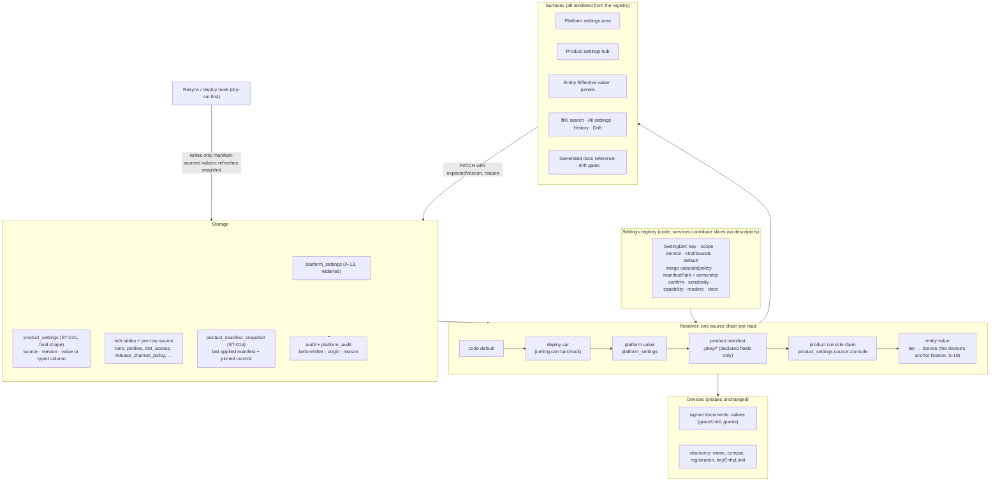

# S-18: Settings architecture (platform, product and service settings)

> Research note for [Godot on Polaris Key](../README.md), 2026-10-04. Spike S-18, commissioned by
> the lead on the owner's direction of 2026-10-04: "take a long hard look at the way we have set up
> settings … per-service, program and platform-wide settings. Ensure we can configure everything
> and more, and make this entire experience as thorough as possible." It has no program brief yet;
> §6 proposes an `ST-` work-package namespace. Research and design only: no product code changed,
> nothing was deployed, and no account or credential was used. File references are to the tree at
> `e8af86ff` (`W/` = `packages/worker/src/`, `M/` = `packages/worker/migrations/`, `A/` =
> `packages/admin/src/`). The effective D1 schema was read by applying all 89 migrations to a
> scratch SQLite file [M]. The console was captured at 1440 px and 390 px in both themes (156
> screenshots, 39 surfaces) through a route-mocked `vite preview` of the built admin under the
> Worker's CSP [M]; the harness lived in a scratch directory and is not committed. Comparable
> platforms were read from their public documentation (§3.2, sources in §9). The companion
> question in the same owner message, the licence and entitlement model, is answered by the
> companion spike **S-19** (`notes/S-19-licensing-model.md`, branch `wp/S-19-licensing-model`);
> §5.3 lists every settings decision that depends on it and how this design changes under each
> outcome. Revised the same day after a critique: the migration now rests on a manifest snapshot
> that ST-01a creates, because `product_sync_state` holds none (§4.14); the backfill rule, the
> system product's ownership, the discovery wire channel, the seed list and the WP table were
> corrected. No production database was read: live D1 values for `djdl` and `polaris-key` are
> marked [U] and ST-01c reads them in the operator-reviewed dry run.

> **Owner decisions (2026-10-04). These govern the note; where any section below says otherwise,
> these win.** Work packages are registered as `ST-*` in
> [`program/workpackages.json`](../program/workpackages.json), one brief each under
> [`program/wp/`](../program/wp/).
>
> 1. **D2 accepted: model C.** A console edit to a claimable setting claims the field
>    (`source = 'console'`); **Revert** deletes the claim and returns the field to the manifest
>    value (§4.5). `admin_group` is manifest-only; `web.origins` is claimable. The system product
>    `polaris-key` is **manifest-authoritative**, on and locked, with expiring **break-glass
>    claims** only (reason required, L2, at most 7 days; §4.5 items 7–8; ST-20).
> 2. **D5 accepted: live inheritance.** Platform values for product settings link live by default,
>    with a fan-out preview and an L2 confirm when products would change (§4.4; ST-16). "Copy
>    settings from product" is a separate one-time template action (ST-23).
> 3. **D19 decided differently: "Revert all console values".** At migration (ST-01c) every
>    manifest-declared field and row of a linked product reverts to its manifest value. There is
>    **no preserve review, no per-product acknowledgement, no pending banner and no 30-day
>    window**. Console-only rows that the manifest does not declare (console-only tiers and
>    profiles, undeclared fields) stay, as `source = 'console'`. The dry-run classification of
>    §4.14.2 steps 1–5 is still produced, but only as a report kept for the record (one audit row
>    per product listing every value that changed), not as a gate. This replaces §4.14.1's
>    "preserve" column, §4.14.2 step 6, §7.1 risk 1's "nothing changes until an operator
>    acknowledges" and §7.3 D19. ST-01c is resized accordingly (about 2 agent-days, down from 3.5).
> 4. **Every other default in §7.3 is accepted as recommended** (D1, D3, D4, D6–D17, D21, D22).
> 5. **D20 is resolved by S-19:** the owner adopted S-19's model OC (S-19 decision 1), so the
>    account is **not** a settings scope; `accountMerge` stays reserved and is not built (§5.3).
>
> Numbering note: this note's §5.3, §6.3 and Appendix A cite S-19's commerce rework as "LX-07"
> and the grace clamp as "LX-08". In S-19's final table (S-19 §9) the commerce rework is
> **LX-11**, the grace clamp **LX-07** and the expand step **LX-08**; the registered packages use
> S-19's numbering.

Evidence labels: **[V]** primary source read raw (repo file at the cited line, or a vendor document
read directly); **[M]** measured here (migrated schema, screenshots, greps with counts); **[I]**
inference; **[U]** unverified (a summary of a vendor page not re-read for this note, or a behaviour
not exercised).

---

## 1. Summary and recommendation

### 1.1 The question

Polaris Key has settings at four scopes: the **platform** (one deployment), the **product** (the
owner's "program"; see decision D1), each **service within a product** (License, Config, Release,
Update, Distribution, Identity and, planned, Cloud Sync), and individual **entities** (a tier, a
licence, an account, a channel, a feed). What should the model for all of them be, so that every
knob is configurable from one coherent experience, nothing is reachable only through SQL or a raw
API call, and the manifest and the console stop fighting?

### 1.2 Short answer

**Today there is no settings model, only settings.** About 30 stores use six precedence patterns
and five ownership vocabularies (§2.3). The one declarative registry, A-13's `PLATFORM_SETTINGS`,
holds four keys and cannot express a product setting (`W/core/platformSettings.ts:51-91`) [V]. The
consequences are concrete:

- **A correctness bug:** a resync silently overwrites the product name, the licence defaults, the
  admin group, tiers, profiles and a console-published catalog, while the console's own resync
  dialog promises the opposite (`W/services/release/resync.ts:300-313,372-396,492,518`;
  `A/console/pages/core/Settings.tsx:352`) [V] (§2.1).
- **Settings with no home:** two are SQL-only, seven are API-only, eleven are manifest-only with no
  read-out, and about fifteen product-shaped policies are hard-coded (§2.2).
- **Missing provenance:** product audit rows have no before/after, two thirds of setting stores
  have no optimistic concurrency, and the platform inventory has drifted from `env.ts` by 16 names
  with no gate (§2.4).
- **Planned work multiplies it:** I-04 and U-01 each add a bespoke settings table, a manifest block
  and a platform key that the A-13 registry cannot hold (§2.5).

**Recommendation (option D, §3): one typed settings registry, one resolver, one source vocabulary,
one row component, with the existing rich tables kept as storage behind descriptors.**

1. **A registry with scopes.** Generalise A-13 into a registry that declares every setting once:
   key, scope (`platform | product | service | entity`), owning service, type and bounds, default,
   **merge rule** (`cascade` or `policy`), manifest path and ownership mode, confirm levels per
   direction, sensitivity, capability, readers and docs anchor. Services contribute their slice
   through the descriptor (rule 6), and Core owns the store and the resolver.
2. **One resolver with a source chain.** `code default → deploy var → platform value → product
manifest → product console claim → entity value`, where `policy` entries are clamped by the
   strictest bound above them and a deploy-time ceiling can still hard-lock (A-13's rule, extended
   downward). Every read returns the value **and** the chain that produced it.
3. **Model C, made safe, for customer products; manifest-authoritative for the system product.**
   Keep today's documented rule that an explicit console claim survives a resync
   (`docs/design/ADMIN.md:929-950`, "editing claims it"), apply it to every manifest-ownable field,
   and add a manifest snapshot, a resync dry-run preview, a drift view and "Promote to repo". The
   `polaris-key` system product runs in manifest-authoritative mode by default, with expiring
   break-glass claims only, so the monorepo's root `.pkey/` stays the reproducible source of the
   platform's own product (§4.5 item 8, D2).
4. **One storage contract, created once.** ST-01b creates `product_settings` in its final shape.
   It holds the claim (`source`), version and author for every product-scope key. The value lives
   either in the row itself or, for hot-path keys such as `products.name` and `default_*`, in the
   existing typed column, which stays the permanent storage. No column's values are migrated
   twice. Rich objects (tiers, profiles, access rules, channel policies, outlets, listings) keep
   their tables; new per-row `source` columns use the final vocabulary; existing `*_source`
   columns are mapped by adapters rather than rewritten. Every rich object exposes a descriptor so
   it appears in search, export, drift and history.
5. **One audit shape.** Per-product `audit` gains `before_json`, `after_json`, `origin` and
   `reason`, written in the same batch as the change, and the latest change per setting survives
   the 180-day prune.
6. **One experience.** A Platform settings area and a per-product **settings hub**
   (`#/p/<slug>/settings/<area>`), both rendered from the registry with a `SettingsRow` that says
   _inherited_, _changed_, _locked_, _drifted_, and opens its history. Add an "All settings" table,
   settings search in ⌘K, a platform "Product policies" matrix, and a full read-only constants
   inventory.
7. **Coverage gates, so "configure everything" stays true.** Drift gates tie `Env` ↔ platform
   inventory ↔ `wrangler.toml`, every `*_source` column and every settings-shaped table ↔ registry,
   and registry ↔ generated docs and search index.

**Wire.** Settings already reach devices through two channels, and this design changes neither
shape. The first is values inside signed documents (for example `graceUntil` from
`maxOfflineDays`, `W/core/documents.ts:27-33`) [V]. The second is the unsigned discovery document,
which today publishes `name`, `core.registration` and `core.compat`
(`conformance/transcripts/discovery-capabilities.json`) [V] and, under approved I-04, also
`identity.keyEntryLimit` (`program/plans/I-04.md:57,179`) [V]. The resolver feeds both the
enforcement path and discovery, so they cannot drift (§4.11). No SDK changes in the recommended
phases. The former optional discovery `policy` block (ST-26) is dropped: I-04 delivers the
key-entry limit and S-19's LX-09 delivers licence terms on the wire.

**Size.** The plan is 28 work packages (ST-01a…c, ST-02…ST-25, ST-27), about 99 agent-days (93
without the optional roles package), in six phases. Phase 0 (the snapshot, the resync claim fix
with an operator-reviewed backfill, the inventory gate) can start at once (§6). Only three owner
decisions block phases 0–1 (§7.3, chunk 1).

### 1.3 The model in one picture



---

## 2. Current state and every gap

### 2.1 The resync overwrite (a correctness bug)

The console lets an operator edit these, and every resync rewrites them without a claim guard:

| Field                                  | Console write                                          | Resync write                                                            | Evidence                                   |
| -------------------------------------- | ------------------------------------------------------ | ----------------------------------------------------------------------- | ------------------------------------------ |
| `name`, `admin_group`                  | Core → Settings → General (`PATCH /products/<slug>`)   | `UPDATE products SET name = ?, … admin_group = ?` with no `_source`     | `W/services/release/resync.ts:300-313` [V] |
| Default max offline days, device limit | Core → Settings → License defaults                     | same statement                                                          | same [V]                                   |
| `web_origins_json`                     | none (no console editor)                               | same statement, "manifest-owned with no operator claim" by design       | `resync.ts:300-302` comment [V]            |
| Catalog                                | Config → Catalog editor publishes a new active version | a new version whenever the manifest catalog differs from the active one | `resync.ts:372-396` [V]                    |
| Profiles                               | Config → Profiles (create, edit, delete)               | `DELETE FROM profiles WHERE product = ?` then re-insert                 | `resync.ts:492` [V]                        |
| Tiers                                  | License → Tiers (create, edit, delete)                 | `DELETE FROM tiers WHERE product = ?` then re-insert                    | `resync.ts:518` [V]                        |

By contrast the compatibility window, which sits in the same statement block, is guarded by
`WHERE … COALESCE(compat_source, 'manifest') = 'manifest'` (`resync.ts:317-321`) [V]. The resync
confirm dialog says "Services, catalog, tiers, profiles, channels and update settings follow the
manifest, **except values set in the console**" (`A/console/pages/core/Settings.tsx:352`) [V],
which is false for the six rows above. ADMIN.md's T4 template promises a SourceBadge and "Revert
to manifest" in each section header (`docs/design/ADMIN.md:520-551`) [V], and §5.10 says a
manifest-owned block is "editable; editing claims it" (`ADMIN.md:929-950`) [V]. Core → Settings
has neither badge nor claim.

The licence defaults matter on the wire path: `license.max_offline_days ??
product.defaultMaxOfflineDays` sets `graceUntil` in every licence and config document
(`W/services/license/document.ts:137`, `W/services/config/document.ts:105`) [V], and
`defaultDeviceLimit` feeds the activation gate (`W/core/authz.ts:242`) [V]. A silent revert of
either changes what devices are allowed to do, with no audit row for the revert (resync writes one
`product_sync_state` row, not per-field audit) [V].

Three further facts shape the fix [V]:

- **No manifest snapshot exists.** `product_sync_state` (`M/0005_product_sync_state.sql`) stores
  `source`, `status`, timestamps, `commit_sha`, `changed_paths_json`, `updated_json`,
  `errors_json` and `message`, and no later migration adds a column. Nothing in D1 records what
  manifest was last applied, so neither "revert to manifest at once" nor a drift view nor a
  backfill comparison can be computed from the database today.
- **`commit_sha` is not the applied commit.** The webhook resyncs on a push to _any_ branch that
  touches `.pkey/` (`W/githubWebhook.ts:297-318`, a structural `refs/heads/` gate only), while
  `resyncRepo` deliberately fetches the default branch with no ref (R6-05,
  `resync.ts:99-116`). It then records `payload.after`, the pushed branch's head, as
  `commit_sha` (`githubWebhook.ts:357-366`). A manual resync records `NULL`
  (`W/services/release/admin.ts:288-310`). So `commit_sha` can name a feature-branch commit whose
  `.pkey/` was never applied, and the backfill must not treat it as the last applied manifest.
  The default-branch files are also fetched one Contents call per document with no pinned ref
  (`resync.ts:81-92,191-203`), so a push landing between calls can mix two commits [I].
- **A refused resync is half-applied.** The tier and profile guards refuse a resync when a
  console-created row that the manifest omits is still referenced by a licence
  (`resync.ts:480-490,506-516`). That check runs _after_ the un-batched product-row and services
  writes at `:302-370`, so those fields are already overwritten when the resync fails. An
  unreferenced console-created tier or profile is deleted silently.

**The system product is a different path.** `linkSystemProduct` runs on every production deploy
with the root `.pkey/` that `deploy.yml` sends in the hook body (`W/platformDeploy.ts:200-240`;
`W/admin/systemProduct.ts:16-23`) [V]. It writes only `release_config`'s manifest-owned columns,
the deliverables, the trusted publisher (unless claimed) and each enabled service's ingest rows.
It never writes `name`, the licence defaults, `admin_group`, tiers, profiles or the catalog
(`systemProduct.ts:226-239`) [V]. Once linked, however, the row has `release_source = 'github'`
and repository coordinates, so a GitHub push webhook for the monorepo would also reach it through
`listProductsByGithubRepo` and `resyncRepo`. Neither path checks for the reserved slug
(`W/repo.ts:313-329`) [V]. Whether that happens depends on whether the GitHub App is installed on
the monorepo, which this spike did not check [U]. If it is, the full resync writes
`admin_group = 'admin'`, the parser default (`shared-manifest/src/index.ts:4092`), over the
bootstrap's `NULL` (`systemProduct.ts:118`). That is the only clobberable field whose
bootstrap and manifest values differ [V/I].

### 2.2 Settings with no proper home

**SQL only, unaudited** [V]:

- per-product lazy-delta opt-in, `hot_devices`, `daily_cap` (`lazy_delta_settings`, `M/0051`; the
  runbook's `wrangler d1 execute INSERT` at `docs/RUNBOOK.md:816`; readers only
  `W/core/deltaDemand.ts:165,194`);
- per-product email daily cap (`email_product_caps`, `M/0066`; `docs/RUNBOOK.md:755`;
  `setProductDailyEmailCap` at `W/core/emailDelivery.ts:133` has no caller).

**API only** (a Worker route, no console control) [V]:

| Setting                                          | Route                                                                             | Console today                                                                         |
| ------------------------------------------------ | --------------------------------------------------------------------------------- | ------------------------------------------------------------------------------------- |
| Device trust policy (App Attest, Play Integrity) | `GET/PUT/DELETE …/trust-policy` (`W/admin/api.ts:236`)                            | nothing references it                                                                 |
| Auto-issue (enabled, tier, mode, rate)           | `PUT …/license/policy` `autoIssue` (`W/services/license/admin/policy.ts:122-142`) | Enrollment can only revert it; Sign-in links to it (`SignIn.tsx:343-350`), a dead end |
| Commerce settings, store-product → flag map      | `PUT …/distribution/commerce/{settings,products}`                                 | "No App Store products are mapped", no way to map (`CommercePage.tsx:309-314`)        |
| Storefront listing model                         | `…/distribution/listing[/overrides,/release-notes,/import]`                       | none, although the docs say "you edit it in the console"                              |
| Platform store credentials and settings          | `PUT/DELETE /platform/store-connections/<store>/…`                                | read-only DescriptionList (`pages/platformStores.tsx:700-730`)                        |
| Portal branding                                  | `services/identity/admin.ts:78`, any JSON accepted unvalidated                    | read-only JSON                                                                        |
| Fingerprint probe list                           | `…/license/policy`                                                                | read-only table, by design                                                            |

**Manifest only, no read-out or no override** [V]: OIDC provider, issuer, client and
`groupRoleMap` (deleted and re-inserted, `resync.ts:463-479`; Sign-in is read-only by design,
`SignIn.tsx:2-5`); provisioning hooks (`resync.ts:539`); edge-mint recipe fields (`resync.ts:547`;
approve and revoke only); `web.origins` (not visible anywhere, yet load-bearing for S-16's web
redirect and S-17's browser principal); `releaseKeys`; the release GitHub block; outlet identities,
listings, Homebrew, Scoop and App Installer settings (only `capabilities` narrows); secret names.

**Hard-coded product-shaped policy** [V]: seat dormancy 90 days (`W/repo.ts:1106`); device-token
record TTL 30 days (`W/kv.ts:69`); blob GC keeps the newest 3 releases (`W/core/blobGc.ts:153`);
appcast depth 3 and Velopack depth 10 (`W/services/update/updaterFeeds.ts:117,124`); live
lookback 16 (`W/services/update/compose.ts:91`); registry-token defaults and caps 90/30/365 days and
10/500 tokens (`W/core/registryVocabulary.ts:35-42`); portal "expires soon" 14 days and download
history 10 (`portal/library.ts:51`, `portal/downloads.ts:79`); portal and identity browser sessions
14 and 30 days (`portal/session.ts:12`, `browserSession.ts:74`); bundle import window 30 days and
max grace 365 (`W/core/bundles.ts:98,117`); ASC expiry warning 30 days
(`W/core/ascProvisioning.ts:324`); lazy-delta hot window 7 days (`W/core/deltaDemand.ts:52`).

**Missing surfaces entirely** [V]: per-product authorization (`products.admin_group` grants
nothing; `W/admin/authz.ts:18-33` reads only `PLATFORM_ADMIN_GROUP`); a product disable or
maintenance switch (the `status` column allows `disabled`, no route sets it); operator alert
destinations (auto-halt and store alerts reach only audit; ST-27); developer webhooks (I-04 Q8:
pull feed now, push later); settings export, import or diff; a
per-product effective-configuration view; settings search (⌘K indexes pages, not settings).

### 2.3 Six precedence patterns, five vocabularies

| #   | Pattern                                    | Where                                                                               | Evidence                                               |
| --- | ------------------------------------------ | ----------------------------------------------------------------------------------- | ------------------------------------------------------ |
| 1   | A-13 runtime / ceiling                     | the four platform keys                                                              | `W/core/platformSettings.ts:368-398` [V]               |
| 2   | Console > env; product explicit > platform | platform store settings and credentials                                             | `W/core/platformStoreSettings.ts:7-11` [V]             |
| 3   | Product row > var > code                   | email cap (the platform default is a deploy var outside A-13)                       | `W/core/emailDelivery.ts:107-125` [V]                  |
| 4   | Platform switch ∧ product value            | lazy deltas (no platform default for `hot_devices`), registry size ceiling          | `W/core/deltaDemand.ts:50,57` [V]                      |
| 5   | Manifest vs operator                       | (a) claim + revert; (b) narrow-only; (c) unconditional overwrite; (d) operator-only | §2.1, inventory [V]                                    |
| 6   | Payload layers                             | catalog default → tier(profile) → licence → device; then local/env on the client    | `W/merge.ts:1-2`; `client-core/src/config.ts:1-48` [V] |

Ownership markers disagree in type and spelling [M]: `services_source`, `compat_source` and
`access_source` are nullable TEXT where NULL means manifest; `trust_policy_source` is
`default|admin`; `fingerprint_policy_source` is NOT NULL default `manifest`; `dist_listings.source`
is `admin|import`; `dist_store_products.source` is CHECK-constrained to `admin`; store settings
report `console|env`. `SourceBadge` has five values, two of which (`admin`, `runtime`) render the
same label. Portal shows a "Defaults" pill instead; Core Settings, Health and Feeds show nothing.

### 2.4 Provenance, concurrency and drift

- **Audit.** `platform_audit` stores `before_json`/`after_json` (`M/0054_b`) [V]. The per-product
  `audit` table (`M/0001_init.sql:180-195`) and `portal_audit` store only a free-text summary [V];
  for example `portal.settings.update` records "Updated portal settings for <slug>"
  (`W/services/identity/admin.ts:84-92`) [V]. All three are pruned at 180 days
  (`W/scheduled.ts:92`) [V], so a long-lived setting loses its history.
- **"Last changed by"** exists on some tables (platform settings, connector settings, registry,
  tiers, profiles, licences, CI publishers, listings, rollouts) and not others (`products`,
  `release_config`, `portal_product_settings`, `oidc_config`, `lazy_delta_settings`,
  `email_product_caps`) [M].
- **Optimistic concurrency** (`expectedVersion`) exists on three stores: `platform_settings`,
  `dist_registry_policy`, `dist_registry_feeds` [V]. Everything else is last-writer-wins, which
  ADMIN.md already records for the catalog (A-6) [V].
- **Inventory drift.** `GET /platform/settings` lists 17 vars and 13 secrets from hand-kept lists
  (`W/admin/handlers/platformSettings.ts:101-178`) [V]. Missing [M]: `PKG_ORIGIN`,
  `EMAIL_SENDER_ADDRESS`, `EMAIL_PRODUCT_DAILY_CAP`, `EMAIL_APPLE_RELAY`, `REGISTRY_TOKEN_KEY`,
  `REGISTRY_TOKEN_KEY_PREVIOUS`, `PLATFORM_REPOSITORY`, `_ID`, `_OWNER_ID`,
  `PLATFORM_DEPLOY_ENVIRONMENT`, `PLATFORM_APPLE_TEAM_ID` and the five `PLATFORM_*` store secrets,
  all declared in `W/env.ts`. The required-secrets comment at `wrangler.toml:382-398` omits
  `REGISTRY_TOKEN_KEY` and the store secrets. Platform → Settings shows 5 code constants of the
  roughly 40 that S-13 §5.3 lists. No test ties any of these together.
- **Environments.** Every runtime store is per D1, so per Cloudflare environment. The three
  `[vars]` blocks are hand-duplicated with no drift check (`EMAIL_SENDER_ADDRESS` is set in staging
  only) [V]; staging and dev still carry `REPLACE_ME_*` ids (`wrangler.toml:248,252,315,319`) [V].
  A product has no staging/production split; commerce tells operators to use a separate staging
  product (`commerce/settings.ts` header) [V].

### 2.5 Duplicates, and what planned work adds

| Concept            | Stores today                                                                                                                                                                                                               |
| ------------------ | -------------------------------------------------------------------------------------------------------------------------------------------------------------------------------------------------------------------------- |
| Branding           | `products.branding_json` (NULL at every insert, read by the portal), `portal_product_settings.branding_json` (unvalidated), `dist_listings` name/tint                                                                      |
| Claim by key       | `portal_product_settings.claim_by_key` (`M/0064:24`), and I-04 plans `identity.claimByKey` in a second table                                                                                                               |
| Version window     | `products.compat_*` (editable only under Update, though License uses it), `tiers.min/max_version`, `licenses.min/max_version`, channel floors                                                                              |
| Access mode        | `release_config.metadata_access`, legacy `artifacts_access` (still written, `resync.ts:451`, and read, `services/release/config.ts:194`), `dist_access.mode`, `dist_registry_feeds.access_mode`, portal `releases_enabled` |
| Apple Team ID      | trust policy `appAttest.teamId` > `platform_store_settings` > `PLATFORM_APPLE_TEAM_ID`                                                                                                                                     |
| Manifest spellings | `defaultDeviceLimit` vs `licensing.defaultDeviceLimit`; `tiers` vs `licensing.tiers`; `profiles` vs `licensing.profiles`; `edgeMint` in both product and release schemas (`shared-manifest/src/index.ts:2115-2117`)        |

Planned [V]:

- **I-04** adds `identity_product_settings` (PK `product`; `keyEntryLimit`, `claimByKey`,
  `native`, `requireTerms`, `redirectPaths`) written from a new manifest `identity:` block, and a
  platform key `identity.keyEntryRefusals` (`program/plans/I-04.md:206-220,315,388`). It does not
  say whether the block is manifest-only or claimable. The key does not fit A-13's closed key union
  or its single `area: "background-jobs"` (`platformSettings.ts:51-55,74`).
- **U-01** adds `sync_product_settings` (ceilings 50 GiB, 100k users, 2,000 pushes/s,
  `updated_by`), manifest `cloudSync.*` limits, and validator constants in `shared-catalog`
  (`git show wp/U-01-cloud-sync-plan:…/plans/U-01.md`, lines 407, 449-458).
- **PX-W3** adds no settings and no manifest change (`…/plans/PX-W3.md`, §3).
- **S-16** removes the licence config-override layer in favour of account overrides
  (`notes/S-16-identity-service.md:163`), which changes payload layer 6 above.

Without a model, the next quarter adds two more per-service tables, a third manifest-vs-operator
variant and a second platform naming scheme [I].

### 2.6 UX audit (from the captures)

[M], 156 screenshots. The findings that shape the design:

1. **Scattered:** "settings" spans about 25 pages in 9 sidebar groups. Package feeds alone have
   three homes (on/off in Core → Services, per-feed in Distribution → Package feeds, the platform
   ceiling as the last card of the platform's _own_ npm feed tab). The registration policy is
   edited in Services, mirrored in Enrollment and summarised in Edge mint.
2. **Hidden when it should not be:** Portal settings live in the Identity group, and the sidebar
   drops a disabled service's whole group (`A/console/shell/Sidebar.tsx:89-91`) [V], although the
   portal runs either way. The compatibility window disappears with Update, though License uses it.
3. **No search:** nothing answers "where do I set the device limit?" The same field exists as a
   product default, a tier policy and a licence override; only the licence record shows an
   "Effective policy" box.
4. **Inconsistent save model:** per row (Platform Settings), per page (Portal), inline in a
   dashboard (Auto-halt in Health, "Reset to defaults" as a text link), per tab (feeds). Confirm
   levels are declared only in the platform registry; product pages choose friction ad hoc.
5. **Template drift:** Portal passes `sections={[]}` (no rail despite five sections); Access has no
   rail or descriptions. Health's auto-halt shows a raw subject ("Saved by u1").
6. **Copy errors:** Sign-in calls `PLATFORM_OIDC_ISSUER` a secret; "Entitled" means three different
   things on App Access, pack Access and Feeds.
7. **Phone:** Platform Settings is 11,316 px tall with no rail and no collapsing; 15 env-var names
   wrap mid-token. No horizontal overflow beyond long deploy values.
8. Two captures failed for fixture reasons, not product bugs: the licence-record Config tab
   dereferences `entry.schema` (`A/schema/entry.ts:132`) when a fixture omits it, and the
   compatibility page had no fixture.

---

## 3. Options

### 3.1 The four options

- **A. Fix in place.** Fix the resync bug, add the missing routes and pages one by one, keep
  bespoke tables and patterns. Cheapest; repeats the cause.
- **B. One generic key-value store for everything.** Every setting, scalar or rich, becomes a row in
  one `settings` table addressed by key and scope. Uniform, but rich objects (access rules, channel
  policies, outlets, tiers with referential integrity) lose their constraints, joins and
  service ownership, breaking rule 6 and every existing reader.
- **C. Manifest-authoritative ("code always wins").** Everything manifest-ownable is read-only in
  the console on linked products; the console edits only operator-only settings. Simple and
  GitOps-pure, but an incident fix then needs a commit and a resync, and it contradicts the
  documented model (`ADMIN.md:929-950`) and the existing claim columns.
- **D. Registry + resolver + descriptors (recommended).** A declarative registry for every setting;
  scalars in one versioned store; rich objects stay in their tables behind a descriptor with a
  uniform `source` column; one resolver, audit shape and UI. Model C (claim survives) for
  ownership, with a dry-run, drift and promote loop; a per-product opt-in to manifest-authoritative
  mode for teams that want it.

### 3.2 What comparable platforms do

[U] unless marked; sources in §9.

| Platform               | Scopes                                 | Merge rule                                                       | Code vs dashboard                                                 | Lesson for Polaris                                           |
| ---------------------- | -------------------------------------- | ---------------------------------------------------------------- | ----------------------------------------------------------------- | ------------------------------------------------------------ |
| GitHub                 | enterprise → org → repo                | higher levels **enforce** or **delegate**; rulesets only tighten | API/Terraform                                                     | declare per setting whether a higher scope defaults or locks |
| Sentry                 | org → project                          | org scrubbing on → applies to every project, locked              | API                                                               | grey out, name the enforcing scope                           |
| LaunchDarkly           | account → project → environment → flag | strictest approval wins; per-env targeting                       | Terraform/API                                                     | compare and copy across environments; change history         |
| Vercel                 | team → project → environment           | shared variables link live into projects                         | `vercel.json` wins for declared fields, per-field override toggle | linked vs copied; sensitive values write-only                |
| Cloudflare / Wrangler  | account → zone → hostname rules        | account rules first; exceptions at their own level               | Wrangler overwrites dashboard vars on deploy (`keep_vars` caveat) | silent overwrite is a known incident class                   |
| Supabase               | org → project → branch                 | —                                                                | `config push` writes declared fields only, with diff and confirm  | dry-run diff; an unchanged template reverted dashboards      |
| Auth0 Deploy CLI       | tenant per env                         | —                                                                | export/import YAML, keyword replacement, deletes off by default   | export/promote between environments                          |
| Doppler                | project → env root → branch config     | root propagates except overridden keys; **promote** to root      | CLI/API                                                           | "promote to repo" analogue                                   |
| Argo CD / Terraform    | —                                      | —                                                                | `ignoreDifferences` for live-owned fields; drift as a state       | drift is a first-class status; self-heal undoes fixes        |
| Firebase Remote Config | project → template → parameter         | first matching condition                                         | template versions; rollback publishes a new version               | restore writes new rows, never rewrites history              |
| Steamworks             | partner → app                          | —                                                                | staged edits, "View diffs", publish                               | stage only where atomicity matters                           |
| VS Code                | default → user → workspace             | nearest wins                                                     | settings JSON and UI share one store                              | modified marker, `@modified` filter, schema registry         |

Two merge rules recur: **cascading defaults (nearest scope wins)** and **constraining policies
(strictest or locked scope wins)**. Polaris already has both, as A-13's `runtime` and `ceiling`,
but only for four platform keys [V].

### 3.3 Comparison

| Criterion                                                | A. Fix in place           | B. Generic KV   | C. Manifest-authoritative | D. Registry + descriptors |
| -------------------------------------------------------- | ------------------------- | --------------- | ------------------------- | ------------------------- |
| Fixes the resync bug                                     | yes                       | yes             | yes (by removing edits)   | yes                       |
| Every setting reachable from the console                 | eventually, by hand       | yes             | no (manifest-only grows)  | yes, gated                |
| Can prove coverage (nothing unconfigurable)              | no                        | partly          | no                        | yes (coverage gates)      |
| Keeps rule 6 service ownership                           | yes                       | no              | yes                       | yes (descriptors)         |
| Keeps rich-object integrity (FKs, joins)                 | yes                       | no              | yes                       | yes                       |
| Incident fix without a commit                            | partly                    | yes             | no                        | yes                       |
| One history and audit shape                              | no                        | yes             | no                        | yes                       |
| Search, export, diff, effective view                     | no                        | yes             | partial                   | yes                       |
| Absorbs I-04 / U-01 / S-16 settings without new patterns | no                        | yes             | partly                    | yes                       |
| Wire impact                                              | none                      | none            | none                      | none in phases 0–5        |
| Migration cost                                           | low                       | very high       | medium                    | medium (incremental)      |
| Rough size                                               | ~30 agent-days, recurring | ~130 agent-days | ~30 agent-days            | ~99 agent-days            |

**D is recommended.** It is A-13's proven pattern (registry, per-row save, `expectedVersion`,
before/after audit, source badges, ceiling locks) extended to the scopes that need it, and it can
land incrementally: each phase is useful on its own, and phase 0 is option A's bug fix.

---

## 4. The recommended design

### 4.1 Scopes and vocabulary

| Scope        | Means                                                                         | Store                                                                                                                   | Who writes                                |
| ------------ | ----------------------------------------------------------------------------- | ----------------------------------------------------------------------------------------------------------------------- | ----------------------------------------- |
| **deploy**   | `[vars]` and secrets of one Cloudflare environment                            | `wrangler.toml`, `wrangler secret put`                                                                                  | repo + deploy token                       |
| **platform** | one deployment (instance-wide runtime values, and defaults for every product) | `platform_settings` (widened), `platform_store_settings`, …                                                             | platform admin                            |
| **product**  | one product (the owner's "program", D1)                                       | `product_settings` (new) and rich tables                                                                                | manifest (declared fields), product admin |
| **service**  | a service's settings within one product                                       | same as product, keyed `<service>.*`; visible only when the service is on, or when the descriptor says `visibleWhenOff` | same                                      |
| **entity**   | a tier, licence, account, channel, feed, outlet or pack                       | the entity's own table                                                                                                  | console, API, manifest (tiers)            |

A setting is addressed as `<service>.<group>.<name>` (for example `license.defaults.deviceLimit`,
`identity.keyEntry.limit`, `cloudSync.ceiling.bytes`, `core.web.origins`, `platform.email.sender`).
The existing four platform keys keep their SCREAMING_CASE names as **aliases** so `[vars]`, audit
history and docs links keep working (`LAZY_DELTAS` ⇄ `deltas.lazy.mode`) [I].

"Service" is a namespace, not a separate store: a service setting is a product-scope setting whose
owner is a service. This matches the code, where each service's settings are already per product
[V], and avoids a fifth storage level.

**Not settings** (kept structurally separate, §4.12): customer config catalog keys, flags and
secrets delivered to SDKs (Config service); entitlements (licence and tier data); end-user account
preferences in the customer portal (PORTAL.md §4.26, §4.30).

### 4.2 The registry

Location: `W/core/settings/registry.ts` (Core-owned types and resolver) with one slice per service
under each service's own directory, registered through the service descriptor
(`W/core/hooks.ts`), so `test/boundaries.test.ts` (rule 6) holds. Platform entries move from
`W/core/platformSettings.ts` into `W/core/settings/platform.ts`; the old module re-exports for one
release.

```ts
// W/core/settings/types.ts (proposed)
export type Scope = "platform" | "product" | "entity";
export type Merge = "cascade" | "policy"; // nearest wins | strictest bound wins (or locked)
export type Ownership =
  | "operator" //      console/API only; no manifest path
  | "manifest" //      manifest only; console shows a read-out with "edit in .pkey/…"
  | "claimable" //     manifest seeds it; a console write claims it; Revert returns it (model C)
  | "narrow-only"; //  manifest sets it; console may only narrow (outlet capabilities today)
export type Source =
  | "default"
  | "deploy"
  | "platform"
  | "manifest"
  | "console"
  | "derived";
export type ConfirmLevel = "L0" | "L1" | "L2" | "L3"; // ADMIN.md §5.2

export interface SettingDef<T = unknown> {
  key: string; //                     "license.defaults.deviceLimit"
  aliases?: string[]; //              ["LAZY_DELTAS"]
  scope: Scope;
  entity?:
    | "tier"
    | "license"
    | "account"
    | "channel"
    | "feed"
    | "outlet"
    | "pack";
  service: ServiceId | "core" | "platform";
  area: string; //                    hub section, e.g. "license.policy"
  label: string;
  description: string;
  keywords?: string[]; //             search synonyms
  docs: string; //                    docs anchor; drift-gated
  value: ValueSpec<T>; //             switch | integer(unit,min,max) | enum | string(pattern) |
  //                                  duration | list(of,max) | json(schema ref)
  defaultValue: T;
  merge: Merge;
  inherits?: "platform"; //           product value inherits a platform value of the same key
  // For merge: "policy". Names the side a higher scope bounds: "max" when a larger value is more
  // permissive (offline days, device limit, key-entry limit, Cloud Sync ceilings, session days);
  // "min" only when a smaller value is more permissive (none today); "lock" = enforced value.
  policyBound?: "min" | "max" | "lock";
  allowUnset?: boolean; //            false: the value can never be null/"unlimited" (key-entry limit)
  // Reserved, not built: how an account × product would aggregate a per-licence value. S-19's
  // recommended model (anchor licence carries seats and terms) needs none; see §5.3.
  accountMerge?: never;
  varName?: string; //                deploy var read at the deploy step, if any
  precedence?: "runtime" | "ceiling"; // A-13 semantics for the deploy step
  manifest?: { path: string; ownership: Ownership };
  confirm:
    | { up: ConfirmLevel; down: ConfirmLevel }
    | { on: ConfirmLevel; off: ConfirmLevel };
  critical?: boolean; //              reason required on write
  sensitivity: "config" | "secret"; // secret: presence only, never a value
  capability: string; //              "settings.product.license.write"
  visibleWhen?: {
    service?: ServiceId;
    offBehaviour: "hide" | "readOnly" | "visible";
  };
  readers: string[]; //               "W/services/license/document.ts", "deltas"
  storage: { kind: "scalar" } | { kind: "rich"; adapter: string }; // rich: descriptor adapter
  since: string;
  deprecated?: { replacedBy: string };
}
```

**Registry rules** (enforced by `test/settings-registry.test.ts`) [I]:

1. **The AT-2 deny-list carries over** (`notes/S-13-platform-settings.md:487-508`): no entry may
   declare an origin, the privilege root, the admin IdP, a security gate, key material, a session
   TTL that lengthens, a rate limit, retention, or a bucket name at **platform** scope. The test
   keeps S-13's name list and adds categories.
2. **A product-scope analogue:** a security-widening product setting (web origins, OIDC issuer,
   trust policy, redirect paths, `groupRoleMap`, access modes) must be `critical: true`, may never
   `inherits: "platform"` (one platform write must not widen every product), and its widening
   direction must be at least L1.
3. Sessions are **shorten-only**: a product may lower the portal or identity browser session, never
   raise it above the code constant (`policyBound: "max"` at the constant).
4. Every `policy` entry declares its bound, and the bound must sit on the permissive side: an
   entry whose larger values widen access may only declare `max` or `lock` (the test carries a
   per-entry `widensWhen: "higher" | "lower"` and refuses a mismatch). Every `claimable` entry
   declares a manifest path that exists in `shared-manifest`'s schema (parity test, §4.13).
   Where a manifest validator already bounds a field (I-04's `invalid_identity_key_entry_limit`,
   1–100), the registry imports the same constants, so the two cannot disagree.
5. Adding an entry is a THREAT-MODEL §9 review trigger, as it is today for A-13
   (`docs/security/THREAT-MODEL.md:4445`) [V].

**Seed list.** Appendix A lists every setting found, with its target key, scope, owner, merge,
ownership mode, store and home. It covers every top-level field of the four manifest schemas,
checked field by field against `shared-manifest/schemas/v1/*.schema.json` [V]. It also covers the
per-product settings planned by S-16, I-04 and S-19, and an explicit **NOT_A_SETTING** list (A.4)
for things that look configurable but are fixed on purpose. It comes to roughly 170 entries once
multi-key rows are expanded [I]. "Configure everything" is shown when ST-06's coverage test passes
with an empty allow-list. That test checks every `*_source` column, every settings-shaped table,
every `env.*` read and every manifest field that persists (§4.13).

### 4.3 Storage

**Scalars.** One Core-owned table beside the existing platform store, created **in its final
shape by ST-01b** (phase 0), so no later package re-migrates the keys it already holds:

```sql
-- M/00xx_product_settings.sql (proposed; ST-01b, final shape)
CREATE TABLE IF NOT EXISTS product_settings (
  product     TEXT NOT NULL REFERENCES products(slug) ON DELETE CASCADE,
  key         TEXT NOT NULL,          -- registry key; unknown keys are ignored on read
  value_json  TEXT NULL,              -- NULL: the value lives in the key's typed column (below)
  source      TEXT NOT NULL CHECK (source IN ('manifest','console')),
  version     INTEGER NOT NULL DEFAULT 1,
  updated_at  INTEGER NOT NULL,
  updated_by  TEXT NOT NULL,          -- admin subject, 'resync', 'deploy', 'system'
  reason      TEXT NULL,              -- required for critical keys and break-glass claims
  expires_at  INTEGER NULL,           -- break-glass claims only (manifest-authoritative mode)
  PRIMARY KEY (product, key)
);
```

- **Two storage kinds, one row shape.** A _row-backed_ key keeps its value in `value_json`. A
  _column-backed_ key keeps its value in an existing typed column and uses the row only for
  `source`, `version`, author, reason and expiry. The column-backed keys are those read on device
  hot paths: `core.name`, `license.defaults.maxOfflineDays`, `license.defaults.deviceLimit`,
  `core.web.origins` and `config.catalog` (claim only; the value is the active `product_schema`).
  Column-backed is **permanent**, not an interim adapter. Those columns are never migrated, so the
  hot path keeps reading `products.*` exactly as today.
- **Absence means inherit** for operator keys (platform value, deploy var, code default) and
  **manifest** for claimable keys. "Reset to inherited" and "Revert to manifest" both delete the
  row. "Set to the same value" keeps one. The distinction is shown (§4.9).
- `platform_settings` is unchanged in shape. Its key column now accepts any platform-scope
  registry key, because it has no CHECK (`M/0056`) [V].
- **Values moved exactly once.** Columns whose value moves into `value_json` are each moved in one
  package and never touched again: `lazy_delta_settings.*` and `email_product_caps.*` (ST-11),
  `portal_product_settings.*` (ST-14), and `release_config.operator_policy_json` (ST-11). No
  column that ST-01b claims is moved later. Rich objects never move. Until a column's package
  lands, the registry reads it through a column adapter. That adapter is the same mechanism as the
  permanent column-backed keys, so it is not throwaway work.

**Manifest snapshot** (ST-01a, phase 0). Revert, drift and the backfill all need the last applied
manifest, and nothing stores it today (§2.1):

```sql
-- M/00xx_product_manifest_snapshot.sql (proposed; ST-01a)
CREATE TABLE IF NOT EXISTS product_manifest_snapshot (
  product        TEXT PRIMARY KEY REFERENCES products(slug) ON DELETE CASCADE,
  applied_sha    TEXT NULL,      -- the commit the files were fetched AT (pinned), NULL for legacy
  applied_at     INTEGER NOT NULL,
  origin         TEXT NOT NULL CHECK (origin IN ('resync','link','deploy-hook','backfill')),
  files_sha256   TEXT NOT NULL,  -- over the raw documents, for change detection
  manifest_json  TEXT NOT NULL   -- the normalised ParsedManifest that was applied (no secrets:
                                 -- manifests carry secret NAMES only)
);
```

- **Written in the same batch as the apply** by `resyncRepo`, `linkRepo` and `linkSystemProduct`.
  One row per product, latest only; history lives in the per-field audit rows (§4.6).
- **Size.** Each document is capped at `MAX_REPO_FILE_BYTES` (`W/services/release/github.ts:442`,
  twice `MAX_MANIFEST_BYTES`) [V]. The four documents therefore fit within D1's row limit [U: D1's
  2 MB value limit not re-read]. ST-01a asserts it in a test with four maximum-size documents.
- **Pinned commit.** ST-01a changes the fetch to resolve the default branch's head once
  (`GET /repos/{o}/{r}` then `GET /repos/{o}/{r}/commits/{branch}`, both resolved by GitHub from
  the DB-configured repo), then fetch every document `?ref=<that sha>`. This keeps R6-05's
  property: nothing caller-supplied chooses the content. It also removes the mixed-commit window
  and gives a trustworthy `applied_sha`. `product_sync_state.commit_sha` keeps its meaning (the
  push that triggered the sync) and the console relabels it "Triggered by push <sha>". The deploy
  hook records `PKEY_GIT_SHA` (`W/env.ts:109-110`) as `applied_sha`.

**Rich objects** keep their tables, because they carry foreign keys, ordering and service
ownership: `tiers`, `profiles`, `product_schema`, `dist_access`, `dist_outlets`, `dist_transports`,
`release_channel_policy`, `release_channel_floors`, `dist_listings*`, `dist_registry_feeds`,
`dist_store_products`, `oidc_config`, `provisioning_config`, `edge_mint_config`, `ci_publishers`,
`trust_policy_json`. Each gains:

- where it is manifest-ownable and has no marker yet (`tiers`, `profiles`, `edge_mint_config`,
  `oidc_config` later), a per-row
  `source TEXT NOT NULL DEFAULT 'manifest' CHECK (source IN ('manifest','console'))` in the
  **final** vocabulary, added once (ST-01b for tiers and profiles). Where a marker already exists
  (`services_source`, `compat_source`, `access_source`, `fingerprint_policy_source`,
  `auto_issue_source`, `trust_policy_source`, `release_channel_policy.source`, `dist_access.source`,
  `capabilities_source`, `ci_publishers.source`, `dist_listings.source`), the column is **kept
  and mapped by its adapter** (`NULL|manifest|default|import → manifest`, `admin → console`).
  Rewriting it would need a SQLite table rebuild on live tables for no behavioural gain, so it is
  not done. The coverage test holds the mapping table, and no _new_ variant may be added. Operator-only
  objects get no `source` column;
- `version` and `updated_by` where missing;
- a **descriptor adapter** (`read`, `validate`, `diff`, `write`, `revert`, `export`) registered with
  the registry, so search, history, drift, export and the "All settings" table cover it.

**Caching.** The resolver reuses A-13's 30-second per-isolate cache for platform values
(`notes/S-13-platform-settings.md` §6.3) and reads product values per request inside the existing
product fetch (one extra indexed read, batched with the product row) [I]. Hot paths that already
read a typed column keep doing so until their WP migrates them.

### 4.4 Precedence and inheritance

Resolution for one key at one scope:

```
v := def.defaultValue                                  source = default
if def.varName and env[varName] parses:  v := var      source = deploy
if platform row (or product inherits platform row):  v := row   source = platform
if def.scope ∈ {product, entity}:
   if product row source = manifest:  v := row         source = manifest
   if product row source = console:   v := row         source = console
if def.scope = entity and entity value set:  v := it   source = console|manifest (tiers)
if def.merge = policy:
   v := clamp(v, strictest bound from every scope above)   lockedBy = that scope
if def.precedence = ceiling and var = off:  v := off   lockedBy = deploy   (A-13, unchanged)
return { value: v, source, chain: [each step with its value, who, when], lockedBy?, drift? }
```

- **Cascade** entries take the nearest scope that has a value. Platform values are **live links**
  by default (a change propagates to every product without its own row), shown with a fan-out
  count and confirmed at L2 when products would change (D5).
- **Policy** entries clamp on the permissive side only: a platform `max` for offline days, for
  the device limit and for the key-entry limit (a larger limit lets more devices in by key, so the
  platform may cap it below I-04's 100 but never force it up), and the S-17 per-product Cloud Sync
  ceilings above per-user limits. A product write outside the bound is refused with
  `setting_out_of_bounds` and the bounding scope named. A platform write that would put existing
  product values outside the new bound shows those products and does not rewrite them. Their
  effective value is clamped, and the row says "Clamped by Platform: set 30, effective 14".
- **Enforce vs delegate.** For `policy` entries with `policyBound: "lock"`, a platform admin may
  choose "Enforced on all products"; the product row becomes read-only with "Locked by Platform".
  Only entries that declare it offer the choice (GitHub's model) [I].
- **Entity layer.** The licence-policy chain is `product default → tier policy → licence value`,
  which the licence record's "Effective policy" box already shows. Under S-19's recommended model
  the chain is evaluated on the device's **anchor** licence: seats, term and offline window come
  from the anchor only (S-19 §7.3 step 7, §7.5). The account × product combines **entitlements**
  by per-key catalog rules, not settings. So the account is not a settings scope and needs no merge
  rule here. That holds only if the owner adopts S-19's model; §5.3 gives the alternative.
- **Channel axis.** A few entries declare `axes: ["channel"]` (compatibility window, update metadata
  access, rollout defaults); a channel value overrides the product value for that channel only and
  never reaches upward. Deferred to ST-23's follow-up unless the owner wants it sooner (D6).
- **Customer config payloads are not resolved here.** `W/merge.ts` keeps catalog default → profile
  → (S-16: account override) → device. The registry only describes the Config service's _own_
  settings (for example edge-mint approval, catalog publish policy).

### 4.5 Manifest interaction (model C, made safe)

1. **Declared fields only.** A resync writes only fields the manifest declares, and only where the
   current source is `manifest`. An omitted optional field leaves the value alone, except where the
   descriptor says `omitClears: true` (today `web.origins`, `resync.ts:300-302` [V], and, since
   LX-06, the row-backed `licensing.*` settings and `identity.oidc.syncTierOnSignIn`: a setting
   dropped from `.pkey/` loses its manifest row and returns to its default, never touching a
   console claim; lead decision D2, 2026-10-06). ST-04 and ST-05 implement the same rule.
2. **Claim on console write.** A console write to a `claimable` setting sets `source = 'console'`.
   **Revert to manifest** (L1) deletes the claim and re-applies the value from
   `product_manifest_snapshot` (ST-01a) at once, not at the next push. If the product has no
   snapshot yet (linked before ST-01a and not resynced since), Revert deletes the claim and says
   "applies at the next resync"; the button offers "Resync now" beside it [I].
3. **Per row for rich lists.** Tiers and profiles get a per-row `source`; resync upserts
   manifest-sourced rows, leaves console rows alone, and deletes a manifest row only when the
   manifest dropped it and no licence references it (today's guard, `resync.ts:480-490,506-516`)
   [V]. A console row with the same id as a new manifest row is a **conflict** shown in the dry run.
   The catalog is one claimable unit (a console publish claims it). **All checks run before the
   first write**, and the writes go in one `db.batch`. Today the tier and profile refusals run after
   the product-row writes (§2.1), so a refused resync is half-applied. ST-01b moves them ahead.
4. **Dry run first.** `POST …/resync?dryRun=1` returns `{ apply: [...], skipClaimed: [...],
delete: [...], conflicts: [...] }`. The console's Resync confirm (L1) renders it; the webhook
   path applies the same plan and records it in `product_sync_state.plan_json` [I].
5. **Drift is a state.** The product hub shows "N settings differ from `.pkey/`": per row, the
   manifest value, the console value, who claimed it and when, with **Revert to manifest**, **Keep**,
   or **Promote to repo**.
6. **Promote to repo.** Generates a `.pkey/` patch for the selected claims (unified diff, copyable
   and downloadable through the CLI). Opening a PR through the GitHub App is a later option, because
   it needs `contents: write` on the App, a THREAT-MODEL trigger (D13).
7. **Manifest-authoritative mode (D14).** A product setting `core.manifest.authoritative` refuses
   console writes to `claimable` entries ("edit `.pkey/…` instead"), except as a time-boxed
   **break-glass claim**. A break-glass claim needs a reason and is L2. It sets
   `product_settings.expires_at` to the earlier of 7 days or the first apply whose manifest
   _changes that field_. An apply that leaves the field alone does not end the claim, so an
   unrelated push or deploy cannot undo an incident fix. Every resync and deploy summary lists the
   live break-glass claims. Off by default for customer products.
8. **System product: manifest-authoritative by default (D2).** `polaris-key`'s settings come from
   the monorepo's root `.pkey/`, which every production deploy applies with the deployed commit
   (`PKEY_GIT_SHA`). If console claims could survive deploys, a fresh environment built from the
   same commit would differ from production, and the repo would stop describing the platform's
   own product. Therefore:
   - `core.manifest.authoritative` is `true` for any `system = 1` product, locked by a registry
     rule (not by a row an operator can delete);
   - break-glass claims are allowed (incident fixes, for example switching a deliverable's access
     while a fix is committed), and expire as above;
   - `linkSystemProduct` and `resyncRepo` share one plan function, so the deploy hook gets the dry
     run, per-field audit and snapshot like any resync. A webhook resync of `polaris-key` is
     refused with "the system product is applied by the deploy hook" so there is a single writer
     (§2.1);
   - existing claims on it (`services_source = 'admin'` from the bootstrap,
     `systemProduct.ts:150-154`) are **bootstrap-owned**, not operator claims. The bootstrap's
     "a second run leaves an operator's later settings alone" promise covers services and
     `packageFeeds`, which the root `.pkey/` sets (`modules`) but `linkSystemProduct` never
     applies. ST-01c lists these for the operator to keep as break-glass, or drop so the manifest
     applies (§4.14).

### 4.6 Audit, history and concurrency

- **Migration** `audit` adds `before_json`, `after_json`, `origin` (`console | api | resync |
manifest-push | revert | restore | system | ci`), `reason`, `setting_key` (indexed). The same for
  `portal_audit`'s settings actions, which move to `audit` (portal _account_ actions stay in
  `portal_audit`) [I].
- **One write path.** `writeSetting()` validates against the registry, checks the capability,
  compares `expectedVersion`, writes the row and the audit row in one `db.batch`, and invalidates
  the cache, as `platformSettings.ts:470-490` already does for platform keys [V].
- **Resync audits per field.** Each applied change writes an `origin = 'resync'` audit row with
  before/after, so silent changes end.
- **Retention.** Audit stays pruned at 180 days (retention is deny-listed from runtime edits), but
  the prune keeps the **latest** row per `(product, setting_key)` so every current value keeps its
  provenance (D9). An "Export history" action streams NDJSON for longer archives.
- **History and restore.** Per-row and per-section history drawers; "Settings as of <date>"
  reconstructs a scope from audit rows and diffs it against now; **Restore selected** writes new
  rows (`origin = 'restore'`), never rewrites history (Firebase's rule).
- **Concurrency.** Every settings write takes `expectedVersion`; a 409 returns the current value and
  chain so the UI can offer "Reload, keep mine". Rich adapters adopt the same contract.

### 4.7 APIs (admin, narrative-only, rule 10)

All under `/manage/api`, each with an `openapi/polaris-key.v3.yaml` entry (rule 10) and route
coverage. Admin routes are narrative-only, so no corpus or SDK impact [V: AGENTS rule 10].

| Method and path                                                  | Purpose                                                                                    |
| ---------------------------------------------------------------- | ------------------------------------------------------------------------------------------ |
| `GET /settings/registry?scope=&service=`                         | descriptors (labels, kinds, bounds, confirm, capability, docs) for rendering               |
| `GET /platform/settings/effective`                               | every platform entry: value, chain, lockedBy, fan-out counts                               |
| `GET /products/<slug>/settings/effective?area=`                  | every product/service entry: value, chain, lockedBy, drift, last change                    |
| `PATCH /platform/settings/<key>` (exists)                        | unchanged contract, now any platform key                                                   |
| `PATCH /products/<slug>/settings/<key>`                          | `{ value, expectedVersion, reason?, confirm? }`                                            |
| `DELETE /products/<slug>/settings/<key>`                         | reset to inherited (or revert to manifest, for claimable keys); `expectedVersion`          |
| `GET /products/<slug>/settings/history?key=&from=`               | before/after rows                                                                          |
| `GET /products/<slug>/settings/as-of?at=`                        | reconstructed snapshot + diff                                                              |
| `POST /products/<slug>/settings/restore`                         | `{ keys, at }`                                                                             |
| `POST /products/<slug>/resync?dryRun=1`                          | the plan of §4.5                                                                           |
| `POST /products/<slug>/settings/backfill?dryRun=` (ST-01c)       | the one-time ownership review of §4.14.2; without `dryRun`, the L1 acknowledgement         |
| `GET /products/<slug>/manifest/snapshot` (ST-01a)                | the last applied manifest, `applied_sha`, origin                                           |
| `GET /products/<slug>/settings/drift`                            | per-key manifest vs console                                                                |
| `POST /products/<slug>/settings/promote`                         | `.pkey/` patch for selected claims                                                         |
| `GET /products/<slug>/settings/export` · `POST …/import?dryRun=` | registry-shaped JSON (no secrets; schema version), for copy-from-product and env promotion |
| `GET /platform/product-policies`                                 | the matrix of platform-owned per-product limits                                            |

Existing bespoke routes (`…/update/settings`, `…/license/policy`, `…/trust-policy`,
`…/distribution/access`, …) stay as **compatibility aliases** that call the same write path, and
are retired one release after the console stops calling them.

### 4.8 Authorization

- Every registry entry carries a `capability`. One gate, `can(session, capability, scope)`, guards
  every settings write. Today it returns `isPlatformAdmin` for all capabilities
  (`W/admin/authz.ts:18-33`) [V], so behaviour is unchanged; the console's `useCan(action)`
  (ADMIN.md §5.10) reads the same capability names.
- **Roles are a later, separate decision** (D10): a policy table mapping groups to capabilities per
  product (product admin, support read-only, release manager). It changes the admin authorization
  model, a THREAT-MODEL trigger, and must keep `PLATFORM_ADMIN_GROUP` deploy-time (S-13 §8.2).
  Until then `products.admin_group` stays metadata, shown read-only with its SourceBadge.

### 4.9 Console UX

**Principles.** Every value has one owner, one home, one source badge and one history; any other
place that shows it is a read-out with a link (ADMIN.md §5.1 "Set this elsewhere is always a link").
Hide what cannot apply; disable with a reason what applies but is not possible now (§5.10).

**Level 1: Platform** (`#/platform/settings/<area>`):

1. **General**: environment, origins (`CONSOLE_ORIGIN`, `BLOB_ORIGIN`, `PKG_ORIGIN`), GitHub App,
   platform repository and deploy environment (read-only).
2. **Access and identity**: admin group, console and platform OIDC, issuer allowlist (read-only);
   later the S-16 account-layer providers as presence.
3. **Email**: sender (choose among `allowed_sender_addresses`, a new platform runtime entry), Apple
   relay, the default daily cap (promoted from `EMAIL_PRODUCT_DAILY_CAP` to a registry entry).
4. **Background jobs**: the A-13 four, with "N products opted in" for lazy deltas.
5. **Product defaults and policies** (new): every `inherits: "platform"` and `policy` entry, with
   enforce/delegate where allowed and "7 products inherit · 2 override" fan-out.
6. **Product policies matrix** (new): rows are products, columns are platform-owned per-product
   limits (email cap, lazy-delta opt-in and caps, Cloud Sync ceilings, feed size ceilings), with an
   80 % warning state (S-17 §5.7).
7. **Package feeds policy**: moved out of the platform's own npm feed tab.
8. **Store connections**: credential upload and settings editors (today API-only), unified badges.
9. **Keyring and secrets**: as today; every secret by presence, "last rotated" where known.
10. **Limits**: every code constant that acts as policy, generated from code, grouped and
    searchable (about 40, S-13 §5.3) instead of 5.
11. **History**: platform audit with filters and before/after diffs.

Deployment and Operations stay where they are.

**Level 2: Product settings hub** (`#/p/<slug>/settings/<area>`), replacing Core → Settings; the
hub stays visible whatever services are on:

| Area                    | Contents                                                                                                                                                                                      |
| ----------------------- | --------------------------------------------------------------------------------------------------------------------------------------------------------------------------------------------- |
| General                 | name, admin group (read-out), web origins (new editor), manifest mode, repository and resync with dry run, storage, danger zone (delete; disable, D17)                                        |
| Services & registration | toggles, delivery chain, registration policy; mint flags as read-outs                                                                                                                         |
| Keys & CI               | signing keys, product secrets, CI publisher, CI tokens (links into today's pages until moved)                                                                                                 |
| License                 | defaults (offline days, device limit, seat dormancy), fingerprint policy and probes, **auto-issue editor**, key-entry limit, claim by key                                                     |
| Config                  | catalog publish policy and link, profiles, edge-mint recipes (editable fields, claimable)                                                                                                     |
| Release & Update        | compatibility window (visible when License **or** Update is on), metadata access, operator policy, channel policy and floors, feed depths                                                     |
| Distribution            | access per deliverable and pack, outlets (capabilities, identity read-outs), listing (new editor), commerce and store-product mapping, auto-halt (moved out of Health), package-feed defaults |
| Identity                | sign-in provider and `groupRoleMap` (read-out with source; claimable later), provisioning, redirect paths, native providers, terms                                                            |
| Customer portal         | portal on/off and methods, licence-key claim, releases, key reissue, auto-link, **branding editor** (validated) — visible even with Identity off                                              |
| Cloud Sync              | developer limits under the platform ceilings (locked rows), unlicensed behaviour, projected cost                                                                                              |
| Platform policies       | read-only: the Level 1 ceilings and enforced values that apply here, linked                                                                                                                   |
| All settings            | flat, filterable table of every entry: value, source, inherited-from, drift, last change                                                                                                      |
| History                 | product audit filtered to settings, before/after, "as of" and restore                                                                                                                         |

Operational pages (Licenses, Releases, Matrix, Rollouts, Health, Devices) keep their place, and each
PageHeader gets a "Settings" link to its hub area. Legacy routes (`#/p/<slug>/core/settings`,
`…/update/feed` settings section, `…/identity/portal`) redirect.

**Level 3: Entity pages** (tier, licence, feed, pack, account) keep their own editors and gain an
**Effective value** panel with the chain (platform bound → product default → tier → licence).

**`SettingsRow` v2** (one component for every entry):

- the control from the registry kind, with unit and bounds;
- a SourceBadge from the unified vocabulary: _Default_, _Deploy_, _Platform_, _Manifest_,
  _Console · who · when_, _Derived_ (the old `admin` and `runtime` collapse to _Console_);
- an **inherited** label ("Inherited from Platform: 30 days") and **Reset to inherited**;
- a **locked** state naming the enforcer and reason ("Locked by Platform policy", "Locked off by
  deploy var");
- a **drift** marker ("Manifest says 5") with Revert / Keep / Promote;
- a clock icon opening the row's history; a deep link (`?key=license.defaults.deviceLimit`).

**Save model.** Scalar rows save per row with the registry's confirm level (L0 → undo toast, L1 →
ConfirmDialog with consequences, L2 → typed key) as Platform Settings does today. Rich sections
keep one SaveBar per resource (UPS-1) with a **pre-save diff** ("2 changes: Device limit 5 → 10").

**Search.** ⌘K indexes the registry: "device limit" lists all three levels with values. Filters:
`@modified`, `@drift`, `@locked`, `@source:manifest|console|deploy`, `@service:update`,
`@scope:platform`, `@critical`. Hits deep-link to the row.

**Phone.** Hub sub-navigation becomes a select; sections collapse; long env names break at `_`;
sticky SaveBar. Every page stays within the 16 px gutter rule.

**Copy.** One access-mode vocabulary across Access, Feeds and Metadata access, with "Entitled"
qualified ("Entitled: holds `<flag>`"). Copy only; wire enums unchanged (D16).

### 4.10 Customer portal

The portal itself has no operator settings UI. It changes in three ways:

1. It reads branding from **one** store (`portal.branding`, validated JSON schema: name, logo
   asset, tint light/dark, support URL), not `products.branding_json` (always NULL) [V].
2. Its per-product toggles (`portal_product_settings`) become registry entries read through the
   resolver; behaviour is unchanged.
3. `claimByKey` has one home (`identity.keyEntry.claimByKey`), migrated from
   `portal_product_settings.claim_by_key`.

End-user preferences (PORTAL.md §4.26 Account, §4.30 Profile) are account data, not settings, and do
not change.

### 4.11 SDK surface, per language

No SDK changes in phases 0–5 [I]. Settings reach devices through four channels that already exist.
The design changes values on them, never shapes:

| Channel                       | Settings carried                                                                                                                                                                                                                 | Evidence                                                                                  | Change                                  |
| ----------------------------- | -------------------------------------------------------------------------------------------------------------------------------------------------------------------------------------------------------------------------------- | ----------------------------------------------------------------------------------------- | --------------------------------------- |
| **Signed documents**          | offline window (`graceUntil`), version window and channels in grants, entitlements (S-19 adds grant members in LX-09)                                                                                                            | `W/services/license/document.ts:137`, `W/core/documents.ts:27-33` [V]                     | value only                              |
| **Discovery** (unsigned JSON) | `name` (`core.name`), `core.registration` (derived from services), `core.compat` (`release.compatWindow`), the service map, and under I-04 `identity.account` (derived) and `identity.keyEntryLimit` (`identity.keyEntry.limit`) | `conformance/transcripts/discovery-capabilities.json`; `program/plans/I-04.md:57,179` [V] | value only; fed by the resolver (below) |
| **Refusals and answers**      | `device_limit`, `key_entry_limit` with `keyEntries {used, limit}` (I-04), `license_owned`, access-mode 401/403 on feeds and bytes, `quota_exceeded` (U-01)                                                                       | I-04 §2.2 [V]; U-01 (branch) [V]                                                          | none beyond I-04, U-01                  |
| **Response headers**          | CORS allow-list from `core.web.origins`                                                                                                                                                                                          | `resync.ts:299-302` [V]                                                                   | value only                              |

**The resolver feeds discovery.** The discovery builder reads `identity.keyEntry.limit`,
`core.name` and `release.compatWindow` through the same `resolveSetting()` call that the
enforcement path uses (I-09's key-entry check, the licence document's compat intersection). So
the published value is the enforced value by construction. ST-04 adds a test that, for every
registry entry marked `wire: "discovery"`, discovery and enforcement agree after a write. Discovery
is cached for 300 s (`cache-control: public, max-age=300` in the transcript) [V], so a lowered
limit can be advertised stale for up to five minutes while enforcement is immediate. That is
acceptable because the refusal carries the live `keyEntries` value. The `SettingsRow` for a
discovery-carried key says "Published in discovery; devices see changes within 5 minutes".
`SettingDef` gains `wire?: ("document" | "discovery" | "refusal" | "header")[]` so the console,
docs and coverage test know which keys are device-visible.

Per SDK (Node `sdk-node`, React `sdk-react` over `client-core`, Python, Swift, Godot, Kotlin, and
the UI kits): **no change**. Client-side layer 10 (`PKEY_CONFIG_*`, `client-core/src/config.ts`) is
customer config, not a Polaris setting, and is untouched.

**CLI** (`packages/cli`): `pkey settings diff --product <slug>` (exit 1 on drift, for CI),
`pkey settings export`, and `pkey validate --against <slug>`. These call admin routes with a CI
token scope `settings:read` (a new CI scope is a THREAT-MODEL trigger) (ST-18).

**Dropped: the discovery `policy` block (formerly ST-26, D18).** Its rationale ("show 3 of 10 key
entries used") is already delivered by approved I-04: `keyEntryLimit` in discovery, and
`keyEntries {used, limit}` on every activation answer and on the refusal (`I-04.md:49-52,114-117`)
[V]. S-19's LX-09 (plan-mode, all languages) adds licence terms (`licenseExpiresAt`, per-entry
`expiresAt`, grants). What would remain is advertising seat usage and the offline window before a
refusal. No product needs that, and it would be a further all-languages wire event. If one is ever
wanted, it belongs as an additive member in an S-19 or I-xx wire plan, not as a settings package.

### 4.12 Wire impact

| Change                                              | Wire?                                                      | Gate                                                                         |
| --------------------------------------------------- | ---------------------------------------------------------- | ---------------------------------------------------------------------------- |
| Registry, store, resolver, audit columns            | no (internal, D1)                                          | migrations; boundaries test (rule 6); `TABLE_OWNERS`                         |
| New admin routes                                    | no (narrative-only)                                        | rule 10 spec entries; route coverage                                         |
| Values inside signed documents                      | no (shape unchanged)                                       | existing document tests                                                      |
| Values in discovery (name, compat, `keyEntryLimit`) | no (shape unchanged; I-04 owns the `keyEntryLimit` member) | `gen:transcripts --check` stays green; ST-04's discovery-vs-enforcement test |
| Manifest spelling deprecations, parity              | manifest, not device wire                                  | rule 9 mutation-table entries (`test/schema-parity.test.ts`)                 |
| Generated docs reference, search index              | no                                                         | rule 3 GENERATED banner; new `gen:settings --check`                          |
| Pinned-commit manifest fetch (ST-01a)               | no (GitHub API only)                                       | THREAT-MODEL R6-05 row re-read; worker tests                                 |

No ST package is plan-mode for the wire. The only device-wire events near this work are I-04's
(approved) and S-19's LX-09 (its own plan). ST-19 touches `shared-manifest` and needs rule 9
entries but no protocol change; flag it for a plan anyway because it changes what every product's
manifest accepts. ST-22 (roles) is plan-mode for the admin authorization model.

### 4.13 Drift gates (keeping "configure everything" true)

1. **`gen:platform-inventory --check`**: `W/env.ts` gains a JSDoc tag per member
   (`@inventory var|secret|binding`, `@editable` for registry-backed); the generator emits the
   Platform → Settings inventory and checks the `wrangler.toml` required-secrets comment. Fails on
   any `Env` member missing from the inventory (today 16).
2. **`settings-coverage.test.ts`**: every column matching `*_source`, every table in a list of
   settings-shaped tables, every `env.<NAME>` read under `W/`, and every manifest field that
   persists, must be declared by a registry entry or by the `NOT_A_SETTING` list (Appendix A.4)
   with a reason. It lands in ST-06 with a **`PENDING` allow-list** of everything not yet
   registered (about 40 items: the legacy `*_source` columns, the SQL-only tables, the
   `portal_product_settings` columns and so on). Each phase 3 package removes its own entries, and
   the test also fails if an entry is listed but already registered, so the list can only shrink.
   ST-25 closes with the list empty, and that empty list is the evidence for "configure
   everything".
3. **`gen:settings --check`**: registry → docs reference page
   (`packages/docs/src/content/docs/reference/settings.md`, GENERATED banner, rule 3) and the ⌘K
   index (`A/console/settings.generated.ts`).
4. **Manifest parity**: every `manifest.path` exists in `shared-manifest`'s schema and every
   manifest field that persists to a setting has a registry entry.
5. **Deny-list test** (§4.2 rules 1–3).
6. **`*_source` vocabulary**: from ST-01b, a test refuses any new ownership column outside the
   final `source IN ('manifest','console')` shape; the eleven legacy columns are listed with their
   adapter mapping.

### 4.14 Migration

**Principles.** Each column is migrated **once**. Every claim marker is created in its final
vocabulary the first time (§4.3). Expand, migrate, contract happens only for columns whose value
moves (ST-11, ST-14) and for retired columns (ST-25). Every migration has a scratch-SQLite
rehearsal against a copy of the 89-migration schema. **ST-01a…c change no observable behaviour until
an operator acknowledges each linked product's review**; until then resync behaves exactly as
today.

#### 4.14.1 The backfill rule, one per field class

The rule: **default `manifest` for anything the manifest declares. `console` only for what the
manifest does not declare, or for what an operator explicitly chooses to preserve in a reviewed
dry run.** Rationale:

- Today the manifest wins every declared field on every resync (§2.1). Defaulting to `manifest`
  keeps that observable behaviour exactly, so ST-01b cannot silently freeze a field.
- Defaulting to `console` ("preserve") would claim every field that differs, including fields that
  differ only because a webhook delivery was missed. Manifest changes would then stop applying
  with no signal. That is the inverse of today's bug and just as invisible, so it is rejected.
- A console edit that the manifest does not declare (a console-only tier or profile) has no
  manifest value to lose. Claiming it costs nothing and stops today's silent delete, or today's
  permanently failing resync when the row is referenced (§2.1).

| Field class                                                                                                                     | Manifest declares it, values equal | Manifest declares it, values differ                                                                                                                       | Manifest does not declare it                                                                    |
| ------------------------------------------------------------------------------------------------------------------------------- | ---------------------------------- | --------------------------------------------------------------------------------------------------------------------------------------------------------- | ----------------------------------------------------------------------------------------------- |
| **Scalars clobbered today**: `core.name`, `license.defaults.maxOfflineDays`, `license.defaults.deviceLimit`, `core.web.origins` | `manifest` (no row)                | `manifest` by default; listed in the review with its evidence. The operator may tick "preserve", which writes a `console` row                             | n/a: the parser fills defaults (`shared-manifest/src/index.ts:4080-4092`), so always "declared" |
| `core.adminGroup`                                                                                                               | `manifest`                         | `manifest` (it becomes manifest-only, D2; no preserve option, because it grants nothing, `W/admin/authz.ts:18-33`)                                        | n/a                                                                                             |
| **Tier and profile rows**                                                                                                       | `source = 'manifest'`              | `manifest` by default; listed per row, "preserve" available                                                                                               | `source = 'console'`: kept, never deleted by resync                                             |
| **Catalog** (`config.catalog`)                                                                                                  | no row                             | `manifest` by default (the next resync republishes the manifest catalog, as today); listed with the newest `schema.publish` audit row; preserve available | n/a: an absent `.pkey/schema` leaves the catalog alone today                                    |
| **Existing `*_source` columns**                                                                                                 | unchanged (adapters map them)      | unchanged                                                                                                                                                 | unchanged                                                                                       |
| **SQL-only stores** (ST-11), **portal settings** (ST-14)                                                                        | n/a (operator-only)                | n/a                                                                                                                                                       | copied once into `product_settings` rows; one `origin = 'system'` audit row each                |

#### 4.14.2 The backfill procedure (ST-01c)

> **Owner decision D19 (2026-10-04) changes this procedure:** steps 1–5 still run, but only to
> produce a report kept for the record. Step 6 (review, preserve, acknowledgement, pending banner,
> 30-day default) is removed: every manifest-declared field and row reverts to its manifest value,
> and console-only rows stay. See the owner-decisions header at the top of this note.

ST-01a ships first and starts writing snapshots on every apply. ST-01c then runs one backfill per
product. It is an admin action, `POST /products/<slug>/settings/backfill?dryRun=1`, and a platform
batch over all products:

1. **Unlinked products** (`release_source != 'github'`): no manifest exists, so no rows are written
   and nothing is reviewed. Every field stays operator-owned as today. Linking later goes through
   `linkRepo`, which shows the same dry run (ST-17) before its first apply.
2. **Linked products.** Fetch the manifest exactly as resync does: the default branch, resolved by
   GitHub, pinned to one commit (ST-01a). Record it as a snapshot with `origin = 'backfill'`. Do
   **not** fetch at `product_sync_state.commit_sha`: that value can be a feature-branch push that
   was never applied (§2.1). When `commit_sha` is non-NULL, ST-01c fetches `.pkey/` at it **only
   as corroboration**. If it equals the default-branch manifest, no manifest push has been missed
   since the last sync.
3. **Classify** every field and row by §4.14.1. For each "differs" item, attach evidence:
   - console audit rows for that target after `product_sync_state.last_synced_at` (`product.update`,
     `tier.create|update|delete`, `profile.create|update|delete`, `schema.publish`;
     `W/admin/handlers/products.ts:300`, `W/services/license/admin/tiers.ts:147,212,230`,
     `W/services/config/admin/profiles.ts:90,163,221`, `W/services/config/admin/catalog.ts:146`)
     [V]. Such a row means "edited in the console since the last sync", and the review pre-ticks
     "preserve";
   - no such row means "manifest changed since the last sync, or a missed delivery", and the review
     leaves the item unticked.

   Because today's resync overwrites every declared field, a difference can only come from a
   console edit after the last sync or from a manifest change that has not been applied. The audit
   evidence separates the two in most cases [I].

4. **Linked products with no `commit_sha` and no `last_synced_at`** (linked but never synced, or
   only manually resynced, which records `commit_sha = NULL`, `W/services/release/admin.ts:307-315`):
   the same as step 3, using `products.modified_at` as the "since" bound. Evidence is weaker, and
   the review says so.
5. **Fetch failure** (App uninstalled, repo gone): no rows written. The product shows "Review
   unavailable: cannot read `.pkey/`". Resync is already failing for it, so nothing changes.
6. **Acknowledge.** An operator reviews the list and confirms per product at L1. The confirm
   records the "claims to preserve" set in one audit row (`origin = 'backfill'`, before/after per
   field) and writes the `console` rows. From that moment the product's resync honours claims.
   Until it is acknowledged, a product's resync runs today's code path and the console shows a
   banner: "Settings ownership review pending: the next resync will overwrite N console edits".
   The platform batch reports products still pending. After 30 days a pending product is
   acknowledged with no preserves, which is today's behaviour, and the operator is told.

#### 4.14.3 The two real products

**`djdl`** (repo-linked customer product). Its manifest, read from a local clone of
`vladzaharia/djdl` that is 4 commits behind `origin/main` [V; may be stale], declares:

- `name: "DJDL"`, `adminGroup: "admins"`, `defaultMaxOfflineDays: 30`, `defaultDeviceLimit: 5`,
  `compatMin/Max: 0.0.0/99.0.0`;
- one tier `standard` (`policyDeviceLimit: 5`, no expiry, no profile) and no profiles;
- a 34-entry catalog;
- `oidc.provider: "platform"` with `groupRoleMap` `family`/`friends` → `standard`, `admins` →
  admin;
- two provisioning rules and the `applemusic` edge-mint recipe.

The live D1 values were not read [U]. Today's code overwrites every declared field on each
resync, so a difference can exist only if someone edited in the console after the last sync.
Expected outcome: the review shows no differences, or a handful with audit evidence. The
operator acknowledges, and from then on a console edit to the name or the licence defaults
survives pushes. Its legacy `.pkey/product.json` spelling (`tiers` at the root, release inside
product) is the duplicate-spelling case that ST-19 warns about, not a migration input.

**`polaris-key`** (system product). The concrete values are [V]:

| Field                      | Bootstrap wrote (`systemProduct.ts:110-120,147-154`) | Root `.pkey/` declares (parsed)                | Differs?                                                          |
| -------------------------- | ---------------------------------------------------- | ---------------------------------------------- | ----------------------------------------------------------------- |
| `name`                     | `Polaris Key`                                        | `Polaris Key`                                  | no                                                                |
| `default_max_offline_days` | 30                                                   | 30 (parser default)                            | no                                                                |
| `default_device_limit`     | 5                                                    | 5 (parser default)                             | no                                                                |
| `admin_group`              | `NULL`                                               | `admin` (parser default)                       | **yes**, but only applied if a webhook resync ever ran (§2.1) [U] |
| `web_origins_json`         | `NULL`                                               | none → `NULL`                                  | no                                                                |
| `compat_min/max`           | `0.0.0`/`99.0.0`                                     | defaults `0.0.0`/`99.0.0`                      | no                                                                |
| services                   | release + distribution on, `services_source='admin'` | `modules`: release + distribution on, rest off | values equal; the claim is a bootstrap artefact                   |
| catalog                    | empty, version 1                                     | `catalog: []`                                  | no                                                                |
| tiers, profiles            | none                                                 | none                                           | no                                                                |

Live values may have been changed in the console since bootstrap [U]; ST-01c reads them. Under
D2's default the system product becomes manifest-authoritative (§4.5 item 8):

- the `services_source = 'admin'` marker is shown in the review and reset to `manifest`, because
  the values are equal and nothing is lost;
- `admin_group` follows the manifest (`admin`), and it grants nothing anyway;
- any other live difference is either committed to the root `.pkey/` before acknowledging, or kept
  as a break-glass claim with a reason, which expires within 7 days.

From then on the deploy hook is the system product's only writer, and two environments deployed
from the same commit have the same product settings.

#### 4.14.4 Everything else

| Existing store                                                    | Target                                                                         | Package | Rule                                                                      |
| ----------------------------------------------------------------- | ------------------------------------------------------------------------------ | ------- | ------------------------------------------------------------------------- |
| `lazy_delta_settings`, `email_product_caps`                       | `product_settings` row-backed (platform-owned product policies)                | ST-11   | copy once; drop the tables one release later                              |
| `release_config.operator_policy_json`                             | `product_settings` `update.operatorPolicy.*`                                   | ST-11   | copy once                                                                 |
| `portal_product_settings`                                         | `product_settings` `portal.*`; `claim_by_key` → `identity.keyEntry.claimByKey` | ST-14   | copy once; drop the table one release later                               |
| `products.branding_json`, `portal_product_settings.branding_json` | `portal.branding`                                                              | ST-14   | take the non-NULL portal value; `products.branding_json` dropped in ST-25 |
| `release_config.artifacts_access`                                 | retired (superseded by `dist_access`)                                          | ST-25   | confirm no reader differs, then stop writing (D12)                        |
| `platform_store_settings`                                         | registry entries `stores.*` (rich adapter)                                     | ST-12   | adapter maps `console\|env` → `console\|deploy`; no rewrite               |
| A-13's four keys                                                  | same rows, aliases                                                             | ST-03   | none                                                                      |

### 4.15 Threat-model and privacy deltas

THREAT-MODEL rows to add or amend (`docs/security/THREAT-MODEL.md`) [I]:

1. **AT-2 (take the admin plane)**, amended: the registry widens what the console can change. The
   deny-list (§4.2) keeps every widening knob deploy-time at platform scope; product security
   settings are `critical` (reason required, L1+ to widen) and never inherit from platform, so one
   stolen session cannot widen every product with one write.
2. **New: resync as a write path.** A repo push can change settings; the per-field audit and the dry
   run make that visible. Manifest-authoritative mode narrows console writes but its break-glass
   claim must expire.
3. **New: promote to repo.** Patch-only has no new privilege; a PR-opening variant needs the GitHub
   App's `contents: write`, which is a review trigger (D13).
4. **New: export/import.** Exports carry no secrets and no personal data; import is dry-run first,
   L2, and refuses keys outside the registry and any `critical` key unless confirmed per key.
5. **Changed: capability gate.** Introducing `can()` is behaviour-neutral; adding roles is the §9
   trigger "the admin authorization model changes".
6. **Changed: audit.** Before/after values for settings are not personal data, but some settings are
   identifiers (`groupRoleMap` group names, redirect URLs, email sender). Secrets never enter
   `before_json`/`after_json` (sensitivity `secret` records "set/rotated" only). Keeping the latest
   row per key beyond 180 days retains an admin subject; that is the same personal data class
   `platform_audit` already keeps, and it is deleted with the product (FK cascade) [I].
7. **CI scope `settings:read`**: read-only, product-bound, a §9 trigger as a new CI scope.
8. **New: device trust policy becomes console-editable (ST-12).** Today it is API-only
   (`W/admin/api.ts:236`). A console editor makes it reachable from a stolen admin session through
   a form. Relaxing `enforce`, or removing an App Attest or Play Integrity requirement, lets
   unattested clients enrol. The entry is `critical: true` (reason required), L2 in the relaxing
   direction and L1 in the tightening one, and it never inherits from platform. Add a THREAT-MODEL
   row under the device-attestation section naming the console path and these controls.
9. **New: manifest snapshot and pinned fetch (ST-01a).** The snapshot stores the applied manifest
   (secret _names_ only, no values) and is deleted with the product. Pinning the fetch to a
   GitHub-resolved commit keeps R6-05: no caller-supplied ref. The backfill's corroborating
   fetch at `commit_sha` reads a webhook-supplied sha. It is used only to compare and never to
   apply, and the row says so.
10. **New: system product break-glass.** A break-glass claim on `polaris-key` can change what the
    platform's own feeds serve until it expires. It is L2 with a reason, listed on every deploy
    summary and in Platform → History.

Every key that ST-15 promotes from a code constant is reviewed against AT-2 one by one. Sessions
stay shorten-only (`policyBound: "max"` at the constant).

Privacy: no new device or end-user data is collected. The registry reduces the surface where
unvalidated JSON is accepted (portal branding today) [V].

---

## 5. Interactions with other work

### 5.1 S-13 / A-13 (platform settings)

- `PLATFORM_SETTINGS` becomes the platform slice of the registry; the four keys keep their names as
  aliases, their rows, their audit actions (`platform.setting.*`) and their confirm levels.
- S-13 §8.2's deny-list is kept verbatim and extended with the product-scope rule (§4.2).
- S-13 §5.3's "second wave" items land here: email sender among allowed senders, the email default
  cap, lazy-delta platform defaults, and the full constants inventory.
- ADMIN.md's "Chunk 4P-1 as built" Platform Settings page becomes the Platform area's Background
  jobs section; its per-row save, history and 409 handling are the template for `SettingsRow` v2.

### 5.2 S-15 (storefront provisioning) and the A-18 packages

- The listing model (`dist_listings*`) gets the console editor that the docs already describe
  (ST-13); `source admin|import` becomes `console|manifest`. Listing import stays an explicit
  action, not a resync side effect.
- Store connections' credential and settings editors (today API-only) land in ST-12, with A-17g's
  Commerce page gaining the store-product mapping it lacks (`CommercePage.tsx:309-314`).
- The Apple Team ID chain (trust policy > store settings > env) becomes one registry entry with
  `inherits: "platform"` and a visible chain.

### 5.3 S-16 (Identity), S-19 (licensing model) and licence-shaped settings

**The companion spike.** The owner asked about settings and about licences and entitlements in the
same message. The licence half is **S-19** (`notes/S-19-licensing-model.md`, branch
`wp/S-19-licensing-model`), which recommends option **OC**:

- one licence carries many entitlements, and is the access contract (tier, seats, term, offline
  window);
- **grants** record each reason a holder has an entitlement (a purchase, a comp, a trial);
- the **holder** is the account × product for an owned licence, or the floating licence itself;
- the device runs on one **anchor** licence, and its document carries the holder's entitlements
  combined by per-key rules (S-19 §2, §7.3–7.5) [V].

S-19 rejects "one entitlement per licence" (S-19 §6). This design is written against OC. The
settings decisions that depend on S-19's outcome are below.

| Settings decision              | Under S-19's OC (recommended)                                                                                                                                                                                                                                                     | Under "one entitlement per licence, account holds many" (rejected by S-19)                                                                             |
| ------------------------------ | --------------------------------------------------------------------------------------------------------------------------------------------------------------------------------------------------------------------------------------------------------------------------------- | ------------------------------------------------------------------------------------------------------------------------------------------------------ |
| Role of tiers                  | Shared-policy layer (device limit, expiry, channels, version window, and new `rank`, `policy_max_offline_days`); `license.tiers` stays a claimable rich object                                                                                                                    | Tiers become SKUs (one per entitlement), so the policy layer moves to the product or account; `license.tiers` becomes a catalogue of products for sale |
| Device limit                   | Per anchor licence (S-19 §7.4 `deviceLimit` anchor-only, plus seat-pack grants); product default → tier → licence chain as today                                                                                                                                                  | Needs an account-scope rule: **sum** (seats add up), **max**, or **per licence**; `SettingDef.accountMerge` would be built                             |
| Offline window                 | Anchor's terms (S-19 §7.3 step 7); new product setting `licensing.clampGraceToExpiry`                                                                                                                                                                                             | Needs an account rule (likely **max**), which conflicts with per-licence expiry                                                                        |
| Key-entry limit                | Per **floating** licence: I-04 counts `license_key_entries` per licence, and owned licences refuse key entry outright (`I-04.md:103-117`) [V]; no aggregation                                                                                                                     | Per licence still, but a person with N single-entitlement licences gets N × limit; would need a per-account cap                                        |
| Commerce store-product mapping | `store product → entitlements` many-to-many with `grantsKind addon\|base` (S-19 §7.2, LX-07); registry entry `distribution.commerce.storeProducts` changes adapter shape, not ownership                                                                                           | `store product → licence/tier`; every purchase mints a licence                                                                                         |
| Account as a settings scope    | **No.** The account combines entitlements by catalog `combine` rules, which are customer catalog data, not Polaris settings                                                                                                                                                       | **Yes**: a real resolver step between licence and device with a declared merge rule                                                                    |
| New product settings           | `licensing.clampGraceToExpiry`, `licensing.entitlementHolder` (`owner\|signin`), `licensing.holderCombine`, `identity.oidc.syncTierOnSignIn` (S-19 §8, S-13 row; renamed from `identity.syncTierOnSignIn` by plans/LX-01.md §3.2) [V]: claimable, License hub area, seeded in A.2 | Different set; not seeded                                                                                                                              |

**Decision linkage (D20).** `SettingDef.accountMerge` is reserved as `never` (§4.2) and **deferred
until the owner decides S-19's decision 1**. If OC is adopted, the field is deleted and the account
stays out of the resolver. If it is rejected, ST-03 adds `accountMerge: "sum" | "max" |
"perLicence"` for the three keys above, and ST-16 adds the account step. That is about 3
agent-days more [I].

**Licence-shaped scenarios** (each against OC):

- **Floating licence (no account).**
  - Chain: product → tier → licence, as today. The holder is the licence itself.
  - Key entry: counted and limited per licence when Identity is on, with `identity.keyEntry.limit`
    bounded 1–100. There is no unlimited value while Identity is on (I-04 Q7).
  - Registry and console: `allowUnset: false`, `policyBound: "max"` at platform scope, and
    `widensWhen: "higher"`. A platform may cap products below 100. It can never force a product
    up, and no write may clear the value.
  - With Identity off, key entry is uncounted (`I-04.md:100`) and the row is hidden (`visibleWhen`
    Identity).
  - `licensing.entitlementHolder` does not apply.
- **Store-purchase licences** (Steam, Apple and Play claims through P6-01).
  - Settings involved: `distribution.commerce`, which is operator-only, never manifest, by design
    ("a repo push must never decide which app's purchases unlock a flag",
    `W/services/distribution/commerce/settings.ts:1-20`) [V], with `acceptSandbox` and
    `acceptTestPurchases` as `critical` entries. Also `distribution.commerce.storeProducts`
    (ST-12 gives it the console editor it lacks, and LX-07 reshapes it), the platform store
    credentials and settings (ST-12), and the recheck cadences (platform background entries).
  - Refund and void handling is **NOT_A_SETTING**: a refund or void always revokes that one grant
    (S-19 §7.6 and its decision 5, "purchases end only by refund, revocation, expiry or an
    explicit audited suppress"). A per-product "keep access after refund" switch would let an
    operator mis-configure away a store's revocation, so none is offered (A.4).
- **Auto-issue and Discover licences.**
  - `license.autoIssue` (`enabled`, `tierId`, `mode` `anonymous|oidcDefault|both`,
    `rateLimitPerHour`) is claimable. ST-12 gives it an editor.
  - Discover eligibility is **derived**: a product is eligible when auto-issue is on with mode
    `oidcDefault` or `both` (`S-16:1195`; "Discover lists only auto-issue products",
    `S-16:1351-1352`) [V].
  - A separate operator switch `identity.discover.listed` (default on when eligible) lets a
    product stay out of Discover while keeping sign-in auto-issue.
  - S-19's anchor rule mints a licence through the auto-issue branch, so no new setting is needed.
- **Registry tokens (F-20, F-21).**
  - The per-feed caps (`distribution.registryTokens.*`) are product `policy` entries bounded
    `max` at today's constants (`W/core/registryVocabulary.ts:35-42`) [V].
  - Under S-19 a licence-bound token checks the holder's effective set (S-19 §8). That changes the
    gate, not any setting.
  - Token TTLs and the pull-token lifetime stay code. They are THREAT-MODEL §9 triggers
    (`registryVocabulary.ts:46-56`).

**S-16 items** (unchanged from the first draft, corrected):

- **Per-product identity settings** become registry entries, claimable from the `identity:`
  manifest block (D21 covers the issuer and BYO-auth exceptions):
  - `identity.keyEntry.limit` (above);
  - `identity.keyEntry.claimByKey`;
  - `identity.native.*`;
  - `identity.terms` (`requireTerms {url, version}`, S-16:726);
  - `identity.redirectPaths` (critical).
- **Platform account settings** (providers as presence, dormant deletion at 36 months, S-16 D23) are
  platform scope. Dormant deletion is retention, so it stays a code constant shown read-only.
  The **account × product retention** S-16 names ("each developer's retention setting",
  `S-16:1130`) is a product entry, `identity.retention.dormantDataMonths`, shorten-only:
  `policyBound: "max"` at the platform's 36 months, `critical` because it deletes data.
- **Relink undo window** (72 h, owner decision, `S-16:139`) is NOT_A_SETTING: a constant, because
  it bounds a security-sensitive support action.
- **Licence config overrides removed** (`S-16:163`). The licence record's Config overrides tab
  gets S-17's migration banner. The registry is unaffected, because payload layers are customer
  config (§4.4).
- Seat dormancy (90 days, `W/repo.ts:1106`) becomes `license.seats.dormancyDays` (product, with a
  tier override if D7 says so). It matters for S-16's floating licences and for S-19's seats on
  the anchor.

### 5.4 S-17 / U-01 (Cloud Sync)

- **Do not create `sync_product_settings`.** U-05's ceilings become registry entries
  `cloudSync.ceiling.bytes|users|pushesPerSecond`: scope product, ownership `operator`, merge
  `policy` (`max`), `inherits: "platform"` (platform defaults 50 GiB, 100k, 2,000), critical when
  raised. They appear in the Platform "Product policies" matrix and as locked rows in the product
  hub's Cloud Sync area.
- Developer limits (`cloudSync.*` in the manifest) are `claimable`, clamped by the ceilings. The
  validator's constants stay in `shared-catalog` (rule 10 of U-01's validator) and the registry
  imports them, so there is one source of truth.
- U-05's admin routes collapse into the generic settings routes; U-11's console section is a hub
  area rendered from the registry.
- **Cross-program dependency:** ST-16 (platform defaults and policies, which carries the Cloud
  Sync ceilings) depends on **U-05**, because U-05 defines the ceilings' semantics and the
  enforcement hook. U-05 in turn writes its ceilings as `product_settings` rows (the table exists
  from ST-01b), so neither waits long for the other. ST-16 registers the platform defaults and the
  matrix columns.
- `web.origins` gets its editor (ST-08), which S-17's browser principal relies on.
- U-01 §8 Q2 ("largest limit among the account's usable licences") is S-19's to amend
  (`byEntitlement`, `combine: max`). It is an entitlement rule, not a settings rule.

### 5.5 I-04 (Identity rollout plan) and the later identity layers

- §3: the `identity:` block persists as `product_settings` rows (row-backed keys,
  `manifest.path` per field), **not** into a new `identity_product_settings` table. ST-01b
  creates `product_settings` in phase 0, before I-09, so I-09 writes the final shape directly and
  nothing is folded in later.
- State the ownership mode in I-04 §3: **claimable** (M→A), with SourceBadge and Revert.
- §2.6 discovery: I-09's discovery builder reads `identity.keyEntry.limit` through
  `resolveSetting()`, the same call the §2.2 key-entry check uses, and ST-04's
  discovery-vs-enforcement test covers it (§4.11).
- §7 step 3: `identity.keyEntryRefusals` is a platform registry entry (area `identity`, switch,
  runtime precedence, default off, L1 both ways). It needs ST-03 (the widened key union) before
  I-10a.
- `claimByKey` has a single home (§4.10).
- **Later layers (S-16 phase 2), registered by their own packages, shaped by D21:**
  - The **per-product OIDC issuer** (I-20 plan, I-21 build; the critique's "I-16" is S-16's old
    numbering, `S-16:134`). It brings `identity.issuer.clients` (a rich object: client id,
    redirect URIs, scopes, consent), `identity.issuer.tokenLifetimes` (shorten-only,
    `policyBound: "max"` at I-21's constants) and the signing keyring (key material,
    NOT_A_SETTING).
  - **BYO-auth exchange kinds** (I-22): `identity.exchange.oidc` (issuer, JWKS URL, audience) and
    `identity.exchange.firebase` (project id).
  - All of these are `critical`. Their claimability is D21.
- **Developer webhooks and the subject feed** (I-04 Q8):
  - The pull feed for `subject.merged` and `subject.deleted` has no settings beyond a cursor
    retention constant.
  - Push webhooks, when built, are a rich operator object `core.webhooks` (endpoint URL, event
    types, signing secret as `sensitivity: "secret"`). It is reserved in A.2, with no ST package;
    it belongs to the webhook package that I-04 Q8 defers.

### 5.6 PX-W3 (licensed downloads)

No change. Its grant TTL (120 s ahead) is a security bound and stays code; the portal's
`releases_enabled` toggle becomes `portal.releases.enabled` through the resolver with identical
behaviour.

### 5.7 ADMIN.md and PORTAL.md

- **ADMIN.md:** T4 gains `SettingsRow` v2 and the unified source vocabulary; §6.9 is replaced by the
  product settings hub; the Platform IA (S-13 §9.1 amendment) becomes §4.9's Level 1; §5.2's confirm
  levels are declared in the registry; §5.10's `useCan` reads registry capabilities; the resync
  invalidation table adds `settings/effective` and `settings/drift`. Portal settings move out of the
  Identity group.
- **PORTAL.md:** no screen changes; §3.1's model notes that branding and per-product portal toggles
  come from the settings resolver.

---

## 6. Phased plan

### 6.1 Phases

- **Phase 0 — stop the bleeding** (independent, start now): the manifest snapshot and pinned fetch,
  the resync claim fix on the final storage shape, the operator-reviewed backfill, the inventory
  gate, copy fixes.
- **Phase 1 — foundation**: registry, resolver, audit shape, generic API, generated docs and the
  coverage test (with its shrinking allow-list), manifest-authoritative mode (needed by the system
  product).
- **Phase 2 — experience**: `SettingsRow` v2, Platform area, product hub, search.
- **Phase 3 — coverage**: every SQL-only, API-only and hard-coded setting gets a home; platform
  defaults and policies; portal consolidation; alert destinations.
- **Phase 4 — manifest round trip**: dry run, drift, promote, export, manifest cleanup.
- **Phase 5 — governance and environments**: capability gate, optional roles, env diff and promote,
  retention, legacy retirement.

### 6.2 Work packages

Sizes: S ≤ 2, M 2.5–4, L 4.5–6 agent-days. Before these can be registered, `check.mjs`'s `ID_RE`
needs `ST` added (`program/check.mjs:25-26`; letter suffixes are already accepted, as with
`I-10a`), and `workpackages.json` needs a phase `ST`.

| ID     | Title                                                                                                                                                                                                                                                                                                                                                      | Phase | Deps                   | Size | Agent-days | Gates                                                                                                                                                              | Plan-mode         |
| ------ | ---------------------------------------------------------------------------------------------------------------------------------------------------------------------------------------------------------------------------------------------------------------------------------------------------------------------------------------------------------- | ----- | ---------------------- | ---- | ---------- | ------------------------------------------------------------------------------------------------------------------------------------------------------------------ | ----------------- |
| ST-01a | Manifest snapshot: `product_manifest_snapshot` written by `resyncRepo`, `linkRepo` and `linkSystemProduct` in the apply batch; pinned-commit fetch (resolve the default-branch head once, fetch every document at it); `applied_sha`; "Triggered by push" relabel of `commit_sha`                                                                          | 0     | —                      | M    | 3          | worker tests (pinned fetch, max-size snapshot, deploy-hook path); migration rehearsal; THREAT-MODEL R6-05 row re-read and amended                                  | no                |
| ST-01b | Resync claim fix on the final shape: `product_settings` (final DDL, §4.3); column-backed claims for name, licence defaults, web origins; `admin_group` manifest-only; per-row `source` on tiers and profiles; catalog claim; all checks before the first write, one batch; per-field resync audit; claims refused on `system = 1` until ST-20; dialog copy | 0     | ST-01a                 | L    | 6          | worker tests (claims survive resync, console-only rows kept, no half-applied refusal); migration rehearsal; admin build; THREAT-MODEL row "resync as a write path" | no                |
| ST-01c | Backfill and review: dry-run classification per §4.14.1–2 with audit evidence, per-product acknowledgement (L1) recording "claims to preserve", pending banner, 30-day default, platform batch report; runbook for `djdl` and `polaris-key`                                                                                                                | 0     | ST-01b                 | M    | 3.5        | worker tests over fixtures (equal, differs with and without evidence, unlinked, no `commit_sha`, fetch failure); admin e2e; operator runs it on prod               | no                |
| ST-02  | Platform inventory generator + `--check` (`Env` ↔ inventory ↔ wrangler comment); add the 16 missing names                                                                                                                                                                                                                                                  | 0     | —                      | S    | 2          | `gen:platform-inventory --check`; rule 3 banner                                                                                                                    | no                |
| ST-03  | Settings registry types (incl. `policyBound` direction rule, `allowUnset`, `wire`, reserved `accountMerge`), platform slice migration with aliases, service slices via descriptors, deny-list + product-scope rules test                                                                                                                                   | 1     | —                      | M    | 3          | boundaries test (rule 6); registry tests; THREAT-MODEL AT-2 amendment                                                                                              | no                |
| ST-04  | Resolver with source chain over row- and column-backed keys, cache, `writeSetting()`, `audit` before/after/origin/reason/key; discovery-vs-enforcement test                                                                                                                                                                                                | 1     | ST-03, ST-01b          | M    | 4          | resolver property tests; `TABLE_OWNERS`; `gen:transcripts --check` unchanged                                                                                       | no                |
| ST-05  | Generic settings admin API (§4.7) + compatibility aliases for bespoke routes                                                                                                                                                                                                                                                                               | 1     | ST-04                  | M    | 3          | rule 10 spec entries; route coverage; authz tests                                                                                                                  | no                |
| ST-06  | `gen:settings`: docs reference page + ⌘K index + `--check`; `settings-coverage.test.ts` with the `PENDING` allow-list that only shrinks (§4.13)                                                                                                                                                                                                            | 1     | ST-03, ST-02           | M    | 2.5        | rule 3; docsLinks gate; coverage test (fails on a listed-but-registered entry)                                                                                     | no                |
| ST-20  | Manifest-authoritative mode with expiring break-glass claims; on and locked for `system = 1`; deploy-hook summary lists live break-glass claims; webhook resync of the system product refused                                                                                                                                                              | 1     | ST-01b, ST-03          | S    | 2          | worker + admin tests; deploy-hook test                                                                                                                             | no                |
| ST-07  | `SettingsRow` v2, unified SourceBadge, history drawer, pre-save diff, confirm from registry                                                                                                                                                                                                                                                                | 2     | ST-05                  | M    | 4          | admin unit + a11y; visual baselines both themes, phone                                                                                                             | no                |
| ST-08  | Product settings hub (`#/p/<slug>/settings/<area>`), All settings table, web-origins editor, legacy redirects, phone                                                                                                                                                                                                                                       | 2     | ST-07                  | L    | 6          | admin build; e2e; console CSP parity; docsLinks                                                                                                                    | no                |
| ST-09  | Platform settings area (§4.9 L1), Limits generated from code, Product defaults section, Product policies matrix, feeds policy move                                                                                                                                                                                                                         | 2     | ST-07, ST-02           | L    | 5          | admin build; e2e; CSP parity                                                                                                                                       | no                |
| ST-10  | ⌘K settings search with filters and deep links                                                                                                                                                                                                                                                                                                             | 2     | ST-06, ST-08           | S    | 2          | palette tests                                                                                                                                                      | no                |
| ST-11  | SQL-only → registry: lazy-delta per-product and email caps, `operator_policy_json` (each moved once; routes, matrix columns, RUNBOOK updated)                                                                                                                                                                                                              | 3     | ST-05, ST-09           | M    | 3          | worker tests; RUNBOOK edits; audit rows; coverage allow-list shrinks                                                                                               | no                |
| ST-12  | API-only → console: **device trust policy (`critical`)**, auto-issue editor, commerce settings + store-product mapping, store credentials/settings editors                                                                                                                                                                                                 | 3     | ST-08, ST-09           | L    | 5.5        | admin e2e; **new THREAT-MODEL row for the trust-policy console write path** (§4.15 item 8); L2 relax / L1 tighten tests                                            | no                |
| ST-13  | Storefront listing editor (or docs correction, D11)                                                                                                                                                                                                                                                                                                        | 3     | ST-08                  | M    | 4          | admin e2e; docs build                                                                                                                                              | no                |
| ST-14  | Portal consolidation: hub area visible with Identity off, branding editor + schema, one branding store, `portal_product_settings` → rows (moved once), `claimByKey` single home                                                                                                                                                                            | 3     | ST-08                  | M    | 3.5        | migration rehearsal; portal tests; coverage allow-list shrinks                                                                                                     | no                |
| ST-15  | Hard-coded product policy → registry (seat dormancy, blob GC keep-N, feed depths, registry-token caps, portal presentation, shorten-only sessions, `identity.retention.dormantDataMonths`) per D7                                                                                                                                                          | 3     | ST-04                  | M    | 3.5        | worker tests per reader; THREAT-MODEL review of each entry                                                                                                         | no                |
| ST-16  | Platform defaults and policies: `inherits`, enforce/delegate, fan-out counts, L2 on propagation, clamped-value display; licence defaults, key-entry **max**, Cloud Sync ceilings                                                                                                                                                                           | 3     | ST-09, ST-04, **U-05** | M    | 3          | resolver tests (bound direction); e2e                                                                                                                              | no                |
| ST-27  | Notification destinations: platform `alerts.destinations` (email among allowed senders, webhook URL with signing secret) and per-product override for auto-halt, store-connection and commerce alerts; delivery through the existing email path; descriptor reserved for developer webhooks (I-04 Q8)                                                      | 3     | ST-05, ST-09           | M    | 3          | worker tests; THREAT-MODEL row (outbound webhook URL is SSRF-shaped: allowlist HTTPS, no private ranges); audit                                                    | no                |
| ST-17  | Resync dry-run plan (shared by resync, link and the deploy hook), `plan_json`, drift endpoint and view from the snapshot, Revert/Keep                                                                                                                                                                                                                      | 4     | ST-01c, ST-08          | M    | 4          | worker + admin tests                                                                                                                                               | no                |
| ST-18  | Promote to repo (patch), export/import (dry run, L2), `pkey settings diff/export`, `pkey validate --against`, CI scope `settings:read` added to **both** `W/core/ciVocabulary.ts` `CI_SCOPES` and its mirror `A/api.ts:1000`                                                                                                                               | 4     | ST-17                  | L    | 5          | CLI tests; rule 10; THREAT-MODEL CI-scope row; a parity test that the two `CI_SCOPES` lists match                                                                  | no                |
| ST-19  | Manifest cleanup: deprecate duplicate spellings (warnings), registry ↔ manifest parity test                                                                                                                                                                                                                                                                | 4     | ST-03                  | M    | 2.5        | rule 9 mutation entries; `pkey validate` on `djdl` and the monorepo `.pkey/`                                                                                       | plan (manifest)   |
| ST-21  | Capability gate `can()` on every settings write; `useCan` reads capabilities                                                                                                                                                                                                                                                                               | 5     | ST-05                  | M    | 2.5        | authz tests; route coverage                                                                                                                                        | no                |
| ST-22  | Per-product roles (optional, D10)                                                                                                                                                                                                                                                                                                                          | 5     | ST-21                  | L    | 6          | THREAT-MODEL §9 trigger; security review                                                                                                                           | yes (authz model) |
| ST-23  | Environment export/diff/promote and copy-from-product templates; channel axis follow-up (D6)                                                                                                                                                                                                                                                               | 5     | ST-18                  | M    | 4          | worker + admin tests                                                                                                                                               | no                |
| ST-24  | Audit retention: keep latest per setting, history export (D9)                                                                                                                                                                                                                                                                                              | 5     | ST-04                  | S    | 1.5        | scheduled-job tests                                                                                                                                                | no                |
| ST-25  | Legacy retirement: `artifacts_access`, `products.branding_json`, bespoke route aliases; access-mode copy (D12, D16); coverage allow-list empty                                                                                                                                                                                                             | 5     | ST-11, ST-14, ST-17    | S    | 2          | migration rehearsal; route coverage; `PENDING` list empty                                                                                                          | no                |

Retired IDs: **ST-01** (split into ST-01a…c, because the first draft's 4 days covered a snapshot,
two tables' claim columns, a catalog claim, per-field audit and a backfill) and **ST-26** (dropped,
§4.11).

**Totals: 99 agent-days, 93 without the optional ST-22.** By phase: 0: 14.5 (01a 3, 01b 6, 01c 3.5,
02 2); 1: 14.5; 2: 17; 3: 25.5; 4: 11.5; 5: 16. The critical path is ST-03 → ST-04 → ST-05 → ST-07
→ ST-08 → ST-17 → ST-18 → ST-23, about 33 agent-days [I]. ST-01a → 01b → 01c (12.5 days) runs
beside it and joins at ST-17.

### 6.3 Ordering against in-flight work

- **ST-01a/b/c and ST-02 first**, independent of everything. ST-01b closes a live correctness bug,
  but only after ST-01c's review does any product's behaviour change.
- **ST-01b before I-09 and U-05.** `product_sync_state` is not the issue there:
  `product_settings` exists from ST-01b, so both write their settings as rows in the final shape
  and neither creates a bespoke table (§5.4, §5.5). **ST-03 before I-10a** (the
  `identity.keyEntryRefusals` key).
- **U-05 before ST-16** for the Cloud Sync ceilings; ST-16's other entries do not wait.
- **ST-08 before U-11** (Cloud Sync console section) and before I-12's sign-in settings, so both
  land in the hub.
- **ST-12 coordinates with A-17g** (Commerce page) and **LX-07** (S-19's commerce rework, which
  reshapes the store-product mapping). If LX-07 is approved, ST-12 builds the mapping editor on
  LX-07's many-to-many shape, not today's single `flag`. **ST-13 coordinates with A-18**
  (listing).
- **ST-20 before any break-glass need on the system product.** Until ST-20 lands, ST-01b simply
  refuses console claims on `system = 1`.

### 6.4 Brief changes (to make when the lead accepts this note)

- `plans/I-04.md` §3 and §6.1: ownership mode claimable; persistence as `product_settings` rows
  (no `identity_product_settings`); §2.6: discovery reads `identity.keyEntry.limit` through the
  resolver; `identity.keyEntryRefusals` registered via ST-03; I-09 depends on ST-01b and ST-03.
- `plans/U-01.md` (branch `wp/U-01-cloud-sync-plan`) §5 and §6.5: drop `sync_product_settings`;
  ceilings as `product_settings` rows; U-05 depends on ST-01b and ST-03; ST-16 depends on U-05;
  U-11 on ST-08.
- `plans/PX-W3.md`: none from S-18 (S-19 renames its "grant" to "ticket").
- S-19 (branch `wp/S-19-licensing-model`): its four new per-product settings are seeded in A.2 as
  claimable registry entries. LX-07's mapping shape is what ST-12 builds on. LX-08's
  `clampGraceToExpiry` is written through `writeSetting()` once ST-04 exists.
- `docs/design/ADMIN.md`: T4, §5.2, §5.10, §6.9 and the Platform IA as in §5.7 (proposed edits, for
  ST-07/08/09 to apply).
- `program/check.mjs` and `workpackages.json`: the `ST` id prefix and phase.

---

## 7. Risks, open questions and owner decisions

### 7.1 Risks

1. **Backfill misclassification (ST-01c).**
   - Cause: a difference can come from a console edit since the last sync or from a manifest push
     that was never applied, and `commit_sha` cannot tell which (§2.1).
   - Mitigation:
     - the default is `manifest`, which is today's behaviour, so a wrong default reproduces
       today's outcome rather than inventing a new one;
     - audit evidence pre-ticks the likely edits;
     - nothing changes until an operator acknowledges each product.
   - Residual: an edit made through a path that wrote no audit row (none known among the
     clobbered fields) shows as unticked [I].
2. **Snapshot gaps.** Products linked before ST-01a have no snapshot until their next apply.
   Revert says "applies at the next resync" for them, and ST-01c's backfill writes the first
   snapshot. [I]
3. **Two write paths during migration.** Bespoke routes and the generic API coexist, and both must
   call `writeSetting()`. A test asserts that no handler writes a registry-backed column
   directly. [I]
4. **Live-linked platform defaults** can change many products in one write. Mitigation: a fan-out
   preview, an L2 confirm, and per-product audit rows with `origin = 'platform'`.
5. **Registry bloat.** About 170 entries is large. Search and the All settings table are the
   answer, and descriptors are code-reviewed like A-13's.
6. **Hot-path cost.** Column-backed keys keep today's reads. Row-backed keys add one indexed read,
   batched with the product row. Not measured here [U].
7. **Discovery staleness.** Discovery's 300 s cache can advertise an old `keyEntryLimit` for up to
   five minutes. Refusals carry the live value (§4.11).
8. **IA churn.** The hub moves pages operators know. Mitigation: redirects, and a "Moved to
   Settings" banner for one release.
9. **Dependence on S-19.** If the owner rejects OC, the account becomes a resolver step (§5.3), and
   ST-03 and ST-16 grow by about 3 days.

### 7.2 Open questions (not blocking phases 0–1)

- Is the GitHub App installed on the monorepo, so that a push webhook reaches `polaris-key`
  through `resyncRepo` today (§2.1)? [U]. ST-20 refuses that path either way. The answer only
  decides whether `admin_group` was ever overwritten.
- What does `products.status = 'disabled'` do on device routes today? The CHECK allows it, but no
  route sets it [U]. ST-08's "Disable product" needs that defined (D17).
- D1's maximum value size for the snapshot row: ST-01a measures it with maximum-size documents
  [U].

Answered in this revision: `product_sync_state` keeps no manifest at all (§2.1), so ST-01a adds
the snapshot. Operator alert destinations get ST-27.

### 7.3 Owner decisions (recommended defaults in bold)

Following the owner's preference for small chunks, only **chunk 1** needs an answer now: it blocks
phases 0–1. **For every other decision the default applies unless the owner objects.**

**Chunk 1 — answer now (blocks ST-01a…c and ST-20):**

1. **D2 Ownership model, including the system product.** **Customer products: model C (a console
   write claims; Revert returns to the manifest), with `admin_group` manifest-only and
   `web.origins` claimable. The system product `polaris-key`: manifest-authoritative, on and
   locked, with expiring break-glass claims only (§4.5 item 8).** Alternative: manifest read-only
   on every linked product (option C), or model C for the system product too, which gives up
   reproducible deploys.
2. **D5 Live link vs template.** **Platform values for product settings link live by default, with
   a fan-out preview and an L2 confirm when products would change. "Copy settings from product"
   is a separate one-time template action.** Alternative: templates only (no propagation).
3. **D19 Backfill rule.** **Default `manifest` for every declared field and row. `console` only
   for console-only rows and for fields an operator ticks "preserve" in the reviewed dry run.
   Resync honours claims per product only after acknowledgement, and a pending product defaults
   to no preserves after 30 days (§4.14.1–2).** Alternative: default `console` (preserve), which
   is rejected because it freezes manifest changes invisibly.
   _Decided differently (owner, 2026-10-04): "Revert all console values", with no preserve
   review and no 30-day window; console-only rows stay. See the header._

**Default applies unless objected:**

4. **D1 "Program" means product.** **Yes; no grouping scope above products now.** The registry's
   `scope` leaves room for a `group` scope later.
5. **D3 Tiers, profiles and catalog on linked products.** **Per-row source for tiers and profiles;
   the catalog as one claimable unit.**
6. **D4 Platform values for product settings.** **Each entry declares cascade or policy, and the
   bound sits on the permissive side. Enforce vs delegate is offered only where the entry allows
   a lock.**
7. **D6 Environments.** **No per-product environment dimension. Settings export/diff/promote between
   D1 environments (ST-23), sandbox products as copies, and a channel axis only for the
   compatibility window and metadata access, later.**
8. **D7 Hard-coded constants.**
   - **Per product:** seat dormancy, blob GC keep-N, appcast/Velopack depth, live lookback,
     registry-token default and caps (bounded by today's maxima), portal presentation, portal and
     identity session (shorten-only), bundle import window, account × product retention
     (shorten-only).
   - **Per tier as well:** seat dormancy only.
   - **Kept as code:** rate limits, admin session, retention, lock age, token TTLs, body caps,
     the relink undo window, wire constants.
9. **D8 Portal settings.** **Move them to the product hub's Customer portal area, visible with
   Identity off. Fold `portal_product_settings` into rows and I-04's settings into rows from the
   start. One `claimByKey`.**
10. **D9 Audit.** **Add before/after, origin and reason to product audit (history exists from the
    migration on). Keep the latest row per setting beyond 180 days. Add NDJSON export.**
11. **D10 Roles.** **Capability field and gate now (ST-21). Per-product roles later as an optional
    package (ST-22), after a security review.**
12. **D11 Storefront listing.** **Build the console editor (ST-13), coordinated with A-18.**
13. **D12 `artifacts_access`.** **Retire it (ST-25) after confirming no reader diverges.**
14. **D13 Promote to repo.** **Patch only. A GitHub-App PR variant later, because it needs
    `contents: write`.**
15. **D14 Manifest-authoritative mode for customer products.** **Offered per product, default off,
    with expiring break-glass claims.**
16. **D15 Constants inventory.** **Show all ~40 policy constants read-only, generated from code.**
17. **D16 Access-mode vocabulary.** **Copy-only unification; no wire enum change.**
18. **D17 Disable product.** **Add "Disable product" (L2) once its device behaviour is defined.**
19. **D20 Account-scope merge rule (pending S-19 decision 1).** **None: the account is not a
    settings scope under S-19's OC. `accountMerge` stays reserved, and is built (sum for seats,
    max for offline, per-licence for key entry) only if OC is rejected (§5.3).**
20. **D21 Per-product issuer and BYO-auth: claimable from the manifest?**
    - **Issuer clients, redirect URIs, scopes and token lifetimes (I-21): operator-only, in the
      console.** A repo push must not add a redirect URI or a client to a product's IdP. That is
      the R9-01 issuer-change threat in a new place.
    - **BYO-auth exchange kinds (I-22): claimable.** A manifest change to the issuer or JWKS host
      passes the same `OIDC_ISSUER_ALLOWLIST` gate that `oidc_config` changes pass
      (`resync.ts:237-249`).
    - All of them are `critical`. Final shape in I-20's plan.
21. **D22 Discover listing.** **`identity.discover.listed`, operator-only, on by default when the
    product is eligible (auto-issue mode `oidcDefault` or `both`).**

Withdrawn: **D18** (the discovery `policy` block, dropped with ST-26).

---

## 8. Limits of this spike

- No code was changed and no WP was registered; ST ids need the `check.mjs` change in §6.2.
- The resolver's hot-path cost was not measured (§7.1).
- **No production database was read.** The live values for `djdl` and `polaris-key` are [U]. The
  manifest-side values are [V] (the monorepo's root `.pkey/` at `e8af86ff`; `djdl` from a local
  clone 4 commits behind `origin/main`). ST-01c's dry run is where the live comparison happens,
  under operator review.
- Whether the GitHub App is installed on the monorepo, so a push webhook reaches `polaris-key`, was
  not checked [U] (§7.2).
- Vendor behaviour in §3.2 is from documentation summaries, not exercised [U].
- Screenshots used mocked API fixtures; two captures failed for fixture reasons (§2.6).
- The licence and entitlement model is S-19's. §5.3 maps every settings decision onto S-19's
  outcome, but this note does not re-argue S-19's recommendation.

---

## Appendix A. Registry seed list

Scope: **P** platform, **Pr** product (service in the key), **E** entity. Merge: **c** cascade,
**p** policy. Ownership: **op** operator, **mf** manifest, **cl** claimable, **no** narrow-only,
**ro** read-only (constant or deploy), **sec** secret by presence. Store: **ps** `platform_settings`,
**prs** `product_settings`, **rich** a typed table with an adapter, **col** a column adapter until
migrated, **env** deploy.

### A.1 Platform

| Key                                                                                                      | Today                                   | Scope | Merge       | Own | Store | Target home             |
| -------------------------------------------------------------------------------------------------------- | --------------------------------------- | ----- | ----------- | --- | ----- | ----------------------- |
| `deltas.lazy.mode` (`LAZY_DELTAS`)                                                                       | A-13                                    | P     | p (ceiling) | op  | ps    | Background jobs         |
| `deltas.lazy.maxBytes`                                                                                   | A-13                                    | P     | c           | op  | ps    | Background jobs         |
| `blobs.gc.mode`                                                                                          | A-13                                    | P     | p (ceiling) | op  | ps    | Background jobs         |
| `blobs.gc.graceDays`                                                                                     | A-13                                    | P     | c           | op  | ps    | Background jobs         |
| `deltas.lazy.hotDevicesDefault`                                                                          | code 25                                 | P     | c           | op  | ps    | Product defaults        |
| `deltas.lazy.dailyCapDefault`                                                                            | code 20                                 | P     | c           | op  | ps    | Product defaults        |
| `deltas.lazy.hotWindowDays`                                                                              | code 7                                  | P     | c           | op  | ps    | Background jobs         |
| `email.sender`                                                                                           | `EMAIL_SENDER_ADDRESS` var              | P     | c           | op  | ps    | Email                   |
| `email.appleRelay`                                                                                       | `EMAIL_APPLE_RELAY` var                 | P     | p (ceiling) | op  | ps    | Email                   |
| `email.dailyCapDefault`                                                                                  | `EMAIL_PRODUCT_DAILY_CAP` var, code 500 | P     | c           | op  | ps    | Email                   |
| `identity.keyEntryRefusals`                                                                              | planned I-04                            | P     | p (ceiling) | op  | ps    | Product defaults        |
| `commerce.recheck.steamDays`                                                                             | code 7                                  | P     | c           | op  | ps    | Background jobs         |
| `commerce.recheck.playVoidedInterval`                                                                    | code                                    | P     | c           | op  | ps    | Background jobs         |
| `connectors.asc.pollBudget`                                                                              | code                                    | P     | c           | op  | ps    | Background jobs         |
| `blobs.gc.throughput`                                                                                    | code                                    | P     | c           | op  | ps    | Background jobs         |
| `connectors.asc.expiryWarningDays`                                                                       | code 30                                 | P     | c           | op  | ps    | Store connections       |
| `stores.appStore.teamId`                                                                                 | `platform_store_settings`, env          | P     | c           | op  | rich  | Store connections       |
| `stores.play.pushServiceAccount`                                                                         | same                                    | P     | c           | op  | rich  | Store connections       |
| `stores.play.pushAudience`                                                                               | same                                    | P     | c           | op  | rich  | Store connections       |
| `stores.play.cloudProjectNumber`                                                                         | same                                    | P     | c           | op  | rich  | Store connections       |
| `stores.steam.appIds`                                                                                    | same                                    | P     | c           | op  | rich  | Store connections       |
| `stores.credentials.*` (5 slots)                                                                         | `platform_credentials`, env secrets     | P     | c           | sec | rich  | Store connections       |
| `feeds.<eco>.enabled`, `.maxPackageBytes`                                                                | `dist_registry_policy`                  | P     | p           | op  | rich  | Package feeds policy    |
| `cloudSync.ceiling.*` defaults (3)                                                                       | planned U-05                            | P     | p           | op  | ps    | Product defaults        |
| `license.defaults.maxOfflineDays` (platform default and max)                                             | none                                    | P     | c + p (max) | op  | ps    | Product defaults        |
| `alerts.destinations` (email, webhook)                                                                   | none (alerts reach audit only)          | P     | c           | op  | ps    | Notifications (ST-27)   |
| `license.defaults.deviceLimit` (platform default)                                                        | none                                    | P     | c           | op  | ps    | Product defaults        |
| `identity.keyEntry.limit` (platform **max**, 1–100, never unset)                                         | none                                    | P     | p (max)     | op  | ps    | Product defaults        |
| Origins (`CONSOLE_ORIGIN`, `BLOB_ORIGIN`, `PKG_ORIGIN`)                                                  | var                                     | P     | —           | ro  | env   | General                 |
| `PKEY_ENVIRONMENT`, `PLATFORM_REPOSITORY*`, `PLATFORM_DEPLOY_ENVIRONMENT`                                | var                                     | P     | —           | ro  | env   | General                 |
| `PLATFORM_ADMIN_GROUP`, `PLATFORM_OIDC_*`, `ADMIN_OIDC_*`, `OIDC_ISSUER_ALLOWLIST`                       | secret                                  | P     | —           | sec | env   | Access and identity     |
| KEK, pepper, session secrets, GitHub App, R2 parent, `REGISTRY_TOKEN_KEY*`                               | secret                                  | P     | —           | sec | env   | Keyring and secrets     |
| `BLOBS_BUCKET_NAME`, bindings, crons, consumer limits                                                    | toml                                    | P     | —           | ro  | env   | Deployment / Operations |
| Policy constants (~40: rate limits, admin session 8 h, retention 180 d, lock age, token TTLs, body caps) | code                                    | P     | —           | ro  | code  | Limits                  |

### A.2 Product and service

| Key                                                                                                                               | Today                                                                   | Merge                     | Own                                                   | Store           | Hub area                            |
| --------------------------------------------------------------------------------------------------------------------------------- | ----------------------------------------------------------------------- | ------------------------- | ----------------------------------------------------- | --------------- | ----------------------------------- |
| `core.name`                                                                                                                       | `products.name` (clobbered)                                             | —                         | cl                                                    | col             | General (wire: discovery)           |
| `core.adminGroup`                                                                                                                 | `products.admin_group` (grants nothing)                                 | —                         | mf                                                    | col             | General (read-out)                  |
| `core.web.origins`                                                                                                                | `web_origins_json` (no UI)                                              | —                         | cl, critical                                          | col             | General                             |
| `core.manifest.authoritative`                                                                                                     | new                                                                     | —                         | op                                                    | prs             | General                             |
| `core.status` (disable)                                                                                                           | `products.status`, no route                                             | —                         | op                                                    | col             | Danger zone                         |
| `core.services`                                                                                                                   | `services_json/_source`                                                 | —                         | cl                                                    | rich            | Services                            |
| `core.registration`                                                                                                               | derived                                                                 | —                         | mf                                                    | derived         | Services (read-out)                 |
| `core.trustPolicy`                                                                                                                | `trust_policy_json` (API only)                                          | —                         | op, critical                                          | rich            | Services & registration             |
| `core.blobs.keepReleases`                                                                                                         | code 3                                                                  | c                         | op                                                    | prs             | General → Storage                   |
| `core.email.dailyCap`                                                                                                             | `email_product_caps` (SQL)                                              | p                         | op (platform-owned)                                   | prs             | Platform policies                   |
| `core.deltas.lazy.optIn`, `.hotDevices`, `.dailyCap`                                                                              | `lazy_delta_settings` (SQL)                                             | c/p                       | op (platform-owned)                                   | prs             | Platform policies                   |
| `core.keys`, `core.secrets`, `core.ciPublisher`, `core.ciTokens`                                                                  | own tables                                                              | —                         | op / cl (publisher)                                   | rich            | Keys & CI                           |
| `license.defaults.maxOfflineDays`                                                                                                 | `products.default_max_offline_days` (clobbered)                         | c + p (max)               | cl                                                    | col             | License                             |
| `license.defaults.deviceLimit`                                                                                                    | `products.default_device_limit` (clobbered)                             | c + p (max)               | cl                                                    | col             | License                             |
| `license.seats.dormancyDays`                                                                                                      | code 90                                                                 | c                         | cl                                                    | prs             | License                             |
| `license.deviceToken.recordTtlDays`                                                                                               | code 30                                                                 | c                         | op                                                    | prs             | License                             |
| `license.fingerprint`                                                                                                             | `fingerprint_policy_json/_source`                                       | —                         | cl                                                    | rich            | License                             |
| `license.autoIssue`                                                                                                               | `auto_issue_json/_source` (API-only edit)                               | —                         | cl                                                    | rich            | License                             |
| `license.bundles.importWindowDays`, `.maxGraceDays`                                                                               | code 30 / 365                                                           | p                         | op                                                    | prs             | License                             |
| `license.tiers` (rows)                                                                                                            | `tiers` (clobbered)                                                     | —                         | cl per row                                            | rich            | License → Tiers                     |
| `identity.keyEntry.limit` (1–100, default 10, `allowUnset: false`)                                                                | planned I-04                                                            | p (max)                   | cl                                                    | prs             | Identity (wire: discovery, refusal) |
| `identity.keyEntry.claimByKey`                                                                                                    | `portal_product_settings.claim_by_key` + planned                        | —                         | cl                                                    | prs             | Identity                            |
| `identity.native.*`, `identity.terms` (`requireTerms {url, version}`)                                                             | planned I-04                                                            | —                         | cl                                                    | prs             | Identity                            |
| `identity.redirectPaths`                                                                                                          | planned I-04                                                            | —                         | cl, critical                                          | prs             | Identity                            |
| `identity.oidc` (+ `groupRoleMap`)                                                                                                | `oidc_config` (manifest only)                                           | —                         | mf (cl later)                                         | rich            | Identity                            |
| `identity.provisioning`                                                                                                           | `provisioning_config`                                                   | —                         | mf                                                    | rich            | Identity                            |
| `identity.browserSessionDays`                                                                                                     | code 30                                                                 | p (max)                   | op                                                    | prs             | Identity                            |
| `identity.discover.listed`                                                                                                        | new (S-16 Discover)                                                     | —                         | op                                                    | prs             | Identity                            |
| `identity.discover.eligible`                                                                                                      | derived from `license.autoIssue.mode` ∈ {`oidcDefault`,`both`}          | —                         | ro (derived)                                          | derived         | Identity (read-out)                 |
| `identity.retention.dormantDataMonths`                                                                                            | S-16:1130 "each developer's retention setting"                          | p (max at 36)             | op, critical                                          | prs             | Identity                            |
| `identity.oidc.syncTierOnSignIn`                                                                                                  | new (S-19 §7.5)                                                         | —                         | cl                                                    | prs             | Identity                            |
| `identity.issuer.clients` (client id, redirect URIs, scopes, consent)                                                             | planned I-21                                                            | —                         | op, critical (D21)                                    | rich            | Identity → Issuer                   |
| `identity.issuer.tokenLifetimes`                                                                                                  | planned I-21                                                            | p (max at I-21 constants) | op                                                    | prs             | Identity → Issuer                   |
| `identity.exchange.oidc` (issuer, JWKS URL, audience), `identity.exchange.firebase` (project id)                                  | planned I-22                                                            | —                         | cl, critical, allowlist-gated (D21)                   | rich            | Identity → Sign-in                  |
| `licensing.clampGraceToExpiry`                                                                                                    | new (S-19 §7.6, LX-08)                                                  | —                         | cl                                                    | prs             | License                             |
| `licensing.entitlementHolder` (`owner`\|`signin`)                                                                                 | new (S-19 decision 3)                                                   | —                         | cl                                                    | prs             | License                             |
| `licensing.holderCombine`                                                                                                         | new (S-19 decision 4)                                                   | —                         | op                                                    | prs             | License                             |
| `core.webhooks` (endpoints, events, signing secret)                                                                               | none (I-04 Q8: push later)                                              | —                         | op; secret by presence                                | rich (reserved) | General → Webhooks (future)         |
| `core.alerts.destinations` (override)                                                                                             | none                                                                    | c (inherits platform)     | op                                                    | prs             | General (ST-27)                     |
| `portal.enabled`, `.oidc`, `.magic`, `.keyClaim`, `.releases`, `.keyReissue`, `.autoLink`                                         | `portal_product_settings`                                               | —                         | op                                                    | prs (ST-14)     | Customer portal                     |
| `portal.branding`                                                                                                                 | 2 stores, unvalidated                                                   | —                         | op                                                    | prs             | Customer portal                     |
| `portal.sessionDays`                                                                                                              | code 14                                                                 | p (max)                   | op                                                    | prs             | Customer portal                     |
| `portal.expiresSoonDays`, `.downloadHistory`                                                                                      | code 14 / 10                                                            | c                         | op                                                    | prs             | Customer portal                     |
| `config.catalog`                                                                                                                  | `product_schema` (clobbered)                                            | —                         | cl (unit)                                             | rich            | Config                              |
| `config.profiles` (rows)                                                                                                          | `profiles` (clobbered)                                                  | —                         | cl per row                                            | rich            | Config                              |
| `config.edgeMint.recipes`                                                                                                         | `edge_mint_config` (manifest; approvals op)                             | —                         | cl                                                    | rich            | Config                              |
| `release.github`                                                                                                                  | `release_config` block                                                  | —                         | mf                                                    | rich            | Release & Update (read-out)         |
| `release.keys`                                                                                                                    | `release_keys_json`                                                     | —                         | mf                                                    | rich            | Release & Update (read-out)         |
| `release.deliverables` (app, packs, packages)                                                                                     | `release_deliverables`                                                  | —                         | mf (per-deliverable channel policy is cl, below)      | rich            | Release & Update (read-out)         |
| `release.publishing.trustedPublisher`                                                                                             | `ci_publishers` (`source`)                                              | —                         | cl                                                    | rich            | Keys & CI                           |
| `release.artifactPolicy` (channels, architectures, requireDmg, requireCli, allowAmbiguousAssets)                                  | `release_config.artifact_policy_json`                                   | —                         | mf                                                    | col             | Release & Update (read-out)         |
| `release.channelWorkflow`, `.betaBranch`, `.manualChannels`, `.stableTagPattern`, `.ignoreTags`                                   | `release_config` columns                                                | —                         | mf                                                    | col             | Release & Update (read-out)         |
| `release.binaryName`, `.summaryMarker`                                                                                            | `release_config` columns                                                | —                         | mf                                                    | col             | Release & Update (read-out)         |
| `release.sparkleEd25519Pub`                                                                                                       | `release_config.sparkle_ed25519_pub`                                    | —                         | mf, critical (update-signature trust; change audited) | col             | Release & Update (read-out)         |
| `release.access.artifacts`                                                                                                        | `release_config.artifacts_access` (legacy)                              | —                         | retired (ST-25, D12)                                  | col             | —                                   |
| `release.compatWindow`                                                                                                            | `compat_min/max/_source`                                                | —                         | cl                                                    | col             | Release & Update (wire: discovery)  |
| `release.channelPolicy`, `.channelFloors`                                                                                         | own tables                                                              | —                         | cl / op                                               | rich            | Release & Update                    |
| `update.metadataAccess`                                                                                                           | `metadata_access/access_source`                                         | —                         | cl, critical                                          | col             | Release & Update                    |
| `update.operatorPolicy` (sparkle signature, min OS)                                                                               | `operator_policy_json`                                                  | —                         | op                                                    | prs (ST-11)     | Release & Update                    |
| `update.feed.appcastDepth`, `.velopackDepth`, `.liveLookback`                                                                     | code 3 / 10 / 16                                                        | c                         | op                                                    | prs             | Release & Update                    |
| `distribution.access` (per deliverable, pack)                                                                                     | `dist_access`                                                           | —                         | cl, critical                                          | rich            | Distribution                        |
| `distribution.outlets` (per-outlet ids: `appleId`, `bundleId`, `packageName`, …; Homebrew, Scoop, App Installer `updateSettings`) | `dist_outlets`                                                          | —                         | mf                                                    | rich            | Distribution (read-out)             |
| `distribution.capabilities` (top-level and per outlet)                                                                            | `dist_outlets.capabilities_source`                                      | —                         | no (narrow-only)                                      | rich            | Distribution                        |
| `distribution.transports` (default, packs, deliverables × outlet)                                                                 | `dist_transports`                                                       | —                         | mf                                                    | rich            | Distribution (read-out)             |
| `distribution.listing.manifest` (the `listing:` block)                                                                            | imported into `dist_listings*` by explicit action                       | —                         | mf → op on import                                     | rich            | Distribution                        |
| `distribution.listing`                                                                                                            | `dist_listings*` (API only)                                             | —                         | op (import)                                           | rich            | Distribution                        |
| `distribution.commerce` (`acceptSandbox`, `acceptTestPurchases` critical)                                                         | `dist_connector_settings` commerce (API only; never manifest by design) | —                         | op                                                    | rich            | Distribution                        |
| `distribution.commerce.storeProducts` (LX-07: many-to-many, `grantsKind`)                                                         | `dist_store_products` (API only)                                        | —                         | op                                                    | rich            | Distribution                        |
| `distribution.play`, `.ascSetup`                                                                                                  | `dist_connector_settings`                                               | —                         | op                                                    | rich            | Distribution                        |
| `distribution.autoHalt`                                                                                                           | update-health settings (inside Health)                                  | —                         | op                                                    | rich            | Distribution                        |
| `distribution.feeds.<eco>`                                                                                                        | `dist_registry_feeds`                                                   | p                         | op                                                    | rich            | Distribution                        |
| `distribution.registryTokens.defaultDays`, `.urlTokenDays`, `.maxDays`, `.perLicence`, `.perOwner`                                | code                                                                    | p (max at today's values) | op                                                    | prs             | Distribution                        |
| `distribution.outletCredentials`                                                                                                  | `outlet_credentials`                                                    | —                         | sec                                                   | rich            | Distribution                        |
| `cloudSync.ceiling.bytes`, `.users`, `.pushesPerSecond`                                                                           | planned U-05                                                            | p                         | op (platform-owned), critical                         | prs             | Cloud Sync / Platform policies      |
| `cloudSync.limits.*`, `cloudSync.writes.requireLicense`, `cloudSync.unlicensed.*`                                                 | planned U-01 manifest                                                   | p                         | cl                                                    | prs             | Cloud Sync                          |

### A.3 Entity

| Key                                                                       | Entity  | Today                              | Note                                        |
| ------------------------------------------------------------------------- | ------- | ---------------------------------- | ------------------------------------------- |
| expiry days, device limit, channels, version window, profile, fingerprint | tier    | `tiers`                            | layer 2 of the licence-policy chain         |
| `seats.dormancyDays` (if D7)                                              | tier    | new                                | overrides the product value                 |
| `rank`, `policyMaxOfflineDays`                                            | tier    | new (S-19 §7.2, LX-04)             | anchor choice; closes the offline asymmetry |
| status, expiry, max offline days, channels, version window                | licence | `licenses`                         | layer 3                                     |
| config overrides                                                          | licence | `overrides_json`                   | removed by S-16 (moved to account, S-17)    |
| managed config overrides                                                  | account | planned `account_overrides` (U-03) | customer config, not a Polaris setting      |
| feed settings, access mode                                                | feed    | `dist_registry_feeds`              | under platform ceiling                      |
| pack access and gate                                                      | pack    | `dist_access`                      | per pack                                    |
| capabilities (narrow-only)                                                | outlet  | `capabilities_source`              | per outlet                                  |
| rollouts                                                                  | release | `dist_rollouts`                    | operational, not a setting; linked only     |

This list is the starting inventory, not the final registry: rows such as "policy constants (~40)"
and "stores.credentials.\* (5 slots)" expand to many entries, and ST-03 and ST-06's coverage test
produce the exact list [I].

### A.4 NOT_A_SETTING (fixed on purpose; listed so the coverage test and search can explain them)

| Thing                                                                                                              | Why it is not a setting                                                                                                                                                                                                                                            | Where it shows                    |
| ------------------------------------------------------------------------------------------------------------------ | ------------------------------------------------------------------------------------------------------------------------------------------------------------------------------------------------------------------------------------------------------------------ | --------------------------------- |
| Refund / void / chargeback handling                                                                                | Always revokes that one grant (S-19 §7.6, decision 5); `licensing.refundGraceHours` only delays the revocation, by at most 168 hours, and never prevents it (plans/LX-01.md §8 Q3, LX-06); a "keep access after refund" switch would override a store's revocation | Commerce page copy                |
| Relink undo window (72 h)                                                                                          | Owner decision (`S-16:139`); bounds a security-sensitive support action                                                                                                                                                                                            | Users page copy; Limits           |
| Issuer signing keyring (I-21), product signing keys, KEK, pepper, session secrets                                  | Key material (AT-2 deny-list)                                                                                                                                                                                                                                      | Keyring and secrets, by presence  |
| Rate-limit buckets, admin session 8 h, audit retention 180 d, blob lock age, CI and registry token TTLs, body caps | S-13 §8.2 deny-list                                                                                                                                                                                                                                                | Limits (read-only)                |
| Wire constants (`DOC_EXPIRY_SECONDS`, `MAX_*`), discovery cache 300 s                                              | Rule 2; changing them is a wire event                                                                                                                                                                                                                              | Limits (read-only)                |
| Dormant account deletion (36 months)                                                                               | Platform retention (deny-listed); products may only shorten their own data's retention                                                                                                                                                                             | Access and identity (read-only)   |
| Subject-feed cursor retention                                                                                      | Part of I-04 Q8's pull contract                                                                                                                                                                                                                                    | docs                              |
| Grants, entitlements, catalog flags, account overrides                                                             | Customer data and customer config (§4.1), not Polaris behaviour                                                                                                                                                                                                    | Licence, Config and account pages |
| Release yanks, deprecations, rollouts, readiness overrides                                                         | Operational actions on records, not configuration                                                                                                                                                                                                                  | Releases, Rollouts, Matrix        |
| `platform_deploys`, job runs, heartbeats                                                                           | Records                                                                                                                                                                                                                                                            | Deployment, Operations            |

---

## 9. Sources

**Repository** (tree at `e8af86ff`) [V]:

- `AGENTS.md` (rules 1–3, 5, 6, 9, 10); `CLAUDE.md` (plan mode).
- `packages/worker/src/services/release/resync.ts:296-326,365-400,440-550`.
- `packages/worker/src/core/platformSettings.ts:40-110,368-398,470-490`;
  `packages/worker/migrations/0056_platform_settings.sql`.
- `packages/worker/src/admin/authz.ts:15-45`; `src/admin/handlers/platformSettings.ts:101-250`;
  `src/admin/handlers/products.ts:230-290,420-430`; `src/admin/handlers/trustPolicy.ts`;
  `src/admin/systemProduct.ts:1-26`; `src/admin/api.ts:236`.
- `packages/worker/src/core/documents.ts:27-60`; `src/services/license/document.ts:137`;
  `src/services/config/document.ts:105`; `src/services/identity/browserSession.ts:293`;
  `src/core/authz.ts:242,334`; `src/repo.ts:1106`.
- `packages/worker/src/core/{platformStoreSettings,emailDelivery,emailLimits,deltaDemand,blobGc,registryVocabulary,bundles,ascProvisioning}.ts`;
  `src/kv.ts:69`; `src/scheduled.ts:92`; `src/merge.ts`;
  `src/services/update/{updaterFeeds,compose}.ts`; `src/services/identity/{admin.ts,portal/*}`;
  `src/services/license/admin/policy.ts`; `src/services/distribution/{commerce,listing,connectors}/*`.
- `packages/worker/migrations/0001_init.sql:180-195`, `0008_portal.sql:50-60`, `0051`, `0054_b`,
  `0055`, `0058_d`, `0064_portal_self_service.sql:9-24`, `0065`, `0066`, `0067`; all 89 applied to a
  scratch SQLite [M].
- `packages/worker/wrangler.toml:25-69,189-225,248-252,272-292,315-319,339-398`;
  `wrangler.deltas.toml:36-74`; `src/env.ts`.
- `packages/admin/src/console/pages/core/Settings.tsx:234-255,345-360`;
  `pages/identity/{SignIn,Portal}.tsx`; `pages/license/EnrollmentPage.tsx:330`;
  `pages/platformSettings.tsx`; `pages/platformStores.tsx:700-730`;
  `areas/distribution/CommercePage.tsx:309-314`; `shell/Sidebar.tsx:89-91`; `nav.ts:593-620`;
  `ui/SourceBadge.tsx`; `schema/entry.ts:132`.
- `packages/shared-manifest/src/index.ts:2115-2117`; `schemas/v1/*.schema.json`;
  `packages/shared-protocol/src/core.ts`; `packages/client-core/src/config.ts:1-48`.
- `docs/design/ADMIN.md:520-551,710-760,929-950,1811-1855`; `docs/design/PORTAL.md` §3, §4.26,
  §4.30; `docs/RUNBOOK.md:755,816`; `docs/DEPLOYMENT.md:804`;
  `docs/security/THREAT-MODEL.md:3191,4358,4445`.
- Notes: `S-13-platform-settings.md` (§5.3, §6, §8.2, §9.1), `S-15-storefront-provisioning.md`,
  `S-16-identity-service.md` (owner decisions; line 163; §5.1), `S-17-user-data-sync.md`
  (§5.7, lines 1166-1213).
- Plans: `program/plans/I-04.md:195-220,305-320,380-395`;
  `git show wp/U-01-cloud-sync-plan:docs/research/2026-09-29-godot-omniplatform/program/plans/U-01.md`
  (lines 400-460); `git show wp/PX-W3-licensed-downloads-plan:…/plans/PX-W3.md` (§3).
- `docs/research/2026-09-29-godot-omniplatform/program/check.mjs:25-26`; `workpackages.json`.
- Added in the revision: `packages/worker/migrations/0005_product_sync_state.sql` (whole file);
  `src/githubWebhook.ts:290-366,379-404`; `src/services/release/admin.ts:280-320`;
  `src/services/release/resync.ts:81-116,191-208,237-249,296-330,365-400,478-530`;
  `src/services/release/github.ts:442-470`; `src/repo.ts:300-360`; `src/admin/systemProduct.ts`
  (whole file); `src/platformDeploy.ts:200-290`; `src/core/ciVocabulary.ts:20-28`;
  `packages/admin/src/api.ts:999-1007`; `src/core/registryVocabulary.ts:30-60`;
  `src/services/distribution/commerce/settings.ts:1-60`; `src/admin/handlers/products.ts:300`;
  `src/services/license/admin/tiers.ts:147,212,230`; `src/services/config/admin/profiles.ts:90,163,221`;
  `src/services/config/admin/catalog.ts:146`; `packages/shared-manifest/src/index.ts:177,1162,4070-4095`;
  `packages/shared-manifest/schemas/v1/{release,distribution,product}.schema.json` (every top-level
  property); `conformance/transcripts/discovery-capabilities.json`.
- The monorepo root `.pkey/{product,release,schema}.yaml` at `e8af86ff` [V]; `vladzaharia/djdl`
  `.pkey/{product,schema}.json` from a local clone 4 commits behind `origin/main` [V, possibly
  stale].
- `program/plans/I-04.md:3,15,49-57,96-125,172-186,206-216,234,409-413`.
- `notes/S-16-identity-service.md:134,139,726,1130,1195,1317-1319,1351-1352`.
- `notes/S-19-licensing-model.md` on branch `wp/S-19-licensing-model` (§2, §7.1–7.7, §8, §9, §10.3).

**Console captures** [M]: 156 PNGs, 39 surfaces × {1440, 390@2x} × {dark, light}, route-mocked
`vite preview` of `packages/admin/dist` under the Worker CSP (scratch harness, not committed).

**External** [U]:

- Vercel: <https://vercel.com/changelog/share-environment-variables-across-your-team-and-projects>,
  <https://vercel.com/docs/project-configuration/vercel-json>.
- Cloudflare: <https://developers.cloudflare.com/workers/wrangler/configuration/>,
  <https://github.com/cloudflare/workers-sdk/issues/4453>,
  <https://developers.cloudflare.com/waf/account/managed-rulesets/>.
- GitHub: <https://docs.github.com/en/enterprise-cloud@latest/admin/managing-accounts-and-repositories/managing-repositories-in-your-enterprise/governing-how-people-use-repositories-in-your-enterprise>,
  <https://docs.github.com/en/organizations/managing-organization-settings/creating-rulesets-for-repositories-in-your-organization>.
- Sentry: <https://docs.sentry.io/security-legal-pii/scrubbing/server-side-scrubbing/>.
- LaunchDarkly: <https://launchdarkly.com/docs/home/account/environment>,
  <https://launchdarkly.com/blog/launched-compare-and-copy-flag-settings-across-environments/>,
  <https://launchdarkly.com/docs/guides/teams-roles/custom-roles>.
- Firebase: <https://firebase.google.com/docs/remote-config/templates>.
- Supabase: <https://github.com/orgs/supabase/discussions/34456>, <https://github.com/supabase/cli/issues/4423>.
- Auth0: <https://auth0.com/docs/deploy-monitor/deploy-cli-tool/configure-the-deploy-cli>.
- Doppler: <https://docs.doppler.com/docs/branch-configs>,
  <https://www.doppler.com/changes/promote-branch-secrets-to-root-config>.
- Stripe: <https://edge-docs.stripe.com/sandboxes/dashboard/sandbox-settings>,
  <https://docs.stripe.com/billing/entitlements>.
- Steamworks: <https://partner.steamgames.com/doc/store/editing>.
- VS Code: <https://code.visualstudio.com/docs/configure/settings>.
- Argo CD / Terraform: <https://developer.hashicorp.com/terraform/cloud-docs/workspaces/health>.
- Keygen: <https://keygen.sh/docs/api/entitlements/>.
- Feature toggles: <https://martinfowler.com/articles/feature-toggles.html>.
