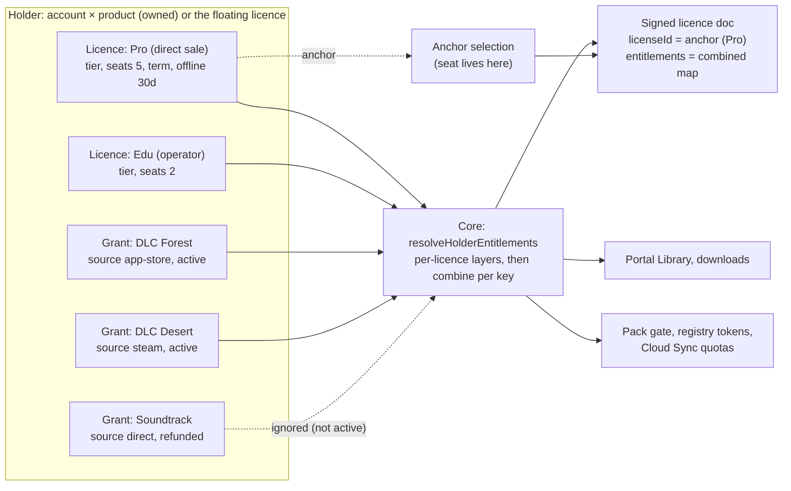

> Research note for [Godot on Polaris Key](../README.md), 2026-10-04. Spike S-19, commissioned
> by the lead on the owner's request of 2026-10-04: "really think hard about the way we have set up
> licenses and entitlements and whether that makes full sense in our SDKs, and current reality. One
> license, multiple entitlements? One entitlement per license, with an account holding multiple
> licenses?" It has no program brief; §9 proposes an `LX-` work-package namespace. Research and
> design only: no product code changed, nothing was deployed, no account or credential was used,
> and no live call was made. File references are to the tree at `e8af86ff` (`W/` =
> `packages/worker/src/`, `M/` = `packages/worker/migrations/`, `N/` =
> `docs/research/2026-09-29-godot-omniplatform/notes/`, `P/` =
> `docs/research/2026-09-29-godot-omniplatform/program/`). The I-04 plan was read on `main`
> (approved, done); U-01 was read on branch `wp/U-01-cloud-sync-plan` and PX-W3 on branch
> `wp/PX-W3-licensed-downloads-plan`. Vendor facts were read from the primary pages listed in §12
> during the research pass. Where a page was not re-read for this note the fact is marked [U].

# S-19: the licensing model: licences, grants and entitlements

Evidence tags, as in the other notes: **[V]** read in the code, the docs or a vendor's primary
page; **[M]** measured; **[S]** summarised from a secondary source; **[I]** inference or design;
**[U]** not verified. Spelling: "licence" in prose, `license` in identifiers and in UI copy
(PORTAL.md rule 4).

## 1. Question

Is "one licence, many entitlements" the right model for Polaris Key, now that S-16 and I-04 give
every person one account that holds a Library of licences? Or should a licence carry one
entitlement and the account hold many licences? The question has to be answered against:

- the SDKs, which today read one signed licence document per device;
- the account layer (I-04, approved), the portal (PORTAL.md), Cloud Sync (S-17, U-01) and
  licensed downloads (PX-W3), which already assume an account can hold several licences per
  product;
- store purchases (P6-01 commerce bridge), registry tokens (F-20, F-21), Discover and auto-issue;
- the real products: `djdl` and the `polaris-key` system product.

## 2. Short answer

**Keep "one licence, many entitlements", but stop treating the licence as the unit that a device
sees.** Introduce two things the model is missing:

1. **Grants.** A grant is one reason a holder has an entitlement: one store purchase, one direct
   sale, one comp, one trial add-on, one bundle line. Each grant has its own source, state,
   expiry and refund path. `license_store_grants` already is this, for stores only, keyed to the
   wrong holder.
2. **A holder and a combine step.** The **holder** is the account × product when the device's
   licence is owned, or the floating licence itself when it is not. The device document carries
   the entitlements **combined over every usable licence and every active grant of the holder**,
   with a declared combine rule per key (booleans OR, numbers max, arrays union, version window
   widest, seat limit from one licence only).

A device still runs on exactly **one licence, its anchor**. The anchor carries the access
contract: seats, term, offline window, tier. The signed document keeps one `licenseId` (the
anchor) and one `entitlements` map, so **phase 0 is server-only and produces byte-identical
documents for every holder with one licence and no extra grants**. Phase 1 adds optional members
(per-entry `expiresAt`, `licenseExpiresAt`, a small provenance list) as a plan-mode, all-languages
event.

This is the pattern every account-centred system in the survey uses (StoreKit
`currentEntitlements`, RevenueCat `CustomerInfo`, Stripe's active entitlement summary, the Steam
Library, Epic ownership) and it keeps the per-licence seats and offline documents that the
key-centred systems (Keygen, Cryptlex) rely on. **"One entitlement per licence" is rejected**: no
surveyed system does it, it explodes keys and rows, and seats, offline windows and version windows
do not decompose per flag (§6).

The answer to the owner's two options is therefore **"both, with a rule"**: an account holds many
licences _and_ many grants for a product; each licence holds many entitlements; the device sees
their combination; seats live on one licence.



**Independent fixes, needed whatever model is chosen** (§4.3): offline grace outlives licence
expiry; OIDC sign-in renews trials and wipes operator entitlement overrides; claim/migrate strands
store purchases; `isEntitled` keeps answering `true` on a revoked install; expired and revoked are
indistinguishable on the device; system entitlement names are unreserved; the portal and the device
disagree on flag defaults and tier channels.

**Owner decisions** are collected in §10.3 with recommended defaults. The blocking one for the
approved I-04 work is decision 2 (which licence a signed-in device runs on).

## 3. Method

1. Read the licence, tier, profile, device, store-grant, commerce, registry-token and portal-link
   schemas (`M/0001` to `M/0067`), the Core merge and policy code, the licence document builder
   and route, the six SDKs' licence clients, and the Godot commerce client. [V]
2. Read S-13, S-15, S-16, S-17, the I-04 plan (approved), U-01 (branch), PX-W3 (branch),
   PORTAL.md, ADMIN.md §6.5 and WIRE-CONTRACT-V4. [V]
3. Surveyed thirteen licensing and entitlement systems from their primary docs (§5). [V]
4. Walked twelve scenarios end to end against four candidate models (§6.2). [I]
5. Spot-checked the load-bearing claims in code for this note: unclamped `graceUntil`
   (`W/core/documents.ts:59-92`), the OIDC rewrite (`W/services/identity/oidc.ts:827-846`), the
   merge rule (`W/merge.ts:25-55`), policy injection (`W/core/entitlements.ts:185-215`), first
   licence wins (`W/services/distribution/commerce/state.ts:17-18,300,313`), Play acknowledgement
   (`W/services/distribution/commerce/play.ts:19-21`), and the absence of a licence-selection rule
   in I-04 §2.3 and §6.2 (`P/plans/I-04.md:136-148,325-345`). [V]

No measurement was taken: the D1 cost of the combine step (§7.3) is an estimate to be measured in
LX-05.

## 4. Current state

### 4.1 Storage

| Table / column                                                       | What it holds                                                                                                                                                                                                                                                | Source                                                                    |
| -------------------------------------------------------------------- | ------------------------------------------------------------------------------------------------------------------------------------------------------------------------------------------------------------------------------------------------------------ | ------------------------------------------------------------------------- |
| `licenses`                                                           | `(product, id)`; `status` `active`/`disabled` only; one `tier_id`; `expires_at`; `max_offline_days`; `overrides_json` (config, secrets, entitlements); `sub`, `email`, `groups_json`; `channels_json`, `min_version`, `max_version`; `origin`; `enroll_hwid` | `M/0001_init.sql:64-82`, `M/0002:6-8`, `M/0011:20-32`, `M/0015:68-86` [V] |
| `idx_licenses_sub` UNIQUE `(product, sub)`                           | **at most one OIDC licence per subject per product**                                                                                                                                                                                                         | `M/0012:22` [V]                                                           |
| `idx_licenses_enroll_hwid` UNIQUE `(product, enroll_hwid)`           | one free auto-issued licence per machine                                                                                                                                                                                                                     | `M/0012:16` [V]                                                           |
| `tiers`                                                              | `label`, one `profile_id`, `policy_expiry_days`, `policy_device_limit`, channels, version window; no rank, no offline days                                                                                                                                   | `M/0001:51-61`, `W/repo.ts:163-178` [V]                                   |
| `profiles`, `license_profiles`                                       | payload baselines; an ordered stack per licence                                                                                                                                                                                                              | `M/0001:39-48`, `M/0004` [V]                                              |
| `keys_index`                                                         | many keys per licence; a key carries no entitlement scope                                                                                                                                                                                                    | `M/0001:85-96` [V]                                                        |
| `devices`                                                            | PK `(product, device_id)`, **one `license_id`** (NOT NULL), `overrides_json`, `seat_no` (unique per licence)                                                                                                                                                 | `M/0001:99-118`, `M/0014`, `M/0015:15-19` [V]                             |
| `portal_license_links`                                               | `(account_id, product, license_id)`; many licences per account per product                                                                                                                                                                                   | `M/0017:125-159` [V]                                                      |
| `dist_store_products`                                                | `(store, store_product_id) → deliverable_id, flag`: **one store product, one flag**                                                                                                                                                                          | `M/0052_commerce.sql` [V]                                                 |
| `dist_purchase_bindings`                                             | **one binding UUID per licence**                                                                                                                                                                                                                             | `M/0052` [V]                                                              |
| `dist_purchases`                                                     | purchase key hash, state, `license_id` of the **first licence that claimed it**                                                                                                                                                                              | `M/0052` [V]                                                              |
| `license_store_grants`                                               | `(product, store, purchase_key_hash, flag)`, `active`/`revoked`; no expiry, no quantity, value always `true`                                                                                                                                                 | `M/0052` [V]                                                              |
| `dist_access`                                                        | `mode` `public`/`authenticated`/`licensed`/`entitled` plus one `entitlement` flag per deliverable                                                                                                                                                            | `M/0038:56-64` [V]                                                        |
| `registry_tokens`                                                    | `binding` `owner`/`license`, one `license_id`                                                                                                                                                                                                                | `M/0067:30-46` [V]                                                        |
| `provisioning_config`, `oidc_config.group_role_map_json`             | OIDC claim → entitlement key/value; group → `{role, tier}`                                                                                                                                                                                                   | `M/0001` [V]                                                              |
| I-05 (planned): `licenses.account_id`, `devices.subject`, `bound_by` | one owner account per licence; the device's pairwise subject; how the device was bound                                                                                                                                                                       | `P/plans/I-04.md:306-313` [V]                                             |

The table comment still calls a licence "An account" (`M/0001:63`) and the glossary says "license —
an account that holds entitlements" (`packages/docs/src/content/docs/start/concepts.md:176`). I-04
renames it to "a grant of entitlements, optionally attached to an account"
(`P/plans/I-04.md:364-365`). [V]

### 4.2 Where a device's entitlements come from

**The layer stack** (`W/core/payload.ts:112-147`): catalog defaults (config only: flags are
skipped, `:87-94`) → tier profile → licence profiles in order → store grants (`:141`) → licence
overrides (`:142`) → device overrides (`:145`). [V]

**The merge** (`W/merge.ts:25-55`): a higher layer wins, except that a lower `enforced` or `hidden`
entry beats a higher `default` one. Store grants are written as `state: "default", value: true`
(`W/core/storeGrants.ts:95-119`), so an operator's `enforced:false` in a tier profile, or any
licence or device override, cancels a paid purchase. The file documents this as intended
("operator wins", `W/core/storeGrants.ts:86-91`). [V]

**Policy injection after the merge** (`W/core/entitlements.ts:185-215`), all `enforced`:
`license.tier`, `license.tierLabel`; `channels` = union of the tier's and the licence's columns,
**replacing** any profile or override value; `deviceLimit` = `tier.policy_device_limit`,
**replacing** any licence-level value; `app.minVersion` = the lower of tier and licence, and
`app.maxVersion` = the higher (the **widest** window, `minOf`/`maxOf` at `:204-215`). [V] System keys
and product flags share one namespace; `djdl` even declares `channels`, `app.minVersion`,
`app.maxVersion` and `deviceLimit` as `kind: "flag"` (`products/djdl/catalog.json:439-483`). [V]

**Validation.** The prune passes entitlements through unvalidated (`W/core/payload.ts:184-188`).
The admin override path requires a catalog `flag` key (`W/admin/lib/overrides.ts:58-68`). Store
mappings check only `ENTITLEMENT_PATTERN` (`W/services/distribution/commerce/admin.ts:209-215`).
Provisioning hooks write any key. [V]

**The signed document** (`packages/shared-protocol/src/license.ts:22-26`, WIRE-CONTRACT-V4 §2.1):
the envelope (`iss`, `aud`, `deviceId`, `issuedAt`, `expiresAt`, `graceUntil`) plus `licenseId`,
`profile` and `entitlements: Record<string, {state, value, updatedAt}>`. Built at
`W/core/documents.ts:80-92`, served at `W/services/license/document.ts:98-168`. It carries **no
licence expiry, no per-entitlement expiry, no provenance, no account**. `graceUntil = now +
maxOfflineDays` is **not clamped** to `licenses.expires_at` (`W/core/documents.ts:59-61`). [V]

**Usability.** `licenseUsable` is false for `disabled` and for past `expires_at`
(`W/core/devices.ts:191-198`); the document route answers a bare `401 unauthorized` either way
(`W/services/license/document.ts:110`). [V]

### 4.3 Gaps

Each gap is numbered for reference from §7 and §9. "Indep." marks the ones that need fixing under
any model.

| #   | Gap                                                                                                                                                                                                                                                                                                                                                                                                                                       | Evidence                                                                                                                                                                               | Indep. |
| --- | ----------------------------------------------------------------------------------------------------------------------------------------------------------------------------------------------------------------------------------------------------------------------------------------------------------------------------------------------------------------------------------------------------------------------------------------- | -------------------------------------------------------------------------------------------------------------------------------------------------------------------------------------- | ------ |
| G1  | **The device sees one licence; every account surface sees several.** Library shows the "best" licence with a switcher; portal downloads OR across licences; U-01 Q2 takes "the largest limit among the account's usable licences"; the device document, pack gate and registry token use one licence. One person gets different answers on different surfaces.                                                                            | `W/services/identity/portal/library.ts:57-66`, `portal/api.ts:288-312`, `portal/downloads.ts:19-28`, PORTAL.md:210-213, U-01 §8 Q2 (branch) [V]                                        |        |
| G2  | **No rule for which licence a signed-in device runs on.** I-04's sign-in path sets `devices.subject` and `bound_by = 'signin'` but never says which of the account's licences the device binds to; D24 refuses key entry of an owned licence on a new device, so sign-in is the only path to it. Today sign-in reaches only the `(product, sub)`-unique OIDC licence. **Blocking for I-05 and I-09.**                                     | `P/plans/I-04.md:110-148,333-337`; S-16 owner answer 1; `W/services/identity/oidc.ts:723-870` [V]                                                                                      |        |
| G3  | **Purchases follow the first licence, not the person.** "First licence wins" binds a purchase key to one licence forever; enrolled licences are per machine. The same Steam user on a second PC gets `bound_elsewhere`; an iPad restoring purchases gets `binding_mismatch`; a Family Sharing purchase reaches only the purchaser's licence.                                                                                              | `commerce/state.ts:17-18,300,313`; `commerce/apple.ts:21`; `M/0011` [V]                                                                                                                |        |
| G4  | **A store product maps to one flag; a DLC sold as its own licence is invisible to gates.** Bundles need N mappings; there is no way to sell a DLC key (keys grant a whole licence).                                                                                                                                                                                                                                                       | `M/0052` (PK of `dist_store_products`); `W/services/distribution/blobAccess.ts:25-33` [V]                                                                                              |        |
| G5  | **A paid purchase can be cancelled by any operator override or `enforced:false` profile entry.**                                                                                                                                                                                                                                                                                                                                          | `W/merge.ts:31-40`; `W/core/storeGrants.ts:86-119` [V]                                                                                                                                 | yes    |
| G6  | **Claim/migrate strands purchases and ignores seats.** Migrate disables the enrolled licence without moving `license_store_grants` or `dist_purchase_bindings`, and `moveDevices` sets `seat_no = NULL` with no seat check.                                                                                                                                                                                                               | `W/services/identity/oidc.ts:756-825`; `W/repo.ts:900-912` [V]                                                                                                                         | yes    |
| G7  | **OIDC sign-in rewrites an existing licence**: `tier_id`, `expires_at = now + policy_expiry_days` (a time-limited tier renews on every sign-in: endless trials) and `overrides_json` (wipes operator entitlement overrides, contradicting S-17 decision 20). The tier is the **first** matching group, not the best.                                                                                                                      | `W/services/identity/oidc.ts:617-658,676-680,827-846` [V]                                                                                                                              | yes    |
| G8  | **No term model beyond one `expires_at`.** No renewal source, no statuses beyond `active`/`disabled`, no grant expiry, no store subscriptions (Apple non-consumables only; Play one-time products).                                                                                                                                                                                                                                       | `M/0015:68-76`; `commerce/apple.ts:21,239`; S-14 §8 [V]                                                                                                                                |        |
| G9  | **Offline grace outlives licence expiry.** A licence expiring tomorrow with 30 offline days keeps an offline client usable for 30 days.                                                                                                                                                                                                                                                                                                   | `W/core/documents.ts:59-61,88` [V]                                                                                                                                                     | yes    |
| G10 | **The SDK cannot tell expired from revoked or refunded.** Both are a bare 401; the client maps it to `revoked`, and its `expired` means only "offline grace ran out".                                                                                                                                                                                                                                                                     | `W/services/license/document.ts:110`; `packages/client-core/src/gate.ts:86-89` [V]                                                                                                     | yes    |
| G11 | **`isEntitled` ignores licence status.** After a 401 the SDK keeps the document (`lastSyncUnauthorized`), so a revoked or refunded install still answers `isEntitled("dlc") == true` until it wipes. All six SDKs.                                                                                                                                                                                                                        | `packages/sdk-node/src/license/client.ts:107-110`, `sdk-node/src/core/sync.ts:130-131`; the five others in §4.4 [V]                                                                    | yes    |
| G12 | **Upgrades, seat add-ons and channel add-ons cannot be expressed.** An upgrade either mutates `tier_id` (history lost) or adds a second licence (the device cannot combine). `tier.policy_device_limit` replaces any licence-level `deviceLimit`; tier/licence channels replace profile or grant channels; grants are boolean.                                                                                                            | `W/core/entitlements.ts:191-202` [V]                                                                                                                                                   |        |
| G13 | **System keys share the product flag namespace.** `channels`, `deviceLimit`, `app.*`, `license.tier`, `license.tierLabel` are injected with no reserved-name rule; a product flag of that name is overwritten. "Flag" covers non-booleans.                                                                                                                                                                                                | `W/core/entitlements.ts:185-215`; `packages/shared-catalog/src/types.ts:9,34,51-52` [V]                                                                                                | yes    |
| G14 | **Portal and device disagree.** The portal's `entitlementView` falls back to the catalog flag `default`, which documents never include; it shows channels from the licence only, not the tier.                                                                                                                                                                                                                                            | `W/services/identity/portal/entitlements.ts:57-66`; `W/core/payload.ts:87-94` [V]                                                                                                      | yes    |
| G15 | **Unvalidated entitlements.** Provisioning hooks and store mappings can write undeclared flags.                                                                                                                                                                                                                                                                                                                                           | `W/core/payload.ts:184-188` [V]                                                                                                                                                        | yes    |
| G16 | **One OIDC licence per subject vs many links per account.** The unique `(product, sub)` index has no counterpart rule once `licenses.account_id` holds many licences per product.                                                                                                                                                                                                                                                         | `M/0012:22`; `P/plans/I-04.md:312` [V]                                                                                                                                                 |        |
| G17 | **Commerce client parity.** Only Godot can bind and claim (`services/commerce.gd`). Swift can pass `appAccountToken` but has no claim client; Node, React, Python and Kotlin have nothing. The parity row `commerce.receipt` is ○ everywhere with `allowedNa: []`.                                                                                                                                                                        | `sdks/godot/addons/polaris_key/services/commerce.gd:1-60`; `sdks/swift/Sources/PolarisKeyPlatform/Store.swift:19-241`; `conformance/parity/features.json:1265-1270`; PARITY.md:406 [V] |        |
| G18 | **Naming clashes.** Swift `Store.entitlements(productID:)` and Godot `pkey_apple.gd` `entitlements()` mean StoreKit's current entitlements; PX-W3 calls its signed download parameter a "grant"; P6-01 calls store rows "store grants".                                                                                                                                                                                                   | `Store.swift:198`; `pkey_apple.gd:287`; PX-W3 §1 (branch) [V]                                                                                                                          | yes    |
| G19 | **Stale wording.** `M/0038:26-27` and ADMIN.md:1425-1427 say the `dist_access.entitlement` gate is not enforced (packs and the registry enforce it); PORTAL.md:181,199 say Cloud Sync does not depend on Identity (S-16's final answer: it requires Identity); `concepts.md:176` and `M/0001:63` say "licence = account"; djdl's catalog says `deviceLimit` 0 means unlimited, but `<= 0` now denies (R11-02, `W/core/authz.ts:329-345`). | as cited [V]                                                                                                                                                                           | yes    |
| G20 | **No web checkout source.** No Stripe, Paddle or Lemon Squeezy webhook; a developer selling on their own site calls the admin API from their backend.                                                                                                                                                                                                                                                                                     | `W/services/license/admin/licenses.ts` [V]                                                                                                                                             |        |

Checked and **not** a gap: the P6-01 Play path acknowledges each granted purchase once, inside
Google's three-day window (`commerce/play.ts:19-21`). [V]

### 4.4 What the SDKs expose today

All six read only the cached licence document, and all define `isEntitled(name)` as "the value is
the boolean `true`". [V]

| SDK    | Licence entitlement API                                                                            | Pack gate                                                    | Commerce                                             |
| ------ | -------------------------------------------------------------------------------------------------- | ------------------------------------------------------------ | ---------------------------------------------------- |
| Node   | `isEntitled`, `getEntitlements`, `entitledChannels`, `getLicenseId` (`license/client.ts:107-130`)  | engine `entitled()` (`client-core/src/packs/engine.ts:3217`) | none                                                 |
| React  | `adapter.isEntitled`, `useEntitlement(name)` (`core/adapter.ts:180-182`, `react/hooks.ts:277-282`) | client-core                                                  | none                                                 |
| Python | `is_entitled`, `get_entitlements`, `entitled_channels` (`license/client.py:109-135`)               | own engine                                                   | none                                                 |
| Swift  | `isEntitled`, `entitlements()` (`LicenseClient.swift:92-100`)                                      | `PacksClient.entitlements()` (`:507`)                        | `appAccountToken` pass-through only (`Store.swift`)  |
| Kotlin | `isEntitled`, `entitlements()` (`LicenseClient.kt:97-100`)                                         | `PacksClient.kt:432-436`                                     | none                                                 |
| Godot  | `is_entitled`, `get_entitlements`, `entitled_channels` (`services/license.gd:112-125`)             | engine                                                       | `get_binding`, `claim`, `is_unlocked`, `hidden_here` |

No SDK can say _why_ a flag is held, _until when_, _from which store_, or whether it is shared.
Node's core never compares `licenseId` across refreshes (`client-core/src/verify.ts:90` only checks
it is a non-empty string) [V]; the other SDKs' tolerance of a changing `licenseId` is [U] and is a
test item in LX-10.

## 5. Prior art

| System             | Unit of purchase                      | Where entitlements live                                                                      | Account combines?                                      | Lesson for us                                                                                                                                                    |
| ------------------ | ------------------------------------- | -------------------------------------------------------------------------------------------- | ------------------------------------------------------ | ---------------------------------------------------------------------------------------------------------------------------------------------------------------- |
| Keygen [V]         | licence with exactly one policy       | on the policy and on the licence; releases can require them                                  | no (users ↔ licences many-to-many, each checked alone) | add-ons as entitlements on one licence; a separate licence only for its own expiry, billing cycle or machine limit; warns that many licences per user "fragment" |
| Cryptlex [V]       | licence from a template               | entitlement sets plus features, overridable per licence (2025)                               | named users                                            | same layering as tier plus overrides                                                                                                                             |
| LicenseSpring [V]  | licence with a policy                 | features with **their own expiry**; activation / consumption / floating                      | no                                                     | per-entitlement expiry, enforced offline                                                                                                                         |
| Lemon Squeezy [V]  | a key per order item                  | none                                                                                         | no                                                     | subscription key expires with the subscription                                                                                                                   |
| Paddle Billing [V] | transaction / subscription            | none; "build this yourself" from webhooks                                                    | customer                                               | it is an input source, like a store                                                                                                                              |
| Stripe [V]         | product                               | features on products; **ActiveEntitlement per customer per feature**                         | **yes**                                                | the customer is the aggregate; one summary webhook                                                                                                               |
| RevenueCat [V]     | store product                         | entitlement; products ↔ entitlements many-to-many                                            | **yes**                                                | `EntitlementInfo`: isActive, expirationDate, periodType, store, productIdentifier, ownershipType                                                                 |
| StoreKit 2 [V]     | product                               | `Transaction.currentEntitlements`; several entitling transactions per product since iOS 18.4 | Apple Account, Family Sharing                          | revocation removes one transaction; grant on any verified unrevoked one                                                                                          |
| Google Play [V]    | purchase token                        | app grants; acknowledge within 3 days                                                        | Google account                                         | per-token refunds, partial by quantity                                                                                                                           |
| Steam [V]          | AppID licence (each DLC an AppID)     | ownership per AppID (`CheckAppOwnership`: `ownsapp`, `permanent`, `ownersteamid`)            | Steam account                                          | ownership, not feature flags; borrowed access is `permanent=false`                                                                                               |
| Epic EOS [V]       | offer → items                         | entitlement per item; `QueryOwnership` resolves bundles                                      | Epic account                                           | separate "bought" from "owns"; bundles resolved when read                                                                                                        |
| itch.io [V]        | download key claimed into a library   | ownership only                                                                               | library                                                | revoking a key does not remove the game                                                                                                                          |
| JetBrains [V]      | licence per product or pack, assigned | via the pack                                                                                 | JetBrains Account                                      | perpetual fallback: a version window that outlives the subscription                                                                                              |

Patterns [I]: (1) mature systems separate **feature** entitlements from **ownership** records and
from **policy** values; (2) the licence or purchase is the grant and **the account is where grants
are combined**; (3) SKUs map to features many-to-many; (4) each grant keeps its own lifecycle and
source; (5) a refund removes one grant and the others still entitle; (6) seats belong to a grant,
not to the account; (7) offline is a signed cached result re-issued when grants change.

## 6. Options compared

### 6.1 The candidates

- **O0: status quo.** One licence per device; the account side picks a "best licence".
- **OA: one product licence per (account, product).** Every purchase, trial and add-on is a grant
  row on it; attaching a second licence for the same product **merges** it into the first.
- **OB: one entitlement per licence.** Every DLC, add-on and feature is its own licence; the
  account aggregates; a device needs several licences.
- **OB′: licence = one purchase, document = union of licences.** Like C below but with no grant
  concept: every store purchase and add-on becomes a licence; the document carries
  `licenseIds[]`. A breaking wire change.
- **OC (recommended): licence = access contract, grant = entitlement reason, entitlements computed
  over the holder.** One anchor licence per device for seats and term.
- **OD: entitlements on the account; licences become keys.** Contradicts S-16 decision 9 and S-17
  decision 20, and floating licences lose everything.

### 6.2 Comparison

| Criterion                                          | O0               | OA                                       | OB                            | OB′                           | **OC**                                            | OD                      |
| -------------------------------------------------- | ---------------- | ---------------------------------------- | ----------------------------- | ----------------------------- | ------------------------------------------------- | ----------------------- |
| Device and account agree (G1)                      | no               | yes                                      | yes                           | yes                           | **yes**                                           | yes                     |
| Which licence a signed-in device runs on (G2)      | undefined        | the one                                  | undefined (needs N)           | all                           | **anchor rule**                                   | n/a                     |
| Purchases roam across a person's devices (G3)      | no               | yes                                      | yes                           | yes                           | **yes**                                           | yes                     |
| Refund one item cleanly                            | yes (store rows) | yes                                      | yes                           | yes                           | **yes; flag survives if another grant gives it**  | needs grant rows anyway |
| Floating key + DLC                                 | yes              | yes                                      | **no** (second key on device) | **no**                        | **yes** (holder = licence)                        | **no**                  |
| Two genuine base licences (Edu + Pro)              | switcher         | lossy merge (whose tier, seats, term?)   | n/a                           | union                         | **union, anchor for seats**                       | union                   |
| Seats, term, offline, version window               | per licence      | per merged licence (lossy)               | meaningless per DLC           | needs a seat home             | **per licence; anchor decides seats**             | needs new home          |
| History and provenance                             | lost on mutation | grant rows; merge loses licence identity | natural                       | natural                       | **natural**                                       | grant rows              |
| Keys and support burden                            | low              | low                                      | **high** (a key per DLC)      | high                          | **low**                                           | low                     |
| Upgrade / trial → paid                             | mutate tier      | mutate tier                              | new licence                   | new licence                   | **new licence, re-anchor; or mutate tier**        | mutate                  |
| Matches S-16 D9 (doc stays account-free), S-17 D20 | yes              | yes                                      | yes                           | yes                           | **yes**                                           | **no**                  |
| Wire change                                        | none             | none                                     | breaking                      | **breaking** (`licenseIds[]`) | **none in phase 0; additive optional in phase 1** | breaking                |
| Industry match                                     | key vendors      | Keygen "one licence + add-ons"           | none                          | Steam store records           | **StoreKit, RevenueCat, Stripe, Steam Library**   | Stripe (no offline)     |

**Why not OA.** Merging licences on attach is lossy and irreversible: two licences with different
seat pools, terms and tiers cannot become one row without choosing a loser, and a later detach
(I-04 §2.3, S-16 D25) cannot split them again. It also forces auto-issued `enroll_hwid` licences to
be mutated into paid ones. OA is what OC degenerates to when a holder has one licence, so OC keeps
OA's simplicity for the common case. [I]

**Why not OB/OB′.** Seats, offline windows, version windows and channels do not decompose per flag;
a floating key cannot accumulate DLC; keys multiply; the device needs several licences, which breaks
`devices.license_id` NOT NULL and the singular `licenseId` claim. [I]

**Why not OD.** It reopens two accepted owner decisions and drops floating licences. [V/I]

## 7. The recommended design (OC), fully specified

### 7.1 Vocabulary (rule 4; glossary edits in LX-14)

| Term              | Meaning                                                                                                                                                                                                  |
| ----------------- | -------------------------------------------------------------------------------------------------------------------------------------------------------------------------------------------------------- |
| **licence**       | An access contract for one product: tier, seats (device limit), term (`expires_at`), offline window, version window, channels, keys. Optionally attached to an account. A device runs on exactly one.    |
| **grant**         | One reason a holder has one or more entitlements: a store purchase, a direct sale, a comp, a trial add-on, a bundle line, a redeemed code. Own source, state, expiry, refund path. Never carries seats.  |
| **entitlement**   | A named value the device and the server gate on. **Feature** (boolean capability), **ownership** (owns an item, usually a deliverable), **policy** (system keys, §7.4) or **quota** (numeric, reserved). |
| **holder**        | Who the entitlements are computed for: the account × product when the anchor licence is owned (`licenses.account_id` set), otherwise the floating licence.                                               |
| **anchor**        | The licence a device runs on (`devices.license_id`, unchanged column). Seats and term come from it.                                                                                                      |
| **combine rule**  | How one key's values from several licences and grants become one value (§7.4).                                                                                                                           |
| **effective set** | The combined entitlement map for a holder (and device), produced by one Core function.                                                                                                                   |

Rename to free the word "grant": PX-W3's `?grant=` becomes a **download ticket** (`?ticket=`), and
"store grant" becomes a grant with a store source. Swift and Godot StoreKit wrappers keep their
names but their docs say "StoreKit entitlements" (§7.11).

### 7.2 Data model

All new tables are Core-owned unless stated (rule 6). DDL is a sketch; exact columns are fixed in
LX-01.

**`licenses` (existing) gains:**

- `kind TEXT NOT NULL DEFAULT 'base' CHECK (kind IN ('base','addon'))`. An `addon` licence carries
  no seats, can never be an anchor, and is usable only while the holder has a usable `base`
  licence. It exists only for direct-sale add-on **keys** (decision 9); most add-ons are grants.
- `ended_reason TEXT NULL CHECK (ended_reason IN ('revoked','refunded','chargeback','superseded'))`,
  set when `status` becomes `disabled`. Expiry stays computed from `expires_at`. Lets the 401 carry a
  reason (G10) without widening the `status` trigger.
- `superseded_by TEXT NULL`: the licence that replaced this one (trial → paid, upgrade by new
  licence). Hidden from the Library; kept for history.
- `source TEXT NULL` and `external_ref_hash TEXT NULL` for licences minted from a store base
  purchase or a web checkout (§7.6), with UNIQUE `(product, source, external_ref_hash)`.
- `idx_licenses_sub` stays UNIQUE until I-17 retires `sub`; I-05's `(product, account_id)` index is
  **non-unique** (several licences per account per product are normal).

**`tiers` (existing) gains:** `rank INTEGER NOT NULL DEFAULT 0` (higher is better; used for anchor
choice, `license.tier` and OIDC group choice) and `policy_max_offline_days INTEGER NULL` (closes the
asymmetry where only licences carry offline days).

**`grants` (new; replaces `license_store_grants`):**

```sql
CREATE TABLE grants (
  product            TEXT NOT NULL,
  id                 TEXT NOT NULL,              -- grt_…
  account_id         TEXT NULL,                  -- holder when owned (global id; never leaves the Worker)
  license_id         TEXT NULL,                  -- holder when floating
  source             TEXT NOT NULL,              -- app-store | play | steam | direct | comp | trial | bundle | redeem | oidc
  external_ref_hash  TEXT NULL,                  -- purchase key hash, order id hash; UNIQUE per (product, source)
  sku                TEXT NULL,                  -- store product id or catalog SKU, for display and reconciliation
  order_ref          TEXT NULL,                  -- groups grants of one order or bundle for refunds
  state              TEXT NOT NULL,              -- active | revoked | refunded | suppressed
  granted_at         INTEGER NOT NULL,
  expires_at         INTEGER NULL,               -- NULL = perpetual
  shared             INTEGER NOT NULL DEFAULT 0, -- family-shared / borrowed (Apple ownershipType, Steam permanent=0)
  trial              INTEGER NOT NULL DEFAULT 0,
  created_by         TEXT NOT NULL,              -- admin id, 'commerce', 'oidc', 'webhook:<id>'
  modified_at        INTEGER NOT NULL,
  PRIMARY KEY (product, id),
  CHECK ((account_id IS NULL) <> (license_id IS NULL))
);
CREATE INDEX idx_grants_account ON grants(product, account_id) WHERE account_id IS NOT NULL;
CREATE INDEX idx_grants_license ON grants(product, license_id) WHERE license_id IS NOT NULL;
CREATE UNIQUE INDEX idx_grants_ref ON grants(product, source, external_ref_hash)
  WHERE external_ref_hash IS NOT NULL;

CREATE TABLE grant_entitlements (               -- one grant, many keys (bundles, Deluxe SKUs)
  product   TEXT NOT NULL,
  grant_id  TEXT NOT NULL,
  key       TEXT NOT NULL,
  value_json TEXT NOT NULL DEFAULT 'true',       -- boolean, or integer for seat packs / quotas
  PRIMARY KEY (product, grant_id, key)
);
```

**Commerce (Distribution-owned, `M/0052` successors):**

- `dist_store_products` loses its single `flag` column in favour of
  `dist_store_product_entitlements(store, store_product_id, key, value_json)` (many-to-many, G4) and
  gains `grants_kind TEXT NOT NULL DEFAULT 'addon' CHECK (grants_kind IN ('addon','base'))` and
  `base_tier_id TEXT NULL` (a `base` mapping mints a licence, §7.6).
- `dist_purchase_bindings` is keyed by **holder**: `(product, holder_kind, holder_id) → binding`,
  where `holder_kind` is `account` or `license`. Existing rows become `license` holders and keep
  their UUIDs (the token in already-made purchases stays valid).
- `dist_purchases.license_id` becomes `grant_id`; "first licence wins" becomes **first holder
  wins** (§7.6).

**Unchanged:** `devices.license_id` (now read as "anchor"), `seat_no`, `license_profiles`,
`keys_index`, `profiles`, `registry_tokens` (a licence binding now checks the holder's effective
set, §7.8).

### 7.3 Resolution: one Core function

`resolveHolderEntitlements(db, product, anchor, device?) → { entitlements, provenance, terms }` in
`W/core/holder.ts`. Every gate calls it; nothing else computes entitlements.

1. **Holder.** `holder = anchor.account_id ? {account: anchor.account_id} : {license: anchor.id}`
   (decision 3 allows a product to restrict account-wide combining to sign-in-bound devices).
2. **Licences.** The holder's usable licences of this product: for an account, every licence with
   that `account_id` and `licenseUsable`; for a floating holder, just the anchor. `addon` licences
   count only if a usable `base` licence is present.
3. **Per-licence slice.** For each licence: tier profile → licence profiles → licence entitlement
   overrides (S-17 D20), merged with today's `mergeMap`, then `injectAdminPolicy` for that licence
   alone. This is today's stack minus the store-grant layer and minus device overrides.
4. **Grants.** Every grant of the holder (account grants plus grants held by any of the licences in
   step 2) with `state = 'active'` and `expires_at` null or in the future, expanded through
   `grant_entitlements` into `default`-state entries stamped with `granted_at`.
5. **Combine** per key across the slices and the grants, by the key's combine rule (§7.4). A key
   held `enforced:false` or `hidden` by **the anchor's** slice still wins over grants only when the
   catalog key is `policy` kind (operator kill switch for policy); for feature and ownership keys a
   grant cannot be cancelled by another layer (G5, decision 5). Suppressing a purchase is an explicit,
   audited `state = 'suppressed'` on the grant.
6. **Device overrides** last, as today (an explicit per-device support action, audited).
7. **Terms** from the anchor only: `max_offline_days`, `expires_at`, seats.
8. **Config is not combined.** The config slice still comes from the anchor's tier and profiles,
   then S-17's account override layer, as U-01 specifies.

**Byte-identity.** For a holder with one licence and no grants outside today's store grants, steps
2–6 reproduce today's map exactly, including `updatedAt` (the max of the contributing entries).
LX-05 adds a property test over the conformance fixtures and a snapshot of every `djdl` licence.

**Cost.** One extra indexed query for an account holder's licences and one for grants, both on
`(product, account_id)`. Documents are served at most once per refresh interval per device and are
ETag-cached. Estimate under 2 ms of D1 time per document [I/U]; LX-05 measures it with the existing
Worker benchmark harness before adopting.

**Callers to switch** (all in LX-05): `W/services/license/document.ts` (document and offline
bundle), `W/core/entitledAccess.ts` (pack, release and file gates), `W/services/distribution/registry/authorize.ts`
(entitled feeds), `W/services/identity/portal/api.ts` (`accountMayDownload`), `portal/entitlements.ts`,
`portal/library.ts`, `portal/downloads.ts`, identity `/session`, and S-17's `requiresFlag` and quota
hooks (U-02 builds on it).

### 7.4 Combine rules and reserved names

Each catalog `flag` gains an optional `combine` (manifest and catalog field; rule 9). Defaults
follow the JSON type of the value so existing catalogs need no edit:

| Value type            | Default `combine` | Meaning                                               |
| --------------------- | ----------------- | ----------------------------------------------------- |
| boolean               | `any`             | true if any contributor is true                       |
| integer / number      | `max`             | the largest; `sum` available for seat or quota packs  |
| array of strings      | `union`           | set union, stable order (anchor first)                |
| string, object, other | `anchor`          | the anchor's value, else the highest-ranked licence's |

Allowed values: `any`, `all`, `max`, `min`, `sum`, `union`, `anchor`.

**Reserved policy keys** (fixed rules, not overridable, validators refuse a catalog or manifest
`flag` that redefines them except to add `description`/`userGrant` metadata; G13):

| Key                                 | Rule across licences                                                                        | Why                                                                    |
| ----------------------------------- | ------------------------------------------------------------------------------------------- | ---------------------------------------------------------------------- |
| `channels`                          | `union`                                                                                     | any licence that may see `beta` is enough                              |
| `app.minVersion`, `app.maxVersion`  | widest window (lowest min, highest max)                                                     | matches today's tier + licence rule (`W/core/entitlements.ts:204-215`) |
| `deviceLimit`                       | **anchor only**, plus `sum` of `deviceLimit` integer grants held on the anchor (seat packs) | seats belong to one contract                                           |
| `license.tier`, `license.tierLabel` | highest `tiers.rank` among usable licences, ties to the anchor                              | the badge shows the best tier the person holds                         |
| `license.*`, `app.*`, `pkey.*`      | reserved prefixes for future system keys                                                    | stop collisions now                                                    |

Seat add-ons: `deviceLimit` stops being `enforced` from the tier when a licence-level value exists;
the order becomes tier default → licence column/override → plus seat-pack grants (G12). Channel
add-ons: profile and grant `channels` are unioned with the tier and licence columns instead of being
replaced.

A future v5 could move policy keys out of `entitlements` into their own claims; this plan keeps
them in place for wire compatibility and only reserves the names. [I]

### 7.5 Anchor selection, seats and re-anchoring

**Choosing the anchor** (Core, server-only), when a device is bound by sign-in, by attach, by
Discover "Add to library", or by a store base-purchase claim:

1. candidates: the holder's usable `base` licences with a free seat (`authorizeDevice` would
   succeed);
2. order: highest `tiers.rank`, then no expiry before expiry, then latest `expires_at`, then
   earliest `activated_at`;
3. none: if the product has auto-issue (`autoIssue.tierId`), mint one (origin `oidc`, as today's
   `activateFromIdentity`); else answer `403 not_entitled` with reason `no_base_licence` (a holder
   that owns only DLC) or `device_limit` (every base licence full).

The person can override the choice per device in the portal ("Run this device on: Pro · Edu"), which
re-binds the device under the same seat checks.

**Key entry** keeps binding the device to the entered key's licence, as today. If that licence is
owned, the holder is still the owner account (decision 3), so the device gets the owner's
effective set. With Identity on, D24 already limits this to devices enrolled before ownership.

**Re-anchoring on refresh.** If the anchor became unusable (expired trial, refunded, revoked) and
the holder has another usable base licence with a free seat, the document route re-binds the device
silently and the document's `licenseId` changes. Otherwise today's 401 applies, now with a reason
(§7.8). Re-anchoring never happens on a key-entry-bound device of a floating licence.

**Seats** count only on the anchor. A device occupies one seat in one licence; the other licences
and all grants contribute entitlements, never seats. Seat packs are integer `deviceLimit` grants
held on a specific licence.

**Attaching an auto-issued free licence** (`origin = 'enroll'`) to an account that already holds a
usable base licence for the product: re-anchor its devices to the account's licence (seat-checked)
and mark the free licence `superseded_by`. Its grants (stranded today, G6) stay attached to it and
therefore keep counting in the account's effective set through step 4. Without another base licence,
the free licence simply becomes the account's.

**OIDC sign-in on an existing licence** (G7): set `name`, `email`, `groups_json`; **do not** touch
`tier_id`, `expires_at` or `overrides_json` unless the product opts into `identity.syncTierOnSignIn`
(default off; when on, only upgrade to a higher-`rank` tier and never extend `expires_at`).
Provisioned entitlements from IdP claims become `source = 'oidc'` grants (re-evaluated on each
sign-in, revoked when the claim disappears), so they stop overwriting operator overrides. The group
→ tier map picks the **highest-rank** matching tier, not the first.

### 7.6 Lifecycle: terms, trials, subscriptions, refunds, upgrades, bundles

- **Licence term.** `expires_at` on the licence (whole-product subscriptions, time-limited tiers).
  `graceUntil = min(now + maxOfflineDays, anchor.expires_at)` when the anchor expires and the product
  setting `licensing.clampGraceToExpiry` is on (default **on for new products**, opt-in for
  existing ones, decision 6; G9). The anchor's expiry also travels as `licenseExpiresAt` (phase 1).
- **Grant term.** `grants.expires_at` for add-on subscriptions and time-boxed DLC. Expired grants
  drop out at the next document; phase 1 puts `expiresAt` on the entry so new SDKs drop it offline
  too. `graceUntil` is **not** clamped to a grant's expiry (that would end base access offline).
- **Trials.** Either a base licence on a `trial` tier (rank 0) with `expires_at`, which a paid
  licence supersedes by re-anchoring; or a grant with `trial = 1` for a feature trial. Sign-in never
  renews it (§7.5). Conversion sets `superseded_by` on the trial licence.
- **Subscriptions** (phase 3, LX-15): Apple auto-renewables and Play subscriptions map onto
  `grants.expires_at` (add-on) or `licenses.expires_at` (base mapping), renewed by server
  notifications (Apple App Store Server Notifications v2, Play RTDN) that the commerce bridge already
  receives for refunds. A web checkout source (Stripe or Paddle webhook) creates `direct` grants or
  base licences by the same mapping table. The data model needs no further change for either.
- **Refunds and revocation** revoke **one grant** (`state = 'refunded'`, `ended_reason` on a base
  licence). A flag stays held if another active grant or licence gives it, which is correct for a
  person who bought it twice (StoreKit 18.4 semantics). `order_ref` revokes every grant of one
  bundle order together.
- **Upgrades.** Same contract: change `tier_id` in place (audited, as today). Store- or
  checkout-driven upgrade: a new licence plus `superseded_by` on the old one; devices re-anchor.
- **Bundles.** Within one product: one grant with several `grant_entitlements` keys (Deluxe
  Edition). Across products: one grant per product sharing `order_ref`; products are separate
  tenants (own `aud`, signing key and pairwise subject), so there is no cross-product grant. Epic-style
  hierarchy (owning a parent implies children) is expressed by the mapping table, not resolved on
  read.
- **Shared access.** `grants.shared = 1` for Family Sharing or Steam `permanent = 0`. Entitlement
  holds; phase 1 exposes it so developers can gate purchaser-only rewards.
- **Perpetual fallback** (JetBrains): out of scope; the model allows it as a grant that sets
  `app.maxVersion` when a subscription lapses (§10.2).

### 7.7 Store purchases under OC

- **Binding per holder.** `GET <p>/commerce/binding` returns the binding of the device's holder:
  the account × product binding when the anchor is owned, else the licence's. Apple
  `appAccountToken` and Play `obfuscatedAccountId` are meant to identify the user [I], so the account
  binding is the right granularity. Existing per-licence bindings stay valid: a claim carrying a
  licence binding whose licence is now owned resolves to the owner account.
- **First holder wins.** A purchase key belongs to the first holder that claims it. A claim from
  another device of the same account succeeds (G3 fixed: second Steam PC, iPad restore). A claim
  from a different holder is still `bound_elsewhere`.
- **Addon vs base mappings.** An `addon` mapping creates a grant (today's behaviour, now holder-keyed
  and many-to-many). A `base` mapping (`grants_kind = 'base'`) **mints a licence** with
  `source`/`external_ref_hash` and `base_tier_id`, which removes "enrol first" for store-sold base
  games: a device with no licence can claim and is anchored to the new licence. This is what I-14's
  "Steam ticket with optional ownership grants through a Core hook" needs.
- **Floating holders** (no account): unchanged from today, grants held on the licence. When the
  licence is later attached, its grants count for the account through step 4 with no rewrite.
- **Detach** (I-04 §2.3, S-16 D25): licence-held grants leave with the licence; account-held grants
  stay with the account. A purchase claimed while signed in is account-held.
- **Refunds** keep landing per purchase hash and now update the grant (`refunded`).

### 7.8 APIs

**Device wire, phase 0: no change.** Same routes, same document shape. Behaviour changes that the
corpus does not observe: the combined map, the anchor choice, the claim succeeding across a
holder's devices.

**Device wire, phase 1 (plan mode, LX-09):**

- licence document: optional per-entry `expiresAt` (integer, §3.1 token rule), optional top-level
  `licenseExpiresAt` (integer), optional top-level `grants` (≤ 32 entries `{source, keys[],
expiresAt?, trial?, shared?}`; **no** licence ids other than the anchor, no store tokens, no order
  refs, no account id). All are members outside the claims (WIRE-CONTRACT-V4 §3.2): a malformed one
  is ignored, never fatal, and an older v4 SDK ignores them;
- 401 body on the licence routes gains optional `reason`: `expired`, `revoked`, `refunded`,
  `superseded` (a new error-body member; `conformance/parity/errors.json` and `gen:constants`);
- `403 not_entitled` with `reason: no_base_licence` on sign-in (new reason value).

**Admin API** (rule 10: OpenAPI + `routeCoverage`):

- `GET/POST /manage/api/products/<p>/grants`, `GET/PATCH /…/grants/<id>` (revoke, suppress,
  extend), filters by holder, source, state;
- `POST /…/licenses/<id>/grants` and `POST /…/accounts/<subject>/grants` (holder by pairwise
  subject; the global account id never appears, I-04 §6.2);
- `GET /…/licenses/<id>/entitlements?device=<id>` → the effective set with per-key provenance
  ("tier Pro profile", "grant grt\_… app-store", "override") for the console's explain view;
- tiers: `rank`, `policyMaxOfflineDays`; catalog: `combine`;
- commerce mappings: `entitlements[]`, `grantsKind`, `baseTierId`;
- `POST /…/holders/report` → the migration and conflict report (§7.13).

**Portal API:** `GET /api/library` and the product page read the effective set per product with
provenance and the list of licences; `POST /api/devices/<id>/anchor {licenseId}` re-binds a device.

### 7.9 Console UX (ADMIN.md §6.5 amendments)

- **Licence record** (`LicenseRecord.tsx`): a new **Entitlements** tab (the effective set for the
  licence's holder, each key with its value, combine rule and contributors; a device picker shows
  device overrides) and a **Grants** tab (source badge, SKU, state, granted/expires, refund state,
  actions: comp, extend, revoke, suppress with a reason). `LicenseConfig.tsx` keeps only the
  entitlement override editor, as S-17 D20 decided. Show `kind`, `ended_reason`, `superseded_by`.
- **Users page** (I-04): per person and product, the holder's licences, grants and effective set.
- **Tiers** (`TierForm.tsx`): `rank`, max offline days; the device limit help text says "default for
  licences on this tier; seat packs add to it".
- **Catalog editor**: a `combine` select on flags, shown only when it differs from the type default;
  reserved keys rendered read-only with their fixed rule.
- **Commerce** (P6-01 pages): mappings edit several entitlements and `addon`/`base`; reconciliation
  lists purchases ↔ grants, orphaned purchases, `bound_elsewhere` counts.
- **Actions**: "Comp an add-on", "Grant a trial for N days", "Move device to licence".
- **Migration report** page (one-time, LX-14): holders whose effective set differs from their
  anchor-only set, by key.

### 7.10 Portal UX (PORTAL.md amendments)

- §3.1: the product page shows **what you own** (the effective set, `userGrant` keys with their
  `grantLabel`, each with a source badge "App Store", "Steam", "Direct", "Gift" and an expiry) above
  **your licenses** (each licence card with seats, term, keys). The "best licence + switcher" is
  kept only for per-licence sections (Devices, keys).
- Devices: each device shows the licence it runs on with "Change" (re-anchor).
- Downloads and package access use the resolver, so they match the device exactly (G1, G14).
- Store purchase rows come from grants (PX-W6 reads `grants`, not `license_store_grants`).
- §1 copy: "Cloud Sync depends on the account and the licence, not on Identity" (`PORTAL.md:181,199`)
  is corrected to S-16's final answer (G19).

### 7.11 SDK surface

Phase 1 (LX-10), the same shape in all six; snake_case in Python and Godot.

| API                                      | Behaviour                                                                                                                                                         |
| ---------------------------------------- | ----------------------------------------------------------------------------------------------------------------------------------------------------------------- |
| `isEntitled(name)`                       | unchanged signature; **false whenever the licence gate is not usable** (revoked, expired, unauthorised after a 401) and false after the entry's `expiresAt` (G11) |
| `entitlement(name)`                      | `{active, value, expiresAt?, sources: [{source, expiresAt?, trial, shared}]}`, or `null`                                                                          |
| `grants()`                               | the provenance list, for "Bought on Steam" and restore UIs                                                                                                        |
| `getEntitlements()`                      | unchanged; values only; expired entries removed                                                                                                                   |
| `entitledChannels()`                     | unchanged (union already in the value)                                                                                                                            |
| `getLicenseId()`                         | the anchor; may change between refreshes                                                                                                                          |
| `licenseExpiresAt()`                     | from `licenseExpiresAt`                                                                                                                                           |
| `status()`                               | gains `expired` / `refunded` / `superseded` reasons from the 401 body; `revoked` stays the fallback                                                               |
| React                                    | `useEntitlement(name)` follows the new `isEntitled`; new `useEntitlementInfo(name)`                                                                               |
| Godot `commerce.is_unlocked(key)`        | decides App Store 3.1.3(b) hiding per source of the grant (`sources[].source == 'app-store'`), not per mapping                                                    |
| UI kits (React, Compose, SwiftUI, Godot) | entitlement badge shows source and expiry; "Trial · 5 days left"                                                                                                  |
| Swift / Godot StoreKit wrappers          | doc comments say "StoreKit entitlements" to separate them from licence entitlements (G18); no rename                                                              |

**Commerce client parity** (LX-11, G17): `getBinding()` and `claim()` in Swift (StoreKit 2
transactions) and Kotlin (Play purchase tokens) are real gaps on their platforms; Node and React
need it only for Steam in Electron and web checkout redemption; Python has no store. Proposed
parity: Swift, Kotlin, Node implement; React via client-core; Python `allowedNa` (decision 11).

### 7.12 Manifest impact (rule 9)

Each new validation rule needs a mutation-table entry in `packages/shared-manifest` and the manifest
JSON schema regenerated:

- catalog `flag.combine` (enum); refuse `combine` on non-flags; refuse `sum` on non-numbers;
- reserved keys and prefixes (`channels`, `deviceLimit`, `app.*`, `license.*`, `pkey.*`) refused as
  product flags except the fixed-rule metadata form (G13). `djdl`'s catalog declares four of them;
  LX-03 converts them to the metadata form (products are data, rule 5);
- `licensing.tiers[].rank` (integer ≥ 0, unique per product is **not** required),
  `licensing.tiers[].policyMaxOfflineDays`;
- `licensing.clampGraceToExpiry` (boolean), `licensing.entitlementHolder` (`owner` | `signin`,
  decision 3);
- store mappings, if they are declared in `.pkey/distribution` [U: P6-01 keeps them in the console
  only; LX-01 confirms]: `entitlements[]`, `grantsKind`, `baseTierId`.

`shared-catalog` types change (`packages/shared-catalog/src/types.ts`), so the catalog validator, the
console catalog editor and the docs reference regenerate.

### 7.13 Wire impact (plan mode)

Phase 0 (LX-02 to LX-08) does not change any signed document shape, discovery field or error code,
**except** the reserved-name validator (manifest drift gate, not wire). Plan mode still applies to
LX-07 (commerce claim semantics are device-visible) per CLAUDE.md's "device wire" rule.

Phase 1 (LX-09, LX-10) is **an all-languages event** (AGENTS.md rule 2):

1. contract: WIRE-CONTRACT-V4 §2.1 and §3.2 amendment (`expiresAt`, `licenseExpiresAt`, `grants`),
   §3.6 grace clamp note, error-body `reason`;
2. catalog: `shared-protocol` (`LicenseDoc`, `ManagedEntry`, `licenseGrantsOf(doc)` reader), parity
   `errors.json`, `features.json` rows `license.entitlementInfo`, `license.grants`,
   `license.statusReason`;
3. corpus: appended `licenseCases` proving an old v4 verifier accepts populated members, new
   `licenseContentCases` with `expect.entitlements` after expiry, and gate-matrix cases for
   `isEntitled` after a 401 and after an entry's `expiresAt`. `pnpm gen:corpus`, `gen:constants`,
   `gen:transcripts` (the 401 body);
4. SDKs: client-core, Node, React, Python, Swift, Kotlin, Godot, plus the four UI kits.

**`PROTOCOL_VERSION`.** Rule 2 says a wire change bumps it; the P4-13, P4-19 and P4-29 precedents
added members outside the claims and kept **4** because no claim changes and older clients ignore
the members (WIRE-CONTRACT-V4 §2.4 "Clients that predate P4-29", line ~280, and line ~433). This plan
follows the precedent and keeps 4; the lead confirms in LX-01's plan-mode review (decision 8).

### 7.14 Migration

**Order.** LX-04's migration runs in one D1 batch per product, reversible until LX-05 switches the
callers:

1. `grants` from `license_store_grants`: one grant per `(store, purchase_key_hash)`, keys from the
   flags, `license_id` holder (all existing purchases were claimed by licences), `source` from
   `store`, `state` from `active`/`revoked`. `dist_purchases.license_id` → `grant_id`.
2. `dist_purchase_bindings` → holder-keyed with `holder_kind = 'license'`, same UUIDs.
3. `dist_store_products.flag` → one `dist_store_product_entitlements` row each.
4. `tiers.rank = 0` everywhere; operators set ranks later. With all ranks 0 the anchor rule falls to
   term, then age.
5. Existing devices keep their `license_id`; nothing is re-anchored by the migration.
6. OIDC-provisioned entitlements in `overrides_json` stay where they are (they are now indistinguishable
   from operator overrides); the next sign-in writes `oidc` grants and LX-02 stops rewriting the
   bucket. An operator report lists licences whose override bucket was last written by `oidc`.

**Behaviour change report.** Before LX-05 ships, `POST /…/holders/report` lists every holder whose
effective set differs from its anchor-only set, key by key. Today that is only possible for holders
with several licences per account per product (`portal_license_links`, pre-I-05) or with
store grants on a migrated-away licence (G6).

**`djdl`.** One tier (`standard`, device limit 5), no profiles, provisioning `polarisVpn` from an
IdP claim (`products/djdl/product.json:48-70`), catalog declaring the four reserved keys as flags
(`catalog.json:439-483`). Steps: convert the four catalog entries to reserved metadata (LX-03; the
manifest stays valid); `polarisVpn` becomes an `oidc` grant at next sign-in (LX-02); no commerce
mappings, so no purchase migration [V: no P6 mapping in `products/djdl`]; documents stay
byte-identical for every djdl licence (single licence per subject, LX-05 snapshot test). Fix the
`deviceLimit` "0 => unlimited" description (G19).

**`polaris-key` system product** (`W/admin/systemProduct.ts`): it owns the platform's packages on
the feeds and has no tiers, devices or store mappings; its only licence-shaped surface is registry
tokens. `binding = 'owner'` tokens are unaffected; a `binding = 'license'` token on an `entitled`
feed checks the holder's effective set instead of the licence's (LX-05). No data migration. [V/I]

**Rollback.** Until LX-05 lands, the old store-grant layer reads from a view over `grants`; LX-05 is
behind the product setting `licensing.holderCombine` (default on for new products, staged on for
existing ones after the report, decision 4).

### 7.15 Threat-model and privacy deltas (THREAT-MODEL edits in LX-14)

| Δ   | Change                                                                                                                                                                                                            | Mitigation                                                                                                                                                                                                          |
| --- | ----------------------------------------------------------------------------------------------------------------------------------------------------------------------------------------------------------------- | ------------------------------------------------------------------------------------------------------------------------------------------------------------------------------------------------------------------- |
| T1  | **Shared key widens access.** A key-entry device on an owned licence now sees the owner's whole effective set (other licences' features, DLC), not just that licence's. With Identity off key entry is unlimited. | Same exposure the account override layer already accepted (S-17 §5.12); per-product `entitlementHolder: signin` restricts combining to sign-in-bound devices (decision 3); D24 with Identity on.                    |
| T2  | **Union widens policy.** `channels` union and the widest version window could let a beta channel or an old build in through any licence.                                                                          | Operator report at migration; `channels`/version window are per-licence operator choices already OR'd within a licence; documented.                                                                                 |
| T3  | **Purchases roam within an account.** A claim succeeds for every device of the account.                                                                                                                           | That is the intent (Steam/Apple parity). Cross-account claims stay `bound_elsewhere`; account takeover is S-16's threat, not new.                                                                                   |
| T4  | **Provenance on the device** (phase 1) reveals sources (store names), expiries and trial status to anyone holding the document.                                                                                   | No licence ids except the anchor, no order refs, tokens or account ids; ≤ 32 entries; the document is already per device and signed.                                                                                |
| T5  | **Linkability across licences.** Combining reveals to the developer's device that a person holds several licences.                                                                                                | Within one product only; the developer already sees all its own licences in the console. No cross-product data (S-16 pairwise subjects unchanged).                                                                  |
| T6  | **Offline over-grant for old SDKs.** Pre-phase-1 SDKs ignore per-entry `expiresAt`, so an expired add-on subscription stays held offline until `graceUntil`.                                                      | Documented; console marks expiring grants; `graceUntil` clamp for base terms.                                                                                                                                       |
| T7  | **Purchases cannot be cancelled by overrides** (decision 5).                                                                                                                                                      | Explicit audited `suppressed` state; device override remains for support.                                                                                                                                           |
| T8  | **Re-anchoring** silently moves a device to another licence of the same holder.                                                                                                                                   | Only within one holder, seat-checked, audited, visible in the portal.                                                                                                                                               |
| P1  | Global account id appears in `grants.account_id`.                                                                                                                                                                 | Never leaves the Worker (I-04 §6.2); APIs address holders by pairwise subject; `registerSubjectStore` covers `grants` for merge and deletion (D21, D25).                                                            |
| P2  | Account deletion / "remove my data from <Product>" (D25).                                                                                                                                                         | Account-held grants of that product move to "orphaned" (kept for the developer's revenue records, holder cleared) or are deleted per D25's choice; `subject.deleted` event. LX-14 defines it with D27's DPA review. |

## 8. Interactions with other plans: exactly what changes

| Plan / design             | Change                                                                                                                                                                                                                                                                                                                                                                                                                                          |
| ------------------------- | ----------------------------------------------------------------------------------------------------------------------------------------------------------------------------------------------------------------------------------------------------------------------------------------------------------------------------------------------------------------------------------------------------------------------------------------------- |
| **S-16** (closed)         | No decision reopened. D9 (licence document stays account-free) holds: the document gains no account id. §5.6 "Sign-in finds the account's licences for the product" gains §7.5's anchor rule. Glossary: licence = access contract; grant; holder; anchor. G9 in S-16 (an admin-issued licence for the same email unreachable from sign-in) is solved by `account_id` plus the holder.                                                           |
| **S-17** (closed)         | D20 holds (entitlement overrides stay on the licence; they become step 3 of §7.3). §7.2 "byTier with several licences" is answered by the resolver: recommend a numeric entitlement `sync.storageBytes`/`sync.slots` with `combine: max` (`byEntitlement`), keeping `byTier` as "highest-rank usable licence". `requiresFlag` reads the effective set. The multi-licence override migration (newest wins) is unchanged; config is not combined. |
| **S-15**                  | Store listings and storefront adapters are unaffected. Store product ids registered through S-15's adapter feed the commerce mapping table (`dist_store_product_entitlements`), which gains `grantsKind`.                                                                                                                                                                                                                                       |
| **S-13**                  | Three new **per-product** settings (not platform): `licensing.clampGraceToExpiry`, `licensing.entitlementHolder`, `licensing.holderCombine`; `identity.syncTierOnSignIn`. They belong to the product settings registry, shown on the License service page.                                                                                                                                                                                      |
| **I-04** (approved, done) | Amendment proposed, not rewritten here: §2.3/§6.2 add "Core's activation path binds a signed-in device to the anchor chosen by §7.5 of S-19, or answers `403 not_entitled` (`no_base_licence`)"; §6.3 glossary uses §7.1; `onLicenseOwnershipEnded` also re-anchors devices of the detached licence if the account holds another. `idx_licenses_sub` stays until I-17.                                                                          |
| **I-05**                  | Adds `licenses.kind`, `ended_reason`, `superseded_by`, `tiers.rank` to its migration (or LX-04 does, whichever lands first); `licenses.account_id` index non-unique; registers `grants` with `registerSubjectStore`.                                                                                                                                                                                                                            |
| **I-09**                  | Sign-in-based activation calls `chooseAnchor`; attach of an `enroll`-origin licence follows §7.5.                                                                                                                                                                                                                                                                                                                                               |
| **I-11**                  | Discover "Add to library" mints a base licence via the anchor rule's auto-issue branch; Library reads the effective set.                                                                                                                                                                                                                                                                                                                        |
| **I-14**                  | Steam ownership: base AppID → `base` mapping (mints a licence); DLC AppIDs → `addon` grants on the account; `permanent = 0` → `shared = 1`.                                                                                                                                                                                                                                                                                                     |
| **I-24**                  | Named-user seats sit on the anchor licence; per-seat feature assignment (LX-16) joins it.                                                                                                                                                                                                                                                                                                                                                       |
| **U-01** (branch)         | §8 Q2: replace "largest limit among the account's usable licences" with "the effective set's value" (identical result, one code path); add `byEntitlement`. §2.1 `requiresFlag` and `writes.requireLicense` read the resolver (the anchor's usability for `requireLicense`). U-02 builds on `resolveHolderEntitlements`.                                                                                                                        |
| **PX-W3** (branch)        | Rename `grant` → `ticket` (`?ticket=`, `pkey-download-ticket/1`, `v1.<kid>.<exp>.<mac>` unchanged) before it ships, so "grant" means entitlement grants only. Its re-run checks call the resolver (they already OR across licences via `accountMayDownload`).                                                                                                                                                                                   |
| **PX-W6**                 | Reads `grants` (source, SKU, state) instead of `license_store_grants`.                                                                                                                                                                                                                                                                                                                                                                          |
| **PX-08 / PX-09**         | Library and Get-it show the effective set with source badges.                                                                                                                                                                                                                                                                                                                                                                                   |
| **P6-01** (done)          | Rework in LX-07: holder bindings, first holder wins, many-to-many mappings, base mappings. `commerce/index.ts` header rules 1–3 rewritten.                                                                                                                                                                                                                                                                                                      |
| **F-20 / F-21**           | Licence-bound registry tokens check the holder's effective set; revocation on ownership end unchanged.                                                                                                                                                                                                                                                                                                                                          |
| **PORTAL.md**             | §1 diagram and table (Cloud Sync line), §3.1 "what you own" above licences, §5.3 status precedence adds `refunded`/`superseded`.                                                                                                                                                                                                                                                                                                                |
| **ADMIN.md**              | §6.5.2 licence record tabs, §6.5.3 tiers rank, catalog editor `combine`, commerce mappings; remove "stored, not enforced" (`:1425-1427`).                                                                                                                                                                                                                                                                                                       |
| **WIRE-CONTRACT-V4**      | §2.1, §3.2, §3.6 and error bodies in phase 1 (LX-09).                                                                                                                                                                                                                                                                                                                                                                                           |

## 9. Phased plan and work packages

**Phase 0 — fixes that stand alone (no model dependency).** LX-02, LX-03. Can start now.
**Phase 1 — the model, server-only, byte-identical for single-licence holders.** LX-01 (plan),
LX-04, LX-05, LX-06, LX-07, LX-08, LX-12, LX-13. After I-05.
**Phase 2 — the wire.** LX-09, LX-10, LX-11. Plan mode, all languages.
**Phase 3 — optional.** LX-15, LX-16, LX-17.
**Close.** LX-14 (docs, glossary, threat model, migration verification).

| ID    | Title                                                                                                                                                                                                                                                                                  | Deps                                        | Size | Agent-days | Plan mode                 | Gates                                                                                                      |
| ----- | -------------------------------------------------------------------------------------------------------------------------------------------------------------------------------------------------------------------------------------------------------------------------------------- | ------------------------------------------- | ---- | ---------- | ------------------------- | ---------------------------------------------------------------------------------------------------------- |
| LX-01 | Plan: decision record (licence/grant/holder/anchor), DDL, combine rules, anchor rule, WIRE-CONTRACT-V4 amendment draft, I-04 and U-01 amendments, `PROTOCOL_VERSION` call                                                                                                              | S-19 approval, I-04                         | S    | 1.5        | **yes**                   | owner approval                                                                                             |
| LX-02 | Independent server fixes: OIDC sign-in stops rewriting tier/expiry/overrides (highest-rank group; `identity.syncTierOnSignIn`); claim/migrate moves store grants and bindings and seat-checks `moveDevices`; portal flag defaults and tier channels match the document; stale comments | —                                           | M    | 2.5        | no                        | full green gate; worker tests for each G                                                                   |
| LX-03 | Reserved entitlement names and prefixes in `shared-catalog` and `shared-manifest`; djdl catalog to metadata form; `deviceLimit` copy                                                                                                                                                   | —                                           | S    | 1          | no                        | rule 9 mutation table; manifest schema drift; `docs gen:check`                                             |
| LX-04 | `grants` + `grant_entitlements` tables, migration from `license_store_grants`, holder bindings table, licence `kind`/`ended_reason`/`superseded_by`/`source`, tier `rank`/`policyMaxOfflineDays`; admin grants API; audit                                                              | LX-01, I-05 (or carries the columns itself) | M    | 3          | no                        | `TABLE_OWNERS` + `docs gen:check`; OpenAPI + `routeCoverage` (rule 10); migration test                     |
| LX-05 | `resolveHolderEntitlements` with combine rules and catalog `combine`; switch every caller (§7.3); `licensing.holderCombine`; byte-identity property test; D1 cost measurement; holder report                                                                                           | LX-03, LX-04                                | L    | 4          | no                        | conformance corpus unchanged (`gen:corpus --check`, `gen:transcripts --check`); snapshot of djdl documents |
| LX-06 | Anchor selection and re-anchoring; sign-in binding into I-05/I-09's activation path; enroll-licence supersede on attach; portal re-anchor route                                                                                                                                        | LX-05, I-05, I-09                           | M    | 2.5        | no                        | full green gate; OpenAPI                                                                                   |
| LX-07 | Commerce rework: holder bindings, first holder wins, many-to-many mappings, `base` mappings that mint licences; Steam/Apple/Play paths; Godot commerce client follow-up                                                                                                                | LX-04, LX-06                                | L    | 4          | **yes**                   | commerce tests; Godot tests; transcripts                                                                   |
| LX-08 | Lifecycle server: `clampGraceToExpiry` setting, grant expiry handling, trial no-renew, refund → `ended_reason`                                                                                                                                                                         | LX-04                                       | S    | 1.5        | no                        | full green gate                                                                                            |
| LX-09 | Wire amendment: per-entry `expiresAt`, `licenseExpiresAt`, `grants`, 401 `reason`; `shared-protocol`, client-core, parity, corpus appended cases                                                                                                                                       | LX-01, LX-05, LX-08                         | M    | 3          | **yes**                   | `gen:corpus`, `gen:constants`, `gen:transcripts`, browser runners                                          |
| LX-10 | Six SDKs + four UI kits: `isEntitled` gated on usable and expiry, `entitlement()`, `grants()`, `licenseExpiresAt()`, status reasons; `licenseId`-change tolerance tests                                                                                                                | LX-09                                       | L    | 7          | **yes** (in LX-09's plan) | each SDK's suite and conformance runner; parity check                                                      |
| LX-11 | Commerce client parity: Swift (StoreKit 2), Kotlin (Play), Node (Steam/Electron), React via client-core; Python `allowedNa`                                                                                                                                                            | LX-07                                       | L    | 5          | no                        | parity check; platform suites                                                                              |
| LX-12 | Console: Entitlements (explain) and Grants tabs, comp/trial/suppress actions, tier rank, catalog `combine`, commerce mappings, reconciliation, migration report page                                                                                                                   | LX-04, LX-05                                | M    | 3          | no                        | admin tests; ADMIN.md amendment                                                                            |
| LX-13 | Portal: "what you own" with sources, licence cards, device "Run on", downloads on the resolver; PORTAL.md amendment                                                                                                                                                                    | LX-05, LX-06, PX-W6                         | M    | 2.5        | no                        | admin/portal tests                                                                                         |
| LX-14 | Docs, glossary (rule 4), THREAT-MODEL T1–T8/P1–P2, migration runbook, djdl and system-product verification, ADMIN/PORTAL stale lines                                                                                                                                                   | LX-05, LX-07                                | S    | 1.5        | no                        | `docs gen:check`                                                                                           |
| LX-15 | Optional: Apple auto-renewables, Play subscriptions, Stripe/Paddle webhook as grant/licence sources                                                                                                                                                                                    | LX-07, LX-08                                | XL   | 7          | **yes**                   | commerce tests; transcripts                                                                                |
| LX-16 | Optional: seat-pack grants and per-seat feature assignment, with I-24                                                                                                                                                                                                                  | LX-05, I-24                                 | M    | 3          | yes                       | full green gate                                                                                            |
| LX-17 | Optional: redeem codes that create a grant on the holder (DLC keys without a licence)                                                                                                                                                                                                  | LX-04, LX-07                                | M    | 2.5        | yes                       | OpenAPI; parity                                                                                            |

Core path (LX-01 → LX-14 without optionals): **about 43 agent-days**; optionals add about 12.5.
LX-02 and LX-03 can start immediately; LX-04 onward wait for owner approval of this note and for
I-05. LX-07 must land before I-14 ships Steam DLC grants; LX-06 must land with or before I-09.

## 10. Risks, open questions and owner decisions

### 10.1 Risks

1. **Re-anchoring changes `licenseId`.** Node/client-core does not compare it [V]; the other SDKs
   are [U]. LX-10 adds a test per SDK; until then re-anchoring could be limited to sign-in-bound
   devices.
2. **Union widens access an operator meant to restrict** (`channels`, version window, T2). The
   migration report shows every affected holder before the setting turns on.
3. **Hot-path cost** of the extra queries (§7.3). Measured in LX-05; fallback is caching the
   effective set per holder in KV keyed by a holder version bumped on any grant or licence write.
4. **Commerce rework touches shipped P6-01 code** with live store semantics. LX-07 keeps per-licence
   bindings valid and is plan-mode.
5. **Sequencing with I-05 and I-09.** If I-09 ships before LX-06, it needs an interim anchor rule:
   use §7.5 steps 1–3 inline (recommended in the I-04 amendment).
6. **Old SDKs** ignore entry expiry (T6) and keep `isEntitled` true after a 401 until they update.

### 10.2 Open questions (not blocking)

- Should a perpetual fallback version window (JetBrains) become a tier option? Defer.
- Consumable / metered entitlements (`kind: quota`, Play multi-quantity, Epic redeem): reserved,
  not designed.
- Cross-developer bundles: out of scope (separate tenants).
- Are store mappings ever declared in `.pkey/distribution`? [U] — LX-01 checks.
- Should a `superseded` trial licence be deleted after N days? Defer to retention policy.

### 10.3 Owner decisions (recommended defaults in bold)

1. **Model.** Adopt OC: licence = access contract, grants = entitlement reasons, entitlements
   combined over the holder; one anchor per device. **Recommend: yes.** (Alternatives: OA merge on
   attach; status quo.)
2. **Which licence a signed-in device runs on** (blocking I-05/I-09). **Recommend: §7.5's anchor rule
   — highest tier rank with a free seat, then no expiry, then latest expiry, then oldest; auto-issue
   if none; the person can change it per device in the portal.**
3. **Whose effective set a key-entry device on an owned licence sees.** **Recommend: the owner
   account's (same as S-17's config override reach), with a per-product `entitlementHolder: signin`
   option** that combines only on sign-in-bound devices.
4. **Rollout of combining for existing products.** **Recommend: on for new products; existing
   products after the holder report, switched by the operator (`licensing.holderCombine`).**
5. **Can operators cancel a paid purchase by override?** **Recommend: no; purchases end only by
   refund, revocation, expiry or an explicit audited "suppress" on the grant.** Device overrides stay
   as a support tool.
6. **Clamp offline grace to licence expiry.** **Recommend: on for new products, opt-in for existing
   ones; never clamp to a grant's expiry.**
7. **Store purchases follow the account.** **Recommend: yes — bindings per holder, first holder wins;
   existing per-licence bindings stay valid and resolve to the owner.**
8. **Phase-1 wire members** (per-entry `expiresAt`, `licenseExpiresAt`, `grants`, 401 `reason`) and
   **`PROTOCOL_VERSION` stays 4** under the P4-13/P4-19/P4-29 precedent. **Recommend: yes, ship
   phase 1 right after phase 0 rather than waiting for subscriptions** (G10/G11 need it now).
9. **DLC sold directly.** **Recommend: grants by default (admin API, later web checkout); add-on keys
   via redeem codes (LX-17); `addon` licences only for operators who need a key per add-on.**
10. **OIDC sign-in and tiers.** **Recommend: sign-in never changes tier, expiry or overrides on an
    existing licence by default; `identity.syncTierOnSignIn` opt-in, upgrade-only; IdP-provisioned
    entitlements become `oidc` grants.**
11. **Commerce client parity scope.** **Recommend: Swift, Kotlin and Node implement; React via
    client-core; Python `allowedNa`.**
12. **`isEntitled` false whenever the gate is not usable**, in all six SDKs. **Recommend: yes** (a
    behaviour change for apps that relied on cached entitlements after revocation; release-noted).
13. **Reserve system entitlement names** (`channels`, `deviceLimit`, `app.*`, `license.*`, `pkey.*`)
    now, keep them in `entitlements` for v4. **Recommend: yes.**
14. **Seat add-ons**: tier device limit becomes a default, licence values win, `deviceLimit` integer
    grants add to the anchor. **Recommend: yes.**
15. **Rename PX-W3's "download grant" to "download ticket"** before it ships. **Recommend: yes.**
16. **Cloud Sync quotas**: add `byEntitlement` (`combine: max`) and keep `byTier` as highest-rank usable
    licence. **Recommend: yes** (U-01 §8 Q2 amendment).
17. **Subscriptions and web checkout** (LX-15): **Recommend: defer until a product needs them; the
    model is ready.**

## 11. Brief changes

No work-package brief is edited on this branch (research-only instruction). After approval the lead
should: register LX-01…LX-17 in `workpackages.json`; amend I-04 (§8 row), I-05, I-09, I-11, I-14,
U-01 (Q2, §2.1), U-02, PX-W3 (rename), PX-W6, PX-08, PX-09 and P6-01's follow-up as in §8; and
amend PORTAL.md and ADMIN.md as in §7.9–7.10.

## 12. Sources

**Code and docs (tree `e8af86ff`) [V]:** `packages/worker/migrations/0001_init.sql:39-118`,
`0002_channels.sql:6-8`, `0004_license_profiles.sql`, `0011_auto_issue.sql:20-32`,
`0012_replay_guard.sql:16-23`, `0014_device_seats.sql`, `0015_data_integrity.sql:15-38,68-86`,
`0017_portal_fk_cascade.sql:115-159`, `0038_distribution_rollouts_access.sql:21-64`,
`0052_commerce.sql`, `0067_registry_tokens.sql:12-46`; `packages/worker/src/repo.ts:81-104,163-178,900-912`;
`core/payload.ts:87-94,112-147,162-189`; `merge.ts:25-55`; `core/entitlements.ts:102-215`;
`core/documents.ts:59-92`; `core/devices.ts:191-198,303-306`; `core/authz.ts:122-138,217-254,273-378`;
`core/storeGrants.ts:1-119`; `core/entitledAccess.ts:1-80,396-417`;
`services/license/document.ts:98-168`; `services/license/enroll.ts`;
`services/identity/oidc.ts:617-680,723-870`; `services/identity/portal/{api.ts:288-312,entitlements.ts:43-68,library.ts:57-66,downloads.ts:19-36}`;
`services/distribution/commerce/{index.ts:1-30,state.ts:1-27,244-321,apple.ts:15-27,239,steam.ts:1-20,play.ts:19-21,admin.ts:209-254}`;
`services/distribution/blobAccess.ts:20-40`; `services/distribution/registry/authorize.ts:15-49,302-410`;
`admin/lib/overrides.ts:27-114`; `admin/systemProduct.ts:1-27`;
`packages/shared-protocol/src/{license.ts:5-56,core.ts:117-141,packs.ts:28-29,222}`;
`packages/shared-catalog/src/types.ts:9-66`; `packages/shared-manifest/src/index.ts:1307-1450`;
`packages/client-core/src/{gate.ts:69-112,verify.ts:90,packs/engine.ts:3217}`;
`packages/sdk-node/src/license/client.ts:100-135`, `sdk-node/src/core/sync.ts:115-160`;
`packages/sdk-react/src/{core/adapter.ts:180-190,react/hooks.ts:275-282}`;
`sdks/python/src/polaris_key/license/client.py:90-135`;
`sdks/swift/Sources/{PolarisKeyLicense/LicenseClient.swift:85-110,PolarisKeyPacks/PacksClient.swift:507,PolarisKeyPlatform/Store.swift:19-241}`;
`sdks/kotlin/license/src/main/kotlin/im/plrs/key/license/LicenseClient.kt:90-105`;
`sdks/godot/addons/polaris_key/{services/license.gd:105-125,services/commerce.gd,ui/badge/pkey_entitlement_badge.gd}`;
`conformance/parity/features.json:1265-1270`; `products/djdl/{catalog.json:423-490,product.json:48-70}`;
`packages/docs/src/content/docs/start/concepts.md:173-218`; `docs/design/PORTAL.md:165-252`;
`docs/design/ADMIN.md:1420-1430,1463-1600`; `docs/security/WIRE-CONTRACT-V4.md` (§2.1, §2.4, §3.1,
§3.2, §3.6); `AGENTS.md` rules 2, 4, 5, 6, 9, 10; `N/S-13-platform-settings.md` §5.4, §6;
`N/S-14-asc-provisioning.md` §8; `N/S-15-storefront-provisioning.md` §6; `N/S-16-identity-service.md`
(owner answers, §5.1, §5.3, §5.6); `N/S-17-user-data-sync.md` (decisions 20–24, §5.7, §5.12, §7.2);
`P/plans/I-04.md:1-3,95-148,300-345,360-370`; branch `wp/U-01-cloud-sync-plan`
`P/plans/U-01.md:108,271-291,483`; branch `wp/PX-W3-licensed-downloads-plan` `P/plans/PX-W3.md:18-55`;
`P/workpackages.json`.

**Vendors [V]:** keygen.sh/docs/api/entitlements, /docs/api/users, /docs/api/policies,
/docs/choosing-a-licensing-model/feature-licenses, /blog/announcing-multi-user-licenses;
cryptlex.com/docs/changelogs/web-api, /docs/license-management/license-templates;
docs.licensespring.com/license-entitlements/features; docs.lemonsqueezy.com/help/licensing/license-keys-subscriptions;
developer.paddle.com/build/subscriptions/provision-access-webhooks; docs.stripe.com/billing/entitlements;
revenuecat.com/docs/getting-started/entitlements, /docs/customers/customer-info;
developer.apple.com/documentation/storekit/transaction/currententitlements, /transaction/revocationdate;
developer.android.com/google/play/billing/integrate; developers.google.com/android-publisher/voided-purchases;
partner.steamgames.com/doc/webapi/ISteamUser, /doc/api/ISteamApps, /doc/store/application/dlc;
dev.epicgames.com/docs/services/en-US/API/Members/Functions/Ecom/EOS_Ecom_QueryEntitlements;
itch.io/docs/api/serverside; sales.jetbrains.com (perpetual fallback licence);
learn.microsoft.com/en-us/uwp/api/windows.services.store.storecontext.GetAppLicenseAsync.
