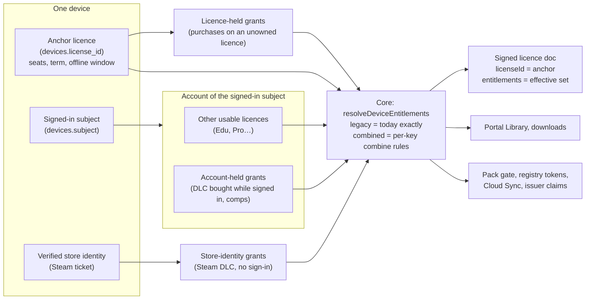

> Research note for [Godot on Polaris Key](../README.md), 2026-10-04. Spike S-19, commissioned
> by the lead on the owner's request of 2026-10-04: "really think hard about the way we have set up
> licenses and entitlements and whether that makes full sense in our SDKs, and current reality. One
> license, multiple entitlements? One entitlement per license, with an account holding multiple
> licenses?" It has no program brief; §9 proposes an `LX-` work-package namespace. Research and
> design only: no product code changed, nothing was deployed, no account or credential was used,
> and no live call was made. File references are to the tree at `e8af86ff` (`W/` =
> `packages/worker/src/`, `M/` = `packages/worker/migrations/`, `N/` =
> `docs/research/2026-09-29-godot-omniplatform/notes/`, `P/` =
> `docs/research/2026-09-29-godot-omniplatform/program/`), except where a line says
> "I-05 branch": that is `wp/I-05-accounts-core` at `5d6a7abc` (status in-review), re-read for this
> revision because it already ships the account columns this design builds on. The I-04 plan was
> read on `main` (approved, done); U-01 on branch `wp/U-01-cloud-sync-plan`; PX-W3 on branch
> `wp/PX-W3-licensed-downloads-plan`. The parallel settings spike S-18 (branch
> `wp/S-18-settings-architecture`) has no note yet; §7.13 says what S-19 hands it. Vendor facts were
> read from the primary pages listed in §12 during the research pass; where a page was not re-read
> for this note the fact is marked [U]. Revised the same day after a critique (15 issues); the
> revision changed the holder default, the rollout model, the migration, the phase numbering and
> the work-package table.

# S-19: the licensing model: licences, grants and entitlements

> **Owner decisions (2026-10-04). These govern the note; where any section below says otherwise,
> these win.** Work packages are registered as `LX-*` in
> [`program/workpackages.json`](../program/workpackages.json), one brief each under
> [`program/wp/`](../program/wp/).
>
> 1. **Decision 1 adopted: model OC.** A licence is an access contract; grants are entitlement
>    reasons; a device's entitlements are combined over its contributors (§7.3.1); each device has
>    exactly one anchor licence (§7.5).
> 2. **Decision 2 accepted.** The signed-in account's licences and grants feed the licence
>    document's _inputs_. S-16 D9 is read as a rule about the document's _content_ (no user claim
>    until I-24, still true). S-17 decision 20's reasoning is amended and its outcome kept:
>    entitlement overrides stay on the licence. Dated amendment notes point here from S-17
>    (decision 20), S-16 (D9) and [`program/plans/I-04.md`](../program/plans/I-04.md).
> 3. **Decision 4: `entitlementHolder: device`.** A device sees the entitlements of the account
>    signed in on that device, or nobody's; a key-entry device sees its licence only.
> 4. **All remaining defaults are accepted as recommended (decisions 3 and 5–23).** In particular:
>    decision 3, `anchorPolicy: rank-first` (I-09 carries §7.5 steps 1–3 inline until LX-10);
>    decision 18, PX-W3's "download grant" is renamed **"download ticket"** before it ships;
>    decision 19, Cloud Sync quotas gain `byEntitlement` (`combine: max`) and keep `byTier` as the
>    highest-rank contributing licence (U-01 §8 Q2).
> 5. **Settings home (S-18).** S-18 is now written and accepted. S-19's per-product licensing
>    settings (§7.13) are claimable `product_settings` rows registered in S-18's registry
>    (S-18 §5.3), not a `products.licensing_json` column; LX-06 builds them that way.
> 6. **Grant source `polaris-key` (S-21 amendment, 2026-10-05).** The owner decided that
>    "`direct` really becomes Polaris Key" (S-21 §6.8). A sale made through Polaris Key itself
>    has the grant source `polaris-key`, not `direct`, and its portal badge reads "Polaris Key".
>    The sections below are updated to match; the LX-08 brief records the same amendment. The
>    distribution outlet id `direct` is unrelated and unchanged.

Evidence tags, as in the other notes: **[V]** read in the code, the docs or a vendor's primary
page; **[M]** measured; **[S]** summarised from a secondary source; **[I]** inference or design;
**[U]** not verified. Spelling: "licence" in prose, `license` in identifiers and in UI copy
(PORTAL.md rule 4).

**Phase names used throughout** (one numbering, used everywhere in this note): **Phase A** =
independent fixes that need no model change; **Phase B** = the model, server-only; **Phase C** =
the device wire (plan mode, all languages); **Phase D** = optional extensions.

## 1. Question

Is "one licence, many entitlements" the right model for Polaris Key, now that S-16 and I-04 give
every person one account that holds a Library of licences? Or should a licence carry one
entitlement and the account hold many licences? The question has to be answered against:

- the SDKs, which today read one signed licence document per device;
- the account layer (I-04 approved; I-05 in review), the portal (PORTAL.md), Cloud Sync (S-17,
  U-01) and licensed downloads (PX-W3), which already assume an account can hold several licences
  per product;
- store purchases (P6-01 commerce bridge), registry tokens (F-20, F-21), Discover and auto-issue,
  and the layer-2 issuer (I-20, I-21);
- the real products: `djdl` and the `polaris-key` system product.

## 2. Short answer

**Keep "one licence, many entitlements", but stop treating the licence as the only thing a device
sees.** Add the two things the model is missing:

1. **Grants.** A grant is one reason someone holds an entitlement: one store purchase, one direct
   sale, one comp, one trial add-on, one bundle line, one IdP claim. Each grant has its own
   source, state, expiry and refund path. `license_store_grants` already is this, for stores
   only, keyed to the wrong holder.
2. **Contributors and a combine step.** A device's entitlements are combined from its **anchor
   licence** (the one licence it runs on, which carries seats, term and offline window), plus
   the licences and grants of **the account signed in on that device**, plus grants held by a
   **store identity verified on that device** (Steam). Each key has a declared combine rule
   (booleans OR, numbers max, arrays union, version window widest, seat limit from the anchor
   only).

A device still runs on exactly **one licence**. The signed document keeps one `licenseId` (the
anchor) and one `entitlements` map. **The holder of account-wide entitlements is the account
signed in on the device, not the licence's owner**, so a shared key never leaks the owner's other
purchases, and a company seat used by an employee carries the employee's own purchases, not the
admin's (§7.3, decision 4).

**Rollout without surprises.** Each product carries `licensing.entitlementModel`: `legacy`
reproduces today's documents **byte for byte, by construction**; `combined` turns the new rules on.
New products start on `combined`. Existing products (`djdl`) stay on `legacy` until the operator
reads a per-product report of every licence whose document would change, and why (§7.3.4), then
switches. Phase B is server-only. Phase C adds optional document members (per-entry `expiresAt`,
`licenseExpiresAt`, provenance) and a 401 `reason`, as a plan-mode, all-languages event that keeps
`PROTOCOL_VERSION` at 4 under the P4-13/P4-19/P4-29 precedent.

**This amends an accepted decision's reasoning.** S-17 decision 20 kept entitlements on the licence
"because moving them to the account would have put an account into the licence document's inputs
and reopened S-16 decision 9" (`N/S-17-user-data-sync.md:2190-2196`). This design does put the
signed-in account's licences and grants into the document's inputs. It keeps D20's _outcome_
(entitlement overrides stay on the licence) and D9's _text_ (no user claim in the document), but
it reads D9 as a rule about the document's content, not about its inputs. That is owner decision 2,
not a footnote (§10.3).

This is the pattern every account-centred system in the survey uses (StoreKit
`currentEntitlements`, RevenueCat `CustomerInfo`, Stripe's active entitlement summary, the Steam
Library, Epic ownership), and it keeps the per-licence seats and offline documents that the
key-centred systems (Keygen, Cryptlex) rely on. **"One entitlement per licence" is rejected**: no
surveyed system does it, it multiplies keys and rows, and seats, offline windows and version
windows do not split per flag (§6).

The answer to the owner's two options is therefore **"both, with a rule"**: an account holds many
licences _and_ many grants for a product; each licence holds many entitlements; a signed-in device
sees their combination; seats live on one licence.



**Independent fixes, needed under any model** (Phase A, §4.3): offline grace outlives licence
expiry; OIDC sign-in renews trials and wipes operator overrides; claim/migrate strands store
purchases; `isEntitled` keeps answering `true` on a revoked install; expired and revoked look the
same on the device; system entitlement names are unreserved; the portal and the device disagree on
flag defaults and tier channels.

**Owner decisions** are collected in §10.3 with recommended defaults. Decision 2 (account in the
document's inputs) gates the model; decision 3 (which licence a signed-in device runs on) blocks
I-09.

## 3. Method

1. Read the licence, tier, profile, device, store-grant, commerce, registry-token and portal-link
   schemas (`M/0001` to `M/0067`), the Core merge and policy code, the licence document builder
   and route, the six SDKs' licence clients, and the Godot commerce client. [V]
2. Read S-13, S-15, S-16, S-17, the I-04 plan, U-01 (branch), PX-W3 (branch), PORTAL.md,
   ADMIN.md §6.5 and WIRE-CONTRACT-V4. Re-read the I-05 branch for its migrations
   (`0068_a`–`0068_e`), device binding and merge code. [V]
3. Surveyed thirteen licensing and entitlement systems from their primary docs (§5). [V]
4. Walked the scenarios in §7.8 end to end against the candidate models. [I]
5. Spot-checked the load-bearing claims in code: unclamped `graceUntil`
   (`W/core/documents.ts:59-92`); the OIDC rewrite (`W/services/identity/oidc.ts:678-690,830-846`);
   the merge rule (`W/merge.ts:25-55`); the layer order with device overrides before policy
   injection (`W/core/payload.ts:139-147`, then `W/core/authz.ts:122-137` →
   `W/core/entitlements.ts:166-215`); first licence wins
   (`W/services/distribution/commerce/state.ts:17-18,300,313`); Play acknowledgement
   (`commerce/play.ts:19-21`); the manifest's tier `maxOfflineDays` alias
   (`packages/shared-manifest/src/index.ts:1613-1645`); the `auto_issue_source` precedent for
   manifest-vs-console authority (`M/0011_auto_issue.sql:9-14`). [V]

No measurement was taken. The D1 cost of the combine step, for documents and for per-request gates,
is an estimate to be measured in LX-09 (§7.3.5).

## 4. Current state

### 4.1 Storage

| Table / column                                             | What it holds                                                                                                                                                                                                                                                | Source                                                                    |
| ---------------------------------------------------------- | ------------------------------------------------------------------------------------------------------------------------------------------------------------------------------------------------------------------------------------------------------------ | ------------------------------------------------------------------------- |
| `licenses`                                                 | `(product, id)`; `status` `active`/`disabled` only; one `tier_id`; `expires_at`; `max_offline_days`; `overrides_json` (config, secrets, entitlements); `sub`, `email`, `groups_json`; `channels_json`, `min_version`, `max_version`; `origin`; `enroll_hwid` | `M/0001_init.sql:64-82`, `M/0002:6-8`, `M/0011:20-32`, `M/0015:68-86` [V] |
| `idx_licenses_sub` UNIQUE `(product, sub)`                 | **at most one OIDC licence per subject per product**                                                                                                                                                                                                         | `M/0012:22` [V]                                                           |
| `idx_licenses_enroll_hwid` UNIQUE `(product, enroll_hwid)` | one free auto-issued licence per machine                                                                                                                                                                                                                     | `M/0011:26-29` [V]                                                        |
| `tiers`                                                    | `label`, one `profile_id`, `policy_expiry_days`, `policy_device_limit`, channels, version window; no rank, no offline days                                                                                                                                   | `M/0001:51-61`, `W/repo.ts:163-178` [V]                                   |
| `profiles`, `license_profiles`                             | payload baselines; an ordered stack per licence                                                                                                                                                                                                              | `M/0001:39-48`, `M/0004` [V]                                              |
| `keys_index`                                               | many keys per licence; a key carries no entitlement scope                                                                                                                                                                                                    | `M/0001:85-96` [V]                                                        |
| `devices`                                                  | PK `(product, device_id)`, one `license_id` (NOT NULL; **`""` = `NO_LICENSE_ID` for a licence-less device**), `overrides_json`, `seat_no` (unique per licence)                                                                                               | `M/0001:99-118`, `M/0014`, `M/0015:15-19`, `W/core/devices.ts:189` [V]    |
| `portal_license_links`                                     | `(account_id, product, license_id)`; many licences per account per product                                                                                                                                                                                   | `M/0017:125-159` [V]                                                      |
| `dist_store_products`                                      | `(store, store_product_id) → deliverable_id, flag`: **one store product, one flag**                                                                                                                                                                          | `M/0052_commerce.sql` [V]                                                 |
| `dist_purchase_bindings`                                   | **one binding UUID per licence**                                                                                                                                                                                                                             | `M/0052` [V]                                                              |
| `dist_purchases`                                           | purchase key hash, state, `license_id` of the **first licence that claimed it**                                                                                                                                                                              | `M/0052` [V]                                                              |
| `license_store_grants`                                     | `(product, store, purchase_key_hash, flag)`, `active`/`revoked`; no expiry, no quantity, value always `true`                                                                                                                                                 | `M/0052` [V]                                                              |
| `dist_access`                                              | `mode` `public`/`authenticated`/`licensed`/`entitled` plus one `entitlement` flag per deliverable                                                                                                                                                            | `M/0038:56-64` [V]                                                        |
| `registry_tokens`                                          | `binding` `owner`/`license`, one `license_id`                                                                                                                                                                                                                | `M/0067:30-46` [V]                                                        |
| `provisioning_config`, `oidc_config.group_role_map_json`   | OIDC claim → entitlement key/value **or a secret** (djdl provisions `polarisVpn` and the secret `proxy.subscriptionUrl`); group → `{role, tier}`                                                                                                             | `M/0001`; `products/djdl/product.json:56-68` [V]                          |
| `products.auto_issue_json` + `auto_issue_source`           | per-product policy whose authority is `manifest` until an operator edits it live (`admin`), after which resync leaves it alone: **the precedent for per-product settings with two writers**                                                                  | `M/0011_auto_issue.sql:9-14` [V]                                          |

**I-05 (branch `wp/I-05-accounts-core`, in review) already ships** [V]:

- `0068_b`: `licenses.account_id TEXT` (NULL = floating); `0068_c`: `devices.subject TEXT`;
  `0068_d`: `devices.bound_by` with `CHECK IN ('key','enroll','register','signin','store')`; one
  `ALTER` per file "(R11-04): a bare ADD COLUMN cannot be made idempotent in SQLite"
  (`0068_b_licenses_account_id.sql` header).
- `0068_e`: `idx_licenses_account ON licenses(account_id, product) WHERE account_id IS NOT NULL`,
  **non-unique** (several licences per account per product are allowed), `idx_devices_subject` on
  `(product, subject)`, and the backfill of `licenses.account_id` from `portal_license_links`
  (oidc, then email, then admin links).
- Licence-less signed-in devices: `registerDeviceBinding` takes `boundBy: 'signin'` and a subject
  "for a licence-less device an account signs in on (an Identity-only product needs no licence
  row)" and mints the token with `licenseId: NO_LICENSE_ID` (`W/core/devices.ts`, I-05 branch,
  around lines 533-598).
- `mergeAccounts` moves "links, licences, sessions, product grants, passkeys and registry tokens"
  to the survivor in one atomic batch, and runs registered subject stores first
  (`services/identity/accounts/merge.ts:1-20`, `core/subjectHooks.ts`).

The table comment still calls a licence "An account" (`M/0001:63`) and the glossary says "license —
an account that holds entitlements" (`packages/docs/src/content/docs/start/concepts.md:176`). I-04
renames it to "a grant of entitlements, optionally attached to an account"
(`P/plans/I-04.md:364-365`). [V]

### 4.2 Where a device's entitlements come from

**The layer stack** (`W/core/payload.ts:112-147`): catalog defaults (config only: flags are
skipped, `:87-94`) → tier profile → licence profiles in order → store grants (`:141`) → licence
overrides (`:142`) → **device overrides (`:145`)**. [V]

**Policy injection after the merge** (`W/core/authz.ts:122-137` calls
`W/core/entitlements.ts:166-215`), all `enforced`: `license.tier`, `license.tierLabel`; `channels`
= union of the tier's and the licence's columns, **replacing** any profile, override _or device
override_ value whenever either column is non-empty; `deviceLimit` = `tier.policy_device_limit`,
**replacing** any licence or device value whenever the tier sets one; `app.minVersion` = the
lower of tier and licence, `app.maxVersion` = the higher (widest window, `:204-215`). Because
device overrides are merged **before** injection, **policy keys beat device overrides today**. [V]
System keys and product flags share one namespace; `djdl` declares `channels`, `app.minVersion`,
`app.maxVersion` and `deviceLimit` as `kind: "flag"` (`products/djdl/catalog.json:439-483`). [V]

**The merge** (`W/merge.ts:25-55`): a higher layer wins, except that a lower `enforced` or `hidden`
entry beats a higher `default` one; `updatedAt` is the max across both layers. Store grants are
`state: "default", value: true` (`W/core/storeGrants.ts:95-119`), so an operator's
`enforced:false` in a tier profile, or any licence or device override, cancels a paid purchase,
"operator wins" by design (`W/core/storeGrants.ts:86-91`). [V]

**OIDC provisioning** (`W/services/identity/oidc.ts:678-690,830-846`): every sign-in rewrites the
existing OIDC licence's `overrides_json` with `provisionedOverrides`, which "applies the
provisioning hooks to an empty payload". So a claim that disappears takes its entitlement with it
at the next sign-in (djdl's `polarisVpn`), and every operator override is wiped at the same time. [V]

**Validation.** The prune passes entitlements through unvalidated (`W/core/payload.ts:184-188`).
The admin override path requires a catalog `flag` key (`W/admin/lib/overrides.ts:58-68`). Store
mappings check only `ENTITLEMENT_PATTERN` (`commerce/admin.ts:209-215`). Provisioning hooks write
any key. [V]

**The signed document** (`packages/shared-protocol/src/license.ts:22-26`, WIRE-CONTRACT-V4 §2.1):
the envelope (`iss`, `aud`, `deviceId`, `issuedAt`, `expiresAt`, `graceUntil`) plus `licenseId`,
`profile` and `entitlements: Record<string, {state, value, updatedAt}>`, where `state` is
`default` (client may override), `enforced`, or `hidden` (enforced and withheld from enumeration)
(`packages/shared-protocol/src/core.ts:108-122`). It carries **no licence expiry, no per-entitlement
expiry, no provenance, no account**. `graceUntil = now + maxOfflineDays` is **not clamped** to
`licenses.expires_at` (`W/core/documents.ts:59-61`). [V]

**Usability.** `licenseUsable` is false for `disabled` and for past `expires_at`
(`W/core/devices.ts:191-198`); the document route answers a bare `401 unauthorized` either way
(`W/services/license/document.ts:110`). Sign-in with no matching tier refuses with `not-entitled`
(`oidc.ts:616,649`). [V]

### 4.3 Gaps

Each gap is numbered for reference from §7 and §9. "A" marks the ones Phase A fixes under any
model.

| #   | Gap                                                                                                                                                                                                                                                                                                                                                                                          | Evidence                                                                                                                                                                               | A   |
| --- | -------------------------------------------------------------------------------------------------------------------------------------------------------------------------------------------------------------------------------------------------------------------------------------------------------------------------------------------------------------------------------------------- | -------------------------------------------------------------------------------------------------------------------------------------------------------------------------------------- | --- |
| G1  | **The device sees one licence; every account surface sees several.** Library shows the "best" licence with a switcher; portal downloads OR across licences; U-01 Q2 takes "the largest limit among the account's usable licences"; the device document, pack gate and registry token use one licence.                                                                                        | `W/services/identity/portal/library.ts:57-66`, `portal/api.ts:288-312`, `portal/downloads.ts:19-28`, PORTAL.md:210-213, U-01 §8 Q2 (branch) [V]                                        |     |
| G2  | **No rule for which licence a signed-in device runs on.** I-04's sign-in path sets `devices.subject` and `bound_by = 'signin'` but never says which of the account's licences the device binds to; D24 refuses key entry of an owned licence on a new device, so sign-in is the only path to it. Today sign-in reaches only the `(product, sub)`-unique OIDC licence. **Blocking for I-09.** | `P/plans/I-04.md:110-148,333-337`; S-16 owner answer 1; `oidc.ts:723-870` [V]                                                                                                          |     |
| G3  | **Purchases follow the first licence, not the person.** "First licence wins" binds a purchase key to one licence forever; enrolled licences are per machine. The same Steam user on a second PC gets `bound_elsewhere`; an iPad restoring purchases gets `binding_mismatch`; a Family Sharing purchase reaches only the purchaser's licence.                                                 | `commerce/state.ts:17-18,300,313`; `commerce/apple.ts:21`; `M/0011` [V]                                                                                                                |     |
| G4  | **A store product maps to one flag; a DLC sold as its own licence is invisible to gates.** Bundles need N mappings; there is no way to sell a DLC key.                                                                                                                                                                                                                                       | `M/0052` (PK of `dist_store_products`); `W/services/distribution/blobAccess.ts:25-33` [V]                                                                                              |     |
| G5  | **A paid purchase can be cancelled by any operator override or `enforced:false` profile entry.**                                                                                                                                                                                                                                                                                             | `W/merge.ts:31-40`; `W/core/storeGrants.ts:86-119` [V]                                                                                                                                 |     |
| G6  | **Claim/migrate strands purchases and ignores seats.** Migrate disables the enrolled licence without moving `license_store_grants` or `dist_purchase_bindings`; `moveDevices` sets `seat_no = NULL` with no seat check.                                                                                                                                                                      | `oidc.ts:756-825`; `W/repo.ts:900-912` [V]                                                                                                                                             | A   |
| G7  | **OIDC sign-in rewrites an existing licence**: `tier_id`, `expires_at = now + policy_expiry_days` (a time-limited tier renews on every sign-in: endless trials) and the whole `overrides_json` (wipes operator overrides of every kind). The tier is the **first** matching group, not the best.                                                                                             | `oidc.ts:617-658,678-690,830-846` [V]                                                                                                                                                  | A   |
| G8  | **No term model beyond one `expires_at`.** No renewal source, no statuses beyond `active`/`disabled`, no grant expiry, no store subscriptions, no dunning or chargeback state.                                                                                                                                                                                                               | `M/0015:68-76`; `commerce/apple.ts:21,239`; S-14 §8 [V]                                                                                                                                |     |
| G9  | **Offline grace outlives licence expiry.** A licence expiring tomorrow with 30 offline days keeps an offline client usable for 30 days. A security gap on every product with time-limited licences.                                                                                                                                                                                          | `W/core/documents.ts:59-61,88` [V]                                                                                                                                                     | A   |
| G10 | **The SDK cannot tell expired from revoked or refunded.** Both are a bare 401; the client maps it to `revoked`, and its `expired` means only "offline grace ran out".                                                                                                                                                                                                                        | `document.ts:110`; `packages/client-core/src/gate.ts:86-89` [V]                                                                                                                        |     |
| G11 | **`isEntitled` ignores licence status.** After a 401 the SDK keeps the document (`lastSyncUnauthorized`), so a revoked or refunded install still answers `isEntitled("dlc") == true` until it wipes. All six SDKs.                                                                                                                                                                           | `packages/sdk-node/src/license/client.ts:107-110`, `sdk-node/src/core/sync.ts:130-131`; §4.4 [V]                                                                                       |     |
| G12 | **Upgrades, seat add-ons and channel add-ons cannot be expressed.** `tier.policy_device_limit` replaces any licence-level `deviceLimit`; tier/licence channels replace profile or grant channels; grants are boolean.                                                                                                                                                                        | `W/core/entitlements.ts:191-202` [V]                                                                                                                                                   |     |
| G13 | **System keys share the product flag namespace** with no reserved-name rule; a product flag of that name is overwritten. "Flag" covers non-booleans.                                                                                                                                                                                                                                         | `W/core/entitlements.ts:185-215`; `packages/shared-catalog/src/types.ts:9,34,51-52` [V]                                                                                                | A   |
| G14 | **Portal and device disagree.** The portal's `entitlementView` falls back to the catalog flag `default`, which documents never include; it shows channels from the licence only.                                                                                                                                                                                                             | `portal/entitlements.ts:57-66`; `W/core/payload.ts:87-94` [V]                                                                                                                          | A   |
| G15 | **Unvalidated entitlements.** Provisioning hooks and store mappings can write undeclared flags.                                                                                                                                                                                                                                                                                              | `W/core/payload.ts:184-188` [V]                                                                                                                                                        |     |
| G16 | **One OIDC licence per subject vs many licences per account.** The unique `(product, sub)` index has no counterpart once `licenses.account_id` holds several licences per product.                                                                                                                                                                                                           | `M/0012:22`; I-05 `0068_e` [V]                                                                                                                                                         |     |
| G17 | **Commerce client parity.** Only Godot can bind and claim. Swift passes `appAccountToken` but has no claim client; Node, React, Python and Kotlin have nothing. The parity row `commerce.receipt` is ○ everywhere with `allowedNa: []`.                                                                                                                                                      | `sdks/godot/addons/polaris_key/services/commerce.gd:1-60`; `sdks/swift/Sources/PolarisKeyPlatform/Store.swift:19-241`; `conformance/parity/features.json:1265-1270`; PARITY.md:406 [V] |     |
| G18 | **Naming clashes.** Swift `Store.entitlements(productID:)` and Godot `pkey_apple.gd` `entitlements()` mean StoreKit's current entitlements; PX-W3 calls its signed download parameter a "grant"; P6-01 calls store rows "store grants"; S-16 uses "floating" for an unowned licence, which the industry uses for concurrent-use licences.                                                    | `Store.swift:198`; `pkey_apple.gd:287`; PX-W3 §1 (branch); S-16 owner decisions [V]                                                                                                    |     |
| G19 | **Stale wording.** `M/0038:26-27` and ADMIN.md:1425-1427 say the `dist_access.entitlement` gate is not enforced; PORTAL.md:181,199 say Cloud Sync does not depend on Identity; `concepts.md:176` and `M/0001:63` say "licence = account"; djdl's catalog says `deviceLimit` 0 means unlimited, but `<= 0` now denies (R11-02, `W/core/authz.ts:329-345`).                                    | as cited [V]                                                                                                                                                                           | A   |
| G20 | **No web checkout source.** No Stripe, Paddle or Lemon Squeezy webhook; a developer selling on their own site calls the admin API from their backend, and has no server route to ask "does subject X hold Y" nor an event when entitlements change.                                                                                                                                          | `W/services/license/admin/licenses.ts` [V]                                                                                                                                             |     |
| G21 | **The manifest's tier `maxOfflineDays` is a legacy alias for licence expiry**, not offline grace, with three warnings; tiers have no offline-grace field at all.                                                                                                                                                                                                                             | `packages/shared-manifest/src/index.ts:1613-1645` [V]                                                                                                                                  |     |

Checked and **not** a gap: the P6-01 Play path acknowledges each granted purchase once, inside
Google's three-day window (`commerce/play.ts:19-21`). [V]

### 4.4 What the SDKs expose today

All six read only the cached licence document, and all define `isEntitled(name)` as "the value is
the boolean `true`". [V]

| SDK    | Licence entitlement API                                                                            | Pack gate                                                    | Commerce                                             |
| ------ | -------------------------------------------------------------------------------------------------- | ------------------------------------------------------------ | ---------------------------------------------------- |
| Node   | `isEntitled`, `getEntitlements`, `entitledChannels`, `getLicenseId` (`license/client.ts:107-130`)  | engine `entitled()` (`client-core/src/packs/engine.ts:3217`) | none                                                 |
| React  | `adapter.isEntitled`, `useEntitlement(name)` (`core/adapter.ts:180-182`, `react/hooks.ts:277-282`) | client-core                                                  | none                                                 |
| Python | `is_entitled`, `get_entitlements`, `entitled_channels` (`license/client.py:109-135`)               | own engine                                                   | none                                                 |
| Swift  | `isEntitled`, `entitlements()` (`LicenseClient.swift:92-100`)                                      | `PacksClient.entitlements()` (`:507`)                        | `appAccountToken` pass-through only (`Store.swift`)  |
| Kotlin | `isEntitled`, `entitlements()` (`LicenseClient.kt:97-100`)                                         | `PacksClient.kt:432-436`                                     | none                                                 |
| Godot  | `is_entitled`, `get_entitlements`, `entitled_channels` (`services/license.gd:112-125`)             | engine                                                       | `get_binding`, `claim`, `is_unlocked`, `hidden_here` |

No SDK can say _why_ a flag is held, _until when_, _from which store_, or whether it is shared.
Node's core never compares `licenseId` across refreshes (`client-core/src/verify.ts:90` only checks
it is a non-empty string) [V]; the other five SDKs' tolerance of a `licenseId` that changes on a
plain refresh is [U]. A `licenseId` change on an explicit activation (key entry or sign-in on a
device already bound elsewhere) already happens today (`W/core/devices.ts:303-306`), so every SDK
handles that path [V]. LX-17 audits the refresh path before anything relies on it.

## 5. Prior art

| System             | Unit of purchase                      | Where entitlements live                                                                      | Account combines?                                      | Lesson for us                                                                                                                                                    |
| ------------------ | ------------------------------------- | -------------------------------------------------------------------------------------------- | ------------------------------------------------------ | ---------------------------------------------------------------------------------------------------------------------------------------------------------------- |
| Keygen [V]         | licence with exactly one policy       | on the policy and on the licence; releases can require them                                  | no (users ↔ licences many-to-many, each checked alone) | add-ons as entitlements on one licence; a separate licence only for its own expiry, billing cycle or machine limit; warns that many licences per user "fragment" |
| Cryptlex [V]       | licence from a template               | entitlement sets plus features, overridable per licence (2025)                               | named users                                            | same layering as tier plus overrides                                                                                                                             |
| LicenseSpring [V]  | licence with a policy                 | features with **their own expiry**; activation / consumption / floating (concurrent)         | no                                                     | per-entitlement expiry, enforced offline                                                                                                                         |
| Lemon Squeezy [V]  | a key per order item                  | none                                                                                         | no                                                     | subscription key expires with the subscription                                                                                                                   |
| Paddle Billing [V] | transaction / subscription            | none; "build this yourself" from webhooks                                                    | customer                                               | it is an input source, like a store                                                                                                                              |
| Stripe [V]         | product                               | features on products; **ActiveEntitlement per customer per feature**                         | **yes**                                                | the customer is the aggregate; **one summary webhook** on any change                                                                                             |
| RevenueCat [V]     | store product                         | entitlement; products ↔ entitlements many-to-many                                            | **yes**                                                | `EntitlementInfo` (isActive, expirationDate, periodType, store, ownershipType); **a per-project restore behaviour: transfer to the new user or keep (block)**    |
| StoreKit 2 [V]     | product                               | `Transaction.currentEntitlements`; several entitling transactions per product since iOS 18.4 | Apple Account, Family Sharing                          | revocation removes one transaction; apps must offer restore                                                                                                      |
| Google Play [V]    | purchase token                        | app grants; acknowledge within 3 days                                                        | Google account                                         | per-token refunds, partial by quantity                                                                                                                           |
| Steam [V]          | AppID licence (each DLC an AppID)     | ownership per AppID (`CheckAppOwnership`: `ownsapp`, `permanent`, `ownersteamid`)            | Steam account                                          | ownership follows the Steam account on every PC; borrowed access is `permanent=false`                                                                            |
| Epic EOS [V]       | offer → items                         | entitlement per item; `QueryOwnership` resolves bundles                                      | Epic account                                           | separate "bought" from "owns"                                                                                                                                    |
| itch.io [V]        | download key claimed into a library   | ownership only                                                                               | library                                                | revoking a key does not remove the game                                                                                                                          |
| JetBrains [V]      | licence per product or pack, assigned | via the pack                                                                                 | JetBrains Account                                      | org licences assigned to employees, who use their own account; perpetual fallback                                                                                |

The RevenueCat restore options' exact labels were not re-read for this revision [U]; S-16 J6 cites
its "Transfer-or-Block restore policy" (`N/S-16-identity-service.md:304`).

Patterns [I]: (1) mature systems separate **feature** entitlements from **ownership** records and
from **policy** values; (2) the licence or purchase is the grant and **the account is where grants
are combined**; (3) SKUs map to features many-to-many; (4) each grant keeps its own lifecycle and
source; (5) a refund removes one grant and the others still entitle; (6) seats belong to a grant,
not to the account; (7) org seats are used under the _user's_ identity (JetBrains); (8) restores
need a stated transfer policy; (9) offline is a signed cached result re-issued when grants change.

## 6. Options compared

### 6.1 The candidates

- **O0: status quo.** One licence per device; the account side picks a "best licence".
- **OA: one product licence per (account, product).** Every purchase, trial and add-on is a grant
  row on it; attaching a second licence for the same product **merges** it into the first.
- **OB: one entitlement per licence.** Every DLC, add-on and feature is its own licence; the
  account aggregates; a device needs several licences.
- **OB′: licence = one purchase, document = union of licences.** Every store purchase and add-on
  becomes a licence; the document carries `licenseIds[]`. A breaking wire change.
- **OC (recommended): licence = access contract, grant = entitlement reason, entitlements combined
  over the device's contributors** (anchor, signed-in account, verified store identity). One anchor
  licence per device for seats and term.
- **OC-lite (fallback if decision 2 is refused):** OC with the anchor as the only contributor: no
  account-held grants, purchases always licence-held, roaming only through the restore policy and
  Steam store identities. No account enters the document's inputs.
- **OD: entitlements on the account; licences become keys.** Contradicts S-17 D20's outcome and
  drops floating licences.

### 6.2 Comparison

| Criterion                                     | O0               | OA                             | OB                  | OB′                           | **OC**                                  | OC-lite                           | OD                      |
| --------------------------------------------- | ---------------- | ------------------------------ | ------------------- | ----------------------------- | --------------------------------------- | --------------------------------- | ----------------------- |
| Device and account agree (G1)                 | no               | yes                            | yes                 | yes                           | **yes, for signed-in devices**          | no (portal still unions)          | yes                     |
| Which licence a signed-in device runs on (G2) | undefined        | the one                        | undefined (needs N) | all                           | **anchor rule**                         | anchor rule                       | n/a                     |
| Purchases roam across a person's devices (G3) | no               | yes                            | yes                 | yes                           | **yes (account, store identity)**       | partly (transfer, Steam identity) | yes                     |
| Refund one item cleanly                       | yes (store rows) | yes                            | yes                 | yes                           | **yes; flag survives another grant**    | yes                               | needs grant rows anyway |
| Unowned key + DLC                             | yes              | yes                            | **no**              | **no**                        | **yes** (licence-held grants)           | yes                               | **no**                  |
| Shared key leaks the owner's other purchases  | n/a              | yes                            | n/a                 | yes                           | **no** (holder = signed-in account)     | no                                | yes                     |
| Two genuine base licences (Edu + Pro)         | switcher         | lossy merge                    | n/a                 | union                         | **union, anchor for seats**             | switcher                          | union                   |
| Seats, term, offline, version window          | per licence      | per merged licence (lossy)     | meaningless per DLC | needs a seat home             | **per licence; anchor decides seats**   | per licence                       | needs new home          |
| Account in the document's inputs (D9/D20)     | no               | no                             | no                  | yes                           | **yes (decision 2)**                    | no                                | yes                     |
| Wire change                                   | none             | none                           | breaking            | **breaking** (`licenseIds[]`) | **none in B; additive optional in C**   | none in B                         | breaking                |
| Industry match                                | key vendors      | Keygen "one licence + add-ons" | none                | Steam store records           | **StoreKit, RevenueCat, Stripe, Steam** | Keygen                            | Stripe (no offline)     |

**Why not OA.** Merging licences on attach is lossy and irreversible: two licences with different
seat pools, terms and tiers cannot become one row without choosing a loser, and a later detach
(I-04 §2.3, S-16 D25) cannot split them again. OA is what OC degenerates to when a holder has one
licence, so OC keeps OA's simplicity for the common case. [I]

**Why not OB/OB′.** Seats, offline windows, version windows and channels do not split per flag; an
unowned key cannot accumulate DLC; keys multiply; the device needs several licences, which breaks
the singular `licenseId` claim. [I]

**Why not OD.** It moves what D20 kept on the licence and drops floating licences. [V/I]

## 7. The recommended design (OC), fully specified

### 7.1 Vocabulary (rule 4; glossary edits in LX-22)

| Term                | Meaning                                                                                                                                                                                                                        |
| ------------------- | ------------------------------------------------------------------------------------------------------------------------------------------------------------------------------------------------------------------------------ |
| **licence**         | An access contract for one product: tier, seats (device limit), term (`expires_at`), offline window, version window, channels, keys. Optionally attached to an account (its owner). A device runs on at most one.              |
| **unowned licence** | S-16's "floating licence": a licence with no owner account. Not a concurrent-use licence; Polaris has no concurrent checkout (§7.8, decision 24). Docs say "unowned (floating)" on first use.                                  |
| **grant**           | One reason someone holds one or more entitlements: a store purchase, a Polaris Key sale, a comp, a trial add-on, a bundle line, a redeemed code, an IdP claim. Own source, state, expiry, refund path.                         |
| **grant holder**    | Who a grant belongs to: an **account** (`account_id`), a **licence** (`license_id`) or a **store identity** (`store_identity_hash`, Steam). Exactly one.                                                                       |
| **entitlement**     | A named value the device and the server gate on. Its **kind** is `feature` (boolean capability), `ownership` (owns an item, usually a deliverable), `policy` (system keys and operator policy) or `quota` (numeric, reserved). |
| **anchor**          | The licence a device runs on (`devices.license_id`). Seats, term and config come from it. A licence-less device has none.                                                                                                      |
| **contributors**    | What a device's entitlements are combined from: the anchor, the account signed in on the device (per `licensing.entitlementHolder`), and store identities verified on the device (§7.3.1).                                     |
| **combine rule**    | How one key's values from several contributors become one value (§7.4).                                                                                                                                                        |
| **effective set**   | The combined entitlement map for one device, produced by one Core function.                                                                                                                                                    |

Rename to free the word "grant": PX-W3's `?grant=` becomes a **download ticket** (`?ticket=`), and
"store grant" becomes a grant with a store source. Swift and Godot StoreKit wrappers keep their
names; their docs say "StoreKit entitlements" (§7.11).

### 7.2 Data model

All new tables are Core-owned unless stated (rule 6). DDL is a sketch; exact columns are fixed in
LX-01. Every migration follows the expand/contract schedule in §7.14: Phase B only **adds**; no
rename, drop or table rebuild happens until the contract step (LX-16).

**`licenses` (existing) gains** (one `ALTER` per migration file, R11-04):

- `kind TEXT NOT NULL DEFAULT 'base' CHECK (kind IN ('base','addon'))`. An `addon` licence carries
  no seats, can never be an anchor, and contributes only while some contributing `base` licence is
  usable. It exists only for direct-sale add-on **keys** (decision 11); most add-ons are grants.
- `ended_reason TEXT NULL CHECK (ended_reason IN ('revoked','refunded','chargeback','superseded'))`,
  set when `status` becomes `disabled`. Expiry stays computed from `expires_at`. Lets the 401 carry a
  reason in Phase C (G10) without widening the `status` trigger.
- `superseded_by TEXT NULL`: the licence that replaced this one (trial → paid, upgrade by new
  licence). Hidden from the Library; kept for history.
- `source TEXT NULL`, `external_ref_hash TEXT NULL` for licences minted from a store base purchase
  or a web checkout, with a partial UNIQUE index `(product, source, external_ref_hash)`.

`licenses.account_id` and its **non-unique** index `idx_licenses_account(account_id, product)` come
from I-05 (`0068_b`, `0068_e`) [V]; S-19 adds nothing to I-05's migrations. `idx_licenses_sub`
stays UNIQUE until I-17 retires `sub`.

**`tiers` (existing) gains:** `rank INTEGER NOT NULL DEFAULT 0` (higher is better; anchor choice,
`license.tier`, OIDC group choice) and `policy_offline_grace_days INTEGER NULL` (the tier default
for `max_offline_days`; deliberately **not** `max_offline_days`, see §7.12 and G21).

**`grants` (new; succeeds `license_store_grants`):**

```sql
CREATE TABLE IF NOT EXISTS grants (
  product              TEXT NOT NULL,
  id                   TEXT NOT NULL,              -- grt_…
  account_id           TEXT NULL,                  -- holder: account (global id; never leaves the Worker)
  license_id           TEXT NULL,                  -- holder: licence
  store_identity_hash  TEXT NULL,                  -- holder: store identity, e.g. H(product,'steam',steamid)
  source               TEXT NOT NULL,              -- app-store | play | steam | polaris-key | comp | trial | bundle | redeem | oidc
  external_ref_hash    TEXT NULL,                  -- purchase key hash, order id hash
  sku                  TEXT NULL,                  -- store product id or catalog SKU
  order_ref            TEXT NULL,                  -- groups grants of one order or bundle for refunds
  state                TEXT NOT NULL,              -- active | past_due | revoked | refunded | suppressed
  granted_at           INTEGER NOT NULL,
  expires_at           INTEGER NULL,               -- NULL = perpetual
  grace_until          INTEGER NULL,               -- refund / dunning grace end (§7.6)
  shared               INTEGER NOT NULL DEFAULT 0, -- family-shared / borrowed
  trial                INTEGER NOT NULL DEFAULT 0,
  created_by           TEXT NOT NULL,              -- admin id, 'commerce', 'oidc', 'webhook:<id>'
  modified_at          INTEGER NOT NULL,
  PRIMARY KEY (product, id),
  CHECK ((account_id IS NOT NULL) + (license_id IS NOT NULL) + (store_identity_hash IS NOT NULL) = 1)
);
CREATE INDEX IF NOT EXISTS idx_grants_account ON grants(product, account_id) WHERE account_id IS NOT NULL;
CREATE INDEX IF NOT EXISTS idx_grants_license ON grants(product, license_id) WHERE license_id IS NOT NULL;
CREATE INDEX IF NOT EXISTS idx_grants_store ON grants(product, store_identity_hash) WHERE store_identity_hash IS NOT NULL;
CREATE UNIQUE INDEX IF NOT EXISTS idx_grants_ref ON grants(product, source, external_ref_hash)
  WHERE external_ref_hash IS NOT NULL;

CREATE TABLE IF NOT EXISTS grant_entitlements (  -- one grant, many keys (bundles, Deluxe SKUs)
  product    TEXT NOT NULL,
  grant_id   TEXT NOT NULL,
  key        TEXT NOT NULL,
  value_json TEXT NOT NULL DEFAULT 'true',        -- boolean, or integer for seat packs / quotas
  state      TEXT NOT NULL DEFAULT 'default',     -- ManagedEntry state; only `oidc` grants copy a non-default one
  PRIMARY KEY (product, grant_id, key)
);

CREATE TABLE IF NOT EXISTS device_store_identities (  -- Steam identities verified on a device
  product              TEXT NOT NULL,
  device_id            TEXT NOT NULL,
  store                TEXT NOT NULL,              -- steam (others only if they gain a per-device proof)
  store_identity_hash  TEXT NOT NULL,
  verified_at          INTEGER NOT NULL,
  PRIMARY KEY (product, device_id, store)
);

CREATE TABLE IF NOT EXISTS holder_versions (     -- cache key for the effective set (§7.3.5)
  product      TEXT NOT NULL,
  holder_kind  TEXT NOT NULL,                     -- account | license | store
  holder_id    TEXT NOT NULL,
  version      INTEGER NOT NULL,
  PRIMARY KEY (product, holder_kind, holder_id)
);
```

**Seat-pack grants are always licence-held.** A grant that carries `deviceLimit` (a seat pack)
must name a licence: a mapping or admin action of kind `seats` targets the claiming device's
anchor, or a licence picked in the console or portal, never the account. This resolves the
"account-held vs held on the anchor" conflict: seat packs belong to one contract. [I]

**Commerce (Distribution-owned, `M/0052` successors; all additive):**

- `dist_store_product_entitlements(store, store_product_id, key, value_json)` (many-to-many, G4),
  plus `dist_store_products.grants_kind` (`addon` | `base` | `seats`, default `addon`) and
  `base_tier_id`. The old `flag` column stays and keeps being written until LX-16.
- `dist_holder_bindings(product, holder_kind, holder_id, binding, created_at)` (new table),
  `dist_binding_aliases(product, binding, holder_kind, holder_id)` for bindings that survive an
  account merge. The existing `dist_purchase_bindings` stays the source for licence holders.
- `dist_purchases.grant_id TEXT NULL` (added, not renamed); `license_id` stays until LX-16.
- `dist_commerce_settings(product, store, restore_policy, transfer_cooldown_days)` (§7.7, §7.13).

**Unchanged:** `devices.license_id` (read as "anchor"; `NO_LICENSE_ID` = no anchor), `seat_no`,
`license_profiles`, `keys_index`, `profiles`, `registry_tokens`.

### 7.3 Resolution: one Core function

`resolveDeviceEntitlements(db, product, device, now) → { entitlements, provenance, terms }` in
`W/core/holder.ts`. Every gate calls it; nothing else computes entitlements. It has two modes,
chosen per product by `licensing.entitlementModel` (§7.13).

#### 7.3.1 Contributors

- **Anchor** `A`: the device's licence, or none when `license_id = NO_LICENSE_ID`.
- **Holder account** `H`, by `licensing.entitlementHolder`:
  - `device` (**default**, decision 4): the account of `devices.subject` when the device is signed
    in; otherwise none. A key-entry or enrolled device that nobody signed in on sees its anchor
    and the anchor's licence-held grants only, exactly the unowned behaviour of today.
  - `owner` (opt-in): as `device`, but a device with no signed-in subject falls back to
    `A.account_id`. The console warns: "Anyone with a key to one of this person's licences sees
    every purchase they hold for this product." It exists for products without Identity whose
    developers want portal-attached licences and comps to reach key-entry devices.
- **Store identities** `S`: the rows of `device_store_identities` for this device whose
  `verified_at` is inside the store's re-check window (Steam: 7 days, matching the weekly
  `CheckAppOwnership` re-check, `commerce/steam.ts:5-20`).

**Team and named-user seats (I-24).** An employee signed in with their own account on a seat of a
company licence owned by an admin: `A` = the company licence, `H` = the employee's account. The
device gets the company licence's slice plus the employee's own licences and grants, **never the
admin's personal licences or grants**. That matches JetBrains-style org assignment. [I]

**Products without Identity.** No device is ever signed in (S-16 final answer 3: without Identity
key entry is the only activation path, unlimited). Under `device`, account-held grants never reach
a device; so on these products **grants are created licence-held**: the portal's "apply to
licence" picker and the admin comp action target a licence, store claims bind to the anchor's
licence holder, and the Library shows account-held items with "Apply to a licence". `owner` is the
explicit alternative. [I]

**Licence-less devices.** An Identity-only device (`requires-identity`, I-05's `signin` binding
with `NO_LICENSE_ID`) has no anchor. No licence document is minted for it (the route answers as it
does today for a licence-less device [U: LX-01 records the exact answer]). Server-side gates that
do not need a licence (Cloud Sync `requiresFlag`, the I-21 issuer's `pkey:entitlements` claim)
read `H`'s account-held and store-held grants with the combine rules. `licensed` and `entitled`
access modes still require a usable anchor and refuse as today (decision 23). A product running
Config with License off (D-08) never calls the resolver: no licences, no grants, and the config
document needs no licence gate. A free-to-play product that sells DLC keeps using auto-issue for
a free base licence, so its devices have an anchor.

#### 7.3.2 Algorithm

**`legacy` mode** (default for existing products): the resolver reproduces today's composition
exactly: `A`'s layer stack (tier profile → licence profiles → **active store and `oidc` grants of
`A` rendered as one layer at today's store-grant position** → licence overrides → device overrides)
then `injectAdminPolicy(A)`. No other contributor is read. A property test over the conformance
fixtures and a snapshot of every live product's documents proves byte identity (LX-09).

**`combined` mode:**

1. **Licences.** `{A}` plus `H`'s usable licences of this product (`licenseUsable`, by
   `idx_licenses_account`). `addon` licences contribute only if a contributing `base` licence is
   usable. `A` contributes even when owned by an account other than `H` (I-24 case).
2. **Per-licence slice.** For each licence `L`: tier profile → licence profiles → licence
   entitlement overrides (S-17 D20), merged with today's `mergeMap`.
   - **For `A` only:** merge `A`'s device overrides **for reserved keys** (§7.4) into the slice,
     then `injectAdminPolicy(A)`. This keeps today's rule that policy beats a device override of
     `channels`, `deviceLimit`, `app.*` and `license.*`. [V: today's order, §4.2]
   - **For every other `L`:** `injectAdminPolicy(L)`.
3. **Grants.** Licence-held grants of every contributing licence, account-held grants of `H`,
   store-held grants of `S`, with `state` `active` (or `past_due`, or `refunded`/`revoked` while
   `grace_until` is in the future) and `expires_at` null or in the future; expanded through
   `grant_entitlements` into entries with `updatedAt = modified_at`.
4. **Combine** per key across the slices and the grants by the key's combine rule (§7.4):
   - **`feature` and `ownership` keys:** a grant cannot be cancelled by a slice. `any(slice false
enforced, grant true)` is `true` (G5, decision 6). Suppressing a purchase is an explicit,
     audited `state = 'suppressed'` on the grant.
   - **`policy` keys:** `A`'s slice value wins when it is `enforced` or `hidden` (operator kill
     switch); otherwise the combine rule applies.
   - **State of the combined entry:** the strongest state (`hidden` > `enforced` > `default`) among
     the contributors whose value equals the combined value. **`updatedAt`:** the max over _all_
     contributors, including those that lost, so any change in any contributor changes the ETag.
5. **Device overrides for non-reserved keys** last, with `mergeMap` semantics, as today (an
   explicit per-device support action, audited). So a support `default:false` on a DLC still beats
   a grant on that one device, which is today's behaviour.
6. **Terms** from `A` only: `max_offline_days` (falling back to the tier's
   `policy_offline_grace_days`, then the product default), `expires_at`, seats.
7. **Config is not combined.** The config slice comes from `A`'s tier and profiles, then S-17's
   account override layer, as U-01 specifies. **Re-anchoring therefore changes config** (a different
   tier profile); §7.5 limits re-anchoring and the console and portal say so.

#### 7.3.3 What a single-licence device sees in `combined` mode

The earlier draft claimed byte identity for every holder with one licence and no extra grants.
That is false. In `combined` mode a device with one licence and no account contributors gets a
**different** document when, and only when [V for today's behaviour; I for the delta]:

| #   | Population                                                                                                              | Why it changes                                                                             | Direction     |
| --- | ----------------------------------------------------------------------------------------------------------------------- | ------------------------------------------------------------------------------------------ | ------------- |
| C1  | A store grant's key is also set to another value by a tier profile entry (`enforced`/`hidden`) or by a licence override | Grants are no longer cancelled by slices (G5)                                              | widens (paid) |
| C2  | The tier sets `policy_device_limit` and the licence (column, profile or override) also sets `deviceLimit`               | The licence value now wins over the tier default; seat packs add (§7.4)                    | either        |
| C3  | `channels` comes from a profile, override or grant **and** the tier or licence channel columns are non-empty            | Union instead of replacement (§7.4)                                                        | widens        |
| C4  | A licence override or profile collides with a provisioned (`oidc`) key                                                  | The `oidc` grant now combines with `any` instead of sharing one bucket with operator edits | either        |
| C5  | Any device of an unowned licence whose grants moved to it from a migrated-away licence (G6, after LX-03)                | Those grants now count                                                                     | widens (paid) |

Device overrides of reserved keys keep losing to policy (step 2); device overrides of other keys
keep winning (step 5). Everything else is equal to `legacy` [I], which the property test checks.

#### 7.3.4 The holder report

`POST /manage/api/products/<p>/licensing/report` (admin, read-only) runs both modes for every
active device and lists every device whose document would change between `legacy` and `combined`,
key by key, tagged C1–C5 or "multi-licence account" or "store identity". It also lists the
licences hit by the grace clamp (§7.6) and the products' reserved-name declarations (§7.4). An
operator switches `entitlementModel` only after reading it. The LX-09 gate is therefore: **`legacy`
byte-identical for every live document; `combined` diff equal to the report**, not "identical".

#### 7.3.5 Cost and caching

Documents: one extra indexed query for `H`'s licences and one for grants. Documents are served at
most once per refresh interval per device and are ETag-cached; estimate under 2 ms of D1 time
[I/U]. **Per-request gates are the bigger cost:** `entitledAccess` (pack, release and file gates)
and registry `authorize` run on every download or package request (`W/core/entitledAccess.ts:344-377`,
`registry/authorize.ts:403-410`). LX-09 measures both with the Worker benchmark harness and, unless
the measurement says otherwise, caches the effective set per `(product, device, anchor)` in KV,
keyed by the `holder_versions` of every contributor (one D1 read of up to three version rows per
request), with each licence, grant, override or device write bumping its holder's version in the
same batch. A revocation is therefore visible on the next request. [I]

**Callers to switch** (LX-09): `W/services/license/document.ts` (document and offline bundle),
`W/core/entitledAccess.ts` (pack, release and file gates), `registry/authorize.ts` (entitled feeds),
`portal/api.ts` (`accountMayDownload`), `portal/entitlements.ts`, `portal/library.ts`,
`portal/downloads.ts`, identity `/session`, S-17's `requiresFlag` and quota hooks (U-02), and the
I-21 issuer's `pkey:entitlements` claim. The portal, which has an account but no device, calls the
same function with a synthetic "signed-in, no anchor" device for the account, plus each licence as
a candidate anchor.

### 7.4 Combine rules, entitlement kinds and reserved names

**Catalog fields** (rule 9; `packages/shared-catalog/src/types.ts`): each `flag` gains optional
`combine` and `entitlementKind`. Catalog kinds stay `config | secret | flag`; `entitlementKind` is
a field **on a flag**, not a new catalog kind.

| Field             | Values                                               | Default                                                                                            |
| ----------------- | ---------------------------------------------------- | -------------------------------------------------------------------------------------------------- |
| `entitlementKind` | `feature`, `ownership`, `policy`, `quota` (reserved) | `ownership` if the flag is named by a `dist_access.entitlement` or a store mapping, else `feature` |
| `combine`         | `any`, `all`, `max`, `min`, `sum`, `union`, `anchor` | by JSON type: boolean `any`; number `max`; array of strings `union`; anything else `anchor`        |

An undeclared key (a provisioning hook or an older mapping writing a key not in the catalog, G15)
combines by its value's type and is `feature`. LX-08 makes new mappings and hooks refuse
undeclared keys; existing ones are listed by the holder report.

**Reserved policy keys** (fixed rules; `entitlementKind: policy`; G13):

| Key                                 | Rule across licences                                                                    | Why                                                                    |
| ----------------------------------- | --------------------------------------------------------------------------------------- | ---------------------------------------------------------------------- |
| `channels`                          | `union`                                                                                 | any licence that may see `beta` is enough                              |
| `app.minVersion`, `app.maxVersion`  | widest window (lowest min, highest max)                                                 | matches today's tier + licence rule (`W/core/entitlements.ts:204-215`) |
| `deviceLimit`                       | **`A` only**: tier default → licence value → plus `sum` of seat-pack grants held on `A` | seats belong to one contract                                           |
| `license.tier`, `license.tierLabel` | highest `tiers.rank` among contributing licences, ties to `A`                           | the badge shows the best tier the person holds                         |
| `license.*`, `app.*`, `pkey.*`      | reserved prefixes for future system keys                                                | stop collisions now                                                    |

**Reserved-name rollout** (decision 15): a catalog or manifest flag with a reserved name is
**always valid when compatible** (its schema matches the system key's type: `channels` array of
strings, `deviceLimit` integer, `app.*` semver string; a narrowing `enum` or `pattern`, and
`label`, `category`, `description`, `default`, `ui`, `userGrant`, `grantLabel` allowed). An **incompatible** declaration first produces a **warning** for a window (default: two
minor releases or 60 days, whichever is later), then an error. The switch is a platform setting
(`licensing.reservedNames: warn | error`, S-13's registry, platform scope) so the window ends by
configuration, not by a code change. The console lists every **registered** product (in-repo or
third-party) with a reserved-name declaration and whether it is compatible. `djdl`'s four
declarations are compatible [V: `catalog.json:439-490` declares `channels` as a unique array of
enumerated strings, `app.*` as semver-pattern strings, `deviceLimit` as an integer 0–100], so djdl never
breaks; only its `deviceLimit` "0 => unlimited" copy changes (G19).

**Seat and channel add-ons** apply only in `combined` mode (C2, C3): `deviceLimit` from the tier
becomes a default that a licence value overrides, and profile and grant `channels` are unioned
with the columns.

A future v5 could move policy keys out of `entitlements` into their own claims; this plan keeps
them in place for wire compatibility and only reserves the names. [I]

### 7.5 Anchor selection, seats and re-anchoring

**Choosing the anchor** (Core, server-only) when a device binds by sign-in, by attach, by Discover
"Add to library", or by a store base-purchase claim:

1. candidates: `H`'s usable `base` licences with a free seat (`authorizeDevice` would succeed);
2. order by `licensing.anchorPolicy` (decision 3): **`rank-first`** (default: highest `tiers.rank`,
   then no expiry before expiry, then latest `expires_at`, then earliest `activated_at`),
   `most-free-seats`, or `oldest`;
3. none: if the product has auto-issue (`autoIssue.tierId`), mint one (origin `oidc`, as today's
   `activateFromIdentity`); else refuse with today's sign-in refusal, `not-entitled`
   (`oidc.ts:649`), **with no new reason value in Phase B**. The `reason: no_base_licence` member is
   a Phase C wire addition (§7.10).

**When `licenseId` may change** is governed by `licensing.reanchor` (decision 10):

- `onActivation` (**default**): only on an explicit activation (sign-in, key entry, attach), where
  the SDK already receives a new document from the activation call and today's SDKs already cope
  (`W/core/devices.ts:303-306`). No silent change on refresh.
- `onRefresh`: the document route also re-binds silently when `A` became unusable (expired trial,
  refunded, revoked) and `H` has another usable base licence with a free seat; and the portal's
  "Run this device on" takes effect at the next refresh. **Available only after LX-17's audit
  shows all six SDKs tolerate a `licenseId` change on refresh** (or LX-19 fixes the ones that
  don't).
- `never`: a device stays on its licence until the person re-activates.

Re-anchoring changes config as well as entitlements (§7.3.2 step 7); the audit entry and the
portal device card say "now runs on Pro: settings follow the Pro tier".

**Key entry** keeps binding the device to the entered key's licence, as today. With
`entitlementHolder: device` that device sees the licence's own slice and licence-held grants only,
whoever owns the licence (T1 closed). With Identity on, D24 limits key entry of an owned licence
to devices enrolled before ownership.

**Seats** count only on the anchor. A device occupies one seat in one licence; other licences and
grants contribute entitlements, never seats. Seat packs are licence-held integer `deviceLimit`
grants (§7.2).

**Attaching an auto-issued free licence** (`origin = 'enroll'`) to an account that already holds a
usable base licence for the product: re-anchor its devices to the account's licence (seat-checked;
an activation-time change, allowed under `onActivation`) and mark the free licence
`superseded_by`. Its licence-held grants keep contributing through step 3 while it is a
contributing licence; LX-10 also re-homes them to the account so they survive the free licence's
retirement. Without another base licence, the free licence simply becomes the account's.

**OIDC sign-in on an existing licence** (G7, Phase A then Phase B):

- Phase A (LX-02): set `name`, `email`, `groups_json`; stop touching `tier_id` and `expires_at`;
  replace **only the keys the product's provisioning declares** (entitlement and secret keys),
  removing a declared key whose claim disappeared, and leave every other override key alone.
  Revocation on claim loss is preserved; operator edits survive.
- Phase B (LX-08): provisioned entitlement keys move to `source = 'oidc'` grants (re-evaluated on
  every sign-in, revoked when the claim disappears) **in the same migration and deploy that switch
  the sign-in writer** (§7.14). Provisioned **secrets** stay a licence-override write until U-03
  moves secrets to the account override layer, which then becomes their target.
- `identity.syncTierOnSignIn` (`off` default | `upgradeOnly`): when `upgradeOnly`, sign-in may move
  the licence to a higher-`rank` tier and never extends `expires_at`. The group → tier map picks the
  **highest-rank** matching tier, not the first (needs `tiers.rank`, so LX-08).

### 7.6 Lifecycle: terms, trials, subscriptions, refunds, dunning, upgrades, bundles

- **Licence term.** `expires_at` on the licence. `graceUntil = min(now + maxOfflineDays,
A.expires_at)` when `licensing.clampGraceToExpiry` is on: **default on for every product**
  (decision 7), switched on per product after the holder report lists the affected licences
  (those with an `expires_at` within `maxOfflineDays`), with a per-product opt-out. The anchor's
  expiry also travels as `licenseExpiresAt` in Phase C. G9 is a security gap; leaving it open by
  default on existing products is not justified when the fix changes nothing for perpetual
  licences (djdl has `policyExpiryDays: null`, `products/djdl/product.json:49-55`) [V].
- **Grant term.** `grants.expires_at` for add-on subscriptions and time-boxed DLC. Expired grants
  drop out at the next document; Phase C puts `expiresAt` on the entry so new SDKs drop it offline
  too. `graceUntil` is **not** clamped to a grant's expiry (that would end base access offline).
- **Trials.** Either a base licence on a `trial` tier (rank 0) with `expires_at`, which a paid
  licence supersedes; or a grant with `trial = 1`. Sign-in never renews either (LX-02).
- **Refunds and chargebacks** revoke **one grant** (`state = 'refunded'`, or a base licence's
  `ended_reason = 'refunded' | 'chargeback'`). `licensing.refundGraceHours` (default **0**) sets
  `grace_until` so an operator can let a refunded item linger briefly (support, partial refunds);
  chargebacks ignore the grace. A flag stays held if another active grant or licence gives it,
  which is right for a person who bought it twice (StoreKit 18.4 semantics). `order_ref` revokes
  every grant of one bundle order together.
- **Dunning** (subscription sources, Phase D): a failed renewal sets `state = 'past_due'` and
  `grace_until = now + licensing.dunningGraceDays` (default **0**; Apple's and Play's own billing
  grace periods arrive as store states and map onto the same column). The grant counts until
  `grace_until`.
- **Subscriptions** (Phase D, LX-23): Apple auto-renewables and Play subscriptions map onto
  `grants.expires_at` (add-on) or `licenses.expires_at` (base mapping), renewed by the server
  notifications the commerce bridge already receives for refunds. A web checkout source (Stripe or
  Paddle webhook) creates `polaris-key` grants or base licences through the same mapping table.
- **Upgrades.** Same contract: change `tier_id` in place (audited). Store- or checkout-driven
  upgrade: a new licence plus `superseded_by` on the old one; devices move at their next activation
  (or refresh, under `onRefresh`).
- **Bundles.** Within one product: one grant with several `grant_entitlements` keys. Across
  products: one grant per product sharing `order_ref`; products are separate tenants, so there is
  no cross-product grant.
- **Shared access.** `grants.shared = 1` for Family Sharing or Steam `permanent = 0`. The
  entitlement holds; Phase C exposes it so developers can gate purchaser-only rewards.
- **Gifting and transfer** (decision 20): a licence moves between accounts only by its owner's
  detach or a developer reassign (S-16 §5.1, unchanged). A grant moves only by a developer's
  audited "Move grant" action (to another account or licence of the same product). Customer
  gifting of a direct-sale item is a **gift code**: the purchaser receives a redeem code (LX-25)
  that creates the grant on the redeemer's holder. Store gifts (Steam) arrive as the recipient's
  own ownership and need nothing.
- **Perpetual fallback** (JetBrains): out of scope; the model allows it as a grant that sets
  `app.maxVersion` when a subscription lapses (§10.2).

### 7.7 Store purchases under OC

**Binding per holder.** `GET <p>/commerce/binding` returns the binding of the device's grant
holder: the account × product binding (`dist_holder_bindings`) when the device is signed in, else
the anchor licence's existing binding (`dist_purchase_bindings`). Existing per-licence bindings
stay valid forever: a claim carrying a licence binding resolves to that licence.

**Restore policy** (per product and store, `dist_commerce_settings.restore_policy`, decision 8),
applied when a valid purchase arrives from a holder other than the one that first claimed it:

| Policy                    | Effect                                                                                                                        | Default for                |
| ------------------------- | ----------------------------------------------------------------------------------------------------------------------------- | -------------------------- |
| `share-by-store-identity` | the grant is held by the store identity; any device that proves that identity (a fresh Steam ticket) contributes it           | **Steam**                  |
| `transfer`                | the grant moves to the new holder (audited; the old holder's owner is notified; optional `transfer_cooldown_days`, default 0) | **App Store, Google Play** |
| `block`                   | today's `bound_elsewhere`                                                                                                     | none (operator choice)     |

- **G3, second Steam PC or Steam Deck without Identity:** solved by the store identity. The
  purchase key already embeds the steamid (`steam:<steamid>:<dlcAppId>`), and the device proves it
  with its own ticket, so the grant is held by `H(product, 'steam', steamid)` and every PC where
  that Steam user plays contributes it. That is Steam's own semantics.
- **G3, iPad restore without Identity:** Apple gives an app no stable per-Apple-ID identifier, and a
  signed transaction is not device-bound [I], so a store-identity holder is not available. Under
  `transfer` the restore moves the grant to the iPad's licence (one holder at a time, so sharing a
  transaction cannot multiply access). With Identity, both devices signed in to one account need
  no transfer at all.
- **One Apple ID across two Polaris accounts:** under `transfer` the second account's restore
  succeeds and moves the grant, and the first account is notified; under `block` it fails with
  `bound_elsewhere`, which is App Review risk because Apple requires a working restore. Hence
  `transfer` as the default. [I]
- **First claim wins only the first holder**, not forever: "first licence wins" (`state.ts:17-18`)
  becomes "first holder, then the restore policy".
- **Addon, base and seats mappings.** An `addon` mapping creates a grant (now holder-keyed and
  many-to-many). A `base` mapping **mints a licence** with `source`/`external_ref_hash` and
  `base_tier_id`, removing "enrol first" for store-sold base games. A `seats` mapping creates a
  licence-held seat-pack grant on the claiming device's anchor.
- **Unowned licence holders:** grants held on the licence, as today. When the licence is later
  attached, its grants keep contributing; LX-10 re-homes them to the account at attach time so
  they survive a later retirement of the licence (detach rules below still apply).
- **Detach** (I-04 §2.3, S-16 D25): licence-held grants leave with the licence; account-held grants
  stay with the account.
- **Account merge** (S-16 D21; I-05 `mergeAccounts`): in the same atomic batch that moves the
  absorbed account's licences, LX-13 adds statements that move account-held grants to the survivor
  (no collision is possible: `idx_grants_ref` is unique per product and source), keep the
  survivor's account × product binding and record the absorbed binding in `dist_binding_aliases`
  (so purchases already tagged with the old `appAccountToken` still resolve), re-key
  `dist_purchases` first-held by the absorbed account, and bump both holders' versions. Devices
  bound to the absorbed subject are already re-keyed by I-05.
- **Refunds** keep landing per purchase hash and now update the grant.

### 7.8 Scenarios

| Scenario                                                       | Under OC                                                                                                                              |
| -------------------------------------------------------------- | ------------------------------------------------------------------------------------------------------------------------------------- | ---------------------------------------------------------------------- |
| Base + 3 DLC bought on Steam, Apple and Polaris Key, signed in | Base licence anchors; three account-held grants; every signed-in device sees all three                                                |
| Same, no Identity                                              | Steam DLC via store identity on every PC; Apple DLC via transfer on restore; Polaris Key DLC licence-held (portal "apply to licence") |
| Trial → paid                                                   | Paid licence supersedes; device moves at next activation (or refresh under `onRefresh`)                                               |
| Shared key on a forum                                          | Key-entry devices see that licence only; with Identity, D24 and entry limits; no owner purchases leak                                 |
| Company licence, employee signs in on a seat (I-24)            | Company slice + employee's own grants; never the admin's                                                                              |
| Identity-only F2P product, DLC bought while signed in          | Licence-less device; Cloud Sync and issuer see the grant; packs need an anchor, so use auto-issue                                     |
| Refund of one DLC                                              | Grant `refunded`; flag remains only if another grant holds it                                                                         |
| Chargeback                                                     | Grant `refunded` with no grace; base licence `ended_reason = chargeback`                                                              |
| Subscription lapse with dunning                                | `past_due` until `grace_until`, then dropped (Phase D)                                                                                |
| Gift of a direct-sale DLC                                      | Gift code redeemed into the recipient's holder (LX-25)                                                                                |
| Account merge                                                  | Grants, bindings and first-held purchases move to the survivor; old binding aliased                                                   |
| Concurrent-use ("floating" in the industry sense)              | **Not supported.** Seats are activation-based. A future tier option `seatMode: activation                                             | concurrent` with leases (Keygen leasing) is out of scope (decision 24) |
| Offline device                                                 | Verifies the document offline; grace clamped to the anchor's expiry; per-entry expiry from Phase C                                    |

### 7.9 APIs

**Device wire, Phase B: no change.** Same routes, same document shape, same error codes and no new
error members. Behaviour changes the corpus does not observe: the combined map (in `combined`
mode), the anchor choice at activation, a claim succeeding across a holder's devices, restore
transfer.

**Admin API** (rule 10: OpenAPI + `routeCoverage`):

- `GET/POST /manage/api/products/<p>/grants`, `GET/PATCH /…/grants/<id>` (revoke, suppress,
  extend, move), filters by holder, source, state;
- `POST /…/licenses/<id>/grants` and `POST /…/subjects/<subject>/grants` (holder by pairwise
  subject; the global account id never appears, I-04 §6.2);
- **`GET /…/subjects/<subject>/entitlements[?key=]`**: the effective set an account holds for the
  product (no device: the portal composition), so a developer backend can ask "does subject X hold
  Y" (G20);
- `GET /…/licenses/<id>/entitlements?device=<id>` → the effective set with per-key provenance for
  the console's explain view;
- **`entitlements.changed` event** on the existing subject-event outbox (I-05 `subject_events`) and
  the developer webhook, with `{subject?, licenseId?, keys[]}`, emitted when a holder's version
  bumps (the Stripe summary-webhook lesson, §5);
- tiers: `rank`, `policyOfflineGraceDays`; catalog: `combine`, `entitlementKind`;
- commerce: mappings `entitlements[]`, `grantsKind`, `baseTierId`; settings `restorePolicy`,
  `transferCooldownDays`;
- licensing settings (§7.13); `POST /…/licensing/report` (§7.3.4).

**Portal API:** `GET /api/library` and the product page read the effective set per product with
provenance and the list of licences. `POST /api/devices/<id>/anchor {licenseId}` ("Run this device
on") ships only with `onRefresh` (LX-21).

### 7.10 Wire impact (plan mode)

**Phase B** (LX-08 to LX-16) changes no signed document shape, no discovery field, no error code
and no error member. The reserved-name rule is a manifest drift gate, not wire. Plan mode still
applies to **LX-11** (commerce claim semantics and restore transfer are device-visible behaviour)
and to **LX-01** (the plan).

**Phase C** (LX-18, LX-19) is **an all-languages event** (AGENTS.md rule 2):

1. contract: WIRE-CONTRACT-V4 §2.1 and §3.2 amendment (`entitlements[k].expiresAt`,
   `licenseExpiresAt`, `grants`), §3.6 grace clamp note, error-body `reason` on licence 401s
   (`expired`, `revoked`, `refunded`, `superseded`) and on `403 not_entitled` from sign-in
   (`no_base_licence`, `device_limit`);
2. catalog: `shared-protocol` (`LicenseDoc`, `ManagedEntry`, `licenseGrantsOf(doc)`), parity
   `errors.json`, `features.json` rows `license.entitlementInfo`, `license.grants`,
   `license.statusReason`;
3. corpus: appended `licenseCases` proving an old v4 verifier accepts populated members, new
   `licenseContentCases` with `expect.entitlements` after expiry, gate-matrix cases for
   `isEntitled` after a 401 and after an entry's `expiresAt`; `pnpm gen corpus`, `gen constants`,
   `gen transcripts`;
4. SDKs: client-core, Node, React, Python, Swift, Kotlin, Godot, plus the four UI kits.

The `grants` member carries `{source, keys[], expiresAt?, trial?, shared?}` (≤ 32 entries), **no
licence id other than the anchor, no store tokens, no order refs, no account id, no store identity
hash**. All new members are outside the claims (WIRE-CONTRACT-V4 §3.2): malformed means ignored,
never fatal, and an older v4 SDK ignores them.

**`PROTOCOL_VERSION`.** Rule 2 says a wire change bumps it; the P4-13, P4-19 and P4-29 precedents
added members outside the claims and kept **4** because no claim changes and older clients ignore
them (WIRE-CONTRACT-V4 §2.4). This plan follows the precedent; the lead confirms in LX-18's
plan-mode review (decision 9).

**The issuer layer (I-20, I-21).** "Sign in with <Product>" tokens carry `pkey:entitlements`
claims (`N/S-16-identity-service.md:826-828`). Those claims are the effective set of the token's
`sub` (the pairwise subject, so `H` = that account, no device): the same Core function, the same
combine rules. Issuer tokens are a new signed artefact outside the corpus (S-16 §5.3), so this
adds no corpus work, but I-20's plan must name the resolver as the claim source.

### 7.11 Console, portal and SDK surface

**Console (ADMIN.md §6.5 amendments):**

- **Licence record**: an **Entitlements** tab (the effective set for a chosen device or for the
  licence alone, each key with value, kind, combine rule and contributors) and a **Grants** tab
  (source badge, SKU, state, granted/expires/grace, actions: comp, extend, revoke, suppress, move).
  `LicenseConfig.tsx` keeps only the entitlement override editor (S-17 D20). Show `kind`,
  `ended_reason`, `superseded_by`.
- **Users page** (I-04): per person and product, their licences, grants and effective set.
- **Tiers**: `rank`, offline grace days; device limit help text "default for licences on this tier;
  in combined mode a licence value overrides it and seat packs add to it".
- **Catalog editor**: `combine` and `entitlementKind` selects (shown when they differ from the
  default); reserved keys read-only with their fixed rule.
- **Commerce**: mappings edit several entitlements and `addon`/`base`/`seats`; per-store restore
  policy; reconciliation of purchases ↔ grants, transfers, orphaned purchases.
- **License → Settings** section: the licensing settings of §7.13 with a `SourceBadge` (ADMIN.md
  §0.2 "Manifest-aware").
- **Actions**: "Comp an add-on", "Grant a trial for N days", "Move grant", "Move device to licence"
  (activation-time re-anchor, seat-checked).
- **Licensing report** page (§7.3.4) and the platform **Reserved names** list (§7.4).

**Portal (PORTAL.md amendments):** §3.1 product page shows **what you own** (the effective set,
`userGrant` keys with `grantLabel`, source badges "App Store", "Steam", "Polaris Key", "Gift", expiry)
above **your licenses** (seats, term, keys); "Apply to a licence" for account-held items on products
without Identity; the "best licence + switcher" stays only for per-licence sections. Devices show
the licence each runs on; "Change" appears only under `onRefresh`. Downloads use the resolver
(G1, G14). Purchase rows come from grants (PX-W6). §1 copy on Cloud Sync is corrected (G19).

**SDKs, Phase C (LX-19), the same shape in all six; snake_case in Python and Godot:**

| API                                      | Behaviour                                                                                                                                                         |
| ---------------------------------------- | ----------------------------------------------------------------------------------------------------------------------------------------------------------------- |
| `isEntitled(name)`                       | unchanged signature; **false whenever the licence gate is not usable** (revoked, expired, unauthorised after a 401) and false after the entry's `expiresAt` (G11) |
| `entitlement(name)`                      | `{active, value, expiresAt?, sources: [{source, expiresAt?, trial, shared}]}`, or `null`                                                                          |
| `grants()`                               | the provenance list, for "Bought on Steam" and restore UIs                                                                                                        |
| `getEntitlements()`                      | unchanged; values only; expired entries removed                                                                                                                   |
| `entitledChannels()`                     | unchanged (union already in the value)                                                                                                                            |
| `getLicenseId()`                         | the anchor; documented as able to change on activation (and on refresh under `onRefresh`)                                                                         |
| `licenseExpiresAt()`                     | from `licenseExpiresAt`                                                                                                                                           |
| `status()`                               | gains `expired` / `refunded` / `superseded` reasons from the 401 body; `revoked` stays the fallback                                                               |
| React                                    | `useEntitlement(name)` follows the new `isEntitled`; new `useEntitlementInfo(name)`                                                                               |
| Godot `commerce.is_unlocked(key)`        | decides App Store 3.1.3(b) hiding per grant source, not per mapping                                                                                               |
| UI kits (React, Compose, SwiftUI, Godot) | entitlement badge shows source and expiry; "Trial · 5 days left"                                                                                                  |
| Swift / Godot StoreKit wrappers          | doc comments say "StoreKit entitlements" (G18); no rename                                                                                                         |

The `isEntitled` change is a behaviour change for apps that relied on cached entitlements after a
revocation; LX-19 ships a migration guide page and per-SDK release notes (decision 14).

**Commerce client parity** (LX-20, G17): `getBinding()` and `claim()` in Swift (StoreKit 2) and
Kotlin (Play) are real gaps; Node needs it for Steam in Electron and web checkout redemption; React
via client-core; Python `allowedNa` (decision 13). Restore flows call `claim()` and surface a
`transferred` result.

### 7.12 Manifest impact (rule 9)

Each new validation rule needs a mutation-table entry in `packages/shared-manifest` and the manifest
JSON schema regenerated:

- catalog `flag.combine` (enum), `flag.entitlementKind` (enum); refuse `combine` on non-flags and
  `sum` on non-numbers;
- reserved keys and prefixes: compatible declarations valid; incompatible ones warn, then error by
  the platform switch (§7.4);
- `licensing.tiers[].rank` (integer ≥ 0, not unique);
- `licensing.tiers[].policyOfflineGraceDays` (integer ≥ 0). **Naming:** the tier's existing
  `maxOfflineDays` is a legacy alias for `policyExpiryDays` with three warnings
  (`packages/shared-manifest/src/index.ts:1613-1645`). Reusing "offline days" next to it would
  invite the exact misreading those warnings exist to catch, so the new field is
  `policyOfflineGraceDays`, matching the `policyExpiryDays`/`policyDeviceLimit` family. The alias's
  warning text gains "for offline grace use policyOfflineGraceDays"; after the same window as the
  reserved names it becomes an error (decision 17). Product-level `defaultMaxOfflineDays` and the
  licence's `max_offline_days` keep their names (they already mean offline grace);
- `licensing.entitlementModel`, `licensing.entitlementHolder`, `licensing.clampGraceToExpiry`,
  `licensing.anchorPolicy`, `licensing.reanchor`, `licensing.refundGraceHours`,
  `licensing.dunningGraceDays`; `oidc.syncTierOnSignIn`;
- store mappings and restore policy, **only if** P6-01 mappings are declared in `.pkey/distribution`
  [U: P6-01 keeps them in the console; LX-01 confirms; if console-only, no manifest change].

`shared-catalog` types change (`packages/shared-catalog/src/types.ts`), so the catalog validator,
the console catalog editor and the docs reference regenerate.

### 7.13 Licensing settings: where each lives

S-13 §5.4 says there is **no per-product settings registry**: per-product settings stay on their
service pages (`N/S-13-platform-settings.md:249-257`). The earlier draft's "product settings
registry" does not exist. This section names a home for each setting; the parallel settings spike
**S-18** (branch exists, no note yet) owns the general per-product settings architecture and may
move these into a registry it designs. S-19's hand-off to S-18: the list below, the authority rule,
and the requirement that a setting's console edit and manifest value never silently fight.

**Authority rule** (precedent `products.auto_issue_json` + `auto_issue_source`,
`M/0011_auto_issue.sql:9-14`): the manifest owns a setting until an operator edits it in the
console; the source then flips to `admin` and resync leaves it alone; the console shows a
`SourceBadge` and a "Return to manifest" action. One storage column per service group, never two
writers for one value.

| Setting                               | Values (default)                                                       | Scope              | Stored in                                      | Manifest                         | Console                 |
| ------------------------------------- | ---------------------------------------------------------------------- | ------------------ | ---------------------------------------------- | -------------------------------- | ----------------------- |
| `entitlementModel`                    | `legacy` / `combined` (new products `combined`; existing `legacy`)     | product            | `products.licensing_json` + `licensing_source` | `licensing.entitlementModel`     | License → Settings      |
| `entitlementHolder`                   | `device` / `owner` (`device`)                                          | product            | same                                           | `licensing.entitlementHolder`    | License → Settings      |
| `clampGraceToExpiry`                  | bool (`true`, after the report)                                        | product            | same                                           | `licensing.clampGraceToExpiry`   | License → Settings      |
| `anchorPolicy`                        | `rank-first` / `most-free-seats` / `oldest` (`rank-first`)             | product            | same                                           | `licensing.anchorPolicy`         | License → Settings      |
| `reanchor`                            | `never` / `onActivation` / `onRefresh` (`onActivation`)                | product            | same                                           | `licensing.reanchor`             | License → Settings      |
| `refundGraceHours`                    | int (`0`)                                                              | product            | same                                           | `licensing.refundGraceHours`     | License → Settings      |
| `dunningGraceDays`                    | int (`0`)                                                              | product            | same                                           | `licensing.dunningGraceDays`     | License → Settings      |
| `syncTierOnSignIn`                    | `off` / `upgradeOnly` (`off`)                                          | product (Identity) | `oidc_config` column                           | `oidc.syncTierOnSignIn`          | Identity → Sign-in      |
| `restorePolicy`                       | `share-by-store-identity` / `transfer` / `block` (Steam / Apple, Play) | product × store    | `dist_commerce_settings`                       | only if mappings are in manifest | Distribution → Commerce |
| `transferCooldownDays`                | int (`0`)                                                              | product × store    | `dist_commerce_settings`                       | as above                         | Distribution → Commerce |
| tier `rank`, `policyOfflineGraceDays` | int (`0`, null)                                                        | tier               | `tiers` columns                                | `licensing.tiers[]`              | License → Tiers         |
| flag `combine`, `entitlementKind`     | enums (by type; `feature`)                                             | catalog key        | catalog                                        | `.pkey/schema`                   | Config → Catalog        |
| `reservedNames`                       | `warn` / `error` (`warn` for the window)                               | **platform**       | `platform_settings` (S-13 registry, A-13)      | n/a                              | Platform → Settings     |

### 7.14 Migration: expand, dual-write, switch, contract

Every step is safe for the window between `wrangler d1 migrations apply` and the code deploy,
because the old Worker never sees a renamed, dropped or rebuilt object. Every migration is
replayable: `CREATE TABLE/INDEX IF NOT EXISTS`, `INSERT OR IGNORE` backfills, and one bare
`ALTER TABLE … ADD COLUMN` per file (the R11-04 convention I-05 follows,
`0068_b_licenses_account_id.sql` header). (The critique cited "AGENTS.md rule 3" for this; rule 3
is about generated files. The convention lives in the migration headers.)

| Step | WP    | Change                                                                                                                                                                                                                                                                                                                                                                                                                                                                                                                                                                                                              | Old Worker safe?                                                                                                                              | Reversible                                   |
| ---- | ----- | ------------------------------------------------------------------------------------------------------------------------------------------------------------------------------------------------------------------------------------------------------------------------------------------------------------------------------------------------------------------------------------------------------------------------------------------------------------------------------------------------------------------------------------------------------------------------------------------------------------------- | --------------------------------------------------------------------------------------------------------------------------------------------- | -------------------------------------------- |
| 1    | LX-08 | **Expand.** New tables (`grants`, `grant_entitlements`, `device_store_identities`, `holder_versions`, `dist_store_product_entitlements`, `dist_holder_bindings`, `dist_binding_aliases`, `dist_commerce_settings`); new nullable columns (`licenses.kind/ended_reason/superseded_by/source/external_ref_hash`, `tiers.rank/policy_offline_grace_days`, `dist_purchases.grant_id`, `products.licensing_json/licensing_source`).                                                                                                                                                                                      | yes (additive)                                                                                                                                | rollback script drops them (I-05 precedent)  |
| 2    | LX-08 | **Backfill.** One grant per `license_store_grants (store, purchase_key_hash)`, licence-held, keys from the flags, state copied, `dist_purchases.grant_id` filled; one `dist_store_product_entitlements` row per `dist_store_products.flag`; `tiers.rank = 0`.                                                                                                                                                                                                                                                                                                                                                       | yes                                                                                                                                           | yes (new rows only)                          |
| 3    | LX-08 | **Dual-write.** Commerce, admin grant and refund paths write both `license_store_grants`/`flag`/`license_id` and the new rows. Reads stay on the old objects.                                                                                                                                                                                                                                                                                                                                                                                                                                                       | yes                                                                                                                                           | yes                                          |
| 4    | LX-08 | **Provisioned keys move atomically.** One deploy contains both the migration and the new sign-in writer: for each licence, every entitlement key that the product's `provisioning_config` declares and that `overrides_json.entitlements` holds becomes an active `oidc` grant (state and `updatedAt` copied, so `legacy` rendering is exact) and is removed from `overrides_json` in the same D1 batch; the writer then maintains `oidc` grants. Identification uses the provisioning declaration, not `modified_by`, because an operator edit of a provisioned key is overwritten by today's next sign-in anyway. | yes (the old writer's surgical rewrite from LX-02 would re-add only declared keys, which the next sign-in under the new writer removes again) | until step 6                                 |
| 5    | LX-09 | **Switch reads.** The resolver reads grants; `legacy` mode renders them at today's layer position. Commerce reads `dist_holder_bindings` then `dist_purchase_bindings`.                                                                                                                                                                                                                                                                                                                                                                                                                                             | yes                                                                                                                                           | flag-free revert: redeploy the previous code |
| 6    | LX-16 | **Contract,** one release after step 5 is live everywhere: stop dual-writing; leave the old columns in place as dead, or drop them where SQLite's `DROP COLUMN` applies without a rebuild (not indexed, not in a constraint) [U: D1 support per column, LX-16 checks]; `license_store_grants` is dropped only after a final reconciliation report shows zero drift.                                                                                                                                                                                                                                                 | yes (no reader left)                                                                                                                          | rollback script                              |

Without step 4 landing in the same deploy as the writer switch, the old provisioned
`overrides_json` values would keep granting `polarisVpn` after the claim disappears while the new
`oidc` grant is correctly revoked. That is why Phase A's LX-02 does **not** introduce grants: it
only narrows today's rewrite to the declared keys, which preserves revocation on claim loss.

**Existing devices** keep their `license_id`; nothing is re-anchored by the migration.

**`djdl`.** One tier (`standard`, `policyDeviceLimit: 5`, `policyExpiryDays: null`), no profiles,
Identity on, provisioning of `polarisVpn` (entitlement) and `proxy.subscriptionUrl` (secret)
(`products/djdl/product.json:12-68`), catalog declaring the four reserved keys compatibly
(`catalog.json:439-483`), no commerce mappings [V: none in `products/djdl`]. Steps: LX-02 (sign-in
stops wiping operator overrides; provisioned keys still follow claims); LX-05 (reserved-name
declarations stay valid; `deviceLimit` copy fixed); LX-07 (grace clamp changes nothing: no expiring
tier); LX-08 step 4 (`polarisVpn` becomes an `oidc` grant; `legacy` documents unchanged byte for
byte, because state and `updatedAt` are copied); djdl stays on `legacy` until its operator reads the
report. In `combined` mode djdl's documents change only for C2 (a licence with its own
`deviceLimit`), C3 (a profile or override setting `channels`; the tier sets none) or C4 (an
operator override of `polarisVpn`) [U: live data not read; the report answers]. `proxy.subscriptionUrl`
stays a licence-override write until U-03.

**`polaris-key` system product** (`W/admin/systemProduct.ts`): it owns the platform's packages on
the feeds and has no tiers, devices or store mappings; its only licence-shaped surface is registry
tokens. `binding = 'owner'` tokens are unaffected; a `binding = 'license'` token on an `entitled`
feed checks the licence's effective set (no device: the licence as anchor, no account contributor
under `device`). No data migration. [V/I]

### 7.15 Threat-model and privacy deltas (THREAT-MODEL edits in LX-22)

| Δ   | Change                                                                                                                                         | Mitigation                                                                                                                                                                                                 |
| --- | ---------------------------------------------------------------------------------------------------------------------------------------------- | ---------------------------------------------------------------------------------------------------------------------------------------------------------------------------------------------------------- |
| T1  | **Shared key widens access.** Under `owner` a key-entry device sees the owner's whole effective set; with Identity off key entry is unlimited. | **Closed by default**: `entitlementHolder: device` gives key-entry devices the licence's own slice and licence-held grants only. `owner` is opt-in with an explicit console warning.                       |
| T2  | **Union widens policy** (`channels`, version window) across a person's licences.                                                               | Only in `combined` mode, after the report lists every affected device (C3); `policy` keys keep the anchor's kill switch.                                                                                   |
| T3  | **Purchases roam within an account and a Steam identity.**                                                                                     | Intended (Steam/Apple parity). Steam identity requires a fresh ticket on the device; account roaming requires sign-in.                                                                                     |
| T4  | **Restore transfer** lets anyone holding a copy of a signed Apple/Play transaction move the grant to their holder.                             | One holder at a time (no multiplication); audited; the losing holder's owner is notified; optional cooldown; `block` per store.                                                                            |
| T5  | **Provenance on the device** (Phase C) reveals sources, expiries and trial status to anyone holding the document.                              | No licence ids except the anchor, no order refs, tokens, account ids or store identity hashes; ≤ 32 entries.                                                                                               |
| T6  | **Linkability across licences** within one product.                                                                                            | The developer already sees all its own licences in the console; no cross-product data (pairwise subjects unchanged).                                                                                       |
| T7  | **Offline over-grant for old SDKs.** Pre-Phase-C SDKs ignore per-entry `expiresAt`.                                                            | Documented; console marks expiring grants; base terms covered by the grace clamp.                                                                                                                          |
| T8  | **Purchases cannot be cancelled by overrides** (decision 6).                                                                                   | Explicit audited `suppressed` state; device overrides remain for support.                                                                                                                                  |
| T9  | **Re-anchoring** moves a device to another licence of the same account, changing entitlements and config.                                      | `onActivation` by default; `onRefresh` only after the SDK audit; seat-checked, audited, shown in the portal.                                                                                               |
| T10 | **Per-request cache** could serve a revoked entitlement.                                                                                       | Cache keyed by holder versions bumped in the same batch as the write; no TTL-based staleness.                                                                                                              |
| P1  | Global account id in `grants.account_id`.                                                                                                      | Never leaves the Worker (I-04 §6.2); APIs address holders by pairwise subject; grants move in I-05's merge batch and are handled by deletion (D21, D25).                                                   |
| P2  | Steam identity hash stored per device and per grant.                                                                                           | Keyed hash `H(product, 'steam', steamid)` with a per-product key, so the same Steam user is not linkable across products; deleted with the device and on "remove my data".                                 |
| P3  | Account deletion / "remove my data from <Product>" (D25).                                                                                      | Account-held grants of that product become orphaned (holder cleared, kept for the developer's revenue records) or are deleted per D25's choice; `subject.deleted`. LX-22 defines it with D27's DPA review. |

## 8. Interactions with other plans: exactly what changes

| Plan / design             | Change                                                                                                                                                                                                                                                                                                                                                                                                                                                                                                                 |
| ------------------------- | ---------------------------------------------------------------------------------------------------------------------------------------------------------------------------------------------------------------------------------------------------------------------------------------------------------------------------------------------------------------------------------------------------------------------------------------------------------------------------------------------------------------------- |
| **S-16** (closed)         | **D9 reinterpreted, not changed in text** (decision 2): "no user claim in the licence document until I-24" still holds; the document's _inputs_ may include the account signed in on that device. §5.6 "Sign-in finds the account's licences for the product" gains §7.5's anchor rule. Glossary: licence, unowned (floating), grant, anchor. S-16 G9 (an admin-issued licence for the same email unreachable from sign-in) is solved by `account_id` plus the contributors. J6's restore policy is specified in §7.7. |
| **S-17** (closed)         | **D20's outcome holds** (entitlement overrides stay on the licence; step 2 of §7.3.2) **but its stated reason is amended** (decision 2): the account now enters the document's inputs on signed-in devices. §7.2 "byTier with several licences" is answered by the resolver: recommend `byEntitlement` (`sync.storageBytes`/`sync.slots`, `combine: max`), keeping `byTier` as "highest-rank contributing licence". `requiresFlag` reads the effective set. Config is not combined.                                    |
| **S-18** (not written)    | Receives §7.13: the setting list, the `*_source` authority rule, and the request to fold `products.licensing_json` into whatever per-product registry it designs. S-19's settings ship in LX-06 in the §7.13 shape unless S-18 lands first.                                                                                                                                                                                                                                                                            |
| **S-15**                  | Store listings and storefront adapters are unaffected. Store product ids registered through S-15's adapter feed `dist_store_product_entitlements`, which gains `grantsKind`.                                                                                                                                                                                                                                                                                                                                           |
| **S-13 / A-13**           | One new **platform** setting, `licensing.reservedNames` (`warn`/`error`), in the platform settings registry. No per-product registry is assumed (§5.4).                                                                                                                                                                                                                                                                                                                                                                |
| **I-04** (approved, done) | Amendment proposed, not rewritten here: §2.3/§6.2 add "Core's activation path binds a signed-in device to the anchor chosen by S-19 §7.5, or refuses with `not-entitled`"; §6.3 glossary uses §7.1; `onLicenseOwnershipEnded` re-anchors the detached licence's signed-in devices at their next activation. `idx_licenses_sub` stays until I-17.                                                                                                                                                                       |
| **I-05** (in review)      | **Nothing to add to its migrations**: `licenses.account_id`, the non-unique `idx_licenses_account`, `devices.subject`, `bound_by` (incl. `store`) and licence-less signed-in devices are exactly what §7.3 reads [V]. Two follow-ups for LX-13: `mergeAccounts`' batch gains the grant, binding and purchase re-keying statements (§7.7); the deletion path covers account-held grants (P3).                                                                                                                           |
| **I-09**                  | Sign-in activation calls `chooseAnchor` (LX-10). If I-09 ships first it uses §7.5 steps 1–3 inline, which LX-10 then replaces.                                                                                                                                                                                                                                                                                                                                                                                         |
| **I-11**                  | Discover "Add to library" mints a base licence via the auto-issue branch; the Library reads the effective set.                                                                                                                                                                                                                                                                                                                                                                                                         |
| **I-14**                  | Steam ownership: base AppID → `base` mapping; DLC AppIDs → store-identity-held grants (and account-held when signed in); `permanent = 0` → `shared = 1`; the ticket verification writes `device_store_identities`.                                                                                                                                                                                                                                                                                                     |
| **I-20 / I-21**           | Issuer `pkey:entitlements` claims = the effective set of the token's `sub` (§7.10). I-20's plan names the resolver as the source; no corpus impact.                                                                                                                                                                                                                                                                                                                                                                    |
| **I-24**                  | Named-user seats sit on the anchor licence; the seat user's own account is the holder (§7.3.1). Per-seat feature assignment (LX-24) joins it.                                                                                                                                                                                                                                                                                                                                                                          |
| **U-01** (branch)         | §8 Q2: replace "largest limit among the account's usable licences" with "the effective set's value" (same result for numbers, one code path); add `byEntitlement`. §2.1 `requiresFlag` reads the resolver (works on licence-less signed-in devices, §7.3.1); `writes.requireLicense` reads the anchor's usability. U-02 builds on `resolveDeviceEntitlements`.                                                                                                                                                         |
| **U-03**                  | Provisioned secrets (`proxy.subscriptionUrl`) move with the other secrets to the account override layer; until then LX-02's surgical rewrite maintains them.                                                                                                                                                                                                                                                                                                                                                           |
| **PX-W3** (branch)        | Rename `grant` → `ticket` (`?ticket=`, `pkey-download-ticket/1`, `v1.<kid>.<exp>.<mac>` unchanged) before it ships. Its re-run checks call the resolver.                                                                                                                                                                                                                                                                                                                                                               |
| **PX-W6**                 | Reads `grants` (source, SKU, state) instead of `license_store_grants`, after LX-09's read switch.                                                                                                                                                                                                                                                                                                                                                                                                                      |
| **PX-08 / PX-09**         | Library and Get-it show the effective set with source badges.                                                                                                                                                                                                                                                                                                                                                                                                                                                          |
| **P6-01** (done)          | Reworked in LX-11: holder bindings, restore policy, Steam store identity, many-to-many and base/seats mappings. `commerce/index.ts` header rules 1–3 rewritten.                                                                                                                                                                                                                                                                                                                                                        |
| **F-20 / F-21**           | Licence-bound registry tokens check the licence's effective set (no account contributor under `device`); revocation on ownership end unchanged.                                                                                                                                                                                                                                                                                                                                                                        |
| **D-08**                  | Unchanged: the config document needs no licence; a product with License off never calls the resolver.                                                                                                                                                                                                                                                                                                                                                                                                                  |
| **PORTAL.md**             | §1 diagram and table (Cloud Sync line), §3.1 "what you own" above licences and "Apply to a licence", §5.3 status precedence adds `refunded`/`superseded`.                                                                                                                                                                                                                                                                                                                                                              |
| **ADMIN.md**              | §6.5.2 licence record tabs, §6.5.3 tiers rank, catalog editor `combine`/`entitlementKind`, commerce mappings and restore policy, License → Settings; remove "stored, not enforced" (`:1425-1427`).                                                                                                                                                                                                                                                                                                                     |
| **WIRE-CONTRACT-V4**      | §2.1, §3.2, §3.6 and error bodies in Phase C (LX-18).                                                                                                                                                                                                                                                                                                                                                                                                                                                                  |

## 9. Phased plan and work packages

- **Phase A — independent fixes** (no model dependency, no wire change): LX-02, LX-03, LX-04,
  LX-05, LX-06, LX-07, LX-17. Start after the owner answers decisions 7, 12, 15 and 17.
- **Phase B — the model, server-only**: LX-01 (plan), LX-08 to LX-16. After decisions 1–6 and I-05
  merges.
- **Phase C — the wire** (plan mode, all languages): LX-18 to LX-21.
- **Phase D — optional**: LX-23, LX-24, LX-25.
- **Close**: LX-22 (docs, glossary, threat model, runbooks).

| ID     | Phase | Title                                                                                                                                                                                                                                                               | Deps                              | Size | Agent-days | Plan mode              | Gates                                                                                                                   |
| ------ | ----- | ------------------------------------------------------------------------------------------------------------------------------------------------------------------------------------------------------------------------------------------------------------------- | --------------------------------- | ---- | ---------- | ---------------------- | ----------------------------------------------------------------------------------------------------------------------- |
| LX-01  | B     | Plan: decision record, DDL, contributors and combine rules, anchor rule, expand/contract schedule, I-04/I-05/U-01/I-20 amendments                                                                                                                                   | S-19 approval, I-05 merged        | S    | 2          | **yes**                | owner approval                                                                                                          |
| LX-02  | A     | OIDC sign-in: no `expires_at` renewal and no tier change on an existing licence; surgical provisioning (declared keys only, secrets included)                                                                                                                       | decision 12                       | S    | 1.5        | no                     | full green gate; worker tests: trial ends, operator override survives, claim loss revokes                               |
| LX-03  | A     | Claim/migrate carries `license_store_grants` and bindings to the target licence (old binding kept as alias); seat-checked `moveDevices`                                                                                                                             | —                                 | S    | 1.5        | no                     | commerce + identity tests                                                                                               |
| LX-04  | A     | Portal/document agreement (flag defaults, tier channels) and stale comments/docs (G14, G19)                                                                                                                                                                         | —                                 | S    | 1          | no                     | portal tests; `docs gen:check`                                                                                          |
| LX-05  | A     | Reserved names, warn phase: compatible-declaration rule, platform `reservedNames` setting, console list of registered products; djdl copy fix                                                                                                                       | decision 15                       | S    | 1.5        | no                     | rule 9 mutation table; manifest schema drift; A-13 registry test                                                        |
| LX-05b | A     | Reserved names, error phase (flip the platform setting; remove warn path)                                                                                                                                                                                           | LX-05 + window elapsed            | XS   | 0.5        | no                     | rule 9 mutation table                                                                                                   |
| LX-06  | A     | Licensing settings home: `products.licensing_json` + `licensing_source`, manifest `licensing.*` and `oidc.syncTierOnSignIn` (rule 9), License → Settings section, admin API; aligned with S-18                                                                      | decision 5; S-18 (soft)           | M    | 2          | no                     | rule 9; OpenAPI + `routeCoverage` (rule 10); resync-vs-admin test                                                       |
| LX-07  | A     | Grace clamp (G9) with the affected-licence report; default on per decision 7                                                                                                                                                                                        | LX-06                             | S    | 1          | no                     | full green gate; document tests                                                                                         |
| LX-17  | A     | SDK audit: does each of the six SDKs tolerate a `licenseId` change on a plain refresh (cache, telemetry, activation state)? Tests only, fixes listed for LX-19                                                                                                      | —                                 | S    | 1.5        | no                     | each SDK suite                                                                                                          |
| LX-08  | B     | Expand + backfill + dual-write (§7.14 steps 1–4): new tables and columns, `tiers.rank`/`policyOfflineGraceDays`, licence `kind`/`ended_reason`/`superseded_by`/`source`; provisioned keys → `oidc` grants atomically; highest-rank group choice; `syncTierOnSignIn` | LX-01, LX-02, LX-06               | M    | 3.5        | no                     | `TABLE_OWNERS` + `docs gen:check`; migration replay test; dual-write reconciliation test                                |
| LX-09  | B     | `resolveDeviceEntitlements`: `legacy` (exact) and `combined`; contributors incl. `entitlementHolder`; kinds, combine and state rules; holder report; caching by holder versions; switch every caller; cost measurement for documents and per-request gates          | LX-05, LX-08                      | L    | 5          | no                     | `legacy` byte-identity property test + live snapshot; `combined` diff = report; corpus unchanged (`gen corpus --check`) |
| LX-10  | B     | Anchor choice at activation (sign-in, attach, Discover, base claim) with `anchorPolicy`; licence-less devices; enroll supersede and grant re-homing on attach                                                                                                       | LX-09, I-09                       | M    | 2.5        | no                     | full green gate                                                                                                         |
| LX-11  | B     | Commerce rework: holder bindings, restore policy, Steam store identity, many-to-many and base/seats mappings, `dist_commerce_settings`; Godot commerce follow-up                                                                                                    | LX-08, LX-10                      | L    | 5          | **yes**                | commerce tests; Godot tests; transcripts                                                                                |
| LX-12  | B     | Lifecycle: grant expiry, refund/chargeback states, `refundGraceHours`, `ended_reason`                                                                                                                                                                               | LX-08, LX-06                      | S    | 2          | no                     | full green gate                                                                                                         |
| LX-13  | B     | Developer backend: admin grants API, `subjects/<s>/entitlements`, `entitlements.changed` event and webhook, account-merge re-keying in I-05's batch, deletion of account-held grants                                                                                | LX-08, LX-09, I-05                | M    | 3          | no                     | OpenAPI + `routeCoverage`; merge and deletion tests; webhook contract test                                              |
| LX-14  | B     | Console: Entitlements and Grants tabs, actions (comp, trial, suppress, move grant, move device), tiers rank, catalog `combine`/`entitlementKind`, commerce mappings and restore policy, licensing report page                                                       | LX-06, LX-09, LX-10, LX-11, LX-12 | M    | 3.5        | no                     | admin tests; ADMIN.md amendment                                                                                         |
| LX-15  | B     | Portal: "what you own" with sources, licence cards, "Apply to a licence", downloads on the resolver; PORTAL.md amendment                                                                                                                                            | LX-09, LX-10, PX-W6               | M    | 2.5        | no                     | admin/portal tests                                                                                                      |
| LX-16  | B     | Contract (§7.14 step 6): stop dual-write; final reconciliation; drop or retire old objects                                                                                                                                                                          | LX-09, LX-11 + one release        | S    | 1          | no                     | migration replay test; reconciliation report zero drift                                                                 |
| LX-18  | C     | Wire amendment: per-entry `expiresAt`, `licenseExpiresAt`, `grants`, 401 `reason`, `not_entitled` reasons; `shared-protocol`, client-core, parity, corpus appended cases                                                                                            | LX-01, LX-09, LX-12               | M    | 3          | **yes**                | `gen corpus`, `gen constants`, `gen transcripts`, browser runners                                                       |
| LX-19  | C     | Six SDKs + four UI kits: `isEntitled` gated on usable and expiry, `entitlement()`, `grants()`, `licenseExpiresAt()`, status reasons, LX-17 fixes; **migration guide and release notes**                                                                             | LX-18, LX-17                      | L    | 8          | **yes** (LX-18's plan) | each SDK suite and conformance runner; parity check; docs page                                                          |
| LX-20  | C     | Commerce client parity: Swift (StoreKit 2), Kotlin (Play), Node (Steam/Electron), React via client-core; Python `allowedNa`; restore `transferred` result                                                                                                           | LX-11                             | L    | 5          | no                     | parity check; platform suites                                                                                           |
| LX-21  | C     | `reanchor: onRefresh` and the portal "Run this device on" route                                                                                                                                                                                                     | LX-10, LX-17 (pass) or LX-19      | S    | 1.5        | no                     | full green gate; OpenAPI                                                                                                |
| LX-22  | close | Docs, glossary (rule 4), THREAT-MODEL T1–T10/P1–P3, migration runbook, djdl and system-product verification                                                                                                                                                         | LX-09, LX-11, LX-13               | S    | 1.5        | no                     | `docs gen:check`                                                                                                        |
| LX-23  | D     | Apple auto-renewables, Play subscriptions, dunning (`past_due`, `dunningGraceDays`), Stripe/Paddle webhook as grant/licence sources                                                                                                                                 | LX-11, LX-12                      | XL   | 7          | **yes**                | commerce tests; transcripts                                                                                             |
| LX-24  | D     | Per-seat feature assignment, with I-24                                                                                                                                                                                                                              | LX-09, I-24                       | M    | 3          | yes                    | full green gate                                                                                                         |
| LX-25  | D     | Redeem and gift codes that create a grant on the redeemer's holder                                                                                                                                                                                                  | LX-08, LX-11                      | M    | 2.5        | yes                    | OpenAPI; parity                                                                                                         |

Totals: Phase A about **10.5** agent-days (LX-05b after the window); Phase B about **30**; Phase C
about **17.5**; close **1.5**: **about 60** without Phase D, which adds **12.5**. LX-11 must land
before I-14 ships Steam DLC grants; LX-10 lands with or before I-09 (else I-09 carries the inline
rule).

## 10. Risks, open questions and owner decisions

### 10.1 Risks

1. **Silent `licenseId` change on refresh.** Node/client-core does not compare it [V]; the other
   SDKs are [U]. Mitigated by default: `reanchor: onActivation`; `onRefresh` waits for LX-17.
2. **`combined` widens access an operator meant to restrict** (C1–C3, T2). The holder report lists
   every affected device before the operator switches; existing products stay `legacy` until then.
3. **Per-request cost** (§7.3.5). Measured in LX-09; cache by holder versions.
4. **Commerce rework touches shipped P6-01 code** with live store semantics. LX-11 is plan-mode,
   keeps per-licence bindings valid, and dual-writes.
5. **Restore transfer abuse** (T4). Notification plus optional cooldown; `block` per store.
6. **Sequencing with I-05 and I-09.** If I-09 ships before LX-10, it carries §7.5 steps 1–3 inline.
7. **Old SDKs** ignore entry expiry (T7) and keep `isEntitled` true after a 401 until they update.
8. **S-18 may choose a different settings home.** LX-06 is the single place to adapt; the
   authority rule is S-18-neutral.

### 10.2 Open questions (not blocking)

- Should a perpetual fallback version window (JetBrains) become a tier option? Defer.
- Consumable / metered entitlements (`kind: quota`, Play multi-quantity, Epic redeem): reserved,
  not designed.
- Cross-developer bundles: out of scope (separate tenants).
- Are store mappings ever declared in `.pkey/distribution`? [U] — LX-01 checks.
- The exact current answer of the licence document route for a licence-less device [U] — LX-01
  records it.
- Should a `superseded` trial licence be deleted after N days? Defer to retention policy.
- Does D1 allow `DROP COLUMN` on each retired column without a rebuild? [U] — LX-16.

### 10.3 Owner decisions (recommended defaults in bold)

1. **Model.** Adopt OC: licence = access contract, grants = entitlement reasons, entitlements
   combined over the device's contributors; one anchor per device. **Recommend: yes.**
   (Alternatives: OC-lite; OA merge on attach; status quo.)
2. **The account in the licence document's inputs.** OC puts the signed-in account's licences and
   grants into the document's inputs. S-17 D20's stated reason was to avoid exactly that, to keep
   S-16 D9 closed. **Recommend: accept, by reading D9 as a rule about the document's content (no
   user claim, still true) and amending D20's reasoning while keeping its outcome (entitlement
   overrides stay on the licence).** The account enters only where a person signed in on that
   device, which S-16 already allows for `devices.subject` and Cloud Sync. If refused: OC-lite
   (§6.1), which leaves G1 open and solves G3 only through the restore policy and Steam identities.
3. **Which licence a signed-in device runs on** (blocks I-09). **Recommend: `anchorPolicy:
rank-first`** (highest tier rank with a free seat, then no expiry, then latest expiry, then
   oldest); auto-issue if none; else today's `not-entitled`.
4. **Whose entitlements a device sees.** **Recommend: `entitlementHolder: device`** — the account
   signed in on that device, or nobody; a key-entry device sees its licence only; an I-24 seat user
   sees their own purchases, not the admin's. `owner` opt-in with a warning, mainly for products
   without Identity. (This flips the earlier draft's default.)
5. **Rollout of combining.** **Recommend: `entitlementModel: combined` for new products; existing
   products stay `legacy` (byte-identical) until the operator reads the holder report and switches.**
6. **Can operators cancel a paid purchase by override?** **Recommend: no, in `combined` mode;
   purchases end only by refund, revocation, expiry or an audited "suppress". Device overrides stay
   as a support tool.**
7. **Clamp offline grace to licence expiry.** **Recommend: on for every product by default, after
   the report lists affected licences, with a per-product opt-out; never clamp to a grant's
   expiry.** (Flipped from "new products only": G9 is a security gap and perpetual licences are
   unaffected.)
8. **Store purchases.** **Recommend: holder bindings; restore policy `share-by-store-identity` for
   Steam, `transfer` for App Store and Google Play, `block` available; transfer cooldown 0; existing
   per-licence bindings stay valid.**
9. **Phase C wire members and `PROTOCOL_VERSION` 4** under the P4-13/P4-19/P4-29 precedent.
   **Recommend: yes, ship Phase C right after Phase B** (G10/G11 need it).
10. **Re-anchoring.** **Recommend: `reanchor: onActivation` by default; `onRefresh` only after the
    LX-17 SDK audit passes.**
11. **DLC sold directly.** **Recommend: grants by default (admin API, later web checkout); add-on
    keys via redeem codes (LX-25); `addon` licences only for operators who need a key per add-on.**
12. **OIDC sign-in and tiers.** **Recommend: sign-in never changes tier or expiry on an existing
    licence by default; provisioning rewrites only its declared keys (Phase A) and becomes `oidc`
    grants (Phase B); `syncTierOnSignIn: upgradeOnly` opt-in.**
13. **Commerce client parity scope.** **Recommend: Swift, Kotlin and Node implement; React via
    client-core; Python `allowedNa`.**
14. **`isEntitled` false whenever the gate is not usable**, in all six SDKs. **Recommend: yes,
    with a migration guide and release notes (LX-19).**
15. **Reserved system entitlement names.** **Recommend: reserve now; compatible declarations stay
    valid forever; incompatible ones warn for two minor releases or 60 days, whichever is later,
    then error via the platform `reservedNames` switch.**
16. **Seat add-ons** (`combined` mode): tier device limit becomes a default, licence values win,
    licence-held seat-pack grants add to the anchor. **Recommend: yes.**
17. **Tier offline-grace field name.** **Recommend: `policyOfflineGraceDays`; the legacy tier
    `maxOfflineDays` alias gains a pointer in its warning and becomes an error after the same
    window as decision 15.**
18. **Rename PX-W3's "download grant" to "download ticket"** before it ships. **Recommend: yes.**
19. **Cloud Sync quotas**: add `byEntitlement` (`combine: max`), keep `byTier` as highest-rank
    contributing licence. **Recommend: yes** (U-01 §8 Q2 amendment).
20. **Gifting and transfer.** **Recommend: licences move only by owner detach or developer
    reassign (unchanged); grants only by an audited developer "Move grant"; customer gifting via
    gift codes (LX-25).**
21. **Refund and dunning grace.** **Recommend: `refundGraceHours` 0 and `dunningGraceDays` 0 by
    default, configurable per product; chargebacks never get grace.**
22. **Subscriptions and web checkout** (LX-23). **Recommend: defer until a product needs them; the
    model is ready.**
23. **Licence-less devices.** **Recommend: `licensed`/`entitled` gates require an anchor (as
    today); Cloud Sync `requiresFlag` and issuer claims read the account's grants; F2P products use
    auto-issue for a free base.**
24. **Concurrent-use ("floating" in the industry sense).** **Recommend: out of scope; docs call
    S-16's floating licence "unowned (floating)" to avoid the clash.**

## 11. Brief changes

No work-package brief is edited on this branch (research-only instruction). After approval the lead
should: register LX-01…LX-25 in `workpackages.json`; amend I-04 (§8 row), I-09, I-11, I-14, I-20,
I-24, U-01 (Q2, §2.1), U-02, U-03, PX-W3 (rename), PX-W6, PX-08, PX-09 and P6-01's follow-up as in
§8; add the two LX-13 follow-ups to I-05's review or to LX-13; hand §7.13 to S-18; propose the S-16
D9 reading and the S-17 D20 reasoning amendment (decision 2) to the owner; and amend PORTAL.md and
ADMIN.md as in §7.11.

## 12. Sources

**Code and docs (tree `e8af86ff`) [V]:** `packages/worker/migrations/0001_init.sql:39-118`,
`0002_channels.sql:6-8`, `0004_license_profiles.sql`, `0011_auto_issue.sql:9-32`,
`0012_replay_guard.sql:16-23`, `0014_device_seats.sql`, `0015_data_integrity.sql:15-38,68-86`,
`0017_portal_fk_cascade.sql:115-159`, `0038_distribution_rollouts_access.sql:21-64`,
`0052_commerce.sql`, `0067_registry_tokens.sql:12-46`; `packages/worker/src/repo.ts:81-104,163-178,900-912`;
`core/payload.ts:87-94,105-147,162-189`; `merge.ts:20-55`; `core/entitlements.ts:102-215`;
`core/authz.ts:115-200,217-254,273-378`; `core/documents.ts:59-92`;
`core/devices.ts:160-198,303-306`; `core/storeGrants.ts:1-119`;
`core/entitledAccess.ts:1-80,344-417`; `services/license/document.ts:98-168`;
`services/license/enroll.ts`; `services/identity/oidc.ts:554,616-690,723-870`;
`services/identity/portal/{api.ts:288-312,entitlements.ts:43-68,library.ts:57-66,downloads.ts:19-36}`;
`services/distribution/commerce/{index.ts:1-30,state.ts:1-27,244-321,apple.ts:15-27,239,steam.ts:1-20,play.ts:19-21,admin.ts:209-254}`;
`services/distribution/blobAccess.ts:20-40`; `services/distribution/registry/authorize.ts:15-49,302-410`;
`admin/lib/overrides.ts:27-114`; `admin/systemProduct.ts:1-27`;
`packages/shared-protocol/src/{license.ts:5-56,core.ts:105-141,packs.ts:28-29,222}`;
`packages/shared-catalog/src/types.ts:9-66`; `packages/shared-manifest/src/index.ts:1307-1450,1600-1650`;
`packages/client-core/src/{gate.ts:69-112,verify.ts:90,packs/engine.ts:3217}`;
`packages/sdk-node/src/license/client.ts:100-135`, `sdk-node/src/core/sync.ts:115-160`;
`packages/sdk-react/src/{core/adapter.ts:180-190,react/hooks.ts:275-282}`;
`sdks/python/src/polaris_key/license/client.py:90-135`;
`sdks/swift/Sources/{PolarisKeyLicense/LicenseClient.swift:85-110,PolarisKeyPacks/PacksClient.swift:507,PolarisKeyPlatform/Store.swift:19-241}`;
`sdks/kotlin/license/src/main/kotlin/im/plrs/key/license/LicenseClient.kt:90-105`;
`sdks/godot/addons/polaris_key/{services/license.gd:105-125,services/commerce.gd,ui/badge/pkey_entitlement_badge.gd}`;
`conformance/parity/{errors.json,features.json:1265-1270}`; `products/djdl/{catalog.json:423-490,product.json:1-70}`;
`packages/docs/src/content/docs/start/concepts.md:173-218`; `docs/design/PORTAL.md:165-252`;
`docs/design/ADMIN.md:60-70,1420-1430,1463-1600`; `docs/security/WIRE-CONTRACT-V4.md` (§2.1, §2.4,
§3.1, §3.2, §3.6); `AGENTS.md` rules 2, 4, 5, 6, 9, 10; `N/S-13-platform-settings.md` §5.4 (lines
249-261), §6; `N/S-14-asc-provisioning.md` §8; `N/S-15-storefront-provisioning.md` §6;
`N/S-16-identity-service.md` (owner answers lines 14-80, J6 line 304, J8 line 306, §5.1 lines
636-665, §5.2 lines 822-828, §5.3, decision 9 line 1414, decision 21 lines 1442-1443);
`N/S-17-user-data-sync.md` (D-08 lines 360-362 and 1750, Identity without License lines 420-423,
decisions 20–22 lines 2190-2200, §5.7, §5.12, §7.2); `P/plans/I-04.md:1-3,95-148,300-345,360-370`.

**Branches [V]:** `wp/I-05-accounts-core` at `5d6a7abc`:
`packages/worker/migrations/0068_a_accounts.sql`, `0068_b_licenses_account_id.sql`,
`0068_c_devices_subject.sql`, `0068_d_devices_bound_by.sql`, `0068_e_accounts_backfill.sql`,
`scripts/rollback/0068_accounts.down.sql`, `src/core/devices.ts` (`registerDeviceBinding`,
`writeDeviceSubject`), `src/core/authz.ts` (`boundBy`, `subject`), `src/core/subjectHooks.ts`,
`src/services/identity/accounts/merge.ts:1-60`. `wp/U-01-cloud-sync-plan`
`P/plans/U-01.md:108,271-291,483`. `wp/PX-W3-licensed-downloads-plan` `P/plans/PX-W3.md:18-55`.
`wp/S-18-settings-architecture` (no note yet). `P/workpackages.json`.

**Vendors [V]:** keygen.sh/docs/api/entitlements, /docs/api/users, /docs/api/policies,
/docs/choosing-a-licensing-model/feature-licenses, /blog/announcing-multi-user-licenses;
cryptlex.com/docs/changelogs/web-api, /docs/license-management/license-templates;
docs.licensespring.com/license-entitlements/features; docs.lemonsqueezy.com/help/licensing/license-keys-subscriptions;
developer.paddle.com/build/subscriptions/provision-access-webhooks; docs.stripe.com/billing/entitlements;
revenuecat.com/docs/getting-started/entitlements, /docs/customers/customer-info;
developer.apple.com/documentation/storekit/transaction/currententitlements, /transaction/revocationdate;
developer.android.com/google/play/billing/integrate; developers.google.com/android-publisher/voided-purchases;
partner.steamgames.com/doc/webapi/ISteamUser, /doc/api/ISteamApps, /doc/store/application/dlc;
dev.epicgames.com/docs/services/en-US/API/Members/Functions/Ecom/EOS_Ecom_QueryEntitlements;
itch.io/docs/api/serverside; sales.jetbrains.com (perpetual fallback licence);
learn.microsoft.com/en-us/uwp/api/windows.services.store.storecontext.GetAppLicenseAsync.
RevenueCat's restore-behaviour option labels: not re-read for this revision [U].
