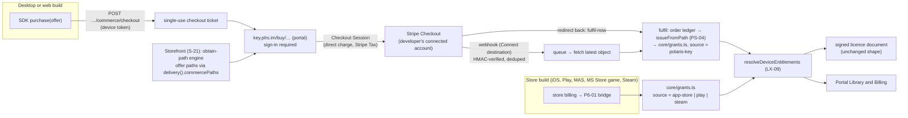

> Research note for [Godot on Polaris Key](../README.md), 2026-10-05. Spike S-22, commissioned by
> the lead on the owner's request of 2026-10-05: "We won't do this _yet_ but let's build out our
> storefront in such a way that we can add a commerce module (ie. Stripe) to charge directly from
> within. This also includes the ability to upgrade licenses, as well as subscriptions. We should
> consider ourselves a full-fledged distribution and release channel. So, `direct` really becomes
> `Polaris Key`. This second part (full commerce) should be its own plan." The first part (the
> storefront and the seams commerce plugs into) is the sibling spike **S-21**
> ([`S-21-polaris-storefront.md`](S-21-polaris-storefront.md), merged); this note is the second part. It has no program brief; §11
> registers a `CM-` work-package namespace whose packages are **optional and deferred**: none is
> dispatched until the owner says go. Research and design only: no product code changed, nothing
> was deployed, no Stripe account or credential was used and no live call was made. File references
> are to the tree at `fd6c42e3` (`W/` = `packages/worker/src/`, `N/` =
> `docs/research/2026-09-29-godot-omniplatform/notes/`, `P/` =
> `docs/research/2026-09-29-godot-omniplatform/program/`). Revised the same day after S-21 merged
> to `main` ([`S-21-polaris-storefront.md`](S-21-polaris-storefront.md), PS-01 to PS-11): §3 now
> uses S-21's actual seams (its §6.10), priced offers are obtain paths, fulfilment goes through
> `issueFromPath`, upgrades follow S-19's new-licence rule, and the CM packages depend on the PS
> packages they plug into. Stripe facts marked [V] were read on Stripe's primary pages on 2026-10-05 (§13);
> facts marked [U] were not re-read for this note and must be checked in CM-01.

# S-22: Polaris Key commerce (Stripe first)

Evidence tags, as in the other notes: **[V]** read in the code, the docs or a vendor's primary page;
**[M]** measured; **[S]** summarised from a secondary source; **[I]** inference or design; **[U]** not
verified. Spelling: "licence" in prose, `license` in identifiers and UI copy (PORTAL.md rule 4).
Glossary (rule 4): product, not app; tier, not plan; device, not machine. "Plan" below means a
Stripe price's billing plan only where quoted from Stripe; Polaris copy says **tier** and
**subscription**.

> **Owner decisions (delegated to Claude, 2026-10-05).** The owner delegated the open questions of
> this spike to the lead. Each is decided below with the recommendation; the full list with
> reasoning is §10. Three groups:
>
> 1. **Decided by the lead (binding for the CM- packages unless the owner overrides at go-time):**
>    D1–D32 in §10.1.
> 2. **For the owner at go-time** (genuinely the owner's: legal, money, brand). They do not block
>    the plan; CM-01's plan restates them and the first dispatch waits on the owner's answers:
>    G1 merchant of record and the platform terms, G2 the Polaris Key platform fee, G3 the
>    supported merchant countries and the first currencies, G4 the EU withdrawal-waiver wording,
>    G5 whether "own-account mode" (Stripe as merchant of record through Managed Payments) is
>    offered, G6 regional store link-out programmes (§10.2).
> 3. **Nothing here is dispatched yet.** Every `CM-*` package is `optional: true` and carries
>    `deferred` (a new graph field, §11.3), so `check.mjs --ready` never lists it, even with
>    `--optional`, until the owner's go removes the field.

## 1. Question

How should Polaris Key charge customers directly, so that the storefront S-21 defines becomes a
full distribution **and sales** channel next to the App Store, Google Play and Steam? Concretely:

- which payment provider abstraction, with Stripe first (Checkout or the Payment Element, Stripe's
  Customer Portal or our own, webhooks, tax, currencies, refunds, disputes, payouts);
- who is the merchant of record, and how many developers' products share one Polaris Key
  deployment without sharing money (Stripe Connect versus Polaris Key as the seller);
- how prices and offers attach to storefront listings, and how one-time purchases, tier upgrades
  with proration, subscriptions (trials, renewals, dunning, grace, cancellation, resubscription),
  add-ons, coupons, gifting and receipts work;
- how a payment becomes a licence or a grant through the S-19 resolver, and how a refund or a
  chargeback takes it away again;
- what the customer portal, the console, the emails and the SDKs gain, and what the mobile store
  rules forbid;
- which settings go into the S-18 registry; the threat model, PCI scope and data retention; how the
  existing store commerce (P6-01) coexists; and every wire change, routed through plan mode.

## 2. Short answer

**Polaris Key is the platform; each developer is the seller.** A developer connects their own
Stripe account to Polaris Key through **Stripe Connect** and every sale is a **direct charge on the
developer's account**: the developer is the merchant of record, their name is on the card
statement, refunds and disputes debit their balance, Stripe Tax computes tax against their
registrations, and payouts go to their bank. Polaris Key never holds funds, never touches card
data and takes an application fee only if the owner sets one (zero by default) [V: Stripe Connect
charge types; I]. Polaris Key as merchant of record is rejected for now: it makes Polaris Key the
seller in every customer's jurisdiction, the debtor for every refund and dispute, and the tax filer
for every product (§5, decision D1; the owner confirms at go-time, G1).

**Hosted Stripe Checkout, our own billing section, Stripe's portal for cards and invoices.**
Purchases go through Stripe-hosted Checkout (redirect) so no payment script runs on a Polaris
origin and the PCI scope stays at SAQ A [I, §8.3]. The customer portal grows a **Billing** section
that aggregates orders and subscriptions across every developer a person buys from (Stripe's
Customer Portal is per Stripe account, so it cannot do that), and hands off to a Stripe Customer
Portal session on the right connected account only for payment methods and invoice PDFs.

**Polaris Key owns the catalogue; Stripe mirrors it; a priced offer is an obtain path.** Offers
(what is sold) and prices (per currency) are Polaris rows, operator-only like store mappings ("a
repo push must never decide" money, `W/services/distribution/commerce/settings.ts:1-7`) [V],
synced idempotently to Stripe Products and Prices on the connected account. S-21's obtain-path
engine (PS-03) receives each offer a viewer may buy as an `ObtainPath` of kind `offer` with
`action: "buy"` or `"upgrade"` and a `price`, so who may buy and who may see stay one function
(S-21 §6.10 seams 1, 2) (§3).

**A payment is just another grant source.** Fulfilment calls S-21's single issuance function,
`issueFromPath(path, account)` (PS-04), with the `offer` path and the provider's verified result, so
free and paid adds create the same shapes (S-21 §6.10 seam 3). It writes through S-19's Core
writers (`core/grants.ts`, LX-08) with source **`polaris-key`**, `external_ref_hash` and `order_ref`
(seam 4): a base-tier offer mints a licence
(`licenses.source = 'polaris-key'`, `external_ref_hash`), an add-on creates an account-held grant,
a seat pack creates a licence-held grant. The device sees the result through
`resolveDeviceEntitlements` (LX-09) on its next document; nothing on the device wire learns about
money. Refunds and lost disputes revoke exactly that grant under LX-12's states.

**Subscriptions map onto terms S-19 already has.** A base subscription is a licence whose
`expires_at` follows the paid period (plus a renewal buffer); an add-on subscription is a grant
with `expires_at`. Failed renewals use LX-12's `past_due` and `dunningGraceDays`; cancellation is at
period end; resubscribing reuses the same licence so devices keep their anchor. Commerce adds no
lifecycle state (seam 5). Tier upgrades follow S-19 §7.6: an `upgrade` path appears only toward a
higher `tiers.rank` (seam 7), and paying mints a new licence on the higher tier with
`superseded_by` on the old one; subscription upgrades swap the price with Stripe proration.

**Mobile store rules are enforced by the server, not left to SDK politeness.** The SDK
`purchase(offer)` hands desktop and web builds to Polaris Key checkout in the system browser, and
routes App Store, Google Play, Mac App Store, Microsoft Store (games) and Steam builds to their own
store billing through the existing bridge (P6-01, LX-11, LX-20). The new device route refuses a
checkout for a device whose detected outlet is a store build (`403 store_billing_required`). No
build ever links out of store billing by default; regional link-out programmes are a separate,
deferred package gated on the owner and legal review (G6, CM-18).

**Wire impact is small and additive; `PROTOCOL_VERSION` stays 4.** No signed document changes. The
device-visible changes are one new device route (`POST /<p>/distribution/commerce/checkout`), an
additive `offers[]` member on the existing `GET …/commerce/binding` response, one new error code
(`store_billing_required`) and one new grant-source enum value (`polaris-key`). All go through
CM-01's plan and are carried to every SDK by CM-15 (§9).

**Nineteen deferred work packages** (`CM-01`–`CM-19`, about 14–22 engineer-weeks) build it after
S-19's phase B (LX-08 to LX-13) and the S-18 resolver (ST-04, ST-05) land (§11).



## 3. The S-21 seams commerce plugs into

S-21 merged on 2026-10-05 and fixes nine seams in its §6.10. Each maps to the S-22 design and the
CM package that builds on it:

1. **`ObtainPath.action` widens** from `"add" | "link"` to add `"buy"` and `"upgrade"`. The portal
   renders the server's action, so a priced path needs no new tile (CM-04 on PS-03; CM-16 on
   PS-05).
2. **A priced offer is an obtain path** with `action: "buy"` and a `price` (`{amount, currency,
period?}`), contributed through the same engine. `ObtainPathKind` gains `offer`; `ObtainPath`
   gains `price` and `offerId`. The engine lives in the identity service (S-21 Q5), so commerce
   (Distribution) contributes through a new single-provider method on Distribution's `delivery()`
   hook, `commercePaths(account, product)`, exactly as `openAccess()` and `storeOwnership()` do.
   Free paths are evaluated first, so a person who can add a product for free never sees Buy
   first. Visibility stays S-21's listing modes: `offer` paths count under `listed`, and under
   `auto` only if the operator puts `offer` in `storefront.polarisKey.offerPaths`. **This replaces
   the `commerceCatalog` hook of the first draft** (CM-04).
3. **One issuance function, `issueFromPath(path, account)`** (PS-04). A completed checkout calls it
   with the `offer` path and the provider's verified result (the re-read Checkout Session).
   `issueFromPath` sits in the identity service and the webhook consumer in Distribution, so rule 6
   needs a Core-mediated call: a single-provider Core hook method (`issuance().issueFromPath`,
   provided by identity). This is a **proposed PS-04 amendment** (§12); CM-01 fixes the name
   (CM-05 on PS-04).
4. **Grant source `polaris-key`**, with `external_ref_hash` (the provider's order id, hashed) and
   `order_ref`. Adopted as is (D9). S-21 D9 **replaces** `direct` with `polaris-key` in the
   grant-source vocabulary; there is no `direct` grant source. A sale a developer records through
   the admin API is a `comp` grant ("From <developer>", S-21 §6.8 `PurchaseSourceKind: developer`)
   (CM-05; LX-08 amendment).
5. **Lifecycle from S-19, LX-12 and LX-23, with no new states.** Upgrades are a new licence with
   `superseded_by`; subscriptions run on `expires_at`, `past_due` and `dunningGraceDays`. Adopted.
   The first draft's in-place, revertible tier change (and its `dist_license_tier_changes` table)
   is **withdrawn** (CM-07, CM-08).
6. **A payment provider is one more connection** (Platform → Store connections, a
   `PLATFORM_CREDENTIALS` slot), and the `polaris-key` adapter's `pricing` and `iap` ops flip from
   `unsupported` to `first-party` when a provider is connected. Adopted: the platform's Stripe
   account is the connection, each developer's connected account is a merchant (§5), and a product
   with an active merchant reports `pricing` / `iap` as `first-party`, so PS-06's hub and readiness
   checklist need no new shape. The interface itself is §6 (CM-03 on PS-01).
7. **Upgrade paths need `tiers.rank`** (LX-08), and "Upgrade" renders only when the engine returns
   an `upgrade` path. `commercePaths` returns `upgrade` only for a held product, from a lower-rank
   tier, toward a higher-rank tier with an upgrade offer (CM-07).
8. **Footnote and counts.** Decided (D31): the Discover count stays "offers you can add now"
   (buy-only products are listed, not counted), and the footnote becomes "Products you can add for
   free, and products you can buy" (CM-16).
9. **Analytics.** PS-06's analytics card (`storefront_daily`) gains revenue and refund columns per
   currency from the order ledger (CM-12 on PS-06).

**`direct` (S-21 §6.8, D9).** The outlet keeps its wire id `direct` and is labelled "Polaris Key"
everywhere (PS-10). Commerce changes nothing about the outlet; its only new vocabulary is the grant
source `polaris-key`. Sellable builds are the `direct`-outlet builds (§7.12).

## 4. Current state

### 4.1 What already exists [V]

- **The store commerce bridge (P6-01, done).** `W/services/distribution/commerce/` verifies App
  Store, Play and Steam purchases, binds a purchase to a licence through an opaque binding UUID
  (`appAccountToken`, `obfuscatedAccountId`), processes store notifications inline, answers 503 on
  a transient store failure so the store redelivers, and deduplicates on the notification id
  (`dist_connector_events`) and the purchase key hash (`dist_purchases`)
  (`commerce/index.ts:1-30`). It is **hidden unless set up**: every route answers Core's
  not-found when License is off or the store is not configured.
- **Store mappings are operator-only.** `commerce/settings.ts:1-7`: no manifest field reaches
  them. LX-01 §3.1 extends this to `grantsKind`, `baseTierId`, `restorePolicy`.
- **S-19's model (LX-01 approved; LX-08 onward todo).** Grants with a holder (account, licence or
  store identity), `source` vocabulary by replaceable trigger (`app-store play steam direct comp
trial bundle redeem oidc`, LX-01 §6.1), `state` (`active past_due revoked refunded suppressed`),
  `order_ref` for bundle refunds, `grace_until`, `licenses.source` / `external_ref_hash` with a
  partial unique index, `ended_reason` (`revoked refunded chargeback superseded`), one Core
  resolver, `entitlements.changed` events (LX-13), `refundGraceHours` and `dunningGraceDays`
  settings (LX-06, LX-12).
- **Accounts (I-05, done)**, the single-use store (I-02, done), email delivery with the
  "Polaris Key" sender (I-18 in review, PX-W7 done), platform inventory (ST-02, done), the
  settings registry types (ST-03, done), outlet detection in every SDK (P3-11, done).
- **Domains.** `key.plrs.im` (Worker, admin, portal), `dl.plrs.im` (bytes), `pkg.plrs.im`
  (registries) (`packages/worker/wrangler.toml:146-153`).

### 4.2 What is missing

There is no web checkout, no offer or price model, no payment provider, no order ledger, no
subscription state outside store notifications, no billing UI and no device route that starts a
purchase. LX-23 names "Stripe and Paddle webhooks as grant and licence sources" in one line; this
note replaces that line with a full design and narrows LX-23 to store subscriptions and the dunning
machinery (§12).

## 5. Merchant of record and the multi-tenant model

### 5.1 The options

| Option                                                        | Who sells            | Money flow                                                                    | Tax                                                                     | Refunds and disputes                      | Fit                                                       |
| ------------------------------------------------------------- | -------------------- | ----------------------------------------------------------------------------- | ----------------------------------------------------------------------- | ----------------------------------------- | --------------------------------------------------------- |
| **A. Connect, direct charges** (each developer's own account) | the developer        | charge on the connected account; optional application fee to the platform [V] | Stripe Tax on the connected account; the developer is liable [V][I]     | debit the connected account's balance [V] | **recommended**                                           |
| B. Connect, destination charges (Polaris Key as seller)       | Polaris Key          | charge on the platform, transfer to the developer [V]                         | the platform's marketplace obligations [V: Stripe Tax for marketplaces] | debit the platform's balance [V]          | rejected now: Polaris Key becomes a reseller everywhere   |
| C. Polaris Key's own account only                             | Polaris Key          | everything lands on Polaris Key; payouts outside Stripe                       | Polaris Key                                                             | Polaris Key                               | rejected: money transmission and tax exposure, no tenancy |
| D. Own-account mode (developer's API key, Managed Payments)   | **Stripe** (MoR) [V] | the developer's own Stripe account; Stripe handles tax in 80+ countries [V]   | Stripe [V]                                                              | Stripe handles disputes [V]               | deferred option (G5, CM-19)                               |

Key facts read on Stripe's pages on 2026-10-05 [V]:

- Direct charges: "the payment appears in the connected account's balance"; "Refunds and
  chargebacks reduce the connected account's balance"; "Funds always settle in the country of the
  connected account"; the platform can take an application fee; "This charge type works best for
  platforms that provide software as a service." Direct charges are "not recommended for legacy v1
  Express and Custom accounts — switch to v2 accounts".
- Destination charges: "Refunds and chargebacks reduce your platform's balance"; disputes debit the
  platform and recovery is by transfer reversal.
- Stripe Tax with Connect: the first step is to "determine which entity has the obligation to
  collect and report taxes"; for software platforms "your connected accounts assume responsibility
  for collecting and remitting taxes".
- Managed Payments (Stripe as merchant of record) "doesn't support Stripe Connect (platform or
  marketplace integrations)"; it supports "Video games" and "Software" with tax codes such as
  `txcd_10201000` (games, downloaded, permanent rights) and `txcd_10201002` (games, subscription);
  sellers must be in one of 36 listed countries; it requires Checkout or Payment Links (no
  embeddable components) and creates subscriptions only through Checkout or Payment Links.

### 5.2 Decision (D1, owner confirms at go-time as G1)

**Option A.** Polaris Key is a software platform; each developer is the merchant of record on their
own Stripe account, connected through Connect (Accounts v2, full Stripe Dashboard access for the
developer [U: exact v2 configuration names, CM-01]). Reasons:

1. It matches how Polaris Key already treats stores: the developer is the seller on Steam, Apple
   and Google; Polaris Key verifies and grants.
2. Polaris Key never holds a balance, so a dispute, a refund or a payout failure is never Polaris
   Key's debt. A negative connected balance is Stripe's and the developer's business.
3. Tax registrations are per developer and per country; Stripe Tax computes and collects on the
   connected account, and the developer files. Polaris Key does not become a deemed supplier for
   digital services in the EU, UK or elsewhere [I; legal review in G1].
4. It keeps the door open: option D (Stripe as MoR) can be added later as a second provider mode
   behind the same abstraction (§6) for developers who want no tax burden; it cannot use Connect,
   so it needs the developer's restricted API key stored as a product secret (§8, G5).

**Multi-tenancy.** A **merchant** is one connected Stripe account. Products map to a merchant
(`commerce.merchant`, operator-only, critical). Several products of one developer share one
merchant, so a person who buys two of that developer's products is one Stripe Customer on that
account. Two developers never share a merchant. A person who buys from three developers is three
Stripe Customers on three accounts and **one** Polaris Key account; the Polaris Key portal is the
only place that sees all three (§7.10).

**Polaris Key's own products** (`polaris-key`, `djdl`) are sold the same way: the owner connects
the owner's Stripe account as a merchant. There is no special path (rule 5).

## 6. The provider abstraction

For the console the provider is one more connection (S-21 seam 6): the platform's Stripe account
in Platform → Store connections (deploy secrets, §7.13, surfaced through a `PLATFORM_CREDENTIALS`
slot that shows presence only), and while a product has an active merchant the `polaris-key`
storefront adapter's `pricing` and `iap` ops report `first-party` (they read Polaris tables only,
so S-21's no-HTTP conformance rule for first-party ops still holds). Commerce code lives in the
Distribution service next to the store bridge, as
`W/services/distribution/commerce/checkout/` with one provider module per payment provider. It
writes licences and grants only through Core writers (`core/grants.ts`, LX-08), so rule 6's
boundaries test keeps holding [V: AGENTS.md rule 6]. Merchant and customer rows that span products
are Core-owned (§7.1).

```ts
// W/services/distribution/commerce/checkout/provider.ts (proposed; CM-02 fixes the exact shape)
export interface PaymentProvider {
  readonly id: "stripe"; //                      later "paddle", "stripe-own-account" (CM-19)
  // Merchants
  onboardingLink(
    m: MerchantRef,
    returnUrl: string,
  ): Promise<{ url: string; expiresAt: number }>;
  merchantStatus(m: MerchantRef): Promise<MerchantStatus>; // charges_enabled, requirements due
  // Catalogue (idempotent upserts; prices are immutable at the provider, so a change mints a new price)
  syncOffer(m: MerchantRef, offer: OfferSpec): Promise<ProviderOfferRefs>;
  // Checkout
  createCheckout(
    m: MerchantRef,
    req: CheckoutRequest,
  ): Promise<{ sessionRef: string; url: string; expiresAt: number }>;
  readCheckout(m: MerchantRef, sessionRef: string): Promise<CheckoutResult>; // fulfil-now and reconciliation
  // Subscriptions
  previewChange(
    m: MerchantRef,
    sub: string,
    to: PriceRef,
    when: "now" | "periodEnd",
  ): Promise<ProrationPreview>;
  changeSubscription(
    m: MerchantRef,
    sub: string,
    to: PriceRef,
    when: "now" | "periodEnd",
    idemKey: string,
  ): Promise<void>;
  cancelSubscription(
    m: MerchantRef,
    sub: string,
    mode: "periodEnd" | "now",
    idemKey: string,
  ): Promise<void>;
  resumeSubscription(
    m: MerchantRef,
    sub: string,
    idemKey: string,
  ): Promise<void>;
  // Money back
  refund(
    m: MerchantRef,
    paymentRef: string,
    amount: number | "full",
    reason: RefundReason,
    idemKey: string,
  ): Promise<RefundRef>;
  // Customer self-service hand-off (payment methods, invoice PDFs)
  billingPortalLink(
    m: MerchantRef,
    customerRef: string,
    returnUrl: string,
  ): Promise<string>;
  // Events
  verifyEvent(
    rawBody: Uint8Array,
    headers: Headers,
    now: number,
  ): Promise<ProviderEvent>; // throws on a bad signature
  fetchLatest(m: MerchantRef, ref: ProviderObjectRef): Promise<ProviderObject>; //        events are hints, objects are truth
}
```

**Rules every provider follows** [I]:

- **Events are hints; objects are truth.** A webhook event only says "look at object X". The
  handler re-reads the object from the provider before acting, because Stripe "doesn't guarantee
  the delivery of events in the order that they're generated" and may deliver an event more than
  once [V: Stripe webhooks].
- **Fixed hosts only.** Every outbound call goes to the provider's API host through Core's fetch
  guard (`core/safeFetch.ts`, HA-01) with a body cap, like `commerce/http.ts`
  (`MAX_STORE_RESPONSE_BYTES`) [V].
- **Every write carries an idempotency key** derived from our own ids
  (`pk:<order id>:<operation>:<n>`), so a retried Worker invocation never double-refunds or
  double-changes a subscription [I; Stripe idempotency keys U].
- **The client never names an amount.** A checkout is created from an offer id and a price id that
  the server looks up; the provider's line items come from our catalogue only.

**Stripe specifics (the first provider):**

| Concern     | Choice                                                                                                                                                                                                                                                                                                                                                                           |
| ----------- | -------------------------------------------------------------------------------------------------------------------------------------------------------------------------------------------------------------------------------------------------------------------------------------------------------------------------------------------------------------------------------- |
| Checkout UI | **Stripe Checkout, hosted (redirect)** in v1. Embedded Checkout and the Payment Element are rejected for v1: both put Stripe's script on a Polaris origin, which changes the portal CSP (`console-csp-parity`) and the PCI script-integrity duties of the hosting page [I]. Revisit only with CM-17's PCI record.                                                                |
| Charge type | Direct charge on the connected account (`Stripe-Account` header) with `application_fee_amount` only if `commerce.platform.applicationFeeBps > 0` (default 0, G2).                                                                                                                                                                                                                |
| Customer    | One Stripe Customer per (merchant, Polaris account), created lazily at first checkout, with the account's verified email and a per-merchant pseudonymous reference in metadata (`pk_ref = HMAC(merchant, account_id)`); never the global account id (I-04 §6.2).                                                                                                                 |
| Tax         | `automatic_tax: enabled` when `commerce.tax.mode = automatic` (default). Product tax code per offer, defaulted by product kind (`txcd_10201000` game, permanent; `txcd_10201002` game subscription; `txcd_10202000` downloadable software) [V: tax codes]. Tax-inclusive or -exclusive pricing per merchant setting.                                                             |
| Currencies  | Explicit per-currency prices on each offer (integer minor units); Stripe's localised presentment (Adaptive Pricing [U]) off by default and switchable per merchant.                                                                                                                                                                                                              |
| Webhooks    | One Connect event destination on the platform account with `events_from: ["@accounts"]` [V], to one platform route; `v1` HMAC-SHA256 over `t.payload`, constant-time compare, 300 s tolerance (Stripe's library default; never 0), raw body only [V].                                                                                                                            |
| Event set   | `checkout.session.completed`, `checkout.session.async_payment_succeeded`, `checkout.session.async_payment_failed`, `checkout.session.expired`, `invoice.paid`, `invoice.payment_failed`, `customer.subscription.created/updated/deleted`, `charge.refunded`, `refund.updated`, `charge.dispute.created/closed`, `account.updated` (merchant status) [U: names re-read in CM-01]. |
| Retries     | Stripe retries for up to three days in live mode [V]; we answer 2xx after verifying and recording the event, then process from a Queue (the store bridge's inline-then-503 pattern is kept for stores only, because Stripe asks for a quick 2xx [V]). A daily reconciliation per merchant re-reads recent sessions, subscriptions, refunds and disputes.                         |
| Secrets     | Platform restricted key and webhook signing secret are **deploy-scope** Worker secrets (`STRIPE_SECRET_KEY`, `STRIPE_WEBHOOK_SECRET`, plus a `_PREVIOUS` signing secret during a 24 h roll [V]); S-18's AT-2 deny-list keeps key material out of platform settings [V: S-18 §4.2 rule 1]. Connected account ids are not secrets.                                                 |

## 7. The design

### 7.1 Data model (sketch; CM-01 fixes DDL; one bare `ADD COLUMN` per file, R11-04)

**Core-owned** (span products):

```sql
CREATE TABLE commerce_merchants (            -- one connected provider account
  id TEXT PRIMARY KEY,                       -- mer_<26 base32>
  provider TEXT NOT NULL,                    -- stripe
  provider_account_ref TEXT NOT NULL,        -- acct_…
  livemode INTEGER NOT NULL,
  display_name TEXT NOT NULL,
  country TEXT NULL, default_currency TEXT NULL,
  charges_enabled INTEGER NOT NULL DEFAULT 0, payouts_enabled INTEGER NOT NULL DEFAULT 0,
  requirements_json TEXT NULL,               -- "due" list mirrored from account.updated
  state TEXT NOT NULL,                       -- onboarding | active | restricted | disconnected
  created_by TEXT NOT NULL, created_at INTEGER NOT NULL, modified_at INTEGER NOT NULL,
  UNIQUE (provider, provider_account_ref, livemode));
CREATE TABLE commerce_customers (            -- Polaris account ↔ provider customer, per merchant
  merchant_id TEXT NOT NULL, account_id TEXT NOT NULL,
  provider_customer_ref TEXT NOT NULL, created_at INTEGER NOT NULL,
  PRIMARY KEY (merchant_id, account_id), UNIQUE (merchant_id, provider_customer_ref));
CREATE TABLE commerce_events (               -- webhook intake, dedupe and audit
  provider TEXT NOT NULL, event_ref TEXT NOT NULL, merchant_id TEXT NULL,
  type TEXT NOT NULL, object_ref TEXT NULL, received_at INTEGER NOT NULL,
  processed_at INTEGER NULL, outcome TEXT NULL, attempts INTEGER NOT NULL DEFAULT 0,
  PRIMARY KEY (provider, event_ref));
```

**Distribution-owned** (per product; `TABLE_OWNERS: distribution`):

```sql
CREATE TABLE dist_offers (
  product TEXT NOT NULL, id TEXT NOT NULL,                      -- off_…
  kind TEXT NOT NULL,          -- base | addon | seats | upgrade | bundle
  billing TEXT NOT NULL,       -- one_time | subscription
  label TEXT NOT NULL, description TEXT NULL,
  grants_json TEXT NOT NULL,   -- {tierId?} | {entitlements:[{key,value}]} | {deviceLimit:n} | {fromTierId,toTierId}
  interval TEXT NULL, interval_count INTEGER NULL, trial_days INTEGER NULL,   -- subscriptions
  tax_code TEXT NULL, state TEXT NOT NULL,                      -- draft | on_sale | retired
  sort INTEGER NOT NULL DEFAULT 0, created_at INTEGER NOT NULL, modified_at INTEGER NOT NULL,
  PRIMARY KEY (product, id));
CREATE TABLE dist_offer_prices (
  product TEXT NOT NULL, offer_id TEXT NOT NULL, currency TEXT NOT NULL,
  unit_amount INTEGER NOT NULL, tax_behavior TEXT NOT NULL,     -- inclusive | exclusive
  provider_price_ref TEXT NULL, active INTEGER NOT NULL DEFAULT 1,
  created_at INTEGER NOT NULL, PRIMARY KEY (product, offer_id, currency, created_at));
CREATE TABLE dist_orders (                                      -- the ledger
  product TEXT NOT NULL, id TEXT NOT NULL,                      -- ord_…
  merchant_id TEXT NOT NULL, account_id TEXT NULL,              -- NULL after account deletion
  kind TEXT NOT NULL,          -- purchase | upgrade | gift | renewal
  state TEXT NOT NULL,         -- open | paid | fulfilled | refunded | partially_refunded | disputed | charged_back | expired | failed
  currency TEXT NOT NULL, amount_subtotal INTEGER NULL, amount_tax INTEGER NULL, amount_total INTEGER NULL,
  amount_refunded INTEGER NOT NULL DEFAULT 0, country TEXT NULL,
  provider_session_ref TEXT NULL, provider_payment_ref TEXT NULL, provider_invoice_ref TEXT NULL,
  coupon_id TEXT NULL, gift_code_id TEXT NULL, target_license_id TEXT NULL,
  created_at INTEGER NOT NULL, paid_at INTEGER NULL, fulfilled_at INTEGER NULL, modified_at INTEGER NOT NULL,
  PRIMARY KEY (product, id));
CREATE UNIQUE INDEX idx_orders_session ON dist_orders(product, provider_session_ref) WHERE provider_session_ref IS NOT NULL;
CREATE TABLE dist_order_lines (
  product TEXT NOT NULL, order_id TEXT NOT NULL, line INTEGER NOT NULL,
  offer_id TEXT NOT NULL, quantity INTEGER NOT NULL DEFAULT 1,
  grant_id TEXT NULL, license_id TEXT NULL, superseded_license_id TEXT NULL,  -- what fulfilment produced
  PRIMARY KEY (product, order_id, line));
CREATE TABLE dist_subscriptions (
  product TEXT NOT NULL, id TEXT NOT NULL, merchant_id TEXT NOT NULL, account_id TEXT NULL,
  offer_id TEXT NOT NULL, provider_subscription_ref TEXT NOT NULL,
  status TEXT NOT NULL,        -- trialing | active | past_due | canceled | unpaid | incomplete | paused (mirrored)
  current_period_end INTEGER NOT NULL, cancel_at_period_end INTEGER NOT NULL DEFAULT 0,
  license_id TEXT NULL, grant_id TEXT NULL,                    -- exactly one: what it keeps alive
  created_at INTEGER NOT NULL, modified_at INTEGER NOT NULL,
  PRIMARY KEY (product, id), UNIQUE (product, provider_subscription_ref));
CREATE TABLE dist_coupons (
  product TEXT NOT NULL, id TEXT NOT NULL, code TEXT NULL,       -- NULL: link-only coupon
  percent_off INTEGER NULL, amount_off INTEGER NULL, currency TEXT NULL,
  duration TEXT NOT NULL,      -- once | repeating | forever (subscriptions)
  duration_months INTEGER NULL, offer_ids_json TEXT NULL, max_redemptions INTEGER NULL,
  redeem_by INTEGER NULL, provider_coupon_ref TEXT NULL, provider_promo_ref TEXT NULL,
  state TEXT NOT NULL, created_at INTEGER NOT NULL, PRIMARY KEY (product, id));
```

**S-19 additions:** none of commerce's own. The grant `source` vocabulary already carries
**`polaris-key`** in place of `direct` (S-21 D9, recorded on LX-08); `licenses.source` accepts it.
Grants and licences minted by checkout carry `external_ref_hash = H(provider, payment or
subscription ref)`, `order_ref = ord_…`, `created_by = 'commerce'`.

Checkout tickets (device → browser hand-off) use the existing single-use store (I-02), not a
table.

### 7.2 Offers and prices on storefront listings

- An **offer** is what a person can buy for one product: a **base** offer (mints a licence on a
  tier), an **add-on** (entitlement keys, as a grant), a **seat pack** (a licence-held
  `deviceLimit` grant, S-19 §7.2), an **upgrade** (from tier A to tier B), or a **bundle** (several
  keys in one grant; across products, one order per product sharing `order_ref`, because products
  are separate tenants, S-19 §7.6).
- Offers are **operator-only** (console and admin API), never manifest fields (D7). An offer's
  grant targets must name catalogue flags and tiers that exist; the console refuses an offer whose
  entitlement key is undeclared (the LX-08 "refuse undeclared keys" rule).
- **Prices** are per currency, immutable once used (Stripe Prices are immutable [U]); a price change
  writes a new row and a new provider price, and the old one stays for history and open
  subscriptions (D11: existing subscribers keep their price unless the developer migrates them).
- The storefront (S-21's engine, PS-03) calls `delivery().commercePaths(account, product)` and
  receives one `offer` path per on-sale offer the viewer may buy: `action: "buy"` (or `"upgrade"`
  for a held product, §7.5), `price` in the viewer's currency (Accept-Language and the edge country
  as a hint, the person's choice wins), `offerId`, and terms ("14-day trial", "a month"). What the
  viewer already owns comes from the free paths (`store_owned`: "You own it on Steam") and the
  Library, which the engine already excludes. Signed-out viewers see prices and "Sign in to buy".
  `commercePaths` is a dry run like the rest of the engine (S-21 guarantee 1) and answers `[]` with
  commerce off, the product unlisted or no active merchant.
- A store-only product (sold on Steam only) keeps S-21's link-only action ("Get it on Steam"); a
  product with both shows both, and the Polaris Key price is never shown inside a store build
  (§7.12).

### 7.3 Checkout and fulfilment (one-time purchases)

1. **Start.** From a Discover tile or the storefront page (`#/discover/:product`) the signed-in
   person presses Buy on an `offer` path;
   `POST /api/commerce/checkout {product, offerId, currency, giftTo?, couponCode?, licenseId?}`
   (portal API, session-authenticated, CSRF-protected as the other portal writes). From an app, the
   device route of §7.12 returns a ticket URL that lands on the same page.
2. **Checks.** The engine re-evaluates the `offer` path (as PS-04's claim re-evaluates a free
   path; a path no longer offered answers `409 not_eligible`). Commerce on, merchant `active` and `charges_enabled`, offer `on_sale`, the viewer
   eligible (an upgrade needs a source licence they own; an add-on of `requires` a base licence or
   grant, setting `commerce.addons.requireBase` default true; a one-per-person base offer refuses a
   second purchase unless `commerce.allowMultipleBase`), country not blocked.
3. **Order.** Insert `dist_orders(state=open)` and create a Checkout Session on the merchant with
   our line items, `customer` (lazy create), `client_reference_id = ord_…`, metadata
   `{pk_product, pk_order}`, `automatic_tax`, `allow_promotion_codes` per setting, consent text for
   the EU digital-content waiver when enabled (G4), `success_url` / `cancel_url` on the portal (PX-10's return allowlist),
   and a 30-minute expiry. Answer the Checkout URL; the browser redirects.
4. **Fulfil, twice, idempotently.** On return, the success page calls
   `POST /api/commerce/orders/<id>/fulfil`, which re-reads the session; independently the webhook
   `checkout.session.completed` (or `async_payment_succeeded`) does the same. Both run one function,
   `fulfilOrder(orderId)`, guarded by the order's state machine and the unique session index, so
   the first wins and the second is a no-op [I; Stripe's recommended fulfilment pattern U].
5. **Issue.** For each line, `fulfilOrder` calls `issueFromPath(offerPath, account, evidence)`
   (S-21 seam 3, reached through the Core hook of §3). Its `offer` branch: base → mint a licence
   through LX's writer (`source = 'polaris-key'`, `external_ref_hash`, `order_ref`, tier from the
   offer, `account_id` = buyer, seats and term from the tier; no device binding, S-21 D7); add-on →
   an account-held grant; seats → a licence-held grant on `licenseId` (required for seat offers);
   upgrade → §7.5. S-21's one-per-product rule (I-26) applies to base offers unless
   `commerce.allowMultipleBase`. Each write bumps holder versions in the same D1 batch (LX-01
   §2.5), which emits `entitlements.changed` (LX-13) and the developer webhook.
6. **Tell the person.** The success page shows "It's in your Library" with the product's Get it
   flow (PX-09); the fulfilment email (§7.11) follows. Apps see the change at their next document
   refresh; the SDK's purchase hand-off polls for it (§7.12).

Guest checkout (buy without a Polaris Key account) is **not** in v1 (D8): the account is the grant
holder, and the email-code sign-in (PX-W4) makes signing in a 20-second step. A key-entry-only
person who buys an add-on applies it to a licence through S-19's "Apply to a licence" (§7.11 of
S-19).

### 7.4 Refunds, disputes and revocation

| Event                                                            | Effect (through LX-12)                                                                                                                                                                                                                                                                                                     |
| ---------------------------------------------------------------- | -------------------------------------------------------------------------------------------------------------------------------------------------------------------------------------------------------------------------------------------------------------------------------------------------------------------------- |
| Full refund (console action or the developer's Stripe Dashboard) | Order `refunded`; each line's grant → `refunded` with `grace_until = now + licensing.refundGraceHours` (default 0); a minted licence → `status = disabled`, `ended_reason = 'refunded'`; an upgrade → the new licence ends and the old licence's `superseded_by` is cleared (§7.5). `order_ref` revokes a bundle together. |
| Partial refund                                                   | Order `partially_refunded`; **no revocation** by default (`commerce.refunds.partialRevokes: never`, or `always`). A partial refund is a goodwill credit, not a return [I].                                                                                                                                                 |
| Dispute opened                                                   | Order `disputed`; access unchanged by default (`commerce.disputes.onOpen: keep`, or `suspend` → grant `suppressed`). Console shows a banner with Stripe's evidence deadline and a link to the developer's Stripe Dashboard.                                                                                                |
| Dispute lost                                                     | Order `charged_back`; grant `refunded` **with no grace**, licence `ended_reason = 'chargeback'` (S-19 §7.6). Gift codes from that order are voided if unredeemed, and the recipient's grant is revoked if redeemed (D21).                                                                                                  |
| Dispute won                                                      | Order back to `fulfilled`; a suppressed grant becomes `active`.                                                                                                                                                                                                                                                            |
| Subscription refund                                              | Refund of a renewal invoice does not end the subscription by itself; ending is a cancellation (§7.6). A refund with "cancel now" does both.                                                                                                                                                                                |

A flag stays held when another active grant or licence gives it (S-19's StoreKit-like rule), so a
person who also owns the item on Steam keeps it. **Refunds are the developer's policy** (D18): the
portal shows the developer's support contact and refund policy link (a listing field), and no
self-serve refund button in v1. Payouts, balances and dispute evidence stay in the developer's
Stripe Dashboard; Polaris Key never moves money between accounts.

### 7.5 Tier upgrades and proration

- **One-time licence, upgrade offer (`kind = upgrade`, `fromTierId → toTierId`).** The engine
  returns an `upgrade` path only for a product the viewer holds, from a licence on `fromTierId`,
  toward a `toTierId` of strictly higher `tiers.rank` (LX-08; S-21 seam 7). Price is either
  explicit on the offer or, with `commerce.upgrades.oneTimePricing: difference` (default),
  `max(0, price(to) − price(from))` in the same currency; perpetual licences have no time to
  prorate. Fulfilment follows S-19 §7.6 and adds no state (S-21 seam 5): `issueFromPath` mints a
  **new licence** on `toTierId` (`source = 'polaris-key'`, `order_ref`) and sets the old licence's
  `superseded_by` in the same batch. The old licence stays usable while devices run on it
  (LX-01 §2.5 allows `superseded_by` on an active licence) and is hidden from the Library. In
  `combined` mode a signed-in device sees the new tier's entitlements at its next document, because
  the account's licences contribute (S-19 §7.3); seats and term move when the device next activates
  and picks the new licence, which LX-10 preselects by rank, or silently under `reanchor: onRefresh`
  (LX-21). A refund or lost dispute of the upgrade order ends the new licence and clears
  `superseded_by`.
- **Upgrade eligibility.** The source licence must be usable, owned by the buyer, on `fromTierId`,
  and its `source` in `commerce.upgrades.eligibleSources` (default: `polaris-key`, `comp`, `oidc`
  and NULL, i.e. operator- and sign-in-issued): a store-sourced base licence (App Store, Play,
  Steam) is **not** upgradable on Polaris Key by default, because a store refund of the base would
  strand a paid upgrade (D14).
- **Subscriptions.** Changing to a higher price swaps the subscription item price at once with
  Stripe proration (`commerce.upgrades.proration: create_prorations` default, or `always_invoice`
  to charge immediately, or `none`); a downgrade is scheduled at period end. The portal shows a
  preview from the provider (`previewChange`) before the person confirms [U: Stripe's invoice
  preview API name, CM-01].

### 7.6 Subscriptions

| Lifecycle                | Behaviour                                                                                                                                                                                                                                                                                                                         |
| ------------------------ | --------------------------------------------------------------------------------------------------------------------------------------------------------------------------------------------------------------------------------------------------------------------------------------------------------------------------------- |
| Start                    | Checkout in `subscription` mode. Base offer → licence with `expires_at = current_period_end + commerce.subscriptions.renewalBufferHours` (default 24); add-on → grant with the same `expires_at`. `dist_subscriptions` links the provider subscription to the licence or grant it keeps alive.                                    |
| Trial                    | `trial_days` on the offer; payment method required at trial start by default (`commerce.trials.requirePaymentMethod: true`). The licence or grant carries `trial = 1` (S-19); `license.tierLabel` shows "Trial" through the existing tier label. One trial per person per offer (checked against our ledger, not the card).       |
| Renewal                  | `invoice.paid` → extend `expires_at` to the new period end plus the buffer. The buffer covers webhook delay and offline devices whose grace is clamped to the licence expiry (LX-07).                                                                                                                                             |
| Failed renewal (dunning) | `invoice.payment_failed` → grant `past_due` with `grace_until = period_end + licensing.dunningGraceDays` (LX-06 key, unhidden by CM-08), licence `expires_at` extended to the same instant; Stripe's retries continue on the developer's account settings. Paid within grace → back to `active`. Exhausted → lapses at grace end. |
| Cancel                   | Default at period end (`cancel_at_period_end`), from the portal or the console; access continues to `expires_at`, then lapses as an **expiry**, not a revocation (`ended_reason` stays NULL). "Cancel now" (developer only) ends at once and optionally refunds the unused part (prorated refund, explicit choice).               |
| Resume before end        | Undo `cancel_at_period_end`; nothing else changes.                                                                                                                                                                                                                                                                                |
| Resubscribe after lapse  | A new provider subscription **reuses the same licence** (`dist_subscriptions.license_id`), extending its `expires_at` again, so the licence id, seats and enrolled devices survive (D16). Add-on resubscription reuses the grant.                                                                                                 |
| Pause                    | Not offered in v1 [I].                                                                                                                                                                                                                                                                                                            |
| Change tier              | §7.5.                                                                                                                                                                                                                                                                                                                             |
| Store subscriptions      | Apple and Play auto-renewables stay with LX-23 (store notifications), on the same `past_due` / `grace_until` columns, so the portal shows all subscriptions one way.                                                                                                                                                              |

**Perpetual fallback** (a lapsed subscription keeps the last version it paid for) is not in v1; the
model allows it as a grant that sets `app.maxVersion` on lapse (S-19 §7.6, §10.2) [I].

### 7.7 Add-ons, bundles, coupons and redeem codes

- **Add-ons** are account-held grants with the offer's keys. `commerce.addons.requireBase: true`
  refuses an add-on purchase when the person holds no usable base licence for the product (S-19's
  `addon` semantics: contributes only while some base licence is usable).
- **Coupons and promotion codes** are Polaris rows (`dist_coupons`) mirrored to Stripe coupons and
  promotion codes on the merchant [U: Stripe object names]. Percent or amount off, `once`,
  `repeating` (months) or `forever` for subscriptions, offer restriction, max redemptions, expiry.
  A 100 %-off coupon completes Checkout without payment [U]. Coupons are discounts; they never
  grant by themselves.
- **Redeem codes** (LX-25) grant without payment and are a different thing. A coupon is "pay less";
  a redeem code is "get it". The console keeps them on separate tabs.

### 7.8 Gifting

"Buy as a gift" (`commerce.gifting.enabled`, default on) runs the normal checkout with the buyer as
customer, and fulfilment mints an **LX-25 gift code** for the offer instead of a grant. The code is
shown on the success page and emailed to the buyer, and optionally to a recipient email the buyer
typed (sent once, not scheduled, in v1). Redeeming creates the grant (or licence, for a base offer)
on the redeemer's holder, exactly as LX-25 defines. Refund of a gift order voids an unredeemed code;
a redeemed one is revoked on a lost dispute, and on a refund only if
`commerce.gifting.refundRevokesRedeemed` (default `true`, D21). Store gifts (Steam) need nothing.

### 7.9 Receipts and invoices

- **Receipts and tax invoices come from the merchant**, because the developer is the seller.
  Stripe's customer emails (receipts, invoices, failed-payment notices) are configured on the
  connected account; CM-03's onboarding checklist turns receipts on [U: per-account email settings
  under Connect]. One-time purchases create a Stripe invoice when `commerce.invoices.oneTime: true`
  (default true, so EU buyers get a VAT invoice) [U].
- **Polaris Key never issues a tax document.** It sends access emails only (§7.11) and lists orders
  and invoices in the portal, linking to Stripe's hosted invoice page fetched on demand (no PDF is
  stored by Polaris Key).

### 7.10 The customer portal

PORTAL.md amendments (CM-11):

- **Account → Billing** (new section): every order across every developer (product, date, amount,
  state, "View invoice"), active subscriptions (next charge, price, trial end, "Change", "Cancel",
  "Resume"), and per merchant a **"Payment methods and invoices"** button that opens a Stripe
  Customer Portal session on that merchant (Stripe's portal handles cards and invoice history;
  ours handles access). An empty state when the person never bought anything.
- **Storefront** (S-21's Discover tiles and `#/discover/:product`): priced `offer` paths render
  their price and terms; the count and footnote follow D31 (CM-16).
- **Product page** (`#/p/:product`, held products): the upgrade path, subscribe and gift actions, the license card's source badge
  "Bought on Polaris Key" (PX-W6's purchase source gains the `polaris-key` source), "Manage
  subscription" for subscription licences, the developer's support and refund-policy links.
- **Focused flows** (PX-10): `/buy/<order>/done` (fulfilment, Get it), `/buy/<order>/cancelled`,
  `/buy/t/<ticket>` (from an app; signs in, then checkout).
- **Copy rules** (PORTAL.md §6): prices with currency code where ambiguous, tax shown as the
  provider computed it, "Renews on 4 Nov 2026 for €4.99", never "plan".

### 7.11 Console and emails

**Console (ADMIN.md amendments, CM-12):** Product → **Commerce**:

- **Merchant**: Stripe is one more connection in Platform → Store connections (S-21 seam 6); the
  product connects its developer's account (onboarding link), status (charges and payouts enabled, requirements
  due), test or live mode, disconnect (L3 confirm, critical, reason).
- **Offers**: list and editor (kind, billing, grants, prices per currency, trial, tax code, state),
  "Sync to Stripe" status per offer; warnings: an offer sold on Polaris Key whose product ships an
  iOS build without a matching IAP mapping (App Store 3.1.3(b), §7.12).
- **Orders**: search by order, email, provider ref; detail with lines, what fulfilment produced
  (licence, grant, tier change, gift code) and the event timeline; **Refund** (full or partial,
  reason, L2 confirm), **Re-fulfil** (idempotent), **Open in Stripe**.
- **Subscriptions**: status, period, cancel (period end or now, prorated refund choice), resume.
- **Coupons**: editor and redemptions.
- **Revenue**: gross, refunds, disputes, net of refunds per day and currency **from our ledger**,
  also as revenue columns on PS-06's storefront analytics card (S-21 seam 9)
  (not Stripe balance; fees and payouts link to the developer's Stripe Dashboard). No FX
  conversion in v1 (per currency).
- **Settings**: the `commerce.*` registry rows (§7.13) with S-18's SourceBadge.

Platform area: the commerce kill switch, merchants across products, webhook health (last event,
lag, failures, signing secret roll).

**Emails (CM-13, through `core/emailSender.ts` and I-18's sender rules):** "<Product> is in your
Library" (fulfilment, with Get it), "You've been given <Product>" (gift code), "Your access to
<Product> ends on <date>" (cancellation scheduled), "Your access to <Product> has ended" (refund or
chargeback), and "Payment failed: update your card to keep <Product>" **only if** the merchant has
not enabled Stripe's own failed-payment emails (`commerce.emails.dunning: stripe | polaris-key`,
default `stripe`, so the person is never mailed twice). Receipts and invoices are Stripe's.

### 7.12 SDK impact and the store rules

**The SDK surface (CM-15), the same shape in every SDK; snake_case in Python and Godot:**

| API                 | Behaviour                                                                                                                                                                                                                                                                        |
| ------------------- | -------------------------------------------------------------------------------------------------------------------------------------------------------------------------------------------------------------------------------------------------------------------------------- |
| `offers()`          | Offers for this build from `GET …/commerce/binding` `offers[]` (Polaris Key offers) plus the existing store products. Store builds receive **no** Polaris Key offers (the server omits them).                                                                                    |
| `purchase(offerId)` | Store build: the store's billing (existing bridge, LX-20). Desktop or web build: `POST …/commerce/checkout` → open the ticket URL in the system browser → poll the document (backoff, 10 min cap) until the entitlement appears → resolve `purchased`, `pending` or `cancelled`. |
| `manageBilling()`   | Opens `key.plrs.im/account/billing` in the system browser (desktop and web only).                                                                                                                                                                                                |
| UI kits             | A buy button and price label component that renders `offers()`; on store builds it renders the store's product instead (UK-25 StoreKit paywall on Apple).                                                                                                                        |

**Which build may sell through Polaris Key** (D25), decided by outlet detection (P3-11, done) on
the device **and** re-checked by the server from the device's recorded outlet:

| Build / outlet                                       | Polaris Key checkout | Why                                                                                                                                                 |
| ---------------------------------------------------- | -------------------- | --------------------------------------------------------------------------------------------------------------------------------------------------- |
| Windows, Linux, macOS outside the Mac App Store; web | **allowed**          | No store billing rule applies.                                                                                                                      |
| iOS, iPadOS, tvOS, visionOS (App Store)              | **never**            | 3.1.1: "Apps may not use their own mechanisms to unlock content or functionality, such as license keys" [V: N/S-07 row 6]. Link-outs only via G6.   |
| Mac App Store                                        | **never**            | Same guideline family; MAS builds use IAP.                                                                                                          |
| Google Play                                          | **never** by default | Play Billing is required for digital items unless enrolled in a regional programme [V: N/E2 payments policy; N/S-07 row 8]. Programmes only via G6. |
| Microsoft Store (games)                              | **never**            | "Games must use the Microsoft Store in-product purchase API" (10.8.1) [V: N/E3].                                                                    |
| Steam                                                | **never**            | Steam builds sell only through Steam (Steam Wallet rule) [V: N/S-07 row 15].                                                                        |
| AltStore, F-Droid, sideloaded Android                | allowed              | Not Play-distributed; Play's payments policy does not apply [V: N/E2]. AltStore PAL (EU) rules: re-check in CM-01 [U].                              |

**Cross-store honouring.** A Polaris Key purchase unlocks in a store build only where that store
allows it: on iOS only if the same item is also sold as an IAP (3.1.3(b)) [V: N/S-07 row 6], which
S-19's Godot `commerce.is_unlocked` already decides per grant source (§7.11 of S-19); the console
warning of §7.11 tells the developer before it bites. Steam builds honour Polaris Key grants only
where the developer's Steam terms allow [U]. Polaris Key never shows a price, a buy button or a
"cheaper on the web" message inside a store build.

### 7.13 Settings (S-18 registry)

All are product-scope `commerce.*` entries in the Distribution service's registry slice, ownership
**`operator`** (no manifest path: money is never set by a repo push, as for store mappings), with
`capability: settings.product.commerce.write`. Platform entries are platform scope.

| Key                                              | Values (default)                                                        | Flags                                                        |
| ------------------------------------------------ | ----------------------------------------------------------------------- | ------------------------------------------------------------ |
| `commerce.enabled`                               | bool (`false`)                                                          | L2 on; requires License on and an active merchant            |
| `commerce.merchant`                              | merchant id (unset)                                                     | `critical`; L3 change; email notice to product owners        |
| `commerce.mode`                                  | `test` \| `live` (`test`)                                               | `critical`; L2 to `live`                                     |
| `commerce.tax.mode`                              | `automatic` \| `off` (`automatic`)                                      | L2 to `off`                                                  |
| `commerce.tax.defaultCode`                       | provider tax code (derived from product kind)                           | L1                                                           |
| `commerce.tax.priceBehavior`                     | `inclusive` \| `exclusive` (`inclusive`)                                | L1                                                           |
| `commerce.currencies.default`                    | ISO 4217 (`USD`)                                                        | L1                                                           |
| `commerce.adaptivePricing`                       | bool (`false`)                                                          | L1                                                           |
| `commerce.checkout.allowPromotionCodes`          | bool (`true`)                                                           | L1                                                           |
| `commerce.checkout.withdrawalWaiver`             | `off` \| `eu` \| `always` (`eu`)                                        | G4 decides the wording                                       |
| `commerce.invoices.oneTime`                      | bool (`true`)                                                           | L1                                                           |
| `commerce.addons.requireBase`                    | bool (`true`)                                                           | L1                                                           |
| `commerce.allowMultipleBase`                     | bool (`false`)                                                          | L1                                                           |
| `commerce.upgrades.oneTimePricing`               | `difference` \| `explicit` (`difference`)                               | L1                                                           |
| `commerce.upgrades.proration`                    | `create_prorations` \| `always_invoice` \| `none` (`create_prorations`) | L1                                                           |
| `commerce.upgrades.eligibleSources`              | list of grant sources (`polaris-key comp oidc` and NULL)                | L2 to add a store source                                     |
| `commerce.trials.requirePaymentMethod`           | bool (`true`)                                                           | L1                                                           |
| `commerce.subscriptions.renewalBufferHours`      | integer 0–168 (`24`)                                                    | `policy`, `policyBound: max` at 168                          |
| `commerce.refunds.partialRevokes`                | `never` \| `always` (`never`)                                           | L1                                                           |
| `commerce.disputes.onOpen`                       | `keep` \| `suspend` (`keep`)                                            | L1                                                           |
| `commerce.gifting.enabled`                       | bool (`true`)                                                           | L1                                                           |
| `commerce.gifting.refundRevokesRedeemed`         | bool (`true`)                                                           | L1                                                           |
| `commerce.emails.dunning`                        | `stripe` \| `polaris-key` (`stripe`)                                    | L1                                                           |
| `licensing.refundGraceHours`                     | LX-06 (unchanged)                                                       | reused                                                       |
| `licensing.dunningGraceDays`                     | LX-06; unhidden by CM-08                                                | reused                                                       |
| `commerce.platform.enabled` (platform)           | bool (`false`)                                                          | kill switch: every commerce route answers not-found when off |
| `commerce.platform.applicationFeeBps` (platform) | integer 0–5000 (`0`)                                                    | `critical`; L3; **G2 decides the value**                     |
| `commerce.platform.merchantCountries` (platform) | list (unset = Stripe's supported list)                                  | G3                                                           |

Deploy scope (S-18 §4.1): `STRIPE_SECRET_KEY`, `STRIPE_WEBHOOK_SECRET`,
`STRIPE_WEBHOOK_SECRET_PREVIOUS`, `STRIPE_CONNECT_CLIENT_REF` [U: whether Accounts v2 onboarding
needs a client id], and a Queue binding `COMMERCE_EVENTS`; all through `gen:platform-inventory`.

### 7.14 Coexistence with store commerce

- **One model, many sources.** App Store, Play and Steam purchases keep flowing through P6-01 and
  LX-11 into grants with their store sources; Polaris Key checkout writes grants with
  `polaris-key`. The resolver combines them (booleans `any`), so buying the same add-on twice in
  two places is harmless and a refund in one place leaves the other grant standing.
- **No double sale by accident.** The listing shows "Owned (Steam)" from the resolver; a base offer
  refuses a second purchase unless `commerce.allowMultipleBase`.
- **Restore** stays a store concept (LX-11's restore policy); Polaris Key purchases follow the
  account and need no restore.
- **Reporting.** The console's Revenue view is Polaris Key checkout only; store revenue stays in
  each store's console (no store revenue import in v1).
- **The bridge's binding route** (`GET …/commerce/binding`) remains the one discovery point for
  "what can this device buy": store products for store builds, Polaris Key offers for desktop and
  web builds (§9 W2).

## 8. Threat model, PCI scope, privacy and retention

### 8.1 Threats (THREAT-MODEL additions in CM-17)

| Id     | Threat                                                                          | Control                                                                                                                                                                                                                                                               |
| ------ | ------------------------------------------------------------------------------- | --------------------------------------------------------------------------------------------------------------------------------------------------------------------------------------------------------------------------------------------------------------------- |
| CM-T1  | Forged webhook grants access                                                    | `v1` HMAC-SHA256 over the raw body with the endpoint secret, constant-time compare, 300 s tolerance, ignore non-`v1` schemes [V]; body cap; then **re-fetch the object** from Stripe with our key before acting (a forged event names an object our key cannot read). |
| CM-T2  | Replay or duplicate delivery double-grants                                      | `commerce_events` primary key on the event id; fulfilment is a state machine guarded by `idx_orders_session` and `idx_grants_ref`; grants and licences use deterministic `external_ref_hash`.                                                                         |
| CM-T3  | Cross-tenant confusion (an event or session for merchant A grants in product B) | Every event's `account` must equal the merchant of the order's product; the order is found by our `client_reference_id` **and** the session id; metadata is never trusted alone; price ids are resolved only within that merchant's offers.                           |
| CM-T4  | Price tampering                                                                 | The client sends an offer id; the server builds line items from `dist_offer_prices`; Stripe computes totals and tax.                                                                                                                                                  |
| CM-T5  | Checkout ticket theft (device → browser)                                        | Single-use (I-02), 10-minute TTL, bound to product, offer and device; the browser must still sign in, and the purchase lands on the signed-in account (a stolen ticket only lets the thief pay for their own purchase).                                               |
| CM-T6  | Merchant takeover (someone points a product at their Stripe account)            | `commerce.merchant` is `critical`, L3, product-owner capability only (ST-21), audited, emails every product owner; connecting needs the merchant's own Stripe onboarding.                                                                                             |
| CM-T7  | Refund or friendly-fraud abuse                                                  | Revocation on full refund and lost dispute (LX-12); `disputes.onOpen: suspend` available; one trial per person per offer from our ledger.                                                                                                                             |
| CM-T8  | Platform key compromise                                                         | Restricted key with only the Connect, Checkout, Billing, Refunds and read scopes the provider uses [U: exact scope names]; deploy secret; rotation runbook; webhook secret roll with a 24 h overlap [V].                                                              |
| CM-T9  | Open redirect through checkout return URLs                                      | Success and cancel URLs are fixed portal paths (PX-10's allowlist), never caller-supplied.                                                                                                                                                                            |
| CM-T10 | Gift and coupon enumeration                                                     | Codes are 128-bit random (LX-25), rate-limited redeem; coupon codes are case-insensitive but long and per product; errors do not distinguish "unknown" from "used up" to anonymous callers.                                                                           |
| CM-T11 | Store-policy breach (Polaris checkout offered in a store build)                 | Server-side outlet guard (`403 store_billing_required`), offers omitted from store builds' binding responses, SDK refuses too; a transcript proves it.                                                                                                                |

### 8.2 Privacy (PRIVACY.md additions in CM-17)

Polaris Key stores provider references, amounts, currency, tax amount, the buyer's country (needed
for tax display and reporting) and order state. It stores **no** card data, no billing address, no
tax id. The buyer's verified email and name go to the merchant's Stripe account, because the
developer is the seller and must issue receipts; the portal says so at checkout ("<Developer> sells
this product; your purchase details are shared with them through Stripe"). The global account id
never leaves the Worker; Stripe metadata carries a per-merchant HMAC reference.

### 8.3 PCI scope

Hosted Checkout, Stripe's Customer Portal and Stripe's hosted invoice pages mean no card data and
no payment script ever reaches a Polaris origin, so Polaris Key's own PCI DSS posture is the
simplest self-assessment (SAQ A) [I; the merchant, not Polaris Key, attests for its own account
U]. The portal and console CSPs do not gain `js.stripe.com` in v1. Any later move to Embedded
Checkout or Elements is a CM-17 decision with its own CSP change (`console-csp-parity`) and PCI
review.

### 8.4 Retention and deletion

- **Orders and order lines** are kept while any grant or licence they produced exists, then for
  seven years [I; the merchant's own legal retention lives in their Stripe account], as an
  ST-24-style fixed policy (NOT_A_SETTING: retention is on S-13's deny-list).
- **Account deletion** (I-05 subject stores): `commerce_customers` rows are deleted;
  `dist_orders.account_id` and `dist_subscriptions.account_id` are set NULL; active subscriptions
  are cancelled at once (the person is told first in the deletion flow); grants follow LX-13's
  deletion of account-held grants. Polaris Key does **not** delete the Stripe Customer on the
  merchant's account (the merchant's records), and sends the developer an `account.deleted`
  developer-webhook event so they can act on their side.
- `commerce_events` are pruned after 90 days (bodies are never stored; only ids, type, outcome).

## 9. Wire changes (plan mode: CM-01, then CM-14 and CM-15)

Every device-visible change below is an all-languages event under AGENTS.md rule 2 and CLAUDE.md
plan mode: contract → catalog → corpus and transcripts → SDKs. **No signed document changes**, so
`PROTOCOL_VERSION` stays **4** and `corpusVersion` stays **2**, following the P4-13 / P4-19 /
P4-29 / LX-18 precedent for additive, non-claim changes (WIRE-CONTRACT-V4 §2.4) [V: AGENTS.md
rule 2; LX-01 §1]. The lead confirms in CM-01's plan review.

| #   | Change                                                                                                                                                                        | Kind                           | Gates and generated files                                                                                                                                                                    | SDKs (CM-15)                                                                                                             |
| --- | ----------------------------------------------------------------------------------------------------------------------------------------------------------------------------- | ------------------------------ | -------------------------------------------------------------------------------------------------------------------------------------------------------------------------------------------- | ------------------------------------------------------------------------------------------------------------------------ |
| W1  | New device route `POST /<p>/distribution/commerce/checkout {offerId, currency?}` → `{url, expiresAt}` (device token; hidden unless set up)                                    | route                          | rule 10 (OpenAPI + `routeCoverage`); new transcript `commerce-checkout.json` and its Swift and Godot mirrors (`pnpm gen:transcripts`); parity feature `commerce.checkout` in `features.json` | Node, React/client-core, Python, Swift (macOS), Kotlin (JVM desktop), Godot (desktop); `allowedNa` on store-only targets |
| W2  | `GET /<p>/distribution/commerce/binding` response gains `offers[]` (`{id, kind, billing, label, price: {currency, amount}, interval?, trialDays?}`), omitted for store builds | additive response member       | OpenAPI; transcripts regenerated; parity feature `commerce.offers`                                                                                                                           | all six                                                                                                                  |
| W3  | New error code `store_billing_required` (403) on W1                                                                                                                           | error code                     | `conformance/parity/errors.json` first, then `pnpm gen:constants` (every language's constants file)                                                                                          | all six (constant + mapping)                                                                                             |
| W4  | Grant source enum value `polaris-key`                                                                                                                                         | enum value                     | `conformance/parity/enums.json`, `gen:constants`; if LX-18's `grants[].source` member has shipped, an appended `licenseCases` entry with source `polaris-key` (`pnpm gen:corpus`)            | all six (enum)                                                                                                           |
| —   | Portal API (`/api/commerce/*`), admin API (`/manage/api/products/<p>/commerce/*`), platform webhook route                                                                     | routes, not device wire        | rule 10; `pnpm --filter @polaris-key/docs gen` for reference pages                                                                                                                           | none                                                                                                                     |
| —   | New Worker secrets and the `COMMERCE_EVENTS` queue                                                                                                                            | platform inventory             | `pnpm gen:platform-inventory -- --check`, `wrangler.toml`                                                                                                                                    | none                                                                                                                     |
| —   | Migrations (Core and Distribution tables, grant source trigger)                                                                                                               | D1                             | replayable, scratch-SQLite rehearsal, `TABLE_OWNERS`, `docs gen:check`                                                                                                                       | none                                                                                                                     |
| —   | Developer webhook events `commerce.order.fulfilled`, `commerce.order.refunded`, `commerce.subscription.updated`, `account.deleted`                                            | developer API, not device wire | OpenAPI webhook section; docs                                                                                                                                                                | none                                                                                                                     |

Not changed: discovery (commerce stays "hidden unless set up", like the bridge), every signed
document, the licence 401/403 bodies (LX-18 owns `reason`), headers, the corpus matrices other than
W4's appended case.

## 10. Decisions

### 10.1 Owner decisions (delegated to Claude, 2026-10-05)

| #   | Decision                                                                                                                                                                                                                                                                                                    |
| --- | ----------------------------------------------------------------------------------------------------------------------------------------------------------------------------------------------------------------------------------------------------------------------------------------------------------- |
| D1  | **Merchant of record: the developer**, through Stripe Connect direct charges on their own connected account (Accounts v2). Polaris Key holds no funds. _(Owner confirms at go-time: G1.)_                                                                                                                   |
| D2  | **Provider abstraction** in `W/services/distribution/commerce/checkout/provider.ts`; Stripe is the only provider built; Paddle and own-account mode are later modules.                                                                                                                                      |
| D3  | **Hosted Stripe Checkout** (redirect) in v1; no Embedded Checkout, no Payment Element, no Stripe script on a Polaris origin.                                                                                                                                                                                |
| D4  | **Our Billing section plus Stripe's Customer Portal** for payment methods and invoice PDFs, per merchant.                                                                                                                                                                                                   |
| D5  | Commerce lives in the **Distribution service** (no new service in `tools/services.json`); merchants, customers and events are Core tables.                                                                                                                                                                  |
| D6  | **One merchant per connected account; products map to a merchant**; one Stripe Customer per (merchant, account).                                                                                                                                                                                            |
| D7  | **Offers and prices are operator-only** Polaris rows, mirrored to Stripe; never manifest fields.                                                                                                                                                                                                            |
| D8  | **Sign-in required to buy**; no guest checkout in v1.                                                                                                                                                                                                                                                       |
| D9  | **Grant source `polaris-key`** for checkout purchases, replacing `direct` in the vocabulary (S-21 D9, the owner's "`direct` becomes Polaris Key"). There is no `direct` grant source; a sale a developer records through the admin API is a `comp` grant. The outlet id `direct` is unchanged (S-21 PS-10). |
| D10 | **Explicit per-currency prices**; Adaptive Pricing off by default; tax-inclusive pricing by default.                                                                                                                                                                                                        |
| D11 | **Price changes do not move existing subscribers**; the developer migrates them explicitly.                                                                                                                                                                                                                 |
| D12 | **Stripe Tax automatic by default**, developer-liable; tax codes defaulted from the product kind.                                                                                                                                                                                                           |
| D13 | **One-time tier upgrades follow S-19 §7.6**: an `upgrade` path toward a higher `tiers.rank`, a new licence with `superseded_by` on the old one, no new state; price = difference of list prices by default. The first draft's in-place change is withdrawn to match S-21 seam 5.                            |
| D14 | **Store-sourced base licences are not upgradable on Polaris Key** by default (`eligibleSources`).                                                                                                                                                                                                           |
| D15 | **Subscription expiry = period end + 24 h buffer**; dunning on LX-12's `past_due` with `licensing.dunningGraceDays`.                                                                                                                                                                                        |
| D16 | **Cancel at period end** by default; **resubscription reuses the same licence or grant**.                                                                                                                                                                                                                   |
| D17 | **Trials require a payment method** by default; one trial per person per offer.                                                                                                                                                                                                                             |
| D18 | **Refunds are the developer's policy**; no customer self-serve refund in v1; full refund revokes, partial does not.                                                                                                                                                                                         |
| D19 | **Open disputes keep access** by default; a lost dispute revokes with no grace.                                                                                                                                                                                                                             |
| D20 | **Coupons are Polaris rows mirrored to Stripe**, separate from LX-25 redeem codes.                                                                                                                                                                                                                          |
| D21 | **Gifts are LX-25 gift codes**; refund voids an unredeemed code and revokes a redeemed one by default.                                                                                                                                                                                                      |
| D22 | **Receipts and invoices are the merchant's (Stripe)**; Polaris Key sends access emails only; Stripe sends dunning mail by default.                                                                                                                                                                          |
| D23 | **Webhooks: one Connect destination, verify-record-ack, Queue processing, fetch-latest, daily reconciliation.**                                                                                                                                                                                             |
| D24 | **Platform Stripe credentials are deploy secrets**; nothing secret in the settings registry.                                                                                                                                                                                                                |
| D25 | **Store builds never sell through Polaris Key**; the server refuses with `store_billing_required`; offers are omitted for them.                                                                                                                                                                             |
| D26 | **No store link-out programmes by default**; a separate deferred package (CM-18) behind G6.                                                                                                                                                                                                                 |
| D27 | **Retention**: orders kept for the life of what they produced plus seven years; deletion nulls the account link and cancels subscriptions; Stripe customers are left to the merchant.                                                                                                                       |
| D28 | **Wire: additive only; `PROTOCOL_VERSION` 4, `corpusVersion` 2** (W1–W4), confirmed in CM-01's review.                                                                                                                                                                                                      |
| D29 | **Revenue view from our ledger, per currency**; fees and payouts stay in Stripe.                                                                                                                                                                                                                            |
| D30 | **Every CM package is optional and deferred** until the owner's go; the graph gets a `deferred` field so `--ready` cannot list them.                                                                                                                                                                        |
| D31 | **Priced offers are obtain paths** (`kind: offer`, `action: buy` or `upgrade`, `price`) contributed through `delivery().commercePaths`, evaluated after every free path; the Discover count excludes buy-only products and the footnote names both.                                                         |
| D32 | **Fulfilment goes through `issueFromPath`**, reached from Distribution through a single-provider Core hook method provided by identity (rule 6).                                                                                                                                                            |

### 10.2 For the owner at go-time

| #   | Question                                                                                                                                                        | Recommendation                                                                                                                                    |
| --- | --------------------------------------------------------------------------------------------------------------------------------------------------------------- | ------------------------------------------------------------------------------------------------------------------------------------------------- |
| G1  | Merchant of record and platform terms: confirm developer-as-seller (D1); a platform agreement and DPA addendum for developers who connect Stripe; legal review. | Confirm D1; commission a short legal review of the developer terms and the checkout disclosure before CM-05 goes live.                            |
| G2  | Polaris Key platform fee (`applicationFeeBps`).                                                                                                                 | **0** at launch; the mechanism exists so it can change later without code.                                                                        |
| G3  | Supported merchant countries and the first currencies.                                                                                                          | Merchants wherever Stripe Connect and Stripe Tax support direct charges; first currencies USD, EUR, GBP, CAD.                                     |
| G4  | EU right-of-withdrawal waiver wording for digital content at checkout.                                                                                          | Ship the mechanism (`withdrawalWaiver: eu`) with wording from the legal review in G1.                                                             |
| G5  | Offer "own-account mode" (Stripe Managed Payments, Stripe as merchant of record) for developers who do not want to handle tax?                                  | Not at launch; keep CM-19 deferred and decide after the first developer asks. It needs the developer's restricted key stored as a product secret. |
| G6  | Use regional store link-out programmes (US App Store external purchase links, Play external offers and alternative billing)?                                    | Not by default, ever; if wanted, CM-18 after a fresh S-07-style policy re-check and legal review, per product and per region.                     |

## 11. Work packages (CM-, optional, deferred)

### 11.1 The packages

All are `optional: true`, `deferred: "owner go (S-22, 2026-10-05)"`, phase `CM`, repo
`polaris-key`. Sizes are focused engineer-weeks.

| Id    | Title                                                                                       | Depends on                               | Role         | Plan mode             | Weeks   |
| ----- | ------------------------------------------------------------------------------------------- | ---------------------------------------- | ------------ | --------------------- | ------- |
| CM-01 | Plan Polaris Key commerce: decision record, DDL, routes, wire W1–W4, threat model           | LX-01, ST-03                             | wire-planner | yes (planning only)   | 0.6–0.9 |
| CM-02 | Provider abstraction, Stripe client, platform secrets, webhook intake and reconciliation    | CM-01, LX-08                             | implementer  | no                    | 1–1.4   |
| CM-03 | Merchants: provider as a Store connection, Connect onboarding, adapter `pricing`/`iap` flip | CM-02, PS-01, ST-04, ST-05, ST-21        | implementer  | no                    | 0.7–1   |
| CM-04 | Offers, prices and coupons catalogue; Stripe sync; `offer` obtain paths                     | CM-03, PS-03                             | implementer  | no                    | 1–1.4   |
| CM-05 | Checkout and fulfilment for one-time purchases, through `issueFromPath`                     | CM-04, PS-04, LX-09, LX-10, LX-12, LX-13 | implementer  | no                    | 1.2–1.6 |
| CM-06 | Refunds, disputes and revocation                                                            | CM-05                                    | implementer  | no                    | 0.6–0.9 |
| CM-07 | One-time tier upgrades (new licence, `superseded_by`, by `tiers.rank`) and add-on rules     | CM-06                                    | implementer  | no                    | 0.5–0.8 |
| CM-08 | Subscriptions: trials, renewals, dunning, cancel, resume, resubscribe, proration            | CM-06, LX-23                             | implementer  | no                    | 1.4–1.9 |
| CM-09 | Coupons and promotion codes at checkout                                                     | CM-05                                    | implementer  | no                    | 0.4–0.6 |
| CM-10 | Gifting through LX-25 gift codes                                                            | CM-06, LX-25                             | implementer  | no                    | 0.4–0.6 |
| CM-11 | Customer portal: Billing section, buy / upgrade / manage flows, Stripe portal hand-off      | CM-07, CM-08, LX-15                      | implementer  | no                    | 1.2–1.6 |
| CM-12 | Console commerce: merchant, offers, orders, subscriptions, coupons, revenue, settings       | CM-07, CM-08, CM-09, LX-14, PS-06        | implementer  | no                    | 1.2–1.6 |
| CM-13 | Commerce emails                                                                             | CM-06, CM-08, CM-10, I-18                | implementer  | no                    | 0.3–0.5 |
| CM-14 | Device checkout route, `offers[]`, `store_billing_required`, `polaris-key` enum (wire)      | CM-01, CM-05, LX-20                      | implementer  | yes (`planRef` CM-01) | 0.6–0.9 |
| CM-15 | SDKs and UI kits: `offers()`, `purchase()` hand-off, `manageBilling()`                      | CM-14, LX-19                             | sdk-porter   | no                    | 1.4–2   |
| CM-16 | Storefront integration: priced paths on Discover and the storefront page, counts, footnote  | CM-04, CM-11, PS-05                      | implementer  | no                    | 0.5–0.8 |
| CM-17 | Commerce close-out: threat model, privacy, PCI record, docs, runbook, sandbox live check    | CM-11, CM-12, CM-13, CM-15, CM-16        | implementer  | no                    | 0.8–1.2 |
| CM-18 | Regional store link-out programmes (only if the owner says yes to G6)                       | CM-01, CM-15, CM-17                      | implementer  | yes (`planRef` CM-01) | 1–1.5   |
| CM-19 | Own-account mode: Stripe Managed Payments provider (only if the owner says yes to G5)       | CM-05, CM-17                             | implementer  | no                    | 0.8–1.2 |

Required-path total if the owner says go to CM-01–CM-17: about **13.8–19.7** engineer-weeks;
with CM-18 and CM-19, about **15.6–22.4**. Critical chain inside the phase:
`CM-01 → CM-02 → CM-03 → CM-04 → CM-05 → CM-06 → CM-08 → CM-11 → CM-17`, behind LX-08 to LX-13
and ST-04, ST-05.

**S-21 dependencies.** CM-03 needs PS-01 (the adapter whose ops flip), CM-04 needs PS-03 (the
engine it contributes paths to), CM-05 needs PS-04 (`issueFromPath`), CM-12 needs PS-06 (the
Polaris Key panel and analytics card), CM-16 needs PS-05 (the tiles and storefront page). The PS
packages are required and not deferred; the CM packages stay deferred.

### 11.2 Human inputs (all CM packages)

- The owner's go signal (removes `deferred`), and the G1–G6 answers for the packages they touch.
- A Stripe platform account with Connect enabled, in a sandbox first (CM-02 onward for live
  checks; fixtures and recorded responses otherwise), and a test connected account.
- A legal review (G1, G4) before CM-05 takes a live payment.

### 11.3 Graph tool change

`check.mjs` and `workpackages.schema.json` gain:

- the `CM` prefix in the id pattern (both regexes and the schema);
- an optional `deferred` string field ("waiting for: …"). `--ready` never lists a deferred package
  (even with `--optional`) unless `--deferred` is passed; `INDEX.md` marks it _deferred_; the
  validator refuses a non-deferred package that depends on a deferred one.

## 12. Brief changes and proposed amendments

Made in this branch:

- **LX-23** (subscriptions): the Stripe and Paddle half moves to CM-08 and the CM provider
  abstraction; LX-23 keeps Apple and Play auto-renewables and the shared dunning machinery
  (`past_due`, `dunningGraceDays`), which CM-08 depends on. Amendment section added to the brief;
  the graph title is shortened to match.
- **LX-25** (redeem codes): gift codes are also minted by CM-10 from paid gift orders; the code
  model must carry an `order_ref` so a refund can void or revoke (D21). Amendment section added.
- **LX-08** (licensing expand): the S-22 amendment agrees with S-21's: `polaris-key` **replaces**
  `direct` in the grant-source vocabulary; an admin-recorded outside sale is `comp`; commerce
  writes `external_ref_hash` and `order_ref`.

Proposed for the owner or the lead (decisions in other notes; not rewritten here):

- **PS-04** (S-21): expose `issueFromPath` to other services through a single-provider Core hook
  method (`issuance().issueFromPath(path, account, evidence)`, provided by identity), so the
  Distribution webhook consumer can call it without a cross-service import (rule 6, D32). One
  sentence in PS-04's design notes; no change to its scope or estimate.
- **PS-03** (S-21): the engine accepts contributed paths of kind `offer` from
  `delivery().commercePaths` once CM-04 exists, evaluated after every free path (D31); nothing to
  build before then.
- **PORTAL.md**: an Account → Billing section and the commerce actions (CM-11 writes the
  amendment); the Discover footnote and count (CM-16).
- **ADMIN.md**: Product → Commerce (CM-12 writes the amendment).

## 13. Sources

Primary pages read on 2026-10-05 [V]:

- Stripe, "Understand how charges work in a Connect integration":
  <https://docs.stripe.com/connect/charges>
- Stripe, "Use Stripe Tax with Connect": <https://docs.stripe.com/tax/connect>
- Stripe, "Managed Payments": <https://docs.stripe.com/payments/managed-payments>
- Stripe, "Managed Payments eligibility":
  <https://docs.stripe.com/payments/managed-payments/eligibility>
- Stripe, "Receive Stripe events in your webhook endpoint" (signature scheme, tolerance, retries,
  ordering, duplicates, Connect destinations): <https://docs.stripe.com/webhooks>

Repository sources [V]: `AGENTS.md` (rules 2, 3, 5, 6, 9, 10); `W/services/distribution/commerce/`
(`index.ts`, `settings.ts`, `state.ts`, `http.ts`); `W/core/hooks.ts`; `packages/worker/wrangler.toml`;
`conformance/parity/enums.json`; `packages/shared-protocol/src/distribution.ts`;
`packages/shared-manifest/src/distribution.ts`; `N/S-19-licensing-model.md` (§7.1–§7.11, §10.3);
`P/plans/LX-01.md` (§2.5, §3.1, §3.2, §6.1); `N/S-18-settings-architecture.md` (§4.1, §4.2);
`N/S-07-policy-recheck.md` (rows 6, 8, 15); `N/E1-apple.md` (3.1.1, 3.1.1(a), 3.1.3(b));
`N/E2-android.md` (payments policy, 2025–2026 programmes); `N/E3-windows-linux-web.md` (10.8.1);
`docs/design/PORTAL.md`; `P/wp/LX-11`, `LX-20`, `LX-23`, `LX-25`, `P6-01`, `PX-W6`, `UK-25`.

Not re-read for this note [U], to be checked in CM-01: Stripe Accounts v2 configuration names for
direct charges with full dashboard access; Customer Portal sessions on connected accounts; Stripe
Checkout invoice creation for one-time payments; Adaptive Pricing; coupon and promotion-code
objects and the 100 %-off Checkout path; the invoice preview API for proration; restricted-key
scope names; per-connected-account customer email settings; AltStore PAL payment rules.
