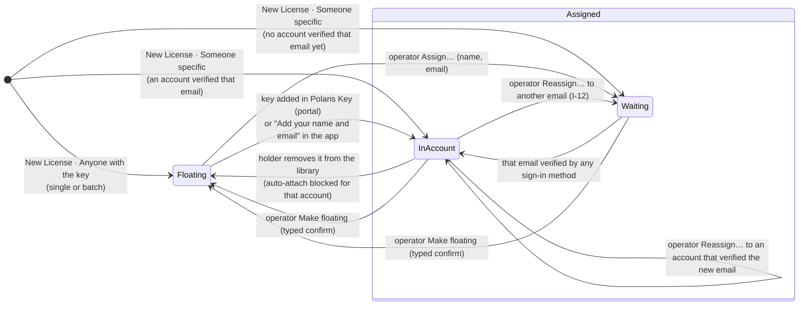

> Research note for [Godot on Polaris Key](../README.md), 2026-10-06. Spike S-24, commissioned by
> the lead on the owner's request of 2026-10-06 (quoted under "Owner rulings" below), with the
> owner's correction of the same day. Like S-21 to S-23, S-24 has no program brief; §13 registers
> its work packages under the existing `LX-`, `PX-` and `UK-` prefixes. Design only: no product code
> changed, nothing was deployed, no account or credential was used and no live call was made. File
> references are to the tree at `a376d9bb4` (`W/` = `packages/worker/src/`, `M/` =
> `packages/worker/migrations/`, `A/` = `packages/admin/src/`, `N/` =
> `docs/research/2026-09-29-godot-omniplatform/notes/`, `P/` =
> `docs/research/2026-09-29-godot-omniplatform/program/`, `D/` = `docs/design/`), except LX-14a,
> read on its branch `wp/LX-14a-device-limit` (in review). Mockups: [`D/licenses/`](../../../design/licenses/)
> (the console wizard and the portal) and frames 42–48 in [`D/sign-in/`](../../../design/sign-in/)
> (the activation steps), each rendered in both themes.

# S-24: licence holders, the New License wizard and activation without an account

Evidence tags, as in the other notes: **[V]** read in the code or the docs; **[M]** measured here
(the mockup renders); **[I]** inference or design; **[U]** not verified. Glossary (AGENTS.md rule 4):
product, device, tier. "Licence" in prose, `license` in identifiers and in UI copy (SIGN-IN.md
naming rule).

> **Owner rulings (binding).** These are the owner's own words or standing rulings, not delegated
> choices.
>
> | #   | Ruling                                                                                                                                                                                                                                                                                                                                                                                                                                                                                                                                                                                                                                                                                                         | Where          |
> | --- | -------------------------------------------------------------------------------------------------------------------------------------------------------------------------------------------------------------------------------------------------------------------------------------------------------------------------------------------------------------------------------------------------------------------------------------------------------------------------------------------------------------------------------------------------------------------------------------------------------------------------------------------------------------------------------------------------------------- | -------------- |
> | R1  | **The request (2026-10-06, verbatim):** "We should also modernize the 'New License' flow/wizard. This also means the ability to have 'floating' licenses which are not assigned to a name/email and would be assigned by activating and associating with an account via the customer portal. We can also continue to add a license assigned to a name/email, in which case it is automatically associated with an account that they can access using various sign in methods. We should allow users to continue with activation without an account, but recommend adding a name and email to enable things like Cloud Sync. Let's make sure we consider these cases as part of our product activation wizard." | all            |
> | R2  | **Two holder states, not three (2026-10-06, verbatim):** "'No account' is the same as continuing to be a 'Floating license' -- a floating license is still a license, with devices, expiry, etc. It just isn't associated to an account and therefore doesn't have Cloud Sync or any other account-based features." So a licence is **floating** or **assigned**. Activating a key without signing in keeps it floating; "Continue without an account" means exactly that; adding a name and email is the floating → assigned change, in place, on the same licence.                                                                                                                                           | §5             |
> | R3  | **Sign-in licences stay device-limited, and operators change the limits** (SIGN-IN.md D-53; LX-14a).                                                                                                                                                                                                                                                                                                                                                                                                                                                                                                                                                                                                           | §5.7, §8       |
> | R4  | **No "Account-wide" wording.** A licence's origin is plain words, and a store key names its store (SIGN-IN.md O-11, O-17).                                                                                                                                                                                                                                                                                                                                                                                                                                                                                                                                                                                     | §9, §10        |
> | R5  | **At sign-in the person confirms or chooses a licence; one is generated only if none exists; "Replace a device" happens inline** (SIGN-IN.md O-1 to O-3).                                                                                                                                                                                                                                                                                                                                                                                                                                                                                                                                                      | §9             |
> | R6  | **UI kits look like Polaris Key with the product as the hero, in three layers (drop-in, styled, headless), with native controls kept** (SIGN-IN.md O-10, O-14; UI-KITS.md §1).                                                                                                                                                                                                                                                                                                                                                                                                                                                                                                                                 | §9             |
> | R7  | **Destructive admin actions take a typed confirmation** (EXPERIENCE.md L3).                                                                                                                                                                                                                                                                                                                                                                                                                                                                                                                                                                                                                                    | §5.5, §5.6, §8 |
>
> **Owner decisions (delegated to Claude, 2026-10-06).** The owner delegated the open choices to the
> lead. Each is taken with the recommended option; the reasoning is in the section cited.
>
> | #   | Decision                                                                                                                                                                                                                                                                                        | Why (section)                                                                                                                       |
> | --- | ----------------------------------------------------------------------------------------------------------------------------------------------------------------------------------------------------------------------------------------------------------------------------------------------- | ----------------------------------------------------------------------------------------------------------------------------------- |
> | D1  | **The holder is derived, never stored.** Assigned = the licence has an account (`account_id`) or an email waiting for one; floating = neither. No `holder` column, no new state machine                                                                                                         | Two facts already decide it; a third column could disagree with them (§5.1)                                                         |
> | D2  | **No placeholder account for an assigned email.** The licence waits on its email and joins the account the first time that address is verified by any sign-in method                                                                                                                            | An account nobody verified would hold PII without consent and break D23's dormant-account rules (§5.4)                              |
> | D3  | **Association is automatic and immediate**: at creation when an account already verified the email, else at that email's first verification (portal, card, app passthrough, email gate), through today's `syncAccountLicenseLinks` rule (verified emails only, per-product `auto_link_enabled`) | R1's "automatically associated"; the rule exists and is already hardened (R5-01) (§5.4)                                             |
> | D4  | **The console never says whether an email has a Polaris Key account.** Copy is conditional: "When ada@example.com signs in with that email, it's in their library"                                                                                                                              | One operator must not learn which people hold accounts across every developer (§7.3)                                                |
> | D5  | **"Floating" is the console word; customers never see it.** Operators see **Floating** with a one-line definition on first sight; customer copy says "Add to your account" and "Not in an account yet"                                                                                          | The owner's word, for the people who manage licences; S-19 G18's concurrent-use reading matters to operators, so it is defined once |
> | D6  | **Assigning a name and email never copies the account's details into the licence**, and a claim never overwrites the developer's `name` and `email`. The signed document's `profile` therefore changes only when an operator edits the holder                                                   | Keeps the device wire unchanged and the developer's record theirs (§6.2)                                                            |
> | D7  | **No seat bonus for assigned licences.** Both states keep the licence's own device limit (R3); "more devices" in the recommendation means "free and replace devices yourself", never extra seats                                                                                                | A floating key must not be worth less than the same key in an account; operators already raise limits (§5.7)                        |
> | D8  | **The wizard is a drawer over Licenses with five steps** (Product and tier, Who it's for, Limits, Delivery, Review), then Done; the bulk path is the same wizard with a count                                                                                                                   | SETUP.md §1.1: a drawer when the setup configures the page under it in one sitting; five steps is the cap (§8)                      |
> | D9  | **"Someone specific" is the recommended holder**, with email required and name optional; **floating** is one card away and carries the count                                                                                                                                                    | Most direct sales name a buyer; the count belongs to the case that needs it (§8.3)                                                  |
> | D10 | **Bulk is floating only, at most 500 keys per batch, with a required label**; keys are shown once and exported to CSV in the browser; the Worker keeps only hashes. Bulk assigned licences (a name and email CSV import) are later                                                              | D1 batch and Worker request limits; the owner asked for floating bulk (§8.5)                                                        |
> | D11 | **Delivery for an assigned licence defaults to Both** (email the key and show it once); a floating licence is shown once (copy, or CSV for a batch) and is never emailed                                                                                                                        | Emailing a floating key to an address would assign it in all but name (§8.4)                                                        |
> | D12 | **The key email is sent by the Worker in the create request**, the only moment the plaintext exists; a later **Send a new key** mints a new key and can revoke the old one                                                                                                                      | Keys are stored only as peppered hashes (`W/crypto.ts`) (§6.3)                                                                      |
> | D13 | **"Continue without an account" replaces "Skip for now" and "Not now"** on every key on-ramp that allows skipping, with "<Product> works the same. Add it to an account any time." Nothing changes at the key-entry limit (no skip)                                                             | R1 and R2: say what skipping does (§9.3)                                                                                            |
> | D14 | **The recommendation is shown once, on the Done step after a key activation, and then lives as one quiet row in AccountAndLicense**; it never blocks, never returns as a prompt at launch, and lists only the reasons the product actually has (Cloud Sync only when Cloud Sync is on)          | Gentle, per R1; honest about capabilities (§9.2)                                                                                    |
> | D15 | **"Add your name and email" collects both in the app and hands them to the card as hints**; the code is still entered only on the card (D17). This needs `loginHint`, `nameHint` and `purpose: "attach"` on the pushed request (PX-W18, plan mode)                                              | R1 asks for a name and email; credentials stay on the card (§9.2, §6.4)                                                             |
> | D16 | **After that sign-in the kit keeps the device on its licence and attaches it** (`choice.complete({kind: "keep"})`, then I-09's `POST /<p>/identity/attach {confirm: true}`), with no licence list: the person already chose                                                                     | Upgrade in place, same licence and seats (R2); no new route (§9.2)                                                                  |
> | D17 | **An already-assigned key entered in an app**: with D24's refusal on, the form turns into sign-in and completes with `{kind: "key", key}`; with it off (the platform default, I-09 Q5), the key works and Done offers "Sign in to turn on Cloud Sync here"                                      | Both settings must read well (§9.4)                                                                                                 |
> | D18 | **A key that belongs to another email shows that email masked** (first character and domain), as the portal's `email_mismatch` already does, with **Use another account**, **Verify that email** and **Use a different key**                                                                    | PORTAL.md §4.19 precedent; the device already received the full address in `license.email` (§9.4, §7.4)                             |
> | D19 | **Removing a licence from your library makes it floating and keeps it out of that account** (a per-account auto-attach block), fixing H5                                                                                                                                                        | Today the next portal request re-attaches it (§4, §5.5)                                                                             |
> | D20 | **Reassign and Make floating are I-12's relink tool** (step-up, reason, notice, 72-hour undo), each with a typed confirmation of the licence's name or key ending                                                                                                                               | R7; one audited primitive (`reassignLicense`) (§5.5)                                                                                |
> | D21 | **A claimed floating key's origin is "Key ending 3WPLDA"** (or "<Store> key ending 3WPLDA"); a licence the developer assigned reads **"From <Developer>"**, even though it has a key                                                                                                            | R4; the origin says how it reached the person, not how it is stored (§10)                                                           |
> | D22 | **Devices activated while floating come along** when the licence is assigned: same seats, same tokens, no sign-out; only the device that signed in gains Cloud Sync, and the others show "Sign in to turn on Cloud Sync"                                                                        | R2's "in place"; Cloud Sync needs sign-in on the device (S-16 final answer 4) (§5.8)                                                |
> | D23 | **No signed-document or activation-response change.** The only wire change is additive members on the identity request (PX-W18): transcripts and parity rows, no corpus regeneration, `PROTOCOL_VERSION` stays 4                                                                                | §6                                                                                                                                  |

## 1. Question

How should a licence's **holder** work, so that an operator can issue a licence to nobody in
particular (floating) or to a named person (assigned), a customer can activate without an account,
and the product activation wizard recommends, without forcing, adding a name and email so the
licence joins an account? What does that change in the console's New License flow, the in-app and
hosted activation steps, the portal, the data model and the wire, and in which work packages?

## 2. Short answer

- **Two states (R2).** A licence is **floating** (no account and no email: whoever holds the key
  uses it) or **assigned** (it has an account, or an email that becomes one the first time it is
  verified). Both are full licences: tier, device limit, devices, expiry, origin, revocation.
  Only assigned licences reach account features: Cloud Sync (on devices that sign in), the
  Library, recovery through any sign-in method, freeing and replacing devices yourself. The state
  is **derived** from `licenses.account_id` and `licenses.email`, never stored (D1).
- **Most of the server already exists** [V]. A licence with no `account_id` is floating
  (`M/0068_b`); a licence's verified email attaches it automatically (`syncAccountLicenseLinks`,
  `W/services/identity/portal/repo.ts:399-452`); claim by key, the `license_owned` and
  `email_mismatch` refusals, attach and the claim rate bucket exist (`W/services/identity/accounts/
claim.ts`, `portal/selfService.ts:81-82`). What is missing is association **at creation**, a way
  for the holder's "remove from my library" to stick (H5, a real bug), delivery, bulk keys, and
  every console and kit surface.
- **The console's New License flow** becomes a five-step drawer wizard (D8): **Product and tier →
  Who it's for → Limits → Delivery → Review → Done**. "Someone specific" (email, optional name) is
  recommended; **Anyone with the key (floating)** carries a count for bulk (up to 500, labelled,
  CSV in the browser). Devices default to the tier's limit and can be set per licence (LX-14a).
  Delivery is **Email the key**, **Show it once**, or **Both** (the default for assigned).
- **The activation wizard** (kits, hosted card, portal) keeps key-only activation as a first-class
  ending: **Continue without an account** keeps the licence floating (D13). The Done step after a
  key shows **"Keep <Product> in your account"** with the reasons the product really has (Cloud
  Sync, getting the licence back, moving it to a new device) and **Add your name and email**. That
  path collects the two values in the app, finishes on the card (the code never enters the app),
  then keeps the device on its licence and attaches it: same licence, same seats (D15, D16). Assigned
  keys, keys owned by another account and keys sent to another email each have a designed state
  (§9.4).
- **Wire (D23).** The signed licence document and the activation response do not change. The
  identity request gains three optional members (`loginHint`, `nameHint`, `purpose`), a plan-mode,
  transcripts-only change with SDK follow-up in Node, React, Python, Swift, Kotlin and Godot (PX-W18,
  UK-44). No corpus regeneration; `PROTOCOL_VERSION` stays 4.
- **Eleven work packages** (§13): LX-26 to LX-31, PX-W18 ⚑, PX-23, UK-42, UK-43 and UK-44 ⚑.

## 3. Method

1. Read the licence create, read, activate and document paths, the claim, attach, detach and
   reassign code, the auto-link rule, the account sign-in and link code, the audit writers and the
   migrations, at `a376d9bb4`; LX-14a on its branch. [V]
2. Read S-16 (owner's final answers, D24, the claim rules), S-17 (`resolveSyncPrincipal`), S-19
   (vocabulary, anchor, D4), the I-04, I-09, PX-W8, PX-W9 and PX-W13 plans and briefs, SIGN-IN.md
   (O-1 to O-17, §3.6, §3.9, §3.17, §4.5, §6), FLOWS.md (C-17, P-5, §2, §3), SETUP.md §1, ADMIN.md
   §6.5, PORTAL.md §4.17 to §4.20 and UI-KITS.md §4.3. [V]
3. Walked every holder transition (§5.2) and every activation entry (§9) against those rules. [I]
4. Built static mockups in the existing harnesses (the setup/flows console kit and the sign-in
   frames) and rendered them in Chromium at 1440 and 390 px in dark and light (§12.3). [M]

No load was measured. The batch limit (500) is a design bound under D1's statement limits, to be
confirmed by LX-28's test against the D1 emulator.

## 4. Current state

| #   | Finding                                                                                                                                                                                                                                                                                                                                                                                                                     | Evidence                                                                                                                          |
| --- | --------------------------------------------------------------------------------------------------------------------------------------------------------------------------------------------------------------------------------------------------------------------------------------------------------------------------------------------------------------------------------------------------------------------------- | --------------------------------------------------------------------------------------------------------------------------------- |
| H1  | **The console cannot create a floating licence.** `CreateLicenseDialog` is two steps ("Who it's for", "Set the terms") then the one-time key, and `validateHolder` requires name **and** email. It has no device limit, no count, no product picker and no delivery choice                                                                                                                                                  | `A/console/pages/license/CreateLicenseDialog.tsx:53-56,59-71,88-95,604` [V]                                                       |
| H2  | **The Worker already accepts one.** `POST /manage/api/products/<p>/license/licenses` stores `name` and `email` as `null` when absent and never sets `account_id`: every admin-created licence starts unattached                                                                                                                                                                                                             | `W/services/license/admin/licenses.ts:127-217` (insert 151-180) [V]                                                               |
| H3  | **Nothing is sent on create.** The only side effect is the `license.create` audit row; the plaintext key goes back once in the response (`{licenseId, key, license}`), and only its peppered hash is stored                                                                                                                                                                                                                 | `admin/licenses.ts:200-208`; `W/crypto.ts:32-34,128-143` [V]                                                                      |
| H4  | **Association by email exists, but only on portal requests.** `syncAccountLicenseLinks` attaches every unattached licence whose `lower(email)` is one of the account's verified emails, on products where `auto_link_enabled` resolves on (default on for platform-issuer products, off for custom issuers, R5-01). It runs on `/api/me`, `/api/licenses` and most portal routes, and after portal sign-in, not at creation | `portal/repo.ts:353-357,399-452`; `portal/api.ts:500,613,1201`; `portal/auth.ts:382,524` [V]                                      |
| H5  | **"Remove from my library" does not stick for a licence with an email.** `detachLicense` clears `account_id` but keeps `licenses.email`; the next portal request runs H4's sync, which attaches it again                                                                                                                                                                                                                    | `accounts/claim.ts:186-217`; `portal/repo.ts:420-428`; `portal/api.ts:500` [V], the re-attach itself [I]                          |
| H6  | **The signed document and the activation response carry the licence's name and email.** `DocProfile {name, firstName, email, activatedAt}` comes from `license.name` and `license.email` (empty strings when null); `shapeLicense` returns `name` and `email` to whoever activates by key                                                                                                                                   | `packages/shared-protocol/src/license.ts:7-13,22-26`; `W/core/authz.ts:196-204`; `W/services/license/activation.ts:75-87,158` [V] |
| H7  | **Claim by key** is one shared bucket of 10 per minute per account for preview and claim; `license_owned` (403) and `email_mismatch` (403, `maskedEmail`, unless `claim_by_key`) are the refusals; each attach audits and emails                                                                                                                                                                                            | `portal/selfService.ts:81-82,134-182,328`; `accounts/claim.ts:61-156`; `conformance/parity/errors.json:205-211` [V]               |
| H8  | **Accounts never merge by email.** An unknown identity whose verified email belongs to another account becomes a join offer and writes nothing; linking needs a fresh step-up (5 minutes); merges need proof of both                                                                                                                                                                                                        | `W/services/identity/accounts/signIn.ts:117`; `links.ts`; `merge.ts` [V]                                                          |
| H9  | **No per-licence device limit on `main`.** LX-14a adds `licenses.device_limit` and `PATCH … deviceLimit` with precedence licence → tier → entitlement → product, and **refuses `deviceLimit` on create** (commit `e755e88f1`)                                                                                                                                                                                               | `W/core/authz.ts:240-255`; branch `wp/LX-14a-device-limit` [V]                                                                    |
| H10 | **Cloud Sync has no code yet**; its rule is fixed: `resolveSyncPrincipal(device) = devices.subject`, set only by sign-in, with no licence-owner fallback                                                                                                                                                                                                                                                                    | `P/wp/U-02-principal-binding.md:39`; `P/plans/I-04.md:971`; `N/S-17-user-data-sync.md:41,208` [V]                                 |
| H11 | **D24's key-entry refusal is a platform switch, default off** (`identity.keyEntryRefusals`, I-09 Q5): until an operator turns it on, an owned licence's key still activates new devices                                                                                                                                                                                                                                     | `P/wp/I-09-*.md:20` [V]                                                                                                           |
| H12 | **No bulk creation.** The only bulk licence action is delete (`MAX_BULK_DELETE = 100`) and disable/enable                                                                                                                                                                                                                                                                                                                   | `A/console/pages/license/LicenseDelete.tsx:65` [V]                                                                                |
| H13 | **Audit** goes to the per-product `audit` table (`license.create`, `.update`, `.delete`, `.tier.change`, …) and the account-side `portal_audit` (`account.license.attach/detach/relink`, `portal.license.claim`)                                                                                                                                                                                                            | `W/admin/audit.ts:20`; `M/0001:182-196`; `portal/repo.ts` `portalAudit`; `M/0008:62-71` [V]                                       |

## 5. The holder model

### 5.1 Two states (R2)

| State        | Facts (D1)                                               | What the person gets                                                                                                                                                  | Console label (D5)                          |
| ------------ | -------------------------------------------------------- | --------------------------------------------------------------------------------------------------------------------------------------------------------------------- | ------------------------------------------- |
| **Floating** | `account_id IS NULL` and `email IS NULL`                 | The licence on every device that enters its key: tier, device limit, expiry, offline window, updates. No Cloud Sync, no Library, no recovery, no self-service devices | **Floating** · "Anyone with the key"        |
| **Assigned** | `account_id IS NOT NULL`, or `email IS NOT NULL` waiting | All of the above, plus the account features: the Library, any sign-in method, free and replace devices, downloads, and Cloud Sync on each device that signs in        | **In an account**, or **Waiting for ada@…** |

"Waiting" is a display detail of assigned, not a third state: the licence names its holder and
joins the account the moment that email is verified (D2, D3). It already works on devices
exactly like a floating one (H2), which is what R2 asks.

Legacy licences fit without migration: an email-bearing licence with no account is assigned and
waiting; a licence with neither is floating; `origin` (`admin`, `oidc`, `enroll`) is unchanged.
On a product whose `auto_link_enabled` resolves off (custom issuers, H4), a waiting licence joins
only by key with a verified matching email (H7); the console says "Joins by key only on this
product".

### 5.2 Transitions



Disabling, expiring and deleting a licence apply in either state (§5.6). Nothing in the diagram
changes the licence id, its keys, its devices, its seats or its terms.

### 5.3 How a floating licence becomes assigned

| Path                                   | Who                       | Where                                          | Rules                                                                                                                                                                                                         |
| -------------------------------------- | ------------------------- | ---------------------------------------------- | ------------------------------------------------------------------------------------------------------------------------------------------------------------------------------------------------------------- |
| **Add the key in Polaris Key**         | the person, signed in     | Portal Activate license (§10), card KeyStep    | Today's claim: preview, then claim, one shared rate bucket (H7); `account.license.attach` + `portal.license.claim`; the devices it is on come along (D22). The entry counts only on Identity products (PX-W9) |
| **Add your name and email** (app)      | the person, on the device | The kit's Done step after a key (§9.2)         | Sign-in on the card with the hints, then `choice.complete({kind: "keep"})` and `POST /<p>/identity/attach {confirm: true}` (I-09). Needs Identity on; this device gets `devices.subject` and Cloud Sync       |
| **Keep <Product> in an account** (web) | the person                | The card's on-ramp after "Have a license key?" | SIGN-IN.md §3.9 with D13's copy; the claim on submit                                                                                                                                                          |
| **Assign…**                            | an operator               | Console licence record (§8.8)                  | Sets `name` and `email`; the licence is then waiting or in an account by D3. Audited `license.holder.assign`; the email is sent only if the operator ticks **Email them the key** (a new key, D12)            |

On a product with Identity off, the app path opens the portal instead: `/activate?product=<slug>`
with the key in a `#key=` fragment while the kit still holds it in memory (the key is never kept
after the Done step closes; PX-W8 Q1), so the person adds it there.

### 5.4 Assigned: association and sign-in methods

- **At creation** (new): when an account has already verified the email, `account_id` is set in
  the same request, the pairwise subject is created (`subjectFor`), and the "Added to your library"
  notice goes out. Otherwise the licence waits (D2). The console shows the same text either way
  (D4).
- **At verification** (today, widened): every place an email becomes verified on an account runs
  the H4 sync for that address: portal sign-in, the card's CodeStep and RegisterStep (I-07), the
  email gate (PX-W15, PX-21), an app passthrough sign-in (I-08), and adding an email in Account. LX-26
  moves the call from the portal handlers to one Core hook, `onAccountEmailVerified`, so it runs
  once per verification rather than on every portal request.
- **Any sign-in method reaches the same account**, because the account, not the method, is the
  holder (S-16): email code to the address; Google or an OIDC provider whose `email_verified` is
  true for it; Apple when it shares the real address (a private-relay address does not match; the
  email gate lets the person switch to the real one and verify it with a code); Steam, which has no
  email, through the email gate's typed-and-verified address. The match uses
  `verifiedAccountEmails` (primary and every verified link email), as the code does today (H7).
- **Signing in later by another method** (account linking): an identity whose verified email is
  already an account's becomes a **join offer** and writes nothing (H8), so the person links it
  under step-up from the offer or from Account → Sign-in methods (PX-13). If they instead create a
  second account with a different email, the licence stays where it is; **Link an existing
  account** (PX-15) merges the two under proof of both (D21 of S-16). A licence never moves by
  email match alone.

### 5.5 Transfer and reassignment

| Action                             | Who                | Mechanism                                                                                                                                       | Devices                                                                                               |
| ---------------------------------- | ------------------ | ----------------------------------------------------------------------------------------------------------------------------------------------- | ----------------------------------------------------------------------------------------------------- |
| **Remove from my library**         | the holder, portal | `detachLicense` (D25 of S-16) plus a row in `license_auto_attach_blocks(product, license_id, account_id)` so H4's sync skips it (D19)           | Keep running; sign-in-bound devices keep their seats until they sign out (S-17 §5.8 item 2)           |
| **Reassign…** to another email     | operator           | I-12's relink tool over `reassignLicense`: step-up, a reason, a notice to both addresses, 72-hour undo, typed confirmation of the licence (D20) | Devices bound by the previous owner's sign-in lose the binding (`relinked`); key devices keep running |
| **Make floating**                  | operator           | The same tool with `toAccountId: null`, and `email` and `name` cleared; typed confirmation; optional **Also sign out its devices** (off)        | As above; with the option on, every device is deauthorised in the same batch                          |
| Person-to-person gift of a licence | —                  | Not a feature. The holder removes it and hands over the key; the recipient adds it. A gift of a new item is LX-25's redeem code                 | —                                                                                                     |

A reassignment's undo restores the previous `account_id`, `name` and `email`, and deletes the
block row it may have created.

### 5.6 Revocation

The same in both states, and unchanged: **Disable license** (L1, reversible), **Delete license**
(L3, typed; `feat/license-delete`), and revoking one key (L2) while the licence lives on with
another (C-22). An assigned licence's holder sees it under "Ended" in the Library; no email is sent
by a disable (LX-12 owns refund and chargeback notices). A batch adds **Disable unused keys in this
batch** (L3, typed with the batch label), which disables every licence of the batch with no device
ever bound, for a leaked CSV.

### 5.7 Device limits per case (R3, D7)

| Case                                | Limit                                                                                     | Counted devices                                                |
| ----------------------------------- | ----------------------------------------------------------------------------------------- | -------------------------------------------------------------- |
| Floating                            | The licence's `device_limit` (LX-14a), else the tier's, else an entitlement, else product | Devices that entered the key                                   |
| Assigned, waiting                   | Same                                                                                      | Same                                                           |
| Assigned, in an account             | Same                                                                                      | Key devices plus devices that signed in and chose this licence |
| Sign-in licence (`origin = 'oidc'`) | Same (D-53); operators change it on the licence (LX-14a)                                  | Signed-in devices                                              |

Association never changes the count or the limit. A full assigned licence offers **Replace a
device** inline at sign-in (R5) and **Remove** in the portal; a full floating licence offers the
kit's DeviceLimit and the portal link `/activate?product=<slug>&next=free-device` (PX-W8 Q3), which
first adds it to an account. The wizard sets the limit at creation (§8.4).

### 5.8 Cloud Sync and the other account features

**Cloud Sync needs a person signed in on that device** (S-16 final answer 4; H10):
`resolveSyncPrincipal(device) = devices.subject`, which only sign-in sets. A floating licence has no
account, so no device on it can have a principal; that is why an activation without an account
cannot sync, and why R2 calls floating "no account-based features". Assigning the licence does not
by itself turn Cloud Sync on for its key devices: each one gets it when someone signs in on it.
The device that used **Add your name and email** is signed in by that flow, so Cloud Sync starts
there at once. The others show "Sign in to turn on Cloud Sync" (D22).

| Feature                                 | Floating | Assigned, key device | Assigned, signed-in device |
| --------------------------------------- | -------- | -------------------- | -------------------------- |
| The licence's tier, limits, updates     | yes      | yes                  | yes                        |
| Cloud Sync                              | no       | no (sign in here)    | yes                        |
| Library, downloads, recovery by sign-in | no       | yes                  | yes                        |
| Free or replace a device yourself       | no       | yes (portal)         | yes (inline)               |
| Account config overrides (S-17)         | no       | yes (through owner)  | yes                        |
| Account-held grants (S-19, `combined`)  | no       | no (D4 of S-19)      | yes                        |

### 5.9 Upgrading in place

"Recommend name and email" never creates a licence. The device keeps its anchor (`devices.license_id`
unchanged, seat unchanged); the licence gains `account_id`; the device gains `devices.subject`
(`bound_by` stays `key`, I-09 Q2: attach never re-anchors). The SDK receives the activation
response from attach (I-09) with the same `licenseId`, so nothing in the app resets. The next
licence document is byte-identical in shape and, by D6, in content.

## 6. Data model and wire impact

### 6.1 Schema (LX-26, LX-28)

- **No holder column** (D1). Reads compute `holder`:
  `{kind: "floating"} | {kind: "assigned", inAccount: boolean, email?: string}` (the console sees
  the licence's own email, which it wrote; never the account's).
- `license_auto_attach_blocks(product TEXT, license_id TEXT, account_id TEXT, created_at INTEGER,
PRIMARY KEY (product, license_id, account_id))`, Core-owned, written by `detachLicense`, read by
  the sync and the creation-time association, deleted by a reassignment's undo and by
  `mergeAccounts` (moved to the survivor) (D19).
- `license_batches(product TEXT, id TEXT, label TEXT NOT NULL, count INTEGER NOT NULL, tier_id TEXT,
created_by TEXT NOT NULL, created_at INTEGER NOT NULL, PRIMARY KEY (product, id))` and
  `licenses.batch_id TEXT NULL` with `idx_licenses_batch(product, batch_id) WHERE batch_id IS NOT
NULL` (one `ALTER` per migration file, R11-04). Batch licences keep `origin = 'admin'`: the origin
  trigger (`M/0015:78-86`) is not widened.
- `licenses.device_limit` comes from LX-14a; LX-27 lifts its refusal on create.

### 6.2 The signed licence document and the activation response: unchanged

- `LicenseDoc`, `DocProfile` and the envelope keep their shape. A floating licence's `profile`
  carries empty `name` and `email` as today (H6).
- Association changes no input of the document under `legacy` and under S-19's
  `entitlementHolder: device` (a key device still sees only its licence), and D6 keeps `name` and
  `email` the developer's. So the document is unchanged in content too, until an operator edits the
  holder, which already changes `profile` today.
- The activation response keeps `license.name` and `license.email` (H6). Kits mask the email when
  they show it (D18, §7.4). Removing them would be a wire change for no new protection: the key
  holder already holds the licence.

**No corpus regeneration, no `PROTOCOL_VERSION` bump, no change to `client-core` verification.**

### 6.3 Admin API (rule 10: OpenAPI and `routeCoverage` in each package)

| Route                                                    | Change                                                                                                                                                                                                      | Package         |
| -------------------------------------------------------- | ----------------------------------------------------------------------------------------------------------------------------------------------------------------------------------------------------------- | --------------- |
| `GET …/license/licenses`, `GET …/licenses/<id>`          | `holder`, `batchId`; list filters `holder=floating\|assigned\|waiting` and `batch=<id>`                                                                                                                     | LX-26           |
| `POST …/license/licenses`                                | association at creation (D3); `deviceLimit` (positive integer or absent); `delivery: {email: boolean}` (only with an email); answers `delivered: {email: "sent" \| "queued" \| "failed"}`                   | LX-26, LX-27    |
| `PATCH …/licenses/<id>`                                  | setting `email` on a floating licence assigns it (D3); clearing it is refused with the existing `400 bad_request` (use Make floating); no new error code                                                    | LX-26           |
| `POST …/licenses/<id>/send-key`                          | mints a new key, emails it to the licence's email, optional `revokeOthers: true`; one per 10 minutes per licence                                                                                            | LX-27           |
| `POST …/license/batches`, `GET …/license/batches[/<id>]` | `{label, count ≤ 500, tier, deviceLimit?, expiresAt?, maxOfflineDays?, channels?, minVersion?, maxVersion?}` → `{batchId, licenses: [{licenseId, key}]}` (`Cache-Control: no-store`); list with used counts | LX-28           |
| `POST …/license/batches/<id>/disable-unused`             | disables batch licences with no device ever bound; answers the count                                                                                                                                        | LX-28           |
| I-12 relink                                              | gains **Make floating** (`toAccountId: null` plus clearing `name` and `email`) and the block-row undo                                                                                                       | LX-30 (on I-12) |

Audit (`audit` table, H13): `license.create` gains `holder` and `delivery` in its summary;
new `license.holder.assign`, `license.key.send`, `license.batch.create`,
`license.batch.disable_unused`; `portal_audit` gains `account.license.auto_attach_block`.

### 6.4 The identity request: plan mode (PX-W18 ⚑, UK-44 ⚑)

The one device-facing change, for D15. Additive and optional on routes that are planned but not yet
built (PX-W13 §2.5, I-08, I-15):

| Member                                           | On                                                                          | Meaning                                                                                                                                                      |
| ------------------------------------------------ | --------------------------------------------------------------------------- | ------------------------------------------------------------------------------------------------------------------------------------------------------------ |
| `loginHint` (string, an email, ≤ 254)            | `POST /<p>/identity/request`; `login_hint` on `GET /<p>/identity/authorize` | Prefills MethodsStep's email and goes straight to CodeStep when it is a valid address. **Never skips verification**; the field stays editable                |
| `nameHint` (string, ≤ 80)                        | the pushed request                                                          | Prefills RegisterStep's name for a **new** account only; ignored for an existing account (whose details stay its own)                                        |
| `purpose: "signin" \| "attach"` (default signin) | the pushed request                                                          | Display only: the card's header line reads "Add <Product> to your account" and Consent and ReturnStep use the attach copy. It changes no rule and no binding |

Under AGENTS.md rule 2 and the SIGN-IN.md §6.5 precedent this is additive and opt-in:
`PROTOCOL_VERSION` 4, `DISCOVERY_VERSION` 2, `corpusVersion` 2, **no corpus change**. It needs new
recorded transcripts (`gen:transcripts`: `identity-request-hints.json` with its Swift and Godot
mirrors), parity rows (`identity.signin.hints` in `features.json`), and the SDK headless
`signIn.start({loginHint, nameHint, purpose})` in **Node, React (over `client-core`), Python,
Swift, Kotlin and Godot** (UK-44), then the kits (UK-42, UK-43). An old Worker ignores the members,
so a new SDK degrades to an empty card.

## 7. Security and privacy

### 7.1 Claim-by-key brute force

A key is `pkey_<slug>_` plus 128 random bits (`W/crypto.ts:32-34`), so guessing is not a practical
attack; the risk is a leaked key. Controls, all existing except where marked: the portal's claim
bucket (10 per minute per account, shared with preview, H7); activation 30 per minute per IP;
refused attempts are rate-limited, not counted (S-16 §5.3); every attach emails the licence's
address and the session's (H7); D24 and the entry limit on Identity products. **New:** the batch
CSV is the largest leak surface, so it is generated in the browser from a `no-store` response, never
stored by the Worker, and a leaked batch has **Disable unused keys** (§5.6); `send-key` is limited
to one per 10 minutes per licence and audited.

### 7.2 Email ownership before association (I-07's email gate)

An assigned licence joins only an account that **verified** its email: a delivered code or magic
link, or a provider that asserts the address verified (S-16 owner decision on the email gate). The
sync reads `verifiedAccountEmails` only, and only on products where `auto_link_enabled` resolves on
(R5-01: a custom issuer's `email` claim is never trusted). The hints of §6.4 change nothing here:
`loginHint` prefills a field and the card still sends the code. A typed email in the app is never
treated as verified.

### 7.3 PII minimisation

- **Floating licences hold no personal data**: no `name`, no `email`, and batch rows carry a label
  and the operator's id only. The CSV has key, licence id, product, tier, device limit, expiry and
  batch label, nothing about a person.
- **No placeholder accounts** (D2): an assigned email lives only on the developer's licence row
  until its owner verifies it.
- **No account enumeration in the console** (D4): the create answer, the record and the list say
  "Waiting" or "In an account" only **after** association, which the developer can already infer
  from its own Users page (I-12, pairwise subject); before it, the console never reveals whether
  the address has an account.
- **No account details flow to the developer** on association (D6): the console shows the
  licence's own `email` and the pairwise subject; personal details only as I-12 and the consent
  rules allow.
- The activation response's `license.email` (H6) is shown masked by the kits (`m•••@fennick.studio`
  style, first character and domain).

### 7.4 Audit

Every transition of §5.2 writes one row: creation (`license.create`, with `holder`), association
(`account.license.attach` with `via: email | key | device`), assignment (`license.holder.assign`),
removal (`account.license.detach` plus `account.license.auto_attach_block`), reassignment and Make
floating (I-12's relink rows with reason and undo), key sends, batch creation and batch disables.
The licence record's History tab shows them in order; the account's own activity shows the
`portal_audit` half.

### 7.5 Threat-model rows (LX-31)

T-H1 "A leaked batch CSV activates strangers' devices" (mitigation: Disable unused keys, no
server copy). T-H2 "An operator learns whether a person has a Polaris Key account" (D4). T-H3 "A
tenant asserts a victim's email to pull a licence into their account" (R5-01, verified emails
only, unchanged). T-H4 "A removed licence returns to the account" (D19). T-H5 "A login hint
pre-verifies an email" (it does not; §7.2).

## 8. The console New License wizard

### 8.1 What it replaces

C-17 (`CreateLicenseDialog`, FLOWS.md §1.1: "update") and ADMIN.md §6.5.1's three-step dialog.
UX-77's Create license fixes (focus, announcements, action-named primaries, unsaved guard) are
absorbed: the new wizard is built on `ui/wizard` (UX-50) and meets FLOWS.md §2 by construction.

### 8.2 Shape (D8)

A **drawer** over Licenses (`?setup=new-license&step=<id>`), 600 px, with the segmented stepper of
SETUP.md §1.1 and "Step n of 5" in each step heading. Opened by **New license** (page header, also
`n`), the palette ("New license…"), the launch path's **First license**, and Licenses' empty state.
On phones it is a full-height sheet. The draft lives in the URL and `sessionStorage` (F3: nothing
exists until Create); Escape with a draft asks "Discard this license?" (UX-77's guard).

| Step | Title (h3)       | Kind (SETUP §1.2)                  | Primary                                                                |
| ---- | ---------------- | ---------------------------------- | ---------------------------------------------------------------------- |
| 1    | Product and tier | Choose (`RadioCards`)              | **Continue**                                                           |
| 2    | Who it's for     | Choose, with a form under a card   | **Continue**                                                           |
| 3    | Limits           | Form                               | **Continue**                                                           |
| 4    | Delivery         | Choose                             | **Continue**                                                           |
| 5    | Review           | Confirm, with the `AutoList`       | **Create license** / **Create and email license** / **Create 50 keys** |
| —    | Done             | Done (`OneTimeSecretPanel` or CSV) | **Copy key** / **Download CSV**                                        |

### 8.3 Steps 1 and 2

**Product and tier.** Inside a product the product is fixed and shown as context (icon, name) with
no picker; from Home or the global palette a product combobox comes first. Tiers are radio cards
ranked by `tiers.rank` (S-19) with each tier's summary ("No expiry · 3 devices · stable"), the
product's default preselected only when there is exactly one tier, and **New tier…** as a quiet
link that opens the tier drawer and returns. With no tiers the step is the Licensing quick start's
**Create Free and Pro** (SETUP.md §4.2).

**Who it's for** (D9). Two cards:

1. **Someone specific** (Recommended · "They can find it by signing in with this email"): **Email**
   (required, checked as typed), **Name** (optional, "Shown in the app and the email"). Under it,
   the conditional line of D4: "When ada@example.com signs in with that email, it's in their
   library. Until then the key works on its own." On a product whose auto-link is off: "On this
   product it joins an account only when they add the key."
2. **Anyone with the key** (floating): "Not in anyone's account. Whoever adds the key in Polaris Key
   keeps it." Under it, **How many keys** (a stepper, 1 to 500, default 1) and, when more than one,
   **Batch label** (required, "Steam keys, October").

### 8.4 Steps 3 and 4

**Limits.** **Devices**: "Use the tier's limit (3)" (default) or **Set for this license** with a
number (LX-14a's rule: a licence value beats the tier). **Expiry**: "Tier default (Never)", "Never",
or a date. **Offline days**: blank inherits. **More options** (collapsed): channels, version window,
profiles in order (ADMIN.md §6.5.1). The aside shows the effective policy with each value's source
("3 devices · from Pro").

**Delivery** (D11). For someone specific: **Email the key and show it once** (default),
**Email the key**, **Show it once**. The email preview is a card: from "<Product> via Polaris Key"
(I-18), subject "Your <Product> license", greeting with the name when given, the key, **Open in
Polaris Key** (signs in with that email), and the download link when the product has one. For a
floating licence: **Show it once** (one key) or **Download a CSV** (a batch), with no email option
and the reason in one line ("Floating keys aren't emailed: assign it to someone instead").

### 8.5 Step 5, Review, and Done

**Review**: a summary list (product and tier, holder, devices, expiry, delivery) with **Change**
per row going back to that step, and the `AutoList` in the future tense:

- "Create the license" (or "Create 50 floating licenses in batch Steam keys, October");
- "Mint its key" ("Shown once. Polaris Key keeps only a hash");
- "Email it to ada@example.com" (when chosen);
- "Add it to their library when they sign in with that email" (assigned; D4 wording).

**Done** replaces the drawer's body in place (S-23 morph):

- **One licence:** the success check, h3 "License created", the `OneTimeSecretPanel` with the key
  ("Shown once. Copy it now."), the delivery result ("Emailed to ada@example.com" or "Email
  couldn't be sent: **Try again**", which mints nothing), and **Open license**, **Create another**,
  and the first-license **Try it** link to the SDK quick start (EXPERIENCE §0.7) the first time.
- **A batch:** "50 keys created", **Download CSV** (the primary; the drawer will not close until it
  has been downloaded or copied, with "These keys are shown once. Download them first."), **Copy all**,
  and **Open batch** (the Licenses list filtered to it).

### 8.6 Copy and motion

Plain words (FLOWS.md C5, EXPERIENCE §11): "New license", "Who it's for", "Anyone with the key",
"Floating", "Waiting for ada@example.com", "In an account". Never "holder", "floating license key",
"claim", "redeem" or "seat" in UI copy. Motion is S-23's: step travel and height morph in
`ui/wizard` (UX-80), the `AutoList` check draw on Create, one check draw on Done (no burst: a
licence is not a first-run moment, except the product's first licence, which keeps EXPERIENCE
§0.7's one-shot celebration), instant swaps under reduced motion.

### 8.7 States

Validation inline on blur and paste (C9); a taken batch label is allowed (labels are not unique);
a tier deleted mid-draft returns to step 1 with "That tier was deleted. Choose another."; a create
that fails leaves the draft and says why ("Polaris Key couldn't create the license. Nothing was
created. **Try again**"); a batch is all-or-nothing in one D1 batch.

### 8.8 Holder surfaces on the record and the list (LX-30)

- **Licenses list**: a **Holder** column (name and email, or **Floating** in muted text, or
  "Waiting · ada@…"), a **Holder** filter (Anyone, In an account, Waiting, Floating) and a **Batch**
  filter; batch rows link to the batch.
- **Licence record header**: the holder line ("Ada Lovelace · ada@example.com · In an account", or
  "Floating · anyone with the key"), with **Assign…** on a floating licence and, in the overflow,
  **Send a new key…** (assigned), **Reassign…** and **Make floating…** (both I-12 tool, L3 typed,
  D20).
- **Batch page** (from the filter): label, created, by whom, used of count, **Download CSV is not
  available again** (stated plainly), and **Disable unused keys…** (L3).

Mockups 70–77 in [`D/licenses/`](../../../design/licenses/) (§12.3).

## 9. The product activation wizard

### 9.1 Where it runs

The same steps on every surface, per SIGN-IN.md's two paths (O-15):

| Surface                                        | Key entry                                                  | Done and the recommendation                                   | Add your name and email                                             |
| ---------------------------------------------- | ---------------------------------------------------------- | ------------------------------------------------------------- | ------------------------------------------------------------------- |
| Kit form, `presentation: "inline"` / `"sheet"` | Step 1's **Have a license key?** morphs into the key field | The form's Done step (frame 42), then AccountAndLicense's row | In place (frame 43); the card for the code; back to Done (frame 44) |
| Kit form, `presentation: "browser"`, terminals | Same field                                                 | Same Done; terminals print one line with the URL              | Opens the card with the hints                                       |
| Hosted card (path A)                           | KeyStep, the on-ramp (frame 48)                            | The on-ramp itself is the recommendation                      | The on-ramp's email field (it is the card)                          |
| Portal                                         | Activate license (§10)                                     | Not needed: the portal is the account                         | —                                                                   |

### 9.2 Key-only activation and the recommendation (D13, D14)

1. **Key** (unchanged, UI-KITS §4.3): the live verdict, the server preview of tier and terms, then
   **Activate**. `device_limit` hands off to DeviceLimit; the refusals of §9.4 render in place.
2. **Done** (new for a key; frame 42): the success check, h1 "<Product> is ready", the product row
   "Pro · Lifetime · this Mac is device 1 of 3", then a quiet card: h2 **"Keep <Product> in your
   account"** with "Recommended", and up to three lines, each only when true (D14):
   - "**Cloud Sync** keeps your settings and saves on every device" (Cloud Sync on);
   - "**Get your license back** if you lose the key or this device";
   - "**Move it to a new device** yourself, without asking <Developer>".
     Actions: **Add your name and email** (secondary) and the primary **Start using <Product>**,
     with the line "Or continue without an account. <Product> works the same."
3. **Add your name and email** (frame 43): the body morphs into h1 "Keep <Product> in your account",
   **Name** and **Email** (native fields, `autocomplete="name"` and `"email"`), **Continue in
   browser** (opens the card at CodeStep with `loginHint` and `nameHint`, `purpose: "attach"`), the
   provider row (Apple, Google, Steam: "they share your name and email"), **Back**, and "We send a
   code to this email in your browser. <Product> never sees it." Then step 2 of the form ("Finish in
   your browser", unchanged).
4. **Added** (frame 44): when the code is redeemed the kit completes `keep`, calls attach, and shows
   the success check, h1 "<Product> is in your account", "Signed in as Mara Fennick", "Cloud Sync is
   on for this Mac" (when it is), **Start using <Product>**. `license_owned` from attach (someone
   attached it meanwhile) shows §9.4's owned state.

**Continue without an account** at any point keeps the licence floating, closes the form, and the
app runs. AccountAndLicense keeps one row: "Not in an account · **Add your name and email**". With
Identity off, the card's line reads "Keep your license safe in Polaris Key" and **Add it in Polaris
Key** opens the portal (§5.3); Cloud Sync is not listed (it needs Identity).

### 9.3 The hosted card (path A) and D13

The card's on-ramp (SIGN-IN.md §3.9, frame 10, now frame 48) keeps its shape and gains the reason
lines of §9.2 under "Keep <Product> in an account". **Skip for now** and **Not now** become
**Continue without an account** with the line "<Product> works the same. Add it to an account any
time." It stays absent at the key-entry limit (O-9) and in the standalone portal.

### 9.4 Keys that already belong to someone

| Case                                              | Server answer                                             | In the form (copy keys in SIGN-IN.md §5.2)                                                                                                                                                                                                                                                                                 |
| ------------------------------------------------- | --------------------------------------------------------- | -------------------------------------------------------------------------------------------------------------------------------------------------------------------------------------------------------------------------------------------------------------------------------------------------------------------------- |
| **Assigned, waiting** (an email, no account yet)  | Activation succeeds                                       | Done shows "This license was sent to **a•••@example.com**. Sign in with that email to keep it in your account." and **Sign in as a•••@example.com** (the hint is that email; D18)                                                                                                                                          |
| **In an account, refusal off** (H11, the default) | Activation succeeds                                       | Done shows "This license is in a Polaris Key account. Sign in to turn on Cloud Sync here." and **Sign in** (no hint: the app does not know the account)                                                                                                                                                                    |
| **In an account, refusal on** (D24)               | `license_owned` (403) with `signInUrl`                    | Frame 45: "This license is in a Polaris Key account", "Sign in with the email it was sent to. <Product> starts on this device as soon as you do.", **Continue in browser** and the provider row, **Use a different key**. After sign-in the kit completes `{kind: "key", key}` (I-04 §G), so no licence list appears (D17) |
| **Signed in, key in another account**             | `license_owned` on `{kind: "key"}`                        | "This <Product> license is in another Polaris Key account. A license never moves by its key." **Use another account** · **Use a different key** (SIGN-IN.md §3.9 copy)                                                                                                                                                     |
| **Signed in, key sent to another email**          | `email_mismatch` (403, `maskedEmail`) unless `claimByKey` | Frame 46: "This license was sent to **m•••@proton.me**", "Sign in with that email, or add it to this account and verify it." **Use another account** · **Verify that email** (opens Account → Sign-in methods on the card) · **Use a different key**                                                                       |

### 9.5 Motion

S-23's morph between bodies, the `stagger-list` for the reason lines (three at most), one check
draw on Done and on Added, the breathing dot while waiting; instant swaps under reduced motion
(S-23 D3). Kits use their native equivalents (UI-KITS §4.8).

## 10. The portal: adding a floating key

The Activate license modal (PORTAL.md §4.17, PX-06, PX-17) is already the claim. S-24 changes what
it says for a floating key and what the licence card says afterwards (frames 80 and 81):

- **Confirm** (frame 80): "Add Tidewater Studio to your account?" with the tier and terms, and a new
  line when the licence is already on devices: "It's on 2 devices already. They keep working and
  come with it." Primary **Add Tidewater Studio**.
- **Done**: "Tidewater Studio is in your library" and "Its 2 devices came with it. Sign in on them to
  turn on Cloud Sync." (the second sentence only when the product has Cloud Sync).
- **Licence card origin** (R4, D21): "Key ending 3WPLDA" for a key the person added, "<Store> key
  ending 3WPLDA" for a store key, **"From <Developer>"** for a licence a developer assigned to them
  (even though it has a key), "From signing in" for a sign-in licence. The devices list shows every
  device, key-bound ones included, with **Remove**.
- **Remove from my library** (PORTAL.md §4.26 and D25 of S-16) gains one line: "It becomes a
  floating license: anyone with the key can add it, and it won't come back to this account by
  itself." (D19).

> **Amended 2026-10-06 (PX-23, as built; lead decisions delegated by the owner).**
>
> 1. **D19 and Cloud Sync (§5.5, §5.8).** After an explicit **Remove from my library**, the
>    removing account's devices lose their Cloud Sync principal for that licence: the effect is
>    the same as floating for those devices. LX-26's auto-attach block marks the (licence,
>    account) pair and `resolveSyncPrincipal` reads it; re-adding the key lifts the block and the
>    principal returns. Other accounts' devices are unaffected, and the binding is kept (a removal
>    signs nobody out). THREAT-MODEL's U-02 and LX-26 sections carry the same amendment.
> 2. **The Remove copy says "not in an account", not "floating".** A removed licence keeps its
>    email (LX-26), so it is assigned and waiting, and customers never read "floating" (D5). The
>    portal says, for a licence the developer assigned: "It won't be in an account, and it won't
>    come back to this account by itself. To add it again, use its key."; for a key the person
>    added to a licence nobody was named for (which does float again): "It won't be in an
>    account: anyone with the key can add it, and it won't come back to this account by itself."
>    Remove is the last item of the product header's overflow menu (PORTAL.md §4.20), a
>    confirmation dialog, through `DELETE /api/licenses/<p>/<id>`.
> 3. **The origin is a License source fact (owner, 2026-10-06).** The card's origin moved from the
>    meta line under the tier ("Key ending 3WPLDA · Lifetime") into the facts grid as **License
>    source**, beside Activated; the term is not repeated, since "Updates included" says it.
> 4. **Key endings wait for G7.** The Worker keeps keys only as peppered hashes and stores no last
>    characters yet, so a key the person added reads "Added with a key" and a store key "Steam
>    key" until a key's ending is kept (PORTAL.md §4.20 lists both forms).

## 11. Motion summary

Every surface uses S-23's tokens and patterns (FLOWS.md F19): the drawer's step travel and height
morph, the kit form's body morph, the AutoList check draw, one success check per Done, a
celebration only for the product's first licence (F20). Reduced motion swaps instantly.

## 12. Design-document changes and mockups

### 12.1 Drift rows

Each document gains an "S-24" row or dated amendment, applied in this branch:

| Document      | Change                                                                                                                                                                                          |
| ------------- | ----------------------------------------------------------------------------------------------------------------------------------------------------------------------------------------------- |
| SIGN-IN.md    | Amendment header; O-18 (R1, R2); §3.9 KeyStep: D13 copy, the reason lines and the key-ownership states; §3.17 step 4 after a key; §6.6 the hints; §5.2 copy keys; §8 drift row; §9 frames 42–48 |
| FLOWS.md      | C-17 → redesign, LX-29; P-5 → PX-23; §4.3 amendment rows (UX-77's Create license part moves to LX-29)                                                                                           |
| ADMIN.md      | §6.5.1 New license wizard and Holder column; §6.5.2 holder line and actions; amendment header                                                                                                   |
| PORTAL.md     | §4.17 confirm and done copy for floating keys; §4.20 origins (D21); §4.26 Remove line; amendment header                                                                                         |
| UI-KITS.md    | §4.3 Welcome and Activate: the Done step and the recommendation; AccountAndLicense row; §4.1 component list (`ActivateDone`, `AddToAccount`)                                                    |
| EXPERIENCE.md | The first-licence moment comes from the wizard's Done; §13.3 lists the S-24 packages beside the waves                                                                                           |
| SETUP.md      | §4.2 Licensing quick start and the launch path's **First license** open the New License wizard                                                                                                  |

### 12.2 Brief changes

`I-12` (relink gains Make floating and the block undo; typed confirmation), `PX-17` (the floating
key's confirm line and Done copy, or defer to PX-23), `PX-W13` (keep room for `loginHint`,
`nameHint`, `purpose` in the request record), `LX-14` (the Holder column and batch filter belong to
LX-30), and `LX-14a` (its create refusal is lifted by LX-27). Each carries a dated S-24 line.

### 12.3 Mockups [M]

| Frame | File                                                                                                                                                                                                         | Shows                                                                                                                                                              |
| ----- | ------------------------------------------------------------------------------------------------------------------------------------------------------------------------------------------------------------ | ------------------------------------------------------------------------------------------------------------------------------------------------------------------ |
| 70    | `licenses/70-new-license-tier.html`                                                                                                                                                                          | Step 1: product context and tier cards, over the Licenses list                                                                                                     |
| 71    | `licenses/71-new-license-holder.html`                                                                                                                                                                        | Step 2: Someone specific, with the D4 line                                                                                                                         |
| 71b   | `licenses/71b-new-license-floating.html`                                                                                                                                                                     | Step 2: Anyone with the key, 50 keys, batch label                                                                                                                  |
| 72    | `licenses/72-new-license-limits.html`                                                                                                                                                                        | Step 3: devices set for this licence, effective policy                                                                                                             |
| 73    | `licenses/73-new-license-delivery.html`                                                                                                                                                                      | Step 4: Email the key and show it once, with the email preview                                                                                                     |
| 74    | `licenses/74-new-license-review.html`                                                                                                                                                                        | Step 5: summary and the AutoList                                                                                                                                   |
| 75    | `licenses/75-new-license-done.html`                                                                                                                                                                          | Done: the key shown once, emailed                                                                                                                                  |
| 75b   | `licenses/75b-new-license-batch-done.html`                                                                                                                                                                   | Done: 50 keys, Download CSV                                                                                                                                        |
| 76    | `licenses/76-licenses-holders.html`                                                                                                                                                                          | Licenses list with the Holder column and filter                                                                                                                    |
| 77    | `licenses/77-license-floating-record.html`                                                                                                                                                                   | A floating licence's record with Assign…                                                                                                                           |
| 80    | `licenses/80-portal-add-floating.html`                                                                                                                                                                       | Portal Activate license confirm for a floating key on 2 devices                                                                                                    |
| 81    | `licenses/81-portal-license-card.html`                                                                                                                                                                       | Portal product page: licence card with origins and carried-over devices                                                                                            |
| 42–48 | `sign-in/frames.js`: `42-desk-mac-key-done`, `43-desk-mac-add-account`, `44-desk-mac-added`, `45-desk-win-key-owned`, `46-desk-mac-key-other-email`, `47-kit-key-done` (iOS), `48-key-onramp-reasons` (card) | Done with the recommendation, Add your name and email, in your account, owned with refusals on (Windows), sent to another email, the phone kit, the hosted on-ramp |

Environment [M]: macOS (Darwin 27), Node 22 through mise, Playwright's Chromium from
`packages/admin/node_modules`, at `a376d9bb4`. Commands:

```sh
node docs/design/licenses/_src/build.mjs
NODE_PATH=packages/admin/node_modules node docs/design/licenses/render.cjs
NODE_PATH=packages/admin/node_modules node docs/design/sign-in/render.cjs --only=4   # frames 40-48; 40 and 41 unchanged
```

Each renderer fails on a console error, a missing font or a page wider than its viewport; all runs
passed. 12 console and portal pages × 2 sizes × 2 themes = 48 PNGs, plus 16 sign-in PNGs, every one
opened and checked in both themes, then palette-quantised with sharp (`png({palette: true,
quality: 85})`, the flows harness's setting): 1.2 MB and 0.9 MB. Fixes found by looking: the
"Active" status pill was dropped from the list and the record (FLOWS.md's "pills only for issues"),
a class collision hid the portal's seat meter, and the holder filter's popover was re-anchored under
its chip.

## 13. Work packages

Registered in [`program/workpackages.json`](../program/workpackages.json), one brief each.

| ID       | Title (short)                                                                                                                         | Role             | Plan | Deps                                     | Size (wk) |
| -------- | ------------------------------------------------------------------------------------------------------------------------------------- | ---------------- | ---- | ---------------------------------------- | --------- |
| LX-26    | Holder model on the Worker: derived `holder`, association at creation, one verification hook, auto-attach blocks (H5), filters, audit | pkey-implementer | no   | I-05                                     | 0.6–1     |
| LX-27    | Create with a device limit and delivery: `deviceLimit` and `delivery.email` on create, the key email, Send a new key                  | pkey-implementer | no   | LX-14a, LX-26, I-18                      | 0.5–0.8   |
| LX-28    | Bulk floating keys: `license_batches`, `licenses.batch_id`, create up to 500, disable unused                                          | pkey-implementer | no   | LX-26                                    | 0.5–0.8   |
| LX-29    | Console New License wizard (drawer, five steps, single and batch, Done panels, CSV)                                                   | pkey-implementer | no   | LX-27, LX-28, MO-02                      | 1–1.5     |
| LX-30    | Console holder surfaces: Holder column and filters, record holder line, Assign…, Reassign… and Make floating on I-12, batch page      | pkey-implementer | no   | LX-26, LX-28, I-12                       | 0.6–1     |
| LX-31    | Holders close-out: docs, glossary, THREAT-MODEL T-H1–T-H5, e2e across console, portal and a kit                                       | pkey-implementer | no   | LX-29, LX-30, PX-23, UK-42               | 0.4–0.6   |
| PX-W18 ⚑ | Sign-in hints on the identity request: `loginHint`, `nameHint`, `purpose`; card prefill; transcripts                                  | pkey-implementer | yes  | PX-W13, I-08, I-07                       | 0.4–0.6   |
| PX-23    | Portal: add a floating key (devices come along), origin wording, Remove makes it floating                                             | pkey-implementer | no   | PX-17, LX-26                             | 0.4–0.6   |
| UK-42    | Activation Done, the recommendation and Add your name and email in ui-core, the elements and React                                    | pkey-sdk-porter  | no   | UK-03, UK-05, UK-44, I-10a               | 0.8–1.2   |
| UK-43    | The same in SwiftUI, Compose, Godot, Qt and the terminals                                                                             | pkey-sdk-porter  | no   | UK-42, UK-07, UK-09, UK-11, UK-12, I-10b | 1–1.5     |
| UK-44 ⚑  | SDK sign-in hints in Node, React, Python, Swift, Kotlin and Godot                                                                     | pkey-sdk-porter  | yes  | PX-W18, I-10a, I-10b                     | 0.5–0.8   |

Ready first: **LX-26** (its only dependency, I-05, is done). LX-27 waits on LX-14a (in review)
and I-18 (in review). The wire pair (PX-W18, UK-44) goes through the planner; nothing in it touches
the corpus.

## 14. Limits and open points

- **Not measured:** the D1 cost of a 500-licence batch (two statements per licence plus audit) and
  of the creation-time association query; LX-28 and LX-26 test both on the emulator.
- **Not built:** the console wizard's step components assume UX-50's `ui/wizard` and MO-02's layer;
  if UX-50 has not merged when LX-29 starts, LX-29 builds on the drawer and stepper the setup
  mockups use and adopts `ui/wizard` when it lands.
- **Bulk assigned licences** (a CSV of names and emails) and scheduled key emails are out of scope
  (D10).
- **`claimByKey` products** skip the email check for keys; the in-app "key sent to another email"
  state then never appears there.
- **Steam and Apple private relay** reach an assigned email only through the email gate's typed and
  verified address (§5.4); a person who never adds the real address keeps the licence waiting.

## 15. Sources

All read in the tree at `a376d9bb4` unless noted. [V]

- `W/services/license/admin/licenses.ts`, `W/services/license/activation.ts`, `W/core/authz.ts`,
  `W/core/documents.ts`, `W/crypto.ts`, `W/admin/audit.ts`.
- `W/services/identity/accounts/{claim,signIn,links,merge,repo,legacy}.ts`,
  `W/services/identity/portal/{repo,api,auth,selfService,discover}.ts`.
- `packages/shared-protocol/src/{license,core}.ts`; `conformance/parity/errors.json`.
- `M/0001_init.sql`, `M/0008`, `M/0011`, `M/0015`, `M/0068_b`–`0068_e`; LX-14a's
  `0084_license_device_limit.sql` on `wp/LX-14a-device-limit`.
- `A/console/pages/license/{CreateLicenseDialog,LicenseDelete,LicensesPage}.tsx`, `A/api.ts`.
- `N/S-16-identity-service.md` (owner's final answers, §5.1, §5.3), `N/S-17-user-data-sync.md`,
  `N/S-19-licensing-model.md` (§7.1, §7.5, D4), `N/S-23-motion-system.md`.
- `P/plans/I-04.md` (§F, §G), `P/plans/I-09.md`, `P/plans/PX-W8.md`, `P/plans/PX-W9.md`,
  `P/plans/PX-W13.md`; `P/wp/I-09-*.md`, `P/wp/U-02-principal-binding.md`, `P/wp/LX-14a-*.md`.
- `D/SIGN-IN.md`, `D/FLOWS.md`, `D/SETUP.md`, `D/ADMIN.md`, `D/PORTAL.md`, `D/UI-KITS.md`,
  `D/EXPERIENCE.md`.
