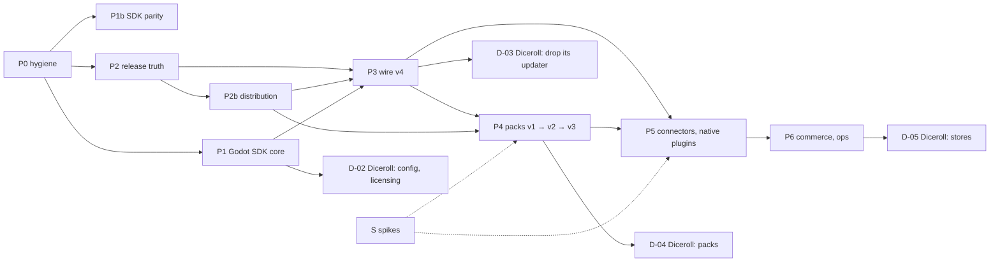

# Godot on Polaris Key: the execution program

This folder turns the research ([`../README.md`](../README.md), [`../CONTENT.md`](../CONTENT.md),
[`../PARITY.md`](../PARITY.md), [`../notes/`](../notes/)) into work that a **team of coding
agents**, directed by a lead and supervised by a human, can execute.

It is a plan, not a specification. [`AGENTS.md`](../../../../AGENTS.md) and the code stay
authoritative. When a brief and the code disagree, the code is the fact and the brief is updated
in the same pull request.

---

## 1. What is here

| Path                                               | What it is                                                                                       |
| -------------------------------------------------- | ------------------------------------------------------------------------------------------------ |
| [`workpackages.json`](workpackages.json)           | the dependency graph: 106 work packages with phase, role, estimate, gates, human inputs, status  |
| [`INDEX.md`](INDEX.md)                             | the generated table of every work package, by phase (never edit by hand)                         |
| [`wp/`](wp/)                                       | one self-contained brief per work package; [`wp/_TEMPLATE.md`](wp/_TEMPLATE.md) is the structure |
| [`plans/`](plans/)                                 | written plans for plan-mode work packages, awaiting or holding human approval                    |
| [`check.mjs`](check.mjs)                           | the graph tool: validate, list ready work, critical path, set status, regenerate the index       |
| `.claude/agents/pkey-*.md` (repo root)             | the role agents that execute briefs                                                              |
| `.claude/skills/running-the-omniplatform-program/` | the lead's playbook, loaded as a skill                                                           |

```sh
cd docs/research/2026-09-29-godot-omniplatform/program
node check.mjs              # validate the graph and the index (exit 1 on any problem)
node check.mjs --ready      # what can start now, most-blocking first
node check.mjs --ready --optional --deferred  # also optional work and packages waiting for the owner's go (CM-*)
node check.mjs --summary    # effort and status per phase
node check.mjs --critical   # the longest remaining dependency chain
node check.mjs --show P3-02 # one work package with its dependants
node check.mjs --set P0-08 done   # then run prettier on workpackages.json and INDEX.md
```

---

## 2. The team

| Role               | Agent                                   | Takes                                                      | Produces                                                               |
| ------------------ | --------------------------------------- | ---------------------------------------------------------- | ---------------------------------------------------------------------- |
| **Lead**           | the main session, with the skill loaded | the graph and the human's priorities                       | dispatches, status updates, integration, escalations                   |
| **Implementer**    | `pkey-implementer`                      | Worker, CLI, CI, console and tooling briefs                | one PR per work package, green gate passing                            |
| **SDK porter**     | `pkey-sdk-porter`                       | a feature × a set of SDKs, proven by corpus or transcripts | the same behaviour in Node, React/`client-core`, Python, Swift (+ new) |
| **Godot engineer** | `pkey-godot-engineer`                   | `sdks/godot` briefs and the Diceroll adoption briefs       | GDScript that passes the corpus on the editor and a release template   |
| **Wire planner**   | `pkey-wire-planner`                     | every plan-mode brief (⚑ in the index)                     | `plans/<ID>.md`, then waits for human approval                         |
| **Spike runner**   | `pkey-spike-runner`                     | spike briefs (`S-*`)                                       | a measured note in `../notes/S-*.md` and a recommendation              |
| **Reviewer**       | `pkey-wp-reviewer`                      | a finished PR and its brief                                | a verdict against the acceptance criteria and the hard rules           |
| **Human**          | the repository owner                    | plans, accounts, keys, devices, deploys, merges            | approvals and the inputs in §6                                         |

The lead runs in the main session because only the main session can start subagents. Load the
skill `running-the-omniplatform-program`, or follow §3 directly.

---

## 3. The loop

1. **Sync and validate.** Pull the default branch. Run `node check.mjs`. Fix any graph problem
   before dispatching anything.
2. **Choose.** Run `node check.mjs --ready`. The list is sorted by how much work waits behind each
   package. Take from the top, subject to:
   - **concurrency limits** in §5 (one corpus-touching package at a time, and so on);
   - **human inputs** (§6): do not start a ✋ package whose inputs are missing; ask for them
     and move on;
   - **repo**: `D-*` packages run in `vladzaharia/diceroll`, not here.
3. **Plan-mode packages (⚑) go to the wire planner first.**
   - `pkey-wire-planner` writes `plans/<ID>.md`, sets the status to `awaiting-approval` and stops.
   - Nothing is implemented until a human approves the plan; merging the plan PR is approval.
   - The package's own `role` then executes exactly the approved plan.
   - Two packages are planning-only, and their role is the planner itself:
     - P3-01, whose plan also governs P3-02 (`planRef`);
     - P4-01, whose plan sets the decisions that P4-02 to P4-04 build on.
   - The index lists every plan file and who implements it.
4. **Dispatch.** For each chosen package:
   - branch `wp/<ID>-<slug>` from the default branch;
   - `node check.mjs --set <ID> in-progress` (commit it on the branch);
   - start the brief's role agent with: the brief path, the branch, and any human inputs received.
5. **Build.** The role agent follows the brief, keeps to its scope, and runs the green gate from
   `AGENTS.md` (`mise exec node@22 -- pnpm …`). It updates the brief if the code contradicts it,
   and updates `parity.json` manifests once P1b-01 exists.
6. **Review.** Start `pkey-wp-reviewer` on the finished branch. Its blocking findings go back to
   the role agent. Repeat until the reviewer passes it.
7. **Land.** Open the PR with the brief's acceptance checklist in the body.
   - Role agents stop at `in-review`.
   - When the reviewer passes the PR, the lead adds the final commit: the brief's hand-off line
     `--set <ID> done`, then prettier.
   - A human merges. The status then turns `done` exactly when the work lands.
8. **Integrate.** After merges, re-run `--ready`. If a merged package changed an interface that a
   later brief names, update that brief in a small follow-up PR.
9. **Escalate** to the human, and stop that package, when: a hard rule would have to bend; the
   brief is wrong in a way that changes scope or estimate by more than half; a dependency turns out
   to be missing; or a human input is needed.

Statuses: `todo` → (`planning` → `awaiting-approval` →) `in-progress` → `in-review` → `done`.
`blocked` needs a reason in the PR or issue that blocks it. `dropped` is for optional work the
human declines.

---

## 4. Phases, milestones and the critical path



| Milestone                                                                   | Reached by | Diceroll step |
| --------------------------------------------------------------------------- | ---------- | ------------- |
| Diceroll can adopt managed config, licensing and identity                   | P1-12      | D-02          |
| Every Diceroll artifact indexed and published without long-lived secrets    | P2-07      | —             |
| Diceroll's AltStore source, F-Droid repo and download page from Polaris Key | P2b-06     | —             |
| Diceroll deletes its own updater and feed scripts                           | P3-10      | D-03          |
| Diceroll's content-streaming phases run on Polaris Key                      | P4-08      | D-04          |
| Content ships between app releases                                          | P4-15      | D-04          |
| Background Assets on iOS; in-app updates on Play                            | P5-08      | D-05          |
| Paid packs on stores                                                        | P6-01      | D-05          |

**Effort.** The 102 required work packages sum to about 105–146 engineer-weeks, including spikes
and the Diceroll steps. P0–P6 alone come to about 93–129. That is above the report's 70–90 for two
reasons:

- each package carries its own review, docs and gate work;
- the briefs' authors re-sized several packages after reading the code.

**The critical path** is about 17–24 weeks:

`P0-02 → P2-03 → P2-04 → P2-02 → P2-06 → P2b-03 → P3-03 → P4-02 → P4-12 → P4-13 → P4-14 → P5-08 → D-05`

**The Diceroll milestones**, counted from the start with unlimited parallelism:

| Step | Weeks from start | What it enables                 |
| ---- | ---------------- | ------------------------------- |
| D-02 | about 8–10       | adopt config and licensing      |
| D-03 | about 14–20      | drop Diceroll's own updater     |
| D-04 | about 15–20      | Diceroll's packs on Polaris Key |

So calendar time is governed by parallelism and by human turnaround on plans, accounts and
merges, not by total effort. `node check.mjs --critical` recomputes it as work lands.

---

## 5. Parallelism and conflict hotspots

Several packages can run at once only if they do not fight over the same generated files:

| Hotspot                                                         | Rule                                                                                            |
| --------------------------------------------------------------- | ----------------------------------------------------------------------------------------------- |
| `tools/sign-corpus.ts`, `conformance/corpus/**` and its mirrors | **one corpus-touching package in flight at a time** (every ⚑ package, and those gated `corpus`) |
| `PROTOCOL_VERSION`, `shared-protocol`, `shared-jws`             | only inside an approved plan (P0-04, P3-02, P3-12, P4-13, P4-19)                                |
| D1 migrations                                                   | number migrations when rebasing onto the default branch, never in advance                       |
| OpenAPI spec and `routeCoverage` (rule 10)                      | rebase before review; the gate catches misses                                                   |
| the service table (after P0-09)                                 | one new slug per PR                                                                             |
| `workpackages.json` status lines, `INDEX.md`                    | change only your own package's status; regenerate the index; conflicts are trivial to redo      |

Suggested concurrency for a team: one corpus lane, two or three Worker lanes, one SDK lane, one
Godot lane, one native lane, and spikes whenever their human inputs exist.

**A good first wave.** These have no dependencies and no corpus conflicts:

- P0-01, P0-02, P0-05, P0-06, P0-07, P0-08, P0-10, P0-11, P0-12, P0-13;
- P1b-01;
- P2-01, once its R2 buckets exist;
- the spikes S-02 to S-07, as their inputs allow;
- Diceroll's D-01.

In parallel, the wire planner drafts the plans for P0-04, P1-01 and P1-09. `node check.mjs --ready`
always has the current list.

---

## 6. Human inputs

Agents must not invent or fetch these. Ask early, because several gate the critical path. The full
register, per work package, is generated into [`INDEX.md`](INDEX.md#human-inputs); the
execution-order checklist of deploys, real-service checks and PR-body items is
[`HANDOFF.md`](HANDOFF.md). In summary:

| Kind                   | What                                                                                                                                                                                                                                                                                                                                                                                                               |
| ---------------------- | ------------------------------------------------------------------------------------------------------------------------------------------------------------------------------------------------------------------------------------------------------------------------------------------------------------------------------------------------------------------------------------------------------------------ |
| Approvals              | every plan in `plans/` (listed in [`INDEX.md`](INDEX.md#plans)); merges; go/no-go on optional work (P6-04, X-01, X-02); the Godot addon's licence (P1-12)                                                                                                                                                                                                                                                          |
| Deploys                | P0-08 in production before any new service slug (P0-09, P2b-01); P0-13; P1-06 before P1-07's end-to-end check and D-02                                                                                                                                                                                                                                                                                             |
| Cloudflare             | R2 buckets per environment and the bytes host `dl.plrs.im` (created; same-site with the console, owner decision); the registry host `pkg.plrs.im` with `pkg-staging.plrs.im` and `pkg-dev.plrs.im` (F-02; same Worker, custom domains in `wrangler.toml` per environment, owner decision 2026-10-04); a separate registrable domain only for P6-04; an R2 parent API token; later Queues, Workflows and Containers |
| GitHub                 | subscribe the GitHub App to Release events; a Marketplace listing for `polaris-key/publish`; a `release` Environment for Diceroll's Ed25519 release key                                                                                                                                                                                                                                                            |
| Apple                  | developer account, App Store Connect API key, App Store Server API key, App Attest, TestFlight, a Mac with Xcode 26+, iOS devices                                                                                                                                                                                                                                                                                  |
| Google                 | Play service account, Console test track, a Cloud project linked in Play Console, Android devices, developer verification for `gg.vlad.diceroll`                                                                                                                                                                                                                                                                   |
| Microsoft, Steam       | a Partner Center app registration; a Steamworks partner account and Web API key                                                                                                                                                                                                                                                                                                                                    |
| Signing and publishing | code-signing certificates for Windows and macOS; the Android release keystore; the F-Droid repo key; NuGet and crates.io accounts for optional SDKs (Kotlin ships only on Polaris Key's own Maven feed: no Maven Central account)                                                                                                                                                                                  |
| Access                 | read access to Diceroll's release history (S-03); devices and store accounts for the outlet-signal spike (S-06)                                                                                                                                                                                                                                                                                                    |

While waiting, a package can usually proceed against fixtures, recorded payloads or fakes; its
brief says which.

---

## 7. Rules every agent follows

- `AGENTS.md` is canonical: the Node 22 constraint, the green gate and the eleven hard rules.
  `CLAUDE.md` adds plan mode for wire-touching changes.
- Commands run under `mise exec node@22 -- …`. Cloud containers often have Node 22 as the
  default and no `mise`. There, check `node --version` and run the same commands without the
  prefix. The Python SDK expects `sdks/python/.venv`, and the Swift SDK needs a macOS runner; a
  gate that cannot run in the environment is reported, never skipped silently.
- **One work package per branch and PR.** Stay inside the brief's scope; put anything else in
  the PR description as a proposed follow-up.
- **Wave order for anything on the wire:** contract → catalog → corpus → every SDK. A feature is
  done only when every SDK passes, or declares an allowed typed N/A once the parity registry
  exists (P1b-01).
- **Never hand-edit generated files** (the corpus, mirrors, generated docs pages, `INDEX.md`).
  Never weaken a runner or a test to get green.
- **A new SDK makes its feed required.** When an SDK ships for a new ecosystem, that ecosystem's
  package feed on `pkg.plrs.im` becomes a required work package in phase F, sequenced before the
  SDK's first release (owner decision 2026-10-04; notes/S-12 §10). Today that covers npm, PyPI,
  Swift, Maven and Godot, plus OCI; NuGet (F-32) becomes required if X-01 goes ahead.
- **Records, decides, serves, controls.** Polaris Key never builds or uploads on behalf of CI or
  vendor CLIs.
- Report contradictions between a brief and the code in the PR, and fix the brief in the same PR.

---

## 8. Changing the plan

Edit `workpackages.json` and the affected briefs in one PR. Then run, in this order:

1. `node check.mjs --sync-briefs`, which rewrites each brief's Size, Depends on, Unblocks and Role
   rows from the graph;
2. `node check.mjs --write-index`;
3. prettier on `program/`;
4. `node check.mjs`.

New packages take the next free id in their phase and a brief copied from `wp/_TEMPLATE.md`. Keep ids stable: never renumber a package that has started.
Packages split from one row of a spike's breakdown keep that row's number plus a lower-case letter
(phase A: A-17a…g from notes/S-14 §10, A-18a…m from notes/S-15 §11; I-10a and I-10b from notes/S-16 §8;
U-11a…c, U-15a…c and U-24a…b from notes/S-17 §6); `check.mjs` accepts the suffix.

Phase I (Identity) follows notes/S-16 §8 after its restructure around one Polaris Key account
(owner decision 2026-10-04). I-01…I-03 keep their meaning; I-04 is the layer 1 account contract
plan; I-05…I-25 were re-cut from the note's table, so their ids now mean different work than the
first revision's (none had started). The SDK row is split by toolchain into I-10a and I-10b; the
old I-10 brief is kept with status `dropped` because its id is not reused. I-08, I-09, I-10a and
I-10b execute I-04's plan (`planRef`); I-21 and I-22 execute I-20's (layer 2); I-13, I-15, I-24 and
I-25 get their own plans. I-24 and I-25 are optional (S-16 "later"). I-24's plan was approved on 2026-10-05 and splits the work
(its Q8): I-24 is now the planning package, and **I-24a** (contract, corpus, client-core, Worker,
console, portal) and **I-24b** (six SDKs and four UI kits) execute it (`planRef`). I-24a depends
on I-08 and I-09.

Phase U (Cloud Sync) follows notes/S-17 §6. Ids follow the note; its U-11, U-15 and U-24 rows, each
split into halves by phase in the note, become U-11a…c, U-15a…c and U-24a…b so the graph can
express their phase dependencies. U-26 is retired in the note and has no package. The ⚑ packages
execute U-01's plan, except the optional U-14, U-16 and U-17, which get their own.

Phase PX (customer portal) follows `docs/design/PORTAL.md` §11, approved by the owner on
2026-10-04. Ids keep the spec's own form, which `check.mjs` accepts as a special case: PX-01…PX-22
for the front end (§11.1 phase A, §11.3 phase B) and PX-W1…PX-W17 for the Worker additions (§11.2);
each package's stage names the spec phase. Later packages take the next free id in the same form:
PX-23 and PX-W18 (S-24), and **PX-24** (filed 2026-10-06), the Library's 24-hour "Added just now"
ring and text (EXPERIENCE §0.7 frame 7), which MO-07 left out as a feature rather than motion.
**PX-W19** and **PX-25** (filed 2026-10-07) are PX-13's account gaps: the Worker half (Make primary,
passkey Rename, the products each email brought in) and the controls on PX-13's page. The front
end's `PX-<nn>` takes no letter suffix, so a follow-up to a front-end package takes the next free
number.
Sizes map S → 0.1–0.2, M → 0.4–0.8 and L → 1–1.6
engineer-weeks. PX-W8, PX-W9, PX-W13 and PX-W17 were planned under I-04 (PORTAL.md's "one contract plan"), but
each gained its own plan refining I-04, approved on 2026-10-05, so they no longer carry `planRef`;
PX-W3 has its own plan too. PX-20 is the rolling quality bar: it starts after PX-01 and is
marked done last. PORTAL.md §10.3 and §11 cite the first revision of phase I; the graph maps them
onto the re-cut ids:

| PORTAL.md cites                                        | Graph dependency                    |
| ------------------------------------------------------ | ----------------------------------- |
| I-02 (single-use store), I-04 (contract plan)          | I-02, I-04 (unchanged)              |
| I-06 (product users, links, pairwise subjects)         | I-05                                |
| I-05 (Google), I-20 (Apple), I-12 (web Steam, persona) | I-06                                |
| I-08 (email login), I-15 (sessions)                    | I-07                                |
| I-14 (passkeys)                                        | I-16                                |
| I-13 (native redirect)                                 | I-15                                |
| I-16 (per-product issuer, web-app header)              | I-08 for layer 1 (I-21 later)       |
| S-17 (Cloud Sync service)                              | U-05                                |
| F-21; G14 (Q-1)                                        | F-21; G14 is a human input on PX-11 |

Several re-cut packages describe the same surface as PX packages: I-11 (Library, Discover, Activate
and account settings), I-07 (email gate and profile import), I-08 (passthrough and QR sign-in),
I-09 (key-entry limits) and U-12 (the portal Cloud Sync section). Each PX brief names its overlap.
PORTAL.md is the approved spec; whichever package lands first owns the shared code, and the lead
narrows the other's scope.

Phase SP (SDK parity pass) follows `notes/SDK-PARITY-PASS.md`, whose owner questions were answered
on 2026-10-05. Its ids use the two-letter prefix SP, which `check.mjs` accepts. Only the plan-mode
items are in the graph so far: **SP-00** (the registry and corpus plan, note §5.0); **SP-08**,
**SP-09** and **SP-10** (the wire items W8, W9 and W10 of note §6, numbered after them); and
**SP-11** (the product presentation accent colour, since dropped in favour of HA-04 and HA-11 to
HA-14). The other wire
items map onto existing packages (W1 I-09 and PX-W9, W2 PX-W8, W3 LX-17 to LX-19, W4 I-08, I-10a,
I-10b, I-13, I-15 and PX-W13, W5 I-13, I-14, I-21 and I-22, W6 phase U, W7 LX-11, LX-20, LX-23 and
LX-25, W11 I-24a, I-24b and LX-24, W12 LX-13, I-25 and U-16). The note's non-wire task list (SP-01
to SP-03 and the per-SDK SP-N, SP-R, SP-P, SP-S, SP-K and SP-G tasks) becomes packages when the lead
schedules its waves (note §7). SP-K12 (Kotlin JVM desktop) is already in the graph as UK-40.
**SP-12 to SP-30** (stage "SDK gaps", filed 2026-10-05) own every parity row still `planned` after
`fix/sdk-parity-followups`, grouped by SDK and capability: React SP-12 to SP-16, Swift SP-17 to
SP-19, Kotlin SP-20 and SP-21, Python SP-22, Godot SP-23 to SP-27, and the desktop pack transports
SP-28 (Steam for Node, Python, Swift and Kotlin), SP-29 (MSIX and Flatpak for Node and Python, with
the build generators) and SP-30 (MSIX and Flatpak for Godot). They take the next free `SP-NN` ids,
as `plans/SP-00.md` D8 sets (the manifest `wp` pattern refuses the note's `SP-N05` form); each
brief names the note tasks it absorbs. SP-16 takes React's `commerce.receipt` row from LX-20. **SP-31** (filed 2026-10-06) is the host half of
bridge v4, which no package owned: the v3 Node Electron host (the note's SP-N10) landed without a
graph node, and SP-31 moves it to v4 after SP-12.
`identity.oidc` rows point at I-15 and Swift `ui.kit` at UK-07.

Phase UK (UI kits) follows [`docs/design/UI-KITS.md`](../../../design/UI-KITS.md) §10, approved with
the owner decisions of 2026-10-05. One package per kit, ordered must → should → could (could items
are optional). UK-01 (tokens) and UK-02 (the plan for the copy catalog, UI fixtures and `ui.*`
parity rows, executed by UK-02a and UK-02b) come first, then UK-15 (QA harness and modernity lint)
and UK-16 (docs scaffold), then UK-03 (ui-core) and the kits. Kits read the product presentation
only through HA-13/HA-14 via a seam, so they do not wait for them; UK-41 verifies it at the end of
the must tier. UK-30 (Tk) is dropped.

Phase MO (motion) follows [`notes/S-23-motion-system.md`](../notes/S-23-motion-system.md) §10, with
the owner decisions delegated to the lead on 2026-10-05 (D1–D10 in the note). It adds motion to
the existing portal and console through one system shared with the kits and the sign-in card.
MO-01 (brand tokens) comes first, then MO-02 (the layer in `packages/admin`) and MO-03 (e2e
determinism and the motion smoke suite), then the area packages in parallel. Several area packages
share files with in-flight branches that are not graph nodes (`wp/UX-10`, `wp/UX-29`, the
`Overview.tsx` branches, `feat/license-delete`); each brief's "Files it touches" names the branch
to wait for or rebase on. MO-06 and MO-07 depend on SP-08 and PX-16 for the same reason. MO-13
is the closeout and is marked done last.

---

## 9. Known gaps without a work package

The brief authors found work that the research implies but that no package owns yet. The lead turns
these into packages when their phase approaches, using the next free id in the phase (§8).

**SDK parity**

- React `core.local` (→ SP-15).
- `identity.oidc` in Node, Python and Swift, and a registry decision on native Godot, which has no
  native completion path.
- Swift `ui.kit` (→ UK-07), React `<PolarisBoot>` and SwiftUI `PolarisBootView` (P1-09 follow-up).
- Terminal boot renderers (Node `runBoot()`, Python `rich_boot()`) over the stage machine. They need
  the transport status on `DocOutcome.error` and `RegisterResult.error` in Node, Python and Swift
  first (P1-09 plan §8).
- An adopter-facing docs page on the boot protocol (the stage machine and "What a host sends";
  P1-09 plan §8).
- `update.driver` in Node, Python and React (React → SP-15).
- Browser telemetry: `/devices/report` accepts only a bearer token today.
- React `config.mint`.
- `Retry-After` back-off in every SDK; the Worker's 429s do not send the header yet.
- A fingerprint on the device-code path, so strict tiers work.
- A desktop keyring store for Godot (→ SP-27).
- Godot runs on web (headless Chromium) and on real devices. The runner legs on web, Android and
  iOS have no owner (P1-01 and P1-09 hand-offs).
- Porting the prototype `lowend/sync.sh` to `sdks/godot` (P1-01 follow-up; it still copies the
  pre-move verifier).
- `commerce.receipt` and device attestation in Node, Python, Swift and React.

**Release, distribution and CLI**

- A console card for trusted publishing and static `pkeyci_` tokens.
- The console "Outlets and credentials" view (report §6.2 item 3).
- `release_sources` with several repositories per product.
- Mirroring GitHub assets into R2.
- The winget REST source.
- Per-user secret AltStore sources, and entitled-only download-page links.
- Sigstore attestation checks.
- The portal issues in report §9.1 #22.
- A generic `pkey build-info` CLI; P1-11 only stamps Godot exports.
- `pkey init --template godot` and `pkey sdk godot`.
- Shipping `gen-mirrors` to adopters.

**Stores and transports**

- Android developer verification through the Developer Console API (it needs an OAuth user flow).
- Microsoft Store add-ons and rollout controls.
- ASC review-submission creation.
- A macOS binding of the Apple plugin package, for Mac App Store builds.
- The `msix-optional` and `flatpak-ext` transports (→ SP-29, SP-30).
- A Tauri updater feed renderer.

**Packs**

- Repacking chunk bundles that fall below about 50% live data.
- Per-type verify vectors in the corpus.
- Named contracts (CONTENT §6.2).
- Pinning a device or cohort to a pack set.
- Chunk indexes for large files inside tree payloads.
- `archive.*` delivered as an archive, and `godot.zip` beyond P4-16's tolerance.
- The Godot export plugin's embedded-or-lean pack choice per preset.
- The `PKeyDeviceList` widget.

**Contradictions resolved in briefs rather than here.** Several briefs record places where the
report and the code disagree, and say which way they went. Examples: the gate-matrix row that still
pins the removed dev-build bypass (P1b-05 and P0-04), and wire v3's ban on persisted counters versus
a feed `seq` floor (P3-01). The reviewer checks each brief's own notes.
