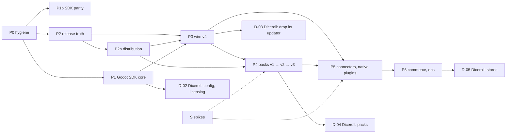

# Godot on Polaris Key: the execution program

This folder turns the research ([`../README.md`](../README.md), [`../CONTENT.md`](../CONTENT.md),
[`../PARITY.md`](../PARITY.md), [`../notes/`](../notes/)) into work that a **team of coding
agents**, directed by a lead and supervised by a human, can execute.

It is a plan, not a specification. [`AGENTS.md`](../../../../AGENTS.md) and the code stay
authoritative. When a brief and the code disagree, the code is the fact and the brief is updated
in the same pull request.

---

## 1. What is here

| Path                                               | What it is                                                                                       |
| -------------------------------------------------- | ------------------------------------------------------------------------------------------------ |
| [`workpackages.json`](workpackages.json)           | the dependency graph: 104 work packages with phase, role, estimate, gates, human inputs, status  |
| [`INDEX.md`](INDEX.md)                             | the generated table of every work package, by phase (never edit by hand)                         |
| [`wp/`](wp/)                                       | one self-contained brief per work package; [`wp/_TEMPLATE.md`](wp/_TEMPLATE.md) is the structure |
| [`plans/`](plans/)                                 | written plans for plan-mode work packages, awaiting or holding human approval                    |
| [`check.mjs`](check.mjs)                           | the graph tool: validate, list ready work, critical path, set status, regenerate the index       |
| `.claude/agents/pkey-*.md` (repo root)             | the role agents that execute briefs                                                              |
| `.claude/skills/running-the-omniplatform-program/` | the lead's playbook, loaded as a skill                                                           |

```sh
cd docs/research/2026-09-29-godot-omniplatform/program
node check.mjs              # validate the graph and the index (exit 1 on any problem)
node check.mjs --ready      # what can start now, most-blocking first
node check.mjs --summary    # effort and status per phase
node check.mjs --critical   # the longest remaining dependency chain
node check.mjs --show P3-02 # one work package with its dependants
node check.mjs --set P0-08 done   # then run prettier on workpackages.json and INDEX.md
```

---

## 2. The team

| Role               | Agent                                   | Takes                                                      | Produces                                                               |
| ------------------ | --------------------------------------- | ---------------------------------------------------------- | ---------------------------------------------------------------------- |
| **Lead**           | the main session, with the skill loaded | the graph and the human's priorities                       | dispatches, status updates, integration, escalations                   |
| **Implementer**    | `pkey-implementer`                      | Worker, CLI, CI, console and tooling briefs                | one PR per work package, green gate passing                            |
| **SDK porter**     | `pkey-sdk-porter`                       | a feature × a set of SDKs, proven by corpus or transcripts | the same behaviour in Node, React/`client-core`, Python, Swift (+ new) |
| **Godot engineer** | `pkey-godot-engineer`                   | `sdks/godot` briefs and the Diceroll adoption briefs       | GDScript that passes the corpus on the editor and a release template   |
| **Wire planner**   | `pkey-wire-planner`                     | every plan-mode brief (⚑ in the index)                     | `plans/<ID>.md`, then waits for human approval                         |
| **Spike runner**   | `pkey-spike-runner`                     | spike briefs (`S-*`)                                       | a measured note in `../notes/S-*.md` and a recommendation              |
| **Reviewer**       | `pkey-wp-reviewer`                      | a finished PR and its brief                                | a verdict against the acceptance criteria and the hard rules           |
| **Human**          | the repository owner                    | plans, accounts, keys, devices, deploys, merges            | approvals and the inputs in §6                                         |

The lead runs in the main session because only the main session can start subagents. Load the
skill `running-the-omniplatform-program`, or follow §3 directly.

---

## 3. The loop

1. **Sync and validate.** Pull the default branch. Run `node check.mjs`. Fix any graph problem
   before dispatching anything.
2. **Choose.** Run `node check.mjs --ready`. The list is sorted by how much work waits behind each
   package. Take from the top, subject to:
   - **concurrency limits** in §5 (one corpus-touching package at a time, and so on);
   - **human inputs** (§6): do not start a ✋ package whose inputs are missing; ask for them
     and move on;
   - **repo**: `D-*` packages run in `vladzaharia/diceroll`, not here.
3. **Plan-mode packages (⚑) go to the wire planner first.** It writes `plans/<ID>.md`, sets the
   status to `awaiting-approval` and stops. Nothing is implemented until a human approves the plan
   (merging the plan PR is approval). The implementer then executes exactly the approved plan.
4. **Dispatch.** For each chosen package:
   - branch `wp/<ID>-<slug>` from the default branch;
   - `node check.mjs --set <ID> in-progress` (commit it on the branch);
   - start the brief's role agent with: the brief path, the branch, and any human inputs received.
5. **Build.** The role agent follows the brief, keeps to its scope, and runs the green gate from
   `AGENTS.md` (`mise exec node@22 -- pnpm …`). It updates the brief if the code contradicts it,
   and updates `parity.json` manifests once P1b-01 exists.
6. **Review.** Start `pkey-wp-reviewer` on the finished branch. Its blocking findings go back to
   the role agent. Repeat until the reviewer passes it.
7. **Land.** Open the PR with the brief's acceptance checklist in the body. Set the status to
   `in-review`, and to `done` in the same PR (`--set <ID> done`, then prettier). A human merges.
8. **Integrate.** After merges, re-run `--ready`. If a merged package changed an interface that a
   later brief names, update that brief in a small follow-up PR.
9. **Escalate** to the human, and stop that package, when: a hard rule would have to bend; the
   brief is wrong in a way that changes scope or estimate by more than half; a dependency turns out
   to be missing; or a human input is needed.

Statuses: `todo` → (`planning` → `awaiting-approval` →) `in-progress` → `in-review` → `done`.
`blocked` needs a reason in the PR or issue that blocks it. `dropped` is for optional work the
human declines.

---

## 4. Phases, milestones and the critical path



| Milestone                                                                   | Reached by | Diceroll step |
| --------------------------------------------------------------------------- | ---------- | ------------- |
| Diceroll can adopt managed config, licensing and identity                   | P1-12      | D-02          |
| Every Diceroll artifact indexed and published without long-lived secrets    | P2-07      | —             |
| Diceroll's AltStore source, F-Droid repo and download page from Polaris Key | P2b-06     | —             |
| Diceroll deletes its own updater and feed scripts                           | P3-10      | D-03          |
| Diceroll's content-streaming phases run on Polaris Key                      | P4-08      | D-04          |
| Content ships between app releases                                          | P4-15      | D-04          |
| Background Assets on iOS; in-app updates on Play                            | P5-08      | D-05          |
| Paid packs on stores                                                        | P6-01      | D-05          |

**Effort.** The 100 required work packages sum to about 95–133 engineer-weeks, including spikes
and the Diceroll steps. P0–P6 alone are about 84–117, which is above the report's 70–90 because
each package now carries its own review, docs and gate work. **The critical path** is about 14–20
weeks:

`P0-02 → P2-03 → P2b-01 → P3-01 → P3-02 → P3-03 → P3-09 → P3-10 → P5-05 → P5-08 → D-05`

So calendar time is governed by parallelism and by human turnaround on plans, accounts and
merges, not by total effort. `node check.mjs --critical` recomputes it as work lands.

---

## 5. Parallelism and conflict hotspots

Several packages can run at once only if they do not fight over the same generated files:

| Hotspot                                                         | Rule                                                                                            |
| --------------------------------------------------------------- | ----------------------------------------------------------------------------------------------- |
| `tools/sign-corpus.ts`, `conformance/corpus/**` and its mirrors | **one corpus-touching package in flight at a time** (every ⚑ package, and those gated `corpus`) |
| `PROTOCOL_VERSION`, `shared-protocol`, `shared-jws`             | only inside an approved plan (P0-04, P3-02, P4-13, P4-19)                                       |
| D1 migrations                                                   | number migrations when rebasing onto the default branch, never in advance                       |
| OpenAPI spec and `routeCoverage` (rule 10)                      | rebase before review; the gate catches misses                                                   |
| the service table (after P0-09)                                 | one new slug per PR                                                                             |
| `workpackages.json` status lines, `INDEX.md`                    | change only your own package's status; regenerate the index; conflicts are trivial to redo      |

Suggested concurrency for a team: one corpus lane, two or three Worker lanes, one SDK lane, one
Godot lane, one native lane, and spikes whenever their human inputs exist.

**A good first wave** (no dependencies, no corpus conflicts): P0-08, P0-01, P0-02, P0-05, P0-06,
P0-07, P0-10, P0-11, P0-12, P1-06, P1b-01, P1b-05, the spikes S-02, S-05, S-06, S-07, and
Diceroll's D-01. In parallel, the wire planner drafts P0-04 and P1-01, which are plan-mode.

---

## 6. Human inputs

Agents must not invent or fetch these. Ask early, because they gate the critical path.

| Input                                                                                             | Needed by                                                                        |
| ------------------------------------------------------------------------------------------------- | -------------------------------------------------------------------------------- |
| Approval of every plan in `plans/` (plan mode)                                                    | P0-04, P1-01, P1-09, P1b-04, P1b-09, P3-01/02, P4-01, P4-04, P4-10, P4-13, P4-19 |
| Production deploy of P0-08 before any new service slug ships                                      | P0-09, P2b-01                                                                    |
| Cloudflare: R2 buckets per environment; a separate registrable domain for bytes                   | P2-01, S-02                                                                      |
| Apple developer account, App Store Connect API key and webhook secret, TestFlight, iOS 26 devices | S-01, P5-02, P5-05, P5-08                                                        |
| Google Play: service account, Console test track, Android devices                                 | P5-03, P5-06, P5-08                                                              |
| Android developer verification registration for `gg.vlad.diceroll`                                | D-01                                                                             |
| Microsoft Partner Center app registration                                                         | P5-04                                                                            |
| Steamworks partner account; Steam Web API key                                                     | P5-08, P6-01                                                                     |
| Code-signing certificates (Windows, macOS)                                                        | P5-07                                                                            |
| Store purchase notifications (App Store Server Notifications, Play RTDN)                          | P6-01                                                                            |
| Read access to Diceroll's release history                                                         | S-03                                                                             |
| Merges, and the go/no-go on optional work (P6-04, P6-05, X-01, X-02)                              | all                                                                              |

While waiting, a package can usually proceed against fixtures, recorded payloads or fakes; its
brief says which.

---

## 7. Rules every agent follows

- `AGENTS.md` is canonical: the Node 22 constraint, the green gate and the eleven hard rules.
  `CLAUDE.md` adds plan mode for wire-touching changes.
- Commands run under `mise exec node@22 -- …`. Cloud containers often have Node 22 as the
  default and no `mise`. There, check `node --version` and run the same commands without the
  prefix. The Python SDK expects `sdks/python/.venv`, and the Swift SDK needs a macOS runner; a
  gate that cannot run in the environment is reported, never skipped silently.
- **One work package per branch and PR.** Stay inside the brief's scope; put anything else in
  the PR description as a proposed follow-up.
- **Wave order for anything on the wire:** contract → catalog → corpus → every SDK. A feature is
  done only when every SDK passes, or declares an allowed typed N/A once the parity registry
  exists (P1b-01).
- **Never hand-edit generated files** (the corpus, mirrors, generated docs pages, `INDEX.md`).
  Never weaken a runner or a test to get green.
- **Records, decides, serves, controls.** Polaris Key never builds or uploads on behalf of CI or
  vendor CLIs.
- Report contradictions between a brief and the code in the PR, and fix the brief in the same PR.

---

## 8. Changing the plan

Edit `workpackages.json` and the affected briefs in one PR, run `node check.mjs --write-index`,
then prettier and `node check.mjs`. New packages take the next free id in their phase and a brief
copied from `wp/_TEMPLATE.md`. Keep ids stable: never renumber a package that has started.
