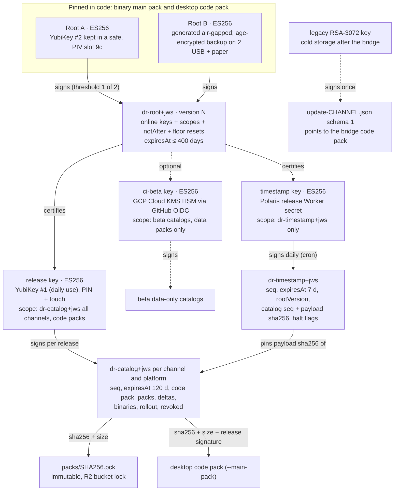

# 10 — Signing and trust architecture for releases, updates and content packs

Date: **2026-09-29**. Author: supply-chain security research agent. Status: **recommendation for Vlad's
decision. Nothing here is implemented.**

Inputs: `game/update/*.gd`, `tools/ci/update_manifest.py`, `.github/workflows/release.yml`,
`.github/actions/setup-diceroll/action.yml`, `docs/RELEASE.md`, `SECURITY.md`,
`docs/design/2026-09-29-content-streaming.md`; Polaris Key `docs/security/WIRE-CONTRACT-V3.md`,
`THREAT-MODEL.md`, `2026-08-26-security-audit.md`, `packages/shared-jws`, `packages/worker/src/core/{signing,trust}.ts`;
sibling notes `01-current-implementation.md`, `07-desktop-direct.md`, `12-ci-release.md`. Headless Godot
4.7.2 experiments (§5.1) and primary-source web research (Sources at the end). Facts marked
**[T]** were tested here, **[V]** were verified against a primary source today, and **[S]** come
from a sibling research note.

---

## 0. Decisions in one page

1. **Algorithm: ES256 (ECDSA P-256 + SHA-256) for everything the Godot client verifies.**
   Tested on Godot 4.7.2 **[T]**:
   - ECDSA P-256 verifies natively (DER signatures).
   - RSA PKCS#1 v1.5 verifies natively (today's scheme).
   - RSA-PSS **does not** verify.
   - Ed25519 keys **don't even load** (mbedTLS −0x3C80, "unknown PK algorithm").
   - A JWS ES256 signature (raw r‖s) verifies after a ~25-line GDScript raw→DER conversion.
   - Cost is ~1 ms per ES256 verify and ~0.2 ms per RSA-3072 verify, which is negligible.
   - Ed25519 stays an optional *second* signature (dual-sign), never the one the game depends on.
2. **Design: "TUF-lite", not full TUF.**
   - **Roots:** two **offline root keys** (P-256), pinned in code.
   - **Root document:** a root-signed `dr-root+jws` certifies **scoped, expiring online keys**.
   - **Catalogs:** one per channel × platform (`dr-catalog+jws`) with a monotonic `seq`,
     `expiresAt`, and per-pack `sha256` + `size`.
   - **Timestamp:** a tiny daily `dr-timestamp+jws` gives freshness and emergency *halt*.
   - **Client floors:** persisted anti-rollback floors, plus Polaris-style re-verify-on-load and a
     monotonic clock floor.
   - **Storage:** content-addressed, immutable pack objects on R2 behind bucket locks.
   - **Why not full TUF:** there is no GDScript TUF client. TUF signs *canonical JSON*, which is
     unsafe to re-serialize in Godot: all JSON numbers become floats and duplicate keys are silently
     collapsed **[T]**.
3. **Custody (recommended "Profile A"):**
   - **Release key:** on Vlad's everyday **YubiKey** (PIV, P-256, PIN + touch). CI builds and
     attests. A local `release-sign` tool verifies the attestations and signs the catalogs.
     **No content-signing secret lives in GitHub.**
   - **Polaris Key:** a separate "release" Worker does three things:
     1. acts as the **publish gateway**: GitHub OIDC for uploads, plus signature and policy checks
        for catalogs;
     2. is the **timestamp signer** (Cron Trigger);
     3. offers a **halt switch** that can only freeze updates, never publish content.
   - **Why Polaris doesn't hold the release key:** its keys are exportable and wire v3 is
     EdDSA-only and frozen.
   - **"Profile B" (automation):** the release key lives in GCP Cloud KMS (HSM, P-256) and is
     reached through OIDC from an environment-gated job. **Code packs still need a YubiKey
     co-signature.**
4. **Packs:**
   - Each pack's `sha256` + `size` must come from a trusted list: code compiled into the running
     build, or a signed catalog verified to the root.
   - That list is checked **before first mount, whatever the source** (CDN, Steam depot, App
     Store, Play, embedded).
   - Verified data packs are cached by (path, size, mtime, build).
   - The code pack is hashed on every boot.
   - Data-only is enforced **in CI** (extension, path and script checks) **and at mount** (PCK
     directory parse against an allow-list compiled into *code*, not taken from the catalog;
     `replace_files=false`).
5. **Migration:**
   - One **bridge release** is published through the legacy feed, signed by the old RSA key.
   - Its code pack carries the new client and the new root pins.
   - Keep the on-disk layout that the *old binary's* boot code manipulates.
   - Then freeze the legacy feed at the bridge and move the RSA key to cold storage.
6. **Do now, whatever the redesign:** see §2.3. Summary:
   - cap pack downloads with `body_size_limit`;
   - hash the current pack at boot;
   - serialize `publish`;
   - forbid `workflow_dispatch` releases from non-`main` refs;
   - move `UPDATE_SIGNING_KEY` into an approval-gated environment;
   - SHA-pin actions;
   - no toolchain caches in release jobs;
   - `https:`-only `shell_open`;
   - stop forwarding the bearer token across redirects.

---

## 1. Scope, assets, adversaries, assumptions

**Assets (ranked):**

| # | Asset | Why it matters |
|---|---|---|
| A1 | **Code-execution authority over self-updating installs**: the desktop code pack loaded with `--main-pack` | The manifest key *is* a code-signing key today. Sibling note 01 found **Steam and itch builds are stamped `github`**, so they self-update from GitHub too (`release.yml:103-112`) **[S]** |
| A2 | Data-pack integrity on every channel | Content injection, parser attack surface (image/audio/mesh decoders), App Store 2.5.2 / Play policy exposure if a data pack could carry script |
| A3 | Platform signing identities | Developer ID, Android app-signing and upload keys, Windows signing, ASC API keys, Play service account, Steam builder, itch butler |
| A4 | Timely delivery of fixes | Freeze/rollback attacks keep players on vulnerable content |
| A5 | Ability to recover | Rotation and revocation machinery (Polaris threat model's A9 lesson: without it, one loss is permanent) |

**Adversaries:** network on-path (DNS/TLS MITM); CDN/R2 or GitHub-Releases storage compromise;
GitHub account takeover; CI supply chain (compromised action, pip package, cache poisoning);
signing-key thief; Cloudflare/Polaris compromise; malicious fork or contributor; local malware
(mostly out of scope, but we must not turn a notarized app into a loader for unverified code).

**Assumptions:**
- One maintainer, public repo, GitHub-hosted runners.
- Players' clocks can be wrong.
- The game must **always** run offline with what is installed. Expiry may block *new* downloads,
  never play.

---

## 2. Threat model and evaluation of the current implementation

### 2.1 How today's system works (short)

- `update-<channel>.json` plus a detached base64 `.sig` live on the rolling GitHub release
  `channels`. The signature is RSA-3072 PKCS#1 v1.5 / SHA-256 over the exact bytes.
- The game verifies before parsing (`update_manifest.gd:23-48`). The key is pinned in
  `update_keys.gd`, and an empty key fails closed.
- The manifest names one full main pack (`pack{url,sha256,size}`), downloaded to
  `user://updates/staged` and checked for size and sha256 before rename (`update_store.gd:159`).
- At boot the embedded updater activates the staged pack and relaunches with `--main-pack`. Two
  failed boots roll back.
- `decide()` never installs a version ≤ the running one (`update_policy.gd:220`).
- The private key is the repository secret `UPDATE_SIGNING_KEY`, used in the `publish` job
  (`release.yml:281`). A maintainer copy is in `~/.config/diceroll/`.

### 2.2 Threat-by-threat

Verdict key: ✅ mitigated · 🟡 partial · ❌ not mitigated.

| Threat | Current behaviour (code) | Verdict | New-design control |
|---|---|---|---|
| **CDN / storage compromise** (GitHub `channels` release today, R2 tomorrow) | Can't forge a manifest or pack, since both are signed or hashed. **Can** replay old manifests (freeze), delete files (DoS), and stream an endless pack (below). The `channels` release is mutable (`--clobber`, `release.yml:341`) | 🟡 | Signatures + `seq` floors + timestamp expiry. Immutable, content-addressed objects under R2 bucket lock. Uploads only through the Polaris gateway, so no Cloudflare token sits in GitHub |
| **GitHub account takeover** | The attacker can edit the workflow, run it and get a signature. The signed pack is GDScript, so this is **RCE on every self-updating install**. No independent factor | ❌ | Profile A: the release key isn't in GitHub (YubiKey + touch). Profile B: KMS plus a mandatory YubiKey co-signature for code packs. Stores keep their own human gates (Steam default branch, Play draft, App Review) |
| **Actions / CI compromise** | Any build job can alter `dist/*.pck`, and `publish` signs whatever it gets. Actions are pinned by tag (`softprops/action-gh-release@v3`, `r0adkll/upload-google-play@v1`…). `pip install` is unpinned (`release.yml:57,68`). Godot and templates are restored from cache without re-verifying, and `SHA512-SUMS.txt` is fetched from the same release it verifies (`setup-diceroll/action.yml:60-90`) | ❌ | Attestations prove *which workflow at which tag* built each artifact. The signer verifies them before signing. SHA-pinned actions, hashed pip, no caches in release jobs, in-repo pinned SHA-512s |
| **Signing-key theft** | The RSA key is a *repository* secret, readable by any workflow on any ref (tag push or `workflow_dispatch`) **[S]**, plus a laptop copy. No `kid`, expiry, revocation or rotation. A stolen key is permanent RCE until every install gets a new binary | ❌ | Scoped online keys with `notAfter`, revocable by a root-signed key set (absence = revocation, Polaris §1). Offline roots. Hardware custody |
| **Rollback** (old signed metadata) | No persisted floor. `decide()` refuses versions ≤ running, which blocks *content* rollback. But a replayed *older* manifest whose version is still newer than the running one is accepted (e.g. pin a 0.2 install to 0.3.0 while 0.3.1 fixes 0.3.0). `skip_version` is local only | 🟡 | Per (channel, platform) `seq` floor. Content downgrades only when a *newer* catalog explicitly authorizes them (`revoked` list) |
| **Freeze** (stale manifest forever) | No expiry, no timestamp. The client says "up to date" indefinitely | ❌ | `dr-timestamp+jws` re-signed daily (expires 7 d). Catalog `expiresAt` 120 d. Root doc ≤ 400 d. Clock floor. Stale ⇒ no *new* installs plus a dev-menu diagnostic; play continues |
| **Mix-and-match** | One manifest, one pack, so N/A today. It becomes real with many packs, deltas and per-platform catalogs | ✅ today | A catalog *is* a snapshot of one (channel, platform) and pins every pack and delta. The timestamp pins the catalog's payload hash |
| **Endless data** | Manifest capped at 1 MiB (`update_fetcher.gd:50`). **Pack download unbounded**: `timeout = 0` (`:64`), size checked only after the file is complete (`update_store.gd:159`). A slow infinite stream fills the disk | 🟡 | `body_size_limit = signed size`. Tested: Godot 4.7.2 aborts with `RESULT_BODY_SIZE_LIMIT_EXCEEDED` with `download_file` set **[T]**. Also a free-space check, and size caps for root/timestamp/catalog |
| **Malicious pack / code injection** | The pack *is* code, so anything signed runs. Remote injection needs the key. **At boot only the size of `current/` is re-checked** (`update_store.gd:257`), and `meta.json` is unsigned. A same-size local swap runs unsigned GDScript inside a notarized app | 🟡 remote ✅ / local ❌ | Code pack: full sha256 plus re-verification of the stored *signed* catalog on every boot (the Polaris R2-03/R4-01 lesson). Data packs: data-only rules in CI and at mount (§10). `.tres`/`.tscn`/binary `.scn` can embed GDScript, so they are scanned in CI and restricted at mount |
| **Channel confusion** (beta → stable) | `channel` is inside the signed bytes and checked (`update_manifest.gd:122`) | ✅ | `aud = "diceroll:<channel>:<platform>"` checked, `typ` checked, per-channel floors |
| **Downgrade to a vulnerable binary** | `min_supported` shows a mandatory banner. The binary URL comes from the signed manifest and the browser downloads it. A freeze can suppress a `min_supported` bump. No revoked-versions list | 🟡 | Catalog `binary.minSupported` + `binary.revoked[]` + timestamp freshness. `shell_open` restricted to `https:` (today any scheme from the manifest reaches `OS.shell_open`, `updater.gd:302`) |
| **DNS / TLS MITM** | TLS is verified by `HTTPRequest` defaults, and the signature makes MITM freeze/DoS only. `DICEROLL_UPDATE_TOKEN` is sent as `Authorization` and **is forwarded across cross-host redirects** **[S]** (GitHub → CDN). Env var and project setting can redirect the feed; that's harmless with signatures | 🟡 | Same signature logic plus freshness. Strip `Authorization` on redirect (or only for the configured host). No certificate pinning (it would brick old binaries). Keep the CDN on a mainstream CA and test old binaries yearly |
| **Malicious forks** | Fork PRs get no secrets (`pull_request`, `CODEOWNERS *`). A fork can't sign for our key. A fork built with our pins would accept *our* updates (surprising, harmless to us) | ✅ | Build-time guard: `distribution=github` requires `GITHUB_REPOSITORY == vladzaharia/diceroll` or a fork-supplied root file. Document "forks: generate your own root" |
| **Local tampering** (malware as the same user) | See malicious pack. Plus `state.cfg` and `meta.json` are editable | 🟡 | Out of scope in general, but code-pack hashing at boot and signed-artifact re-verification close the "notarized app runs unsigned code" hole |
| **Parser differentials** | JSON is parsed after the signature check, and one signer, so not exploitable today. **But** Godot JSON turns every number into a float (2^53 + 1 → 2^53) and keeps the *last* duplicate key **[T]**. A policy-checking gateway in TS/Python may read a different value than the game | ✅ today, ⚠ once a gateway parses | Reject duplicate keys (Polaris R2-06 rule), require integers ≤ 2^53−1, cap sizes before decode. Share a conformance corpus between the gateway and GDScript |

### 2.3 Extra findings from the code and CI, fixable now (before any redesign)

1. **`body_size_limit` for pack downloads.** Set it to the manifest's `size` in `download_pack()`
   (`update_client.gd:77`), and add a `DirAccess.get_space_left()` pre-check.
2. **Hash `current/diceroll.pck` at every boot.** A full sha256 of ~85 MB costs a fraction of a
   second, and far less once the code pack is ~5 MB. Also store `update-<ch>.json` + `.sig` in the
   slot and re-verify the signature at boot instead of trusting `meta.json`.
3. **Serialize publishing.** `concurrency` is per ref (`release.yml:20-21`), so two tags publish in
   parallel and the slower one overwrites `channels` with the *older* manifest. Add a global
   `concurrency: {group: publish-channels, cancel-in-progress: false}` on `publish`.
4. **`workflow_dispatch` can publish a signed stable release from any branch** (`release.yml:10,51`).
   Require `github.ref == 'refs/heads/main'` for dispatch, or use environment deployment rules.
5. **Move `UPDATE_SIGNING_KEY` into an environment** `legacy-signing`: required reviewer = Vlad,
   deployment tags `v*`, admin bypass off. Only `publish` references it.
6. **SHA-pin every third-party action.** Dependabot keeps the pins fresh. The tj-actions incident
   class is exactly this. Pin `pip install` with `--require-hashes`.
7. **Release jobs: no toolchain cache.** Or re-verify after restore against **SHA-512 values
   committed in the repo**, not ones fetched from the same GitHub release.
8. **`https:`-only `open_download()`.** Drop `Authorization` on cross-host redirects, or only send
   the token when the host equals the configured feed host.
9. **Docs error.** `docs/RELEASE.md` says "Play App Signing needs the same upload key forever". The
   **upload** key is resettable. It's the **app-signing** key (and any key signing sideload APKs)
   that is forever (§8.3).
10. **Old clients hard-reject `schema != 1`** (`update_manifest.gd:116-117`) **[S]**. The new
    scheme must live at **new URLs**, never by bumping `schema` in `update-<ch>.json` (§11).

---

## 3. Design comparison

| | (a) Current: single RSA key | (b) Full TUF | (c) TUF-lite (recommended) |
|---|---|---|---|
| Keys / roles | 1 online key, no id | root / targets / snapshot / timestamp (+ delegations, mirrors), thresholds | 2 offline roots (pinned) → root doc → scoped online keys: `release`, `timestamp`, optional `ci-beta` |
| Offline root | no | yes | yes |
| Rotation / revocation | ship a new binary | root chain N→N+1 signed by both; per-role key rotation | root doc version bump (absence = revocation); root pins rotate through code-pack / store updates |
| Rollback | partial (semver) | version numbers on every role | `seq` per catalog, `version` on root, `seq` on timestamp, all persisted |
| Freeze | none | expiry on every role, timestamp short | timestamp 7 d, catalog 120 d, root ≤ 400 d, clock floor |
| Mix-and-match | n/a | snapshot role | catalog = snapshot per (channel, platform); timestamp pins catalog hash |
| Endless data | manifest only | spec-level length limits | size caps on all docs + `body_size_limit` = signed size |
| Key compromise resilience | none | high (thresholds, role separation) | good: roots offline, online keys scoped and expiring, code needs hardware |
| Client in GDScript | exists (~300 LOC) | **none exists** (see below) | ~1,000–1,400 LOC + tests (JWS, root/timestamp/catalog, floors, PCK dir parser) |
| Signing input | exact bytes | **canonical JSON** of `signed` | exact bytes (JWS payload) |
| Repo tooling | Python + openssl | python-tuf, TUF-on-CI, RSTUF | ~300 LOC Python (catalog build, sign tool, ceremony) + Polaris gateway |
| Ops for one maintainer | trivial (but unsafe) | heavy (4 roles, frequent re-signing, ceremonies) | light: yearly root ceremony, daily auto timestamp, one YubiKey touch per release |

**Is there a TUF client for GDScript?** No. Maintained implementations:
- python-tuf (the reference);
- go-tuf v2;
- `tough` and rust-tuf (Rust);
- tuf-js (TypeScript);
- php-tuf (audited, used by Drupal/Joomla);
- a .NET client.

Repository tooling includes **TUF-on-CI**, which runs on GitHub Actions and supports YubiKey signing
and automated online signing with GCP/Azure/AWS KMS, and **RSTUF**. The spec is at **1.0.36,
modified 2026-08-05** **[V]**.

Three ways to get TUF into Godot, all poor value for this project:

1. **Port a client to GDScript.**
   - The work: root-chain walking, four roles, delegations with terminating/threshold semantics,
     hash-prefixed consistent snapshots, OLPC **canonical JSON** re-serialization.
   - Estimate: 3–5 weeks plus maintenance.
   - The killer is canonicalization. TUF signatures cover the canonical form of the parsed
     `signed` object. Godot's parser loses integer precision (floats) and duplicate keys **[T]**,
     so a byte-exact re-serialization is a correctness and security minefield.
2. **Wrap `tough` / go-tuf in a GDExtension.**
   - Needs builds for 6+ targets, including iOS static linking.
   - Web export currently has `extensions_support=false` **[S]**.
   - Adds a native supply chain.
   - Estimate: 2–3 weeks plus per-platform CI.
3. **Sidecar process.** Impossible on iOS, Android and Web.

TUF-lite keeps the protections that matter here: offline root, role separation, rollback, freeze,
mix-and-match, endless data, revocation. It drops what a one-maintainer project doesn't use:
delegations, multi-party thresholds on content, root chaining (root pins rotate with code, which
we update anyway), and mirrors. It also keeps the property the current design already gets right,
**sign exact bytes**.

---

## 4. The TUF-lite design ("Diceroll Trust v2")

### 4.1 Key hierarchy



Scopes are enforced by the client, not just by convention:
- A `timestamp` key signature on a catalog is ignored.
- A `ci-beta` signature on a stable catalog is ignored.
- A catalog containing a `code` entry is accepted only if signed by a key whose scope has
  `code: true`.

### 4.2 Wire profile: the Polaris JWS rules, re-targeted to ES256

Diceroll adopts Polaris Key's hardened JWS mechanics (WIRE-CONTRACT-V3 §1), but as its **own profile
"DRJ1"** with its own `typ` namespace. Reasons:
- Polaris wire v3 is frozen at `alg: EdDSA`.
- Its `typ` registry is closed ("unknown typ rejected").
- Its envelope requires a per-device `deviceId`. Diceroll catalogs are broadcast and cacheable.

| Rule | Polaris v3 | DRJ1 (Diceroll) |
|---|---|---|
| Serialization | compact JWS only | **RFC 7515 General JSON** `{"payload", "signatures":[{"protected","signature"}]}`, so the root can carry two root signatures and a catalog can be dual-signed (ES256 + optional EdDSA). Each `(protected, payload, signature)` triple is also a valid compact JWS for Polaris tooling |
| Protected header | `{"alg","typ","kid"}`, fixed order, ≤ 1024 B | same order and cap; `alg ∈ {ES256}` (+ `EdDSA` recognized, optional) |
| `typ` | mandatory, exact | mandatory, exact: `dr-root+jws`, `dr-timestamp+jws`, `dr-catalog+jws`, `dr-approval+jws` (Profile B), `dr-pack+jws` (store sidecars, §9) |
| Key selection | by `kid` from the caller's trust set, `alg` asserted first | by `kid` from the **scoped** trust set. Header `alg` must equal the key's declared alg (never trust the header alone) |
| Encoding | strict base64url, encoded-length caps before decode | same. GDScript must reject `+ / =` and whitespace itself (`Marshalls` is standard base64) |
| Payload caps | 64 KiB (bundle 256 KiB) | root 16 KiB, timestamp 16 KiB, catalog 256 KiB, pack sidecar 64 KiB |
| JSON | duplicate keys rejected | duplicate keys rejected; integers must be integral and ≤ 2^53−1; unknown fields ignored, except unknown **scope** kinds, which grant nothing |
| Verify order | signature over the raw encoded bytes *before* parse | same |
| Claims | `iss` fixed, `aud`, `deviceId`, `issuedAt`, `expiresAt`, `graceUntil` | `iss = "diceroll"` (fixed, never from a URL), `aud` per doc, `issuedAt`, `expiresAt`, `seq`/`version`. No `deviceId`. `graceUntil` not used: installed content never expires |
| Freshness | network path vs reload path | **identical split**: newly fetched docs use the network path (expiry enforced); cached/embedded docs re-verified at boot use the reload path (signature, typ, iss, aud, scopes, floors; *not* expiry) |
| Anti-replay | per-type `issuedAt` floors | explicit `seq`/`version` floors per document type and per (channel, platform) |
| Clock floor | `effectiveNow = max(clock, highest issuedAt)` | same, over root, timestamp and catalog |
| Trust manifest | pins terminal, wholesale replacement, absence = revocation, `revoked` status, unknown alg skipped | same semantics for `dr-root+jws`, but **offline-signed** with a long expiry. Polaris' manifest is signed online by the pinned key with `expiresAt = +300 s`, which is fine for licensing but not an offline root |

**ES256 detail.** JWS carries a raw 64-byte r‖s. The client converts it to a DER `ECDSA-Sig-Value`
before `Crypto.verify` (tested). Reject anything that isn't exactly 64 bytes.

Never derive identifiers from signature bytes, because ECDSA signatures are malleable. The timestamp
references the catalog by **sha256 of the decoded payload bytes**, not of the file.

### 4.3 Documents (payload shapes)

**`dr-root+jws`**. Signed offline, at the yearly ceremony and on any rotation or revocation.

```jsonc
{
  "iss": "diceroll", "aud": "diceroll", "version": 3,
  "issuedAt": 1790000000, "expiresAt": 1824560000,          // ≤ 400 days
  "keys": [
    {"kid": "dr-release-2026a", "alg": "ES256", "spki": "<base64 DER SubjectPublicKeyInfo>",
     "status": "active", "notAfter": 1823000000,
     "scopes": [{"typ": "dr-catalog+jws", "aud": "diceroll:*:*", "code": true}]},
    {"kid": "dr-ts-2026a", "alg": "ES256", "spki": "…", "status": "active", "notAfter": 1823000000,
     "scopes": [{"typ": "dr-timestamp+jws", "aud": "diceroll"}]},
    {"kid": "dr-ci-beta-2026a", "alg": "ES256", "spki": "…", "status": "staged", "notAfter": 1805000000,
     "scopes": [{"typ": "dr-catalog+jws", "aud": "diceroll:beta:*", "code": false}]},
    {"kid": "dr-release-2025a", "status": "revoked"}
  ],
  "floorReset": {"signedBy": ["dr-release-2025a"], "catalogSeq": {"stable": 1200, "beta": 1400}, "timestampSeq": 90000}
}
```

- Verified against the **pinned roots only**. Pins are terminal, and a root doc can't add or shadow
  a root.
- The trust set is replaced wholesale when a higher `version` verifies.
- `floorReset` is the TUF-style *fast-forward recovery*. If a revoked key signed absurd `seq` values
  (e.g. 2^50), clients drop floors set by that kid and restart from the given values.
- Floors are stored together with the kid that set them.

**`dr-timestamp+jws`**. Signed daily by the Polaris cron, and immediately after every publish.

```jsonc
{
  "iss": "diceroll", "aud": "diceroll", "seq": 90412,
  "issuedAt": 1790000000, "expiresAt": 1790604800,           // 7 days
  "rootVersion": 3,
  "catalogs": {
    "stable/windows.x86_64": {"seq": 57, "sha256": "<sha256 of catalog payload bytes>", "size": 23411},
    "beta/macos": {"seq": 61, "sha256": "…", "size": 24002}
  },
  "halt": {"stable": false, "beta": false}
}
```

**`dr-catalog+jws`** (one per channel × platform). Signed by the release key at each release,
rollout change or rollback.

```jsonc
{
  "iss": "diceroll", "aud": "diceroll:stable:windows.x86_64", "seq": 57,
  "issuedAt": 1790000000, "expiresAt": 1800368000,           // 120 days
  "engine": "4.7.2", "format": 1,
  "binary": {"latest": "0.6.0", "minSupported": "0.4.0", "revoked": ["0.5.1"],
             "download": {"url": "https://github.com/…/Diceroll-0.6.0-windows-x86_64.zip", "sha256": "…", "size": 91234567}},
  "code": {"version": "0.6.0", "sha256": "…", "size": 4900000, "url": "packs/<sha256>.pck",
           "minBinary": "0.5.0", "rollout": {"bp": 2500, "salt": "0.6.0#1"}},
  "packs": [
    {"id": "core3d", "rev": 14, "sha256": "…", "size": 18123456, "url": "packs/<sha256>.pck",
     "prefixes": ["res://assets/kaykit/boardgame/", "res://assets/kaykit/animations/"],
     "files": 2654, "required": true,
     "deltas": [{"from": "<sha256 of rev 13>", "sha256": "…", "size": 812345, "url": "deltas/<from>-<to>.hdiff", "algo": "hdiff"}]}
  ],
  "revoked": ["<sha256 of a bad pack or code pack>"]
}
```

**`dr-approval+jws`** (Profile B only). Signed on the YubiKey:
`{iss, aud: "diceroll:code", codeSha256, version, channel, issuedAt, expiresAt: +14 d}`. The client
requires it for any `code` entry that isn't signed by a `code: true` key.

### 4.4 Client algorithm

1. **Load state** (`user://trust/`): cached signed root/timestamp/catalog blobs, floors (with the
   setting kid), `effectiveNow` floor, and `installId`, a random 128-bit value, *not* a device
   fingerprint.
2. **Reload path at boot, before mounting anything.**
   - Re-verify the cached root against the pins.
   - Re-verify the cached catalogs against the root's keys. Expiry isn't checked here; revocation
     is.
   - A catalog signed by a now-revoked kid is treated as absent. Fall back to the build-time list
     and re-fetch.
   - Hash the code pack in full. Data packs use the verification cache.
3. **Check** (at most every 6 h, as today):
   - Fetch `v2/timestamp.jws` (cap 16 KiB).
   - Verify with a key that has timestamp scope.
   - Require `seq ≥ floor` (equal only if the bytes are identical), `issuedAt ≤ effectiveNow + 300`
     and `expiresAt > effectiveNow`.
   - If `rootVersion` is greater than local, fetch `v2/root/<n>.jws` (step through versions), verify
     against the pins and swap the trust set.
   - If `halt[channel]`, stop: no new downloads, no activation of staged content.
   - If the timestamp is stale (expired), keep playing, surface "update feed stale" in the dev menu,
     and don't install anything new.
4. **Fetch the catalog** if `catalogs[ch/plat].seq > floor`.
   - URL: `v2/catalogs/<ch>/<plat>/<seq>.jws` (immutable), with `body_size_limit = size`.
   - Verify signature and scope, `typ`, `iss`, `aud`, `seq ==` the timestamp's value, and
     sha256(payload) == the timestamp's value.
   - Network-path freshness.
   - Persist the signed blob, then raise the floors.
5. **Plan.**
   - Compute the desired set for this binary: engine/format gate, `minBinary`, rollout bucket
     `u32(sha256(installId ‖ salt)[0:4]) mod 10000 < bp`, and `revoked`.
   - Older versions are allowed **only** when the currently installed hash is in `revoked` and the
     catalog lists the older entry. That is the explicit, authorized rollback.
6. **Download.**
   - Content-addressed URL with `body_size_limit = size` and a free-space check.
   - Use a delta when the local base hash matches `from`, reconstruct the file, then verify the
     *result* sha256.
   - Verify size + sha256.
   - For a code pack: also require the release scope `code: true` (or an approval JWS).
   - Then stage.
7. **Mount / activate.** Data packs pass the data-only checks (§10.2) and are mounted with
   `replace_files=false`. The code pack uses today's `staged → current → previous` relaunch path,
   unchanged for compatibility (§11).

### 4.5 Repository layout on R2 (consistent snapshots)

```
https://dl.<domain>/v2/
  timestamp.jws                        ← the ONLY mutable object (Cache-Control: max-age=300)
  root/<version>.jws                   ← immutable
  catalogs/<channel>/<platform>/<seq>.jws   ← immutable
  packs/<sha256>.pck                   ← immutable, content-addressed (code and data)
  deltas/<from>-<to>.<algo>            ← immutable
```

- **R2 bucket locks** protect objects by prefix, with retention for a period or indefinitely **[V]**.
  Use them on `root/`, `catalogs/`, `packs/` and `deltas/`, so even a stolen R2 credential can't
  overwrite or delete history.
- Storage cost is trivial (~7 GB after 100 releases ≈ $0.10/month).
- Clients never need a directory listing.

### 4.6 Staged rollouts, halts, rollbacks

- **Rollout:** `rollout.bp` (basis points) and `salt` per entry, bucketed by `installId`.
  - Widening means a new catalog (`seq + 1`) with a higher `bp`.
  - Players can force themselves in by editing `installId`. That's a UX concern, not a security one.
- **Halt:** a timestamp flag. It needs only the low-privilege timestamp key, so Polaris' admin action
  or cron can do it in seconds, without YubiKey or CI. It can only *stop* installs, which a
  compromised timestamp key could do anyway by not signing.
- **Rollback:** a new catalog that lists the previous version and puts the bad sha256 in `revoked`.
  Clients running the bad pack switch back on the next check or boot. The floors stay monotonic,
  because the *catalog* moves forward even when the *content* moves back.

### 4.7 Mapping onto Polaris Key, and what Polaris should (and shouldn't) do

| Polaris concept | Reused as |
|---|---|
| `@polaris-key/jws` hardening (header/payload caps, strict b64url, dup-key rejection, kid selection, typ mandatory) | DRJ1 rules §4.2. Port the same negative tests to GDScript and share a **conformance corpus** (golden valid and invalid vectors) run by both the GDScript client and the gateway (the Polaris `corpus` idea) |
| Pinned trust set, terminal (`mergeTrust(discovered, pinned)`) | root pins in `update_keys.gd` (in the binary *and* the code pack) |
| `pkey-trust+jws` wholesale replacement, absence = revocation, `revoked` status, unknown alg skipped | `dr-root+jws` semantics (offline-signed, versioned) |
| Network vs reload freshness profiles (§3) | identical split (§4.4) |
| Monotonic clock floor (§4.2) | identical |
| Cache stores signed artifacts only and re-verifies every load (R2-03 / R4-01 / R4-02 fixes) | `user://trust/` stores signed blobs; `meta.json` becomes advisory |
| Offline bundle `pkey-bundle+jws` | store sidecar `dr-pack+jws` (§9), same "verify the inner docs on the reload profile" logic |
| Release / Update services (Sparkle appcasts, GitHub-connected release truth) | not needed. Diceroll feeds are static R2 objects, so client availability never depends on the Worker |

**What to build in Polaris.** A *separate* Worker, "polaris-release" (or a Diceroll-only
deployment), that shares packages but not the multi-tenant admin plane or the frozen wire v3:

1. **Publish gateway (OIDC in).** It verifies the GitHub Actions ID token:
   - RS256 against `https://token.actions.githubusercontent.com/.well-known/jwks`;
   - `iss`, a custom `aud` (`https://<host>/diceroll/publish`), `exp`/`iat`/`nbf` with ≤ 60 s skew;
   - **single-use `jti`** (stored for the token's lifetime);
   - **`repository_id` and `repository_owner_id`** (immutable numeric IDs; repositories created
     after 2026-07-15 get immutable-ID `sub` claims by default, and older repos must opt in **[V]**,
     so check the ID claims explicitly);
   - `environment == "publish"`, `ref_type == "tag"`, `ref` matching `^refs/tags/v\d+\.\d+\.\d+(-[0-9A-Za-z.]+)?$`;
   - `job_workflow_ref == "vladzaharia/diceroll/.github/workflows/release.yml@" + ref`;
   - `event_name == "push"`, `runner_environment == "github-hosted"`.

   It then issues **presigned R2 PUTs or R2 temporary credentials** limited to
   `packs/<sha256>.pck` / `deltas/…` for the exact hashes declared. Cloudflare's API has no native
   GitHub OIDC federation, so the Worker is the federation point **[S]**. Result: no Cloudflare
   token in GitHub.
2. **Catalog intake (signature in, not OIDC).** It accepts a *signed* catalog from the maintainer's
   sign tool. The signature is the authentication. It checks:
   - the chain to the root (using the same DRJ1 verifier);
   - **policy**: `seq == last + 1`; no prerelease versions in `stable`; `expiresAt ≤ issuedAt + 120 d`;
     every referenced object exists in R2 with matching size and SHA-256;
   - `code` entries are allowed only when signed by a `code: true` key.

   It then writes `catalogs/…/<seq>.jws` and immediately re-signs the timestamp.
3. **Timestamp signer:**
   - a Cron Trigger (daily) plus an on-publish trigger;
   - the P-256 key is a Worker **secret** used only for `dr-timestamp+jws`;
   - it's kept outside D1/KEK-sealed product keys, so a tenant-plane bug can't reach it.

   A Cloudflare cron is used rather than a GitHub scheduled workflow, because **GitHub disables
   scheduled workflows in public repos after 60 days without activity** **[V]**. That would silently
   expire the feed.
4. **Halt / unhalt** admin action: re-signs the timestamp with the flag. It's audit-logged, and
   nothing else in the admin plane can affect clients.
5. **Monitors:** root doc expiry (alert at T−60 d); catalog expiry (T−30 d); timestamp self-check;
   unexpected `seq`; failed OIDC attempts.

**Why Polaris should *not* be the release (catalog) signer:**

- **Custody.** Polaris signing keys are software keys, sealed under `PLATFORM_KEK` in D1 and
  plaintext inside the Worker at signing time. Anyone with Worker code-deploy rights or the KEK
  can export them.
- **Concentration.** Polaris' own threat model ranks control-plane and release-channel compromise
  (A1/A3) highest, because "a compromise of the control plane reaches all three at once". Adding
  code-signing authority for a game concentrates risk.
- **Contract.** Wire v3 is EdDSA-only and frozen, and adding ES256 is a contract change. A separate
  profile avoids touching it.
- **It adds nothing KMS or a YubiKey can't do**, while the policy value is kept by making Polaris the
  *gateway* that verifies before storing.

The sibling note `12-ci-release.md` proposes a Worker that signs catalogs with Ed25519. I agree with
its OIDC federation and R2-credential half. I disagree with the signing half, for the custody and
Godot-verification reasons above.

**If Vlad nevertheless wants sign-on-publish in Polaris** (fewest vendors, full automation):
- Use a dedicated Worker, not the multi-tenant one.
- Keep the P-256 key as a Worker secret.
- Apply all the claim checks in item 1 plus the policy checks in item 2.
- Scope the key's root-doc certificate to `code: false`, so code packs still need the YubiKey
  approval.
- Require Cloudflare-account hardware 2FA.

---

## 5. Algorithms and encoding

### 5.1 What Godot 4.7.2 can verify (headless, official 4.7.2.stable build) **[T]**

| Algorithm | Key loads | `Crypto.verify` | Notes |
|---|---|---|---|
| RSA-3072 PKCS#1 v1.5 / SHA-256 | yes | **true** (tampered: false) | today's scheme; ~0.19 ms per verify |
| RSA-3072 PSS / SHA-256 | yes | **false** | Godot's `Crypto.verify` uses PKCS#1 v1.5 padding only, so RSA-PSS can't be verified |
| ECDSA P-256 / SHA-256, DER signature | yes | **true** | ~1 ms per verify |
| ECDSA P-256, raw r‖s (JWS form) | yes | false | → **true after GDScript raw→DER conversion** (built a real ES256 compact JWS with `typ: dr-catalog+jws` and verified it) |
| ECDSA P-384 | yes | false with the SHA-256 context | `HashingContext` has MD5/SHA1/SHA256 only, so ES384 isn't practical |
| Ed25519 | **no**: `ERROR: Error parsing key '-15488'` | — | mbedTLS has no EdDSA; no SHA-512 in `HashingContext` either **[S]** |

### 5.2 Comparison

| | Ed25519 | ECDSA P-256 (ES256) | RSA-PSS | RSA PKCS#1 v1.5 |
|---|---|---|---|---|
| Native verify in Godot 4.7 | ❌ | ✅ | ❌ | ✅ |
| Sig / pubkey size | 64 B / 32 B | 64 B raw / 91 B SPKI | 384 B / 422 B | 384 B / 422 B |
| Signer pitfalls | none (deterministic) | nonce reuse leaks the key. Mitigated by HSM/KMS/YubiKey or RFC 6979. Signatures are malleable, so never hash them | none | none in practice with a correct verifier (mbedTLS) |
| GCP Cloud KMS | `EC_SIGN_ED25519`, **SOFTWARE only** **[V]** | ✅ incl. **HSM** ("Recommended") **[V]** | ✅ HSM | ✅ HSM |
| AWS KMS | ✅ `ECC_NIST_EDWARDS25519` (`ED25519_SHA_512`, `MessageType: RAW`), announced 2025-11-07 **[V]** | ✅ | ✅ | ✅ |
| Azure Key Vault | ❌ (RSA; EC P-256/384/521/secp256k1 only; page updated 2026-07) **[V]** | ✅ (Premium: HSM) | ✅ | ✅ |
| YubiKey PIV | ✅ firmware ≥ 5.7 **[V]** | ✅ all | — | ✅ (3072/4096 on 5.7+) |
| Cloudflare Workers WebCrypto | ✅ | ✅ | ✅ | ✅ |
| Polaris SDKs (Node/Python/Swift) | ✅ (only alg) | ❌ (would need adding) | — | — |

**Recommendation:**
- **ES256 everywhere the game verifies.** It's native, HSM-able on every cloud, YubiKey-able, and
  Worker-able.
- **RSA PKCS#1 v1.5 only for the legacy feed** until the bridge.
- **Ed25519 as an optional second signature** in the General-JSON envelope, only if a
  Polaris-SDK-based consumer (a launcher, a web tool, a Swift companion) needs to verify.
- If the parallel Ed25519 experiment finds a working pure-GDScript or GDExtension verifier, it
  doesn't change the primary choice. It would be ~500–800 lines of hand-rolled crypto
  (SHA-512 + Ed25519) versus a battle-tested mbedTLS path.
- **Rules for dual-signing:**
  - the threshold counts only signatures the client *can* verify from keys with matching scope;
  - an unsupported-alg signature never counts and never fails the document;
  - root-doc keys with unknown `alg` are skipped (Polaris rule).
  - This is also the path to ML-DSA later: GCP/AWS KMS offer ML-DSA, but Godot doesn't **[V]**.

**JWS vs detached signatures:**
- Both sign exact bytes.
- JWS adds a *protected* `typ`/`kid`/`alg` (domain separation and rotation) and a standard
  multi-signature container.
- A detached raw signature (today) has neither, unless the payload self-describes.
- Overhead is +33% base64, irrelevant at ≤ 256 KiB.
- **Use JWS General JSON.**

**Canonicalization rules:**
- Never canonicalize, and never re-serialize-then-verify.
- Sign the exact payload bytes the CI tool wrote.
- Reference documents by the sha256 of the decoded payload.
- Reject duplicate keys and non-integral or oversized numbers on both sides. Godot's parser
  silently takes the last duplicate and converts integers to floats **[T]**.
- TUF's canonical-JSON design is precisely what we avoid here.

---

## 6. Key custody for a solo developer and CI

### 6.1 Profiles

| | **Profile A: hands-on (recommended)** | **Profile B: automated** |
|---|---|---|
| Release key | YubiKey #1 (everyday), PIV slot 9c, ECCP256 generated on-device (non-exportable), PIN + touch policy "always" | GCP Cloud KMS `EC_SIGN_P256_SHA256`, protection level **HSM** ($2.50/key-version/month + $0.15 per 10k ops **[V]**) |
| Who signs | `tools/release/sign.py` on Vlad's machine after CI finishes | the `publish` job, via Workload Identity Federation (`google-github-actions/auth`) |
| Human gate | the YubiKey touch (outside GitHub) | environment `publish` required reviewer (inside GitHub) + **YubiKey `dr-approval` for code packs** (enforced by the client) |
| CI compromise ⇒ | can't publish anything to the updater | can publish **data** catalogs (bounded by data-only rules, §10), not code |
| GitHub account takeover ⇒ | can't publish to the updater | same as CI compromise (the attacker can approve the environment) |
| Friction | ~2–3 min per release (review summary, PIN, touch) | none, except code packs |
| Cost | 2–3 YubiKeys (~$50–60 each) | + ~$3/month GCP |

**Profile A release flow:**
1. Tag push.
2. Build jobs, each attesting its artifacts.
3. A `stage` job (env `publish`, OIDC → Polaris gateway) uploads content-addressed packs and code
   pack to R2 and uploads unsigned *candidate* catalog payloads as a run artifact.
4. Vlad runs `sign.py --run <id>`. It:
   - downloads the candidates;
   - checks every referenced artifact with `gh attestation verify --repo vladzaharia/diceroll --signer-workflow vladzaharia/diceroll/.github/workflows/release.yml`,
     and that the source ref is the tag;
   - prints a diff against the live catalog (versions, hashes, sizes, rollout %, revocations);
   - signs each payload on the YubiKey (yubikit `PivSession.sign` or PKCS#11 via `libykcs11`),
     converting DER → raw r‖s;
   - POSTs to the gateway.
5. The gateway verifies and applies policy, stores the catalog and re-signs the timestamp.
6. GitHub Release publish (draft → publish, immutable).

**Optional hybrid:**
- A `ci-beta` KMS key (scope: beta catalogs, `code: false`) allows automatic nightly beta *data*
  drops.
- Stable and all code stay on the YubiKey.

### 6.2 KMS options (verified today)

| Provider | Ed25519 | P-256 HSM | OIDC from GitHub | Fit |
|---|---|---|---|---|
| GCP Cloud KMS | software only | ✅ | WIF; attribute condition on `assertion.repository_id`, `repository_owner_id`, `environment`, `ref_type`, `job_workflow_ref` | **best for Profile B** |
| AWS KMS | ✅ (Nov 2025) | ✅ | `aws-actions/configure-aws-credentials` + IAM trust policy on `token.actions.githubusercontent.com:sub`/claims | equivalent; choose by existing account |
| Azure Key Vault | ❌ | ✅ (Premium) | `azure/login` federated credential | attractive only because Windows Artifact Signing (§8.4) already needs an Azure tenant |
| HashiCorp Vault Transit | ✅ (ed25519, ecdsa-p256) | software (HSM needs Enterprise) | JWT auth with GitHub OIDC | self-hosting is more ops than it's worth here |
| Polaris Worker | ✅ WebCrypto | ❌ (software, exportable) | custom (§4.7) | use for the **timestamp** role only |

### 6.3 Offline roots: storage and ceremony

- **Root A:** YubiKey #2 (firmware ≥ 5.7), PIV slot 9c, P-256 generated **on the device**, PIN +
  touch "always". Stored in a home safe. Never plugged into the daily machine except during
  ceremonies.
- **Root B:** generated on an **air-gapped live USB** (Tails or Debian live, no network) with
  `openssl ecparam -name prime256v1 -genkey`.
  - Encrypt with `age -p` and a 6–7-word diceware passphrase.
  - Store the ciphertext on **2 USB drives + a paper printout** (base64/QR) in a *different*
    location (bank box or trusted relative).
  - Store the passphrase in the password manager **and** a sealed envelope kept apart from the
    ciphertext.
  - Optionally import Root B into YubiKey #3 for convenient ceremonies (PIV supports key import).
- **Threshold 1 of 2.** Either root can sign, which gives redundancy with no single point of loss.
  With a solo maintainer, a 2-of-2 threshold would only add a way to lose everything.
- **Ceremony** (yearly, T−60 d before root expiry, and on any rotation or revocation):
  1. Boot the air-gapped machine.
  2. Build the next root payload from the repo's `trust/root.next.json` (brought over on USB).
  3. Sign with Root A (and Root B if available, to prove the backup still works).
  4. Bring back `root/<n>.jws`.
  5. Commit it to the repo (the code pack embeds the latest root doc for offline bootstrap) and
     upload it through the gateway.
  6. Record key fingerprints in `docs/security/KEYS.md`.

### 6.4 GitHub hardening (both profiles)

**Environments:**

| Environment | Required reviewer | Deployment rule |
|---|---|---|
| `publish` | Vlad | tags `v*` |
| `stores` | Vlad | tags `v*` |
| `sign-apple`, `sign-android`, `sign-windows` | none | tags `v*` |
| `legacy-signing` | Vlad | tags `v*`; exists only until the bridge |

- Turn **"Allow administrators to bypass" off**.
- Required reviewers are available on public repos on every plan **[V]**. The reviewer can be
  yourself, because "prevent self-review" is impossible solo.
- Be honest about what this buys: it defeats a compromised action or dependency (the
  `GITHUB_TOKEN` can't approve deployments), but not a stolen GitHub session. That's why Profile A
  keeps the release key off GitHub.

**Other settings:**
- **Tag ruleset** on `v*`: only Vlad can create; block deletion and non-fast-forward updates.
- **Immutable releases** (GA 2025-10-28 **[V]**) for versioned releases: create as draft → upload
  → publish. Enable it only after the rolling `channels` release is frozen (§11), because immutable
  releases forbid `--clobber` **[S]**.
- `permissions: {}` at the top level. Per job only what's needed: `contents: write` only in the
  release-creation job, `id-token: write` only in OIDC jobs, `attestations: write` only where
  attesting.
- `actions/checkout` with `persist-credentials: false` in release jobs.
- Hardware security key or passkey 2FA on the GitHub account, and on Google/AWS/Azure/Cloudflare/
  Apple/Play/Steam/itch.
- No classic PATs. Fine-grained PATs with expiry only.

---

## 7. Build provenance

- **Yes: GitHub artifact attestations.** Use `actions/attest` (v4; `attest-build-provenance` v4 is
  now a thin wrapper **[V]**) in every build job, with the subjects being all `dist/*` files, every
  pack, and the code pack.
  - Public repos log to the **Sigstore public-good** instance (Rekor v2 GA Oct 2025; cosign v3 **[V]**).
  - That gives **SLSA Build L2**. L3 needs isolation via reusable workflows, which the sibling CI plan
    (`_core-build.yml`) enables later **[V][S]**.
  - This is worth it here because the attestations are *used*: `sign.py` refuses to sign a
    catalog whose artifacts weren't attested by `release.yml` at the tag. That's the link that
    stops "sign whatever the laptop was handed".
- **Humans downloading from GitHub:**
  - keep `SHA256SUMS.txt`;
  - document `gh attestation verify <file> --repo vladzaharia/diceroll`;
  - document `gh release verify-asset <tag> <file>` (GitHub CLI ≥ 2.81, immutable releases) **[V]**.
- **minisign / signify:** not worth it now. It's another key to guard, it can't be hardware-backed
  in those tools, and attestations plus immutable releases cover the same need. Revisit only if a
  distro or AUR packager asks.
- **GPG detached signatures for Linux:** no, for the same reason. Flathub builds and signs with its
  own keys (§8.6).

---

## 8. Platform code-signing custody and automation

### 8.1 Apple, macOS (Developer ID + notarization)

- **Developer ID Application:**
  - Created by the Account Holder; limit 5 Developer ID Application certificates **[V]**.
  - Keep the `.p12` in the environment **`sign-apple`** (tags `v*` only), not repo-wide.
  - The CSR private key is generated on Vlad's Mac. Keep one offline backup of the `.p12` with the
    root-B materials.
- **Cloud-managed Developer ID certificates are not usable with an App Store Connect API key**
  (Apple DTS: "You can't cloud sign with a Developer ID cert when authenticating with an App Store
  Connect API key"; FB16835802) **[V]**. So the `.p12` stays for now. Re-check each Xcode release.
- **Notarization:** `notarytool` needs a **Team** API key, and the **Developer** role is enough
  (Individual keys can't use notarytool) **[V]**. Create a *separate* Developer-role team key for
  `sign-apple`. Don't reuse the App Manager key.
- **Note:** notarization covers the `.app`, **not** code packs loaded from `user://` with
  `--main-pack`. On macOS our TUF-lite signature is the real integrity control for updated code,
  which is another reason to hash the code pack at every boot.

### 8.2 Apple, iOS / iPadOS

- **Cloud-managed distribution certificates** via `xcodebuild -allowProvisioningUpdates` with a
  **Team** key (App Manager or Admin). Individual keys can't use provisioning **[V]**.
- The distribution private key never leaves Apple. That's already the model in `release.yml`.
- Put the App Manager key in environment **`stores`** (TestFlight/App Store upload plus signing).
- Rotate it yearly.
- The **unsigned sideload IPA** needs no key (SideStore re-signs).

### 8.3 Android

- **App-signing key.** Enroll in **Play App Signing with an app-signing key *you* generate**
  (uploaded via PEPK).
  - Why your own key: Google-generated keys can never be downloaded **[V]**, which would chain
    sideload users to Play forever.
  - Keep that key **offline** (same vault as root B), **never in CI**.
- **Upload key.** CI signs AABs with the **upload key** only, kept in environment
  **`sign-android`**. It is **resettable** through Play Console if lost or leaked **[V]**.
- **Sideload APK (GitHub / Obtainium).** Don't sign it in CI. Download the **Google-signed
  universal APK** through the Play Developer API `generatedapks.download` **[V]** (signed with
  your app-signing key held by Play), and attach it to the GitHub Release.
  - Result: Play and sideload installs share one signature (users can move between them).
  - CI never holds the forever key.
  - If Play is unavailable, sign on the offline machine instead.
- **Check first:** whether sideload APKs were already published signed with the current
  `ANDROID_KEYSTORE`. If so, that key *is* the forever key for those users. Either keep it (offline,
  and upload it to Play as the app-signing key via PEPK) or plan an APK Signature Scheme v3
  rotation.
- **Android developer verification:**
  - enforcement starts **2026-09-30** in Brazil, Indonesia, Singapore and Thailand, then globally in
    2027+ **[V]**;
  - register the package name and signing certificate (Play Console auto-registers most Play apps;
    the Android Developer Console covers outside-Play distribution);
  - the one-key setup above means one certificate to register.
- **Sibling finding:** the sideload APK is stamped `play` today **[S]**. Stamp it
  `distribution: sideload` so it gets the right update prompts.
- **`PLAY_SERVICE_ACCOUNT_JSON`:**
  - environment `stores`, least Play permissions (release to testing tracks), `status: draft` for
    production;
  - better: GCP Workload Identity Federation → service-account impersonation, *if* the upload action
    accepts `external_account` credentials (unverified; test it).

### 8.4 Windows

- **Azure Artifact Signing** (renamed from Trusted Signing, GA **2026-01-12** **[V]**):
  - `azure/login` with an **OIDC federated credential**, then `azure/artifact-signing-action`;
  - no stored secret; `AZURE_CLIENT_ID`/`TENANT_ID`/`SUBSCRIPTION_ID` are *variables*;
  - federated subject bound to `environment:sign-windows`;
  - certificates are managed inside FIPS 140-3 L3 HSMs **[V]**;
  - Basic tier $9.99/month for 5,000 signatures **[V]**.
- **Eligibility:** individual developers must be in the **US or Canada**. Organizations are accepted
  in many more countries **[V]**.
- **If ineligible:** an OV certificate on a cloud HSM (see `07-desktop-direct.md` §3.3), or stay
  unsigned.
- **SmartScreen reputation** still builds over time with either **[S]**.

### 8.5 Steam and itch

- **Steam** has no token-based upload; `steamcmd` login is cached in `config.vdf` **[V]**.
  - Use a **dedicated builder account** with only *Edit App Metadata* + *Publish App Changes To
    Steam*, and Steam Guard on it **[V]**.
  - Keep `config.vdf` in environment **`stores`**.
  - Valve imposes a 3-day hold after security changes on the account before it can set builds live
    **[V]**.
  - The **default branch can't be set live from a build script**. That's a free human gate: keep
    `releaseBranch: beta` **[V]**.
  - **Fix:** Steam depots must carry `distribution: steam` builds, not the GitHub-stamped ones
    **[S]**. Otherwise Steam installs self-update from our feed.
- **itch:**
  - `BUTLER_API_KEY` is account-wide, so keep it in `stores`;
  - if itch's project-admin feature fits, use a separate bot account added as a project admin, to
    limit the blast radius;
  - same stamping fix (`distribution: itch`).

### 8.6 Linux

- Tarballs / AppImage: SHA256SUMS + attestations, no GPG (see §7).
- **Flathub** builds from your manifest on its own infrastructure and signs the OSTree repo with
  Flathub keys. There is no developer key to hold.

---

## 9. Packs delivered by platforms: the uniform rule

**Recommendation: yes, the game verifies every pack itself, whatever delivered it.** It's cheap, it's
one code path, it catches corrupt or partial installs and mismatched pack/binary combinations, and it
keeps data-only enforcement independent of store behaviour.

1. **Trusted pack lists.** There are exactly two sources of a pack's `{sha256, size, prefixes}`:
   1. **build-time data compiled into the running code**: the binary's main pack, or a verified
      code pack. It's unsigned JSON inside the code, as trustworthy as the code itself;
   2. **a signed catalog** verified through the root chain (§4.4).

   Nothing else: no unsigned sidecars, no `meta.json`.
2. **Remote catalogs must be signed.** Store-delivered packs that can update **independently of the
   binary** must carry a signed sidecar (`dr-pack+jws` or a catalog) inside the asset pack or depot.
   Examples: Apple-hosted Background Assets, which can be uploaded without a new build **[V]**, and
   Play Asset Delivery.
   - The sidecar is verified on the **reload profile**: signature, scope, `aud =
     diceroll:<channel>:<platform>-store`, and floors.
   - Expiry doesn't apply, because the platform owns freshness there.
   - Simplest v1: keep store packs in lockstep with app builds, so the build-time list suffices.
3. **Verify before first mount.** Every pack is verified (size + sha256, then data-only checks)
   before its first mount, from any source: CDN, Steam depot, itch, IPA/APK assets, nested
   `res://packs/*.pck`, Background Assets, PAD.
4. **Cache.**
   - After a pass, record `(path, size, mtime, build_id, catalog_seq) → sha256` in
     `user://packs/verified.json`.
   - Re-hash only when any field changes.
   - The **code pack is always fully hashed at boot**. At ~5 MB after the split, that's milliseconds.
5. **Failure handling.** A failing pack is never mounted. It's quarantined (deleted if under
   `user://`), the content reports unavailable (the `Content.available()` path from the streaming
   design), and the dev menu shows why.

This slightly tightens the streaming design's §5.5 ("embedded packs trusted through the binary's
signature"). On Windows and Linux the pack beside the executable isn't covered by any OS signature.

---

## 10. Data-only guarantees

### 10.1 CI (the pack builder fails closed)

- **Source allow-list:** build packs only with the PCKPacker tool, from files enumerated through
  `game/content/packs.gd` unit folders plus their `.import` `dest_files`.
- **Path allow-list:** every PCK entry must be under that pack's declared prefixes
  (`res://assets/<unit>/…`), or be a `res://.godot/imported/<basename>-<md5>.<ext>` whose basename
  maps to a source in the unit. No two packs may share a prefix.
- **Extension allow-list per pack kind:**
  - meshes: `.scn`, `.mesh`, `.res` from imports;
  - textures: `.ctex`, `.ctexarray`;
  - audio: `.oggvorbisstr`, `.mp3str`, `.sample`;
  - fonts: `.fontdata`;
  - `.import`.
- **Deny list (hard fail):**
  - scripts and native code: `.gd`, `.gdc`, `.gde`, `.cs`, `.dll`, `.so`, `.dylib`, `.wasm`,
    `.gdextension`, `.remap`;
  - engine config: `project.binary`, `override.cfg`, `uid_cache.bin`, `global_script_class_cache.cfg`,
    `extension_list.cfg`;
  - `.tscn`/`.tres`, unless explicitly allow-listed and scanned.
- **Script scan (text resources):**
  - reject `[ext_resource type="Script"`, `[sub_resource type="GDScript"`, `script/source`,
    `CSharpScript`, and any `script =` property;
  - reject `ext_resource` paths outside the pack's prefixes;
  - this mirrors what the community "Godot Safe Resource Loader" does for saves **[V]**.
- **Script scan (binary resources):**
  - parse the `RSRC`/`RSCC` header, or run headless Godot *in a throwaway CI container* to load
    each resource and walk it;
  - reject any internal or external resource of script type, any `script` property, and
    dependencies (`ResourceLoader.get_dependencies`) outside the prefix or pointing at `.gd`.
- **`.import` checks:** `importer` in an allow-list; `[remap] path` inside `.godot/imported/` with a
  matching basename; for scene imports `import_script/path == ""` and no root-script override.
- **Size and count caps**, plus the determinism check (logical hash) proposed in `12-ci-release.md`.
- **Tests:** a fixture pack with an embedded GDScript `.tres`, an `.scn` with a script
  sub-resource, a `.remap`, and an out-of-prefix path. Each must fail the builder.

### 10.2 Runtime (defense in depth against a compromised release key)

- **Allow-lists live in code, not in the catalog.** `packs.gd` in the running code defines each
  pack id's allowed prefixes and extensions. The catalog's `prefixes` must be a subset, and the
  catalog can never widen them.
- **Before `load_resource_pack`:**
  - parse the PCK header and directory in GDScript: magic `GDPC`, the pinned format version,
    reject the encrypted-directory flag unless expected, walk entries, around 80 lines;
  - check every path against the allow-list and deny list;
  - check the file count.
- **Mount with `replace_files=false`.** Packs can only add paths, never override. The streaming
  experiment showed the class cache going from 180 to 0 with `true`.
- **Only load pack content through the code chokepoints** (`Props`, character and audio constants).
  Never `load()` a path read from pack data or from any downloaded document.
- **Optional, for remote packs on store builds** (App Store 2.5.2 / Play policy exposure): scan each
  binary resource once per pack version, via `FileAccess.open_compressed` for `RSCC` files, for
  script type strings before first use.
  - Measure the cost before adopting. Signature + CI + Profile A custody already make this a
    third line of defense.
- **The Godot docs themselves recommend this model.** They warn that loading PCKs for patches and
  DLC "is a security vulnerability" and recommend signing patch files with an asymmetric key whose
  public half lives in the main pack **[V]**.

---

## 11. Migration from the RSA scheme without bricking installs

**Facts that shape the plan:**
- **Code-pack updates replace all GDScript, including the updater.** So a desktop install can move
  to the new client through one old-style update, with no new binary needed.
- **The old *binary's* embedded updater still runs `boot()` on every launch before relaunching into
  the pack.** It activates `staged/`, rolls back after two bad boots, and discards packs for other
  engines. So the new client **must keep** that on-disk contract:
  - `user://updates/{staged,current,previous}/diceroll.pck`;
  - `meta.json {version, sha256, size, engine}`;
  - `state.cfg` keys (`boot_attempts`, `active`, `skip_version`, `binary_version`);
  - the relaunch args `--diceroll-pack=` and `--diceroll-binary-version=`.

  New files (e.g. `current/catalog.jws`) may be added; `boot()` moves whole directories.
- **Old clients reject `schema != 1`**, and fetch only `DEFAULT_BASE_URL/update-<channel>.json`
  (+ `.sig`).

**Phases:**

| Phase | What | RSA key |
|---|---|---|
| **M0 now** | Quick wins §2.3; move `UPDATE_SIGNING_KEY` to env `legacy-signing` | still in GitHub (gated) |
| **M1 build** | New client in GDScript (DRJ1 verifier, root/timestamp/catalog, floors, clock floor, PCK directory checks, data-pack store in `user://packs/`), keeping the `user://updates` contract. Root ceremony #1 (roots, release YubiKey, timestamp key), Polaris release Worker, R2 bucket + locks, `sign.py`, a shared conformance corpus. Test fixtures: a test root and keys (as `test_signing.pub.pem` today) | unchanged |
| **M2 bridge release vB** (same engine as the installed binaries; the old pack path requires `engine` equality) | (1) New-scheme catalogs for vB on R2. (2) **Legacy manifest `update-<ch>.json` schema 1, RSA-signed, pointing to vB's desktop code pack**. That pack contains the new client, the root pins and the latest root doc. (3) vB binaries embed the same, so fresh installs are new-scheme from day one | used **once per channel** |
| **M3 freeze** | Don't update the legacy manifests again. Installs that come online later still get vB via the old path, then the new client moves them forward. Move the RSA key **out of GitHub** into cold storage (with root B), delete the secret and environment, keep the `channels` release (**never delete it**; old binaries hard-code it) | offline, emergency only |
| **M4 cleanup** | Enable immutable releases (the `channels` release is frozen now). Update SECURITY.md, RELEASE.md, KEYS.md. After ≥ 6–12 months, and once vB's asset download count is flat, consider the legacy path dead | kept offline or destroyed (see below) |

**What the new client does *not* do:** accept RSA manifests. Once migrated, the RSA key can no
longer reach that install. The only residual path is a rollback to the previous pack after two
failed boots of vB. Test vB's boot across the matrix first, and make the new client re-stage itself
if it finds itself rolled back.

**Emergency:** if vB turns out to be broken for some installs, sign a vB′ legacy manifest with the
cold RSA key. That's the one reason not to destroy the RSA key immediately. After M4, destroying it
is reasonable. Un-migrated installs just see a frozen, still-valid manifest, which is harmless.

**Store builds** (iOS/Android/Steam/itch/Web) never used the RSA download path (and after the
stamping fix never will). They pick up pins and trust rules with their next store update.

---

## 12. Rotation and revocation runbook

### 12.1 Scheduled

| What | When | Steps |
|---|---|---|
| **Root doc refresh** | yearly, T−60 d before `expiresAt` (Polaris monitor alerts) | Ceremony §6.3 → `root/<n+1>.jws` with the same keys and new expiry → commit + gateway upload → next release embeds it |
| **Release key** | every 12 months, or on YubiKey replacement | (1) Generate the new key on YubiKey #1′. (2) Root doc N+1: new kid `staged` → `active`, old kid `retired`. (3) Sign the next catalogs with the new key. (4) Root doc N+2 later: drop the old kid (absence = revocation) |
| **Timestamp key** | every 12 months, or on any Polaris/Cloudflare incident | New Worker secret → root doc adds the new kid → Worker switches → next root doc drops the old kid |
| **Root keys** | every 3–5 years, or on suspicion | Ship code pack + store binaries with **new pins added** (old ones kept) → wait until most installs updated → root doc signed by the new roots → next release removes the old pins |
| Apple / Android upload / ASC / Play / Steam / itch credentials | yearly | Create the new one, update the environment secret, revoke the old one, run a dry-run release |

### 12.2 Emergency revocation

| Incident | Immediate (hour 0) | Then |
|---|---|---|
| **Release key stolen or suspected** (YubiKey lost or a malicious signature seen) | Polaris **halt** on all channels (timestamp flag); lost YubiKey: PIN retries protect it, but assume the worst | Ceremony: root doc N+1 removes the kid, adds a new release kid, `floorReset.signedBy = [old kid]` with `catalogSeq` = last legit + 1000. Re-sign current good catalogs with the new key. Unhalt. Clients revoke on their next check, and on the reload path a catalog signed by the revoked kid is dropped |
| **KMS key misuse (Profile B)** | Disable the KMS key version; halt | As above. Audit Cloud Audit Logs for every `AsymmetricSign` since last known good |
| **Timestamp key / Polaris / Cloudflare account** | Rotate the Worker secret, lock down the Cloudflare account; clients at worst see freeze or halt | Root doc drops the old timestamp kid, adds a new one |
| **Root key compromise (one of two)** | Treat as critical: halt | Emergency code pack + store binaries **pinning only the surviving root + a new root**. Root doc signed by the survivor revoking the compromised one. With threshold 1 the attacker can race you. Speed and store updates are the recovery, so write this down honestly in KEYS.md |
| **Legacy RSA key** (after bridge) | Nothing can revoke it in old binaries | Publish an advisory. If needed, a final RSA-signed legacy manifest (you hold the key) pointing at the latest bridge |
| **Malicious or buggy pack published** | Halt the channel | New catalog: `revoked += [sha256]`, previous entry restored → unhalt. Clients unmount or roll back on the next check or boot |
| **GitHub account takeover** | Revoke sessions and PATs, rotate every environment secret, check audit logs, deployments, rulesets and environment settings; halt | Profile A: updater unaffected. Check store consoles (Steam default branch, Play drafts, TestFlight builds). Revoke ASC keys, Play service account, Steam `config.vdf`, butler key |
| **CI supply-chain compromise** | Disable workflows; halt | Rebuild from a clean ref with re-pinned actions; compare attestations; rotate credentials the job could read |
| **Developer ID `.p12` leaked** | Revoke in the Apple Developer account; contact Apple Developer Support (malicious notarized builds can be revoked by Apple) | New certificate → re-sign and notarize the latest builds |
| **Android upload key leaked** | Request an upload-key reset in Play Console | CI gets the new upload key. The app-signing key is untouched (offline / in Play) |
| **R2 credentials leaked** | Revoke; bucket lock prevents overwrite and delete | Nothing to re-sign: clients verify everything |

---

## 13. CI secret and credential layout

| Credential | Today | Proposed home | Env / protection | Used by | OIDC instead? | Rotation |
|---|---|---|---|---|---|---|
| **Updater release key** (new) | — | Profile A: **YubiKey #1** (not in CI). Profile B: GCP KMS HSM | B: `publish` (reviewer) | `sign.py` / `publish` | B: yes (WIF) | 12 months |
| **Timestamp key** (new) | — | Polaris release Worker secret | Cloudflare account (hardware 2FA) | cron | n/a | 12 months |
| `UPDATE_SIGNING_KEY` (RSA) | repo secret | env `legacy-signing` → **cold storage after M3** | reviewer + tags `v*` | `publish` (bridge only) | no | retire |
| R2 write | — (GitHub Releases today) | **none in GitHub**: Polaris gateway issues presigned PUTs / temp credentials after OIDC | `publish` claim checked by the Worker | `stage` | **yes** | n/a |
| `ASSETS_AGE_KEY`, `ASSETS_DEPLOY_KEY` | repo | unchanged (repo-level; needed by `ci.yml` on push/nightly; fork PRs get nothing) | — | ci, builds | no | on suspicion |
| `MACOS_CERT_P12_BASE64` + password | repo | env `sign-apple` | tags `v*` | `apple` | no (cloud Developer ID + API key unsupported) | cert lifetime / on leak |
| Notary API key (new, Team key, **Developer** role) | shared `APPLE_API_KEY_*` | env `sign-apple` | tags `v*` | `apple` | no | yearly |
| ASC API key (Team, App Manager) | repo | env `stores` | reviewer | TestFlight / iOS signing | no | yearly |
| `APPLE_TEAM_ID` | secret | **variable** (not a secret) | — | — | — | — |
| Android **upload** key | repo (same key used for the APK) | env `sign-android` | tags `v*` | `android` (AAB only) | no | resettable via Play |
| Android **app-signing** key | (possibly the same keystore) | **offline vault + Play App Signing** (never CI) | — | — | — | never (rotation = v3 lineage) |
| `PLAY_SERVICE_ACCOUNT_JSON` | repo | env `stores`, minimal Play permissions; try GCP WIF | reviewer | Play upload, `generatedapks` download | maybe (verify the action) | yearly |
| Windows signing | none (unsigned) | Azure Artifact Signing, federated credential; ids as variables | `sign-windows` | windows job | **yes** | n/a (service-managed certificates) |
| `STEAM_USERNAME`, `STEAM_CONFIG_VDF` | repo | env `stores`; builder account with 2 permissions | reviewer | steam | no | on re-login / yearly |
| `BUTLER_API_KEY` | repo | env `stores`; bot account if possible | reviewer | itch | no | yearly |
| `ANTHROPIC_API_KEY` | repo | repo or env `notes`; spend-limited key | — | prepare | no | yearly |
| `GITHUB_TOKEN` | default perms | `permissions: {}` top level; per-job grants | — | all | — | per run |

**Workflow permissions summary:**

| Job | Grants |
|---|---|
| builds | `id-token: write` + `attestations: write` (attest) |
| `stage` | `id-token: write` (gateway) |
| release creation | `contents: write` |
| windows | `id-token: write` (Azure) |
| everything else | read-only |

---

## 14. Effort and order of work

| Item | Size |
|---|---|
| M0 quick wins (§2.3) | S (≤ 1 day) |
| DRJ1 verifier in GDScript (General JSON, ES256 raw→DER, strict b64url, dup-key scan, caps) + conformance corpus shared with the gateway | M (2–3 d) |
| Root / timestamp / catalog logic, floors, clock floor, reload path, rollout, halt, revoked | M (3–4 d) |
| PCK directory parser + runtime allow-list + verification cache | S–M (1.5 d) |
| CI: catalog builder, pack data-only checks, attestations, `sign.py` (YubiKey), ceremony scripts | M (3–4 d) |
| Polaris release Worker: OIDC gateway, catalog intake policy, timestamp cron, halt, monitors | M (3–5 d) |
| Bridge release + docs (`KEYS.md`, runbook, RELEASE.md, SECURITY.md) | S (1–2 d) |
| **Total** | **~2.5–4 agent-weeks**, versus ~5–8 for a full TUF port, which would still need the same CI and custody work |

## 15. Open questions for Vlad

1. **Profile A (YubiKey touch per release) or Profile B (KMS + YubiKey only for code)?** A is the
   recommendation.
2. **Where are you legally based?** Artifact Signing for individuals is US/Canada-only.
3. **Have any sideload APKs been published with the current keystore?** That decides which key is
   the forever app-signing key.
4. **CDN domain for `dl.<domain>/v2/`**, and is a separate Polaris "release" Worker acceptable
   (versus extending the multi-tenant one)?
5. **Buy 2–3 YubiKey 5 (firmware ≥ 5.7)** and schedule ceremony #1.
6. **Fix build stamping** (Steam/itch/sideload) before shipping the new updater, so only
   `distribution: github` desktop builds self-update code.

---

## Sources

Primary documentation (verified 2026-09-29):
- TUF specification 1.0.36: https://theupdateframework.github.io/specification/latest/ ; TUF-on-CI: https://github.com/theupdateframework/tuf-on-ci ; implementations: https://theupdateframework.io/implementations ; tuf-js: https://github.com/theupdateframework/tuf-js
- GCP Cloud KMS algorithms (Ed25519 software-only, P-256 HSM, ML-DSA): https://docs.cloud.google.com/kms/docs/algorithms ; pricing: https://cloud.google.com/kms/pricing
- AWS KMS key specs incl. `ECC_NIST_EDWARDS25519`: https://docs.aws.amazon.com/kms/latest/developerguide/symm-asymm-choose-key-spec.html
- Azure Key Vault key types: https://learn.microsoft.com/en-us/azure/key-vault/keys/about-keys
- GitHub OIDC claims: https://docs.github.com/en/actions/concepts/security/openid-connect ; immutable subject claims (2026-04-23): https://github.blog/changelog/2026-04-23-immutable-subject-claims-for-github-actions-oidc-tokens
- GitHub environments and deployment protection: https://docs.github.com/en/actions/reference/workflows-and-actions/deployments-and-environments
- GitHub artifact attestations: https://docs.github.com/en/actions/concepts/security/artifact-attestations ; actions/attest-build-provenance (v4 wraps actions/attest): https://github.com/actions/attest-build-provenance
- Immutable releases GA: https://github.blog/changelog/2025-10-28-immutable-releases-are-now-generally-available/ ; https://docs.github.com/en/code-security/concepts/supply-chain-security/immutable-releases ; `gh release verify-asset`: https://cli.github.com/manual/gh_release_verify-asset
- Scheduled workflows disabled after 60 days: https://docs.github.com/en/actions/how-tos/manage-workflow-runs/disable-and-enable-workflows
- Sigstore: Rekor v2 GA https://blog.sigstore.dev/rekor-v2-ga/ ; cosign v3 https://blog.sigstore.dev/cosign-3-0-available/
- Cloudflare R2 bucket locks: https://developers.cloudflare.com/r2/buckets/bucket-locks/ ; Workers Web Crypto: https://developers.cloudflare.com/workers/runtime-apis/web-crypto/
- Apple: Developer ID certificates https://developer.apple.com/help/account/create-certificates/create-developer-id-certificates ; cloud Developer ID + API key limitation (DTS, FB16835802) https://developer.apple.com/forums/thread/776036 ; notarytool key roles https://developer.apple.com/forums/thread/133063 ; ASC API keys https://developer.apple.com/help/app-store-connect/get-started/app-store-connect-api ; Apple-hosted asset packs https://developer.apple.com/help/app-store-connect/manage-asset-packs/overview-of-apple-hosted-asset-packs
- Google Play App Signing: https://support.google.com/googleplay/android-developer/answer/9842756 ; generatedapks API: https://developers.google.com/android-publisher/api-ref/rest/v3/generatedapks ; Android developer verification: https://developer.android.com/developer-verification
- Microsoft Artifact Signing: https://learn.microsoft.com/en-us/azure/artifact-signing/overview ; quickstart and eligibility: https://learn.microsoft.com/azure/artifact-signing/quickstart ; action: https://github.com/Azure/artifact-signing-action ; pricing: https://azure.microsoft.com/en-us/products/artifact-signing ; GA announcement: https://techcommunity.microsoft.com/blog/microsoft-security-blog/-/4482789
- Steamworks uploading: https://partner.steamgames.com/doc/sdk/uploading
- YubiKey 5.7 firmware (PIV Ed25519, RSA-3072/4096): https://docs.yubico.com/hardware/yubikey/yk-tech-manual/yk5-firmware-5.7.html ; yubico-piv-tool signing: https://developers.yubico.com/yubico-piv-tool/Actions/signing.html
- Godot: exporting packs, patches and mods (security warning, sign patches): https://docs.godotengine.org/en/stable/tutorials/export/exporting_pcks.html ; runtime file loading: https://docs.godotengine.org/en/stable/tutorials/io/runtime_file_loading_and_saving.html ; Godot Safe Resource Loader: https://github.com/derkork/godot-safe-resource-loader ; Mbed TLS EdDSA status: https://lists.trustedfirmware.org/archives/list/mbed-tls@lists.trustedfirmware.org/

Local sources: Polaris Key `docs/security/WIRE-CONTRACT-V3.md`, `THREAT-MODEL.md`,
`2026-08-26-security-audit.md` (R2-01..R2-06, R4-01..R4-03), `packages/shared-jws/src/index.ts`,
`packages/worker/src/core/trust.ts`. Experiments: scratchpad `cryptotest/` (test.gd, jws.gd, dl.gd,
js.gd).
